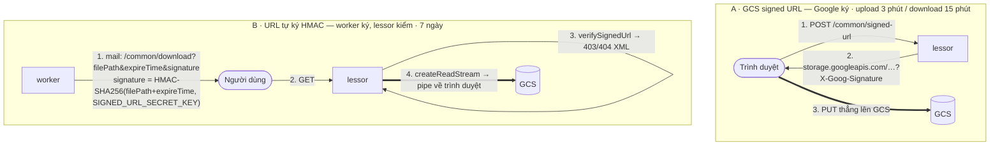
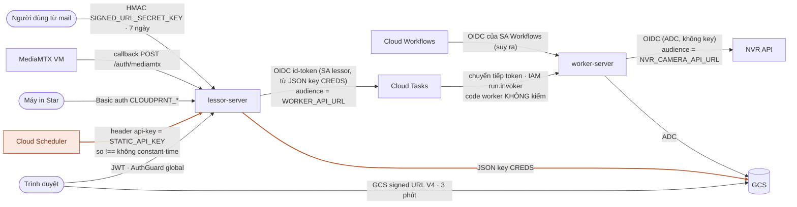

# Các dịch vụ GCP dùng trong aimo-parking — từng dịch vụ làm gì, code gọi ở đâu

> Viết cho người **mới vào dự án aimo-parking** cần hiểu "hệ thống này đứng trên những gì
> của Google Cloud", hoặc dev ecom muốn xem một stack GCP thật. Không cần biết trước GCP.
>
> Đọc từ hai repo trong workspace, bản trên máy tháng 9/2026: `aimo-parking-lessor-server`
> (**lessor**) và `aimo-parking-worker-server` (**worker**). Cấu hình hạ tầng (Terraform,
> pipeline deploy, định nghĩa queue/workflow) **không nằm trong repo**, nên phần nào tôi
> _suy ra từ code_ thay vì _đọc được_ sẽ đánh dấu **[suy ra]**.
>
> Tài liệu anh em: [aimo-message-queue-flow.md](aimo-message-queue-flow.md) đi sâu vào
> flow của Cloud Tasks / Scheduler / Workflows; doc này đứng lùi một bước và trả lời
> "mỗi dịch vụ là gì, aimo dùng nó để làm gì, cấu hình ở đâu".

---

## 1. Tổng quan một bảng

| Dịch vụ                            | Vai trò trong aimo                               | Repo dùng                        | SDK / cách gọi                                          | Env liên quan                                                 |
| ---------------------------------- | ------------------------------------------------ | -------------------------------- | ------------------------------------------------------- | ------------------------------------------------------------- |
| **Cloud Run**                      | Chạy lessor, worker (và image-server, repo khác) | cả hai                           | — (nền tảng)                                            | `APP_PORT`                                                    |
| **IAM + Service Account + OIDC**   | Xác thực giữa các service                        | cả hai                           | `google-auth-library`                                   | `CREDS` (lessor)                                              |
| **Cloud Tasks**                    | Queue việc lẻ → HTTP push sang worker            | lessor publish                   | `@anchan828/nest-cloud-run-queue-tasks-publisher` 3.4.1 | `WORKER_QUEUE`, `WORKER_API_URL`, `USE_GCLOUD_TASKS_EMULATOR` |
| **Cloud Scheduler**                | Cron gọi `/task-schedule/*`                      | lessor nhận                      | — (cấu hình GCP)                                        | `STATIC_API_KEY`                                              |
| **Cloud Workflows**                | Vòng lặp export CSV nhiều trang                  | lessor khởi động, worker phục vụ | `@google-cloud/workflows` 3.4.0                         | `WORKER_FLOW_DOWNLOAD_CSV_PATH`                               |
| **Cloud Storage (GCS)**            | File: ảnh bãi, CSV, video, dữ liệu in            | cả hai                           | `@google-cloud/storage` 7.11.2                          | `STORAGE_BUCKET_NAME`, `SIGNED_URL_SECRET_KEY`                |
| **Cloud SQL (Postgres)** [suy ra]  | Database dùng chung                              | cả hai                           | TypeORM                                                 | `DB_*`, `DB_USE_SSL`                                          |
| **Cloud Logging**                  | Log có cấu trúc, severity chuẩn GCP              | cả hai                           | `nestjs-pino` + formatter tự viết                       | `LOG_LEVEL`, `LOG_PRETTY`                                     |
| **Compute Engine VM + Bastion**    | Chạy MediaMTX (stream camera)                    | lessor gọi API                   | HTTP tới `MEDIAMTX_BASE_URL`                            | `MEDIAMTX_*`                                                  |
| **Memorystore for Redis** [suy ra] | Khoá phân tán cho thao tác giá/coupon            | lessor                           | `redis` (node-redis)                                    | `REDIS_HOST`, `REDIS_PORT`                                    |

Ngoài GCP nhưng đứng cạnh: **SendGrid** (mail), **SB Payment** (cổng thanh toán), **Star
CloudPRNT** (máy in), **NVR camera API** (dịch vụ cắt video — [suy ra] cũng là một Cloud
Run service vì được gọi bằng OIDC token). Mục 5 nói về chúng.

---

## 2. Sơ đồ hạ tầng

```
                              ┌────────────────────── GCP project ──────────────────────┐
  Trình duyệt chủ bãi ──HTTPS─►│  Cloud Run: lessor-server  ◄──cron+api-key── Cloud Scheduler
  Máy in Star ──poll──────────►│      │  │  │                                            │
                              │      │  │  └─ createExecution ──► Cloud Workflows        │
                              │      │  └──── createTask ──────► Cloud Tasks ──┐         │
                              │      │                                         │ POST+OIDC
                              │      │                                         ▼         │
                              │      │                          Cloud Run: worker-server │
                              │      │                                │   │   │          │
                              │      ├──── GCS SDK ◄──────────────────┘   │   └─OIDC─► Cloud Run: NVR API [suy ra]
                              │      │       │                            │                    │
                              │      ▼       ▼                            ▼                    ▼
                              │  Cloud SQL  Cloud Storage bucket    SendGrid / SB Payment   GCS (mp4)
                              │  (Postgres, dùng chung)                                      │
                              │                                                              │
                              │  Compute Engine VM ── MediaMTX ◄─RTSP─ NVR tại bãi (on-prem) │
                              │       ▲ SSH qua Bastion (dev / stg2 / prod)                  │
                              │  Memorystore Redis ◄── lessor (SET NX PX = khoá)             │
                              │  Cloud Logging ◄── stdout JSON của mọi Cloud Run             │
                              └──────────────────────────────────────────────────────────────┘
```

Ba điều định hình cả bức tranh:

1. **Mọi thứ NestJS chạy trên Cloud Run**, là HTTP server, scale theo request. Thứ duy nhất
   không phải Cloud Run là **MediaMTX** — nó cần giữ kết nối RTSP/WebRTC dài và mở cổng UDP,
   Cloud Run không làm được, nên nó ở trên VM.
2. **Không service nào gọi service nào bằng key tĩnh**, trừ Scheduler → lessor. Còn lại là
   OIDC token do Google ký, IAM của Cloud Run kiểm.
3. **Lessor và worker dùng chung một Postgres và một bucket.** Chúng là hai process của
   cùng một ứng dụng, tách ra để scale và cô lập lỗi, không phải hai hệ thống.

---

## 3. Từng dịch vụ

### 3.1 Cloud Run — nơi code chạy

**Là gì (cho người mới):** Bạn đưa Google một container image; Google chạy nó, cấp cho nó
một URL HTTPS, tự tăng số bản sao khi nhiều request và **giảm về 0 khi không ai gọi**. Bạn
trả tiền theo thời gian xử lý request. Đổi lại có hợp đồng phải tuân: container phải lắng
nghe cổng `$PORT`, mỗi request có timeout, và khi thu hồi instance Google chỉ báo trước
~10 giây.

**Aimo dùng cho:** lessor-server, worker-server (và image-server ở repo khác).

**Trong code:** không có gì đặc thù — đó là ưu điểm. `main.ts` của cả hai repo là một
NestJS app thường:

```ts
await app.listen(configService.appConfig.port); // APP_PORT, mặc định '3000'
```

Dockerfile của cả hai kết thúc `CMD ["node", "dist/main.js"]`. Lessor có thêm các stage cài
**Chromium + font** (puppeteer để in PDF/hoá đơn) — lý do image lessor nặng hơn worker nhiều và
hai repo không dùng chung image.

**Ràng buộc Cloud Run ảnh hưởng thiết kế:**

| Ràng buộc                         | Nó ép aimo làm gì                                                        |
| --------------------------------- | ------------------------------------------------------------------------ |
| Request timeout (mặc định 5 phút) | Việc dài (export CSV) không làm trong một request → Workflows chia trang |
| Scale về 0                        | Không thể có "vòng lặp chờ Redis" kiểu BullMQ → chọn Cloud Tasks push    |
| Không giữ được UDP / kết nối dài  | MediaMTX ra VM                                                           |
| Instance là stateless, đĩa tạm    | File phải lên GCS, không ghi đĩa local                                   |
| Nhiều instance chạy song song     | Thao tác cần "một lúc chỉ một người" phải khoá bằng Redis (3.10)         |

**Lệnh hữu ích:**

```bash
gcloud run services list
gcloud run services describe worker-server --region=asia-northeast1   # URL, SA, min/max, timeout, auth
gcloud run services logs read worker-server --region=asia-northeast1 --limit=100
```

### 3.2 IAM, Service Account và OIDC — ai được gọi ai

**Là gì:** Trên GCP, mỗi _service_ chạy dưới danh tính một **service account** (SA). Muốn SA
A gọi Cloud Run service B đang khoá (`--no-allow-unauthenticated`), A phải (1) có quyền
`roles/run.invoker` trên B, và (2) gửi kèm một **OIDC ID token** do Google ký cho SA A với
`audience` = URL của B. Cloud Run của B kiểm token **trước khi** request tới code.

**Aimo dùng ở ba chỗ:**

| Ai gọi          | Gọi ai                   | Code                                                                                                         |
| --------------- | ------------------------ | ------------------------------------------------------------------------------------------------------------ |
| lessor          | worker (qua Cloud Tasks) | `GoogleCloudAuthService.getTokenWorkerServer()` → token gắn vào `httpRequest.headers.Authorization` của task |
| worker          | NVR camera API           | `NvrCameraService.getRtspUrl/createMp4` → `createGCPIdToken(nvrCamera.apiUrl)`                               |
| Cloud Scheduler | lessor                   | **không** — dùng `api-key` tĩnh (3.4)                                                                        |

**Hai cách lấy credential, và đây là điểm khác nhau giữa hai repo:**

```ts
// lessor/src/api/google-cloud-platform/google-cloud-auth/google-cloud-auth.service.ts
const auth = new GoogleAuth({
  credentials: JSON.parse(this.configService.appConfig.gcp.creds),
});
//                             ^^^^^^^^^^^ đọc env CREDS = JSON key của service account

// worker/src/shared/services/google-cloud-auth/google-cloud-auth.service.ts
const auth = new GoogleAuth();
//           ^^^^^^^^^^^^^^^^ không tham số = Application Default Credentials (ADC):
//           trên Cloud Run tự lấy danh tính SA của service, không cần key
```

Lessor tương tự khi tạo `new Storage({ credentials: … })`, worker dùng `new Storage()`.

Cách của worker (ADC) là cách Google khuyến nghị: **không có key nào để lộ, để xoay, để hết
hạn**. Cách của lessor (JSON key trong env `CREDS`) chạy được nhưng là một bí mật dài hạn
nằm trong biến môi trường — nếu lộ, kẻ có nó đóng giả lessor được từ bất kỳ đâu. Người mới
vào dự án: đừng copy `CREDS` ra máy cá nhân, và đây là thứ nên đưa vào Secret Manager hoặc bỏ
hẳn để dùng ADC như worker.

**Kiểm tra quyền:**

```bash
gcloud run services get-iam-policy worker-server --region=asia-northeast1
# phải thấy roles/run.invoker cho SA của lessor
gcloud iam service-accounts list
```

### 3.3 Cloud Tasks — queue việc lẻ

**Là gì:** Một hàng đợi mà bạn đẩy "HTTP request cần gửi" vào, Google gửi giúp, và **tự gửi
lại** nếu đích trả lỗi. Có hẹn giờ (`scheduleTime`), giới hạn tốc độ, backoff — tất cả cấu
hình ở queue.

**Aimo dùng cho:** tải video quá khứ, gửi mail, thu tiền tự động, đồng bộ PIT PORT. Một
queue duy nhất `projects/aimo-api-worker/locations/asia-northeast1/queues/tasks`; loại việc
phân biệt bằng field `name` trong body.

**Code:** `lessor/src/shared/worker/worker.service.ts` publish; worker nhận qua
`QueueWorkerModule.register()` + `@QueueWorker({ name })`. Chi tiết từng bước ở
[aimo-message-queue-flow.md Phần C–D](aimo-message-queue-flow.md).

**Điều người mới hay nhầm:** retry bao nhiêu lần, backoff bao lâu **không đọc được từ code**.
Phải hỏi queue:

```bash
gcloud tasks queues describe tasks --location=asia-northeast1
gcloud tasks list --queue=tasks --location=asia-northeast1        # task đang chờ
```

Local: `docker-compose.yml` của lessor có `ghcr.io/aertje/cloud-tasks-emulator` ở cổng 8123;
`USE_GCLOUD_TASKS_EMULATOR=true` chuyển client sang nó (không TLS, không kiểm OIDC).

### 3.4 Cloud Scheduler — cron của hệ thống

**Là gì:** Cron chạy trên Google. Đến giờ, nó gửi một HTTP request (hoặc Pub/Sub message)
tới đích bạn khai báo. Nó **không chạy code của bạn** — code vẫn ở Cloud Run.

**Aimo dùng cho:** bốn endpoint `POST /task-schedule/*` trên lessor (áp giá đã hẹn, công khai
bãi đã hẹn, đẩy task đồng bộ, xoá barcode cũ). Không có `@Cron` trong repo.

**Xác thực:** `StaticAuthGuard` so `header['api-key'] !== STATIC_API_KEY`. Cloud Scheduler
gửi header đó theo cấu hình job. **Khoảng cách và tên job không có trong repo**; doc nội bộ
`lessor/docs/jobs/task-schedule.md` để `TODO(team)` đúng chỗ này.

```bash
gcloud scheduler jobs list --location=asia-northeast1
gcloud scheduler jobs describe <job> --location=asia-northeast1     # schedule, uri, headers
```

**Nên biết:** Cloud Scheduler hỗ trợ **OIDC natively** (`--oidc-service-account-email`).
Chuyển sang đó thì bỏ được key tĩnh và phép so chuỗi không constant-time trong guard.

### 3.5 Cloud Workflows — vòng lặp có trạng thái

**Là gì:** Dịch vụ chạy một "kịch bản" YAML gồm các bước gọi HTTP, rẽ nhánh, lặp, chờ. Trạng
thái giữa các bước do Google giữ; mỗi bước có retry riêng. Hợp với việc dài cần nhiều request
nhỏ.

**Aimo dùng cho:** export CSV báo cáo (công ty, bãi, dashboard).

**Code:** lessor khởi động —

```ts
// lessor/src/api/google-cloud-platform/google-cloud-workflow/google-cloud-workflow.service.ts
this.client = new ExecutionsClient(); // ADC
this.client
  .createExecution({
    parent: this.configService.appConfig.workerFlowConfig.path.downloadCsv, // WORKER_FLOW_DOWNLOAD_CSV_PATH
    execution: {
      argument: JSON.stringify({
        jobParam,
        searchParam,
        sendMailParam,
        afterCursor: "",
        limit,
      }),
      name: jobParam.jobId,
    },
  })
  .then(log)
  .catch(log); // không await
```

Worker phục vụ hai endpoint mà Workflow gọi: `GET /csv/export` (một trang theo cursor, ghi CSV
lên GCS) và `POST /csv/execute` (nén, ký URL, gửi mail). **Định nghĩa Workflow YAML không có
trong repo** — đọc code chỉ thấy hai đầu, không thấy vòng lặp.

```bash
gcloud workflows list --location=asia-northeast1
gcloud workflows describe <name> --location=asia-northeast1          # in ra source YAML
gcloud workflows executions list <name> --location=asia-northeast1   # lịch sử chạy, lỗi
```

### 3.6 Cloud Storage — mọi file của hệ thống

**Là gì:** Kho object (file) theo bucket. Không phải ổ đĩa: bạn `save`/`download` cả object,
truy cập qua SDK hoặc URL. Có **signed URL**: một URL tạm thời cho phép người không có tài
khoản Google tải/tải lên đúng một object.

**Aimo dùng cho:** ảnh bãi (`property/`), file tạm upload (`temp/`), dữ liệu in QR
(`printer-job/qr-one-time/`), CSV export (`job/{jobId}/`), video MP4 cắt từ NVR.

**Hai lớp mã** — hai repo có hai `GoogleCloudStorageService` gần giống nhau:

| Việc                    | Lessor                                                                                 | Worker                                                  |
| ----------------------- | -------------------------------------------------------------------------------------- | ------------------------------------------------------- |
| Khởi tạo                | `new Storage({ credentials: JSON.parse(CREDS) })`                                      | `new Storage()` (ADC)                                   |
| Upload                  | `.file(name).save(buffer, { gzip: true, contentType })` → trả `gs://bucket/key`        | như lessor                                              |
| Signed URL của GCS (V4) | `generateSignedUrl({fileName, type})`: upload hết hạn **3 phút**, download **15 phút** | `generateDownloadSignedUrlFromStoragePath`              |
| Đọc/stream              | `getFile(key).createReadStream()`                                                      | `getZipOrCsvFiles`, `getCsvFiles({prefix})`             |
| Xoá theo prefix         | —                                                                                      | `bucket.deleteFiles({ prefix, matchGlob: '**/*.csv' })` |

**Điểm đáng chú ý nhất: aimo có HAI kiểu "signed URL", đừng nhầm.**

1. **GCS signed URL** — do Google ký, trỏ thẳng `storage.googleapis.com`, trình duyệt tải trực
   tiếp từ Google. Dùng cho upload ảnh từ frontend (`POST /common/signed-url`).
2. **URL tự ký bằng HMAC** — `SignedUrlService.generateSignedUrlCsv()` (worker) tạo
   `{LESSOR_API_URL}/common/download?filePath=…&expireTime=…&signature=HMAC-SHA256(filePath+expireTime, SIGNED_URL_SECRET_KEY)`.
   Người dùng bấm → **lessor** kiểm chữ ký (`verifySignedUrl`) → lessor **stream file từ GCS
   qua chính nó** về trình duyệt. Hết hạn **7 ngày** (`EXPIRES_TIME_CSV`). Dùng cho link CSV và
   video trong mail.



Vì sao có kiểu 2? GCS signed URL V4 **tối đa 7 ngày** và URL rất dài, xấu trong mail; kiểu 2
cho URL ngắn, domain của mình, và kiểm soát được thông điệp lỗi (trả XML có ngày hết hạn).
Đổi lại lessor phải gánh băng thông tải file, và `SIGNED_URL_SECRET_KEY` phải **giống nhau
ở cả hai repo** (worker ký, lessor kiểm) — một bí mật dùng chung nữa cần quản lý.

`storagePath` trong DB lưu dạng `gs://bucket/key`; helper `getObjectKey()` tách `key` ra khi
cần. Đừng lưu URL đã ký vào DB — nó hết hạn.

```bash
gcloud storage ls gs://$STORAGE_BUCKET_NAME/job/ | head
gcloud storage buckets describe gs://$STORAGE_BUCKET_NAME     # lifecycle, uniform access, region
```

**Nên kiểm tra:** bucket có **lifecycle rule** xoá `job/` và `temp/` cũ chưa. Code worker xoá
CSV lẻ sau khi nén, nhưng file zip và `temp/` không thấy ai xoá → bucket phình theo thời gian.

### 3.7 Cloud SQL for PostgreSQL [suy ra]

**Là gì:** Postgres do Google quản lý (backup, patch, HA). Cloud Run kết nối qua IP riêng
(VPC) hoặc qua Cloud SQL connector.

**Suy ra vì:** cả hai repo cấu hình TypeORM bằng `DB_HOST/PORT/USERNAME/PASSWORD/NAME` và
`DB_USE_SSL`, không có gì gắn với Cloud SQL trong code. Có thể là Cloud SQL, có thể là Postgres
trên VM. Đọc `DB_HOST` trên môi trường thật sẽ biết (IP `10.x` = private VPC; `/cloudsql/…` =
connector Unix socket).

**Điều chắc chắn từ code:** lessor và worker **dùng chung schema** — worker có bản copy đầy đủ
`entities/` và không có `migrations/`. Migration chỉ chạy từ lessor (`yarn migration:up`).
Hệ quả: đổi schema thì **deploy lessor (migrate) trước, worker sau**, và entity ở worker phải
cập nhật tay theo lessor — không có gì kiểm việc hai bản copy lệch nhau.

Số kết nối: mỗi instance Cloud Run mở một pool. Lessor scale tới N + worker scale tới M →
`(N + M) × pool` kết nối tới Postgres. Đây là giới hạn thật sự khi tăng `max-instances`.

### 3.8 Cloud Logging — log có cấu trúc

**Là gì:** Cloud Run gom mọi thứ ghi ra stdout/stderr. Nếu mỗi dòng là một JSON có field
`severity` và `message`, Cloud Logging hiểu và cho lọc theo mức, theo field. Nếu không, tất cả
là "text, mức DEFAULT".

**Aimo làm đúng chỗ này** — `setup-logger.util.ts` (giống nhau ở hai repo):

```ts
const PinoLevelToSeverityLookup = { trace:'DEBUG', debug:'DEBUG', info:'INFO', warn:'WARNING', error:'ERROR', fatal:'CRITICAL' };

function gcpLoggingConfig() {
  return {
    messageKey: 'message',                                   // GCP đọc field này
    formatters: { level(label, number) { return { severity: PinoLevelToSeverityLookup[label], level: number }; } },
  };
}
// LOG_PRETTY=true → pino-pretty cho local; false → JSON cho GCP
redact: { paths: ['req.headers.authorization','req.body.password', …], censor: '**GDPR COMPLIANT**' }
```

Hai thứ hay cần khi debug:

- `genReqId` chỉ bật khi `APP_DEBUG=true`: đọc `x-request-id` hoặc sinh uuid, gắn vào
  `X-Request-Id` response. Không bật thì **không nối được** các dòng log của một request.
- Không có trace context (`logging.googleapis.com/trace`) → Cloud Trace không nối log với
  request span. Việc nên thêm: đọc header `X-Cloud-Trace-Context` và ghi vào log.

```bash
gcloud logging read 'resource.type="cloud_run_revision" AND resource.labels.service_name="worker-server" AND severity>=ERROR' --limit=50 --freshness=1d
```

### 3.9 Compute Engine VM + Bastion — MediaMTX

**Là gì:** Máy ảo thường. Bastion là một VM nhỏ có IP public để SSH vào, rồi từ đó SSH tiếp
vào các VM chỉ có IP riêng.

**Aimo dùng cho:** MediaMTX — engine chuyển RTSP từ NVR tại bãi thành WebRTC cho trình duyệt.
Theo `lessor/docs/diagram/live-camera-diagrams.md`: _"MediaMTX chạy trên VM riêng (không
phải Cloud Run) ở tất cả môi trường, access qua Bastion host"_, ba môi trường
`dev-aimo-bastion` / `aimo-stg2-bastion` / `prod-aimo-bastion`, deploy bằng `docker compose
up -d --build` trên VM.

**Lessor nói với nó thế nào:** REST API cổng 9997 (`MEDIAMTX_BASE_URL`, `MEDIAMTX_API_PORT`)
để tạo/xoá path stream; MediaMTX gọi ngược `POST /auth/mediamtx` của lessor để xin phép mỗi
viewer. Cổng 8889/8189 mở thẳng cho trình duyệt (WebRTC). Không liên quan tới queue, nhưng
là mảnh hạ tầng GCP duy nhất **không** tự scale và **phải** vận hành tay.

### 3.10 Memorystore for Redis [suy ra] — khoá phân tán

**Là gì:** Redis do Google quản lý, chỉ có IP riêng trong VPC.

**Suy ra vì:** lessor có `REDIS_HOST/REDIS_PORT` và `redis.service.ts`; trên Cloud Run,
Redis khả dụng gần nhất là Memorystore. Có thể là Redis trên VM — kiểm `REDIS_HOST`.

**Dùng để làm gì — không phải cache, không phải queue, mà là KHOÁ:**

```ts
// lessor/src/shared/services/redis.service.ts
async executeWithLock<T>(lockKey, fn, { lockTimeoutMs = REDIS_LOCK_DURATION.Common }) {
  const acquired = await this.client.set(lockKey, 'locked', { NX: true, PX: lockTimeoutMs });
  if (!acquired) throw new ValidateException(…);       // ai đó đang giữ khoá
  try { return await fn(); } finally { await this.client.del(lockKey); }
}
```

Gọi ở: đổi giá bãi/chỗ (`*-rental-cost-history.service.ts`), giảm giá
(`property-discount-setting.service.ts`), coupon (`coupon.service.ts`). Đây là câu trả lời cho
ràng buộc "nhiều instance Cloud Run chạy song song" ở 3.1: hai nhân viên cùng bấm đổi giá
trên hai instance khác nhau → chỉ một người vào được. Health của lessor cũng `ping()` Redis.

Worker **không** dùng Redis. Và lưu ý: `executeWithLock` xoá khoá bằng `DEL` không kiểm
chủ — nếu `fn()` chạy quá `lockTimeoutMs`, khoá hết hạn, người khác lấy, rồi `finally` của
người đầu xoá **khoá của người sau**. Với timeout mặc định 1 giây và thao tác ghi DB, khe hở
này hiếm nhưng có thật; cách chuẩn là `SET` giá trị ngẫu nhiên và xoá bằng script Lua so
giá trị.

### 3.11 Những mảnh GCP không thấy trong code

| Dịch vụ                          | Chắc chắn có? | Vì sao nghĩ vậy                                                                                                                                                              |
| -------------------------------- | ------------- | ---------------------------------------------------------------------------------------------------------------------------------------------------------------------------- |
| **Artifact Registry**            | [suy ra] có   | Cloud Run cần kéo image từ đâu đó                                                                                                                                            |
| **Cloud Build / GitHub Actions** | không rõ      | Dockerfile nhận `GH_PACKAGES_TOKEN` → build có thể chạy trên GitHub Actions và kéo package từ GitHub Packages                                                                |
| **Secret Manager**               | không thấy    | Bí mật (`CREDS`, `JWT_SECRET_KEY`, `SIGNED_URL_SECRET_KEY`, `SEND_GRID_API_KEY`) đọc từ env thường. Có thể Cloud Run map từ Secret Manager vào env — không biết được từ code |
| **VPC / Serverless VPC Access**  | [suy ra] có   | Cloud Run cần đường vào Memorystore và Postgres private                                                                                                                      |
| **Cloud Armor / Load Balancer**  | không rõ      | Lessor có `ALLOWLIST_IP_ADDRESSES` tự kiểm trong code (`company-access-control.service.ts`), gợi ý **không** dựa vào Cloud Armor                                             |
| **Cloud Monitoring alert**       | không thấy    | Không có gì trong repo nói về alert                                                                                                                                          |

Khi vào dự án, danh sách này là câu hỏi nên hỏi người đi trước ngay tuần đầu.

---

## 4. Ma trận xác thực — ai gọi ai, bằng gì

| Từ                           | Tới                             | Cơ chế                                                                     | Ở đâu                                                       |
| ---------------------------- | ------------------------------- | -------------------------------------------------------------------------- | ----------------------------------------------------------- |
| Trình duyệt                  | lessor                          | JWT (`JWT_SECRET_KEY`), `AuthGuard` global                                 | `main.ts` lessor                                            |
| Cloud Scheduler              | lessor `/task-schedule/*`       | header `api-key` = `STATIC_API_KEY`                                        | `StaticAuthGuard`                                           |
| lessor (qua Cloud Tasks)     | worker `POST /`                 | OIDC ID token (SA lessor, audience = `WORKER_API_URL`) + IAM `run.invoker` | `GoogleCloudAuthService` lessor; **code worker không kiểm** |
| Cloud Workflows              | worker `/csv/*`                 | [suy ra] OIDC của SA Workflows + IAM                                       | không thấy trong code                                       |
| worker                       | NVR API                         | OIDC ID token (ADC), audience = `NVR_CAMERA_API_URL`                       | `NvrCameraService`                                          |
| Máy in Star                  | lessor `/cloudprnt`             | Basic auth (`CLOUDPRNT_BASIC_AUTH_*`)                                      | module cloudprnt                                            |
| MediaMTX                     | lessor `/auth/mediamtx`         | callback, lessor quyết định cho viewer                                     | `authMethod: http` trong `mediamtx.yml`                     |
| Người dùng (link trong mail) | lessor `/common/download`       | HMAC-SHA256 (`SIGNED_URL_SECRET_KEY`), hết hạn 7 ngày                      | `SignedUrlService`                                          |
| Trình duyệt (upload ảnh)     | GCS trực tiếp                   | GCS signed URL V4, 3 phút                                                  | `GoogleCloudStorageService.generateSignedUrl`               |
| lessor, worker               | GCS, Workflows, Cloud Tasks API | lessor: JSON key `CREDS`; worker: ADC                                      | 3.2                                                         |

Cùng bảng đó vẽ thành đồ thị — nhãn trên mũi tên là cơ chế, nút và cạnh màu rỉ là bí mật tĩnh:



Đọc bảng này thấy ngay hai chỗ yếu hơn phần còn lại: **api-key tĩnh** (Scheduler) và **JSON
key trong env** (lessor). Cả hai đều có đường nâng cấp không cần đổi kiến trúc (OIDC cho
Scheduler, ADC cho lessor).

---

## 5. Dịch vụ ngoài GCP đứng trong cùng bức tranh

| Dịch vụ                       | Làm gì                                                        | Gọi từ                                           | Env                                                           |
| ----------------------------- | ------------------------------------------------------------- | ------------------------------------------------ | ------------------------------------------------------------- |
| **SendGrid**                  | Gửi mọi email (OTP, link CSV, link video, kết quả thanh toán) | cả hai, `MailerService` / `@sendgrid/mail`       | `SEND_GRID_API_KEY`, `MAIL_FROM*`, `ADMIN_MAIL`               |
| **SB Payment (SBペイメント)** | Cổng thanh toán, hai bước `execute` → `confirm`               | worker, `SbPaymentService`                       | `SB_PAYMENT_API_URL`, `MERCHANT_ID`, `COMMON_*`               |
| **Star CloudPRNT**            | Máy in nhiệt poll lessor mỗi ~15 giây lấy job in QR           | lessor, module cloudprnt; dữ liệu in để trên GCS | `CLOUDPRNT_BASIC_AUTH_*`                                      |
| **NVR camera API**            | Sinh RTSP URL từ NVR, cắt MP4 lên GCS                         | worker, `NvrCameraService`                       | `NVR_CAMERA_API_URL` — [suy ra] là Cloud Run vì gọi bằng OIDC |
| **PIT PORT**                  | Hệ thống bãi ngoài, đồng bộ qua task `external-property-sync` | worker (processor không có trên máy)             | —                                                             |
| **MediaMTX**                  | RTSP → WebRTC                                                 | 3.9                                              | `MEDIAMTX_*`                                                  |

---

## 6. Env → dịch vụ, tra nhanh

| Biến                                   | Repo   | Dịch vụ                     | Ghi chú                                 |
| -------------------------------------- | ------ | --------------------------- | --------------------------------------- |
| `CREDS`                                | lessor | IAM / GCS / Tasks           | JSON key SA — bí mật nặng nhất trong hệ |
| `STORAGE_BUCKET_NAME`                  | cả hai | GCS                         | phải cùng một bucket                    |
| `WORKER_QUEUE`                         | lessor | Cloud Tasks                 | đường dẫn queue đầy đủ                  |
| `WORKER_API_URL`                       | lessor | Cloud Tasks + OIDC audience | URL Cloud Run của worker                |
| `USE_GCLOUD_TASKS_EMULATOR`            | lessor | Cloud Tasks                 | `true` chỉ ở local                      |
| `WORKER_FLOW_DOWNLOAD_CSV_PATH`        | lessor | Workflows                   | `projects/…/workflows/…`                |
| `STATIC_API_KEY`                       | cả hai | Scheduler → lessor          | worker khai báo nhưng guard bị comment  |
| `SIGNED_URL_SECRET_KEY`                | cả hai | HMAC link tải               | **phải giống nhau** hai repo            |
| `LESSOR_API_URL`                       | worker | HMAC link tải               | domain trong link mail                  |
| `LESSOR_APP_URL`                       | worker | —                           | link màn hình trong mail thất bại       |
| `NVR_CAMERA_API_URL`                   | cả hai | NVR API + OIDC audience     |                                         |
| `DB_*`, `DB_USE_SSL`                   | cả hai | Cloud SQL [suy ra]          | cùng một DB                             |
| `REDIS_HOST/PORT`                      | lessor | Memorystore [suy ra]        | khoá phân tán                           |
| `MEDIAMTX_BASE_URL/API_PORT`           | lessor | VM MediaMTX                 |                                         |
| `LOG_LEVEL`, `LOG_PRETTY`, `APP_DEBUG` | cả hai | Cloud Logging               | `LOG_PRETTY=false` trên GCP             |
| `ALLOWLIST_IP_ADDRESSES`               | lessor | (thay Cloud Armor)          | kiểm trong code                         |
| `GH_PACKAGES_TOKEN`                    | cả hai | build                       | kéo package riêng khi build image       |

---

## 7. Tuần đầu vào dự án — checklist quyền và câu hỏi

**Quyền tối thiểu để đọc hiểu hệ thống** (xin `roles/viewer` trên project là đủ cho tất cả):

```bash
gcloud run services list                                  # có những service nào, URL, SA
gcloud tasks queues describe tasks --location=asia-northeast1
gcloud scheduler jobs list --location=asia-northeast1     # job nào, bao lâu, gọi đâu
gcloud workflows describe <name> --location=asia-northeast1
gcloud storage buckets describe gs://<bucket>
gcloud sql instances list                                 # xác nhận 3.7
gcloud redis instances list --region=asia-northeast1      # xác nhận 3.10
gcloud compute instances list                             # VM MediaMTX, bastion
```

**Câu hỏi nên hỏi, vì repo không trả lời được:**

1. `retryConfig` của queue `tasks` là gì? (quyết định task lỗi sống bao lâu)
2. Cloud Scheduler gọi `/task-schedule/*` mỗi bao lâu? Có job nào trùng nhau không?
3. YAML của Workflow `download-csv` ở đâu (repo nào), ai sửa?
4. Cloud Run worker có `--no-allow-unauthenticated` không? (nếu không, `POST /` mở toang)
5. Bí mật đọc từ Secret Manager hay đặt thẳng trong env của Cloud Run?
6. Bucket có lifecycle xoá `job/`, `temp/` không?
7. Alert nào đang có? (Cloud Tasks 5xx, depth; Cloud Run 5xx; Postgres connections)

---

## 8. Những điểm nên cải thiện, theo mức độ

| Mức  | Việc                                                                          | Vì sao                                                       |
| ---- | ----------------------------------------------------------------------------- | ------------------------------------------------------------ |
| Cao  | Bỏ `CREDS`, dùng ADC ở lessor như worker                                      | Xoá một bí mật dài hạn khỏi env                              |
| Cao  | Scheduler → OIDC thay `api-key`                                               | Bỏ key tĩnh, bỏ so chuỗi không constant-time                 |
| Cao  | Xác nhận worker `--no-allow-unauthenticated` và ghi vào doc                   | Lớp xác thực duy nhất của `POST /`                           |
| Vừa  | Lifecycle rule cho `job/` và `temp/`                                          | Bucket không phình                                           |
| Vừa  | Khoá Redis: giá trị ngẫu nhiên + Lua khi xoá                                  | Không xoá nhầm khoá người khác                               |
| Vừa  | Log `x-cloudtasks-taskname`, `x-cloud-trace-context`                          | Nối được log một task qua các lần retry, nối với Cloud Trace |
| Thấp | Gom `GoogleCloudStorageService` hai repo thành package chung                  | Hết lệch code                                                |
| Thấp | Đưa định nghĩa Workflow YAML và cấu hình queue/scheduler vào repo (Terraform) | Đọc code là thấy toàn bộ hệ                                  |

---

## Từ vựng nhanh

| Thuật ngữ                                 | Nghĩa một dòng                                                                    |
| ----------------------------------------- | --------------------------------------------------------------------------------- |
| **ADC** (Application Default Credentials) | Cách SDK Google tự tìm danh tính: trên Cloud Run là SA của service, không cần key |
| **Service account (SA)**                  | Tài khoản máy; mỗi Cloud Run service chạy dưới một SA                             |
| **OIDC ID token**                         | JWT do Google ký chứng minh "tôi là SA X, gọi tới audience Y"                     |
| **`roles/run.invoker`**                   | Quyền được gọi một Cloud Run service đang khoá                                    |
| **Audience**                              | URL mà token được cấp để gọi; token cho worker không dùng được cho NVR API        |
| **Signed URL**                            | URL tạm cho phép tải/tải lên một object mà không cần đăng nhập                    |
| **`gs://bucket/key`**                     | Cách viết đường dẫn object GCS; aimo lưu dạng này trong DB                        |
| **Uniform bucket-level access**           | Bucket chỉ phân quyền theo IAM, không ACL từng file — nên bật                     |
| **Memorystore**                           | Redis/Memcached do Google quản                                                    |
| **Bastion**                               | VM có IP public chỉ để SSH vào mạng riêng                                         |
| **Emulator**                              | Bản giả của dịch vụ GCP chạy local (aimo có cho Cloud Tasks)                      |
