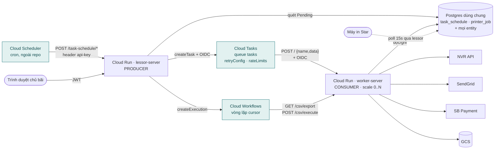
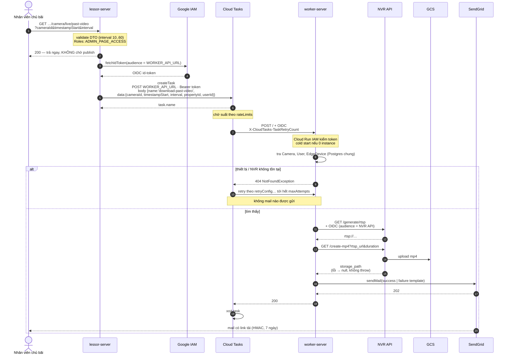
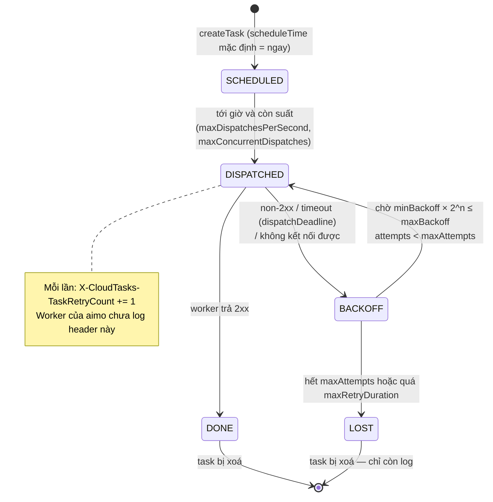
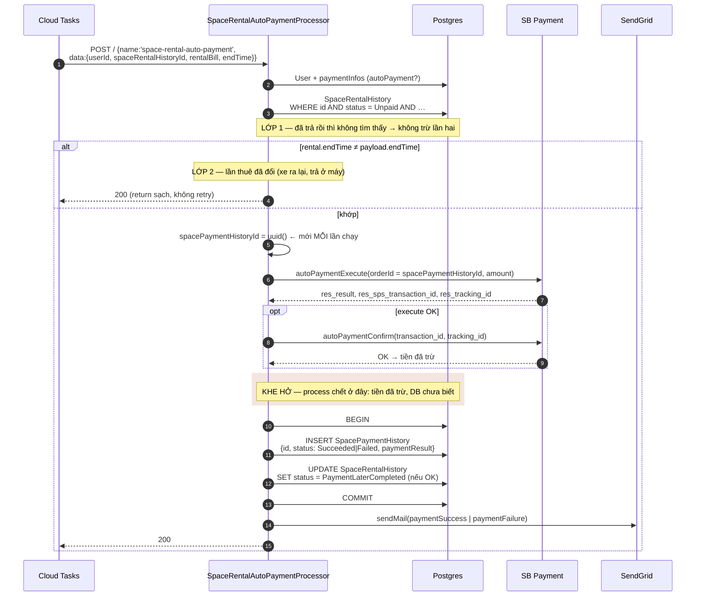
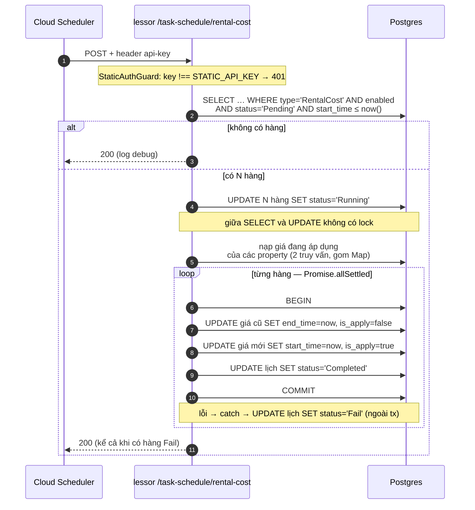
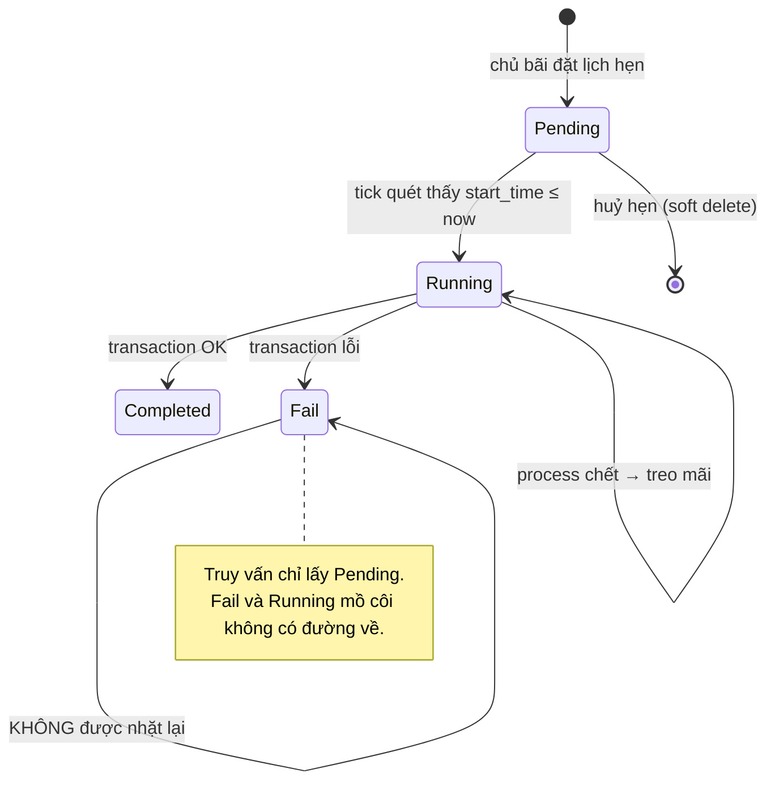
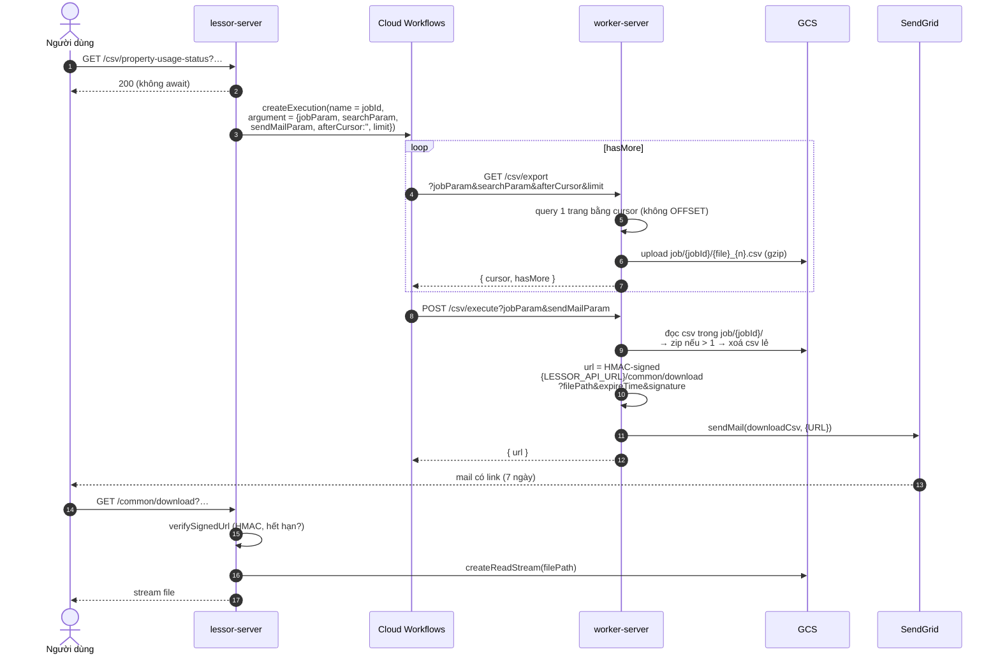
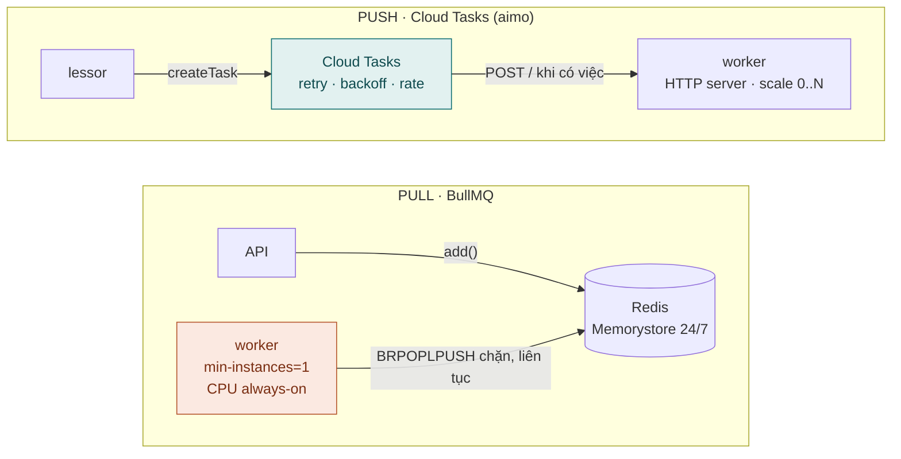

# Message queue ở aimo-parking — flow chi tiết từ cơ bản đến nâng cao

> Viết cho người **mới vào dự án aimo-parking**, hoặc người ở ecom muốn học một hệ thống
> queue đang chạy thật trên Cloud Run. Không cần biết trước Cloud Tasks hay BullMQ.
>
> Đọc từ hai repo trong workspace, bản trên máy tháng 9/2026:
> `aimo-parking-lessor-server` (API cho chủ bãi, gọi tắt **lessor**) và
> `aimo-parking-worker-server` (xử lý nền, gọi tắt **worker**). Mọi đường dẫn code là
> tương đối trong hai repo đó. Chỗ nào tôi _suy ra_ thay vì _đọc được_ sẽ ghi rõ.
>
> Tài liệu anh em ở ecom: [worker-catalog-and-implementation.md §8](worker-catalog-and-implementation.md)
> so sánh cách aimo làm với BullMQ; [queue-job-worker-scheduler-guide.md](queue-job-worker-scheduler-guide.md)
> cho lý thuyết queue nói chung.

---

## Bản đồ tài liệu

| Phần | Dành cho       | Trả lời                                                                             |
| ---- | -------------- | ----------------------------------------------------------------------------------- |
| A    | mới hoàn toàn  | Queue là gì, vì sao aimo cần, từ vựng                                               |
| B    | mới vào dự án  | Toàn hệ thống có những mảnh gì, mảnh nào nói với mảnh nào                           |
| C    | mọi người      | **Flow #1 — tải video quá khứ**, từng bước, từng dòng code, từng HTTP request       |
| D    | muốn hiểu sâu  | Bên trong Cloud Tasks và thư viện `@anchan828/*`                                    |
| E    | mọi người      | **Flow #2 — thu tiền tự động**: task có tiền, phải chống chạy đôi                   |
| F    | mọi người      | **Flow #3 — việc theo lịch**: Cloud Scheduler và bảng `task_schedule`               |
| G    | mọi người      | **Flow #4 — export CSV lớn**: Google Cloud Workflows                                |
| H    | người vận hành | Env, chạy local với emulator, deploy, IAM, log, giám sát                            |
| I    | nâng cao       | At-least-once, idempotency từng flow, điểm yếu đã tìm thấy, checklist thêm task mới |

---

# PHẦN A — Cơ bản

## A1. Vấn đề mà queue giải quyết, kể bằng chuyện của aimo

**Chuyện 1 — tải video quá khứ.** Nhân viên chủ bãi bấm "tải video 30 giây lúc 15:00 hôm
qua của camera số 3". Để có file đó, hệ thống phải: tìm thiết bị edge quản lý camera, hỏi
NVR lấy địa chỉ RTSP, gọi một dịch vụ khác cắt RTSP thành MP4 rồi đẩy lên Cloud Storage, ký
URL tải, gửi mail. Mất **vài chục giây tới vài phút**. Nếu làm hết trong request HTTP thì
trình duyệt treo, load balancer cắt kết nối ở 60 giây, và nếu NVR lỗi giữa chừng thì
người dùng chỉ thấy một lỗi 500 vô nghĩa.

**Chuyện 2 — thu tiền tự động.** Xe rời bãi, hệ thống camera ghi nhận giờ ra, và phải trừ
tiền thẻ tín dụng đã đăng ký. Gọi cổng thanh toán SB Payment là hai bước `execute` rồi
`confirm`, mỗi bước có thể chậm hoặc lỗi mạng. Không thể để việc thu tiền phụ thuộc vào
một request web sống hay chết — và **tuyệt đối không được trừ hai lần**.

**Chuyện 3 — export CSV.** Báo cáo sử dụng của một công ty có thể vài trăm nghìn dòng.
Không request nào chứa nổi; phải chia trang, ghi từng trang ra file, nén, gửi link.

Điểm chung: **việc cần làm ≠ việc cần trả lời ngay**. Queue là chỗ để API ghi lại "có việc
này cần làm", trả lời người dùng ngay, và để một tiến trình khác làm việc đó sau — có
retry khi lỗi.

## A2. Từ vựng — tên chung và tên trong aimo

| Tên chung                | Nghĩa                                    | Trong aimo nó là                                                                         |
| ------------------------ | ---------------------------------------- | ---------------------------------------------------------------------------------------- |
| **Producer**             | bên tạo ra việc                          | `lessor` (và các server khác của hệ)                                                     |
| **Broker / queue**       | chỗ giữ việc chờ                         | **Cloud Tasks** queue `projects/aimo-api-worker/locations/asia-northeast1/queues/tasks`  |
| **Consumer / worker**    | bên làm việc                             | `worker` — một Cloud Run service                                                         |
| **Task / job / message** | một việc                                 | một HTTP POST mà Cloud Tasks sẽ gửi tới worker, body `{ name, data }`                    |
| **Task name / job name** | loại việc                                | `'download-past-video'`, `'auto-send-mail'`, `'space-rental-auto-payment'`…              |
| **Payload / data**       | dữ liệu đi kèm                           | object JSON (`{ cameraId, timestampStart, interval, propertyId, userId }`)               |
| **Push** vs **Pull**     | broker gọi worker, hay worker hỏi broker | aimo là **push**: Cloud Tasks gọi HTTP vào worker                                        |
| **Ack**                  | worker báo "xong"                        | trả HTTP **2xx**                                                                         |
| **Retry**                | làm lại khi lỗi                          | worker trả **non-2xx** (hoặc timeout) → Cloud Tasks gửi lại theo `retryConfig` của queue |
| **Backoff**              | khoảng chờ giữa hai lần retry, tăng dần  | cấu hình trong queue trên GCP, **không nằm trong code**                                  |
| **At-least-once**        | một việc có thể được làm ≥ 1 lần         | đúng với Cloud Tasks; nên worker phải **idempotent**                                     |
| **Idempotent**           | làm hai lần cho cùng kết quả như một lần | ví dụ: auto-payment kiểm `endTime` trước khi trừ tiền (Phần E)                           |
| **Scheduler / cron**     | kích hoạt theo giờ                       | **Cloud Scheduler** gọi HTTP vào lessor (Phần F)                                         |
| **Dead letter**          | việc hỏng hẳn, hết retry                 | Cloud Tasks **không có DLQ** — task hết `maxAttempts` thì bị xoá, chỉ còn log            |

## A3. Push và pull — hình dung bằng một quán ăn

- **Pull (BullMQ, RabbitMQ consumer…)**: đầu bếp đứng cạnh bảng order, **tự** rút phiếu ra
  làm. Bếp phải luôn có người đứng đó, dù không có khách.
- **Push (Cloud Tasks, Pub/Sub push…)**: có người chạy bàn **mang phiếu vào bếp** và chờ
  bếp nói "xong". Không có khách thì bếp về nhà — không tốn lương.

Aimo chọn push. Hệ quả dễ thấy nhất: worker của aimo **chỉ là một HTTP server bình thường**,
scale theo số request, rỗng thì về 0 instance. Không có vòng lặp nào "ngồi chờ Redis".

---

# PHẦN B — Bức tranh toàn hệ thống

## B1. Các mảnh và ai nói với ai

```
 ┌─────────────────────────────── GCP project ────────────────────────────────────┐
 │                                                                                │
 │   Cloud Scheduler ──(cron, header api-key)──┐                                  │
 │                                             ▼                                  │
 │   ┌───────────────────────────────────────────────────┐                        │
 │   │ Cloud Run: lessor-server                          │                        │
 │   │  • API cho chủ bãi (JWT)                          │                        │
 │   │  • POST /task-schedule/*  (StaticAuthGuard)       │                        │
 │   │  • WorkerService.publish()  ──┐                   │                        │
 │   │  • GoogleCloudWorkflowService ─┼────────────┐     │                        │
 │   └────────────────────────────────┼────────────┼─────┘                        │
 │                                    │ createTask │ createExecution              │
 │                                    ▼            ▼                              │
 │   ┌────────────────────────┐  ┌──────────────────────┐                         │
 │   │ Cloud Tasks queue      │  │ Cloud Workflows      │                         │
 │   │ …/queues/tasks         │  │ download-csv         │                         │
 │   │ retryConfig, rateLimits│  │ (vòng lặp cursor)    │                         │
 │   └───────────┬────────────┘  └──────────┬───────────┘                         │
 │               │ HTTP POST /  + OIDC      │ HTTP GET /csv/export, POST /csv/execute
 │               ▼                          ▼                                     │
 │   ┌───────────────────────────────────────────────────┐                        │
 │   │ Cloud Run: worker-server  (--no-allow-unauthenticated)                     │
 │   │  • QueueWorkerModule  → POST /                    │                        │
 │   │      @QueueWorker('download-past-video')          │──► NVR API (OIDC) ──► GCS
 │   │      @QueueWorker('auto-send-mail')               │──► SendGrid            │
 │   │      @QueueWorker('space-rental-auto-payment')    │──► SB Payment          │
 │   │      @QueueWorker('property-rental-auto-payment') │                        │
 │   │      @QueueWorker('health')                       │                        │
 │   │  • CsvController  GET /csv/export, POST /csv/execute ─► GCS, SendGrid      │
 │   │  • HealthController GET /health (terminus → DB)   │                        │
 │   └───────────────────────┬───────────────────────────┘                        │
 │                           ▼                                                    │
 │                    Cloud SQL (Postgres) — DÙNG CHUNG với lessor                 │
 └────────────────────────────────────────────────────────────────────────────────┘
```

Cùng bức tranh, vẽ theo hướng đi của dữ liệu:



Ba điều cần nhớ ngay:

1. **Lessor và worker dùng chung một database.** Worker có bản sao đầy đủ các entity TypeORM
   (`worker/src/database/entities/*`) và đọc/ghi thẳng Postgres. Vì thế payload task chỉ cần
   mang id, worker tự tra phần còn lại.
2. **Cloud Tasks là thứ duy nhất đứng giữa lessor và worker** cho việc lẻ. Không có Redis
   trong đường này (Redis trong docker-compose của lessor phục vụ việc khác).
3. **Không có `@Cron` ở đâu cả.** Lịch nằm ở Cloud Scheduler, ngoài repo.

## B2. Ai publish task nào

| Task name                      | Ai publish                                                                           | Processor ở worker                                 |
| ------------------------------ | ------------------------------------------------------------------------------------ | -------------------------------------------------- |
| `download-past-video`          | lessor `WorkerService.downloadPastVideo()`                                           | `DownloadPastVideoProcessor`                       |
| `external-property-sync`       | lessor `WorkerService.enqueueExternalPropertySync()`                                 | ⚠ **không có** trong bản worker trên máy — xem I3 |
| `auto-send-mail`               | **không thấy trong lessor** → suy ra: server khác của hệ (lessee / image-server)     | `SendMailProcessor`                                |
| `space-rental-auto-payment`    | như trên (doc của lessor nhắc `aimo-parking-image-server` có `auto-payment-trigger`) | `SpaceRentalAutoPaymentProcessor`                  |
| `property-rental-auto-payment` | như trên                                                                             | `PropertyRentalAutoPaymentProcessor`               |
| `health`                       | tay / smoke test                                                                     | `HealthProcessor` — chỉ log                        |

Một queue, nhiều loại task, phân loại bằng field `name` trong body. Đây là quyết định thiết
kế quan trọng: **queue là đường ống, `name` là địa chỉ**.

---

# PHẦN C — Flow #1: tải video quá khứ, từng bước

Đây là flow nên đọc kỹ nhất vì nó đi qua **mọi** lớp: controller → service → publisher →
Cloud Tasks → worker → dịch vụ ngoài → mail.

## C1. Bước 0 — người dùng bấm nút

Frontend gọi:

```
GET /property/{propertyId}/camera/live/past-video
    ?cameraId=0001&timestampStart=2024-06-14T15:00:00.000Z&interval=30
Authorization: Bearer <JWT của nhân viên>
```

`lessor/src/api/camera/camera.controller.ts`:

```ts
@Get('live/past-video')
@Roles(PERMISSION.ADMIN_PAGE_ACCESS_ROLES)          // chỉ vai trò vào được trang quản trị
async downloadPastVideo(
  @CurrentUser() currentUser: AuthDto,
  @Param('propertyId') propertyId: string,
  @Query() query: DownloadPastVideoRequestDto,     // cameraId, timestampStart (Date), interval 10..60
): Promise<void> {
  return await this.cameraService.downloadPastVideo(currentUser, propertyId, query);
}
```

Validation nằm ở DTO: `interval` bị kẹp `@Min(10) @Max(60)` giây, `timestampStart` ép kiểu
`Date`. **Đây là chốt chặn đầu tiên** — payload xấu bị chặn trước khi vào queue, worker
không phải retry một việc vô nghĩa.

## C2. Bước 1 — service gọi publisher, không chờ

`lessor/src/api/camera/camera.service.ts`:

```ts
async downloadPastVideo({ userId }: AuthDto, propertyId: string, dto: DownloadPastVideoRequestDto): Promise<void> {
  this.workerService.downloadPastVideo({ ...dto, propertyId, userId });   // ← KHÔNG await
}
```

Hai chi tiết đáng chú ý:

- **Không `await`**. Request trả `200` gần như ngay lập tức, kể cả khi publish chưa xong.
  Nhanh — nhưng nếu publish lỗi, người dùng không bao giờ biết (xem I2).
- Payload gồm `userId` để worker biết gửi mail cho ai, `propertyId` để kiểm camera đúng
  bãi. Không có gì nhạy cảm — đúng, vì payload sẽ nằm trong Cloud Tasks và hiện trong Console.

## C3. Bước 2 — `WorkerService` xin token rồi publish

`lessor/src/shared/worker/worker.service.ts`:

```ts
async downloadPastVideo(data: any) {
  try {
    return await this.tasksPublisherService.publish(
      { data, name: TASK_NAME.DOWNLOAD_PAST_VIDEO },   // 'download-past-video'
      await this.getOptions(),
    );
  } catch (error) {
    this.logger.error(error);                           // nuốt lỗi — xem I2
  }
}

private async getOptions(executeTime?: Date): Promise<PublishOptions> {
  const token = await this.googleCloudAuthService.getTokenWorkerServer();
  return {
    httpRequest: { headers: { Authorization: `Bearer ${token}` } },
    scheduleTime: executeTime ? { seconds: executeTime.getTime() / 1000 } : null,
  };
}
```

### Token đó là gì?

`lessor/src/api/google-cloud-platform/google-cloud-auth/google-cloud-auth.service.ts`:

```ts
createGCPIdToken = async (targetAudience: string): Promise<string> => {
  const auth = new GoogleAuth({ credentials: JSON.parse(this.configService.appConfig.gcp.creds) });
  const client = await auth.getIdTokenClient(targetAudience);
  return await client.idTokenProvider.fetchIdToken(targetAudience);
};

async getTokenWorkerServer() {
  return this.createGCPIdToken(this.configService.appConfig.workerApiUrl);  // audience = URL worker
}
```

Đây là **OIDC ID token** do Google ký, cho service account (đọc từ env `CREDS`), với
`audience` = URL của worker. Khi Cloud Tasks POST sang worker mang header này, **Cloud Run
IAM của worker** kiểm: token hợp lệ? audience đúng? service account có quyền
`roles/run.invoker`? Sai một trong ba → Cloud Run trả `401/403` **trước khi** request tới
code NestJS. Đó là lý do `main.ts` của worker comment dòng `useGlobalGuards(StaticAuthGuard)`
— code không cần tự kiểm nữa.

> Lưu ý cho người mới: mô hình này chỉ an toàn khi worker deploy với
> `--no-allow-unauthenticated`. Chạy local hoặc lỡ tay đổi cờ là endpoint `POST /` mở toang.

### `scheduleTime` — hẹn giờ ngay trong lệnh publish

`downloadPastVideo` truyền `undefined` nên task chạy ngay. Nhưng API có sẵn: truyền `Date`
là Cloud Tasks **giữ task tới đúng giờ đó** rồi mới POST. Không cần worker sống để "promote"
như delayed job của BullMQ.

## C4. Bước 3 — publisher biến `{name, data}` thành một Cloud Task

Thư viện `@anchan828/nest-cloud-run-queue-tasks-publisher` được đăng ký ở
`lessor/src/utilities/modules-set.util.ts`:

```ts
TasksPublisherModule.registerAsync({
  imports: [SharedModule],
  inject: [AppConfigService],
  useFactory: (config: AppConfigService) => config.taskPublisherConfig,
});
```

với cấu hình từ `app-config.service.ts`:

```ts
get taskPublisherConfig(): TasksPublisherModuleOptions {
  const config = {
    publishConfig: { httpRequest: { url: this.getString('WORKER_API_URL') } },  // đích POST
    queue: this.getString('WORKER_QUEUE'),   // projects/…/locations/asia-northeast1/queues/tasks
  };
  if (this.getBoolean('USE_GCLOUD_TASKS_EMULATOR')) {
    config.clientConfig = { apiEndpoint: 'localhost', port: 8123, sslCreds: credentials.createInsecure() };
  }
  return config;
}
```

Bên trong, `publish()` gọi `CloudTasksClient.createTask()` với một task có hình dạng
(theo tài liệu thư viện — không đọc được source vì `node_modules` chưa cài trên máy):

```jsonc
{
  "parent": "projects/aimo-api-worker/locations/asia-northeast1/queues/tasks",
  "task": {
    "httpRequest": {
      "httpMethod": "POST",
      "url": "https://worker-xxxx.a.run.app", // WORKER_API_URL, đường dẫn mặc định "/"
      "headers": {
        "Authorization": "Bearer eyJ…",
        "Content-Type": "application/json",
      },
      "body": "<base64 của JSON.stringify({ name: 'download-past-video', data: {…} })>",
    },
    "scheduleTime": null,
  },
}
```

Cloud Tasks trả về ngay một `task.name` dạng
`projects/…/queues/tasks/tasks/1234567890`. **Từ giây này việc đã "được ghi"**: lessor có
thể chết, restart, deploy — task vẫn nằm trong Cloud Tasks.

## C5. Bước 4 — Cloud Tasks gửi task sang worker

Cloud Tasks nhìn `rateLimits` của queue (`maxDispatchesPerSecond`,
`maxConcurrentDispatches`) rồi POST:

```
POST / HTTP/1.1
Host: worker-xxxx.a.run.app
Authorization: Bearer eyJ…                      ← OIDC từ bước 2
Content-Type: application/json
X-CloudTasks-QueueName: tasks
X-CloudTasks-TaskName: 1234567890
X-CloudTasks-TaskRetryCount: 0                  ← lần thử thứ mấy
X-CloudTasks-TaskExecutionCount: 0
X-CloudTasks-TaskETA: 1718377200.123

{"name":"download-past-video","data":{"cameraId":"0001","timestampStart":"2024-06-14T15:00:00.000Z","interval":30,"propertyId":"…","userId":"…"}}
```

Cloud Run của worker: kiểm IAM → nếu instance = 0 thì **khởi động một instance** (cold
start vài giây) → chuyển request vào container.

## C6. Bước 5 — thư viện worker định tuyến theo `name`

`worker/src/api/worker/worker.module.ts` import `QueueWorkerModule.register()`. Module này
gắn một controller nhận `POST /`, giải mã body, tìm class có `@QueueWorker({ name })`
khớp, gọi method có `@QueueWorkerProcess()`.

```ts
@QueueWorker({ name: 'download-past-video' })
export class DownloadPastVideoProcessor {
  @QueueWorkerProcess()
  public async process(dto: DownloadPastVideoRequestDto, _raw: QueueWorkerRawMessage): Promise<void> { … }
}
```

Tham số thứ hai `_raw` là message gốc (headers, body thô) — dùng khi cần
`X-CloudTasks-TaskRetryCount` để hành xử khác ở lần retry. Aimo hiện không dùng.

## C7. Bước 6 — processor làm việc thật

`worker/src/api/worker/processor/download-past-camera/download-past-video.processor.ts`,
tóm theo thứ tự:

```
1. Promise.all([camera = Camera.findOne({id: cameraId, property: {id: propertyId}}),
                user   = User.findOne({id: userId}, relations: companyOfficer)])
2. parseAiCameraId(camera.aiCameraId)  → { serialNumber, cameraId }   // "SN123_CH01"
3. edgeDevice = EdgeDevice.findOneBy({ serialNumber })
     • không có → throw NotFoundException('[E0005] Device … not found')
     • không có edgeDevice.nvr → throw NotFoundException
4. nvrChannel = 'CH01' → '1'
5. rtspAddress = nvrCameraService.getRtspUrl(nvr, user, pass, channel, timestampStart, interval)
6. storagePath = rtspAddress ? nvrCameraService.createMp4(rtspAddress, interval) : null
     • createMp4 gọi GET {NVR_CAMERA_API_URL}/create-mp4 kèm OIDC token (audience = NVR API URL)
     • lỗi → log và return null  (KHÔNG throw)
7. emailTemplate = storagePath ? downloadPastVideoSuccess : downloadPastVideoFailure
   emailData     = storagePath ? { urlPastVideoDownload: signedUrl(GCS key) }
                               : { urlDomainPastVideo: `${lessorAppUrl}/property/${propertyId}/live-video/past` }
8. mailerService.sendMail(user.email, template, data, fromLessor)      // SendGrid
```

Để ý **hai kiểu lỗi được xử lý khác nhau**, và đó là cố ý:

| Lỗi                                   | Xử lý                                                     | Hệ quả với Cloud Tasks                                                                                                                                                            |
| ------------------------------------- | --------------------------------------------------------- | --------------------------------------------------------------------------------------------------------------------------------------------------------------------------------- |
| Thiết bị / NVR không tồn tại (bước 3) | `throw NotFoundException` → HTTP 404                      | non-2xx → **retry** theo queue — dù retry cũng vô ích vì dữ liệu không tự mọc ra. Hết `maxAttempts` thì task bị xoá, **không mail nào được gửi**                                  |
| Cắt MP4 lỗi (bước 6)                  | `return null`, đi tiếp                                    | worker gửi **mail báo thất bại**, trả 200 → task xong, không retry                                                                                                                |
| SendGrid lỗi (bước 8)                 | `MailerService.sendMail` **bắt và chỉ log** — không throw | trả 200 → task xong, **không retry**. Video đã cắt, mail mất im — chỉ còn một dòng `warn` trong log (xem [aimo-worker-server-internals.md §5.2](aimo-worker-server-internals.md)) |

Doc nội bộ của lessor (`docs/api/camera.md`) cũng ghi: _"một phần lỗi (thiết bị hay NVR
không tìm thấy) thậm chí không có mail"_. Đọc Phần I để biết nên sửa thế nào.

## C8. Bước 7 — ack và kết thúc

`process()` return → thư viện trả `HTTP 200` (hoặc 204) → Cloud Tasks đánh dấu task hoàn
thành và **xoá** nó. Người dùng nhận mail có link tải (URL ký, có hạn).

Tổng thời gian từ bấm nút tới mail: cold start (0–5s) + tra DB (ms) + NVR + cắt video
(vài chục giây) + SendGrid (1–2s). Người dùng chỉ chờ **bước 0–2**: vài chục mili-giây.

## C9. Cùng flow, vẽ theo thời gian

```
Người dùng   lessor              Cloud Tasks            worker               NVR API   SendGrid
   │ GET past-video │                 │                    │                    │          │
   │───────────────►│ validate DTO    │                    │                    │          │
   │                │ fetch OIDC      │                    │                    │          │
   │                │ createTask ────►│ lưu task           │                    │          │
   │◄── 200 ────────│ (không await)   │                    │                    │          │
   │                │                 │ POST / +OIDC ─────►│ IAM ok, cold start │          │
   │                │                 │                    │ tra camera,user,edge          │
   │                │                 │                    │ getRtspUrl ───────►│          │
   │                │                 │                    │ createMp4 ────────►│ → GCS    │
   │                │                 │                    │◄── storage_path ───│          │
   │                │                 │                    │ sendMail ─────────────────────►│
   │                │                 │◄── 200 ────────────│                    │          │
   │                │                 │ xoá task           │                    │          │
   │◄═══════════════════ mail có link tải ═══════════════════════════════════════════════│
```

Bản sequence đầy đủ, kèm hai nhánh lỗi:



---

# PHẦN D — Bên trong Cloud Tasks và thư viện

## D1. Vòng đời một task

```
createTask ──► SCHEDULED (chờ tới scheduleTime, mặc định = ngay)
                  │
                  ▼  queue còn "suất" theo rateLimits
              DISPATCHED ──► worker trả 2xx ──► DELETED (xong)
                  │
                  └─► worker trả non-2xx / timeout / không kết nối được
                        │
                        ▼  attempt < maxAttempts ?
                     chờ backoff (minBackoff → ×2 → … ≤ maxBackoff)
                        │
                        └─► DISPATCHED lại (X-CloudTasks-TaskRetryCount += 1)
                              … hết maxAttempts hoặc quá maxRetryDuration ──► DELETED (mất)
```



Những con số này **sống trong cấu hình queue trên GCP**, không trong repo:

```bash
gcloud tasks queues describe tasks --location=asia-northeast1
# rateLimits:  maxDispatchesPerSecond, maxConcurrentDispatches, maxBurstSize
# retryConfig: maxAttempts, maxRetryDuration, minBackoff, maxBackoff, maxDoublings
```

Hệ quả cho người viết code: **muốn "retry 5 lần, backoff 10s" thì không sửa code — sửa
queue**. Và ngược lại: đọc code không thể biết task sẽ retry bao nhiêu lần. Khi vào dự án,
việc đầu tiên nên làm là `describe` queue và ghi lại số liệu đó vào doc.

## D2. `dispatchDeadline` và request timeout

Cloud Tasks chờ worker trả lời tối đa `dispatchDeadline` (mặc định **10 phút**, tối đa 30).
Cloud Run cũng có request timeout riêng (mặc định **5 phút**, tối đa 60). Task chạy quá
**cái nhỏ hơn** trong hai số đó bị coi là fail → retry, dù worker vẫn đang chạy nốt phía
sau. Với `download-past-video`, cắt video 60 giây cộng NVR chậm vẫn xa hai mốc này; với
export CSV thì không — đó là lý do có Workflows (Phần G).

## D3. Khử trùng theo tên task

Khi `createTask` truyền `task.name` tường minh, Cloud Tasks **từ chối tên trùng** trong
khoảng ~1 giờ sau khi task đó bị xoá (tăng tới 9 ngày với task đã chạy). Đây là cách "chống
double-submit" tương đương `jobId` của BullMQ. Aimo **không** đặt tên task, nên bấm nút hai
lần là hai video, hai mail — đúng như `docs/api/camera.md` của họ ghi _"押した回数だけ… メールが届く"_.

## D4. Thư viện `@anchan828/nest-cloud-run-queue-*` làm gì, không làm gì

| Việc                                                           | Publisher  | Worker                      |
| -------------------------------------------------------------- | ---------- | --------------------------- |
| Mã hoá `{name, data}` → base64 body                            | ✅         |                             |
| Gọi `CloudTasksClient.createTask`                              | ✅         |                             |
| Nhận `POST /`, giải mã body (hỗ trợ cả định dạng Pub/Sub push) |            | ✅                          |
| Tìm `@QueueWorker({name})` khớp, gọi `@QueueWorkerProcess()`   |            | ✅                          |
| Ném lỗi → trả 5xx để Cloud Tasks retry                         |            | ✅ (mặc định)               |
| Retry / backoff / rate limit                                   | ❌ (queue) | ❌ (queue)                  |
| Xác thực caller                                                | ❌ (IAM)   | ❌ (IAM)                    |
| Idempotency                                                    | ❌         | ❌ — **việc của processor** |

Điểm cần xác nhận với phiên bản đang lock (`3.4.1` publisher, `^3.2.4` worker): hành vi khi
`name` không có processor nào khớp — thư viện log cảnh báo và trả 2xx hay ném lỗi? Nếu ném →
task `external-property-sync` (I3) sẽ retry tới hết `maxAttempts`; nếu trả 2xx → mất im.
Cả hai đều tệ, chỉ khác cách tệ.

---

# PHẦN E — Flow #2: thu tiền tự động — khi task có tiền

`SpaceRentalAutoPaymentProcessor` (`worker/src/api/worker/processor/space-rental-auto-payment.processor.ts`)
là ví dụ **task có hậu quả tài chính**, nên đáng học cách nó phòng thủ.

## E1. Payload

```ts
export class AutoPaymentRequestDto {
  userId!: string;
  spaceRentalHistoryId!: string;
  rentalBill!: number; // số tiền — tính SẴN bởi producer
  endTime!: string; // giờ xe ra — dùng làm "dấu vân tay" của lần thuê
}
```

Producer không nằm trong lessor (B2). Điều quan trọng là payload mang **`endTime`** — không
phải để hiển thị, mà để chống chạy đôi.

## E2. Các bước

```
1. user = User.findOne({id}, relations: paymentInfos, customer)
     • !user || !paymentInfos[0].autoPayment → throw ValidateException   (→ retry, vô ích)
2. rental = SpaceRentalHistory.findOne({ id, status: Unpaid, priceType: CoinParking,
                                         isUserPayment: true, property.isPaymentMachineOnly: false })
3. ★ if (!isEqual(rental.endTime, new Date(endTime))) { log; return; }   // ← chốt idempotency
4. spacePaymentHistoryId = uuid()                                          // orderId gửi cổng thanh toán
5. execute  = sbPayment.autoPaymentExecute(merchant…, spacePaymentHistoryId, rentalCode, bill)
6. if execute.res_result === OK:
       confirm = sbPayment.autoPaymentConfirm(…, execute.res_sps_transaction_id, execute.res_tracking_id)
       success = confirm.res_result === OK
7. transaction:
       save SpacePaymentHistory { id: spacePaymentHistoryId, status: success ? Succeeded : Failed, paymentResult }
       if success: update SpaceRentalHistory { status: PaymentLaterCompleted, paymentTime, paymentBy }
8. sendMail(success ? paymentSuccess : paymentFailure)
```

Vẽ ra, với khe hở tô màu:



## E3. Vì sao bước 3 là chốt

Giả sử task chạy lần 1: trừ tiền xong (bước 5–6), ghi DB xong (bước 7), rồi vì lý do nào
đó Cloud Tasks vẫn POST lại (chưa nhận được 200 vì mạng/timeout, hoặc producer publish trùng).
Lưu ý SendGrid lỗi ở bước 8 **không** gây retry — `MailerService` nuốt lỗi. Lần 2:

- bước 2: `status: Unpaid` **không còn khớp** (đã thành `PaymentLaterCompleted`) → `findOne`
  trả `null` → code phía sau ném lỗi khi truy cập `rental.endTime`… thực ra ném
  `TypeError`, cũng là non-2xx → retry tiếp tới hết `maxAttempts`. Tiền **không** bị trừ
  lần hai — nhờ điều kiện `status: Unpaid` trong truy vấn.
- Trường hợp khác: người dùng tự trả tiền ở máy trong lúc task chờ, hoặc xe ra lần nữa và
  `endTime` đổi → bước 3 bắt được, `return` sạch → 200 → task xong.

Hai lớp: **điều kiện trạng thái trong truy vấn** (không trừ hai lần) và **so `endTime`**
(không trừ cho một lần thuê đã bị thay đổi). Đây chính là "idempotency lớp 2" trong
[worker-catalog-and-implementation.md §9](worker-catalog-and-implementation.md).

Chỗ còn hở: nếu chết **giữa bước 6 và 7** — cổng thanh toán đã confirm nhưng DB chưa ghi —
retry sẽ thấy `Unpaid`, `endTime` khớp, và **execute lần hai**. `spacePaymentHistoryId` là
uuid mới mỗi lần nên cổng thanh toán không nhận ra đó là trùng. Cách vá chuẩn: sinh
`spacePaymentHistoryId` **xác định** từ `spaceRentalHistoryId + endTime` (hoặc ghi một hàng
`PaymentIntent` trước khi gọi cổng) để cổng thanh toán tự khử trùng theo `orderId`.

---

# PHẦN F — Flow #3: việc theo lịch — Cloud Scheduler và bảng `task_schedule`

## F1. Không có cron trong code

Lessor không dùng `@nestjs/schedule`. Thay vào đó có 4 endpoint "chỉ để máy gọi":

```
POST /task-schedule/rental-cost                  áp giá đã hẹn
POST /task-schedule/public-property              công khai bãi đã hẹn
POST /task-schedule/external-property-sync       đẩy 1 task sang worker (đồng bộ PIT PORT)
POST /task-schedule/payment-barcode-hard-delete  xoá barcode > 1 năm, theo lô
```

Tất cả đứng sau `StaticAuthGuard`: header `api-key` phải bằng `STATIC_API_KEY`. **Ai gọi,
bao lâu một lần — không có trong repo**; nó là cấu hình Cloud Scheduler trên GCP. Doc nội bộ
của lessor cũng để một `TODO(team)` đúng chỗ này.

## F2. Bảng `task_schedule` — "lịch hẹn là dữ liệu"

Thay vì mỗi tính năng có cột `applyAt` riêng và một cron riêng quét nó, aimo gom mọi lời
hẹn vào một bảng:

```
task_schedule
  id                uuid
  type              enum  RentalCost | PublicProperty
  start_time        ts    hiệu lực từ
  end_time          ts?   hết hạn hẹn (null = không)
  status            enum  Pending → Running → Completed | Fail
  enabled           bool
  data              jsonb { propertyId, spaceRentalCostId? | propertyRentalCostId? }
  last_triggered_at ts?
  deleted_at        ts?   (soft delete = huỷ hẹn)
```

Khi chủ bãi đặt "giá mới từ 1/10", API ghi một hàng `RentalCost` với `start_time = 1/10`.
Người dùng thấy, sửa, huỷ (soft delete) được lời hẹn của mình vì nó là một bản ghi có id.

## F3. Một lần Scheduler gọi `POST /task-schedule/rental-cost`

`lessor/src/api/task-schedule/task-schedule.service.ts#scheduleRentalCost`:

```
1. rows = SELECT * FROM task_schedule
          WHERE type='RentalCost' AND enabled AND status='Pending'
            AND start_time <= now() AND (end_time IS NULL OR end_time >= now())
2. rows rỗng → log debug, return                       (đa số lần gọi kết thúc ở đây)
3. tách: data hợp lệ → xử lý ; data null → Fail + soft delete
4. UPDATE tất cả → Running, last_triggered_at = now()  (một câu, cả lô)
5. nạp trước giá đang áp dụng của mọi property liên quan (2 truy vấn, gom vào Map)
6. với TỪNG hàng, một transaction:
       UPDATE giá cũ   SET end_time=now, is_apply=false
       UPDATE giá mới  SET start_time=now, is_apply=true
       UPDATE lịch     SET status='Completed'
   lỗi → catch → UPDATE lịch SET status='Fail'   (NGOÀI transaction, để ghi được kể cả khi rollback)
7. Promise.allSettled(tất cả)  → một hàng hỏng không chặn hàng khác
8. return → HTTP 200 (kể cả khi có hàng Fail)
```



## F4. State machine và chỗ hở

```
                 Scheduler tick
 Pending ───────────────────────► Running ──── tx ok ───► Completed
   ▲                                │
   │ (không có đường quay lại)      └──── tx lỗi ───────► Fail
   │                                │
   │                                └──── process chết ──► Running MÃI MÃI
```



Hai điểm yếu, chính doc của aimo cũng nêu:

1. **Không lock giữa bước 1 và 4.** Nếu Scheduler bắn hai lần chồng nhau (retry của
   Scheduler, hoặc hai job cấu hình trùng), cả hai đọc cùng hàng `Pending` rồi cùng chạy bước
   6 → giá cũ bị đóng hai lần, giá mới mở hai lần. Vá: đổi bước 1+4 thành **một câu**
   `UPDATE … SET status='Running' WHERE … AND status='Pending' RETURNING *` — hàng nào đã
   bị tick khác lấy sẽ không trả về.
2. **`Fail` và `Running` không bao giờ được nhặt lại.** Truy vấn chỉ lấy `Pending`. Process
   chết giữa bước 6 → hàng treo `Running` vĩnh viễn, giá **không đổi**, và không alert nào
   nói cho ai. Vá: cột `attempts`, và một nhánh trong cùng cron "hàng `Running` quá 15 phút
   → về `Pending`, `attempts+1`; quá 3 lần → `Fail` + alert".

## F5. `external-property-sync` — Scheduler cầu nối sang Cloud Tasks

Endpoint này không xử lý gì, chỉ gọi `WorkerService.enqueueExternalPropertySync()` → publish
task. Đây là mẫu **scheduler → producer**: cron chỉ _tạo việc_, worker _làm việc_, đúng như
[worker-catalog-and-implementation.md §2.4](worker-catalog-and-implementation.md) khuyên. Không
idempotent theo thiết kế: gọi hai lần là hai task (doc lessor đánh ×).

---

# PHẦN G — Flow #4: export CSV lớn — Google Cloud Workflows

## G1. Vì sao không dùng Cloud Tasks

Một task = một request ≤ 10 phút (D2). Report vài trăm nghìn dòng, mỗi trang phải query +
ghi file, không chắc gói vừa. Và Cloud Tasks không có "trạng thái vòng lặp": nó không biết
"đã tới cursor nào".

## G2. Ba mảnh

**Lessor khởi động** — `google-cloud-workflow.service.ts`:

```ts
triggerWorkflowDownloadCsv({ csvType, sendMailParam, searchParam }) {
  const jobParam = { jobId: v4(), csvType };
  const argument = {
    jobParam: JSON.stringify(jobParam),
    searchParam: JSON.stringify({ ...searchParam, timestamp: new Date() }),
    sendMailParam: JSON.stringify(sendMailParam),
    afterCursor: '',
    limit: MAX_CSV_RECORDS,
  };
  this.client.createExecution({                       // ExecutionsClient của @google-cloud/workflows
    parent: this.configService.appConfig.workerFlowConfig.path.downloadCsv,  // projects/…/workflows/…
    execution: { argument: JSON.stringify(argument), name: jobParam.jobId },
  }).then(log).catch(log);                            // không await, không throw
}
```

**Workflow** (định nghĩa YAML nằm trên GCP, không trong repo) — suy từ hợp đồng API của worker:

```
loop:
  GET  {worker}/csv/export?jobParam=…&searchParam=…&afterCursor={cursor}&limit={limit}
       → worker query 1 trang (cursor pagination), ghi CSV trang đó lên GCS folder job/{jobId}/
       → trả { cursor, hasMore }
  if hasMore: cursor = res.cursor; continue
POST {worker}/csv/execute?jobParam=…&sendMailParam=…
       → worker gom các file trong folder → zip (nếu nhiều) → xoá file lẻ → ký URL → gửi mail
```

**Worker phục vụ hai endpoint** — `worker/src/api/csv/csv.controller.ts`:

```ts
@Get('export')   async export(@Query() job: JobRequestDto)         { return this.csvService.exportCsv(job); }
@Post('execute') async execute(@Query() dto: ExecuteRequestDto)    { return this.csvService.compressAndSendMail(…); }
```

`exportCsv` dùng `Paginator` với `afterCursor` — **cursor, không offset**, nên trang thứ
1.000 nhanh như trang đầu.

Toàn bộ đường đi, tới tận lúc người dùng tải file:



## G3. Vì sao mẫu này hay

- Trạng thái vòng lặp (cursor hiện tại) nằm **trong Workflows**, không trong RAM worker → worker
  chết giữa chừng, Workflows retry đúng bước đó.
- Mỗi bước là một request ngắn → vừa khít hợp đồng Cloud Run, autoscale bình thường.
- `jobId` làm tên folder GCS → chạy lại một trang chỉ ghi đè file cùng tên, không nhân đôi.

Hạn chế: định nghĩa Workflow không nằm trong repo, nên **đọc code không thấy toàn bộ flow**
— giống Scheduler ở Phần F. Và `createExecution` không `await`, người dùng nhận 200 dù
execution có thể không được tạo.

---

# PHẦN H — Vận hành

## H1. Biến môi trường liên quan

**Lessor** (`.env.example`):

| Biến                            | Nghĩa                                                                          |
| ------------------------------- | ------------------------------------------------------------------------------ |
| `WORKER_QUEUE`                  | `projects/aimo-api-worker/locations/asia-northeast1/queues/tasks` — queue đích |
| `WORKER_API_URL`                | URL worker; vừa là đích POST của Cloud Tasks, vừa là **audience** của OIDC     |
| `USE_GCLOUD_TASKS_EMULATOR`     | `true` ở local → client trỏ `localhost:8123`, không TLS                        |
| `CREDS`                         | JSON service account để ký OIDC (đọc thẳng `process.env.CREDS`)                |
| `STATIC_API_KEY`                | key cho `/task-schedule/*`                                                     |
| `WORKER_FLOW_DOWNLOAD_CSV_PATH` | `projects/…/locations/…/workflows/…`                                           |

**Worker**: không có biến nào về queue — nó chỉ là HTTP server. Cần `DB_*` (chung DB),
`SEND_GRID_API_KEY`, `NVR_CAMERA_API_URL`, `STORAGE_BUCKET_NAME`, `LESSOR_APP_URL` (để ghép link
trong mail), `APP_PORT`.

## H2. Chạy local

`lessor/docker-compose.yml` có sẵn:

```yaml
gcloud-tasks-emulator:
  image: ghcr.io/aertje/cloud-tasks-emulator:latest
  ports: ["8123:8123"]
  command: -host 0.0.0.0 -port 8123 -queue "projects/aimo-api-worker/locations/asia-northeast1/queues/tasks"
```

Quy trình:

1. `docker compose up db gcloud-tasks-emulator`
2. Chạy **worker** ở cổng 4005 (`APP_PORT=4005`), cùng `DB_*` với lessor.
3. Lessor: `USE_GCLOUD_TASKS_EMULATOR=true`, `WORKER_API_URL=http://<ip-máy>:4005`
   (không dùng `localhost` nếu emulator chạy trong Docker — nó phải gọi _ra_ máy host).
4. Gọi API lessor → xem log emulator ghi nhận task → xem log worker nhận `POST /`.
5. Smoke test nhanh: publish task `name: 'health'` — `HealthProcessor` chỉ log body.

Emulator **không** kiểm OIDC và **không** áp `retryConfig` giống production. Local xanh
không có nghĩa retry/backoff đúng.

## H3. Deploy

Hai repo, hai image, hai Cloud Run service. Cả hai Dockerfile kết thúc `CMD ["node", "dist/main.js"]`,
đều là HTTP server nên **không có vấn đề bind `$PORT`** như worker BullMQ.

Cấu hình tối thiểu cho worker (suy từ cách code hoạt động — cờ thật nằm ở pipeline deploy,
không trong repo):

```bash
gcloud run deploy aimo-worker \
  --image=… \
  --no-allow-unauthenticated \          # BẮT BUỘC: IAM là lớp xác thực duy nhất
  --min-instances=0 \                   # push model: rỗng thì về 0
  --timeout=600 \                       # ≥ thời gian task dài nhất, ≤ dispatchDeadline
  --concurrency=10                      # bao nhiêu task một instance chịu cùng lúc

# cho phép service account của lessor gọi worker
gcloud run services add-iam-policy-binding aimo-worker \
  --member="serviceAccount:<SA của lessor>" --role="roles/run.invoker"

# queue
gcloud tasks queues update tasks --location=asia-northeast1 \
  --max-attempts=5 --min-backoff=10s --max-backoff=300s --max-concurrent-dispatches=20
```

Thứ tự khi thêm task mới: **deploy worker trước, lessor sau** — nếu ngược lại, lessor publish
tên mà worker chưa biết (đúng tình huống I3).

## H4. Health

Worker: `GET /health` bằng `@nestjs/terminus`, ping DB (`TypeOrmHealthIndicator`). Không có
Redis để ping, và Cloud Tasks không cần health của worker — nó chỉ cần POST được. Health ở
đây phục vụ liveness probe của Cloud Run và người vận hành.

## H5. Log và truy vết một task

Mỗi request từ Cloud Tasks mang `X-CloudTasks-TaskName` và `X-CloudTasks-TaskRetryCount`.
Aimo hiện **không log hai header này**, nên khi một task retry 5 lần, log worker là 5 dòng
"Starting process…" giống nhau, không nối được với nhau. Sửa nhỏ, lợi lớn: log
`raw.headers['x-cloudtasks-taskname']` + retry count ở đầu mỗi `process()`.

Chỉ số nên xem ở Cloud Monitoring cho queue: `depth` (task đang chờ),
`attempt_count` theo `response_code` (bao nhiêu 5xx), `task_attempt_delays` (chờ bao lâu
mới được dispatch). Cảnh báo khi 5xx tăng và khi depth tăng liên tục.

---

# PHẦN I — Nâng cao

## I1. At-least-once — nhìn lại từng flow

| Flow                   | Có thể chạy hai lần khi                                              | Lớp bảo vệ hiện có                | Đủ chưa                                                                                                                                   |
| ---------------------- | -------------------------------------------------------------------- | --------------------------------- | ----------------------------------------------------------------------------------------------------------------------------------------- |
| download-past-video    | Cloud Tasks không nhận được 200 (timeout, mạng) sau khi đã cắt video | không                             | tạm chấp nhận — hậu quả là cắt lại video, tốn tài nguyên, không sai dữ liệu. SendGrid lỗi thì **không** retry vì `MailerService` nuốt lỗi |
| auto-payment           | chết giữa confirm và ghi DB                                          | `status: Unpaid` + so `endTime`   | **chưa** — cần `orderId` xác định (E3)                                                                                                    |
| task-schedule          | Scheduler bắn chồng                                                  | không                             | **chưa** — cần `UPDATE … WHERE status='Pending' RETURNING` (F4)                                                                           |
| CSV Workflows          | Workflows retry một bước                                             | ghi đè file cùng tên theo `jobId` | đủ                                                                                                                                        |
| external-property-sync | Scheduler bắn chồng                                                  | không                             | tuỳ processor phía worker (không có trên máy để xem)                                                                                      |

## I2. Publish "bắn rồi quên" — cái giá của `200` nhanh

Cả `WorkerService.downloadPastVideo` (try/catch chỉ log) và
`triggerWorkflowDownloadCsv` (`.catch` chỉ log) đều **không cho request biết publish có thành
công không**. Người dùng luôn nhận 200. Khi Cloud Tasks API lỗi (hết quota, IAM sai sau một
lần đổi service account, `WORKER_QUEUE` gõ sai), triệu chứng duy nhất là "không có mail" —
và không ai biết phải nhìn log nào.

Lựa chọn tốt hơn, theo mức độ: (a) `await` và để lỗi ném ra thành 5xx — người dùng bấm lại;
(b) ghi một hàng `OutboxEvent` trong cùng transaction với nghiệp vụ rồi để một cron publish —
không bao giờ mất; (c) tối thiểu: log ở mức `error` **kèm payload** và alert trên chuỗi log đó.

## I3. Lệch hợp đồng giữa hai repo

Lessor `TASK_NAME.EXTERNAL_PROPERTY_SYNC = 'external-property-sync'`; bản worker trên máy
không có `@QueueWorker({ name: 'external-property-sync' })`. Hai khả năng: bản trên máy lệch
commit, hoặc đây là bug thật đang chạy. Dù là gì, gốc rễ là **tên task được khai báo hai nơi
bằng chuỗi rời**. Cách chữa bền:

- một package nội bộ (`@aimo/task-contracts`) export `TASK_NAME` và các DTO payload, cả hai
  repo import;
- hoặc tối thiểu một **contract test** trong worker: đọc danh sách tên từ lessor (file JSON
  commit chung) và assert mỗi tên có processor.

## I4. So với BullMQ — cùng bài toán, hai lời giải

|                     | aimo (Cloud Tasks)                     | BullMQ                                       |
| ------------------- | -------------------------------------- | -------------------------------------------- |
| Worker rỗng         | 0 instance, 0 đồng                     | ≥1 instance 24/7 + Redis                     |
| Retry/backoff       | cấu hình queue, không đọc được từ code | trong code, đọc được, test được              |
| Delay               | `scheduleTime`                         | `delay`, cần worker sống                     |
| Khử trùng           | `task.name` (aimo chưa dùng)           | `jobId`                                      |
| Xem/replay job hỏng | Console, hạn chế; hết retry là mất     | Bull Board, giữ `failed` bao lâu tuỳ ý       |
| Ràng buộc thời gian | request timeout + dispatchDeadline     | `lockDuration`, ~10s shutdown trên Cloud Run |
| Khoá nhà cung cấp   | GCP                                    | không                                        |
| Local               | emulator, không mô phỏng retry/IAM     | Redis thật, hành vi giống production         |



Hướng mũi tên giữa broker và worker là toàn bộ sự khác biệt: bên trái worker chủ động nên
phải luôn sống; bên phải broker chủ động nên worker chỉ cần trả lời.

Không có bên nào "đúng". Aimo chọn đúng cho Cloud Run và cho khối lượng việc thưa. Ecom
đang cân nhắc cùng lựa chọn ở [worker-catalog-and-implementation.md §8.7](worker-catalog-and-implementation.md).

## I5. Checklist thêm một task mới vào aimo

1. **Đặt tên** vào `TASK_NAME` (lessor) **và** `@QueueWorker({ name })` (worker) — cùng một
   chuỗi, copy-paste, đừng gõ tay.
2. **DTO payload** ở worker, chỉ id + những gì worker không tự tra được. Không nhét entity.
3. **Processor**: tách lỗi _vĩnh viễn_ (return sạch hoặc gửi mail thất bại, trả 2xx) và lỗi
   _tạm_ (throw → retry). Hỏi: "task này chạy hai lần thì sao?" — trả lời bằng code.
4. **Log** `x-cloudtasks-taskname` + retry count ở đầu `process()`.
5. **Publisher method** trong `WorkerService`; quyết định `await` hay không (I2).
6. Cần hẹn giờ? dùng `scheduleTime`. Cần chống double-submit? đặt `task.name` xác định.
7. Ước lượng thời gian chạy; nếu có thể > vài phút → Workflows hoặc chia nhỏ.
8. Test local qua emulator với task `health` trước, rồi task thật.
9. **Deploy worker trước, lessor sau.**
10. Ghi vào `docs/jobs/<task>.md` của worker: trigger, payload, idempotency, failure modes —
    theo đúng khung `docs/jobs/task-schedule.md` đang có.

---

## Tóm tắt một màn hình

- Aimo dùng **Cloud Tasks (push)**: lessor `createTask` → Cloud Tasks POST `{name, data}` +
  OIDC vào worker → `@QueueWorker(name)` xử lý → 2xx là xong, non-2xx là retry theo **cấu hình
  queue trên GCP**.
- **Một queue, nhiều task**, phân loại bằng `name`. Lessor và worker **dùng chung DB**, payload
  chỉ cần id.
- **Xác thực bằng IAM** (`--no-allow-unauthenticated` + OIDC audience = URL worker), code worker
  không tự kiểm.
- **Không có `@Cron`**: Cloud Scheduler gọi `/task-schedule/*` (api-key) quét bảng
  `task_schedule` — "lịch hẹn là dữ liệu".
- **Việc lớn** đi Google Cloud Workflows theo cursor, mỗi bước một request ngắn.
- Ba chỗ nên sửa trước: publish nuốt lỗi (I2), `task_schedule` không lock và không thu hồi
  `Running` (F4), `orderId` thanh toán không xác định (E3). Và kiểm tra tên
  `external-property-sync` (I3).
