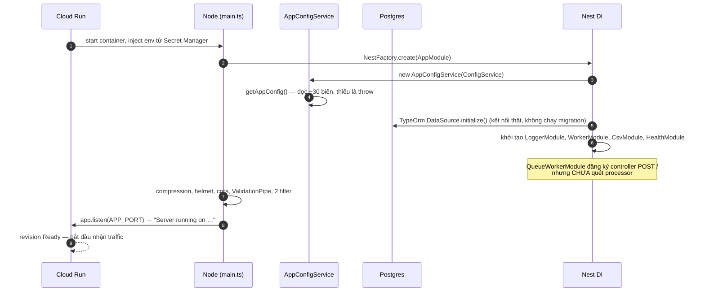
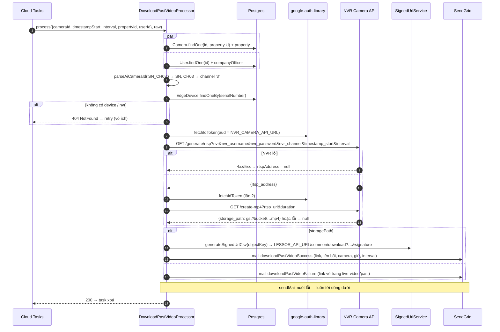

# aimo-parking-worker-server — giải phẫu worker và flow chi tiết của từng request

> Viết cho người **sắp sửa code trong `aimo-parking-worker-server`**, hoặc người muốn hiểu
> một worker chạy thật trên Cloud Run trông thế nào **từ bên trong process**: request vào
> cổng nào, đi qua lớp nào, gọi service nào, ghi bảng nào, lỗi ở đâu thì Cloud Tasks làm gì.
>
> Đọc từ bản trên máy tháng 9/2026 (branch `feature.init-property`, commit `f926422`).
> Thư viện `@anchan828/nest-cloud-run-queue-worker` không có trong `node_modules` trên máy
> nên tôi tải đúng phiên bản `3.2.4` từ npm để đọc — mọi khẳng định về thư viện dựa trên
> mã đã biên dịch của bản đó. Chỗ nào _suy ra_ thay vì _đọc được_ sẽ ghi rõ.
>
> Tài liệu anh em:
>
> | Tài liệu                                                                        | Khác gì tài liệu này                                                                            |
> | ------------------------------------------------------------------------------- | ----------------------------------------------------------------------------------------------- |
> | [aimo-message-queue-flow.md](aimo-message-queue-flow.md)                        | Nhìn **toàn hệ**: lessor publish → Cloud Tasks → worker. Tài liệu này chỉ đứng **trong worker** |
> | [aimo-gcp-services.md](aimo-gcp-services.md)                                    | Từng dịch vụ GCP là gì                                                                          |
> | [worker-catalog-and-implementation.md §8](worker-catalog-and-implementation.md) | So mô hình push của aimo với BullMQ của ecom                                                    |
> | [queue-job-worker-scheduler-guide.md](queue-job-worker-scheduler-guide.md)      | Lý thuyết queue/job/idempotency                                                                 |
>
> Đường dẫn code viết tắt: `worker/…` = `aimo-parking-worker-server/…`, `lessor/…` =
> `aimo-parking-lessor-server/…`.

---

## Bản đồ tài liệu

| Phần | Trả lời                                                                                         |
| ---- | ----------------------------------------------------------------------------------------------- |
| 1    | Worker này thực ra là gì, có mấy cửa vào                                                        |
| 2    | Process khởi động thế nào, từng bước, module nào nạp module nào                                 |
| 3    | **Một request Cloud Tasks đi qua worker** — từng lớp, từng dòng thư viện, từng mã HTTP          |
| 4    | Danh mục 5 processor                                                                            |
| 5    | **Flow chi tiết từng processor**: health, auto-send-mail, download-past-video, hai auto-payment |
| 6    | Cửa vào thứ hai: `/csv/*` do Cloud Workflows gọi                                                |
| 7    | Cửa vào thứ ba: `/health`                                                                       |
| 8    | Các service dùng chung và "tính khí" của từng cái                                               |
| 9    | Cấu hình, secret, image, deploy                                                                 |
| 10   | Bảng tra: lỗi nào → HTTP nào → Cloud Tasks làm gì; đọc log ra sao                               |
| 11   | Điểm yếu tìm thấy khi đọc code                                                                  |
| 12   | Checklist và khung code khi thêm processor mới                                                  |

---

# 1. Worker này là gì

**Là một HTTP server NestJS bình thường.** Không có vòng lặp nào tự nhặt việc, không có kết
nối nào tới Redis hay Pub/Sub. Nó ngồi im cho tới khi có ai POST vào. "Ai" ở đây là ba bên:

```
                 ┌──────────────────────────────────────────────────────┐
Cloud Tasks ───► │ POST /                 QueueWorkerModule (thư viện)  │
 (5 loại task)   │   └─ định tuyến theo body.message.name → processor   │
                 │                                                      │
Cloud Workflows ►│ GET  /csv/export       CsvController                 │
 (export CSV)    │ POST /csv/execute                                    │
                 │                                                      │
Cloud Run /     ►│ GET  /health           HealthController (terminus)   │
 người vận hành  └──────────────────────────────────────────────────────┘
                              │ TypeORM (Postgres chung với lessor)
                              │ SendGrid · GCS · NVR API · SB Payment
```

| Cửa vào             | Ai gọi                                   | Xác thực                                                            | Có gì phía sau                            |
| ------------------- | ---------------------------------------- | ------------------------------------------------------------------- | ----------------------------------------- |
| `POST /`            | Cloud Tasks (queue `tasks`)              | **Cloud Run IAM** — OIDC token do lessor xin, audience = URL worker | 5 processor ([§4](#4-danh-mục-processor)) |
| `GET /csv/export`   | Cloud Workflows (Google), lặp theo trang | Cloud Run IAM (suy ra — workflow không có trong repo)               | Sinh một trang CSV lên GCS                |
| `POST /csv/execute` | Cloud Workflows, một lần cuối            | như trên                                                            | Nén, ký URL, gửi mail                     |
| `GET /health`       | Cloud Run probe, người                   | `@Public()` — nhưng guard đang tắt nên decorator chỉ để dành        | Ping DB                                   |

Ba điều cần chấp nhận ngay để đọc phần sau không bị vấp:

1. **Không có lớp xác thực nào trong code.** `worker/src/main.ts` có dòng
   `app.useGlobalGuards(new StaticAuthGuard(...))` nhưng **đang comment**. `StaticAuthGuard`
   (`worker/src/guards/static-auth.guard.ts`) vẫn tồn tại, có test, nhưng không được gắn
   vào đâu. Toàn bộ an toàn của `POST /` nằm ở cờ `--no-allow-unauthenticated` của Cloud Run.
2. **Retry không nằm trong code.** Processor chỉ có hai lựa chọn: `return` (→ 200, task
   xong) hoặc `throw` (→ non-2xx, Cloud Tasks thử lại theo `retryConfig` của queue).
3. **Worker và lessor dùng chung một database.** Worker đọc/ghi thẳng vào bảng
   `space_rental_history`, `space_payment_history`, `user`, `camera`… bằng entity của riêng
   nó (`worker/src/database/entities/`, 40 file) — hai bản entity, một schema. Lệch một
   migration là worker hỏng dù không ai chạm vào code worker.

---

# 2. Process khởi động thế nào

## 2.1 Từ `node dist/main.js` tới `app.listen`

`worker/src/main.ts`, đúng thứ tự:

```
1. NestFactory.create(AppModule, { bufferLogs: true })
     → toàn bộ module graph được khởi tạo ở đây (2.2)
2. app.useLogger(app.get(Logger))                  // nestjs-pino thay logger mặc định
3. app.use(compression())                          // gzip response
4. app.use(helmet())                               // security headers
5. app.enableCors({ origin: APP_CORS_ORIGIN, credentials: true })
6. // app.useGlobalGuards(StaticAuthGuard)         ← COMMENT
7. app.useGlobalPipes(new ValidationPipe({ transform, whitelist, exceptionFactory → ValidateException }))
8. app.useGlobalFilters(new ExternalServiceExceptionFilter(), new QueryFailedFilter(reflector))
9. app.listen(APP_PORT)                            // mặc định 4005 theo .env.example
```

Hai chi tiết đáng nói:

- **Bước 5 vô nghĩa với worker.** CORS chỉ có ý nghĩa khi trình duyệt gọi. Ba bên gọi
  worker đều là máy. Đây là dấu vết của việc scaffold worker từ template của lessor (cùng
  `gkc_hash_code` ở đầu mỗi file).
- **Bước 7 không chạm tới payload của Cloud Tasks.** `ValidationPipe` chỉ chạy trên tham
  số có kiểu class ở controller của _mình_. Controller nhận `POST /` là của thư viện, khai
  báo `body` kiểu `Object` → không validate. Xem [§3.6](#36-lớp-5--processor-nhận-gì).

## 2.2 Module graph

`worker/src/app.module.ts` chỉ có một dòng: `imports: generateModulesSet()`.
`worker/src/utilities/modules-set.util.ts` trả về, theo `MODULES_SET=monolith` (giá trị duy
nhất được hỗ trợ):

```
AppModule
├─ ConfigModule.forRoot({ isGlobal, envFilePath: `.env.${NODE_ENV}` })
├─ ApiModule
│  ├─ HealthModule        (TerminusModule, HttpModule) → HealthController
│  ├─ WorkerModule        ← trọng tâm
│  │  ├─ TypeOrmModule.forFeature([User, SpaceRentalHistory, PropertyRentalHistory])
│  │  ├─ QueueWorkerModule.register()        ← mở POST /, global
│  │  ├─ SbPaymentModule  (HttpModule)       → SbPaymentService
│  │  ├─ NvrCameraModule  (HttpModule)       → NvrCameraService, GoogleCloudAuthService
│  │  └─ providers: SignedUrlService + 5 processor
│  └─ CsvModule
│     ├─ CsvCompanyModule, CsvPropertyCameraModule, CsvSpaceCameraModule
│     └─ providers: CsvService, CsvGoogleCloudService, MailerService, SignedUrlService
├─ TypeOrmModule.forRootAsync(AppConfigService.postgresConfig)
│     entities: glob **/*.entity.{ts,js}; migrationsRun: false; dropSchema khi NODE_ENV=test
└─ LoggerModule.forRootAsync(loggerFactory)  (nestjs-pino)

SharedModule (@Global) — được import ở TypeOrm/Logger factory, cung cấp cho mọi nơi:
   AppConfigService, MailerService, CalculateBillService, GoogleCloudStorageService
```

Ba điểm để ý:

- **`AppConfigService` fail-fast.** Constructor gọi `getAppConfig()` ngay, mỗi `getString()`
  ném `Error("AppConfigService: X is not defined")` nếu thiếu biến. Thiếu **một** biến trong
  danh sách [§9.1](#91-biến-môi-trường) là process chết trước khi `listen`, Cloud Run báo
  revision fail. Đây là hành vi tốt: không có worker "sống dở" thiếu SendGrid key.
- **`MailerService` và `SignedUrlService` được khai báo hai lần** — ở `SharedModule`
  (global) và lại ở `CsvModule`/`WorkerModule`. Nest tạo hai instance riêng; vô hại nhưng gây
  nhầm khi mock trong test.
- **`envFilePath` theo `NODE_ENV`.** Trên Cloud Run không có file `.env.production`; biến đến
  từ Secret Manager qua `--set-secrets` ([§9.3](#93-deploy)). `ConfigModule` đọc
  `process.env` trước rồi mới tới file, nên không có file cũng không sao.

## 2.3 Thư viện `QueueWorkerModule.register()` làm gì lúc boot

Đọc `worker.module.js` của thư viện:

```ts
QueueWorkerModule.register(options = {})
  → controllers: [ getWorkerController(options.workerController) ]   // POST / mặc định
  → providers:   [ QUEUE_WORKER_MODULE_OPTIONS = options,
                   MetadataScanner, QueueWorkerExplorerService, QueueWorkerService,
                   Logger("QueueWorkerModule") ]
  → global: true
  → imports: [ DiscoveryModule ]
```

Aimo gọi `register()` **không truyền gì**, nên mọi option là mặc định. Bảng option và giá trị
đang có hiệu lực — quan trọng vì nó quyết định hành vi lỗi ở §3:

| Option                        | Mặc định (đang dùng) | Nghĩa                                                                                           |
| ----------------------------- | -------------------- | ----------------------------------------------------------------------------------------------- |
| `workerController.path`       | `/`                  | route nhận task                                                                                 |
| `workerController.method`     | `POST`               |                                                                                                 |
| `workerController.statusCode` | `200`                | mã trả khi xong                                                                                 |
| `workerController.throwError` | `true`               | processor ném lỗi → controller **ném lại** → Nest biến thành HTTP lỗi                           |
| `throwModuleError`            | `false` (undefined)  | **không có processor khớp `name` → trả 200 im lặng** thay vì 400                                |
| `maxRetryAttempts`            | `1`                  | số lần thư viện tự gọi lại processor **trong cùng request** — 1 nghĩa là không retry in-process |
| `extraConfig.parseReviver`    | `undefined`          | hook parse JSON — không có → chuỗi ISO date **giữ nguyên là string** (xem §3.4)                 |

Việc **quét processor không xảy ra lúc boot** mà lười: `QueueWorkerService.getAllWorkers()`
chỉ chạy `explorerService.explore()` ở **request đầu tiên** rồi cache vào field private.
`explore()` duyệt mọi provider trong DI container, lấy metadata `QUEUE_WORKER_DECORATOR`
trên constructor (đặt bởi `@QueueWorker({ name })`), rồi với mỗi class quét method có
`QUEUE_WORKER_PROCESS_DECORATOR` (`@QueueWorkerProcess()`). Kết quả là danh sách
`{ name, className, instance, processors: [{ methodName, processor: method.bind(instance) }] }`,
sắp theo `priority` (mặc định 0).

Hệ quả thực tế: một processor **quên đăng ký vào `providers`** của `WorkerModule` sẽ không
được tìm thấy, và vì `throwModuleError=false`, task mang tên đó **trả 200 và mất im** — không
log, không lỗi. Đây chính là câu trả lời cho câu hỏi để mở ở
[aimo-message-queue-flow.md §D4](aimo-message-queue-flow.md): task `external-property-sync`
mà lessor publish nhưng worker không có processor **bị nuốt**, không retry.

## 2.4 Sequence khởi động



---

# 3. Một request Cloud Tasks đi qua worker

Đây là phần lõi. Lấy task `download-past-video` làm ví dụ vì payload dễ nhìn; cơ chế giống
nhau cho cả 5 task.

## 3.0 Request đến trông thế nào

Lessor publish qua `TasksPublisherService.publish({ name, data }, options)` (thư viện
`@anchan828/nest-cloud-run-queue-tasks-publisher@3.4.1`, đọc từ npm). Điểm cần biết là
**body được bọc thêm một lớp `message`** rồi base64 (Cloud Tasks yêu cầu body base64 khi tạo
task, và **tự giải mã** khi gửi đi):

```ts
// publish.service.js (thư viện, tóm)
httpRequest: {
  body: Buffer.from(JSON.stringify({ message: taskMessage })).toString("base64"),
  headers: { "content-type": "application/json", ...options.httpRequest.headers },
  httpMethod: "POST",
  url: publishConfig.httpRequest.url,          // = WORKER_API_URL của lessor
}
```

Nên request thật đập vào worker là:

```http
POST / HTTP/1.1
Host: <worker>.a.run.app
Authorization: Bearer <OIDC id token, aud = WORKER_API_URL>
Content-Type: application/json
User-Agent: Google-Cloud-Tasks
X-CloudTasks-QueueName: tasks
X-CloudTasks-TaskName: 7643216880914112345
X-CloudTasks-TaskRetryCount: 0
X-CloudTasks-TaskExecutionCount: 0
X-CloudTasks-TaskETA: 1758700000.123456

{"message":{"name":"download-past-video","data":{"cameraId":"…","timestampStart":"2026-09-23T06:00:00.000Z","interval":30,"propertyId":"…","userId":"…"}}}
```

Lessor **không** đặt `task.name` (không truyền `deduplicationId`) → Cloud Tasks tự sinh
số → không khử trùng theo tên.

## 3.1 Lớp 0 — Cloud Run (ngoài code)

Cloud Run kiểm `Authorization`: token hợp lệ, `aud` khớp URL service, service account có
`roles/run.invoker`. Sai → **401/403 do Cloud Run trả**, không có dòng log nào của NestJS.
Đúng → nếu không còn instance nào rảnh thì khởi động instance mới (cold start: boot ở §2
mất vài giây, trong đó có kết nối Postgres), rồi chuyển request vào container.

## 3.2 Lớp 1 — Express và pino-http

- `express.json()` (mặc định của Nest) parse body → `req.body = { message: {...} }`.
  Giới hạn mặc định 100kb; payload của aimo vài trăm byte.
- `pino-http` (cấu hình ở `worker/src/utilities/setup-logger.util.ts`) gán `req.id`:
  lấy `x-request-id` nếu có, không thì `uuidv4()`; **chỉ khi `APP_DEBUG=true`**. Cloud Tasks
  không gửi `x-request-id`, nên mỗi lần retry là một `req.id` mới — không nối được các lần
  thử của cùng một task bằng id này. Header `X-CloudTasks-TaskName` mới là khoá đúng, và
  **không ai log nó** (xem §11).
- Khi `LOG_PRETTY=false` (production), pino xuất JSON với `severity` map sang mức của Cloud
  Logging (`debug→DEBUG`, `warn→WARNING`, `error→ERROR`) và `messageKey: 'message'` để Cloud
  Logging hiển thị đúng.

## 3.3 Lớp 2 — `WorkerController.execute`

Controller do `getWorkerController()` sinh ra lúc boot:

```ts
@Controller()
class WorkerController {
  @RequestMapping({ method: POST, path: "/" })
  @HttpCode(200)
  async execute(@Body() body, @Headers() headers) {
    const results = await this.service.execute({ ...body.message, headers });
    for (const result of results) {
      if (!result.success && throwError) throw result.error; // throwError = true
    }
  }
}
```

Nó **trộn `body.message` với headers** thành một object `{ name, data, headers }` rồi đưa cho
`QueueWorkerService`. Trả về `undefined` → Nest gửi `200` với body rỗng.

## 3.4 Lớp 3 — `QueueWorkerService.execute`: giải mã và định tuyến

```ts
async execute(message) {
  const decoded = decodeMessage(message, this.options.extraConfig?.parseReviver);
  if (this.options.throwModuleError && !decoded.data.name) throw BadRequest(...)   // tắt
  const workers = this.getWorkers(decoded);                    // lọc theo name
  if (this.options.throwModuleError && workers.length === 0) throw BadRequest(...) // tắt
  const results = [];
  for (const worker of workers) results.push(...(await worker.execute(decoded)));
  return results;                                              // [] nếu không ai khớp
}
```

`decodeMessage` (`util.js`) hỗ trợ ba định dạng và chọn theo **hình dạng** object:

| Thứ tự | Điều kiện                                 | Nguồn           | Cách giải mã                                                              |
| ------ | ----------------------------------------- | --------------- | ------------------------------------------------------------------------- |
| 1      | `message.data` là chuỗi base64            | Pub/Sub push    | base64 → `parseJSON` **có reviver ngày**                                  |
| 2      | object có ≤3 key, gồm `name` và `headers` | **Cloud Tasks** | `JSON.parse(JSON.stringify(message.data), reviver)` — reviver `undefined` |
| 3      | còn lại, có `name`                        | HTTP thô        | dùng thẳng                                                                |

Aimo rơi vào hàng 2 (object `{name, data, headers}` đúng 3 key). Hai hệ quả:

1. **`data` là bản clone JSON của payload — mọi `Date` là string.** Thư viện có sẵn
   `parseJSON` tự nhận chuỗi `yyyy-MM-ddTHH:mm:ss.sssZ` thành `Date`, nhưng **chỉ** dùng ở
   nhánh Pub/Sub. Nhánh Cloud Tasks truyền `reviver = extraConfig.parseReviver = undefined`.
   Vì thế `DownloadPastVideoRequestDto.timestampStart` khai báo `Date` nhưng runtime là
   `string`. Code hiện chạy đúng vì `convertToClientTime()` (date-fns-tz `toZonedTime`) nhận
   cả string; ai thêm `timestampStart.getTime()` sẽ sập với `TypeError` → 500 → retry vô ích.
2. `decoded.id` = `headers['x-cloudtasks-taskname']` — thư viện **có lấy** task name ra, nhưng
   chỉ nằm trong `decoded.id`, không được truyền vào processor. Processor nhận `raw` =
   `{ name, data, headers }` nên muốn task name phải tự đọc `raw.headers['x-cloudtasks-taskname']`.

Định tuyến: `getAllWorkers().filter(w => w.name === decoded.data.name)`. Khớp **theo chuỗi
chính xác**, phân biệt hoa thường. Không khớp → `[]` → controller nhận `results = []` →
vòng `for` không chạy → **200**. Cloud Tasks xoá task. Không một dòng log.

## 3.5 Lớp 4 — `Worker.execute` → `Processor.execute`

```ts
// worker.js (thư viện)
async execute(message) {            // Processor
  const maxRetryAttempts = this.options.maxRetryAttempts ?? 1;
  for (let i = 0; i < maxRetryAttempts; i++) {
    try {
      await this.metadata.processor(message.data.data, message.raw);   // ← gọi method của bạn
      i = maxRetryAttempts;
    } catch (error) {
      if (maxRetryAttempts === i + 1) return { success: false, error, ... };
    }
  }
  return { success: true, ... };
}
```

Processor của bạn nhận **hai tham số**: `message.data.data` (payload, chính là `data` lessor
gửi) và `message.raw` (`{ name, data, headers }`). Một class `@QueueWorker` có thể có nhiều
`@QueueWorkerProcess()`; aimo mỗi class một method `process`. Nếu `@QueueWorker({ name: [...] })`
là mảng, một class phục vụ nhiều tên — aimo không dùng.

Với `maxRetryAttempts = 1`, lỗi lần đầu là trả `success: false` ngay.

## 3.6 Lớp 5 — processor nhận gì

Đối chiếu với DTO mà processor khai báo:

```ts
export class DownloadPastVideoRequestDto {
  propertyId: string;
  userId: string;
  cameraId!: string;
  timestampStart!: Date; // thực tế: string ISO
  interval!: number;
}
```

**Không có decorator `class-validator`, không có `plainToInstance`.** Object đến từ
`JSON.parse` nguyên xi. Nghĩa là:

- thiếu field → `undefined`, code chạy tiếp tới khi đụng (`camera.aiCameraId` của `null`);
- sai kiểu (`interval: "30"`) → truyền tiếp sang NVR API, không ai chặn;
- thừa field → giữ nguyên.

Hợp đồng payload giữa lessor và worker hoàn toàn là **thoả thuận ngầm bằng tên field**.

## 3.7 Lớp 6 — lỗi đi ngược lên thành HTTP

Processor `throw X` → `Processor.execute` trả `{success:false, error: X}` →
`WorkerController` ném lại `X` → **Nest exception layer**, theo thứ tự ưu tiên:

| Lỗi ném ra                                            | Ai bắt                                                            | HTTP                                      |
| ----------------------------------------------------- | ----------------------------------------------------------------- | ----------------------------------------- |
| `QueryFailedError` (TypeORM)                          | `QueryFailedFilter` (`worker/src/filters/query-failed.filter.ts`) | 409 nếu constraint bắt đầu `UQ`, else 500 |
| `ExternalServiceException` (SB Payment lỗi mạng/HTTP) | `ExternalServiceExceptionFilter`                                  | status của response bên kia, hoặc 500     |
| `ValidateException` (extends `BadRequestException`)   | filter mặc định của Nest                                          | 400                                       |
| `NotFoundException`                                   | filter mặc định                                                   | 404                                       |
| `BadRequestException`                                 | filter mặc định                                                   | 400                                       |
| `TypeError`, lỗi bất kỳ không phải `HttpException`    | filter mặc định                                                   | 500                                       |

**Cloud Tasks coi mọi mã ngoài 2xx là thất bại và thử lại** theo `retryConfig` của queue —
kể cả 400 và 404. Thư viện không phân biệt "lỗi vĩnh viễn" và "lỗi tạm". Nên:

- `throw new ValidateException(ErrorCode.ERROR_E015)` khi không tìm thấy rental — nghe như
  "báo lỗi và dừng", thực tế là **"thử lại tới hết maxAttempts"**, mỗi lần một truy vấn DB
  vô ích. Muốn dừng hẳn phải `return` (như dòng so `endTime` ở §5.4 đã làm đúng).

## 3.8 Lớp 7 — trả lời và Cloud Tasks quyết định

```
2xx  → Cloud Tasks xoá task. Xong.
non-2xx / timeout (dispatchDeadline, mặc định 10 phút; Cloud Run request timeout riêng)
     → attempt++ ; chờ backoff ; POST lại với X-CloudTasks-TaskRetryCount = n
     → hết maxAttempts hoặc maxRetryDuration → xoá task, chỉ còn log
```

Số liệu `maxAttempts`, `minBackoff`… **nằm trên queue GCP**, không trong hai repo. Việc đầu
tiên khi vào dự án: `gcloud tasks queues describe tasks --location=asia-northeast1` và ghi lại.

## 3.9 Toàn bộ lớp trên một hình

```mermaid
sequenceDiagram
    autonumber
    participant CT as Cloud Tasks
    participant IAM as Cloud Run IAM
    participant EX as Express + pino
    participant WC as WorkerController<br/>(thư viện, POST /)
    participant QS as QueueWorkerService
    participant P as Processor của aimo
    participant F as Exception filters

    CT->>IAM: POST / + Bearer OIDC + X-CloudTasks-*
    alt token sai / thiếu run.invoker
        IAM-->>CT: 401/403 (không tới NestJS) → retry
    end
    IAM->>EX: forward (cold start nếu cần)
    EX->>EX: JSON.parse body; req.id = uuid; log "POST /"
    EX->>WC: execute(body, headers)
    WC->>QS: execute({ ...body.message, headers })
    QS->>QS: decodeMessage → nhánh Cloud Tasks (Date → string)
    QS->>QS: getAllWorkers() (quét DI lần đầu, cache)
    alt không processor nào khớp name
        QS-->>WC: []
        WC-->>CT: 200 — task mất im
    else khớp
        QS->>P: process(data, raw)
        alt return
            P-->>QS: ok
            QS-->>WC: [{success:true}]
            WC-->>CT: 200 → task xoá
        else throw
            P-->>QS: error
            QS-->>WC: [{success:false, error}]
            WC->>F: throw error
            F-->>CT: 400 / 404 / 409 / 500 → retry theo queue
        end
    end
```

---

# 4. Danh mục processor

Tất cả ở `worker/src/api/worker/processor/`, đăng ký trong `worker.module.ts`.

| `name`                         | Class                                | Ai publish (theo B2 của tài liệu queue)  | Payload                                                      | Gọi ra ngoài                  | Ghi DB                                                              | Gửi mail                       |
| ------------------------------ | ------------------------------------ | ---------------------------------------- | ------------------------------------------------------------ | ----------------------------- | ------------------------------------------------------------------- | ------------------------------ |
| `health`                       | `HealthProcessor`                    | tay / smoke test                         | bất kỳ                                                       | —                             | —                                                                   | —                              |
| `auto-send-mail`               | `SendMailProcessor`                  | server khác (không thấy trong lessor)    | `{ from, to, mailType: {template, subject}, data }`          | SendGrid                      | —                                                                   | ✅ theo template được chỉ định |
| `download-past-video`          | `DownloadPastVideoProcessor`         | lessor `CameraService.downloadPastVideo` | `{ propertyId, userId, cameraId, timestampStart, interval }` | NVR API ×2 (OIDC), SendGrid   | — (chỉ đọc)                                                         | ✅ success / failure           |
| `space-rental-auto-payment`    | `SpaceRentalAutoPaymentProcessor`    | server khác (`image-server`, suy ra)     | `{ userId, spaceRentalHistoryId, rentalBill, endTime }`      | SB Payment ×2 (XML), SendGrid | INSERT `space_payment_history`, UPDATE `space_rental_history`       | ✅ success / failure           |
| `property-rental-auto-payment` | `PropertyRentalAutoPaymentProcessor` | như trên                                 | `{ userId, propertyRentalHistoryId, rentalBill, endTime }`   | SB Payment ×2, SendGrid       | INSERT `property_payment_history`, UPDATE `property_rental_history` | ✅                             |

Không có processor cho `external-property-sync` dù lessor publish nó
(`lessor/src/shared/worker/worker.service.ts`). Theo §3.4, task này **trả 200 và biến mất**.

---

# 5. Flow chi tiết từng processor

Quy ước trong phần này: **"→ retry"** nghĩa là ném lỗi, HTTP non-2xx, Cloud Tasks thử lại;
**"→ xong"** nghĩa là return, HTTP 200, task bị xoá.

## 5.1 `health` — chỉ để thử ống

`worker/src/api/worker/processor/health.processor.ts`:

```ts
@QueueWorker({ name: "health" })
export class HealthProcessor {
  @QueueWorkerProcess()
  async process(message: string, raw: QueueWorkerRawMessage) {
    this.logger.log(
      `Health task: ${JSON.stringify(message)}, raw: ${JSON.stringify(raw)}`,
    );
  }
}
```

Là processor duy nhất **log `raw`**, tức là in cả headers `X-CloudTasks-*`. Dùng nó để kiểm
tra đường ống lessor → queue → worker sau mỗi lần đổi IAM hay URL:

```bash
# từ máy có quyền, giả lập một task
gcloud tasks create-http-task --queue=tasks --location=asia-northeast1 \
  --url="$WORKER_URL/" --method=POST \
  --oidc-service-account-email="$LESSOR_SA" \
  --header="Content-Type: application/json" \
  --body-content='{"message":{"name":"health","data":{"ping":1}}}'
```

Xem log worker có dòng `Health task: {"ping":1}, raw: {"name":"health","data":…,"headers":{…"x-cloudtasks-taskname":…}}`.

## 5.2 `auto-send-mail` — và sự thật về `MailerService`

`worker/src/api/worker/processor/send-mail.processor.ts` chỉ làm một việc:

```
1. { from, to, mailType, data } = message
2. await mailerService.sendMail(to, mailType, data, from)
```

Điều quan trọng nằm ở `MailerService` (`worker/src/shared/services/mailer.service.ts`),
vì **cả 5 processor gửi mail đều đi qua đây**:

```ts
async sendMail(email, type, data?, from?) {
  try {
    const html = this.mapDataToTemplate(type?.template, data);   // đọc file .hbs, Handlebars.compile
    await this.send({ to: email, subject: type?.subject, html, from: from || MAIL_FROM_LESSEE });
  } catch (error) {
    this.logger.warn(`Send mail to ${email} failed.`);
    this.logger.error(error);                                     // ← NUỐT LỖI
  }
}
```

`MailerService extends MailService` của `@sendgrid/mail`, `setApiKey(SEND_GRID_API_KEY)`
trong constructor. Và **mọi lỗi đều bị bắt và chỉ log**: SendGrid 401 vì key hết hạn,
template không tồn tại (`fs.readFileSync` ném `ENOENT`), `to` rỗng — tất cả đều **không ném
ra ngoài**.

Hệ quả cho từng flow:

| Flow                  | Nếu SendGrid lỗi                                                                                |
| --------------------- | ----------------------------------------------------------------------------------------------- |
| `auto-send-mail`      | task **trả 200 → xong**. Mail mất, **không retry**. Chỉ còn một dòng `warn` + `error` trong log |
| `download-past-video` | video đã cắt xong, mail không tới, task xong. Người dùng không biết gì                          |
| hai `auto-payment`    | tiền đã trừ, DB đã ghi, mail không tới, task xong                                               |
| `POST /csv/execute`   | file đã nén, URL đã ký, mail không tới, HTTP vẫn 200 kèm `{url}`                                |

> Ghi chú cho người đọc tài liệu anh em: [aimo-message-queue-flow.md §C7](aimo-message-queue-flow.md)
> có dòng "SendGrid lỗi → throw → retry". Đọc kỹ `MailerService` thì **không đúng** — mail
> không bao giờ làm task retry. Tôi đã sửa dòng đó trong tài liệu kia cùng lúc viết tài liệu này.

Template mail nằm ở `worker/src/resources/templates/mail/*.hbs` (6 file), tên và subject
khai báo ở `worker/src/constants/mail.constants.ts` (`MAILER_TYPE`). Chú ý `mailType` của
`auto-send-mail` là **do producer gửi nguyên object `{template, subject}`** — producer có
thể chỉ tên template không tồn tại trên worker, và lỗi đó cũng bị nuốt.

## 5.3 `download-past-video` — tải video quá khứ

File: `worker/src/api/worker/processor/download-past-camera/download-past-video.processor.ts`.

### 5.3.1 Ngữ cảnh

Nhân viên bãi xe bấm "tải video 30 giây lúc 15:00 của camera 3". Lessor
(`lessor/src/api/camera/camera.service.ts::downloadPastVideo`) **không await** publish, trả
200 ngay. Worker phải: tìm thiết bị edge quản camera → hỏi NVR API lấy RTSP → nhờ NVR API
cắt MP4 lên GCS → ký URL tải → gửi mail. Mất từ vài chục giây tới vài phút.

### 5.3.2 Từng bước, kèm truy vấn thật

```
[0] payload: { cameraId, timestampStart (string ISO), interval (giây), propertyId, userId }

[1] Promise.all([
      Camera.findOne({ where: { id: cameraId, property: { id: propertyId } },
                       relations: { property: true },
                       select: { id, name, aiCameraId, property: { id, name } } }),
      User.findOne({ where: { id: userId }, relations: { companyOfficer: true },
                     select: { id, email, companyOfficer: { id, firstName, lastName } } }),
    ])
    ⚠ không kiểm null. camera = null → bước [2] ném TypeError → 500 → retry (vô ích)

[2] parseAiCameraId(camera.aiCameraId)
    'SN123456_CH03' → { serialNumber: 'SN123456', cameraId: 'CH03' }
    không có '_' → throw BadRequestException('Invalid aiCameraId format') → 400 → retry (vô ích)

[3] EdgeDevice.findOneBy({ serialNumber })
    null            → throw NotFoundException('[E0005] Device … not found')  → 404 → retry (vô ích)
    !edgeDevice.nvr → throw NotFoundException('[E0005] NVR not found …')     → 404 → retry (vô ích)

[4] nvrChannel = 'CH03'.match(/CH0*([0-9]+)/)[1] → '3'      (không khớp → '')
    { username, password } = edgeDevice.setting.nvr          (JSON column)

[5] rtspAddress = nvrCameraService.getRtspUrl(edgeDevice.nvr, username, password, '3', timestampStart, interval)
      → token = GoogleAuth().getIdTokenClient(NVR_CAMERA_API_URL).fetchIdToken(...)
        (Application Default Credentials = service account của Cloud Run worker; audience = NVR API)
      → GET {NVR_CAMERA_API_URL}/generate/rtsp
            ?nvr=<serial>&nvr_username=…&nvr_password=…&nvr_channel=3
            &timestamp_start=yyyyMMddHHmmss (giờ Asia/Tokyo)&interval=30
        Authorization: Bearer <token>
      → data.rtsp_address ; lỗi HTTP → log error, return null  (KHÔNG throw)

[6] if (rtspAddress) storagePath = nvrCameraService.createMp4(rtspAddress, interval)
      → GET {NVR_CAMERA_API_URL}/create-mp4?rtsp_url=…&duration=30  (Bearer như trên)
      → data.storage_path dạng 'gs://<bucket>/…/xxx.mp4' ; lỗi → log, return null

[7] officerName = getOfficerName(user.companyOfficer)         // lastName + firstName, không cách
    timestampFormatted = formatDate(convertToClientTime(timestampStart), 'yyyy/MM/dd HH:mm:ss')

[8] if storagePath:
      template = downloadPastVideoSuccess
      url = signedUrlService.generateSignedUrlCsv(gcs.getObjectKey(storagePath))
          = `${LESSOR_API_URL}/common/download?filePath=<key>&expireTime=<now+7d ms>&signature=<hmac>`
    else:
      template = downloadPastVideoFailure
      urlDomainPastVideo = `${LESSOR_APP_URL}/property/${propertyId}/live-video/past`

[9] mailerService.sendMail(user.email, template, data, MAIL_FROM_LESSOR)   // nuốt lỗi
[10] return → 200 → xong
```

### 5.3.3 URL tải trong mail là gì

Không phải signed URL của GCS. `SignedUrlService` (`worker/src/shared/services/signed-url.service.ts`)
ký **HMAC-SHA256 của `filePath + expireTime`** bằng `SIGNED_URL_SECRET_KEY`, trỏ về
**lessor** `GET /common/download`. Phía lessor
(`lessor/src/api/google-cloud-platform/google-cloud-storage/google-cloud-storage.controller.ts`)
`verifySignedUrl` cùng secret, kiểm hạn, rồi **stream file từ GCS về trình duyệt**. Vì thế:

- worker và lessor phải có **cùng `SIGNED_URL_SECRET_KEY`** — hai secret riêng trong Secret
  Manager (`…-worker-SIGNED_URL_SECRET_KEY` và `…-lessor-…`), đổi một mà quên cái kia là mọi
  link trong mail hỏng với thông báo "invalid signature";
- hạn 7 ngày (`EXPIRES_TIME_CSV = 604800000`) — tên hằng nói "CSV" nhưng dùng cho cả video;
- link không lộ bucket, và lessor có thể đổi cách lưu file mà mail cũ vẫn chạy.

### 5.3.4 Ma trận lỗi

| Bước | Lỗi                                 | Code làm gì                  | HTTP | Cloud Tasks | Người dùng nhận  | Nhận xét                                                |
| ---- | ----------------------------------- | ---------------------------- | ---- | ----------- | ---------------- | ------------------------------------------------------- |
| 1    | camera hoặc user không tồn tại      | `TypeError` ở bước 2 / 7     | 500  | retry       | **không gì**     | retry vô ích, hết attempts thì mất im                   |
| 2    | `aiCameraId` không có `_`           | `BadRequestException`        | 400  | retry       | không gì         | lỗi dữ liệu vĩnh viễn, đáng gửi mail failure rồi return |
| 3    | edge device / NVR không có          | `NotFoundException`          | 404  | retry       | không gì         | như trên                                                |
| 5    | NVR API lỗi lấy RTSP                | `return null`                | 200  | xong        | **mail failure** | thiết kế đúng: lỗi hạ tầng → báo người dùng, không lặp  |
| 6    | NVR API lỗi cắt MP4                 | `return null`                | 200  | xong        | mail failure     | như trên                                                |
| 5/6  | `fetchIdToken` lỗi (SA thiếu quyền) | throw từ google-auth-library | 500  | retry       | không gì         | đúng là lỗi tạm, retry hợp lý                           |
| 9    | SendGrid lỗi                        | nuốt                         | 200  | xong        | không gì         | video đã tốn tài nguyên cắt, mail mất                   |

Điểm cần rút ra: **bước 1–3 và bước 5–6 dùng hai triết lý ngược nhau**. Bước 5–6 "lỗi thì
báo người dùng rồi kết thúc" là đúng cho việc một-lần-không-cần-lặp như thế này. Bước 1–3
ném lỗi làm Cloud Tasks lặp lại một truy vấn không thể tự sửa. Nhất quán hơn: mọi lỗi
"dữ liệu không có" → gửi `downloadPastVideoFailure` → `return`.

### 5.3.5 Sequence



## 5.4 `space-rental-auto-payment` — thu tiền tự động cho bãi kiểu ô

File: `worker/src/api/worker/processor/space-rental-auto-payment.processor.ts`. Đây là
processor **có hậu quả tài chính**, nên chi tiết nhất.

### 5.4.1 Ngữ cảnh

Xe ra khỏi ô (`space`) mà chưa trả tiền; người dùng đã đăng ký thẻ và bật "tự động thanh
toán". Một server khác (không có trong workspace; doc lessor nhắc `aimo-parking-image-server`
có `auto-payment-trigger`) publish task với **số tiền đã tính sẵn** và **giờ xe ra**. Worker
gọi cổng thanh toán SB Payment (SoftBank Payment Service) hai bước rồi ghi kết quả.

### 5.4.2 Từng bước

```
[0] payload: { userId, spaceRentalHistoryId, rentalBill (number), endTime (string ISO) }

[1] user = User.findOne({ where: { id: userId },
                           relations: { paymentInfos: true, customer: true },
                           select: { id, email,
                                     paymentInfos: { id, autoPayment, paymentInfo: { ccNumber, ccExpiration, cardbrandCode } },
                                     customer: { lastName, firstName } } })
    !user || !user.paymentInfos?.[0]?.autoPayment
        → throw ValidateException('User not found or not enable auto payment') → 400 → retry (vô ích)
    ⚠ lấy paymentInfos[0] — thứ tự không ORDER BY; người có 2 thẻ thì "thẻ đầu" là ngẫu nhiên theo Postgres

[2] rental = SpaceRentalHistory.findOne({
        where: { id, status: Unpaid, priceType: CoinParking, isUserPayment: true, isUserDisplay: true,
                 property: { isPaymentMachineOnly: false } },
        relations: { property: { company: true } },
        select: { id, rentalCode, deletedAt, endTime, property: { id, company: { id, merchantId, serviceId, hashKey } } },
        withDeleted: true })
    !rental || rental.deletedAt → throw ValidateException(ERROR_E015) → 400 → retry (vô ích)
    ★ LỚP CHỐNG TRÙNG 1: điều kiện status = Unpaid. Đã trả rồi thì không tìm thấy.

[3] ★ LỚP CHỐNG TRÙNG 2:
    if (!isEqual(rental.endTime, new Date(endTime))) { log; return; }   → 200 → xong
    Lần thuê đã đổi (xe ra lại, lessor sửa giờ) → task cũ vô hiệu, dừng sạch, KHÔNG retry.

[4] paymentTimeDate = now
    waitingPaymentTime = now + 180s                    (WAITING_PAYMENT_SECOND)
    spacePaymentHistoryId = uuidV4()                    ← orderId gửi cổng thanh toán, MỚI mỗi lần chạy
    itemId = spaceRentalHistoryId.replaceAll('-', '')   ← SB Payment không nhận dấu '-'
    { merchantId, serviceId, hashKey, baId = merchantId+serviceId, baPass = hashKey }
        = getPaymentInfoOfCompany(rental.property.company)
        thiếu một trong ba → throw ValidateException(ERROR_E018) → 400 → retry (vô ích)
    → mỗi CÔNG TY (chủ bãi) là một merchant riêng trên SB Payment; cấu hình nằm trong bảng company.

[5] execute = sbPaymentService.autoPaymentExecute(merchantId, serviceId, custCode = userId, hashKey,
                                                    baId, baPass, orderId = spacePaymentHistoryId,
                                                    itemId, itemName = rentalCode, amount = String(rentalBill))
    (chi tiết giao thức: 5.4.3)

[6] if execute.res_result === 'OK':
        confirm = sbPaymentService.autoPaymentConfirm(…, execute.res_sps_transaction_id, execute.res_tracking_id)
        success = confirm.res_result === 'OK'
        paymentResult ← merchantId, serviceId, custCode, resSpsCustNo, resSpsPaymentNo, amount, orderId,
                        itemId, itemName, resTrackingId, paymentMethodInfo {ccNumber, ccExpiration, cardbrandCode}
        (nếu confirm NG: chỉ lưu res_err_code)
    else: success = false, paymentResult chỉ có res_err_code + res_date

[7] dataSource.transaction:
        INSERT space_payment_history {
          id: spacePaymentHistoryId, paymentTime, waitingPaymentTime,
          paymentBill: rentalBill, paymentBillDiscount: rentalBill,
          paymentMethod: creditCard, status: success ? Succeeded : Failed,
          spaceRentalHistory: rental, paymentResult (jsonb),
          createdBy/updatedBy: SYSTEM_USER ('740e5a71-…') }
        if success:
          UPDATE space_rental_history SET paymentTime, status = PaymentLaterCompleted,
                 rentalBill, rentalBillDiscount = rentalBill, paymentBy = userId, updatedBy = SYSTEM_USER
          WHERE id = spaceRentalHistoryId
    ⚠ ghi cả khi thất bại: một hàng payment_history status Failed cho mỗi lần thử.

[8] mailerService.sendMail(user.email, success ? paymentSuccess : paymentFailure,
        { lastName, firstName, paymentTime 'yyyy/MM/dd HH:mm:ss' JST, paymentBill '1,500', adminMail })
    (from mặc định = MAIL_FROM_LESSEE — mail này gửi cho NGƯỜI ĐỖ XE, khác 3 flow kia gửi cho chủ bãi)

[9] return → 200 → xong
```

### 5.4.3 Giao thức SB Payment — `SbPaymentService`

`worker/src/third-party/sb-payment/sb-payment.service.ts` nói chuyện với SB Payment bằng
**XML qua HTTP POST, Basic Auth**, hai "function":

| Bước    | `functionId`     | Ý nghĩa                                                 | Hash tính trên                                                                                                       |
| ------- | ---------------- | ------------------------------------------------------- | -------------------------------------------------------------------------------------------------------------------- |
| execute | `ST01-00131-101` | Yêu cầu thanh toán bằng thẻ đã lưu (cust_code = userId) | `merchantId, serviceId, custCode, orderId, itemId, itemName, amount, spsCustInfoReturnFlg, requestDate, limitSecond` |
| confirm | `ST02-00101-101` | Xác nhận (chốt) giao dịch vừa được cấp                  | `merchantId, serviceId, spsTransactionId, trackingId, requestDate, limitSecond`                                      |

Cơ chế từng request (`autoPaymentExecute`):

```
requestDate  = yyyyMMddHHmmss theo Asia/Tokyo (getRequestDate, dùng Intl.DateTimeFormat)
limitSecond  = '600'
spsHashcode  = sha1( values.map(trim).join('') + hashKey )        // generateSpsHashcode
itemName     = btoa(rentalCode)                                   // base64, SB yêu cầu
xml          = Handlebars.compile(fs.readFileSync('xml-template/auto-payment-execute-req.hbs'))({...})
                 → <?xml version="1.0" encoding="Shift_JIS"?><sps-api-request id="ST01-00131-101">…</sps-api-request>
POST SB_PAYMENT_API_URL, Content-Type: application/xml, auth: { username: baId, password: baPass }
  lỗi mạng / HTTP → this.logger.error; throw ExternalServiceException(error)
                   → filter → HTTP = status của SB (vd 401) hoặc 500 → Cloud Tasks retry
response XML → fast-xml-parser (ignoreDeclaration, trimValues, skipLike /[0-9]/ để giữ số dạng chuỗi)
             → jObj['sps-api-response'] → plainToInstance(AutoPaymentExecuteResDto, …)
```

Hai điểm tinh tế mà người mới hay đọc nhầm:

1. **`callSbPaymentApi` không được `await`** ở cả `autoPaymentExecute` và `autoPaymentConfirm`:
   `const spsApiResponse = this.callSbPaymentApi(...)` là một `Promise`, rồi
   `plainToInstance(Dto, spsApiResponse)`. Code vẫn chạy đúng vì `class-transformer` có
   nhánh riêng: gặp `Promise` thì trả `Promise` resolve ra object đã transform, và hàm `async`
   bên ngoài trả Promise đó cho caller `await`. Nó hoạt động, nhưng là **tình cờ hoạt động**;
   thêm `await` cho rõ.
2. `hashKey` vừa là muối SHA-1 vừa là **password Basic Auth** (`baPass = hashKey`), và `baId =
merchantId + serviceId`. Lộ bảng `company` là lộ khả năng tạo giao dịch. Worker `select`
   đúng ba cột này, không nhiều hơn — tốt.

Các biến `MERCHANT_ID`, `COMMON_SERVICE_ID`, `COMMON_HASH_KEY`, `COMMON_BA_*` trong env là
**bộ "chung"** nhưng hai processor auto-payment **không dùng** chúng — dùng bộ của từng
company trong DB. Chúng vẫn bắt buộc phải có vì `AppConfigService` đọc lúc boot.

### 5.4.4 Idempotency — hai lớp và một khe hở

Task này chạy lại khi: Cloud Tasks retry (bước 1–2 hoặc 4 ném lỗi, bước 5 SB lỗi mạng), hoặc
producer publish trùng.

| Tình huống lần chạy 2                                        | Lớp bắt                                       | Kết quả                                                                                                                          |
| ------------------------------------------------------------ | --------------------------------------------- | -------------------------------------------------------------------------------------------------------------------------------- |
| Lần 1 đã xong hết (Succeeded)                                | bước 2: `status: Unpaid` không khớp           | `ValidateException` → 400 → retry tới hết attempts, **không trừ tiền lần 2**                                                     |
| Người dùng tự trả ở máy trong lúc chờ                        | bước 2 (status đổi) hoặc bước 3 (endTime đổi) | không trừ                                                                                                                        |
| Xe ra lại, `endTime` mới                                     | bước 3                                        | `return` sạch, 200                                                                                                               |
| Lần 1 chết **giữa bước 6 và 7** (SB đã confirm, DB chưa ghi) | **không có**                                  | bước 2 thấy Unpaid, bước 3 khớp, **execute lần 2 với orderId mới** → trừ tiền hai lần                                            |
| Lần 1 execute OK nhưng confirm lỗi mạng (throw)              | không có                                      | lần 2 execute lại; giao dịch lần 1 chưa confirm sẽ tự hết hạn phía SB sau `limit_second`? (suy ra, cần xác nhận với tài liệu SB) |

Cách vá chuẩn cho hàng 4: **`orderId` xác định** — ví dụ `uuidv5(spaceRentalHistoryId + endTime)`
— để SB Payment tự từ chối `order_id` trùng; hoặc ghi hàng `space_payment_history` với
status `Incomplete` **trước** khi gọi SB, và ở lần chạy sau thấy hàng đó thì đi hỏi trạng thái
thay vì execute mới. Enum `PaymentStatus` **đã có** giá trị `Incomplete` nhưng code không dùng.

### 5.4.5 Sequence

```mermaid
sequenceDiagram
    autonumber
    participant CT as Cloud Tasks
    participant P as SpaceRentalAutoPaymentProcessor
    participant DB as Postgres
    participant SB as SB Payment (XML)
    participant SG as SendGrid

    CT->>P: process({userId, spaceRentalHistoryId, rentalBill, endTime}, raw)
    P->>DB: User + paymentInfos + customer
    alt !user || !paymentInfos[0].autoPayment
        P-->>CT: 400 ValidateException → retry (vô ích)
    end
    P->>DB: SpaceRentalHistory WHERE id AND status=Unpaid AND priceType=CoinParking<br/>AND isUserPayment AND isUserDisplay AND property.isPaymentMachineOnly=false<br/>+ property.company{merchantId, serviceId, hashKey}
    alt không thấy / deletedAt
        P-->>CT: 400 ERROR_E015 → retry (vô ích)
    end
    alt rental.endTime ≠ payload.endTime
        P-->>CT: 200 return — lần thuê đã đổi
    end
    P->>P: orderId = uuid(); itemId = id không '-'; baId = merchant+service; baPass = hashKey
    P->>SB: POST XML ST01-00131-101 (execute) Basic baId:baPass
    alt lỗi mạng/HTTP
        SB-->>P: throw ExternalServiceException
        P-->>CT: status SB hoặc 500 → retry
    end
    SB-->>P: res_result, res_sps_transaction_id, res_tracking_id, res_sps_info
    opt res_result = OK
        P->>SB: POST XML ST02-00101-101 (confirm)
        SB-->>P: res_result → success?
    end
    rect rgba(180,83,42,0.15)
        Note over P,DB: KHE HỞ — chết ở đây: tiền đã trừ, DB chưa biết, retry sẽ trừ lại
    end
    P->>DB: BEGIN
    P->>DB: INSERT space_payment_history (Succeeded|Failed, paymentResult jsonb)
    opt success
        P->>DB: UPDATE space_rental_history SET status=PaymentLaterCompleted, paymentTime, paymentBy
    end
    P->>DB: COMMIT
    P->>SG: paymentSuccess | paymentFailure (nuốt lỗi)
    P-->>CT: 200
```

## 5.5 `property-rental-auto-payment` — bản song sinh cho bãi kiểu camera toàn cảnh

File: `worker/src/api/worker/processor/property-rental-auto-payment.processor.ts`. Cùng
xương với 5.4, đối chiếu chỗ khác:

| Điểm                   | space                                                                                                        | property                                                                    |
| ---------------------- | ------------------------------------------------------------------------------------------------------------ | --------------------------------------------------------------------------- |
| Payload id             | `spaceRentalHistoryId`                                                                                       | `propertyRentalHistoryId`                                                   |
| Bảng thuê              | `space_rental_history`                                                                                       | `property_rental_history`                                                   |
| Điều kiện tìm          | `status: Unpaid, priceType: CoinParking, isUserPayment, isUserDisplay, property.isPaymentMachineOnly: false` | **không có `priceType`** (property không có khái niệm tháng), còn lại giống |
| Mã lỗi khi không thấy  | `ERROR_E015`                                                                                                 | `ERROR_E020`                                                                |
| Bảng thanh toán        | `space_payment_history`                                                                                      | `property_payment_history`                                                  |
| Trạng thái sau khi trả | `SpaceRentalHistoryStatus.PaymentLaterCompleted` (6)                                                         | `PropertyRentalHistoryStatus.PaymentLaterCompleted` (6)                     |
| Tách hàm               | truy vấn user viết inline                                                                                    | tách `checkAndGetUserAutoPayment()`                                         |

Mọi nhận xét ở 5.4.3–5.4.4 áp dụng y nguyên. Hai file này là ~90% trùng lặp; nếu sửa khe hở
idempotency, sửa **cả hai** — hoặc rút thành một `AutoPaymentBase` nhận vào entity/repository.

---

# 6. Cửa vào thứ hai: `/csv/*` do Cloud Workflows gọi

Export CSV có thể tới hàng chục nghìn dòng, vượt quá thời gian một task Cloud Tasks nên
chấp nhận được. Aimo dùng **Google Cloud Workflows** làm "vòng lặp có trạng thái" bên
ngoài, gọi worker từng trang.

## 6.1 Kích hoạt từ lessor

`lessor/src/api/google-cloud-platform/google-cloud-workflow/google-cloud-workflow.service.ts`:

```ts
const jobRequestDto = {
  jobParam: JSON.stringify({ jobId: uuid(), csvType }),
  searchParam: JSON.stringify({ ...searchParam, timestamp: new Date() }), // "chụp" thời điểm để tính tiền xe đang đỗ
  sendMailParam: JSON.stringify(sendMailParam), // { fullName, emails, collectionPeriod, propertyName }
  afterCursor: "",
  limit: MAX_CSV_RECORDS, // 40000
};
client
  .createExecution({
    parent: WORKER_FLOW_DOWNLOAD_CSV_PATH,
    execution: { argument: JSON.stringify(jobRequestDto), name: jobId },
  })
  .then(log)
  .catch(log); // bắn rồi quên
```

Định nghĩa workflow (YAML) **không có trong hai repo** — nằm trên GCP. Từ hai endpoint của
worker, hình dạng của nó **suy ra** là:

```
loop:
  res = GET  {worker}/csv/export?jobParam&searchParam&afterCursor&limit    (OIDC)
  afterCursor = res.cursor
  until res.hasMore == false
POST {worker}/csv/execute?jobParam&sendMailParam
```

## 6.2 `GET /csv/export` — một trang

`worker/src/api/csv/csv.controller.ts` → `CsvService.exportCsv(job)`. Ở đây **`ValidationPipe`
có tác dụng** vì tham số là `@Query() job: JobRequestDto` (`jobParam: @IsString()`,
`limit: @IsInt() @Min(1)`, `afterCursor` optional). Sai → `ValidateException` 400 → Workflows
xử lý theo retry policy của nó.

```
[1] jobParam = jsonToInstance(JobParam, job.jobParam)          // plainToInstance, excludeExtraneousValues
[2] switch jobParam.csvType:
      propertyUsageStatusReport   → CsvCompanyService.getPropertyUsageStatusCsv        (toàn công ty)
      propertyDashboardUsageDetail→ handleUsageDetailCsv:
            property = Property.findOne(query.propertyId)  ; null → NotFoundException 404
            property.type === PropertyCamera ? CsvPropertyCameraService : CsvSpaceCameraService
[3] (trong từng service — cùng khung)
      a. nạp dữ liệu tính tiền tại `timestamp`: PropertyTimeHistory, Space/PropertyRentalCostHistory
      b. dựng QueryBuilder (UNION ALL space + property với báo cáo công ty; có CTE khi sort theo rentalBill)
      c. Paginator (cursor keyset, base64 JSON của các cột sort) → { data, cursor, hasMore }
      d. plainToInstance(<UsageStatusCsvDto | PropertyUsageDetailCsvDto>)
      e. mỗi dòng: xe đang đỗ → CalculateBillService.calculate*RentalBill(...) (dùng @landit-inc/aimo-parking-core)
                   xe đã ra → rental_bill trong DB ; không tính được → '-'
         format: rentalCode/controlNumber bọc dấu nháy, giờ JST 'yyyy/MM/dd HH:mm:ss', usageTime 'HH:mm',
                 biển số tách 4 cột (region, regionCode, furigana, number dạng '12-34' / '・・-・5')
      f. hasMultiplePages = hasMore || !!afterCursor
         { filePath } = csvGoogleCloudService.generateFilePaths(csvType, jobId, hasMultiplePages, { propertyName })
             folder = 'job/<jobId>/'
             name   = '利用状況レポート[_<propertyName>]_yyyyMMdd'  (+ '_001', '_002'… nếu nhiều trang, đếm file .csv đã có)
      g. createCSV(header, name, rows) → join '\n' → iconv 'ms932' (Shift-JIS cho Excel Nhật) → ghi file tạm ở os.tmpdir() → Buffer
      h. uploadFile(filePath + '.csv', buffer, 'text/csv') với gzip:true → 'gs://bucket/job/<jobId>/….csv'
[4] return { cursor, hasMore, storagePath }
```

Lưu ý `createCSV` không escape CSV thật: nó **thay chuỗi `!!!!` bằng dấu phẩy** — một quy
ước nội bộ để chèn dấu phẩy trong ô. Ai đưa `!!!!` vào tên bãi sẽ phá cột.

## 6.3 `POST /csv/execute` — nén và gửi mail

```
[1] jobParam, sendMailParam = jsonToInstance(...)
[2] { folderPath, filePath } = generateFilePaths(csvType, jobId, false, { propertyName })
[3] file = getZipOrCsvFiles(folderPath, filePath + '.zip')
      list GCS prefix folderPath, glob **/*.csv
      0 file  → null → throw BadRequestException('Folder not found') → 400
      1 file  → { objectKey: file.name, isZipFile: false }
      n file  → archiver zip level 9, stream từng file GCS vào một write stream GCS → { objectKey: zip, isZipFile: true }
[4] if isZipFile: deleteCsvFiles(folderPath)   // xoá các .csv lẻ, giữ .zip
[5] url = signedUrlService.generateSignedUrlCsv(objectKey)   // 7 ngày, về lessor /common/download
[6] reportName theo csvType ('利用状況レポート（全駐車場)' | '利用状況レポート')
[7] mailerService.sendMail(emails, downloadCsv, { URL, reportName, fullName, collectionPeriod, propertyName }, MAIL_FROM_LESSOR)
[8] return { url }   → 200
```

Idempotency của cả flow này **tốt tự nhiên**: mọi thứ khoá theo `jobId`, chạy lại một trang
là ghi đè cùng tên file; chạy lại `execute` chỉ gửi thêm một mail.

## 6.4 Sequence

```mermaid
sequenceDiagram
    autonumber
    participant L as lessor
    participant WF as Cloud Workflows
    participant W as worker /csv
    participant DB as Postgres
    participant GCS as Cloud Storage
    participant SG as SendGrid

    L->>WF: createExecution(argument = jobRequestDto, name = jobId) — không await
    loop cho tới hasMore = false
        WF->>W: GET /csv/export?jobParam&searchParam&afterCursor&limit=40000
        W->>DB: dữ liệu tính tiền tại timestamp
        W->>DB: trang rental (keyset cursor)
        W->>W: tính tiền xe đang đỗ, format, Shift-JIS
        W->>GCS: PUT job/<jobId>/<tên>_<yyyyMMdd>[_00n].csv
        W-->>WF: {cursor, hasMore, storagePath}
    end
    WF->>W: POST /csv/execute?jobParam&sendMailParam
    W->>GCS: list job/<jobId>/**/*.csv
    alt nhiều file
        W->>GCS: stream → zip → PUT <tên>.zip ; DELETE *.csv
    end
    W->>W: HMAC signed URL về lessor /common/download (7 ngày)
    W->>SG: mail downloadCsv
    W-->>WF: 200 {url}
```

---

# 7. Cửa vào thứ ba: `/health`

`worker/src/api/health/health.controller.ts` dùng `@nestjs/terminus`:

```ts
list = [() => db.pingCheck("database")];
if (isDevelopment)
  list.push(() => http.pingCheck("api-docs", `http://localhost:${port}/api`));
```

- Production: chỉ `SELECT 1` vào Postgres. DB rớt → 503 → Cloud Run có thể thay instance.
- Development: ping thêm `/api` (Swagger). Nhưng `worker/src/main.ts` **không gọi
  `setupSwagger`** (hàm có trong `utilities/setup-swagger.util.ts` mà không ai import) →
  `/api` là 404 → **`/health` luôn 503 khi `NODE_ENV=development`**. Vô hại trên production,
  dễ làm người mới hoảng ở local.

Cloud Tasks **không** cần health của worker; nó chỉ cần POST được. Health ở đây cho Cloud
Run và cho người.

---

# 8. Các service dùng chung và "tính khí" của từng cái

| Service                     | File                                              | Làm gì                                                                                  | Khi lỗi                                                       |
| --------------------------- | ------------------------------------------------- | --------------------------------------------------------------------------------------- | ------------------------------------------------------------- |
| `AppConfigService`          | `shared/services/app-config.service.ts`           | Đọc toàn bộ env một lần, expose `appConfig`, `postgresConfig`                           | **Throw lúc boot** nếu thiếu/sai kiểu                         |
| `MailerService`             | `shared/services/mailer.service.ts`               | Handlebars `.hbs` → SendGrid                                                            | **Nuốt**, chỉ log                                             |
| `GoogleCloudStorageService` | `shared/services/google-cloud-storage.service.ts` | `new Storage()` (ADC), upload gzip, list, zip nhiều file bằng stream, signed URL v4 GCS | `uploadFile` **nuốt** (return null); zip reject qua Promise   |
| `CsvGoogleCloudService`     | `shared/services/csv-google-cloud.service.ts`     | extends trên: tạo CSV + đặt tên theo job, đánh số trang, xoá csv                        | `deleteCsvFiles` nuốt                                         |
| `SignedUrlService`          | `shared/services/signed-url.service.ts`           | HMAC-SHA256 link về lessor `/common/download`                                           | đồng bộ, không lỗi                                            |
| `GoogleCloudAuthService`    | `shared/services/google-cloud-auth/…`             | `GoogleAuth().getIdTokenClient(aud).fetchIdToken` — OIDC bằng SA của Cloud Run          | throw → 500 → retry                                           |
| `NvrCameraService`          | `third-party/nvr-camera/nvr-camera.service.ts`    | 2 GET tới NVR API kèm OIDC                                                              | **Nuốt**, return null                                         |
| `SbPaymentService`          | `third-party/sb-payment/sb-payment.service.ts`    | 2 POST XML tới SB Payment                                                               | throw `ExternalServiceException`                              |
| `CalculateBillService`      | `shared/services/calculate-bill/…`                | Bọc `calculateRentalBill` của package private `@landit-inc/aimo-parking-core`           | throw nếu thiếu bảng giá (`validateRentalCostAndTimeHistory`) |

Nhìn cột cuối: **ba service nuốt lỗi, hai service ném**. Người viết processor phải biết cái
nào là cái nào, vì nó quyết định task có retry hay không mà không hiện ra ở chữ ký hàm.

Khác lessor một chỗ đáng nhớ: worker dùng **Application Default Credentials** (`new
GoogleAuth()` không tham số, `new Storage()` không tham số) — tức là service account gắn cho
Cloud Run worker. Lessor thì đọc JSON key từ env `CREDS`. Worker vì thế **không có biến
`CREDS`**, và muốn chạy local phải `gcloud auth application-default login` hoặc set
`GOOGLE_APPLICATION_CREDENTIALS`.

---

# 9. Cấu hình, secret, image, deploy

## 9.1 Biến môi trường

`worker/.env.key` là **danh sách tên secret** mà pipeline sẽ map từ Secret Manager
(mỗi dòng → `KEY=${ENV}-${PROJECT}-worker-${KEY}:latest`). Bảng đầy đủ, nhóm theo ai dùng:

| Nhóm       | Biến                                                                                                                             | Dùng ở                                                                                                |
| ---------- | -------------------------------------------------------------------------------------------------------------------------------- | ----------------------------------------------------------------------------------------------------- |
| App        | `NODE_ENV`, `MODULES_SET`, `APP_PORT`, `APP_URL`, `APP_TIMEOUT`, `APP_DEBUG`, `APP_CORS_ORIGIN`, `LOG_LEVEL`, `LOG_PRETTY`, `TZ` | main, logger. `APP_TIMEOUT` và `APP_URL` được đọc nhưng không dùng                                    |
| Lessor     | `LESSOR_API_URL`, `LESSOR_APP_URL`                                                                                               | `SignedUrlService` (link tải), mail failure video                                                     |
| DB         | `DB_HOST`, `DB_PORT`, `DB_USERNAME`, `DB_PASSWORD`, `DB_NAME`, `DB_USE_SSL`, `ENABLE_ORM_LOGS`                                   | TypeORM                                                                                               |
| Bảo mật    | `STATIC_API_KEY` (guard đang tắt), `SIGNED_URL_SECRET_KEY` (**phải bằng của lessor**)                                            |                                                                                                       |
| Mail       | `MAIL_FROM_LESSEE`, `MAIL_FROM_LESSOR`, `ADMIN_MAIL`, `SEND_GRID_API_KEY`                                                        | `MailerService`, template payment                                                                     |
| SB Payment | `SB_PAYMENT_API_URL`, `MERCHANT_ID`, `COMMON_SERVICE_ID`, `COMMON_HASH_KEY`, `COMMON_BA_ID`, `COMMON_BA_PASS`                    | chỉ `SB_PAYMENT_API_URL` thật sự dùng; 5 biến còn lại bắt buộc có nhưng processor dùng bộ của company |
| GCP        | `STORAGE_BUCKET_NAME`, `NVR_CAMERA_API_URL`                                                                                      | GCS, NVR                                                                                              |
| Build      | `GH_PACKAGES_TOKEN`                                                                                                              | cài `@landit-inc/aimo-parking-core` từ GitHub Packages                                                |

**Không có biến nào về queue.** Worker không biết queue tên gì, ở đâu — nó chỉ là HTTP server.
Đường dây `WORKER_QUEUE`, `WORKER_API_URL` nằm ở lessor.

## 9.2 Image

`worker/Dockerfile`: `node:20-alpine`, Yarn 4.1.1 qua corepack, stage builder chạy
`yarn workspaces focus --production` rồi `yarn build` (được vì `@nestjs/cli` nằm trong
`dependencies`, không phải `devDependencies`), stage production copy `node_modules` + `dist`,
chạy `USER node`, `CMD ["node","dist/main.js"]`. Không có `EXPOSE`, không có healthcheck
trong image — Cloud Run tự lo.

`GH_PACKAGES_TOKEN` được truyền vào **build-arg và ENV của stage base** để `.yarnrc.yml` kéo
package private. Nó **không** lọt vào stage production (stage này `FROM node:20-alpine` mới),
tốt.

## 9.3 Deploy

`.github/workflows/cd-{dev,stg,stg2,prod}.yaml` → cùng `cd.yaml`:

| Branch        | env  | Cloud Run service (theo công thức)           |
| ------------- | ---- | -------------------------------------------- |
| `sun_develop` | dev  | `${project}-dev-asia-northeast1-run-worker`  |
| `staging`     | stg  | `${project}-stg-asia-northeast1-run-worker`  |
| `staging2`    | stg2 |                                              |
| `main`        | prod | `${project}-prod-asia-northeast1-run-worker` |

Các bước: Slack "start" → auth GCP bằng **Workload Identity Federation** (không có key JSON
trong GitHub) → buildx build & push `asia-northeast1-docker.pkg.dev/<project>/<repo>/<image>:<env>-<sha8>`
→ `.github/scripts/deploy-cloud-run.sh`:

```bash
gcloud run services update $CLOUDRUN_NAME --image … --set-secrets "K1=env-proj-worker-K1:latest,…" --no-traffic
gcloud run services update-traffic $CLOUDRUN_NAME --to-latest
```

Hai lệnh tách nhau nghĩa là: revision mới **được tạo và phải Ready** (boot xong, tức
`AppConfigService` đọc đủ env và Postgres kết nối được) rồi mới nhận traffic. Thiếu secret →
lệnh 1 fail → traffic vẫn ở revision cũ. Đây là lý do fail-fast ở §2.2 có giá trị.

Những gì **không** nằm trong repo và phải hỏi người vận hành: cờ `--no-allow-unauthenticated`,
`--timeout`, `--concurrency`, `--min/max-instances`, service account của worker và quyền của
nó (GCS bucket, gọi NVR API), IAM cho phép SA của lessor và của Workflows invoke worker,
`retryConfig` của queue.

## 9.4 Chạy local

```bash
cp .env.example .env.development       # điền DB_*, SEND_GRID_API_KEY (hoặc key giả), STORAGE_BUCKET_NAME…
export GH_PACKAGES_TOKEN=…             # để yarn install kéo @landit-inc/aimo-parking-core
yarn install
gcloud auth application-default login  # cho GoogleAuth()/Storage() nếu muốn chạm GCS/NVR thật
yarn start:dev                         # cổng 4005

# bắn task thẳng, không qua Cloud Tasks (worker không kiểm OIDC ở code)
curl -X POST localhost:4005/ -H 'Content-Type: application/json' \
  -d '{"message":{"name":"health","data":{"ping":1}}}'
```

Nếu muốn có Cloud Tasks ở giữa, dùng `gcloud-tasks-emulator` trong `lessor/docker-compose.yml`
(xem [aimo-message-queue-flow.md §H2](aimo-message-queue-flow.md)).

Test: `yarn test` (jest, `NODE_ENV=test`, `global-setup.js` set toàn bộ env giả, `jest.setup.ts`
mock `Logger` cho im). Processor có spec riêng, mock repository qua token
`'UserEntityRepository'` và `DataSource.getRepository`. CI (`ci.yml`) chạy lint với
`--max-warnings=4`, test coverage ngưỡng 80%.

---

# 10. Bảng tra và cách đọc log

## 10.1 Lỗi → HTTP → Cloud Tasks, gom một chỗ

| Bạn viết trong processor                  | HTTP                 | Cloud Tasks | Nên dùng khi                                                       |
| ----------------------------------------- | -------------------- | ----------- | ------------------------------------------------------------------ |
| `return`                                  | 200                  | xoá task    | xong, **hoặc** lỗi vĩnh viễn đã được xử lý (gửi mail failure, log) |
| `throw new ValidateException(...)`        | 400                  | retry       | gần như không bao giờ hợp lý trong worker — 400 vẫn retry          |
| `throw new NotFoundException(...)`        | 404                  | retry       | như trên                                                           |
| `throw new ExternalServiceException(err)` | status bên kia / 500 | retry       | bên thứ ba lỗi tạm                                                 |
| để `QueryFailedError` lọt                 | 409/500              | retry       | DB lỗi tạm; 409 unique thì retry vô ích                            |
| để `TypeError` lọt                        | 500                  | retry       | bug — không nên xảy ra                                             |
| không có processor khớp `name`            | 200                  | xoá task    | **tai nạn im lặng** — bật `throwModuleError: true` để thành 400    |

## 10.2 Đọc log một task trên Cloud Logging

Mỗi request sinh tối thiểu hai dòng từ pino-http: `[<req.id>] "POST /"` khi nhận và
`[<req.id>] "POST /" <status> - … - <ms> ms` khi trả. Giữa chúng là log của processor
(`[Start] Handle auto payment for …`, `Fetching RTSP URL…`). Lọc gợi ý:

```
resource.type="cloud_run_revision"
resource.labels.service_name="<…>-run-worker"
jsonPayload.message=~"space-rental-history-id: <id>"
```

Hai thứ **không** có trong log hiện tại, và nên thêm ở dòng đầu mỗi `process()`:

```ts
this.logger.log({
  task: raw.headers?.["x-cloudtasks-taskname"],
  retry: raw.headers?.["x-cloudtasks-taskretrycount"],
  name: raw.name,
});
```

Có hai trường này mới trả lời được "task này là lần thử thứ mấy" và "5 dòng Start giống nhau
có phải cùng một task không".

Trên Cloud Tasks: `gcloud tasks queues describe tasks` cho `stats.tasksCount` (đang chờ),
`stats.oldestEstimatedArrivalTime`; Cloud Monitoring có `cloudtasks.googleapis.com/queue/task_attempt_count`
theo `response_code` — cảnh báo khi tỉ lệ non-2xx tăng.

---

# 11. Điểm yếu tìm thấy khi đọc code

Xếp theo mức hại, kèm chỗ sửa. Không cái nào cần đổi kiến trúc.

| #   | Vấn đề                                                                                                                       | Hậu quả                                                               | Sửa                                                                                                     |
| --- | ---------------------------------------------------------------------------------------------------------------------------- | --------------------------------------------------------------------- | ------------------------------------------------------------------------------------------------------- |
| 1   | `throwModuleError` mặc định `false` → task không có processor **trả 200, mất im** (đang xảy ra với `external-property-sync`) | việc theo lịch của lessor biến mất không dấu vết                      | `QueueWorkerModule.register({ throwModuleError: true })` → 400 + log; thêm contract test tên task       |
| 2   | Khe hở giữa SB confirm và ghi DB ở hai processor auto-payment (§5.4.4)                                                       | retry có thể **trừ tiền hai lần**                                     | `orderId` xác định từ `(rentalHistoryId, endTime)` hoặc ghi `Incomplete` trước khi gọi SB               |
| 3   | `MailerService.sendMail` nuốt mọi lỗi                                                                                        | mail mất không retry, không alert; `auto-send-mail` luôn "thành công" | ném lỗi ra (để `auto-send-mail` retry) **hoặc** trả boolean và log `error` có cấu trúc để alert         |
| 4   | Lỗi dữ liệu vĩnh viễn (`ValidateException`, `NotFoundException`) làm Cloud Tasks retry vô ích                                | tốn attempt, log nhiễu, người dùng không được báo                     | với `download-past-video`: gửi mail failure rồi `return`; với auto-payment: `return` sau khi log `warn` |
| 5   | Không kiểm `null` cho `camera`/`user` ở `download-past-video`                                                                | `TypeError` 500 thay vì thông điệp rõ                                 | kiểm và xử lý như #4                                                                                    |
| 6   | Payload không được validate/transform; `Date` thực tế là `string`                                                            | bug ngầm khi ai đó gọi method của `Date`                              | `plainToInstance` + `validateOrReject` ở đầu `process()`; hoặc `extraConfig.parseReviver`               |
| 7   | Không log `X-CloudTasks-TaskName` / `TaskRetryCount`                                                                         | không truy vết được retry                                             | §10.2                                                                                                   |
| 8   | `paymentInfos[0]` không sắp thứ tự                                                                                           | người có nhiều thẻ có thể bị trừ thẻ "sai"                            | `order: { paymentInfos: { createdAt: 'DESC' } }` hoặc cột `isDefault`                                   |
| 9   | `callSbPaymentApi` không `await` (chạy được nhờ class-transformer)                                                           | khó đọc, dễ vỡ khi nâng thư viện                                      | thêm `await`                                                                                            |
| 10  | Hai processor auto-payment trùng ~90%                                                                                        | sửa một quên một                                                      | rút base class                                                                                          |
| 11  | `/health` ở development ping `/api` không tồn tại → luôn 503                                                                 | nhầm là DB hỏng                                                       | bỏ check hoặc gọi `setupSwagger` trong `main.ts`                                                        |
| 12  | Worker và lessor mỗi bên một bản entity cho cùng schema                                                                      | lệch migration là worker sập lúc runtime                              | chung package entity, hoặc ít nhất test `synchronize: false` + `schema:log` trong CI worker             |
| 13  | `SIGNED_URL_SECRET_KEY` là hai secret riêng phải bằng nhau                                                                   | đổi một bên là mọi link mail hỏng                                     | một secret, hai service cùng trỏ                                                                        |
| 14  | CORS, `StaticAuthGuard`, `APP_URL`, `APP_TIMEOUT`, 5 biến `COMMON_*` không dùng                                              | nhiễu, tăng bề mặt cấu hình                                           | dọn dần                                                                                                 |

---

# 12. Thêm một processor mới

## 12.1 Checklist

1. **Thống nhất tên và payload với producer trước** — ghi vào một file chung hoặc ít nhất
   vào tài liệu này. Tên khớp chuỗi chính xác.
2. Tạo `worker/src/api/worker/processor/<ten>/<ten>.processor.ts` theo khung 12.2.
3. DTO payload: khai báo **`string` cho ngày**, hoặc tự `new Date(...)`.
4. **Đăng ký vào `providers` của `WorkerModule`.** Quên bước này = task mất im (#1 §11).
5. Nếu cần repository: thêm entity vào `TypeOrmModule.forFeature([...])` của `WorkerModule`
   hoặc dùng `dataSource.getRepository()`.
6. Quyết định cho **từng nhánh lỗi**: `return` hay `throw`? Lỗi vĩnh viễn → xử lý rồi `return`.
7. Trả lời câu hỏi: **"chạy hai lần thì sao?"** Nếu có ghi DB hoặc gọi bên thứ ba có tiền,
   phải có khoá (điều kiện trạng thái trong `WHERE`, id xác định, hoặc bảng dấu vết).
8. Log `x-cloudtasks-taskname` và retry count ở dòng đầu.
9. Viết spec cạnh file, mock service như các spec hiện có.
10. **Deploy worker trước, producer sau.**
11. Smoke test bằng `gcloud tasks create-http-task` (§5.1) với `name` mới.

## 12.2 Khung code

```ts
// worker/src/api/worker/processor/example/example.processor.ts
import {
  QueueWorker,
  QueueWorkerProcess,
  QueueWorkerRawMessage,
} from "@anchan828/nest-cloud-run-queue-worker";
import { Logger } from "@nestjs/common";

export class ExampleRequestDto {
  entityId!: string;
  occurredAt!: string; // ISO string — KHÔNG phải Date khi tới đây
}

@QueueWorker({ name: "example-task" })
export class ExampleProcessor {
  private readonly logger = new Logger(ExampleProcessor.name);

  constructor(/* inject service, repository */) {}

  @QueueWorkerProcess()
  async process(
    message: ExampleRequestDto,
    raw: QueueWorkerRawMessage,
  ): Promise<void> {
    const task = raw.headers?.["x-cloudtasks-taskname"];
    const retry = raw.headers?.["x-cloudtasks-taskretrycount"];
    this.logger.log(
      `[example-task] start task=${task} retry=${retry} entityId=${message.entityId}`,
    );

    // 1. Đọc trạng thái hiện tại kèm điều kiện "chưa làm" trong WHERE (lớp chống trùng 1)
    // 2. So "dấu vân tay" trong payload với DB (lớp chống trùng 2); lệch → log, return
    // 3. Gọi bên ngoài với id xác định (không uuid mới mỗi lần)
    // 4. Ghi DB trong một transaction
    // 5. Thông báo (mail) — nhớ MailerService không ném lỗi

    // Lỗi tạm (mạng, DB) → cứ để throw → Cloud Tasks retry.
    // Lỗi vĩnh viễn (dữ liệu không có, format sai) → log warn, xử lý hậu quả, return.
  }
}
```

```ts
// worker/src/api/worker/worker.module.ts — thêm vào providers
providers: [ /* … */, ExampleProcessor ],
```

---

## Tóm tắt một màn hình

- Worker là **HTTP server NestJS**, ba cửa: `POST /` (Cloud Tasks, 5 task), `/csv/*`
  (Cloud Workflows), `/health`. Xác thực duy nhất là **Cloud Run IAM**; code không kiểm gì.
- Boot: `AppConfigService` đọc ~30 env và **chết ngay nếu thiếu**; TypeORM kết nối DB **chung với
  lessor**; `QueueWorkerModule.register()` mặc định mở `POST /`; processor được quét **ở request đầu**.
- Một request Cloud Tasks: IAM → Express → `WorkerController` gộp `body.message` + headers →
  `decodeMessage` (nhánh Cloud Tasks: **Date thành string**) → lọc `@QueueWorker` theo `name`
  → gọi `process(data, raw)` một lần → `return` = 200, `throw` = 400/404/409/500.
  **Không khớp tên = 200 im lặng.** Mọi non-2xx đều retry theo queue.
- 5 processor: `health` (log), `auto-send-mail` (SendGrid), `download-past-video` (NVR API ×2 +
  mail), `space-`/`property-rental-auto-payment` (SB Payment XML ×2 + transaction + mail).
- `MailerService` **nuốt lỗi** → mail không bao giờ làm task retry. `NvrCameraService` cũng
  nuốt. `SbPaymentService` ném.
- Auto-payment có hai lớp chống trùng (`status = Unpaid`, so `endTime`) và **một khe hở**
  (chết giữa confirm và ghi DB → trừ tiền hai lần) vì `orderId` là uuid mới mỗi lần.
- Ba việc nên làm ngay: bật `throwModuleError`, log task name + retry count, và làm
  `orderId` xác định cho auto-payment.
