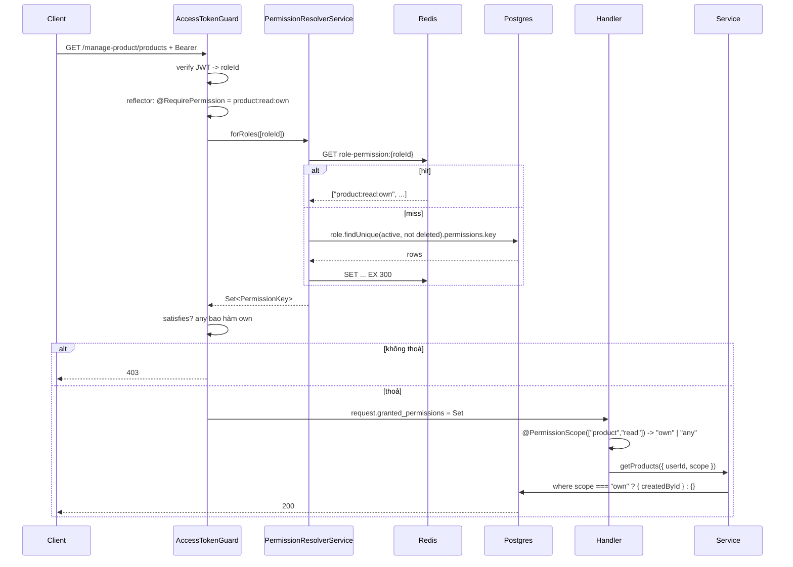

# Phân quyền — thiết kế, luồng chạy và lý do chọn pattern này

> **Tài liệu này dành cho ai:** developer trong dự án, kể cả người chưa từng thiết kế phân quyền.
>
> **Đọc cùng với:**
>
> - [redis-role-permission-cache.md](redis-role-permission-cache.md) — tầng cache Redis cho tập quyền
>   của role.
> - [error-handling.md](error-handling.md) — hợp đồng lỗi. 401 và 403 đi theo đúng hợp đồng đó.
> - [system/permissions.md](system/permissions.md) — bảng ai được làm gì, dạng đọc nhanh cho PM/BA.
> - `plans/260921-1010-rbac-semantic-permissions-refactor/plan.md` — phạm vi và quyết định của lần
>   refactor sinh ra thiết kế này.

**Cách đọc nhanh:**

| Bạn đang cần                        | Đọc            |
| ----------------------------------- | -------------- |
| Hiểu vì sao đổi thiết kế            | Phần 1 → 2     |
| Nắm cơ chế trong 5 phút             | Phần 3 → 4     |
| Thêm route mới hoặc quyền mới       | Phần 9         |
| Debug "vì sao user này bị 403"      | Phần 5 → 10    |
| So với các pattern khác trong ngành | Phần 2 → 11    |
| Review code phần này                | Phần 4 → 6 → 8 |

---

## Mục lục

1. [Vấn đề của thiết kế cũ](#1-vấn-đề-của-thiết-kế-cũ)
2. [Các pattern phân quyền và vị trí của dự án](#2-các-pattern-phân-quyền-và-vị-trí-của-dự-án)
3. [Ba nguyên tắc của thiết kế mới](#3-ba-nguyên-tắc-của-thiết-kế-mới)
4. [Từ vựng quyền: resource, action, scope](#4-từ-vựng-quyền-resource-action-scope)
5. [Luồng chạy của một request](#5-luồng-chạy-của-một-request)
6. [Luật bao hàm và phạm vi dữ liệu](#6-luật-bao-hàm-và-phạm-vi-dữ-liệu)
7. [Ba nơi lưu ba thứ](#7-ba-nơi-lưu-ba-thứ)
8. [Kiểm tra phủ quyền lúc boot](#8-kiểm-tra-phủ-quyền-lúc-boot)
9. [Thêm route, thêm quyền, đổi grant](#9-thêm-route-thêm-quyền-đổi-grant)
10. [Vận hành và debug](#10-vận-hành-và-debug)
11. [Vì sao chọn bậc này, và khi nào phải đi tiếp](#11-vì-sao-chọn-bậc-này-và-khi-nào-phải-đi-tiếp)
12. [Những gì cố tình chưa làm](#12-những-gì-cố-tình-chưa-làm)
13. [Cheat sheet](#13-cheat-sheet)

---

## 1. Vấn đề của thiết kế cũ

Trước lần refactor này, một permission là **một cặp path và HTTP method**, sinh tự động bằng cách quét
Express router rồi ghi vào bảng `Permission`. Role được cấp quyền theo **tên module**, tức đoạn đầu của
URL, và module thì kéo theo mọi method bên trong nó.

Bộ khung đó có mấy điểm tốt và đáng giữ: quyền là dữ liệu, deny-by-default, guard đọc lại mỗi request,
có cache. Nhưng bốn thứ gãy, và cả bốn đều dẫn về một gốc: **quyền được định danh bằng URL**.

| Hạn chế                                             | Hệ quả thật đã xác minh trong code                             |
| --------------------------------------------------- | -------------------------------------------------------------- |
| Cấp theo module, không theo method                  | Client tạo, sửa, xoá được brand, category và bản dịch sản phẩm |
| Không diễn đạt được phạm vi own và any              | Phải viết hệ thứ hai trong service: `roleName !== "admin"`     |
| Danh sách module của seller thiếu BRANDS/CATEGORIES | Seller không đọc được brand để chọn khi tạo sản phẩm           |
| Không có chỗ nào ép luật sở hữu                     | `DELETE /media/delete` xoá file bất kỳ theo key, không kiểm gì |

Và một triệu chứng của việc không có một từ vựng chung: quyền được diễn đạt bằng **năm cách khác nhau**.
Bản ghi Permission trong DB, chuỗi `"admin"` so cứng ở hai service, tra id role ở service user, mảng
`forbiddenRoles` trong role service, và metadata `IsPublicApi`. Không nơi nào trả lời được câu "role X có
làm được việc Y không" mà không đọc cả năm.

---

## 2. Các pattern phân quyền và vị trí của dự án

Phân quyền không có một chuẩn duy nhất, nó là một phổ. Xếp theo độ phức tạp tăng dần:

| Bậc | Pattern                                          | Ví dụ trong ngành                                        | Dùng khi                                         |
| --- | ------------------------------------------------ | -------------------------------------------------------- | ------------------------------------------------ |
| 1   | Kiểm tên role cứng: `@Roles('admin')`            | Nest docs cơ bản                                         | Vài role, không có luật sở hữu                   |
| 2   | RBAC theo permission ngữ nghĩa `resource:action` | Spring Security authorities, Django perms, Keycloak      | Nhiều role, nhiều hành động                      |
| 3   | RBAC cộng trục phạm vi own / any                 | spatie/laravel-permission kèm policy, CASL với điều kiện | Có luật sở hữu, điều kiện đơn giản               |
| 4   | ABAC, policy engine                              | OPA/Rego, AWS Cedar, Casbin                              | Điều kiện phức tạp, đổi policy không cần deploy  |
| 5   | ReBAC, quyền theo quan hệ                        | Google Zanzibar, OpenFGA, SpiceDB                        | Chia sẻ, phân cấp tổ chức, quyền lan theo đồ thị |

**Route-based RBAC** như thiết kế cũ là một pattern thật, nhưng của **tầng API gateway**: Kong, Istio,
AWS API Gateway định danh quyền bằng URL và method vì gateway không biết gì về nghiệp vụ. Đặt nó vào bên
trong application thì mất luôn khả năng nói về phạm vi, và đó là lý do phải đẻ ra hệ thứ hai.

Dự án cũ ở bậc một rưỡi. Thiết kế mới đưa lên **bậc ba**. Vì sao không lên thẳng bậc bốn hay năm, xem
phần 11.

Chỗ dựa của từng mảnh trong thiết kế mới, để biết cái gì là chuẩn thật chứ không phải tự nghĩ:

- **Permission dạng `resource:action`** là mô hình của NIST RBAC, chuẩn INCITS 359, trong đó permission là
  cặp đối tượng và thao tác.
- **Danh mục quyền trong code, bảng cấp quyền trong DB** là cách Spring, Django, Laravel làm.
- **Giải quyền ở server mỗi request thay vì nhét vào JWT.** Nhét permission vào token thì đổi quyền phải
  chờ token hết hạn. Dự án đã làm đúng chỗ này từ trước.
- **Fail closed mặc định** là biến thể của `anyRequest().denyAll()` trong Spring Security. Ở đây nó thành
  kiểm tra lúc boot, xem phần 8.

Phần đi chệch sách có chủ ý: **nhét `scope` vào trong tên quyền**. RBAC kinh điển để phạm vi ở tầng điều
kiện riêng. Lối tắt này đổi lấy một từ vựng duy nhất cho cả guard và service, với cái giá là tập quyền nở
theo số phạm vi. Với đúng hai phạm vi thì đáng. Ngưỡng hết tác dụng ghi ở phần 11.

---

## 3. Ba nguyên tắc của thiết kế mới

**1. Quyền đặt tên theo nghiệp vụ, không theo URL.** Tên quyền phải sống sót qua một lần đổi route.
`product:update:own` vẫn đúng dù route đổi từ `/manage-product/products/:id` sang `/seller/items/:id`.

**2. Có đúng một từ vựng cho quyền.** Guard dùng nó để chặn cửa. Service dùng chính nó để quyết định phạm
vi dữ liệu. Không còn so chuỗi `admin`.

**3. Danh mục quyền nằm trong code, bảng cấp quyền nằm trong DB.** Quyền nào tồn tại là do handler khai
báo, nên thêm quyền mới hiện ra trong diff và được review. Role nào có quyền nào là việc của vận hành,
nằm trong DB. Riêng ba role hệ thống thì bảng cấp quyền cũng nằm trong code, xem phần 7.

---

## 4. Từ vựng quyền: resource, action, scope

Mọi quyền là một chuỗi ba đoạn: `resource:action:scope`.

| Đoạn       | Ý nghĩa                                     | Giá trị hợp lệ                                                                                                                                                                                                             |
| ---------- | ------------------------------------------- | -------------------------------------------------------------------------------------------------------------------------------------------------------------------------------------------------------------------------- |
| `resource` | Năng lực nghiệp vụ, **không phải tên bảng** | `product`, `brand`, `category`, `language`, `product-translation`, `brand-translation`, `category-translation`, `cart`, `order`, `order-fulfilment`, `review`, `media`, `profile`, `session`, `user`, `role`, `permission` |
| `action`   | Thao tác                                    | `create`, `read`, `update`, `delete`, `cancel`, `upload`, `revoke`                                                                                                                                                         |
| `scope`    | Phạm vi                                     | `own` chỉ bản ghi của mình, `any` không giới hạn                                                                                                                                                                           |

Định nghĩa ở `src/constants/permission.constant.ts`. Kiểu `PermissionKey` là template literal type, nên
`"product:updat:own"` là **lỗi biên dịch**, không phải 403 âm thầm lúc chạy.

### Vì sao resource là năng lực, không phải bảng

`order` và `order-fulfilment` cùng chạm bảng `Order`, nhưng là hai năng lực khác nhau: khách đặt và huỷ
đơn của mình, còn seller xem đơn có hàng của mình và chuyển trạng thái. Đặt chung một resource thì không
diễn đạt được "client được tạo đơn nhưng không được chuyển trạng thái". Tách ra thì diễn đạt được bằng
dữ liệu, không cần code.

Ngược lại, duyệt catalogue công khai `GET /products` **không có resource nào**, vì route đó là public.
Không phải mọi route đều cần quyền; public là một trạng thái tường minh, xem phần 8.

### Bảng cấp quyền cho ba role hệ thống

Nằm ở `src/constants/role-permission-matrix.constant.ts`. Đây là **source of truth** cho `admin`,
`seller`, `client`; mỗi lần seed là ghi lại y nguyên.

| Resource                                    | client                   | seller                   | admin                            |
| ------------------------------------------- | ------------------------ | ------------------------ | -------------------------------- |
| `brand`, `category`                         | read:any                 | read:any                 | CRUD:any                         |
| `product`                                   | —                        | CRUD:own                 | CRUD:any                         |
| `product-translation`                       | —                        | CRUD:own                 | CRUD:any                         |
| `brand-translation`, `category-translation` | —                        | —                        | CRUD:any                         |
| `language`                                  | —                        | —                        | CRUD:any                         |
| `cart`                                      | read, update:own         | read, update:own         | read, update:own                 |
| `order`                                     | create, read, cancel:own | create, read, cancel:own | create, cancel:own; read:any     |
| `order-fulfilment`                          | —                        | read, update:own         | read, update:any                 |
| `review`                                    | CRUD:own                 | CRUD:own                 | CRUD:own; delete:any             |
| `media`                                     | upload:own, read:any     | upload:own, read:any     | upload:own, read:any, delete:any |
| `profile`, `session`                        | own                      | own                      | own                              |
| `user`, `role`                              | —                        | —                        | CRUD:any                         |
| `permission`                                | —                        | —                        | read:any                         |

Ba thay đổi so với hành vi cũ: client **mất** quyền ghi brand, category và bản dịch. Seller **được thêm**
quyền đọc brand và category. Media delete **chỉ còn admin**, vì không có bảng ghi ai upload gì nên không
lập được phạm vi own, xem phần 12.

---

## 5. Luồng chạy của một request

Lấy `GET /manage-product/products` do seller Minh gọi.

```
1. Request tới. Express đã parse body và header.
2. AppThrottlerGuard         -> rate limit, không liên quan phân quyền.
3. AuthorizationHeaderGuard  -> đọc metadata: route này cần Bearer.
4. AccessTokenGuard
   a. Lấy token khỏi header, verify chữ ký, hết hạn -> 401 nếu hỏng.
   b. Gắn payload vào request[REQUEST_USER_KEY].
   c. Đọc @RequirePermission trên handler: "product:read:own".
   d. PermissionResolverService.forRoles([roleId]) -> Set các key.
      - Redis GET role-permission:{roleId}. Hit -> dùng luôn.
      - Miss -> Postgres: role còn active và chưa xoá, lấy permissions.key.
      - Cache lại 300s. Role không tồn tại hoặc inactive -> Set rỗng.
   e. Gắn Set vào request[REQUEST_GRANTED_PERMISSIONS_KEY].
   f. satisfies(granted, "product:read:own")? Không -> 403.
5. Handler nhận scope qua @PermissionScope(["product","read"]) -> "own" hoặc "any".
6. Service dựng where theo scope, chạy query.
```



Điểm quan trọng nhất trong luồng này: **bước 4f và bước 6 đọc cùng một Set**. Guard chỉ mở cửa ở mức tối
thiểu handler yêu cầu. Service hỏi lại Set đó để biết cho xem bao nhiêu dữ liệu. Một từ vựng, hai lần
dùng. Trước đây hai việc này do hai hệ khác nhau làm.

### Ba trường hợp cụ thể

**Seller Minh và admin Lan cùng gọi `GET /manage-product/products`**, handler đòi `product:read:own`.

|                        | Minh, seller               | Lan, admin                 |
| ---------------------- | -------------------------- | -------------------------- |
| Có trong Set           | `product:read:own`         | `product:read:any`         |
| Qua guard              | Có                         | Có, vì `any` bao hàm `own` |
| `@PermissionScope` trả | `own`                      | `any`                      |
| Prisma where           | `{ createdById: minh.id }` | `{}`                       |

**Client Hoa gọi `POST /brands`**, handler đòi `brand:create:any`. Set của Hoa có `brand:read:any`,
không có `brand:create:any`. Guard trả 403, **chưa chạm service, chưa query gì**. Hôm trước Hoa đi lọt
vì module BRANDS kéo theo mọi method.

**Hoa gọi `DELETE /media/delete?key=anh-cua-seller-khac.jpg`**, handler đòi `media:delete:any`. Hoa
không có. 403 tại guard. Trước đây route này không kiểm gì.

---

## 6. Luật bao hàm và phạm vi dữ liệu

Toàn bộ "bộ não" nằm trong hai hàm ở `src/shared/utils/permission.util.ts`, tổng cộng dưới mười lăm dòng.

```ts
export const satisfies = (granted, required) => {
  if (granted.has(required)) return true;

  const { resource, action, scope } = parsePermissionKey(required);

  return scope === "own" && granted.has(`${resource}:${action}:any`);
};

export const scopeOf = (granted, resource, action) =>
  granted.has(`${resource}:${action}:any`) ? "any" : "own";
```

Luật bao hàm chỉ có hai dòng:

| Handler đòi | Được thoả bởi            |
| ----------- | ------------------------ |
| `...:own`   | `...:own` hoặc `...:any` |
| `...:any`   | chỉ `...:any`            |

Hệ quả: **handler khai mức tối thiểu nó cần**. Route dành riêng cho admin thì khai `:any` thẳng, ví dụ
`user:delete:any`. Route mà seller và admin cùng dùng nhưng thấy dữ liệu khác nhau thì khai `:own`, rồi
để service hỏi `scopeOf`.

`scopeOf` **không bao giờ từ chối**. Không có key nào thì nó trả `own`, tức là thu hẹp về phía an toàn.
Việc từ chối là của guard, đã xảy ra trước đó. Đây là lý do gọi `scopeOf` mà quên gọi guard không mở
được gì: cùng lắm là thấy dữ liệu của chính mình.

### Ở tầng service trông thế nào

```ts
// manage-product.service.ts
private validateOwnership({ userId, scope, createdById }) {
  if (scope === Scope.OWN && userId !== createdById) {
    throwHttpException({ type: "forbidden", ... });
  }
}

// manage-order.service.ts
private buildActorScope({ userId, scope }): Prisma.OrderWhereInput {
  if (scope === Scope.ANY) return {};
  return { products: { some: { createdById: userId, deletedAt: null } } };
}
```

Hai chỗ này trước đây so `roleName !== Role.ADMIN`. Giờ không service nào biết tên role là gì. Tạo một
role mới tên `manager` qua `POST /roles`, cấp `order-fulfilment:read:any`, là role đó xem được mọi đơn,
không cần sửa một dòng code.

Chú ý cách các service dùng scope khác nhau và đều đúng: manage-product kiểm sau khi đọc rồi ném 403;
manage-order và product-translation đưa vào `where` để bản ghi của người khác thành 404. Cách thứ hai
tốt hơn về mặt không lộ sự tồn tại của bản ghi, và là hướng nên theo khi viết service mới.

Một điểm về **danh mục**: handler chỉ khai `:own`, nên `product:read:any` không xuất hiện trên handler
nào. Script sync tự thêm dạng `any` cho mỗi key `own` đã khai (`withAnyCounterparts`), nếu không thì
matrix cấp `product:read:any` cho admin sẽ trỏ vào một row không tồn tại và admin chỉ thấy sản phẩm của
chính mình. Unit test `src/constants/__tests__/role-permission-matrix.spec.ts` pin hai bất biến: mọi key
trong matrix đều có trong danh mục, và mọi key khai trên handler đều được cấp cho ít nhất một role.

---

## 7. Ba nơi lưu ba thứ

| Thứ                        | Nằm ở đâu                                                    | Ai đổi được                                      |
| -------------------------- | ------------------------------------------------------------ | ------------------------------------------------ |
| Route này cần quyền gì     | `@RequirePermission(...)` ngay trên handler                  | Developer, qua PR                                |
| Quyền nào tồn tại          | Bảng `Permission`, đồng bộ từ các decorator                  | Không ai sửa tay; script sync                    |
| Role nào có quyền nào      | Bảng nối role và permission                                  | Vận hành qua `PUT /roles/:id`, trừ role hệ thống |
| Grant của ba role hệ thống | `RolePermissionMatrix` trong code, ghi xuống DB mỗi lần seed | Developer, qua PR                                |

### Vì sao API `/permissions` chỉ còn đọc

Trước đây có `POST`, `PUT`, `DELETE /permissions`. Trong mô hình mới, permission tồn tại là do một
handler khai báo. Tạo qua API một key không handler nào tham chiếu là vô nghĩa; sửa qua API một key
handler đang dùng là phá mapping. Nên hai route đó bị bỏ. Muốn đổi ai được làm gì thì sửa **từ phía
role**, `PUT /roles/:id` với `permissionIds`.

### Vì sao ba role hệ thống bị chặn sửa qua API

`Role.isSystem = true` cho `admin`, `client`, `seller`. Grant của chúng đến từ code và **được ghi lại mỗi
lần seed**, nên sửa qua API sẽ bị lần seed sau xoá âm thầm. Từ chối ngay là trung thực hơn. Trước đây
việc này làm bằng mảng chuỗi `forbiddenRoles` cứng trong service; giờ là một cột dữ liệu, thêm role hệ
thống mới không cần sửa code.

Đây cũng là chỗ đóng một cửa sau cũ: trước đây `PUT /permissions/:id` nhận `rolesIds` và gắn lại role cho
permission, đi vòng qua `forbiddenRoles`. Bỏ route đó là hết cửa sau.

### Script đồng bộ đổi vai

`initial-scripts/sync-permission-catalog.ts` có hai hàm, và **cố tình tách**:

- `syncPermissionCatalog(app, prisma)` quét `@RequirePermission` trên mọi controller, upsert vào bảng
  `Permission` **kèm dạng `any` của mỗi key `own` đã khai** (handler chỉ khai mức tối thiểu, nên
  `product:read:any` không bao giờ xuất hiện trên handler nhưng vẫn phải tồn tại để cấp cho admin),
  soft-delete key không còn được suy ra từ handler nào. **Không đụng grant.**
- `seedSystemRoleGrants(prisma, cache)` ghi `RolePermissionMatrix` lên ba role hệ thống bằng `set`, rồi
  gọi `invalidateAll()` trên cache Redis. Không đụng role tự tạo. Không invalidate thì một lần **thu hẹp**
  quyền sau deploy vẫn bị cache phục vụ theo bản cũ tới 300 giây.

Tách hai việc là điều giữ cho chỉnh sửa của vận hành trên role tự tạo sống qua deploy. Script cũ ghi đè
grant của mọi role gốc mỗi lần chạy, và không ai phân biệt được DB hay script là sự thật.

Cả hai chạy qua `pnpm seed:initial-scripts:create-permission`, và e2e setup cũng chạy đúng entry đó.

---

## 8. Kiểm tra phủ quyền lúc boot

`PermissionCoverageService` chạy trong `onApplicationBootstrap`. Nó duyệt mọi controller qua
`DiscoveryService` và `MetadataScanner`, và với **mỗi method là route**, kiểm tra:

- có `@RequirePermission`, hoặc
- có `@IsPublicApi()`.

Thiếu cả hai là **app không khởi động**, kèm danh sách `Controller.handler` còn thiếu.

```
Error: Permission coverage check failed for 1 route(s):
  - BrandController.exportCsv has neither @RequirePermission nor @IsPublicApi
```

Ý nghĩa: deny-by-default từ **quy ước** thành **ràng buộc**. Lập trình viên quên decorator thì nhận lỗi
lúc deploy, không phải một endpoint mà chính sách truy cập của nó không ai nhìn thấy. Đây là mảnh rẻ nhất
trong toàn bộ thiết kế, khoảng sáu mươi dòng, và chặn được cả một lớp lỗi.

Nó cũng kiểm tra key hợp lệ lúc chạy, phòng trường hợp ai đó ép kiểu để lách template literal type.

Và nó **từ chối policy trộn `None` với kiểu khác**, ví dụ `AuthApi([BEARER, NONE], OR)`. Lý do: dưới
`OR`, token hỏng làm `AccessTokenGuard` ném lỗi **trước** khi tới bước kiểm quyền, guard tổng nuốt lỗi
rồi rơi sang `None` và cho qua. Key khai trên handler khi đó không bao giờ được kiểm. "Optional auth" là
nhu cầu thật nhưng cần thiết kế riêng, không phải bằng cách trộn hai kiểu.

Guard vẫn tự phòng thủ thêm một lớp: nếu vì lý do gì đó một route không có decorator mà vẫn tới được
guard, guard trả **500** kèm log lỗi, không phải 403. Đó là lỗi wiring, không phải lỗi của client, và
báo "forbidden" sẽ che mất nó.

---

## 9. Thêm route, thêm quyền, đổi grant

### Thêm route dùng quyền đã có

```ts
@RequirePermission("brand:read:any")
@Get("featured")
async getFeatured() {}
```

Xong. Boot check pass, không cần chạy sync vì key đã có trong danh mục.

### Thêm quyền mới

1. Nếu cần resource hoặc action mới, thêm vào `Resource` / `Action` trong `permission.constant.ts`.
   Không thêm là lỗi biên dịch ngay tại decorator.
2. Khai `@RequirePermission("x:y:z")` trên handler.
3. Thêm key vào `RolePermissionMatrix` cho role nào được dùng nó.
4. Chạy `pnpm seed:initial-scripts:create-permission` ở mọi môi trường. Bước này upsert key vào danh mục
   và ghi lại grant cho ba role hệ thống.
5. Thêm một dòng vào `test/e2e/permission/role-permission-matrix.e2e-spec.ts`: role nào được, role nào bị 403.

Quên bước 3 thì route chạy nhưng không role nào vào được, kể cả admin. Đây là cố ý: admin không còn tự
động nhận mọi quyền mới; ai được gì phải là quyết định viết ra.

Không cần khai `x:y:any` trên handler chỉ để cấp cho admin: khai `x:y:own` là đủ, danh mục tự sinh
dạng `any` tương ứng, và matrix cấp `x:y:any` cho admin.

### Route có phạm vi own và any

```ts
@RequirePermission("order-fulfilment:read:own")
@Get()
async list(
  @ActiveUser("userId") userId: string,
  @PermissionScope(["order-fulfilment", "read"]) scope: ScopeType,
) {
  return this.service.list({ userId, scope });
}
```

Trong service, ưu tiên đưa scope vào `where` để bản ghi của người khác thành 404, thay vì đọc lên rồi ném 403.

### Route public

```ts
@IsPublicApi()
@Get()
async browse() {}
```

Public là một quyết định tường minh, không phải là "quên khai quyền". Boot check phân biệt được hai
trường hợp này.

### Đổi grant cho role tự tạo

`PUT /roles/:id` với `permissionIds` lấy từ `GET /permissions`. Không cần deploy.

### Đổi grant cho admin, seller, client

Sửa `RolePermissionMatrix`, mở PR, deploy, chạy seed. Đây là thay đổi bảo mật và phải đi qua review.

### Checklist trước khi merge

- [ ] Mọi route mới có `@RequirePermission` hoặc `@IsPublicApi`. App boot được là đủ bằng chứng.
- [ ] Route nhận id bản ghi của user khác thì khai `:own` và service dùng `scopeOf`, không so tên role.
- [ ] Key mới có trong `RolePermissionMatrix` và có dòng trong e2e ma trận.
- [ ] Không có chuỗi `"admin"`, `"seller"`, `"client"` xuất hiện trong service để quyết định quyền.

---

## 10. Vận hành và debug

### "Vì sao user này bị 403"

1. Lấy `roleId` từ token: `jwt.decode(accessToken).roleId`.
2. Xem tập quyền role đó đang được cache:

   ```bash
   redis-cli GET "role-permission:<roleId>"
   ```

   Không có key nghĩa là cache miss, guard sẽ đọc Postgres. Có key thì đó chính là Set guard dùng.

3. Xem route đòi gì: mở controller, đọc `@RequirePermission` trên handler.
4. Áp luật bao hàm ở phần 6. Đòi `x:y:own` thì Set phải có `x:y:own` hoặc `x:y:any`.

### Vừa đổi grant mà chưa có hiệu lực

`RoleService.updateRole` đã gọi `invalidateRole(roleId)`, nhưng cache TTL là 300 giây làm lưới an toàn.
Nếu đổi thẳng trong DB không qua API thì phải xoá tay:

```bash
redis-cli DEL "role-permission:<roleId>"
# hoặc toàn bộ
redis-cli --scan --pattern 'role-permission:*' | xargs -r redis-cli DEL
```

### App không boot, báo "Permission coverage check failed"

Đọc danh sách trong message. Mỗi dòng là một `Controller.handler` thiếu decorator. Thêm
`@RequirePermission` hoặc `@IsPublicApi` rồi boot lại.

### Seed báo "matrix key(s) not declared by any route"

`RolePermissionMatrix` có key mà không handler nào khai. Hoặc là key gõ sai, hoặc là route đã bị xoá mà
matrix chưa dọn. Không nguy hiểm, key đó chỉ bị bỏ qua, nhưng nên dọn để matrix luôn phản ánh đúng.

### Các con số

| Chỉ số                                    | Cũ                          | Mới                    |
| ----------------------------------------- | --------------------------- | ---------------------- |
| Key Redis cho cache quyền                 | role nhân route, khoảng 210 | bằng số role, khoảng 3 |
| Query Postgres để làm ấm cache sau deploy | khoảng 210                  | khoảng 3               |
| Số cách diễn đạt quyền trong code         | 5                           | 1                      |
| Số nơi viết luật sở hữu                   | 4, thiếu 1                  | 1 hàm `scopeOf`        |
| Phát hiện route thiếu khai quyền          | khi có người gọi            | lúc boot               |

---

## 11. Vì sao chọn bậc này, và khi nào phải đi tiếp

Thiết kế này là **best practice đúng tầm** cho dự án hiện tại: có luật sở hữu, điều kiện chỉ có hai
phạm vi, một service, sắp có worker. Nó không phải pattern tiên tiến nhất và không cần phải là.

Không lên bậc bốn hay năm vì: OPA hay OpenFGA là mua một hệ policy riêng để phục vụ đúng hai phạm vi own
và any, tức trả giá phức tạp cho thứ chưa dùng tới. Bậc ba giải quyết mọi yêu cầu đang có bằng mười lăm
dòng logic.

**Dấu hiệu đã tới lúc đi tiếp**, gặp cái thứ hai thì nên tính:

- Xuất hiện điều kiện không diễn đạt bằng own hay any: duyệt đơn dưới một giá trị, chỉ sửa sản phẩm
  trong danh mục mình phụ trách, quyền theo trạng thái đơn, quyền theo chi nhánh.
- Cần phạm vi thứ ba, ví dụ `team`. Khi đó số permission nở theo phép nhân và lối tắt "scope trong tên"
  bắt đầu đắt.
- Cần đổi policy mà không deploy, ở mức điều kiện chứ không chỉ ở mức grant.
- Quyền lan theo quan hệ: chia sẻ bản ghi cho người khác, tổ chức nhiều tầng.

Khi đó, phần nên giữ nguyên là từ vựng `resource:action` và decorator trên handler; phần thay là cách
giải `scope`, chuyển sang một policy function hoặc engine bên ngoài.

---

## 12. Những gì cố tình chưa làm

Ghi ra để không ai tưởng đã kín.

| #   | Việc                                              | Vì sao chưa                                                                 | Hướng làm                                                            |
| --- | ------------------------------------------------- | --------------------------------------------------------------------------- | -------------------------------------------------------------------- |
| 1   | Một user nhiều role                               | Blast radius lớn: JWT payload, mọi query user, seeder, khoảng bốn mươi test | `PermissionResolverService.forRoles` đã nhận mảng; đổi schema là đủ  |
| 2   | Bảng nối tường minh có `grantedAt`, `grantedById` | Ngoài phạm vi lần này                                                       | Nên làm; đổi grant là thay đổi mà sáu tháng sau có người hỏi "ai mở" |
| 3   | Phạm vi own cho media                             | Không có bảng ghi ai upload gì, key S3 không có prefix user                 | Bảng `MediaObject{key, uploadedById}`, rồi `media:delete:own`        |
| 4   | Kế thừa role                                      | Ba role phẳng, thêm phân cấp chỉ tốn công                                   | Khi có hơn năm role                                                  |
| 5   | Regenerate `docs/generated/permissions-matrix.md` | File do `rebuild-spec` sinh, đang có banner báo lệch                        | Chạy lại rebuild-spec                                                |

Review sau refactor bắt được một chỗ decorator hứa `:own` mà service chưa thực thi: `product-translation`.
Đã sửa cùng ngày. Bản dịch thuộc về người tạo sản phẩm, nên fence là predicate trên quan hệ
`product.createdById`, áp vào `where` để bản ghi của seller khác thành 404. Có e2e riêng
`test/e2e/product/product-translation-ownership.e2e-spec.ts` pin lại.

---

## 13. Cheat sheet

```
Từ vựng               src/constants/permission.constant.ts
Bảng cấp quyền        src/constants/role-permission-matrix.constant.ts
Decorator             @RequirePermission("resource:action:scope")
Phạm vi trong handler @PermissionScope(["resource", "action"]) scope: ScopeType
Luật                  src/shared/utils/permission.util.ts  (satisfies, scopeOf)
Resolver + cache      src/shared/services/permission-resolver.service.ts
                      src/shared/services/role-permission-cache.service.ts
Guard                 src/shared/guards/access-token.guard.ts
Boot check            src/shared/services/permission-coverage.service.ts
Sync + seed grant     initial-scripts/sync-permission-catalog.ts
```

```
Luật bao hàm
  đòi own  <- own hoặc any
  đòi any  <- chỉ any

scopeOf(granted, r, a)  ->  có r:a:any ? "any" : "own"   (không bao giờ từ chối)

Redis
  role-permission:{roleId}   Set key dạng JSON, TTL 300s
```

```bash
# Tập quyền một role đang cache
redis-cli GET "role-permission:<roleId>"

# Đồng bộ danh mục + ghi lại grant ba role hệ thống
pnpm seed:initial-scripts:create-permission

# Test
npx jest permission guards          # unit
pnpm test:e2e                       # e2e, cần Postgres + Redis
```
