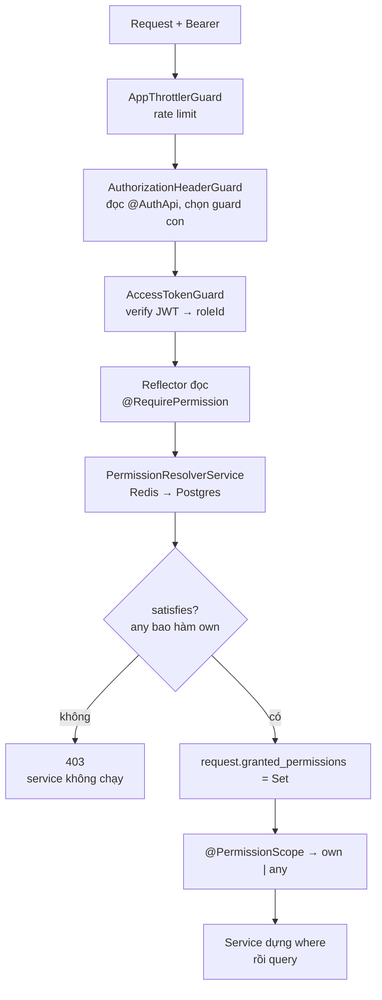

# Phân quyền — cơ chế NestJS bên dưới và đi bộ qua code thật

> **Tài liệu này dành cho ai:** người đọc `authorization-guide.md` mà vẫn thấy tắc, vì tài liệu đó
> giả định bạn đã quen decorator, metadata, Reflector và Guard của NestJS.
>
> **Bản trực quan:** [authorization-mechanics-and-code-walkthrough.html](authorization-mechanics-and-code-walkthrough.html)
> — cùng nội dung, có sơ đồ phóng to được và giao diện sáng/tối. Mở thẳng bằng trình duyệt, không cần server.
>
> **Thứ tự đọc:** file này **trước**, rồi mới sang
> [authorization-guide.md](authorization-guide.md). File này trả lời _"cỗ máy chạy thế nào"_; file kia
> trả lời _"vì sao thiết kế như vậy"_ và _"làm sao thêm quyền mới"_.

**Cách đọc nhanh:**

| Bạn đang cần                                          | Đọc    |
| ----------------------------------------------------- | ------ |
| Hiểu vì sao viết một dòng decorator mà guard đọc được | Phần A |
| Bám theo một request từ đầu tới cuối                  | Phần B |
| Tra nhanh "file này làm gì"                           | Phần C |
| Tự tay kiểm chứng, không tin suông                    | Phần D |

---

## Mục lục

- [A. Bốn cơ chế NestJS làm nên hệ phân quyền](#a-bốn-cơ-chế-nestjs-làm-nên-hệ-phân-quyền)
  - [A1. Decorator chỉ là cái nhãn dán, không phải logic](#a1-decorator-chỉ-là-cái-nhãn-dán-không-phải-logic)
  - [A2. Reflector đọc lại nhãn](#a2-reflector-đọc-lại-nhãn)
  - [A3. Guard là người gác cửa, chạy trước handler](#a3-guard-là-người-gác-cửa-chạy-trước-handler)
  - [A4. Param decorator và cái băng chuyền tên là `request`](#a4-param-decorator-và-cái-băng-chuyền-tên-là-request)
  - [A5. DiscoveryService đọc toàn bộ nhãn lúc boot](#a5-discoveryservice-đọc-toàn-bộ-nhãn-lúc-boot)
- [B. Đi bộ qua một request thật](#b-đi-bộ-qua-một-request-thật)
- [C. Bảng tra: file nào làm gì](#c-bảng-tra-file-nào-làm-gì)
- [D. Tự kiểm chứng](#d-tự-kiểm-chứng)
- [E. Đọc tiếp](#e-đọc-tiếp)

---

## A. Bốn cơ chế NestJS làm nên hệ phân quyền

Nếu bạn nhìn `@RequirePermission("product:read:own")` và thấy khó hiểu, gần như chắc chắn là vì bốn
khái niệm dưới đây chưa rõ. Chúng là của NestJS, không phải của dự án — nắm xong thì phần còn lại chỉ
là đọc code.

### A1. Decorator chỉ là cái nhãn dán, không phải logic

Đây là toàn bộ `@RequirePermission` — [require-permission.decorator.ts:12-13](../src/shared/param-decorators/require-permission.decorator.ts#L12-L13):

```ts
export const RequirePermission = (key: PermissionKey) =>
  SetMetadata(PERMISSION_KEY, key);
```

Hết. Không có `if`, không kiểm tra gì, không chặn ai.

`SetMetadata(key, value)` chỉ làm một việc: **gắn một cặp key–value lên chính hàm đó** (bên dưới là
`Reflect.defineMetadata` của thư viện `reflect-metadata`). Giống dán một tờ giấy nhớ lên cửa phòng ghi
_"phòng này cần thẻ product:read:own"_. **Tờ giấy không khoá cửa.** Nó chỉ nằm đó chờ ai đó đọc.

Nhớ điều này thì hết bối rối: decorator **khai báo ý định**, guard **thi hành ý định**. Hai thứ tách rời.
Nếu guard không chạy, dán bao nhiêu nhãn cũng vô nghĩa — đó đúng là lỗ hổng tiềm ẩn ghi ở phần
[§12 của authorization-guide](authorization-guide.md) về route chỉ dùng API key.

Cùng cơ chế đó, `@IsPublicApi()` cũng chỉ là một nhãn khác —
[auth-api.decorator.ts:19](../src/shared/param-decorators/auth-api.decorator.ts#L19):

```ts
export const IsPublicApi = () => AuthApi([AuthorizationType.NONE]);
```

### A2. Reflector đọc lại nhãn

Dán rồi thì ai đọc? `Reflector` — một service NestJS tiêm sẵn.
[access-token.guard.ts:77-79](../src/shared/guards/access-token.guard.ts#L77-L79):

```ts
const required = this.reflector.getAllAndOverride<PermissionKey | undefined>(
  PERMISSION_KEY,
  [context.getHandler(), context.getClass()],
);
```

Đọc câu này như sau: _"tìm nhãn `PERMISSION_KEY`, nhìn ở method trước, không có thì nhìn lên class"_.

Thứ tự trong mảng chính là thứ tự ưu tiên. `getAllAndOverride` trả về **cái đầu tiên tìm thấy**, nên
nhãn trên method **đè** nhãn trên class. Nhờ vậy bạn có thể dán một nhãn mặc định cho cả controller rồi
ghi đè riêng vài route — dự án hiện chưa dùng cách đó, nhưng cơ chế sẵn sàng.

Không có nhãn nào → trả về `undefined`. Guard coi đó là **lỗi wiring**, không phải lỗi client, nên trả
500 chứ không phải 403 ([access-token.guard.ts:81-93](../src/shared/guards/access-token.guard.ts#L81-L93)).
Fail loud, không fail âm thầm.

### A3. Guard là người gác cửa, chạy trước handler

Một request trong NestJS đi qua dây chuyền cố định:

```
Request → Middleware → Guard → Interceptor → Pipe → Handler → Interceptor → Response
```

Guard đứng **trước** handler và trả về `true` / `false` / ném exception. `false` hoặc exception thì
handler **không bao giờ chạy** — đây là lý do một request bị 403 không hề chạm tới service, không tốn
một query nào.

Guard toàn cục đăng ký trong [base.module.ts:43-54](../src/shared/modules/base.module.ts#L43-L54):

```ts
const guards: Provider[] = [
  AccessTokenGuard, // <- provider thường, KHÔNG tự chạy
  ApiKeyGuard, // <- provider thường, KHÔNG tự chạy
  { provide: APP_GUARD, useClass: AppThrottlerGuard },
  { provide: APP_GUARD, useClass: AuthorizationHeaderGuard },
];
```

Hai điểm hay gây nhầm:

1. **Chỉ những provider có `provide: APP_GUARD` mới tự chạy mỗi request.** `AccessTokenGuard` và
   `ApiKeyGuard` nằm đó chỉ để DI container tiêm được chúng vào `AuthorizationHeaderGuard`. Chúng được
   gọi **bằng tay**, không phải bởi Nest.
2. **Thứ tự đăng ký là thứ tự chạy.** `AppThrottlerGuard` (rate limit) đứng trước có chủ đích: nếu nằm
   sau, mọi request bị chặn vẫn phải trả giá verify JWT trước — xem comment giải thích tại
   [base.module.ts:39-42](../src/shared/modules/base.module.ts#L39-L42).

`AuthorizationHeaderGuard` là một **guard điều phối**: nó đọc nhãn `@AuthApi` để biết route cần loại
xác thực nào, rồi tự gọi guard con tương ứng qua một bảng tra
([authorization-header.guard.ts:25-31](../src/shared/guards/authorization-header.guard.ts#L25-L31)):

```ts
private readonly authorizationTypeMapper = {
  [AuthorizationType.BEARER]:  this.accessTokenGuard,
  [AuthorizationType.API_KEY]: this.apiKeyGuard,
  [AuthorizationType.NONE]:    { canActivate: () => true },
};
```

Route không dán nhãn gì → mặc định là `BEARER` + `AND`
([authorization-header.guard.ts:44-47](../src/shared/guards/authorization-header.guard.ts#L44-L47)).
**Mặc định là đóng, phải chủ động mở** — đó là deny-by-default ở tầng xác thực.

### A4. Param decorator và cái băng chuyền tên là `request`

Guard và handler là hai hàm khác nhau, không gọi nhau, không truyền tham số cho nhau. Vậy handler lấy
thông tin guard vừa tính ra bằng cách nào?

Qua **object `request`**. Cả hai cùng nhìn vào nó. Guard ghi vào, handler đọc ra.

Guard ghi — [access-token.guard.ts:99](../src/shared/guards/access-token.guard.ts#L99):

```ts
request[REQUEST_GRANTED_PERMISSIONS_KEY] = granted; // Set<PermissionKey>
```

Handler đọc, thông qua một _param decorator_ —
[permission-scope.decorator.ts:19-31](../src/shared/param-decorators/permission-scope.decorator.ts#L19-L31):

```ts
export const PermissionScope = createParamDecorator(
  (
    [resource, action]: [ResourceType, ActionType],
    context: ExecutionContext,
  ): ScopeType => {
    const request = context.switchToHttp().getRequest<Request>();
    const granted = request[REQUEST_GRANTED_PERMISSIONS_KEY] as
      | ReadonlySet<PermissionKey>
      | undefined;

    return scopeOf(granted ?? new Set(), resource, action);
  },
);
```

`createParamDecorator` tạo ra thứ bạn viết ngay trong danh sách tham số của handler. Nó chạy **sau
guard**, ngay trước khi handler được gọi — chính vì thế cái `Set` guard vừa gắn chắc chắn đã có mặt.

`@ActiveUser("userId")` cũng y hệt, chỉ khác là đọc `request[REQUEST_USER_KEY]` mà guard gắn ở
[access-token.guard.ts:123](../src/shared/guards/access-token.guard.ts#L123).

> **Chi tiết an toàn đáng chú ý:** nếu `granted` vì lý do nào đó là `undefined`, decorator dùng
> `new Set()` — và `scopeOf` trên tập rỗng trả về `"own"`, tức là **hẹp nhất**
> ([permission.util.ts:42-49](../src/shared/utils/permission.util.ts#L42-L49)). Hỏng thì hỏng theo
> hướng ít quyền hơn, không phải nhiều quyền hơn.

### A5. DiscoveryService đọc toàn bộ nhãn lúc boot

Ba mục trên đọc nhãn của **một** route đang được gọi. Còn hai việc cần đọc nhãn của **mọi** route:

- kiểm tra lúc boot xem có route nào quên khai quyền không;
- sinh danh mục quyền để ghi vào DB.

`DiscoveryService` (lấy được nhờ `DiscoveryModule` import ở
[base.module.ts:104](../src/shared/modules/base.module.ts#L104)) trả về mọi controller DI container đã
dựng. `MetadataScanner` liệt kê method của chúng. Cả hai gộp lại trong một hàm dùng chung —
[collect-route-permissions.util.ts:34-87](../src/shared/utils/collect-route-permissions.util.ts#L34-L87):

```ts
for (const wrapper of discoveryService.getControllers()) { ... }
```

Mẹo lọc đáng chú ý ở [dòng 57-61](../src/shared/utils/collect-route-permissions.util.ts#L57-L61): chỉ
method nào Nest đăng ký thành route mới mang metadata `PATH_METADATA`, nên helper thường trên
controller bị bỏ qua tự động.

Hàm này có **một** bản dùng cho cả hai việc, có chủ đích: kiểm tra lúc boot và script đồng bộ không bao
giờ bất đồng về việc route nào cần quyền gì.

---

## B. Đi bộ qua một request thật

Ví dụ: `GET /manage-product/products` — màn hình "sản phẩm của tôi".

Hai nhân vật gọi cùng endpoint này:

- **Minh** — seller, trong tập quyền có `product:read:own`
- **Lan** — admin, trong tập quyền có `product:read:any`

### Bước 0 — Route khai nó cần gì

[manage-product.controller.ts:50-58](../src/routes/product/manage-product/manage-product.controller.ts#L50-L58):

```ts
@RequirePermission("product:read:own")
@Get()
async getManageProducts(
  @Query() query: ManageProductPaginationQueryDto,
  @CurrentLang() languageId: LanguageSchema["id"],
  @ActiveUser("userId") userId: UserSchema["id"],
  @PermissionScope(["product", "read"]) scope: ScopeType,
): Promise<PageDto<ProductResponseDto>> {
```

Chú ý: khai `own`, **mức tối thiểu**, dù admin cũng dùng chung route này. Đây là điểm mấu chốt của cả
thiết kế — xem bước 7.

### Bước 1 — `AppThrottlerGuard`

Rate limit. Không liên quan phân quyền. Vượt hạn mức → 429, dừng tại đây.

### Bước 2 — `AuthorizationHeaderGuard` chọn guard con

Route không dán `@AuthApi` → mặc định `[BEARER]` + `AND` → chạy `AccessTokenGuard`
([authorization-header.guard.ts:70-77](../src/shared/guards/authorization-header.guard.ts#L70-L77)).

### Bước 3 — Lấy token khỏi header

[access-token.guard.ts:34-38](../src/shared/guards/access-token.guard.ts#L34-L38). Không có, hoặc không
phải dạng `Bearer <token>` → **401**, `"Access token is required."`

### Bước 4 — Verify chữ ký

[access-token.guard.ts:40-61](../src/shared/guards/access-token.guard.ts#L40-L61). Hết hạn → 401
`"Access token is expired."`; hỏng → 401 `"Access token is invalid."` Hai thông điệp tách riêng để
client biết nên gọi refresh hay bắt đăng nhập lại.

Verify xong ta có payload: `{ userId, deviceId, roleId, roleName, iat, exp }`
([jwt-payload.type.ts:8-15](../src/types/jwt-payload.type.ts#L8-L15)). Gắn vào request tại
[dòng 123](../src/shared/guards/access-token.guard.ts#L123).

> **Quan trọng:** token mang `roleId`, **không** mang danh sách quyền. Quyền luôn được tra lại mỗi
> request. Đổi grant là có hiệu lực ngay (sau TTL cache), không phải chờ user đăng nhập lại.

### Bước 5 — Đọc nhãn của route

Như A2. Được chuỗi `"product:read:own"`.

### Bước 6 — Tra tập quyền của role

[access-token.guard.ts:95-97](../src/shared/guards/access-token.guard.ts#L95-L97) gọi
`PermissionResolverService.forRoles([roleId])`. Bên trong
([permission-resolver.service.ts:38-62](../src/shared/services/permission-resolver.service.ts#L38-L62)):

1. Thử Redis: `GET role-permission:{roleId}`
   ([role-permission-cache.service.ts:29-41](../src/shared/services/role-permission-cache.service.ts#L29-L41)).
   Trúng → dùng luôn.
2. Trượt → Postgres: `role.findUnique({ where: { id, isActive: true, deletedAt: null } })`, lấy
   `permissions.key`.
3. Ghi lại Redis, TTL 300s.

Kết quả: `Set<PermissionKey>`.

Ba tình huống biên đáng nhớ:

| Tình huống                             | Kết quả                                                          |
| -------------------------------------- | ---------------------------------------------------------------- |
| Role bị xoá mềm hoặc `isActive: false` | `Set` rỗng → bước 7 cho ra **403**                               |
| Redis chết                             | Log lỗi, trả `null`, rơi về Postgres → vẫn chạy                  |
| Postgres chết                          | Lỗi **ném lên**, thành **500** — cố ý, không hoá trang thành 403 |

Điểm cuối bảng là một quyết định thiết kế: guard cũ bọc mọi thứ trong một `catch` rồi trả "forbidden",
khiến sự cố hạ tầng trông như chính sách và tàng hình trước người trực. Xem
[access-token.guard.ts:63-71](../src/shared/guards/access-token.guard.ts#L63-L71).

### Bước 7 — `satisfies()` — luật duy nhất của cả hệ

[permission.util.ts:18-32](../src/shared/utils/permission.util.ts#L18-L32):

```ts
export const satisfies = (
  granted: ReadonlySet<string>,
  required: PermissionKey,
): boolean => {
  if (granted.has(required)) return true;

  const { resource, action, scope } = parsePermissionKey(required);

  return (
    scope === Scope.OWN &&
    granted.has(buildPermissionKey(resource, action, Scope.ANY))
  );
};
```

Dịch ra tiếng người: _"có đúng cái key đó thì qua; hoặc route đòi `own` mà bạn cầm `any` thì cũng qua."_

**`any` bao hàm `own`. Chiều ngược lại thì không.**

Áp vào hai nhân vật:

|                 | Minh (seller)       | Lan (admin)                            |
| --------------- | ------------------- | -------------------------------------- |
| Route đòi       | `product:read:own`  | `product:read:own`                     |
| Trong `Set`     | `product:read:own`  | `product:read:any`                     |
| `granted.has()` | trúng ngay → `true` | trượt → xét tiếp                       |
| Nhánh bao hàm   | —                   | route đòi `own`, có `...:any` → `true` |
| Kết quả         | **qua**             | **qua**                                |

Một route, một dòng khai báo, hai người qua được vì hai lý do khác nhau. Nếu ai đó dán
`@RequirePermission("product:read:any")` lên route này thì Minh sẽ bị 403 — nên nhớ **luôn khai mức tối
thiểu**.

Không thoả → **403**, `"You do not have permission to access this resource."` Dừng. Handler không chạy,
service không chạy, DB không bị đụng.

### Bước 8 — Guard đặt `Set` lên băng chuyền

[access-token.guard.ts:99](../src/shared/guards/access-token.guard.ts#L99). Lưu ý dòng này nằm **trước**
lệnh kiểm tra `satisfies` — không sao, vì request bị 403 thì chẳng ai đọc nó nữa.

### Bước 9 — Param decorator chạy, handler nhận tham số

`@PermissionScope(["product", "read"])` gọi `scopeOf`
([permission.util.ts:42-49](../src/shared/utils/permission.util.ts#L42-L49)):

```ts
granted.has("product:read:any") ? Scope.ANY : Scope.OWN;
```

→ Minh nhận `"own"`, Lan nhận `"any"`.

> `scopeOf` **không phân quyền**. Nó chỉ đo _"đi được xa tới đâu"_, và chỉ đúng khi guard đã cho qua
> trước đó. Gọi nó ở nơi chưa qua guard là dùng sai.

### Bước 10 — Service biến `scope` thành `where`

[manage-product.service.ts:50-77](../src/routes/product/manage-product/manage-product.service.ts#L50-L77).
Tham số `createdById` mặc định bằng `userId` của chính người gọi
([dòng 65](../src/routes/product/manage-product/manage-product.service.ts#L65)), rồi qua hàng rào sở hữu
([dòng 40-45](../src/routes/product/manage-product/manage-product.service.ts#L40-L45)):

```ts
if (scope === Scope.OWN && userIdRequest !== createdById) {
  throwHttpException({ type: "forbidden", ... });
}
```

- **Minh** truyền `createdById` là ai khác → 403. Để trống → lọc đúng sản phẩm của mình.
- **Lan** (`scope === "any"`) → điều kiện `scope === Scope.OWN` sai, đi thẳng qua, lọc `createdById` nào
  cũng được.

### Tóm lại bằng một hình



**Hai lần dùng, một từ vựng.** Guard hỏi _"vào được không"_. Service hỏi _"thấy bao nhiêu"_. Cả hai đọc
cùng một `Set`. Trước refactor, hai câu hỏi này do hai hệ thống rời nhau trả lời, và đó là gốc của phần
lớn lỗi phân quyền cũ.

---

## C. Bảng tra: file nào làm gì

| File                                                                                              | Vai trò                                                            |
| ------------------------------------------------------------------------------------------------- | ------------------------------------------------------------------ |
| [permission.constant.ts](../src/constants/permission.constant.ts)                                 | Từ vựng đóng: resource, action, scope + kiểu `PermissionKey`       |
| [role-permission-matrix.constant.ts](../src/constants/role-permission-matrix.constant.ts)         | Ba role hệ thống được cấp quyền gì — **nguồn sự thật**, sửa qua PR |
| [require-permission.decorator.ts](../src/shared/param-decorators/require-permission.decorator.ts) | Dán nhãn quyền lên handler                                         |
| [auth-api.decorator.ts](../src/shared/param-decorators/auth-api.decorator.ts)                     | Dán nhãn loại xác thực; `@IsPublicApi()` nằm ở đây                 |
| [permission-scope.decorator.ts](../src/shared/param-decorators/permission-scope.decorator.ts)     | Đưa `own`/`any` xuống handler                                      |
| [active-user.decorator.ts](../src/shared/param-decorators/active-user.decorator.ts)               | Đưa payload JWT xuống handler                                      |
| [authorization-header.guard.ts](../src/shared/guards/authorization-header.guard.ts)               | Điều phối: route này cần Bearer / ApiKey / None                    |
| [access-token.guard.ts](../src/shared/guards/access-token.guard.ts)                               | **Trái tim**: verify token, tra quyền, quyết cho qua hay 403       |
| [permission-resolver.service.ts](../src/shared/services/permission-resolver.service.ts)           | roleId → `Set<PermissionKey>` (cache trước, DB sau)                |
| [role-permission-cache.service.ts](../src/shared/services/role-permission-cache.service.ts)       | Tầng Redis, một key cho mỗi role, TTL 300s, fail-open              |
| [permission.util.ts](../src/shared/utils/permission.util.ts)                                      | `satisfies`, `scopeOf`, `withAnyCounterparts` — dưới 20 dòng logic |
| [collect-route-permissions.util.ts](../src/shared/utils/collect-route-permissions.util.ts)        | Quét mọi controller, gom nhãn — dùng chung cho boot-check và seed  |
| [permission-coverage.service.ts](../src/shared/services/permission-coverage.service.ts)           | Chặn boot nếu có route non-public quên khai quyền                  |
| [sync-permission-catalog.ts](../initial-scripts/sync-permission-catalog.ts)                       | Ghi danh mục quyền vào DB + áp matrix cho ba role hệ thống         |
| [base.module.ts](../src/shared/modules/base.module.ts)                                            | Đăng ký guard toàn cục, đúng thứ tự                                |

---

## D. Tự kiểm chứng

Đừng tin tài liệu, chạy thử. Bốn thí nghiệm dưới đây mỗi cái mất chưa tới một phút và chứng minh một
mắt xích khác nhau.

**1. Chứng minh boot-check là thật.** Xoá tạm dòng `@RequirePermission` ở
[manage-product.controller.ts:50](../src/routes/product/manage-product/manage-product.controller.ts#L50)
rồi chạy app. App **không khởi động**, báo:

```
Permission coverage check failed for 1 route(s):
  - ManageProductController.getManageProducts has neither @RequirePermission nor @IsPublicApi
```

Khôi phục lại dòng đó. Đây là lý do "quên khai quyền" không thể lọt lên production.

**2. Nhìn tận mắt tập quyền đang cache.**

```bash
docker compose exec redis redis-cli --scan --pattern 'role-permission:*'
docker compose exec redis redis-cli GET 'role-permission:<roleId>'
```

Sẽ thấy đúng mảng JSON các key mà `satisfies` đọc.

**3. Chạy test đã đóng đinh luật bao hàm.**

```bash
npx jest src/shared/utils/__tests__/permission.util.spec.ts
npx jest src/constants/__tests__/role-permission-matrix.spec.ts
```

Test thứ hai là hàng rào chống trôi giữa matrix và controller: cấp một quyền mà không route nào khai,
hoặc khai một quyền không role nào được cấp, đều đỏ.

**4. Chạy e2e xem hành vi thật đầu-cuối.** Cần Docker (Postgres 5433 + Redis):

```bash
npx jest --config test/jest-e2e.json test/e2e/permission/role-permission-matrix.e2e-spec.ts
```

---

## E. Đọc tiếp

| Tiếp theo                              | Ở đâu                                                            |
| -------------------------------------- | ---------------------------------------------------------------- |
| Vì sao thiết kế như vậy, so với ngành  | [authorization-guide.md](authorization-guide.md) §1, §2, §11     |
| Thêm route mới / quyền mới / đổi grant | [authorization-guide.md](authorization-guide.md) §9              |
| Debug "vì sao user này 403"            | [authorization-guide.md](authorization-guide.md) §10             |
| Ai được làm gì (bảng đọc nhanh)        | [system/permissions.md](system/permissions.md)                   |
| Tầng cache Redis chi tiết              | [redis-role-permission-cache.md](redis-role-permission-cache.md) |
| 401/403 đi theo hợp đồng lỗi nào       | [error-handling.md](error-handling.md)                           |
