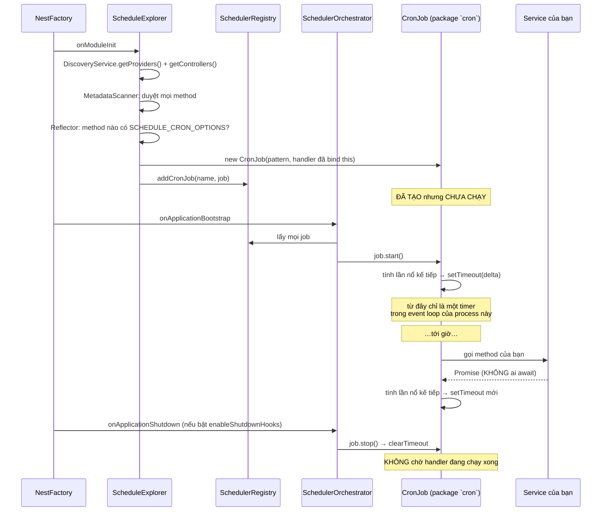
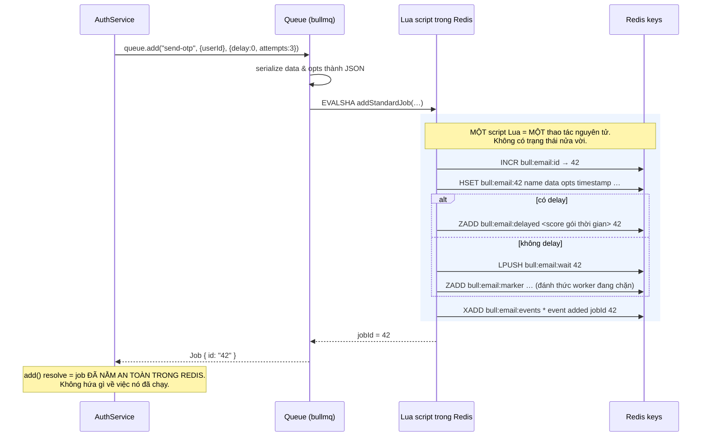
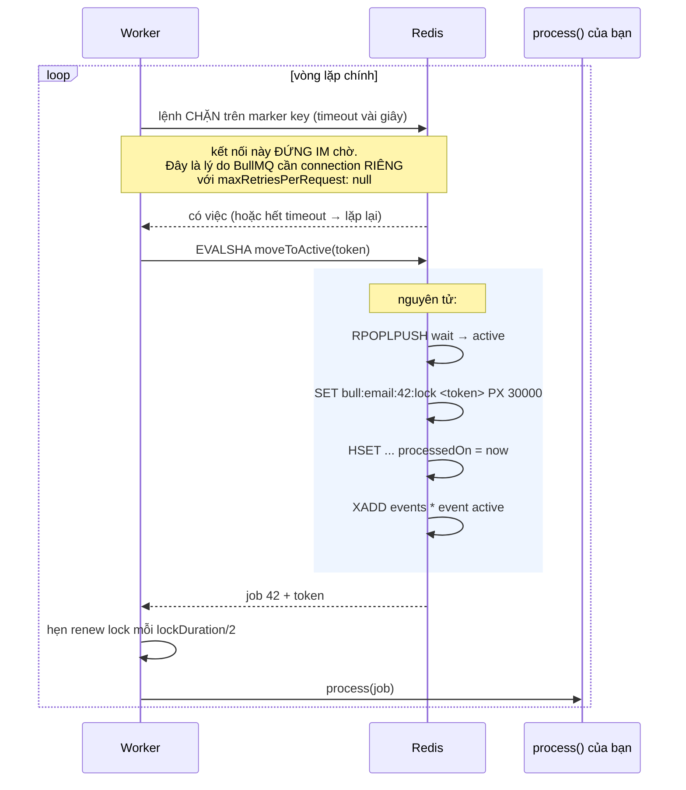
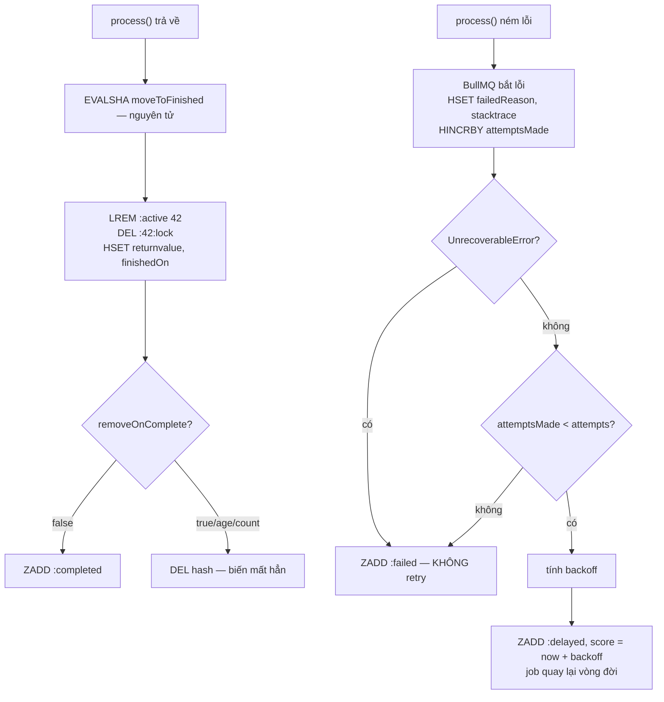

# BullMQ và `@nestjs/schedule` — cơ chế hoạt động chi tiết

Tài liệu này mổ xẻ **bên trong** hai công cụ: chúng lưu gì, ở đâu, chạy lệnh nào, và hỏng ra sao.

> **Quan hệ với tài liệu khác.**
>
> - [queue-job-worker-scheduler-guide.md](queue-job-worker-scheduler-guide.md) — _dùng thế nào_: khái niệm, code mẫu, retry, idempotency, outbox, anti-pattern. **Đọc trước.**
> - [queue-scheduler-gcp-vs-bullmq.md](queue-scheduler-gcp-vs-bullmq.md) — _chọn cái nào_: so sánh với dịch vụ managed của GCP.
> - [gcp-queue-scheduler-deep-dive.md](gcp-queue-scheduler-deep-dive.md) — _cơ chế_ phía GCP: Cloud Scheduler, Cloud Tasks, Pub/Sub, Cloud Run Jobs. Bản đối xứng của tài liệu này.
> - **Tài liệu này** — _chạy ra sao bên trong_: cấu trúc dữ liệu Redis, cơ chế lock, vòng đời timer, các chế độ hỏng, và **Phần E: chạy thật trên Cloud Run**.
>
> Mục đích thực dụng, không phải để thoả trí tò mò: gần như mọi lỗi khó của queue (job chạy hai lần, job kẹt mãi ở `active`, cron không nổ, worker ngốn RAM) chỉ chẩn đoán được khi biết bên dưới đang xảy ra chuyện gì.

> **Cảnh báo về chi tiết nội bộ.** Tên key Redis và tên class nội bộ dưới đây là **chi tiết cài đặt**, đổi giữa các bản major. Chúng được nêu ra để bạn **đọc hiểu và debug** (dùng `redis-cli` soi khi sự cố), **không phải để code dựa vào**. Code nghiệp vụ chỉ nên gọi API công khai. Số liệu theo BullMQ v5 và `@nestjs/schedule` v4/v6 tại thời điểm viết.

---

# PHẦN A — `@nestjs/schedule`

> Chưa nắm job / cron / worker là gì? Đọc [mục 0 của Queue, Job, Worker, Scheduler](./queue-job-worker-scheduler-guide.md#0-nền-tảng-job-cron-worker-thực-ra-là-cái-gì) trước, tài liệu này giả định đã biết.

## A1. Ba decorator và thực chất của chúng

```ts
@Cron("0 2 * * *", { timeZone: "Asia/Ho_Chi_Minh" })  // → CronJob của package `cron`
@Interval(30_000)                                      // → setInterval
@Timeout(5_000)                                        // → setTimeout, chạy đúng một lần
```

Toàn bộ thư viện là một lớp mỏng bọc quanh **timer của Node** cộng với **cơ chế khám phá metadata của Nest**. Docs NestJS nói thẳng điều này: gói `@nestjs/schedule` "integrates with the popular Node.js [cron](https://github.com/kelektiv/node-cron) package" ([Task Scheduling | NestJS](https://docs.nestjs.com/techniques/task-scheduling)). Không có tiến trình nền, không có lưu trữ, không có kết nối mạng nào. Nắm được câu đó là nắm được mọi hạn chế ở mục A5–A8.

## A2. Cơ chế khám phá — Nest tìm `@Cron` bằng cách nào

Đây là phần dự án đã **có sẵn code tương đương**, nên dễ hiểu nhất bằng cách đối chiếu.

`@Cron` chỉ là `SetMetadata` gắn options lên method — hệt như `@RequirePermission` trong repo:

```ts
// src/shared/param-decorators/require-permission.decorator.ts (code THẬT của repo)
SetMetadata(PERMISSION_KEY, key);
```

Rồi lúc boot, một explorer duyệt mọi provider để gom các method có metadata đó — hệt như [collect-route-permissions.util.ts](../src/shared/utils/collect-route-permissions.util.ts) duyệt controller:

```ts
// Code THẬT của repo — cơ chế y hệt thứ @nestjs/schedule làm bên trong
for (const wrapper of discoveryService.getControllers()) {
  const prototype = controllerClass.prototype;
  for (const methodName of metadataScanner.getAllMethodNames(prototype)) {
    const key = reflector.getAllAndOverride(PERMISSION_KEY, [
      handler,
      controllerClass,
    ]);
    // …
  }
}
```

`@nestjs/schedule` làm đúng ba bước đó, chỉ khác hai điểm: nó duyệt `getProviders()` **và** `getControllers()` (cron đặt ở đâu cũng được), và thay vì gom vào một mảng để kiểm tra, nó **đăng ký luôn một timer**.

Ba class nội bộ, biết tên để đọc stack trace khi lỗi:

| Class                       | Chạy lúc nào             | Làm gì                                                  |
| --------------------------- | ------------------------ | ------------------------------------------------------- |
| `SchedulerMetadataAccessor` | —                        | Đọc metadata do `@Cron`/`@Interval`/`@Timeout` gắn      |
| `ScheduleExplorer`          | `onModuleInit`           | Duyệt toàn bộ provider, **tạo** job và nạp vào registry |
| `SchedulerOrchestrator`     | `onApplicationBootstrap` | **Khởi động** mọi timer đã đăng ký                      |
| `SchedulerRegistry`         | runtime                  | Kho chứa; thêm/xoá/tra cứu job lúc chạy                 |

## A3. Vòng đời đầy đủ, từ boot tới shutdown



Hai chi tiết quan trọng nhất trong sơ đồ, đọc kỹ:

1. **Job được tạo ở `onModuleInit` nhưng chỉ chạy ở `onApplicationBootstrap`.** Khoảng giữa hai mốc này là lúc Nest hoàn tất khởi tạo. Nghĩa là cron không bao giờ nổ trước khi DI sẵn sàng — tốt. Nhưng cũng nghĩa là nếu app crash lúc boot, cron chưa từng chạy.
2. **Không ai `await` Promise mà handler trả về.** Đây là nguồn của hai vấn đề ở A6 và A7.

## A4. Bên trong `CronJob` — nó không hề poll

Hiểu nhầm phổ biến: cron "kiểm tra mỗi giây xem đã tới giờ chưa". Không phải.

```
job.start()
   │
   ├─► CronTime.sendAt()  → tính chính xác mốc thời gian kế tiếp
   │                        (2026-09-24T02:00:00+07:00)
   ├─► delta = mốc đó − Date.now()   (ví dụ 43_200_000 ms)
   │
   └─► setTimeout(fire, delta)     ← MỘT timer duy nhất, ngủ suốt 12 tiếng
             │
             ▼ tới giờ
          gọi handler
             │
             └─► tính mốc kế tiếp → setTimeout mới
```

Hệ quả thực tế:

- **CPU ~0 khi chờ.** Một cron ngủ 12 tiếng không tốn gì.
- **`setTimeout` của Node có trần `2^31 − 1` ms ≈ 24,8 ngày**, và vượt trần thì Node **không** kéo dài mà đặt delay về `1` ms: _"When `delay` is larger than `2147483647` … the `delay` will be set to `1`"_ ([Timers | Node.js](https://nodejs.org/api/timers.html)). Nói cách khác, một `setTimeout` ngây thơ cho lịch xa sẽ nổ **ngay lập tức**. Package `cron` phải tự chia nhỏ thành nhiều chặng nối tiếp để tránh đúng cái bẫy này.
- **Timer là _relative_, còn cron là _absolute_.** Nếu giờ hệ thống bị NTP kéo giật, hoặc máy ngủ đông rồi thức dậy, mốc đã tính bằng `setTimeout` không còn khớp với lịch. Đây là lý do cron trên laptop hay lệch sau khi sleep, còn trên server thì hiếm.

## A5. Vì sao timer trượt — chuỗi nhân quả đầy đủ

`setTimeout(fn, 43_200_000)` **không hứa** chạy sau đúng 43,2 triệu ms. Nó hứa: _"không sớm hơn mốc đó, và sẽ chạy khi event loop rảnh"_. Ba thứ phá vỡ lời hứa đó:

**1. Event loop bị chặn.** Timer callback xếp hàng cùng mọi thứ khác. Một request đang `JSON.parse` một payload 50MB, hay `bcrypt.hashSync` (bản đồng bộ), giữ luồng — cron phải chờ. Repo dùng bcrypt ở [hashing.service.ts](../src/shared/services/hashing.service.ts); đó chính xác là loại tác vụ chiếm CPU đáng để ý.

**2. Process không còn tồn tại.** Deploy, restart, OOM kill, scale-to-zero. Timer sống trong RAM của process; process chết là timer bay. **Và không có cơ chế chạy bù** — mốc 2h sáng trôi qua lúc app đang down thì lần chạy đó mất vĩnh viễn, không ai ghi nhận.

**3. CPU bị throttle.** Trên Cloud Run mặc định, giữa hai request CPU bị bóp gần về 0. Event loop gần như đứng, timer không được phục vụ. Cron 2h sáng có thể nổ lúc 7h — khi user đầu tiên gửi request và đánh thức instance. Đây là chế độ hỏng **âm thầm**: không log lỗi, không alert, chỉ là job chạy sai giờ. Chi tiết ở [queue-scheduler-gcp-vs-bullmq.md §2.3](queue-scheduler-gcp-vs-bullmq.md).

## A6. Chồng lấn — `cron` không có mutex

Không có cơ chế nào ngăn lần chạy thứ hai bắt đầu khi lần thứ nhất chưa xong:

```
@Interval(30_000), handler chạy mất 45s:

 0s ├─ lần 1 bắt đầu ────────────────────────► 45s
30s ├─ lần 2 bắt đầu ────────────────────────► 75s   ← CHỒNG LÊN lần 1
60s ├─ lần 3 bắt đầu ─────────────────────────►
```

Vì `CronJob` gọi handler rồi **không await** (A3), nó không biết lần trước còn chạy. Với job dọn dẹp thì hai lần chạy song song tranh nhau xoá cùng một hàng — tốn kém nhưng thường vô hại. Với job gửi email thì khách nhận trùng.

Phải tự chặn:

```ts
@Injectable()
export class CleanupService {
  private running = false;

  @Cron("*/30 * * * * *")
  async cleanup() {
    if (this.running) {
      this.logger.warn("Lần chạy trước chưa xong, bỏ qua nhịp này");
      return;
    }
    this.running = true;
    try {
      await this.doWork();
    } finally {
      this.running = false; // PHẢI ở finally, không thì kẹt vĩnh viễn
    }
  }
}
```

Lưu ý cờ này chỉ chặn **trong một process**. Nhiều instance vẫn chạy trùng — cần Redis lock, xem guide cũ §12.1.

## A7. Lỗi trong handler có thể giết cả app

Vì Promise không được await (A3), một `throw` trong handler `async` trở thành **unhandled promise rejection**. Node hiện đại mặc định `--unhandled-rejections=throw`, tức là **process thoát**.

```ts
@Cron("0 2 * * *")
async cleanup() {
  await this.prisma.cartItem.deleteMany({ … });  // DB timeout → throw
  // → unhandled rejection → API chết lúc 2h sáng
}
```

Một cron dọn giỏ hàng làm sập toàn bộ API. **Luôn bọc try/catch ở ngoài cùng của mọi handler cron** — đây không phải lời khuyên phong cách, nó là bắt buộc:

```ts
@Cron("0 2 * * *")
async cleanup() {
  try {
    await this.doWork();
  } catch (error) {
    this.logger.error(`Cron cleanup thất bại: ${(error as Error).message}`);
    // Nuốt lỗi CÓ CHỦ ĐÍCH: không có ai retry, và ném ra thì giết process.
  }
}
```

So sánh: BullMQ bắt lỗi giúp bạn, ghi vào `failedReason` và tự retry. Đây là khác biệt lớn về độ an toàn, không chỉ về tính năng.

## A8. `SchedulerRegistry` — thêm/xoá lịch lúc chạy

```ts
const job = new CronJob(
  "0 3 * * *",
  () => this.run(),
  null,
  false,
  "Asia/Ho_Chi_Minh",
);
this.registry.addCronJob("nightly-report", job);
job.start();

this.registry.getCronJob("nightly-report").stop();
this.registry.deleteCronJob("nightly-report");
```

API động này được mô tả ở [Task Scheduling | NestJS § Dynamic API](https://docs.nestjs.com/techniques/task-scheduling). Hữu ích khi lịch do dữ liệu quyết định (mỗi seller một giờ gửi báo cáo). **Nhưng registry nằm trong RAM**: restart là mất sạch, phải tự đọc lại từ DB ở `onApplicationBootstrap`. Đây đúng là chỗ BullMQ hơn hẳn — lịch của nó nằm trong Redis (B11).

## A9. Test cron

Đừng test bằng cách chờ tới giờ. Tách logic ra khỏi decorator rồi test logic:

```ts
// Test hàm này, không test decorator.
async purgeExpired() { … }

@Cron("0 2 * * *")
async handleCron() {
  try { await this.purgeExpired(); } catch (e) { this.logger.error(e); }
}
```

Muốn kiểm tra chính biểu thức cron thì dùng `CronTime` của package `cron` để khẳng định mốc kế tiếp, không cần chạy timer. Trong e2e của repo ([test/](../test/)), nên dùng `ScheduleModule.forRoot()` có điều kiện theo `NODE_ENV` để cron không tự nổ giữa bài test.

---

# PHẦN B — BullMQ

## B0. `bullmq` hay `@nestjs/bullmq`? Hai thứ khác nhau

Phải phân biệt trước khi đọc tiếp, vì **toàn bộ Phần B nói về `bullmq`, không phải `@nestjs/bullmq`**.

|                      | `bullmq`                                                                                                                           | `@nestjs/bullmq`                                                           |
| -------------------- | ---------------------------------------------------------------------------------------------------------------------------------- | -------------------------------------------------------------------------- |
| Là gì                | Thư viện thật, không phụ thuộc framework                                                                                           | Lớp bọc DI mỏng cho NestJS                                                 |
| Chứa gì              | `Queue`, `Worker`, `QueueEvents`, `FlowProducer`, Job, **các script Lua**, cơ chế lock, stalled check, rate limiter, kết nối Redis | `BullModule`, `@Processor`, `WorkerHost`, `@InjectQueue`, `@OnWorkerEvent` |
| Nói chuyện với Redis | **Có**                                                                                                                             | Không — uỷ quyền hết cho `bullmq`                                          |
| Dùng được ngoài Nest | Có                                                                                                                                 | Không                                                                      |

```
@nestjs/bullmq   ← chỉ là DI + lifecycle: đọc @Processor, tạo Worker, gọi worker.close() khi shutdown
      │ gọi xuống
      ▼
   bullmq         ← MỌI THỨ trong Phần B này: key Redis, Lua, lock, stalled, backoff
      │
      ▼
   ioredis  →  Redis
```

Nói cách khác: `@nestjs/bullmq` chỉ làm giúp bạn ba việc — biến class có `@Processor` thành một `Worker`, tiêm `Queue` qua constructor, và móc `worker.close()` vào vòng đời shutdown của Nest. **Nó không thêm một hành vi nào** vào cơ chế queue.

Hệ quả thực tế khi làm việc:

- **Cài cả hai.** `pnpm add bullmq @nestjs/bullmq` — docs NestJS ghi rõ `npm install --save @nestjs/bullmq bullmq` ([Queues | NestJS](https://docs.nestjs.com/techniques/queues)).
- **Tra cứu ở [docs BullMQ](https://docs.bullmq.io/), không phải docs NestJS.** Mọi thứ về `lockDuration`, `stalledInterval`, backoff, Flow đều thuộc `bullmq`. [Trang NestJS](https://docs.nestjs.com/techniques/queues) chỉ nói về decorator, và chính BullMQ cũng chỉ dành [một trang ngắn](https://docs.bullmq.io/guide/nestjs) cho phần tích hợp này.
- **Truy thẳng xuống API gốc khi cần.** `job`, `queue` bạn nhận được là object `bullmq` nguyên bản: gọi `job.extendLock()`, `queue.getJobCounts()`, `queue.client` bình thường.
- **Khi debug, stack trace hầu như luôn nằm trong `bullmq`**, không phải `@nestjs/bullmq`.
- Nhầm lẫn hay gặp: `@nestjs/bull` (không có `mq`) là gói cũ bọc **Bull v3** — thư viện khác, đã ngừng phát triển. Đừng dùng cho dự án mới.

Chỉ ở §B4 (kết nối) và §B10 (shutdown) thì `@nestjs/bullmq` mới thực sự tham gia — phần còn lại của Phần B, nó chỉ đứng xem.

## B1. Ba lớp và ranh giới giữa chúng

```
┌──────────────┐        ┌──────────────┐        ┌──────────────┐
│    Queue     │        │    Worker    │        │  QueueEvents │
│  (producer)  │        │  (consumer)  │        │  (observer)  │
│  .add()      │        │  vòng lặp    │        │  đọc stream  │
└──────┬───────┘        └──────┬───────┘        └──────┬───────┘
       │                       │                       │
       └───────────────┬───────┴───────────────────────┘
                       ▼
            ┌─────────────────────┐
            │       REDIS         │  ← toàn bộ trạng thái nằm ở đây
            │  key: bull:<tên>:*  │     KHÔNG có gì trong RAM của app
            └─────────────────────┘
```

Điểm mấu chốt: **ba lớp này không nói chuyện trực tiếp với nhau.** `Queue` không biết có worker nào tồn tại. Worker không biết ai đẩy job. Mọi giao tiếp đi qua Redis. Đây là lý do producer và consumer tách được thành hai process (guide cũ §7), và cũng là lý do Redis chết thì tất cả dừng.

## B2. Cấu trúc dữ liệu trong Redis

Đây là phần đáng giá nhất khi debug. Mỗi queue có một tập key dùng chung tiền tố `bull:<tên queue>:`.

> Trang [Architecture | BullMQ](https://docs.bullmq.io/guide/architecture) chỉ mô tả **trạng thái** job ở mức cao (`wait`, `prioritized`, `delayed`, `active`, `completed`, `failed`, `waiting-children`) — nó **không** tài liệu hoá bố cục key hay script Lua. Bảng dưới đây được dựng từ việc đọc mã nguồn và soi Redis, nên càng phải nhớ cảnh báo ở đầu tài liệu: dùng để debug, không code dựa vào.

| Key                      | Kiểu Redis | Chứa gì                                                            |
| ------------------------ | ---------- | ------------------------------------------------------------------ |
| `:id`                    | String     | Bộ đếm `INCR`, sinh job id tăng dần                                |
| `:<jobId>`               | **Hash**   | Bản thân job — mọi field, xem bảng dưới                            |
| `:wait`                  | List       | Id các job đang chờ, **FIFO**                                      |
| `:active`                | List       | Id các job worker đang chạy                                        |
| `:delayed`               | **ZSET**   | Job hẹn giờ; **score gói mốc thời gian** → sắp xếp sẵn theo giờ nổ |
| `:prioritized`           | ZSET       | Job có priority; score là mức ưu tiên                              |
| `:completed` / `:failed` | ZSET       | Job đã kết thúc; score là `finishedOn` → dọn theo tuổi rất rẻ      |
| `:<jobId>:lock`          | String+TTL | Token của worker đang giữ job. **TTL = `lockDuration`**            |
| `:stalled`               | Set        | Id job đã bị vòng kiểm tra stalled soi qua một lượt                |
| `:meta`                  | Hash       | Metadata queue, gồm cả cờ tạm dừng                                 |
| `:paused`                | List       | Job chờ trong lúc queue bị pause                                   |
| `:events`                | **Stream** | Nhật ký sự kiện — nguồn cho `QueueEvents` và dashboard             |
| `:limiter`               | String+TTL | Bộ đếm rate limit, dùng chung mọi worker                           |
| `:repeat`                | ZSET       | Lịch của repeatable job / job scheduler                            |
| `:marker`                | ZSET       | Key phụ để worker **chặn chờ** thay vì poll (xem B4)               |

Các field trong hash `bull:<tên>:<jobId>`:

| Field          | Nghĩa                            | Dùng để debug gì                            |
| -------------- | -------------------------------- | ------------------------------------------- |
| `name`         | Tên job (`"send-otp"`)           | Định tuyến trong `process()`                |
| `data`         | Payload, **chuỗi JSON**          | Vì sao phải giữ payload nhỏ                 |
| `opts`         | Options, chuỗi JSON              | Xác nhận `attempts`/`backoff` thực tế       |
| `timestamp`    | Lúc `add()`                      | Tính tuổi job                               |
| `delay`        | Số ms hoãn                       |                                             |
| `attemptsMade` | Đã thử bao nhiêu lần             | **Cột quan trọng nhất khi job lặp lại**     |
| `processedOn`  | Lúc worker bắt đầu               | `finishedOn − processedOn` = thời gian chạy |
| `finishedOn`   | Lúc kết thúc                     |                                             |
| `returnvalue`  | Giá trị `process()` trả về, JSON | Job cha đọc kết quả job con                 |
| `failedReason` | Message của lỗi cuối             | Đọc đầu tiên khi điều tra failed            |
| `stacktrace`   | Mảng stack các lần thất bại      |                                             |
| `parentKey`    | Trỏ tới job cha (Flow)           |                                             |

Soi bằng `redis-cli` khi sự cố:

```bash
redis-cli LLEN   bull:email:wait        # tồn đọng bao nhiêu — CHỈ SỐ QUAN TRỌNG NHẤT
redis-cli LRANGE bull:email:active 0 -1 # đang chạy gì; danh sách này KHÔNG được đầy mãi
redis-cli ZCARD  bull:email:delayed     # bao nhiêu job đang hẹn giờ
redis-cli HGETALL bull:email:42         # toàn bộ job id 42
redis-cli TTL    bull:email:42:lock     # còn bao nhiêu giây trước khi bị coi là stalled
```

**Dấu hiệu chẩn đoán:** `:active` có job mà `:<jobId>:lock` đã hết hạn (TTL = −2) nghĩa là worker giữ job đó đã chết. Job sẽ bị đưa về `wait` ở lần kiểm tra stalled kế tiếp — tức **nó sắp chạy lần thứ hai**.

## B3. Flow `add()` — chuyện gì xảy ra khi đẩy job



Ba điều rút ra:

- **Vì sao phải là Lua:** nếu làm bằng nhiều lệnh rời rạc, process chết giữa `HSET` và `LPUSH` sẽ để lại một job tồn tại nhưng không nằm trong hàng đợi nào — rác vĩnh viễn, không worker nào thấy. Redis chạy trọn một script Lua không bị chen ngang, nên hoặc xong hết hoặc không gì cả.
- **`jobId` tuỳ chỉnh chống trùng ở đây:** truyền `{ jobId: "otp-<userId>" }` thì script thấy hash đã tồn tại và bỏ qua. Đây là lý do cơ chế ở guide cũ §11 "cách 1" chỉ hiệu lực khi job **vẫn còn** trong Redis — xoá khỏi `completed` rồi thì id đó lại add được.
- **`await queue.add()` resolve nghĩa là "đã ghi vào Redis"**, không phải "đã chạy". Muốn chờ kết quả thật thì cần `waitUntilFinished` (B12), và thường là dấu hiệu bạn không nên dùng queue.

## B4. Worker nhặt job — chặn chứ không poll



**Vì sao chặn (blocking) chứ không poll:** poll mỗi 100ms nghĩa là 10 lệnh/giây/worker ngay cả khi không có việc — tốn vô ích và vẫn trễ tới 100ms. Lệnh chặn cho độ trễ gần như bằng 0 và không tốn gì khi rảnh.

**Cái giá của nó, và đây là lỗi cấu hình phổ biến nhất:** một kết nối đang chặn thì không dùng cho việc khác được, và `ioredis` mặc định sẽ huỷ lệnh sau `maxRetriesPerRequest` lần thử. Vì thế BullMQ **bắt buộc** `maxRetriesPerRequest: null` — docs ghi rõ: _"BullMQ will throw an exception if this setting is not set to null when it is passed into worker instances"_, và _"Classes that need blocking Redis commands, such as Worker and QueueEvents, will create duplicated connections internally"_ ([Connections | BullMQ](https://docs.bullmq.io/guide/connections)).

Điều này va thẳng vào [redis.service.ts](../src/shared/services/redis.service.ts) của repo, vốn cố ý đặt ngược lại:

```ts
// Code THẬT của repo — tối ưu cho CACHE, sai hoàn toàn cho BullMQ
maxRetriesPerRequest: 2,      // BullMQ cần null
enableOfflineQueue: false,    // BullMQ cần queue lệnh khi mất kết nối
commandTimeout: 1000,         // sẽ giết lệnh chặn đang chờ job
```

Ba dòng này đúng cho cache (fail nhanh, đừng để request treo) và sai cho queue (chờ lâu là chuyện bình thường). **Bắt buộc dùng connection thứ hai.** Đây không phải chuyện tối ưu, dùng chung là lỗi ngay khi khởi động.

## B5. Lock và stalled — gốc rễ của "job chạy hai lần"

Đây là cơ chế quan trọng nhất trong BullMQ, và là thứ giải thích vì sao guide cũ §11 nói idempotency không phải tuỳ chọn.

**Trường hợp bình thường:**

```
t=0s    worker lấy job, SET lock PX 30000        (lockDuration 30s)
t=15s   renew: PEXPIRE lock 30000                (renew ở lockDuration/2)
t=30s   renew
t=42s   process() xong → moveToFinished → DEL lock
```

Lock là một **hợp đồng có hạn**: _"tôi còn sống và còn đang làm job này"_. Renew là cách nói "vẫn còn đây".

**Khi worker chết:**

```mermaid
sequenceDiagram
    participant W1 as Worker 1 (sắp chết)
    participant R as Redis
    participant SC as Vòng kiểm tra stalled
    participant W2 as Worker 2

    W1->>R: lấy job 42, SET lock PX 30000
    W1->>W1: process() — gọi Resend…
    Note over W1: 💀 OOM kill / SIGKILL / mất mạng
    Note over W1: Email CÓ THỂ ĐÃ GỬI RỒI

    Note over R: không ai renew → sau 30s lock tự hết hạn
    Note over R: job 42 VẪN nằm trong :active

    SC->>R: quét :active, tìm job không còn lock (mỗi stalledInterval ~30s)
    R-->>SC: job 42 không có lock
    SC->>R: SADD :stalled 42  (lần soi thứ nhất — chỉ đánh dấu)

    Note over SC: …lượt quét kế tiếp…
    SC->>R: job 42 vẫn thế, và đã có trong :stalled
    SC->>R: tăng stalledCounter; nếu ≤ maxStalledCount → đưa về :wait
    SC->>R: XADD events * event stalled

    W2->>R: nhặt job 42
    W2->>W2: process() — GỬI EMAIL LẦN THỨ HAI
```

Cơ chế này được mô tả ở [Stalled Jobs | BullMQ](https://docs.bullmq.io/guide/workers/stalled-jobs) — trang đó nêu đúng nguyên nhân gốc: worker không kịp renew lock (thường vì job chiếm CPU), nên job bị đưa về hàng đợi hoặc chuyển sang failed.

**Các tham số và ý nghĩa thật:**

| Tham số           | Mặc định | Đặt sai thì sao                                                                                                                                            |
| ----------------- | -------- | ---------------------------------------------------------------------------------------------------------------------------------------------------------- |
| `lockDuration`    | 30_000ms | **Ngắn hơn thời gian job chạy** → lock hết hạn giữa chừng → job bị chạy song song hai lần **trong khi lần đầu vẫn đang chạy**. Đây là chế độ hỏng tệ nhất. |
| `stalledInterval` | 30_000ms | Quá dài → job kẹt lâu mới được cứu. Bằng 0 → tắt hẳn kiểm tra, job kẹt vĩnh viễn.                                                                          |
| `maxStalledCount` | 1        | Vượt ngưỡng → job bị coi là thất bại thật với lý do `job stalled more than allowable times`. Chính là thông báo bạn sẽ thấy khi worker liên tục bị OOM.    |

**Quy tắc:** `lockDuration` phải lớn hơn thời gian chạy dài nhất của job. Job có thể chạy lâu không đoán trước (upload S3 file lớn) thì gọi `job.extendLock()` hoặc chia nhỏ job.

**Và đây là kết luận không thể né:** khoảng giữa "worker chết" và "job được cấp lại" là _bắt buộc_ tồn tại trong mọi hệ thống queue — vì không có cách nào phân biệt "worker chết" với "worker đang chạy rất chậm". Đó là lý do giao hàng chỉ có thể là **at-least-once**, và vì sao handler **phải** idempotent. Không có cấu hình nào sửa được điều này.

## B6. Kết thúc job — thành công và thất bại



Chú ý `HINCRBY attemptsMade` xảy ra **trước** khi quyết định retry, và nó nằm trong hash bền vững. Nên `attemptsMade` sống sót qua việc worker chết — retry không bị đếm lại từ đầu.

`removeOnComplete` mặc định là **giữ lại**. Không đặt thì `:completed` phình mãi cho tới khi Redis OOM. Cú pháp `age`/`count` ở [Auto-removal of jobs | BullMQ](https://docs.bullmq.io/guide/queues/auto-removal-of-jobs). Đây là anti-pattern cuối trong bảng ở guide cũ §17, và bây giờ bạn thấy chính xác nó phình ở đâu.

## B7. Delayed job — ai đánh thức chúng

Job delayed nằm trong ZSET với **score là mốc thời gian nổ**. Đưa về `wait` không cần quét: `ZRANGEBYSCORE :delayed 0 <now>` trả đúng những job tới hạn, độ phức tạp `O(log N)` bất kể ZSET lớn cỡ nào.

Ai gọi? Worker, ở hai thời điểm: lúc bắt đầu mỗi vòng lặp, và qua một timer nội bộ hẹn đúng tới job delayed **gần nhất** (đọc bằng `ZRANGE … LIMIT 0 1`). Không có polling định kỳ.

```
:delayed ZSET
  score=1727049600000  → job 42  (02:00:00)
  score=1727049615000  → job 43  (02:00:15)
  score=1727053200000  → job 44  (03:00:00)
            │
   worker hẹn timer tới 02:00:00 ← chỉ quan tâm phần tử nhỏ nhất
```

**Hệ quả cần nhớ: không có worker nào sống thì không ai promote job delayed.** Job vẫn nằm nguyên trong Redis (không mất), nhưng nó **không tự nổ**. Đây chính xác là lý do BullMQ không dùng được trên Cloud Run scale-to-zero — chi tiết ở [queue-scheduler-gcp-vs-bullmq.md §2](queue-scheduler-gcp-vs-bullmq.md).

## B8. Priority và rate limiter

**Priority** dùng ZSET `:prioritized` riêng thay vì list `:wait`. Lấy job phải `ZPOPMIN` thay vì `RPOPLPUSH`, và phải ngó cả hai nguồn — đắt hơn một chút. Đó là ý của guide cũ §9 khi nói priority làm chậm queue. Số **nhỏ hơn = ưu tiên cao hơn**.

**Rate limiter** dùng một key đếm có TTL, **dùng chung cho mọi worker** vì nó nằm trong Redis:

```ts
@Processor(QUEUE_EMAIL, { limiter: { max: 10, duration: 1000 } })
```

Docs nói rõ nó là toàn cục: _"The rate limiter is global, so if you have for example 10 workers for one queue with the above settings, still only 10 jobs will be processed by second"_ ([Rate limiting | BullMQ](https://docs.bullmq.io/guide/rate-limiting)). Khi vượt ngưỡng, worker **không** bận rộn quay vòng: job được trả về hàng đợi và worker ngủ tới khi cửa sổ mở lại. Đây là lý do `limiter` khớp thẳng được với quota của Resend mà không cần code gì thêm — và là điểm BullMQ ngang bằng `maxDispatchesPerSecond` của Cloud Tasks.

## B9. Concurrency thật sự chạy thế nào

`concurrency: 5` **không** tạo 5 luồng, cũng không tạo 5 kết nối worker. Node vẫn một luồng. Worker chỉ đơn giản cho phép tối đa 5 Promise `process()` đang treo cùng lúc:

```
concurrency: 5, mỗi job chờ mạng 800ms

luồng duy nhất:  [lấy j1][lấy j2][lấy j3][lấy j4][lấy j5] ──── chờ I/O ────
                   │      │      │      │      │
                   └──────┴──────┴──────┴──────┴─► cả 5 cùng chờ Resend
                   ▼ j1 xong → lấy j6 ngay
```

Vì thế bảng ở guide cũ §8 chia theo **chỗ nghẽn**: job chờ mạng thì concurrency cao rất hiệu quả (luồng rảnh trong lúc chờ), còn job ngốn CPU như resize ảnh thì `concurrency: 10` **không** nhanh hơn `concurrency: 1` — chúng tranh nhau đúng một luồng, và tệ hơn là chặn cả việc renew lock, dẫn thẳng tới stalled ở B5.

Đây cũng là lý do tách worker ra process riêng (guide cũ §7 mức 2): job CPU nặng chặn event loop, mà event loop đó đang phục vụ cả API.

## B10. Graceful shutdown, từng bước

```
SIGTERM
   │
   ├─► worker.close() — @nestjs/bullmq gọi khi enableShutdownHooks()
   │      │
   │      ├─ dừng nhận job mới (thoát vòng lặp chặn)
   │      ├─ CHỜ các job đang active xong
   │      │    (vẫn renew lock trong lúc chờ — job không bị coi là stalled)
   │      └─ đóng kết nối Redis
   │
   └─► process thoát sạch
```

Docs mô tả đúng hành vi này: `close()` đánh dấu worker là _closing_ nên không nhận job mới, "and at the same time it will wait for all the current jobs to be processed (or failed)" — và cảnh báo rằng lời gọi này **không có timeout mặc định** ([Graceful shutdown | BullMQ](https://docs.bullmq.io/guide/workers/graceful-shutdown)).

Nếu SIGKILL tới trước khi xong: job đang chạy mất lock → stalled → chạy lại (B5). Vì thế `terminationGracePeriodSeconds` phải lớn hơn job dài nhất, và vì thế **giữ job ngắn**.

Đặt cạnh `@nestjs/schedule`: ở đó `job.stop()` chỉ `clearTimeout`, **không chờ** handler đang chạy. Cron đang chạy dở lúc deploy thì bị cắt ngang giữa chừng, không ai biết, không ai chạy lại.

## B11. Repeatable job — cron sống trong Redis

```ts
await queue.upsertJobScheduler(
  "daily-cleanup",
  { pattern: "0 2 * * *", tz: "Asia/Ho_Chi_Minh" },
  { name: "cleanup-carts", data: {} },
);
```

Cơ chế cốt lõi, và nó rất khác `@Cron`:

```
upsertJobScheduler
   │
   ├─► ZADD :repeat  (lưu định nghĩa lịch)
   └─► tạo NGAY một job DELAYED cho lần nổ kế tiếp
                │
                ▼  tới giờ → wait → active → chạy
        khi chuyển sang active, BullMQ TỰ TẠO
        job delayed cho lần nổ SAU ĐÓ
```

Docs khẳng định đúng hai tính chất này: _"The scheduler will only generate new jobs when the last job begins processing"_ và _"As long as a Job Scheduler is producing jobs, there will be always one job associated to the scheduler in the 'Delayed' status"_ ([Job Schedulers | BullMQ](https://docs.bullmq.io/guide/job-schedulers)).

Không có timer nào trong process của bạn. "Lịch" chỉ là một job delayed, và mỗi lần chạy sẽ đẻ ra lần kế tiếp. Từ đó suy ra ba tính chất mà `@Cron` không có:

|                      | `@Cron` (A)                              | Repeatable job (B)                            |
| -------------------- | ---------------------------------------- | --------------------------------------------- |
| Lịch nằm ở           | RAM của từng process                     | **Redis, dùng chung**                         |
| 3 instance           | nổ **3 lần**                             | **1 lần** — chỉ có một job delayed duy nhất   |
| App down lúc tới giờ | **mất luôn nhịp đó**                     | job delayed vẫn còn, chạy khi worker sống lại |
| Lỗi trong handler    | unhandled rejection, có thể giết process | được bắt, ghi `failedReason`, **tự retry**    |
| Xem lịch sử chạy     | không                                    | có, qua `:completed`/`:failed` + dashboard    |

Chống trùng lặp là **hệ quả của thiết kế**, không phải tính năng cộng thêm: chỉ tồn tại một job delayed trong Redis, nên dù có 10 worker thì cũng chỉ một con nhặt được nó.

Gọi `upsertJobScheduler` ở `onModuleInit` — nó idempotent theo tên, boot lại bao nhiêu lần cũng chỉ một lịch. Đổi `pattern` trong code thì lần boot sau tự cập nhật. **Xoá dòng code đi thì lịch cũ vẫn nằm trong Redis và vẫn chạy** — phải gọi `removeJobScheduler` tường minh. Đây là cái bẫy hay gặp khi dọn code.

## B12. Stream sự kiện

Mọi chuyển trạng thái đều `XADD` vào `:events` (Redis Stream). Dashboard và `QueueEvents` chỉ là consumer đọc stream đó — không ai phải poll.

```ts
const events = new QueueEvents(QUEUE_EMAIL, { connection });
events.on("failed", ({ jobId, failedReason }) => { … });
```

Phân biệt với `@OnWorkerEvent` (guide cũ §6.4): `@OnWorkerEvent` là sự kiện **cục bộ trong process worker đó**, chỉ thấy job do chính nó chạy. `QueueEvents` đọc từ Redis nên thấy **toàn bộ queue, từ bất kỳ process nào** — kể cả process API vốn không chạy job nào. Cần gom alert tập trung thì dùng `QueueEvents`.

Stream có `maxLen` để không phình vô hạn, nên nó là nhật ký gần đây chứ không phải sổ kế toán vĩnh viễn. Cần lưu vết lâu dài thì ghi ra DB của bạn.

---

# PHẦN C — Đặt cạnh nhau

## C1. Cùng một sự cố, hai kết cục

| Sự cố lúc 02:00                      | `@Cron`                                        | BullMQ repeatable                                     |
| ------------------------------------ | ---------------------------------------------- | ----------------------------------------------------- |
| App đang deploy, không có process    | **Mất nhịp**, không dấu vết                    | Job delayed còn trong Redis, chạy khi worker sống lại |
| Chạy 3 instance                      | Chạy **3 lần**                                 | Chạy 1 lần                                            |
| Handler ném lỗi                      | Unhandled rejection → **có thể giết process**  | Ghi `failedReason`, retry theo backoff                |
| Handler chạy 40 phút, chu kỳ 30 phút | Lần 2 **chồng lên** lần 1                      | Lock + stalled xử lý; cần chỉnh `lockDuration`        |
| Muốn biết hôm qua chạy chưa          | Đọc log, đoán                                  | `:completed` có bản ghi                               |
| Muốn chạy bù ngay                    | Không có cách, phải restart hoặc thêm endpoint | `queue.add()` một job thường                          |
| Redis chết                           | Không ảnh hưởng                                | **Toàn bộ dừng**                                      |

Hàng cuối là cái giá phải trả: BullMQ đổi "mất nhịp âm thầm" lấy "phụ thuộc Redis". Với dự án đã chạy Redis cho cache RBAC và rate limit thì Redis chết đã là sự cố nghiêm trọng rồi, nên cái giá này gần như bằng không.

## C2. Chọn thế nào

`@nestjs/schedule` dùng được khi **cả ba** điều sau đúng cùng lúc:

1. Đúng **một** instance chạy (hoặc đã có Redis lock),
2. Bỏ lỡ một nhịp **không sao**,
3. Process **luôn sống và luôn có CPU** — tức không phải Cloud Run mặc định.

Sai một trong ba thì dùng repeatable job của BullMQ, hoặc Cloud Scheduler nếu deploy Cloud Run.

Một cách dùng lai vẫn hợp lý: `@Cron` chỉ làm **kẻ phát job** (`queue.add()` rồi return ngay). Handler cực ngắn nên không chồng lấn, không ném lỗi; mọi thứ nặng nhọc và retry giao cho BullMQ. Vẫn cần lock nếu nhiều instance.

---

# PHẦN D — Chiếu vào code thật của repo

Các điểm sẽ va chạm khi triển khai, kèm vị trí:

| Nơi                                                                                    | Vấn đề cụ thể                                                                                                                                                             |
| -------------------------------------------------------------------------------------- | ------------------------------------------------------------------------------------------------------------------------------------------------------------------------- |
| [redis.service.ts](../src/shared/services/redis.service.ts)                            | **Không dùng lại được** cho BullMQ — `maxRetriesPerRequest: 2`, `enableOfflineQueue: false`, `commandTimeout: 1000` đều chống lại lệnh chặn. Cần connection thứ hai (B4). |
| [hashing.service.ts](../src/shared/services/hashing.service.ts)                        | bcrypt chiếm CPU; chạy chung process với worker sẽ chặn cả renew lock lẫn cron timer (A5, B9).                                                                            |
| [order-checkout.repository.ts](../src/repositories/order/order-checkout.repository.ts) | `$transaction` ở đây là chỗ đặt outbox; `queue.add()` **không** nằm trong transaction (guide cũ §16).                                                                     |
| [auth.service.ts](../src/routes/auth/auth.service.ts)                                  | Job gửi OTP phải idempotent do at-least-once (B5) — kiểm tra verification code còn hiệu lực trước khi gửi.                                                                |
| [test/](../test/)                                                                      | e2e cần tắt cron và worker, nếu không job sẽ nổ giữa bài test và làm nhiễu dữ liệu.                                                                                       |
| `prisma` connection pool                                                               | `concurrency` của worker không được vượt pool size, nếu không job xếp hàng chờ connection rồi timeout (guide cũ §8).                                                      |

---

# PHẦN E — Chạy BullMQ trên production (Cloud Run)

Phần này trả lời: **khác local chỗ nào**. Ở local mọi thứ dễ vì process không bao giờ bị thu hồi, CPU luôn có, và Redis ở ngay cạnh. Production trên Cloud Run phá vỡ cả ba giả định đó.

> **Về số liệu Cloud Run.** Thời gian ân hạn khi tắt, hành vi autoscale và tên cờ `gcloud` đổi theo thời gian. Các con số dưới đây ghi theo thời điểm viết — đối chiếu lại tài liệu GCP trước khi thiết kế dựa vào một con số cụ thể.

> **Nhắc lại đánh đổi.** [queue-scheduler-gcp-vs-bullmq.md](queue-scheduler-gcp-vs-bullmq.md) kết luận: trên Cloud Run, Cloud Tasks hợp hơn BullMQ vì mô hình push không cần worker luôn bật. Phần này **không** rút lại kết luận đó — nó trả lời câu hỏi khác: _nếu vẫn chọn BullMQ trên Cloud Run thì làm cho đúng thế nào_. Lý do chính đáng để chọn BullMQ: cần Flow/parent-child, cần dashboard và replay job hỏng, hoặc không muốn khoá vào GCP. §E13 nói khi nào nên đổi ý.

## E1. Kiến trúc đích

```
                    ┌──────────────────────────┐
   Internet ──────► │ Cloud Run: ecom-api      │  scale 0..N
                    │ CMD: node dist/main.js   │  CPU chỉ khi có request
                    │ vai trò: PRODUCER        │  (mặc định — rẻ)
                    └───────────┬──────────────┘
                                │ queue.add()
                                ▼
                    ┌──────────────────────────┐
                    │ Memorystore for Redis    │  IP riêng trong VPC
                    │ (hoặc Redis public+TLS)  │
                    └───────────▲──────────────┘
                                │ lệnh chặn, liên tục
                    ┌───────────┴──────────────┐
  KHÔNG nhận ─────► │ Cloud Run: ecom-worker   │  min-instances = 1
  traffic ngoài     │ CMD: node dist/worker.js │  --no-cpu-throttling
                    │ vai trò: CONSUMER        │  --no-allow-unauthenticated
                    └───────────┬──────────────┘
                                ▼
                         Cloud SQL / Postgres

   ┌──────────────────────────┐
   │ Cloud Run Job: migrator  │  chạy một lần trước mỗi lần rollout
   │ (Dockerfile target đã có)│
   └──────────────────────────┘
```

Hai Cloud Run service, **cùng một image**, khác mỗi `CMD`. Vì sao không gộp làm một: job nặng CPU sẽ chặn event loop đang phục vụ API (§B9), và quan trọng hơn — API cần scale-to-zero để rẻ, còn worker cần luôn bật. Hai nhu cầu trái ngược thì không ở chung được.

## E2. Cạm bẫy #1 — Cloud Run service **bắt buộc** lắng nghe `$PORT`

Đây là thứ làm hỏng lần deploy đầu tiên của hầu hết mọi người.

Đây là điều khoản trong hợp đồng runtime của Cloud Run: _"Cloud Run injects the `PORT` environment variable into the ingress container"_, và container **phải** lắng nghe trên cổng đó ([Container runtime contract](https://docs.cloud.google.com/run/docs/container-contract)). Cloud Run _service_ coi container là sẵn sàng khi nó bind vào `$PORT`. Một worker BullMQ thuần **không mở cổng nào** → Cloud Run chờ hết startup timeout → báo lỗi `failed to start and listen on the port` → rollback. Container không hề sai, chỉ là Cloud Run không có cách nào biết nó còn sống.

Nên `src/worker.ts` **không** dùng `createApplicationContext` như hướng dẫn cho môi trường tự quản (guide cũ §7), mà phải mở một HTTP server tối thiểu:

```ts
// src/worker.ts — entrypoint cho Cloud Run service "ecom-worker"
import { NestFactory } from "@nestjs/core";
import { Logger } from "nestjs-pino";

import { WorkerModule } from "./worker.module";

async function bootstrap() {
  const app = await NestFactory.create(WorkerModule, { bufferLogs: true });
  app.useLogger(app.get(Logger));

  // BẮT BUỘC cho worker, và main.ts hiện CHƯA gọi:
  // @nestjs/bullmq móc vào hook này để gọi worker.close() — ngừng nhận job mới
  // rồi CHỜ job đang chạy xong. Không có nó, SIGTERM giết job giữa chừng.
  app.enableShutdownHooks();

  // Server này KHÔNG phục vụ nghiệp vụ. Nó tồn tại chỉ để Cloud Run
  // coi container là đã khởi động. Cloud Run tiêm $PORT, mặc định 8080.
  await app.listen(process.env.PORT ?? 8080);
}

void bootstrap();
```

`WorkerModule` chỉ import `SharedModule` + các `@Processor` + một health controller — **không** import `RouteModule`, để worker không vô tình expose API nghiệp vụ.

Kèm theo `--no-allow-unauthenticated` khi deploy, để cổng này không ai ngoài Internet gọi được.

## E3. Cạm bẫy #2 — CPU throttling làm worker đứng hình

Cloud Run mặc định **chỉ cấp CPU khi đang xử lý request**. Worker không nhận request nào → giữa các lần bị bóp CPU gần về 0 → vòng lặp chặn không chạy, và tệ hơn: **lock không được renew** (§B5) → job đang chạy bị coi là stalled → chạy lại.

Cờ `--no-cpu-throttling` thực chất chuyển service sang **instance-based billing**: _"Cloud Run instances are charged for the entire lifecycle of instances, even when there are no incoming requests"_ — và Google nêu đúng use case của ta, _"useful for running short-lived background tasks and other asynchronous processing tasks"_ ([Billing settings for services](https://docs.cloud.google.com/run/docs/configuring/billing-settings)).

Bắt buộc hai cờ, đi cùng nhau ([min-instances](https://docs.cloud.google.com/run/docs/configuring/min-instances)):

```bash
--no-cpu-throttling      # CPU always allocated
--min-instances=1        # luôn giữ ít nhất một instance sống
```

Thiếu `--min-instances=1` thì instance vẫn bị thu hồi khi rảnh, và `--no-cpu-throttling` thành vô nghĩa. Thiếu `--no-cpu-throttling` thì instance sống nhưng đóng băng. **Đây chính là khoản chi phí mà Cloud Tasks không có** — bạn trả tiền cho một instance chạy 24/7 dù queue rỗng.

## E4. Cạm bẫy #3 — không autoscale được theo độ sâu queue

Autoscaler đánh giá **CPU utilization và concurrency utilization**, cộng thêm on-demand scaling theo lưu lượng: _"Cloud Run autoscaler evaluates the following metrics periodically … CPU and concurrency utilization"_, và _"On-demand scaling is the only driver for scaling from zero"_ ([About instance autoscaling](https://docs.cloud.google.com/run/docs/about-instance-autoscaling)).

Áp vào một worker, hệ quả cụ thể là:

- **Độ sâu queue hoàn toàn vô hình với autoscaler.** Không metric nào của Cloud Run biết `:wait` đang có bao nhiêu job.
- **Worker nghẽn I/O gần như không bao giờ scale.** Job gửi email chỉ ngồi chờ mạng → CPU thấp → autoscaler không thấy lý do thêm instance, dù tồn đọng 10.000 job.
- **Worker nghẽn CPU thì _có thể_ scale** theo CPU utilization, nhưng đó là tín hiệu gián tiếp và trễ, không phải thứ bạn điều khiển được.
- **Không thể scale từ 0 bằng công việc trong queue**, vì chỉ request mới kéo được từ 0 lên — mà worker không nhận request nào. Đây chính là lý do `--min-instances≥1` là bắt buộc chứ không phải tối ưu.

Tức là trong thực tế, công suất worker bị ghim quanh `min-instances`.

Ba cách xử lý, theo thứ tự đơn giản dần tới mạnh dần:

1. **Cố định công suất.** `--min-instances=1 --max-instances=1`, tăng `concurrency` trong `@Processor` cho hợp tài nguyên (§B9). Đủ cho phần lớn dự án ở quy mô này. Nhớ trần: `concurrency × số instance ≤ Prisma pool size`.
2. **Scale bằng Cloud Scheduler.** Một cron 5 phút đọc `queue.getJobCounts()` rồi gọi Cloud Run Admin API cập nhật `min-instances`. Thô nhưng hiệu quả, và tự viết được trong khoảng 50 dòng.
3. **Chuyển worker sang GKE + KEDA.** KEDA có scaler đọc thẳng độ sâu queue Redis và scale theo đó. Đúng bài nhất, nhưng kéo theo cả một cụm Kubernetes phải vận hành.

Nếu bạn thấy mình đang cân nhắc phương án 3, hãy đọc lại §E13 trước.

## E5. Cạm bẫy #4 — chỉ có ~10 giây để tắt

Cloud Run gửi `SIGTERM` rồi `SIGKILL` sau **10 giây**: _"Before shutting down an instance, Cloud Run sends a `SIGTERM` signal to all the containers in an instance, indicating the start of a 10 second period before the actual shutdown occurs"_ ([Container runtime contract § Shutdown](https://docs.cloud.google.com/run/docs/container-contract#instance-shutdown)). Ghép với §B10:

```
t=0s   SIGTERM → worker.close() → ngừng nhận job mới, CHỜ job đang chạy
t=10s  SIGKILL ← job nào chưa xong bị cắt ngang
       → mất lock → stalled → worker khác chạy LẠI job đó
```

Ba hệ quả bắt buộc phải chấp nhận:

- **Giữ job dưới ~10 giây.** Job gửi email qua Resend vừa đủ. Job resize 20 ảnh thì không — chia thành 20 job.
- **Idempotency không còn là lý thuyết.** Mỗi lần deploy là một cơ hội job chạy hai lần. Deploy vài lần một ngày thì chuyện này xảy ra thật, không phải rủi ro hiếm (§B5).
- **Tin tốt:** `docker-entrypoint.sh` của repo kết thúc bằng `exec "$@"`. Nhờ `exec`, tiến trình `node` **thay thế** shell chứ không chạy dưới nó, nên nó nhận `SIGTERM` trực tiếp. Nếu thiếu `exec`, shell sẽ nuốt tín hiệu và mọi nỗ lực graceful shutdown thành vô nghĩa. Repo đang đúng, đừng sửa dòng đó.

## E6. Redis trên production

**Phương án A — Memorystore for Redis (trong VPC).**

Memorystore chỉ có IP riêng, nên Cloud Run phải có đường vào VPC — dùng **Direct VPC egress** (mới, đơn giản hơn) hoặc **Serverless VPC Access connector** (cũ, tốn thêm instance connector phải trả tiền). Cả hai service `api` và `worker` đều cần, vì cả hai đều nói chuyện với Redis.

**Phương án B — Redis public qua TLS** (Redis Cloud, Upstash…). Không cần VPC, cấu hình nhanh hơn nhiều. Đánh đổi: độ trễ cao hơn, và BullMQ rất "nói nhiều" (mỗi job vài lượt round-trip), nên độ trễ nhân lên rõ rệt. Ngoài ra phải kiểm tra nhà cung cấp có chịu được **kết nối chặn giữ lâu** và giới hạn số kết nối — worker giữ kết nối thường trực, khác hẳn mô hình request ngắn.

**`maxmemory-policy` phải là `noeviction` — cấu hình quan trọng nhất của cả mục này.** Docs BullMQ gọi nó là _"the **only** setting that guarantees the correct behavior of the queues"_ ([Going to Production | BullMQ](https://docs.bullmq.io/guide/going-to-production)). Lý do: mọi policy khác cho phép Redis **tự xoá key khi đầy bộ nhớ**, mà key ở đây chính là job của bạn — job biến mất không dấu vết, không lỗi, không log. Trên Memorystore phải kiểm tra và đặt lại tham số này; mặc định của dịch vụ managed thường **không** phải `noeviction`.

**Độ bền:** docs BullMQ khuyến nghị bật **AOF** (_"1 second per write is enough for most applications"_). Job nằm trong Redis, mà Redis là in-memory. Bật persistence ở mức cao nhất tier cho phép, và dùng tier có HA nếu job có giá trị. Memorystore không nhất thiết cho bật AOF ở mọi tier — kiểm tra trước, và nếu chỉ có snapshot thì chấp nhận cửa sổ mất dữ liệu rộng hơn. Nhưng phải hiểu giới hạn: **snapshot luôn có khoảng trống**, failover vẫn có thể mất vài giây job cuối. Với OTP email thì chấp nhận được. Với trừ kho, trừ tiền thì không — đó là lý do outbox tồn tại (guide cũ §16).

**Và đừng quên `enableOfflineQueue`.** Ở API (producer), mất Redis nghĩa là `queue.add()` ném lỗi. Quyết định trước: request nghiệp vụ hỏng theo, hay nuốt lỗi và chấp nhận mất job? Với checkout thì phải hỏng theo — im lặng mất job hủy đơn còn tệ hơn.

## E7. Image và cấu hình deploy

**Không cần Dockerfile mới.** Stage `production` hiện có kết thúc bằng:

```dockerfile
ENTRYPOINT ["./docker-entrypoint.sh"]
CMD ["node", "dist/main.js"]
```

Cloud Run map `--command` → ENTRYPOINT và `--args` → CMD. Chỉ override `--args` để **giữ nguyên entrypoint** (nó kiểm tra `DATABASE_URL` và `exec`):

```bash
IMAGE="asia-southeast1-docker.pkg.dev/$PROJECT/ecom/api:$SHA"

# 1) API — producer, scale-to-zero, mặc định throttling
gcloud run deploy ecom-api \
  --image="$IMAGE" \
  --min-instances=0 --max-instances=10 \
  --allow-unauthenticated \
  --network=default --subnet=default --vpc-egress=private-ranges-only \
  --set-secrets=DATABASE_URL=db-url:latest,REDIS_URL=redis-url:latest

# 2) Worker — consumer, CÙNG image, chỉ khác args
gcloud run deploy ecom-worker \
  --image="$IMAGE" \
  --args=node,dist/worker.js \
  --min-instances=1 --max-instances=1 \
  --no-cpu-throttling \
  --cpu=1 --memory=512Mi \
  --no-allow-unauthenticated \
  --network=default --subnet=default --vpc-egress=private-ranges-only \
  --set-secrets=DATABASE_URL=db-url:latest,REDIS_URL=redis-url:latest
```

Cần thêm một script build cho worker trong `package.json` — `nest build` đã biên dịch cả `src/worker.ts` sang `dist/worker.js` vì nó nằm trong `tsconfig`, không cần cấu hình gì thêm.

**Dùng chung một image cho cả hai service là có chủ đích:** hai image riêng sẽ trôi lệch phiên bản, và rồi một ngày worker chạy code cũ hơn API mà không ai nhận ra — xem §E10.

## E8. Health check phải phản ánh worker thật

Sai lầm kinh điển: health endpoint trả `200` vô điều kiện. Khi đó Redis đứt, worker không chạy job nào, mà Cloud Run vẫn thấy container "khoẻ" và không restart. Queue tồn đọng im lặng.

```ts
@Controller()
export class WorkerHealthController {
  constructor(@InjectQueue(QUEUE_EMAIL) private readonly queue: Queue) {}

  @Get("healthz")
  async health() {
    // Ping Redis THẬT. `queue.client` là connection ioredis gốc của bullmq —
    // một ví dụ của việc truy thẳng xuống API `bullmq` như §B0 nói.
    const client = await this.queue.client;
    await client.ping();

    return { status: "ok" };
  }
}
```

Khai báo probe khi deploy để Cloud Run tự restart instance hỏng — liveness probe _"determine whether to restart a container"_, và mọi phản hồi 2XX/3XX được coi là thành công ([Configure container health checks](https://docs.cloud.google.com/run/docs/configuring/healthchecks)):

```bash
--liveness-probe=httpGet.path=/healthz,periodSeconds=30,failureThreshold=3
```

## E9. Bull Board trên production

Bull Board chỉ đọc Redis, nên gắn nó vào **service API** (vốn đã có VPC egress) là hợp lý — không cần service thứ ba, và nó được scale-to-zero cùng API.

Bắt buộc chặn truy cập. Payload job chứa `userId`, email, đôi khi cả token:

- Đặt sau guard admin hiện có của repo (`@RequirePermission`), **hoặc**
- Tách thành service riêng `--no-allow-unauthenticated` + IAM, chỉ vào được qua `gcloud run services proxy`.

Cách thứ hai an toàn hơn hẳn: dashboard không hề tồn tại trên Internet công cộng.

## E10. Thứ tự deploy và lệch phiên bản

Rolling deploy nghĩa là trong vài phút, **worker cũ và API mới cùng sống**. Hai luật:

**Luật 1 — thêm loại job mới thì deploy worker TRƯỚC.**

```
Sai:  deploy API mới → API đẩy job "send-welcome-email"
                     → worker cũ không biết job này
                     → UnrecoverableError("Unknown job") → job chết luôn

Đúng: deploy worker mới (biết job mới, chưa ai đẩy) → rồi mới deploy API
```

**Luật 2 — payload phải tương thích ngược.** Job đã nằm trong Redis mang schema cũ; worker mới phải đọc được. Đổi tên field thì phải qua hai lần deploy: thêm field mới và đọc cả hai, deploy; rồi mới bỏ field cũ ở lần sau.

Đây chính là lý do §6.3 của guide cũ khuyên **chỉ truyền ID**: payload càng nhỏ thì bề mặt lệch schema càng nhỏ.

**Migration Postgres** thì repo đã có sẵn lời giải đúng — stage `migrator` trong Dockerfile, chạy như Cloud Run Job trước khi rollout, đúng như [docker-entrypoint.sh](../docker-entrypoint.sh) đã ghi rõ lý do. Không có gì phải đổi.

## E11. Quan sát trên production

Ở local bạn nhìn Bull Board. Trên production phải có alert, vì không ai ngồi nhìn dashboard.

| Chỉ số                    | Lấy bằng                            | Cảnh báo khi          |
| ------------------------- | ----------------------------------- | --------------------- |
| Độ sâu `waiting`          | `queue.getJobCounts()`              | Tăng liên tục 10 phút |
| Số `failed`               | `queue.getJobCounts()`              | Vượt ngưỡng           |
| Số `stalled`              | Sự kiện `stalled` của `QueueEvents` | **> 0 là bất thường** |
| Tuổi job cũ nhất          | `queue.getWaiting(0, 0)`            | > 5 phút              |
| Instance worker đang sống | Cloud Run metric                    | = 0                   |

Đẩy các số này thành custom metric của Cloud Monitoring bằng một cron nhỏ, rồi đặt alert. Dùng `QueueEvents` chứ không phải `@OnWorkerEvent` cho alert tập trung — lý do ở §B12.

**`stalled > 0` là chỉ số đáng chú ý nhất trên Cloud Run**, vì nó thường có nghĩa: worker bị OOM kill, hoặc `lockDuration` ngắn hơn job, hoặc deploy cắt ngang job (§E5). Ba nguyên nhân đều cần hành động khác nhau, nhưng đều bắt đầu từ con số này.

## E12. Checklist trước khi bật

- [ ] `src/worker.ts` có `app.listen($PORT)` — không có là không deploy nổi (§E2)
- [ ] `src/worker.ts` có `enableShutdownHooks()` — `main.ts` hiện chưa có
- [ ] Worker deploy với `--no-cpu-throttling` **và** `--min-instances≥1`
- [ ] Worker `--no-allow-unauthenticated`
- [ ] Connection Redis **riêng** cho BullMQ, `maxRetriesPerRequest: null` (§B4)
- [ ] `lockDuration` > thời gian job dài nhất (§B5)
- [ ] Mọi job chạy dưới ~10 giây (§E5)
- [ ] `removeOnComplete` / `removeOnFail` đã đặt, nếu không Redis phình tới OOM (§B6)
- [ ] `concurrency × instance ≤` Prisma pool size
- [ ] Handler idempotent — deploy nào cũng có thể làm job chạy lại
- [ ] Bull Board có xác thực
- [ ] Alert cho `waiting` và `stalled`
- [ ] Redis `maxmemory-policy = noeviction` — kiểm tra bằng `CONFIG GET maxmemory-policy`; sai là **mất job im lặng** (§E6)
- [ ] Redis đã bật persistence (AOF nếu tier cho phép), và đã quyết định job nào cần outbox

## E13. Khi nào nên bỏ BullMQ trên Cloud Run

Thành thật về chi phí: bạn đang trả cho **một instance chạy 24/7 cộng Memorystore**, chỉ để có một vòng lặp đi hỏi Redis "có việc chưa?". Ở quy mô nhỏ, phần lớn thời gian nó hỏi vào chỗ trống.

Nên đổi sang Cloud Tasks nếu **tất cả** những điều sau đúng:

- Không dùng Flow / job phụ thuộc,
- Không cần replay job hỏng từ dashboard (chịu được việc tự ghi bảng `FailedJob`),
- Khối lượng job thấp và không đều,
- Chấp nhận khoá vào GCP.

Ngược lại, giữ BullMQ nếu cần Flow, cần dashboard và replay, hoặc muốn giữ khả năng dời khỏi GCP — lúc đó khoản tiền instance 24/7 là cái giá hợp lý cho những thứ đó.

Và có một phương án thứ ba ít người nghĩ tới: **deploy worker ở nơi khác Cloud Run.** Một VM `e2-micro`, hay một container trên nền tảng tính tiền theo container chạy liên tục, thường rẻ hơn Cloud Run `min-instances=1` với CPU always-on. API vẫn ở Cloud Run và vẫn scale-to-zero. Mô hình pull không bắt buộc producer và consumer phải ở cùng một nền tảng.

---

## Tóm tắt một màn hình

**`@nestjs/schedule`:**

- Chỉ là `setTimeout` + cơ chế khám phá metadata giống hệt [collect-route-permissions.util.ts](../src/shared/utils/collect-route-permissions.util.ts) của repo.
- Job tạo ở `onModuleInit`, khởi động ở `onApplicationBootstrap`. Handler **không được await** → chồng lấn được, và lỗi async thành unhandled rejection **có thể giết process**. Luôn try/catch.
- Không lưu trữ, không lock, không chạy bù. Mất nhịp là mất im lặng.

**BullMQ:**

- Toàn bộ trạng thái nằm trong Redis; `Queue`/`Worker`/`QueueEvents` không nói chuyện trực tiếp. Mọi chuyển trạng thái là một script Lua nguyên tử.
- Worker **chặn** chờ chứ không poll → bắt buộc connection riêng với `maxRetriesPerRequest: null`.
- **Lock có TTL + vòng kiểm tra stalled** là gốc của "job chạy hai lần". Không cấu hình nào xoá được nó — at-least-once là bản chất, nên idempotency là bắt buộc.
- `lockDuration` phải **dài hơn** job chạy lâu nhất, nếu không job tự nhân đôi trong khi bản đầu vẫn đang chạy.
- Delayed job là ZSET theo mốc thời gian, nhưng **cần worker sống mới được promote**.
- Repeatable job chống trùng vì lịch nằm trong Redis dưới dạng đúng một job delayed — khác hẳn `@Cron` mỗi process một timer.
- `concurrency` là song song I/O trên **một luồng**, không phải đa luồng.
- `bullmq` là thư viện thật; `@nestjs/bullmq` chỉ là lớp DI mỏng. Mọi cơ chế ở trên thuộc `bullmq` (§B0).

**Trên Cloud Run:**

- Cloud Run service **bắt buộc bind `$PORT`** → worker phải mở HTTP server tối thiểu, nếu không deploy thất bại (§E2).
- Cần **cả** `--no-cpu-throttling` **và** `--min-instances≥1`; thiếu một trong hai thì worker đóng băng hoặc bị thu hồi (§E3).
- **Không autoscale theo độ sâu queue được** — autoscaler nhìn request, mà worker không nhận request nào (§E4).
- Chỉ có **~10 giây** giữa SIGTERM và SIGKILL → job phải ngắn, và mỗi lần deploy là một cơ hội job chạy lại (§E5).
- Dùng lại **cùng một image**, chỉ override `--args` để giữ `docker-entrypoint.sh` (nhờ `exec` mà `node` nhận được SIGTERM) (§E7).
- Thêm loại job mới thì **deploy worker trước API** (§E10).

---

## Nguồn tham khảo

Mọi link dưới đây đã được mở và kiểm tra tại thời điểm viết. Tiêu đề ghi đúng như trang gốc.

**BullMQ** — [docs.bullmq.io](https://docs.bullmq.io/)

| Trang                                                                            | Dùng cho mục                                    |
| -------------------------------------------------------------------------------- | ----------------------------------------------- |
| [Architecture](https://docs.bullmq.io/guide/architecture)                        | B2 (chỉ mô tả trạng thái ở mức cao)             |
| [Connections](https://docs.bullmq.io/guide/connections)                          | B4 — `maxRetriesPerRequest: null`, kết nối chặn |
| [Stalled Jobs](https://docs.bullmq.io/guide/workers/stalled-jobs)                | B5                                              |
| [Graceful shutdown](https://docs.bullmq.io/guide/workers/graceful-shutdown)      | B10, E5                                         |
| [Auto-removal of jobs](https://docs.bullmq.io/guide/queues/auto-removal-of-jobs) | B6                                              |
| [Rate limiting](https://docs.bullmq.io/guide/rate-limiting)                      | B8                                              |
| [Job Schedulers](https://docs.bullmq.io/guide/job-schedulers)                    | B11                                             |
| [Going to Production](https://docs.bullmq.io/guide/going-to-production)          | **E6 — `noeviction`, AOF**                      |
| [NestJs](https://docs.bullmq.io/guide/nestjs)                                    | B0                                              |

**NestJS**

- [Queues](https://docs.nestjs.com/techniques/queues) — `@Processor`, `WorkerHost`, `@InjectQueue`, `registerQueue`; xác nhận phải cài **cả hai** gói (B0)
- [Task Scheduling](https://docs.nestjs.com/techniques/task-scheduling) — `@Cron`/`@Interval`/`@Timeout`, `SchedulerRegistry`, và việc nó bọc package `cron` (A1, A8)

**Node.js / thư viện nền**

- [Timers](https://nodejs.org/api/timers.html) — trần `2147483647` ms của `setTimeout` và hành vi khi vượt trần (A4)
- [kelektiv/node-cron](https://github.com/kelektiv/node-cron) — thư viện `@nestjs/schedule` dùng bên dưới

**Google Cloud** — lưu ý docs đã chuyển sang `docs.cloud.google.com`

- [Container runtime contract](https://docs.cloud.google.com/run/docs/container-contract) — yêu cầu bind `$PORT` (E2) và [§ Shutdown](https://docs.cloud.google.com/run/docs/container-contract#instance-shutdown) — 10 giây SIGTERM (E5)
- [Billing settings for services](https://docs.cloud.google.com/run/docs/configuring/billing-settings) — instance-based billing / `--no-cpu-throttling` (E3)
- [Set minimum instances for services](https://docs.cloud.google.com/run/docs/configuring/min-instances) — `--min-instances` (E3)
- [About instance autoscaling](https://docs.cloud.google.com/run/docs/about-instance-autoscaling) — tín hiệu autoscale (E4)
- [Configure container health checks](https://docs.cloud.google.com/run/docs/configuring/healthchecks) — startup/liveness probe (E8)

**Tài liệu trong repo**

- [queue-job-worker-scheduler-guide.md](queue-job-worker-scheduler-guide.md) — nền tảng và cách dùng
- [queue-scheduler-gcp-vs-bullmq.md](queue-scheduler-gcp-vs-bullmq.md) — so sánh với managed service của GCP
- [gcp-queue-scheduler-deep-dive.md](gcp-queue-scheduler-deep-dive.md) — cơ chế chi tiết phía GCP
- [redis-caching-guide.md](redis-caching-guide.md) · [redis-role-permission-cache.md](redis-role-permission-cache.md) — Redis đang được dùng ra sao trong repo
