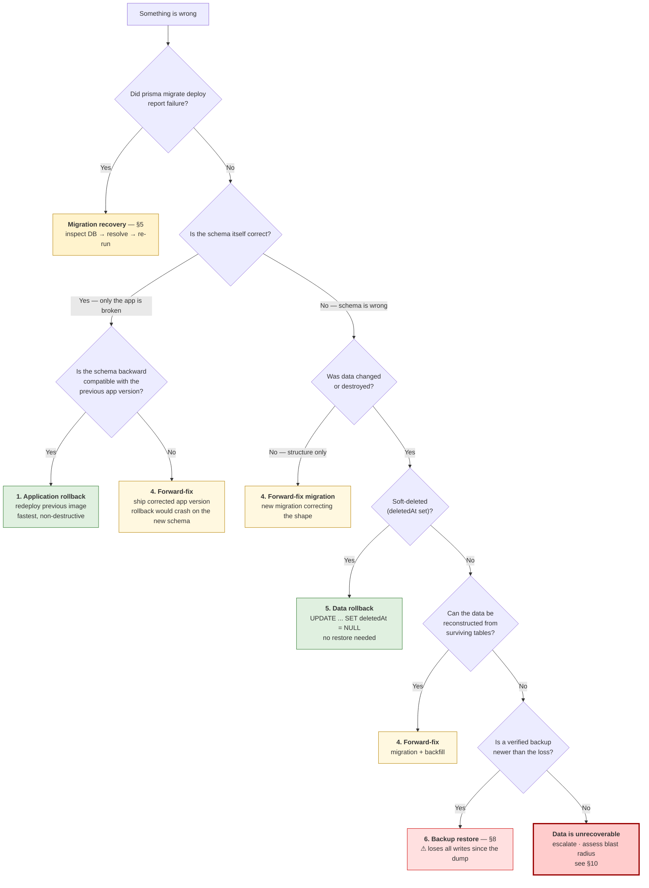

# Database Rollback & Recovery

What to do when a migration or a deploy goes wrong.

**Companion document:** [database-migration.md](database-migration.md) covers the _forward_ path — how migrations are created, reviewed and applied. This one covers everything after something breaks.

**Verified environment** (measured on `postgres:15-alpine`, not assumed):

| Fact                | Value                                                      | Consequence                                                                     |
| ------------------- | ---------------------------------------------------------- | ------------------------------------------------------------------------------- |
| PostgreSQL          | **15.19**                                                  | `pg_dump` 15 required; the `migrator` image bundles `postgresql15-client` 15.19 |
| `wal_level`         | `replica`                                                  | Sufficient _if_ archiving is enabled — it is not                                |
| `archive_mode`      | **`off`**                                                  | **No PITR. No WAL archive. A dump is the only recovery point.**                 |
| `data_checksums`    | `off`                                                      | Silent page corruption would not be detected                                    |
| `lock_timeout`      | `0` (unlimited)                                            | A migration can block on a lock indefinitely, queueing all traffic              |
| `statement_timeout` | `0`                                                        | A runaway data migration never self-aborts                                      |
| Prisma              | 7.10.0, 27 migrations                                      | No `migrate down` exists                                                        |
| Hosting             | `docker-compose` single host, named volume `postgres_data` | No managed-DB snapshots, no replica                                             |

> **Read this first.** This project has **no point-in-time recovery today**. If data is destroyed, you can only return to the last `pnpm db:backup` dump — everything written after it is gone. Enabling PITR is infrastructure work (§9) and it cannot recover anything lost _before_ it is turned on.

---

## 1. Rollback vs recovery — seven distinct things

These get conflated, and conflating them is how outages get worse. They are **not** interchangeable.

| #   | Term                      | What actually moves                         | Reversible?                                       | Tool here                                |
| --- | ------------------------- | ------------------------------------------- | ------------------------------------------------- | ---------------------------------------- |
| 1   | **Application rollback**  | App container image only. Schema untouched. | Yes, cheap                                        | Redeploy previous image tag              |
| 2   | **Schema rollback**       | Database structure back to a previous shape | Only if no data was dropped                       | A **new** forward migration              |
| 3   | **Migration recovery**    | The `_prisma_migrations` bookkeeping table  | Yes                                               | `prisma migrate resolve`                 |
| 4   | **Forward-fix migration** | Structure forward to a _corrected_ shape    | n/a — always additive                             | `pnpm prisma:migrate:dev:create-only`    |
| 5   | **Data rollback**         | Row values only, structure untouched        | Only if the old values still exist                | Targeted `UPDATE` / soft-delete reversal |
| 6   | **Backup restore**        | The entire database, wholesale              | **Destructive** — loses everything since the dump | `pnpm db:restore`                        |
| 7   | **PITR / WAL recovery**   | Database to an exact moment in time         | **Not available** — see §9                        | —                                        |

Two rules follow directly:

- **Prisma has no `migrate down`.** "Schema rollback" is always implemented as a _new migration going forward_. There is no reverse gear.
- **Never assume a migration is reversible.** `DROP COLUMN` is not reversible by re-adding the column — the data is gone. Only a restore brings it back, and only as far as the last dump.

---

## 2. The decision tree

Work top-down. Every branch prefers the cheapest, least destructive action that actually fixes the problem.



**Why forward-fix outranks reverse migration in production:** a reverse migration is itself an unreviewed, untested schema change written under time pressure, and if the original migration dropped anything the reverse cannot restore it. A forward-fix is additive, reviewable, and testable through the normal CI gate.

---

## 3. Development workflow

Local data is disposable. That changes everything — prefer the fast destructive option.

### Safe experimentation

```bash
# Write the SQL without applying it — read it before it touches your DB
pnpm prisma:migrate:dev:create-only --name try_something

# Apply when satisfied
pnpm prisma:migrate:dev
```

### Reset / recreate the database

```bash
# Drops the DB, recreates it, replays all 27 migrations
pnpm db:test:reset

# Then restore local working data
pnpm seed:initial-scripts
pnpm seed:initial-scripts:create-permission
```

### Revert a local migration before merge

While the migration exists **only on your branch and nowhere else**, delete it — this is the one situation where deleting a migration is correct:

```bash
rm -rf prisma/migrations/20260912123456_bad_idea   # never do this to a merged migration
pnpm db:test:reset                                  # replay the history without it
```

Then fix `schema.prisma` and regenerate. Confirm the history matches the schema again:

```bash
pnpm prisma:migrate:drift    # exit 0 = clean
```

### Correct an incorrect migration

Same rule, split by whether it has been pushed:

| State                           | Action                                                                                             |
| ------------------------------- | -------------------------------------------------------------------------------------------------- |
| Local only                      | Delete the directory, `pnpm db:test:reset`, regenerate                                             |
| Pushed, PR open, **not merged** | Amend the migration, force-push the branch. Tell reviewers it changed.                             |
| **Merged**                      | Immutable. Write a new corrective migration — the CI immutability gate will fail the PR otherwise. |

### Migration history conflicts

Two branches both adding migrations produce timestamps that interleave wrongly after a merge. Prisma orders by directory name, so a migration merged _earlier_ but timestamped _later_ replays in the wrong order on a fresh database — CI's replay-from-zero job catches this.

```bash
git merge master                # bring in their migrations
pnpm db:test:reset              # replay everything from scratch — the real test
pnpm prisma:migrate:drift       # must exit 0
```

If the replay fails, rename **your own unmerged** migration directory to a later timestamp so it sorts after theirs, and reset again. Never renumber a migration that is already on `master`.

### Restore local test data

```bash
BACKUP_DIR=./backups BACKUP_LABEL=local pnpm db:backup    # snapshot a good local state
BACKUP_FILE=./backups/ecom-local-<ts>.dump \
  CONFIRM_RESTORE=<your_db_name> pnpm db:restore          # get it back later
```

---

## 4. Production workflow

Production prioritises **data preservation over speed**. Every step below is ordered so that nothing irreversible happens before something reversible has been tried.

### Pre-migration validation

1. CI `migrations` job green — immutability, validate, replay-from-zero, status, drift ([database-migration.md §11](database-migration.md)).
2. `pnpm db:migrate:dry-run` — read the pending list; it must be exactly what you expect.
3. Read the SQL of every pending migration.
4. **Take a verified backup** (§8). The `Database Migrate` workflow refuses a production apply without `backup_confirmed = true`.
5. Confirm the change is backward compatible with the currently deployed app (§6), or plan a coordinated window.

### Application rollback compatibility

This is the question everyone skips. Before migrating, answer it explicitly:

> _If I have to redeploy the previous app image 10 minutes from now, will it still work against this new schema?_

- **Yes** → additive change. Rollback stays available; proceed.
- **No** → the migration and the app are coupled. You have given up application rollback for this release, and your only recovery is forward-fix. Say so in the PR before merging, or restructure as expand-and-contract (§6).

### Failed migration recovery

See §5 — it is its own procedure.

### Manual schema recovery (drift / hand edits)

Someone changed production directly with `psql`. Detect and reconcile:

```bash
export DATABASE_URL="$PROD_DATABASE_URL"

pnpm db:drift:live          # exit 0 = clean · exit 2 = live DB differs from schema.prisma
pnpm db:drift:live:script   # prints the SQL that would realign the DB to schema.prisma
```

**Read that SQL before running any of it** — if the hand edit added a column holding real data, the realignment script will `DROP` it. Two legitimate outcomes:

- The hand edit was a mistake → apply the corrective SQL as a normal reviewed migration.
- The hand edit was needed → encode it into `schema.prisma`, generate a migration that produces the same result, and mark it applied so the history matches reality:

  ```bash
  pnpm prisma:migrate:resolve:applied <migration_name>
  ```

---

## 5. Prisma failed-migration handling

### What Prisma actually does on failure — measured

| Migration file            | Execution            | On failure                                                                 |
| ------------------------- | -------------------- | -------------------------------------------------------------------------- |
| **Multiple statements**   | Implicit transaction | **Atomic** — nothing persists, the whole file rolls back                   |
| **Exactly one statement** | Autocommit           | The statement either fully applied or did not — no partial state within it |

Verified on PostgreSQL 15.19 against this schema. So "partially applied migration" in this project means _the file did not complete_, not _half a statement landed_. What is left behind is a **row in `_prisma_migrations` with `finished_at = NULL`**, and that row blocks every later `migrate deploy` with **P3009**.

### Recovery procedure

```bash
export DATABASE_URL="$PROD_DATABASE_URL"

# 1. Which migration failed?
pnpm prisma:migrate:status

# 2. Read its SQL
cat prisma/migrations/<failed_name>/migration.sql

# 3. Inspect what is ACTUALLY in the database — do not guess
#    e.g. did the column get added?
psql "$PROD_DATABASE_URL" -c '\d "Product"'
```

Then resolve **according to what you observed**:

```bash
# The database does NOT contain the migration's changes (the normal case for a
# multi-statement file, which rolls back atomically)
pnpm prisma:migrate:resolve:rolled-back <failed_name>
# → fix the SQL in a NEW migration, then: pnpm db:migrate

# The changes ARE fully present (you completed them by hand, matching the SQL)
pnpm prisma:migrate:resolve:applied <failed_name>
# → then: pnpm db:migrate
```

**Never edit `_prisma_migrations` with SQL.** `migrate resolve` is the supported path and keeps the checksum bookkeeping consistent.

`pnpm db:migrate` prints this guidance automatically on failure — [`scripts/run-database-migrations.sh`](../scripts/run-database-migrations.sh).

### Other Prisma error codes

| Code      | Meaning                                          | Action                                                                                                                                           |
| --------- | ------------------------------------------------ | ------------------------------------------------------------------------------------------------------------------------------------------------ |
| **P3009** | A failed migration is recorded                   | Procedure above                                                                                                                                  |
| **P3018** | A migration's SQL errored                        | Read the underlying PostgreSQL code (`42701` duplicate column, `25001` CONCURRENTLY in transaction). Fix in a new migration.                     |
| **P3005** | Database schema is not empty / checksum mismatch | Either the DB was changed outside Prisma (§4 drift), or a merged migration file was edited. Baseline with `resolve:applied`, or revert the edit. |

---

## 6. Expand-and-contract

The strategy that makes rollback possible at all. Full treatment with diagram in [database-migration.md §6](database-migration.md).

The rollback-relevant summary:

| Release            | Schema                                          | App rollback available?               |
| ------------------ | ----------------------------------------------- | ------------------------------------- |
| **N — Expand**     | Add new nullable/defaulted structure; old stays | **Yes** — old code still works        |
| **N+1 — Switch**   | None                                            | **Yes** — old structure still present |
| **N+2 — Contract** | Drop old structure                              | **No** — point of no return           |

Every breaking change **must** be split this way, for exactly one reason: it keeps application rollback — the cheapest, safest recovery — on the table for two full releases.

Do not run **Contract** until the version that needs the old structure is provably out of production.

---

## 7. Data-migration rollback

A data migration changes rows, not structure. `DROP COLUMN` is recoverable only from a backup; a bad `UPDATE` is often recoverable without one — **if you planned for it**.

### Make data migrations reversible by construction

Preserve the old values instead of overwriting in place:

```sql
-- Expand: keep the original alongside the new value
ALTER TABLE "Product" ADD COLUMN "publishedAt_backup" TIMESTAMP;
UPDATE "Product" SET "publishedAt_backup" = "publishedAt";
-- ... then transform "publishedAt"
```

Rollback is then a single `UPDATE`, with no restore and no downtime. Drop the `_backup` column in a later Contract release once the change is proven.

### Soft deletes are your safety net

15 of 21 models carry `deletedAt` plus `createdById` / `updatedById` / `deletedById` (see [generated/entities.md](generated/entities.md)). **Rows "deleted" through the application are not gone** — check before reaching for a restore:

```sql
-- How much was soft-deleted in the incident window?
SELECT count(*) FROM "Product"
 WHERE "deletedAt" BETWEEN '2026-09-12 10:00' AND '2026-09-12 10:30';

-- Undo it — no backup required
UPDATE "Product" SET "deletedAt" = NULL, "deletedById" = NULL
 WHERE "deletedAt" BETWEEN '2026-09-12 10:00' AND '2026-09-12 10:30';
```

Models **without** soft delete — `VerificationCode`, `Device`, `CartItem`, `ProductSKUSnapshot`, `Review`, `PaymentTransaction`, `Message` — delete for real. Losses there need a restore.

### Batch and bound every large data migration

`statement_timeout` is `0`, so a runaway `UPDATE` runs forever while holding locks. Always bound the work — batched loop pattern in [database-migration.md §7](database-migration.md) — and always test the batch on a restored copy first.

---

## 8. Backup & restore

### Taking a backup

```bash
export DATABASE_URL="$PROD_DATABASE_URL"
BACKUP_DIR=/srv/backups BACKUP_LABEL=pre-migration pnpm db:backup
```

[`scripts/backup-database.sh`](../scripts/backup-database.sh) refuses to hand you a false sense of safety:

- fails if `pg_dump`'s major version ≠ the server's (a mismatched dump can be unrestorable);
- dumps with `--format=custom`, so `pg_restore` can extract a single table later;
- **verifies the archive** with `pg_restore --list` and fails if it holds zero objects;
- prunes local dumps older than `RETENTION_DAYS` (default 14);
- prints the dump path on stdout so a runbook can capture it.

Where to run it:

```bash
# From the migrator image — bundles postgresql15-client matching the server
docker run --rm -v /srv/backups:/backups \
  -e DATABASE_URL="$PROD_DATABASE_URL" -e BACKUP_DIR=/backups \
  --entrypoint sh ecom-migrator ./scripts/backup-database.sh
```

> **`BACKUP_DIR` must be durable storage.** A dump written inside a container that is then removed is not a backup. Mount a host volume and copy it off-box.

### Restoring

```bash
export DATABASE_URL="$PROD_DATABASE_URL"
BACKUP_FILE=/srv/backups/ecom-pre-migration-<ts>.dump \
  CONFIRM_RESTORE=<target_db_name> pnpm db:restore
```

[`scripts/restore-database.sh`](../scripts/restore-database.sh) is destructive and guarded accordingly:

- refuses unless `CONFIRM_RESTORE` **exactly equals the target database name**, so you cannot restore into the wrong database by pasting the wrong URL;
- verifies the archive **before** dropping anything;
- takes an automatic **safety backup of the current state** first (`SAFETY_BACKUP=true` by default) — so a mis-targeted restore is itself reversible;
- runs with `--single-transaction --exit-on-error`, so a failed restore leaves the database **untouched** rather than half-replaced.

### After any restore — the restore is not the end

The dump carries `_prisma_migrations` **as it was at dump time**, which may be behind the deployed code:

```bash
pnpm prisma:migrate:status   # pending migrations? the dump predates them
pnpm db:migrate              # roll forward to the expected schema
pnpm prisma:migrate:drift    # history and schema.prisma agree
pnpm db:drift:live           # live DB matches schema.prisma (exit 0)
```

### Retention

| Label           | When                                        | Keep    |
| --------------- | ------------------------------------------- | ------- |
| `pre-migration` | Before every production migration           | 30 days |
| `pre-restore`   | Automatic, before any restore               | 30 days |
| `daily`         | Scheduled (**not yet automated — see §10**) | 14 days |

---

## 9. PITR / WAL — not available today

**Current state, measured:** `archive_mode = off`, `archive_command` disabled. No WAL is retained beyond what recycling keeps, and no base backup exists. **Point-in-time recovery is impossible in this setup.** The recovery granularity is "the last dump", nothing finer.

What "we have PITR" would require — all of it infrastructure work, none of it in this repository:

1. **Enable archiving** on the PostgreSQL server (restart required):

   ```conf
   wal_level = replica          # already satisfied
   archive_mode = on
   archive_command = '...'      # ship each WAL segment to durable off-host storage
   archive_timeout = 300        # bound data loss to ~5 minutes
   ```

2. **Take periodic base backups** (`pg_basebackup`, or `pgBackRest` / `WAL-G` which handle retention and verification).
3. **Durable, off-host archive storage** — a WAL archive on the same volume as the database is worthless when that volume dies.
4. **Rehearse restores.** An unrehearsed backup is a hypothesis.

Until then, be explicit about the exposure: **the recovery point objective equals the age of the newest dump.** With no scheduled backup job, that is however long ago someone last ran `pnpm db:backup`.

A managed PostgreSQL service (RDS, Cloud SQL, Neon, Supabase) provides continuous backup and PITR as a product feature and is the lower-effort route for this project — the application needs no change beyond `DATABASE_URL`.

---

## 10. Emergency production runbook

> Work the numbered steps in order. **Do not skip to step 6.**

### 0. Stop the bleeding (first 60 seconds)

- If a migration is still running and blocking traffic, decide deliberately whether to let it finish. **Cancelling mid-migration is what creates P3009.**
- If the app is erroring, application rollback (step 4) is usually faster than any database action.
- Announce the incident. One person drives the database; everyone else observes.

### 1. Capture the evidence — before changing anything

```bash
export DATABASE_URL="$PROD_DATABASE_URL"

pnpm prisma:migrate:status > /tmp/incident-migrate-status.txt
pnpm db:drift:live:script  > /tmp/incident-drift.sql   2>&1

# What is holding locks / running long?
psql "$PROD_DATABASE_URL" -c "
SELECT pid, state, wait_event_type, now() - xact_start AS age, left(query,120)
  FROM pg_stat_activity
 WHERE datname = current_database() AND state <> 'idle'
 ORDER BY xact_start;"
```

### 2. Take a backup of the broken state

Counter-intuitive, and essential. It preserves whatever data still exists, and makes every later step reversible.

```bash
BACKUP_DIR=/srv/backups BACKUP_LABEL=incident pnpm db:backup
```

### 3. Classify with the decision tree (§2)

Answer in order: _Did the migration fail? Is the schema right? Was data changed?_

### 4. Application rollback — try this first when the schema is sound

```bash
# Redeploy the previous image tag; the app never migrates, so this touches no schema
docker compose up -d --no-deps app     # after pointing the tag at the previous build
```

Only valid if the schema is backward compatible (§6). If it is not, go to step 5.

### 5. Forward-fix

```bash
pnpm prisma:migrate:dev:create-only --name fix_<incident>
# hand-write the corrective SQL, review it, push through CI, then:
pnpm db:migrate:dry-run && pnpm db:migrate
```

Under real pressure a forward-fix may skip the full PR cycle — if so, the migration file **must** still be committed immediately afterwards, or the next `migrate deploy` fails on drift.

### 6. Restore — last resort

Only when data is genuinely unrecoverable by steps 4–5, and a verified newer backup exists. **This discards every write since the dump.** Get explicit sign-off.

```bash
BACKUP_FILE=/srv/backups/ecom-pre-migration-<ts>.dump \
  CONFIRM_RESTORE=<db_name> pnpm db:restore
```

### 7. Verify before reopening traffic

Run the §12 checklist in full. An unverified recovery is not a recovery.

### 8. Afterwards

Write up what happened, what the recovery cost, and which gate would have caught it. If a backup was missing or stale, fixing that is the top action item.

---

## 11. Command reference

Every command below exists in this repository — no invented tooling.

| Command                                          | Purpose                                                            |
| ------------------------------------------------ | ------------------------------------------------------------------ |
| `pnpm prisma:migrate:status`                     | Applied / pending / failed migrations                              |
| `pnpm prisma:migrate:resolve:rolled-back <name>` | Mark a failed migration as rolled back                             |
| `pnpm prisma:migrate:resolve:applied <name>`     | Mark a failed migration as applied / baseline a DB                 |
| `pnpm prisma:migrate:drift`                      | Migration history vs `schema.prisma` (needs `SHADOW_DATABASE_URL`) |
| `pnpm db:drift:live`                             | **Live database** vs `schema.prisma` — exit 2 = drift              |
| `pnpm db:drift:live:script`                      | Print the SQL that would realign the live DB                       |
| `pnpm db:migrate`                                | Guarded `migrate deploy` with P3009 guidance                       |
| `pnpm db:migrate:dry-run`                        | List pending migrations, apply nothing                             |
| `pnpm db:backup`                                 | Verified `pg_dump -Fc` backup                                      |
| `pnpm db:restore`                                | Guarded destructive restore                                        |
| `pnpm db:test:reset`                             | **Drop and recreate** the database (development/test only)         |
| `pnpm prisma:migrate:dev:create-only --name <n>` | Generate migration SQL for review without applying                 |
| `pnpm seed:initial-scripts`                      | Re-seed admin user after a reset                                   |

---

## 12. Checklists

### Pre-migration (production)

- [ ] CI `migrations` job green on the deployed commit
- [ ] `pnpm db:migrate:dry-run` reviewed — pending list is exactly as expected
- [ ] SQL of every pending migration read in full
- [ ] **Backup taken and verified** (`pnpm db:backup` reported object count > 0)
- [ ] Backup file is on durable, off-host storage
- [ ] Backward compatible with the running app version — or the loss of rollback is documented and accepted
- [ ] Destructive statements (`DROP`, type changes, `SET NOT NULL`) reviewed individually
- [ ] Large-table work batched; index builds use `CONCURRENTLY` alone in their own file
- [ ] Rollback plan written down _before_ starting: which of the 7 actions (§1) applies
- [ ] Someone else is available to review during the window

### Post-migration / post-recovery verification

- [ ] `pnpm prisma:migrate:status` → "Database schema is up to date!"
- [ ] `pnpm db:drift:live` → exit 0
- [ ] `pnpm prisma:migrate:drift` → exit 0
- [ ] Row counts on affected tables match expectations (compare against the pre-migration backup if unsure)
- [ ] No `NULL`s in columns that must not hold them
- [ ] Application boots and `PrismaService` logs `Successfully connected to database`
- [ ] Error rate and latency back to baseline
- [ ] No long-running or blocked queries left in `pg_stat_activity`
- [ ] A fresh **post**-recovery backup taken
- [ ] Incident notes written; the failed migration is committed if it was hand-applied

---

## 13. Common failure scenarios

| #   | Scenario                                      | First check                            | Recovery                                                                                        |
| --- | --------------------------------------------- | -------------------------------------- | ----------------------------------------------------------------------------------------------- |
| 1   | **Migration fails before completion**         | `pnpm prisma:migrate:status`           | Multi-statement files roll back atomically → `resolve:rolled-back`, fix in a new migration (§5) |
| 2   | **Migration partially applies**               | Inspect the real schema (`\d "Table"`) | Verify what landed, then `resolve:applied` **or** `resolve:rolled-back` to match reality (§5)   |
| 3   | **Migration succeeds but contains a bug**     | Was data changed?                      | Structure only → forward-fix. Data changed → §7, then forward-fix                               |
| 4   | **Deploy fails after a successful migration** | Is the schema backward compatible?     | Yes → application rollback. No → forward-fix the app (§2)                                       |
| 5   | **Need to roll back to an older app version** | Did the migration only add things?     | Additive → roll back freely. Contract already ran → forward-fix only                            |
| 6   | **Destructive schema change shipped**         | Is a backup newer than the change?     | Restore (§8) then roll forward. No backup → data is gone; assess blast radius                   |
| 7   | **Accidental data loss**                      | `deletedAt` set, or truly deleted?     | Soft-deleted → `UPDATE ... SET deletedAt = NULL`. Hard-deleted → restore (§7, §8)               |
| 8   | **Schema drift**                              | `pnpm db:drift:live`                   | Review `db:drift:live:script` output, then realign via a migration or `resolve:applied` (§4)    |
| 9   | **Manual production DB changes**              | `pnpm db:drift:live` exit 2            | Encode the change into `schema.prisma` + migration, or revert it (§4)                           |
| 10  | **`migrate deploy` hangs**                    | `pg_stat_activity` for blockers        | Terminate the blocking transaction, or cancel and retry with `lock_timeout` set                 |
| 11  | **Emergency: database unreachable**           | Container/volume health, disk space    | Restore onto healthy storage (§8); no PITR means loss back to the last dump (§9)                |
| 12  | **Restore finished but the app still fails**  | `pnpm prisma:migrate:status`           | The dump predates current migrations → `pnpm db:migrate` to roll forward (§8)                   |

---

## 14. Known gaps requiring infrastructure work

Honest list. None of these can be fixed from inside this repository alone.

| Gap                              | Impact                                                                | Needed                                                                                      |
| -------------------------------- | --------------------------------------------------------------------- | ------------------------------------------------------------------------------------------- |
| **No PITR** (`archive_mode=off`) | Recovery granularity is the last dump                                 | WAL archiving + base backups, or a managed PostgreSQL service (§9)                          |
| **No scheduled backups**         | RPO = however long since someone ran `pnpm db:backup` manually        | A cron/scheduled job invoking `pnpm db:backup` to off-host storage                          |
| **No restore rehearsal**         | Backups are unproven until restored                                   | Periodic drill restoring production into a scratch database                                 |
| **`data_checksums=off`**         | Silent corruption undetectable                                        | Only settable at `initdb` — requires a dump/restore onto a new cluster                      |
| **`lock_timeout=0`**             | A migration can queue behind a long transaction and stall all traffic | Set per-connection on the migration URL ([database-migration.md §6](database-migration.md)) |
| **Single host, no replica**      | Host loss = full outage, recovery from dump only                      | Replication, or managed PostgreSQL                                                          |
| **Compose file is dev-shaped**   | Hardcoded `POSTGRES_PASSWORD`, port published to the host             | A real production manifest with secrets management                                          |
