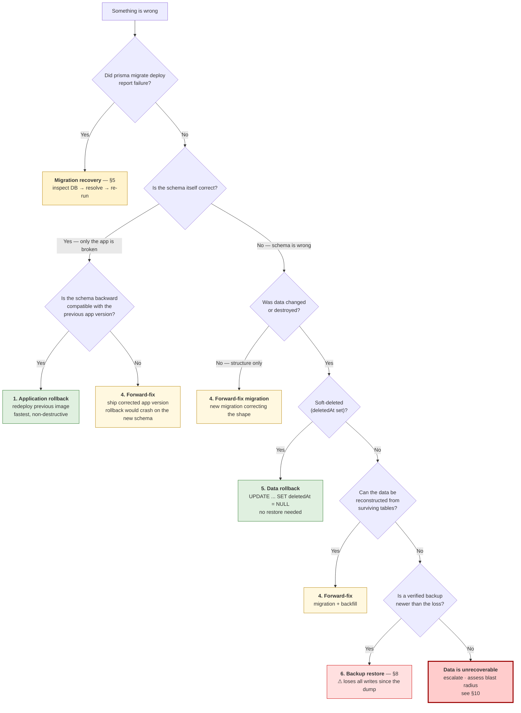

# Rollback & Khôi phục Database

Làm gì khi migration hoặc deploy gặp sự cố.

**Tài liệu liên quan:** [database-migration.vi.md](database-migration.vi.md) nói về chiều _đi tới_ — cách tạo, review và áp dụng migration. Tài liệu này nói về mọi thứ xảy ra sau khi có sự cố.

**Môi trường đã xác minh** (đo trực tiếp trên `postgres:15-alpine`, không phải giả định):

| Fact                | Value                                                            | Consequence                                                                |
| ------------------- | ---------------------------------------------------------------- | -------------------------------------------------------------------------- |
| PostgreSQL          | **15.19**                                                        | Bắt buộc `pg_dump` 15; image `migrator` đi kèm `postgresql15-client` 15.19 |
| `wal_level`         | `replica`                                                        | Đủ dùng _nếu_ archiving được bật — nhưng ở đây thì không                   |
| `archive_mode`      | **`off`**                                                        | **Không có PITR. Không có WAL archive. Dump là điểm khôi phục duy nhất.**  |
| `data_checksums`    | `off`                                                            | Corrupt page âm thầm sẽ không bị phát hiện                                 |
| `lock_timeout`      | `0` (unlimited)                                                  | Migration có thể kẹt ở một lock vô thời hạn, chặn hết mọi traffic          |
| `statement_timeout` | `0`                                                              | Một data migration chạy loạn sẽ không bao giờ tự dừng                      |
| Prisma              | 7.10.0, 27 migrations                                            | Không có lệnh `migrate down`                                               |
| Hosting             | `docker-compose` một host duy nhất, named volume `postgres_data` | Không có snapshot của managed DB, không có replica                         |

> **Đọc phần này trước.** Project này **hiện chưa có point-in-time recovery**. Nếu dữ liệu bị phá hủy, bạn chỉ quay lại được bản dump gần nhất từ `pnpm db:backup` — mọi thứ ghi sau bản dump đó mất sạch. Bật PITR là việc thuộc về hạ tầng (§9) và nó không cứu được gì đã mất _trước_ khi được bật.

---

## 1. Rollback và khôi phục — bảy khái niệm khác nhau

Bảy khái niệm này rất hay bị gộp lẫn, và gộp lẫn chúng chính là cách khiến sự cố tệ hơn. Chúng **không** thể dùng thay thế cho nhau.

| #   | Term                      | Cái gì thực sự thay đổi                         | Có đảo ngược được không?                       | Tool ở đây                                        |
| --- | ------------------------- | ----------------------------------------------- | ---------------------------------------------- | ------------------------------------------------- |
| 1   | **Application rollback**  | Chỉ image container của app. Schema giữ nguyên. | Có, chi phí thấp                               | Deploy lại image tag trước đó                     |
| 2   | **Schema rollback**       | Cấu trúc database quay về hình dạng trước đó    | Chỉ khi không có dữ liệu nào bị drop           | Một migration **mới** đi tới                      |
| 3   | **Migration recovery**    | Bảng sổ sách `_prisma_migrations`               | Có                                             | `prisma migrate resolve`                          |
| 4   | **Forward-fix migration** | Cấu trúc tiến tới một hình dạng đã _sửa đúng_   | n/a — luôn là additive                         | `pnpm prisma:migrate:dev:create-only`             |
| 5   | **Data rollback**         | Chỉ giá trị dòng dữ liệu, cấu trúc giữ nguyên   | Chỉ khi giá trị cũ vẫn còn tồn tại             | `UPDATE` có nhắm mục tiêu / đảo ngược soft-delete |
| 6   | **Backup restore**        | Toàn bộ database, restore trọn gói              | **Phá hủy** — mất hết mọi thứ ghi sau bản dump | `pnpm db:restore`                                 |
| 7   | **PITR / WAL recovery**   | Đưa database về đúng một thời điểm              | **Chưa có sẵn** — xem §9                       | —                                                 |

Từ đó suy ra hai quy tắc:

- **Prisma không có `migrate down`.** "Schema rollback" luôn được làm bằng cách viết _một migration mới đi tới_. Không có số lùi.
- **Đừng bao giờ mặc định một migration có thể đảo ngược.** `DROP COLUMN` không thể đảo ngược chỉ bằng cách thêm lại column — dữ liệu đã mất rồi. Chỉ có restore mới lấy lại được, và cũng chỉ lấy lại tới đúng bản dump gần nhất.

---

## 2. Cây quyết định

Làm việc từ trên xuống. Mỗi nhánh ưa thích hành động rẻ nhất, ít phá hủy nhất mà thực sự sửa lỗi.



**Tại sao forward-fix được ưu tiên hơn reverse migration trong production:** bản thân một migration ngược cũng là một thay đổi schema chưa được review, chưa được test, viết ra dưới áp lực thời gian — và nếu migration gốc đã drop cái gì đó thì migration ngược không khôi phục lại được. Forward-fix thì additive, review được, và test được qua đúng CI gate bình thường.

---

## 3. Development workflow

Dữ liệu local thì bỏ đi cũng chẳng sao. Điều đó thay đổi mọi thứ — cứ ưu tiên phương án phá hủy nào nhanh nhất.

### Thử nghiệm an toàn

```bash
# Viết SQL không áp dụng — đọc nó trước khi nó chạm DB của bạn
pnpm prisma:migrate:dev:create-only --name try_something

# Áp dụng khi hài lòng
pnpm prisma:migrate:dev
```

### Reset / tạo lại database

```bash
# Drop DB, tạo lại, replay tất cả 27 migrations
pnpm db:test:reset

# Sau đó restore dữ liệu cục bộ làm việc
pnpm seed:initial-scripts
pnpm seed:initial-scripts:create-permission
```

### Revert migration cục bộ trước khi merge

Nếu migration đó **chỉ tồn tại trên branch của bạn và không ở đâu khác**, cứ xóa nó — đây là trường hợp duy nhất xóa migration là đúng:

```bash
rm -rf prisma/migrations/20260912123456_bad_idea   # never do this to a merged migration
pnpm db:test:reset                                  # replay the history without it
```

Sau đó sửa `schema.prisma` và generate lại. Xác nhận lại lịch sử migration khớp với schema:

```bash
pnpm prisma:migrate:drift    # exit 0 = clean
```

### Sửa một migration bị sai

Cùng một quy tắc, chỉ khác nhau ở việc đã push hay chưa:

| State                              | Action                                                                                                |
| ---------------------------------- | ----------------------------------------------------------------------------------------------------- |
| Chỉ mới ở local                    | Xóa thư mục đó, chạy `pnpm db:test:reset`, generate lại                                               |
| Đã push, PR còn mở, **chưa merge** | Sửa lại migration, force-push branch. Báo cho reviewer biết là nó đã đổi.                             |
| **Đã merge**                       | Bất biến, không được sửa. Viết một migration sửa lỗi mới — nếu không CI immutability gate sẽ fail PR. |

### Xung đột lịch sử migration

Khi hai branch cùng thêm migration, timestamp của chúng có thể đan xen sai thứ tự sau khi merge. Prisma sắp xếp theo tên thư mục, nên một migration được merge _trước_ nhưng lại có timestamp _muộn hơn_ sẽ replay sai thứ tự trên một database mới tinh — job replay-from-zero của CI sẽ bắt được lỗi này.

```bash
git merge master                # bring in their migrations
pnpm db:test:reset              # replay everything from scratch — the real test
pnpm prisma:migrate:drift       # must exit 0
```

Nếu replay thất bại, đổi tên thư mục **migration chưa merge của bạn** sang một timestamp muộn hơn để nó xếp sau migration của họ, rồi reset lại. Đừng bao giờ đổi số của một migration đã nằm trên `master`.

### Restore dữ liệu test cục bộ

```bash
BACKUP_DIR=./backups BACKUP_LABEL=local pnpm db:backup    # snapshot a good local state
BACKUP_FILE=./backups/ecom-local-<ts>.dump \
  CONFIRM_RESTORE=<your_db_name> pnpm db:restore          # get it back later
```

---

## 4. Production workflow

Ở production, ưu tiên số một là **bảo toàn dữ liệu, không phải tốc độ**. Các bước dưới đây được sắp theo thứ tự để không có gì bất khả nghịch xảy ra trước khi phương án khả nghịch đã được thử.

### Pre-migration validation

1. CI job `migrations` phải xanh — immutability, validate, replay-from-zero, status, drift ([database-migration.md §11](database-migration.vi.md)).
2. `pnpm db:migrate:dry-run` — đọc danh sách migration đang chờ; nó phải khớp chính xác những gì bạn mong đợi.
3. Đọc SQL của từng migration đang chờ.
4. **Lấy một bản backup đã xác minh** (§8). Workflow `Database Migrate` sẽ từ chối apply lên production nếu chưa có `backup_confirmed = true`.
5. Xác nhận thay đổi này backward compatible với app đang chạy trên production (§6), hoặc lên kế hoạch cho một khung giờ triển khai phối hợp.

### Khả năng rollback ứng dụng

Đây là câu hỏi mà ai cũng bỏ qua. Trước khi migrate, hãy trả lời thẳng câu này:

> _Nếu 10 phút nữa tôi phải deploy lại image app cũ, nó còn chạy được với schema mới này không?_

- **Có** → thay đổi additive. Rollback vẫn dùng được; cứ tiếp tục.
- **Không** → migration và app đã bị khóa chặt vào nhau. Bạn đã đánh đổi mất khả năng application rollback cho release này, và đường khôi phục duy nhất còn lại là forward-fix. Ghi rõ điều này trong PR trước khi merge, hoặc tái cấu trúc theo kiểu expand-and-contract (§6).

### Khôi phục migration thất bại

Xem §5 — đây là một quy trình riêng.

### Khôi phục schema thủ công (drift / sửa tay)

Ai đó đã sửa trực tiếp production bằng `psql`. Cách phát hiện và đối chiếu lại:

```bash
export DATABASE_URL="$PROD_DATABASE_URL"

pnpm db:drift:live          # exit 0 = clean · exit 2 = live DB differs from schema.prisma
pnpm db:drift:live:script   # prints the SQL that would realign the DB to schema.prisma
```

**Đọc kỹ đoạn SQL đó trước khi chạy** — nếu bản sửa tay đã thêm một column đang giữ dữ liệu thật, script đối chiếu này sẽ `DROP` nó. Có hai kết cục hợp lệ:

- Bản sửa tay đó là sai lầm → apply SQL sửa lỗi như một migration được review bình thường.
- Bản sửa tay đó là cần thiết → đưa nó vào `schema.prisma`, generate một migration tạo ra đúng kết quả đó, rồi đánh dấu là đã applied để lịch sử khớp với thực tế:

  ```bash
  pnpm prisma:migrate:resolve:applied <migration_name>
  ```

---

## 5. Xử lý migration thất bại trong Prisma

### Khi thất bại, Prisma thực sự làm gì — đo được thế này

| Migration file         | Execution            | Trên thất bại                                                                      |
| ---------------------- | -------------------- | ---------------------------------------------------------------------------------- |
| **Nhiều statement**    | Implicit transaction | **Atomic** — không gì được persist, toàn bộ file rollback                          |
| **Đúng một statement** | Autocommit           | Statement hoặc apply trọn vẹn hoặc không apply gì cả — không có trạng thái nửa vời |

Đã đo trực tiếp trên PostgreSQL 15.19 với schema này. Vậy nên "migration bị apply nửa chừng" trong project này nghĩa là _file chưa chạy xong_, chứ không phải _một statement chạy dở dang_. Thứ còn sót lại là **một dòng trong `_prisma_migrations` có `finished_at = NULL`**, và dòng đó chặn đứng mọi `migrate deploy` sau này với lỗi **P3009**.

### Quy trình khôi phục

```bash
export DATABASE_URL="$PROD_DATABASE_URL"

# 1. Which migration failed?
pnpm prisma:migrate:status

# 2. Read its SQL
cat prisma/migrations/<failed_name>/migration.sql

# 3. Inspect what is ACTUALLY in the database — do not guess
#    e.g. did the column get added?
psql "$PROD_DATABASE_URL" -c '\d "Product"'
```

Rồi resolve **dựa theo đúng những gì bạn quan sát được**:

```bash
# The database does NOT contain the migration's changes (the normal case for a
# multi-statement file, which rolls back atomically)
pnpm prisma:migrate:resolve:rolled-back <failed_name>
# → fix the SQL in a NEW migration, then: pnpm db:migrate

# The changes ARE fully present (you completed them by hand, matching the SQL)
pnpm prisma:migrate:resolve:applied <failed_name>
# → then: pnpm db:migrate
```

**Không bao giờ sửa `_prisma_migrations` bằng SQL tay.** `migrate resolve` mới là con đường được hỗ trợ chính thức, và nó giữ cho bookkeeping checksum nhất quán.

`pnpm db:migrate` tự in ra hướng dẫn này khi thất bại — xem [`scripts/run-database-migrations.sh`](../scripts/run-database-migrations.sh).

### Các mã lỗi Prisma khác

| Code      | Meaning                                           | Action                                                                                                                                                    |
| --------- | ------------------------------------------------- | --------------------------------------------------------------------------------------------------------------------------------------------------------- |
| **P3009** | Đã ghi nhận một migration thất bại                | Làm theo quy trình ở trên                                                                                                                                 |
| **P3018** | SQL của một migration bị lỗi                      | Đọc mã lỗi PostgreSQL gốc bên dưới (`42701` duplicate column, `25001` CONCURRENTLY in transaction). Sửa trong một migration mới.                          |
| **P3005** | Schema database không trống / checksum không khớp | Hoặc DB đã bị đổi ngoài Prisma (drift, xem §4), hoặc một file migration đã merge bị sửa tay. Baseline lại bằng `resolve:applied`, hoặc revert bản sửa đó. |

---

## 6. Expand-and-contract

Chiến lược khiến rollback trở nên khả thi. Xem đầy đủ kèm sơ đồ tại [database-migration.md §6](database-migration.vi.md).

Tóm tắt phần liên quan tới rollback:

| Release            | Schema                                                                 | App rollback có dùng được không?     |
| ------------------ | ---------------------------------------------------------------------- | ------------------------------------ |
| **N — Expand**     | Thêm cấu trúc mới dạng nullable/có default; cấu trúc cũ vẫn giữ nguyên | **Có** — code cũ vẫn chạy được       |
| **N+1 — Switch**   | Không đổi                                                              | **Có** — cấu trúc cũ vẫn còn tồn tại |
| **N+2 — Contract** | Drop cấu trúc cũ                                                       | **Không** — điểm không thể quay lại  |

Mọi breaking change **bắt buộc** phải được chia thành ba bước như trên, vì đúng một lý do: nó giữ application rollback — phương án khôi phục rẻ và an toàn nhất — vẫn còn khả dụng suốt hai release liên tiếp.

Đừng chạy bước **Contract** cho tới khi chứng minh được rằng version còn cần cấu trúc cũ đã hết chạy trên production.

---

## 7. Rollback data-migration

Data migration thay đổi dữ liệu ở các dòng, không đổi cấu trúc. `DROP COLUMN` chỉ khôi phục được từ backup; một `UPDATE` sai thường vẫn khôi phục được mà không cần backup — **nếu bạn đã tính trước cho việc đó**.

### Thiết kế data migration để có thể đảo ngược ngay từ đầu

Giữ lại giá trị cũ thay vì ghi đè trực tiếp:

```sql
-- Expand: keep the original alongside the new value
ALTER TABLE "Product" ADD COLUMN "publishedAt_backup" TIMESTAMP;
UPDATE "Product" SET "publishedAt_backup" = "publishedAt";
-- ... then transform "publishedAt"
```

Khi đó rollback chỉ còn là một câu `UPDATE` duy nhất, không cần restore, không downtime. Drop column `_backup` đó ở một release Contract sau này, khi thay đổi đã được chứng minh là ổn.

### Soft delete chính là lưới an toàn của bạn

15 trong số 21 model có `deletedAt` cùng với `createdById` / `updatedById` / `deletedById` (xem [generated/entities.md](generated/entities.vi.md)). **Những dòng bị "xóa" qua application thật ra chưa hề biến mất** — kiểm tra trước khi nghĩ tới restore:

```sql
-- How much was soft-deleted in the incident window?
SELECT count(*) FROM "Product"
 WHERE "deletedAt" BETWEEN '2026-09-12 10:00' AND '2026-09-12 10:30';

-- Undo it — no backup required
UPDATE "Product" SET "deletedAt" = NULL, "deletedById" = NULL
 WHERE "deletedAt" BETWEEN '2026-09-12 10:00' AND '2026-09-12 10:30';
```

Các model **không có** soft delete — `VerificationCode`, `Device`, `CartItem`, `ProductSKUSnapshot`, `Review`, `PaymentTransaction`, `Message` — xóa là xóa thật. Mất dữ liệu ở đó thì phải restore.

### Batch và giới hạn mọi data migration lớn

`statement_timeout` bằng `0`, nên một `UPDATE` chạy loạn sẽ chạy mãi và giữ lock suốt thời gian đó. Luôn giới hạn khối lượng công việc — mẫu batched loop có ở [database-migration.md §7](database-migration.vi.md) — và luôn test batch đó trên một bản copy đã restore trước khi chạy thật.

---

## 8. Backup & restore

### Lấy backup

```bash
export DATABASE_URL="$PROD_DATABASE_URL"
BACKUP_DIR=/srv/backups BACKUP_LABEL=pre-migration pnpm db:backup
```

[`scripts/backup-database.sh`](../scripts/backup-database.sh) không cho bạn cảm giác an toàn giả:

- fail nếu major version của `pg_dump` khác với server (một bản dump lệch version có thể không restore được);
- dump với `--format=custom`, để sau này `pg_restore` có thể extract riêng từng bảng;
- **xác minh archive** bằng `pg_restore --list` và fail nếu archive rỗng, không có object nào;
- prune các bản dump local cũ hơn `RETENTION_DAYS` (mặc định 14 ngày);
- in đường dẫn dump ra stdout để runbook có thể lưu lại.

Chạy nó ở đâu:

```bash
# From the migrator image — bundles postgresql15-client matching the server
docker run --rm -v /srv/backups:/backups \
  -e DATABASE_URL="$PROD_DATABASE_URL" -e BACKUP_DIR=/backups \
  --entrypoint sh ecom-migrator ./scripts/backup-database.sh
```

> **`BACKUP_DIR` phải là storage bền vững.** Một bản dump ghi bên trong container rồi container đó bị xóa thì không phải là backup. Mount một host volume và copy nó ra ngoài máy.

### Restore

```bash
export DATABASE_URL="$PROD_DATABASE_URL"
BACKUP_FILE=/srv/backups/ecom-pre-migration-<ts>.dump \
  CONFIRM_RESTORE=<target_db_name> pnpm db:restore
```

[`scripts/restore-database.sh`](../scripts/restore-database.sh) có tính phá hủy nên được gác chắn tương xứng:

- từ chối chạy nếu `CONFIRM_RESTORE` **không khớp chính xác** tên database đích, để bạn không thể lỡ tay restore nhầm database chỉ vì dán sai URL;
- xác minh archive **trước khi** drop bất cứ cái gì;
- tự động lấy **một bản backup an toàn của trạng thái hiện tại** trước (mặc định `SAFETY_BACKUP=true`) — nên kể cả restore nhầm đích cũng có thể đảo ngược được;
- chạy với `--single-transaction --exit-on-error`, nên nếu restore thất bại, database vẫn **giữ nguyên** chứ không bị thay thế nửa chừng.

### Sau khi restore — chưa xong đâu

Bản dump mang theo `_prisma_migrations` **đúng như tại thời điểm dump**, có thể chậm hơn code đang chạy trên production:

```bash
pnpm prisma:migrate:status   # pending migrations? the dump predates them
pnpm db:migrate              # roll forward to the expected schema
pnpm prisma:migrate:drift    # history and schema.prisma agree
pnpm db:drift:live           # live DB matches schema.prisma (exit 0)
```

### Retention

| Label           | Khi                                        | Giữ     |
| --------------- | ------------------------------------------ | ------- |
| `pre-migration` | Trước mỗi lần migrate production           | 30 ngày |
| `pre-restore`   | Tự động, trước mỗi lần restore             | 30 ngày |
| `daily`         | Theo lịch (**chưa tự động hóa — xem §10**) | 14 ngày |

---

## 9. PITR / WAL — hiện chưa có

**Trạng thái hiện tại, đã đo:** `archive_mode = off`, `archive_command` bị tắt. Không có WAL nào được giữ lại ngoài phần recycling giữ sẵn, và cũng không có base backup nào tồn tại. **Trong setup này, point-in-time recovery là bất khả thi.** Độ chi tiết khôi phục chỉ dừng ở "bản dump gần nhất", không thể mịn hơn.

Để thực sự "có PITR" cần những việc sau — toàn bộ đều là công việc hạ tầng, chưa cái nào nằm trong repo này:

1. **Bật archiving** trên PostgreSQL server (cần restart):

   ```conf
   wal_level = replica          # already satisfied
   archive_mode = on
   archive_command = '...'      # ship each WAL segment to durable off-host storage
   archive_timeout = 300        # bound data loss to ~5 minutes
   ```

2. **Lấy base backup định kỳ** (`pg_basebackup`, hoặc `pgBackRest` / `WAL-G` — các công cụ này tự lo retention và verification).
3. **Nơi lưu archive bền vững, tách khỏi host** — một WAL archive nằm trên cùng volume với database thì vô nghĩa khi volume đó hỏng.
4. **Diễn tập restore.** Một bản backup chưa từng diễn tập chỉ là một giả thuyết.

Trước khi có PITR, hãy nói thẳng về mức rủi ro đang chấp nhận: **recovery point objective bằng đúng tuổi của bản dump mới nhất.** Vì chưa có backup job theo lịch, con số đó chính là khoảng thời gian kể từ lần gần nhất ai đó chạy tay `pnpm db:backup`.

Một dịch vụ PostgreSQL được quản lý (RDS, Cloud SQL, Neon, Supabase) cung cấp sẵn continuous backup và PITR như một tính năng của sản phẩm, và là hướng đi tốn ít công sức hơn cho project này — ứng dụng không cần đổi gì ngoài `DATABASE_URL`.

---

## 10. Emergency production runbook

> Làm theo đúng thứ tự các bước đánh số. **Đừng nhảy thẳng tới bước 6.**

### 0. Cầm máu trước đã (60 giây đầu tiên)

- Nếu migration vẫn đang chạy và chặn traffic, hãy cân nhắc có chủ đích xem có nên để nó chạy xong không. **Hủy giữa chừng một migration chính là nguyên nhân gây ra P3009.**
- Nếu app đang lỗi, application rollback (bước 4) thường nhanh hơn bất kỳ hành động nào trên database.
- Thông báo về sự cố. Chỉ một người thao tác trên database; những người còn lại quan sát.

### 1. Ghi lại bằng chứng — trước khi đổi bất cứ thứ gì

```bash
export DATABASE_URL="$PROD_DATABASE_URL"

pnpm prisma:migrate:status > /tmp/incident-migrate-status.txt
pnpm db:drift:live:script  > /tmp/incident-drift.sql   2>&1

# What is holding locks / running long?
psql "$PROD_DATABASE_URL" -c "
SELECT pid, state, wait_event_type, now() - xact_start AS age, left(query,120)
  FROM pg_stat_activity
 WHERE datname = current_database() AND state <> 'idle'
 ORDER BY xact_start;"
```

### 2. Lấy backup của trạng thái đang hỏng

Nghe có vẻ ngược đời, nhưng cần thiết. Nó bảo toàn bất cứ dữ liệu nào còn sống sót, và khiến mọi bước sau đó đều có thể đảo ngược được.

```bash
BACKUP_DIR=/srv/backups BACKUP_LABEL=incident pnpm db:backup
```

### 3. Phân loại bằng cây quyết định (§2)

Trả lời lần lượt: _Migration có thất bại không? Schema có đúng không? Dữ liệu có bị thay đổi không?_

### 4. Application rollback — thử cái này trước nếu schema vẫn ổn

```bash
# Redeploy the previous image tag; the app never migrates, so this touches no schema
docker compose up -d --no-deps app     # after pointing the tag at the previous build
```

Chỉ hợp lệ nếu schema backward compatible (§6). Nếu không, chuyển sang bước 5.

### 5. Forward-fix

```bash
pnpm prisma:migrate:dev:create-only --name fix_<incident>
# hand-write the corrective SQL, review it, push through CI, then:
pnpm db:migrate:dry-run && pnpm db:migrate
```

Khi áp lực thực sự lớn, forward-fix có thể bỏ qua toàn bộ chu trình PR — nếu vậy, file migration đó **vẫn phải** được commit ngay sau đó, nếu không lần `migrate deploy` tiếp theo sẽ fail vì drift.

### 6. Restore — phương án cuối cùng

Chỉ dùng khi dữ liệu thực sự không thể khôi phục bằng bước 4–5, và có sẵn một bản backup đã xác minh mới hơn thời điểm mất dữ liệu. **Cách này bỏ hết mọi ghi dữ liệu kể từ lúc dump.** Cần có sign-off rõ ràng trước khi làm.

```bash
BACKUP_FILE=/srv/backups/ecom-pre-migration-<ts>.dump \
  CONFIRM_RESTORE=<db_name> pnpm db:restore
```

### 7. Xác minh trước khi mở lại traffic

Chạy đủ checklist ở §12. Một lần khôi phục chưa xác minh thì chưa tính là khôi phục.

### 8. Sau sự cố

Ghi lại chuyện gì đã xảy ra, chi phí khôi phục là bao nhiêu, và cái gate nào lẽ ra đã chặn được nó. Nếu thiếu backup hoặc backup đã cũ, việc đầu tiên cần làm là khắc phục chuyện đó.

---

## 11. Tham chiếu lệnh

Mọi lệnh dưới đây đều tồn tại thật trong repo này — không có tool nào là bịa ra.

| Command                                          | Purpose                                                              |
| ------------------------------------------------ | -------------------------------------------------------------------- |
| `pnpm prisma:migrate:status`                     | Applied / pending / failed migrations                                |
| `pnpm prisma:migrate:resolve:rolled-back <name>` | Đánh dấu một migration thất bại là đã rolled back                    |
| `pnpm prisma:migrate:resolve:applied <name>`     | Đánh dấu một migration thất bại là đã applied / baseline lại DB      |
| `pnpm prisma:migrate:drift`                      | So lịch sử migration với `schema.prisma` (cần `SHADOW_DATABASE_URL`) |
| `pnpm db:drift:live`                             | So **database thật** với `schema.prisma` — exit 2 = có drift         |
| `pnpm db:drift:live:script`                      | In ra SQL sẽ căn chỉnh lại live DB                                   |
| `pnpm db:migrate`                                | `migrate deploy` có gác chắn, kèm hướng dẫn xử lý P3009              |
| `pnpm db:migrate:dry-run`                        | Liệt kê migration đang chờ, không apply gì cả                        |
| `pnpm db:backup`                                 | Backup bằng `pg_dump -Fc`, có xác minh                               |
| `pnpm db:restore`                                | Restore có tính phá hủy, có gác chắn                                 |
| `pnpm db:test:reset`                             | **Drop rồi tạo lại** database (chỉ dùng cho development/test)        |
| `pnpm prisma:migrate:dev:create-only --name <n>` | Sinh SQL migration để review mà chưa apply                           |
| `pnpm seed:initial-scripts`                      | Seed lại admin user sau khi reset                                    |

---

## 12. Checklist

### Trước khi migrate (production)

- [ ] CI job `migrations` xanh trên đúng commit đã deploy
- [ ] Đã review `pnpm db:migrate:dry-run` — danh sách pending đúng như kỳ vọng
- [ ] Đã đọc hết SQL của từng migration đang chờ
- [ ] **Đã lấy backup và xác minh** (`pnpm db:backup` báo object count > 0)
- [ ] File backup nằm trên storage bền vững, tách khỏi host
- [ ] Backward compatible với app version đang chạy — hoặc đã ghi nhận và chấp nhận việc mất khả năng rollback
- [ ] Đã review riêng từng statement mang tính phá hủy (`DROP`, đổi type, `SET NOT NULL`)
- [ ] Việc trên bảng lớn đã được batch; các lệnh tạo index dùng `CONCURRENTLY` được để riêng một file
- [ ] Kế hoạch rollback đã viết ra _trước_ khi bắt đầu: áp dụng hành động nào trong 7 hành động ở §1
- [ ] Có người khác sẵn sàng review trong suốt khung giờ triển khai

### Kiểm tra sau khi migrate / sau khi khôi phục

- [ ] `pnpm prisma:migrate:status` → "Database schema is up to date!"
- [ ] `pnpm db:drift:live` → exit 0
- [ ] `pnpm prisma:migrate:drift` → exit 0
- [ ] Row count trên các bảng bị ảnh hưởng khớp với kỳ vọng (so với backup trước migrate nếu chưa chắc)
- [ ] Không có `NULL` trong các column không được phép giữ `NULL`
- [ ] Application khởi động được, và `PrismaService` log ra `Successfully connected to database`
- [ ] Error rate và latency đã trở lại mức baseline
- [ ] Không còn query chạy lâu hay bị block nào trong `pg_stat_activity`
- [ ] Đã lấy một bản backup mới **sau** khi khôi phục xong
- [ ] Đã viết incident note; migration thất bại đã được commit nếu nó được apply bằng tay

---

## 13. Các tình huống lỗi thường gặp

| #   | Scenario                                        | Kiểm tra đầu tiên                           | Cách khôi phục                                                                                       |
| --- | ----------------------------------------------- | ------------------------------------------- | ---------------------------------------------------------------------------------------------------- |
| 1   | **Migration fail trước khi chạy xong**          | `pnpm prisma:migrate:status`                | File multi-statement rollback atomic → `resolve:rolled-back`, sửa trong migration mới (§5)           |
| 2   | **Migration chỉ apply được một phần**           | Kiểm tra schema thật (`\d "Table"`)         | Xác minh phần nào đã lên, rồi `resolve:applied` **hoặc** `resolve:rolled-back` cho khớp thực tế (§5) |
| 3   | **Migration thành công nhưng có bug**           | Dữ liệu có bị đổi không?                    | Chỉ đổi cấu trúc → forward-fix. Có đổi dữ liệu → §7, rồi forward-fix                                 |
| 4   | **Deploy fail sau khi migration đã thành công** | Schema có backward compatible không?        | Có → application rollback. Không → forward-fix app (§2)                                              |
| 5   | **Cần rollback về app version cũ hơn**          | Migration đó có chỉ toàn thêm mới không?    | Additive → rollback thoải mái. Đã Contract rồi → chỉ còn forward-fix                                 |
| 6   | **Đã ship một schema change mang tính phá hủy** | Có backup mới hơn thời điểm thay đổi không? | Restore (§8) rồi roll forward. Không có backup → dữ liệu mất thật; đánh giá phạm vi ảnh hưởng        |
| 7   | **Mất dữ liệu do lỡ tay**                       | `deletedAt` được set, hay là xóa hẳn?       | Soft-deleted → `UPDATE ... SET deletedAt = NULL`. Hard-deleted → restore (§7, §8)                    |
| 8   | **Schema drift**                                | `pnpm db:drift:live`                        | Xem output của `db:drift:live:script`, rồi căn chỉnh lại qua migration hoặc `resolve:applied` (§4)   |
| 9   | **Có người sửa tay production DB**              | `pnpm db:drift:live` trả exit 2             | Đưa thay đổi đó vào `schema.prisma` + migration, hoặc revert nó (§4)                                 |
| 10  | **`migrate deploy` bị treo**                    | Xem `pg_stat_activity` tìm cái đang chặn    | Kill transaction đang chặn, hoặc hủy và thử lại với `lock_timeout` đã set                            |
| 11  | **Khẩn cấp: không kết nối được database**       | Sức khỏe container/volume, dung lượng disk  | Restore lên storage còn khỏe (§8); không có PITR nghĩa là mất tới tận bản dump gần nhất (§9)         |
| 12  | **Restore xong nhưng app vẫn fail**             | `pnpm prisma:migrate:status`                | Bản dump cũ hơn các migration hiện tại → chạy `pnpm db:migrate` để roll forward (§8)                 |

---

## 14. Các lỗ hổng đã biết, cần làm ở tầng hạ tầng

Danh sách thẳng thắn. Không cái nào trong số này có thể tự sửa xong chỉ bằng thay đổi trong repo này.

| Gap                                     | Impact                                                                            | Cần gì                                                                                                  |
| --------------------------------------- | --------------------------------------------------------------------------------- | ------------------------------------------------------------------------------------------------------- |
| **Không có PITR** (`archive_mode=off`)  | Độ chi tiết khôi phục chỉ dừng ở bản dump gần nhất                                | WAL archiving + base backup, hoặc dùng managed PostgreSQL service (§9)                                  |
| **Không có backup theo lịch**           | RPO = khoảng thời gian kể từ lần cuối ai đó chạy tay `pnpm db:backup`             | Một cron/scheduled job tự gọi `pnpm db:backup` ghi ra storage tách khỏi host                            |
| **Chưa từng diễn tập restore**          | Backup chưa được chứng minh là dùng được cho tới khi thực sự restore thử          | Định kỳ diễn tập restore production vào một database nháp                                               |
| **`data_checksums=off`**                | Corrupt âm thầm không phát hiện được                                              | Chỉ set được lúc `initdb` — cần dump/restore sang một cluster mới                                       |
| **`lock_timeout=0`**                    | Migration có thể bị xếp hàng sau một transaction dài và làm nghẽn toàn bộ traffic | Set riêng cho từng connection trên URL migration ([database-migration.md §6](database-migration.vi.md)) |
| **Một host duy nhất, không có replica** | Mất host = outage toàn phần, chỉ khôi phục được từ dump                           | Replication, hoặc dùng managed PostgreSQL                                                               |
| **File compose mang dáng dấp dev**      | `POSTGRES_PASSWORD` hardcode, port publish thẳng ra host                          | Một manifest production thật, có quản lý secret đàng hoàng                                              |
