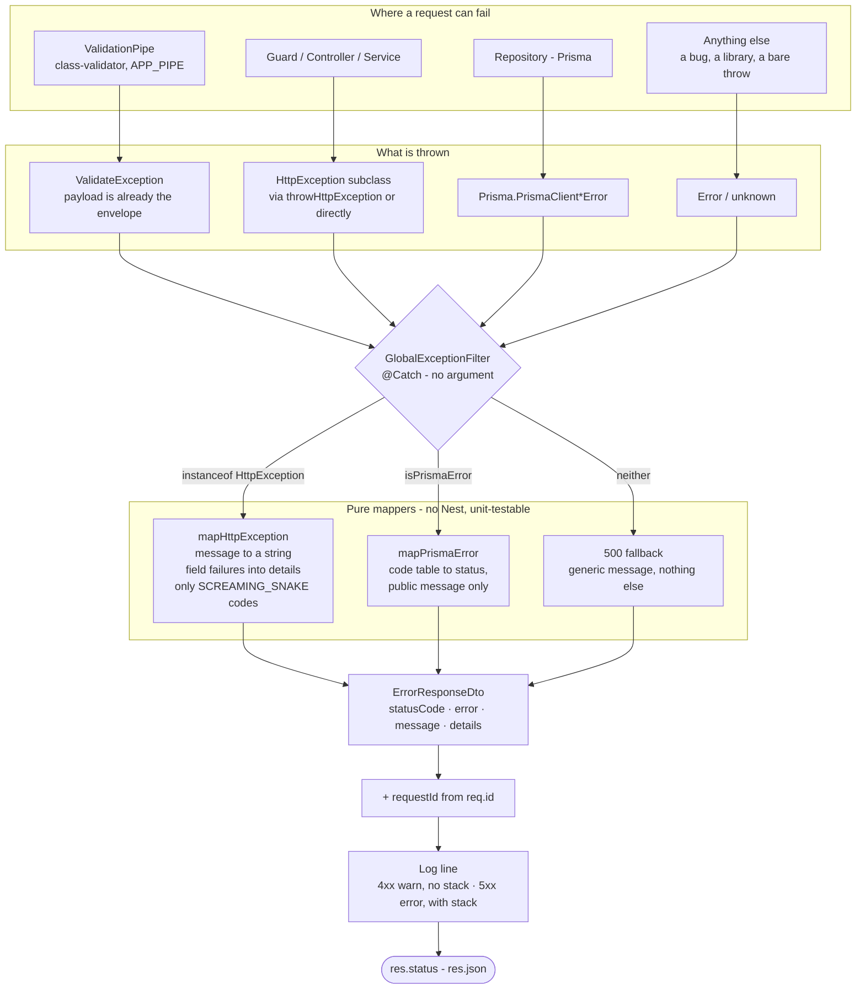
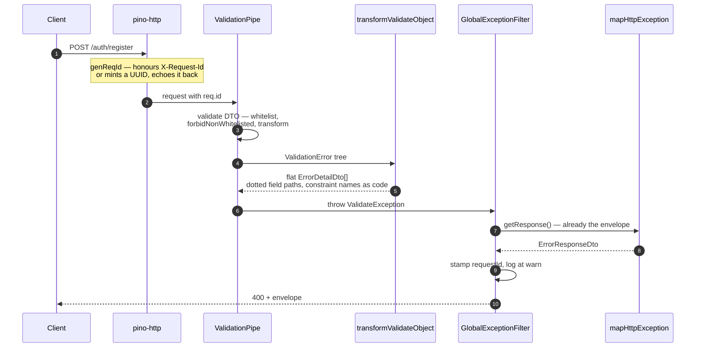

# Error Handling

Every error this API can produce leaves through one function and arrives at the client in
one shape. This page describes that shape, the pieces that build it, and what you have to
do when you add a new failure of your own.

## The contract

```json
{
  "statusCode": 400,
  "error": "VALIDATION_FAILED",
  "message": "Validation failed",
  "details": [
    {
      "field": "email",
      "code": "isEmail",
      "message": "email must be an email"
    },
    {
      "field": "password",
      "code": "minLength",
      "message": "password must be longer than or equal to 8 characters"
    }
  ],
  "requestId": "3f1b2c8e-0e4a-4a1e-9f0c-2b7d0a1c5e64"
}
```

| Field        | Type               | Always present                      | What it is                                                                 |
| ------------ | ------------------ | ----------------------------------- | -------------------------------------------------------------------------- |
| `statusCode` | `number`           | yes                                 | Mirrors the HTTP status line.                                              |
| `error`      | `string`           | yes                                 | Stable SCREAMING_SNAKE machine code. **This is the field to branch on.**   |
| `message`    | `string`           | yes                                 | Human-facing summary. Never an array, never an object.                     |
| `details`    | `ErrorDetailDto[]` | yes                                 | Per-field failures. Empty array when the failure is not scoped to a field. |
| `requestId`  | `string`           | when the request reached the logger | Correlates the response with its access-log line.                          |

`ErrorDetailDto`:

| Field     | Example                      | What it is                                                                                                                                          |
| --------- | ---------------------------- | --------------------------------------------------------------------------------------------------------------------------------------------------- |
| `field`   | `"address.city"`             | Dotted path to the offending input. Nested DTOs flatten into this path.                                                                             |
| `code`    | `"isNotEmpty"`               | Either a registered `ErrorCode` (business failure) or a class-validator constraint name (DTO validation). Stable across message and locale changes. |
| `message` | `"city should not be empty"` | Text for this one constraint.                                                                                                                       |

### Two rules for clients

**Branch on `error` and `details[].code`, never on `message`.** `message` is English,
meant for logs and developers — it is never copy to show a user, and it will be reworded
without notice. Localization happens in the frontend, which translates `error` and
`details[].code` into locale copy and falls back to `message` only when nothing else is
available. The codes are part of the contract and change only with a versioned API change.

**Treat `details` as a list, not a map.** A single field with two failed constraints
produces two entries with the same `field`. Group client-side if your form needs one
message per input.

```ts
// Reading the envelope on the client
if (body.error === "VALIDATION_FAILED") {
  const byField = new Map<string, string[]>();
  for (const d of body.details) {
    byField.set(d.field, [...(byField.get(d.field) ?? []), d.message]);
  }
}
```

## How a failure becomes a response

Four kinds of throw enter the filter; one envelope leaves it.



Read top to bottom, the guarantee is: **whatever was thrown, only `ErrorResponseDto` reaches
the wire.** There is no second path to `res.json()` anywhere in the application.

### A validation failure, end to end



The controller is never reached, and neither is any service — the pipe rejects the request
before the handler runs, which is why a validation failure costs no database work.

### Why exactly one filter

`GlobalExceptionFilter` uses a bare `@Catch()` — it catches everything. That is
deliberate. Nest picks the answering filter by matching `@Catch()` metadata against the
registered `APP_FILTER` providers, so with two or more filters the response shape depends
on provider _order_ — a fact that is invisible at every throw site and trivially broken by
reordering an array. One filter dispatching to pure mapper functions cannot drift that
way, and the mappers stay unit-testable without booting Nest.

This is what replaced the previous `PrismaClientExceptionFilter` + `ExternalExceptionFilter`
pair.

## The pieces

| File                                                                                                | Responsibility                                                                                              |
| --------------------------------------------------------------------------------------------------- | ----------------------------------------------------------------------------------------------------------- |
| [`src/dtos/error-response.dto.ts`](../src/dtos/error-response.dto.ts)                               | The envelope. Fills `error` and `message` from the status when not given.                                   |
| [`src/dtos/error-detail.dto.ts`](../src/dtos/error-detail.dto.ts)                                   | One failed constraint on one field.                                                                         |
| [`src/shared/filters/global-exception.filter.ts`](../src/shared/filters/global-exception.filter.ts) | The only writer of an error response. Dispatch, `requestId`, logging.                                       |
| [`src/shared/filters/http-exception.mapper.ts`](../src/shared/filters/http-exception.mapper.ts)     | `HttpException` → envelope.                                                                                 |
| [`src/shared/filters/prisma-error.mapper.ts`](../src/shared/filters/prisma-error.mapper.ts)         | Prisma error code → status + public message.                                                                |
| [`src/shared/exceptions/validate.exception.ts`](../src/shared/exceptions/validate.exception.ts)     | Raised by the validation pipe; carries the envelope as its payload.                                         |
| [`src/shared/utils/app.util.ts`](../src/shared/utils/app.util.ts)                                   | Flattens class-validator's error tree into `ErrorDetailDto[]`.                                              |
| [`src/shared/utils/validation-pipe.config.ts`](../src/shared/utils/validation-pipe.config.ts)       | The one pipe configuration.                                                                                 |
| [`src/constants/error-codes/index.ts`](../src/constants/error-codes/index.ts)                       | Merges the 8 per-domain code files into `ErrorCode` (84 codes) + `errorCodeFromStatus` + `ALL_ERROR_CODES`. |
| [`src/constants/error-message.constant.ts`](../src/constants/error-message.constant.ts)             | Fallback text per status.                                                                                   |

Both the pipe and the filter are registered once, in
[`src/shared/modules/base.module.ts`](../src/shared/modules/base.module.ts), as `APP_PIPE`
and `APP_FILTER`. Nothing is configured in `main.ts`. That is what lets the e2e harness
(`test/e2e/support/create-test-app.ts`) simply import `AppModule` and get production's exact
error behavior — there is no second copy of the pipe options to fall out of step with.

## Validation

The pipe runs with `whitelist`, `forbidNonWhitelisted` and `transform` on. An unknown
property is an error, not something silently stripped.

`transformValidateObject` walks class-validator's recursive `ValidationError` tree and emits
one flat entry per failed constraint, joining nested property names with dots:

```ts
// DTO: class CreateUserDto { @ValidateNested() @Type(() => AddressDto) address: AddressDto }
// AddressDto: { @IsNotEmpty() city: string }

// POST { "address": { "city": "" } }
details ===
  [
    {
      field: "address.city",
      code: "isNotEmpty",
      message: "city should not be empty",
    },
  ];
```

`code` is the constraint key class-validator itself uses. Custom decorators supply their
own: the decorator in `src/validations/decorators/is-only-one-exists.ts` is registered with
`@ValidatorConstraint({ name: "mutuallyExclusive" })`, so its failures arrive with
`code: "mutuallyExclusive"`.

### `error` derivation

`ErrorResponseDto` fills `error` from the HTTP status when the throw site did not set one,
using `HttpStatus`'s own reverse mapping — 404 becomes `"NOT_FOUND"`, 422 becomes
`"UNPROCESSABLE_ENTITY"`. Only codes the application raises _deliberately_ are listed in
`ErrorCode`, so that constant never becomes a hand-maintained duplicate of `HttpStatus`.

`VALIDATION_FAILED` is the one code that is set explicitly, because "a DTO failed
validation" is a distinct thing from "the request was bad" even though both are 400.

`ErrorCode` itself is assembled in
[`src/constants/error-codes/index.ts`](../src/constants/error-codes/index.ts) from one file
per domain (`infra`, `auth`, `identity`, `catalog`, `cart`, `order`, `review`, `upload`) —
84 codes total, kept under the project's per-file size limit. `index.ts` also exports a
same-named `ErrorCode` type, the closed union of every value in the object;
`throwHttpException`'s `code` parameter is typed to it, so a misspelled or unregistered code
fails at compile time instead of reaching a client that cannot branch on it.

`http-decorator.ts` registers every error response with `type: ErrorResponseDto`, not just
`schema.example` — that's what puts `ErrorResponseDto` into `components/schemas`, which is
what makes `error`'s `@ApiProperty({ enum: ALL_ERROR_CODES })` reach `swagger.yaml` as an
enum instead of a bare `string`. `ALL_ERROR_CODES` (also from `error-codes/index.ts`) is the
registry plus every status-derived name `HttpStatus` can produce, since both reach the wire.
This is what lets a generated client type `error` as a union.

## Prisma

Repository failures never reach the client verbatim — Prisma's message text names tables,
columns and constraints. `mapPrismaError` translates the error code into a status and a
public message; the raw message goes to the log only, trimmed by `shortPrismaMessage`.

| Prisma code               | Status | Meaning                                 |
| ------------------------- | ------ | --------------------------------------- |
| `P1008`                   | 408    | Operation timed out                     |
| `P2000`                   | 400    | Value too long for the column           |
| `P2001`                   | 404    | Record does not exist                   |
| `P2002`                   | 409    | Unique constraint violation             |
| `P2003`, `P2014`, `P2020` | 422    | Relation / range violation              |
| `P2016`                   | 404    | Record to update not found              |
| `P2021`                   | 500    | Table does not exist                    |
| `P2025`                   | 404    | Queried record not found                |
| anything else             | 500    | Generic message, full detail in the log |

## Logging

`GlobalExceptionFilter` writes exactly one line per failure, prefixed with the `requestId`,
so a client bug report quoting a `requestId` leads straight to the cause:

```
[3f1b2c8e-…] POST /auth/register -> 400 VALIDATION_FAILED - Validation failed
```

A 4xx is the client being told it is wrong — expected traffic, not an incident. Those log
at `warn` with no stack. A 5xx logs at `error` with the stack attached.

The id itself comes from `genReqId` in
[`src/shared/utils/setup-logger.util.ts`](../src/shared/utils/setup-logger.util.ts), which
honours an inbound `X-Request-Id` header or mints a UUID, and echoes it back on the response.
Sensitive request fields (`authorization`, `password`, `email`, `phoneNumber`, tokens) are
redacted there before anything is written.

## Adding a new error

### Business-rule failures — use `throwHttpException`

This is the convention across services and repositories, and the reason it exists is
that it produces the envelope for you:

```ts
import { ErrorCode } from "@/constants/error-codes";
import throwHttpException from "@/shared/utils/throw-http-exception.util";

throwHttpException({
  type: "unprocessable",
  code: ErrorCode.VERIFICATION_CODE_INVALID,
  message: "Verification code is not valid.",
});
// -> { statusCode: 422, error: "VERIFICATION_CODE_INVALID",
//      message: "Verification code is not valid.", details: [], requestId: "…" }
```

`type` is one of `badRequest`, `notFound`, `unprocessable`, `unauthorized`, `forbidden`,
`conflict`, `tooManyRequests`, `internal`, and decides the status.

Pass `code` whenever a client must branch on the failure rather than merely display it —
that is the whole point of the field. `code` is a registered `ErrorCode`, and it sets BOTH
the envelope's top-level `error` and the `details[].code` for any field this throw names:

```ts
throwHttpException({
  type: "conflict",
  message: "SKU is out of stock.",
  field: "items.0.skuId",
  code: ErrorCode.SKU_INSUFFICIENT_STOCK,
});
// -> { error: "SKU_INSUFFICIENT_STOCK",
//      details: [{ field: "items.0.skuId", code: "SKU_INSUFFICIENT_STOCK",
//                   message: "SKU is out of stock." }] }
```

Pass `detailCode` instead when the `details` entry must carry something other than `code` —
the one real case is a class-validator constraint name:

```ts
throwHttpException({
  type: "conflict",
  message: "Some items are no longer available.",
  field: "items.0.skuId",
  code: ErrorCode.SKU_UNAVAILABLE,
  detailCode: "isOptional",
});
// details[].code is "isOptional"; the envelope's error is still "SKU_UNAVAILABLE"
```

`details[].code` falls back to the literal `"invalid"` only when neither `code` nor
`detailCode` is given.

Omit `code` only for `type: "internal"` — a client cannot act on an infrastructure failure,
so `error` derives from the HTTP status instead, same as before. Every other business throw
must carry a `code`:
[`error-code-coverage.spec.ts`](../src/shared/utils/__tests__/error-code-coverage.spec.ts)
scans every `throwHttpException` call and fails the build if a non-`internal` call has no
`code: ErrorCode.…`. If you introduce a new `ErrorCode` value, add it to the matching domain
file under `src/constants/error-codes/` and tell the frontend — a new `error` value is an
API change.

### Throwing Nest exceptions directly

Still works; `mapHttpException` normalizes anything an `HttpException` carries. A bare
message is the common case:

```ts
throw new NotFoundException("Brand not found.");
// -> { statusCode: 404, error: "NOT_FOUND", message: "Brand not found.", details: [] }
```

An object payload passes `error` and `details` through untouched, which is what
`throwHttpException` itself does under the hood.

### A new field constraint

Write a class-validator decorator under `src/validations/decorators/`. Give
`@ValidatorConstraint({ name })` a name you are willing to publish: that name becomes
`details[].code`.

### Never

Do not build an error body by hand, and do not `res.json()` an error from a controller.
`GlobalExceptionFilter` is the single writer; a second one reintroduces exactly the drift
this design removes.

## What this replaced

Before the refactor, `message` carried three incompatible types depending on which
component handled the failure — a `{field, message}[]` from the class-validator pipe, a JSON
string of issues from `nestjs-zod`, a plain string everywhere else — so no client could
write one handler. Constraint identity was discarded (`errorCode` was commented out), leaving
English message text as the only machine-readable signal.

Three changes settled it: `nestjs-zod` was removed from the HTTP pipeline, making
class-validator the single validation system; the two exception filters became one; and
`throwHttpException` — the path the great majority of call sites take — was rewritten to emit the envelope
instead of its own `{message, field}` payload, which had been dropping `field` entirely for
every type except `badRequest`.

Two bugs were fixed along the way: `P2001` mapped to `204 No Content` with a JSON body —
a status that forbids a body, and the wrong meaning for "record does not exist" — and the
Prisma filter called `getResponse()` where it meant `getRequest()`.

`nestjs-zod` is gone from the request/response path. Standalone `zod` is still used inside
`GoogleService` to parse the OAuth `state` blob, which is not HTTP validation and is
unaffected.
