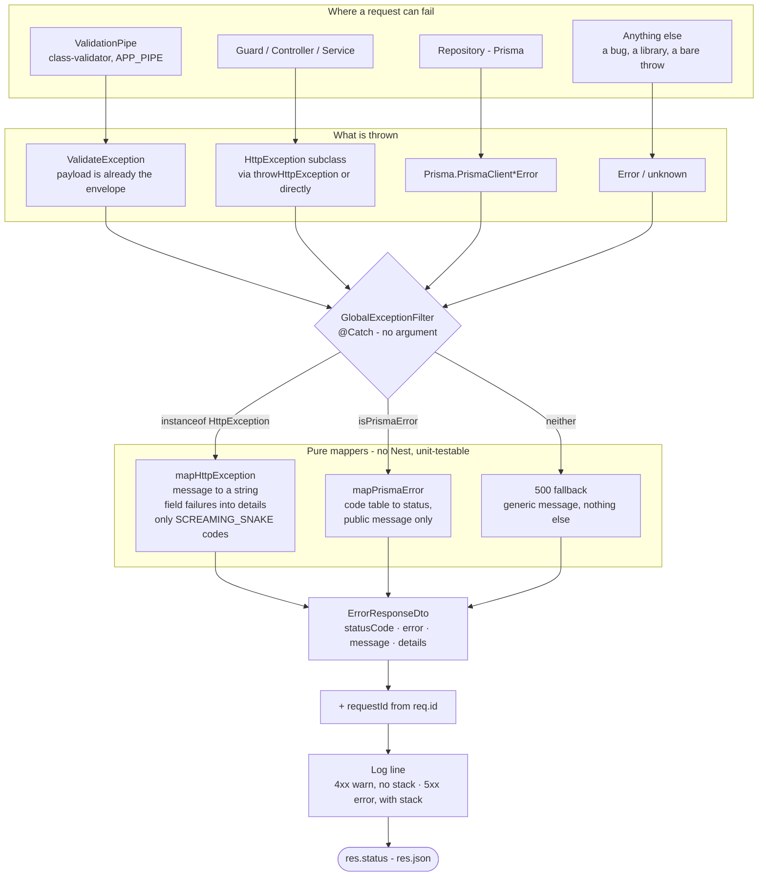
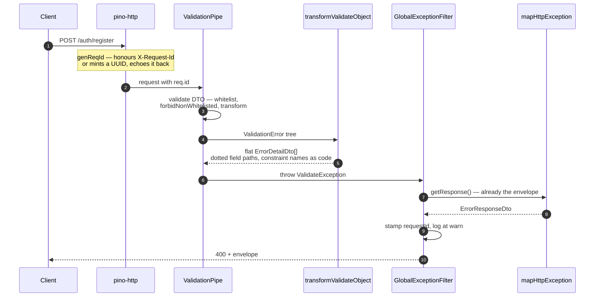

# Xử lý lỗi

Mọi lỗi mà API này có thể phát sinh đều đi qua đúng một hàm và tới client theo đúng một khuôn dạng. Trang này mô tả khuôn dạng đó, các phần tạo nên nó, và việc bạn cần làm khi thêm một loại lỗi mới của riêng mình.

## Contract

```json
{
  "statusCode": 400,
  "error": "VALIDATION_FAILED",
  "message": "Validation failed",
  "details": [
    {
      "field": "email",
      "code": "isEmail",
      "message": "email must be an email"
    },
    {
      "field": "password",
      "code": "minLength",
      "message": "password must be longer than or equal to 8 characters"
    }
  ],
  "requestId": "3f1b2c8e-0e4a-4a1e-9f0c-2b7d0a1c5e64"
}
```

| Field        | Type               | Always present                      | What it is                                                                 |
| ------------ | ------------------ | ----------------------------------- | -------------------------------------------------------------------------- |
| `statusCode` | `number`           | yes                                 | Mirrors the HTTP status line.                                              |
| `error`      | `string`           | yes                                 | Stable SCREAMING_SNAKE machine code. **This is the field to branch on.**   |
| `message`    | `string`           | yes                                 | Human-facing summary. Never an array, never an object.                     |
| `details`    | `ErrorDetailDto[]` | yes                                 | Per-field failures. Empty array when the failure is not scoped to a field. |
| `requestId`  | `string`           | when the request reached the logger | Correlates the response with its access-log line.                          |

`ErrorDetailDto`:

| Field     | Example                      | What it is                                                                     |
| --------- | ---------------------------- | ------------------------------------------------------------------------------ |
| `field`   | `"address.city"`             | Dotted path to the offending input. Nested DTOs flatten into this path.        |
| `code`    | `"isNotEmpty"`               | The class-validator constraint name. Stable across message and locale changes. |
| `message` | `"city should not be empty"` | Text for this one constraint.                                                  |

### Hai quy tắc dành cho client

**Rẽ nhánh theo `error` và `details[].code`, không bao giờ theo `message`.** `message` là văn bản dành cho người đọc; nó sẽ được viết lại, và sớm muộn cũng sẽ được đa ngôn ngữ hóa. Các code mới là phần thuộc contract, chỉ đổi khi API có version mới.

**Coi `details` là một list, không phải một map.** Một field bị fail hai constraint sẽ cho ra hai entry cùng `field`. Cần gộp lại phía client nếu form chỉ muốn hiển thị một message cho mỗi input.

```ts
// Reading the envelope on the client
if (body.error === "VALIDATION_FAILED") {
  const byField = new Map<string, string[]>();
  for (const d of body.details) {
    byField.set(d.field, [...(byField.get(d.field) ?? []), d.message]);
  }
}
```

## Từ lỗi tới response — quy trình

Bốn kiểu throw đi vào filter; chỉ một khuôn dạng đi ra khỏi nó.



Đọc từ trên xuống, đây là cam kết: **dù thứ gì bị throw ra, chỉ `ErrorResponseDto` mới ra tới
wire.** Không có đường thứ hai nào tới `res.json()` ở bất kỳ đâu trong ứng dụng.

### Một lỗi validate, từ đầu tới cuối



Controller không bao giờ được chạm tới, service cũng vậy — pipe reject request trước khi
handler chạy, nên một lỗi validate không tốn công truy vấn database nào.

### Vì sao chỉ dùng đúng một filter

`GlobalExceptionFilter` dùng `@Catch()` trần — bắt mọi thứ. Đó là chủ đích. Nest chọn filter
xử lý bằng cách khớp metadata `@Catch()` với các provider `APP_FILTER` đã đăng ký, nên nếu có
từ hai filter trở lên, hình dạng response sẽ phụ thuộc vào _thứ tự_ provider — một điều không
ai nhìn thấy tại nơi throw, và dễ dàng vỡ chỉ vì đảo lại thứ tự một mảng. Một filter duy nhất
dispatch tới các hàm mapper thuần thì không thể trôi theo kiểu đó, và các mapper vẫn
unit-test được mà không cần khởi động Nest.

Đây chính là thứ đã thay cho cặp `PrismaClientExceptionFilter` + `ExternalExceptionFilter`
trước kia.

## Các thành phần

| File                                                                                                | Trách nhiệm                                                                   |
| --------------------------------------------------------------------------------------------------- | ----------------------------------------------------------------------------- |
| [`src/dtos/error-response.dto.ts`](../src/dtos/error-response.dto.ts)                               | Khuôn dạng response lỗi. Tự điền `error` và `message` từ status khi chưa có.  |
| [`src/dtos/error-detail.dto.ts`](../src/dtos/error-detail.dto.ts)                                   | Một constraint fail trên một field.                                           |
| [`src/shared/filters/global-exception.filter.ts`](../src/shared/filters/global-exception.filter.ts) | Nơi duy nhất ghi ra error response. Dispatch, `requestId`, logging.           |
| [`src/shared/filters/http-exception.mapper.ts`](../src/shared/filters/http-exception.mapper.ts)     | `HttpException` → khuôn dạng response lỗi.                                    |
| [`src/shared/filters/prisma-error.mapper.ts`](../src/shared/filters/prisma-error.mapper.ts)         | Code lỗi Prisma → status + message công khai.                                 |
| [`src/shared/exceptions/validate.exception.ts`](../src/shared/exceptions/validate.exception.ts)     | Được validation pipe throw ra; mang theo khuôn dạng response lỗi làm payload. |
| [`src/shared/utils/app.util.ts`](../src/shared/utils/app.util.ts)                                   | San phẳng cây lỗi của class-validator thành `ErrorDetailDto[]`.               |
| [`src/shared/utils/validation-pipe.config.ts`](../src/shared/utils/validation-pipe.config.ts)       | Cấu hình pipe duy nhất.                                                       |
| [`src/constants/error-code.constant.ts`](../src/constants/error-code.constant.ts)                   | Các code có chủ đích + `errorCodeFromStatus`.                                 |
| [`src/constants/error-message.constant.ts`](../src/constants/error-message.constant.ts)             | Text fallback theo từng status.                                               |

Cả pipe và filter đều được đăng ký đúng một lần, trong
[`src/shared/modules/base.module.ts`](../src/shared/modules/base.module.ts), làm `APP_PIPE`
và `APP_FILTER`. `main.ts` không cấu hình gì thêm. Nhờ vậy e2e harness
(`test/e2e/support/create-test-app.ts`) chỉ cần import `AppModule` là có đúng hành vi lỗi của
production — không tồn tại bản sao thứ hai của cấu hình pipe có thể lệch pha.

## Validate

Pipe chạy với `whitelist`, `forbidNonWhitelisted` và `transform` đều bật. Một property lạ là
một lỗi, không phải thứ bị âm thầm loại bỏ.

`transformValidateObject` duyệt cây `ValidationError` đệ quy của class-validator và sinh ra
một entry phẳng cho mỗi constraint fail, nối các tên property lồng nhau bằng dấu chấm:

```ts
// DTO: class CreateUserDto { @ValidateNested() @Type(() => AddressDto) address: AddressDto }
// AddressDto: { @IsNotEmpty() city: string }

// POST { "address": { "city": "" } }
details ===
  [
    {
      field: "address.city",
      code: "isNotEmpty",
      message: "city should not be empty",
    },
  ];
```

`code` chính là key constraint mà class-validator tự dùng. Decorator tự viết cung cấp key
riêng: decorator trong `src/validations/decorators/is-only-one-exists.ts` được đăng ký với
`@ValidatorConstraint({ name: "mutuallyExclusive" })`, nên lỗi của nó trả về
`code: "mutuallyExclusive"`.

### Cách sinh ra `error`

`ErrorResponseDto` tự điền `error` từ HTTP status khi nơi throw không set giá trị này, dùng
bảng ánh xạ ngược có sẵn của `HttpStatus` — 404 thành `"NOT_FOUND"`, 422 thành
`"UNPROCESSABLE_ENTITY"`. Chỉ những code mà ứng dụng chủ động ném ra mới được liệt kê trong
`ErrorCode`, nhờ vậy hằng số đó không bao giờ biến thành bản sao thủ công của `HttpStatus`.

`VALIDATION_FAILED` là code duy nhất được set tường minh, vì "DTO fail validate" là một việc
khác với "request sai" dù cả hai đều là 400.

## Prisma

Lỗi từ repository không bao giờ tới thẳng client — message gốc của Prisma nêu tên table,
column và constraint. `mapPrismaError` dịch code lỗi thành status và một message công khai;
message gốc chỉ vào log, đã được `shortPrismaMessage` cắt ngắn.

| Prisma code               | Status | Meaning                                 |
| ------------------------- | ------ | --------------------------------------- |
| `P1008`                   | 408    | Operation timed out                     |
| `P2000`                   | 400    | Value too long for the column           |
| `P2001`                   | 404    | Record does not exist                   |
| `P2002`                   | 409    | Unique constraint violation             |
| `P2003`, `P2014`, `P2020` | 422    | Relation / range violation              |
| `P2016`                   | 404    | Record to update not found              |
| `P2021`                   | 500    | Table does not exist                    |
| `P2025`                   | 404    | Queried record not found                |
| anything else             | 500    | Generic message, full detail in the log |

## Logging

`GlobalExceptionFilter` ghi đúng một dòng cho mỗi lỗi, gắn tiền tố `requestId`, nên một báo
lỗi từ client trích đúng `requestId` là lần ra ngay nguyên nhân:

```
[3f1b2c8e-…] POST /auth/register -> 400 VALIDATION_FAILED - Validation failed
```

Lỗi 4xx là đang báo cho client biết nó sai — traffic bình thường, không phải sự cố. Loại này
log ở mức `warn`, không kèm stack. Lỗi 5xx log ở mức `error`, kèm stack.

ID này lấy từ `genReqId` trong
[`src/shared/utils/setup-logger.util.ts`](../src/shared/utils/setup-logger.util.ts), hàm này
ưu tiên dùng header `X-Request-Id` gửi vào, nếu không có mới sinh UUID mới, và trả ngược lại
trong response. Các field nhạy cảm của request (`authorization`, `password`, `email`,
`phoneNumber`, token) được che trước khi ghi log.

## Thêm một lỗi mới

### Lỗi nghiệp vụ — dùng `throwHttpException`

Đây là quy ước dùng chung trên toàn bộ service và repository, lý do là nó tự tạo khuôn dạng
response lỗi giúp bạn:

```ts
import throwHttpException from "@/shared/utils/throw-http-exception.util";

throwHttpException({
  type: "unprocessable",
  message: "Verification code is not valid.",
});
// -> { statusCode: 422, error: "UNPROCESSABLE_ENTITY",
//      message: "Verification code is not valid.", details: [], requestId: "…" }
```

`type` là một trong `badRequest`, `notFound`, `unprocessable`, `unauthorized`, `forbidden`,
`conflict`, `internal`, và quyết định status trả về.

Truyền `field` khi lỗi gắn với một input cụ thể. Nó sẽ thành một entry trong `details`, để
form có thể highlight đúng ô:

```ts
throwHttpException({
  type: "conflict",
  message: "SKU is out of stock.",
  field: "items.0.skuId",
  code: "outOfStock",
});
// details: [{ field: "items.0.skuId", code: "outOfStock", message: "SKU is out of stock." }]
```

`code` mặc định là `"invalid"`. Truyền một code thật mỗi khi client cần rẽ nhánh theo lỗi đó
chứ không chỉ hiển thị nó — đó là lý do field này tồn tại. `error` cũng ghi đè code máy ở
top-level theo cách tương tự:

```ts
throwHttpException({
  type: "conflict",
  message: "Some items are no longer available.",
  error: "CART_ITEMS_UNAVAILABLE",
});
```

Nếu bạn thêm một giá trị `error` mới ở top-level, hãy thêm nó vào `ErrorCode` để dễ tra cứu,
và báo cho frontend — một giá trị `error` mới là một thay đổi API.

### Throw thẳng exception của Nest

Vẫn hoạt động; `mapHttpException` chuẩn hóa bất kỳ thứ gì một `HttpException` mang theo.
Trường hợp thường gặp là một message trần:

```ts
throw new NotFoundException("Brand not found.");
// -> { statusCode: 404, error: "NOT_FOUND", message: "Brand not found.", details: [] }
```

Một payload dạng object sẽ giữ nguyên `error` và `details`, đúng như cách
`throwHttpException` tự làm bên dưới.

### Thêm một constraint mới cho field

Viết một decorator class-validator trong `src/validations/decorators/`. Đặt cho
`@ValidatorConstraint({ name })` một cái tên bạn sẵn sàng công khai: tên đó sẽ trở thành
`details[].code`.

### Tuyệt đối không

Không tự tay dựng body lỗi, và không `res.json()` một lỗi từ controller.
`GlobalExceptionFilter` là nơi ghi response duy nhất; thêm một nơi ghi thứ hai là tái tạo lại
đúng cái drift mà thiết kế này đã loại bỏ.

## Trước đây đã thay thế cái gì

Trước khi refactor, `message` mang ba kiểu dữ liệu không tương thích tùy vào thành phần nào
xử lý lỗi — một mảng `{field, message}[]` từ pipe của class-validator, một chuỗi JSON chứa
issue từ `nestjs-zod`, một chuỗi thường ở mọi nơi khác — nên không client nào viết nổi một
handler chung. Danh tính constraint bị bỏ mất (`errorCode` bị comment out), chỉ còn lại
message tiếng Anh làm tín hiệu duy nhất mà máy đọc được.

Ba thay đổi đã giải quyết việc này: gỡ `nestjs-zod` khỏi HTTP pipeline, để class-validator
thành hệ thống validate duy nhất; gộp hai exception filter thành một; và viết lại
`throwHttpException` — đường mà phần lớn call site đi qua — để nó phát ra đúng khuôn dạng
response lỗi thay vì payload `{message, field}` của riêng nó, vốn đã làm rớt mất `field`
hoàn toàn với mọi type trừ `badRequest`.

Hai bug cũng được sửa luôn trong lúc đó: `P2001` từng map sang `204 No Content` kèm JSON body
— một status vốn cấm có body, và còn sai nghĩa cho "record không tồn tại" — và Prisma filter
gọi nhầm `getResponse()` trong khi ý định là `getRequest()`.

`nestjs-zod` đã biến mất khỏi đường request/response. `zod` độc lập vẫn được dùng trong
`GoogleService` để parse blob `state` của OAuth, đây không phải HTTP validation nên không bị
ảnh hưởng.
