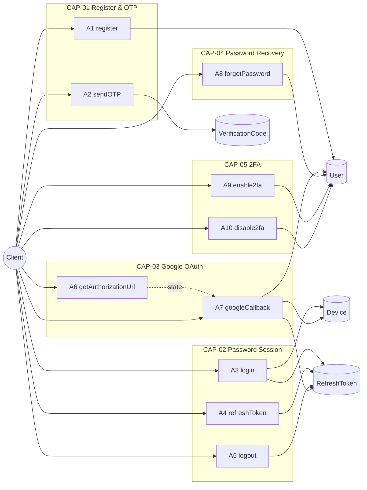
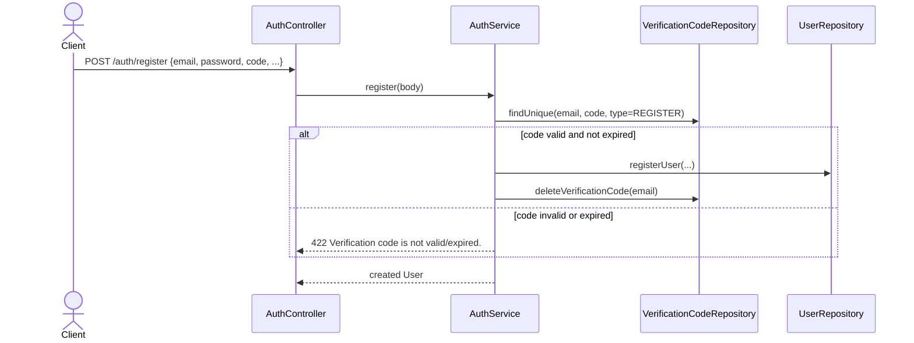
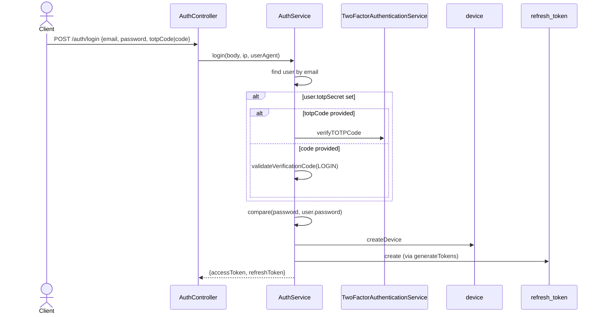
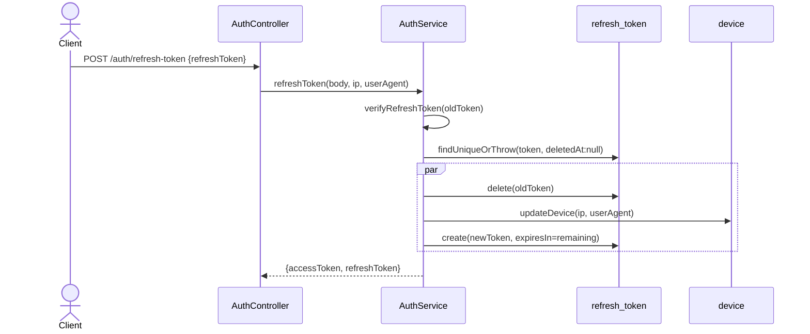
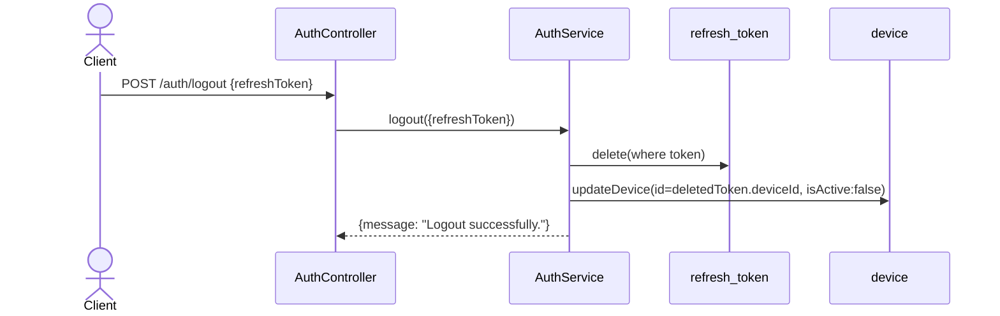
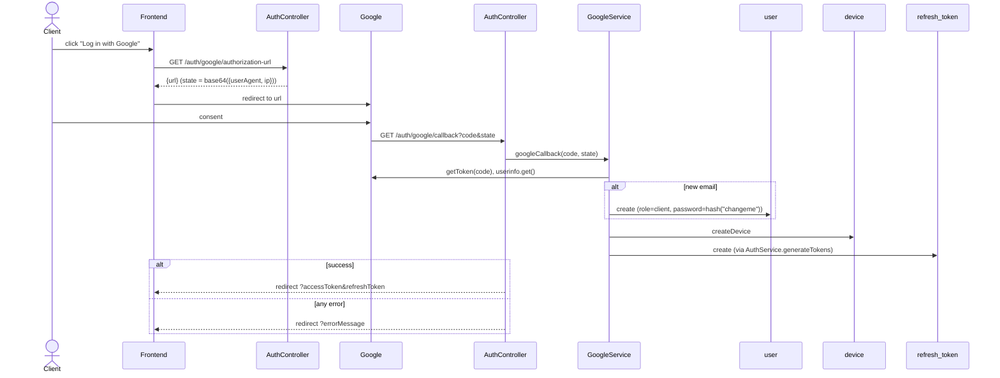
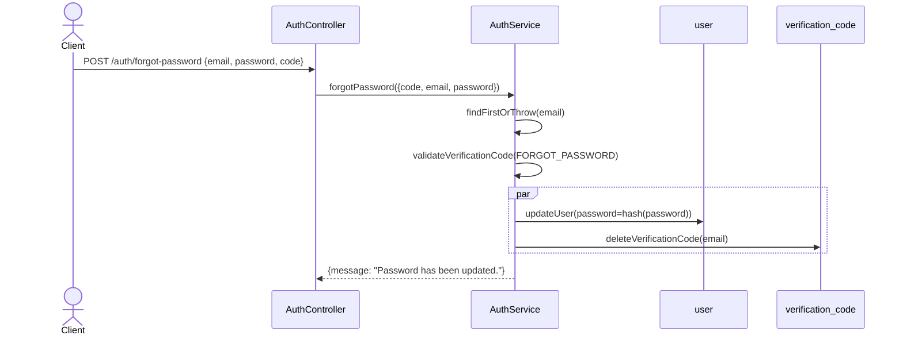
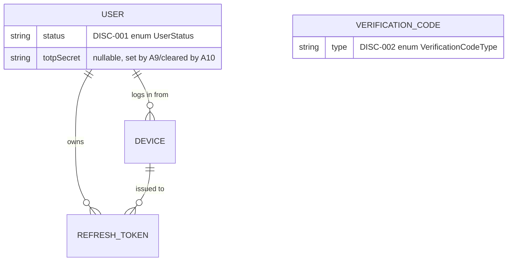
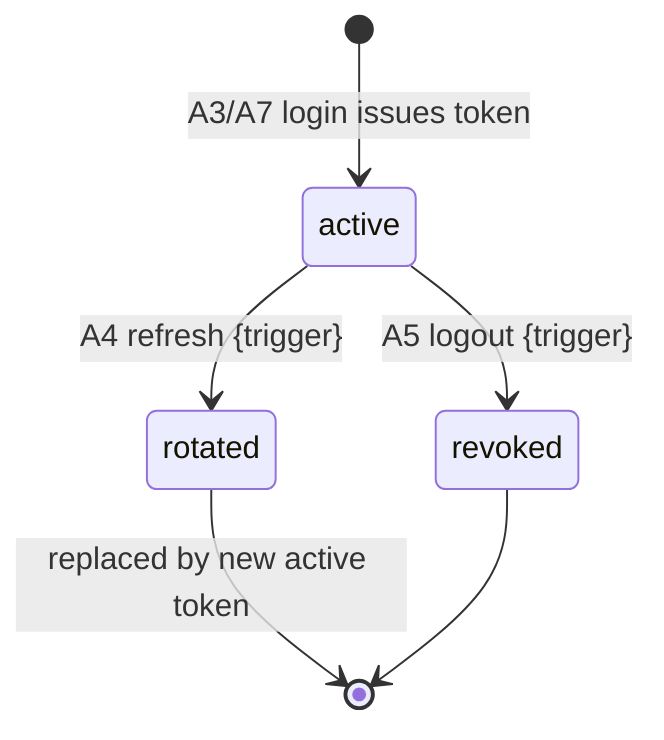

<!-- layout-exempt: rebuild-spec owns all docs/system|features|generated|flows paths -->
<!-- Contract: references/feature-spec-researcher-contract.md -->

# F001_Authentication — Technical Spec

**Priority**: P0
**Type**: mixed
**Generated**: 2026-09-12

**See also:** [`functional-spec.md`](./functional-spec.md) — plain-language overview, open
decisions, requirements/business rules stated in one-liners, screens, user stories, scenarios,
edge cases, and configuration for a BA/QA audience.

**How to read this file:** § 2 is the index — pick the action you care about and read its block
in § 3 straight through; each block is one complete thread, top to bottom. § 4 is the shared
appendix — jump in only when a § 3 block points you there.

## 1. Technical Overview

`AuthController` (`src/routes/auth/auth.controller.ts`) exposes 10 routes backed by `AuthService`
and `GoogleService`. Credential/OTP paths persist `User`, `VerificationCode`, `Device`, and
`RefreshToken` rows via dedicated repositories; the Google path (`BL003`) wraps
`google-auth-library`'s `OAuth2Client` and funnels into the same `AuthService.generateTokens`
token-issuance path as password login. Global `APP_GUARD` (`AuthorizationHeaderGuard`) requires a
`Bearer` token on every route in this feature except the six marked `@IsPublicApi()`.



## 2. Action Index

| # | Action (handler) | Method · Path | Codes | Writes | Detail |
|---|---|---|---|---|---|
| **A0** | *cross-cutting — belongs to no single action* | — | {FR-601} | — | § 4.4 |
| **A1** | `AuthController#register` | `POST` `/auth/register` | {FR-001, FR-101, FR-201, BR-001, BR-002, RISK-02, US001} | `user`, `verification_code` | § 3.1 ▸ **diagram** |
| **A2** | `AuthController#sendOTP` | `POST` `/auth/otp` | {FR-002, FR-202, BR-002, RISK-01, US005} | `verification_code` | § 3.1 |
| **A3** | `AuthController#login` | `POST` `/auth/login` | {FR-102, FR-203, BR-003, BR-005, US002} | `device`, `refresh_token` | § 3.2 ▸ **diagram** |
| **A4** | `AuthController#refreshToken` | `POST` `/auth/refresh-token` | {FR-204, BR-004, BR-005, DEC-001, US003, SM-001} | `refresh_token`, `device` | § 3.2 ▸ **diagram** |
| **A5** | `AuthController#logout` | `POST` `/auth/logout` | {FR-205, US004, SM-001} | `refresh_token`, `device` | § 3.2 ▸ **diagram** |
| **A6** | `AuthController#getAuthorizationUrl` | `GET` `/auth/google/authorization-url` | {FR-103, US006} | — *(read-only)* | § 3.3 |
| **A7** | `AuthController#googleCallback` | `GET` `/auth/google/callback` | {FR-206, BR-006, BR-007, DEC-002, RISK-03, RISK-04, US006} | `user`, `device`, `refresh_token` | § 3.3 ▸ **diagram** |
| **A8** | `AuthController#forgotPassword` | `POST` `/auth/forgot-password` | {FR-207, BR-008, US007} | `user`, `verification_code` | § 3.4 ▸ **diagram** |
| **A9** | `AuthController#enable2fa` | `POST` `/auth/2fa/enable` | {FR-208, BR-009, US008} | `user` | § 3.5 |
| **A10** | `AuthController#disable2fa` | `POST` `/auth/2fa/disable` | {FR-209, BR-010, US009} | `user` | § 3.5 |

`DISC-001` (`User.status`) and `DISC-002` (`VerificationCode.type`) are not claimed by any single
action row above by design — they are structural (§ 4.2 Polymorphic Behavior), not a per-action
decision; `DISC-002`'s four purpose values are read inline by A1/A2/A3/A8's Rule rungs instead.

## 3. Actions

### 3.1 CAP-01 — Register & Verify Identity

#### A1 · Register a new account
`POST` `/auth/register` → `` `AuthController#register` ``
`FR-001` `FR-101` `FR-201` · `US001`

**Who** · any unauthenticated caller *(route is `@IsPublicApi()` — gate A0 does not apply)*
**Request** · body `email`, `password`, `confirmPassword`, `phoneNumber`, `name`, `avatar?`
(`RegisterRequestDto`, `src/dtos/auth/register.dto.ts:6-71`) — `confirmPassword` must equal
`password` (`IsPasswordMatch`, `src/validations/decorators/is-password-match.decorator.ts:7-33`);
`code` (6 chars) is the `REGISTER` purpose OTP.
**BE** · `` `AuthService#register` `` — `src/routes/auth/auth.service.ts:105-134`
**Rule**
- **BR-001 — new accounts always get the `client` role.** `getClientRoleId()` looks up the
  seeded `client` `Role` row by name (`src/repositories/role/shared-role.repository.ts:25-47`);
  there is no DTO field to request another role. *(§ 4.4)*
- **BR-002 — the register OTP must be valid and is consumed on success.**
  `validateVerificationCode` requires an exact `(email, code, type=REGISTER)` match that has not
  expired (`src/routes/auth/auth.service.ts:67-96`); on success the matching `VerificationCode` row is deleted in
  the same `Promise.all` as user creation (`src/routes/auth/auth.service.ts:124-131`). *(§ 4.4)*
- `RISK-02` — `avatar` is validated on the DTO (`@IsUrl`, optional) but `UserInputData`
  (`src/repositories/user/user.repository.type.ts:3-6`) never includes it — the value is silently
  dropped, never persisted.
**Result**
- Writes `user` ← `email`/`name`/`phoneNumber` from the request, `password` hashed via
  `HashingService.hash` (bcrypt, 10 salt rounds, `src/shared/services/hashing.service.ts:8-12`),
  `roleId` = the `client` role — `src/repositories/user/user.repository.ts:22-44`
- Deletes the matching `verification_code` row — `src/routes/auth/auth.service.ts:126-129`
- A duplicate `email` surfaces as a Prisma unique-constraint error, mapped by `BL007` to 409
  "Reference Data already exists." — `src/repositories/user/user.repository.ts:39-45`
**Source:** `src/routes/auth/auth.controller.ts:68-76` → `src/routes/auth/auth.service.ts:105-134` → `src/repositories/user/user.repository.ts:22-58`



---

#### A2 · Request a one-time verification code
`POST` `/auth/otp` → `` `AuthController#sendOTP` ``
`FR-002` `FR-202` · `US005`

**Who** · any unauthenticated caller *(`@IsPublicApi()`)*
**Request** · body `email`, `type` ∈ `REGISTER|FORGOT_PASSWORD|LOGIN|DISABLE_2FA`
(`SendOTPRequestDto`, `src/dtos/auth/send-otp.dto.ts:8-24` — see `DISC-002`, § 4.2)
**BE** · `` `AuthService#sendOTP` `` — `src/routes/auth/auth.service.ts:394-442`
**Rule** · **BR-002 — purpose-gated existence check before issuing a code.** `type=REGISTER`
rejects if the email already has an account; `type=FORGOT_PASSWORD` rejects if it does not
(`src/routes/auth/auth.service.ts:402-414`); `LOGIN`/`DISABLE_2FA` have no such existence gate. *(§ 4.4)*
**Result**
- Writes `verification_code` ← generated 6-digit code (`generateOTP`,
  `src/shared/utils/generate-otp.util.ts`), `expiresAt` = now + `OTP_EXPIRES_IN`, upserted on the
  `(email, code, type)` unique key — `src/routes/auth/auth.service.ts:416-427`
- `RISK-01` — the call that would email this code (`EmailService.sendEmail`) is commented out
  (`src/routes/auth/auth.service.ts:430-432`); the row is created but never delivered.
**Source:** `src/routes/auth/auth.controller.ts:148-154` → `src/routes/auth/auth.service.ts:394-442` → `src/repositories/verification-code/verification-code.repository.ts:47-83`

<!-- No diagram: single-table write, no branching beyond the one Rule already states. -->

---

### 3.2 CAP-02 — Password Session Lifecycle

#### A3 · Log in with password
`POST` `/auth/login` → `` `AuthController#login` ``
`FR-102` `FR-203` · `US002`

**Who** · any unauthenticated caller *(`@IsPublicApi()`)*
**Request** · body `email`, `password`, `totpCode?`, `code?` — `totpCode` and `code` are mutually
exclusive (`IsOnlyOneExists`, `src/validations/decorators/is-only-one-exists.ts:11-29`); `ip`
(`@Ip()`) and `userAgent` (`@UserAgent()`) are read from the request itself, not the body
(`src/routes/auth/auth.controller.ts:88-100`)
**BE** · `` `AuthService#login` `` — `src/routes/auth/auth.service.ts:145-234`
**Rule** · **BR-003 — 2FA is required only when the account has it enabled.** If `user.totpSecret`
is set, one of `totpCode` (verified via `TwoFactorAuthenticationService.verifyTOTPCode`,
`src/shared/services/2fa.service.ts:26-40`) or `code` (verified as a `LOGIN` purpose OTP via
`validateVerificationCode`) is required; neither is checked when `totpSecret` is null
(`src/routes/auth/auth.service.ts:173-217`). Password is compared via `HashingService.compare` (bcrypt) in every
case (`src/routes/auth/auth.service.ts:206-217`). *(§ 4.4)*
**Result**
- Writes `device` ← new row for this login (`userId`, `ip`, `userAgent`, `isActive: true`) —
  `src/routes/auth/auth.service.ts:219-224`, `BR-005` *(§ 4.4)*
- Writes `refresh_token` ← issued by `generateTokens` (below) — `src/routes/auth/auth.service.ts:226-231`
- `user.status` (`DISC-001`) is never read in this path — see § 4.2 Polymorphic Behavior.
**Source:** `src/routes/auth/auth.controller.ts:85-100` → `src/routes/auth/auth.service.ts:145-234` → `src/repositories/device/device.repository.ts:28-58`



---

#### A4 · Refresh an access token
`POST` `/auth/refresh-token` → `` `AuthController#refreshToken` ``
`FR-204` · `US003`
`SM-001`

**Who** · any unauthenticated caller *(`@IsPublicApi()`)*
**Request** · body `refreshToken` (`RefreshTokenRequestDto`, `src/dtos/auth/refresh-token.dto.ts:5-15`); `ip`,
`userAgent` read from the request
**BE** · `` `AuthService#refreshToken` `` — `src/routes/auth/auth.service.ts:284-354`
**Rule** · **BR-004 — rotation preserves remaining lifetime, not a full reset.** The new refresh
token's `expiresIn` is set to the OLD token's remaining seconds
(`exp - Math.floor(Date.now()/1000)`, `src/routes/auth/auth.service.ts:337-345`), not the configured default —
verified with `TokenService.verifyRefreshToken` (`src/shared/services/token.service.ts:59-65`) before use. *(§ 4.4)*
**Result**
- Deletes the presented `refresh_token` row — `src/routes/auth/auth.service.ts:319-323`
- Updates `device` ← `ip`/`userAgent` from this request (`BR-005`) — `src/routes/auth/auth.service.ts:326-334`
- Writes a new `refresh_token` row via `generateTokens` — `src/routes/auth/auth.service.ts:339-345`
**State** · `SM-001`: `active` → `rotated` *(§ 4.3)*
**Source:** `src/routes/auth/auth.controller.ts:109-123` → `src/routes/auth/auth.service.ts:284-354` → `src/repositories/refresh-token/refresh-token.repository.ts:24-100`



---

#### A5 · Log out
`POST` `/auth/logout` → `` `AuthController#logout` ``
`FR-205` · `US004`

**Who** · any authenticated caller *(default `Bearer` — gate A0)*
**Request** · body `refreshToken` (`LogoutRequestDto`, `src/dtos/auth/logout.dto.ts:5-14`) — the caller's own
active token, not looked up against `ActiveUser`
**BE** · `` `AuthService#logout` `` — `src/routes/auth/auth.service.ts:362-385`
**Rule** · No BR beyond A0's `Bearer` gate; any caller holding a valid `refreshToken` value can log
it out, regardless of which account issued the access token used to reach this route.
**Result**
- Deletes the `refresh_token` row matching the presented token — `src/routes/auth/auth.service.ts:367-371`
- Updates its owning `device` ← `isActive: false` — `src/routes/auth/auth.service.ts:373-380`
**State** · `SM-001`: `active` → `revoked` *(§ 4.3)*
**Source:** `src/routes/auth/auth.controller.ts:132-139` → `src/routes/auth/auth.service.ts:362-385` → `src/repositories/device/device.repository.ts:60-96`



---

### 3.3 CAP-03 — Google OAuth Login

A6 and A7 form one thread with no single handler owning the whole sequence: the browser visits A6
to get a consent URL, then Google itself calls A7 on the redirect. The diagram below covers both.



#### A6 · Get Google authorization URL
`GET` `/auth/google/authorization-url` → `` `AuthController#getAuthorizationUrl` ``
`FR-103` · `US006`

**Who** · any unauthenticated caller *(`@IsPublicApi()`)*
**Request** · `ip` (`@Ip()`), `userAgent` (`@UserAgent()`) — no body
**BE** · `` `GoogleService#getAuthorizationUrl` `` — `src/routes/auth/google.service.ts:49-67`
**Rule** · **BR-007 — `state` carries device metadata, unsigned.** `{userAgent, ip}` is
base64-JSON-encoded into `state` (`src/routes/auth/google.service.ts:55-57`) with no signature/HMAC — see RISK-04
in the functional twin. *(§ 4.4)*
**Result** · read-only — **no DB write**. Returns `{ url }` built by
`OAuth2Client.generateAuthUrl` with `access_type: "offline"` and email/profile scopes
(`src/routes/auth/google.service.ts:59-66`).
**Source:** `src/routes/auth/auth.controller.ts:171-178` → `src/routes/auth/google.service.ts:49-67`

<!-- No diagram on this block alone: it is one half of the CAP-03 capability-level diagram above. -->

---

#### A7 · Complete Google login
`GET` `/auth/google/callback` → `` `AuthController#googleCallback` ``
`FR-206` · `US006`

**Who** · Google's redirect — no direct human interaction with this endpoint *(`@IsPublicApi()`)*
**Request** · query `code`, `state` (both from Google's redirect)
**BE** · `` `GoogleService#googleCallback` `` — `src/routes/auth/google.service.ts:76-156`
**Rule**
- **BR-006 — first-time Google accounts get a fixed local password.** A new `User` created here
  is hashed with the literal `DEFAULT_PASSWORD = "changeme"` (`src/routes/auth/google.service.ts:16, 119-130`),
  not a random value. *(§ 4.4)*
- **BR-001 — new accounts always get the `client` role** (same rule as A1; `getClientRoleId()`,
  `src/routes/auth/google.service.ts:117`). *(§ 4.4)*

| DEC | subtype | Condition | What the user sees | Source |
|---|---|---|---|---|
| **DEC-002** | flow | `try` block succeeds vs. throws anywhere (bad state, Google API failure, DB error) | success → redirect to `googleRedirectClientUri` with `?accessToken&refreshToken`; failure → redirect to the same base URI with `?errorMessage=Failed to google login.` | `src/routes/auth/auth.controller.ts:191-210` |

**Result**
- Writes `user` ← `email`, `name` (fallback `""`), `roleId=client`, `password=hash("changeme")` —
  only when no existing user matches the Google email — `src/routes/auth/google.service.ts:115-130`
- Writes `device` ← new row (`userAgent`/`ip` from the validated `state` payload, not the raw
  request) — `src/routes/auth/google.service.ts:133-138`
- Writes `refresh_token` via `AuthService.generateTokens` — `src/routes/auth/google.service.ts:140-145`
- Any thrown error (invalid state, Google token exchange failure) is swallowed into one generic
  `"Invalid state data."` 500, logged server-side only (`src/routes/auth/google.service.ts:148-155`) — the real
  cause never reaches the redirect's `errorMessage`.
**Source:** `src/routes/auth/auth.controller.ts:183-211` → `src/routes/auth/google.service.ts:76-156` → `src/repositories/user/shared-user.repository.ts` → `src/repositories/device/device.repository.ts:28-58`

<!-- Capability-level diagram above already covers this action's sequence and branching. -->

---

### 3.4 CAP-04 — Password Recovery

#### A8 · Reset a forgotten password
`POST` `/auth/forgot-password` → `` `AuthController#forgotPassword` ``
`FR-207` · `US007`

**Who** · any unauthenticated caller *(`@IsPublicApi()`)*
**Request** · body `email`, `password`, `confirmPassword` (`IsPasswordMatch`), `code`
(`ForgotPasswordRequestDto`, `src/dtos/auth/forgot-password.dto.ts:7-45`)
**BE** · `` `AuthService#forgotPassword` `` — `src/routes/auth/auth.service.ts:453-493`
**Rule** · **BR-002 — the `FORGOT_PASSWORD` OTP must be valid and is consumed on success**
(same shared rule as A1/A2: `validateVerificationCode`, `src/routes/auth/auth.service.ts:465-469`). **BR-008 —
`confirmPassword` must match `password`** (DTO-level, `IsPasswordMatch`). *(§ 4.4)*
**Result**
- Updates `user.password` ← newly hashed password, `updatedById` = the user's own id —
  `src/routes/auth/auth.service.ts:474-482`
- Deletes the matching `verification_code` row — `src/routes/auth/auth.service.ts:483-486`
**Source:** `src/routes/auth/auth.controller.ts:220-226` → `src/routes/auth/auth.service.ts:453-493` → `src/repositories/user/user.repository.ts`, `src/repositories/verification-code/verification-code.repository.ts:47-83`



---

### 3.5 CAP-05 — Two-Factor Authentication

#### A9 · Enable 2FA · A10 · Disable 2FA
`POST` `/auth/2fa/enable` → `` `AuthController#enable2fa` `` `FR-208` · `POST` `/auth/2fa/disable`
→ `` `AuthController#disable2fa` `` `FR-209`

**Who** · the authenticated caller acting on their own account only (`@ActiveUser("userId")`) *(gate A0)*
**Request** · A9: no body. A10: `totpCode?`, `code?` — mutually required together or both absent
(`IsBothOrNoneExist`, `src/validations/decorators/is-both-or-none-exist.ts:11-29`)
**BE** · `` `AuthService#setupTwoFactorAuthentication` `` (`src/routes/auth/auth.service.ts:502-538`) /
`` `AuthService#disableTwoFactorAuthentication` `` (`src/routes/auth/auth.service.ts:549-608`)
**Rule**
- **BR-009 — enabling requires no existing secret.** Rejects with "2FA is already enabled." if
  `user.totpSecret` is already set (`src/routes/auth/auth.service.ts:511-516`); otherwise generates a new TOTP
  secret + URI via `TwoFactorAuthenticationService.generateTOTPSecret`
  (`src/shared/services/2fa.service.ts:17-24`). *(§ 4.4)*
- **BR-010 — disabling requires an existing secret, and verifies it if a code is given.** Rejects
  with "2FA is not enabled." if `totpSecret` is null (`src/routes/auth/auth.service.ts:564-569`); if `totpCode` is
  supplied it must verify via `verifyTOTPCode`, else if `code` is supplied it must verify as a
  `DISABLE_2FA` purpose OTP (`src/routes/auth/auth.service.ts:571-593`) — both may be omitted entirely, per
  `IsBothOrNoneExist`. *(§ 4.4)*
**Result**
- A9 writes `user.totpSecret` ← generated secret — `src/routes/auth/auth.service.ts:523-531`
- A10 writes `user.totpSecret` ← `null` — `src/routes/auth/auth.service.ts:595-603`
**Source:** `src/routes/auth/auth.controller.ts:228-261` → `src/routes/auth/auth.service.ts:502-608` → `src/repositories/user/user.repository.ts`

<!-- No diagram: single-table write per action, branching fully captured by the Rule rungs. -->

### 3.6 Edge cases

| Action | Scenario | Behavior |
|---|---|---|
| A1 | OTP issued for a different email than the register body | `findUnique` on the composite `(email, code, type)` key returns null → 422 "Verification code is not valid." |
| A2 · A1 | Two `sendOTP` calls for the same `(email, type)` race | `upsert` on the unique key means the second call overwrites the first row's `code`/`expiresAt` — no duplicate row is possible |
| A3 · A4 | A refresh-token request races a logout for the same token | Whichever request's `delete`/`findUniqueOrThrow` runs first wins; the loser's Prisma call throws `isRecordNotFoundPrismaError` → 404 |
| A1-A10 | Any call to a `Bearer`-gated route (A5, A9, A10) with no/invalid `Authorization` header | `AccessTokenGuard` throws 401 "Access token is required."/"Access token is expired."/"Access token is invalid." before the handler runs — see A0 § 4.4 |
| A7 | Google callback `state` tampered or expired mid-flow | `StateSchema.parse` or `getToken`/`userinfo.get` throws → swallowed into one generic 500 "Invalid state data." redirect — real cause only in server logs |

## 4. Shared Foundation

### 4.1 Components

| Component | Responsibility | Used in | File |
|---|---|---|---|
| `AuthController` | HTTP entry point for all 10 routes | A1-A10 | `src/routes/auth/auth.controller.ts` |
| `AuthService` | Register/login/refresh/logout/OTP/forgot-password/2FA business logic | A1-A5, A8-A10 | `src/routes/auth/auth.service.ts` |
| `GoogleService` | Google OAuth2 authorization-URL + callback handling | A6, A7 | `src/routes/auth/google.service.ts` |
| `TokenService` | Signs/verifies access and refresh JWTs | A3, A4, A7 | `src/shared/services/token.service.ts` |
| `HashingService` | bcrypt hash/compare for passwords | A1, A3, A7, A8 | `src/shared/services/hashing.service.ts` |
| `TwoFactorAuthenticationService` | TOTP secret generation + verification | A3, A9, A10 | `src/shared/services/2fa.service.ts` |
| `AccessTokenGuard` | Verifies `Bearer` token + per-route permission on gated routes | A0 (A5, A9, A10) | `src/shared/guards/access-token.guard.ts` |

### 4.2 Data Model



| Entity | Table | Used for | Action |
|---|---|---|---|
| `User` | `user` | Account identity, password, role, 2FA secret | A1, A3, A7, A8, A9, A10 |
| `VerificationCode` | `verification_code` | OTP issuance/consumption for 4 purposes | A1, A2, A8 |
| `Device` | `device` | One row per login session, tracks IP/user-agent/active state | A3, A4, A5, A7 |
| `RefreshToken` | `refresh_token` | Session token, rotated on refresh, deleted on logout | A3, A4, A5, A7 |
| `Role` | `role` | FK-only — every account in this feature is assigned the seeded `client` row | A1, A7 |

#### Polymorphic Behavior

##### DISC-001 — User.status

| Value | Render | Validation | Persistence |
|-------|--------|------------|-------------|
| `ACTIVE` | N/A — headless API | No F001 action checks this value | Default on creation (`prisma/schema.prisma` `@default(ACTIVE)`) |
| `INACTIVE` | N/A — headless API | `[UNVERIFIED gap]` not checked by A1/A3/A4/A7/A9/A10 — no login/refresh/2FA path reads `status` at all | Never set by any A1-A10 action |
| `BLOCKED` | N/A — headless API | `[UNVERIFIED gap]` same as `INACTIVE` — not checked anywhere in this feature | Never set by any A1-A10 action |

**Source:** docs/generated/entities.md § User > Discriminator Fields; confirmed by grep — no
`status` read outside `statusCode`/`httpStatus` identifiers in `src/routes/auth/**` or
`src/repositories/user/**`.

##### DISC-002 — VerificationCode.type

| Value | Render | Validation | Persistence |
|-------|--------|------------|-------------|
| `REGISTER` | N/A — headless API | A1 requires a matching, unexpired code of this type; A2 additionally rejects issuing one if the email already has an account | A1 deletes the row on success (`src/routes/auth/auth.service.ts:126-129`) |
| `FORGOT_PASSWORD` | N/A — headless API | A8 requires a matching, unexpired code of this type; A2 rejects issuing one if the email has no account | A8 deletes the row on success (`src/routes/auth/auth.service.ts:483-486`) |
| `LOGIN` | N/A — headless API | A3 accepts this type as the `code` alternative to `totpCode` when `user.totpSecret` is set; A2 has no existence gate for this type | Not deleted after use in A3 — `validateVerificationCode` only checks validity, never calls the delete repository method for this call site |
| `DISABLE_2FA` | N/A — headless API | A10 accepts this type as the `code` alternative to `totpCode`; A2 has no existence gate for this type | Same as `LOGIN` — not deleted by A10 after use |

**Source:** docs/generated/entities.md § VerificationCode > Discriminator Fields;
`src/constants/verification-code.constant.ts`; `src/routes/auth/auth.service.ts:394-442` (A2), `:145-234` (A3),
`:549-608` (A10).

### 4.3 State Management

### Refresh token session lifecycle (SM-001)
**kind:** entity
**Linked FR:** FR-204, FR-205
**Source:** `src/repositories/refresh-token/refresh-token.repository.ts:24-100`



**Action transitions:** the guard and side effect for each edge live in the **Result** rung of
the action named on that edge (A3, A4, A5, A7 — § 3.2/3.3) — not repeated here.

### 4.4 Shared Rules

#### Bin 3 — cross-cutting, belongs to no single action

**A0 · {FR-601} — every route in this feature requires a valid `Bearer` access token by default.**
`AuthorizationHeaderGuard` runs globally as `APP_GUARD` (`src/shared/modules/base.module.ts:39-42`)
— **applies to all 10 routes in this feature**, not any one action. Six routes
(register/login/refresh-token/otp/google-authorization-url/google-callback) opt out via
`@IsPublicApi()`; the remaining four (logout, 2fa/enable, 2fa/disable, and forgot-password is
also public — only logout/2fa-enable/2fa-disable actually require `Bearer`) fall through to
`AccessTokenGuard`, which additionally checks a per-`(path, method)` `Permission` row for the
caller's role (`src/shared/guards/access-token.guard.ts:56-99`) — same gate as every other feature in this app; not
a rule unique to auth.
**Source:** `src/shared/modules/base.module.ts:39-42` · `src/shared/guards/access-token.guard.ts:22-123` · route-list.md PERM001-PERM003

#### Bin 2 — used by ≥2 named actions

**BR-001 — new accounts always get the `client` role.**
Used in: **A1** · **A7**. Both call `SharedRoleRepository.getClientRoleId()`, which caches the
seeded `client` role's id after its first DB lookup; neither the register DTO nor the Google
callback exposes any way to request a different role.
**Source:** `src/repositories/role/shared-role.repository.ts:25-47`
```text
function getClientRoleId():
  if cached: return cached
  role = db.role.findFirstOrThrow(name = "client", deletedAt = null)
  cache role.id
  return role.id
```

**BR-002 — an OTP must be valid (matching, unexpired) and is consumed by the action that uses it.**
Used in: **A1** · **A8**. Both call `validateVerificationCode({email, code, type})`, which does a
composite `(email, code, type)` lookup and an `expiresAt` check, then the calling action deletes
the matching row in the same `Promise.all` as its main write.
**Source:** `src/routes/auth/auth.service.ts:67-96`
```text
function validateVerificationCode(email, code, type):
  row = db.verificationCode.findUnique({email, code, type})
  if !row: throw 422 "Verification code is not valid."
  if row.expiresAt < now(): throw 422 "Verification code is expired."
```

**BR-005 — logging in or refreshing updates the existing device row, never creates one on refresh.**
Used in: **A3** · **A4**. A3 creates a fresh `Device` row per login; A4 updates that SAME device's
`ip`/`userAgent` on every refresh rather than creating a new device row — one device row can
outlive many refresh cycles.
**Source:** `src/routes/auth/auth.service.ts:219-224` (A3 create) · `src/routes/auth/auth.service.ts:326-334` (A4 update)

#### Bin 1 note

BR-003, BR-004, BR-006, BR-007, BR-008, BR-009, BR-010, and DEC-001/DEC-002 are each used by
exactly one action and are stated inline in that action's own Rule rung in § 3 (BR-003/A3,
BR-004/A4, BR-006/A7, BR-007/A6, BR-008/A8, BR-009/A9, BR-010/A10, DEC-001/A4, DEC-002/A7) — not
duplicated here.

### 4.5 Algorithms & Integrations

None (ALG). One integration:

### Google OAuth2 authorization-code exchange (INT-001)
**Linked FR:** FR-206
**Used in:** A6 → A7
**Source:** `src/routes/auth/google.service.ts:32-156`
**Type:** api-call
**Target:** Google OAuth2 (`google-auth-library` `OAuth2Client`) + Google `oauth2.userinfo.get()`
**Payload:** authorization `code` (A7 receives from Google's redirect) → exchanged for Google
access/refresh tokens, which are used once to fetch `{email, name}` and then discarded (never
persisted).
**Failure handling:** any exception in the whole `googleCallback` try block (bad `state`, token
exchange failure, userinfo failure, DB error) is caught and mapped to one generic 500 "Invalid
state data." redirect (`src/routes/auth/google.service.ts:148-155`) — no retry, no distinction surfaced to the
client between causes; the real error is logged server-side only.

### 4.6 Configuration

```text
ACCESS_TOKEN_SECRET / ACCESS_TOKEN_EXPIRES_IN   # signs/expires the JWT A3/A4/A7 issue (src/shared/services/token.service.ts:25-36)
REFRESH_TOKEN_SECRET / REFRESH_TOKEN_EXPIRES_IN # signs/expires the refresh JWT; A4 overrides expiresIn with the old token's remaining lifetime (BR-004)
OTP_EXPIRES_IN                                  # TTL used by A2 to compute VerificationCode.expiresAt (src/routes/auth/auth.service.ts:418-419)
GOOGLE_CLIENT_ID / GOOGLE_CLIENT_SECRET / GOOGLE_REDIRECT_URI  # OAuth2Client construction (src/routes/auth/google.service.ts:32-39)
GOOGLE_REDIRECT_CLIENT_URI                      # base URL A7 redirects the browser back to, success or failure (src/routes/auth/auth.controller.ts:188-209)
RESEND_API_KEY / SANDBOX_EMAIL                  # configured but unreachable from this feature today — see RISK-01
```

**Client behavior:** see
[`behavior-logic.md`](../../docs/generated/behavior-logic.md) (client-side patterns — debounce, optimistic UI, polling, upload, realtime),
[`permissions.md`](../../docs/system/permissions.md) (feature flags / experiments / env / locale gates),
[`architecture.md`](../../docs/system/architecture.md) (guards / deep-link state restoration / unsaved-changes protection).

## 5. Verification & Technical Notes

### 5.1 Technical Verification

- **SC-001** *(A1)* Registering with a valid `REGISTER` OTP and unique email returns 200 with a
  `User` shape and the `VerificationCode` row is gone afterward (covers FR-201, BR-002).
- **SC-002** *(A3)* Logging into a 2FA-enabled account without `totpCode` or `code` returns 400
  "TOTP or verification code is required." (covers FR-203, BR-003).
- **SC-003** *(A4)* Reusing a refresh token after it has already been rotated returns 404 "Refresh
  token not found." (covers FR-204, DEC-001).
- **SC-004** *(A7)* A Google callback with a syntactically valid but tampered `state` returns a
  redirect with `?errorMessage=...`, never partial tokens (covers FR-206, DEC-002).

#### US001_RegisterAccount *(A1)*

**Independent Test:** Call `POST /auth/otp {email, type: REGISTER}`, read the code from the DB
directly (no email is sent — RISK-01), then call `POST /auth/register` with that code and matching
fields; assert 200 and a `client`-role `User` row.

**Acceptance Scenarios:**

1. **Given** a valid unexpired `REGISTER` code for `a@b.com`, **When** register is called with
   matching details, **Then** a `User` row exists with `roleId` = the `client` role's id.
2. **Given** no such code exists, **When** register is called anyway, **Then** the response is 422
   "Verification code is not valid."

#### US003_RefreshAccessToken *(A4)*

**Independent Test:** Log in to obtain a refresh token, call `POST /auth/refresh-token` once, then
call it again with the SAME (now-deleted) token; assert the second call 404s.

**Acceptance Scenarios:**

1. **Given** a valid, unexpired refresh token, **When** refresh is called, **Then** a brand-new
   refresh token is returned and the old one no longer resolves via `findUniqueOrThrow`.
2. **Given** the same token used twice, **When** the second call is made, **Then** it fails with
   `isRecordNotFoundPrismaError` → 404 "Refresh token not found."

### 5.2 Assumptions

- *(A2)* `OTP_EXPIRES_IN` is assumed to be configured as a value `ms()` can parse (e.g. `"5m"`) —
  this pass does not confirm the actual deployed env value, only that the code expects that shape
  (`src/routes/auth/auth.service.ts:418-419`).
- *(A7)* The `googleRedirectClientUri` the callback redirects to is assumed to be a trusted,
  first-party frontend origin — this endpoint performs no allow-list check on that config value
  before redirecting with tokens attached.

### 5.3 Unresolved Questions

1. **Email delivery timeline** *(A2)*: whether `BL005`'s commented-out `EmailService.sendEmail`
   call was ever live in production, or has always been disabled locally, could not be confirmed
   from source alone — this is a code-reading gap, not a business question (the business question
   itself is functional-spec.md § 3 D001).
2. **`LOGIN`/`DISABLE_2FA` OTP reuse** *(A3, A10)*: `validateVerificationCode` never deletes the
   row it validates for these two purposes (only A1/A8 delete theirs) — could not confirm from
   source whether this is intentional (codes are single-use anyway once expired) or an oversight
   shared with the register/forgot-password call sites.

### 5.4 Source References

| Action | Order | Symbol | Path | Purpose |
|---|---|---|---|---|
| A1, A3, A7, A8, A9, A10 | 1 | `User` (Prisma model) | `prisma/schema.prisma:36-90` | entity every action in this feature revolves around |
| A1-A10 | 2 | `AuthController` | `src/routes/auth/auth.controller.ts:1-262` | HTTP entry point for all 10 routes |
| A1, A2, A3, A4, A5, A8, A9, A10 | 3 | `AuthService` | `src/routes/auth/auth.service.ts:1-609` | register/login/refresh/logout/OTP/forgot-password/2FA business logic |
| A6, A7 | 4 | `GoogleService` | `src/routes/auth/google.service.ts:1-157` | Google OAuth2 authorization-URL + callback |
| A3, A4, A7 | 5 | `TokenService` | `src/shared/services/token.service.ts:1-66` | signs/verifies access + refresh JWTs |
| A0 (A5, A9, A10) | 6 | `AccessTokenGuard` | `src/shared/guards/access-token.guard.ts:1-123` | `Bearer` verification + per-route permission check |

#### Data Flow

```text
{email, password, code/totpCode} -> AuthController#login -> AuthService.login
  -> find User by email -> compare bcrypt hash -> create Device row
  -> TokenService.signAccessToken + signRefreshToken -> RefreshToken row created
  -> {accessToken, refreshToken}
```

### 5.5 Artifact References

| Artifact | File | Codes Used | Reviewed |
|----------|------|------------|----------|
| System Overview | [system-overview.md](../../docs/system/system-overview.md) | — | [x] |
| Feature List | [feature-list.md](../../docs/generated/feature-list.md) | F001 | [x] |
| API Map | [route-list.md](../../docs/generated/route-list.md) | ROUTE001, ROUTE002, ROUTE003, ROUTE004, ROUTE005, ROUTE006, ROUTE007, ROUTE008, ROUTE009, ROUTE010 | [x] |
| Entities | [entities.md](../../docs/generated/entities.md) | MODEL002, MODEL004, MODEL005, MODEL006, MODEL008 | [x] |
| Screens | [functional-spec.md § 6](../../docs/features/F001_Authentication/functional-spec.md#6-screens) | N/A — headless, no screens | [x] |
| Behavior Logic | [behavior-logic.md](../../docs/generated/behavior-logic.md) | BL003, BL005 | [x] |
| Permissions Matrix | [permissions-matrix.md](../../docs/generated/permissions-matrix.md) | PERM001, PERM002, PERM003, PERM006 | [x] |
| User Stories | [user-stories.md](../../docs/generated/user-stories.md) | US001, US002, US003, US004, US005, US006, US007, US008, US009 | [x] |

**Rule:** Every code listed in Codes Used exists in its source artifact; verified above via
direct Grep/Read of `route-list.md`, `entities.md`, `behavior-logic.md`, `permissions-matrix.md`,
and `user-stories.md` during this research pass.
