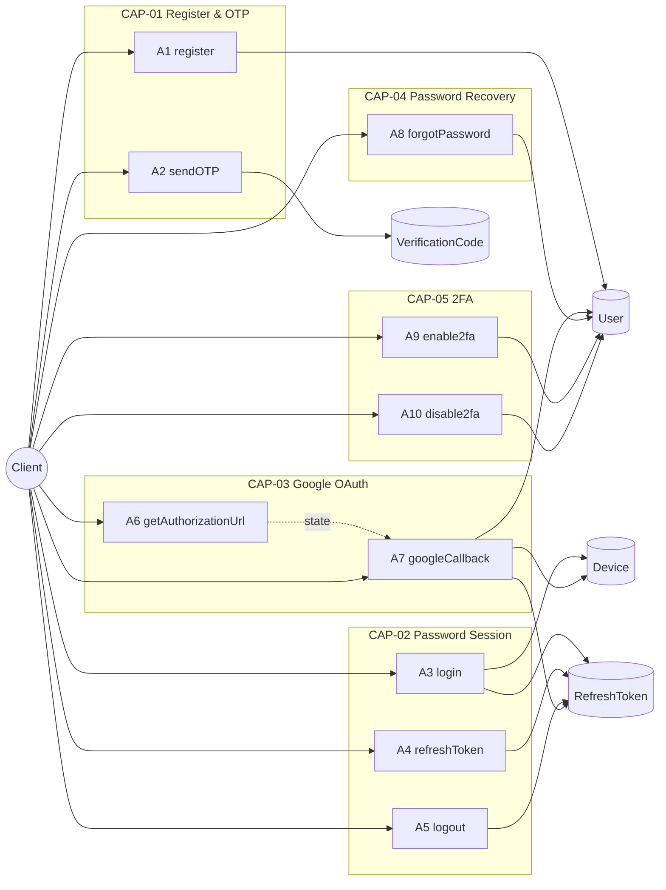
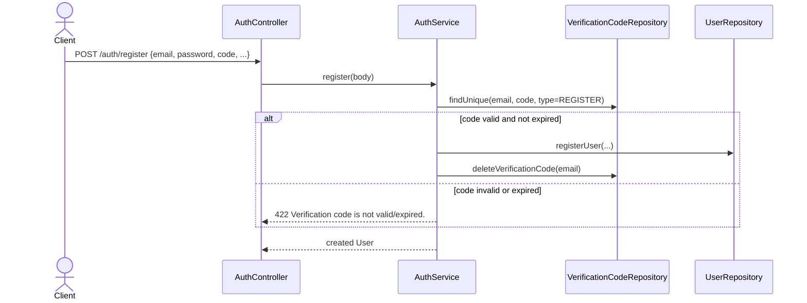
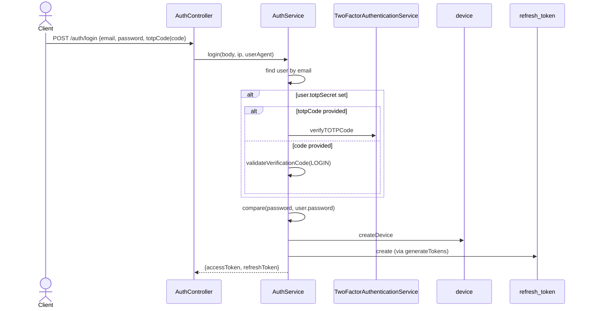
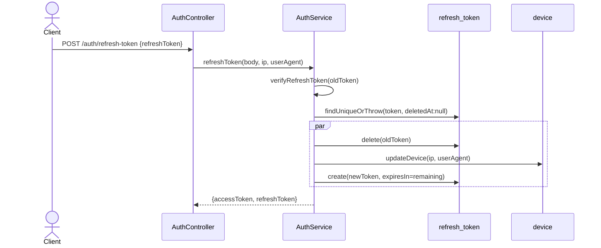
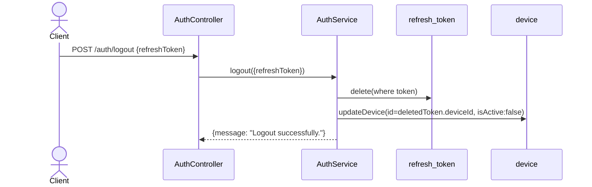
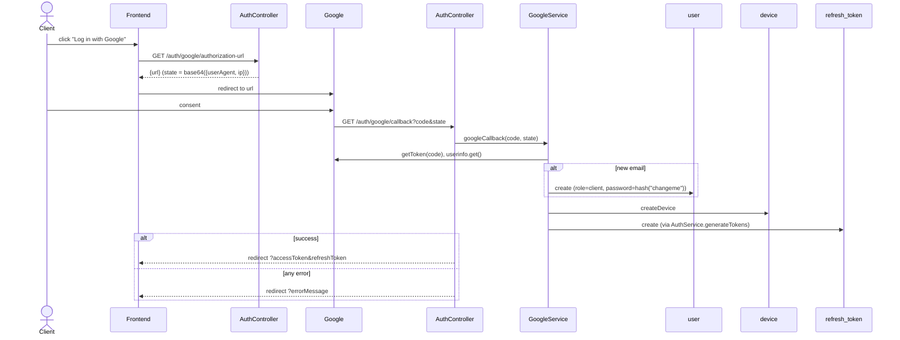
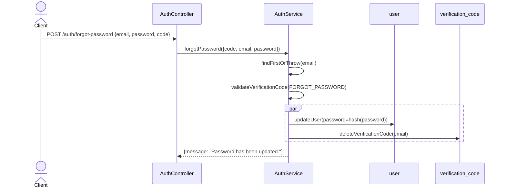
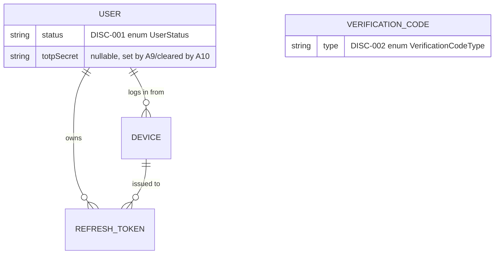
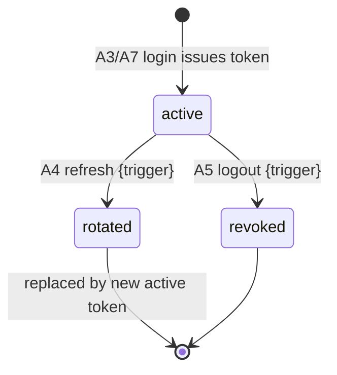

<!-- layout-exempt: rebuild-spec owns all docs/system|features|generated|flows paths -->
<!-- Contract: references/feature-spec-researcher-contract.md -->

# F001_Authentication — Technical Spec

**Priority**: P0
**Type**: mixed
**Generated**: 2026-09-12

**Xem thêm:** [`functional-spec.vi.md`](./functional-spec.vi.md) — tổng quan bằng ngôn ngữ thông thường, các quyết định đang mở,
yêu cầu/quy tắc nghiệp vụ nêu gọn trong một dòng, màn hình, user story, tình huống,
trường hợp đặc biệt và cấu hình dành cho Dev/QA/SA.

**Cách đọc tài liệu này:** § 2 là chỉ mục — chọn hành động cần xem rồi đọc khối tương ứng
trong § 3 từ đầu đến cuối; mỗi khối là một mạch nội dung trọn vẹn. § 4 là phụ lục dùng chung —
chỉ nhảy vào đó khi một khối ở § 3 dẫn tới.

## 1. Tổng quan kỹ thuật

`AuthController` (`src/routes/auth/auth.controller.ts`) expose 10 route, đứng sau là `AuthService`
và `GoogleService`. Các luồng credential/OTP ghi vào bảng `User`, `VerificationCode`, `Device` và
`RefreshToken` qua các repository riêng; luồng Google (`BL003`) bọc `OAuth2Client` của
`google-auth-library` và đi chung đường cấp token `AuthService.generateTokens` với login bằng mật khẩu.
`APP_GUARD` toàn cục (`AuthorizationHeaderGuard`) bắt buộc token `Bearer` trên mọi route của feature này,
trừ sáu route được đánh dấu `@IsPublicApi()`.



## 2. Chỉ mục hành động

| # | Hành động (handler) | Method · Path | Codes | Writes | Chi tiết |
|---|---|---|---|---|---|
| **A0** | *cross-cutting — không thuộc hành động nào* | — | {FR-601} | — | § 4.4 |
| **A1** | `AuthController#register` | `POST` `/auth/register` | {FR-001, FR-101, FR-201, BR-001, BR-002, RISK-02, US001} | `user`, `verification_code` | § 3.1 ▸ **diagram** |
| **A2** | `AuthController#sendOTP` | `POST` `/auth/otp` | {FR-002, FR-202, BR-002, RISK-01, US005} | `verification_code` | § 3.1 |
| **A3** | `AuthController#login` | `POST` `/auth/login` | {FR-102, FR-203, BR-003, BR-005, US002} | `device`, `refresh_token` | § 3.2 ▸ **diagram** |
| **A4** | `AuthController#refreshToken` | `POST` `/auth/refresh-token` | {FR-204, BR-004, BR-005, DEC-001, US003, SM-001} | `refresh_token`, `device` | § 3.2 ▸ **diagram** |
| **A5** | `AuthController#logout` | `POST` `/auth/logout` | {FR-205, US004, SM-001} | `refresh_token`, `device` | § 3.2 ▸ **diagram** |
| **A6** | `AuthController#getAuthorizationUrl` | `GET` `/auth/google/authorization-url` | {FR-103, US006} | — *(read-only)* | § 3.3 |
| **A7** | `AuthController#googleCallback` | `GET` `/auth/google/callback` | {FR-206, BR-006, BR-007, DEC-002, RISK-03, RISK-04, US006} | `user`, `device`, `refresh_token` | § 3.3 ▸ **diagram** |
| **A8** | `AuthController#forgotPassword` | `POST` `/auth/forgot-password` | {FR-207, BR-008, US007} | `user`, `verification_code` | § 3.4 ▸ **diagram** |
| **A9** | `AuthController#enable2fa` | `POST` `/auth/2fa/enable` | {FR-208, BR-009, US008} | `user` | § 3.5 |
| **A10** | `AuthController#disable2fa` | `POST` `/auth/2fa/disable` | {FR-209, BR-010, US009} | `user` | § 3.5 |

`DISC-001` (`User.status`) và `DISC-002` (`VerificationCode.type`) chủ ý không gắn vào một hàng hành động
cụ thể nào ở trên — chúng mang tính cấu trúc (§ 4.2 Hành vi đa hình), không phải quyết định riêng của
từng hành động; bốn giá trị mục đích của `DISC-002` được đọc trực tiếp trong các bậc Rule của A1/A2/A3/A8.

## 3. Hành động

### 3.1 CAP-01 — Đăng ký & Xác minh danh tính

#### A1 · Đăng ký tài khoản mới
`POST` `/auth/register` → `` `AuthController#register` ``
`FR-001` `FR-101` `FR-201` · `US001`

**Ai** · bất kỳ người gọi không xác thực nào *(route là `@IsPublicApi()` — gate A0 không áp dụng)*
**Request** · body `email`, `password`, `confirmPassword`, `phoneNumber`, `name`, `avatar?`
(`RegisterRequestDto`, `src/dtos/auth/register.dto.ts:6-71`) — `confirmPassword` phải bằng
`password` (`IsPasswordMatch`, `src/validations/decorators/is-password-match.decorator.ts:7-33`);
`code` (6 ký tự) là OTP có mục đích `REGISTER`.
**BE** · `` `AuthService#register` `` — `src/routes/auth/auth.service.ts:105-134`
**Rule**
- **BR-001 — tài khoản mới luôn nhận role `client`.** `getClientRoleId()` tra hàng `Role`
`client` đã được seed sẵn theo tên (`src/repositories/role/shared-role.repository.ts:25-47`);
không có field DTO nào cho phép xin role khác. *(§ 4.4)*
- **BR-002 — OTP đăng ký phải hợp lệ và bị "đốt" ngay khi dùng thành công.**
`validateVerificationCode` yêu cầu khớp chính xác `(email, code, type=REGISTER)` và chưa
hết hạn (`src/routes/auth/auth.service.ts:67-96`); thành công thì hàng `VerificationCode` khớp bị xóa trong
cùng `Promise.all` với bước tạo user (`src/routes/auth/auth.service.ts:124-131`). *(§ 4.4)*
- `RISK-02` — `avatar` được validate ở DTO (`@IsUrl`, optional) nhưng `UserInputData`
(`src/repositories/user/user.repository.type.ts:3-6`) không hề chứa field này — giá trị bị
âm thầm bỏ qua, không bao giờ được lưu.
**Result**
- Ghi `user` ← `email`/`name`/`phoneNumber` từ request, `password` được hash qua
`HashingService.hash` (bcrypt, 10 salt rounds, `src/shared/services/hashing.service.ts:8-12`),
`roleId` = role `client` — `src/repositories/user/user.repository.ts:22-44`
- Xóa hàng `verification_code` khớp — `src/routes/auth/auth.service.ts:126-129`
- `email` trùng sẽ nổi lên thành lỗi unique-constraint của Prisma, được `BL007` map thành 409
"Reference Data already exists." — `src/repositories/user/user.repository.ts:39-45`
**Source:** `src/routes/auth/auth.controller.ts:68-76` → `src/routes/auth/auth.service.ts:105-134` → `src/repositories/user/user.repository.ts:22-58`



---

#### A2 · Yêu cầu mã xác minh một lần
`POST` `/auth/otp` → `` `AuthController#sendOTP` ``
`FR-002` `FR-202` · `US005`

**Ai** · bất kỳ caller chưa xác thực nào *(`@IsPublicApi()`)*
**Request** · body `email`, `type` ∈ `REGISTER|FORGOT_PASSWORD|LOGIN|DISABLE_2FA`
(`SendOTPRequestDto`, `src/dtos/auth/send-otp.dto.ts:8-24` — xem `DISC-002`, § 4.2)
**BE** · `` `AuthService#sendOTP` `` — `src/routes/auth/auth.service.ts:394-442`
**Rule** · **BR-002 — kiểm tra tồn tại theo mục đích trước khi cấp code.**
`type=REGISTER` từ chối nếu email đã có tài khoản; `type=FORGOT_PASSWORD` từ chối nếu chưa có
(`src/routes/auth/auth.service.ts:402-414`); `LOGIN`/`DISABLE_2FA` không kiểm tra tồn tại kiểu này. *(§ 4.4)*
**Result**
- Ghi `verification_code` ← code 6 chữ số được sinh ra (`generateOTP`,
`src/shared/utils/generate-otp.util.ts`), `expiresAt` = hiện tại + `OTP_EXPIRES_IN`, upsert theo
unique key `(email, code, type)` — `src/routes/auth/auth.service.ts:416-427`
- `RISK-01` — lời gọi lẽ ra gửi email chứa code này (`EmailService.sendEmail`) đang bị comment out
(`src/routes/auth/auth.service.ts:430-432`); hàng dữ liệu được tạo nhưng không bao giờ gửi đi.
**Source:** `src/routes/auth/auth.controller.ts:148-154` → `src/routes/auth/auth.service.ts:394-442` → `src/repositories/verification-code/verification-code.repository.ts:47-83`

<!-- No diagram: single-table write, no branching beyond the one Rule already states. -->

---

### 3.2 CAP-02 — Vòng đời session mật khẩu

#### A3 · Đăng nhập bằng mật khẩu
`POST` `/auth/login` → `` `AuthController#login` ``
`FR-102` `FR-203` · `US002`

**Ai** · bất kỳ caller chưa xác thực nào *(`@IsPublicApi()`)*
**Request** · body `email`, `password`, `totpCode?`, `code?` — `totpCode` và `code` loại trừ lẫn nhau
(`IsOnlyOneExists`, `src/validations/decorators/is-only-one-exists.ts:11-29`); `ip`
(`@Ip()`) và `userAgent` (`@UserAgent()`) được đọc thẳng từ request, không phải từ body
(`src/routes/auth/auth.controller.ts:88-100`)
**BE** · `` `AuthService#login` `` — `src/routes/auth/auth.service.ts:145-234`
**Rule** · **BR-003 — chỉ bắt buộc 2FA khi tài khoản đã bật nó.** Nếu `user.totpSecret`
có giá trị, cần một trong `totpCode` (xác minh qua `TwoFactorAuthenticationService.verifyTOTPCode`,
`src/shared/services/2fa.service.ts:26-40`) hoặc `code` (xác minh như OTP mục đích `LOGIN` qua
`validateVerificationCode`); không kiểm tra cái nào khi `totpSecret` là null
(`src/routes/auth/auth.service.ts:173-217`). Mật khẩu luôn được so sánh qua `HashingService.compare` (bcrypt)
trong mọi trường hợp (`src/routes/auth/auth.service.ts:206-217`). *(§ 4.4)*
**Result**
- Ghi `device` ← hàng mới cho lần login này (`userId`, `ip`, `userAgent`, `isActive: true`) —
`src/routes/auth/auth.service.ts:219-224`, `BR-005` *(§ 4.4)*
- Ghi `refresh_token` ← được cấp bởi `generateTokens` (bên dưới) — `src/routes/auth/auth.service.ts:226-231`
- `user.status` (`DISC-001`) không hề được đọc trong luồng này — xem § 4.2 Hành vi đa hình.
**Source:** `src/routes/auth/auth.controller.ts:85-100` → `src/routes/auth/auth.service.ts:145-234` → `src/repositories/device/device.repository.ts:28-58`



---

#### A4 · Làm mới một access token
`POST` `/auth/refresh-token` → `` `AuthController#refreshToken` ``
`FR-204` · `US003`
`SM-001`

**Ai** · bất kỳ caller chưa xác thực nào *(`@IsPublicApi()`)*
**Request** · body `refreshToken` (`RefreshTokenRequestDto`, `src/dtos/auth/refresh-token.dto.ts:5-15`); `ip`,
`userAgent` đọc từ request
**BE** · `` `AuthService#refreshToken` `` — `src/routes/auth/auth.service.ts:284-354`
**Rule** · **BR-004 — xoay vòng giữ nguyên thời gian sống còn lại, không reset toàn bộ.**
`expiresIn` của refresh token mới được đặt bằng số giây còn lại của token CŨ
(`exp - Math.floor(Date.now()/1000)`, `src/routes/auth/auth.service.ts:337-345`), không dùng giá trị mặc định trong config —
được xác minh bằng `TokenService.verifyRefreshToken` (`src/shared/services/token.service.ts:59-65`) trước khi dùng. *(§ 4.4)*
**Result**
- Xóa hàng `refresh_token` được gửi lên — `src/routes/auth/auth.service.ts:319-323`
- Cập nhật `device` ← `ip`/`userAgent` từ request này (`BR-005`) — `src/routes/auth/auth.service.ts:326-334`
- Ghi hàng `refresh_token` mới qua `generateTokens` — `src/routes/auth/auth.service.ts:339-345`
**State** · `SM-001`: `active` → `rotated` *(§ 4.3)*
**Source:** `src/routes/auth/auth.controller.ts:109-123` → `src/routes/auth/auth.service.ts:284-354` → `src/repositories/refresh-token/refresh-token.repository.ts:24-100`



---

#### A5 · Đăng xuất
`POST` `/auth/logout` → `` `AuthController#logout` ``
`FR-205` · `US004`

**Ai** · bất kỳ caller đã xác thực nào *(mặc định `Bearer` — gate A0)*
**Request** · body `refreshToken` (`LogoutRequestDto`, `src/dtos/auth/logout.dto.ts:5-14`) — token
đang active của chính caller, không tra theo `ActiveUser`
**BE** · `` `AuthService#logout` `` — `src/routes/auth/auth.service.ts:362-385`
**Rule** · Không có BR nào ngoài gate `Bearer` của A0; bất kỳ caller nào cầm `refreshToken` hợp lệ đều
đăng xuất được token đó, bất kể tài khoản nào đã cấp access token dùng để gọi vào route này.
**Result**
- Xóa hàng `refresh_token` khớp với token gửi lên — `src/routes/auth/auth.service.ts:367-371`
- Cập nhật `device` sở hữu token đó ← `isActive: false` — `src/routes/auth/auth.service.ts:373-380`
**State** · `SM-001`: `active` → `revoked` *(§ 4.3)*
**Source:** `src/routes/auth/auth.controller.ts:132-139` → `src/routes/auth/auth.service.ts:362-385` → `src/repositories/device/device.repository.ts:60-96`



---

### 3.3 CAP-03 — Google OAuth Login

A6 và A7 hợp lại thành một luồng duy nhất, không handler nào sở hữu toàn bộ chuỗi: browser gọi A6
để lấy URL consent, rồi chính Google gọi A7 khi redirect về. Diagram dưới đây thể hiện cả hai.



#### A6 · Lấy URL ủy quyền Google
`GET` `/auth/google/authorization-url` → `` `AuthController#getAuthorizationUrl` ``
`FR-103` · `US006`

**Ai** · bất kỳ caller chưa xác thực nào *(`@IsPublicApi()`)*
**Request** · `ip` (`@Ip()`), `userAgent` (`@UserAgent()`) — không có body
**BE** · `` `GoogleService#getAuthorizationUrl` `` — `src/routes/auth/google.service.ts:49-67`
**Rule** · **BR-007 — `state` mang metadata thiết bị, không ký.** `{userAgent, ip}` được
encode base64-JSON vào `state` (`src/routes/auth/google.service.ts:55-57`), không có chữ ký/HMAC — xem RISK-04
ở bản functional spec. *(§ 4.4)*
**Result** · chỉ đọc — **không ghi DB**. Trả về `{ url }` do
`OAuth2Client.generateAuthUrl` dựng lên với `access_type: "offline"` và scope email/profile
(`src/routes/auth/google.service.ts:59-66`).
**Source:** `src/routes/auth/auth.controller.ts:171-178` → `src/routes/auth/google.service.ts:49-67`

<!-- No diagram on this block alone: it is one half of the CAP-03 capability-level diagram above. -->

---

#### A7 · Hoàn thành Google login
`GET` `/auth/google/callback` → `` `AuthController#googleCallback` ``
`FR-206` · `US006`

**Ai** · redirect từ Google — không có tương tác trực tiếp của người dùng với endpoint này *(`@IsPublicApi()`)*
**Request** · query `code`, `state` (cả hai đều từ redirect của Google)
**BE** · `` `GoogleService#googleCallback` `` — `src/routes/auth/google.service.ts:76-156`
**Rule**
- **BR-006 — tài khoản Google lần đầu nhận mật khẩu local cố định.** `User` mới tạo ở đây
được hash bằng `DEFAULT_PASSWORD = "changeme"` (`src/routes/auth/google.service.ts:16, 119-130`),
không phải giá trị ngẫu nhiên. *(§ 4.4)*
- **BR-001 — tài khoản mới luôn nhận role `client`** (cùng rule với A1; `getClientRoleId()`,
`src/routes/auth/google.service.ts:117`). *(§ 4.4)*

| DEC | subtype | Condition | What the user sees | Source |
|---|---|---|---|---|
| **DEC-002** | flow | `try` block thành công vs. throw ở bất kỳ đâu (state hỏng, lỗi Google API, lỗi DB) | thành công → redirect đến `googleRedirectClientUri` với `?accessToken&refreshToken`; lỗi → redirect đến cùng base URI với `?errorMessage=Failed to google login.` | `src/routes/auth/auth.controller.ts:191-210` |

**Result**
- Ghi `user` ← `email`, `name` (fallback `""`), `roleId=client`, `password=hash("changeme")` —
chỉ khi chưa có user nào khớp email Google — `src/routes/auth/google.service.ts:115-130`
- Ghi `device` ← hàng mới (`userAgent`/`ip` lấy từ payload `state` đã xác thực, không phải
từ request gốc) — `src/routes/auth/google.service.ts:133-138`
- Ghi `refresh_token` qua `AuthService.generateTokens` — `src/routes/auth/google.service.ts:140-145`
- Mọi lỗi throw ra (state không hợp lệ, lỗi đổi token với Google) đều bị nuốt gọn thành một
lỗi `"Invalid state data."` 500 chung, chỉ log ở phía server (`src/routes/auth/google.service.ts:148-155`) — nguyên nhân
thật sự không bao giờ tới được `errorMessage` của redirect.
**Source:** `src/routes/auth/auth.controller.ts:183-211` → `src/routes/auth/google.service.ts:76-156` → `src/repositories/user/shared-user.repository.ts` → `src/repositories/device/device.repository.ts:28-58`

<!-- Capability-level diagram above already covers this action's sequence and branching. -->

---

### 3.4 CAP-04 — Khôi phục mật khẩu

#### A8 · Đặt lại mật khẩu bị quên
`POST` `/auth/forgot-password` → `` `AuthController#forgotPassword` ``
`FR-207` · `US007`

**Ai** · bất kỳ caller chưa xác thực nào *(`@IsPublicApi()`)*
**Request** · body `email`, `password`, `confirmPassword` (`IsPasswordMatch`), `code`
(`ForgotPasswordRequestDto`, `src/dtos/auth/forgot-password.dto.ts:7-45`)
**BE** · `` `AuthService#forgotPassword` `` — `src/routes/auth/auth.service.ts:453-493`
**Rule** · **BR-002 — OTP `FORGOT_PASSWORD` phải hợp lệ và bị "đốt" khi dùng thành công**
(cùng rule dùng chung với A1/A2: `validateVerificationCode`, `src/routes/auth/auth.service.ts:465-469`). **BR-008 —
`confirmPassword` phải khớp `password`** (ở mức DTO, `IsPasswordMatch`). *(§ 4.4)*
**Result**
- Cập nhật `user.password` ← mật khẩu được hash mới, `updatedById` = id của người dùng —
`src/routes/auth/auth.service.ts:474-482`
- Xóa hàng `verification_code` khớp — `src/routes/auth/auth.service.ts:483-486`
**Source:** `src/routes/auth/auth.controller.ts:220-226` → `src/routes/auth/auth.service.ts:453-493` → `src/repositories/user/user.repository.ts`, `src/repositories/verification-code/verification-code.repository.ts:47-83`



---

### 3.5 CAP-05 — Xác thực hai yếu tố

#### A9 · Bật 2FA · A10 · Tắt 2FA
`POST` `/auth/2fa/enable` → `` `AuthController#enable2fa` `` `FR-208` · `POST` `/auth/2fa/disable`
→ `` `AuthController#disable2fa` `` `FR-209`

**Ai** · caller đã xác thực, chỉ thao tác trên tài khoản của chính mình (`@ActiveUser("userId")`) *(gate A0)*
**Request** · A9: không có body. A10: `totpCode?`, `code?` — phải có cả hai hoặc không có cái nào
(`IsBothOrNoneExist`, `src/validations/decorators/is-both-or-none-exist.ts:11-29`)
**BE** · `` `AuthService#setupTwoFactorAuthentication` `` (`src/routes/auth/auth.service.ts:502-538`) /
`` `AuthService#disableTwoFactorAuthentication` `` (`src/routes/auth/auth.service.ts:549-608`)
**Rule**
- **BR-009 — bật 2FA yêu cầu chưa có secret nào.** Từ chối với "2FA is already enabled." nếu
`user.totpSecret` đã được set (`src/routes/auth/auth.service.ts:511-516`); nếu chưa có thì sinh secret TOTP
mới + URI qua `TwoFactorAuthenticationService.generateTOTPSecret`
(`src/shared/services/2fa.service.ts:17-24`). *(§ 4.4)*
- **BR-010 — tắt 2FA yêu cầu đã có secret, và xác minh secret đó nếu có gửi code.** Từ chối
với "2FA is not enabled." nếu `totpSecret` là null (`src/routes/auth/auth.service.ts:564-569`); nếu có `totpCode`
thì phải xác minh qua `verifyTOTPCode`, còn nếu có `code` thì phải xác minh như OTP mục đích
`DISABLE_2FA` (`src/routes/auth/auth.service.ts:571-593`) — cả hai đều có thể bỏ trống, theo
`IsBothOrNoneExist`. *(§ 4.4)*
**Result**
- A9 ghi `user.totpSecret` ← secret vừa sinh — `src/routes/auth/auth.service.ts:523-531`
- A10 ghi `user.totpSecret` ← `null` — `src/routes/auth/auth.service.ts:595-603`
**Source:** `src/routes/auth/auth.controller.ts:228-261` → `src/routes/auth/auth.service.ts:502-608` → `src/repositories/user/user.repository.ts`

<!-- No diagram: single-table write per action, branching fully captured by the Rule rungs. -->

### 3.6 Các trường hợp đặc biệt

| Hành động | Kịch bản | Hành vi |
|---|---|---|
| A1 | OTP được cấp cho email khác với body đăng ký | `findUnique` trên khóa `(email, code, type)` trả về null → 422 "Verification code is not valid." |
| A2 · A1 | Hai lời gọi `sendOTP` cho cùng `(email, type)` bị race | `upsert` trên unique key khiến lời gọi thứ hai ghi đè `code`/`expiresAt` của hàng đầu — không thể sinh ra hàng trùng |
| A3 · A4 | Request refresh-token race với logout trên cùng token | Request nào chạy `delete`/`findUniqueOrThrow` trước thì thắng; request thua bị Prisma throw `isRecordNotFoundPrismaError` → 404 |
| A1-A10 | Bất kỳ lời gọi nào tới route gated bằng `Bearer` (A5, A9, A10) mà thiếu/sai header `Authorization` | `AccessTokenGuard` throw 401 "Access token is required."/"Access token is expired."/"Access token is invalid." trước khi handler chạy — xem A0 § 4.4 |
| A7 | Google callback `state` bị giả mạo hoặc hết hạn giữa chừng | `StateSchema.parse` hoặc `getToken`/`userinfo.get` throw → bị nuốt thành một redirect 500 "Invalid state data." chung — nguyên nhân thật chỉ nằm trong server log |

## 4. Nền tảng dùng chung

### 4.1 Thành phần

| Thành phần | Trách nhiệm | Sử dụng trong | File |
|---|---|---|---|
| `AuthController` | Entry point HTTP cho toàn bộ 10 route | A1-A10 | `src/routes/auth/auth.controller.ts` |
| `AuthService` | Logic nghiệp vụ register/login/refresh/logout/OTP/forgot-password/2FA | A1-A5, A8-A10 | `src/routes/auth/auth.service.ts` |
| `GoogleService` | Xử lý authorization-URL và callback của Google OAuth2 | A6, A7 | `src/routes/auth/google.service.ts` |
| `TokenService` | Ký/xác minh access và refresh JWT | A3, A4, A7 | `src/shared/services/token.service.ts` |
| `HashingService` | Hash/compare mật khẩu bằng bcrypt | A1, A3, A7, A8 | `src/shared/services/hashing.service.ts` |
| `TwoFactorAuthenticationService` | Sinh secret TOTP + xác minh | A3, A9, A10 | `src/shared/services/2fa.service.ts` |
| `AccessTokenGuard` | Xác minh token `Bearer` + permission theo từng route ở các route bị gate | A0 (A5, A9, A10) | `src/shared/guards/access-token.guard.ts` |

### 4.2 Mô hình dữ liệu



| Entity | Bảng | Dùng cho | Hành động |
|---|---|---|---|
| `User` | `user` | Danh tính tài khoản, mật khẩu, vai trò, bí mật 2FA | A1, A3, A7, A8, A9, A10 |
| `VerificationCode` | `verification_code` | Cấp OTP/tiêu thụ cho 4 mục đích | A1, A2, A8 |
| `Device` | `device` | Một hàng trên mỗi phiên đăng nhập, theo dõi IP/user-agent/trạng thái hoạt động | A3, A4, A5, A7 |
| `RefreshToken` | `refresh_token` | Session token, xoay vòng trên refresh, xóa trên logout | A3, A4, A5, A7 |
| `Role` | `role` | Chỉ dùng làm FK — mọi tài khoản trong feature này đều gán vào hàng `client` đã seed | A1, A7 |

#### Hành vi đa hình

##### DISC-001 — User.status

| Giá trị | Render | Xác thực | Persistence |
|-------|--------|------------|-------------|
| `ACTIVE` | N/A — headless API | Không action nào của F001 kiểm tra giá trị này | Mặc định khi tạo (`prisma/schema.prisma` `@default(ACTIVE)`) |
| `INACTIVE` | N/A — headless API | `[UNVERIFIED gap]` không được A1/A3/A4/A7/A9/A10 kiểm tra — không luồng login/refresh/2FA nào đọc `status` cả | Không action A1-A10 nào từng set giá trị này |
| `BLOCKED` | N/A — headless API | `[UNVERIFIED gap]` giống `INACTIVE` — không kiểm tra ở đâu trong feature này | Không action A1-A10 nào từng set giá trị này |

**Source:** docs/generated/entities.md § User > Discriminator Fields; xác nhận bằng grep — không có
lệnh đọc `status` nào bên ngoài các identifier `statusCode`/`httpStatus` trong `src/routes/auth/**` hoặc
`src/repositories/user/**`.

##### DISC-002 — VerificationCode.type

| Giá trị | Render | Xác thực | Persistence |
|-------|--------|------------|-------------|
| `REGISTER` | N/A — headless API | A1 yêu cầu một code khớp, chưa hết hạn của loại này; A2 còn từ chối cấp code nếu email đã có tài khoản | A1 xóa hàng khi thành công (`src/routes/auth/auth.service.ts:126-129`) |
| `FORGOT_PASSWORD` | N/A — headless API | A8 yêu cầu một code khớp, chưa hết hạn của loại này; A2 từ chối cấp code nếu email chưa có tài khoản | A8 xóa hàng khi thành công (`src/routes/auth/auth.service.ts:483-486`) |
| `LOGIN` | N/A — headless API | A3 chấp nhận loại này làm `code` thay thế cho `totpCode` khi `user.totpSecret` đã set; A2 không kiểm tra tồn tại cho loại này | Không bị xóa sau khi dùng ở A3 — `validateVerificationCode` chỉ kiểm tra hợp lệ, không gọi phương thức xóa của repository ở call site này |
| `DISABLE_2FA` | N/A — headless API | A10 chấp nhận loại này làm `code` thay thế cho `totpCode`; A2 không kiểm tra tồn tại cho loại này | Giống `LOGIN` — không bị A10 xóa sau khi dùng |

**Source:** docs/generated/entities.md § VerificationCode > Discriminator Fields;
`src/constants/verification-code.constant.ts`; `src/routes/auth/auth.service.ts:394-442` (A2), `:145-234` (A3),
`:549-608` (A10).

### 4.3 Quản lý trạng thái

### Vòng đời phiên refresh token (SM-001)
**kind:** entity
**Linked FR:** FR-204, FR-205
**Source:** `src/repositories/refresh-token/refresh-token.repository.ts:24-100`



**Action transitions:** guard và side effect của mỗi edge nằm ở bậc **Result** của
action tương ứng trên edge đó (A3, A4, A5, A7 — § 3.2/3.3) — không nhắc lại ở đây.

### 4.4 Rule dùng chung

#### Bin 3 — cross-cutting, không thuộc riêng action nào

**A0 · {FR-601} — mọi route trong feature này mặc định yêu cầu access token `Bearer` hợp lệ.**
`AuthorizationHeaderGuard` chạy toàn cục dưới dạng `APP_GUARD` (`src/shared/modules/base.module.ts:39-42`)
— **áp dụng cho cả 10 route trong feature này**, không riêng action nào. Sáu route
(register/login/refresh-token/otp/google-authorization-url/google-callback) opt-out qua
`@IsPublicApi()`; bốn route còn lại (logout, 2fa/enable, 2fa/disable, và forgot-password cũng
public — chỉ logout/2fa-enable/2fa-disable thực sự cần `Bearer`) rơi vào
`AccessTokenGuard`, guard này còn kiểm tra thêm một hàng `Permission` theo `(path, method)` ứng với
role của caller (`src/shared/guards/access-token.guard.ts:56-99`) — cùng gate như mọi feature khác trong app này, không
phải rule riêng của auth.
**Source:** `src/shared/modules/base.module.ts:39-42` · `src/shared/guards/access-token.guard.ts:22-123` · route-list.md PERM001-PERM003

#### Bin 2 — dùng bởi ≥2 action có tên

**BR-001 — tài khoản mới luôn nhận role `client`.**
Dùng ở: **A1** · **A7**. Cả hai đều gọi `SharedRoleRepository.getClientRoleId()`, hàm này cache
id của role `client` đã seed sau lần tra DB đầu tiên; cả DTO của register lẫn
Google callback đều không có cách nào để xin role khác.
**Source:** `src/repositories/role/shared-role.repository.ts:25-47`
```text
function getClientRoleId():
  if cached: return cached
  role = db.role.findFirstOrThrow(name = "client", deletedAt = null)
  cache role.id
  return role.id
```

**BR-002 — OTP phải hợp lệ (khớp, chưa hết hạn) và bị action dùng nó "đốt" ngay khi dùng.**
Dùng ở: **A1** · **A8**. Cả hai đều gọi `validateVerificationCode({email, code, type})`, hàm này
tra theo khóa tổ hợp `(email, code, type)` và kiểm tra `expiresAt`, sau đó action gọi nó sẽ xóa
hàng khớp trong cùng `Promise.all` với lệnh ghi chính.
**Source:** `src/routes/auth/auth.service.ts:67-96`
```text
function validateVerificationCode(email, code, type):
  row = db.verificationCode.findUnique({email, code, type})
  if !row: throw 422 "Verification code is not valid."
  if row.expiresAt < now(): throw 422 "Verification code is expired."
```

**BR-005 — login hoặc refresh cập nhật hàng device hiện có, refresh không bao giờ tạo hàng mới.**
Dùng ở: **A3** · **A4**. A3 tạo hàng `Device` mới cho mỗi login; A4 cập nhật `ip`/`userAgent` của
CHÍNH device đó ở mỗi lần refresh thay vì tạo hàng device mới — một hàng device có thể
sống qua nhiều vòng refresh.
**Source:** `src/routes/auth/auth.service.ts:219-224` (A3 create) · `src/routes/auth/auth.service.ts:326-334` (A4 update)

#### Ghi chú Bin 1

BR-003, BR-004, BR-006, BR-007, BR-008, BR-009, BR-010, và DEC-001/DEC-002 mỗi cái được sử dụng bởi
chính xác một hành động và được nêu nội tuyến trong Rule rung của hành động đó trong § 3 (BR-003/A3,
BR-004/A4, BR-006/A7, BR-007/A6, BR-008/A8, BR-009/A9, BR-010/A10, DEC-001/A4, DEC-002/A7) — không
trùng lặp ở đây.

### 4.5 Thuật toán & Tích hợp

Không có (ALG). Một tích hợp:

### Trao đổi mã ủy quyền Google OAuth2 (INT-001)
**Linked FR:** FR-206
**Sử dụng trong:** A6 → A7
**Source:** `src/routes/auth/google.service.ts:32-156`
**Type:** api-call
**Target:** Google OAuth2 (`google-auth-library` `OAuth2Client`) + Google `oauth2.userinfo.get()`
**Payload:** authorization `code` (A7 nhận từ redirect của Google) → đổi lấy access/refresh token
của Google, dùng đúng một lần để lấy `{email, name}` rồi bỏ đi (không bao giờ lưu lại).
**Failure handling:** bất kỳ exception nào trong toàn bộ `googleCallback` try block (`state` hỏng, đổi token
lỗi, userinfo lỗi, lỗi DB) đều bị bắt và map thành một redirect 500 "Invalid
state data." chung (`src/routes/auth/google.service.ts:148-155`) — không retry, không phân biệt nguyên nhân cho client thấy; lỗi thật
chỉ được log phía server.

### 4.6 Cấu hình

```text
ACCESS_TOKEN_SECRET / ACCESS_TOKEN_EXPIRES_IN   # ký/set hạn JWT mà A3/A4/A7 cấp (src/shared/services/token.service.ts:25-36)
REFRESH_TOKEN_SECRET / REFRESH_TOKEN_EXPIRES_IN # ký/set hạn refresh JWT; A4 ghi đè expiresIn bằng thời gian sống còn lại của token cũ (BR-004)
OTP_EXPIRES_IN                                  # TTL mà A2 dùng để tính VerificationCode.expiresAt (src/routes/auth/auth.service.ts:418-419)
GOOGLE_CLIENT_ID / GOOGLE_CLIENT_SECRET / GOOGLE_REDIRECT_URI  # dùng để khởi tạo OAuth2Client (src/routes/auth/google.service.ts:32-39)
GOOGLE_REDIRECT_CLIENT_URI                      # base URL A7 redirect browser quay về, dù thành công hay lỗi (src/routes/auth/auth.controller.ts:188-209)
RESEND_API_KEY / SANDBOX_EMAIL                  # đã cấu hình nhưng feature này hiện chưa đụng tới — xem RISK-01
```

**Hành vi của Client:** xem
[`behavior-logic.md`](../../docs/generated/behavior-logic.md) (mô hình phía client — debounce, optimistic UI, polling, upload, realtime),
[`permissions.md`](../../docs/system/permissions.md) (feature flags / experiments / env / locale gates),
[`architecture.md`](../../docs/system/architecture.md) (guards / deep-link state restoration / unsaved-changes protection).

## 5. Xác minh & Ghi chú kỹ thuật

### 5.1 Xác minh kỹ thuật

- **SC-001** *(A1)* Đăng ký với OTP `REGISTER` hợp lệ và email chưa tồn tại trả về 200 kèm object
`User`, và hàng `VerificationCode` biến mất sau đó (khớp FR-201, BR-002).
- **SC-002** *(A3)* Đăng nhập vào tài khoản đã bật 2FA mà không kèm `totpCode` hay `code` trả về 400
"TOTP or verification code is required." (khớp FR-203, BR-003).
- **SC-003** *(A4)* Dùng lại refresh token đã bị xoay vòng trả về 404 "Refresh
token not found." (khớp FR-204, DEC-001).
- **SC-004** *(A7)* Google callback với `state` đúng cú pháp nhưng bị giả mạo trả về redirect
kèm `?errorMessage=...`, không bao giờ trả token nửa vời (khớp FR-206, DEC-002).

#### US001_RegisterAccount *(A1)*

**Independent Test:** Gọi `POST /auth/otp {email, type: REGISTER}`, đọc code thẳng từ DB
(không gửi email — RISK-01), rồi gọi `POST /auth/register` với code đó và các field khớp; assert 200 và
có hàng `User` mang role `client`.

**Acceptance Scenarios:**

1. **Given** một code `REGISTER` hợp lệ, chưa hết hạn cho `a@b.com`, **When** gọi register với
thông tin khớp, **Then** tồn tại hàng `User` với `roleId` = id role `client`.
2. **Given** không tồn tại code như vậy, **When** vẫn gọi register, **Then** response là 422
"Verification code is not valid."

#### US003_RefreshAccessToken *(A4)*

**Independent Test:** Đăng nhập để lấy refresh token, gọi `POST /auth/refresh-token` một lần, rồi
gọi lại với CÙNG token đó (giờ đã bị xóa); assert lần gọi thứ hai trả 404.

**Acceptance Scenarios:**

1. **Given** một refresh token hợp lệ, chưa hết hạn, **When** gọi refresh, **Then** trả về refresh
token hoàn toàn mới và token cũ không còn resolve được qua `findUniqueOrThrow`.
2. **Given** cùng một token được dùng hai lần, **When** thực hiện lần gọi thứ hai, **Then** lỗi với
`isRecordNotFoundPrismaError` → 404 "Refresh token not found."

### 5.2 Giả định

- *(A2)* Giả định `OTP_EXPIRES_IN` được cấu hình bằng giá trị mà `ms()` parse được (ví dụ `"5m"`) —
lần rà soát này không xác nhận giá trị env thực tế đang chạy, chỉ xác nhận code kỳ vọng định dạng đó
(`src/routes/auth/auth.service.ts:418-419`).
- *(A7)* Giả định `googleRedirectClientUri` mà callback redirect tới là origin frontend đáng tin, first-party —
endpoint này không hề check allow-list cho giá trị config đó
trước khi redirect kèm token.

### 5.3 Câu hỏi chưa giải quyết

1. **Thời điểm gửi email** *(A2)*: không thể xác nhận chỉ từ source liệu lời gọi
`EmailService.sendEmail` bị comment out của `BL005` từng chạy thật ở production hay luôn bị tắt cục bộ —
đây là khoảng trống khi đọc code, không phải câu hỏi nghiệp vụ (câu hỏi nghiệp vụ tương ứng
nằm ở functional-spec.md § 3 D001).
2. **OTP `LOGIN`/`DISABLE_2FA` dùng lại được** *(A3, A10)*: `validateVerificationCode` không bao giờ xóa
hàng mà nó xác minh cho hai mục đích này (chỉ A1/A8 xóa của mình) — không thể xác nhận từ
source đây là chủ ý (dù sao code cũng chỉ dùng một lần vì sẽ hết hạn) hay là sơ suất
chung với các call site register/forgot-password.

### 5.4 Tham khảo nguồn

| Hành động | Thứ tự | Ký hiệu | Đường dẫn | Mục đích |
|---|---|---|---|---|
| A1, A3, A7, A8, A9, A10 | 1 | `User` (Prisma model) | `prisma/schema.prisma:36-90` | entity mà mọi action trong feature này xoay quanh |
| A1-A10 | 2 | `AuthController` | `src/routes/auth/auth.controller.ts:1-262` | entry point HTTP cho cả 10 route |
| A1, A2, A3, A4, A5, A8, A9, A10 | 3 | `AuthService` | `src/routes/auth/auth.service.ts:1-609` | logic nghiệp vụ register/login/refresh/logout/OTP/forgot-password/2FA |
| A6, A7 | 4 | `GoogleService` | `src/routes/auth/google.service.ts:1-157` | authorization-URL + callback của Google OAuth2 |
| A3, A4, A7 | 5 | `TokenService` | `src/shared/services/token.service.ts:1-66` | ký/xác minh access + refresh JWT |
| A0 (A5, A9, A10) | 6 | `AccessTokenGuard` | `src/shared/guards/access-token.guard.ts:1-123` | xác minh `Bearer` + kiểm tra permission theo route |

#### Dòng dữ liệu

```text
{email, password, code/totpCode} -> AuthController#login -> AuthService.login
  -> find User by email -> compare bcrypt hash -> create Device row
  -> TokenService.signAccessToken + signRefreshToken -> RefreshToken row created
  -> {accessToken, refreshToken}
```

### 5.5 Tham khảo tạo tác

| Tạo tác | File | Codes Used | Reviewed |
|----------|------|------------|----------|
| System Overview | [system-overview.md](../../docs/system/system-overview.md) | — | [x] |
| Feature List | [feature-list.md](../../docs/generated/feature-list.md) | F001 | [x] |
| API Map | [route-list.md](../../docs/generated/route-list.md) | ROUTE001, ROUTE002, ROUTE003, ROUTE004, ROUTE005, ROUTE006, ROUTE007, ROUTE008, ROUTE009, ROUTE010 | [x] |
| Entities | [entities.md](../../docs/generated/entities.md) | MODEL002, MODEL004, MODEL005, MODEL006, MODEL008 | [x] |
| Screens | [functional-spec.md § 6](../../docs/features/F001_Authentication/functional-spec.md#6-screens) | N/A — headless, no screens | [x] |
| Behavior Logic | [behavior-logic.md](../../docs/generated/behavior-logic.md) | BL003, BL005 | [x] |
| Permissions Matrix | [permissions-matrix.md](../../docs/generated/permissions-matrix.md) | PERM001, PERM002, PERM003, PERM006 | [x] |
| User Stories | [user-stories.md](../../docs/generated/user-stories.md) | US001, US002, US003, US004, US005, US006, US007, US008, US009 | [x] |

**Rule:** Mọi mã liệt kê ở Codes Used đều tồn tại trong artifact nguồn của nó; đã xác minh ở trên bằng
cách Grep/Read trực tiếp `route-list.md`, `entities.md`, `behavior-logic.md`, `permissions-matrix.md`,
và `user-stories.md` trong lần rà soát này.
