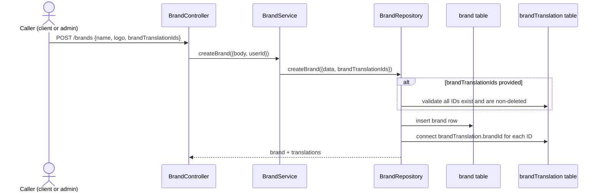
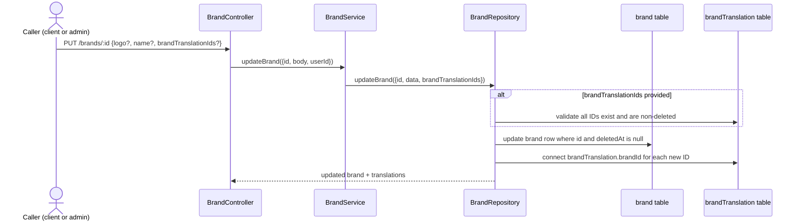
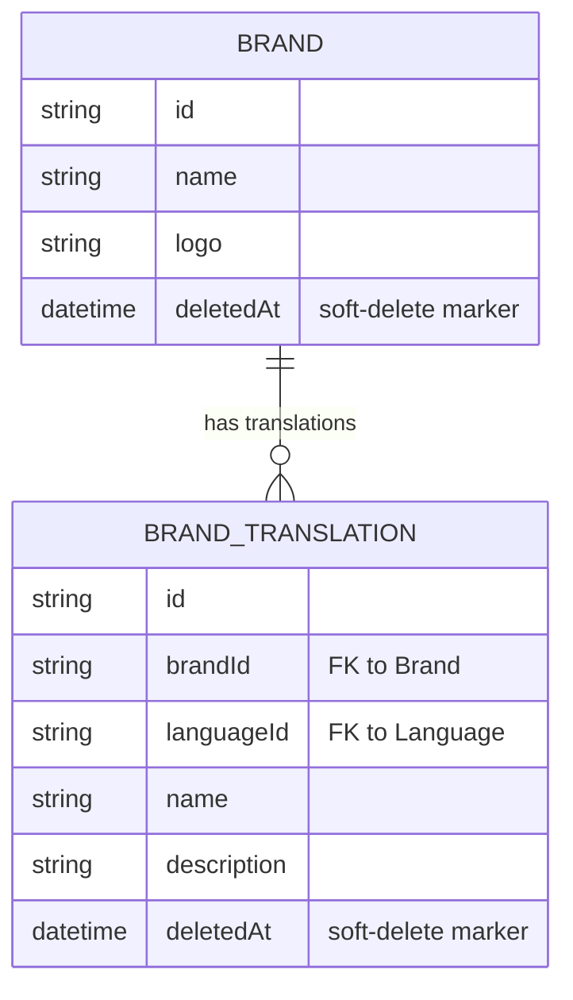

# F002_BrandCatalogManagement — Technical Spec

**Priority**: P1
**Type**: ui
**Generated**: 2026-09-12

**See also:** [`functional-spec.md`](./functional-spec.md) — plain-language overview, open
decisions, requirements/business rules stated in one-liners, screens, user stories, scenarios,
edge cases, and configuration for a BA/QA audience.

**How to read this file:** § 2 is the index — pick the action you care about and read its block
in § 3 straight through; each block is one complete thread, top to bottom. § 4 is the shared
appendix — jump in only when a § 3 block points you there.

## 1. Technical Overview

`BrandController` exposes 5 REST endpoints over the `Brand` model — a list/detail read pair and a
create/update/delete write triple — with `BrandService` doing thin field-mapping and
`BrandRepository` owning every Prisma call plus the Prisma-error-to-HTTP-status translation. Every
read and write shares one Prisma `select` shape (`createBrandWithTranslationsSelect`) so responses
always carry the brand's `BrandTranslation` rows for the caller's current language. No queue, job,
or external integration is involved — this is a synchronous CRUD surface with one shared
cross-cutting concern: the global `AccessTokenGuard` (`Bearer` + per-route module permission).

## 2. Action Index

| # | Action (handler) | Method · Path | Codes | Writes | Detail |
|---|---|---|---|---|---|
| **A0** | *cross-cutting — belongs to no single action* | — | {FR-601, FR-602} | — | § 4.4 |
| **A1** | `BrandController#getBrands` | `GET` `/brands` | {FR-001, FR-201, BR-001, BR-002, US010} | — *(read-only)* | § 3.1 |
| **A2** | `BrandController#getBrandById` | `GET` `/brands/:id` | {FR-202, FR-602, BR-002, US011} | — *(read-only)* | § 3.1 |
| **A3** | `BrandController#createBrand` | `POST` `/brands` | {FR-301, BR-002, BR-003, BR-005, US012} | `brand`, `brandTranslation` | § 3.2 ▸ **diagram** |
| **A4** | `BrandController#updateBrand` | `PUT` `/brands/:id` | {FR-302, BR-002, BR-003, BR-005, US013} | `brand`, `brandTranslation` | § 3.2 ▸ **diagram** |
| **A5** | `BrandController#deleteBrand` | `DELETE` `/brands/:id` | {FR-303, BR-004, BR-005, US014} | `brand` | § 3.2 |

**Rung set:** **Who** → **FE** → **Request** → **BE** → **Rule** → **Result** → **State** → **Source**
(the FE rung is omitted throughout — headless API, no frontend view).

**Diagram threshold applied:** A3 and A4 each write two tables (`brand` directly, `brandTranslation`
via the `connect` FK update on linked translation rows) → both cross threshold. A1/A2 are
read-only. A5 writes exactly one table (`brand`), synchronously, no branch complex enough to need
a diagram.

## 3. Actions

### 3.1 CAP-01 — Brand Browsing

#### A1 · List brands

`GET` `/brands` → `` `BrandController#getBrands` ``
`FR-001` `FR-201` `BR-001` `BR-002` · `US010`

**Who** · any caller, no session required *(gate A0 does not apply — this route is `@IsPublicApi()`)*
**Request** · query params `pageIndex` (default 1), `pageSize` (default 10), `order` (default
`ASC`), `orderBy` (default `createdAt`), `keyword` (default `""`); language resolved from
`@CurrentLang()`.
**BE** · `` `BrandService#getBrands` `` computes `skip`/`take` from `pageIndex`/`pageSize`, then
calls `` `BrandRepository#findManyBrands` ``. `src/routes/brand/brand.service.ts:30-72`
**Rule** · **BR-001 — Listing defaults to page 1/size 10, ascending by `createdAt`, and filters by
a case-insensitive substring match on `name` when `keyword` is given; soft-deleted rows are always
excluded.** The repository merges `where: { deletedAt: null }` into every query — a keyword can
never surface a deleted brand. `src/repositories/brand/brand.repository.ts:58-61`
**BR-002 — every brand read/write returns the brand together with its translations scoped to the
caller's current language**, via the shared `createBrandWithTranslationsSelect` select shape
(§ 4.4). *(§ 4.4)*
**Result** · read-only — **no DB write**. Returns `{ data: brands, pagination: { pageIndex,
pageSize, totalPages, totalItems } }`, `totalPages = Math.ceil(brandsCount / pageSize)`.
`src/routes/brand/brand.service.ts:61-71`
**Source:** `src/routes/brand/brand.controller.ts:42-58` → `src/routes/brand/brand.service.ts:30-72` → `src/repositories/brand/brand.repository.ts:49-87`

<!-- No diagram: read-only, single table, synchronous — a sequence diagram would add no
     information a rung above doesn't already state plainly. -->

---

#### A2 · Get brand by ID

`GET` `/brands/:id` → `` `BrandController#getBrandById` ``
`FR-202` `FR-602` `BR-002` · `US011`

**Who** · any caller — **but see `[UNVERIFIED]` below: runtime actually requires a `Bearer` session**
*(gate A0)*
**Request** · path param `id` (UUID, validated `BrandIdParamDto`); language resolved from
`@CurrentLang()`.
**BE** · `` `BrandService#getBrandById` `` passes through to
`` `BrandRepository#findUniqueBrand` ``. `src/routes/brand/brand.service.ts:81-94`
**Rule** · **BR-002 — every brand read/write returns the brand with its translations scoped to
the caller's current language.** *(§ 4.4)*
**FR-602 `[UNVERIFIED]`** — this handler carries `@ApiPublic` (a Swagger-doc-only decorator) but
**no** `@IsPublicApi()` — the one decorator that actually disables the guard (PERM002). Runtime
therefore falls through to the default global `AccessTokenGuard` (gate A0) and requires a valid
`Bearer` token despite the "Public" Swagger label. Treated here as **`Bearer`-required**, matching
`route-list.md`'s ROUTE012 flag and `permissions-matrix.md` PERM010.
**Result** · read-only — **no DB write**. `findUniqueBrand` uses `findUniqueOrThrow` with
`{ id, deletedAt: null }` — a deleted or missing ID throws `PrismaClientKnownRequestError` code
`P2025`, converted by the repository catch block into a 404.
`src/repositories/brand/brand.repository.ts:104-126`
**Source:** `src/routes/brand/brand.controller.ts:60-78` → `src/routes/brand/brand.service.ts:81-94` → `src/repositories/brand/brand.repository.ts:96-127`

<!-- No diagram: read-only, single table, synchronous. -->

---

### 3.2 CAP-02 — Brand Administration

#### A3 · Create brand

`POST` `/brands` → `` `BrandController#createBrand` ``
`FR-301` `BR-002` `BR-003` `BR-005` · `US012`

**Who** · `Bearer`-authenticated caller whose role holds the `BRANDS` module permission *(gate A0 —
§ 4.4)*
**Request** · body `CreateBrandRequestDto`: `logo` (required, valid URL string), `name` (required,
1–100 chars), `brandTranslationIds` (optional array of UUIDs).
`src/dtos/brand/brand.dto.ts:77-115`
**BE** · `` `BrandService#createBrand` `` maps the body plus `createdById` (from
`@ActiveUser("userId")`) into `` `BrandRepository#createBrand` ``.
`src/routes/brand/brand.service.ts:103-120`
**Rule** · **BR-003 — creating with `brandTranslationIds` first confirms every ID names an
existing, non-deleted `BrandTranslation` row; any ID that doesn't resolve rejects the whole
request before any write.** Mechanism: `validateBrandTranslations` counts matching non-deleted
rows and compares to the input length. *(§ 4.4)*
**BR-002 — the created brand is returned with its translations for the current language** (uses
the same shared select as reads). *(§ 4.4)*
**BR-005 `[UNVERIFIED]`** — because role→module permission grants are filtered by module name
only (never by HTTP method — PERM005), a `client`-role caller can call this write endpoint the
same as an `admin`, despite the user story reading "As an admin..." *(§ 4.4)*
**Result**
- Writes `brand` ← `name`, `logo`, `createdById` — `src/repositories/brand/brand.repository.ts:148-156`
- Writes `brandTranslation.brandId` ← FK connect for each ID in `brandTranslationIds`, via
  Prisma's `connect` — `src/repositories/brand/brand.repository.ts:151-153`
- Unique-constraint conflict on `name` → 409 "Brand is already exists." — `:162-168`
- Foreign-key conflict on connect → 422 "Failed to create brand." — `:170-176`
**Source:** `src/routes/brand/brand.controller.ts:80-98` → `src/routes/brand/brand.service.ts:103-120` → `src/repositories/brand/brand.repository.ts:136-183`



---

#### A4 · Update brand

`PUT` `/brands/:id` → `` `BrandController#updateBrand` ``
`FR-302` `BR-002` `BR-003` `BR-005` · `US013`

**Who** · `Bearer`-authenticated caller whose role holds the `BRANDS` module permission *(gate A0)*
**Request** · path param `id` (UUID); body `UpdateBrandRequestDto` (`PartialType(BrandRequestDto)`
— any subset of `logo`/`name`/`brandTranslationIds`). `src/dtos/brand/brand.dto.ts:117`
**BE** · `` `BrandService#updateBrand` `` maps the body plus `updatedById` (from
`@ActiveUser("userId")`) into `` `BrandRepository#updateBrand` ``.
`src/routes/brand/brand.service.ts:130-149`
**Rule** · **BR-003 — updating with `brandTranslationIds` runs the same existence check as
create; any ID that doesn't resolve rejects the whole request.** *(§ 4.4)*
**BR-002 — the updated brand is returned with its translations for the current language.** *(§ 4.4)*
**BR-005 `[UNVERIFIED]`** — same client-can-mutate finding as A3. *(§ 4.4)*
**Result**
- Writes `brand` ← whichever of `name`/`logo` were supplied, plus `updatedById` —
  `src/repositories/brand/brand.repository.ts:235-243`
- Writes `brandTranslation.brandId` ← FK connect for each new ID in `brandTranslationIds` — `:239-241`
- Missing/deleted target ID → 404 "Brand not found." — `:250-255`
- Unique-constraint conflict on `name` → 409 "Brand is already exists." — `:257-263`
- Foreign-key conflict on connect → 422 "Failed to update brand." — `:265-271`
**Source:** `src/routes/brand/brand.controller.ts:100-113` → `src/routes/brand/brand.service.ts:130-149` → `src/repositories/brand/brand.repository.ts:219-278`



---

#### A5 · Delete brand

`DELETE` `/brands/:id` → `` `BrandController#deleteBrand` ``
`FR-303` `BR-004` `BR-005` · `US014`

**Who** · `Bearer`-authenticated caller whose role holds the `BRANDS` module permission *(gate A0)*
**Request** · path param `id` (UUID); body `DeleteBrandRequestDto`: `isHardDelete` (optional
boolean, default `false`). `src/dtos/brand/brand.dto.ts:148-157`
**BE** · `` `BrandService#deleteBrand` `` passes `id`, `userId`, `isHardDelete` straight to
`` `BrandRepository#deleteBrand` ``. `src/routes/brand/brand.service.ts:159-175`
**Rule** · **BR-004 — deleting soft-deletes by default (marks `deletedAt`/`deletedById` and stamps
`updatedById`, row stays); an explicit `isHardDelete: true` runs a real Prisma `delete` instead,
removing the row.** `src/repositories/brand/brand.repository.ts:296-313`
**BR-005 `[UNVERIFIED]`** — same client-can-mutate finding as A3/A4. *(§ 4.4)*
**Result**
- Soft path: writes `brand.deletedAt` ← `new Date()`, `brand.deletedById`/`brand.updatedById` ←
  `userId` — `:304-310`
- Hard path: deletes the `brand` row outright (Prisma `delete`, scoped to `{ id, deletedAt: null
  }`) — `:298-301`
- Target not found (already deleted, or never existed) → 404 "Brand not found." — `:319-324`
- Any other failure → 500 "Failed to delete brand." — `:326-329`
**Source:** `src/routes/brand/brand.controller.ts:115-130` → `src/routes/brand/brand.service.ts:159-175` → `src/repositories/brand/brand.repository.ts:288-331`

<!-- No diagram: writes exactly one table (`brand`), synchronous, one boolean-gated branch already
     fully stated in the Rule/Result rungs above — a diagram would just re-narrate that branch. -->

### 3.3 Edge cases

| Action | Scenario | Behavior |
|---|---|---|
| A1 | `keyword` matches no brand name | Returns an empty `data` array with `totalItems: 0`, not an error — `src/routes/brand/brand.service.ts:61-71` |
| A2 | `:id` is a syntactically valid UUID but no such row (or it's soft-deleted) | `findUniqueOrThrow` throws Prisma `P2025`, repository catch maps it to 404 "Not found." — `src/repositories/brand/brand.repository.ts:113-120` |
| A3 · A4 | `brandTranslationIds` includes an ID belonging to a different, already-deleted translation | `validateBrandTranslations` count mismatch → whole request rejected before any write — `src/repositories/brand/brand.repository.ts:203-208` |
| A3 · A4 | Duplicate `name` on create, or renaming to a name already in use | Prisma unique-constraint error (`P2002`) → 409 "Brand is already exists." — `src/repositories/brand/brand.repository.ts:162-168`, `:257-263` |
| A5 | Hard-deleting a brand still referenced by `Product` rows (FK: `Product.brandId`) | Prisma foreign-key constraint error surfaces as an uncaught error path — repository's `deleteBrand` catch only special-cases `P2025`; a genuine FK conflict here falls through to the generic 500 `[UNVERIFIED]` (no explicit FK-conflict branch observed in this method, unlike create/update) |
| A1-A5 | Unauthenticated call to any route except A1 | 401/403 from the global `AccessTokenGuard` before the handler runs — see A0 § 4.4 |

## 4. Shared Foundation

### 4.1 Components

| Component | Responsibility | Used in | File |
|---|---|---|---|
| `BrandController` | HTTP entry point for all 5 brand routes | A1-A5 | `src/routes/brand/brand.controller.ts` |
| `BrandService` | Thin field-mapping layer between controller DTOs and repository calls | A1-A5 | `src/routes/brand/brand.service.ts` |
| `BrandRepository` | Owns every Prisma call plus Prisma-error → HTTP-status translation | A1-A5 | `src/repositories/brand/brand.repository.ts` |
| `createBrandWithTranslationsSelect` | Shared Prisma `select` shape — brand fields + language-scoped translations | A1-A5 | `src/selectors/brand.selector.ts:12-27` |

### 4.2 Data Model



| Entity | Table | Used for | Action |
|---|---|---|---|
| `Brand` | `brand` | The base brand entity this feature owns end to end | A1-A5 |
| `BrandTranslation` | `brand_translation` | Read (embedded in every response) and linked (FK connect) on write — owned by F004, referenced here | A1-A5 |

#### Polymorphic Behavior

N/A — no discriminator fields in Key Entities. `entities.md` § MODEL014_Brand and § MODEL015_BrandTranslation both list "Discriminator Fields: None."

### 4.3 State Management

None. `Brand.deletedAt` is a nullable timestamp, not an enumerated state field, and its only
transition (non-deleted → soft-deleted, A5) is a single boolean-gated write already fully
described in A5's Rule/Result rungs — below the ≥3-states/≥2-transitions threshold for a `kind:
ui`/`kind: entity` SM block.

### 4.4 Shared Rules

#### Bin 3 — cross-cutting, belongs to no single action

**A0 · {FR-601, FR-602} — every route except `GET /brands` requires a valid `Bearer` session, and
every `Bearer`-authenticated route additionally requires the caller's role to hold a permission row
for that exact `(path, method)`.**
The global `APP_GUARD` (`AccessTokenGuard`) runs before any handler; a route is exempted only by
`@IsPublicApi()` (`GET /brands` carries this). For every non-exempt route, the guard looks up
`role.permissions` filtered to the request's `(path, method)` — zero matches → 403 "You do not
have permission to access this resource." — **applies to all 70 routes in the codebase, not any
one screen or feature.**
**Source:** `src/shared/guards/access-token.guard.ts:56-90` · `src/shared/modules/base.module.ts:17-43` · route-list.md ROUTE011-ROUTE015

#### Bin 2 — used by ≥2 named actions

**BR-002 — every brand read/write is shaped by one shared Prisma select that always embeds the
brand's translations for the caller's current (or all) language.**
Used in: **A1** · **A2** · **A3** · **A4** · **A5**. `createBrandWithTranslationsSelect` composes
a base `{ id, name, logo }` select with a nested `brandTranslations` select filtered to
`deletedAt: null` and, when a specific language is requested, `languageId` — every handler passes
this same function into its Prisma call, so no handler can accidentally return a brand without its
translations or leak a soft-deleted translation row.
**Source:** `src/selectors/brand.selector.ts:12-27`
```text
function createBrandWithTranslationsSelect(languageId = ALL_LANGUAGES):
  return {
    id, name, logo,
    brandTranslations: {
      where: { deletedAt: null, languageId: languageId == ALL_LANGUAGES ? undefined : languageId },
      select: brandTranslationSelect
    }
  }
```

**BR-003 — creating or updating a brand with `brandTranslationIds` first confirms every ID names
an existing, non-deleted translation row before any database write happens.**
Used in: **A3** · **A4**. `validateBrandTranslations` runs a `findMany` count-check
(`{ id: { in: ids }, deletedAt: null }`) and compares the returned count to the input array
length — any shortfall throws a 400 before `createBrand`/`updateBrand`'s own Prisma call runs, so
a partially-linked brand is never persisted.
**Source:** `src/repositories/brand/brand.repository.ts:191-209`
```text
function validateBrandTranslations(ids):
  valid = brandTranslation.findMany({ where: { id in ids, deletedAt: null } }, select: id)
  if valid.length != ids.length:
    throw 400 "Some brand translations do not exist."
```

**BR-005 `[UNVERIFIED]` — role→module permission grants are filtered by module name only, never
by HTTP method, so any role whose module list includes `BRANDS` gets every method on every Brands
route, not just read.**
Used in: **A3** · **A4** · **A5**. `initial-scripts/create-permission.ts` builds each role's
`permissions` set by filtering the full permission table down to rows whose `module` is in a
per-role hardcoded array (`SellerModule`/`ClientModule`) — the filter never inspects `method`.
`ClientModule` includes `"BRANDS"`, so a `client` account is granted `GET`/`POST`/`PUT`/`DELETE`
on `/brands*` alike. `[UNVERIFIED]` whether this is an intended "client can curate the brand
catalog" design or an unintended side effect of module-level (not route-level) grant filtering —
see functional-spec.md § 3 Open Decisions D002.
**Source:** `initial-scripts/create-permission.ts:22-29,158-169`
```text
Module = { SELLER: SellerModule, CLIENT: ClientModule }  # no per-method dimension
for role in [ADMIN, SELLER, CLIENT]:
  moduleList = Module[role]                 # undefined for ADMIN -> unfiltered (all permissions)
  permissionIds = moduleList
    ? allPermissions.filter(p => moduleList.includes(p.module)).map(p => p.id)
    : allPermissions.map(p => p.id)
  role.permissions.set(permissionIds)        # sets ALL methods within each allowed module
```

### 4.5 Algorithms & Integrations

None. No non-trivial computation and no external integration (API call, event publish, webhook,
queue job, notification) is involved in this feature — every action is a direct, synchronous
Prisma CRUD call.

### 4.6 Configuration

```text
(none feature-specific) — pagination/order/sort defaults are business-visible constants covered
in functional-spec.md § 13, not technical configuration (no env var, timeout, or retry setting is
specific to this feature).
```

**Client behavior:** see
[`behavior-logic.md`](../../docs/generated/behavior-logic.md) (client-side patterns — debounce, optimistic UI, polling, upload, realtime),
[`permissions.md`](../../docs/system/permissions.md) (feature flags / experiments / env / locale gates),
[`architecture.md`](../../docs/system/architecture.md) (guards / deep-link state restoration / unsaved-changes protection).

All three are `N/A` for this feature — headless backend API, no client-side code anywhere in this
repository (confirmed in `behavior-logic.md` § Client-Side Logic and
`permissions-matrix.md` § Client-Side Gate Types).

## 5. Verification & Technical Notes

### 5.1 Technical Verification

- **SC-001** *(A1)* Listing with no query params returns exactly `pageSize: 10` items (or fewer if
  the catalog holds fewer than 10 active brands), ordered ascending by `createdAt` (covers FR-201,
  BR-001)
- **SC-002** *(A2)* Requesting a soft-deleted brand's ID returns 404, identical to requesting a
  never-existed ID (covers FR-202, FR-602)
- **SC-003** *(A3, A4)* Submitting a `brandTranslationIds` array containing one invalid ID rejects
  the entire request with 400 and creates/updates nothing (covers FR-301, FR-302, BR-003)
- **SC-004** *(A5)* Deleting without `isHardDelete` leaves the row present but excluded from every
  subsequent list/detail call (covers FR-303, BR-004)

#### US010_ViewBrandList *(A1)*

**Independent Test:** Call `GET /brands` with no auth header and no query params; assert 200 and a
`pagination` block matching the configured defaults.

**Acceptance Scenarios:**

1. **Given** 15 active brands exist, **When** a caller requests page 1 with no `pageSize`,
   **Then** the response returns 10 brands and `pagination.totalItems == 15`.
2. **Given** a `keyword` matching zero brands, **When** the caller lists with that keyword,
   **Then** the response returns an empty `data` array with 200, not an error.

#### US011_ViewBrandDetail *(A2)*

**Independent Test:** Call `GET /brands/:id` with a valid `Bearer` token for an existing brand ID;
assert 200 and the brand payload includes `brandTranslations`.

**Acceptance Scenarios:**

1. **Given** an existing, non-deleted brand ID, **When** a `Bearer`-authenticated caller requests
   it, **Then** the response is 200 with the brand's fields and translations.
2. **Given** no `Authorization` header, **When** a caller requests any brand ID,
   **Then** the response is 401 — despite the Swagger doc labelling this route public.

#### US012_CreateBrand *(A3)*

**Independent Test:** Call `POST /brands` with a `Bearer` token for a `client`-role account and a
valid `{name, logo}` body; assert 201/200 creation succeeds (per BR-005's current-behavior
finding), not 403.

**Acceptance Scenarios:**

1. **Given** a valid `{name, logo}` body and no `brandTranslationIds`, **When** an authorized
   caller creates a brand, **Then** the response returns the new brand with `brandTranslations: []`.
2. **Given** a `brandTranslationIds` array with one ID that does not exist, **When** an authorized
   caller attempts to create a brand, **Then** the response is 400 and no `brand` row is inserted.

### 5.2 Assumptions

- *(A2)* The `[UNVERIFIED]` `Bearer`-required behavior on `GET /brands/:id` is assumed to be the
  actual, unchanged runtime path — this pass reads source only, it does not execute the app to
  confirm the 401 response body/status code empirically.
- *(A5)* Hard-delete's foreign-key failure mode (e.g. a brand still linked to `Product` rows) is
  inferred from the absence of an `isForeignKeyConstraintPrismaError` branch in `deleteBrand`
  (unlike `createBrand`/`updateBrand`, which both have one) — assumed to fall through to the
  generic 500, not confirmed by running a real delete against a referenced brand.
- *(A3, A4)* `brandTranslationIds`' ownership is assumed unchecked beyond existence — nothing in
  `validateBrandTranslations` confirms a translation isn't already linked to a *different* brand
  before the `connect` call; this is inferred from reading the method body, not from an observed
  runtime conflict.

### 5.3 Unresolved Questions

1. **FK-conflict handling on hard delete** *(A5)*: does Postgres/Prisma actually raise a
   foreign-key error when hard-deleting a brand still referenced by `Product` rows, and if so,
   does it surface as the generic 500 (no explicit catch branch), or does Prisma's cascade/config
   on that relation make this moot? Not confirmed from the `Brand`↔`Product` relation definition
   alone.
2. **Translation re-linking across brands** *(A3, A4)*: if a `brandTranslationIds` entry already
   belongs to a different brand, does the `connect` call silently re-parent it, or does a DB
   constraint block it? `validateBrandTranslations` only checks existence, not current
   `brandId` — not confirmed against the `BrandTranslation_languageId_brandId_unique` constraint's
   actual runtime behavior.

### 5.4 Source References

| Action | Order | Symbol | Path | Purpose |
|---|---|---|---|---|
| — | 1 | `Brand` | `prisma/schema.prisma:398-417` | The base brand entity this feature revolves around |
| — | 2 | `BrandTranslation` | `prisma/schema.prisma:419-440` | Localized brand text this feature links to but does not own (F004) |
| A1-A5 | 3 | `BrandController` | `src/routes/brand/brand.controller.ts:1-131` | HTTP entry point for all 5 brand routes |
| A1-A5 | 4 | `BrandService` | `src/routes/brand/brand.service.ts:1-176` | Field-mapping layer between DTOs and repository |
| A1-A5 | 5 | `BrandRepository` | `src/repositories/brand/brand.repository.ts:1-332` | Every Prisma call + Prisma-error translation |
| A1-A5 | 6 | `createBrandWithTranslationsSelect` | `src/selectors/brand.selector.ts:1-28` | Shared select shape embedding translations |

#### Data Flow

```text
{query params / path :id / body} -> BrandController (DTO validation)
  -> BrandService (field mapping, injects userId on writes)
    -> BrandRepository (Prisma call, shared select, error translation)
      -> Postgres `brand` (+ `brand_translation` FK connect on A3/A4)
  -> BrandRepository catch block (Prisma error code -> HTTP status)
-> {paginated list | single brand | created/updated brand | delete confirmation message}
```

### 5.5 Artifact References

| Artifact | File | Codes Used | Reviewed |
|----------|------|------------|----------|
| System Overview | [system-overview.md](../../docs/system/system-overview.md) | — | [x] |
| Feature List | [feature-list.md](../../docs/generated/feature-list.md) | F002 | [x] |
| API Map | [api-map.md](../../docs/generated/api-map.md) | ROUTE011, ROUTE012, ROUTE013, ROUTE014, ROUTE015 | [x] |
| Entities | [entities.md](../../docs/generated/entities.md) | MODEL014, MODEL015 | [x] |
| Screens | [functional-spec.md § 6](./functional-spec.md#6-screens) | — (N/A, headless) | [x] |
| Behavior Logic | [behavior-logic.md](../../docs/generated/behavior-logic.md) | — (no BL### owned by this feature) | [x] |
| Permissions Matrix | [permissions-matrix.md](../../docs/generated/permissions-matrix.md) | PERM001, PERM005, PERM010 | [x] |
| User Stories | [user-stories.md](../../docs/generated/user-stories.md) | US010, US011, US012, US013, US014 | [x] |

**Rule:** Every code listed in Codes Used exists in its source artifact; verified by direct grep
against each listed file during this research pass.
