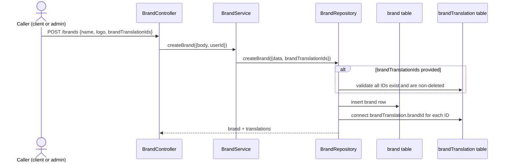
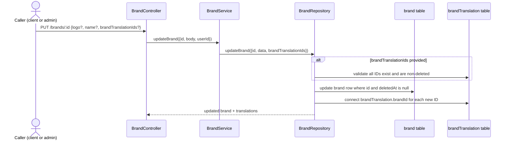
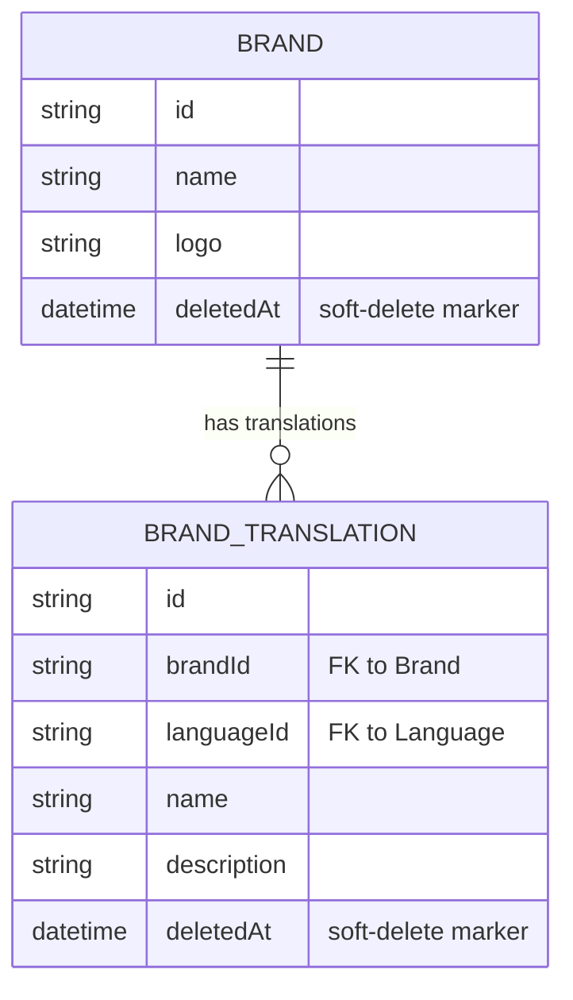

# F002_BrandCatalogManagement — Technical Spec

**Priority**: P1
**Type**: ui
**Generated**: 2026-09-12

**Xem thêm:** [`functional-spec.vi.md`](./functional-spec.vi.md) — tổng quan bằng ngôn ngữ đơn giản, các
quyết định còn treo, yêu cầu/quy tắc nghiệp vụ nêu gọn từng dòng, màn hình, user story, kịch bản,
edge case, và cấu hình dành cho BA/QA.

**Cách đọc file này:** § 2 là mục lục — chọn action bạn quan tâm rồi đọc thẳng block của nó ở § 3;
mỗi block là một luồng hoàn chỉnh, đọc từ đầu đến cuối. § 4 là phụ lục dùng chung — chỉ nhảy vào khi
một block ở § 3 trỏ bạn tới đó.

## 1. Tổng quan kỹ thuật

`BrandController` expose 5 REST endpoint trên model `Brand` — một cặp đọc list/detail và một bộ ba
ghi create/update/delete — với `BrandService` chỉ làm field-mapping mỏng và `BrandRepository` giữ
toàn bộ lệnh gọi Prisma cộng việc dịch lỗi Prisma sang HTTP status. Mọi thao tác đọc và ghi dùng
chung một shape Prisma `select` (`createBrandWithTranslationsSelect`) nên response luôn kèm theo các
dòng `BrandTranslation` của brand theo ngôn ngữ hiện tại của caller. Không có queue, job, hay tích
hợp bên ngoài nào ở đây — đây là một bề mặt CRUD đồng bộ với một mối quan tâm cross-cutting dùng
chung: `AccessTokenGuard` toàn cục (`Bearer` + quyền theo module cho từng route).

## 2. Mục lục Action

| # | Action (handler) | Method · Path | Codes | Ghi | Chi tiết |
|---|---|---|---|---|---|
| **A0** | *cross-cutting — không thuộc riêng action nào* | — | {FR-601, FR-602} | — | § 4.4 |
| **A1** | `BrandController#getBrands` | `GET` `/brands` | {FR-001, FR-201, BR-001, BR-002, US010} | — *(chỉ đọc)* | § 3.1 |
| **A2** | `BrandController#getBrandById` | `GET` `/brands/:id` | {FR-202, FR-602, BR-002, US011} | — *(chỉ đọc)* | § 3.1 |
| **A3** | `BrandController#createBrand` | `POST` `/brands` | {FR-301, BR-002, BR-003, BR-005, US012} | `brand`, `brandTranslation` | § 3.2 ▸ **diagram** |
| **A4** | `BrandController#updateBrand` | `PUT` `/brands/:id` | {FR-302, BR-002, BR-003, BR-005, US013} | `brand`, `brandTranslation` | § 3.2 ▸ **diagram** |
| **A5** | `BrandController#deleteBrand` | `DELETE` `/brands/:id` | {FR-303, BR-004, BR-005, US014} | `brand` | § 3.2 |

**Bộ rung:** **Who** → **FE** → **Request** → **BE** → **Rule** → **Result** → **State** → **Source**
(rung FE bị bỏ xuyên suốt — đây là API headless, không có view frontend).

**Ngưỡng áp dụng diagram:** A3 và A4 mỗi cái đều ghi hai bảng (`brand` trực tiếp, `brandTranslation`
qua update FK `connect` trên các dòng translation liên kết) → cả hai vượt ngưỡng. A1/A2 chỉ đọc.
A5 chỉ ghi đúng một bảng (`brand`), đồng bộ, không có nhánh nào đủ phức tạp để cần diagram.

## 3. Actions

### 3.1 CAP-01 — Duyệt Brand

#### A1 · Liệt kê brand

`GET` `/brands` → `` `BrandController#getBrands` ``
`FR-001` `FR-201` `BR-001` `BR-002` · `US010`

**Who** · bất kỳ caller nào, không cần session *(gate A0 không áp dụng — route này là `@IsPublicApi()`)*
**Request** · query params `page` (mặc định 1), `pageSize` (mặc định 10), `order` (mặc định
`ASC`), `orderBy` (mặc định `createdAt`), `keyword` (mặc định `""`); ngôn ngữ lấy từ
`@CurrentLang()`.
**BE** · `` `BrandService#getBrands` `` tính `skip`/`take` từ `page`/`pageSize`, rồi
gọi `` `BrandRepository#findManyBrands` ``. `src/routes/brand/brand.service.ts:30-72`
**Rule** · **BR-001 — Danh sách mặc định về trang 1/size 10, sắp tăng dần theo `createdAt`, và lọc
theo chuỗi con không phân biệt hoa thường trên `name` khi có `keyword`; các dòng đã soft-delete luôn
bị loại.** Repository luôn merge `where: { deletedAt: null }` vào mọi query — một `keyword` không
bao giờ lộ ra một brand đã bị xoá. `src/repositories/brand/brand.repository.ts:58-61`
**BR-002 — mọi thao tác đọc/ghi brand đều trả về brand kèm translation giới hạn theo ngôn ngữ hiện
tại của caller**, qua shape select dùng chung `createBrandWithTranslationsSelect` (§ 4.4). *(§ 4.4)*
**Result** · chỉ đọc — **không ghi DB**. Trả về `{ data: brands, pagination: { page,
pageSize, totalPages, totalItems } }`, `totalPages = Math.ceil(brandsCount / pageSize)`.
`src/routes/brand/brand.service.ts:61-71`
**Source:** `src/routes/brand/brand.controller.ts:42-58` → `src/routes/brand/brand.service.ts:30-72` → `src/repositories/brand/brand.repository.ts:49-87`

<!-- No diagram: read-only, single table, synchronous — a sequence diagram would add no
     information a rung above doesn't already state plainly. -->

---

#### A2 · Lấy brand theo ID

`GET` `/brands/:id` → `` `BrandController#getBrandById` ``
`FR-202` `FR-602` `BR-002` · `US011`

**Who** · bất kỳ caller nào — **nhưng xem `[UNVERIFIED]` bên dưới: runtime thực tế yêu cầu session
`Bearer`** *(gate A0)*
**Request** · path param `id` (UUID, validate bằng `BrandIdParamDto`); ngôn ngữ lấy từ
`@CurrentLang()`.
**BE** · `` `BrandService#getBrandById` `` chuyển tiếp thẳng tới
`` `BrandRepository#findUniqueBrand` ``. `src/routes/brand/brand.service.ts:81-94`
**Rule** · **BR-002 — mọi thao tác đọc/ghi brand đều trả về brand kèm translation giới hạn theo
ngôn ngữ hiện tại của caller.** *(§ 4.4)*
**FR-602 `[UNVERIFIED]`** — handler này mang `@ApiPublic` (một decorator chỉ mang tính chú thích
Swagger) nhưng **không** có `@IsPublicApi()` — decorator duy nhất thực sự tắt guard (PERM002).
Runtime vì vậy rơi vào `AccessTokenGuard` toàn cục mặc định (gate A0) và yêu cầu một `Bearer` token
hợp lệ dù nhãn Swagger ghi "Public". Ở đây được xử lý như **cần `Bearer`**, khớp với cờ ROUTE012
của `route-list.md` và PERM010 của `permissions-matrix.md`.
**Result** · chỉ đọc — **không ghi DB**. `findUniqueBrand` dùng `findUniqueOrThrow` với
`{ id, deletedAt: null }` — một ID đã xoá hoặc không tồn tại sẽ ném `PrismaClientKnownRequestError`
mã `P2025`, được catch block của repository chuyển thành 404.
`src/repositories/brand/brand.repository.ts:104-126`
**Source:** `src/routes/brand/brand.controller.ts:60-78` → `src/routes/brand/brand.service.ts:81-94` → `src/repositories/brand/brand.repository.ts:96-127`

<!-- No diagram: read-only, single table, synchronous. -->

---

### 3.2 CAP-02 — Quản trị Brand

#### A3 · Tạo brand

`POST` `/brands` → `` `BrandController#createBrand` ``
`FR-301` `BR-002` `BR-003` `BR-005` · `US012`

**Who** · caller đã xác thực `Bearer` mà vai trò của họ có quyền module `BRANDS` *(gate A0 —
§ 4.4)*
**Request** · body `CreateBrandRequestDto`: `logo` (bắt buộc, chuỗi URL hợp lệ), `name` (bắt buộc,
1–100 ký tự), `brandTranslationIds` (mảng UUID, tuỳ chọn).
`src/dtos/brand/brand.dto.ts:77-115`
**BE** · `` `BrandService#createBrand` `` map body cộng `createdById` (từ
`@ActiveUser("userId")`) vào `` `BrandRepository#createBrand` ``.
`src/routes/brand/brand.service.ts:103-120`
**Rule** · **BR-003 — tạo brand với `brandTranslationIds` trước tiên xác nhận mọi ID đều trỏ tới
một dòng `BrandTranslation` tồn tại, chưa xoá; ID nào không khớp thì từ chối toàn bộ request trước
khi có bất kỳ thao tác ghi nào.** Cơ chế: `validateBrandTranslations` đếm số dòng chưa xoá khớp và
so với độ dài input. *(§ 4.4)*
**BR-002 — brand vừa tạo được trả về kèm translation cho ngôn ngữ hiện tại** (dùng cùng select
dùng chung với các thao tác đọc). *(§ 4.4)*
**BR-005 `[UNVERIFIED]`** — vì việc cấp quyền role→module chỉ lọc theo tên module (không bao giờ
theo HTTP method — PERM005), một caller vai trò `client` có thể gọi endpoint ghi này y hệt như
`admin`, dù user story ghi "As an admin..." *(§ 4.4)*
**Result**
- Ghi `brand` ← `name`, `logo`, `createdById` — `src/repositories/brand/brand.repository.ts:148-156`
- Ghi `brandTranslation.brandId` ← FK connect cho mỗi ID trong `brandTranslationIds`, qua
  `connect` của Prisma — `src/repositories/brand/brand.repository.ts:151-153`
- Xung đột unique constraint trên `name` → 409 "Brand is already exists." — `:162-168`
- Xung đột khoá ngoại trên connect → 422 "Failed to create brand." — `:170-176`
**Source:** `src/routes/brand/brand.controller.ts:80-98` → `src/routes/brand/brand.service.ts:103-120` → `src/repositories/brand/brand.repository.ts:136-183`



---

#### A4 · Cập nhật brand

`PUT` `/brands/:id` → `` `BrandController#updateBrand` ``
`FR-302` `BR-002` `BR-003` `BR-005` · `US013`

**Who** · caller đã xác thực `Bearer` mà vai trò của họ có quyền module `BRANDS` *(gate A0)*
**Request** · path param `id` (UUID); body `UpdateBrandRequestDto` (`PartialType(BrandRequestDto)`
— bất kỳ tập con nào của `logo`/`name`/`brandTranslationIds`). `src/dtos/brand/brand.dto.ts:117`
**BE** · `` `BrandService#updateBrand` `` map body cộng `updatedById` (từ
`@ActiveUser("userId")`) vào `` `BrandRepository#updateBrand` ``.
`src/routes/brand/brand.service.ts:130-149`
**Rule** · **BR-003 — cập nhật với `brandTranslationIds` chạy cùng kiểm tra tồn tại như khi tạo;
ID nào không khớp thì từ chối toàn bộ request.** *(§ 4.4)*
**BR-002 — brand vừa cập nhật được trả về kèm translation cho ngôn ngữ hiện tại.** *(§ 4.4)*
**BR-005 `[UNVERIFIED]`** — cùng phát hiện client-có-thể-mutate như A3. *(§ 4.4)*
**Result**
- Ghi `brand` ← bất kỳ trường nào trong `name`/`logo` được cung cấp, cộng `updatedById` —
  `src/repositories/brand/brand.repository.ts:235-243`
- Ghi `brandTranslation.brandId` ← FK connect cho mỗi ID mới trong `brandTranslationIds` — `:239-241`
- ID mục tiêu bị thiếu/đã xoá → 404 "Brand not found." — `:250-255`
- Xung đột unique constraint trên `name` → 409 "Brand is already exists." — `:257-263`
- Xung đột khoá ngoại trên connect → 422 "Failed to update brand." — `:265-271`
**Source:** `src/routes/brand/brand.controller.ts:100-113` → `src/routes/brand/brand.service.ts:130-149` → `src/repositories/brand/brand.repository.ts:219-278`



---

#### A5 · Xoá brand

`DELETE` `/brands/:id` → `` `BrandController#deleteBrand` ``
`FR-303` `BR-004` `BR-005` · `US014`

**Who** · caller đã xác thực `Bearer` mà vai trò của họ có quyền module `BRANDS` *(gate A0)*
**Request** · path param `id` (UUID); body `DeleteBrandRequestDto`: `isHardDelete` (boolean tuỳ
chọn, mặc định `false`). `src/dtos/brand/brand.dto.ts:148-157`
**BE** · `` `BrandService#deleteBrand` `` chuyển thẳng `id`, `userId`, `isHardDelete` tới
`` `BrandRepository#deleteBrand` ``. `src/routes/brand/brand.service.ts:159-175`
**Rule** · **BR-004 — xoá mặc định là soft-delete (đánh dấu `deletedAt`/`deletedById` và cập nhật
`updatedById`, dòng vẫn còn); `isHardDelete: true` tường minh sẽ chạy một `delete` Prisma thật,
xoá hẳn dòng.** `src/repositories/brand/brand.repository.ts:296-313`
**BR-005 `[UNVERIFIED]`** — cùng phát hiện client-có-thể-mutate như A3/A4. *(§ 4.4)*
**Result**
- Đường soft: ghi `brand.deletedAt` ← `new Date()`, `brand.deletedById`/`brand.updatedById` ←
  `userId` — `:304-310`
- Đường hard: xoá hẳn dòng `brand` (Prisma `delete`, giới hạn theo `{ id, deletedAt: null
  }`) — `:298-301`
- Không tìm thấy mục tiêu (đã xoá, hoặc chưa từng tồn tại) → 404 "Brand not found." — `:319-324`
- Lỗi khác bất kỳ → 500 "Failed to delete brand." — `:326-329`
**Source:** `src/routes/brand/brand.controller.ts:115-130` → `src/routes/brand/brand.service.ts:159-175` → `src/repositories/brand/brand.repository.ts:288-331`

<!-- No diagram: writes exactly one table (`brand`), synchronous, one boolean-gated branch already
     fully stated in the Rule/Result rungs above — a diagram would just re-narrate that branch. -->

### 3.3 Edge case

| Action | Kịch bản | Hành vi |
|---|---|---|
| A1 | `keyword` không khớp tên brand nào | Trả về mảng `data` rỗng với `totalItems: 0`, không phải lỗi — `src/routes/brand/brand.service.ts:61-71` |
| A2 | `:id` là UUID hợp lệ về cú pháp nhưng không có dòng nào như vậy (hoặc đã soft-delete) | `findUniqueOrThrow` ném Prisma `P2025`, catch của repository map nó thành 404 "Not found." — `src/repositories/brand/brand.repository.ts:113-120` |
| A3 · A4 | `brandTranslationIds` chứa một ID thuộc translation khác, đã bị xoá | `validateBrandTranslations` lệch số đếm → toàn bộ request bị từ chối trước khi ghi — `src/repositories/brand/brand.repository.ts:203-208` |
| A3 · A4 | `name` trùng khi tạo, hoặc đổi tên thành tên đã dùng | Lỗi unique constraint của Prisma (`P2002`) → 409 "Brand is already exists." — `src/repositories/brand/brand.repository.ts:162-168`, `:257-263` |
| A5 | Hard-delete một brand vẫn còn được tham chiếu bởi dòng `Product` (FK: `Product.brandId`) | Lỗi ràng buộc khoá ngoại của Prisma lộ ra như một đường lỗi chưa được bắt — catch của `deleteBrand` trong repository chỉ xử lý riêng `P2025`; một xung đột FK thật ở đây rơi vào 500 chung `[UNVERIFIED]` (không thấy nhánh xử lý FK-conflict tường minh trong method này, khác với create/update) |
| A1-A5 | Gọi chưa xác thực tới bất kỳ route nào ngoại trừ A1 | 401/403 từ `AccessTokenGuard` toàn cục trước khi handler chạy — xem A0 § 4.4 |

## 4. Nền tảng dùng chung

### 4.1 Component

| Component | Trách nhiệm | Dùng ở | File |
|---|---|---|---|
| `BrandController` | Điểm vào HTTP cho cả 5 route brand | A1-A5 | `src/routes/brand/brand.controller.ts` |
| `BrandService` | Lớp field-mapping mỏng giữa DTO của controller và các lệnh gọi repository | A1-A5 | `src/routes/brand/brand.service.ts` |
| `BrandRepository` | Giữ mọi lệnh gọi Prisma cộng việc dịch lỗi Prisma → HTTP status | A1-A5 | `src/repositories/brand/brand.repository.ts` |
| `createBrandWithTranslationsSelect` | Shape Prisma `select` dùng chung — field brand + translation giới hạn theo ngôn ngữ | A1-A5 | `src/selectors/brand.selector.ts:12-27` |

### 4.2 Mô hình dữ liệu



| Entity | Bảng | Dùng cho | Action |
|---|---|---|---|
| `Brand` | `brand` | Entity brand nền tảng mà tính năng này sở hữu trọn vẹn | A1-A5 |
| `BrandTranslation` | `brand_translation` | Đọc (nhúng trong mọi response) và liên kết (FK connect) khi ghi — thuộc sở hữu của F004, được tham chiếu ở đây | A1-A5 |

#### Hành vi Polymorphic

N/A — không có discriminator field nào trong Key Entities. `entities.md` § MODEL014_Brand và
§ MODEL015_BrandTranslation đều liệt kê "Discriminator Fields: None."

### 4.3 Quản lý trạng thái

Không có. `Brand.deletedAt` là một timestamp nullable, không phải một trường trạng thái liệt kê, và
chuyển đổi duy nhất của nó (chưa xoá → soft-deleted, A5) là một thao tác ghi được kiểm soát bằng
boolean đơn, đã được mô tả đầy đủ ở các rung Rule/Result của A5 — dưới ngưỡng ≥3-trạng thái/
≥2-chuyển-đổi để cần một block SM `kind: ui`/`kind: entity`.

### 4.4 Quy tắc dùng chung

#### Bin 3 — cross-cutting, không thuộc riêng action nào

**A0 · {FR-601, FR-602} — mọi route trừ `GET /brands` yêu cầu một session `Bearer` hợp lệ, và mọi
route đã xác thực `Bearer` còn yêu cầu thêm vai trò của caller phải có một dòng quyền cho đúng
`(path, method)` đó.**
`APP_GUARD` toàn cục (`AccessTokenGuard`) chạy trước mọi handler; một route chỉ được miễn bằng
`@IsPublicApi()` (`GET /brands` mang decorator này). Với mọi route không được miễn, guard tra
`role.permissions` lọc theo `(path, method)` của request — không khớp cái nào → 403 "You do not
have permission to access this resource." — **áp dụng cho cả 70 route trong codebase, không riêng
một màn hình hay tính năng nào.**
**Source:** `src/shared/guards/access-token.guard.ts:56-90` · `src/shared/modules/base.module.ts:17-43` · route-list.md ROUTE011-ROUTE015

#### Bin 2 — dùng bởi ≥2 action có tên

**BR-002 — mọi thao tác đọc/ghi brand đều được định hình bởi một select Prisma dùng chung, luôn
nhúng translation của brand cho ngôn ngữ hiện tại (hoặc tất cả) của caller.**
Dùng ở: **A1** · **A2** · **A3** · **A4** · **A5**. `createBrandWithTranslationsSelect` ghép một
select cơ bản `{ id, name, logo }` với một select `brandTranslations` lồng bên trong, lọc theo
`deletedAt: null` và, khi có yêu cầu một ngôn ngữ cụ thể, thêm `languageId` — mọi handler đều
truyền cùng function này vào lệnh gọi Prisma của nó, nên không handler nào vô tình trả về một
brand thiếu translation hoặc lộ ra một dòng translation đã soft-delete.
**Source:** `src/selectors/brand.selector.ts:12-27`
```text
function createBrandWithTranslationsSelect(languageId = ALL_LANGUAGES):
  return {
    id, name, logo,
    brandTranslations: {
      where: { deletedAt: null, languageId: languageId == ALL_LANGUAGES ? undefined : languageId },
      select: brandTranslationSelect
    }
  }
```

**BR-003 — tạo hoặc cập nhật một brand với `brandTranslationIds` trước tiên xác nhận mọi ID đều
trỏ tới một dòng translation tồn tại, chưa xoá, trước khi có bất kỳ thao tác ghi database nào.**
Dùng ở: **A3** · **A4**. `validateBrandTranslations` chạy một `findMany` đếm-kiểm-tra
(`{ id: { in: ids }, deletedAt: null }`) và so kết quả đếm được với độ dài mảng input — hụt bất kỳ
đâu sẽ ném 400 trước khi lệnh gọi Prisma riêng của `createBrand`/`updateBrand` chạy, nên một brand
liên kết dở dang không bao giờ được lưu lại.
**Source:** `src/repositories/brand/brand.repository.ts:191-209`
```text
function validateBrandTranslations(ids):
  valid = brandTranslation.findMany({ where: { id in ids, deletedAt: null } }, select: id)
  if valid.length != ids.length:
    throw 400 "Some brand translations do not exist."
```

**BR-005 `[UNVERIFIED]` — việc cấp quyền role→module chỉ lọc theo tên module, không bao giờ theo
HTTP method, nên bất kỳ vai trò nào có module list gồm `BRANDS` đều được cấp mọi method trên mọi
route Brands, không chỉ đọc.**
Dùng ở: **A3** · **A4** · **A5**. `initial-scripts/create-permission.ts` xây dựng tập `permissions`
của mỗi vai trò bằng cách lọc toàn bộ bảng permission xuống các dòng có `module` nằm trong một mảng
hardcode theo từng vai trò (`SellerModule`/`ClientModule`) — bộ lọc không bao giờ xét `method`.
`ClientModule` bao gồm `"BRANDS"`, nên một tài khoản `client` được cấp `GET`/`POST`/`PUT`/`DELETE`
trên `/brands*` như nhau. `[UNVERIFIED]` liệu đây có phải thiết kế chủ ý "client có thể quản lý
catalog brand" hay là một tác dụng phụ ngoài ý muốn của việc lọc quyền theo cấp module (không phải
cấp route) — xem functional-spec.md § 3 Open Decisions D002.
**Source:** `initial-scripts/create-permission.ts:22-29,158-169`
```text
Module = { SELLER: SellerModule, CLIENT: ClientModule }  # no per-method dimension
for role in [ADMIN, SELLER, CLIENT]:
  moduleList = Module[role]                 # undefined for ADMIN -> unfiltered (all permissions)
  permissionIds = moduleList
    ? allPermissions.filter(p => moduleList.includes(p.module)).map(p => p.id)
    : allPermissions.map(p => p.id)
  role.permissions.set(permissionIds)        # sets ALL methods within each allowed module
```

### 4.5 Thuật toán & Tích hợp

Không có. Không có tính toán phi tầm thường nào và không có tích hợp bên ngoài nào (gọi API, phát
event, webhook, job queue, notification) liên quan đến tính năng này — mọi action là một lệnh gọi
Prisma CRUD trực tiếp, đồng bộ.

### 4.6 Cấu hình

```text
(none feature-specific) — pagination/order/sort defaults are business-visible constants covered
in functional-spec.md § 13, not technical configuration (no env var, timeout, or retry setting is
specific to this feature).
```

**Hành vi client:** xem
[`behavior-logic.md`](../../docs/generated/behavior-logic.md) (các pattern phía client — debounce, optimistic UI, polling, upload, realtime),
[`permissions.md`](../../docs/system/permissions.md) (feature flag / experiment / env / locale gate),
[`architecture.md`](../../docs/system/architecture.md) (guard / khôi phục state theo deep-link / bảo vệ thay đổi chưa lưu).

Cả ba đều là `N/A` cho tính năng này — API backend headless, không có code phía client nào trong
repository này (đã xác nhận trong `behavior-logic.md` § Client-Side Logic và
`permissions-matrix.md` § Client-Side Gate Types).

## 5. Kiểm chứng & Ghi chú kỹ thuật

### 5.1 Kiểm chứng kỹ thuật

- **SC-001** *(A1)* Liệt kê không có query param nào trả về đúng `pageSize: 10` item (hoặc ít hơn
  nếu catalog có ít hơn 10 brand đang hoạt động), sắp tăng dần theo `createdAt` (bao phủ FR-201,
  BR-001)
- **SC-002** *(A2)* Yêu cầu ID của một brand đã soft-delete trả về 404, giống hệt yêu cầu một ID
  chưa từng tồn tại (bao phủ FR-202, FR-602)
- **SC-003** *(A3, A4)* Gửi một mảng `brandTranslationIds` chứa một ID không hợp lệ sẽ từ chối
  toàn bộ request với 400 và không tạo/cập nhật gì cả (bao phủ FR-301, FR-302, BR-003)
- **SC-004** *(A5)* Xoá không kèm `isHardDelete` để lại dòng nhưng loại nó khỏi mọi lệnh
  list/detail sau đó (bao phủ FR-303, BR-004)

#### US010_ViewBrandList *(A1)*

**Independent Test:** Gọi `GET /brands` không có header auth và không query param nào; assert 200
và một block `pagination` khớp với các giá trị mặc định đã cấu hình.

**Kịch bản nghiệm thu:**

1. **Given** có 15 brand đang hoạt động, **When** một caller yêu cầu trang 1 không kèm `pageSize`,
   **Then** response trả về 10 brand và `pagination.totalItems == 15`.
2. **Given** một `keyword` không khớp brand nào, **When** caller liệt kê với keyword đó,
   **Then** response trả về mảng `data` rỗng với 200, không phải lỗi.

#### US011_ViewBrandDetail *(A2)*

**Independent Test:** Gọi `GET /brands/:id` với một `Bearer` token hợp lệ cho một brand ID tồn
tại; assert 200 và payload brand có kèm `brandTranslations`.

**Kịch bản nghiệm thu:**

1. **Given** một brand ID tồn tại, chưa xoá, **When** một caller đã xác thực `Bearer` yêu cầu nó,
   **Then** response là 200 với các trường và translation của brand.
2. **Given** không có header `Authorization`, **When** một caller yêu cầu bất kỳ brand ID nào,
   **Then** response là 401 — dù nhãn Swagger ghi route này là public.

#### US012_CreateBrand *(A3)*

**Independent Test:** Gọi `POST /brands` với một `Bearer` token cho một tài khoản vai trò `client`
và một body `{name, logo}` hợp lệ; assert việc tạo thành công với 201/200 (theo phát hiện hành vi
hiện tại của BR-005), không phải 403.

**Kịch bản nghiệm thu:**

1. **Given** một body `{name, logo}` hợp lệ và không có `brandTranslationIds`, **When** một caller
   được cấp quyền tạo một brand, **Then** response trả về brand mới với `brandTranslations: []`.
2. **Given** một mảng `brandTranslationIds` với một ID không tồn tại, **When** một caller được cấp
   quyền cố tạo một brand, **Then** response là 400 và không dòng `brand` nào được chèn vào.

### 5.2 Giả định

- *(A2)* Hành vi `[UNVERIFIED]` yêu cầu `Bearer` trên `GET /brands/:id` được giả định là đường
  runtime thực tế, chưa thay đổi — lượt này chỉ đọc source, không chạy app để xác nhận thực nghiệm
  body/status code 401.
- *(A5)* Chế độ lỗi khoá ngoại của hard-delete (ví dụ một brand vẫn còn liên kết với dòng
  `Product`) được suy ra từ việc thiếu một nhánh `isForeignKeyConstraintPrismaError` trong
  `deleteBrand` (khác với `createBrand`/`updateBrand`, cả hai đều có nhánh này) — giả định rơi vào
  500 chung, chưa xác nhận bằng cách chạy thật một lệnh xoá nhắm vào một brand đang được tham
  chiếu.
- *(A3, A4)* Quyền sở hữu của `brandTranslationIds` được giả định là không được kiểm tra ngoài
  việc tồn tại — không có gì trong `validateBrandTranslations` xác nhận một translation chưa được
  liên kết với một brand *khác* trước lệnh gọi `connect`; điều này được suy ra từ việc đọc thân
  method, không phải từ một xung đột runtime quan sát được.

### 5.3 Câu hỏi chưa giải quyết

1. **Xử lý xung đột FK khi hard delete** *(A5)*: Postgres/Prisma có thực sự ném lỗi khoá ngoại khi
   hard-delete một brand vẫn còn được tham chiếu bởi dòng `Product` hay không, và nếu có, nó có lộ
   ra như 500 chung (không có nhánh catch tường minh), hay cascade/cấu hình của Prisma trên quan hệ
   đó khiến điều này không còn quan trọng? Chưa xác nhận được chỉ từ định nghĩa quan hệ
   `Brand`↔`Product`.
2. **Re-link translation giữa các brand** *(A3, A4)*: nếu một mục `brandTranslationIds` đã thuộc
   về một brand khác, lệnh gọi `connect` có âm thầm re-parent nó không, hay một ràng buộc DB chặn
   lại? `validateBrandTranslations` chỉ kiểm tra sự tồn tại, không kiểm tra `brandId` hiện tại —
   chưa xác nhận được với hành vi runtime thực tế của ràng buộc
   `BrandTranslation_languageId_brandId_unique`.

### 5.4 Tham chiếu Source

| Action | Thứ tự | Symbol | Path | Mục đích |
|---|---|---|---|---|
| — | 1 | `Brand` | `prisma/schema.prisma:398-417` | Entity brand nền tảng mà tính năng này xoay quanh |
| — | 2 | `BrandTranslation` | `prisma/schema.prisma:419-440` | Văn bản brand đã bản địa hoá mà tính năng này liên kết nhưng không sở hữu (F004) |
| A1-A5 | 3 | `BrandController` | `src/routes/brand/brand.controller.ts:1-131` | Điểm vào HTTP cho cả 5 route brand |
| A1-A5 | 4 | `BrandService` | `src/routes/brand/brand.service.ts:1-176` | Lớp field-mapping giữa DTO và repository |
| A1-A5 | 5 | `BrandRepository` | `src/repositories/brand/brand.repository.ts:1-332` | Mọi lệnh gọi Prisma + dịch lỗi Prisma |
| A1-A5 | 6 | `createBrandWithTranslationsSelect` | `src/selectors/brand.selector.ts:1-28` | Shape select dùng chung nhúng translation |

#### Luồng dữ liệu

```text
{query params / path :id / body} -> BrandController (DTO validation)
  -> BrandService (field mapping, injects userId on writes)
    -> BrandRepository (Prisma call, shared select, error translation)
      -> Postgres `brand` (+ `brand_translation` FK connect on A3/A4)
  -> BrandRepository catch block (Prisma error code -> HTTP status)
-> {paginated list | single brand | created/updated brand | delete confirmation message}
```

### 5.5 Tham chiếu Artifact

| Artifact | File | Codes dùng | Đã review |
|----------|------|------------|----------|
| System Overview | [system-overview.md](../../docs/system/system-overview.md) | — | [x] |
| Feature List | [feature-list.md](../../docs/generated/feature-list.md) | F002 | [x] |
| API Map | [api-map.md](../../docs/generated/api-map.md) | ROUTE011, ROUTE012, ROUTE013, ROUTE014, ROUTE015 | [x] |
| Entities | [entities.md](../../docs/generated/entities.md) | MODEL014, MODEL015 | [x] |
| Screens | [functional-spec.md § 6](./functional-spec.vi.md#6-screens) | — (N/A, headless) | [x] |
| Behavior Logic | [behavior-logic.md](../../docs/generated/behavior-logic.md) | — (không có BL### nào thuộc tính năng này) | [x] |
| Permissions Matrix | [permissions-matrix.md](../../docs/generated/permissions-matrix.md) | PERM001, PERM005, PERM010 | [x] |
| User Stories | [user-stories.md](../../docs/generated/user-stories.md) | US010, US011, US012, US013, US014 | [x] |

**Rule:** Mọi code liệt kê trong Codes Used đều tồn tại trong artifact nguồn của nó; đã xác minh
bằng grep trực tiếp trên từng file được liệt kê trong đợt research này.
</content>
