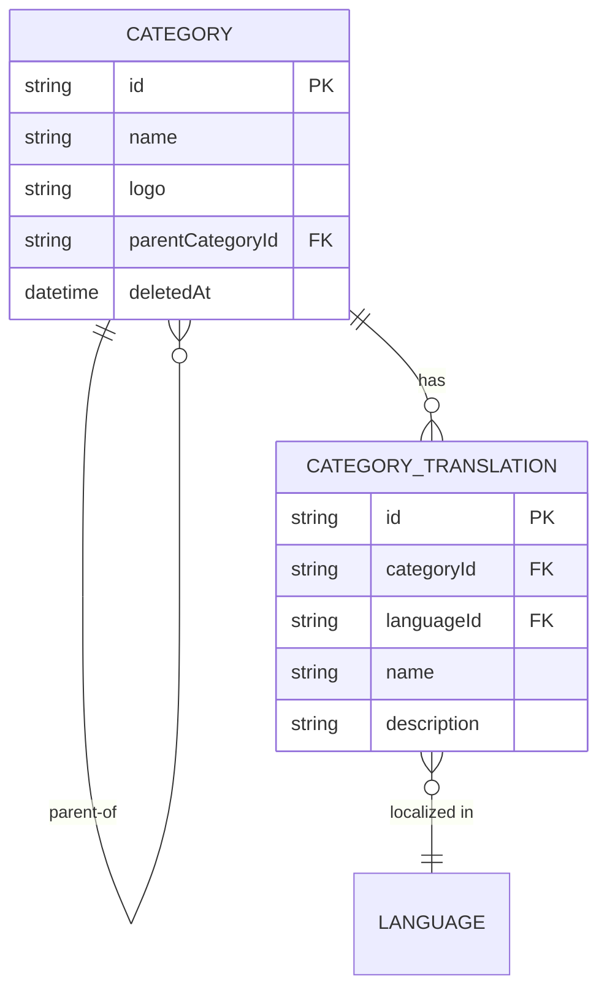

<!-- layout-exempt: rebuild-spec owns all docs/system|features|generated|flows paths -->
<!-- Contract: references/feature-spec-researcher-contract.md -->

# F003_CategoryCatalogManagement — Technical Spec

**Priority**: P1
**Type**: ui
**Generated**: 2026-09-12

**See also:** [`functional-spec.md`](./functional-spec.md) — plain-language overview, open
decisions, requirements/business rules stated in one-liners, screens, user stories, scenarios,
edge cases, and configuration for a BA/QA audience.

**How to read this file:** § 2 is the index — pick the action you care about and read its block
in § 3 straight through; each block is one complete thread, top to bottom. § 4 is the shared
appendix — jump in only when a § 3 block points you there.

## 1. Technical Overview

`CategoryController` exposes 5 REST handlers (list/detail/create/update/delete) over a
self-referential `Category` Prisma model, delegated straight through a thin `CategoryService` to
`CategoryRepository`, which owns every business-rule check and Prisma-error mapping. Every route
requires a `Bearer` token via the global `AuthorizationHeaderGuard`/`AccessTokenGuard` default — no
route carries `@IsPublicApi()` — and, per the role→module permission seed, both `admin` and
`client` roles currently pass the per-route permission check identically (see § 4.4 A0 and
functional-spec.md § 11 RISK-03).

## 2. Action Index

| # | Action (handler) | Method · Path | Codes | Writes | Detail |
|---|---|---|---|---|---|
| **A0** | *cross-cutting — belongs to no single action* | — | FR-601 | — | § 4.4 |
| **A1** | `CategoryController#getAllCategories` | `GET` `/categories` | FR-101, FR-201, FR-401, BR-003, BR-004, US020 | — *(read-only)* | § 3.1 |
| **A2** | `CategoryController#getCategoryById` | `GET` `/categories/:id` | FR-101, FR-202, BR-003, BR-004, US021 | — *(read-only)* | § 3.1 |
| **A3** | `CategoryController#createCategory` | `POST` `/categories` | FR-001, FR-301, BR-001, BR-003, US022 | `category` | § 3.2 |
| **A4** | `CategoryController#updateCategory` | `PUT` `/categories/:id` | FR-001, FR-302, BR-001, BR-002, US023 | `category` | § 3.2 |
| **A5** | `CategoryController#deleteCategory` | `DELETE` `/categories/:id` | FR-303, BR-003, US024 | `category` | § 3.2 |

No action in this feature writes ≥2 tables and none is a background/async-step action, so no
block below carries a `sequenceDiagram` — each thread is a single synchronous request/response.

## 3. Actions

### 3.1 CAP-01 — Browse Categories

#### A1 · List categories
`GET` `/categories` → `` `CategoryController#getAllCategories` ``
`FR-101` `FR-201` `FR-401` · `US020`

**Who** · any authenticated caller whose role is granted the `CATEGORIES` module (currently
`admin` and `client`) *(gate A0 — § 4.4)*
**Request** · query `parentCategoryId` *(optional UUID)* — when present, filters to that
category's direct children; `languageId` resolved from the caller's locale (`CurrentLang`,
optional) selects which translation row is returned
**BE** · `` `CategoryService#getAllCategories` `` → `` `CategoryRepository#findAllCategories` ``
— `src/routes/category/category.service.ts:25-38`
**Rule** · decides which categories qualify: excludes soft-deleted rows and, when supplied,
restricts to one parent's direct children.
- **BR-003 — Soft-deleted categories are excluded from every read.** `deletedAt: null` is applied
  on this query and on the same category's nested `parentCategory`/`childrenCategories`
  sub-selection. *(§ 4.4)*
- **BR-004 — Translations returned are scoped to the caller's requested language.** When a
  language is resolved, only that language's translation row is returned; otherwise every
  non-deleted translation row is returned. *(§ 4.4)*
**Result** · read-only — **no DB write**. Returns every matching category (with translations,
parent, direct children) wrapped in `{data, totalCount}`.
**Source:** `src/routes/category/category.controller.ts:46-61` → `src/routes/category/category.service.ts:25-38` →
`src/repositories/category/category.repository.ts:32-58`

<!-- No diagram: below threshold — single read-only query, synchronous, no branching table. -->

---

#### A2 · Get category by ID
`GET` `/categories/:id` → `` `CategoryController#getCategoryById` ``
`FR-101` `FR-202` · `US021`

**Who** · any authenticated caller whose role is granted the `CATEGORIES` module *(gate A0)*
**Request** · path `id` *(UUID, `ParseUUIDPipe`)*; `languageId` resolved from the caller's locale
(optional)
**BE** · `` `CategoryService#getCategoryById` `` → `` `CategoryRepository#findCategoryById` `` —
`src/routes/category/category.service.ts:47-60`
**Rule** · same soft-delete exclusion (BR-003) and language-scoping (BR-004) as A1, gated by an
exact ID match. *(§ 4.4)*
**Result** · read-only — **no DB write**. Returns the matching category's detail, or a 404 when
the ID does not resolve to a non-deleted row.
**Source:** `src/routes/category/category.controller.ts:79-89` → `src/routes/category/category.service.ts:47-60` →
`src/repositories/category/category.repository.ts:68-97`

<!-- No diagram: below threshold — single read-only query, synchronous. -->

---

### 3.2 CAP-02 — Manage Categories

#### A3 · Create category
`POST` `/categories` → `` `CategoryController#createCategory` ``
`FR-001` `FR-301` · `US022`

**Who** · any authenticated caller whose role is granted the `CATEGORIES` module — **not
restricted to `admin` at the code level** *(gate A0; see § 4.4 A0 and functional-spec.md § 11
RISK-03)*
**Request** · body `name` *(string, 1-255 chars)*, `logo` *(optional URL)*, `parentCategoryId`
*(optional UUID)*, `categoryTranslationIds` *(optional UUID[])*
**BE** · `` `CategoryService#createCategory` `` → `` `CategoryRepository#createCategory` `` —
`src/routes/category/category.service.ts:69-85`
**Rule**
- **BR-001 — Every `categoryTranslationIds` entry must reference an existing, non-deleted
  `CategoryTranslation` row.** `validateCategoryTranslations` re-counts the matching rows and
  rejects (400) when the count is short. *(§ 4.4)*
- **BR-003 — gloss** — same soft-delete scoping as A1 shapes the returned `parentCategory`/
  `childrenCategories`. *(§ 4.4)*
**Result**
- Writes `category` ← `name`/`logo`/`parentCategoryId` from the request, `createdById` ← the
  caller's user ID — `src/repositories/category/category.repository.ts:126-171`
- Connects (does not create) any listed `categoryTranslationIds` to the new row via the
  `categoryTranslations` relation.
- 422 `"Category is already exists."` on a unique-constraint catch — `[INFERRED]` currently
  unreachable; no unique index exists on `Category.name` (see § 5.3, functional-spec.md § 11
  RISK-04).
**Source:** `src/routes/category/category.controller.ts:99-109` → `src/routes/category/category.service.ts:69-85` →
`src/repositories/category/category.repository.ts:126-171`

<!-- No diagram: below threshold — single table write, synchronous, no queue/job. -->

---

#### A4 · Update category
`PUT` `/categories/:id` → `` `CategoryController#updateCategory` ``
`FR-001` `FR-302` · `US023`

**Who** · any authenticated caller whose role is granted the `CATEGORIES` module *(gate A0; see
RISK-03)*
**Request** · path `id` *(UUID)*; body — partial `name`/`logo`/`parentCategoryId`/
`categoryTranslationIds` (all optional)
**BE** · `` `CategoryService#updateCategory` `` → `` `CategoryRepository#updateCategory` `` —
`src/routes/category/category.service.ts:95-114`
**Rule**
- **BR-001 — gloss** (same as A3: every translation link must exist and be non-deleted). *(§ 4.4)*
- **BR-002 — A category cannot be set as its own parent.** The repository rejects (422 `"A
  category cannot be its own parent."`) when `id === parentCategoryId` — a **direct-reference
  check only**; it does not walk the hierarchy, so a multi-level cycle (A→B→A) is not caught (see
  functional-spec.md § 11 RISK-02). `src/repositories/category/category.repository.ts:196-201`
**Result**
- Writes `category` ← the supplied partial fields, `updatedById` ← the caller's user ID —
  `src/repositories/category/category.repository.ts:203-213`
- Reconnects any listed `categoryTranslationIds` to this row.
- 404 `"Category not found"` when the ID does not resolve to a non-deleted row; 422 `"Category
  with this name already exists."` on a unique-constraint catch — `[INFERRED]` currently
  unreachable, same reason as A3.
**Source:** `src/routes/category/category.controller.ts:125-138` → `src/routes/category/category.service.ts:95-114` →
`src/repositories/category/category.repository.ts:182-238`

<!-- No diagram: below threshold — single table write, synchronous. -->

---

#### A5 · Delete category
`DELETE` `/categories/:id` → `` `CategoryController#deleteCategory` ``
`FR-303` · `US024`

**Who** · any authenticated caller whose role is granted the `CATEGORIES` module *(gate A0; see
RISK-03)*
**Request** · path `id` *(UUID)*
**BE** · `` `CategoryService#deleteCategory` `` → `` `CategoryRepository#deleteCategory` `` —
`src/routes/category/category.service.ts:122-134`
**Rule** · **BR-003 — gloss** (soft delete, same rule family as A1/A2/A3). Deletion is a soft
update, never a physical row removal. *(§ 4.4)*
**Result**
- Writes `category.deletedAt` ← current timestamp, `category.updatedById`/`category.deletedById`
  ← the caller's user ID — `src/repositories/category/category.repository.ts:254-263`
- 404 `"Category not found"` when the ID does not resolve to a currently non-deleted row.
**Source:** `src/routes/category/category.controller.ts:154-165` → `src/routes/category/category.service.ts:122-134` →
`src/repositories/category/category.repository.ts:247-281`

<!-- No diagram: below threshold — single table write, synchronous. -->

### 3.3 Edge cases

| Action | Scenario | Behavior |
|---|---|---|
| A1 | `parentCategoryId` query value is not a valid UUID | 400 — DTO validation rejects before the repository runs |
| A2, A4, A5 | `id` does not resolve to a non-deleted category | 404 `"Category not found"` (`isRecordNotFoundPrismaError` branch) |
| A3 | `categoryTranslationIds` includes an ID that does not exist or is soft-deleted | 400 `"Some category translations do not exist."` |
| A4 | `parentCategoryId` equals the category's own `id` | 422 `"A category cannot be its own parent."` |
| A3, A4 | Prisma reports a unique-constraint violation on the category write | 422 `"Category is already exists."`/`"Category with this name already exists."` — `[INFERRED]` unreachable today, no unique index on `Category.name` |
| A1-A5 | Caller has no `Bearer` token, or the token's role is not granted the `CATEGORIES` module | 401 (no/invalid/expired token) or 403 (module not granted) — cite A0 § 4.4 |

## 4. Shared Foundation

### 4.1 Components

| Component | Responsibility | Used in | File |
|---|---|---|---|
| `CategoryController` | HTTP entry point for all 5 category routes | A1-A5 | `src/routes/category/category.controller.ts` |
| `CategoryService` | Thin orchestration layer between controller and repository | A1-A5 | `src/routes/category/category.service.ts` |
| `CategoryRepository` | Prisma queries, error mapping, BR-001/002/003 enforcement | A1-A5 | `src/repositories/category/category.repository.ts` |
| `createCategoryWithTranslationsSelect` (selector) | Builds the shared Prisma `select` shape (parent/children/translations, language-scoped) reused by every read and write | A1-A5 | `src/selectors/category.selector.ts` |

### 4.2 Data Model



| Entity | Table | Used for | Action |
|---|---|---|---|
| `Category` | `category` | the self-referential hierarchical entity this feature owns | A1-A5 |
| `CategoryTranslation` | `category_translation` | localized name/description linked to a category (content owned by F004; only linked/read here) | A1-A4 |
| `Language` | `language` | resolves the caller's requested translation locale (F004-owned) | A1, A2 |

#### Polymorphic Behavior

N/A — no discriminator fields in Key Entities (`entities.md` § MODEL011_Category and §
MODEL012_CategoryTranslation both list `Discriminator Fields: None.`).

### 4.3 State Management

None.

### 4.4 Shared Rules

#### Bin 3 — cross-cutting, belongs to no single action

**A0 · `FR-601` — Every category endpoint requires a valid `Bearer` access token; the global
`AuthorizationHeaderGuard`/`AccessTokenGuard` default applies because `src/routes/category/category.controller.ts`
sets no `@IsPublicApi()` anywhere.**
Enforced app-wide (PERM001/PERM002 route-guard default, PERM003 per-route permission-row lookup)
— **applies to all 70 routes**, not any one screen; not a rule invented by this feature. The
per-route permission row for every `/categories` route carries module `CATEGORIES`, derived from
the URL's first path segment (`path.split("/")[1].toUpperCase()`); the role→module seed grants
`CATEGORIES` to **both** `admin` and `client` (PERM005) — all 4 HTTP methods, because the seed
filters by module name only, never by method (see functional-spec.md § 11 RISK-03). On failure:
401 (missing/invalid/expired token) before the handler runs, or 403 (valid token but role's
granted modules exclude `CATEGORIES`).
**Source:** `src/shared/guards/access-token.guard.ts:56-99` ·
`initial-scripts/create-permission.ts:56-59,158-169` · route-list.md ROUTE021-ROUTE025

#### Bin 2 — used by ≥2 named actions

**BR-001 — Every `categoryTranslationIds` entry must reference an existing, non-deleted
`CategoryTranslation` row.**
Used in: **A3** · **A4**. `validateCategoryTranslations` re-queries the given IDs and rejects (400
`"Some category translations do not exist."`) when the returned row count is less than the
requested ID count — a soft-deleted translation ID fails this check too, since the query filters
`deletedAt: null`.
**Source:** `src/repositories/category/category.repository.ts:99-116`
```text
function validateCategoryTranslations(ids):
  existing = CategoryTranslation.findMany({ id in ids, deletedAt: null })
  if existing.length != ids.length:
    throw BadRequest("Some category translations do not exist.")
```

**BR-003 — Soft-deleted categories are excluded from every read, and delete is a soft update.**
Used in: **A1** · **A2** · **A3** · **A5**. Every list/detail query filters `deletedAt: null`, and
the same filter applies to a category's nested `parentCategory`/`childrenCategories`
sub-selection — a soft-deleted category disappears from its former parent's children list and
from its own children's `parentCategory` field. `deleteCategory` never removes the row; it sets
`deletedAt`/`updatedById`/`deletedById`.
**Source:** `src/repositories/category/category.repository.ts:40-49,76-79,254-263` ·
`src/selectors/category.selector.ts:20-38`

**BR-004 — Translations returned are scoped to the caller's requested language.**
Used in: **A1** · **A2**. `createCategoryWithTranslationsSelect` filters `categoryTranslations` by
`languageId` when the caller's resolved locale is not the `ALL_LANGUAGES` sentinel; otherwise
every non-deleted translation row is returned. Translation content itself is owned by F004
(Catalog Localization) — this feature only consumes the selector.
**Source:** `src/selectors/category.selector.ts:13-26`

### 4.5 Algorithms & Integrations

None — CRUD only, against Postgres via Prisma; no external service call, no computed algorithm
beyond the straightforward queries already cited in § 3 and § 4.4.

### 4.6 Configuration

N/A — no technical configuration beyond framework defaults.

**Client behavior:** see
[`behavior-logic.md`](../../generated/behavior-logic.md) (client-side patterns — debounce, optimistic UI, polling, upload, realtime),
[`permissions.md`](../../system/permissions.md) (feature flags / experiments / env / locale gates),
[`screen-flow.md`](../../generated/screen-flow.md) (guards / deep-link state restoration / unsaved-changes protection).

All three are `N/A` for this feature — headless backend, no client-side code, no feature-flag/
experiment/env/locale gate found on any category route.

## 5. Verification & Technical Notes

### 5.1 Technical Verification

- **SC-001** *(A1, A2)* Every category returned to any caller excludes soft-deleted rows and any
  soft-deleted parent/child linkage (covers FR-201, FR-202, BR-003).
- **SC-002** *(A3, A4)* A create/update request naming a non-existent or soft-deleted
  `categoryTranslationIds` entry is rejected with 400 (covers FR-301, FR-302, BR-001).
- **SC-003** *(A4)* An update request setting `parentCategoryId` to the category's own `id` is
  rejected with 422 (covers FR-302, BR-002).
- **SC-004** *(A1-A5)* A request with no `Bearer` token, or a token whose role's granted modules
  exclude `CATEGORIES`, never reaches the handler body (covers FR-601).

#### US020_ViewCategoryList *(A1)*

**Independent Test:** Call `GET /categories` with a valid `Bearer` token whose role is granted
`CATEGORIES`; assert the response `data` excludes any category with `deletedAt` set.

**Acceptance Scenarios:**

1. **Given** an authenticated caller with the `CATEGORIES` grant, **When** they call `GET
   /categories` with no filter, **Then** the response is `{data, totalCount}` covering every
   non-deleted category.
2. **Given** a `parentCategoryId` query value, **When** they call `GET
   /categories?parentCategoryId=...`, **Then** only that category's direct children are returned.

#### US021_ViewCategoryDetail *(A2)*

**Independent Test:** Call `GET /categories/:id` for a known non-deleted category ID; assert the
response includes `parentCategory`/`childrenCategories`/`categoryTranslations`.

**Acceptance Scenarios:**

1. **Given** a valid, non-deleted category ID, **When** they call `GET /categories/:id`, **Then**
   the full category detail is returned.
2. **Given** an ID that does not resolve to a non-deleted category, **When** they call `GET
   /categories/:id`, **Then** the response status is 404.

#### US022_CreateCategory *(A3)*

**Independent Test:** POST a valid `{name}` payload; assert a new `category` row exists with
`createdById` set to the caller's user ID.

**Acceptance Scenarios:**

1. **Given** a valid `name` (and optional `logo`/`parentCategoryId`/`categoryTranslationIds`),
   **When** they call `POST /categories`, **Then** the category is created with `createdById` set.
2. **Given** a `categoryTranslationIds` entry that does not exist, **When** they call `POST
   /categories`, **Then** the response status is 400.

#### US023_UpdateCategory *(A4)*

**Independent Test:** PUT a payload changing `name` for an existing category; assert the row's
`updatedById` changes and the new `name` persists.

**Acceptance Scenarios:**

1. **Given** a valid partial payload, **When** they call `PUT /categories/:id`, **Then** the
   category is updated and `updatedById` is set to the caller.
2. **Given** `parentCategoryId` equal to `id`, **When** they call `PUT /categories/:id`, **Then**
   the response status is 422.

#### US024_DeleteCategory *(A5)*

**Independent Test:** DELETE an existing category; assert `deletedAt`/`deletedById` are set and
the row no longer appears in `GET /categories`.

**Acceptance Scenarios:**

1. **Given** a valid, non-deleted category ID, **When** they call `DELETE /categories/:id`,
   **Then** `deletedAt`/`updatedById`/`deletedById` are set and the row is excluded from
   subsequent reads.
2. **Given** an ID that does not resolve to a non-deleted category, **When** they call `DELETE
   /categories/:id`, **Then** the response status is 404.

### 5.2 Assumptions

- *(A0)* This pass reads source only and does not run the app, so the exact live-traffic effect
  of the `client` role's `CATEGORIES` write access (RISK-03) is recorded as observed code, not
  confirmed runtime behavior.
- *(A3, A4)* The Prisma unique-constraint catch blocks for "Category is already exists."/"Category
  with this name already exists." are assumed unreachable under the current schema — confirmed by
  a full-schema grep finding no unique index on any `Category` column — but a future migration
  could add one without this spec being updated.

### 5.3 Unresolved Questions

1. **Unique-constraint reachability** *(A3, A4)*: confirm whether any application-level (non-DB)
   uniqueness check exists elsewhere that could still trigger the P2002 catch blocks, or whether
   they are dead code left over from a planned-but-unapplied migration.
2. **Hierarchy depth** *(A3, A4)*: no maximum nesting depth is enforced in code; unconfirmed
   whether unbounded depth is intentional or simply unaddressed.

### 5.4 Source References

| Action | Order | Symbol | Path | Purpose |
|---|---|---|---|---|
| — | 1 | `Category` (model) | `prisma/schema.prisma:282-304` | the self-referential entity this feature revolves around |
| A1-A5 | 2 | `CategoryController` | `src/routes/category/category.controller.ts:1-166` | HTTP entry point for all 5 routes |
| A1-A5 | 3 | `CategoryService` | `src/routes/category/category.service.ts:1-135` | thin orchestration layer |
| A1-A5 | 4 | `CategoryRepository` | `src/repositories/category/category.repository.ts:1-282` | Prisma queries + BR-001/002/003 enforcement |
| A1, A2 | 5 | `createCategoryWithTranslationsSelect` | `src/selectors/category.selector.ts:1-39` | shared read/write projection shape |
| A0 | 6 | `AccessTokenGuard` | `src/shared/guards/access-token.guard.ts:1-99` | `Bearer` + per-route permission enforcement |

#### Data Flow

```text
{POST body: name, logo?, parentCategoryId?, categoryTranslationIds?}
  -> CategoryController#createCategory (src/routes/category/category.controller.ts:99-109)
  -> CategoryService#createCategory (src/routes/category/category.service.ts:69-85)
  -> CategoryRepository#createCategory (src/repositories/category/category.repository.ts:126-171)
       -> validateCategoryTranslations (BR-001 check, :99-116)
       -> prisma.category.create (write `category`, connect translations)
  -> CategoryWithChildrenCategoriesResponseDto (controller response)
```

### 5.5 Artifact References

| Artifact | File | Codes Used | Reviewed |
|----------|------|------------|----------|
| System Overview | [system-overview.md](../../system-overview.md) | — | [x] |
| Feature List | [feature-list.md](../../feature-list.md) | F003 | [x] |
| API Map | [route-list.md](../../route-list.md) | ROUTE021, ROUTE022, ROUTE023, ROUTE024, ROUTE025 | [x] |
| Entities | [entities.md](../../entities.md) | MODEL011, MODEL012 | [x] |
| Screens | [functional-spec.md § 6](./functional-spec.md#6-screens) | — | [x] |
| Behavior Logic | [behavior-logic.md](../../behavior-logic.md) | — | [x] |
| Permissions Matrix | [permissions-matrix.md](../../permissions-matrix.md) | PERM005 | [x] |
| User Stories | [user-stories.md](../../user-stories.md) | US020, US021, US022, US023, US024 | [x] |

**Rule:** Every code listed in Codes Used exists in its source artifact; `ROUTE021-ROUTE025`
resolve to `route-list.md`'s `Code` column with `Owner F###` = F003.
