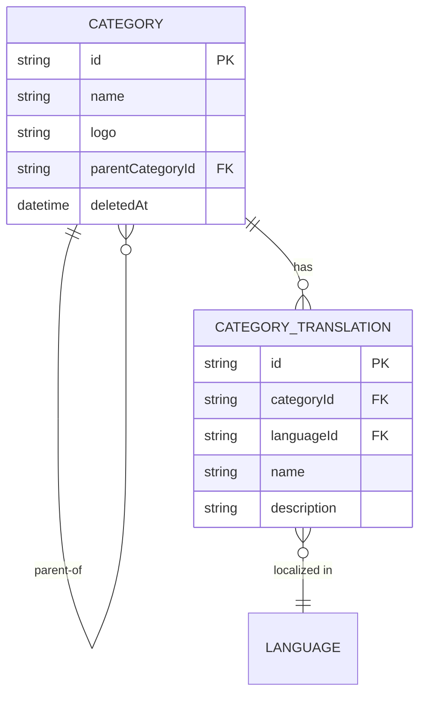

<!-- layout-exempt: rebuild-spec owns all docs/system|features|generated|flows paths -->
<!-- Contract: references/feature-spec-researcher-contract.md -->

# F003_CategoryCatalogManagement — Thông số kỹ thuật

**Độ ưu tiên**: P1
**Loại**: ui
**Được tạo**: 2026-09-12

**Xem thêm:** [`functional-spec.vi.md`](./functional-spec.vi.md) — tổng quan bằng ngôn ngữ đơn giản,
những quyết định còn bỏ ngỏ, yêu cầu/quy tắc nghiệp vụ viết gọn từng dòng, màn hình, user story,
kịch bản, trường hợp biên và cấu hình — dành cho Dev/QA/SA.

**Cách đọc file này:** § 2 là mục lục — chọn hành động bạn cần xem rồi đọc trọn khối tương ứng
trong § 3 từ đầu đến cuối; mỗi khối là một luồng hoàn chỉnh. § 4 là phụ lục dùng chung — chỉ
nhảy vào đó khi một khối ở § 3 dẫn bạn tới.

## 1. Tổng quan kỹ thuật

`CategoryController` cung cấp 5 handler REST (list/detail/create/update/delete) trên một
model Prisma tự tham chiếu `Category`, chuyển thẳng qua một `CategoryService` mỏng xuống
`CategoryRepository` — nơi giữ toàn bộ logic kiểm tra quy tắc nghiệp vụ và ánh xạ lỗi Prisma. Mọi
route đều cần token `Bearer` qua guard mặc định toàn app `AuthorizationHeaderGuard`/`AccessTokenGuard`
— không route nào gắn `@IsPublicApi()` — và theo seed quyền role→module, cả hai role `admin` và
`client` hiện đều qua được kiểm tra quyền per-route giống hệt nhau (xem § 4.4 A0 và
functional-spec.md § 11 RISK-03).

## 2. Mục lục hành động

| # | Hành động (handler) | Method · Path | Mã | Ghi | Chi tiết |
|---|---|---|---|---|---|
| **A0** | *cross-cutting — không thuộc riêng hành động nào* | — | FR-601 | — | § 4.4 |
| **A1** | `CategoryController#getAllCategories` | `GET` `/categories` | FR-101, FR-201, FR-401, BR-003, BR-004, US020 | — *(read-only)* | § 3.1 |
| **A2** | `CategoryController#getCategoryById` | `GET` `/categories/:id` | FR-101, FR-202, BR-003, BR-004, US021 | — *(read-only)* | § 3.1 |
| **A3** | `CategoryController#createCategory` | `POST` `/categories` | FR-001, FR-301, BR-001, BR-003, US022 | `category` | § 3.2 |
| **A4** | `CategoryController#updateCategory` | `PUT` `/categories/:id` | FR-001, FR-302, BR-001, BR-002, US023 | `category` | § 3.2 |
| **A5** | `CategoryController#deleteCategory` | `DELETE` `/categories/:id` | FR-303, BR-003, US024 | `category` | § 3.2 |

Không hành động nào trong tính năng này ghi từ 2 bảng trở lên, cũng không có hành động nền/async
nào, nên các khối bên dưới đều không kèm `sequenceDiagram` — mỗi luồng chỉ là một request/response
đồng bộ.

## 3. Các hành động

### 3.1 CAP-01 — Duyệt danh mục

#### A1 · Danh sách danh mục
`GET` `/categories` → `` `CategoryController#getAllCategories` ``
`FR-101` `FR-201` `FR-401` · `US020`

**Ai gọi được** · bất kỳ caller đã xác thực nào có role được cấp module `CATEGORIES` (hiện tại là
`admin` và `client`) *(gate A0 — § 4.4)*
**Request** · query `parentCategoryId` *(UUID, tùy chọn)* — nếu có, chỉ lấy các danh mục con trực
tiếp của danh mục đó; `languageId` được suy ra từ locale của caller (`CurrentLang`, tùy chọn) sẽ
quyết định trả về bản dịch nào
**BE** · `` `CategoryService#getAllCategories` `` → `` `CategoryRepository#findAllCategories` ``
— `src/routes/category/category.service.ts:25-38`
**Quy tắc** · quyết định danh mục nào hợp lệ: loại các row đã xóa mềm và, khi có truyền vào, chỉ
lấy con trực tiếp của một cha.
- **BR-003 — Danh mục đã xóa mềm bị loại khỏi mọi lượt đọc.** `deletedAt: null` áp dụng cho cả
  query này lẫn phần `parentCategory`/`childrenCategories` lồng bên trong cùng danh mục.
  *(§ 4.4)*
- **BR-004 — Bản dịch trả về chỉ gói gọn trong ngôn ngữ mà caller yêu cầu.** Khi xác định được
  ngôn ngữ, chỉ row bản dịch của ngôn ngữ đó được trả về; ngược lại trả về mọi row bản dịch chưa
  bị xóa. *(§ 4.4)*
**Kết quả** · read-only — **không ghi DB**. Trả về mọi danh mục khớp điều kiện (kèm bản dịch,
cha, con trực tiếp), bọc trong `{data, totalCount}`.
**Nguồn:** `src/routes/category/category.controller.ts:46-61` → `src/routes/category/category.service.ts:25-38` →
`src/repositories/category/category.repository.ts:32-58`

<!-- No diagram: below threshold — single read-only query, synchronous, no branching table. -->

---

#### A2 · Lấy danh mục theo ID
`GET` `/categories/:id` → `` `CategoryController#getCategoryById` ``
`FR-101` `FR-202` · `US021`

**Ai gọi được** · bất kỳ caller đã xác thực nào có role được cấp module `CATEGORIES` *(gate A0)*
**Request** · path `id` *(UUID, `ParseUUIDPipe`)*; `languageId` suy ra từ locale của caller
(tùy chọn)
**BE** · `` `CategoryService#getCategoryById` `` → `` `CategoryRepository#findCategoryById` `` —
`src/routes/category/category.service.ts:47-60`
**Quy tắc** · cùng cách loại xóa mềm (BR-003) và giới hạn ngôn ngữ (BR-004) như A1, chỉ khác là
khớp đúng một ID. *(§ 4.4)*
**Kết quả** · read-only — **không ghi DB**. Trả về chi tiết danh mục khớp, hoặc 404 nếu ID không
trỏ tới row nào chưa bị xóa.
**Nguồn:** `src/routes/category/category.controller.ts:79-89` → `src/routes/category/category.service.ts:47-60` →
`src/repositories/category/category.repository.ts:68-97`

<!-- No diagram: below threshold — single read-only query, synchronous. -->

---

### 3.2 CAP-02 — Quản lý danh mục

#### A3 · Tạo danh mục
`POST` `/categories` → `` `CategoryController#createCategory` ``
`FR-001` `FR-301` · `US022`

**Ai gọi được** · bất kỳ caller đã xác thực nào có role được cấp module `CATEGORIES` — **ở mức
code không giới hạn riêng cho `admin`** *(gate A0; xem § 4.4 A0 và functional-spec.md § 11
RISK-03)*
**Request** · body `name` *(string, 1-255 ký tự)*, `logo` *(URL, tùy chọn)*, `parentCategoryId`
*(UUID, tùy chọn)*, `categoryTranslationIds` *(UUID[], tùy chọn)*
**BE** · `` `CategoryService#createCategory` `` → `` `CategoryRepository#createCategory` `` —
`src/routes/category/category.service.ts:69-85`
**Quy tắc**
- **BR-001 — Mỗi mục trong `categoryTranslationIds` phải trỏ tới một row `CategoryTranslation`
  đang tồn tại và chưa xóa.** `validateCategoryTranslations` đếm lại số row khớp và từ chối (400)
  nếu số lượng thiếu. *(§ 4.4)*
- **BR-003 — nhắc lại** — cùng cách giới hạn xóa mềm như A1, áp dụng cho `parentCategory`/
  `childrenCategories` trả về. *(§ 4.4)*
**Kết quả**
- Ghi `category` ← `name`/`logo`/`parentCategoryId` từ request, `createdById` ← user ID của
  caller — `src/repositories/category/category.repository.ts:126-171`
- Nối (không tạo mới) các `categoryTranslationIds` được liệt kê vào row mới qua quan hệ
  `categoryTranslations`.
- 422 `"Category is already exists."` khi bắt được lỗi unique-constraint — `[INFERRED]` hiện
  không thể xảy ra vì `Category.name` chưa có unique index nào (xem § 5.3, functional-spec.md
  § 11 RISK-04).
**Nguồn:** `src/routes/category/category.controller.ts:99-109` → `src/routes/category/category.service.ts:69-85` →
`src/repositories/category/category.repository.ts:126-171`

<!-- No diagram: below threshold — single table write, synchronous, no queue/job. -->

---

#### A4 · Cập nhật danh mục
`PUT` `/categories/:id` → `` `CategoryController#updateCategory` ``
`FR-001` `FR-302` · `US023`

**Ai gọi được** · bất kỳ caller đã xác thực nào có role được cấp module `CATEGORIES` *(gate A0;
xem RISK-03)*
**Request** · path `id` *(UUID)*; body — `name`/`logo`/`parentCategoryId`/`categoryTranslationIds`
theo dạng partial (tất cả đều tùy chọn)
**BE** · `` `CategoryService#updateCategory` `` → `` `CategoryRepository#updateCategory` `` —
`src/routes/category/category.service.ts:95-114`
**Quy tắc**
- **BR-001 — nhắc lại** (giống A3: mọi liên kết bản dịch phải tồn tại và chưa bị xóa). *(§ 4.4)*
- **BR-002 — Một danh mục không thể tự đặt chính nó làm cha.** Repository từ chối (422 `"A
  category cannot be its own parent."`) khi `id === parentCategoryId` — đây chỉ là **kiểm tra
  tham chiếu trực tiếp**, không duyệt cả cây phân cấp, nên một vòng lặp nhiều cấp (A→B→A) sẽ
  không bị bắt (xem functional-spec.md § 11 RISK-02). `src/repositories/category/category.repository.ts:196-201`
**Kết quả**
- Ghi `category` ← các field partial được truyền, `updatedById` ← user ID của caller —
  `src/repositories/category/category.repository.ts:203-213`
- Nối lại các `categoryTranslationIds` được liệt kê vào row này.
- 404 `"Category not found"` khi ID không trỏ tới row nào chưa xóa; 422 `"Category with this name
  already exists."` khi bắt được lỗi unique-constraint — `[INFERRED]` hiện không thể xảy ra, lý do
  giống A3.
**Nguồn:** `src/routes/category/category.controller.ts:125-138` → `src/routes/category/category.service.ts:95-114` →
`src/repositories/category/category.repository.ts:182-238`

<!-- No diagram: below threshold — single table write, synchronous. -->

---

#### A5 · Xóa danh mục
`DELETE` `/categories/:id` → `` `CategoryController#deleteCategory` ``
`FR-303` · `US024`

**Ai gọi được** · bất kỳ caller đã xác thực nào có role được cấp module `CATEGORIES` *(gate A0;
xem RISK-03)*
**Request** · path `id` *(UUID)*
**BE** · `` `CategoryService#deleteCategory` `` → `` `CategoryRepository#deleteCategory` `` —
`src/routes/category/category.service.ts:122-134`
**Quy tắc** · **BR-003 — nhắc lại** (xóa mềm, cùng nhóm quy tắc với A1/A2/A3). Xóa ở đây là một
lần update mềm, không bao giờ xóa vật lý row đó.
**Kết quả**
- Ghi `category.deletedAt` ← timestamp hiện tại, `category.updatedById`/`category.deletedById`
  ← user ID của caller — `src/repositories/category/category.repository.ts:254-263`
- 404 `"Category not found"` khi ID không trỏ tới row nào hiện còn chưa xóa.
**Nguồn:** `src/routes/category/category.controller.ts:154-165` → `src/routes/category/category.service.ts:122-134` →
`src/repositories/category/category.repository.ts:247-281`

<!-- No diagram: below threshold — single table write, synchronous. -->

### 3.3 Trường hợp biên

| Hành động | Kịch bản | Hành vi |
|---|---|---|
| A1 | Giá trị query `parentCategoryId` không phải UUID hợp lệ | 400 — DTO validation chặn trước khi tới repository |
| A2, A4, A5 | `id` không trỏ tới danh mục nào chưa xóa | 404 `"Category not found"` (nhánh `isRecordNotFoundPrismaError`) |
| A3 | `categoryTranslationIds` có ID không tồn tại hoặc đã xóa mềm | 400 `"Some category translations do not exist."` |
| A4 | `parentCategoryId` trùng với `id` của chính danh mục đó | 422 `"A category cannot be its own parent."` |
| A3, A4 | Prisma báo lỗi unique-constraint khi ghi danh mục | 422 `"Category is already exists."`/`"Category with this name already exists."` — `[INFERRED]` hiện không thể xảy ra, `Category.name` chưa có unique index |
| A1-A5 | Caller không có token `Bearer`, hoặc role của token không được cấp module `CATEGORIES` | 401 (token thiếu/sai/hết hạn) hoặc 403 (module chưa được cấp) — xem A0 § 4.4 |

## 4. Nền tảng dùng chung

### 4.1 Thành phần

| Thành phần | Trách nhiệm | Dùng ở | File |
|---|---|---|---|
| `CategoryController` | Điểm vào HTTP cho cả 5 route danh mục | A1-A5 | `src/routes/category/category.controller.ts` |
| `CategoryService` | Lớp điều phối mỏng giữa controller và repository | A1-A5 | `src/routes/category/category.service.ts` |
| `CategoryRepository` | Truy vấn Prisma, ánh xạ lỗi, thực thi BR-001/002/003 | A1-A5 | `src/repositories/category/category.repository.ts` |
| `createCategoryWithTranslationsSelect` (selector) | Dựng shape `select` Prisma dùng chung (cha/con/bản dịch, giới hạn theo ngôn ngữ), tái dùng cho mọi thao tác đọc và ghi | A1-A5 | `src/selectors/category.selector.ts` |

### 4.2 Data Model



| Entity | Bảng | Dùng để | Hành động |
|---|---|---|---|
| `Category` | `category` | thực thể phân cấp tự tham chiếu mà tính năng này sở hữu | A1-A5 |
| `CategoryTranslation` | `category_translation` | tên/mô tả đã dịch, gắn với một danh mục (nội dung do F004 sở hữu, ở đây chỉ nối/đọc) | A1-A4 |
| `Language` | `language` | xác định locale bản dịch mà caller yêu cầu (do F004 sở hữu) | A1, A2 |

#### Hành vi đa hình

N/A — Key Entities không có discriminator field nào (`entities.md` § MODEL011_Category và §
MODEL012_CategoryTranslation đều ghi `Discriminator Fields: None.`).

### 4.3 Quản lý state

Không có.

### 4.4 Quy tắc dùng chung

#### Bin 3 — cross-cutting, không thuộc riêng hành động nào

**A0 · `FR-601` — Mọi endpoint danh mục đều cần access token `Bearer` hợp lệ; guard mặc định
toàn app `AuthorizationHeaderGuard`/`AccessTokenGuard` áp dụng vì
`src/routes/category/category.controller.ts` không đặt `@IsPublicApi()` ở đâu cả.**
Được thực thi trên toàn app (PERM001/PERM002 route-guard mặc định, PERM003 tra bảng quyền
per-route) — **áp dụng cho cả 70 route**, không riêng gì màn hình này; đây không phải quy tắc do
tính năng này tự đặt ra. Row quyền per-route của mọi route `/categories` đều mang module
`CATEGORIES`, được suy ra từ segment đầu tiên trong URL (`path.split("/")[1].toUpperCase()`);
seed role→module cấp `CATEGORIES` cho **cả** `admin` và `client` (PERM005) — cả 4 method HTTP,
vì seed chỉ lọc theo tên module chứ không theo method (xem functional-spec.md § 11 RISK-03). Khi
thất bại: 401 (token thiếu/sai/hết hạn) trước khi vào tới handler, hoặc 403 (token hợp lệ nhưng
danh sách module được cấp của role không có `CATEGORIES`).
**Nguồn:** `src/shared/guards/access-token.guard.ts:56-99` ·
`initial-scripts/create-permission.ts:56-59,158-169` · route-list.md ROUTE021-ROUTE025

#### Bin 2 — dùng ở từ 2 hành động trở lên

**BR-001 — Mỗi mục trong `categoryTranslationIds` phải trỏ tới một row `CategoryTranslation`
đang tồn tại và chưa bị xóa.**
Dùng ở: **A3** · **A4**. `validateCategoryTranslations` truy vấn lại các ID được truyền và từ
chối (400 `"Some category translations do not exist."`) khi số row trả về ít hơn số ID yêu cầu —
một ID bản dịch đã xóa mềm cũng fail kiểm tra này, vì query lọc `deletedAt: null`.
**Nguồn:** `src/repositories/category/category.repository.ts:99-116`
```text
function validateCategoryTranslations(ids):
  existing = CategoryTranslation.findMany({ id in ids, deletedAt: null })
  if existing.length != ids.length:
    throw BadRequest("Some category translations do not exist.")
```

**BR-003 — Danh mục đã xóa mềm bị loại khỏi mọi lượt đọc, và xóa ở đây là một update mềm.**
Dùng ở: **A1** · **A2** · **A3** · **A5**. Mọi query list/detail đều lọc `deletedAt: null`, và
cùng bộ lọc đó áp dụng cho phần `parentCategory`/`childrenCategories` lồng bên trong — một danh
mục bị xóa mềm sẽ biến mất khỏi danh sách con của cha cũ và khỏi field `parentCategory` của các
con của chính nó. `deleteCategory` không bao giờ xóa vật lý row; nó chỉ set
`deletedAt`/`updatedById`/`deletedById`.
**Nguồn:** `src/repositories/category/category.repository.ts:40-49,76-79,254-263` ·
`src/selectors/category.selector.ts:20-38`

**BR-004 — Bản dịch trả về chỉ gói gọn trong ngôn ngữ mà caller yêu cầu.**
Dùng ở: **A1** · **A2**. `createCategoryWithTranslationsSelect` lọc `categoryTranslations` theo
`languageId` khi locale suy ra của caller không phải sentinel `ALL_LANGUAGES`; nếu không thì trả
về mọi row bản dịch chưa xóa. Nội dung bản dịch do F004 (Catalog Localization) sở hữu — tính năng
này chỉ dùng lại selector đó.
**Nguồn:** `src/selectors/category.selector.ts:13-26`

### 4.5 Thuật toán & Tích hợp

Không có — chỉ là CRUD chạy trên Postgres qua Prisma; không gọi service ngoài, không có thuật
toán tính toán nào ngoài các query đơn giản đã nêu ở § 3 và § 4.4.

### 4.6 Cấu hình

N/A — không có cấu hình kỹ thuật nào ngoài mặc định của framework.

**Hành vi phía client:** xem
[`behavior-logic.vi.md`](../../generated/behavior-logic.vi.md) (pattern phía client — debounce, optimistic UI, polling, upload, realtime),
[`permissions.vi.md`](../../system/permissions.vi.md) (feature flag / thử nghiệm / env / locale gate),
[`screen-flow.vi.md`](../../generated/screen-flow.vi.md) (guard / khôi phục state qua deep-link / bảo vệ thay đổi chưa lưu).

Cả ba mục đều `N/A` với tính năng này — backend thuần, không có code phía client, cũng không có
feature-flag/thử nghiệm/env/locale gate nào trên bất kỳ route danh mục nào.

## 5. Xác minh & Ghi chú kỹ thuật

### 5.1 Xác minh kỹ thuật

- **SC-001** *(A1, A2)* Mọi danh mục trả về cho bất kỳ caller nào đều loại trừ row đã xóa mềm và
  mọi liên kết cha/con đã xóa mềm (bao phủ FR-201, FR-202, BR-003).
- **SC-002** *(A3, A4)* Request create/update nếu chỉ định `categoryTranslationIds` không tồn tại
  hoặc đã xóa mềm sẽ bị từ chối với 400 (bao phủ FR-301, FR-302, BR-001).
- **SC-003** *(A4)* Request update đặt `parentCategoryId` trùng `id` của chính danh mục đó sẽ bị
  từ chối với 422 (bao phủ FR-302, BR-002).
- **SC-004** *(A1-A5)* Request không có token `Bearer`, hoặc token có role không được cấp module
  `CATEGORIES`, sẽ không bao giờ tới được thân handler (bao phủ FR-601).

#### US020_ViewCategoryList *(A1)*

**Independent Test:** Gọi `GET /categories` với token `Bearer` hợp lệ, role được cấp
`CATEGORIES`; kiểm tra response `data` không chứa danh mục nào có `deletedAt` được set.

**Acceptance Scenarios:**

1. **Given** một caller đã xác thực có quyền `CATEGORIES`, **When** gọi `GET /categories` không
   kèm filter, **Then** response là `{data, totalCount}` chứa mọi danh mục chưa xóa.
2. **Given** giá trị query `parentCategoryId`, **When** gọi `GET
   /categories?parentCategoryId=...`, **Then** chỉ trả về con trực tiếp của danh mục đó.

#### US021_ViewCategoryDetail *(A2)*

**Independent Test:** Gọi `GET /categories/:id` với một ID danh mục chưa xóa đã biết trước; kiểm
tra response có `parentCategory`/`childrenCategories`/`categoryTranslations`.

**Acceptance Scenarios:**

1. **Given** một ID danh mục hợp lệ, chưa xóa, **When** gọi `GET /categories/:id`, **Then** trả
   về đầy đủ chi tiết danh mục.
2. **Given** một ID không trỏ tới danh mục nào chưa xóa, **When** gọi `GET /categories/:id`,
   **Then** response status là 404.

#### US022_CreateCategory *(A3)*

**Independent Test:** POST một payload `{name}` hợp lệ; kiểm tra có row `category` mới với
`createdById` được set bằng user ID của caller.

**Acceptance Scenarios:**

1. **Given** một `name` hợp lệ (kèm `logo`/`parentCategoryId`/`categoryTranslationIds` tùy
   chọn), **When** gọi `POST /categories`, **Then** danh mục được tạo với `createdById` đã set.
2. **Given** một `categoryTranslationIds` không tồn tại, **When** gọi `POST /categories`,
   **Then** response status là 400.

#### US023_UpdateCategory *(A4)*

**Independent Test:** PUT một payload đổi `name` của danh mục hiện có; kiểm tra `updatedById`
thay đổi và `name` mới được lưu lại.

**Acceptance Scenarios:**

1. **Given** một payload partial hợp lệ, **When** gọi `PUT /categories/:id`, **Then** danh mục
   được cập nhật và `updatedById` được set thành caller.
2. **Given** `parentCategoryId` bằng `id`, **When** gọi `PUT /categories/:id`, **Then** response
   status là 422.

#### US024_DeleteCategory *(A5)*

**Independent Test:** DELETE một danh mục hiện có; kiểm tra `deletedAt`/`deletedById` được set và
row không còn xuất hiện trong `GET /categories`.

**Acceptance Scenarios:**

1. **Given** một ID danh mục hợp lệ, chưa xóa, **When** gọi `DELETE /categories/:id`, **Then**
   `deletedAt`/`updatedById`/`deletedById` được set và row bị loại khỏi các lượt đọc sau đó.
2. **Given** một ID không trỏ tới danh mục nào chưa xóa, **When** gọi `DELETE /categories/:id`,
   **Then** response status là 404.

### 5.2 Giả định

- *(A0)* Lần rà soát này chỉ đọc source, không chạy app, nên hiệu ứng thực tế trên traffic thật
  của quyền ghi `CATEGORIES` mà role `client` đang có (RISK-03) chỉ được ghi lại theo những gì
  thấy trong code, chưa xác nhận bằng hành vi runtime.
- *(A3, A4)* Các nhánh bắt lỗi unique-constraint của Prisma cho "Category is already exists."/
  "Category with this name already exists." được giả định là không thể xảy ra với schema hiện
  tại — đã xác nhận bằng cách grep toàn schema và không thấy unique index nào trên cột nào của
  `Category` — nhưng một migration sau này có thể thêm vào mà spec này chưa được cập nhật theo.

### 5.3 Câu hỏi chưa có lời giải

1. **Khả năng chạm unique-constraint** *(A3, A4)*: cần xác nhận có tồn tại kiểm tra unique nào ở
   tầng ứng dụng (không phải DB) ở nơi khác có thể vẫn kích hoạt các nhánh bắt P2002 này không,
   hay chúng chỉ là dead code còn sót lại từ một migration đã lên kế hoạch nhưng chưa áp dụng.
2. **Độ sâu phân cấp** *(A3, A4)*: code không giới hạn độ sâu nesting tối đa; chưa rõ việc không
   giới hạn này là chủ ý hay đơn giản là chưa ai xử lý.

### 5.4 Tham chiếu nguồn

| Hành động | Thứ tự | Symbol | Path | Mục đích |
|---|---|---|---|---|
| — | 1 | `Category` (model) | `prisma/schema.prisma:282-304` | thực thể tự tham chiếu mà tính năng này xoay quanh |
| A1-A5 | 2 | `CategoryController` | `src/routes/category/category.controller.ts:1-166` | điểm vào HTTP cho cả 5 route |
| A1-A5 | 3 | `CategoryService` | `src/routes/category/category.service.ts:1-135` | lớp điều phối mỏng |
| A1-A5 | 4 | `CategoryRepository` | `src/repositories/category/category.repository.ts:1-282` | truy vấn Prisma + thực thi BR-001/002/003 |
| A1, A2 | 5 | `createCategoryWithTranslationsSelect` | `src/selectors/category.selector.ts:1-39` | shape projection dùng chung cho đọc/ghi |
| A0 | 6 | `AccessTokenGuard` | `src/shared/guards/access-token.guard.ts:1-99` | thực thi `Bearer` + quyền per-route |

#### Data Flow

```text
{POST body: name, logo?, parentCategoryId?, categoryTranslationIds?}
  -> CategoryController#createCategory (src/routes/category/category.controller.ts:99-109)
  -> CategoryService#createCategory (src/routes/category/category.service.ts:69-85)
  -> CategoryRepository#createCategory (src/repositories/category/category.repository.ts:126-171)
       -> validateCategoryTranslations (BR-001 check, :99-116)
       -> prisma.category.create (write `category`, connect translations)
  -> CategoryWithChildrenCategoriesResponseDto (controller response)
```

### 5.5 Tham chiếu Artifact

| Artifact | File | Mã đã dùng | Đã review |
|----------|------|------------|----------|
| System Overview | [system-overview.md](../../system-overview.md) | — | [x] |
| Feature List | [feature-list.md](../../feature-list.md) | F003 | [x] |
| API Map | [route-list.md](../../route-list.md) | ROUTE021, ROUTE022, ROUTE023, ROUTE024, ROUTE025 | [x] |
| Entities | [entities.md](../../entities.md) | MODEL011, MODEL012 | [x] |
| Screens | [functional-spec.md § 6](./functional-spec.vi.md#6-screens) | — | [x] |
| Behavior Logic | [behavior-logic.md](../../behavior-logic.md) | — | [x] |
| Permissions Matrix | [permissions-matrix.md](../../permissions-matrix.md) | PERM005 | [x] |
| User Stories | [user-stories.md](../../user-stories.md) | US020, US021, US022, US023, US024 | [x] |

**Rule:** Mọi mã liệt kê trong cột Mã đã dùng đều tồn tại trong artifact nguồn của nó;
`ROUTE021-ROUTE025` khớp với cột `Code` trong `route-list.md` có `Owner F###` = F003.
