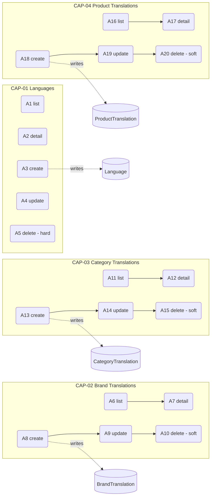
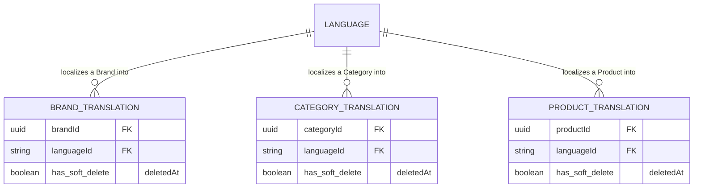

<!-- layout-exempt: rebuild-spec owns all docs/system|features|generated|flows paths -->
<!-- Contract: references/feature-spec-researcher-contract.md -->

# F004_CatalogLocalization — Technical Spec

**Priority**: P2
**Type**: ui
**Generated**: 2026-09-12

**See also:** [`functional-spec.md`](./functional-spec.md) — plain-language overview, open
decisions, requirements/business rules stated in one-liners, screens, user stories, scenarios,
edge cases, and configuration for a BA/QA audience.

**How to read this file:** § 2 is the index — pick the action you care about and read its block
in § 3 straight through; each block is one complete thread, top to bottom. § 4 is the shared
appendix — jump in only when a § 3 block points you there.

## 1. Technical Overview

Four sibling NestJS module families — `Language`, `BrandTranslation`, `CategoryTranslation`,
`ProductTranslation` — each a thin controller → service → repository CRUD stack over its own
Prisma model. All 20 actions are synchronous, single-table writes with no background step and no
action writing to more than one table, so no action in this file crosses the diagram threshold.
The shared shape across the three `*Translation` families: a `(parentId, languageId)` pair must be
unique among non-deleted rows (enforced by a hand-written PostgreSQL partial unique index, not a
Prisma-schema `@@unique`), the parent entity is app-validated before write, and delete is a
soft-delete. `Language` breaks that shape twice: its create route path is irregular
(`POST /languages/create`), and its delete is a hard Prisma `.delete()`.



## 2. Action Index

| # | Action (handler) | Method · Path | Codes | Writes | Detail |
|---|---|---|---|---|---|
| **A0** | *cross-cutting — belongs to no single action* | — | FR-001, FR-601, FR-602, BR-002, BR-003 | — | § 4.4 |
| **A1** | `LanguageController#getLanguages` | `GET` `/languages` | FR-201, US030 | — *(read-only)* | § 3.1 |
| **A2** | `LanguageController#getLanguageById` | `GET` `/languages/:id` | FR-202, US031 | — *(read-only)* | § 3.1 |
| **A3** | `LanguageController#createLanguage` | `POST` `/languages/create` | FR-203, US032 | `language` | § 3.1 |
| **A4** | `LanguageController#updateLanguage` | `PUT` `/languages/:id` | FR-204, US033 | `language` | § 3.1 |
| **A5** | `LanguageController#deleteLanguage` | `DELETE` `/languages/:id` | FR-205, BR-004, US034 | `language` | § 3.1 |
| **A6** | `BrandTranslationController#getBrandTranslations` | `GET` `/brand-translations` | FR-301, US015 | — *(read-only)* | § 3.2 |
| **A7** | `BrandTranslationController#getBrandTranslationById` | `GET` `/brand-translations/:id` | FR-302, US016 | — *(read-only)* | § 3.2 |
| **A8** | `BrandTranslationController#createBrandTranslation` | `POST` `/brand-translations` | FR-303, BR-001, BR-002, US017 | `brandTranslation` | § 3.2 |
| **A9** | `BrandTranslationController#updateBrandTranslation` | `PUT` `/brand-translations/:id` | FR-304, BR-001, BR-002, US018 | `brandTranslation` | § 3.2 |
| **A10** | `BrandTranslationController#deleteBrandTranslation` | `DELETE` `/brand-translations/:id` | FR-305, US019 | `brandTranslation` | § 3.2 |
| **A11** | `CategoryTranslationController#getCategoryTranslations` | `GET` `/category-translations` | FR-401, US025 | — *(read-only)* | § 3.3 |
| **A12** | `CategoryTranslationController#getCategoryTranslationById` | `GET` `/category-translations/:id` | FR-402, US026 | — *(read-only)* | § 3.3 |
| **A13** | `CategoryTranslationController#createCategoryTranslation` | `POST` `/category-translations` | FR-403, BR-001, BR-002, US027 | `categoryTranslation` | § 3.3 |
| **A14** | `CategoryTranslationController#updateCategoryTranslation` | `PUT` `/category-translations/:id` | FR-404, BR-001, BR-002, US028 | `categoryTranslation` | § 3.3 |
| **A15** | `CategoryTranslationController#deleteCategoryTranslation` | `DELETE` `/category-translations/:id` | FR-405, US029 | `categoryTranslation` | § 3.3 |
| **A16** | `ProductTranslationController#getProductTranslations` | `GET` `/product-translations` | FR-501, US045 | — *(read-only)* | § 3.4 |
| **A17** | `ProductTranslationController#getProductTranslationById` | `GET` `/product-translations/:id` | FR-502, US046 | — *(read-only)* | § 3.4 |
| **A18** | `ProductTranslationController#createProductTranslation` | `POST` `/product-translations` | FR-503, BR-001, BR-002, US047 | `productTranslation` | § 3.4 |
| **A19** | `ProductTranslationController#updateProductTranslation` | `PUT` `/product-translations/:id` | FR-504, BR-001, BR-002, US048 | `productTranslation` | § 3.4 |
| **A20** | `ProductTranslationController#deleteProductTranslation` | `DELETE` `/product-translations/:id` | FR-505, US049 | `productTranslation` | § 3.4 |

FR-101 (headless, no navigation) and FR-551 (no cross-capability interaction) are stated only in
`functional-spec.md` — neither names a concrete action or DB write, so neither claims a row here.

## 3. Actions

### 3.1 CAP-01 — Manage Supported Languages

#### A1 · List languages
`GET` `/languages` → `` `LanguageController#getLanguages` ``
`FR-201` · `US030`

**Who** · admin *(gate A0 — § 4.4)*
**BE** · `` `LanguageService#getLanguages` `` paginates + filters by name (case-insensitive
`contains`) — `src/routes/language/language.service.ts:29-66`
**Rule** · no guard beyond A0's `Bearer`/role gate — plain paginated read.
**Result** · read-only — **no DB write**. Returns `{ data, pagination }` via `PageDto`.
**Source:** `src/routes/language/language.controller.ts:38-51` → `src/routes/language/language.service.ts:29-66` → `src/repositories/language/language.repository.ts:29-67`

---

#### A2 · Get language by ID
`GET` `/languages/:id` → `` `LanguageController#getLanguageById` ``
`FR-202` · `US031`

**Who** · admin *(gate A0)*
**Request** · path param `id` (the 2-char locale code)
**BE** · `` `LanguageRepository#findUniqueLanguage` `` — `src/repositories/language/language.repository.ts:75-101`
**Rule** · `findUniqueOrThrow` filtered on `deletedAt: null`.
**Result** · read-only — **no DB write**. 404 when the code doesn't resolve to a live row.
**Source:** `src/routes/language/language.controller.ts:53-65` → `src/repositories/language/language.repository.ts:75-101`

---

#### A3 · Create language *(irregular path)*
`POST` `/languages/create` → `` `LanguageController#createLanguage` ``
`FR-203` · `US032`

**Who** · admin *(gate A0)*
**Request** · body `{ id (2-char code), name }` — `src/dtos/language/language.dto.ts:22-44`
**BE** · `` `LanguageRepository#createLanguage` `` — `src/repositories/language/language.repository.ts:111-149`
**Rule** · **`id` is a natural-key column** (`prisma/schema.prisma:15`, `@id @db.VarChar(10)`), not
a generated UUID — a second create with the same code is rejected as a primary-key collision, the
same shape as any other unique-constraint hit. The route path itself is also the one irregular
surface in this feature: every other create lives at the plural collection path, this one lives at
`/languages/create` (`src/routes/language/language.controller.ts:67`, `route-list.md` ROUTE033).
**Result** · Writes `language` (id, name, createdById) — `src/repositories/language/language.repository.ts:111-124`.
**Source:** `src/routes/language/language.controller.ts:67-82` → `src/repositories/language/language.repository.ts:111-149`

---

#### A4 · Update language
`PUT` `/languages/:id` → `` `LanguageController#updateLanguage` ``
`FR-204` · `US033`

**Who** · admin *(gate A0)*
**Request** · path param `id`; body `{ name }` — `src/dtos/language/language.dto.ts:46-58`
**BE** · `` `LanguageRepository#updateLanguageById` `` — `src/repositories/language/language.repository.ts:151-201`
**Rule** · no guard beyond A0 — a plain field update, filtered on `deletedAt: null`.
**Result** · Writes `language.name`, `language.updatedById` — `src/repositories/language/language.repository.ts:159-169`.
**Source:** `src/routes/language/language.controller.ts:84-104` → `src/repositories/language/language.repository.ts:151-201`

---

#### A5 · Delete language *(hard delete)*
`DELETE` `/languages/:id` → `` `LanguageController#deleteLanguage` ``
`FR-205` · `US034`

**Who** · admin *(gate A0)*
**BE** · `` `LanguageRepository#deleteLanguageById` `` — `src/repositories/language/language.repository.ts:203-252`
**Rule**

| DEC | subtype | Condition | What the user sees | Source |
|---|---|---|---|---|
| n/a | — | — | — | — |

No DEC applies — this is a single unconditional write, not a branch. **BR-004 — Language
deletion is a permanent hard delete, unlike every other entity in this feature.** The method calls
`prismaService.language.delete(...)` (`src/repositories/language/language.repository.ts:213-219`); a soft-delete block
(`update` with `deletedAt`) sits immediately after it, fully commented out
(`src/repositories/language/language.repository.ts:222-233`), with an inline Vietnamese comment explaining why: `id` is the
primary key itself (not a UUID), so a partial-unique-on-`deletedAt` soft-delete pattern (as used by
the other three entities in this feature) cannot apply to a natural-key PK without allowing
duplicate codes to coexist. This makes the hard delete a deliberate design constraint, not an
oversight. *(§ 4.4)*
**Result** · **Hard-deletes** the `language` row. Cascades (`onDelete: Cascade` on each
`languageId` FK) to every `UserTranslation`/`ProductTranslation`/`CategoryTranslation`/
`BrandTranslation` row still pointing at it (`prisma/schema.prisma:15-33` + each translation
model's `language` relation) — see RISK-03 in `functional-spec.md § 11`.
**Source:** `src/routes/language/language.controller.ts:106-120` → `src/repositories/language/language.repository.ts:203-252`

### 3.2 CAP-02 — Manage Brand Translations

#### A6 · List brand translations
`GET` `/brand-translations` → `` `BrandTranslationController#getBrandTranslations` ``
`FR-301` · `US015`

**Who** · admin *(gate A0)*
**BE** · `` `BrandTranslationService#getBrandTranslations` `` — same paginate/keyword-filter shape
as A1 — `src/routes/brand-translation/brand-translation.service.ts:48-87`
**Rule** · no guard beyond A0.
**Result** · read-only — **no DB write**.
**Source:** `src/routes/brand-translation/brand-translation.controller.ts:36-47` → `src/routes/brand-translation/brand-translation.service.ts:48-87` → `src/repositories/brand-translation/brand-translation.repository.ts:32-75`

---

#### A7 · Get brand translation by ID
`GET` `/brand-translations/:id` → `` `BrandTranslationController#getBrandTranslationById` ``
`FR-302` · `US016`

**Who** · admin *(gate A0)*
**Request** · path param `id` (UUID, `ParseUUIDPipe`)
**BE** · `` `BrandTranslationRepository#findUniqueBrandTranslation` `` — `src/repositories/brand-translation/brand-translation.repository.ts:83-107`
**Result** · read-only — **no DB write**. 404 when not found or soft-deleted. Response includes
the joined `brand` and `language` (`src/selectors/brand-translation.selector.ts`, response shaped by
`BrandTranslationWithBrandAndLanguageResponseDto`).
**Source:** `src/routes/brand-translation/brand-translation.controller.ts:56-69` → `src/repositories/brand-translation/brand-translation.repository.ts:83-107`

---

#### A8 · Create brand translation
`POST` `/brand-translations` → `` `BrandTranslationController#createBrandTranslation` ``
`FR-303` · `BR-001` `BR-002` · `US017`

**Who** · admin *(gate A0)*
**Request** · body `{ name, description, languageId, brandId }` — `src/dtos/brand-translation/brand-translation.dto.ts:72-113`
**BE** · `` `BrandTranslationService#createBrandTranslation` `` — `src/routes/brand-translation/brand-translation.service.ts:21-39`
**Rule**
- **BR-002 — The target brand must exist (and not be deleted) before a translation can be
  created for it.** `validateBrand(data.brandId)` runs first and throws 404 if the brand is
  missing — `src/repositories/brand-translation/brand-translation.repository.ts:115-138`, called from `src/routes/brand-translation/brand-translation.service.ts:29`. *(§ 4.4)*
- **BR-001 — A brand cannot carry two live translations in the same language.** Enforced by the
  `BrandTranslation_languageId_brandId_unique` partial unique index (`WHERE deletedAt IS NULL`),
  created by migration `20250608153843_create_partial_index_brand_and_brand_translation` — not a
  Prisma-schema `@@unique`, so Prisma's own type layer has no static knowledge of it; the
  repository catches the resulting `P2002` at runtime. *(§ 4.4)*
**Result** · Writes `brandTranslation` (name, description, languageId, brandId, createdById) —
`src/repositories/brand-translation/brand-translation.repository.ts:146-159`. **[UNVERIFIED]** the create-path unique-violation
message reads `` `Brand translation with name "${data.name}" already exists.` `` (`src/repositories/brand-translation/brand-translation.repository.ts:166`) — this names the wrong field; the real constraint is on (brandId, languageId), not name. See RISK-01.
**Source:** `src/routes/brand-translation/brand-translation.controller.ts:71-89` → `src/routes/brand-translation/brand-translation.service.ts:21-39` → `src/repositories/brand-translation/brand-translation.repository.ts:115-185`

---

#### A9 · Update brand translation
`PUT` `/brand-translations/:id` → `` `BrandTranslationController#updateBrandTranslation` ``
`FR-304` · `BR-001` `BR-002` · `US018`

**Who** · admin *(gate A0)*
**Request** · path param `id`; body is a partial `BrandTranslationRequestDto`
**BE** · `` `BrandTranslationService#updateBrandTranslation` `` — `src/routes/brand-translation/brand-translation.service.ts:89-112`
**Rule** · **BR-002** re-runs `validateBrand` only when `brandId` is present in the payload
(`src/routes/brand-translation/brand-translation.service.ts:99-101`) — the same gloss as A8's; skipped when the update leaves
`brandId` untouched. **BR-001** — same partial-unique-index guard as A8, hit when the update
targets a `(brandId, languageId)` pair another live row already holds
(`src/repositories/brand-translation/brand-translation.repository.ts:221-226`). *(§ 4.4)*
**Result** · Writes changed fields on `brandTranslation`, plus `updatedById` —
`src/repositories/brand-translation/brand-translation.repository.ts:194-208`.
**Source:** `src/routes/brand-translation/brand-translation.controller.ts:91-111` → `src/routes/brand-translation/brand-translation.service.ts:89-112` → `src/repositories/brand-translation/brand-translation.repository.ts:194-242`

---

#### A10 · Delete brand translation *(soft delete)*
`DELETE` `/brand-translations/:id` → `` `BrandTranslationController#deleteBrandTranslation` ``
`FR-305` · `US019`

**Who** · admin *(gate A0)*
**BE** · `` `BrandTranslationRepository#deleteBrandTranslation` `` — `src/repositories/brand-translation/brand-translation.repository.ts:251-287`
**Rule** · no guard beyond A0.
**Result** · Writes `brandTranslation.deletedAt`, `deletedById`, `updatedById` — a soft delete via
`update`, not a Prisma `.delete()` (contrast A5). Row stops appearing in A6/A7 (both filter
`deletedAt: null`).
**Source:** `src/routes/brand-translation/brand-translation.controller.ts:113-131` → `src/repositories/brand-translation/brand-translation.repository.ts:251-287`

### 3.3 CAP-03 — Manage Category Translations

#### A11 · List category translations
`GET` `/category-translations` → `` `CategoryTranslationController#getCategoryTranslations` ``
`FR-401` · `US025`

**Who** · admin *(gate A0)*
**BE** · `` `CategoryTranslationService#getCategoryTranslations` `` — same paginate/keyword shape
as A1/A6 — `src/routes/category-translation/category-translation.service.ts:21-57`
**Result** · read-only — **no DB write**.
**Source:** `src/routes/category-translation/category-translation.controller.ts:40-55` → `src/routes/category-translation/category-translation.service.ts:21-57` → `src/repositories/category-translation/category-translation.repository.ts:33-77`

---

#### A12 · Get category translation by ID
`GET` `/category-translations/:id` → `` `CategoryTranslationController#getCategoryTranslationById` ``
`FR-402` · `US026`

**Who** · admin *(gate A0)*
**BE** · `` `CategoryTranslationRepository#findUniqueCategoryTranslation` `` — `src/repositories/category-translation/category-translation.repository.ts:86-110`
**Result** · read-only — **no DB write**. 404 when not found or soft-deleted. Response includes
joined `category` and `language`.
**Source:** `src/routes/category-translation/category-translation.controller.ts:64-72` → `src/repositories/category-translation/category-translation.repository.ts:86-110`

---

#### A13 · Create category translation
`POST` `/category-translations` → `` `CategoryTranslationController#createCategoryTranslation` ``
`FR-403` · `BR-001` `BR-002` · `US027`

**Who** · admin *(gate A0)*
**Request** · body `{ name, description, languageId, categoryId }` — `src/dtos/category-translation/category-translation.dto.ts:92-132`
**BE** · `` `CategoryTranslationService#createCategoryTranslation` `` — `src/routes/category-translation/category-translation.service.ts:68-86`
**Rule**
- **BR-002 — The target category must exist (and not be deleted) before a translation can be
  created for it.** `validateCategory(data.categoryId)` runs first, 404 on miss —
  `src/repositories/category-translation/category-translation.repository.ts:117-139`, called from `src/routes/category-translation/category-translation.service.ts:75`. *(§ 4.4)*
- **BR-001 — A category cannot carry two live translations in the same language.** Enforced by
  `CategoryTranslation_languageId_categoryId_unique` (migration
  `20250622070346_partial_index_category_translation`), a raw partial unique index, not a
  Prisma-schema `@@unique`. *(§ 4.4)*
**Result** · Writes `categoryTranslation` (name, description, languageId, categoryId,
createdById) — `src/repositories/category-translation/category-translation.repository.ts:148-160`. **[UNVERIFIED]** the create-path
unique-violation message reads `"Category translation with this name already exists."`
(`src/repositories/category-translation/category-translation.repository.ts:167`) — same field-naming defect as A8; see RISK-01.
**Source:** `src/routes/category-translation/category-translation.controller.ts:74-93` → `src/routes/category-translation/category-translation.service.ts:68-86` → `src/repositories/category-translation/category-translation.repository.ts:117-184`

---

#### A14 · Update category translation
`PUT` `/category-translations/:id` → `` `CategoryTranslationController#updateCategoryTranslation` ``
`FR-404` · `BR-001` `BR-002` · `US028`

**Who** · admin *(gate A0)*
**BE** · `` `CategoryTranslationService#updateCategoryTranslation` `` — `src/routes/category-translation/category-translation.service.ts:88-114`
**Rule** · **BR-002** re-validated only when `categoryId` is present in the payload
(`src/routes/category-translation/category-translation.service.ts:98-102`). **BR-001** — same unique-index guard as A13, hit on
update when the new pair collides with another live row (`src/repositories/category-translation/category-translation.repository.ts:220-225`). *(§ 4.4)*
**Result** · Writes changed fields on `categoryTranslation`, plus `updatedById` —
`src/repositories/category-translation/category-translation.repository.ts:194-207`.
**Source:** `src/routes/category-translation/category-translation.controller.ts:95-123` → `src/routes/category-translation/category-translation.service.ts:88-114` → `src/repositories/category-translation/category-translation.repository.ts:194-240`

---

#### A15 · Delete category translation *(soft delete)*
`DELETE` `/category-translations/:id` → `` `CategoryTranslationController#deleteCategoryTranslation` ``
`FR-405` · `US029`

**Who** · admin *(gate A0)*
**BE** · `` `CategoryTranslationRepository#deleteCategoryTranslation` `` — `src/repositories/category-translation/category-translation.repository.ts:249-285`
**Result** · Writes `categoryTranslation.deletedAt`, `deletedById`, `updatedById` — soft delete.
**Source:** `src/routes/category-translation/category-translation.controller.ts:125-152` → `src/repositories/category-translation/category-translation.repository.ts:249-285`

### 3.4 CAP-04 — Manage Product Translations

#### A16 · List product translations
`GET` `/product-translations` → `` `ProductTranslationController#getProductTranslations` ``
`FR-501` · `US045`

**Who** · client, seller, or admin *(gate A0 — BR-003, § 4.4)*
**BE** · `` `ProductTranslationService#getProductTranslations` `` — same paginate/keyword shape as
A1/A6/A11 — `src/routes/product-translation/product-translation.service.ts:21-58`
**Result** · read-only — **no DB write**.
**Source:** `src/routes/product-translation/product-translation.controller.ts:42-50` → `src/routes/product-translation/product-translation.service.ts:21-58` → `src/repositories/product-translation/product-translation.repository.ts:34-76`

---

#### A17 · Get product translation by ID
`GET` `/product-translations/:id` → `` `ProductTranslationController#getProductTranslationById` ``
`FR-502` · `US046`

**Who** · client, seller, or admin *(gate A0 — BR-003)*
**BE** · `` `ProductTranslationRepository#findProductTranslationById` `` — `src/repositories/product-translation/product-translation.repository.ts:85-109`
**Result** · read-only — **no DB write**. 404 when not found or soft-deleted.
**Source:** `src/routes/product-translation/product-translation.controller.ts:66-74` → `src/repositories/product-translation/product-translation.repository.ts:85-109`

---

#### A18 · Create product translation
`POST` `/product-translations` → `` `ProductTranslationController#createProductTranslation` ``
`FR-503` · `BR-001` `BR-002` · `US047`

**Who** · client, seller, or admin *(gate A0 — BR-003)*
**Request** · body `{ name, description, languageId, productId }` — `src/dtos/product-translation/product-translation.dto.ts:63-111`
**BE** · `` `ProductTranslationService#createProductTranslation` `` — `src/routes/product-translation/product-translation.service.ts:60-78`
**Rule**
- **BR-002 — The target product must exist (and not be deleted) before a translation can be
  created for it.** `validateProduct(data.productId)` runs first, 404 on miss —
  `src/repositories/product-translation/product-translation.repository.ts:118-141`, called from `src/routes/product-translation/product-translation.service.ts:68`. *(§ 4.4)*
- **BR-001 — A product cannot carry two live translations in the same language**, enforced by
  `ProductTranslation_productId_languageId_unique` (migration
  `20250625154134_partial_product_translation_and_sku`). **Unlike A8/A13, this path's own
  `create` catch block never checks `isUniqueConstraintPrismaError`**
  (`src/repositories/product-translation/product-translation.repository.ts:150-185` — only `isRecordNotFoundPrismaError` and
  `isForeignKeyConstraintPrismaError` are handled) — the database still enforces BR-001, but a
  violation here falls through to the generic 500 branch instead of the 422 every sibling create
  path returns. See RISK-02 in `functional-spec.md § 11`. *(§ 4.4)*
**Result** · Writes `productTranslation` (name, description, languageId, productId,
createdById) — `src/repositories/product-translation/product-translation.repository.ts:156-160`.
**Source:** `src/routes/product-translation/product-translation.controller.ts:76-95` → `src/routes/product-translation/product-translation.service.ts:60-78` → `src/repositories/product-translation/product-translation.repository.ts:118-185`

---

#### A19 · Update product translation
`PUT` `/product-translations/:id` → `` `ProductTranslationController#updateProductTranslation` ``
`FR-504` · `BR-001` `BR-002` · `US048`

**Who** · client, seller, or admin *(gate A0 — BR-003)*
**BE** · `` `ProductTranslationService#updateProductTranslation` `` — `src/routes/product-translation/product-translation.service.ts:87-110`
**Rule** · **BR-002** re-validated only when `productId` is present in the payload
(`src/routes/product-translation/product-translation.service.ts:97-99`). **BR-001** — same unique-index guard as A18, and unlike
A18's create path, the update path DOES catch `isUniqueConstraintPrismaError`
(`src/repositories/product-translation/product-translation.repository.ts:214-220`) and returns the standard 422. *(§ 4.4)*
**Result** · Writes changed fields on `productTranslation`, plus `updatedById` —
`src/repositories/product-translation/product-translation.repository.ts:195-208`.
**Source:** `src/routes/product-translation/product-translation.controller.ts:97-125` → `src/routes/product-translation/product-translation.service.ts:87-110` → `src/repositories/product-translation/product-translation.repository.ts:195-241`

---

#### A20 · Delete product translation *(soft delete)*
`DELETE` `/product-translations/:id` → `` `ProductTranslationController#deleteProductTranslation` ``
`FR-505` · `US049`

**Who** · client, seller, or admin *(gate A0 — BR-003)*
**BE** · `` `ProductTranslationRepository#deleteProductTranslation` `` — `src/repositories/product-translation/product-translation.repository.ts:250-286`
**Result** · Writes `productTranslation.deletedAt`, `deletedById`, `updatedById` — soft delete.
**Source:** `src/routes/product-translation/product-translation.controller.ts:127-154` → `src/repositories/product-translation/product-translation.repository.ts:250-286`

### 3.5 Edge cases

| Action | Scenario | Behavior |
|---|---|---|
| A3 | Second create with a language code already in use | Prisma primary-key collision — `LanguageRepository#createLanguage` catches `isUniqueConstraintPrismaError` and returns 422 `` `Language ${id} already exists.` `` (`src/repositories/language/language.repository.ts:130-135`) |
| A8 · A13 · A19 | Update targets a `(parent, language)` pair another live row already holds | The partial unique index rejects the write; each repository's `update` catch returns a 422 (`src/repositories/brand-translation/brand-translation.repository.ts:221-226`, `src/repositories/category-translation/category-translation.repository.ts:220-225`, `src/repositories/product-translation/product-translation.repository.ts:214-220`) |
| A18 | Create targets a `(product, language)` pair another live row already holds | Same database rejection as A8/A13, but this create catch has no `isUniqueConstraintPrismaError` branch (`src/repositories/product-translation/product-translation.repository.ts:150-185`) — falls through to the generic 500 `internal` branch instead of a 422 (RISK-02) |
| A5 | Delete of a language still referenced by translation rows | Hard delete proceeds; FK `onDelete: Cascade` on every `languageId` relation removes those translation rows too, with no confirmation (RISK-03) |
| A1-A20 | Unauthenticated call to any route in this feature | Rejected before reaching the handler — no route in this feature carries `@IsPublicApi()` (gate A0, § 4.4) |
| A1, A6, A11, A16 | Same route called by every role | List/detail routes for languages/brand-translations/category-translations 403 for client/seller (module not granted); product-translation list/detail succeed for all three roles (BR-003) |

## 4. Shared Foundation

### 4.1 Components

| Component | Responsibility | Used in | File |
|---|---|---|---|
| `LanguageController` / `LanguageService` / `LanguageRepository` | CRUD for supported locales | A1-A5 | `src/routes/language/language.controller.ts`, `src/routes/language/language.service.ts`, `src/repositories/language/language.repository.ts` |
| `BrandTranslationController` / `BrandTranslationService` / `BrandTranslationRepository` | CRUD for brand-name/description localization | A6-A10 | `src/routes/brand-translation/*`, `src/repositories/brand-translation/brand-translation.repository.ts` |
| `CategoryTranslationController` / `CategoryTranslationService` / `CategoryTranslationRepository` | CRUD for category-name/description localization | A11-A15 | `src/routes/category-translation/*`, `src/repositories/category-translation/category-translation.repository.ts` |
| `ProductTranslationController` / `ProductTranslationService` / `ProductTranslationRepository` | CRUD for product-name/description localization | A16-A20 | `src/routes/product-translation/*`, `src/repositories/product-translation/product-translation.repository.ts` |
| `AuthorizationHeaderGuard` (global `APP_GUARD`) | `Bearer`-token + role/module gate on all 20 routes | A0 (all actions) | `src/shared/guards/authorization-header.guard.ts` |

### 4.2 Data Model



| Entity | Table | Used for | Action |
|---|---|---|---|
| `Language` (MODEL001) | `language` | The supported-locale list every translation targets | A1-A5, A8, A9, A13, A14, A18, A19 |
| `BrandTranslation` (MODEL015) | `brandTranslation` | A brand's localized name/description | A6-A10 |
| `CategoryTranslation` (MODEL012) | `categoryTranslation` | A category's localized name/description | A11-A15 |
| `ProductTranslation` (MODEL010) | `productTranslation` | A product's localized name/description | A16-A20 |

#### Polymorphic Behavior

N/A — no discriminator fields in Key Entities. `docs/generated/entities.md` lists zero
`DISC-###` entries for `Language`, `BrandTranslation`, `CategoryTranslation`, or
`ProductTranslation`.

### 4.3 State Management

None. No entity in this feature carries a status/lifecycle field beyond the shared soft-delete
`deletedAt` marker (2 states, 1 transition on `BrandTranslation`/`CategoryTranslation`/
`ProductTranslation`; `Language` doesn't even have that), below the ≥3-states/≥2-transitions
threshold for a documented `SM-###`.

### 4.4 Shared Rules

#### Bin 3 — cross-cutting, belongs to no single action

**A0 · FR-601 — every one of this feature's 20 routes requires a valid `Bearer` session by
default.** `AuthorizationHeaderGuard`, registered as the global `APP_GUARD`
(`src/shared/modules/base.module.ts:39-42`), runs before every handler; none of the 20 routes in
this feature carry `@IsPublicApi()`. Gate failure returns 401 before any resource lookup runs.
**Source:** `src/shared/guards/authorization-header.guard.ts:25-47`

**A0 · FR-602 / BR-003 — role/module access is asymmetric across this feature's four
capabilities.** `updateRole()` filters each non-admin role's permission set by a hardcoded
per-role module allow-list, matching on module NAME only — never on HTTP method
(`initial-scripts/create-permission.ts:158-169`). `ClientModule` and `SellerModule` both include
`PRODUCT-TRANSLATIONS` (`initial-scripts/create-permission.ts:18`, `28`) but neither includes `LANGUAGES`,
`BRAND-TRANSLATIONS`, or `CATEGORY-TRANSLATIONS` (`initial-scripts/create-permission.ts:14-30`). Net effect: all 5
product-translation routes (A16-A20) are reachable by admin, client, and seller alike; all 15
remaining routes (A1-A15) are admin-only. Admin itself has no entry in the `Module` map
(`initial-scripts/create-permission.ts:32-35`), so the `moduleList && moduleList.length > 0` guard
(`initial-scripts/create-permission.ts:160`) is false and admin keeps every permission, unfiltered.
**Source:** `initial-scripts/create-permission.ts:14-35,149-192`

#### Bin 2 — used by ≥2 named actions

**BR-001 — A brand/category/product cannot carry two live translations in the same language.**
Used in: **A8** · **A9** · **A13** · **A14** · **A18** · **A19**. Enforced entirely at the
database as a partial unique index on `(parentId, languageId) WHERE "deletedAt" IS NULL` — one
per family, each added by a hand-written migration rather than a Prisma-schema `@@unique`
attribute, so `prisma/schema.prisma` itself carries no static trace of the constraint; only the
generated SQL does. Every repository catches the resulting `P2002` and returns 422, **except**
`ProductTranslationRepository#createProductTranslation` (A18's create path — see RISK-02).
**Source:** `prisma/migrations/20250608153843_create_partial_index_brand_and_brand_translation/migration.sql` · `prisma/migrations/20250622070346_partial_index_category_translation/migration.sql` · `prisma/migrations/20250625154134_partial_product_translation_and_sku/migration.sql`
```text
CREATE UNIQUE INDEX "{Entity}_..._unique"
  ON "{Entity}" ("parentId", "languageId")
  WHERE "deletedAt" IS NULL;
```

**BR-002 — Creating or updating a brand/category/product translation requires the parent entity
to exist and not be deleted.** Used in: **A8** · **A9** · **A13** · **A14** · **A18** · **A19**.
Each service calls its own `validate{Brand|Category|Product}` before writing on create, and
conditionally on update (only when the parent-ID field is present in the payload) —
`src/routes/brand-translation/brand-translation.service.ts:29,99-101`, `src/routes/category-translation/category-translation.service.ts:75,98-102`,
`src/routes/product-translation/product-translation.service.ts:68,97-99`. A missing parent throws 404 before the write is
attempted.
**Source:** `src/repositories/brand-translation/brand-translation.repository.ts:115-138` · `src/repositories/category-translation/category-translation.repository.ts:117-139` · `src/repositories/product-translation/product-translation.repository.ts:118-141`

### 4.5 Algorithms & Integrations

None. Every action is a direct Prisma CRUD call with no non-trivial computation and no external
integration (no queue, webhook, notification, or third-party API call in any of the 4 module
families — confirmed against `behavior-logic.md`, which lists zero BL### items related to F004).

### 4.6 Configuration

N/A — no technical configuration beyond framework defaults. No env var, feature flag, or
timeout/retry setting is read anywhere in the `language`, `brand-translation`,
`category-translation`, or `product-translation` module families.

**Client behavior:** see
[`behavior-logic.md`](../../generated/behavior-logic.md) (client-side patterns — debounce, optimistic UI, polling, upload, realtime),
[`permissions.md`](../../system/permissions.md) (feature flags / experiments / env / locale gates),
[`screen-flow.md`](../../generated/screen-flow.md) (guards / deep-link state restoration / unsaved-changes protection).

## 5. Verification & Technical Notes

### 5.1 Technical Verification

- **SC-001** *(A3)* `POST /languages/create` succeeds only with a valid 2-char code and rejects a
  duplicate code with 422. (covers FR-203, US032)
- **SC-002** *(A5)* `DELETE /languages/:id` performs a real Prisma `.delete()` (row no longer
  returned by any future `findMany`/`findUnique`, including with `deletedAt` filters removed),
  never a soft-delete. (covers FR-205, BR-004)
- **SC-003** *(A8, A13, A18, A9, A14, A19)* A create/update against a `(parent, language)` pair
  already held by a live row is rejected — 422 for A8/A9/A13/A14/A19, but a 500 for A18 (create).
  (covers FR-303/FR-403/FR-503, BR-001)
- **SC-004** *(A16-A20)* A client or seller `Bearer` token succeeds against all 5
  product-translation routes and fails (403) against every language/brand-translation/
  category-translation route. (covers FR-602, BR-003)

#### US032 *(A3)*

**Independent Test:** Call `POST /languages/create` with a fresh 2-char code; confirm 201 and a
row readable via `GET /languages/:id`. Repeat the same code; confirm 422.

**Acceptance Scenarios:**

1. **Given** no language with code `"vi"` exists, **When** `POST /languages/create` is called
   with `{ id: "vi", name: "Vietnamese" }`, **Then** the response is 201 and the row is created.
2. **Given** a language with code `"en"` already exists, **When** the same code is submitted
   again, **Then** the response is 422 `` `Language en already exists.` ``.

#### US034 *(A5)*

**Independent Test:** Delete a language with no dependent translations; confirm the row is gone
from a subsequent `GET /languages/:id` (404, not merely filtered out).

**Acceptance Scenarios:**

1. **Given** a language with no translations pointing at it, **When** it is deleted, **Then** the
   row is permanently removed and a later fetch 404s.
2. **Given** a language with existing brand/category/product translations, **When** it is
   deleted, **Then** the FK cascade removes those translation rows too (`[UNVERIFIED]` — not
   independently re-run against a live database this pass; inferred from the `onDelete: Cascade`
   declarations on each translation model's `language` relation in `prisma/schema.prisma`).

#### US047 *(A18)*

**Independent Test:** Create a product translation for a `(productId, languageId)` pair that
already has a live translation; confirm the response status.

**Acceptance Scenarios:**

1. **Given** an existing product and language with no prior translation, **When**
   `POST /product-translations` is called with a valid payload, **Then** the response is 201.
2. **Given** that same `(productId, languageId)` pair already has a live translation, **When**
   the same create is repeated, **Then** the response is 500, not 422 (RISK-02) — the database
   still rejects the duplicate write, but `ProductTranslationRepository#createProductTranslation`
   has no `isUniqueConstraintPrismaError` branch to translate it into the same 422 every sibling
   create path returns.

### 5.2 Assumptions

- *(A3, A32/US032)* The `LanguagePaginationQueryDto`/`LanguageCreateRequestDto` 2-character
  `Length(2, 2, ...)` validator is assumed to mean an ISO 639-1 code, per the DTO's own
  `@ApiProperty` description (`src/dtos/language/language.dto.ts:35-43`) — no runtime check against an ISO list was
  found, so any 2-character string is accepted as long as it doesn't collide.
- *(A18)* The absence of a `isUniqueConstraintPrismaError` branch on `createProductTranslation`
  is recorded as an observed defect (RISK-02), not assumed to be intentional — no code comment or
  test asserts this behavior is by design.
- *(A5)* The commented-out soft-delete block in `deleteLanguageById` is assumed to be an
  abandoned earlier implementation attempt, not dead code awaiting re-enablement, based on the
  inline comment explaining why soft-delete cannot work for this entity's natural-key PK
  (`src/repositories/language/language.repository.ts:205-211`).

### 5.3 Unresolved Questions

1. **Language ID format** *(A3)*: whether the 2-character `id` is validated against a real
   ISO 639-1 list anywhere else in the system (e.g. at a different layer not covered by this
   feature) was not confirmed — only the `Length(2, 2)` shape check was found in this feature's
   own DTOs.
2. **Cascade-delete confirmation** *(A5)*: the FK cascade from a `Language` hard-delete into its
   dependent translation rows was traced from the Prisma schema's `onDelete: Cascade`
   declarations, not confirmed by running the delete against a live database this pass.

### 5.4 Source References

| Action | Order | Symbol | Path | Purpose |
|---|---|---|---|---|
| — | 1 | `Language` | `prisma/schema.prisma:15-33` | Locale entity every translation targets |
| A1-A5 | 2 | `LanguageController` | `src/routes/language/language.controller.ts:1-121` | HTTP entry point for all 5 language routes |
| A1-A5 | 3 | `LanguageRepository` | `src/repositories/language/language.repository.ts:1-253` | Language CRUD + the hard-delete path |
| A6-A10 | 4 | `BrandTranslationRepository` | `src/repositories/brand-translation/brand-translation.repository.ts:1-288` | Brand translation CRUD, parent + uniqueness guards |
| A11-A15 | 5 | `CategoryTranslationRepository` | `src/repositories/category-translation/category-translation.repository.ts:1-285` | Category translation CRUD, parent + uniqueness guards |
| A16-A20 | 6 | `ProductTranslationRepository` | `src/repositories/product-translation/product-translation.repository.ts:1-286` | Product translation CRUD; create path missing the uniqueness catch (RISK-02) |
| A0 | 7 | `initial-scripts/create-permission.ts` (module allow-lists) | `initial-scripts/create-permission.ts:14-35,149-192` | Source of BR-003's role/module access asymmetry |

#### Data Flow

```text
{name/description/languageId/parentId payload} -> {DTO class-validator check}
  -> {parent-entity existence check (BR-002), skipped for Language}
  -> {Prisma create/update against the parent's translation table}
  -> {partial unique index enforces BR-001, DB-side}
  -> {selector-shaped response, joined with parent + language}
```

### 5.5 Artifact References

| Artifact | File | Codes Used | Reviewed |
|----------|------|------------|----------|
| System Overview | [system-overview.md](../../system-overview.md) | — | [x] |
| Feature List | [feature-list.md](../../generated/feature-list.md) | F004 | [x] |
| API Map | [route-list.md](../../generated/route-list.md) | ROUTE016, ROUTE017, ROUTE018, ROUTE019, ROUTE020, ROUTE026, ROUTE027, ROUTE028, ROUTE029, ROUTE030, ROUTE031, ROUTE032, ROUTE033, ROUTE034, ROUTE035, ROUTE046, ROUTE047, ROUTE048, ROUTE049, ROUTE050 | [x] |
| Entities | [entities.md](../../generated/entities.md) | MODEL001, MODEL015, MODEL012, MODEL010 | [x] |
| Screens | [functional-spec.md § 6](../functional-spec.md#6-screens) | — | [x] |
| Behavior Logic | [behavior-logic.md](../../generated/behavior-logic.md) | — | [x] |
| Permissions Matrix | [permissions-matrix.md](../../generated/permissions-matrix.md) | PERM005 | [x] |
| User Stories | [user-stories.md](../../generated/user-stories.md) | US015, US016, US017, US018, US019, US025, US026, US027, US028, US029, US030, US031, US032, US033, US034, US045, US046, US047, US048, US049 | [x] |

**Rule:** Every code listed in Codes Used exists in its source artifact; `ROUTE###` codes above
resolve to `route-list.md` rows whose `Owner F###` is F004.
