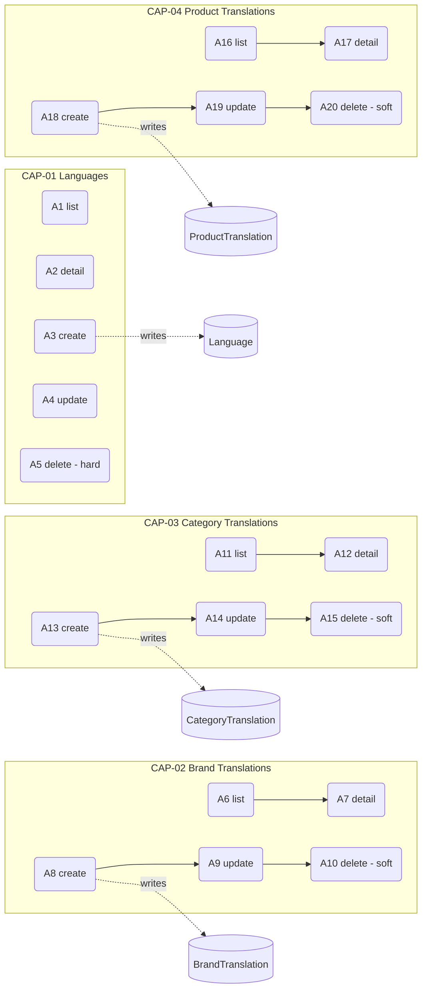
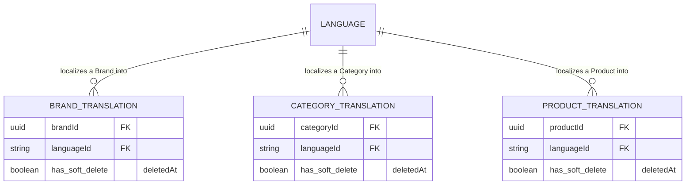

<!-- layout-exempt: rebuild-spec owns all docs/system|features|generated|flows paths -->
<!-- Contract: references/feature-spec-researcher-contract.md -->

# F004_CatalogLocalization — Technical Spec

**Độ ưu tiên**: P2
**Loại**: ui
**Ngày tạo**: 2026-09-12

**Xem thêm:** [`functional-spec.vi.md`](./functional-spec.vi.md) — tổng quan bằng ngôn ngữ thường, các
quyết định còn treo, requirement/business rule viết ngắn gọn từng dòng, screen, user story, kịch
bản, edge case và cấu hình cho đối tượng BA/QA.

**Cách đọc file này:** § 2 là mục lục — chọn action bạn quan tâm rồi đọc thẳng block của nó trong
§ 3 từ đầu đến cuối; mỗi block là một mạch hoàn chỉnh. § 4 là phụ lục dùng chung — chỉ nhảy vào khi
một block ở § 3 trỏ bạn tới đó.

## 1. Tổng quan kỹ thuật

Bốn nhóm module NestJS anh em — `Language`, `BrandTranslation`, `CategoryTranslation`,
`ProductTranslation` — mỗi nhóm là một chồng controller → service → repository CRUD mỏng đè lên
Prisma model riêng của nó. Cả 20 action đều đồng bộ, ghi vào một bảng duy nhất, không có bước chạy
nền và không action nào ghi vào nhiều hơn một bảng, nên không action nào trong file này vượt
ngưỡng cần vẽ diagram. Hình dạng chung của ba nhóm `*Translation`: cặp `(parentId, languageId)`
phải là duy nhất trong số các dòng chưa xóa (được ép bằng một partial unique index PostgreSQL viết
tay, không phải `@@unique` trong Prisma schema), entity cha được app validate trước khi ghi, và
delete là soft-delete. `Language` phá vỡ hình dạng đó ở hai điểm: route path create của nó bất
thường (`POST /languages/create`), và delete của nó là `.delete()` cứng của Prisma.



## 2. Mục lục Action

| # | Action (handler) | Method · Path | Codes | Ghi vào | Chi tiết |
|---|---|---|---|---|---|
| **A0** | *cross-cutting — không thuộc riêng action nào* | — | FR-001, FR-601, FR-602, BR-002, BR-003 | — | § 4.4 |
| **A1** | `LanguageController#getLanguages` | `GET` `/languages` | FR-201, US030 | — *(chỉ đọc)* | § 3.1 |
| **A2** | `LanguageController#getLanguageById` | `GET` `/languages/:id` | FR-202, US031 | — *(chỉ đọc)* | § 3.1 |
| **A3** | `LanguageController#createLanguage` | `POST` `/languages/create` | FR-203, US032 | `language` | § 3.1 |
| **A4** | `LanguageController#updateLanguage` | `PUT` `/languages/:id` | FR-204, US033 | `language` | § 3.1 |
| **A5** | `LanguageController#deleteLanguage` | `DELETE` `/languages/:id` | FR-205, BR-004, US034 | `language` | § 3.1 |
| **A6** | `BrandTranslationController#getBrandTranslations` | `GET` `/brand-translations` | FR-301, US015 | — *(chỉ đọc)* | § 3.2 |
| **A7** | `BrandTranslationController#getBrandTranslationById` | `GET` `/brand-translations/:id` | FR-302, US016 | — *(chỉ đọc)* | § 3.2 |
| **A8** | `BrandTranslationController#createBrandTranslation` | `POST` `/brand-translations` | FR-303, BR-001, BR-002, US017 | `brandTranslation` | § 3.2 |
| **A9** | `BrandTranslationController#updateBrandTranslation` | `PUT` `/brand-translations/:id` | FR-304, BR-001, BR-002, US018 | `brandTranslation` | § 3.2 |
| **A10** | `BrandTranslationController#deleteBrandTranslation` | `DELETE` `/brand-translations/:id` | FR-305, US019 | `brandTranslation` | § 3.2 |
| **A11** | `CategoryTranslationController#getCategoryTranslations` | `GET` `/category-translations` | FR-401, US025 | — *(chỉ đọc)* | § 3.3 |
| **A12** | `CategoryTranslationController#getCategoryTranslationById` | `GET` `/category-translations/:id` | FR-402, US026 | — *(chỉ đọc)* | § 3.3 |
| **A13** | `CategoryTranslationController#createCategoryTranslation` | `POST` `/category-translations` | FR-403, BR-001, BR-002, US027 | `categoryTranslation` | § 3.3 |
| **A14** | `CategoryTranslationController#updateCategoryTranslation` | `PUT` `/category-translations/:id` | FR-404, BR-001, BR-002, US028 | `categoryTranslation` | § 3.3 |
| **A15** | `CategoryTranslationController#deleteCategoryTranslation` | `DELETE` `/category-translations/:id` | FR-405, US029 | `categoryTranslation` | § 3.3 |
| **A16** | `ProductTranslationController#getProductTranslations` | `GET` `/product-translations` | FR-501, US045 | — *(chỉ đọc)* | § 3.4 |
| **A17** | `ProductTranslationController#getProductTranslationById` | `GET` `/product-translations/:id` | FR-502, US046 | — *(chỉ đọc)* | § 3.4 |
| **A18** | `ProductTranslationController#createProductTranslation` | `POST` `/product-translations` | FR-503, BR-001, BR-002, US047 | `productTranslation` | § 3.4 |
| **A19** | `ProductTranslationController#updateProductTranslation` | `PUT` `/product-translations/:id` | FR-504, BR-001, BR-002, US048 | `productTranslation` | § 3.4 |
| **A20** | `ProductTranslationController#deleteProductTranslation` | `DELETE` `/product-translations/:id` | FR-505, US049 | `productTranslation` | § 3.4 |

FR-101 (không có UI, không có điều hướng) và FR-551 (không có tương tác giữa các capability) chỉ
được nêu trong `functional-spec.md` — cả hai không gọi tên một action cụ thể hay một lượt ghi DB
nào, nên cả hai không chiếm dòng nào ở đây.

## 3. Actions

### 3.1 CAP-01 — Quản lý ngôn ngữ hỗ trợ

#### A1 · Danh sách ngôn ngữ
`GET` `/languages` → `` `LanguageController#getLanguages` ``
`FR-201` · `US030`

**Ai** · admin *(gate A0 — § 4.4)*
**BE** · `` `LanguageService#getLanguages` `` phân trang + lọc theo tên (`contains`, không phân
biệt hoa thường) — `src/routes/language/language.service.ts:29-66`
**Rule** · không có guard nào ngoài gate `Bearer`/role của A0 — chỉ là một lượt đọc phân trang.
**Kết quả** · chỉ đọc — **không ghi DB**. Trả về `{ data, pagination }` qua `PageDto`.
**Nguồn:** `src/routes/language/language.controller.ts:38-51` → `src/routes/language/language.service.ts:29-66` → `src/repositories/language/language.repository.ts:29-67`

---

#### A2 · Lấy ngôn ngữ theo ID
`GET` `/languages/:id` → `` `LanguageController#getLanguageById` ``
`FR-202` · `US031`

**Ai** · admin *(gate A0)*
**Request** · path param `id` (mã locale 2 ký tự)
**BE** · `` `LanguageRepository#findUniqueLanguage` `` — `src/repositories/language/language.repository.ts:75-101`
**Rule** · `findUniqueOrThrow` lọc theo `deletedAt: null`.
**Kết quả** · chỉ đọc — **không ghi DB**. 404 khi mã không tương ứng với dòng nào còn tồn tại.
**Nguồn:** `src/routes/language/language.controller.ts:53-65` → `src/repositories/language/language.repository.ts:75-101`

---

#### A3 · Tạo ngôn ngữ *(path bất thường)*
`POST` `/languages/create` → `` `LanguageController#createLanguage` ``
`FR-203` · `US032`

**Ai** · admin *(gate A0)*
**Request** · body `{ id (mã 2 ký tự), name }` — `src/dtos/language/language.dto.ts:22-44`
**BE** · `` `LanguageRepository#createLanguage` `` — `src/repositories/language/language.repository.ts:111-149`
**Rule** · **`id` là cột natural-key** (`prisma/schema.prisma:15`, `@id @db.VarChar(10)`), không
phải UUID sinh tự động — tạo lần thứ hai với cùng mã sẽ bị từ chối như một va chạm khóa chính,
tương tự mọi va chạm unique-constraint khác. Bản thân route path cũng là điểm bất thường duy nhất
của tính năng này: mọi create khác đều nằm ở path dạng số nhiều, riêng cái này nằm ở
`/languages/create` (`src/routes/language/language.controller.ts:67`, `route-list.md` ROUTE033).
**Kết quả** · Ghi `language` (id, name, createdById) — `src/repositories/language/language.repository.ts:111-124`.
**Nguồn:** `src/routes/language/language.controller.ts:67-82` → `src/repositories/language/language.repository.ts:111-149`

---

#### A4 · Cập nhật ngôn ngữ
`PUT` `/languages/:id` → `` `LanguageController#updateLanguage` ``
`FR-204` · `US033`

**Ai** · admin *(gate A0)*
**Request** · path param `id`; body `{ name }` — `src/dtos/language/language.dto.ts:46-58`
**BE** · `` `LanguageRepository#updateLanguageById` `` — `src/repositories/language/language.repository.ts:151-201`
**Rule** · không có guard nào ngoài A0 — chỉ là cập nhật field đơn thuần, lọc theo `deletedAt: null`.
**Kết quả** · Ghi `language.name`, `language.updatedById` — `src/repositories/language/language.repository.ts:159-169`.
**Nguồn:** `src/routes/language/language.controller.ts:84-104` → `src/repositories/language/language.repository.ts:151-201`

---

#### A5 · Xóa ngôn ngữ *(hard delete)*
`DELETE` `/languages/:id` → `` `LanguageController#deleteLanguage` ``
`FR-205` · `US034`

**Ai** · admin *(gate A0)*
**BE** · `` `LanguageRepository#deleteLanguageById` `` — `src/repositories/language/language.repository.ts:203-252`
**Rule**

| DEC | subtype | Điều kiện | Người dùng thấy gì | Nguồn |
|---|---|---|---|---|
| n/a | — | — | — | — |

Không có DEC nào áp dụng — đây là một lượt ghi vô điều kiện duy nhất, không phải nhánh rẽ.
**BR-004 — Xóa ngôn ngữ là hard delete vĩnh viễn, khác với mọi entity còn lại trong tính năng
này.** Phương thức gọi `prismaService.language.delete(...)` (`src/repositories/language/language.repository.ts:213-219`);
ngay sau đó là một khối soft-delete (`update` với `deletedAt`), bị comment out toàn bộ
(`src/repositories/language/language.repository.ts:222-233`), kèm comment tiếng Việt inline giải thích lý do: `id` chính
là khóa chính (không phải UUID), nên mẫu soft-delete kiểu partial-unique-on-`deletedAt` (như ba
entity còn lại của tính năng này dùng) không thể áp dụng cho một PK dạng natural-key mà không cho
phép mã trùng nhau tồn tại song song. Điều này khiến hard delete là một ràng buộc thiết kế có chủ
đích, không phải sơ suất. *(§ 4.4)*
**Kết quả** · **Hard-delete** dòng `language`. Cascade (`onDelete: Cascade` trên mỗi FK
`languageId`) tới mọi dòng `UserTranslation`/`ProductTranslation`/`CategoryTranslation`/
`BrandTranslation` còn trỏ tới nó (`prisma/schema.prisma:15-33` + relation `language` của từng
translation model) — xem RISK-03 trong `functional-spec.md § 11`.
**Nguồn:** `src/routes/language/language.controller.ts:106-120` → `src/repositories/language/language.repository.ts:203-252`

### 3.2 CAP-02 — Quản lý bản dịch thương hiệu

#### A6 · Danh sách bản dịch thương hiệu
`GET` `/brand-translations` → `` `BrandTranslationController#getBrandTranslations` ``
`FR-301` · `US015`

**Ai** · admin *(gate A0)*
**BE** · `` `BrandTranslationService#getBrandTranslations` `` — cùng dạng phân trang/lọc từ khóa
như A1 — `src/routes/brand-translation/brand-translation.service.ts:48-87`
**Rule** · không có guard nào ngoài A0.
**Kết quả** · chỉ đọc — **không ghi DB**.
**Nguồn:** `src/routes/brand-translation/brand-translation.controller.ts:36-47` → `src/routes/brand-translation/brand-translation.service.ts:48-87` → `src/repositories/brand-translation/brand-translation.repository.ts:32-75`

---

#### A7 · Lấy bản dịch thương hiệu theo ID
`GET` `/brand-translations/:id` → `` `BrandTranslationController#getBrandTranslationById` ``
`FR-302` · `US016`

**Ai** · admin *(gate A0)*
**Request** · path param `id` (UUID, `ParseUUIDPipe`)
**BE** · `` `BrandTranslationRepository#findUniqueBrandTranslation` `` — `src/repositories/brand-translation/brand-translation.repository.ts:83-107`
**Kết quả** · chỉ đọc — **không ghi DB**. 404 khi không tìm thấy hoặc đã soft-delete. Response gồm
cả `brand` và `language` được join (`src/selectors/brand-translation.selector.ts`, response được
định hình bởi `BrandTranslationWithBrandAndLanguageResponseDto`).
**Nguồn:** `src/routes/brand-translation/brand-translation.controller.ts:56-69` → `src/repositories/brand-translation/brand-translation.repository.ts:83-107`

---

#### A8 · Tạo bản dịch thương hiệu
`POST` `/brand-translations` → `` `BrandTranslationController#createBrandTranslation` ``
`FR-303` · `BR-001` `BR-002` · `US017`

**Ai** · admin *(gate A0)*
**Request** · body `{ name, description, languageId, brandId }` — `src/dtos/brand-translation/brand-translation.dto.ts:72-113`
**BE** · `` `BrandTranslationService#createBrandTranslation` `` — `src/routes/brand-translation/brand-translation.service.ts:21-39`
**Rule**
- **BR-002 — Thương hiệu đích phải tồn tại (và chưa bị xóa) trước khi tạo bản dịch cho nó.**
  `validateBrand(data.brandId)` chạy trước tiên và ném 404 nếu thương hiệu không tồn tại —
  `src/repositories/brand-translation/brand-translation.repository.ts:115-138`, được gọi từ `src/routes/brand-translation/brand-translation.service.ts:29`. *(§ 4.4)*
- **BR-001 — Một thương hiệu không thể có hai bản dịch còn sống cùng ngôn ngữ.** Được ép bởi
  partial unique index `BrandTranslation_languageId_brandId_unique` (`WHERE deletedAt IS NULL`),
  tạo bởi migration `20250608153843_create_partial_index_brand_and_brand_translation` — không
  phải `@@unique` trong Prisma schema, nên tầng type của Prisma không hề biết tĩnh về nó; repository
  bắt lỗi `P2002` phát sinh ở runtime. *(§ 4.4)*
**Kết quả** · Ghi `brandTranslation` (name, description, languageId, brandId, createdById) —
`src/repositories/brand-translation/brand-translation.repository.ts:146-159`. **[UNVERIFIED]** thông báo lỗi
unique-violation ở path create ghi `` `Brand translation with name "${data.name}" already exists.` ``
(`src/repositories/brand-translation/brand-translation.repository.ts:166`) — nêu sai field; ràng buộc thật nằm trên
(brandId, languageId), không phải name. Xem RISK-01.
**Nguồn:** `src/routes/brand-translation/brand-translation.controller.ts:71-89` → `src/routes/brand-translation/brand-translation.service.ts:21-39` → `src/repositories/brand-translation/brand-translation.repository.ts:115-185`

---

#### A9 · Cập nhật bản dịch thương hiệu
`PUT` `/brand-translations/:id` → `` `BrandTranslationController#updateBrandTranslation` ``
`FR-304` · `BR-001` `BR-002` · `US018`

**Ai** · admin *(gate A0)*
**Request** · path param `id`; body là một `BrandTranslationRequestDto` một phần
**BE** · `` `BrandTranslationService#updateBrandTranslation` `` — `src/routes/brand-translation/brand-translation.service.ts:89-112`
**Rule** · **BR-002** chạy lại `validateBrand` chỉ khi `brandId` có mặt trong payload
(`src/routes/brand-translation/brand-translation.service.ts:99-101`) — cùng ý nghĩa như ở A8; bị bỏ qua khi update
không đụng tới `brandId`. **BR-001** — cùng guard partial-unique-index như A8, xảy ra khi update
nhắm vào cặp `(brandId, languageId)` mà một dòng còn sống khác đã giữ
(`src/repositories/brand-translation/brand-translation.repository.ts:221-226`). *(§ 4.4)*
**Kết quả** · Ghi các field thay đổi trên `brandTranslation`, cộng thêm `updatedById` —
`src/repositories/brand-translation/brand-translation.repository.ts:194-208`.
**Nguồn:** `src/routes/brand-translation/brand-translation.controller.ts:91-111` → `src/routes/brand-translation/brand-translation.service.ts:89-112` → `src/repositories/brand-translation/brand-translation.repository.ts:194-242`

---

#### A10 · Xóa bản dịch thương hiệu *(soft delete)*
`DELETE` `/brand-translations/:id` → `` `BrandTranslationController#deleteBrandTranslation` ``
`FR-305` · `US019`

**Ai** · admin *(gate A0)*
**BE** · `` `BrandTranslationRepository#deleteBrandTranslation` `` — `src/repositories/brand-translation/brand-translation.repository.ts:251-287`
**Rule** · không có guard nào ngoài A0.
**Kết quả** · Ghi `brandTranslation.deletedAt`, `deletedById`, `updatedById` — soft delete qua
`update`, không phải `.delete()` của Prisma (trái ngược A5). Dòng không còn xuất hiện ở A6/A7 (cả
hai đều lọc `deletedAt: null`).
**Nguồn:** `src/routes/brand-translation/brand-translation.controller.ts:113-131` → `src/repositories/brand-translation/brand-translation.repository.ts:251-287`

### 3.3 CAP-03 — Quản lý bản dịch danh mục

#### A11 · Danh sách bản dịch danh mục
`GET` `/category-translations` → `` `CategoryTranslationController#getCategoryTranslations` ``
`FR-401` · `US025`

**Ai** · admin *(gate A0)*
**BE** · `` `CategoryTranslationService#getCategoryTranslations` `` — cùng dạng phân trang/từ khóa
như A1/A6 — `src/routes/category-translation/category-translation.service.ts:21-57`
**Kết quả** · chỉ đọc — **không ghi DB**.
**Nguồn:** `src/routes/category-translation/category-translation.controller.ts:40-55` → `src/routes/category-translation/category-translation.service.ts:21-57` → `src/repositories/category-translation/category-translation.repository.ts:33-77`

---

#### A12 · Lấy bản dịch danh mục theo ID
`GET` `/category-translations/:id` → `` `CategoryTranslationController#getCategoryTranslationById` ``
`FR-402` · `US026`

**Ai** · admin *(gate A0)*
**BE** · `` `CategoryTranslationRepository#findUniqueCategoryTranslation` `` — `src/repositories/category-translation/category-translation.repository.ts:86-110`
**Kết quả** · chỉ đọc — **không ghi DB**. 404 khi không tìm thấy hoặc đã soft-delete. Response gồm
cả `category` và `language` được join.
**Nguồn:** `src/routes/category-translation/category-translation.controller.ts:64-72` → `src/repositories/category-translation/category-translation.repository.ts:86-110`

---

#### A13 · Tạo bản dịch danh mục
`POST` `/category-translations` → `` `CategoryTranslationController#createCategoryTranslation` ``
`FR-403` · `BR-001` `BR-002` · `US027`

**Ai** · admin *(gate A0)*
**Request** · body `{ name, description, languageId, categoryId }` — `src/dtos/category-translation/category-translation.dto.ts:92-132`
**BE** · `` `CategoryTranslationService#createCategoryTranslation` `` — `src/routes/category-translation/category-translation.service.ts:68-86`
**Rule**
- **BR-002 — Danh mục đích phải tồn tại (và chưa bị xóa) trước khi tạo bản dịch cho nó.**
  `validateCategory(data.categoryId)` chạy trước, 404 nếu không tìm thấy —
  `src/repositories/category-translation/category-translation.repository.ts:117-139`, được gọi từ `src/routes/category-translation/category-translation.service.ts:75`. *(§ 4.4)*
- **BR-001 — Một danh mục không thể có hai bản dịch còn sống cùng ngôn ngữ.** Được ép bởi
  `CategoryTranslation_languageId_categoryId_unique` (migration
  `20250622070346_partial_index_category_translation`), một partial unique index viết tay, không
  phải `@@unique` trong Prisma schema. *(§ 4.4)*
**Kết quả** · Ghi `categoryTranslation` (name, description, languageId, categoryId,
createdById) — `src/repositories/category-translation/category-translation.repository.ts:148-160`. **[UNVERIFIED]** thông báo lỗi
unique-violation ở path create ghi `"Category translation with this name already exists."`
(`src/repositories/category-translation/category-translation.repository.ts:167`) — cùng lỗi đặt tên field sai như A8; xem RISK-01.
**Nguồn:** `src/routes/category-translation/category-translation.controller.ts:74-93` → `src/routes/category-translation/category-translation.service.ts:68-86` → `src/repositories/category-translation/category-translation.repository.ts:117-184`

---

#### A14 · Cập nhật bản dịch danh mục
`PUT` `/category-translations/:id` → `` `CategoryTranslationController#updateCategoryTranslation` ``
`FR-404` · `BR-001` `BR-002` · `US028`

**Ai** · admin *(gate A0)*
**BE** · `` `CategoryTranslationService#updateCategoryTranslation` `` — `src/routes/category-translation/category-translation.service.ts:88-114`
**Rule** · **BR-002** được validate lại chỉ khi `categoryId` có mặt trong payload
(`src/routes/category-translation/category-translation.service.ts:98-102`). **BR-001** — cùng guard unique-index như A13,
xảy ra khi update va vào cặp mới trùng với một dòng còn sống khác (`src/repositories/category-translation/category-translation.repository.ts:220-225`). *(§ 4.4)*
**Kết quả** · Ghi các field thay đổi trên `categoryTranslation`, cộng thêm `updatedById` —
`src/repositories/category-translation/category-translation.repository.ts:194-207`.
**Nguồn:** `src/routes/category-translation/category-translation.controller.ts:95-123` → `src/routes/category-translation/category-translation.service.ts:88-114` → `src/repositories/category-translation/category-translation.repository.ts:194-240`

---

#### A15 · Xóa bản dịch danh mục *(soft delete)*
`DELETE` `/category-translations/:id` → `` `CategoryTranslationController#deleteCategoryTranslation` ``
`FR-405` · `US029`

**Ai** · admin *(gate A0)*
**BE** · `` `CategoryTranslationRepository#deleteCategoryTranslation` `` — `src/repositories/category-translation/category-translation.repository.ts:249-285`
**Kết quả** · Ghi `categoryTranslation.deletedAt`, `deletedById`, `updatedById` — soft delete.
**Nguồn:** `src/routes/category-translation/category-translation.controller.ts:125-152` → `src/repositories/category-translation/category-translation.repository.ts:249-285`

### 3.4 CAP-04 — Quản lý bản dịch sản phẩm

#### A16 · Danh sách bản dịch sản phẩm
`GET` `/product-translations` → `` `ProductTranslationController#getProductTranslations` ``
`FR-501` · `US045`

**Ai** · client, seller, hoặc admin *(gate A0 — BR-003, § 4.4)*
**BE** · `` `ProductTranslationService#getProductTranslations` `` — cùng dạng phân trang/từ khóa
như A1/A6/A11 — `src/routes/product-translation/product-translation.service.ts:21-58`
**Kết quả** · chỉ đọc — **không ghi DB**.
**Nguồn:** `src/routes/product-translation/product-translation.controller.ts:42-50` → `src/routes/product-translation/product-translation.service.ts:21-58` → `src/repositories/product-translation/product-translation.repository.ts:34-76`

---

#### A17 · Lấy bản dịch sản phẩm theo ID
`GET` `/product-translations/:id` → `` `ProductTranslationController#getProductTranslationById` ``
`FR-502` · `US046`

**Ai** · client, seller, hoặc admin *(gate A0 — BR-003)*
**BE** · `` `ProductTranslationRepository#findProductTranslationById` `` — `src/repositories/product-translation/product-translation.repository.ts:85-109`
**Kết quả** · chỉ đọc — **không ghi DB**. 404 khi không tìm thấy hoặc đã soft-delete.
**Nguồn:** `src/routes/product-translation/product-translation.controller.ts:66-74` → `src/repositories/product-translation/product-translation.repository.ts:85-109`

---

#### A18 · Tạo bản dịch sản phẩm
`POST` `/product-translations` → `` `ProductTranslationController#createProductTranslation` ``
`FR-503` · `BR-001` `BR-002` · `US047`

**Ai** · client, seller, hoặc admin *(gate A0 — BR-003)*
**Request** · body `{ name, description, languageId, productId }` — `src/dtos/product-translation/product-translation.dto.ts:63-111`
**BE** · `` `ProductTranslationService#createProductTranslation` `` — `src/routes/product-translation/product-translation.service.ts:60-78`
**Rule**
- **BR-002 — Sản phẩm đích phải tồn tại (và chưa bị xóa) trước khi tạo bản dịch cho nó.**
  `validateProduct(data.productId)` chạy trước, 404 nếu không tìm thấy —
  `src/repositories/product-translation/product-translation.repository.ts:118-141`, được gọi từ `src/routes/product-translation/product-translation.service.ts:68`. *(§ 4.4)*
- **BR-001 — Một sản phẩm không thể có hai bản dịch còn sống cùng ngôn ngữ**, được ép bởi
  `ProductTranslation_productId_languageId_unique` (migration
  `20250625154134_partial_product_translation_and_sku`). **Khác với A8/A13, catch block của
  `create` ở path này không hề kiểm tra `isUniqueConstraintPrismaError`**
  (`src/repositories/product-translation/product-translation.repository.ts:150-185` — chỉ xử lý `isRecordNotFoundPrismaError` và
  `isForeignKeyConstraintPrismaError`) — database vẫn ép BR-001, nhưng vi phạm ở đây rơi xuống
  nhánh 500 chung thay vì 422 mà mọi create path anh em khác trả về. Xem RISK-02 trong
  `functional-spec.md § 11`. *(§ 4.4)*
**Kết quả** · Ghi `productTranslation` (name, description, languageId, productId,
createdById) — `src/repositories/product-translation/product-translation.repository.ts:156-160`.
**Nguồn:** `src/routes/product-translation/product-translation.controller.ts:76-95` → `src/routes/product-translation/product-translation.service.ts:60-78` → `src/repositories/product-translation/product-translation.repository.ts:118-185`

---

#### A19 · Cập nhật bản dịch sản phẩm
`PUT` `/product-translations/:id` → `` `ProductTranslationController#updateProductTranslation` ``
`FR-504` · `BR-001` `BR-002` · `US048`

**Ai** · client, seller, hoặc admin *(gate A0 — BR-003)*
**BE** · `` `ProductTranslationService#updateProductTranslation` `` — `src/routes/product-translation/product-translation.service.ts:87-110`
**Rule** · **BR-002** được validate lại chỉ khi `productId` có mặt trong payload
(`src/routes/product-translation/product-translation.service.ts:97-99`). **BR-001** — cùng guard unique-index như A18, và
khác với create path của A18, update path này CÓ bắt `isUniqueConstraintPrismaError`
(`src/repositories/product-translation/product-translation.repository.ts:214-220`) và trả về 422 chuẩn. *(§ 4.4)*
**Kết quả** · Ghi các field thay đổi trên `productTranslation`, cộng thêm `updatedById` —
`src/repositories/product-translation/product-translation.repository.ts:195-208`.
**Nguồn:** `src/routes/product-translation/product-translation.controller.ts:97-125` → `src/routes/product-translation/product-translation.service.ts:87-110` → `src/repositories/product-translation/product-translation.repository.ts:195-241`

---

#### A20 · Xóa bản dịch sản phẩm *(soft delete)*
`DELETE` `/product-translations/:id` → `` `ProductTranslationController#deleteProductTranslation` ``
`FR-505` · `US049`

**Ai** · client, seller, hoặc admin *(gate A0 — BR-003)*
**BE** · `` `ProductTranslationRepository#deleteProductTranslation` `` — `src/repositories/product-translation/product-translation.repository.ts:250-286`
**Kết quả** · Ghi `productTranslation.deletedAt`, `deletedById`, `updatedById` — soft delete.
**Nguồn:** `src/routes/product-translation/product-translation.controller.ts:127-154` → `src/repositories/product-translation/product-translation.repository.ts:250-286`

### 3.5 Edge case

| Action | Kịch bản | Hành vi |
|---|---|---|
| A3 | Tạo lần hai với mã ngôn ngữ đã được dùng | Va chạm khóa chính của Prisma — `LanguageRepository#createLanguage` bắt `isUniqueConstraintPrismaError` và trả về 422 `` `Language ${id} already exists.` `` (`src/repositories/language/language.repository.ts:130-135`) |
| A8 · A13 · A19 | Update nhắm vào cặp `(parent, language)` mà một dòng còn sống khác đã giữ | Partial unique index từ chối lượt ghi; catch của `update` ở mỗi repository trả về 422 (`src/repositories/brand-translation/brand-translation.repository.ts:221-226`, `src/repositories/category-translation/category-translation.repository.ts:220-225`, `src/repositories/product-translation/product-translation.repository.ts:214-220`) |
| A18 | Create nhắm vào cặp `(product, language)` mà một dòng còn sống khác đã giữ | Bị database từ chối giống A8/A13, nhưng catch của create này không có nhánh `isUniqueConstraintPrismaError` (`src/repositories/product-translation/product-translation.repository.ts:150-185`) — rơi xuống nhánh 500 `internal` chung thay vì 422 (RISK-02) |
| A5 | Xóa một ngôn ngữ vẫn còn được các dòng translation tham chiếu | Hard delete vẫn tiến hành; FK `onDelete: Cascade` trên mọi relation `languageId` xóa luôn các dòng translation đó, không hề xác nhận (RISK-03) |
| A1-A20 | Gọi route bất kỳ trong tính năng này mà chưa xác thực | Bị từ chối trước khi tới handler — không route nào trong tính năng này gắn `@IsPublicApi()` (gate A0, § 4.4) |
| A1, A6, A11, A16 | Cùng một route được gọi bởi mọi vai trò | Route list/detail của language/brand-translation/category-translation trả 403 cho client/seller (module không được cấp); list/detail của product-translation thành công với cả ba vai trò (BR-003) |

## 4. Nền tảng dùng chung

### 4.1 Component

| Component | Trách nhiệm | Dùng trong | File |
|---|---|---|---|
| `LanguageController` / `LanguageService` / `LanguageRepository` | CRUD cho các locale được hỗ trợ | A1-A5 | `src/routes/language/language.controller.ts`, `src/routes/language/language.service.ts`, `src/repositories/language/language.repository.ts` |
| `BrandTranslationController` / `BrandTranslationService` / `BrandTranslationRepository` | CRUD cho bản dịch tên/mô tả thương hiệu | A6-A10 | `src/routes/brand-translation/*`, `src/repositories/brand-translation/brand-translation.repository.ts` |
| `CategoryTranslationController` / `CategoryTranslationService` / `CategoryTranslationRepository` | CRUD cho bản dịch tên/mô tả danh mục | A11-A15 | `src/routes/category-translation/*`, `src/repositories/category-translation/category-translation.repository.ts` |
| `ProductTranslationController` / `ProductTranslationService` / `ProductTranslationRepository` | CRUD cho bản dịch tên/mô tả sản phẩm | A16-A20 | `src/routes/product-translation/*`, `src/repositories/product-translation/product-translation.repository.ts` |
| `AuthorizationHeaderGuard` (global `APP_GUARD`) | Gate `Bearer`-token + role/module trên toàn bộ 20 route | A0 (mọi action) | `src/shared/guards/authorization-header.guard.ts` |

### 4.2 Data Model



| Entity | Bảng | Dùng để | Action |
|---|---|---|---|
| `Language` (MODEL001) | `language` | Danh sách locale được hỗ trợ, đích của mọi bản dịch | A1-A5, A8, A9, A13, A14, A18, A19 |
| `BrandTranslation` (MODEL015) | `brandTranslation` | Tên/mô tả đã dịch của một thương hiệu | A6-A10 |
| `CategoryTranslation` (MODEL012) | `categoryTranslation` | Tên/mô tả đã dịch của một danh mục | A11-A15 |
| `ProductTranslation` (MODEL010) | `productTranslation` | Tên/mô tả đã dịch của một sản phẩm | A16-A20 |

#### Hành vi đa hình

Không có — Key Entities không có discriminator field nào. `docs/generated/entities.md` liệt kê
không có mục `DISC-###` nào cho `Language`, `BrandTranslation`, `CategoryTranslation`, hay
`ProductTranslation`.

### 4.3 Quản lý trạng thái

Không có. Không entity nào trong tính năng này mang field status/vòng đời ngoài marker soft-delete
`deletedAt` dùng chung (2 trạng thái, 1 transition trên `BrandTranslation`/`CategoryTranslation`/
`ProductTranslation`; `Language` thậm chí còn không có cả cái đó), dưới ngưỡng ≥3
trạng thái/≥2 transition để cần ghi lại một `SM-###`.

### 4.4 Rule dùng chung

#### Bin 3 — cross-cutting, không thuộc riêng action nào

**A0 · FR-601 — mỗi một trong 20 route của tính năng này đều yêu cầu một session `Bearer` hợp lệ
theo mặc định.** `AuthorizationHeaderGuard`, được đăng ký là `APP_GUARD` toàn cục
(`src/shared/modules/base.module.ts:39-42`), chạy trước mọi handler; không route nào trong 20 route
của tính năng này gắn `@IsPublicApi()`. Gate thất bại trả về 401 trước khi bất kỳ tra cứu resource
nào chạy.
**Nguồn:** `src/shared/guards/authorization-header.guard.ts:25-47`

**A0 · FR-602 / BR-003 — quyền truy cập theo role/module bất đối xứng giữa bốn capability của
tính năng này.** `updateRole()` lọc tập quyền của mỗi role không phải admin bằng một danh sách
allow-list module hardcode theo role, chỉ khớp trên TÊN module — không bao giờ khớp theo HTTP
method (`initial-scripts/create-permission.ts:158-169`). `ClientModule` và `SellerModule` đều bao
gồm `PRODUCT-TRANSLATIONS` (`initial-scripts/create-permission.ts:18`, `28`) nhưng không cái nào
bao gồm `LANGUAGES`, `BRAND-TRANSLATIONS`, hay `CATEGORY-TRANSLATIONS`
(`initial-scripts/create-permission.ts:14-30`). Kết quả: cả 5 route product-translation (A16-A20)
đều truy cập được bởi admin, client, và seller như nhau; 15 route còn lại (A1-A15) chỉ dành cho
admin. Bản thân admin không có entry nào trong map `Module`
(`initial-scripts/create-permission.ts:32-35`), nên guard `moduleList && moduleList.length > 0`
(`initial-scripts/create-permission.ts:160`) là false và admin giữ mọi quyền, không bị lọc.
**Nguồn:** `initial-scripts/create-permission.ts:14-35,149-192`

#### Bin 2 — dùng bởi ≥2 action được đặt tên

**BR-001 — Một thương hiệu/danh mục/sản phẩm không thể có hai bản dịch còn sống cùng ngôn ngữ.**
Dùng trong: **A8** · **A9** · **A13** · **A14** · **A18** · **A19**. Được ép hoàn toàn ở tầng
database dưới dạng partial unique index trên `(parentId, languageId) WHERE "deletedAt" IS NULL` —
mỗi nhóm một cái, mỗi cái được thêm bởi một migration viết tay chứ không phải thuộc tính
`@@unique` trong Prisma schema, nên bản thân `prisma/schema.prisma` không mang dấu vết tĩnh nào
của ràng buộc này; chỉ có SQL sinh ra mới có. Mọi repository đều bắt `P2002` phát sinh và trả về
422, **ngoại trừ** `ProductTranslationRepository#createProductTranslation` (path create của A18 —
xem RISK-02).
**Nguồn:** `prisma/migrations/20250608153843_create_partial_index_brand_and_brand_translation/migration.sql` · `prisma/migrations/20250622070346_partial_index_category_translation/migration.sql` · `prisma/migrations/20250625154134_partial_product_translation_and_sku/migration.sql`
```text
CREATE UNIQUE INDEX "{Entity}_..._unique"
  ON "{Entity}" ("parentId", "languageId")
  WHERE "deletedAt" IS NULL;
```

**BR-002 — Tạo hoặc cập nhật bản dịch thương hiệu/danh mục/sản phẩm đòi hỏi entity cha phải tồn
tại và chưa bị xóa.** Dùng trong: **A8** · **A9** · **A13** · **A14** · **A18** · **A19**. Mỗi
service tự gọi `validate{Brand|Category|Product}` riêng của nó trước khi ghi lúc create, và có
điều kiện lúc update (chỉ khi field ID cha có mặt trong payload) —
`src/routes/brand-translation/brand-translation.service.ts:29,99-101`, `src/routes/category-translation/category-translation.service.ts:75,98-102`,
`src/routes/product-translation/product-translation.service.ts:68,97-99`. Cha không tồn tại sẽ ném 404 trước khi lượt ghi
được thử.
**Nguồn:** `src/repositories/brand-translation/brand-translation.repository.ts:115-138` · `src/repositories/category-translation/category-translation.repository.ts:117-139` · `src/repositories/product-translation/product-translation.repository.ts:118-141`

### 4.5 Thuật toán & tích hợp

Không có. Mọi action đều là một lệnh Prisma CRUD trực tiếp, không có tính toán phức tạp và không
tích hợp bên ngoài nào (không queue, webhook, notification, hay gọi API bên thứ ba nào trong cả 4
nhóm module — đã đối chiếu với `behavior-logic.md`, liệt kê không mục BL### nào liên quan đến F004).

### 4.6 Cấu hình

Không có — không cấu hình kỹ thuật nào ngoài mặc định của framework. Không env var, feature flag,
hay cài đặt timeout/retry nào được đọc ở bất kỳ đâu trong các nhóm module `language`,
`brand-translation`, `category-translation`, hay `product-translation`.

**Hành vi phía client:** xem
[`behavior-logic.vi.md`](../../generated/behavior-logic.vi.md) (pattern phía client — debounce, optimistic UI, polling, upload, realtime),
[`permissions.vi.md`](../../system/permissions.vi.md) (feature flag / experiment / env / gate locale),
[`screen-flow.vi.md`](../../generated/screen-flow.vi.md) (guard / khôi phục trạng thái deep-link / bảo vệ thay đổi chưa lưu).

## 5. Kiểm chứng & ghi chú kỹ thuật

### 5.1 Kiểm chứng kỹ thuật

- **SC-001** *(A3)* `POST /languages/create` chỉ thành công với mã 2 ký tự hợp lệ và từ chối mã
  trùng với 422. (bao phủ FR-203, US032)
- **SC-002** *(A5)* `DELETE /languages/:id` thực hiện một `.delete()` thật của Prisma (dòng không
  còn được trả về bởi bất kỳ `findMany`/`findUnique` nào sau đó, kể cả khi bỏ filter `deletedAt`),
  không bao giờ là soft-delete. (bao phủ FR-205, BR-004)
- **SC-003** *(A8, A13, A18, A9, A14, A19)* Một create/update nhắm vào cặp `(parent, language)`
  mà một dòng còn sống khác đã giữ sẽ bị từ chối — 422 cho A8/A9/A13/A14/A19, nhưng 500 cho A18
  (create). (bao phủ FR-303/FR-403/FR-503, BR-001)
- **SC-004** *(A16-A20)* Một token `Bearer` của client hoặc seller thành công với cả 5 route
  product-translation và thất bại (403) với mọi route language/brand-translation/
  category-translation. (bao phủ FR-602, BR-003)

#### US032 *(A3)*

**Test độc lập:** Gọi `POST /languages/create` với một mã 2 ký tự mới; xác nhận 201 và một dòng
đọc được qua `GET /languages/:id`. Lặp lại cùng mã đó; xác nhận 422.

**Kịch bản nghiệm thu:**

1. **Given** chưa có ngôn ngữ nào với mã `"vi"`, **When** `POST /languages/create` được gọi với
   `{ id: "vi", name: "Vietnamese" }`, **Then** response là 201 và dòng được tạo.
2. **Given** một ngôn ngữ với mã `"en"` đã tồn tại, **When** cùng mã đó được gửi lại,
   **Then** response là 422 `` `Language en already exists.` ``.

#### US034 *(A5)*

**Test độc lập:** Xóa một ngôn ngữ không có bản dịch phụ thuộc nào; xác nhận dòng đã biến mất khỏi
lần `GET /languages/:id` tiếp theo (404, không chỉ là bị lọc ra).

**Kịch bản nghiệm thu:**

1. **Given** một ngôn ngữ không có bản dịch nào trỏ tới, **When** nó bị xóa, **Then** dòng bị xóa
   vĩnh viễn và lần fetch sau đó trả về 404.
2. **Given** một ngôn ngữ có sẵn các bản dịch thương hiệu/danh mục/sản phẩm, **When** nó bị xóa,
   **Then** FK cascade xóa luôn các dòng translation đó (`[UNVERIFIED]` — chưa chạy độc lập lại
   trên một database thật ở lượt này; suy ra từ khai báo `onDelete: Cascade` trên relation
   `language` của mỗi translation model trong `prisma/schema.prisma`).

#### US047 *(A18)*

**Test độc lập:** Tạo một bản dịch sản phẩm cho một cặp `(productId, languageId)` đã có sẵn một
bản dịch còn sống; xác nhận status của response.

**Kịch bản nghiệm thu:**

1. **Given** một sản phẩm và ngôn ngữ tồn tại chưa có bản dịch trước đó, **When**
   `POST /product-translations` được gọi với payload hợp lệ, **Then** response là 201.
2. **Given** cùng cặp `(productId, languageId)` đó đã có một bản dịch còn sống, **When**
   cùng create đó được lặp lại, **Then** response là 500, không phải 422 (RISK-02) — database vẫn
   từ chối lượt ghi trùng, nhưng `ProductTranslationRepository#createProductTranslation` không có
   nhánh `isUniqueConstraintPrismaError` để chuyển nó thành cùng 422 mà mọi create path anh em
   khác trả về.

### 5.2 Giả định

- *(A3, A32/US032)* Validator `Length(2, 2, ...)` 2 ký tự của `LanguagePaginationQueryDto`/
  `LanguageCreateRequestDto` được giả định là mang nghĩa mã ISO 639-1, theo mô tả `@ApiProperty`
  của chính DTO đó (`src/dtos/language/language.dto.ts:35-43`) — không tìm thấy kiểm tra runtime
  nào đối chiếu với danh sách ISO, nên bất kỳ chuỗi 2 ký tự nào cũng được chấp nhận miễn không va
  chạm.
- *(A18)* Việc thiếu nhánh `isUniqueConstraintPrismaError` trên `createProductTranslation` được
  ghi nhận là một khiếm khuyết quan sát được (RISK-02), không giả định là có chủ đích — không có
  comment code hay test nào khẳng định hành vi này là thiết kế.
- *(A5)* Khối soft-delete bị comment out trong `deleteLanguageById` được giả định là một nỗ lực
  triển khai trước đó bị bỏ dở, không phải dead code đang chờ bật lại, dựa trên comment inline giải
  thích lý do soft-delete không thể hoạt động với PK dạng natural-key của entity này
  (`src/repositories/language/language.repository.ts:205-211`).

### 5.3 Câu hỏi chưa giải quyết

1. **Định dạng ID ngôn ngữ** *(A3)*: liệu `id` 2 ký tự có được validate đối chiếu với một danh
   sách ISO 639-1 thật ở bất kỳ đâu khác trong hệ thống (ví dụ ở một tầng khác không thuộc phạm vi
   tính năng này) hay không thì chưa được xác nhận — chỉ tìm thấy kiểm tra hình dạng `Length(2, 2)`
   trong các DTO của chính tính năng này.
2. **Xác nhận cascade-delete** *(A5)*: FK cascade từ một hard-delete `Language` vào các dòng
   translation phụ thuộc được lần theo khai báo `onDelete: Cascade` trong Prisma schema, chưa được
   xác nhận bằng cách chạy thật lượt xóa trên một database sống ở lượt này.

### 5.4 Tham chiếu nguồn

| Action | Thứ tự | Symbol | Path | Mục đích |
|---|---|---|---|---|
| — | 1 | `Language` | `prisma/schema.prisma:15-33` | Entity locale, đích của mọi bản dịch |
| A1-A5 | 2 | `LanguageController` | `src/routes/language/language.controller.ts:1-121` | Điểm vào HTTP cho cả 5 route language |
| A1-A5 | 3 | `LanguageRepository` | `src/repositories/language/language.repository.ts:1-253` | CRUD language + path hard-delete |
| A6-A10 | 4 | `BrandTranslationRepository` | `src/repositories/brand-translation/brand-translation.repository.ts:1-288` | CRUD bản dịch thương hiệu, guard cha + tính duy nhất |
| A11-A15 | 5 | `CategoryTranslationRepository` | `src/repositories/category-translation/category-translation.repository.ts:1-285` | CRUD bản dịch danh mục, guard cha + tính duy nhất |
| A16-A20 | 6 | `ProductTranslationRepository` | `src/repositories/product-translation/product-translation.repository.ts:1-286` | CRUD bản dịch sản phẩm; path create thiếu catch tính duy nhất (RISK-02) |
| A0 | 7 | `initial-scripts/create-permission.ts` (allow-list module) | `initial-scripts/create-permission.ts:14-35,149-192` | Nguồn của tính bất đối xứng quyền truy cập theo role/module ở BR-003 |

#### Data Flow

```text
{name/description/languageId/parentId payload} -> {DTO class-validator check}
  -> {parent-entity existence check (BR-002), skipped for Language}
  -> {Prisma create/update against the parent's translation table}
  -> {partial unique index enforces BR-001, DB-side}
  -> {selector-shaped response, joined with parent + language}
```

### 5.5 Tham chiếu tài liệu liên quan

| Tài liệu | File | Mã dùng | Đã review |
|----------|------|------------|----------|
| Tổng quan hệ thống | [system-overview.md](../../system-overview.md) | — | [x] |
| Danh sách tính năng | [feature-list.vi.md](../../generated/feature-list.vi.md) | F004 | [x] |
| API Map | [route-list.vi.md](../../generated/route-list.vi.md) | ROUTE016, ROUTE017, ROUTE018, ROUTE019, ROUTE020, ROUTE026, ROUTE027, ROUTE028, ROUTE029, ROUTE030, ROUTE031, ROUTE032, ROUTE033, ROUTE034, ROUTE035, ROUTE046, ROUTE047, ROUTE048, ROUTE049, ROUTE050 | [x] |
| Entities | [entities.vi.md](../../generated/entities.vi.md) | MODEL001, MODEL015, MODEL012, MODEL010 | [x] |
| Screens | [functional-spec.md § 6](../functional-spec.md#6-screens) | — | [x] |
| Behavior Logic | [behavior-logic.vi.md](../../generated/behavior-logic.vi.md) | — | [x] |
| Ma trận quyền | [permissions-matrix.vi.md](../../generated/permissions-matrix.vi.md) | PERM005 | [x] |
| User Stories | [user-stories.vi.md](../../generated/user-stories.vi.md) | US015, US016, US017, US018, US019, US025, US026, US027, US028, US029, US030, US031, US032, US033, US034, US045, US046, US047, US048, US049 | [x] |

**Rule:** Mọi mã liệt kê trong Mã dùng đều tồn tại trong tài liệu nguồn của nó; các mã `ROUTE###`
ở trên khớp với các dòng trong `route-list.md` có `Owner F###` là F004.
