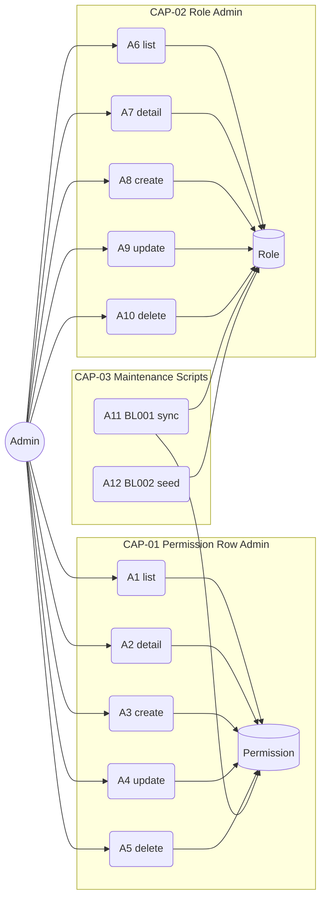
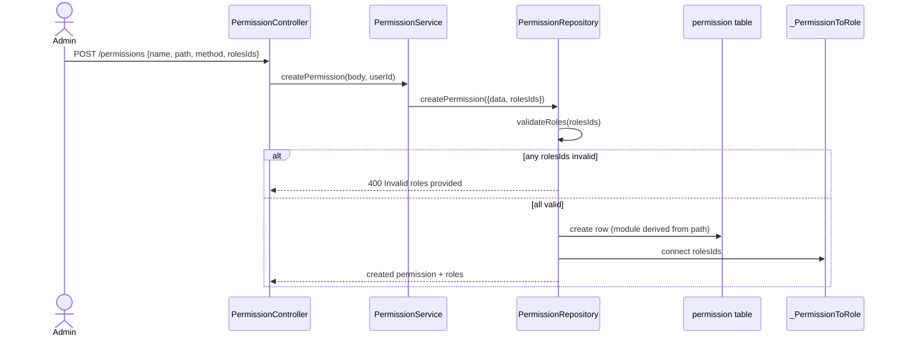
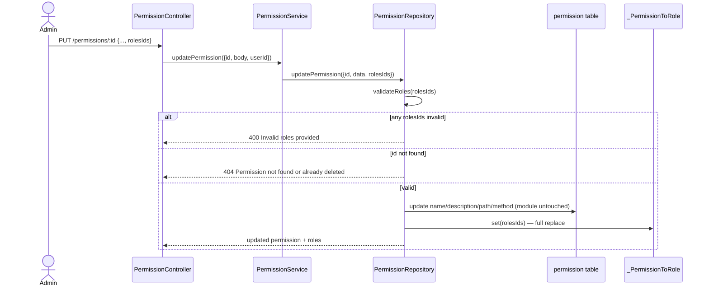
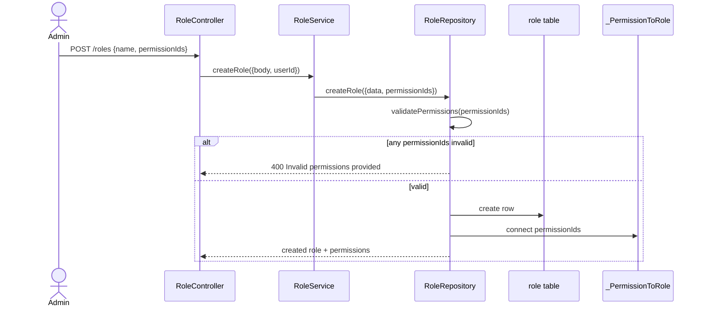
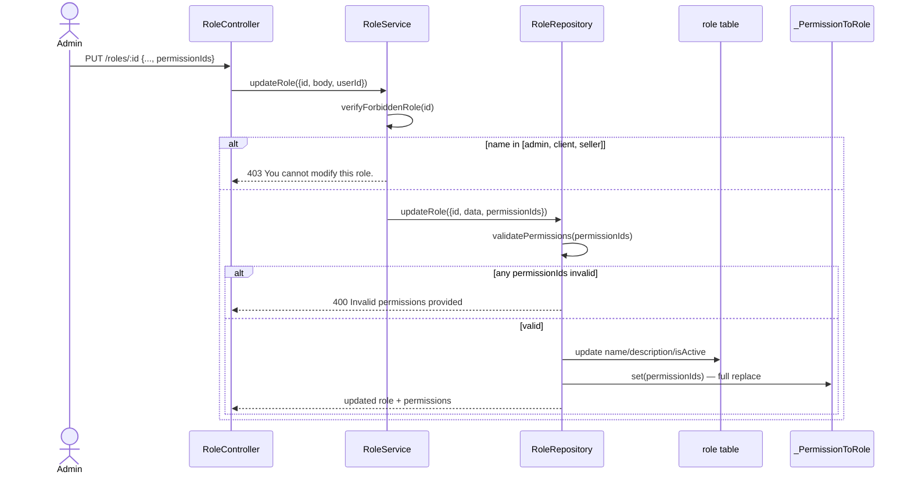
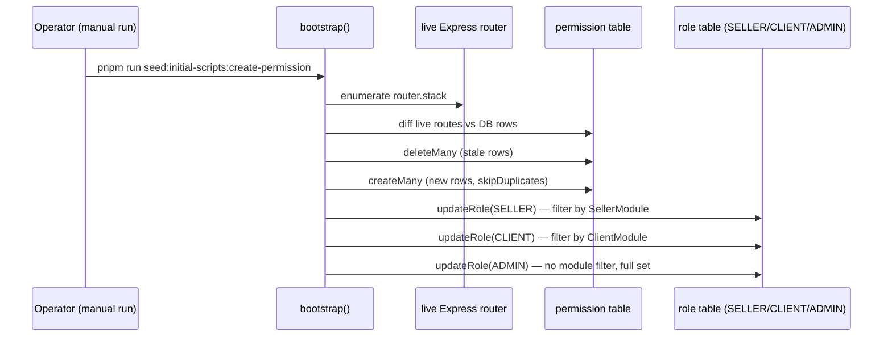
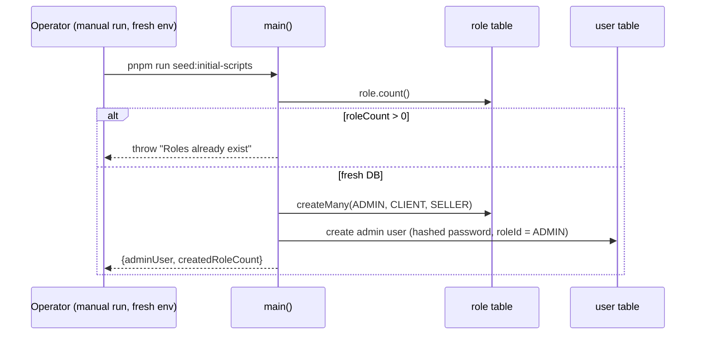
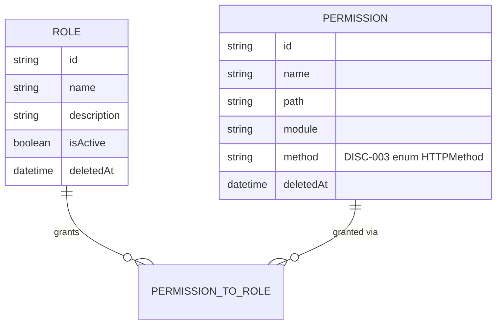
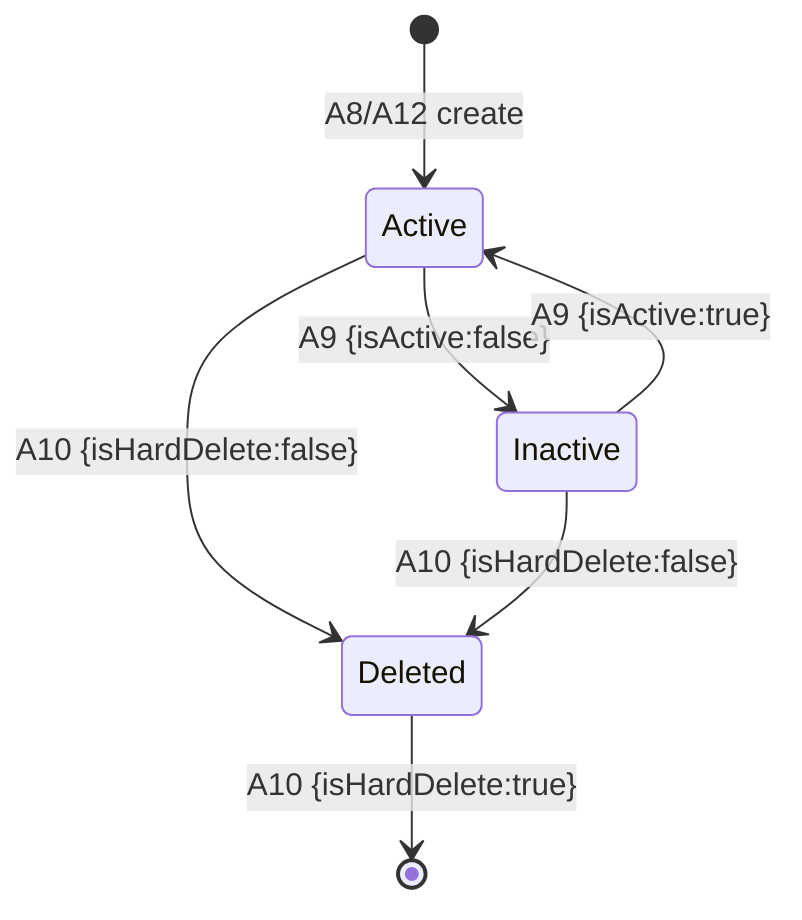

<!-- Contract: references/feature-spec-researcher-contract.md -->

# F006_AccessControlAdministration — Technical Spec

**Priority**: P2
**Type**: mixed
**Generated**: 2026-09-12

**See also:** [`functional-spec.md`](./functional-spec.md) — plain-language overview, open
decisions, requirements/business rules stated in one-liners, screens, user stories, scenarios,
edge cases, and configuration for a BA/QA audience.

**How to read this file:** § 2 is the index — pick the action you care about and read its block
in § 3 straight through; each block is one complete thread, top to bottom. § 4 is the shared
appendix — jump in only when a § 3 block points you there.

> **⚠️ Partially superseded on 2026-09-21 (RBAC refactor).** This spec was generated against the
> route-based permission model. Since the refactor:
>
> - Permissions are semantic keys `resource:action:scope` declared on handlers with
>   `@RequirePermission`; the `path`/`method`/`module`/`name` columns are gone.
> - `POST/PUT/DELETE /permissions` (FR-203, FR-204, FR-205; actions A3–A5) **no longer exist**. The
>   catalogue is code-owned and read-only over HTTP; grants change on the role side.
> - Roles carry `isSystem`; the hardcoded `forbiddenRoles` array is gone. System roles' grants come
>   from `RolePermissionMatrix` in code and are re-applied on every seed.
> - The module-based allowlist (CAP-03, ALG-002) and its per-method over-grant (D001, RISK-01,
>   RISK-02) are resolved: `client` no longer holds write access to brands/categories/translations.
>
> Current design: [../../authorization-guide.md](../../authorization-guide.md). Role administration
> (CAP-02) is unchanged apart from the `isSystem` check. Re-run `rebuild-spec` to regenerate this file.

## 1. Technical Overview

This feature is the RBAC administration surface itself: a `PermissionController`/`RoleController`
CRUD pair over the two tables (`Permission`, `Role`) that `AccessTokenGuard` reads at runtime on
every other feature's routes. It is architecturally load-bearing beyond its own 10 endpoints: two
standalone scripts (`initial-scripts/create-permission.ts`, `initial-scripts/index.ts`) generate
and reassign that same data, and both are explained here because they have no independent
business outcome of their own. The central fact of this feature is that `updateRole()`
(`initial-scripts/create-permission.ts:149-192`) grants access by **module name only, never by
HTTP method** — a role that is allow-listed for a module receives every method registered under
that module's URL prefix, including write methods.



## 2. Action Index

| # | Action (handler) | Method · Path | Codes | Writes | Detail |
|---|---|---|---|---|---|
| **A0** | *cross-cutting — belongs to no single action* | — | {FR-601, FR-602} | — | § 4.4 |
| **A1** | `PermissionController#getPermissions` | `GET` `/permissions` | {FR-201, US040} | — *(read-only)* | § 3.1 |
| **A2** | `PermissionController#getPermissionById` | `GET` `/permissions/:id` | {FR-202, US041} | — *(read-only)* | § 3.1 |
| **A3** | `PermissionController#createPermission` | `POST` `/permissions` | {FR-203, BR-001, US042} | `permission`, `_PermissionToRole` | § 3.1 ▸ **diagram** |
| **A4** | `PermissionController#updatePermission` | `PUT` `/permissions/:id` | {FR-204, FR-401, BR-001, BR-003, BR-004, US043} | `permission`, `_PermissionToRole` | § 3.1 ▸ **diagram** |
| **A5** | `PermissionController#deletePermission` | `DELETE` `/permissions/:id` | {FR-205, US044} | `permission` | § 3.1 |
| **A6** | `RoleController#getRoles` | `GET` `/roles` | {FR-301, US060} | — *(read-only)* | § 3.2 |
| **A7** | `RoleController#getRoleById` | `GET` `/roles/:id` | {FR-302, US061} | — *(read-only)* | § 3.2 |
| **A8** | `RoleController#createRole` | `POST` `/roles` | {FR-303, BR-004, US062} | `role`, `_PermissionToRole` | § 3.2 ▸ **diagram** |
| **A9** | `RoleController#updateRole` | `PUT` `/roles/:id` | {FR-304, FR-402, FR-602, BR-002, BR-003, BR-004, SM-001, US063} | `role`, `_PermissionToRole` | § 3.2 ▸ **diagram** |
| **A10** | `RoleController#deleteRole` | `DELETE` `/roles/:id` | {FR-305, FR-602, BR-002, SM-001, US064} | `role` | § 3.2 |
| **A11** | `bootstrap` *(background, no FE)* | manual script · `initial-scripts/create-permission.ts` | {FR-001, FR-002, ALG-001, ALG-002, BL001} | `permission`, `role` | § 3.3 ▸ **diagram** |
| **A12** | `main` *(background, no FE)* | manual script · `initial-scripts/index.ts` | {FR-001, SM-001, BL002} | `role`, `user` | § 3.3 ▸ **diagram** |

**Rung set** used by every block in § 3: **Who** → **FE** → **Request** → **BE** → **Rule** →
**Result** → **State** → **Source**. An absent rung is omitted, never rendered as `N/A`/`None.`

## 3. Actions

### 3.1 CAP-01 — Permission Row Administration

#### A1 · List permissions
`GET` `/permissions` → `` `PermissionController#getPermissions` ``
`FR-201` `US040`

**Who** · Admin *(gate A0 — § 4.4)*
**Request** · query params `pageIndex`, `pageSize`, `order`, `orderBy` *(all optional, `PermissionPaginationQueryDto`)*
**BE** · `` `PermissionService#getPermissions` `` paginates and returns rows via `PermissionRepository#findManyPermissions` — `src/routes/permission/permission.service.ts:26-56`
**Result** · read-only — **no DB write**. Returns a page of non-deleted `Permission` rows plus each row's assigned `roles` (`permissionWithRolesSelect`).
**Source:** `src/routes/permission/permission.controller.ts:36-49` → `src/routes/permission/permission.service.ts:26-56` → `src/repositories/permission/permission.repository.ts:29-72`

<!-- No diagram: below threshold — read-only, single table, synchronous. -->

---

#### A2 · Get permission by ID
`GET` `/permissions/:id` → `` `PermissionController#getPermissionById` ``
`FR-202` `US041`

**Who** · Admin *(gate A0)*
**Request** · path param `id` *(UUID, `ParseUUIDPipe`)*
**BE** · `` `PermissionService#getPermissionById` `` → `` `PermissionRepository#findUniquePermission` `` — `src/routes/permission/permission.service.ts:64-68`
**Rule** · **BR-004 — any ID submitted for an assignment must exist and not be soft-deleted.** Not gating this action directly (it takes no assignment input), but the same repository method (`findUniquePermission`) throws not-found on the same `deletedAt: null` filter this rule relies on elsewhere. *(§ 4.4)*
**Result** · read-only — **no DB write**. Returns the row with its `roles`, or a not-found response if no non-deleted row matches.
**Source:** `src/routes/permission/permission.controller.ts:51-72` → `src/routes/permission/permission.service.ts:64-68` → `src/repositories/permission/permission.repository.ts:80-106`

<!-- No diagram: below threshold — read-only, single table, synchronous. -->

---

#### A3 · Create permission
`POST` `/permissions` → `` `PermissionController#createPermission` ``
`FR-203` `BR-001` `US042`

**Who** · Admin *(gate A0)*
**Request** · body `CreatePermissionRequestDto`: `name`, `description?`, `path`, `method` (one of GET/POST/PUT/DELETE/PATCH), `rolesIds?` (UUID array)
**BE** · `` `PermissionService#createPermission` `` derives `module` and delegates to the repository — `src/routes/permission/permission.service.ts:77-97`
**Rule**
- **BR-001 — a new permission's `module` label is auto-derived from its path's first URL segment, never accepted directly from the request.** `module: path.split("/")[1].toUpperCase()` — e.g. `/users` → `USERS`. *(§ 4.4)*
- **BR-004 — every ID in `rolesIds` must exist and not be soft-deleted, or the whole create is rejected.** `PermissionRepository#validateRoles` runs before the insert. *(§ 4.4)*
**Result**
- Writes `permission` row ← name/description/path/method/module/createdById — `src/repositories/permission/permission.repository.ts:144-166`
- Writes `_PermissionToRole` join rows ← `connect` on each ID in `rolesIds` (additive; does not touch any other permission's assignments) — `src/repositories/permission/permission.repository.ts:159-162`
**Source:** `src/routes/permission/permission.controller.ts:74-92` → `src/routes/permission/permission.service.ts:77-97` → `src/repositories/permission/permission.repository.ts:114-189`



---

#### A4 · Update permission
`PUT` `/permissions/:id` → `` `PermissionController#updatePermission` ``
`FR-204` `FR-401` `BR-001` `BR-003` `BR-004` `US043`

**Who** · Admin *(gate A0)*
**Request** · path param `id` (UUID); body `UpdatePermissionRequestDto` — same shape as create: `name`, `description?`, `path`, `method`, `rolesIds?`
**BE** · `` `PermissionService#updatePermission` `` — `src/routes/permission/permission.service.ts:107-131`
**Rule**
- **BR-001 — updating `path` does NOT recompute `module`.** Unlike create, `updatePermission`'s data object never re-derives `module` from the new `path` — the stored label is whatever it was set to on creation. *(§ 4.4, see also RISK-01 in functional-spec.md § 11)*
- **BR-003 — the submitted `rolesIds` fully replaces the row's role assignments.** `roles: { set: rolesIds?.map(...) }` — Prisma `set`, not `connect`; any role previously assigned and left off the new list is unassigned. *(§ 4.4)*
- **BR-004 — every ID in `rolesIds` must exist and not be soft-deleted.** Same `validateRoles` gate as A3. *(§ 4.4)*
**Result**
- Writes `permission.{name,description,path,method,updatedById}` — `src/repositories/permission/permission.repository.ts:213-227`
- Writes `_PermissionToRole` ← `set` replaces the row's role list — `src/repositories/permission/permission.repository.ts:220-222`
**Source:** `src/routes/permission/permission.controller.ts:94-121` → `src/routes/permission/permission.service.ts:107-131` → `src/repositories/permission/permission.repository.ts:199-257`



---

#### A5 · Delete permission
`DELETE` `/permissions/:id` → `` `PermissionController#deletePermission` ``
`FR-205` `US044`

**Who** · Admin *(gate A0)*
**Request** · path param `id` (UUID); body `DeletePermissionRequestDto`: `isHardDelete?` (boolean, default false)
**BE** · `` `PermissionService#deletePermission` `` — `src/routes/permission/permission.service.ts:141-157`
**Result** · Soft delete (default): writes `permission.{deletedAt, deletedById, updatedById}` — `src/repositories/permission/permission.repository.ts:289-300`. Hard delete (when `isHardDelete: true`): permanently removes the `permission` row (cascades its `_PermissionToRole` join rows) — `src/repositories/permission/permission.repository.ts:277-286`.
**Source:** `src/routes/permission/permission.controller.ts:123-150` → `src/routes/permission/permission.service.ts:141-157` → `src/repositories/permission/permission.repository.ts:267-319`

<!-- No diagram: single table write, no branching worth a sequence diagram beyond the
     soft/hard-delete choice already stated plainly in the Result rung. -->

### 3.2 CAP-02 — Role Administration

#### A6 · List roles
`GET` `/roles` → `` `RoleController#getRoles` ``
`FR-301` `US060`

**Who** · Admin *(gate A0)*
**Request** · query params `pageIndex`, `pageSize`, `order`, `orderBy` *(optional, `PaginationQueryDto`)*
**BE** · `` `RoleService#getRoles` `` → `` `RoleRepository#findManyRoles` `` — `src/routes/role/role.service.ts:30-57`
**Result** · read-only — **no DB write**. Returns a page of non-deleted `Role` rows plus each role's assigned `permissions` (`roleWithPermissionsSelect`), including the 3 seeded roles.
**Source:** `src/routes/role/role.controller.ts:36-49` → `src/routes/role/role.service.ts:30-57` → `src/repositories/role/role.repository.ts:24-59`

<!-- No diagram: below threshold — read-only, single table, synchronous. -->

---

#### A7 · Get role by ID
`GET` `/roles/:id` → `` `RoleController#getRoleById` ``
`FR-302` `US061`

**Who** · Admin *(gate A0)*
**Request** · path param `id` (UUID)
**BE** · `` `RoleService#getRoleById` `` → `` `RoleRepository#findUniqueRole` `` — `src/routes/role/role.service.ts:66-70`
**Result** · read-only — **no DB write**. Returns the role with its assigned `permissions`, or a not-found response if no non-deleted role matches.
**Source:** `src/routes/role/role.controller.ts:58-72` → `src/routes/role/role.service.ts:66-70` → `src/repositories/role/role.repository.ts:67-90`

<!-- No diagram: below threshold — read-only, single table, synchronous. -->

---

#### A8 · Create role
`POST` `/roles` → `` `RoleController#createRole` ``
`FR-303` `BR-004` `US062`

**Who** · Admin *(gate A0)*
**Request** · body `CreateRoleRequestDto`: `name`, `description?`, `isActive?`, `permissionIds?` (UUID array)
**BE** · `` `RoleService#createRole` `` → `` `RoleRepository#createRole` `` — `src/routes/role/role.service.ts:79-96`
**Rule** · **BR-004 — every ID in `permissionIds` must exist and not be soft-deleted, or the create is rejected.** `RoleRepository#validatePermissions` runs before the insert. **Creation is never subject to the seeded-role lock (BR-002)** — that lock only guards update/delete. *(§ 4.4)*
**Result**
- Writes `role` row ← name/description/createdById — `src/repositories/role/role.repository.ts:140-152`
- Writes `_PermissionToRole` ← `connect` on each ID in `permissionIds` — `src/repositories/role/role.repository.ts:143-147`
**Source:** `src/routes/role/role.controller.ts:74-92` → `src/routes/role/role.service.ts:79-96` → `src/repositories/role/role.repository.ts:98-177`



---

#### A9 · Update role
`PUT` `/roles/:id` → `` `RoleController#updateRole` ``
`FR-304` `FR-402` `FR-602` `BR-002` `BR-003` `BR-004` `SM-001` `US063`

**Who** · Admin *(gate A0)*
**Request** · path param `id` (UUID); body `UpdateRoleRequestDto`: `name`, `description?`, `isActive?`, `permissionIds?`
**BE** · `` `RoleService#updateRole` `` calls `verifyForbiddenRole` before delegating to the repository — `src/routes/role/role.service.ts:130-152`
**Rule**
- **BR-002 — the 3 seeded roles (admin, client, seller) can never be edited through this endpoint.** `verifyForbiddenRole` throws 403 if `role.name` is in `forbiddenRoles = [Role.ADMIN, Role.CLIENT, Role.SELLER]`, checked before any write. *(§ 4.4)*
- **BR-003 — the submitted `permissionIds` fully replaces the role's permission list.** `permissions: { set: ... }` in the repository. *(§ 4.4)*
- **BR-004 — every ID in `permissionIds` must exist and not be soft-deleted.** *(§ 4.4)*
**Result**
- Writes `role.{name,description,isActive?,updatedById}` — `src/repositories/role/role.repository.ts:201-212`
- Writes `_PermissionToRole` ← `set` replaces the role's permission list — `src/repositories/role/role.repository.ts:205-209`
**State** · `SM-001`: `Active` → `Inactive` (and back) via the optional `isActive` field on this same request *(§ 4.3)*
**Source:** `src/routes/role/role.controller.ts:94-121` → `src/routes/role/role.service.ts:104-152` → `src/repositories/role/role.repository.ts:98-246`



---

#### A10 · Delete role
`DELETE` `/roles/:id` → `` `RoleController#deleteRole` ``
`FR-305` `FR-602` `BR-002` `SM-001` `US064`

**Who** · Admin *(gate A0)*
**Request** · path param `id` (UUID); body `DeleteRoleRequestDto`: `isHardDelete?` (boolean)
**BE** · `` `RoleService#deleteRole` `` calls `verifyForbiddenRole` before delegating — `src/routes/role/role.service.ts:162-180`
**Rule** · **BR-002 — the 3 seeded roles can never be deleted through this endpoint.** Same `verifyForbiddenRole` gate as A9. *(§ 4.4)*
**Result** · Soft delete (default): writes `role.{deletedAt, deletedById}` — `src/repositories/role/role.repository.ts:275-282`. Hard delete: permanently removes the `role` row (cascades its `_PermissionToRole` join rows) — `src/repositories/role/role.repository.ts:266-273`.
**State** · `SM-001`: `Active`/`Inactive` → `Deleted` (soft) *(§ 4.3)*
**Source:** `src/routes/role/role.controller.ts:123-150` → `src/routes/role/role.service.ts:104-120,162-180` → `src/repositories/role/role.repository.ts:256-300`

<!-- No diagram: single table write; the forbidden-role branch is already fully stated in the
     Rule rung above and doesn't need a second, sequence-diagram record of the same fact. -->

### 3.3 CAP-03 — Permission Set & Role Grant Maintenance

Both actions below are manually-invoked one-shot scripts, not HTTP handlers — they have no
Method·Path and no reachable `**FE**` rung. They are documented here (rather than folded silently
into another feature) because `feature-list.md` explicitly assigns BL001/BL002 to F006: neither
script has a business outcome independent of the Permission/Role tables this feature owns.

#### A11 · Sync permissions from the live route table *(background, no FE)*
`manual script` → `` `bootstrap` ``
`FR-001` `FR-002` `ALG-001` `ALG-002` `BL001`

**Who** · *no human actor — run manually by an operator via* `pnpm run seed:initial-scripts:create-permission`
**Request** · *no HTTP request* — boots the full Nest app in-process (`NestFactory.create(AppModule)`, `app.listen(3010)`) then reads the live Express router
**BE** · `` `bootstrap` `` — `initial-scripts/create-permission.ts:37-147`
**Rule** · **ALG-001 — diffs the live route table against the `Permission` table and reconciles it.** Full mechanism in § 4.5. *(§ 4.5)*
**Result**
- Deletes `permission` rows whose `(method, path)` no longer matches any live route — `initial-scripts/create-permission.ts:84-98`
- Inserts `permission` rows for any live route missing from the DB, `module` derived the same way as A3 (`path.split("/")[1].toUpperCase()`) — `initial-scripts/create-permission.ts:100-110`
- Writes `role.permissions` (the `_PermissionToRole` join) for `SELLER`, `CLIENT`, and `ADMIN` — see ALG-002 in § 4.5, invoked by this action — `initial-scripts/create-permission.ts:123-136,149-192`
**Source:** `initial-scripts/create-permission.ts:37-147` → `initial-scripts/create-permission.ts:149-192`



---

#### A12 · Seed bootstrap roles and first admin user *(background, no FE)*
`manual script` → `` `main` ``
`FR-001` `SM-001` `BL002`

**Who** · *no human actor — run once, manually, on a fresh environment via* `pnpm run seed:initial-scripts`
**Request** · *no HTTP request* — reads `ADMIN_NAME`/`ADMIN_EMAIL`/`ADMIN_PASSWORD`/`ADMIN_PHONE_NUMBER` from `.env.<NODE_ENV>`
**BE** · `` `main` `` — `initial-scripts/index.ts:30-84`
**Rule** · **Guards against re-running on an already-seeded DB** — throws `"Roles already exist"` if `role.count() > 0` before creating anything. `initial-scripts/index.ts:31-35`
**Result**
- Writes 3 `role` rows: `ADMIN`, `CLIENT`, `SELLER` — `initial-scripts/index.ts:37-53`
- Writes 1 `user` row for the first admin account, password hashed via `HashingService` before insert — `initial-scripts/index.ts:68-78` *(the `user` table itself is out of this feature's scope; recorded here because this script is F006's only path that creates it)*
**State** · `SM-001`: `[*]` → `Active` for each of the 3 seeded roles *(§ 4.3)*
**Source:** `initial-scripts/index.ts:30-84`



### 3.4 Edge cases

| Action | Scenario | Behavior |
|---|---|---|
| A3 · A4 · A8 · A9 | Submitted `rolesIds`/`permissionIds` includes an ID that doesn't exist or is soft-deleted | 400 Bad Request — "Invalid roles provided." / "Invalid permissions provided."; nothing is written |
| A9 · A10 | Target role's `name` is `admin`, `client`, or `seller` | 403 Forbidden — "You cannot modify this role."; no write occurs |
| A2 · A7 | `id` path param doesn't match any non-deleted row | 404 Not Found |
| A4 · A3 · A11 | A3 creates a hand-authored permission row for a route not currently live; A11 next runs | The row is deleted by A11's diff — no notice given to the admin who created it |
| A1-A10 | Caller's role holds no `Permission` row for the exact (path, method) being called | 403 Forbidden — "You do not have permission to access this resource." (gate A0) |
| A5 · A10 | `isHardDelete: true` on a row still referenced by its join table | Prisma cascades the `_PermissionToRole` rows automatically; no explicit cascade-handling code found in this feature — `[UNVERIFIED]` |

## 4. Shared Foundation

### 4.1 Components

| Component | Responsibility | Used in | File |
|---|---|---|---|
| `PermissionController` | HTTP entry point for all 5 `/permissions` routes | A1-A5 | `src/routes/permission/permission.controller.ts` |
| `PermissionService` | Derives `module` on create; orchestrates create/update/delete | A1-A5 | `src/routes/permission/permission.service.ts` |
| `PermissionRepository` | Prisma access + cross-entity ID validation (`validateRoles`) | A1-A5 | `src/repositories/permission/permission.repository.ts` |
| `RoleController` | HTTP entry point for all 5 `/roles` routes | A6-A10 | `src/routes/role/role.controller.ts` |
| `RoleService` | Enforces the seeded-role lock (`verifyForbiddenRole`) before mutating | A6-A10 | `src/routes/role/role.service.ts` |
| `RoleRepository` | Prisma access + cross-entity ID validation (`validatePermissions`) | A6-A10 | `src/repositories/role/role.repository.ts` |
| `AccessTokenGuard` | Runs the per-(path,method) permission check on every request, this feature's endpoints included | A0 (all actions) | `src/shared/guards/access-token.guard.ts` |
| `initial-scripts/create-permission.ts::bootstrap` | Route-table diff + module-based role grant reassignment | A11 | `initial-scripts/create-permission.ts` |
| `initial-scripts/index.ts::main` | One-shot seed of 3 roles + first admin user | A12 | `initial-scripts/index.ts` |

### 4.2 Data Model



| Entity | Table | Used for | Action |
|---|---|---|---|
| `Permission` | `permission` | Per-(path, method) access-control row; what `AccessTokenGuard` checks at runtime | A1-A5, A11 |
| `Role` | `role` | Groups permissions; assigned to `User.roleId` (owned by a different feature) | A6-A10, A11, A12 |

#### Polymorphic Behavior

##### DISC-003 — Permission.method

| Value | Render | Validation | Persistence |
|-------|--------|------------|-------------|
| GET | *(headless API — no render)* | Accepted by A3/A4's `CreatePermissionRequestDto`/`UpdatePermissionRequestDto` (`@IsIn(Object.values(HTTPMethod))`, app-level `HTTPMethod` constant) | Written by A3/A4; also produced by A11 whenever a live GET route is diffed in |
| POST | *(headless API — no render)* | Same as GET | Same as GET |
| PUT | *(headless API — no render)* | Same as GET | Same as GET |
| DELETE | *(headless API — no render)* | Same as GET | Same as GET |
| PATCH | *(headless API — no render)* | Same as GET | Same as GET |
| OPTIONS | *(headless API — no render)* | **Rejected** by the app-level `HTTPMethod` constant (`src/constants/http-method.constant.ts:1-7`, only 5 values) — A3/A4 cannot create this value, and A11's route filter (`Boolean(HTTPMethod[item.method])`) drops it before it ever reaches `createMany` | `[INFERRED]` unreachable — no code path found that persists this value, though the Prisma enum permits it (see RISK-02 in functional-spec.md § 11) |
| HEAD | *(headless API — no render)* | Same rejection as OPTIONS | `[INFERRED]` unreachable, same reasoning as OPTIONS |

**Source:** docs/generated/entities.md § MODEL007_Permission > Discriminator Fields

### 4.3 State Management

#### Role lifecycle (SM-001)
**kind:** entity
**Linked FR:** FR-304, FR-602
**Source:** `prisma/schema.prisma:205-225` (`isActive` + `deletedAt` columns)



**Action transitions:** the guard (seeded-role lock, BR-002) and the write for each edge live in
the **Rule**/**Result** rungs of the action named on that edge (A8, A9, A10, A12 — § 3.2/3.3) —
not repeated here.

### 4.4 Shared Rules

#### Bin 3 — cross-cutting, belongs to no single action

**A0 · FR-601 / FR-602 — every action in this feature requires a `Bearer` session whose role holds a matching `Permission` row for the exact route and method being called.**
`AccessTokenGuard.canActivate` — **applies to all 10 HTTP routes** in this feature (and to every
other `Bearer`-protected route in the system, PERM003), not any one action here. Failure throws 403
before any handler in § 3 runs. This is the SAME per-route check the `Permission`/`Role` tables
administered by this very feature exist to drive — a self-referential gate.
**Source:** `src/shared/guards/access-token.guard.ts:56-99` · route-list.md ROUTE041-045, ROUTE061-065

#### Bin 2 — used by ≥2 named actions

**BR-001 — a new permission's `module` label is auto-derived from its path's first URL segment; an edit to `path` does not recompute it.**
Used in: **A3** · **A4**. On create, `module: path.split("/")[1].toUpperCase()` runs every time.
On update, the same field is simply absent from the data object passed to Prisma, so the original
value from creation survives unchanged even if `path` itself is edited.
**Source:** `src/routes/permission/permission.service.ts:90` (create) · `src/routes/permission/permission.service.ts:107-131` (update, no module recompute)
```text
// on create
module = path.split("/")[1].toUpperCase()

// on update — module is simply never touched
data = { name, description, path, method, roles: {set: ...}, updatedById }
```

**BR-003 — updating an assignment list (`rolesIds` on a permission, `permissionIds` on a role) always fully replaces the list, never merges.**
Used in: **A4** · **A9**. Both repositories pass the submitted IDs through Prisma's `set`
operator on the many-to-many relation, which first clears then re-attaches — anything omitted
from the new array is unassigned.
**Source:** `src/repositories/permission/permission.repository.ts:220-222` · `src/repositories/role/role.repository.ts:205-209`
```text
roles: { set: rolesIds?.map((id) => ({ id })) }
permissions: { set: permissionIds?.map((id) => ({ id })) }
```

**BR-004 — every ID submitted for a cross-entity assignment must exist and not be soft-deleted, or the whole request is rejected.**
Used in: **A3** · **A4** · **A8** · **A9**. `validateRoles`/`validatePermissions` each query for
`{ id: { in: [...] }, deletedAt: null }` and compare the returned count to the submitted count
before allowing the create/update to proceed.
**Source:** `src/repositories/permission/permission.repository.ts:114-135` · `src/repositories/role/role.repository.ts:98-119`
```text
found = findMany({ id: {in: submittedIds}, deletedAt: null })
if found.length !== submittedIds.length: reject 400 "Invalid X provided."
```

**BR-002 — the 3 seeded roles (admin, client, seller) can never be updated or deleted through `/roles`.**
Used in: **A9** · **A10**. `RoleService#verifyForbiddenRole` looks up the target role and throws
403 if its `name` is in the hardcoded `forbiddenRoles` array; this runs before any repository
write in both actions.
**Source:** `src/routes/role/role.service.ts:17,104-120`
```text
forbiddenRoles = [Role.ADMIN, Role.CLIENT, Role.SELLER]
if role.name in forbiddenRoles: reject 403 "You cannot modify this role."
```

### 4.5 Algorithms & Integrations

### Route-to-permission diff and reconciliation (ALG-001)
**Linked FR:** FR-001
**Used in:** A11
**Source:** `initial-scripts/create-permission.ts:41-110`
**Input:** the live Express `router.stack` (every registered route + method) · the current non-deleted `permission` rows · **Output:** the reconciled `permission` table · **Complexity:** O(n·m) (two array `.filter`/`.includes` scans over routes×DB-rows; no indexed lookup)
**Description:** Maps `router.stack` to `{path, method, module}` tuples, keeping only entries whose method is one of the 5 app-recognized `HTTPMethod` values. Formats both the live set and the DB set as `"{method}-{path}"` strings, then computes the DB rows with no live match (delete) and the live routes with no DB match (insert, `skipDuplicates: true`).

**Pseudocode:**
```text
availableRoutes = router.stack
  .filter(hasRoute)
  .map(r => ({path, method: upper(r.method), module: upper(path.split('/')[1])}))
  .filter(r => Boolean(HTTPMethod[r.method]))   // drops OPTIONS/HEAD — see DISC-003

liveKeys = availableRoutes.map(r => `${r.method}-${r.path}`)
dbKeys   = permissionsInDb.map(p => `${p.method}-${p.path}`)

toDelete = permissionsInDb.filter(p => !liveKeys.includes(`${p.method}-${p.path}`))
toInsert = availableRoutes.filter(r => !dbKeys.includes(`${r.method}-${r.path}`))

deleteMany(toDelete.ids); createMany(toInsert, {skipDuplicates: true})
```

### Module-based role permission set derivation (ALG-002)
**Linked FR:** FR-002
**Used in:** A11
**Source:** `initial-scripts/create-permission.ts:14-35,149-192`
**Input:** all non-deleted `permission` rows (`id`, `module`) · a role name (`SELLER`/`CLIENT`/`ADMIN`) · **Output:** that role's full `permissions` relation, replaced · **Complexity:** O(n) per role over all permission rows
**Description:** `Module` maps `SELLER`→5 modules, `CLIENT`→7 modules; `ADMIN` has no entry. For
`SELLER`/`CLIENT`, `permissionIds` is filtered to rows whose `module` is in that role's list —
**every method within an allowed module passes, since the filter is on `module` alone**. For
`ADMIN`, the `moduleList && moduleList.length > 0` guard is false (no entry in `Module`), so
`permissionIds` is never filtered and stays the complete set. The role's `permissions` are then
replaced wholesale (`set`), same replace semantics as BR-003.

**Pseudocode:**
```text
SellerModule = [AUTH, MEDIA, MANAGE-PRODUCT, PRODUCT-TRANSLATIONS, PROFILE]
ClientModule = [AUTH, MEDIA, PRODUCTS, CATEGORIES, BRANDS, PRODUCT-TRANSLATIONS, PROFILE]
Module = { SELLER: SellerModule, CLIENT: ClientModule }   // no ADMIN entry

moduleList = Module[roleName]
permissionIds = moduleList
  ? allPermissions.filter(p => moduleList.includes(p.module)).map(p => p.id)
  : allPermissions.map(p => p.id)   // ADMIN: unfiltered, every permission

role.update({ permissions: { set: permissionIds.map(id => ({id})) } })
```

### 4.6 Configuration

```text
ADMIN_NAME = <string>              # A12 — display name for the seeded first admin account
ADMIN_EMAIL = <string>             # A12 — login email for the seeded first admin account
ADMIN_PASSWORD = <string>          # A12 — plaintext at seed time, hashed via HashingService before insert
ADMIN_PHONE_NUMBER = <string>      # A12 — phone number for the seeded first admin account
```

**Client behavior:** see
[`behavior-logic.md`](../../generated/behavior-logic.md) (client-side patterns — debounce, optimistic UI, polling, upload, realtime),
[`permissions.md`](../../system/permissions.md) (feature flags / experiments / env / locale gates),
[`screen-flow.md`](../../generated/screen-flow.md) (guards / deep-link state restoration / unsaved-changes protection).

## 5. Verification & Technical Notes

### 5.1 Technical Verification

- **SC-001** *(A3, A4, A8, A9)* Submitting a non-existent or soft-deleted ID in `rolesIds`/`permissionIds` returns 400 and no row is written (covers FR-203, FR-204, FR-303, FR-304, BR-004).
- **SC-002** *(A9, A10)* Targeting `admin`/`client`/`seller` on update or delete returns 403 and no row is written (covers FR-304, FR-305, FR-602, BR-002).
- **SC-003** *(A4)* Editing only `path` on an existing permission leaves the stored `module` value unchanged (covers FR-204, BR-001).
- **SC-004** *(A11)* Running the sync script against a DB with a stale permission row (route no longer live) removes exactly that row and no others (covers FR-001, ALG-001).

#### US042_CreatePermission *(A3)*

**Independent Test:** Call `POST /permissions` with a path under an unused prefix (e.g. `/widgets`) and confirm the created row's `module` is `WIDGETS`.

**Acceptance Scenarios:**

1. **Given** an admin session and a valid `path`/`method`, **When** they POST to `/permissions`, **Then** a new row is created with `module` derived from `path`, status 201.
2. **Given** an admin session and a `rolesIds` array containing an unknown UUID, **When** they POST to `/permissions`, **Then** the response is 400 and no row is created.

#### US063_UpdateRole *(A9)*

**Independent Test:** Attempt `PUT /roles/:id` against the seeded `admin` role's ID and confirm a 403 with no DB write, then repeat against a custom role and confirm the update succeeds with `permissions` fully replaced.

**Acceptance Scenarios:**

1. **Given** an admin session and a custom role's ID, **When** they PUT updated `permissionIds`, **Then** the role's permission set exactly equals what was submitted (200).
2. **Given** an admin session and the seeded `admin` role's ID, **When** they PUT any update, **Then** the response is 403 "You cannot modify this role." and nothing changes.

### 5.2 Assumptions

- *(A11)* The sync script is assumed to actually get run whenever routes change in production — this pass found no CI/CD hook or app-startup call wiring it in automatically; this is recorded as observed code, not confirmed operational practice.
- *(A11, A12)* Both scripts are assumed to run with direct, trusted DB access (they construct their own `PrismaService` instance outside the Nest DI container bootstrapped for HTTP) — no additional auth layer applies to them since they are not HTTP-reachable.
- *(A4, A9)* The `set` relation semantics (BR-003) are assumed intentional full-replace behavior, not an oversight — no comment or test in the codebase states this explicitly either way.

### 5.3 Unresolved Questions

1. **Automatic invocation** *(A11)*: no `package.json` script reference, CI/CD step, or Nest lifecycle hook was found that runs `initial-scripts/create-permission.ts` without a human invoking it — could not confirm whether any external tool (deploy pipeline outside this repo) does.
2. **Join-table cascade behavior** *(A5, A10)*: hard-deleting a `Permission` or `Role` row was not traced through Prisma's generated SQL to confirm the `_PermissionToRole` join rows are cleanly cascaded rather than orphaned — assumed standard Prisma implicit-m2m cascade behavior, not directly verified against a migration file.
3. **OPTIONS/HEAD reachability** *(§ 4.2 DISC-003)*: confirmed no *application* code path can create these two enum values, but did not check whether a raw SQL migration or a seed fixture outside the read files ever inserted one historically.

### 5.4 Source References

| Action | Order | Symbol | Path | Purpose |
|---|---|---|---|---|
| — | 1 | `Permission`, `Role` (Prisma models) | `prisma/schema.prisma:182-225` | the two entities this feature administers |
| A1-A5 | 2 | `PermissionController` | `src/routes/permission/permission.controller.ts:1-151` | HTTP entry point for all 5 `/permissions` routes |
| A1-A5 | 3 | `PermissionService` | `src/routes/permission/permission.service.ts:1-158` | derives `module`, orchestrates CRUD |
| A1-A5 | 4 | `PermissionRepository` | `src/repositories/permission/permission.repository.ts:1-320` | Prisma access, cross-entity validation |
| A6-A10 | 5 | `RoleController` | `src/routes/role/role.controller.ts:1-151` | HTTP entry point for all 5 `/roles` routes |
| A6-A10 | 6 | `RoleService` | `src/routes/role/role.service.ts:1-180` | enforces the seeded-role lock |
| A6-A10 | 7 | `RoleRepository` | `src/repositories/role/role.repository.ts:1-301` | Prisma access, cross-entity validation |
| A0 | 8 | `AccessTokenGuard` | `src/shared/guards/access-token.guard.ts:1-123` | per-route permission check every action runs behind |
| A11 | 9 | `bootstrap`/`updateRole` | `initial-scripts/create-permission.ts:1-195` | route-diff sync + module-based role grant |
| A12 | 10 | `main` | `initial-scripts/index.ts:1-94` | one-shot seed of roles + first admin user |

#### Data Flow

```text
{POST /permissions body} -> PermissionService derives module from path -> PermissionRepository
  validates rolesIds -> writes permission row + _PermissionToRole join -> PermissionWithRolesResponseDto
```

### 5.5 Artifact References

| Artifact | File | Codes Used | Reviewed |
|----------|------|------------|----------|
| System Overview | [system-overview.md](../../system-overview.md) | — | [x] |
| Architecture | [architecture.md](../../architecture.md) | — | [x] |
| Feature List | [feature-list.md](../../feature-list.md) | F006 | [x] |
| API Map | [api-map.md](../../api-map.md) | ROUTE041, ROUTE042, ROUTE043, ROUTE044, ROUTE045, ROUTE061, ROUTE062, ROUTE063, ROUTE064, ROUTE065 | [x] |
| Entities | [entities.md](../../entities.md) | MODEL007, MODEL008 | [x] |
| Screens | [functional-spec.md § 6](./functional-spec.md#6-screens) | N/A — headless, no SCR### | [x] |
| Behavior Logic | [behavior-logic.md](../../behavior-logic.md) | BL001, BL002 | [x] |
| Permissions Matrix | [permissions-matrix.md](../../permissions-matrix.md) | PERM003, PERM004, PERM005, PERM008 | [x] |
| User Stories | [user-stories.md](../../user-stories.md) | US040, US041, US042, US043, US044, US060, US061, US062, US063, US064 | [x] |
