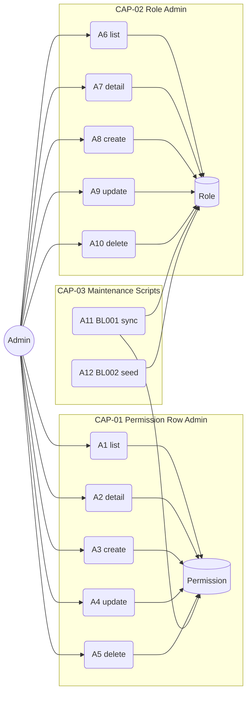
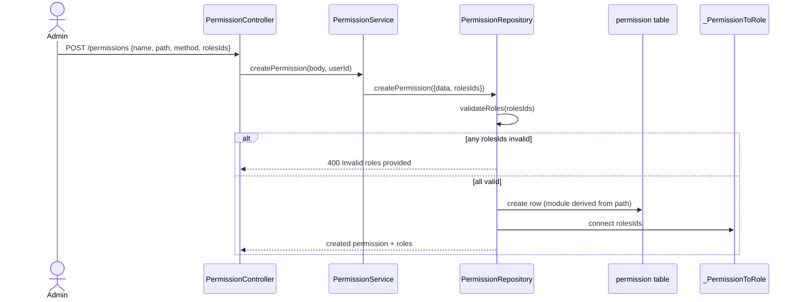
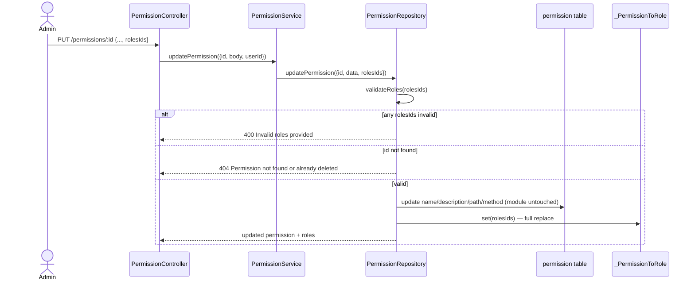
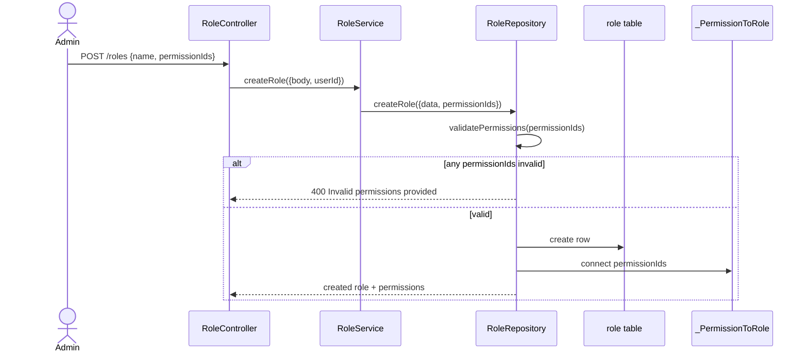
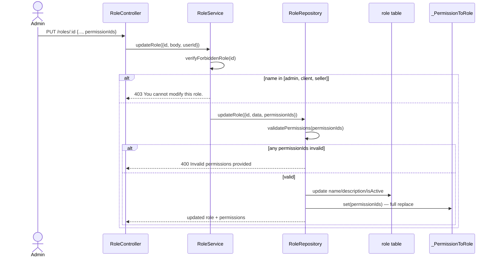
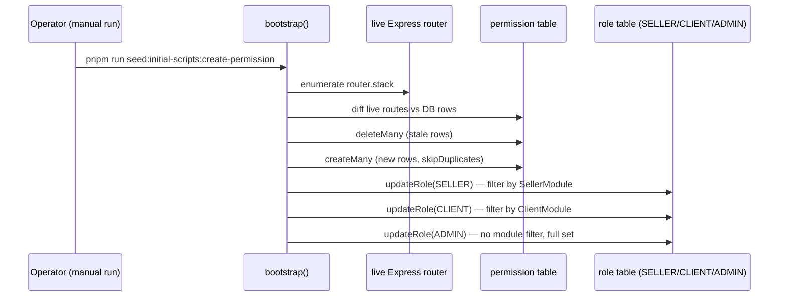
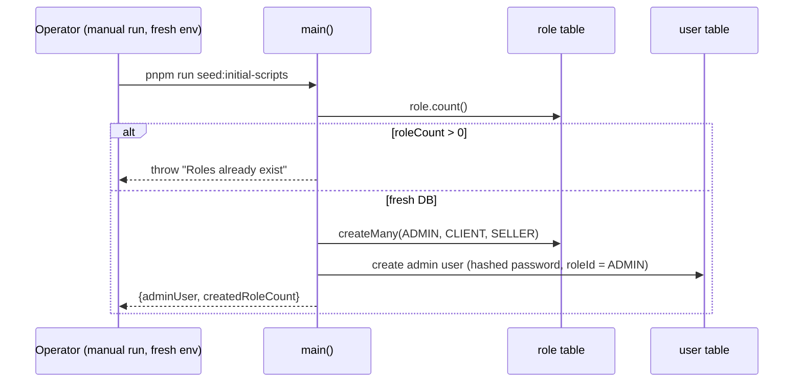
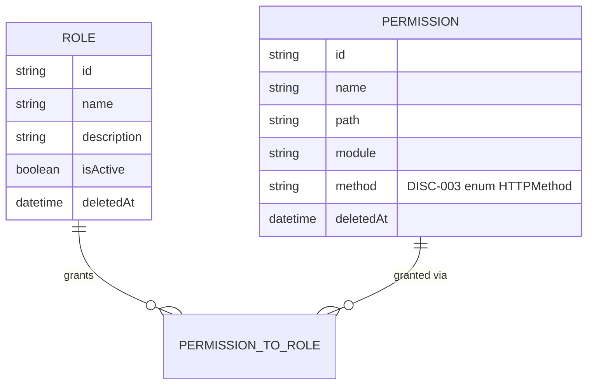
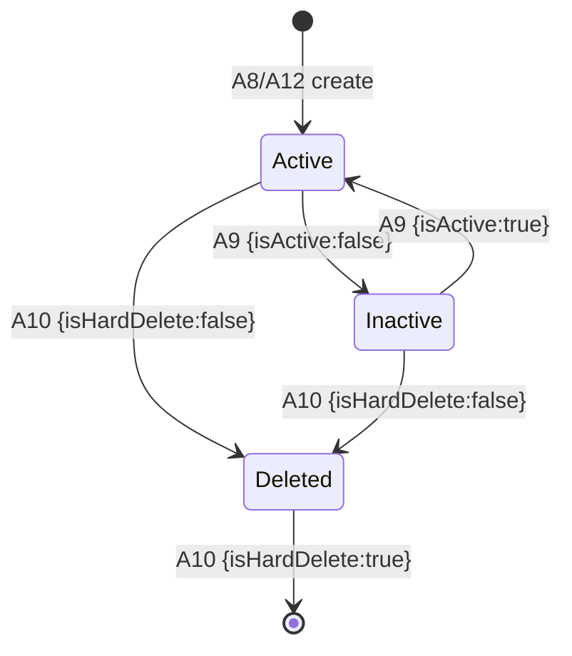

<!-- Contract: references/feature-spec-researcher-contract.md -->

# F006_AccessControlAdministration — Spec Kỹ thuật

**Độ ưu tiên**: P2
**Loại**: mixed
**Được tạo ra**: 2026-09-12

**Xem thêm:** [`functional-spec.vi.md`](./functional-spec.vi.md) — tổng quan bằng ngôn ngữ thuần, các quyết định mở, yêu cầu/quy tắc kinh doanh được nêu trong các dòng một, màn hình, user story, kịch bản, trường hợp cạnh và cấu hình dành cho BA/QA.

**Cách đọc tệp này:** § 2 là chỉ mục — chọn hành động bạn quan tâm và đọc khối của nó trong § 3 từ đầu đến cuối; mỗi khối là một luồng hoàn chỉnh, từ trên xuống dưới. § 4 là phần phụ lục chung — chỉ nhảy vào khi một khối § 3 chỉ bạn đến đó.

> **⚠️ Được thay thế một phần vào 2026-09-21 (RBAC refactor).** Spec này được tạo dựa trên mô hình phân quyền theo route. Kể từ refactor:
>
> - Quyền là các khóa ngữ nghĩa `resource:action:scope` được khai báo trên handler bằng `@RequirePermission`; các cột `path`/`method`/`module`/`name` đã biến mất.
> - `POST/PUT/DELETE /permissions` (FR-203, FR-204, FR-205; hành động A3–A5) **không còn tồn tại nữa**. Danh mục do code sở hữu và chỉ đọc qua HTTP; cấp quyền thay đổi ở phía role.
> - Role có cờ `isSystem`; mảng `forbiddenRoles` hardcode đã biến mất. Quyền của các role hệ thống lấy từ `RolePermissionMatrix` trong code, và được áp lại mỗi lần seed.
> - Allowlist theo module (CAP-03, ALG-002) và tình trạng cấp quyền vượt mức theo từng method của nó (D001, RISK-01, RISK-02) đã được xử lý: `client` không còn có quyền ghi trên brand/category/translation.
>
> Thiết kế hiện tại: [../../authorization-guide.md](../../authorization-guide.md). Quản lý vai trò (CAP-02) không thay đổi ngoại trừ kiểm tra `isSystem`. Chạy lại `rebuild-spec` để tạo lại tệp này.

## 1. Tổng quan kỹ thuật

Tính năng này chính là bề mặt quản trị RBAC: một cặp CRUD `PermissionController`/`RoleController` trên hai bảng (`Permission`, `Role`) mà `AccessTokenGuard` đọc tại runtime trên route của mọi tính năng khác. Về mặt kiến trúc, nó quan trọng (load-bearing) vượt xa 10 endpoint riêng của nó: hai script độc lập (`initial-scripts/create-permission.ts`, `initial-scripts/index.ts`) tạo ra và gán lại chính dữ liệu đó, và cả hai được giải thích ở đây vì bản thân chúng không tạo ra kết quả nghiệp vụ độc lập nào. Thực tế cốt lõi của tính năng này là `updateRole()` (`initial-scripts/create-permission.ts:149-192`) cấp quyền **chỉ theo tên module, không bao giờ theo HTTP method** — một role được allowlist cho một module sẽ nhận toàn bộ method đăng ký dưới tiền tố URL của module đó, kể cả các method ghi.



## 2. Chỉ mục hành động

| # | Hành động (handler) | Phương thức · Đường dẫn | Mã | Ghi | Chi tiết |
|---|---|---|---|---|---|
| **A0** | *cross-cutting — không thuộc hành động nào* | — | {FR-601, FR-602} | — | § 4.4 |
| **A1** | `PermissionController#getPermissions` | `GET` `/permissions` | {FR-201, US040} | — *(chỉ đọc)* | § 3.1 |
| **A2** | `PermissionController#getPermissionById` | `GET` `/permissions/:id` | {FR-202, US041} | — *(chỉ đọc)* | § 3.1 |
| **A3** | `PermissionController#createPermission` | `POST` `/permissions` | {FR-203, BR-001, US042} | `permission`, `_PermissionToRole` | § 3.1 ▸ **diagram** |
| **A4** | `PermissionController#updatePermission` | `PUT` `/permissions/:id` | {FR-204, FR-401, BR-001, BR-003, BR-004, US043} | `permission`, `_PermissionToRole` | § 3.1 ▸ **diagram** |
| **A5** | `PermissionController#deletePermission` | `DELETE` `/permissions/:id` | {FR-205, US044} | `permission` | § 3.1 |
| **A6** | `RoleController#getRoles` | `GET` `/roles` | {FR-301, US060} | — *(chỉ đọc)* | § 3.2 |
| **A7** | `RoleController#getRoleById` | `GET` `/roles/:id` | {FR-302, US061} | — *(chỉ đọc)* | § 3.2 |
| **A8** | `RoleController#createRole` | `POST` `/roles` | {FR-303, BR-004, US062} | `role`, `_PermissionToRole` | § 3.2 ▸ **diagram** |
| **A9** | `RoleController#updateRole` | `PUT` `/roles/:id` | {FR-304, FR-402, FR-602, BR-002, BR-003, BR-004, SM-001, US063} | `role`, `_PermissionToRole` | § 3.2 ▸ **diagram** |
| **A10** | `RoleController#deleteRole` | `DELETE` `/roles/:id` | {FR-305, FR-602, BR-002, SM-001, US064} | `role` | § 3.2 |
| **A11** | `bootstrap` *(background, không FE)* | manual script · `initial-scripts/create-permission.ts` | {FR-001, FR-002, ALG-001, ALG-002, BL001} | `permission`, `role` | § 3.3 ▸ **diagram** |
| **A12** | `main` *(background, không FE)* | manual script · `initial-scripts/index.ts` | {FR-001, SM-001, BL002} | `role`, `user` | § 3.3 ▸ **diagram** |

**Rung set** được sử dụng bởi mỗi khối trong § 3: **Ai** → **FE** → **Request** → **BE** → **Quy tắc** →
**Kết quả** → **Trạng thái** → **Nguồn**. Một rung bị thiếu được bỏ qua, không bao giờ được hiển thị là `N/A`/`None.`

## 3. Hành động

### 3.1 CAP-01 — Quản lý hàng quyền

#### A1 · Liệt kê quyền
`GET` `/permissions` → `` `PermissionController#getPermissions` ``
`FR-201` `US040`

**Ai** · Admin *(cổng A0 — § 4.4)*
**Request** · tham số truy vấn `pageIndex`, `pageSize`, `order`, `orderBy` *(tất cả tùy chọn, `PermissionPaginationQueryDto`)*
**BE** · `` `PermissionService#getPermissions` `` phân trang và trả về các hàng thông qua `PermissionRepository#findManyPermissions` — `src/routes/permission/permission.service.ts:26-56`
**Kết quả** · chỉ đọc — **không ghi DB**. Trả về một trang các hàng `Permission` không bị xóa cộng với `role` được gán của mỗi hàng (`permissionWithRolesSelect`).
**Nguồn:** `src/routes/permission/permission.controller.ts:36-49` → `src/routes/permission/permission.service.ts:26-56` → `src/repositories/permission/permission.repository.ts:29-72`

<!-- No diagram: below threshold — read-only, single table, synchronous. -->

---

#### A2 · Nhận quyền theo ID
`GET` `/permissions/:id` → `` `PermissionController#getPermissionById` ``
`FR-202` `US041`

**Ai** · Admin *(cổng A0)*
**Request** · tham số đường dẫn `id` *(UUID, `ParseUUIDPipe`)*
**BE** · `` `PermissionService#getPermissionById` `` → `` `PermissionRepository#findUniquePermission` `` — `src/routes/permission/permission.service.ts:64-68`
**Quy tắc** · **BR-004 — bất kỳ ID nào được gửi cho một phép gán phải tồn tại và không bị xóa mềm.** Không gating hành động này trực tiếp (nó không lấy đầu vào phép gán), nhưng phương thức repository giống nhau (`findUniquePermission`) sẽ ném not-found trên cùng một bộ lọc `deletedAt: null` mà quy tắc này dựa vào ở nơi khác. *(§ 4.4)*
**Kết quả** · chỉ đọc — **không ghi DB**. Trả về hàng với `role` của nó, hoặc phản hồi not-found nếu không có hàng không bị xóa nào khớp.
**Nguồn:** `src/routes/permission/permission.controller.ts:51-72` → `src/routes/permission/permission.service.ts:64-68` → `src/repositories/permission/permission.repository.ts:80-106`

<!-- No diagram: below threshold — read-only, single table, synchronous. -->

---

#### A3 · Tạo quyền
`POST` `/permissions` → `` `PermissionController#createPermission` ``
`FR-203` `BR-001` `US042`

**Ai** · Admin *(cổng A0)*
**Request** · body `CreatePermissionRequestDto`: `name`, `description?`, `path`, `method` (một trong GET/POST/PUT/DELETE/PATCH), `rolesIds?` (mảng UUID)
**BE** · `` `PermissionService#createPermission` `` suy ra `module` và ủy quyền cho kho lưu trữ — `src/routes/permission/permission.service.ts:77-97`
**Quy tắc**
- **BR-001 — nhãn `module` của một quyền mới được tự động suy ra từ phân khúc URL đầu tiên của đường dẫn của nó, không bao giờ được chấp nhận trực tiếp từ yêu cầu.** `module: path.split("/")[1].toUpperCase()` — ví dụ `/users` → `USERS`. *(§ 4.4)*
- **BR-004 — mỗi ID trong `rolesIds` phải tồn tại và không bị xóa mềm, nếu không toàn bộ tạo bị từ chối.** `PermissionRepository#validateRoles` chạy trước khi insert. *(§ 4.4)*
**Kết quả**
- Ghi hàng `permission` ← name/description/path/method/module/createdById — `src/repositories/permission/permission.repository.ts:144-166`
- Ghi các hàng join `_PermissionToRole` ← `connect` trên mỗi ID trong `rolesIds` (thêm; không chạm bất kỳ phép gán quyền nào khác) — `src/repositories/permission/permission.repository.ts:159-162`
**Nguồn:** `src/routes/permission/permission.controller.ts:74-92` → `src/routes/permission/permission.service.ts:77-97` → `src/repositories/permission/permission.repository.ts:114-189`



---

#### A4 · Cập nhật quyền
`PUT` `/permissions/:id` → `` `PermissionController#updatePermission` ``
`FR-204` `FR-401` `BR-001` `BR-003` `BR-004` `US043`

**Ai** · Admin *(cổng A0)*
**Request** · tham số đường dẫn `id` (UUID); body `UpdatePermissionRequestDto` — cùng hình dạng như tạo: `name`, `description?`, `path`, `method`, `rolesIds?`
**BE** · `` `PermissionService#updatePermission` `` — `src/routes/permission/permission.service.ts:107-131`
**Quy tắc**
- **BR-001 — cập nhật `path` KHÔNG tính toán lại `module`.** Không giống như tạo, `updatePermission` của dữ liệu đối tượng không bao giờ suy ra lại `module` từ `path` mới — nhãn được lưu trữ là bất kỳ điều gì nó được đặt thành khi tạo. *(§ 4.4, xem thêm RISK-01 trong functional-spec.md § 11)*
- **BR-003 — `rolesIds` được gửi đầy đủ thay thế các phép gán vai trò của hàng.** `roles: { set: rolesIds?.map(...) }` — Prisma `set`, không `connect`; bất kỳ vai trò nào trước đó được gán và bỏ qua danh sách mới sẽ bị hủy gán. *(§ 4.4)*
- **BR-004 — mỗi ID trong `rolesIds` phải tồn tại và không bị xóa mềm.** Cổng `validateRoles` giống như A3. *(§ 4.4)*
**Kết quả**
- Ghi `permission.{name,description,path,method,updatedById}` — `src/repositories/permission/permission.repository.ts:213-227`
- Ghi `_PermissionToRole` ← `set` thay thế danh sách vai trò của hàng — `src/repositories/permission/permission.repository.ts:220-222`
**Nguồn:** `src/routes/permission/permission.controller.ts:94-121` → `src/routes/permission/permission.service.ts:107-131` → `src/repositories/permission/permission.repository.ts:199-257`



---

#### A5 · Xóa quyền
`DELETE` `/permissions/:id` → `` `PermissionController#deletePermission` ``
`FR-205` `US044`

**Ai** · Admin *(cổng A0)*
**Request** · tham số đường dẫn `id` (UUID); body `DeletePermissionRequestDto`: `isHardDelete?` (boolean, mặc định false)
**BE** · `` `PermissionService#deletePermission` `` — `src/routes/permission/permission.service.ts:141-157`
**Kết quả** · Xóa mềm (mặc định): ghi `permission.{deletedAt, deletedById, updatedById}` — `src/repositories/permission/permission.repository.ts:289-300`. Xóa cứng (khi `isHardDelete: true`): vĩnh viễn loại bỏ hàng `permission` (cascade sang các dòng join `_PermissionToRole` của nó) — `src/repositories/permission/permission.repository.ts:277-286`.
**Nguồn:** `src/routes/permission/permission.controller.ts:123-150` → `src/routes/permission/permission.service.ts:141-157` → `src/repositories/permission/permission.repository.ts:267-319`

<!-- No diagram: single table write, no branching worth a sequence diagram beyond the
     soft/hard-delete choice already stated plainly in the Result rung. -->

### 3.2 CAP-02 — Quản lý vai trò

#### A6 · Liệt kê vai trò
`GET` `/roles` → `` `RoleController#getRoles` ``
`FR-301` `US060`

**Ai** · Admin *(cổng A0)*
**Request** · tham số truy vấn `pageIndex`, `pageSize`, `order`, `orderBy` *(tùy chọn, `PaginationQueryDto`)*
**BE** · `` `RoleService#getRoles` `` → `` `RoleRepository#findManyRoles` `` — `src/routes/role/role.service.ts:30-57`
**Kết quả** · chỉ đọc — **không ghi DB**. Trả về một trang các hàng `Role` không bị xóa cộng với `permission` được gán của mỗi vai trò (`roleWithPermissionsSelect`), bao gồm 3 vai trò được seeded.
**Nguồn:** `src/routes/role/role.controller.ts:36-49` → `src/routes/role/role.service.ts:30-57` → `src/repositories/role/role.repository.ts:24-59`

<!-- No diagram: below threshold — read-only, single table, synchronous. -->

---

#### A7 · Nhận vai trò theo ID
`GET` `/roles/:id` → `` `RoleController#getRoleById` ``
`FR-302` `US061`

**Ai** · Admin *(cổng A0)*
**Request** · tham số đường dẫn `id` (UUID)
**BE** · `` `RoleService#getRoleById` `` → `` `RoleRepository#findUniqueRole` `` — `src/routes/role/role.service.ts:66-70`
**Kết quả** · chỉ đọc — **không ghi DB**. Trả về vai trò với `permission` được gán của nó, hoặc phản hồi not-found nếu không có vai trò không bị xóa nào khớp.
**Nguồn:** `src/routes/role/role.controller.ts:58-72` → `src/routes/role/role.service.ts:66-70` → `src/repositories/role/role.repository.ts:67-90`

<!-- No diagram: below threshold — read-only, single table, synchronous. -->

---

#### A8 · Tạo vai trò
`POST` `/roles` → `` `RoleController#createRole` ``
`FR-303` `BR-004` `US062`

**Ai** · Admin *(cổng A0)*
**Request** · body `CreateRoleRequestDto`: `name`, `description?`, `isActive?`, `permissionIds?` (mảng UUID)
**BE** · `` `RoleService#createRole` `` → `` `RoleRepository#createRole` `` — `src/routes/role/role.service.ts:79-96`
**Quy tắc** · **BR-004 — mỗi ID trong `permissionIds` phải tồn tại và không bị xóa mềm, nếu không tạo bị từ chối.** `RoleRepository#validatePermissions` chạy trước khi insert. **Tạo không bao giờ phải chịu khóa vai trò seeded (BR-002)** — khóa đó chỉ bảo vệ cập nhật/xóa. *(§ 4.4)*
**Kết quả**
- Ghi hàng `role` ← name/description/createdById — `src/repositories/role/role.repository.ts:140-152`
- Ghi `_PermissionToRole` ← `connect` trên mỗi ID trong `permissionIds` — `src/repositories/role/role.repository.ts:143-147`
**Nguồn:** `src/routes/role/role.controller.ts:74-92` → `src/routes/role/role.service.ts:79-96` → `src/repositories/role/role.repository.ts:98-177`



---

#### A9 · Cập nhật vai trò
`PUT` `/roles/:id` → `` `RoleController#updateRole` ``
`FR-304` `FR-402` `FR-602` `BR-002` `BR-003` `BR-004` `SM-001` `US063`

**Ai** · Admin *(cổng A0)*
**Request** · tham số đường dẫn `id` (UUID); body `UpdateRoleRequestDto`: `name`, `description?`, `isActive?`, `permissionIds?`
**BE** · `` `RoleService#updateRole` `` gọi `verifyForbiddenRole` trước khi ủy quyền cho kho lưu trữ — `src/routes/role/role.service.ts:130-152`
**Quy tắc**
- **BR-002 — 3 vai trò seeded (admin, client, seller) không bao giờ có thể được chỉnh sửa thông qua endpoint này.** `verifyForbiddenRole` ném 403 nếu `role.name` nằm trong `forbiddenRoles = [Role.ADMIN, Role.CLIENT, Role.SELLER]`, được kiểm tra trước bất kỳ ghi nào. *(§ 4.4)*
- **BR-003 — `permissionIds` được gửi đầy đủ thay thế danh sách quyền của vai trò.** `permissions: { set: ... }` trong kho lưu trữ. *(§ 4.4)*
- **BR-004 — mỗi ID trong `permissionIds` phải tồn tại và không bị xóa mềm.** *(§ 4.4)*
**Kết quả**
- Ghi `role.{name,description,isActive?,updatedById}` — `src/repositories/role/role.repository.ts:201-212`
- Ghi `_PermissionToRole` ← `set` thay thế danh sách quyền của vai trò — `src/repositories/role/role.repository.ts:205-209`
**Trạng thái** · `SM-001`: `Active` → `Inactive` (và ngược lại) thông qua trường tùy chọn `isActive` trên cùng yêu cầu này *(§ 4.3)*
**Nguồn:** `src/routes/role/role.controller.ts:94-121` → `src/routes/role/role.service.ts:104-152` → `src/repositories/role/role.repository.ts:98-246`



---

#### A10 · Xóa vai trò
`DELETE` `/roles/:id` → `` `RoleController#deleteRole` ``
`FR-305` `FR-602` `BR-002` `SM-001` `US064`

**Ai** · Admin *(cổng A0)*
**Request** · tham số đường dẫn `id` (UUID); body `DeleteRoleRequestDto`: `isHardDelete?` (boolean)
**BE** · `` `RoleService#deleteRole` `` gọi `verifyForbiddenRole` trước khi ủy quyền — `src/routes/role/role.service.ts:162-180`
**Quy tắc** · **BR-002 — 3 vai trò seeded không bao giờ có thể bị xóa thông qua endpoint này.** Cổng `verifyForbiddenRole` giống như A9. *(§ 4.4)*
**Kết quả** · Xóa mềm (mặc định): ghi `role.{deletedAt, deletedById}` — `src/repositories/role/role.repository.ts:275-282`. Xóa cứng: vĩnh viễn loại bỏ hàng `role` (cascade sang các dòng join `_PermissionToRole` của nó) — `src/repositories/role/role.repository.ts:266-273`.
**Trạng thái** · `SM-001`: `Active`/`Inactive` → `Deleted` (mềm) *(§ 4.3)*
**Nguồn:** `src/routes/role/role.controller.ts:123-150` → `src/routes/role/role.service.ts:104-120,162-180` → `src/repositories/role/role.repository.ts:256-300`

<!-- No diagram: single table write; the forbidden-role branch is already fully stated in the
     Rule rung above and doesn't need a second, sequence-diagram record of the same fact. -->

### 3.3 CAP-03 — Bảo trì tập hợp quyền & cấp quyền vai trò

Cả hai hành động dưới đây đều là script one-shot được gọi thủ công, không phải handler HTTP — chúng không có Method·Path và không có rung `**FE**` nào khả dụng. Chúng được ghi lại ở đây (thay vì gộp âm thầm vào một tính năng khác) vì `feature-list.md` gán rõ ràng BL001/BL002 cho F006: không script nào có kết quả nghiệp vụ độc lập với các bảng Permission/Role mà tính năng này sở hữu.

#### A11 · Đồng bộ hóa quyền từ bảng tuyến đường trực tiếp *(background, không FE)*
`manual script` → `` `bootstrap` ``
`FR-001` `FR-002` `ALG-001` `ALG-002` `BL001`

**Ai** · *không có tác nhân con người — chạy thủ công bởi một nhà điều hành thông qua* `pnpm run seed:initial-scripts:create-permission`
**Request** · *không có yêu cầu HTTP* — khởi động ứng dụng Nest đầy đủ in-process (`NestFactory.create(AppModule)`, `app.listen(3010)`) sau đó đọc bộ định tuyến Express trực tiếp
**BE** · `` `bootstrap` `` — `initial-scripts/create-permission.ts:37-147`
**Quy tắc** · **ALG-001 — so sánh bảng tuyến đường trực tiếp lại với bảng `Permission` và đối sánh nó.** Cơ chế đầy đủ trong § 4.5. *(§ 4.5)*
**Kết quả**
- Xóa các hàng `permission` có `(method, path)` không còn khớp với bất kỳ tuyến đường trực tiếp nào — `initial-scripts/create-permission.ts:84-98`
- Chèn các hàng `permission` cho bất kỳ tuyến đường trực tiếp nào thiếu trong DB, `module` được suy ra giống cách như A3 (`path.split("/")[1].toUpperCase()`) — `initial-scripts/create-permission.ts:100-110`
- Ghi `role.permissions` (join `_PermissionToRole`) cho `SELLER`, `CLIENT` và `ADMIN` — xem ALG-002 trong § 4.5, gọi bởi hành động này — `initial-scripts/create-permission.ts:123-136,149-192`
**Nguồn:** `initial-scripts/create-permission.ts:37-147` → `initial-scripts/create-permission.ts:149-192`



---

#### A12 · Seed bootstrap vai trò và người dùng admin đầu tiên *(background, không FE)*
`manual script` → `` `main` ``
`FR-001` `SM-001` `BL002`

**Ai** · *không có tác nhân con người — chạy một lần, thủ công, trên một môi trường mới thông qua* `pnpm run seed:initial-scripts`
**Request** · *không có yêu cầu HTTP* — đọc `ADMIN_NAME`/`ADMIN_EMAIL`/`ADMIN_PASSWORD`/`ADMIN_PHONE_NUMBER` từ `.env.<NODE_ENV>`
**BE** · `` `main` `` — `initial-scripts/index.ts:30-84`
**Quy tắc** · **Bảo vệ chống lại việc chạy lại trên DB đã được seeded** — ném `"Roles already exist"` nếu `role.count() > 0` trước khi tạo bất cứ thứ gì. `initial-scripts/index.ts:31-35`
**Kết quả**
- Ghi 3 hàng `role`: `ADMIN`, `CLIENT`, `SELLER` — `initial-scripts/index.ts:37-53`
- Ghi 1 hàng `user` cho tài khoản admin đầu tiên, mật khẩu được hash thông qua `HashingService` trước khi insert — `initial-scripts/index.ts:68-78` *(bảng `user` tự nó ngoài phạm vi của tính năng này; được ghi lại ở đây vì script này là con đường duy nhất của F006 tạo ra nó)*
**Trạng thái** · `SM-001`: `[*]` → `Active` cho mỗi một trong 3 vai trò seeded *(§ 4.3)*
**Nguồn:** `initial-scripts/index.ts:30-84`



### 3.4 Trường hợp cạnh

| Hành động | Kịch bản | Hành vi |
|---|---|---|
| A3 · A4 · A8 · A9 | Được gửi `rolesIds`/`permissionIds` bao gồm một ID không tồn tại hoặc bị xóa mềm | 400 Bad Request — "Invalid roles provided." / "Invalid permissions provided."; không ghi gì |
| A9 · A10 | `name` của vai trò mục tiêu là `admin`, `client` hoặc `seller` | 403 Forbidden — "You cannot modify this role."; không ghi nào xảy ra |
| A2 · A7 | tham số đường dẫn `id` không khớp với bất kỳ hàng không bị xóa nào | 404 Not Found |
| A4 · A3 · A11 | A3 tạo một hàng quyền được viết tay cho một tuyến đường không hiện còn sống; A11 tiếp theo chạy | Hàng bị xóa bởi diff của A11 — không có thông báo nào được đưa ra cho admin tạo nó |
| A1-A10 | Vai trò của người gọi không giữ hàng `Permission` cho chính xác (path, method) được gọi | 403 Forbidden — "You do not have permission to access this resource." (cổng A0) |
| A5 · A10 | `isHardDelete: true` trên một hàng vẫn được tham chiếu bởi bảng join của nó | Prisma tự động cascade các dòng `_PermissionToRole`; không tìm thấy code xử lý cascade rõ ràng trong tính năng này — `[UNVERIFIED]` |

## 4. Nền tảng chung

### 4.1 Thành phần

| Thành phần | Trách nhiệm | Được sử dụng trong | Tệp |
|---|---|---|---|
| `PermissionController` | Điểm vào HTTP cho tất cả 5 tuyến đường `/permissions` | A1-A5 | `src/routes/permission/permission.controller.ts` |
| `PermissionService` | Suy ra `module` khi tạo; điều phối tạo/cập nhật/xóa | A1-A5 | `src/routes/permission/permission.service.ts` |
| `PermissionRepository` | Truy cập Prisma + xác thực ID giữa các entity (`validateRoles`) | A1-A5 | `src/repositories/permission/permission.repository.ts` |
| `RoleController` | Điểm vào HTTP cho tất cả 5 tuyến đường `/roles` | A6-A10 | `src/routes/role/role.controller.ts` |
| `RoleService` | Thực thi khóa vai trò seeded (`verifyForbiddenRole`) trước khi biến đổi | A6-A10 | `src/routes/role/role.service.ts` |
| `RoleRepository` | Truy cập Prisma + xác thực ID giữa các entity (`validatePermissions`) | A6-A10 | `src/repositories/role/role.repository.ts` |
| `AccessTokenGuard` | Chạy kiểm tra quyền mỗi (path,method) trên mỗi yêu cầu, endpoint của tính năng này được bao gồm | A0 (tất cả hành động) | `src/shared/guards/access-token.guard.ts` |
| `initial-scripts/create-permission.ts::bootstrap` | Diff bảng tuyến đường + gán quyền vai trò dựa trên module | A11 | `initial-scripts/create-permission.ts` |
| `initial-scripts/index.ts::main` | Seed một lần 3 vai trò + người dùng admin đầu tiên | A12 | `initial-scripts/index.ts` |

### 4.2 Mô hình dữ liệu



| Entity | Bảng | Được sử dụng cho | Hành động |
|---|---|---|---|
| `Permission` | `permission` | Hàng kiểm soát truy cập mỗi (path, method); những gì `AccessTokenGuard` kiểm tra tại runtime | A1-A5, A11 |
| `Role` | `role` | Quyền nhóm; được gán cho `User.roleId` (được sở hữu bởi một tính năng khác) | A6-A10, A11, A12 |

#### Hành vi đa hình

##### DISC-003 — Permission.method

| Giá trị | Hiển thị | Xác thực | Tồn tại |
|-------|--------|------------|-------------|
| GET | *(headless API — không hiển thị)* | Chấp nhận bởi DTO `CreatePermissionRequestDto`/`UpdatePermissionRequestDto` của A3/A4 (`@IsIn(Object.values(HTTPMethod))`, hằng `HTTPMethod` cấp ứng dụng) | Được ghi bởi A3/A4; cũng được tạo ra bởi A11 bất cứ khi nào tuyến đường GET trực tiếp được diffed vào |
| POST | *(headless API — không hiển thị)* | Giống như GET | Giống như GET |
| PUT | *(headless API — không hiển thị)* | Giống như GET | Giống như GET |
| DELETE | *(headless API — không hiển thị)* | Giống như GET | Giống như GET |
| PATCH | *(headless API — không hiển thị)* | Giống như GET | Giống như GET |
| OPTIONS | *(headless API — không hiển thị)* | **Bị từ chối** bởi hằng `HTTPMethod` cấp ứng dụng (`src/constants/http-method.constant.ts:1-7`, chỉ 5 giá trị) — A3/A4 không thể tạo giá trị này, và bộ lọc tuyến đường của A11 (`Boolean(HTTPMethod[item.method])`) loại bỏ nó trước khi nó bao giờ tiếp cận `createMany` | `[INFERRED]` không thể tiếp cận — không tìm thấy con đường mã nào khi nào nó tồn tại, mặc dù enum Prisma cho phép nó (xem RISK-02 trong functional-spec.md § 11) |
| HEAD | *(headless API — không hiển thị)* | Từ chối tương tự như OPTIONS | `[INFERRED]` không thể tiếp cận, lý do giống như OPTIONS |

**Nguồn:** docs/generated/entities.md § MODEL007_Permission > Discriminator Fields

### 4.3 Quản lý trạng thái

#### Vòng đời vai trò (SM-001)
**kind:** entity
**Linked FR:** FR-304, FR-602
**Nguồn:** `prisma/schema.prisma:205-225` (các cột `isActive` + `deletedAt`)



**Chuyển trạng thái của action:** guard (khóa role hệ thống, BR-002) và thao tác ghi của mỗi cạnh nằm ở phần **Quy tắc**/**Kết quả** của action được đặt tên trên cạnh đó (A8, A9, A10, A12 — § 3.2/3.3) — không lặp lại ở đây.

### 4.4 Quy tắc chung

#### Bin 3 — cross-cutting, không thuộc hành động nào

**A0 · FR-601 / FR-602 — mỗi hành động trong tính năng này yêu cầu một phiên `Bearer` có vai trò giữ hàng `Permission` khớp cho chính xác tuyến đường và phương thức được gọi.**
`AccessTokenGuard.canActivate` — **áp dụng cho tất cả 10 tuyến đường HTTP** trong tính năng này (và cho mỗi tuyến đường được bảo vệ `Bearer` khác trong hệ thống, PERM003), không phải bất kỳ hành động nào ở đây. Không chạy ném 403 trước bất kỳ handler nào trong § 3. Đây chính là kiểm tra per-route mà các bảng `Permission`/`Role` do chính tính năng này quản trị tồn tại để phục vụ — một cổng tự tham chiếu.
**Nguồn:** `src/shared/guards/access-token.guard.ts:56-99` · route-list.md ROUTE041-045, ROUTE061-065

#### Bin 2 — được sử dụng bởi ≥2 hành động được đặt tên

**BR-001 — nhãn `module` của một quyền mới được tự động suy ra từ phân khúc URL đầu tiên của đường dẫn của nó; một chỉnh sửa `path` không tính toán lại nó.**
Được sử dụng trong: **A3** · **A4**. Khi tạo, `module: path.split("/")[1].toUpperCase()` chạy mỗi lần.
Khi cập nhật, trường đó đơn giản là không xuất hiện trong data object gửi cho Prisma, nên giá trị ban đầu từ lúc tạo giữ nguyên không đổi, kể cả khi `path` bị chỉnh sửa.
**Nguồn:** `src/routes/permission/permission.service.ts:90` (tạo) · `src/routes/permission/permission.service.ts:107-131` (cập nhật, không tính toán lại module)
```text
// on create
module = path.split("/")[1].toUpperCase()

// on update — module is simply never touched
data = { name, description, path, method, roles: {set: ...}, updatedById }
```

**BR-003 — cập nhật danh sách phép gán (`rolesIds` trên một quyền, `permissionIds` trên một vai trò) luôn thay thế toàn bộ danh sách, không bao giờ hợp nhất.**
Được sử dụng trong: **A4** · **A9**. Cả hai kho lưu trữ chuyển các ID được gửi thông qua toán tử `set` của Prisma trên quan hệ nhiều-nhiều, điều này trước tiên xóa sau đó re-attaches — bất cứ thứ gì bị bỏ qua từ mảng mới được hủy gán.
**Nguồn:** `src/repositories/permission/permission.repository.ts:220-222` · `src/repositories/role/role.repository.ts:205-209`
```text
roles: { set: rolesIds?.map((id) => ({ id })) }
permissions: { set: permissionIds?.map((id) => ({ id })) }
```

**BR-004 — mỗi ID được gửi cho phép gán giữa các entity phải tồn tại và không bị xóa mềm, nếu không toàn bộ yêu cầu bị từ chối.**
Được sử dụng trong: **A3** · **A4** · **A8** · **A9**. `validateRoles`/`validatePermissions` mỗi truy vấn cho `{ id: { in: [...] }, deletedAt: null }` và so sánh số được trả về với số được gửi trước khi cho phép tạo/cập nhật tiến hành.
**Nguồn:** `src/repositories/permission/permission.repository.ts:114-135` · `src/repositories/role/role.repository.ts:98-119`
```text
found = findMany({ id: {in: submittedIds}, deletedAt: null })
if found.length !== submittedIds.length: reject 400 "Invalid X provided."
```

**BR-002 — 3 vai trò seeded (admin, client, seller) không bao giờ có thể được cập nhật hoặc xóa thông qua `/roles`.**
Được sử dụng trong: **A9** · **A10**. `RoleService#verifyForbiddenRole` tìm kiếm vai trò mục tiêu và ném 403 nếu `name` của nó nằm trong mảng `forbiddenRoles` được hardcode; điều này chạy trước bất kỳ ghi kho lưu trữ nào trong cả hai hành động.
**Nguồn:** `src/routes/role/role.service.ts:17,104-120`
```text
forbiddenRoles = [Role.ADMIN, Role.CLIENT, Role.SELLER]
if role.name in forbiddenRoles: reject 403 "You cannot modify this role."
```

### 4.5 Thuật toán & Tích hợp

### Diff và đối sánh tuyến đường thành quyền (ALG-001)
**Linked FR:** FR-001
**Được sử dụng trong:** A11
**Nguồn:** `initial-scripts/create-permission.ts:41-110`
**Input:** `router.stack` của Express trực tiếp (mỗi tuyến đường đăng ký + phương thức) · các hàng `permission` không bị xóa hiện tại · **Output:** bảng `permission` được đối sánh · **Độ phức tạp:** O(n·m) (hai lần quét `.filter`/`.includes` của mảng trên các tuyến đường×hàng DB; không tìm kiếm được lập chỉ mục)
**Mô tả:** Bản đồ `router.stack` để `{path, method, module}` các bộ dữ liệu, giữ chỉ các mục có phương thức là một trong 5 giá trị `HTTPMethod` được ứng dụng công nhận. Định dạng cả bộ trực tiếp và bộ DB là chuỗi `"{method}-{path}"`, sau đó tính toán các hàng DB không có kết quả trực tiếp (xóa) và các tuyến đường trực tiếp không có kết quả DB (chèn, `skipDuplicates: true`).

**Pseudocode:**
```text
availableRoutes = router.stack
  .filter(hasRoute)
  .map(r => ({path, method: upper(r.method), module: upper(path.split('/')[1])}))
  .filter(r => Boolean(HTTPMethod[r.method]))   // drops OPTIONS/HEAD — see DISC-003

liveKeys = availableRoutes.map(r => `${r.method}-${r.path}`)
dbKeys   = permissionsInDb.map(p => `${p.method}-${p.path}`)

toDelete = permissionsInDb.filter(p => !liveKeys.includes(`${p.method}-${p.path}`))
toInsert = availableRoutes.filter(r => !dbKeys.includes(`${r.method}-${r.path}`))

deleteMany(toDelete.ids); createMany(toInsert, {skipDuplicates: true})
```

### Dẫn xuất tập hợp quyền vai trò dựa trên module (ALG-002)
**Linked FR:** FR-002
**Được sử dụng trong:** A11
**Nguồn:** `initial-scripts/create-permission.ts:14-35,149-192`
**Input:** tất cả các hàng `permission` không bị xóa (`id`, `module`) · một tên vai trò (`SELLER`/`CLIENT`/`ADMIN`) · **Output:** quan hệ `permission` đầy đủ của vai trò đó, được thay thế · **Độ phức tạp:** O(n) mỗi vai trò trên tất cả các hàng quyền
**Mô tả:** `Module` bản đồ `SELLER`→5 module, `CLIENT`→7 module; `ADMIN` không có mục nhập. Với `SELLER`/`CLIENT`, `permissionIds` được lọc còn lại các hàng có `module` nằm trong danh sách của role đó — **mọi method trong một module được cho phép đều lọt qua, vì bộ lọc chỉ dựa trên `module` mà thôi**. Với `ADMIN`, điều kiện `moduleList && moduleList.length > 0` sai (không có mục nào trong `Module`), nên `permissionIds` không bao giờ bị lọc và giữ nguyên toàn bộ tập. Các quyền của vai trò sau đó được thay thế toàn bộ (`set`), ngữ nghĩa thay thế giống như BR-003.

**Pseudocode:**
```text
SellerModule = [AUTH, MEDIA, MANAGE-PRODUCT, PRODUCT-TRANSLATIONS, PROFILE]
ClientModule = [AUTH, MEDIA, PRODUCTS, CATEGORIES, BRANDS, PRODUCT-TRANSLATIONS, PROFILE]
Module = { SELLER: SellerModule, CLIENT: ClientModule }   // no ADMIN entry

moduleList = Module[roleName]
permissionIds = moduleList
  ? allPermissions.filter(p => moduleList.includes(p.module)).map(p => p.id)
  : allPermissions.map(p => p.id)   // ADMIN: unfiltered, every permission

role.update({ permissions: { set: permissionIds.map(id => ({id})) } })
```

### 4.6 Cấu hình

```text
ADMIN_NAME = <string>              # A12 — display name for the seeded first admin account
ADMIN_EMAIL = <string>             # A12 — login email for the seeded first admin account
ADMIN_PASSWORD = <string>          # A12 — plaintext at seed time, hashed via HashingService before insert
ADMIN_PHONE_NUMBER = <string>      # A12 — phone number for the seeded first admin account
```

**Hành vi khách hàng:** xem
[`behavior-logic.vi.md`](../../generated/behavior-logic.vi.md) (mẫu phía khách hàng — debounce, UI lạc quan, polling, tải lên, realtime),
[`permissions.vi.md`](../../system/permissions.vi.md) (cờ tính năng / thử nghiệm / env / cổng locale),
[`screen-flow.vi.md`](../../generated/screen-flow.vi.md) (bảo vệ / khôi phục trạng thái deep-link / bảo vệ thay đổi không lưu).

## 5. Xác minh & Ghi chú kỹ thuật

### 5.1 Xác minh kỹ thuật

- **SC-001** *(A3, A4, A8, A9)* Gửi một ID không tồn tại hoặc bị xóa mềm trong `rolesIds`/`permissionIds` trả về 400 và không ghi hàng nào (bao gồm FR-203, FR-204, FR-303, FR-304, BR-004).
- **SC-002** *(A9, A10)* Định hướng `admin`/`client`/`seller` trên cập nhật hoặc xóa trả về 403 và không ghi hàng nào (bao gồm FR-304, FR-305, FR-602, BR-002).
- **SC-003** *(A4)* Chỉnh sửa chỉ `path` trên một quyền hiện có khiến giá trị `module` được lưu trữ không đổi (bao gồm FR-204, BR-001).
- **SC-004** *(A11)* Chạy tập lệnh đồng bộ hóa lại một DB có hàng quyền cũ (tuyến đường không còn sống) loại bỏ chính xác hàng đó và không có hàng khác (bao gồm FR-001, ALG-001).

#### US042_CreatePermission *(A3)*

**Kiểm tra độc lập:** Gọi `POST /permissions` với một đường dẫn dưới tiền tố chưa sử dụng (ví dụ `/widgets`) và xác nhận hàng được tạo `module` là `WIDGETS`.

**Kịch bản chấp nhận:**

1. **Cho rằng** một phiên admin và `path`/`method` hợp lệ, **Khi** họ POST tới `/permissions`, **Sau đó** một hàng mới được tạo với `module` được suy ra từ `path`, trạng thái 201.
2. **Cho rằng** một phiên admin và mảng `rolesIds` chứa một UUID không xác định, **Khi** họ POST tới `/permissions`, **Sau đó** phản hồi là 400 và không ghi hàng nào.

#### US063_UpdateRole *(A9)*

**Kiểm tra độc lập:** Cố gắng `PUT /roles/:id` lại ID vai trò `admin` được seeded và xác nhận 403 không có ghi DB, sau đó lặp lại lại một vai trò tùy chỉnh và xác nhận cập nhật thành công với `permission` được thay thế đầy đủ.

**Kịch bản chấp nhận:**

1. **Cho rằng** một phiên admin và ID vai trò tùy chỉnh, **Khi** họ PUT `permissionIds` cập nhật, **Sau đó** bộ quyền của vai trò chính xác bằng những gì được gửi (200).
2. **Cho rằng** một phiên admin và ID vai trò `admin` được seeded, **Khi** họ PUT bất kỳ cập nhật nào, **Sau đó** phản hồi là 403 "You cannot modify this role." và không có gì thay đổi.

### 5.2 Giả định

- *(A11)* Tập lệnh đồng bộ hóa được giả định là thực sự chạy mỗi khi route thay đổi trên production — lượt kiểm tra này không tìm thấy hook CI/CD hay lệnh gọi app-startup nào tự động chạy nó; đây chỉ là code quan sát được, chưa xác nhận là thực tiễn vận hành.
- *(A11, A12)* Cả hai script được giả định là chạy với quyền truy cập DB trực tiếp, đáng tin cậy (chúng tự khởi tạo `PrismaService` instance riêng, nằm ngoài container DI của Nest được bootstrap cho HTTP) — không có lớp xác thực bổ sung nào áp dụng cho chúng vì chúng không thể truy cập qua HTTP.
- *(A4, A9)* Ngữ nghĩa quan hệ `set` (BR-003) được giả định là hành vi thay thế đầy đủ có ý định, không phải sơ suất — không có bình luận hoặc kiểm tra trong codebase nêu rõ ràng điều này theo cách này hay cách khác.

### 5.3 Câu hỏi chưa được giải quyết

1. **Gọi tự động** *(A11)*: không tìm thấy tham chiếu script `package.json`, bước CI/CD hoặc hook vòng đời Nest chạy `initial-scripts/create-permission.ts` mà không có con người gọi nó — không thể xác nhận liệu bất kỳ công cụ bên ngoài (triển khai pipeline bên ngoài repo này) nào làm.
2. **Hành vi cascade của join-table** *(A5, A10)*: hard-delete một hàng `Permission` hoặc `Role` chưa được truy vết qua SQL do Prisma tạo ra để xác nhận các dòng join `_PermissionToRole` được cascade sạch sẽ chứ không bị bỏ mồ côi — hành vi cascade ngầm định m2m tiêu chuẩn của Prisma chỉ đang được giả định, chưa xác minh trực tiếp với file migration.
3. **Khả năng tiếp cận OPTIONS/HEAD** *(§ 4.2 DISC-003)*: xác nhận không có con đường mã *ứng dụng* nào có thể tạo hai giá trị enum này, nhưng không kiểm tra liệu migration SQL thô hoặc fixture seed bên ngoài các tệp đọc có bao giờ chèn một cái trong lịch sử hay không.

### 5.4 Tham chiếu nguồn

| Hành động | Thứ tự | Ký hiệu | Đường dẫn | Mục đích |
|---|---|---|---|---|
| — | 1 | `Permission`, `Role` (Prisma model) | `prisma/schema.prisma:182-225` | hai entity tính năng này quản lý |
| A1-A5 | 2 | `PermissionController` | `src/routes/permission/permission.controller.ts:1-151` | điểm vào HTTP cho tất cả 5 tuyến đường `/permissions` |
| A1-A5 | 3 | `PermissionService` | `src/routes/permission/permission.service.ts:1-158` | suy ra `module`, điều phối CRUD |
| A1-A5 | 4 | `PermissionRepository` | `src/repositories/permission/permission.repository.ts:1-320` | truy cập Prisma, xác thực giữa các entity |
| A6-A10 | 5 | `RoleController` | `src/routes/role/role.controller.ts:1-151` | điểm vào HTTP cho tất cả 5 tuyến đường `/roles` |
| A6-A10 | 6 | `RoleService` | `src/routes/role/role.service.ts:1-180` | thực thi khóa vai trò seeded |
| A6-A10 | 7 | `RoleRepository` | `src/repositories/role/role.repository.ts:1-301` | truy cập Prisma, xác thực giữa các entity |
| A0 | 8 | `AccessTokenGuard` | `src/shared/guards/access-token.guard.ts:1-123` | kiểm tra quyền mỗi tuyến đường mỗi hành động chạy phía sau |
| A11 | 9 | `bootstrap`/`updateRole` | `initial-scripts/create-permission.ts:1-195` | đồng bộ hóa diff tuyến đường + cấp quyền vai trò dựa trên module |
| A12 | 10 | `main` | `initial-scripts/index.ts:1-94` | seed một lần của vai trò + người dùng admin đầu tiên |

#### Luồng dữ liệu

```text
{POST /permissions body} -> PermissionService derives module from path -> PermissionRepository
  validates rolesIds -> writes permission row + _PermissionToRole join -> PermissionWithRolesResponseDto
```

### 5.5 Tham chiếu artifact

| Artifact | Tệp | Mã được sử dụng | Được xem xét |
|----------|------|------------|----------|
| System Overview | [system-overview.md](../../system-overview.md) | — | [x] |
| Architecture | [architecture.md](../../architecture.md) | — | [x] |
| Feature List | [feature-list.md](../../feature-list.md) | F006 | [x] |
| API Map | [api-map.md](../../api-map.md) | ROUTE041, ROUTE042, ROUTE043, ROUTE044, ROUTE045, ROUTE061, ROUTE062, ROUTE063, ROUTE064, ROUTE065 | [x] |
| Entities | [entities.md](../../entities.md) | MODEL007, MODEL008 | [x] |
| Screens | [functional-spec.md § 6](./functional-spec.vi.md#6-screens) | N/A — headless, no SCR### | [x] |
| Behavior Logic | [behavior-logic.md](../../behavior-logic.md) | BL001, BL002 | [x] |
| Permissions Matrix | [permissions-matrix.md](../../permissions-matrix.md) | PERM003, PERM004, PERM005, PERM008 | [x] |
| User Stories | [user-stories.md](../../user-stories.md) | US040, US041, US042, US043, US044, US060, US061, US062, US063, US064 | [x] |
