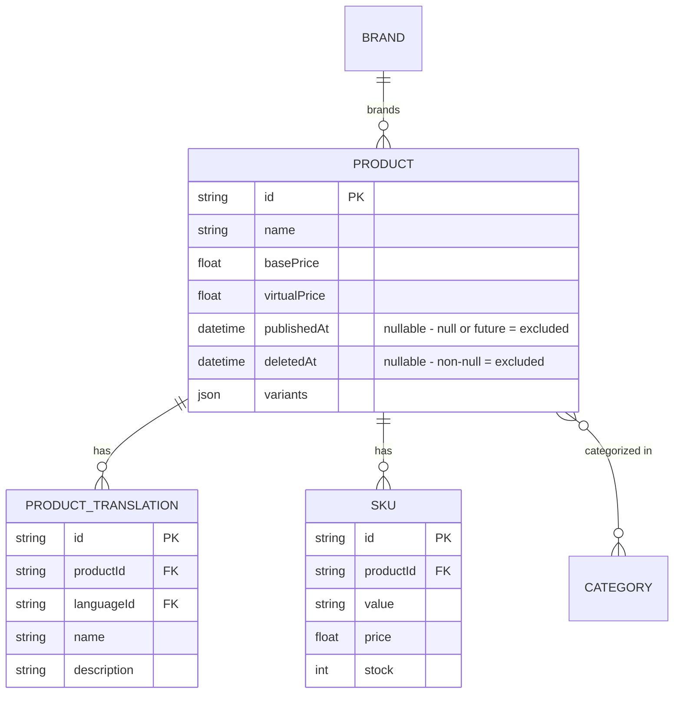

# F007_PublicProductBrowsing — Technical Spec

**Priority**: P1
**Type**: ui
**Generated**: 2026-09-12

**See also:** [`functional-spec.md`](./functional-spec.md) — plain-language overview, open
decisions, requirements/business rules stated in one-liners, screens, user stories, scenarios,
edge cases, and configuration for a BA/QA audience.

**How to read this file:** § 2 is the index — pick the action you care about and read its block
in § 3 straight through; each block is one complete thread, top to bottom. § 4 is the shared
appendix — jump in only when a § 3 block points you there.

## 1. Technical Overview

Two anonymous-accessible read-only `GET` endpoints on `ProductController` (`src/routes/product/product.controller.ts:24-72`)
serve the public catalog: a paginated/filterable list (`GET /products`) and a single-record
detail lookup (`GET /products/:id`). Both are decorated `@IsPublicApi()` — the only decorator that
disables `AccessTokenGuard` at runtime — so neither route reads or validates a `Bearer` token.
`ProductService` (`src/routes/product/product.service.ts`) composes the Prisma `where` clause
(always forcing `isPublic: true` for the list, and `publishedAt`/`deletedAt` filters for the
detail lookup) and delegates the actual query to `ProductRepository` (`src/repositories/product/product.repository.ts`),
which is shared with the seller-owned F008 (`ManageProductService`/`ManageProductController`).

## 2. Action Index

| # | Action (handler) | Method · Path | Codes | Writes | Detail |
|---|---|---|---|---|---|
| **A0** | *cross-cutting — belongs to no single action* | — | {FR-601} | — | § 4.4 |
| **A1** | `ProductController#getProducts` | `GET` `/products` | {FR-001, FR-201, BR-001, BR-002, BR-003, DEC-001, US050} | — *(read-only)* | § 3.1 |
| **A2** | `ProductController#getProductById` | `GET` `/products/:id` | {FR-001, FR-202, BR-001, BR-002, BR-003, US051} | — *(read-only)* | § 3.1 |

**Rung set** — every block in § 3 uses this exact order; an absent rung is omitted, never
rendered as `N/A` or `None.`:

> **Who** → **FE** → **Request** → **BE** → **Rule** → **Result** → **State** → **Source**

**Diagram threshold:** neither A1 nor A2 writes to any table (both read-only) and neither is a
background/async-step action — both stay below threshold; no `sequenceDiagram` is included for
either (see each block's own note).

## 3. Actions

### 3.1 CAP-01 — Public Catalog Browsing

#### A1 · List public products

`GET` `/products` → `` `ProductController#getProducts` ``
`FR-001` `FR-201` `US050`

**Who** · Guest Shopper or any authenticated caller — no role is checked *(gate A0 — § 4.4)*
**FE** · *none — headless API, no view layer*
**Request** · query params via `ProductPaginationQueryDto` (`src/dtos/product/product.dto.ts:120-123`):
`pageIndex` (default 1), `pageSize` (default 10), `order` (`asc`/`desc`), `orderBy` (`name`,
`basePrice`, `virtualPrice`, `publishedAt`, `createdAt`, `updatedAt`, `sale`), `name` (partial
match), `brandIds[]`/`categoryIds[]` (UUID arrays), `minPrice`/`maxPrice`.
Locale is resolved server-side from the request via `@CurrentLang()` (`src/shared/param-decorators/current-lang.decorator.ts:6-11`,
reading `I18nContext.current(ctx).lang`) — not a query param.
**BE** · `` `ProductService#getProducts` `` (`src/routes/product/product.service.ts:18-79`) builds
pagination (`skip = (pageIndex-1)*pageSize`), composes `orderBy` (special-cases `sale` into an
`orders._count` sort, `:42-48`), and always passes `isPublic: true` to the repository — `:59`.
`` `ProductRepository#findManyProducts` `` (`src/repositories/product/product.repository.ts:46-132`)
runs the filtered query and a parallel count in one `$transaction`.
**Rule** · decides which products are eligible to appear in the public list:

| DEC | subtype | Condition | What the user sees | Source |
|---|---|---|---|---|
| **DEC-001** | render | `isPublic === true` forces `publishedAt: {lte: now, not: null}` into the `where` clause (`ProductRepository#findManyProducts`) | only already-published products appear; unpublished/future-dated ones are silently excluded | `src/repositories/product/product.repository.ts:88-92` |

**BR-001 — Only published, non-deleted products are ever returned.** `deletedAt: null` is
always applied (`:85`), and `isPublic: true` is hardcoded by `ProductService.getProducts` (never
client-controlled on this route) so `publishedAt: {lte: now, not: null}` always applies too.
*(§ 4.4)*
**Result** · read-only — **no DB write**. Returns `{ data: Product[], pagination }` via `PageDto`
(`src/routes/product/product.controller.ts:41-44`); `totalPages = Math.ceil(productsCount / pageSize)`
(`src/routes/product/product.service.ts:68`).
**Source:** `src/routes/product/product.controller.ts:35-44` → `src/routes/product/product.service.ts:18-79` → `src/repositories/product/product.repository.ts:46-132`
→ `src/selectors/product.selector.ts:41-65`

<!-- No diagram: below threshold — read-only, single query pair (findMany + count) inside one
     transaction, synchronous, no background step. -->

---

#### A2 · Get product detail by ID

`GET` `/products/:id` → `` `ProductController#getProductById` ``
`FR-001` `FR-202` `US051`

**Who** · Guest Shopper or any authenticated caller — no role is checked *(gate A0 — § 4.4)*
**FE** · *none — headless API, no view layer*
**Request** · path param `id` (`ParseUUIDPipe` — non-UUID rejected before the handler runs,
`src/routes/product/product.controller.ts:62`). Locale resolved the same way as A1, via `@CurrentLang()`.
**BE** · `` `ProductService#getProductById` `` (`src/routes/product/product.service.ts:81-100`) calls
`` `ProductRepository#findUniqueProduct` `` (`src/repositories/product/product.repository.ts:144-174`) with
`where: { id, deletedAt: null, publishedAt: { lte: now, not: null } }` and
`createProductSelect({ languageId })` (`src/selectors/product.selector.ts:41-65`).
**Rule** · **BR-001 — Only published, non-deleted products are ever returned.** Same eligibility
gate as A1, applied inline in the `where` clause instead of a separate branch — a product failing
any part of it is indistinguishable from one that never existed. *(§ 4.4)*
**Result** · read-only — **no DB write**. On no match, `findUniqueOrThrow` throws Prisma's
record-not-found error, caught and translated to `throwHttpException({type:"notFound", message:
"Product not found"})` (`src/repositories/product/product.repository.ts:163-168`) → HTTP 404. On a match, returns the full
`ProductDetailResponseDto` shape (brand, categories, SKUs, translations).
**Source:** `src/routes/product/product.controller.ts:60-71` → `src/routes/product/product.service.ts:81-100` → `src/repositories/product/product.repository.ts:144-174`
→ `src/selectors/product.selector.ts:41-65`

<!-- No diagram: below threshold — read-only, single findUniqueOrThrow call, synchronous. -->

---

### 3.2 Edge cases

| Action | Scenario | Behavior |
|---|---|---|
| A1 | `brandIds`/`categoryIds` contain a non-UUID string | 400 — `class-validator` rejects before the handler runs (`ProductQueryDto`, `src/dtos/product/product.dto.ts:50-72`) |
| A1 | `orderBy` value not in the allowed set | 400 — `@IsIn` rejects before the handler runs (`src/dtos/product/product.dto.ts:113-116`) |
| A1 | no products match the given filters | 200 with `data: []`, `pagination.totalItems: 0` — not an error |
| A2 | `id` is not a valid UUID | 400 — `ParseUUIDPipe` rejects before the handler runs (`src/routes/product/product.controller.ts:62`) |
| A2 | `id` is valid UUID but the product is deleted, unpublished, or scheduled for the future | 404 — `findUniqueOrThrow` miss → "Product not found" (`src/repositories/product/product.repository.ts:163-168`) |
| A1 · A2 | unauthenticated call (no `Bearer` token at all) | 200 — both routes bypass `AccessTokenGuard` entirely via `@IsPublicApi()`; no 401 is possible here |

## 4. Shared Foundation

### 4.1 Components

| Component | Responsibility | Used in | File |
|---|---|---|---|
| `ProductController` | HTTP entry point for both public product routes | A1, A2 | `src/routes/product/product.controller.ts` |
| `ProductService` | Composes pagination/ordering and forces the public-only filter | A1, A2 | `src/routes/product/product.service.ts` |
| `ProductRepository` | Runs the Prisma query/transaction, maps not-found to 404; shared with F008's seller CRUD | A1, A2 | `src/repositories/product/product.repository.ts` |
| `createProductSelect` | Builds the Prisma `select` shape (brand, categories, SKUs, translations) | A1, A2 | `src/selectors/product.selector.ts:41-65` |

### 4.2 Data Model



| Entity | Table | Used for | Action |
|---|---|---|---|
| `Product` (MODEL009) | `product` | The catalog entity this feature reads; `publishedAt`/`deletedAt` gate visibility | A1, A2 |
| `ProductTranslation` (MODEL010) | `productTranslation` | Locale-filtered name/description, owned by F004 | A1, A2 |
| `SKU` (MODEL013) | `sKU` | Purchasable variants shown in product detail (non-deleted only) | A2 (also selected on A1) |
| `Brand` (MODEL014) | `brand` | Brand shown on both list and detail rows | A1, A2 |
| `Category` (MODEL011) | `category` | Categories shown in product detail only (base fields, no translation join — BR-003) | A2 |

#### Polymorphic Behavior

N/A — no discriminator fields in Key Entities. `entities.md` records `Discriminator Fields: None.`
for `Product`, `ProductTranslation`, `SKU`, `Brand`, and `Category`; `Product.publishedAt` is a
nullable timestamp (not an enum) and is documented as a business rule (BR-001), not a DISC.

### 4.3 State Management

None. — Neither action writes any state; no entity lifecycle or UI-local state exists in this
feature (headless, read-only).

### 4.4 Shared Rules

#### Bin 3 — cross-cutting, belongs to no single action

**A0 · {FR-601} — both routes are reachable with zero authentication.**
`@IsPublicApi()` (`src/shared/param-decorators/auth-api.decorator.ts:19`) is applied directly on
`getProducts` (`src/routes/product/product.controller.ts:34`) and `getProductById` (`src/routes/product/product.controller.ts:53`) —
this sets metadata that `AuthorizationHeaderGuard` reads to substitute a no-op guard, so
`AccessTokenGuard` never runs and no `Bearer` token is read or validated for either handler. This is
the SAME mechanism (PERM002) used by the 7 other public auth-related routes; not a rule invented
by this feature. Distinguish from `@ApiPublic`/`@ApiPageOkResponse` (also present on both
handlers, `src/routes/product/product.controller.ts:28-33, 46-52`) — those are Swagger-doc-only and have zero effect
on runtime auth.
**Source:** `src/shared/param-decorators/auth-api.decorator.ts:10-19` · ROUTE051, ROUTE052

#### Bin 2 — used by ≥2 named actions

**BR-001 — Only published, non-deleted products are ever returned.**
Used in: **A1** · **A2**. `ProductService.getProducts` hardcodes `isPublic: true` into every list
query (`src/routes/product/product.service.ts:59`), which `ProductRepository.findManyProducts` turns into
`publishedAt: {lte: new Date(), not: null}` (`src/repositories/product/product.repository.ts:88-92`) alongside the always-on
`deletedAt: null` (`:85`). `ProductService.getProductById` applies the identical
`publishedAt`/`deletedAt` predicate directly in its own `where` clause (`src/routes/product/product.service.ts:88-93`).
Neither caller can override this — there is no client-facing flag to see an unpublished or
deleted product through this feature.
**Source:** `src/routes/product/product.service.ts:59` · `src/repositories/product/product.repository.ts:85-98` · `src/routes/product/product.service.ts:88-93`
```text
if (isPublic === true) {
  where.publishedAt = { lte: now(), not: null }
}
where.deletedAt = null
```

**BR-002 — Product translations are locale-filtered; brand translations are not.**
Used in: **A1** · **A2**. `createProductSelect({ languageId })` filters `productTranslations` to
the caller's resolved locale (`src/selectors/product.selector.ts:48-53`), but passes NO `languageId` to
`createBrandWithTranslationsSelect()` inside the base `productSelect` (`src/selectors/product.selector.ts:17-20`),
so `brandTranslations` defaults to `ALL_LANGUAGES` (`src/selectors/brand.selector.ts:13-16`) regardless of the
caller's locale — every brand-language row comes back, not just the caller's own.
**Source:** `src/selectors/product.selector.ts:10-22,41-65` · `src/selectors/brand.selector.ts:13-27`
```text
productTranslations: where languageId = caller.lang
brand.brandTranslations: where languageId = ALL (languageId param never forwarded)
```

**BR-003 — Category names in product detail are never localized.**
Used in: **A2** (also selected, unused for translation, on A1's underlying select). `createProductSelect`
selects `categories` using the bare `categorySelect` (`src/selectors/category.selector.ts:6-10`),
which carries only `id`/`name`/`logo` — it never joins `categoryTranslationSelect`, unlike
`createCategoryWithTranslationsSelect` which exists in the same file but is not used here. The
category's own base `name` column is returned regardless of the caller's resolved locale.
**Source:** `src/selectors/product.selector.ts:60-63` · `src/selectors/category.selector.ts:6-10`
```text
categories: select { id, name, logo }  // base fields only, no CategoryTranslation join
```

### 4.5 Algorithms & Integrations

None.

### 4.6 Configuration

```text
DEFAULT_PAGE_INDEX = 1   # ProductService.getProducts destructuring default (src/routes/product/product.service.ts:21)
DEFAULT_PAGE_SIZE = 10   # ProductService.getProducts destructuring default (src/routes/product/product.service.ts:21)
```

**Client behavior:** see
[`behavior-logic.md`](../../generated/behavior-logic.md) (client-side patterns — debounce, optimistic UI, polling, upload, realtime),
[`permissions.md`](../../system/permissions.md) (feature flags / experiments / env / locale gates),
[`screen-flow.md`](../../generated/screen-flow.md) (guards / deep-link state restoration / unsaved-changes protection).

## 5. Verification & Technical Notes

### 5.1 Technical Verification

- **SC-001** *(A1)* Calling `GET /products` with no `Bearer` header returns 200 with a paginated
  list, never a 401. (covers FR-601, BR-001)
- **SC-002** *(A1, A2)* Neither endpoint ever returns a product whose `publishedAt` is null/future
  or whose `deletedAt` is set. (covers FR-001, BR-001)
- **SC-003** *(A2)* `GET /products/:id` for a deleted/unpublished/nonexistent ID returns 404, not
  500 or a partial payload. (covers FR-202)

#### US050_BrowseProductCatalog *(A1)*

**Independent Test:** Call `GET /products` with no Authorization header and a `brandIds` filter;
confirm 200, only that brand's products, and only published/non-deleted rows.

**Acceptance Scenarios:**

1. **Given** 3 published products and 1 unpublished product share a brand, **When** an anonymous
   caller lists products filtered by that brand, **Then** exactly the 3 published products are
   returned.
2. **Given** an anonymous caller supplies `orderBy=notarealfield`, **When** they call the list,
   **Then** the request is rejected with 400 before any query runs.

#### US051_ViewProductDetail *(A2)*

**Independent Test:** Call `GET /products/:id` with a deleted product's ID and no Authorization
header; confirm 404, not the product's data.

**Acceptance Scenarios:**

1. **Given** a product is published and not deleted, **When** an anonymous caller requests its
   detail, **Then** 200 with the full detail payload including brand, categories, SKUs, and the
   caller's locale's translation.
2. **Given** a product's `publishedAt` is in the future, **When** an anonymous caller requests its
   detail, **Then** 404 "Product not found."

### 5.2 Assumptions

- *(A1, A2)* `@CurrentLang()`'s `I18nContext.current(ctx).lang` is assumed to always resolve to a
  valid `Language.id` recognized by `productTranslationSelect`'s `where` filter — this pass does
  not trace the i18n module's locale-resolution/fallback chain in full, only that the decorator is
  wired into both handlers.
- *(A1)* The `sale` sort option's `orders._count` ordering is assumed to only ever be reached by a
  well-formed request, since `@IsIn` already restricts `orderBy` to the declared enum before the
  handler runs.

### 5.3 Unresolved Questions

1. **i18n fallback behavior** *(A1, A2)*: not confirmed from source whether `I18nContext` falls
   back to a default language (and which) when the caller's locale (header/query, mechanism not
   traced in this pass) doesn't match any `Language.id`, or whether `productTranslations` would
   simply come back empty in that case.

### 5.4 Source References

| Action | Order | Symbol | Path | Purpose |
|---|---|---|---|---|
| — | 1 | `Product` | `prisma/schema.prisma:227-257` | Entity this feature revolves around |
| A1, A2 | 2 | `ProductController` | `src/routes/product/product.controller.ts:1-72` | HTTP entry point for both public routes |
| A1, A2 | 3 | `ProductService` | `src/routes/product/product.service.ts:1-101` | Composes filters/pagination, forces public-only visibility |
| A1, A2 | 4 | `ProductRepository` | `src/repositories/product/product.repository.ts:34-174` | Runs the Prisma query/transaction, 404 mapping |
| A1, A2 | 5 | `createProductSelect` | `src/selectors/product.selector.ts:41-65` | Shapes the response (brand, categories, SKUs, translations) |

#### Data Flow

```text
Query/path params (ProductPaginationQueryDto | UUID) -> ProductService applies public-only filter
  + pagination/order -> ProductRepository runs Prisma findMany+count (A1) or findUniqueOrThrow (A2)
  -> createProductSelect shapes the row(s) -> PageDto | ProductDetailResponseDto response
```

### 5.5 Artifact References

| Artifact | File | Codes Used | Reviewed |
|----------|------|------------|----------|
| System Overview | [system-overview.md](../../system/system-overview.md) | — | [x] |
| Feature List | [feature-list.md](../../generated/feature-list.md) | F007 | [x] |
| API Map | [route-list.md](../../generated/route-list.md) | ROUTE051, ROUTE052 | [x] |
| Entities | [entities.md](../../generated/entities.md) | MODEL009, MODEL010, MODEL011, MODEL013, MODEL014 | [x] |
| Screens | N/A — headless API, no screens | — | [x] |
| Behavior Logic | [behavior-logic.md](../../generated/behavior-logic.md) | — | [x] |
| Permissions Matrix | [permissions-matrix.md](../../generated/permissions-matrix.md) | PERM002 | [x] |
| User Stories | [user-stories.md](../../generated/user-stories.md) | US050, US051 | [x] |
