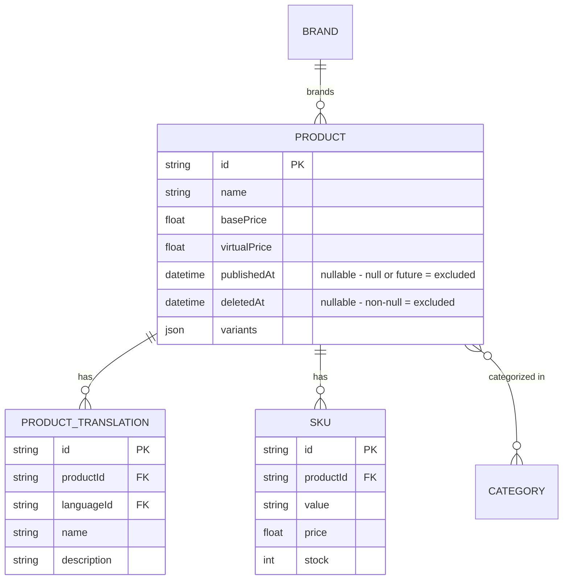

# F007_PublicProductBrowsing — Quy cách kỹ thuật

**Độ ưu tiên**: P1
**Loại**: ui
**Tạo**: 2026-09-12

**Xem thêm:** [`functional-spec.vi.md`](./functional-spec.vi.md) — tổng quan bằng ngôn ngữ đơn giản, các quyết định còn mở,
yêu cầu/quy tắc nghiệp vụ nêu gọn trong một dòng, screen, user story, tình huống,
edge case, và cấu hình, dành cho đối tượng BA/QA.

**Cách đọc file này:** § 2 là mục lục — chọn action bạn quan tâm và đọc trọn block của nó
trong § 3; mỗi block là một mạch nội dung hoàn chỉnh, đọc từ trên xuống. § 4 là phụ lục dùng chung —
chỉ nhảy vào đó khi một block ở § 3 trỏ bạn tới.

## 1. Tổng quan kỹ thuật

Hai endpoint `GET` chỉ đọc, cho phép truy cập ẩn danh trên `ProductController` (`src/routes/product/product.controller.ts:24-72`)
phục vụ catalog công khai: danh sách có phân trang/lọc (`GET /products`) và tra cứu chi tiết
một bản ghi (`GET /products/:id`). Cả hai đều gắn `@IsPublicApi()` — decorator duy nhất tắt
`AccessTokenGuard` ở runtime — nên cả hai route đều không đọc hay validate token `Bearer`.
`ProductService` (`src/routes/product/product.service.ts`) dựng `where` clause của Prisma
(luôn ép `isPublic: true` cho danh sách, và filter theo `publishedAt`/`deletedAt` cho tra cứu
chi tiết) rồi giao truy vấn thật cho `ProductRepository` (`src/repositories/product/product.repository.ts`),
repository này dùng chung với F008 (`ManageProductService`/`ManageProductController`) thuộc phía seller.

## 2. Mục lục Action

| # | Action (handler) | Method · Path | Codes | Writes | Detail |
|---|---|---|---|---|---|
| **A0** | *xuyên suốt — không thuộc riêng action nào* | — | {FR-601} | — | § 4.4 |
| **A1** | `ProductController#getProducts` | `GET` `/products` | {FR-001, FR-201, BR-001, BR-002, BR-003, DEC-001, US050} | — *(chỉ đọc)* | § 3.1 |
| **A2** | `ProductController#getProductById` | `GET` `/products/:id` | {FR-001, FR-202, BR-001, BR-002, BR-003, US051} | — *(chỉ đọc)* | § 3.1 |

**Bộ rung (rung set)** — mọi block ở § 3 dùng đúng thứ tự này; rung nào không có thì bỏ qua, không
bao giờ ghi là `N/A` hay `None.`:

> **Who** → **FE** → **Request** → **BE** → **Rule** → **Result** → **State** → **Source**

**Ngưỡng vẽ diagram:** cả A1 lẫn A2 đều không ghi vào bảng nào (cả hai chỉ đọc) và cũng không phải
action nền/async-step — cả hai đều dưới ngưỡng; không có `sequenceDiagram` nào cho action nào cả
(xem ghi chú riêng ở mỗi block).

## 3. Actions

### 3.1 CAP-01 — Duyệt catalog công khai

#### A1 · Liệt kê sản phẩm công khai

`GET` `/products` → `` `ProductController#getProducts` ``
`FR-001` `FR-201` `US050`

**Who** · Guest Shopper hoặc bất kỳ caller nào đã xác thực — không kiểm tra role *(gate A0 — § 4.4)*
**FE** · *không có — headless API, không có view layer*
**Request** · query params qua `ProductPaginationQueryDto` (`src/dtos/product/product.dto.ts:120-123`):
`pageIndex` (mặc định 1), `pageSize` (mặc định 10), `order` (`asc`/`desc`), `orderBy` (`name`,
`basePrice`, `virtualPrice`, `publishedAt`, `createdAt`, `updatedAt`, `sale`), `name` (match từng
phần), `brandIds[]`/`categoryIds[]` (mảng UUID), `minPrice`/`maxPrice`.
Locale được resolve phía server từ request qua `@CurrentLang()` (`src/shared/param-decorators/current-lang.decorator.ts:6-11`,
đọc `I18nContext.current(ctx).lang`) — không phải query param.
**BE** · `` `ProductService#getProducts` `` (`src/routes/product/product.service.ts:18-79`) dựng
phân trang (`skip = (pageIndex-1)*pageSize`), dựng `orderBy` (xử lý riêng trường hợp `sale` thành sort
theo `orders._count`, `:42-48`), và luôn truyền `isPublic: true` xuống repository — `:59`.
`` `ProductRepository#findManyProducts` `` (`src/repositories/product/product.repository.ts:46-132`)
chạy truy vấn đã lọc và một count song song, cùng trong một `$transaction`.
**Rule** · quyết định sản phẩm nào đủ điều kiện xuất hiện trong danh sách công khai:

| DEC | subtype | Condition | What the user sees | Source |
|---|---|---|---|---|
| **DEC-001** | render | `isPublic === true` buộc `publishedAt: {lte: now, not: null}` vào `where` clause (`ProductRepository#findManyProducts`) | chỉ sản phẩm đã publish mới hiện ra; sản phẩm chưa publish/đặt lịch tương lai bị loại âm thầm | `src/repositories/product/product.repository.ts:88-92` |

**BR-001 — Chỉ trả về sản phẩm đã publish và chưa bị xóa.** `deletedAt: null` luôn được
áp dụng (`:85`), và `isPublic: true` bị hard-code trong `ProductService.getProducts` (client không
bao giờ điều khiển được ở route này) nên `publishedAt: {lte: now, not: null}` cũng luôn được áp dụng.
*(§ 4.4)*
**Result** · chỉ đọc — **không ghi DB**. Trả về `{ data: Product[], pagination }` qua `PageDto`
(`src/routes/product/product.controller.ts:41-44`); `totalPages = Math.ceil(productsCount / pageSize)`
(`src/routes/product/product.service.ts:68`).
**Source:** `src/routes/product/product.controller.ts:35-44` → `src/routes/product/product.service.ts:18-79` → `src/repositories/product/product.repository.ts:46-132`
→ `src/selectors/product.selector.ts:29-43` (`createProductListSelect` — các row trong danh sách không mang `skus`/`categories`, khớp với `ProductResponseDto`)

<!-- No diagram: below threshold — read-only, single query pair (findMany + count) inside one
     transaction, synchronous, no background step. -->

---

#### A2 · Lấy chi tiết sản phẩm theo ID

`GET` `/products/:id` → `` `ProductController#getProductById` ``
`FR-001` `FR-202` `US051`

**Who** · Guest Shopper hoặc bất kỳ caller nào đã xác thực — không kiểm tra role *(gate A0 — § 4.4)*
**FE** · *không có — headless API, không có view layer*
**Request** · path param `id` (`ParseUUIDPipe` — giá trị không phải UUID bị từ chối trước khi
handler chạy, `src/routes/product/product.controller.ts:62`). Locale được resolve giống hệt A1, qua `@CurrentLang()`.
**BE** · `` `ProductService#getProductById` `` (`src/routes/product/product.service.ts:81-100`) gọi
`` `ProductRepository#findUniqueProduct` `` (`src/repositories/product/product.repository.ts:144-174`) với
`where: { id, deletedAt: null, publishedAt: { lte: now, not: null } }` và
`createProductDetailSelect({ languageId })` (`src/selectors/product.selector.ts:58-74`).
**Rule** · **BR-001 — Chỉ trả về sản phẩm đã publish và chưa bị xóa.** Cùng điều kiện lọc như
A1, nhưng áp trực tiếp trong `where` clause thay vì tách nhánh riêng — một sản phẩm bị fail điều
kiện này thì không phân biệt được với một sản phẩm chưa từng tồn tại. *(§ 4.4)*
**Result** · chỉ đọc — **không ghi DB**. Nếu không khớp, `findUniqueOrThrow` throw lỗi record-not-found
của Prisma, được bắt và dịch thành `throwHttpException({type:"notFound", message:
"Product not found"})` (`src/repositories/product/product.repository.ts:163-168`) → HTTP 404. Nếu khớp, trả về nguyên
`ProductDetailResponseDto` (brand, categories, SKU, translation).
**Source:** `src/routes/product/product.controller.ts:60-71` → `src/routes/product/product.service.ts:81-100` → `src/repositories/product/product.repository.ts:144-174`
→ `src/selectors/product.selector.ts:58-74` (`createProductDetailSelect` — thêm `skus`/`categories` so với shape của danh sách)

<!-- No diagram: below threshold — read-only, single findUniqueOrThrow call, synchronous. -->

---

### 3.2 Edge case

| Action | Scenario | Behavior |
|---|---|---|
| A1 | `brandIds`/`categoryIds` chứa chuỗi không phải UUID | 400 — `class-validator` từ chối trước khi handler chạy (`ProductQueryDto`, `src/dtos/product/product.dto.ts:50-72`) |
| A1 | giá trị `orderBy` không nằm trong tập cho phép | 400 — `@IsIn` từ chối trước khi handler chạy (`src/dtos/product/product.dto.ts:113-116`) |
| A1 | không có sản phẩm nào khớp filter đã cho | 200 với `data: []`, `pagination.totalItems: 0` — không phải lỗi |
| A2 | `id` không phải UUID hợp lệ | 400 — `ParseUUIDPipe` từ chối trước khi handler chạy (`src/routes/product/product.controller.ts:62`) |
| A2 | `id` là UUID hợp lệ nhưng sản phẩm đã bị xóa, chưa publish, hoặc đặt lịch tương lai | 404 — `findUniqueOrThrow` miss → "Product not found" (`src/repositories/product/product.repository.ts:163-168`) |
| A1 · A2 | gọi mà không xác thực (không có token `Bearer` nào) | 200 — cả hai route bỏ qua hoàn toàn `AccessTokenGuard` nhờ `@IsPublicApi()`; không thể có 401 ở đây |

## 4. Nền tảng dùng chung

### 4.1 Component

| Component | Trách nhiệm | Dùng ở | File |
|---|---|---|---|
| `ProductController` | Entry point HTTP cho cả hai route sản phẩm công khai | A1, A2 | `src/routes/product/product.controller.ts` |
| `ProductService` | Dựng phân trang/sắp xếp và ép filter chỉ-công-khai | A1, A2 | `src/routes/product/product.service.ts` |
| `ProductRepository` | Chạy truy vấn/transaction Prisma, map not-found thành 404; dùng chung với CRUD phía seller của F008 | A1, A2 | `src/repositories/product/product.repository.ts` |
| `createProductListSelect` | Dựng shape `select` cho danh sách (brand, translation — không có SKU/category) | A1 | `src/selectors/product.selector.ts:29-43` |
| `createProductDetailSelect` | Mở rộng shape danh sách, thêm `skus`/`categories` | A2 | `src/selectors/product.selector.ts:58-74` |

### 4.2 Data Model



| Entity | Table | Dùng cho | Action |
|---|---|---|---|
| `Product` (MODEL009) | `product` | Entity trung tâm của catalog mà feature này đọc; `publishedAt`/`deletedAt` quyết định có hiển thị hay không | A1, A2 |
| `ProductTranslation` (MODEL010) | `productTranslation` | Tên/mô tả đã lọc theo locale, do F004 sở hữu | A1, A2 |
| `SKU` (MODEL013) | `sKU` | Các variant có thể mua, hiện trong chi tiết sản phẩm (chỉ loại chưa bị xóa) | Chỉ A2 — `createProductListSelect` (A1) không còn select `skus` |
| `Brand` (MODEL014) | `brand` | Brand hiện cả ở danh sách lẫn hàng chi tiết | A1, A2 |
| `Category` (MODEL011) | `category` | Category chỉ hiện trong chi tiết sản phẩm (field cơ bản, không join translation — BR-003) | A2 |

#### Hành vi đa hình (Polymorphic)

N/A — Key Entities không có discriminator field nào. `entities.md` ghi `Discriminator Fields: None.`
cho `Product`, `ProductTranslation`, `SKU`, `Brand`, và `Category`; `Product.publishedAt` là timestamp
nullable (không phải enum) và được ghi nhận như một quy tắc nghiệp vụ (BR-001), không phải DISC.

### 4.3 Quản lý state

None. — Không action nào ghi state; feature này không có entity lifecycle hay state cục bộ ở UI
(headless, chỉ đọc).

### 4.4 Quy tắc dùng chung

#### Bin 3 — xuyên suốt, không thuộc riêng action nào

**A0 · {FR-601} — cả hai route đều truy cập được mà không cần xác thực.**
`@IsPublicApi()` (`src/shared/param-decorators/auth-api.decorator.ts:19`) được gắn trực tiếp lên
`getProducts` (`src/routes/product/product.controller.ts:34`) và `getProductById` (`src/routes/product/product.controller.ts:53`) —
decorator này set metadata mà `AuthorizationHeaderGuard` đọc để thay bằng một guard no-op, nên
`AccessTokenGuard` không bao giờ chạy và không handler nào đọc hay validate token `Bearer`. Đây là
CÙNG một cơ chế (PERM002) mà 7 route auth công khai khác dùng; không phải quy tắc riêng của feature
này. Phân biệt với `@ApiPublic`/`@ApiPageOkResponse` (cũng có mặt trên cả hai
handler, `src/routes/product/product.controller.ts:28-33, 46-52`) — hai decorator đó chỉ phục vụ tài liệu Swagger, không
ảnh hưởng gì tới auth ở runtime.
**Source:** `src/shared/param-decorators/auth-api.decorator.ts:10-19` · ROUTE051, ROUTE052

#### Bin 2 — dùng ở ≥2 action được đặt tên

**BR-001 — Chỉ trả về sản phẩm đã publish và chưa bị xóa.**
Dùng ở: **A1** · **A2**. `ProductService.getProducts` hard-code `isPublic: true` vào mọi truy vấn
danh sách (`src/routes/product/product.service.ts:59`), `ProductRepository.findManyProducts` biến nó thành
`publishedAt: {lte: new Date(), not: null}` (`src/repositories/product/product.repository.ts:88-92`) cùng với
`deletedAt: null` luôn bật (`:85`). `ProductService.getProductById` áp cùng predicate
`publishedAt`/`deletedAt` này trực tiếp trong `where` clause của chính nó (`src/routes/product/product.service.ts:88-93`).
Không caller nào override được điều này — không có flag phía client để xem sản phẩm chưa publish
hay đã xóa qua feature này.
**Source:** `src/routes/product/product.service.ts:59` · `src/repositories/product/product.repository.ts:85-98` · `src/routes/product/product.service.ts:88-93`
```text
if (isPublic === true) {
  where.publishedAt = { lte: now(), not: null }
}
where.deletedAt = null
```

**BR-002 — Translation của sản phẩm lọc theo locale; translation của brand thì không.**
Dùng ở: **A1** · **A2**. `createProductListSelect({ languageId })` (base dùng chung mà cả A1 và
`createProductDetailSelect` của A2 đều dựng thêm lên trên) lọc `productTranslations` theo
locale đã resolve của caller (`src/selectors/product.selector.ts:36-42`), nhưng KHÔNG truyền `languageId` vào
`createBrandWithTranslationsSelect()` bên trong `productSelect` gốc (`src/selectors/product.selector.ts:19-22`),
nên `brandTranslations` mặc định lấy `ALL_LANGUAGES` (`src/selectors/brand.selector.ts:13-16`) bất kể locale
của caller — mọi row brand-language đều trả về, không chỉ locale của caller.
**Source:** `src/selectors/product.selector.ts:11-23,29-43` · `src/selectors/brand.selector.ts:13-27`
```text
productTranslations: where languageId = caller.lang
brand.brandTranslations: where languageId = ALL (languageId param never forwarded)
```

**BR-003 — Tên category trong chi tiết sản phẩm không bao giờ được localize.**
Dùng ở: chỉ **A2** — `createProductListSelect` (A1) không select `categories` chút nào.
`createProductDetailSelect`
select `categories` bằng `categorySelect` trần (`src/selectors/category.selector.ts:6-10`),
chỉ mang `id`/`name`/`logo` — không bao giờ join `categoryTranslationSelect`, khác với
`createCategoryWithTranslationsSelect` vốn tồn tại trong cùng file nhưng không được dùng ở đây. Cột
`name` gốc của category được trả về bất kể locale caller đã resolve.
**Source:** `src/selectors/product.selector.ts:70-73` · `src/selectors/category.selector.ts:6-10`
```text
categories: select { id, name, logo }  // base fields only, no CategoryTranslation join
```

### 4.5 Thuật toán & Tích hợp

None.

### 4.6 Cấu hình

```text
DEFAULT_PAGE_INDEX = 1   # ProductService.getProducts destructuring default (src/routes/product/product.service.ts:21)
DEFAULT_PAGE_SIZE = 10   # ProductService.getProducts destructuring default (src/routes/product/product.service.ts:21)
```

**Hành vi phía client:** xem
[`behavior-logic.vi.md`](../../generated/behavior-logic.vi.md) (pattern phía client — debounce, optimistic UI, polling, upload, realtime),
[`permissions.vi.md`](../../system/permissions.vi.md) (feature flag / experiment / env / locale gate),
[`screen-flow.vi.md`](../../generated/screen-flow.vi.md) (guard / khôi phục state khi deep-link / bảo vệ thay đổi chưa lưu).

## 5. Kiểm chứng & Ghi chú kỹ thuật

### 5.1 Kiểm chứng kỹ thuật

- **SC-001** *(A1)* Gọi `GET /products` không kèm header `Bearer` trả về 200 kèm danh sách
  phân trang, không bao giờ 401. (thuộc FR-601, BR-001)
- **SC-002** *(A1, A2)* Không endpoint nào từng trả về sản phẩm có `publishedAt` là null/tương lai
  hoặc có set `deletedAt`. (thuộc FR-001, BR-001)
- **SC-003** *(A2)* `GET /products/:id` với ID đã xóa/chưa publish/không tồn tại trả về 404, không
  phải 500 hay payload thiếu. (thuộc FR-202)

#### US050_BrowseProductCatalog *(A1)*

**Independent Test:** Gọi `GET /products` không kèm header Authorization, kèm filter `brandIds`;
xác nhận 200, chỉ sản phẩm của brand đó, và chỉ các row đã publish/chưa xóa.

**Acceptance Scenarios:**

1. **Given** 3 sản phẩm đã publish và 1 sản phẩm chưa publish cùng chung một brand, **When** một
   caller ẩn danh liệt kê sản phẩm lọc theo brand đó, **Then** trả về đúng 3 sản phẩm đã publish.
2. **Given** caller ẩn danh truyền `orderBy=notarealfield`, **When** họ gọi API danh sách,
   **Then** request bị từ chối với 400 trước khi bất kỳ truy vấn nào chạy.

#### US051_ViewProductDetail *(A2)*

**Independent Test:** Gọi `GET /products/:id` với ID của một sản phẩm đã xóa, không kèm header
Authorization; xác nhận 404, không phải dữ liệu sản phẩm.

**Acceptance Scenarios:**

1. **Given** một sản phẩm đã publish và chưa bị xóa, **When** caller ẩn danh request chi tiết của nó,
   **Then** 200 kèm payload chi tiết đầy đủ gồm brand, category, SKU, và translation theo locale
   của caller.
2. **Given** `publishedAt` của một sản phẩm nằm ở tương lai, **When** caller ẩn danh request chi tiết
   của nó, **Then** 404 "Product not found."

### 5.2 Giả định

- *(A1, A2)* `I18nContext.current(ctx).lang` của `@CurrentLang()` được giả định luôn resolve ra một
  `Language.id` hợp lệ mà filter `where` của `productTranslationSelect` nhận diện được — lượt phân
  tích này không truy hết toàn bộ chuỗi resolve/fallback locale của module i18n, chỉ xác nhận
  decorator đã được gắn vào cả hai handler.
- *(A1)* Sort option `sale` dùng `orders._count` được giả định chỉ nhận request đã hợp lệ, vì
  `@IsIn` đã giới hạn `orderBy` về đúng enum khai báo trước khi handler chạy.

### 5.3 Câu hỏi chưa giải quyết

1. **Hành vi fallback i18n** *(A1, A2)*: chưa xác nhận được từ source liệu `I18nContext` có
   fallback về một ngôn ngữ mặc định (và là ngôn ngữ nào) khi locale của caller (header/query, cơ
   chế chưa được truy trong lượt phân tích này) không khớp `Language.id` nào, hay là
   `productTranslations` đơn giản trả về rỗng trong trường hợp đó.

### 5.4 Tham chiếu Source

| Action | Order | Symbol | Path | Purpose |
|---|---|---|---|---|
| — | 1 | `Product` | `prisma/schema.prisma:227-257` | Entity trung tâm mà feature này xoay quanh |
| A1, A2 | 2 | `ProductController` | `src/routes/product/product.controller.ts:1-72` | Entry point HTTP cho cả hai route công khai |
| A1, A2 | 3 | `ProductService` | `src/routes/product/product.service.ts:1-101` | Dựng filter/phân trang, ép chế độ chỉ-hiện-công-khai |
| A1, A2 | 4 | `ProductRepository` | `src/repositories/product/product.repository.ts:34-174` | Chạy truy vấn/transaction Prisma, map 404 |
| A1 | 5 | `createProductListSelect` | `src/selectors/product.selector.ts:29-43` | Định hình response danh sách (brand, translation — không SKU/category) |
| A2 | 6 | `createProductDetailSelect` | `src/selectors/product.selector.ts:58-74` | Định hình response chi tiết (thêm SKU, category) |

#### Data Flow

```text
Query/path params (ProductPaginationQueryDto | UUID) -> ProductService applies public-only filter
  + pagination/order -> ProductRepository runs Prisma findMany+count (A1) or findUniqueOrThrow (A2)
  -> createProductListSelect (A1) | createProductDetailSelect (A2) shapes the row(s)
  -> PageDto<ProductResponseDto> (A1) | ProductDetailResponseDto (A2) response
```

### 5.5 Tham chiếu Artifact

| Artifact | File | Codes Used | Reviewed |
|----------|------|------------|----------|
| System Overview | [system-overview.md](../../system/system-overview.md) | — | [x] |
| Feature List | [feature-list.vi.md](../../generated/feature-list.vi.md) | F007 | [x] |
| API Map | [route-list.vi.md](../../generated/route-list.vi.md) | ROUTE051, ROUTE052 | [x] |
| Entities | [entities.vi.md](../../generated/entities.vi.md) | MODEL009, MODEL010, MODEL011, MODEL013, MODEL014 | [x] |
| Screens | N/A — headless API, không có screen | — | [x] |
| Behavior Logic | [behavior-logic.vi.md](../../generated/behavior-logic.vi.md) | — | [x] |
| Permissions Matrix | [permissions-matrix.vi.md](../../generated/permissions-matrix.vi.md) | PERM002 | [x] |
| User Stories | [user-stories.vi.md](../../generated/user-stories.vi.md) | US050, US051 | [x] |
