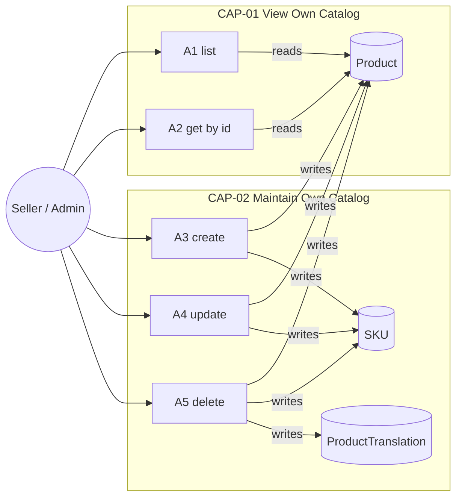
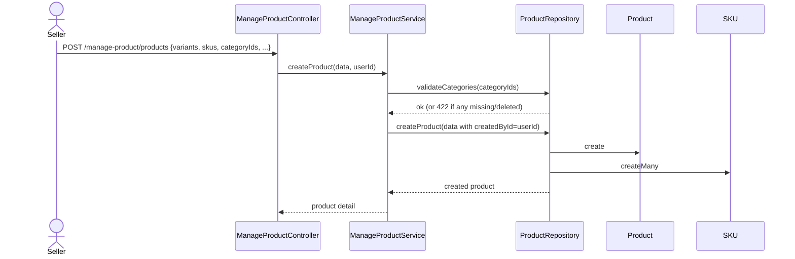
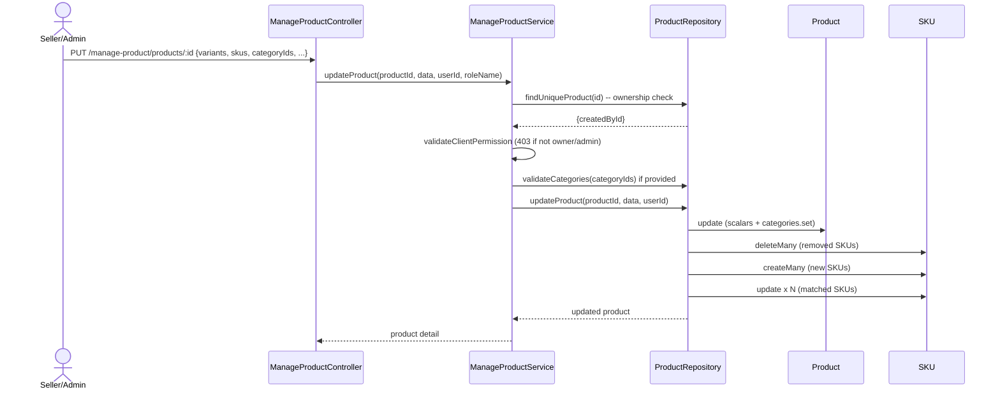
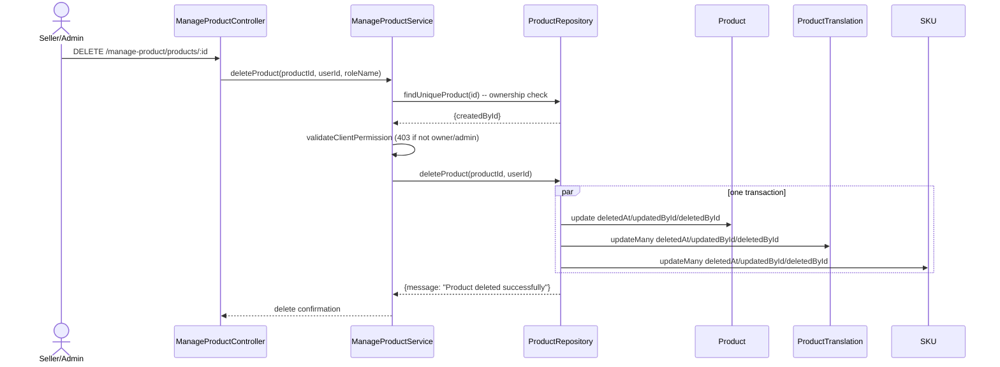
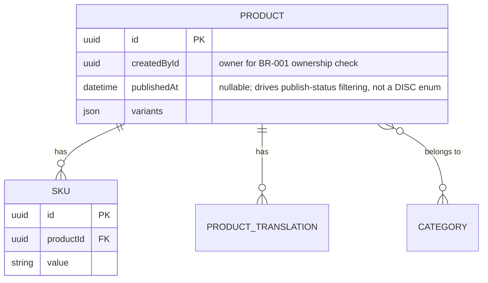

# F008_SellerProductManagement — Technical Spec

**Priority**: P1
**Type**: ui
**Generated**: 2026-09-12

**See also:** [`functional-spec.md`](./functional-spec.md) — plain-language overview, open
decisions, requirements/business rules stated in one-liners, screens, user stories, scenarios,
edge cases, and configuration for a BA/QA audience.

**How to read this file:** § 2 is the index — pick the action you care about and read its block
in § 3 straight through; each block is one complete thread, top to bottom. § 4 is the shared
appendix — jump in only when a § 3 block points you there.

## 1. Technical Overview

`ManageProductController` (`src/routes/product/manage-product/manage-product.controller.ts`)
exposes 5 routes under `/manage-product/products`, all `Bearer`-protected and gated to the
`MANAGE-PRODUCT` permission module (seller + admin only). Every action but create runs a second,
independent authorization layer — `ManageProductService.validateClientPermission` — that throws
403 unless the caller created the product or holds the admin role. `ProductRepository`
(`src/repositories/product/product.repository.ts`) owns the Prisma reads/writes against `Product`,
`SKU`, `Category`, and `ProductTranslation`.



## 2. Action Index

| # | Action (handler) | Method · Path | Codes | Writes | Detail |
|---|---|---|---|---|---|
| **A0** | *cross-cutting — belongs to no single action* | — | {FR-001, FR-002} | — | § 4.4 |
| **A1** | `ManageProductController#getManageProducts` | `GET` `/manage-product/products` | {FR-201, FR-202, FR-204, BR-001, US052} | — *(read-only)* | § 3.1 |
| **A2** | `ManageProductController#getManageProductById` | `GET` `/manage-product/products/:id` | {FR-203, FR-204, BR-001, US053} | — *(read-only)* | § 3.1 |
| **A3** | `ManageProductController#createProduct` | `POST` `/manage-product/products` | {FR-301, FR-302, FR-303, BR-002, BR-003, BR-004, US054} | `product`, `sku` | § 3.2 ▸ **diagram** |
| **A4** | `ManageProductController#updateProduct` | `PUT` `/manage-product/products/:id` | {FR-304, FR-305, FR-601, BR-001, BR-002, BR-003, BR-004, US055} | `product`, `sku` | § 3.2 ▸ **diagram** |
| **A5** | `ManageProductController#deleteProduct` | `DELETE` `/manage-product/products/:id` | {FR-306, FR-305, FR-601, BR-001, BR-005, US056} | `product`, `product_translation`, `sku` | § 3.2 ▸ **diagram** |

## 3. Actions

N/A — no user-facing decision logic (DEC-###) beyond DISC-### Polymorphic Behavior. This is a
headless API with no render/interaction/flow branches; every conditional path found (ownership,
variant/SKU/category validation) is a pass/fail gate on the response as a whole, not a branch in
what is rendered — each is captured as a Business Rule (§ 4.4) instead.

### 3.1 CAP-01 — View Own Catalog

#### A1 · List own products
`GET /manage-product/products` → `` `ManageProductController#getManageProducts` ``
`FR-201` `FR-202` `FR-204` `US052`

**Who** · seller or admin *(gate A0 — § 4.4)*
**Request** · query params `pageIndex`, `pageSize`, `order`, `orderBy`, `name`, `brandIds`,
`categoryIds`, `minPrice`, `maxPrice`, `isPublic`, `createdById` — `createdById` defaults to the
caller's own `userId` when omitted (`src/routes/product/manage-product/manage-product.service.ts:65`)
**BE** · `` `ManageProductService#getProducts` `` — validates ownership, normalizes the sort order,
then delegates to `ProductRepository#findManyProducts` inside a `$transaction` for the page + the
total count. `src/routes/product/manage-product/manage-product.service.ts:50-119`
**Rule**
- **BR-001 — a caller may only see products they created, unless they are admin.** The service
  calls `validateClientPermission({userId, roleName, createdById})` where `createdById` is the
  requested filter value (defaulted to the caller's own `userId`). A seller who tries to pass
  another user's ID as `createdById` is rejected with 403 before the query runs. *(§ 4.4)*
**Result** · read-only — **no DB write**. Returns a paginated `Product` list; `totalPages` is
derived as `Math.ceil(productsCount / pageSize)`. `isPublic` is a three-way filter in the
repository: `true` → only published products (`publishedAt <= now`), `false` → only
unpublished/future-dated products, omitted → no publish-status filter (see § 5.1 for the observed
gap between this intent and the actual DTO transform).
**Source:** `src/routes/product/manage-product/manage-product.controller.ts:49-65` → `src/routes/product/manage-product/manage-product.service.ts:31-48,50-119` →
`src/repositories/product/product.repository.ts:46-132`

<!-- No diagram: below threshold — read-only, single query shape, synchronous. -->

---

#### A2 · View own product detail
`GET /manage-product/products/:id` → `` `ManageProductController#getManageProductById` ``
`FR-203` `FR-204` `US053`

**Who** · seller or admin *(gate A0 — § 4.4)*
**Request** · path param `id` (UUID, `ParseUUIDPipe`)
**BE** · `` `ManageProductService#getProductById` `` fetches the product first, then checks
ownership against the fetched row's `createdById` — `src/routes/product/manage-product/manage-product.service.ts:121-144`
**Rule**
- **BR-001 — a caller may only view a product they created, unless they are admin.** Ownership is
  checked AFTER the product row is fetched (`product.createdById`), not before — so a seller gets a
  403, not a 404, when the product exists but belongs to someone else. *(§ 4.4)*
**Result** · read-only — **no DB write**. Returns the product's full detail (brand, categories,
SKUs, translations for the requester's language).
**Source:** `src/routes/product/manage-product/manage-product.controller.ts:74-95` → `src/routes/product/manage-product/manage-product.service.ts:121-144` →
`src/repositories/product/product.repository.ts:144-174`

<!-- No diagram: below threshold — read-only, single lookup, synchronous. -->

### 3.2 CAP-02 — Maintain Own Catalog

#### A3 · Create product
`POST /manage-product/products` → `` `ManageProductController#createProduct` ``
`FR-301` `FR-302` `FR-303` `US054`

**Who** · seller or admin *(gate A0 — § 4.4)*
**Request** · body `CreateProductRequestDto` — `name`, `basePrice`, `virtualPrice`, `images[]`,
`brandId`, `publishedAt?`, `variants[]` (≥1), `categoryIds[]` (≥1), `skus[]` (≥1)
**BE** · `` `ManageProductService#createProduct` `` validates categories then delegates the insert
— `src/routes/product/manage-product/manage-product.service.ts:185-232`
**Rule**
- **BR-002 — variant names and each variant's own options must be unique.** Enforced by class
  validator `IsUniqueVariantConstraint` on the `variants` field before the handler runs — a
  duplicate variant name or duplicate option value fails validation with a 400 before any DB call.
  *(§ 4.4)*
- **BR-003 — the submitted SKU list must exactly match the SKUs generated from the declared
  variants.** Enforced by `IsValidSKUsConstraint`, which recomputes the expected SKU set from
  `variants` via `generateSKUs()` and compares it (case-insensitive) against the submitted `skus`
  — count mismatch or value mismatch fails validation with a 400 before any DB call. *(§ 4.4)*
- **BR-004 — every category ID must exist and not be soft-deleted.** `ProductRepository#validateCategories`
  runs before the insert and throws 422 if the found count is short. *(§ 4.4)*
**Result**
- Writes `product` ← `basePrice, virtualPrice, name, brandId, images, publishedAt, variants` plus
  `categories: { connect: categoryIds }` and `createdById: userId` — `src/routes/product/manage-product/manage-product.service.ts:205-229`
- Writes `sku` (createMany) ← each submitted SKU, with `order` set to its index in the submitted
  array — `src/routes/product/manage-product/manage-product.service.ts:219-225`
**Source:** `src/routes/product/manage-product/manage-product.controller.ts:104-115` → `src/routes/product/manage-product/manage-product.service.ts:185-232` →
`src/repositories/product/product.repository.ts:183-198,208-238`



---

#### A4 · Update own product
`PUT /manage-product/products/:id` → `` `ManageProductController#updateProduct` ``
`FR-304` `FR-305` `FR-601` `US055`

**Who** · seller (own product only) or admin *(gate A0 — § 4.4)*
**Request** · path param `id` (UUID); body `UpdateProductRequestDto` — partial
`publishedAt/name/basePrice/virtualPrice/images/brandId/categoryIds`, required `variants[]` and
`skus[]`
**BE** · `` `ManageProductService#updateProduct` `` fetches the product's owner first, checks
ownership, validates categories if supplied, then delegates the reconciling update —
`src/routes/product/manage-product/manage-product.service.ts:146-183`
**Rule**
- **BR-001 — a caller may only update a product they created, unless they are admin.** Same
  fetch-then-check shape as A2: a non-owner gets 403 (not 404) for an existing product.
  *(§ 4.4)*
- **BR-002 / BR-003 — variant and SKU validation, same as create.** The same class-validator
  constraints run on `UpdateProductRequestDto`'s (required) `variants`/`skus` fields. *(§ 4.4)*
- **BR-004 — category existence, same as create**, only run when `categoryIds` is present in the
  request body. *(§ 4.4)*
**Result**
- Writes `product` ← the supplied scalar fields, `updatedById: userId`, and
  `categories: { set: categoryIds }` (replaces the full category link set) —
  `src/repositories/product/product.repository.ts:279-291`
- Reconciles `sku`: existing SKUs are matched to the submitted list by `value`; SKUs present in the
  DB but absent from the submission are hard-deleted (`sKU.deleteMany`); SKUs in the submission
  with no DB match are created (`sKU.createMany`, `createdById: userId`); SKUs matched by `value`
  are updated in place (`sKU.update`, `updatedById: userId`), each carrying the SKU's new index as
  its `order`. `src/repositories/product/product.repository.ts:293-376`
**Source:** `src/routes/product/manage-product/manage-product.controller.ts:124-139` → `src/routes/product/manage-product/manage-product.service.ts:146-183` →
`src/repositories/product/product.repository.ts:250-416`



---

#### A5 · Delete own product *(soft delete cascade)*
`DELETE /manage-product/products/:id` → `` `ManageProductController#deleteProduct` ``
`FR-306` `FR-305` `FR-601` `BR-005` `US056`

**Who** · seller (own product only) or admin *(gate A0 — § 4.4)*
**Request** · path param `id` (UUID)
**BE** · `` `ManageProductService#deleteProduct` `` fetches the owner, checks ownership, then
delegates the cascading soft delete — `src/routes/product/manage-product/manage-product.service.ts:234-263`
**Rule**
- **BR-001 — a caller may only delete a product they created, unless they are admin.** Same
  fetch-then-check shape as A2/A4. *(§ 4.4)*
- **BR-005 — deleting a product soft-deletes it, its translations, and its SKUs in one operation.**
  All three writes below run inside a single `$transaction`; there is no cascade at the DB level —
  the application issues all three updates itself. *(§ 4.4)*
**Result**
- Writes `product.deletedAt/updatedById/deletedById` — `src/repositories/product/product.repository.ts:444-451`
- Writes `product_translation.deletedAt/updatedById/deletedById` (updateMany, scoped to the
  product's non-deleted translations) — `src/repositories/product/product.repository.ts:453-461`
- Writes `sku.deletedAt/updatedById/deletedById` (updateMany, scoped to the product's non-deleted
  SKUs) — `src/repositories/product/product.repository.ts:463-470`
**Source:** `src/routes/product/manage-product/manage-product.controller.ts:154-167` → `src/routes/product/manage-product/manage-product.service.ts:234-263` →
`src/repositories/product/product.repository.ts:436-496`



### 3.3 Edge cases

| Action | Scenario | Behavior |
|---|---|---|
| A1 | Client-role caller requests the list | Refused with 403 at the module-permission gate (A0), before the handler runs |
| A1-A5 | Seller passes a `createdById`/product ID belonging to another seller | 403 from `validateClientPermission`; admin bypasses this check entirely |
| A2, A4, A5 | Product ID does not exist or is already soft-deleted (`deletedAt IS NOT NULL`) | `findUniqueProduct` throws `notFound` → 404, before ownership is even checked |
| A3, A4 | Submitted `skus` count/values don't match `generateSKUs(variants)` | 400 from `IsValidSKUsConstraint`, before the handler runs |
| A3, A4 | Submitted `categoryIds` include a deleted/nonexistent category | 422 from `validateCategories`, before the write happens |
| A4 | Two concurrent updates to the same product's SKU list | No optimistic lock observed — last `$transaction` to commit wins; `[UNVERIFIED]` whether this causes a lost-update in production |

## 4. Shared Foundation

### 4.1 Components

| Component | Responsibility | Used in | File |
|---|---|---|---|
| `ManageProductController` | HTTP entry point for all 5 manage-product routes | A1-A5 | `src/routes/product/manage-product/manage-product.controller.ts` |
| `ManageProductService` | Ownership enforcement + business-rule orchestration | A1-A5 | `src/routes/product/manage-product/manage-product.service.ts` |
| `ProductRepository` | Prisma reads/writes for `Product`, `SKU`, `Category`, `ProductTranslation` | A1-A5 | `src/repositories/product/product.repository.ts` |
| `IsUniqueVariantConstraint` / `IsValidSKUsConstraint` | DTO-level variant/SKU shape validation | A3, A4 | `src/dtos/product/product.validation.ts` |
| `AccessTokenGuard` | `Bearer` auth + per-(path,method) RBAC (A0) | A1-A5 | `src/shared/guards/access-token.guard.ts` |

### 4.2 Data Model



| Entity | Table | Used for | Action |
|---|---|---|---|
| `Product` | `product` | The product a seller owns/manages | A1-A5 |
| `SKU` | `sku` | Purchasable variants of a product | A2-A5 (`createProductListSelect`, used by A1's list query, no longer selects `skus`) |
| `Category` | `category` | Referenced (not owned) — existence-checked on create/update | A3, A4 |
| `ProductTranslation` | `product_translation` | Localized product name/description, soft-deleted alongside the product | A2, A5 |

#### Polymorphic Behavior

N/A — no discriminator fields in Key Entities. `Product.publishedAt` is a nullable timestamp
(compared against `now()`), not an enum discriminator — its publish-status effect is captured as
part of A1's Result rung, not as a DISC.

### 4.3 State Management

None.

### 4.4 Shared Rules

#### Bin 3 — cross-cutting, belongs to no single action

**A0 · {FR-001} / {FR-002} — every manage-product route requires a valid `Bearer` session AND the
caller's role must carry the `MANAGE-PRODUCT` module grant.**
`AccessTokenGuard` (registered as the global `APP_GUARD`) runs before any handler: it verifies the
`Bearer` token, then `verifyRolePermission` looks up a `Permission` row matching the exact
`(path, method, roleId)` — a `client`-role caller has **zero** `MANAGE-PRODUCT` permission rows
(the seed script's `ClientModule` allowlist omits `MANAGE-PRODUCT`; only `SellerModule` and the
unfiltered admin list include it), so a client is rejected with 403 here, **before**
`ManageProductService.validateClientPermission` (the ownership check, BR-001) ever runs. This is a
second, independent authorization layer on top of BR-001 — not a rule of this feature's own
business logic, but the gate that decides whether BR-001 is even reached.
**Source:** `src/shared/guards/access-token.guard.ts:56-99` · `initial-scripts/create-permission.ts:14-35,149-192`

#### Bin 2 — used by ≥2 named actions

**BR-001 — a non-admin caller may only act on a product they themselves created.**
Used in: **A1** · **A2** · **A4** · **A5**. `ManageProductService#validateClientPermission` throws
403 unless `userId === createdById OR roleName === Role.ADMIN`. A1 defaults the filter's
`createdById` to the caller's own ID rather than fetching a row first (there is no row to fetch
yet — it's a list); A2/A4/A5 fetch the target product's `createdById` first, then check. Admin
bypasses the check unconditionally (the `roleNameRequest !== Role.ADMIN` half of the guard).
**Source:** `src/routes/product/manage-product/manage-product.service.ts:31-48`
```text
function validateClientPermission(userId, roleName, createdById):
    if userId != createdById and roleName != ADMIN:
        throw 403 "You do not have permission to interact with this product."
    return true
```

**BR-002 — variant names, and each variant's own option values, must be unique.**
Used in: **A3** · **A4**. `IsUniqueVariantConstraint.validate` lower-cases each variant's `value`
and checks the set size against the array length for duplicate variant names, then repeats the
same check per-variant across its `options` array.
**Source:** `src/dtos/product/product.validation.ts:15-46`

**BR-003 — the submitted SKU list must exactly match the SKUs generated from the declared
variants.**
Used in: **A3** · **A4**. `IsValidSKUsConstraint.validate` calls `generateSKUs(variants)`, lower-
cases both the generated and submitted SKU `value`s, and fails if the counts differ or any
submitted value isn't in the generated set.
**Source:** `src/dtos/product/product.validation.ts:62-96`

**BR-004 — every category ID referenced on create/update must exist and must not be
soft-deleted.**
Used in: **A3** · **A4**. `ProductRepository#validateCategories` counts matching, non-deleted
`Category` rows and throws 422 if the count is short of the submitted ID count.
**Source:** `src/repositories/product/product.repository.ts:183-198`

### 4.5 Algorithms & Integrations

None.

### 4.6 Configuration

N/A — no technical configuration beyond framework defaults.

**Client behavior:** see
[`behavior-logic.md`](../../generated/behavior-logic.md) (client-side patterns — debounce, optimistic UI, polling, upload, realtime),
[`permissions.md`](../../system/permissions.md) (feature flags / experiments / env / locale gates),
[`screen-flow.md`](../../generated/screen-flow.md) (guards / deep-link state restoration / unsaved-changes protection).

## 5. Verification & Technical Notes

### 5.1 Technical Verification

- **SC-001** *(A1)* A seller who omits every filter sees only rows whose `createdById` equals
  their own `userId` (covers FR-201, BR-001).
- **SC-002** *(A1)* [UNVERIFIED — see 5.3] whether omitting the `isPublic` query param actually
  returns all publish statuses, given `ManageProductPaginationQueryDto`'s `@Transform` coerces a
  missing value to `false` rather than `undefined` (covers FR-202; see functional-spec.md § 11
  RISK-01).
- **SC-003** *(A2, A4, A5)* A caller who is not the product's creator and not admin receives 403,
  not 404, for a product that exists (covers FR-204, FR-305, BR-001).
- **SC-004** *(A3, A4)* A create/update request whose `skus` don't match `generateSKUs(variants)`
  is rejected with a 400 before any DB write (covers FR-301, BR-003).
- **SC-005** *(A5)* A delete leaves the product, its translations, and its SKUs all carrying a
  non-null `deletedAt` (covers FR-306, BR-005).

#### US052_ListOwnProducts *(A1)*

**Independent Test:** Call the list endpoint as two different sellers who each created products;
confirm each sees only their own rows, and that an admin caller sees both sets combined.

**Acceptance Scenarios:**

1. **Given** seller A has 2 products and seller B has 1, **When** seller A calls the list with no
   filters, **Then** the response contains exactly seller A's 2 products.
2. **Given** the same setup, **When** an admin calls the list with `createdById` unset, **Then**
   the admin still only sees products matching the default `createdById = admin.userId` filter —
   the endpoint does not implicitly widen admin's view unless `createdById` is explicitly passed
   (only the ownership CHECK is bypassed for admin, the default-scoping query param is not).

#### US054_CreateProduct *(A3)*

**Independent Test:** Submit a create request with 1 variant and its exactly-matching generated
SKU; confirm the product and SKU rows are created with `createdById` set to the caller.

**Acceptance Scenarios:**

1. **Given** a seller submits a valid product with matching variants/SKUs and existing category
   IDs, **When** they create it, **Then** the response includes the new product with
   `createdById` implicitly set to the caller (not returned in the DTO, but persisted).
2. **Given** a seller submits a category ID that was soft-deleted, **When** they create the
   product, **Then** the request is rejected with 422 before the product row is written.

### 5.2 Assumptions

- *(A1)* The `isPublic` transform's coercion of a missing value to `false` (see RISK-01,
  functional-spec.md § 11) is assumed to be a genuine defect against the code's own stated intent
  ("get all products if not specified"), not an intentional design — this pass did not run the
  app, so the actual runtime response body was not observed.
- *(A4, A5)* Ownership is checked via a separate `findUniqueProduct` fetch before the actual
  update/delete write, rather than as part of a single conditional `WHERE createdById = ...`
  update — meaning a race between the ownership check and the write itself is theoretically
  possible (no row lock observed between the two calls).

### 5.3 Unresolved Questions

1. **`isPublic` default behavior** *(A1)*: could not confirm from a running instance whether the
   `@Transform`'s coercion to `false` for a missing `isPublic` query param actually changes the
   returned result set in practice, versus being masked by some other default upstream (e.g. an
   API-gateway-level default). Flagged in functional-spec.md § 11 as RISK-01; this entry is the
   implementation-detail half of that same finding.
2. **Concurrent update race** *(A4)*: could not confirm whether two near-simultaneous `PUT`
   requests against the same product ID could interleave their SKU reconciliation
   (delete/create/update) in a way that drops a SKU neither request intended to remove — no
   locking mechanism was found in `ProductRepository#updateProduct`.

### 5.4 Source References

| Action | Order | Symbol | Path | Purpose |
|---|---|---|---|---|
| — | 1 | `Product` (Prisma model) | `prisma/schema.prisma:227-257` | The entity this feature revolves around |
| — | 2 | `SKU` (Prisma model) | `prisma/schema.prisma:371-396` | Purchasable variant rows owned by a product |
| A1-A5 | 3 | `ManageProductController` | `src/routes/product/manage-product/manage-product.controller.ts:1-168` | HTTP entry point for all 5 routes |
| A1-A5 | 4 | `ManageProductService` | `src/routes/product/manage-product/manage-product.service.ts:1-264` | Ownership enforcement + orchestration |
| A1-A5 | 5 | `ProductRepository` | `src/repositories/product/product.repository.ts:1-497` | Prisma reads/writes |
| A3, A4 | 6 | `src/dtos/product/product.validation.ts` | `src/dtos/product/product.validation.ts:1-110` | Variant/SKU DTO validators (BR-002, BR-003) |
| A0 | 7 | `AccessTokenGuard` | `src/shared/guards/access-token.guard.ts:56-99` | `Bearer` + per-route RBAC gate |

#### Data Flow

```text
A4 update: {productId, variants, skus, categoryIds, ...} (PUT body)
  -> ManageProductService#updateProduct: fetch createdById, check ownership (BR-001)
  -> ProductRepository#updateProduct: diff skus by value into create/update/delete sets
  -> tx.product.update (scalars + categories.set) + tx.sKU.{createMany,update,deleteMany}
  -> re-fetch product with createProductDetailSelect()
  -> ProductDetailResponseDto (full product detail response)
```

### 5.5 Artifact References

| Artifact | File | Codes Used | Reviewed |
|----------|------|------------|----------|
| System Overview | [system-overview.md](../../system/system-overview.md) | — | [x] |
| Feature List | [feature-list.md](../../generated/feature-list.md) | F008 | [x] |
| API Map | [route-list.md](../../generated/route-list.md) | ROUTE053, ROUTE054, ROUTE055, ROUTE056, ROUTE057 | [x] |
| Entities | [entities.md](../../generated/entities.md) | MODEL009 | [x] |
| Screens | [functional-spec.md § 6](./functional-spec.md#6-screens) | — | [x] |
| Behavior Logic | [behavior-logic.md](../../generated/behavior-logic.md) | — | [x] |
| Permissions Matrix | [permissions-matrix.md](../../generated/permissions-matrix.md) | PERM003, PERM005, PERM007 | [x] |
| User Stories | [user-stories.md](../../generated/user-stories.md) | US052, US053, US054, US055, US056 | [x] |
