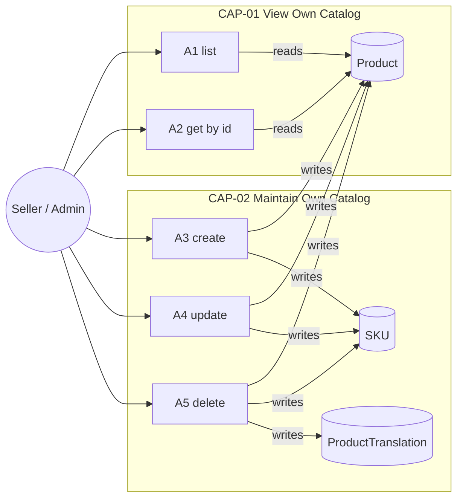
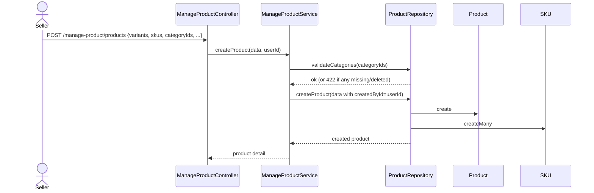
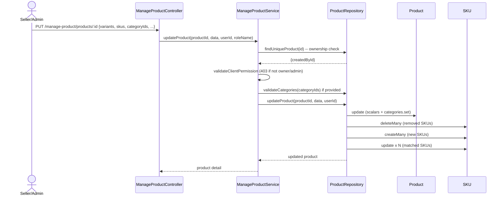
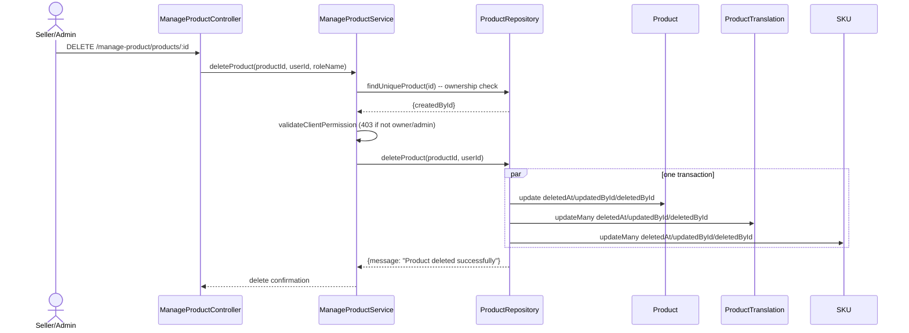
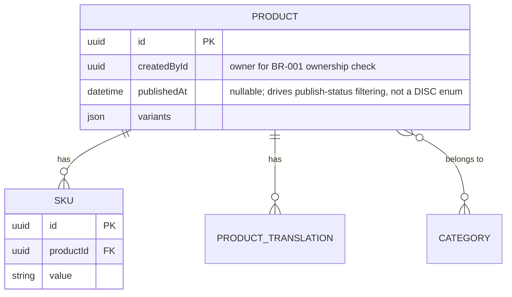

# F008_SellerProductManagement — Technical Spec

**Priority**: P1
**Type**: ui
**Generated**: 2026-09-12

**Xem thêm:** [`functional-spec.vi.md`](./functional-spec.vi.md) — tổng quan bằng ngôn ngữ thường, các
quyết định còn treo, requirement/quy tắc nghiệp vụ viết gọn một dòng, screen, user story, kịch
bản, edge case, và cấu hình dành cho đối tượng BA/QA.

**Cách đọc file này:** § 2 là mục lục — chọn action bạn quan tâm rồi đọc thẳng block tương ứng ở
§ 3 từ đầu đến cuối; mỗi block là một mạch hoàn chỉnh. § 4 là phụ lục dùng chung — chỉ nhảy vào
khi một block ở § 3 trỏ bạn tới đó.

## 1. Tổng quan kỹ thuật

`ManageProductController` (`src/routes/product/manage-product/manage-product.controller.ts`)
expose 5 route dưới `/manage-product/products`, tất cả đều bảo vệ bằng `Bearer` và gate theo
module quyền `MANAGE-PRODUCT` (chỉ seller + admin). Mọi action trừ create đều chạy thêm một lớp
phân quyền độc lập thứ hai — `ManageProductService.validateClientPermission` — ném lỗi 403 trừ khi
người gọi là người tạo ra product hoặc có role admin. `ProductRepository`
(`src/repositories/product/product.repository.ts`) sở hữu các thao tác đọc/ghi Prisma trên
`Product`, `SKU`, `Category`, và `ProductTranslation`.



## 2. Mục lục Action

| # | Action (handler) | Method · Path | Codes | Ghi | Chi tiết |
|---|---|---|---|---|---|
| **A0** | *xuyên suốt — không thuộc riêng action nào* | — | {FR-001, FR-002} | — | § 4.4 |
| **A1** | `ManageProductController#getManageProducts` | `GET` `/manage-product/products` | {FR-201, FR-202, FR-204, BR-001, US052} | — *(chỉ đọc)* | § 3.1 |
| **A2** | `ManageProductController#getManageProductById` | `GET` `/manage-product/products/:id` | {FR-203, FR-204, BR-001, US053} | — *(chỉ đọc)* | § 3.1 |
| **A3** | `ManageProductController#createProduct` | `POST` `/manage-product/products` | {FR-301, FR-302, FR-303, BR-002, BR-003, BR-004, US054} | `product`, `sku` | § 3.2 ▸ **diagram** |
| **A4** | `ManageProductController#updateProduct` | `PUT` `/manage-product/products/:id` | {FR-304, FR-305, FR-601, BR-001, BR-002, BR-003, BR-004, US055} | `product`, `sku` | § 3.2 ▸ **diagram** |
| **A5** | `ManageProductController#deleteProduct` | `DELETE` `/manage-product/products/:id` | {FR-306, FR-305, FR-601, BR-001, BR-005, US056} | `product`, `product_translation`, `sku` | § 3.2 ▸ **diagram** |

## 3. Actions

N/A — không có logic quyết định hướng người dùng (DEC-###) ngoài DISC-### Polymorphic Behavior.
Đây là API headless không có nhánh render/tương tác/flow; mọi đường điều kiện tìm thấy (kiểm tra
quyền sở hữu, validate variant/SKU/category) đều là gate pass/fail trên toàn bộ response, không
phải nhánh render — mỗi cái được ghi lại thành một Business Rule (§ 4.4) thay vì DEC.

### 3.1 CAP-01 — Xem catalog của chính mình

#### A1 · Liệt kê product của chính mình
`GET /manage-product/products` → `` `ManageProductController#getManageProducts` ``
`FR-201` `FR-202` `FR-204` `US052`

**Ai** · seller hoặc admin *(gate A0 — § 4.4)*
**Request** · query param `page`, `pageSize`, `order`, `orderBy`, `name`, `brandIds`,
`categoryIds`, `minPrice`, `maxPrice`, `isPublic`, `createdById` — `createdById` mặc định lấy
`userId` của chính người gọi khi bỏ trống
(`src/routes/product/manage-product/manage-product.service.ts:65`)
**BE** · `` `ManageProductService#getProducts` `` — validate quyền sở hữu, chuẩn hóa thứ tự sort,
rồi giao cho `ProductRepository#findManyProducts` bên trong một `$transaction` để lấy trang dữ liệu + tổng
số bản ghi. `src/routes/product/manage-product/manage-product.service.ts:50-119`
**Rule**
- **BR-001 — người gọi chỉ được xem product do chính mình tạo, trừ khi là admin.** Service gọi
  `validateClientPermission({userId, roleName, createdById})` trong đó `createdById` là giá trị
  filter được yêu cầu (mặc định là `userId` của chính người gọi). Một seller cố truyền ID của
  người khác vào `createdById` sẽ bị từ chối với 403 trước khi query chạy. *(§ 4.4)*
**Kết quả** · chỉ đọc — **không ghi DB**. Trả về danh sách `Product` có phân trang; `totalPages`
được tính bằng `Math.ceil(productsCount / pageSize)`. `isPublic` là filter ba chiều trong
repository: `true` → chỉ product đã publish (`publishedAt <= now`), `false` → chỉ product chưa
publish/đặt ngày trong tương lai, bỏ trống → không filter theo trạng thái publish (xem § 5.1 về
khoảng cách quan sát được giữa ý định này và transform DTO thực tế).
**Source:** `src/routes/product/manage-product/manage-product.controller.ts:49-65` → `src/routes/product/manage-product/manage-product.service.ts:31-48,50-119` →
`src/repositories/product/product.repository.ts:46-132`

<!-- No diagram: below threshold — read-only, single query shape, synchronous. -->

---

#### A2 · Xem chi tiết product của chính mình
`GET /manage-product/products/:id` → `` `ManageProductController#getManageProductById` ``
`FR-203` `FR-204` `US053`

**Ai** · seller hoặc admin *(gate A0 — § 4.4)*
**Request** · path param `id` (UUID, `ParseUUIDPipe`)
**BE** · `` `ManageProductService#getProductById` `` lấy product trước, rồi kiểm tra quyền sở hữu
dựa trên `createdById` của bản ghi vừa lấy được —
`src/routes/product/manage-product/manage-product.service.ts:121-144`
**Rule**
- **BR-001 — người gọi chỉ được xem product do chính mình tạo, trừ khi là admin.** Quyền sở hữu
  được kiểm tra SAU khi đã lấy được bản ghi product (`product.createdById`), không phải trước —
  nên seller nhận 403, không phải 404, khi product tồn tại nhưng thuộc về người khác. *(§ 4.4)*
**Kết quả** · chỉ đọc — **không ghi DB**. Trả về toàn bộ chi tiết product (brand, category, SKU,
bản dịch theo ngôn ngữ của người gọi).
**Source:** `src/routes/product/manage-product/manage-product.controller.ts:74-95` → `src/routes/product/manage-product/manage-product.service.ts:121-144` →
`src/repositories/product/product.repository.ts:144-174`

<!-- No diagram: below threshold — read-only, single lookup, synchronous. -->

### 3.2 CAP-02 — Duy trì catalog của chính mình

#### A3 · Tạo product
`POST /manage-product/products` → `` `ManageProductController#createProduct` ``
`FR-301` `FR-302` `FR-303` `US054`

**Ai** · seller hoặc admin *(gate A0 — § 4.4)*
**Request** · body `CreateProductRequestDto` — `name`, `basePrice`, `virtualPrice`, `images[]`,
`brandId`, `publishedAt?`, `variants[]` (≥1), `categoryIds[]` (≥1), `skus[]` (≥1)
**BE** · `` `ManageProductService#createProduct` `` validate category rồi giao việc insert —
`src/routes/product/manage-product/manage-product.service.ts:185-232`
**Rule**
- **BR-002 — tên variant và các option của từng variant phải là duy nhất.** Được enforce bởi
  class validator `IsUniqueVariantConstraint` trên field `variants` trước khi handler chạy — tên
  variant trùng hoặc giá trị option trùng sẽ fail validation với 400 trước khi có bất kỳ lời gọi
  DB nào. *(§ 4.4)*
- **BR-003 — danh sách SKU gửi lên phải khớp chính xác với các SKU sinh ra từ variant đã khai
  báo.** Được enforce bởi `IsValidSKUsConstraint`, hàm này tính lại tập SKU mong đợi từ `variants`
  bằng `generateSKUs()` và so sánh (không phân biệt hoa thường) với `skus` gửi lên — số lượng lệch
  hoặc giá trị lệch sẽ fail validation với 400 trước khi có bất kỳ lời gọi DB nào. *(§ 4.4)*
- **BR-004 — mọi category ID phải tồn tại và chưa bị soft-delete.**
  `ProductRepository#validateCategories` chạy trước khi insert và ném lỗi 422 nếu số lượng tìm
  thấy thiếu. *(§ 4.4)*
**Kết quả**
- Ghi `product` ← `basePrice, virtualPrice, name, brandId, images, publishedAt, variants` cộng với
  `categories: { connect: categoryIds }` và `createdById: userId` —
  `src/routes/product/manage-product/manage-product.service.ts:205-229`
- Ghi `sku` (createMany) ← mỗi SKU gửi lên, với `order` được set theo vị trí của nó trong mảng gửi
  lên — `src/routes/product/manage-product/manage-product.service.ts:219-225`
**Source:** `src/routes/product/manage-product/manage-product.controller.ts:104-115` → `src/routes/product/manage-product/manage-product.service.ts:185-232` →
`src/repositories/product/product.repository.ts:183-198,208-238`



---

#### A4 · Cập nhật product của chính mình
`PUT /manage-product/products/:id` → `` `ManageProductController#updateProduct` ``
`FR-304` `FR-305` `FR-601` `US055`

**Ai** · seller (chỉ product của chính mình) hoặc admin *(gate A0 — § 4.4)*
**Request** · path param `id` (UUID); body `UpdateProductRequestDto` — các field scalar dạng
partial `publishedAt/name/basePrice/virtualPrice/images/brandId/categoryIds`, bắt buộc phải có
`variants[]` và `skus[]`
**BE** · `` `ManageProductService#updateProduct` `` lấy owner của product trước, kiểm tra quyền sở
hữu, validate category nếu có, rồi giao việc cập nhật đối chiếu (reconcile) —
`src/routes/product/manage-product/manage-product.service.ts:146-183`
**Rule**
- **BR-001 — người gọi chỉ được cập nhật product do chính mình tạo, trừ khi là admin.** Cùng
  pattern fetch-rồi-check như A2: người không phải chủ sở hữu nhận 403 (không phải 404) đối với
  một product đang tồn tại. *(§ 4.4)*
- **BR-002 / BR-003 — validate variant và SKU, giống hệt lúc create.** Cùng các class-validator
  constraint chạy trên field `variants`/`skus` (bắt buộc) của `UpdateProductRequestDto`. *(§ 4.4)*
- **BR-004 — kiểm tra category tồn tại, giống lúc create**, chỉ chạy khi request body có
  `categoryIds`. *(§ 4.4)*
**Kết quả**
- Ghi `product` ← các field scalar được gửi lên, `updatedById: userId`, và
  `categories: { set: categoryIds }` (thay thế toàn bộ tập liên kết category) —
  `src/repositories/product/product.repository.ts:279-291`
- Đối chiếu (reconcile) `sku`: SKU hiện có được khớp với danh sách gửi lên theo `value`; SKU có
  trong DB nhưng không có trong danh sách gửi lên sẽ bị hard-delete (`sKU.deleteMany`); SKU trong
  danh sách gửi lên mà không khớp DB sẽ được tạo mới (`sKU.createMany`, `createdById: userId`);
  SKU khớp theo `value` sẽ được cập nhật tại chỗ (`sKU.update`, `updatedById: userId`), mỗi cái
  mang theo vị trí mới của SKU đó làm `order`. `src/repositories/product/product.repository.ts:293-376`
**Source:** `src/routes/product/manage-product/manage-product.controller.ts:124-139` → `src/routes/product/manage-product/manage-product.service.ts:146-183` →
`src/repositories/product/product.repository.ts:250-416`



---

#### A5 · Xóa product của chính mình *(soft delete theo tầng)*
`DELETE /manage-product/products/:id` → `` `ManageProductController#deleteProduct` ``
`FR-306` `FR-305` `FR-601` `BR-005` `US056`

**Ai** · seller (chỉ product của chính mình) hoặc admin *(gate A0 — § 4.4)*
**Request** · path param `id` (UUID)
**BE** · `` `ManageProductService#deleteProduct` `` lấy owner, kiểm tra quyền sở hữu, rồi giao
việc soft delete theo tầng — `src/routes/product/manage-product/manage-product.service.ts:234-263`
**Rule**
- **BR-001 — người gọi chỉ được xóa product do chính mình tạo, trừ khi là admin.** Cùng pattern
  fetch-rồi-check như A2/A4. *(§ 4.4)*
- **BR-005 — xóa một product sẽ soft-delete cả product, bản dịch của nó, và SKU của nó trong một
  thao tác duy nhất.** Cả ba lượt ghi bên dưới đều chạy bên trong một `$transaction` duy nhất;
  không có cascade ở tầng DB — chính ứng dụng tự thực hiện cả ba lượt update. *(§ 4.4)*
**Kết quả**
- Ghi `product.deletedAt/updatedById/deletedById` —
  `src/repositories/product/product.repository.ts:444-451`
- Ghi `product_translation.deletedAt/updatedById/deletedById` (updateMany, giới hạn trong các bản
  dịch chưa bị xóa của product) — `src/repositories/product/product.repository.ts:453-461`
- Ghi `sku.deletedAt/updatedById/deletedById` (updateMany, giới hạn trong các SKU chưa bị xóa của
  product) — `src/repositories/product/product.repository.ts:463-470`
**Source:** `src/routes/product/manage-product/manage-product.controller.ts:154-167` → `src/routes/product/manage-product/manage-product.service.ts:234-263` →
`src/repositories/product/product.repository.ts:436-496`



### 3.3 Edge case

| Action | Kịch bản | Hành vi |
|---|---|---|
| A1 | Người gọi có role client yêu cầu danh sách | Bị từ chối với 403 tại gate quyền cấp module (A0), trước khi handler chạy |
| A1-A5 | Seller truyền `createdById`/product ID thuộc về seller khác | 403 từ `validateClientPermission`; admin bỏ qua kiểm tra này hoàn toàn |
| A2, A4, A5 | Product ID không tồn tại hoặc đã bị soft-delete (`deletedAt IS NOT NULL`) | `findUniqueProduct` ném `notFound` → 404, trước cả khi kiểm tra quyền sở hữu |
| A3, A4 | Số lượng/giá trị `skus` gửi lên không khớp `generateSKUs(variants)` | 400 từ `IsValidSKUsConstraint`, trước khi handler chạy |
| A3, A4 | `categoryIds` gửi lên có category đã bị xóa/không tồn tại | 422 từ `validateCategories`, trước khi lượt ghi xảy ra |
| A4 | Hai lượt update đồng thời lên danh sách SKU của cùng một product | Không quan sát thấy optimistic lock — `$transaction` nào commit sau cùng thắng; `[UNVERIFIED]` liệu điều này có gây lost-update ở production hay không |

## 4. Nền tảng dùng chung

### 4.1 Component

| Component | Trách nhiệm | Dùng trong | File |
|---|---|---|---|
| `ManageProductController` | Điểm vào HTTP cho cả 5 route manage-product | A1-A5 | `src/routes/product/manage-product/manage-product.controller.ts` |
| `ManageProductService` | Enforce quyền sở hữu + điều phối business rule | A1-A5 | `src/routes/product/manage-product/manage-product.service.ts` |
| `ProductRepository` | Đọc/ghi Prisma cho `Product`, `SKU`, `Category`, `ProductTranslation` | A1-A5 | `src/repositories/product/product.repository.ts` |
| `IsUniqueVariantConstraint` / `IsValidSKUsConstraint` | Validate shape variant/SKU ở tầng DTO | A3, A4 | `src/dtos/product/product.validation.ts` |
| `AccessTokenGuard` | Xác thực `Bearer` + RBAC theo từng (path, method) (A0) | A1-A5 | `src/shared/guards/access-token.guard.ts` |

### 4.2 Data Model



| Entity | Table | Dùng cho | Action |
|---|---|---|---|
| `Product` | `product` | Product mà seller sở hữu/quản lý | A1-A5 |
| `SKU` | `sku` | Các variant có thể mua của một product | A2-A5 (`createProductListSelect`, được A1 dùng cho query list, không còn select `skus`) |
| `Category` | `category` | Được tham chiếu (không sở hữu) — kiểm tra tồn tại khi create/update | A3, A4 |
| `ProductTranslation` | `product_translation` | Tên/mô tả product theo ngôn ngữ, soft-delete cùng lúc với product | A2, A5 |

#### Polymorphic Behavior

N/A — không có field discriminator trong Key Entities. `Product.publishedAt` là timestamp
nullable (so sánh với `now()`), không phải discriminator dạng enum — hiệu ứng trạng thái publish
của nó được ghi lại như một phần của mục Result ở A1, không phải một DISC.

### 4.3 Quản lý State

Không có.

### 4.4 Rule dùng chung

#### Bin 3 — xuyên suốt, không thuộc riêng action nào

**A0 · {FR-001} / {FR-002} — mọi route manage-product đều yêu cầu một session `Bearer` hợp lệ VÀ
role của người gọi phải có grant module `MANAGE-PRODUCT`.**
`AccessTokenGuard` (đăng ký làm `APP_GUARD` toàn cục) chạy trước bất kỳ handler nào: nó xác thực
token `Bearer`, rồi `verifyRolePermission` tra một bản ghi `Permission` khớp đúng
`(path, method, roleId)` — người gọi có role `client` có **zero** bản ghi quyền `MANAGE-PRODUCT`
(allowlist `ClientModule` trong seed script bỏ qua `MANAGE-PRODUCT`; chỉ `SellerModule` và danh
sách admin không lọc mới có), nên client bị từ chối với 403 ngay tại đây, **trước khi**
`ManageProductService.validateClientPermission` (kiểm tra quyền sở hữu, BR-001) kịp chạy. Đây là
một lớp phân quyền độc lập thứ hai chồng lên BR-001 — không phải rule của business logic riêng
tính năng này, mà là gate quyết định liệu BR-001 có được chạm tới hay không.
**Source:** `src/shared/guards/access-token.guard.ts:56-99` · `initial-scripts/create-permission.ts:14-35,149-192`

#### Bin 2 — dùng ở ≥2 action có tên

**BR-001 — người gọi không phải admin chỉ được thao tác trên product do chính mình tạo.**
Dùng trong: **A1** · **A2** · **A4** · **A5**. `ManageProductService#validateClientPermission` ném
403 trừ khi `userId === createdById OR roleName === Role.ADMIN`. A1 mặc định filter `createdById`
về ID của chính người gọi thay vì fetch một bản ghi trước (vì chưa có bản ghi để fetch — đây là
list); A2/A4/A5 fetch `createdById` của product mục tiêu trước, rồi mới check. Admin bỏ qua kiểm
tra này vô điều kiện (nửa `roleNameRequest !== Role.ADMIN` của guard).
**Source:** `src/routes/product/manage-product/manage-product.service.ts:31-48`
```text
function validateClientPermission(userId, roleName, createdById):
    if userId != createdById and roleName != ADMIN:
        throw 403 "You do not have permission to interact with this product."
    return true
```

**BR-002 — tên variant, và giá trị option riêng của từng variant, phải là duy nhất.**
Dùng trong: **A3** · **A4**. `IsUniqueVariantConstraint.validate` viết thường `value` của mỗi
variant và so kích thước set với độ dài mảng để bắt tên variant trùng, rồi lặp lại cùng kiểm tra
đó cho từng variant trên mảng `options` của nó.
**Source:** `src/dtos/product/product.validation.ts:15-46`

**BR-003 — danh sách SKU gửi lên phải khớp chính xác với các SKU sinh ra từ variant đã khai báo.**
Dùng trong: **A3** · **A4**. `IsValidSKUsConstraint.validate` gọi `generateSKUs(variants)`, viết
thường `value` của cả SKU sinh ra lẫn SKU gửi lên, và fail nếu số lượng lệch nhau hoặc bất kỳ giá
trị gửi lên nào không nằm trong tập sinh ra.
**Source:** `src/dtos/product/product.validation.ts:62-96`

**BR-004 — mọi category ID được tham chiếu khi create/update phải tồn tại và không được
soft-delete.**
Dùng trong: **A3** · **A4**. `ProductRepository#validateCategories` đếm số bản ghi `Category`
khớp, chưa bị xóa, và ném 422 nếu số lượng đếm được ít hơn số ID gửi lên.
**Source:** `src/repositories/product/product.repository.ts:183-198`

### 4.5 Thuật toán & Tích hợp

Không có.

### 4.6 Cấu hình

N/A — không có cấu hình kỹ thuật nào ngoài mặc định của framework.

**Hành vi phía client:** xem
[`behavior-logic.vi.md`](../../generated/behavior-logic.vi.md) (pattern phía client — debounce, optimistic UI, polling, upload, realtime),
[`permissions.vi.md`](../../system/permissions.vi.md) (feature flag / experiment / env / locale gate),
[`screen-flow.vi.md`](../../generated/screen-flow.vi.md) (guard / khôi phục state deep-link / bảo vệ thay đổi chưa lưu).

## 5. Kiểm chứng & Ghi chú kỹ thuật

### 5.1 Kiểm chứng kỹ thuật

- **SC-001** *(A1)* Một seller bỏ trống mọi filter chỉ thấy các dòng có `createdById` bằng đúng
  `userId` của chính mình (bao phủ FR-201, BR-001).
- **SC-002** *(A1)* [UNVERIFIED — xem 5.3] liệu việc bỏ trống query param `isPublic` có thực sự
  trả về mọi trạng thái publish hay không, trong khi `@Transform` của
  `ManageProductPaginationQueryDto` ép giá trị bị thiếu thành `false` thay vì `undefined` (bao
  phủ FR-202; xem functional-spec.md § 11 RISK-01).
- **SC-003** *(A2, A4, A5)* Người gọi không phải người tạo product và không phải admin nhận 403,
  không phải 404, đối với một product đang tồn tại (bao phủ FR-204, FR-305, BR-001).
- **SC-004** *(A3, A4)* Một request create/update có `skus` không khớp `generateSKUs(variants)`
  bị từ chối với 400 trước khi có bất kỳ lượt ghi DB nào (bao phủ FR-301, BR-003).
- **SC-005** *(A5)* Một lượt xóa để lại product, bản dịch của nó, và SKU của nó đều mang
  `deletedAt` khác null (bao phủ FR-306, BR-005).

#### US052_ListOwnProducts *(A1)*

**Independent Test:** Gọi endpoint list với hai seller khác nhau, mỗi người đã tạo product; xác
nhận mỗi người chỉ thấy dòng của chính mình, và admin thấy cả hai tập gộp lại.

**Acceptance Scenarios:**

1. **Given** seller A có 2 product và seller B có 1, **When** seller A gọi list không filter,
   **Then** response chứa đúng 2 product của seller A.
2. **Given** cùng thiết lập đó, **When** admin gọi list với `createdById` không set, **Then**
   admin vẫn chỉ thấy các product khớp filter mặc định `createdById = admin.userId` — endpoint
   không tự động mở rộng phạm vi xem của admin trừ khi `createdById` được truyền tường minh (chỉ
   phần kiểm tra quyền sở hữu bị bỏ qua với admin, còn query param default-scoping thì không).

#### US054_CreateProduct *(A3)*

**Independent Test:** Gửi request create với 1 variant và đúng SKU sinh ra khớp với nó; xác nhận
bản ghi product và SKU được tạo với `createdById` set bằng người gọi.

**Acceptance Scenarios:**

1. **Given** một seller gửi một product hợp lệ với variant/SKU khớp nhau và category ID đang tồn
   tại, **When** họ tạo nó, **Then** response chứa product mới với `createdById` được ngầm set
   bằng người gọi (không trả về trong DTO, nhưng có lưu xuống DB).
2. **Given** một seller gửi một category ID đã bị soft-delete, **When** họ tạo product, **Then**
   request bị từ chối với 422 trước khi bản ghi product được ghi.

### 5.2 Giả định

- *(A1)* Việc transform `isPublic` ép giá trị bị thiếu thành `false` (xem RISK-01,
  functional-spec.md § 11) được giả định là một lỗi thực sự so với ý định nêu rõ trong code
  ("get all products if not specified"), không phải thiết kế có chủ ý — lượt review này không
  chạy app, nên response body thực tế lúc runtime chưa được quan sát.
- *(A4, A5)* Quyền sở hữu được kiểm tra qua một lượt fetch `findUniqueProduct` riêng trước lượt
  ghi update/delete thực sự, thay vì là một phần của một update điều kiện duy nhất
  `WHERE createdById = ...` — nghĩa là về lý thuyết có thể xảy ra race giữa lúc kiểm tra quyền sở
  hữu và lúc ghi (không quan sát thấy row lock giữa hai lần gọi).

### 5.3 Câu hỏi chưa giải quyết

1. **Hành vi mặc định của `isPublic`** *(A1)*: không thể xác nhận từ một instance đang chạy liệu
   việc `@Transform` ép query param `isPublic` bị thiếu thành `false` có thực sự làm thay đổi tập
   kết quả trả về trong thực tế hay không, so với việc bị che khuất bởi một default nào đó ở tầng
   trên (ví dụ default ở tầng API gateway). Được flag trong functional-spec.md § 11 dưới dạng
   RISK-01; mục này là nửa chi-tiết-triển-khai của cùng phát hiện đó.
2. **Race điều kiện lúc update đồng thời** *(A4)*: không thể xác nhận liệu hai request `PUT` gần
   như đồng thời lên cùng một product ID có thể chồng lấn lượt reconcile SKU của chúng
   (delete/create/update) theo cách làm mất một SKU mà không request nào chủ ý xóa hay không —
   không tìm thấy cơ chế locking nào trong `ProductRepository#updateProduct`.

### 5.4 Tham chiếu Source

| Action | Thứ tự | Symbol | Path | Mục đích |
|---|---|---|---|---|
| — | 1 | `Product` (Prisma model) | `prisma/schema.prisma:227-257` | Entity trung tâm của tính năng này |
| — | 2 | `SKU` (Prisma model) | `prisma/schema.prisma:371-396` | Các dòng variant có thể mua thuộc về một product |
| A1-A5 | 3 | `ManageProductController` | `src/routes/product/manage-product/manage-product.controller.ts:1-168` | Điểm vào HTTP cho cả 5 route |
| A1-A5 | 4 | `ManageProductService` | `src/routes/product/manage-product/manage-product.service.ts:1-264` | Enforce quyền sở hữu + điều phối |
| A1-A5 | 5 | `ProductRepository` | `src/repositories/product/product.repository.ts:1-497` | Đọc/ghi Prisma |
| A3, A4 | 6 | `src/dtos/product/product.validation.ts` | `src/dtos/product/product.validation.ts:1-110` | Validator DTO cho variant/SKU (BR-002, BR-003) |
| A0 | 7 | `AccessTokenGuard` | `src/shared/guards/access-token.guard.ts:56-99` | Gate xác thực `Bearer` + RBAC theo route |

#### Data Flow

```text
A4 update: {productId, variants, skus, categoryIds, ...} (PUT body)
  -> ManageProductService#updateProduct: fetch createdById, check ownership (BR-001)
  -> ProductRepository#updateProduct: diff skus by value into create/update/delete sets
  -> tx.product.update (scalars + categories.set) + tx.sKU.{createMany,update,deleteMany}
  -> re-fetch product with createProductDetailSelect()
  -> ProductDetailResponseDto (full product detail response)
```

### 5.5 Tham chiếu Artifact

| Artifact | File | Codes Used | Reviewed |
|----------|------|------------|----------|
| System Overview | [system-overview.md](../../system/system-overview.md) | — | [x] |
| Feature List | [feature-list.vi.md](../../generated/feature-list.vi.md) | F008 | [x] |
| API Map | [route-list.vi.md](../../generated/route-list.vi.md) | ROUTE053, ROUTE054, ROUTE055, ROUTE056, ROUTE057 | [x] |
| Entities | [entities.vi.md](../../generated/entities.vi.md) | MODEL009 | [x] |
| Screens | [functional-spec.md § 6](./functional-spec.vi.md#6-screens) | — | [x] |
| Behavior Logic | [behavior-logic.vi.md](../../generated/behavior-logic.vi.md) | — | [x] |
| Permissions Matrix | [permissions-matrix.vi.md](../../generated/permissions-matrix.vi.md) | PERM003, PERM005, PERM007 | [x] |
| User Stories | [user-stories.vi.md](../../generated/user-stories.vi.md) | US052, US053, US054, US055, US056 | [x] |
</content>
