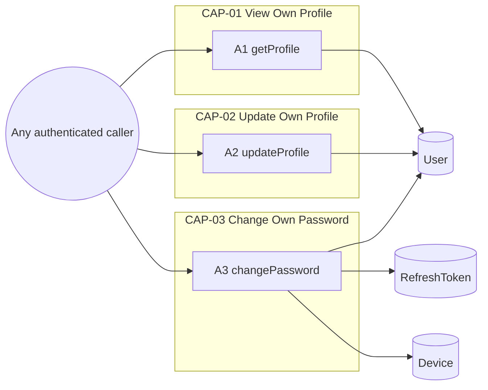
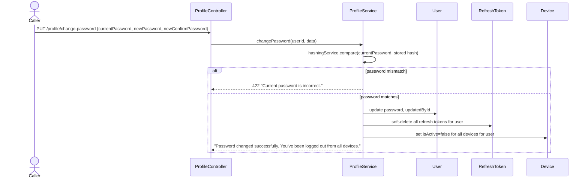
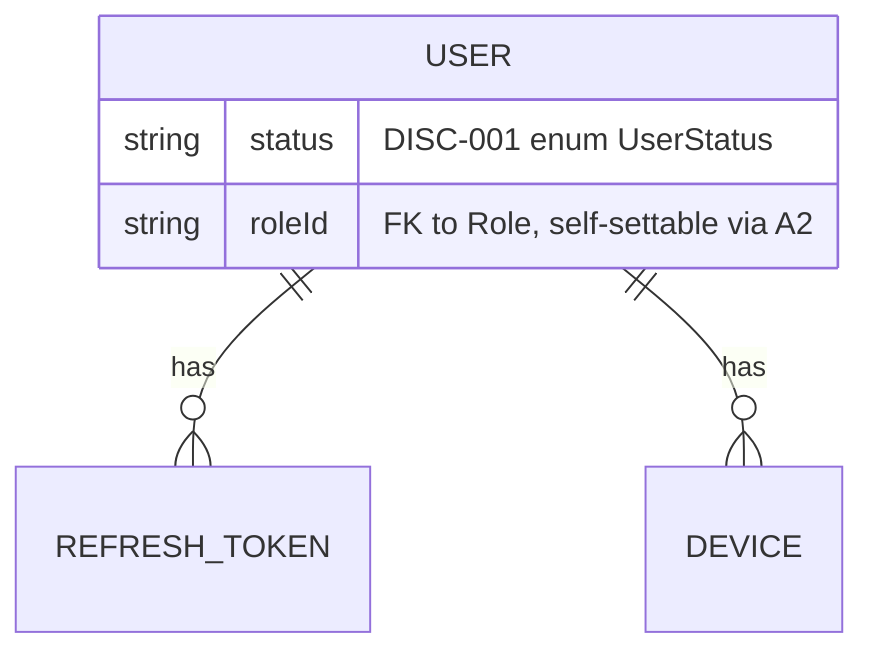

<!-- layout-exempt: rebuild-spec owns all docs/system|features|generated|flows paths -->
<!-- Contract: references/feature-spec-researcher-contract.md -->

# F009_OwnProfileManagement — Technical Spec

**Priority**: P1
**Type**: ui
**Generated**: 2026-09-12

**See also:** [`functional-spec.md`](./functional-spec.md) — plain-language overview, open
decisions, requirements/business rules stated in one-liners, screens, user stories, scenarios,
edge cases, and configuration for a BA/QA audience.

**How to read this file:** § 2 is the index — pick the action you care about and read its block
in § 3 straight through; each block is one complete thread, top to bottom. § 4 is the shared
appendix — jump in only when a § 3 block points you there.

## 1. Technical Overview

`ProfileController` (`src/routes/profile/profile.controller.ts:1-79`) exposes 3 routes, all resolving the caller from `ActiveUser("userId")` (the JWT payload attached by the global `AccessTokenGuard`) — none accept a target-user id. `ProfileService` (`src/routes/profile/profile.service.ts:1-177`) does the reads/writes via `SharedUserRepository`, a thin Prisma-error-translating wrapper shared with other user-facing features. All 3 actions touch only the `User` table directly; the password-change action additionally cascades into `RefreshToken` and `Device`.



## 2. Action Index

| # | Action (handler) | Method · Path | Codes | Writes | Detail |
|---|---|---|---|---|---|
| **A0** | *cross-cutting — belongs to no single action* | — | FR-001, FR-601 | — | § 4.4 |
| **A1** | `ProfileController#getProfile` | `GET` `.../profile` | FR-101, FR-201, US057 | — *(read-only)* | § 3.1 |
| **A2** | `ProfileController#updateProfile` | `PUT` `.../profile` | FR-202, FR-203, FR-602, BR-003, BR-004, US058 | `User` | § 3.2 |
| **A3** | `ProfileController#changePassword` | `PUT` `.../profile/change-password` | FR-204, FR-205, BR-001, BR-002, US059 | `User`, `RefreshToken`, `Device` | § 3.3 ▸ **diagram** |

## 3. Actions

### 3.1 CAP-01 — View Own Profile

#### A1 · Get current caller's profile
`GET .../profile` → `` `ProfileController#getProfile` ``
`FR-101` `FR-201` `US057`

**Who** · any authenticated caller (client/seller/admin) *(gate A0 — § 4.4)*
**Request** · no body; caller id comes from the `Bearer` token only (`ActiveUser("userId")`, `src/routes/profile/profile.controller.ts:32`) — no `:id` param exists on this route.
**BE** · `` `ProfileService#getProfile` `` looks up the caller by id with `deletedAt: null` and the role+permissions select shape — `src/routes/profile/profile.service.ts:32-49`
**Rule** · no branching — a soft-deleted or missing user is rejected before any data is returned.
**Result** · read-only — returns the caller's `id/name/email/phoneNumber/avatar/status` plus their `role` (with that role's `permissions`), via `userWithRoleAndPermissionsSelect` (`src/selectors/user.selector.ts:19-24`). When rendering `status` (`DISC-001`), the value is returned as-is with no gating — `[UNVERIFIED]` whether any client is expected to act on it (§ 4.2 Polymorphic Behavior).
**Source:** `src/routes/profile/profile.controller.ts:22-37` → `src/routes/profile/profile.service.ts:32-49` → `src/repositories/user/shared-user.repository.ts:26-49`

<!-- No diagram: below threshold — read-only, single table, synchronous. -->

---

### 3.2 CAP-02 — Update Own Profile

#### A2 · Update current caller's profile
`PUT .../profile` → `` `ProfileController#updateProfile` ``
`FR-202` `FR-203` `FR-602` `BR-003` `BR-004` `US058`

**Who** · any authenticated caller (client/seller/admin) *(gate A0 — § 4.4)*
**Request** · body `name?` *(string, 1-100 chars)*, `phoneNumber?` *(string, 10-11 chars)*, `status?` *(enum `ACTIVE`\|`INACTIVE`\|`BLOCKED`, `DISC-001`)*, `avatar?` *(URL string)*, `roleId?` *(UUID v4)* — every field optional (`src/dtos/profile/profile.dto.ts:28-79`)
**BE** · `` `ProfileService#updateProfile` `` spreads the whole request body directly into `Prisma.user.update`'s `data` — `src/routes/profile/profile.service.ts:59-90`
**Rule**
- **BR-004 — Only the fields supplied in the request are changed.** The handler spreads `data` (the raw DTO) into the Prisma `update` call with no per-field presence check beyond `class-validator`'s `@IsOptional()` — an omitted field is simply absent from the Prisma payload, so Prisma leaves the column untouched. `src/routes/profile/profile.service.ts:71-74`
- **BR-003 — Every update records the caller as its own author.** `updatedById: userId` is hardcoded into the same `data` object as the caller's own id (`src/routes/profile/profile.service.ts:73`) — a caller can never be recorded as updating someone else's account through this route, since `userId` is also the `where.id` (self-only).
- **FR-203/FR-602 — `[UNVERIFIED]` no ownership/hierarchy check on `status` or `roleId`.** `status` is validated only for enum membership (`@IsIn`, `src/dtos/profile/profile.dto.ts:57-61`); `roleId` is validated only as a well-formed UUID v4 (`@IsUUID(4)`, `src/dtos/profile/profile.dto.ts:76-78`) and then relies on Prisma's foreign-key constraint to reject a nonexistent role — neither field is checked against the caller's own current role or status. See `functional-spec.md` RISK-01/RISK-02 and Open Decision D001.
**Result** · Writes `User.name`/`User.phoneNumber`/`User.status`/`User.avatar`/`User.roleId`/`User.updatedById` for whichever fields were supplied — `src/routes/profile/profile.service.ts:66-87`. Returns the updated row re-selected with `id/name/email/phoneNumber/avatar/status/role(with permissions)/updatedAt`.
**Source:** `src/routes/profile/profile.controller.ts:39-58` → `src/routes/profile/profile.service.ts:59-90` → `src/repositories/user/shared-user.repository.ts:206-232`

<!-- No diagram: writes exactly 1 table (User), synchronous, not background — below the
     ≥2-table / background-action threshold. -->

---

### 3.3 CAP-03 — Change Own Password

#### A3 · Change current caller's password
`PUT .../profile/change-password` → `` `ProfileController#changePassword` ``
`FR-204` `FR-205` `BR-001` `BR-002` `US059`

**Who** · any authenticated caller (client/seller/admin) *(gate A0 — § 4.4)*
**Request** · body `currentPassword` *(string, 8-20 chars)*, `newPassword` *(string, 8-20 chars)*, `newConfirmPassword` *(string, 8-20 chars, must equal `newPassword` via `IsPasswordMatch`)* — `src/dtos/profile/profile.dto.ts:110-146`
**BE** · `` `ProfileService#changePassword` `` — `src/routes/profile/profile.service.ts:100-176`
**Rule**
- **BR-001 — The supplied current password must match the caller's stored password hash before any change is accepted.** `HashingService#compare` (bcrypt `compareSync`) checks `currentPassword` against the stored `user.password`; a mismatch rejects the request before any write — `src/routes/profile/profile.service.ts:109-130`, `src/shared/services/hashing.service.ts:9-16`.
- **BR-002 — A successful password change revokes every refresh token and deactivates every device for that user.** All 3 writes below run inside one `$transaction` — `src/routes/profile/profile.service.ts:134-170`.
**Result**
- Writes `User.password` ← `hashingService.hash(newPassword)` (bcrypt, 10 salt rounds), `User.updatedById` ← caller's own id — `src/routes/profile/profile.service.ts:136-145`
- Writes `RefreshToken.deletedAt` ← `new Date()` for every non-deleted refresh token belonging to this user (soft-revoke) — `src/routes/profile/profile.service.ts:147-156`
- Writes `Device.isActive` ← `false` for every active device belonging to this user — `src/routes/profile/profile.service.ts:158-169`
- User sees: a success message stating they have been logged out of all devices — `src/routes/profile/profile.service.ts:172-175`
**Source:** `src/routes/profile/profile.controller.ts:60-78` → `src/routes/profile/profile.service.ts:100-176` → `src/shared/services/hashing.service.ts:9-16`



### 3.4 Edge cases

| Action | Scenario | Behavior |
|---|---|---|
| A3 | `currentPassword` does not match the stored hash | Rejects with `422 Unprocessable Entity`, message "Current password is incorrect." — no write occurs (`src/routes/profile/profile.service.ts:120-130`) |
| A3 | `newConfirmPassword` does not equal `newPassword` | Rejected at DTO validation (`400 Bad Request`) before the handler runs — `IsPasswordMatch` on `src/dtos/profile/profile.dto.ts:144` |
| A1, A2, A3 | Caller's `User` row has `deletedAt` set (soft-deleted) between token issue and this call | `getProfile`/`updateProfile` reject `404 Not Found` ("User not found."); `changePassword`'s `findUniqueOrThrow` also rejects `404` — all 3 filter `deletedAt: null` on lookup/update |
| A2 | Caller supplies `roleId` referencing a role that does not exist or is soft-deleted | Rejected `422 Unprocessable Entity`, "Invalid foreign key constraint." (Prisma FK violation, `src/repositories/user/shared-user.repository.ts:216-221`) — the value is never checked against the caller's own role first |
| A2 | Caller supplies `status`/`roleId` referencing their own current value or a different real value they are not authorized to hold | Succeeds silently — no authorization check exists beyond FK/enum validity (RISK-01/RISK-02) |

## 4. Shared Foundation

### 4.1 Components

| Component | Responsibility | Used in | File |
|---|---|---|---|
| `ProfileController` | HTTP entry point for all 3 routes in this feature | A1, A2, A3 | `src/routes/profile/profile.controller.ts` |
| `ProfileService` | Business logic: profile read/update, password change + session-wide revoke | A1, A2, A3 | `src/routes/profile/profile.service.ts` |
| `SharedUserRepository` | Prisma-error-translating wrapper around the `User` model, shared with other features (e.g. `F010`) | A1, A2, A3 | `src/repositories/user/shared-user.repository.ts` |
| `HashingService` | bcrypt hash/compare wrapper | A3 | `src/shared/services/hashing.service.ts` |

### 4.2 Data Model



| Entity | Table | Used for | Action |
|---|---|---|---|
| `User` | `User` | The caller's own account record — read by A1, partially written by A2, password+audit written by A3 | A1, A2, A3 |
| `RefreshToken` | `RefreshToken` | Soft-revoked (all rows for the caller) on password change | A3 |
| `Device` | `Device` | Marked inactive (all rows for the caller) on password change | A3 |

#### Polymorphic Behavior

##### DISC-001 — User.status

| Value | Render | Validation | Persistence |
|-------|--------|------------|-------------|
| `ACTIVE` | Returned as-is by A1/A2 | Accepted by A2's `@IsIn` check, same as the other 2 values | Default value at row creation; written by A2 with no gating |
| `INACTIVE` | Returned as-is by A1/A2 | Accepted by A2 | Written by A2; not checked by A1/A2/A3 or by the shared `AccessTokenGuard` (`src/shared/guards/access-token.guard.ts:56-99` checks `role.isActive`, never `user.status`) — self-setting this value has no observed functional effect on this feature's own routes |
| `BLOCKED` | Returned as-is by A1/A2 | Accepted by A2 | Same as `INACTIVE` — written with no gating anywhere in this feature |

**Source:** docs/generated/entities.md § MODEL002_User > Discriminator Fields

### 4.3 State Management

None. — `User.status` is a discriminator (`DISC-001`, § 4.2) exposed as one field of a partial update, not a modeled state machine with action-owned transitions in this feature.

### 4.4 Shared Rules

#### Bin 3 — cross-cutting, belongs to no single action

**A0 · FR-001 / FR-601 — every action in this feature requires a valid `Bearer` session.**
`AuthorizationHeaderGuard`/`AccessTokenGuard`, registered as the global `APP_GUARD` (`src/shared/modules/base.module.ts:39-42`) — **applies to all 3 routes**, not any one action. No route in this controller carries `@IsPublicApi()`. Behavior on gate failure: `401 Unauthorized` before the handler runs; a subsequent per-route permission check (`PERM003`) can additionally reject with `403 Forbidden` if the caller's role has no permission row for `(GET|PUT, /profile...)`.
**Source:** `src/shared/modules/base.module.ts:39-42` · `src/shared/guards/access-token.guard.ts:56-99` · route-list.md ROUTE058-ROUTE060

<!-- No Bin 2 entries: BR-001/BR-002/BR-003/BR-004 are each used by exactly one action
     (Bin 1) and are documented inline in that action's Rule rung in § 3, per the
     three-bin rule. -->

### 4.5 Algorithms & Integrations

None. — this feature has no non-trivial computation and no external-service integration; A3's transaction is a straightforward multi-table CRUD write, not an algorithm.

### 4.6 Configuration

```text
BCRYPT_SALT_ROUNDS = 10   # hard-coded in HashingService (src/shared/services/hashing.service.ts:4), not env-driven — applies to A3's password hash
```

**Client behavior:** see
[`behavior-logic.md`](../../generated/behavior-logic.md) (client-side patterns — debounce, optimistic UI, polling, upload, realtime),
[`permissions.md`](../../system/permissions.md) (feature flags / experiments / env / locale gates),
[`screen-flow.md`](../../generated/screen-flow.md) (guards / deep-link state restoration / unsaved-changes protection).

## 5. Verification & Technical Notes

### 5.1 Technical Verification

- **SC-001** *(A1)* `GET /profile` returns `200` with the caller's own id/role/permissions and never accepts or honors any `:id`-shaped parameter (covers FR-101, FR-201)
- **SC-002** *(A2)* `PUT /profile` with a partial body changes only the supplied fields and always writes `updatedById` = the caller's own id (covers FR-202, BR-003, BR-004)
- **SC-003** *(A3)* `PUT /profile/change-password` with a correct `currentPassword` changes `User.password`, soft-deletes every `RefreshToken` row, and sets `Device.isActive = false` for every device belonging to the caller, all inside one transaction (covers FR-204, FR-205, BR-001, BR-002)

#### US057 *(A1)*

**Independent Test:** Call `GET /profile` with a valid `Bearer` token for user X; confirm the response's `id` equals X's id and no request parameter can change whose profile is returned.

**Acceptance Scenarios:**

1. **Given** a valid `Bearer` token for user X, **When** `GET /profile` is called, **Then** the response is `200` with X's own `name/email/phoneNumber/avatar/status/role/permissions`.
2. **Given** an expired `Bearer` token, **When** `GET /profile` is called, **Then** the response is `401 Unauthorized`.

#### US058 *(A2)*

**Independent Test:** Call `PUT /profile` with only `{ "phoneNumber": "..." }`; confirm every other field on the caller's row is byte-identical to before the call, and `updatedById` equals the caller's own id.

**Acceptance Scenarios:**

1. **Given** a valid `Bearer` token, **When** `PUT /profile` is called with `{ "name": "New Name" }`, **Then** the response's `name` is updated and every other field is unchanged.
2. **Given** a valid `Bearer` token, **When** `PUT /profile` is called with a `roleId` for a different real role, **Then** the update succeeds with no additional check (see RISK-01).

#### US059 *(A3)*

**Independent Test:** Call `PUT /profile/change-password` with a deliberately wrong `currentPassword`; confirm the response is `422` and a subsequent login with the OLD password still succeeds (i.e. nothing was written).

**Acceptance Scenarios:**

1. **Given** the caller's correct current password, **When** a valid new password + matching confirmation is submitted, **Then** the response is `200`, the password is changed, and every `RefreshToken`/`Device` row for that user is revoked/deactivated.
2. **Given** an incorrect current password, **When** the change is attempted, **Then** the response is `422 Unprocessable Entity` with "Current password is incorrect." and no row is written.

### 5.2 Assumptions

- *(A2)* `roleId`/`status` are assumed to be genuinely self-settable in production as written — this pass reads the source only, it does not run the app or exercise the route against a live database.
- *(A1, A2, A3)* The `deletedAt: null` filter on every lookup is assumed to be the only soft-delete gate in effect; no additional row-level security (e.g. a Postgres RLS policy) was found layered underneath Prisma for the `User` table.

### 5.3 Unresolved Questions

1. **UserTranslation ownership** *(no action in this feature)*: confirmed — no code under `src/` reads or writes `UserTranslation` from any route, service, or repository (grep across `src/` returns zero non-schema/non-migration hits). It has no dedicated route and is not touched by `ProfileService`. This is a documentation-only correction to `feature-list.md`'s prior `[UNVERIFIED]` attribution to F009 — recommend moving `MODEL003_UserTranslation` to the unexposed-schema list rather than attributing it to any F### until a real caller of it is found.
2. **Password-change transaction isolation** *(A3)*: `src/routes/profile/profile.service.ts:134-170` wraps all 3 writes in `prismaService.$transaction`, but the default Prisma transaction isolation level was not confirmed from config — not expected to change the functional behavior documented here, flagged for completeness only.

### 5.4 Source References

| Action | Order | Symbol | Path | Purpose |
|---|---|---|---|---|
| — | 1 | `User` (Prisma model) | `prisma/schema.prisma:36-119` | The entity every action in this feature revolves around |
| A1, A2, A3 | 2 | `ProfileController` | `src/routes/profile/profile.controller.ts:1-79` | HTTP entry point for all 3 routes |
| A1, A2, A3 | 3 | `ProfileService` | `src/routes/profile/profile.service.ts:1-177` | Business logic for view/update/password-change |
| A1, A2, A3 | 4 | `SharedUserRepository` | `src/repositories/user/shared-user.repository.ts:1-232` | Prisma-error-translating repository shared with `F010` |
| A3 | 5 | `HashingService` | `src/shared/services/hashing.service.ts:1-17` | bcrypt hash/compare used to verify and re-hash the password |

#### Data Flow

```text
A3: {currentPassword, newPassword, newConfirmPassword} (request body)
  -> ProfileService.changePassword: compare(currentPassword, stored hash)
  -> on match: hash(newPassword) -> User.password write
  -> RefreshToken.deletedAt write (all rows for user) -> Device.isActive=false write (all rows for user)
  -> response: {message: "Password changed successfully. You've been logged out from all devices."}
```

### 5.5 Artifact References

| Artifact | File | Codes Used | Reviewed |
|----------|------|------------|----------|
| System Overview | [system-overview.md](../../system-overview.md) | — | [x] |
| Feature List | [feature-list.md](../../feature-list.md) | F009 | [x] |
| API Map | [route-list.md](../../route-list.md) | ROUTE058, ROUTE059, ROUTE060 | [x] |
| Entities | [entities.md](../../entities.md) | MODEL002, MODEL003 | [x] |
| Screens | [functional-spec.md § 6](../functional-spec.md#6-screens) | — (N/A, headless) | [x] |
| Behavior Logic | [behavior-logic.md](../../behavior-logic.md) | — (no BL### for this feature) | [x] |
| Permissions Matrix | [permissions-matrix.md](../../permissions-matrix.md) | PERM001, PERM003 | [x] |
| User Stories | [user-stories.md](../../user-stories.md) | US057, US058, US059 | [x] |
