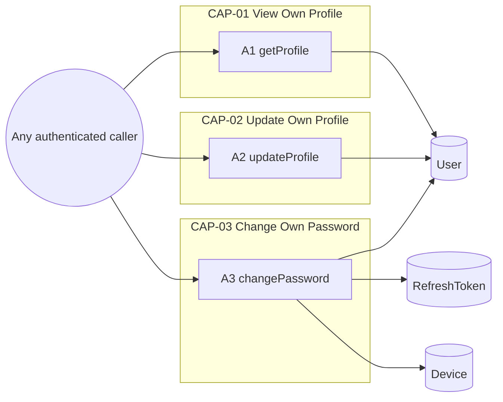
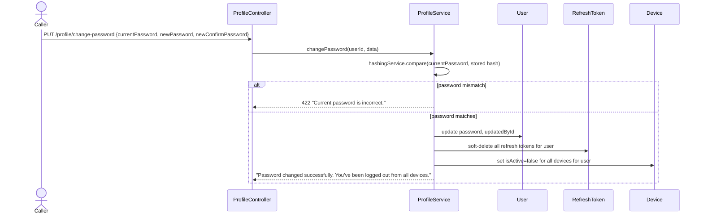
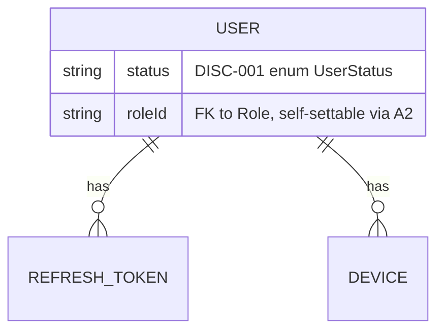

<!-- layout-exempt: rebuild-spec owns all docs/system|features|generated|flows paths -->
<!-- Contract: references/feature-spec-researcher-contract.md -->

# F009_OwnProfileManagement — Technical Spec

**Priority**: P1
**Type**: ui
**Generated**: 2026-09-12

**Xem thêm:** [`functional-spec.vi.md`](./functional-spec.vi.md) — tổng quan bằng ngôn ngữ thường, các
quyết định còn treo, requirement/quy tắc nghiệp vụ viết gọn một dòng, screen, user story, kịch bản,
edge case, và cấu hình dành cho đối tượng BA/QA.

**Cách đọc file này:** § 2 là mục lục — chọn action bạn quan tâm rồi đọc block của nó trong § 3 từ
đầu tới cuối; mỗi block là một luồng hoàn chỉnh, từ trên xuống dưới. § 4 là phụ lục dùng chung — chỉ
nhảy vào đó khi một block ở § 3 trỏ bạn tới.

## 1. Tổng quan kỹ thuật

`ProfileController` (`src/routes/profile/profile.controller.ts:1-79`) expose 3 route, tất cả đều lấy caller từ `ActiveUser("userId")` (JWT payload được gắn vào bởi `AccessTokenGuard` toàn cục) — không route nào nhận id user đích. `ProfileService` (`src/routes/profile/profile.service.ts:1-177`) thực hiện đọc/ghi thông qua `SharedUserRepository`, một wrapper mỏng dịch lỗi Prisma, dùng chung với các tính năng khác hướng tới user. Cả 3 action đều chỉ động tới bảng `User` trực tiếp; riêng action đổi mật khẩu còn cascade sang `RefreshToken` và `Device`.



## 2. Mục lục Action

| # | Action (handler) | Method · Path | Codes | Ghi | Chi tiết |
|---|---|---|---|---|---|
| **A0** | *cross-cutting — không thuộc riêng action nào* | — | FR-001, FR-601 | — | § 4.4 |
| **A1** | `ProfileController#getProfile` | `GET` `.../profile` | FR-101, FR-201, US057 | — *(chỉ đọc)* | § 3.1 |
| **A2** | `ProfileController#updateProfile` | `PUT` `.../profile` | FR-202, FR-203, FR-602, BR-003, BR-004, US058 | `User` | § 3.2 |
| **A3** | `ProfileController#changePassword` | `PUT` `.../profile/change-password` | FR-204, FR-205, BR-001, BR-002, US059 | `User`, `RefreshToken`, `Device` | § 3.3 ▸ **diagram** |

## 3. Các Action

### 3.1 CAP-01 — Xem hồ sơ của chính mình

#### A1 · Lấy hồ sơ của caller hiện tại
`GET .../profile` → `` `ProfileController#getProfile` ``
`FR-101` `FR-201` `US057`

**Ai** · bất kỳ caller đã xác thực nào (client/seller/admin) *(gate A0 — § 4.4)*
**Request** · không có body; id của caller lấy từ token `Bearer` duy nhất (`ActiveUser("userId")`, `src/routes/profile/profile.controller.ts:32`) — route này không có param `:id`.
**BE** · `` `ProfileService#getProfile` `` tìm caller theo id với điều kiện `deletedAt: null` và select shape gồm role+permissions — `src/routes/profile/profile.service.ts:32-49`
**Rule** · không có nhánh rẽ nào — user bị soft-delete hoặc không tồn tại đều bị từ chối trước khi trả dữ liệu.
**Kết quả** · chỉ đọc — trả về `id/name/email/phoneNumber/avatar/status` của caller cùng `role` (kèm `permissions` của role đó), qua `userWithRoleAndPermissionsSelect` (`src/selectors/user.selector.ts:19-24`). Khi render `status` (`DISC-001`), giá trị được trả nguyên trạng, không có gating nào — `[UNVERIFIED]` liệu có client nào được kỳ vọng hành động dựa trên nó không (§ 4.2 Polymorphic Behavior).
**Nguồn:** `src/routes/profile/profile.controller.ts:22-37` → `src/routes/profile/profile.service.ts:32-49` → `src/repositories/user/shared-user.repository.ts:26-49`

<!-- No diagram: below threshold — read-only, single table, synchronous. -->

---

### 3.2 CAP-02 — Cập nhật hồ sơ của chính mình

#### A2 · Cập nhật hồ sơ của caller hiện tại
`PUT .../profile` → `` `ProfileController#updateProfile` ``
`FR-202` `FR-203` `FR-602` `BR-003` `BR-004` `US058`

**Ai** · bất kỳ caller đã xác thực nào (client/seller/admin) *(gate A0 — § 4.4)*
**Request** · body `name?` *(string, 1-100 ký tự)*, `phoneNumber?` *(string, 10-11 ký tự)*, `status?` *(enum `ACTIVE`\|`INACTIVE`\|`BLOCKED`, `DISC-001`)*, `avatar?` *(URL string)*, `roleId?` *(UUID v4)* — mọi field đều optional (`src/dtos/profile/profile.dto.ts:28-79`)
**BE** · `` `ProfileService#updateProfile` `` spread nguyên request body vào `data` của `Prisma.user.update` — `src/routes/profile/profile.service.ts:59-90`
**Rule**
- **BR-004 — Chỉ những field có trong request mới bị thay đổi.** Handler spread `data` (DTO thô) vào lệnh `update` của Prisma, không có check per-field nào ngoài `@IsOptional()` của `class-validator` — field bị bỏ qua đơn giản là không có mặt trong payload gửi Prisma, nên Prisma giữ nguyên cột đó. `src/routes/profile/profile.service.ts:71-74`
- **BR-003 — Mỗi lần cập nhật đều ghi nhận caller là tác giả của chính nó.** `updatedById: userId` được hardcode vào cùng object `data` với id của chính caller (`src/routes/profile/profile.service.ts:73`) — caller không bao giờ có thể được ghi nhận là đã cập nhật tài khoản của người khác qua route này, vì `userId` cũng chính là `where.id` (chỉ tự cập nhật chính mình).
- **FR-203/FR-602 — `[UNVERIFIED]` không có check ownership/hierarchy trên `status` hay `roleId`.** `status` chỉ được validate là thuộc enum (`@IsIn`, `src/dtos/profile/profile.dto.ts:57-61`); `roleId` chỉ được validate là UUID v4 hợp lệ (`@IsUUID(4)`, `src/dtos/profile/profile.dto.ts:76-78`) rồi dựa vào foreign-key constraint của Prisma để từ chối role không tồn tại — cả hai field đều không được kiểm tra so với role hay status hiện tại của caller. Xem `functional-spec.md` RISK-01/RISK-02 và Open Decision D001.
**Kết quả** · Ghi `User.name`/`User.phoneNumber`/`User.status`/`User.avatar`/`User.roleId`/`User.updatedById` cho những field nào được gửi lên — `src/routes/profile/profile.service.ts:66-87`. Trả về row đã cập nhật, select lại với `id/name/email/phoneNumber/avatar/status/role(kèm permissions)/updatedAt`.
**Nguồn:** `src/routes/profile/profile.controller.ts:39-58` → `src/routes/profile/profile.service.ts:59-90` → `src/repositories/user/shared-user.repository.ts:206-232`

<!-- No diagram: writes exactly 1 table (User), synchronous, not background — below the
     ≥2-table / background-action threshold. -->

---

### 3.3 CAP-03 — Đổi mật khẩu của chính mình

#### A3 · Đổi mật khẩu của caller hiện tại
`PUT .../profile/change-password` → `` `ProfileController#changePassword` ``
`FR-204` `FR-205` `BR-001` `BR-002` `US059`

**Ai** · bất kỳ caller đã xác thực nào (client/seller/admin) *(gate A0 — § 4.4)*
**Request** · body `currentPassword` *(string, 8-20 ký tự)*, `newPassword` *(string, 8-20 ký tự)*, `newConfirmPassword` *(string, 8-20 ký tự, phải bằng `newPassword` qua `IsPasswordMatch`)* — `src/dtos/profile/profile.dto.ts:110-146`
**BE** · `` `ProfileService#changePassword` `` — `src/routes/profile/profile.service.ts:100-176`
**Rule**
- **BR-001 — Mật khẩu hiện tại gửi lên phải khớp với hash mật khẩu đã lưu của caller trước khi chấp nhận bất kỳ thay đổi nào.** `HashingService#compare` (bcrypt `compareSync`) so `currentPassword` với `user.password` đã lưu; không khớp thì từ chối request trước khi ghi bất cứ gì — `src/routes/profile/profile.service.ts:109-130`, `src/shared/services/hashing.service.ts:9-16`.
- **BR-002 — Đổi mật khẩu thành công sẽ thu hồi mọi refresh token và vô hiệu hoá mọi device của user đó.** Cả 3 lệnh ghi bên dưới đều chạy trong một `$transaction` — `src/routes/profile/profile.service.ts:134-170`.
**Kết quả**
- Ghi `User.password` ← `hashingService.hash(newPassword)` (bcrypt, 10 salt round), `User.updatedById` ← id của chính caller — `src/routes/profile/profile.service.ts:136-145`
- Ghi `RefreshToken.deletedAt` ← `new Date()` cho mọi refresh token chưa bị xoá thuộc về user này (soft-revoke) — `src/routes/profile/profile.service.ts:147-156`
- Ghi `Device.isActive` ← `false` cho mọi device đang active thuộc về user này — `src/routes/profile/profile.service.ts:158-169`
- User thấy: thông báo thành công cho biết họ đã bị đăng xuất khỏi mọi thiết bị — `src/routes/profile/profile.service.ts:172-175`
**Nguồn:** `src/routes/profile/profile.controller.ts:60-78` → `src/routes/profile/profile.service.ts:100-176` → `src/shared/services/hashing.service.ts:9-16`



### 3.4 Edge case

| Action | Kịch bản | Hành vi |
|---|---|---|
| A3 | `currentPassword` không khớp hash đã lưu | Từ chối với `422 Unprocessable Entity`, message "Current password is incorrect." — không ghi gì (`src/routes/profile/profile.service.ts:120-130`) |
| A3 | `newConfirmPassword` không bằng `newPassword` | Bị từ chối ngay ở bước validate DTO (`400 Bad Request`) trước khi handler chạy — `IsPasswordMatch` tại `src/dtos/profile/profile.dto.ts:144` |
| A1, A2, A3 | Row `User` của caller có `deletedAt` (soft-delete) giữa lúc cấp token và lúc gọi | `getProfile`/`updateProfile` từ chối `404 Not Found` ("User not found."); `changePassword` với `findUniqueOrThrow` cũng trả `404` — cả 3 đều filter `deletedAt: null` khi lookup/update |
| A2 | Caller gửi `roleId` trỏ tới role không tồn tại hoặc đã soft-delete | Bị từ chối `422 Unprocessable Entity`, "Invalid foreign key constraint." (Prisma FK violation, `src/repositories/user/shared-user.repository.ts:216-221`) — giá trị này không hề được kiểm tra so với role hiện tại của caller trước |
| A2 | Caller gửi `status`/`roleId` trỏ tới giá trị hiện tại của chính mình hoặc một giá trị thật khác mà họ không có quyền giữ | Thành công âm thầm — không có check phân quyền nào ngoài tính hợp lệ FK/enum (RISK-01/RISK-02) |

## 4. Nền tảng dùng chung

### 4.1 Component

| Component | Trách nhiệm | Dùng ở | File |
|---|---|---|---|
| `ProfileController` | Điểm vào HTTP cho cả 3 route của tính năng này | A1, A2, A3 | `src/routes/profile/profile.controller.ts` |
| `ProfileService` | Business logic: đọc/cập nhật hồ sơ, đổi mật khẩu + thu hồi toàn bộ phiên | A1, A2, A3 | `src/routes/profile/profile.service.ts` |
| `SharedUserRepository` | Wrapper dịch lỗi Prisma quanh model `User`, dùng chung với các tính năng khác (ví dụ `F010`) | A1, A2, A3 | `src/repositories/user/shared-user.repository.ts` |
| `HashingService` | Wrapper hash/compare bcrypt | A3 | `src/shared/services/hashing.service.ts` |

### 4.2 Mô hình dữ liệu



| Entity | Bảng | Dùng cho | Action |
|---|---|---|---|
| `User` | `User` | Bản ghi tài khoản của chính caller — A1 đọc, A2 ghi một phần, A3 ghi mật khẩu+audit | A1, A2, A3 |
| `RefreshToken` | `RefreshToken` | Bị soft-revoke (mọi dòng của caller) khi đổi mật khẩu | A3 |
| `Device` | `Device` | Bị đánh dấu inactive (mọi dòng của caller) khi đổi mật khẩu | A3 |

#### Polymorphic Behavior

##### DISC-001 — User.status

| Giá trị | Render | Validation | Persistence |
|-------|--------|------------|-------------|
| `ACTIVE` | A1/A2 trả về nguyên trạng | Được A2 chấp nhận qua check `@IsIn`, giống 2 giá trị còn lại | Giá trị mặc định khi tạo row; A2 ghi mà không có gating |
| `INACTIVE` | A1/A2 trả về nguyên trạng | Được A2 chấp nhận | A2 ghi; không được A1/A2/A3 hay `AccessTokenGuard` dùng chung kiểm tra (`src/shared/guards/access-token.guard.ts:56-99` chỉ check `role.isActive`, không bao giờ check `user.status`) — tự đặt giá trị này không quan sát thấy tác động chức năng nào lên các route của chính tính năng này |
| `BLOCKED` | A1/A2 trả về nguyên trạng | Được A2 chấp nhận | Giống `INACTIVE` — được ghi mà không có gating nào trong tính năng này |

**Nguồn:** docs/generated/entities.md § MODEL002_User > Discriminator Fields

### 4.3 Quản lý trạng thái

Không có. — `User.status` là một discriminator (`DISC-001`, § 4.2) được expose như một field trong bản cập nhật một phần, không phải state machine với các transition do action sở hữu trong tính năng này.

### 4.4 Rule dùng chung

#### Bin 3 — cross-cutting, không thuộc riêng action nào

**A0 · FR-001 / FR-601 — mọi action trong tính năng này đều yêu cầu phiên `Bearer` hợp lệ.**
`AuthorizationHeaderGuard`/`AccessTokenGuard`, đăng ký là `APP_GUARD` toàn cục (`src/shared/modules/base.module.ts:39-42`) — **áp dụng cho cả 3 route**, không riêng action nào. Không route nào trong controller này mang `@IsPublicApi()`. Hành vi khi gate fail: `401 Unauthorized` trước khi handler chạy; check permission theo route tiếp theo (`PERM003`) có thể từ chối thêm với `403 Forbidden` nếu role của caller không có permission row cho `(GET|PUT, /profile...)`.
**Nguồn:** `src/shared/modules/base.module.ts:39-42` · `src/shared/guards/access-token.guard.ts:56-99` · route-list.md ROUTE058-ROUTE060

<!-- No Bin 2 entries: BR-001/BR-002/BR-003/BR-004 are each used by exactly one action
     (Bin 1) and are documented inline in that action's Rule rung in § 3, per the
     three-bin rule. -->

### 4.5 Thuật toán & tích hợp

Không có. — tính năng này không có tính toán phi tầm thường nào và không tích hợp dịch vụ ngoài; transaction của A3 chỉ là một thao tác ghi CRUD đa bảng đơn giản, không phải thuật toán.

### 4.6 Cấu hình

```text
BCRYPT_SALT_ROUNDS = 10   # hard-coded in HashingService (src/shared/services/hashing.service.ts:4), not env-driven — applies to A3's password hash
```

**Hành vi phía client:** xem
[`behavior-logic.vi.md`](../../generated/behavior-logic.vi.md) (pattern phía client — debounce, optimistic UI, polling, upload, realtime),
[`permissions.vi.md`](../../system/permissions.vi.md) (feature flag / experiment / env / locale gate),
[`screen-flow.vi.md`](../../generated/screen-flow.vi.md) (guard / khôi phục trạng thái deep-link / bảo vệ thay đổi chưa lưu).

## 5. Kiểm chứng & ghi chú kỹ thuật

### 5.1 Kiểm chứng kỹ thuật

- **SC-001** *(A1)* `GET /profile` trả về `200` cùng id/role/permissions của chính caller và không bao giờ nhận hay tuân theo bất kỳ param dạng `:id` nào (bao phủ FR-101, FR-201)
- **SC-002** *(A2)* `PUT /profile` với body một phần chỉ thay đổi những field được gửi lên, và luôn ghi `updatedById` = id của chính caller (bao phủ FR-202, BR-003, BR-004)
- **SC-003** *(A3)* `PUT /profile/change-password` với `currentPassword` đúng sẽ thay đổi `User.password`, soft-delete mọi row `RefreshToken`, và đặt `Device.isActive = false` cho mọi device của caller, tất cả trong một transaction (bao phủ FR-204, FR-205, BR-001, BR-002)

#### US057 *(A1)*

**Test độc lập:** Gọi `GET /profile` với token `Bearer` hợp lệ của user X; xác nhận `id` trong response bằng id của X và không tham số request nào có thể thay đổi hồ sơ của ai được trả về.

**Kịch bản nghiệm thu:**

1. **Given** token `Bearer` hợp lệ của user X, **When** gọi `GET /profile`, **Then** response là `200` với `name/email/phoneNumber/avatar/status/role/permissions` của chính X.
2. **Given** token `Bearer` đã hết hạn, **When** gọi `GET /profile`, **Then** response là `401 Unauthorized`.

#### US058 *(A2)*

**Test độc lập:** Gọi `PUT /profile` chỉ với `{ "phoneNumber": "..." }`; xác nhận mọi field khác trên row của caller giống hệt trước khi gọi, và `updatedById` bằng id của chính caller.

**Kịch bản nghiệm thu:**

1. **Given** token `Bearer` hợp lệ, **When** gọi `PUT /profile` với `{ "name": "New Name" }`, **Then** `name` trong response được cập nhật và mọi field khác không đổi.
2. **Given** token `Bearer` hợp lệ, **When** gọi `PUT /profile` với `roleId` của một role thật khác, **Then** cập nhật thành công mà không có check bổ sung nào (xem RISK-01).

#### US059 *(A3)*

**Test độc lập:** Gọi `PUT /profile/change-password` với `currentPassword` cố tình sai; xác nhận response là `422` và lần đăng nhập tiếp theo bằng mật khẩu CŨ vẫn thành công (tức là không có gì được ghi).

**Kịch bản nghiệm thu:**

1. **Given** mật khẩu hiện tại đúng của caller, **When** gửi mật khẩu mới hợp lệ cùng xác nhận khớp, **Then** response là `200`, mật khẩu được đổi, và mọi row `RefreshToken`/`Device` của user đó bị thu hồi/vô hiệu hoá.
2. **Given** mật khẩu hiện tại sai, **When** thử đổi mật khẩu, **Then** response là `422 Unprocessable Entity` với "Current password is incorrect." và không có row nào được ghi.

### 5.2 Giả định

- *(A2)* `roleId`/`status` được giả định là thực sự tự-đặt-được trong production đúng như code viết — pass này chỉ đọc source, không chạy app hay thực thi route trên database thật.
- *(A1, A2, A3)* Filter `deletedAt: null` trên mọi lookup được giả định là gate soft-delete duy nhất đang có hiệu lực; không tìm thấy row-level security bổ sung nào (ví dụ policy RLS của Postgres) nằm dưới Prisma cho bảng `User`.

### 5.3 Câu hỏi chưa giải quyết

1. **Quyền sở hữu UserTranslation** *(không action nào trong tính năng này)*: đã xác nhận — không có code nào dưới `src/` đọc hay ghi `UserTranslation` từ bất kỳ route, service, hay repository nào (grep toàn bộ `src/` trả về zero hit ngoài schema/migration). Nó không có route riêng và không bị `ProfileService` động tới. Đây chỉ là một sửa lỗi tài liệu cho gán `[UNVERIFIED]` trước đó của `feature-list.md` cho F009 — khuyến nghị chuyển `MODEL003_UserTranslation` sang danh sách schema-chưa-expose thay vì gán cho bất kỳ F### nào cho tới khi tìm được caller thật của nó.
2. **Isolation level của transaction đổi mật khẩu** *(A3)*: `src/routes/profile/profile.service.ts:134-170` bọc cả 3 lệnh ghi trong `prismaService.$transaction`, nhưng isolation level mặc định của transaction Prisma chưa được xác nhận từ config — không kỳ vọng làm thay đổi hành vi chức năng đã ghi ở đây, đánh dấu chỉ để đầy đủ.

### 5.4 Tham chiếu nguồn

| Action | Thứ tự | Symbol | Path | Mục đích |
|---|---|---|---|---|
| — | 1 | `User` (Prisma model) | `prisma/schema.prisma:36-119` | Entity mà mọi action trong tính năng này xoay quanh |
| A1, A2, A3 | 2 | `ProfileController` | `src/routes/profile/profile.controller.ts:1-79` | Điểm vào HTTP cho cả 3 route |
| A1, A2, A3 | 3 | `ProfileService` | `src/routes/profile/profile.service.ts:1-177` | Business logic cho xem/cập nhật/đổi mật khẩu |
| A1, A2, A3 | 4 | `SharedUserRepository` | `src/repositories/user/shared-user.repository.ts:1-232` | Repository dịch lỗi Prisma, dùng chung với `F010` |
| A3 | 5 | `HashingService` | `src/shared/services/hashing.service.ts:1-17` | bcrypt hash/compare dùng để xác minh và hash lại mật khẩu |

#### Data Flow

```text
A3: {currentPassword, newPassword, newConfirmPassword} (request body)
  -> ProfileService.changePassword: compare(currentPassword, stored hash)
  -> on match: hash(newPassword) -> User.password write
  -> RefreshToken.deletedAt write (all rows for user) -> Device.isActive=false write (all rows for user)
  -> response: {message: "Password changed successfully. You've been logged out from all devices."}
```

### 5.5 Tham chiếu Artifact

| Artifact | File | Codes dùng | Đã review |
|----------|------|------------|----------|
| System Overview | [system-overview.md](../../system-overview.md) | — | [x] |
| Feature List | [feature-list.md](../../feature-list.md) | F009 | [x] |
| API Map | [route-list.md](../../route-list.md) | ROUTE058, ROUTE059, ROUTE060 | [x] |
| Entities | [entities.md](../../entities.md) | MODEL002, MODEL003 | [x] |
| Screens | [functional-spec.md § 6](../functional-spec.md#6-screens) | — (N/A, headless) | [x] |
| Behavior Logic | [behavior-logic.md](../../behavior-logic.md) | — (không có BL### cho tính năng này) | [x] |
| Permissions Matrix | [permissions-matrix.md](../../permissions-matrix.md) | PERM001, PERM003 | [x] |
| User Stories | [user-stories.md](../../user-stories.md) | US057, US058, US059 | [x] |
</content>
