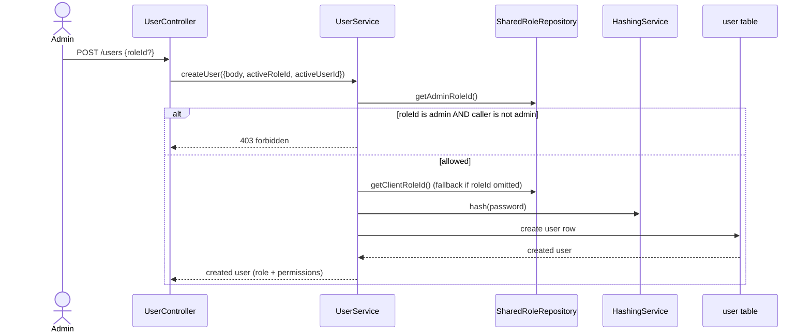
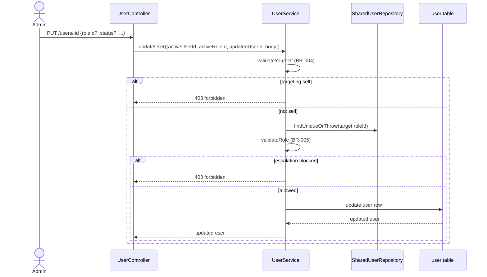
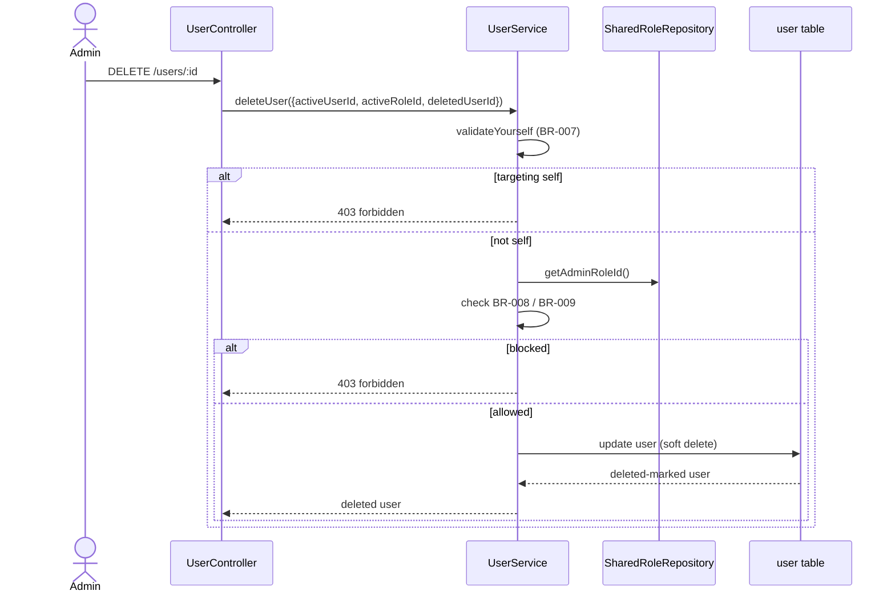
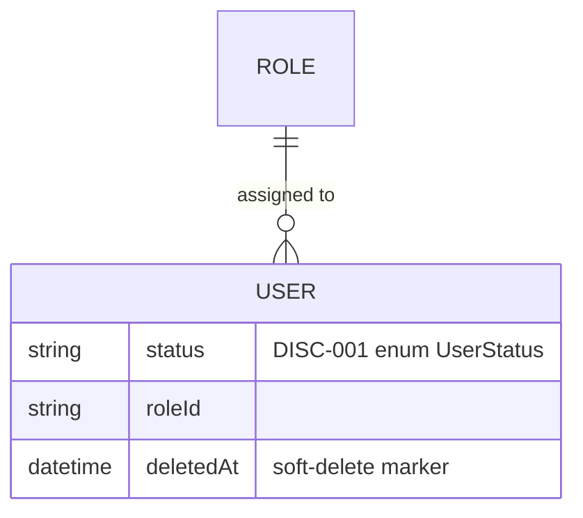

<!-- layout-exempt: rebuild-spec owns all docs/system|features|generated|flows paths -->

# F010_UserAccountAdministration — Technical Spec

**Priority**: P2
**Type**: ui
**Generated**: 2026-09-12

**See also:** [`functional-spec.md`](./functional-spec.md) — plain-language overview, open
decisions, requirements/business rules stated in one-liners, screens, user stories, scenarios,
edge cases, and configuration for a BA/QA audience.

**How to read this file:** § 2 is the index — pick the action you care about and read its block
in § 3 straight through; each block is one complete thread, top to bottom. § 4 is the shared
appendix — jump in only when a § 3 block points you there.

## 1. Technical Overview

`UserController` (`src/routes/user/user.controller.ts:36-152`) exposes 5 routes over `UserService`
(`src/routes/user/user.service.ts`), all reading/writing the `User` table via
`SharedUserRepository` (`src/repositories/user/shared-user.repository.ts`). Every route sits
behind the global `AuthorizationHeaderGuard` → `AccessTokenGuard`
(`src/shared/guards/access-token.guard.ts`), which resolves the caller's role and checks that role
has a `Permission` row for `(path, method)` — the `USERS` module is absent from both
`SellerModule` and `ClientModule` allow-lists (`initial-scripts/create-permission.ts:14-29`), so
only `admin` reaches any of these 5 handlers. `UserService` additionally runs its own
`adminRoleId`-based checks for privilege-escalation and self-action prevention — a second,
explicit layer on top of the module gate (see § 3, A2/A4/A5 Rule rungs).

## 2. Action Index

| # | Action (handler) | Method · Path | Codes | Writes | Detail |
|---|---|---|---|---|---|
| **A0** | *cross-cutting — belongs to no single action* | — | {FR-001, BR-001} | — | § 4.4 |
| **A1** | `UserController#getUsers` | `GET` `/users` | {FR-201, US065} | — *(read-only)* | § 3.1 |
| **A2** | `UserController#getUserById` | `GET` `/users/:id` | {FR-202, US066} | — *(read-only)* | § 3.1 |
| **A3** | `UserController#createUser` | `POST` `/users` | {FR-203, FR-601, BR-002, BR-003, US067} | `user` | § 3.2 ▸ **diagram** |
| **A4** | `UserController#updateUser` | `PUT` `/users/:id` | {FR-204, FR-601, FR-602, BR-004, BR-005, BR-006, US068} | `user` | § 3.3 ▸ **diagram** |
| **A5** | `UserController#deleteUser` | `DELETE` `/users/:id` | {FR-205, FR-602, BR-007, BR-008, BR-009, US069} | `user` | § 3.4 ▸ **diagram** |

**Rung set**: **Who** → **FE** → **Request** → **BE** → **Rule** → **Result** → **State** →
**Source**. No `**FE**` rung appears in any block below — this is a headless API, there is no view
layer; the rung is omitted entirely per contract, never rendered as N/A.

## 3. Actions

### 3.1 CAP-01 — Browse & Inspect Users

#### A1 · List users

`GET` `/users` → `` `UserController#getUsers` ``
`FR-201` `US065`

**Who** · admin *(gate A0 — § 4.4; note: this route's Swagger decoration omits `@ApiAuth`,
`src/routes/user/user.controller.ts:39-52`, unlike A2-A5 — a documentation-only gap, not an auth gap: the guard
is a global `APP_GUARD`, applied regardless of any per-handler decorator, see § 4.4)*
**Request** · query `pageIndex`/`pageSize`/`order`/`orderBy` (`UserPaginationQueryDto`,
`src/dtos/user/user.dto.ts:28-39`)
**BE** · `` `UserService#getUsers` `` — builds a `where: { deletedAt: null }` filter, paginates via
`skip`/`take`, and runs count + find concurrently. `src/routes/user/user.service.ts:55-98`
**Rule** · No business rule beyond the module-level admin gate (A0) — every non-deleted user is
listed, unfiltered by any ownership or ordering restriction.
**Result** · read-only — **no DB write**. Returns `{ data, pagination }` via `PageDto`
(`src/routes/user/user.controller.ts:49-51`); each row selected with `userWithRoleSelect`
(`src/selectors/user.selector.ts:14-19`), i.e. id/name/email/phone/avatar/status + role.
**Source:** `src/routes/user/user.controller.ts:39-52` → `src/routes/user/user.service.ts:55-98` →
`src/repositories/user/shared-user.repository.ts:57-81,129-152`

<!-- No diagram: read-only, single table, synchronous, below diagram threshold. -->

---

#### A2 · View user detail

`GET` `/users/:id` → `` `UserController#getUserById` ``
`FR-202` `US066`

**Who** · admin *(gate A0 — § 4.4)*
**Request** · path param `id` (UUID, `ParseUUIDPipe`)
**BE** · `` `UserService#getUserById` `` — `src/routes/user/user.service.ts:34-44`
**Rule** · No business rule beyond the admin gate (A0) — any non-deleted user's full detail is
returned to any admin caller, with no per-target restriction.
**Result** · read-only — **no DB write**. Returns the user via `userWithRoleAndPermissionsSelect`
(`src/selectors/user.selector.ts:21-26`) — role AND that role's permission list. 404 when the target is missing
or soft-deleted (`where: { id, deletedAt: null }`, `findUniqueOrThrow`).
**Source:** `src/routes/user/user.controller.ts:54-73` → `src/routes/user/user.service.ts:34-44` →
`src/repositories/user/shared-user.repository.ts:153-183`

<!-- No diagram: read-only, single table, synchronous. -->

---

### 3.2 CAP-02 — Create User

#### A3 · Create user

`POST` `/users` → `` `UserController#createUser` ``
`FR-203` `FR-601` `BR-002` `BR-003` `US067`

**Who** · admin *(gate A0 — § 4.4)*
**Request** · body `CreateUserRequestDto` (`src/dtos/user/user.dto.ts:147-216`): email, password, name,
phoneNumber, optional avatar/status/roleId
**BE** · `` `UserService#createUser` `` — `src/routes/user/user.service.ts:108-147`
**Rule**
- **BR-002 — A non-admin caller cannot create a user whose role is admin.** `activeRoleId !==
  adminRoleId && roleId === adminRoleId` throws 403 "You are not allowed to create an admin
  user." `src/routes/user/user.service.ts:117-124`
- **BR-003 — A new user with no explicit role defaults to the client role.** `roleId ?? clientRoleId`
  — same default target self-registration uses (F001/PERM006). `src/routes/user/user.service.ts:126-128`
**Result**
- Writes `user` row ← password hashed via `HashingService.hash` (bcrypt, 10 salt rounds,
  `src/shared/services/hashing.service.ts:8-11`), `roleId` resolved per BR-003,
  `createdById` set to the active admin's ID — `src/repositories/user/shared-user.repository.ts:184-212`
- Returns `CreateUserResponseDto` (id/name/email/phone/avatar/status/role+permissions)
**Source:** `src/routes/user/user.controller.ts:75-95` → `src/routes/user/user.service.ts:108-147` →
`src/repositories/user/shared-user.repository.ts:184-212`



### 3.3 CAP-03 — Update & Promote Role

#### A4 · Update user (and optionally promote role)

`PUT` `/users/:id` → `` `UserController#updateUser` ``
`FR-204` `FR-601` `FR-602` `BR-004` `BR-005` `BR-006` `US068`

**Who** · admin *(gate A0 — § 4.4)*
**Request** · path param `id` (UUID) + body `UpdateUserRequestDto` (`src/dtos/user/user.dto.ts:218-221`, all
`UserRequestDto` fields optional): name, password, phoneNumber, avatar, status, roleId
**BE** · `` `UserService#updateUser` `` — `src/routes/user/user.service.ts:239-285`
**Rule**
- **BR-004 — An admin cannot update their own account through this route.**
  `validateYourself({activeUserId, targetedUserId: updatedUserId})` throws 403 "You cannot update
  your own user." when the two IDs match. `src/routes/user/user.service.ts:156-169, 250`
- **BR-005 — A non-admin caller cannot update a user who is currently admin, and cannot promote
  any user to admin.** `validateRole` — `activeRoleId !== adminRoleId && updatedUserRoleId ===
  adminRoleId` throws 403 "You are not allowed to update this user."; separately
  `activeRoleId !== adminRoleId && roleId === adminRoleId` throws 403 "You are not allowed to
  update the user to an admin." `src/routes/user/user.service.ts:200-228, 252-258`
- **BR-006 — Updating `roleId` here is the only elevation path in the system.** No other route
  lets a caller change a user's `roleId` from client to seller/admin (cf. PERM006 — self-
  registration always hardcodes `client`). No additional code gate beyond BR-005; documented as a
  system-level fact, not a separate check. *(§ 4.4)*
**Result**
- Writes `user.name/phoneNumber/roleId/avatar/status/password/updatedById` ←
  `password` re-hashed via `HashingService.hash` only when supplied, else left unchanged
  (`hashedPassword = password ? hash(password) : undefined`, Prisma ignores `undefined` fields)
  — `src/routes/user/user.service.ts:260-282`
- Returns `UpdateUserResponseDto` (id/name/email/phone/avatar/status/role/updatedAt)
**Source:** `src/routes/user/user.controller.ts:97-124` → `src/routes/user/user.service.ts:239-285` →
`src/repositories/user/shared-user.repository.ts:222-249`



### 3.4 CAP-04 — Delete User

#### A5 · Delete user

`DELETE` `/users/:id` → `` `UserController#deleteUser` ``
`FR-205` `FR-602` `BR-007` `BR-008` `BR-009` `US069`

**Who** · admin *(gate A0 — § 4.4)*
**Request** · path param `id` (UUID)
**BE** · `` `UserService#deleteUser` `` — `src/routes/user/user.service.ts:295-345`
**Rule**
- **BR-007 — An admin cannot delete their own account through this route.**
  `validateYourself` — same helper as BR-004. `src/routes/user/user.service.ts:156-169, 304-307`
- **BR-008 — A non-admin caller cannot delete a user who is currently admin.**
  `activeRoleId !== adminRoleId && deletedUserRole.roleId === adminRoleId` throws 403 "You are not
  allowed to delete admin user." `src/routes/user/user.service.ts:311-322`
- **BR-009 — A caller cannot delete a user holding the exact same role as themselves.**
  `activeRoleId === deletedUserRole.roleId` throws 403 "You cannot delete the user with the same
  role as you." — this also stops admin-deletes-admin whenever BR-008's stricter branch (non-admin
  deleting an admin) doesn't already apply. `src/routes/user/user.service.ts:324-329`
**Result**
- Writes `user.deletedAt` ← `new Date()`, `deletedById`/`updatedById` ← the active admin's ID —
  a **soft delete**, the row is never physically removed. `src/routes/user/user.service.ts:331-342`
- No cascading effect on records the deleted user created/updated/deleted elsewhere (products,
  categories, etc.): those FKs use `onDelete: SetNull`/`NoAction` at the schema level
  (`prisma/schema.prisma:104-111, 246-250` for `Product.createdBy`/`updatedBy`/`deletedBy`, and
  equivalently for every other audit-FK relation to `User`) and never fire here, because this
  action performs a Prisma `update`, not a `delete` — the target row still exists, so no FK
  constraint or cascade is ever triggered by this action. Records the user created remain
  attributed to them, unchanged.
- Returns `BaseUserResponseDto` via `userSelect` (`src/selectors/user.selector.ts:5-12`)
**Source:** `src/routes/user/user.controller.ts:126-151` → `src/routes/user/user.service.ts:295-345` →
`src/repositories/user/shared-user.repository.ts:222-249`



### 3.5 Edge cases

| Action | Scenario | Behavior |
|---|---|---|
| A1-A5 | Caller's role has no USERS-module `Permission` row for the called `(path, method)` | `AccessTokenGuard.verifyRolePermission` throws 403 before the handler runs — `src/shared/guards/access-token.guard.ts:56-99` |
| A2, A4, A5 | Target `id` well-formed UUID but no matching non-deleted row | `findUniqueOrThrow`/`updateUser`/soft-delete-update throw a Prisma not-found (`P2025`), mapped to 404 by `GlobalExceptionFilter`'s `mapPrismaError` (BL007) |
| A3 | `email` already exists (unique constraint) | 422 "Email is already exist." — `src/repositories/user/shared-user.repository.ts:193-198` |
| A4, A5 | Concurrent update/delete on the same target by two admins | Last write wins — no optimistic-locking/version field on `User`; Prisma's plain `update` overwrites whichever admin's call resolves last |
| A4 | Admin sets `status` to `INACTIVE`/`BLOCKED` | Write succeeds; no other code path checks `User.status` anywhere (login included) — see § 5.3 |

## 4. Shared Foundation

### 4.1 Components

| Component | Responsibility | Used in | File |
|---|---|---|---|
| `UserController` | HTTP entry point for all 5 `/users` routes | A1-A5 | `src/routes/user/user.controller.ts` |
| `UserService` | Business logic: pagination, role-escalation/self-action guards, delegates persistence | A1-A5 | `src/routes/user/user.service.ts` |
| `SharedUserRepository` | Prisma `User` CRUD wrapper, error-to-HTTP mapping | A1-A5 | `src/repositories/user/shared-user.repository.ts` |
| `SharedRoleRepository` | Cached lookup of the fixed `admin`/`client` role IDs | A3, A4, A5 | `src/repositories/role/shared-role.repository.ts` |
| `HashingService` | bcrypt password hashing | A3, A4 | `src/shared/services/hashing.service.ts` |
| `AccessTokenGuard` (global) | Decodes the `Bearer` token, loads the caller's role + matching `Permission` row for `(path, method)` | A0 (all actions) | `src/shared/guards/access-token.guard.ts` |

### 4.2 Data Model



| Entity | Table | Used for | Action |
|---|---|---|---|
| `User` | `user` | The account this feature lists/inspects/creates/updates/soft-deletes | A1-A5 |
| `Role` | `role` | Read-only lookup for `adminRoleId`/`clientRoleId`, and joined into every response's `role` field | A1-A5 |
| `Permission` | `permission` | Read (not by this feature's own code) by the global `AccessTokenGuard` to gate every action via A0 | A0 |

#### Polymorphic Behavior

##### DISC-001 — User.status

| Value | Render | Validation | Persistence |
|-------|--------|------------|-------------|
| ACTIVE | Default value returned in every response (`BaseUserResponseDto.status`); no differing behavior elsewhere | None — accepted as-is on create/update | Default at row creation (`prisma/schema.prisma:46`); settable to any of the 3 values by A3 (create) or A4 (update) |
| INACTIVE | Same field, same response shape as ACTIVE | None — accepted as-is; `[UNVERIFIED]` whether any OTHER feature (outside F010) reads this value — grepped the full `src/` tree for a runtime check and found none | Settable by A3/A4; no enforcement anywhere confirmed in source |
| BLOCKED | Same field, same response shape as ACTIVE/INACTIVE | None — accepted as-is | Settable by A3/A4; **confirmed not checked at login** (`src/routes/auth/auth.service.ts` has no `.status` gate) — see RISK-01 in `functional-spec.md` § 11 |

**Source:** docs/generated/entities.md § MODEL002_User > Discriminator Fields;
`src/constants/user-status.constant.ts:1-7`

### 4.3 State Management

None. `User.status` is a stored discriminator (DISC-001, above), not a state machine with
codified transitions in this feature's code — no `SM-###` transition table exists because no
transition guard/side-effect pairing was found (A3/A4 write the raw caller-supplied value with no
transition validation between old and new status).

### 4.4 Shared Rules

#### Bin 3 — cross-cutting, belongs to no single action

**A0 · `{FR-001}` / `{BR-001}` — every `/users` route requires an admin session.**
Global `AuthorizationHeaderGuard` (`APP_GUARD`, registered `src/shared/modules/base.module.ts:38-42`)
delegates to `AccessTokenGuard.canActivate` (`src/shared/guards/access-token.guard.ts:101-122`): extracts the `Bearer`
token, verifies it, then `verifyRolePermission` looks up a `Permission` row matching the request's
`(path, method)` scoped to the caller's role (`:56-99`). The `USERS` module (all 5 routes here) is
absent from both `SellerModule` and `ClientModule` allow-lists seeded by
`initial-scripts/create-permission.ts:14-29,149-192` — only `admin`'s unfiltered permission set
(no module entry ⇒ no filter applied, `:32-35,158-160`) includes it. **This is enforced entirely
by data in the `permission` table, not by any `role.name === 'admin'` string check anywhere in the
guard or controller** — see § 5.3 Unresolved Questions for what this implies. Behavior on gate
failure: 403 "You do not have permission to access this resource.", thrown before the route
handler body runs.
**Source:** `src/shared/guards/access-token.guard.ts:56-122` · `initial-scripts/create-permission.ts:14-35,149-192`
· route-list.md ROUTE066-ROUTE070

Note on `GET /users` (A1) specifically: its handler carries `@ApiPageOkResponse` but not the
`@ApiAuth` Swagger decorator the other 4 handlers carry (`src/routes/user/user.controller.ts:39-44` vs. `54-61`,
`75-82`, `97-104`, `126-133`). `@ApiAuth`/`@ApiPageOkResponse` are pure Swagger-documentation
decorators (`src/shared/param-decorators/http-decorator.ts:20-124`, `168-216`) — neither attaches
a guard; the actual gate is the global `APP_GUARD` above, which applies uniformly regardless of
any per-handler decorator. This is a **Swagger-documentation gap** (A1's docs under-state that it
requires a `Bearer` token), not a security gap.

### 4.5 Algorithms & Integrations

None.

### 4.6 Configuration

N/A — no technical configuration beyond framework defaults for this feature; the admin/client
role IDs are cached in-memory per `SharedRoleRepository` instance after first lookup
(`src/repositories/role/shared-role.repository.ts:25-70`), not a tunable setting.

**Client behavior:** see
[`behavior-logic.md`](../../docs/generated/behavior-logic.md) (client-side patterns — debounce, optimistic UI, polling, upload, realtime),
[`permissions.md`](../../docs/system/permissions.md) (feature flags / experiments / env / locale gates),
[`architecture.md`](../../docs/system/architecture.md) (guards / deep-link state restoration / unsaved-changes protection).

## 5. Verification & Technical Notes

### 5.1 Technical Verification

- **SC-001** *(A1)* A client/seller-role `Bearer` token receives 403 on `GET /users`. (covers
  FR-001, BR-001)
- **SC-002** *(A3, A4)* A non-admin caller (hypothetically reaching the handler) cannot set
  `roleId` to the admin role on create or update. (covers FR-601, BR-002, BR-005)
- **SC-003** *(A4, A5)* An admin caller targeting their own `id` on `PUT`/`DELETE /users/:id`
  receives 403. (covers FR-602, BR-004, BR-007)
- **SC-004** *(A5)* An admin caller targeting another user of the exact same role receives 403 on
  delete. (covers FR-602, BR-009)

#### US065_ViewUserList *(A1)*

**Independent Test:** Call `GET /users` with an admin `Bearer` token and assert a 200 with a
paginated `data`/`pagination` shape; repeat with a client token and assert 403.

**Acceptance Scenarios:**

1. **Given** an admin session, **When** `GET /users` is called, **Then** a 200 response returns
   non-deleted users with role info, paginated.
2. **Given** a client session, **When** `GET /users` is called, **Then** a 403 is returned before
   any user data is read.

#### US068_UpdateUserAndPromoteRole *(A4)*

**Independent Test:** As an admin, `PUT /users/:id` on a client-role target with `{roleId:
<sellerRoleId>}` and assert the response's `role` reflects seller; separately, target the admin's
own `id` and assert 403.

**Acceptance Scenarios:**

1. **Given** an admin session and an existing client-role user, **When** the admin updates that
   user's `roleId` to the seller role, **Then** a 200 response shows the updated role.
2. **Given** an admin session, **When** the admin targets their own `id`, **Then** a 403 is
   returned and no fields change.

### 5.2 Assumptions

- *(A0)* The `USERS` module's absence from `SellerModule`/`ClientModule` is assumed to remain a
  seed-time constant — this spec documents the CURRENT seed data
  (`initial-scripts/create-permission.ts`), not a guarantee it cannot be re-seeded differently in
  a given environment.
- *(A3, A4)* `roleId` values are assumed to always be valid, existing `Role` IDs when supplied —
  no explicit existence check was found beyond the FK constraint error mapped to a generic 422
  "Invalid foreign key constraint." (`src/repositories/user/shared-user.repository.ts:200-205`).

### 5.3 Unresolved Questions

1. **Escalation-guard redundancy** *(A0, A3, A4, A5)*: `UserService`'s own `adminRoleId` checks
   (BR-002/005/008/009) duplicate what module-level RBAC already enforces today (only `admin`
   reaches these handlers at all). Not confirmed from source whether this was deliberate
   defense-in-depth or a leftover from an earlier design where the USERS module was shared more
   broadly — no comment or commit history was read to settle this; flagged as a business-domain
   question in `functional-spec.md` § 3 is not appropriate (no stakeholder decision needed to ship
   as-is), so it stays here as an implementation-history unknown.
2. **`User.status` enforcement scope** *(A3, A4)*: confirmed `status` is unchecked at login
   (`src/routes/auth/auth.service.ts`), but not exhaustively confirmed against every OTHER route in the codebase
   (e.g. profile self-service F009, brand/product ownership checks) — the full-repo grep for
   `.status ===`/`UserStatus.` found no gate anywhere, but a targeted re-grep per feature was out
   of scope for this pass.

### 5.4 Source References

| Action | Order | Symbol | Path | Purpose |
|---|---|---|---|---|
| — | 1 | `User` (Prisma model) | `prisma/schema.prisma:36-119` | Entity this feature revolves around |
| A0 | 2 | `AccessTokenGuard` | `src/shared/guards/access-token.guard.ts:22-123` | Global gate every action passes through first |
| A1-A5 | 3 | `UserController` | `src/routes/user/user.controller.ts:36-152` | HTTP entry point for all 5 routes |
| A1-A5 | 4 | `UserService` | `src/routes/user/user.service.ts:20-346` | Pagination + escalation/self-action business logic |
| A1-A5 | 5 | `SharedUserRepository` | `src/repositories/user/shared-user.repository.ts:14-249` | Prisma persistence + error mapping |
| A3, A4, A5 | 6 | `SharedRoleRepository` | `src/repositories/role/shared-role.repository.ts:25-70` | Cached admin/client role ID lookup |

#### Data Flow

```text
Bearer token + (list query | :id | body) -> AccessTokenGuard resolves role+permission (A0) ->
UserController delegates to UserService -> UserService applies pagination (A1) or
self/role-escalation guards (A3/A4/A5) -> SharedUserRepository reads/writes `user` table ->
DTO-shaped JSON response
```

### 5.5 Artifact References

| Artifact | File | Codes Used | Reviewed |
|----------|------|------------|----------|
| System Overview | [system-overview.md](../../docs/system/system-overview.md) | — | [x] |
| Architecture | [architecture.md](../../docs/system/architecture.md) | — | [x] |
| Feature List | [feature-list.md](../../docs/generated/feature-list.md) | F010 | [x] |
| API Map | [route-list.md](../../docs/generated/route-list.md) | ROUTE066, ROUTE067, ROUTE068, ROUTE069, ROUTE070 | [x] |
| Entities | [entities.md](../../docs/generated/entities.md) | MODEL002, MODEL008 | [x] |
| Screens | [functional-spec.md § 6](../../docs/features/F010_UserAccountAdministration/functional-spec.md#6-screens) | N/A (headless) | [x] |
| Behavior Logic | [behavior-logic.md](../../docs/generated/behavior-logic.md) | — (no BL owned by F010) | [x] |
| Permissions Matrix | [permissions-matrix.md](../../docs/generated/permissions-matrix.md) | PERM005, PERM006 | [x] |
| User Stories | [user-stories.md](../../docs/generated/user-stories.md) | US065, US066, US067, US068, US069 | [x] |

**Rule:** Every code listed in Codes Used exists in its source artifact; orphan refs would be a
reviewer critical.
