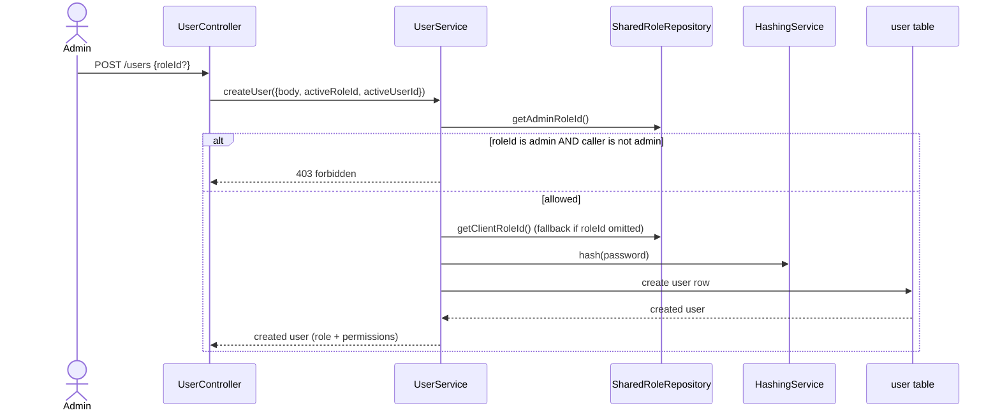
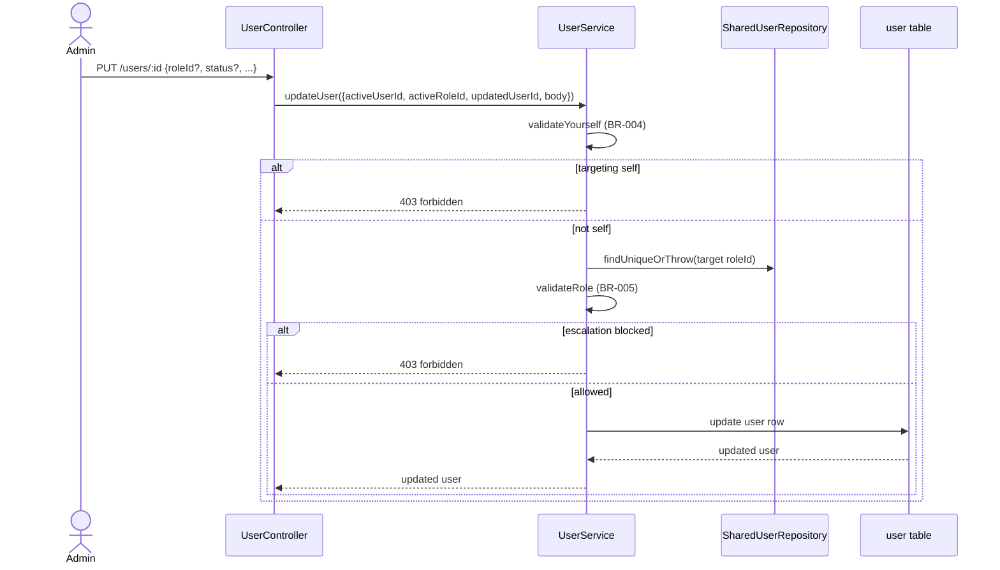
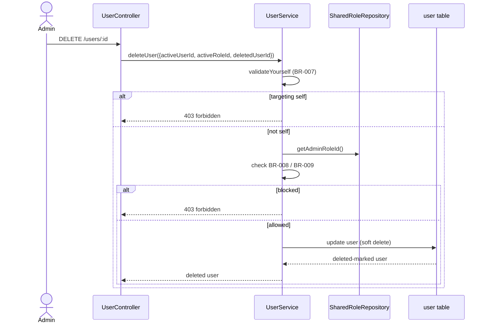
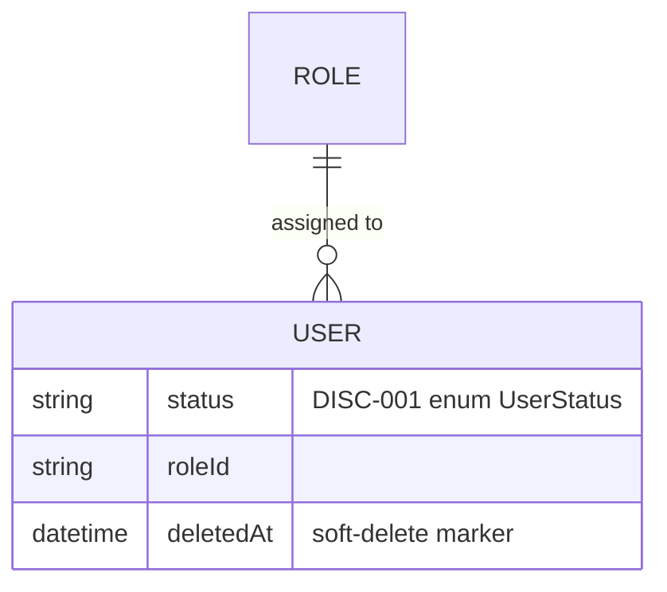

<!-- layout-exempt: rebuild-spec owns all docs/system|features|generated|flows paths -->

# F010_UserAccountAdministration — Mô tả kỹ thuật

**Độ ưu tiên**: P2
**Loại**: ui
**Được tạo**: 2026-09-12

**Xem thêm:** [`functional-spec.vi.md`](./functional-spec.vi.md) — tổng quan bằng ngôn ngữ thường, các quyết định mở,
yêu cầu/quy tắc kinh doanh viết gọn thành từng dòng, màn hình, user story, kịch bản,
trường hợp biên, và cấu hình, dành cho BA/QA.

**Cách đọc file này:** § 2 là mục lục — chọn hành động cần xem rồi đọc thẳng block tương ứng
trong § 3 từ đầu đến cuối; mỗi block là một luồng hoàn chỉnh. § 4 là phụ lục dùng chung — chỉ vào đó
khi một block ở § 3 dẫn tới.

## 1. Tổng quan kỹ thuật

`UserController` (`src/routes/user/user.controller.ts:36-152`) expose 5 route qua `UserService`
(`src/routes/user/user.service.ts`), tất cả đọc/ghi bảng `User` thông qua
`SharedUserRepository` (`src/repositories/user/shared-user.repository.ts`). Mọi route đều nằm
sau global guard `AuthorizationHeaderGuard` → `AccessTokenGuard`
(`src/shared/guards/access-token.guard.ts`) — guard này xác định role của người gọi rồi kiểm tra
role đó có row `Permission` cho `(path, method)` hay không. Module `USERS` không nằm trong
allowlist của cả `SellerModule` lẫn `ClientModule` (`initial-scripts/create-permission.ts:14-29`), nên
chỉ `admin` mới chạm được tới 5 handler này. `UserService` còn tự chạy thêm
kiểm tra dựa trên `adminRoleId` để chặn leo quyền và chặn tự thao tác lên chính mình — một lớp kiểm tra thứ hai,
rõ ràng nằm trên cổng chặn ở module (xem § 3, các rung Rule của A2/A4/A5).

## 2. Chỉ mục hành động

| # | Hành động (handler) | Phương thức · Đường dẫn | Mã | Ghi | Chi tiết |
|---|---|---|---|---|---|
| **A0** | *xuyên suốt — không thuộc hành động nào* | — | {FR-001, BR-001} | — | § 4.4 |
| **A1** | `UserController#getUsers` | `GET` `/users` | {FR-201, US065} | — *(chỉ đọc)* | § 3.1 |
| **A2** | `UserController#getUserById` | `GET` `/users/:id` | {FR-202, US066} | — *(chỉ đọc)* | § 3.1 |
| **A3** | `UserController#createUser` | `POST` `/users` | {FR-203, FR-601, BR-002, BR-003, US067} | `user` | § 3.2 ▸ **sơ đồ** |
| **A4** | `UserController#updateUser` | `PUT` `/users/:id` | {FR-204, FR-601, FR-602, BR-004, BR-005, BR-006, US068} | `user` | § 3.3 ▸ **sơ đồ** |
| **A5** | `UserController#deleteUser` | `DELETE` `/users/:id` | {FR-205, FR-602, BR-007, BR-008, BR-009, US069} | `user` | § 3.4 ▸ **sơ đồ** |

**Bộ rung**: **Ai** → **FE** → **Request** → **BE** → **Quy tắc** → **Kết quả** → **Trạng thái** →
**Nguồn**. Không block nào dưới đây có rung **FE** — đây là API headless, không có lớp view;
rung này bị bỏ hẳn theo quy ước, không bao giờ hiển thị là N/A.

## 3. Hành động

### 3.1 CAP-01 — Duyệt & Kiểm tra người dùng

#### A1 · Liệt kê người dùng

`GET` `/users` → `` `UserController#getUsers` ``
`FR-201` `US065`

**Ai** · admin *(cổng A0 — § 4.4; lưu ý: route này thiếu decorator Swagger `@ApiAuth`,
`src/routes/user/user.controller.ts:39-52`, khác với A2-A5 — chỉ thiếu ở tài liệu, không thiếu ở phần xác thực: guard
là global `APP_GUARD`, áp dụng bất kể handler có decorator hay không, xem § 4.4)*
**Request** · query `page`/`pageSize`/`order`/`orderBy` (`UserPaginationQueryDto`,
`src/dtos/user/user.dto.ts:28-39`)
**BE** · `` `UserService#getUsers` `` — dựng filter `where: { deletedAt: null }`, phân trang bằng
`skip`/`take`, chạy count và find song song. `src/routes/user/user.service.ts:55-98`
**Quy tắc** · Không có business rule nào ngoài cổng admin ở cấp module (A0) — mọi user chưa bị xóa
đều được liệt kê, không lọc theo quyền sở hữu hay giới hạn thứ tự nào khác.
**Kết quả** · chỉ đọc — **không ghi DB**. Trả về `{ data, pagination }` qua `PageDto`
(`src/routes/user/user.controller.ts:49-51`); mỗi row được chọn bằng `userWithRoleSelect`
(`src/selectors/user.selector.ts:14-19`), tức id/name/email/phone/avatar/status + role.
**Nguồn:** `src/routes/user/user.controller.ts:39-52` → `src/routes/user/user.service.ts:55-98` →
`src/repositories/user/shared-user.repository.ts:57-81,129-152`

<!-- No diagram: read-only, single table, synchronous, below diagram threshold. -->

---

#### A2 · Xem chi tiết người dùng

`GET` `/users/:id` → `` `UserController#getUserById` ``
`FR-202` `US066`

**Ai** · admin *(cổng A0 — § 4.4)*
**Request** · path param `id` (UUID, `ParseUUIDPipe`)
**BE** · `` `UserService#getUserById` `` — `src/routes/user/user.service.ts:34-44`
**Quy tắc** · Không có business rule nào ngoài cổng admin (A0) — chi tiết đầy đủ của bất kỳ user nào
chưa bị xóa đều trả về cho mọi admin, không giới hạn theo từng target.
**Kết quả** · chỉ đọc — **không ghi DB**. Trả về user qua `userWithRoleAndPermissionsSelect`
(`src/selectors/user.selector.ts:21-26`) — role VÀ danh sách permission của role đó. 404 khi target không tồn tại
hoặc đã bị soft-delete (`where: { id, deletedAt: null }`, `findUniqueOrThrow`).
**Nguồn:** `src/routes/user/user.controller.ts:54-73` → `src/routes/user/user.service.ts:34-44` →
`src/repositories/user/shared-user.repository.ts:153-183`

<!-- No diagram: read-only, single table, synchronous. -->

---

### 3.2 CAP-02 — Tạo người dùng

#### A3 · Tạo người dùng

`POST` `/users` → `` `UserController#createUser` ``
`FR-203` `FR-601` `BR-002` `BR-003` `US067`

**Ai** · admin *(cổng A0 — § 4.4)*
**Request** · body `CreateUserRequestDto` (`src/dtos/user/user.dto.ts:147-216`): email, password, name,
phoneNumber, optional avatar/status/roleId
**BE** · `` `UserService#createUser` `` — `src/routes/user/user.service.ts:108-147`
**Quy tắc**
- **BR-002 — Người gọi không phải admin thì không được tạo user có role admin.** `activeRoleId !==
  adminRoleId && roleId === adminRoleId` ném lỗi 403 "You are not allowed to create an admin
  user." `src/routes/user/user.service.ts:117-124`
- **BR-003 — User mới không chỉ định role rõ ràng sẽ mặc định về role client.** `roleId ?? clientRoleId`
  — cùng target mặc định mà self-registration dùng (F001/PERM006). `src/routes/user/user.service.ts:126-128`
**Kết quả**
- Ghi row `user` ← password được hash bằng `HashingService.hash` (bcrypt, 10 salt round,
  `src/shared/services/hashing.service.ts:8-11`), `roleId` được xác định theo BR-003,
  `createdById` gán bằng ID của admin đang thao tác — `src/repositories/user/shared-user.repository.ts:184-212`
- Trả về `CreateUserResponseDto` (id/name/email/phone/avatar/status/role+permissions)
**Nguồn:** `src/routes/user/user.controller.ts:75-95` → `src/routes/user/user.service.ts:108-147` →
`src/repositories/user/shared-user.repository.ts:184-212`



### 3.3 CAP-03 — Cập nhật & Thăng cấp role

#### A4 · Cập nhật user (và tùy chọn thăng cấp role)

`PUT` `/users/:id` → `` `UserController#updateUser` ``
`FR-204` `FR-601` `FR-602` `BR-004` `BR-005` `BR-006` `US068`

**Ai** · admin *(cổng A0 — § 4.4)*
**Request** · path param `id` (UUID) + body `UpdateUserRequestDto` (`src/dtos/user/user.dto.ts:218-221`, mọi
field của `UserRequestDto` đều optional): name, password, phoneNumber, avatar, status, roleId
**BE** · `` `UserService#updateUser` `` — `src/routes/user/user.service.ts:239-285`
**Quy tắc**
- **BR-004 — Admin không thể tự cập nhật tài khoản của mình qua route này.**
  `validateYourself({activeUserId, targetedUserId: updatedUserId})` ném lỗi 403 "You cannot update
  your own user." khi hai ID trùng nhau. `src/routes/user/user.service.ts:156-169, 250`
- **BR-005 — Người gọi không phải admin thì không được cập nhật user đang là admin, và không được thăng
  bất kỳ user nào lên admin.** `validateRole` — `activeRoleId !== adminRoleId && updatedUserRoleId ===
  adminRoleId` ném lỗi 403 "You are not allowed to update this user."; riêng
  `activeRoleId !== adminRoleId && roleId === adminRoleId` ném lỗi 403 "You are not allowed to
  update the user to an admin." `src/routes/user/user.service.ts:200-228, 252-258`
- **BR-006 — Cập nhật `roleId` ở đây là con đường duy nhất để thăng cấp role trong toàn hệ thống.** Không route nào khác
  cho phép người gọi đổi `roleId` của user từ client sang seller/admin (so với PERM006 — self-
  registration luôn hardcode `client`). Không có thêm code chặn nào ngoài BR-005; đây là một
  đặc điểm của hệ thống, không phải một check riêng. *(§ 4.4)*
**Kết quả**
- Ghi `user.name/phoneNumber/roleId/avatar/status/password/updatedById` ←
  `password` chỉ được hash lại bằng `HashingService.hash` khi có truyền lên, nếu không thì giữ nguyên
  (`hashedPassword = password ? hash(password) : undefined`, Prisma bỏ qua field `undefined`)
  — `src/routes/user/user.service.ts:260-282`
- Trả về `UpdateUserResponseDto` (id/name/email/phone/avatar/status/role/updatedAt)
**Nguồn:** `src/routes/user/user.controller.ts:97-124` → `src/routes/user/user.service.ts:239-285` →
`src/repositories/user/shared-user.repository.ts:222-249`



### 3.4 CAP-04 — Xóa user

#### A5 · Xóa user

`DELETE` `/users/:id` → `` `UserController#deleteUser` ``
`FR-205` `FR-602` `BR-007` `BR-008` `BR-009` `US069`

**Ai** · admin *(cổng A0 — § 4.4)*
**Request** · path param `id` (UUID)
**BE** · `` `UserService#deleteUser` `` — `src/routes/user/user.service.ts:295-345`
**Quy tắc**
- **BR-007 — Admin không thể tự xóa tài khoản của mình qua route này.**
  `validateYourself` — dùng chung helper với BR-004. `src/routes/user/user.service.ts:156-169, 304-307`
- **BR-008 — Người gọi không phải admin thì không được xóa user đang là admin.**
  `activeRoleId !== adminRoleId && deletedUserRole.roleId === adminRoleId` ném lỗi 403 "You are not
  allowed to delete admin user." `src/routes/user/user.service.ts:311-322`
- **BR-009 — Người gọi không thể xóa user có đúng role giống mình.**
  `activeRoleId === deletedUserRole.roleId` ném lỗi 403 "You cannot delete the user with the same
  role as you." — điều này cũng chặn luôn trường hợp admin xóa admin, ở những nhánh mà BR-008 (chặn non-admin
  xóa admin) chưa xử lý tới. `src/routes/user/user.service.ts:324-329`
**Kết quả**
- Ghi `user.deletedAt` ← `new Date()`, `deletedById`/`updatedById` ← ID của admin đang thao tác —
  đây là **soft delete**, row không bao giờ bị xóa vật lý. `src/routes/user/user.service.ts:331-342`
- Không kéo theo hiệu ứng dây chuyền lên các bản ghi mà user bị xóa từng tạo/cập nhật/xóa ở nơi khác (product,
  category, v.v.): các FK đó dùng `onDelete: SetNull`/`NoAction` ở cấp schema
  (`prisma/schema.prisma:104-111, 246-250` cho `Product.createdBy`/`updatedBy`/`deletedBy`, và
  tương tự cho mọi quan hệ FK audit khác trỏ tới `User`) nên không bao giờ được kích hoạt ở đây, vì hành động này
  chạy Prisma `update`, không phải `delete` — row target vẫn tồn tại, nên không có FK
  constraint hay cascade nào bị kích hoạt. Các bản ghi user đã tạo vẫn
  giữ nguyên thông tin ghi nhận, không đổi.
- Trả về `BaseUserResponseDto` qua `userSelect` (`src/selectors/user.selector.ts:5-12`)
**Nguồn:** `src/routes/user/user.controller.ts:126-151` → `src/routes/user/user.service.ts:295-345` →
`src/repositories/user/shared-user.repository.ts:222-249`



### 3.5 Trường hợp biên

| Hành động | Kịch bản | Hành vi |
|---|---|---|
| A1-A5 | Role của người gọi không có row `Permission` cho module USERS ứng với `(path, method)` được gọi | `AccessTokenGuard.verifyRolePermission` ném 403 trước khi handler chạy — `src/shared/guards/access-token.guard.ts:56-99` |
| A2, A4, A5 | Target `id` là UUID hợp lệ nhưng không có row nào khớp mà chưa bị xóa | `findUniqueOrThrow`/`updateUser`/soft-delete-update ném lỗi Prisma not-found (`P2025`), được `mapPrismaError` của `GlobalExceptionFilter` map thành 404 (BL007) |
| A3 | `email` đã tồn tại (unique constraint) | 422 "Email is already exist." — `src/repositories/user/shared-user.repository.ts:193-198` |
| A4, A5 | Hai admin cùng cập nhật/xóa một target cùng lúc | Ghi sau thắng ghi trước — `User` không có optimistic-locking/version field; `update` thuần của Prisma ghi đè theo call nào resolve sau cùng |
| A4 | Admin đặt `status` thành `INACTIVE`/`BLOCKED` | Ghi thành công; không có đoạn code nào khác kiểm tra `User.status` (kể cả login) — xem § 5.3 |

## 4. Nền tảng chung

### 4.1 Thành phần

| Thành phần | Trách nhiệm | Sử dụng trong | File |
|---|---|---|---|
| `UserController` | Entry point HTTP cho cả 5 route `/users` | A1-A5 | `src/routes/user/user.controller.ts` |
| `UserService` | Business logic: phân trang, guard chống leo quyền/tự thao tác, giao việc persistence | A1-A5 | `src/routes/user/user.service.ts` |
| `SharedUserRepository` | Wrapper CRUD Prisma cho `User`, map lỗi sang HTTP | A1-A5 | `src/repositories/user/shared-user.repository.ts` |
| `SharedRoleRepository` | Tra cứu có cache cho ID role `admin`/`client` cố định | A3, A4, A5 | `src/repositories/role/shared-role.repository.ts` |
| `HashingService` | Hash password bằng bcrypt | A3, A4 | `src/shared/services/hashing.service.ts` |
| `AccessTokenGuard` (global) | Giải mã token `Bearer`, load role của người gọi + row `Permission` khớp `(path, method)` | A0 (all actions) | `src/shared/guards/access-token.guard.ts` |

### 4.2 Mô hình dữ liệu



| Entity | Bảng | Sử dụng cho | Hành động |
|---|---|---|---|
| `User` | `user` | Tài khoản mà tính năng này liệt kê/xem/tạo/cập nhật/soft-delete | A1-A5 |
| `Role` | `role` | Tra cứu chỉ đọc cho `adminRoleId`/`clientRoleId`, và join vào field `role` của mọi response | A1-A5 |
| `Permission` | `permission` | Được global `AccessTokenGuard` đọc (không phải code của tính năng này) để chặn mỗi hành động qua A0 | A0 |

#### Hành vi đa hình

##### DISC-001 — User.status

| Giá trị | Hiển thị | Xác thực | Persistence |
|-------|--------|------------|-------------|
| ACTIVE | Giá trị mặc định trả về trong mọi response (`BaseUserResponseDto.status`); không có hành vi khác biệt ở đâu khác | Không kiểm tra — nhận nguyên trạng khi tạo/cập nhật | Mặc định khi tạo row (`prisma/schema.prisma:46`); có thể đặt thành bất kỳ giá trị nào trong 3 giá trị bởi A3 (tạo) hoặc A4 (cập nhật) |
| INACTIVE | Cùng field, cùng shape response như ACTIVE | Không kiểm tra — nhận nguyên trạng; `[UNVERIFIED]` chưa rõ có tính năng KHÁC (ngoài F010) nào đọc giá trị này không — đã grep toàn bộ cây `src/` để tìm kiểm tra runtime nhưng không thấy | Có thể đặt bởi A3/A4; không xác nhận được có enforcement nào trong code |
| BLOCKED | Cùng field, cùng shape response như ACTIVE/INACTIVE | Không kiểm tra — nhận nguyên trạng | Có thể đặt bởi A3/A4; **xác nhận KHÔNG bị kiểm tra khi login** (`src/routes/auth/auth.service.ts` không có chặn theo `.status`) — xem RISK-01 trong `functional-spec.md` § 11 |

**Nguồn:** docs/generated/entities.md § MODEL002_User > Discriminator Fields;
`src/constants/user-status.constant.ts:1-7`

### 4.3 Quản lý trạng thái

Không có. `User.status` là một discriminator được lưu trữ (DISC-001, ở trên), không phải state machine với
các bước chuyển được mã hóa trong code tính năng này — không có bảng chuyển trạng thái `SM-###` nào vì không
tìm thấy cặp guard-chuyển-trạng-thái/side-effect nào (A3/A4 ghi thẳng giá trị người gọi gửi lên, không
xác thực việc chuyển từ trạng thái cũ sang mới).

### 4.4 Quy tắc chung

#### Bin 3 — xuyên suốt, không thuộc hành động nào

**A0 · `{FR-001}` / `{BR-001}` — mỗi route `/users` đều yêu cầu session admin.**
Global guard `AuthorizationHeaderGuard` (`APP_GUARD`, đăng ký tại `src/shared/modules/base.module.ts:38-42`)
giao lại cho `AccessTokenGuard.canActivate` (`src/shared/guards/access-token.guard.ts:101-122`): lấy token `Bearer`,
verify token, sau đó `verifyRolePermission` tra row `Permission` khớp
`(path, method)` của request theo role người gọi (`:56-99`). Module `USERS` (cả 5 route ở đây)
không nằm trong allowlist của `SellerModule` lẫn `ClientModule` được seed bởi
`initial-scripts/create-permission.ts:14-29,149-192` — chỉ bộ permission không giới hạn của `admin` (không có entry module ⇒ không áp filter nào, `:32-35,158-160`) mới bao gồm nó. **Việc này được thực thi hoàn toàn
bằng dữ liệu trong bảng `permission`, không có bất kỳ kiểm tra string `role.name === 'admin'` nào trong
guard hay controller** — xem § 5.3 Câu hỏi chưa giải quyết để rõ điều này kéo theo gì. Khi bị chặn: 403 "You do not have permission to access this resource.", ném ra trước khi thân handler của route chạy.
**Nguồn:** `src/shared/guards/access-token.guard.ts:56-122` · `initial-scripts/create-permission.ts:14-35,149-192`
· route-list.md ROUTE066-ROUTE070

Lưu ý riêng cho `GET /users` (A1): handler của nó có `@ApiPageOkResponse` nhưng thiếu decorator
`@ApiAuth` mà 4 handler còn lại đều có (`src/routes/user/user.controller.ts:39-44` so với `54-61`,
`75-82`, `97-104`, `126-133`). `@ApiAuth`/`@ApiPageOkResponse` chỉ là decorator tài liệu Swagger thuần túy (`src/shared/param-decorators/http-decorator.ts:20-124`, `168-216`) — cả hai đều không gắn guard; guard thực sự là `APP_GUARD` global nói trên, áp dụng đồng nhất bất kể
handler có decorator hay không. Đây chỉ là **khoảng trống tài liệu Swagger** (tài liệu A1 ghi thiếu việc nó
cần token `Bearer`), không phải lỗ hổng bảo mật.

### 4.5 Thuật toán & Tích hợp

Không có.

### 4.6 Cấu hình

N/A — tính năng này không có cấu hình kỹ thuật nào ngoài mặc định của framework; ID role admin/client
được cache trong bộ nhớ theo từng instance `SharedRoleRepository` sau lần tra cứu đầu tiên
(`src/repositories/role/shared-role.repository.ts:25-70`), không phải một cấu hình có thể chỉnh.

**Hành vi Client:** xem
[`behavior-logic.md`](../../docs/generated/behavior-logic.md) (mẫu phía client — debounce, UI lạc quan, polling, upload, realtime),
[`permissions.md`](../../docs/system/permissions.md) (cờ tính năng / thử nghiệm / env / locale gates),
[`architecture.md`](../../docs/system/architecture.md) (guards / deep-link state restoration / unsaved-changes protection).

## 5. Xác minh & Ghi chú kỹ thuật

### 5.1 Xác minh kỹ thuật

- **SC-001** *(A1)* Token `Bearer` với role client/seller nhận 403 trên `GET /users`. (thuộc
  FR-001, BR-001)
- **SC-002** *(A3, A4)* Người gọi không phải admin (giả sử chạm được tới handler) không thể set
  `roleId` thành role admin khi tạo hoặc cập nhật. (thuộc FR-601, BR-002, BR-005)
- **SC-003** *(A4, A5)* Admin nhắm vào `id` của chính mình trên `PUT`/`DELETE /users/:id`
  sẽ nhận 403. (thuộc FR-602, BR-004, BR-007)
- **SC-004** *(A5)* Admin nhắm vào user khác có đúng cùng role sẽ nhận 403 khi
  xóa. (thuộc FR-602, BR-009)

#### US065_ViewUserList *(A1)*

**Kiểm tra độc lập:** Gọi `GET /users` với token `Bearer` admin và assert 200 với shape
`data`/`pagination` phân trang; lặp lại với token client và assert 403.

**Kịch bản chấp nhận:**

1. **Cho rằng** có session admin, **Khi** gọi `GET /users`, **Thì** response 200 trả về
   các user chưa bị xóa kèm thông tin role, có phân trang.
2. **Cho rằng** có session client, **Khi** gọi `GET /users`, **Thì** trả về 403 trước khi
   đọc bất kỳ dữ liệu user nào.

#### US068_UpdateUserAndPromoteRole *(A4)*

**Kiểm tra độc lập:** Với vai trò admin, gọi `PUT /users/:id` lên target có role client với `{roleId:
<sellerRoleId>}` và assert `role` trong response là seller; riêng biệt, nhắm vào `id` của chính admin đó
và assert 403.

**Kịch bản chấp nhận:**

1. **Cho rằng** có session admin và một user có role client, **Khi** admin cập nhật
   `roleId` của user đó sang role seller, **Thì** response 200 hiển thị role đã cập nhật.
2. **Cho rằng** có session admin, **Khi** admin nhắm vào `id` của chính mình, **Thì** trả về
   403 và không field nào thay đổi.

### 5.2 Giả định

- *(A0)* Việc module `USERS` không có trong `SellerModule`/`ClientModule` được giả định là một hằng số ở thời điểm seed — spec này chỉ ghi lại dữ liệu seed HIỆN TẠI
  (`initial-scripts/create-permission.ts`), không đảm bảo nó không thể được seed khác đi ở
  một môi trường khác.
- *(A3, A4)* Giá trị `roleId` khi được truyền lên được giả định luôn là ID `Role` hợp lệ, đang tồn tại —
  không thấy có kiểm tra tồn tại rõ ràng nào ngoài lỗi constraint FK được map thành 422 chung
  "Invalid foreign key constraint." (`src/repositories/user/shared-user.repository.ts:200-205`).

### 5.3 Câu hỏi chưa giải quyết

1. **Guard chống leo quyền có bị dư thừa** *(A0, A3, A4, A5)*: các kiểm tra `adminRoleId` riêng của `UserService`
   (BR-002/005/008/009) trùng với những gì RBAC cấp module đã chặn từ trước (dù sao chỉ `admin`
   mới chạm được các handler này). Chưa xác nhận được từ code liệu đây là chủ đích
   defense-in-depth hay là tàn dư từ thiết kế cũ khi module USERS được chia sẻ rộng hơn — chưa
   đọc comment hay lịch sử commit để làm rõ; đánh dấu thành câu hỏi domain trong `functional-spec.md` § 3 là không phù hợp (không cần quyết định của stakeholder mới ship
   được), nên để ở đây như một điểm chưa rõ về lịch sử triển khai.
2. **Phạm vi áp dụng của `User.status`** *(A3, A4)*: đã xác nhận `status` không bị kiểm tra khi login
   (`src/routes/auth/auth.service.ts`), nhưng chưa xác nhận toàn diện với mọi route KHÁC trong codebase
   (ví dụ: self-service profile F009, kiểm tra quyền sở hữu brand/product) — grep toàn repo với
   `.status ===`/`UserStatus.` không tìm thấy chỗ nào chặn, nhưng việc grep có mục tiêu theo từng tính năng
   nằm ngoài phạm vi lần rà soát này.

### 5.4 Tham chiếu nguồn

| Hành động | Thứ tự | Ký hiệu | Đường dẫn | Mục đích |
|---|---|---|---|---|
| — | 1 | `User` (Prisma model) | `prisma/schema.prisma:36-119` | Entity mà tính năng này xoay quanh |
| A0 | 2 | `AccessTokenGuard` | `src/shared/guards/access-token.guard.ts:22-123` | Cổng chặn toàn cục mà mọi hành động đi qua đầu tiên |
| A1-A5 | 3 | `UserController` | `src/routes/user/user.controller.ts:36-152` | Entry point HTTP cho cả 5 route |
| A1-A5 | 4 | `UserService` | `src/routes/user/user.service.ts:20-346` | Business logic phân trang + guard chống leo quyền/tự thao tác |
| A1-A5 | 5 | `SharedUserRepository` | `src/repositories/user/shared-user.repository.ts:14-249` | Persistence Prisma + map lỗi |
| A3, A4, A5 | 6 | `SharedRoleRepository` | `src/repositories/role/shared-role.repository.ts:25-70` | Tra cứu ID role admin/client có cache |

#### Luồng dữ liệu

```text
Bearer token + (list query | :id | body) -> AccessTokenGuard resolves role+permission (A0) ->
UserController delegates to UserService -> UserService applies pagination (A1) or
self/role-escalation guards (A3/A4/A5) -> SharedUserRepository reads/writes `user` table ->
DTO-shaped JSON response
```

### 5.5 Tham chiếu tạo phẩm

| Tạo phẩm | File | Mã sử dụng | Được xem xét |
|----------|------|------------|----------|
| System Overview | [system-overview.md](../../docs/system/system-overview.md) | — | [x] |
| Architecture | [architecture.md](../../docs/system/architecture.md) | — | [x] |
| Feature List | [feature-list.md](../../docs/generated/feature-list.md) | F010 | [x] |
| API Map | [route-list.md](../../docs/generated/route-list.md) | ROUTE066, ROUTE067, ROUTE068, ROUTE069, ROUTE070 | [x] |
| Entities | [entities.md](../../docs/generated/entities.md) | MODEL002, MODEL008 | [x] |
| Screens | [functional-spec.md § 6](../../docs/features/F010_UserAccountAdministration/functional-spec.md#6-screens) | N/A (headless) | [x] |
| Behavior Logic | [behavior-logic.md](../../docs/generated/behavior-logic.md) | — (no BL owned by F010) | [x] |
| Permissions Matrix | [permissions-matrix.md](../../docs/generated/permissions-matrix.md) | PERM005, PERM006 | [x] |
| User Stories | [user-stories.md](../../docs/generated/user-stories.md) | US065, US066, US067, US068, US069 | [x] |

**Quy tắc:** Mọi mã liệt kê trong cột Mã sử dụng đều phải tồn tại trong artifact nguồn của nó; tham chiếu mồ côi sẽ bị
reviewer đánh giá là lỗi nghiêm trọng.
