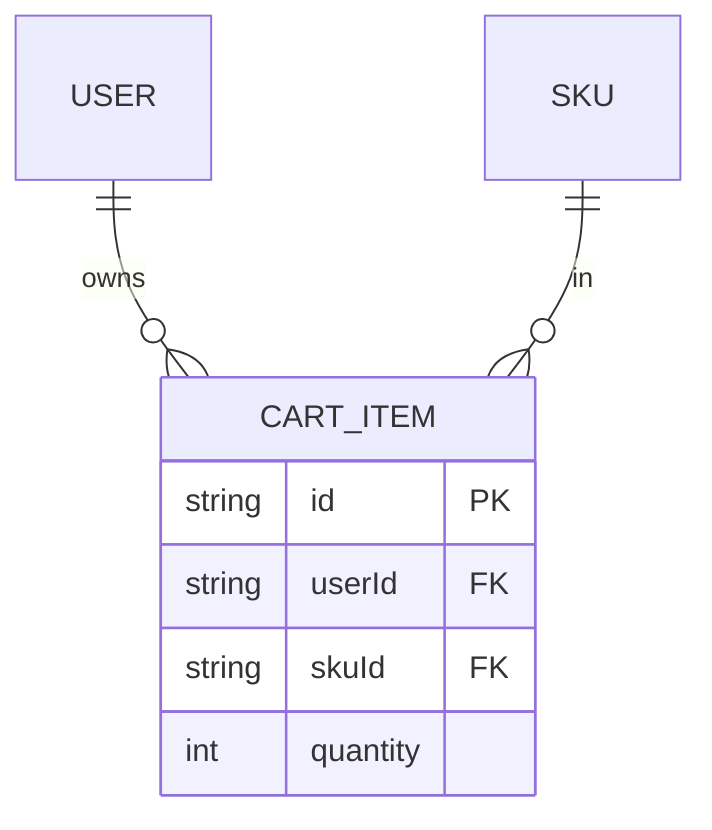

# F011_ShoppingCart — Technical Spec

**Priority**: P0
**Type**: ui
**Generated**: 2026-09-12

**See also:** [`functional-spec.md`](./functional-spec.md) — plain-language overview, open
decisions, requirements/business rules stated in one-liners, screens, user stories, scenarios,
edge cases, and configuration for a BA/QA audience.

**How to read this file:** § 2 is the index — pick the action you care about and read its block
in § 3 straight through; each block is one complete thread, top to bottom. § 4 is the shared
appendix — jump in only when a § 3 block points you there.

## 1. Technical Overview

Four Bearer-protected endpoints on `CartController` (`src/routes/cart/cart.controller.ts:32-134`)
manage one user's cart: list (`GET /cart`), add (`POST /cart`), set-quantity (`PUT /cart/:cartItemId`),
and remove (`DELETE /cart/:cartItemId`). `CartService` (`src/routes/cart/cart.service.ts`) enforces
the ownership, addability, and stock-ceiling business rules, delegating persistence to
`CartRepository` (`src/repositories/cart/cart.repository.ts`). The add path's actual write goes
through `upsertCartItemWithConflictRetry` (`src/repositories/cart/cart-upsert.util.ts`), which
relies on the DB-level `@@unique([userId, skuId])` constraint (migration
`20260912140523_add_cart_item_user_sku_unique`) to make BR-C04 race-safe.

## 2. Action Index

| # | Action (handler) | Method · Path | Codes | Writes | Detail |
|---|---|---|---|---|---|
| **A1** | `CartController#getCartItems` | `GET` `/cart` | {FR-001, FR-201, BR-C01, US070} | — *(read-only)* | § 3.1 |
| **A2** | `CartController#addCartItem` | `POST` `/cart` | {FR-202, BR-C01, BR-C02, BR-C03, BR-C04, US071} | `CartItem` upsert | § 3.1 |
| **A3** | `CartController#updateCartItemQuantity` | `PUT` `/cart/:cartItemId` | {FR-203, BR-C01, BR-C03, US072} | `CartItem` update | § 3.1 |
| **A4** | `CartController#deleteCartItem` | `DELETE` `/cart/:cartItemId` | {FR-204, BR-C01, BR-C05, US073} | `CartItem` delete | § 3.1 |

**Rung set** — every block in § 3 uses this exact order; an absent rung is omitted, never
rendered as `N/A` or `None.`:

> **Who** → **FE** → **Request** → **BE** → **Rule** → **Result** → **State** → **Source**

**Diagram threshold:** none of A1–A4 involve a multi-step transaction across more than one entity
type — no `sequenceDiagram` is included for any of them.

## 3. Actions

### 3.1 CAP-01 — Own Cart Management

#### A1 · List own cart lines

`GET` `/cart` → `` `CartController#getCartItems` ``
`FR-001` `FR-201` `US070`

**Who** · Any authenticated caller (client/seller/admin), scoped to their own rows.
**FE** · *none — headless API, no view layer*
**Request** · query params via `CartPaginationQueryDto` (`src/dtos/cart/cart.dto.ts:130-141`):
`page` (default 1), `pageSize` (default 10), `order` (`asc`/`desc`), `orderBy` (from
`CartItemOrderByFields`).
**BE** · `` `CartService#getCartItems` `` (`src/routes/cart/cart.service.ts:14-49`) builds
pagination and always passes `where: { userId }` (BR-C01) to
`` `CartRepository#findManyCartItems` `` (`src/repositories/cart/cart.repository.ts:19-48`), which
runs `findMany` + `count` in one `$transaction`.
**Result** · read-only — **no DB write**. Returns `{ data: CartItem[], pagination }` via `PageDto`
(`src/routes/cart/cart.controller.ts:43-47`).
**Source:** `src/routes/cart/cart.controller.ts:41-47` → `src/routes/cart/cart.service.ts:14-49` →
`src/repositories/cart/cart.repository.ts:19-48` → `src/selectors/cart-item.selector.ts`

<!-- No diagram: below threshold — read-only, single query pair, synchronous. -->

---

#### A2 · Add a SKU to the cart

`POST` `/cart` → `` `CartController#addCartItem` ``
`FR-202` `US071`

**Who** · Any authenticated caller, acting on their own cart only.
**FE** · *none*
**Request** · body via `AddCartItemRequestDto` (`src/dtos/cart/cart.dto.ts:100-108`): `skuId`
(UUID), `quantity` (integer ≥ 1).
**BE** · `` `CartService#addCartItem` `` (`src/routes/cart/cart.service.ts:51-78`) resolves the SKU
via `` `CartRepository#findAddableSku` `` (`src/repositories/cart/cart.repository.ts:83-108`),
which applies `deletedAt: null` + `publishedProductWhere()` (BR-C02, `src/constants/product-visibility.constant.ts:12-16`)
and returns the caller's existing cart quantity for that SKU (0 or 1 row, thanks to the unique
constraint) in the same query.
**Rule** ·

| DEC | subtype | Condition | What happens | Source |
|---|---|---|---|---|
| **BR-C02** | eligibility | SKU missing/deleted, or parent product unpublished/deleted | 404 "SKU not found." | `cart.service.ts:62-63` |
| **BR-C03** | ceiling | `currentQuantity + quantity > sku.stock` | 400 naming available stock | `cart.service.ts:66-71` |
| **BR-C04** | dedup | a line for this `(userId, skuId)` already exists | quantity is incremented, not duplicated | `cart.repository.ts:111-121` → `cart-upsert.util.ts` |

**Result** · **Write:** `CartItem` upsert (create if absent, increment `quantity` if present) via
`upsertCartItemWithConflictRetry` (`src/repositories/cart/cart-upsert.util.ts`), which retries once
on a unique-constraint race before surfacing an error. Returns the resulting
`CartItemDetailResponseDto`.
**Source:** `src/routes/cart/cart.controller.ts:59-72` → `src/routes/cart/cart.service.ts:51-78` →
`src/repositories/cart/cart.repository.ts:83-121` → `src/repositories/cart/cart-upsert.util.ts`

<!-- No diagram: below threshold — single upsert, no multi-entity transaction. -->

---

#### A3 · Set a cart line's quantity

`PUT` `/cart/:cartItemId` → `` `CartController#updateCartItemQuantity` ``
`FR-203` `US072`

**Who** · The owning caller only (BR-C01).
**FE** · *none*
**Request** · path param `cartItemId` (`ParseUUIDPipe`); body via `UpdateCartItemRequestDto`
(`src/dtos/cart/cart.dto.ts:110-118`): `quantity` (integer ≥ 1).
**BE** · `` `CartService#updateCartItemQuantity` `` (`src/routes/cart/cart.service.ts:80-114`) loads
the line via `` `CartRepository#findUniqueCartItem` `` (`where: { id, userId }` — BR-C01,
`src/repositories/cart/cart.repository.ts:55-75`); a miss (including another user's line) is 404.
**Rule** · **BR-C03** — `quantity > cartItem.sku.stock` → 400 naming available stock
(`cart.service.ts:101-105`).
**Result** · **Write:** `CartItem.quantity` update, ownership re-asserted in the `where` clause
(`cart.repository.ts:134-138`); a race against a deletion remaps Prisma's not-found error to 404.
**Source:** `src/routes/cart/cart.controller.ts:85-100` → `src/routes/cart/cart.service.ts:80-114`
→ `src/repositories/cart/cart.repository.ts:55-75,124-154`

<!-- No diagram: below threshold — single conditional update. -->

---

#### A4 · Remove a cart line

`DELETE` `/cart/:cartItemId` → `` `CartController#deleteCartItem` ``
`FR-204` `US073`

**Who** · The owning caller only (BR-C01).
**FE** · *none*
**Request** · path param `cartItemId` (`ParseUUIDPipe`).
**BE** · `` `CartService#deleteCartItem` `` (`src/routes/cart/cart.service.ts:116-124`) delegates
straight to `` `CartRepository#deleteCartItem` `` (`where: { id, userId }` — BR-C01,
`src/repositories/cart/cart.repository.ts:157-185`).
**Rule** · **BR-C05** — no soft-delete field exists on `CartItem`; the Prisma `delete` is always a
hard delete.
**Result** · **Write:** `CartItem` hard delete. A miss (including another user's line) remaps
Prisma's not-found error to 404 rather than 403.
**Source:** `src/routes/cart/cart.controller.ts:112-125` → `src/routes/cart/cart.service.ts:116-124`
→ `src/repositories/cart/cart.repository.ts:157-185`

<!-- No diagram: below threshold — single conditional delete. -->

---

### 3.2 Edge cases

| Action | Scenario | Behavior |
|---|---|---|
| A2 | `skuId` not a UUID, or `quantity < 1` | 422 — `class-validator` rejects before the handler runs |
| A2 | SKU missing/deleted/unpublished | 404 "SKU not found." |
| A2 | resulting quantity exceeds stock | 400 naming available stock, nothing written |
| A2 | same SKU added twice concurrently | DB unique constraint + retry util resolve to one incremented line, never two rows |
| A3 · A4 | `cartItemId` not a UUID | 422 — `ParseUUIDPipe` rejects before the handler runs |
| A3 · A4 | line belongs to another user, or doesn't exist | 404 — ownership check baked into the `where` clause |

## 4. Shared Foundation

### 4.1 Components

| Component | Responsibility | Used in | File |
|---|---|---|---|
| `CartController` | HTTP entry point for all four cart routes | A1–A4 | `src/routes/cart/cart.controller.ts` |
| `CartService` | Enforces ownership, addability, and stock-ceiling rules | A1–A4 | `src/routes/cart/cart.service.ts` |
| `CartRepository` | Runs the Prisma queries/writes, maps not-found to 404 | A1–A4 | `src/repositories/cart/cart.repository.ts` |
| `upsertCartItemWithConflictRetry` | BR-C04's race-safe upsert against the unique constraint | A2 | `src/repositories/cart/cart-upsert.util.ts` |
| `publishedProductWhere` | Shared publish/soft-delete visibility predicate (also used by F007, F013) | A2 | `src/constants/product-visibility.constant.ts` |
| `createCartItemSelect` | Builds the Prisma `select` shape (SKU + parent product) | A1–A3 | `src/selectors/cart-item.selector.ts` |

### 4.2 Data Model



| Entity | Table | Used for | Action |
|---|---|---|---|
| `CartItem` (MODEL016) | `cartItem` | The cart line this feature owns end-to-end | A1–A4 |
| `SKU` (MODEL013) | `sKU` | Read-only, for addability (BR-C02) and stock ceiling (BR-C03) | A2, A3 |
| `Product` (MODEL009) | `product` | Read-only, via SKU's parent, for publish visibility (BR-C02) | A2 |

#### Polymorphic Behavior

N/A — no discriminator fields on `CartItem`.

### 4.3 State Management

None beyond the row's own `quantity` field — no entity lifecycle/status enum on `CartItem`.

### 4.4 Shared Rules

#### Bin 2 — used by ≥2 named actions

**BR-C01 — Ownership.** Used in: **A1** · **A2** · **A3** · **A4**. Every query in
`CartRepository` takes `userId` as part of its `where` clause (`findManyCartItems`,
`findUniqueCartItem`, `updateCartItem`, `deleteCartItem` — all in
`src/repositories/cart/cart.repository.ts`); a row owned by a different user is indistinguishable
from a non-existent one.
**Source:** `src/repositories/cart/cart.repository.ts:19-48,55-75,124-154,157-185`

**BR-C03 — Stock ceiling.** Used in: **A2** · **A3**. The check compares the *resulting* quantity
(current + delta for A2, the new absolute value for A3) against `sku.stock`; stock itself is never
decremented here — only at F012 checkout.
**Source:** `src/routes/cart/cart.service.ts:66-71,101-105`

### 4.5 Algorithms & Integrations

None.

### 4.6 Configuration

```text
DEFAULT_PAGE = 1   # CartService.getCartItems destructuring default (src/routes/cart/cart.service.ts:16-19)
DEFAULT_PAGE_SIZE = 10   # CartService.getCartItems destructuring default (src/routes/cart/cart.service.ts:16-19)
```

**Client behavior:** see
[`behavior-logic.md`](../../generated/behavior-logic.md) (client-side patterns — debounce, optimistic UI, polling, upload, realtime),
[`permissions.md`](../../system/permissions.md) (feature flags / experiments / env / locale gates),
[`screen-flow.md`](../../generated/screen-flow.md) (guards / deep-link state restoration / unsaved-changes protection).

## 5. Verification & Technical Notes

### 5.1 Technical Verification

- **SC-001** *(A2)* Adding a SKU already in the cart never creates a second `CartItem` row for the
  same `(userId, skuId)` pair. (covers BR-C04)
- **SC-002** *(A2, A3)* No write ever leaves `CartItem.quantity > SKU.stock`. (covers BR-C03)
- **SC-003** *(A1, A3, A4)* A `cartItemId` owned by a different user always yields 404, never 403.
  (covers BR-C01)

#### US071_AddCartItem *(A2)*

**Independent Test:** Add the same SKU twice in quick succession for one user; confirm exactly one
`CartItem` row exists afterward with the summed quantity.

**Acceptance Scenarios:**

1. **Given** a SKU with 5 in stock and no existing cart line, **When** a caller adds 3, **Then** a
   new line is created with `quantity: 3`.
2. **Given** a caller already holds 3 of a 5-stock SKU, **When** they add 3 more, **Then** the
   request is rejected with 400 and the line's quantity stays 3.

#### US073_RemoveCartItem *(A4)*

**Independent Test:** Attempt to delete another user's `cartItemId`; confirm 404, not 403, and that
the target row still exists afterward.

**Acceptance Scenarios:**

1. **Given** a caller owns a cart line, **When** they delete it by id, **Then** 200 and the row no
   longer exists.
2. **Given** a `cartItemId` belongs to a different user, **When** the caller tries to delete it,
   **Then** 404 "Cart item not found."

### 5.2 Assumptions

- *(A2)* `upsertCartItemWithConflictRetry`'s retry is assumed to succeed on the first retry under
  normal load; this pass does not trace its retry-count ceiling or backoff behavior in
  `cart-upsert.util.ts` beyond confirming the file exists and is invoked from `CartRepository`.

### 5.3 Unresolved Questions

None — `clarifications.md` § Cart records this domain as fully resolved.

### 5.4 Source References

| Action | Order | Symbol | Path | Purpose |
|---|---|---|---|---|
| — | 1 | `CartItem` | `prisma/schema.prisma:442-454` | Entity this feature revolves around |
| A1–A4 | 2 | `CartController` | `src/routes/cart/cart.controller.ts:1-134` | HTTP entry point for all four routes |
| A1–A4 | 3 | `CartService` | `src/routes/cart/cart.service.ts:1-125` | Enforces ownership/addability/stock-ceiling rules |
| A1–A4 | 4 | `CartRepository` | `src/repositories/cart/cart.repository.ts:1-186` | Runs the Prisma queries/writes, 404 mapping |
| A2 | 5 | `upsertCartItemWithConflictRetry` | `src/repositories/cart/cart-upsert.util.ts` | Race-safe upsert enforcing BR-C04 |

#### Data Flow

```text
Body/query/path params (Add|UpdateCartItemRequestDto | UUID) -> CartService checks ownership +
  addability + stock ceiling -> CartRepository runs findMany+count (A1) | upsert (A2) |
  conditional update (A3) | conditional delete (A4) -> CartItemDetailResponseDto | PageDto | message
```

### 5.5 Artifact References

| Artifact | File | Codes Used | Reviewed |
|----------|------|------------|----------|
| System Overview | [system-overview.md](../../system/system-overview.md) | — | [x] |
| Feature List | [feature-list.md](../../generated/feature-list.md) | F011 | [x] |
| API Map | [route-list.md](../../generated/route-list.md) | ROUTE071, ROUTE072, ROUTE073, ROUTE074 | [x] |
| Entities | [entities.md](../../generated/entities.md) | MODEL016, MODEL013, MODEL009 | [x] |
| Screens | N/A — headless API, no screens | — | [x] |
| Behavior Logic | [behavior-logic.md](../../generated/behavior-logic.md) | — | [x] |
| Permissions Matrix | [permissions-matrix.md](../../generated/permissions-matrix.md) | PERM005 | [x] |
| User Stories | [user-stories.md](../../generated/user-stories.md) | US070, US071, US072, US073 | [x] |
