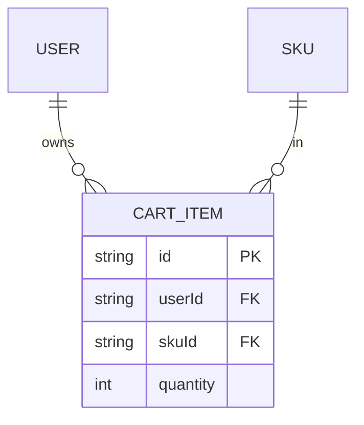

# F011_ShoppingCart — Thông số kỹ thuật

**Độ ưu tiên**: P0
**Loại**: ui
**Được tạo**: 2026-09-12

**Xem thêm:** [`functional-spec.vi.md`](./functional-spec.vi.md) — tổng quan bằng ngôn ngữ đơn giản, những
quyết định còn bỏ ngỏ, yêu cầu/quy tắc nghiệp vụ viết gọn từng dòng, màn hình, user story, kịch bản,
trường hợp biên và cấu hình — dành cho Dev/QA/SA.

**Cách đọc file này:** § 2 là mục lục — chọn hành động bạn cần xem rồi đọc trọn khối tương ứng
trong § 3 từ đầu đến cuối; mỗi khối là một luồng hoàn chỉnh. § 4 là phụ lục dùng chung — chỉ
nhảy vào đó khi một khối ở § 3 dẫn bạn tới.

## 1. Tổng quan kỹ thuật

Bốn endpoint được bảo vệ bằng Bearer trên `CartController` (`src/routes/cart/cart.controller.ts:32-134`)
quản lý giỏ hàng của một user: xem danh sách (`GET /cart`), thêm (`POST /cart`), set số lượng
(`PUT /cart/:cartItemId`), và xóa (`DELETE /cart/:cartItemId`). `CartService`
(`src/routes/cart/cart.service.ts`) thực thi các quy tắc nghiệp vụ về quyền sở hữu, khả năng thêm
vào giỏ, và trần tồn kho, rồi giao việc lưu trữ cho `CartRepository`
(`src/repositories/cart/cart.repository.ts`). Thao tác ghi thực sự của luồng thêm đi qua
`upsertCartItemWithConflictRetry` (`src/repositories/cart/cart-upsert.util.ts`), dựa vào ràng buộc
`@@unique([userId, skuId])` ở cấp DB (migration `20260912140523_add_cart_item_user_sku_unique`) để
BR-C04 an toàn với race condition.

## 2. Mục lục hành động

| # | Hành động (handler) | Method · Path | Mã | Ghi | Chi tiết |
|---|---|---|---|---|---|
| **A1** | `CartController#getCartItems` | `GET` `/cart` | {FR-001, FR-201, BR-C01, US070} | — *(read-only)* | § 3.1 |
| **A2** | `CartController#addCartItem` | `POST` `/cart` | {FR-202, BR-C01, BR-C02, BR-C03, BR-C04, US071} | `CartItem` upsert | § 3.1 |
| **A3** | `CartController#updateCartItemQuantity` | `PUT` `/cart/:cartItemId` | {FR-203, BR-C01, BR-C03, US072} | `CartItem` update | § 3.1 |
| **A4** | `CartController#deleteCartItem` | `DELETE` `/cart/:cartItemId` | {FR-204, BR-C01, BR-C05, US073} | `CartItem` delete | § 3.1 |

**Bộ rung (rung set)** — mọi khối trong § 3 đều dùng đúng thứ tự này; nếu thiếu một rung thì bỏ
qua luôn, không bao giờ ghi là `N/A` hay `None.`:

> **Who** → **FE** → **Request** → **BE** → **Rule** → **Result** → **State** → **Source**

**Ngưỡng vẽ sơ đồ:** không action nào trong A1–A4 chạm tới giao dịch nhiều bước trên nhiều hơn một
loại entity — nên không action nào kèm `sequenceDiagram`.

## 3. Các hành động

### 3.1 CAP-01 — Quản lý giỏ hàng của chính mình

#### A1 · Xem danh sách các dòng trong giỏ hàng của mình

`GET` `/cart` → `` `CartController#getCartItems` ``
`FR-001` `FR-201` `US070`

**Who** · Bất kỳ caller đã xác thực nào (client/seller/admin), chỉ trong phạm vi row của chính họ.
**FE** · *không có — API headless, không có view layer*
**Request** · query param qua `CartPaginationQueryDto` (`src/dtos/cart/cart.dto.ts:130-141`):
`pageIndex` (mặc định 1), `pageSize` (mặc định 10), `order` (`asc`/`desc`), `orderBy` (lấy từ
`CartItemOrderByFields`).
**BE** · `` `CartService#getCartItems` `` (`src/routes/cart/cart.service.ts:14-49`) dựng phân
trang và luôn truyền `where: { userId }` (BR-C01) cho
`` `CartRepository#findManyCartItems` `` (`src/repositories/cart/cart.repository.ts:19-48`), chạy
`findMany` + `count` trong cùng một `$transaction`.
**Result** · read-only — **không ghi DB**. Trả về `{ data: CartItem[], pagination }` qua `PageDto`
(`src/routes/cart/cart.controller.ts:43-47`).
**Source:** `src/routes/cart/cart.controller.ts:41-47` → `src/routes/cart/cart.service.ts:14-49` →
`src/repositories/cart/cart.repository.ts:19-48` → `src/selectors/cart-item.selector.ts`

<!-- No diagram: below threshold — read-only, single query pair, synchronous. -->

---

#### A2 · Thêm một SKU vào giỏ hàng

`POST` `/cart` → `` `CartController#addCartItem` ``
`FR-202` `US071`

**Who** · Bất kỳ caller đã xác thực nào, chỉ được thao tác trên giỏ hàng của chính mình.
**FE** · *không có*
**Request** · body qua `AddCartItemRequestDto` (`src/dtos/cart/cart.dto.ts:100-108`): `skuId`
(UUID), `quantity` (số nguyên ≥ 1).
**BE** · `` `CartService#addCartItem` `` (`src/routes/cart/cart.service.ts:51-78`) resolve SKU qua
`` `CartRepository#findAddableSku` `` (`src/repositories/cart/cart.repository.ts:83-108`), áp
dụng `deletedAt: null` + `publishedProductWhere()` (BR-C02,
`src/constants/product-visibility.constant.ts:12-16`) và trả luôn số lượng hiện có trong giỏ của
caller cho SKU đó (0 hoặc 1 row, nhờ unique constraint) trong cùng một query.
**Rule** ·

| DEC | subtype | Điều kiện | Điều gì xảy ra | Source |
|---|---|---|---|---|
| **BR-C02** | eligibility | SKU thiếu/đã xóa, hoặc product cha chưa publish/đã xóa | 404 "SKU not found." | `cart.service.ts:62-63` |
| **BR-C03** | ceiling | `currentQuantity + quantity > sku.stock` | 400 kèm số tồn kho còn lại | `cart.service.ts:66-71` |
| **BR-C04** | dedup | đã có sẵn dòng cho `(userId, skuId)` này | cộng dồn quantity, không tạo dòng trùng | `cart.repository.ts:111-121` → `cart-upsert.util.ts` |

**Result** · **Write:** `CartItem` upsert (tạo mới nếu chưa có, cộng dồn `quantity` nếu đã có) qua
`upsertCartItemWithConflictRetry` (`src/repositories/cart/cart-upsert.util.ts`), retry một lần khi
gặp race unique-constraint trước khi trả lỗi ra ngoài. Trả về `CartItemDetailResponseDto` kết quả.
**Source:** `src/routes/cart/cart.controller.ts:59-72` → `src/routes/cart/cart.service.ts:51-78` →
`src/repositories/cart/cart.repository.ts:83-121` → `src/repositories/cart/cart-upsert.util.ts`

<!-- No diagram: below threshold — single upsert, no multi-entity transaction. -->

---

#### A3 · Set số lượng cho một dòng trong giỏ

`PUT` `/cart/:cartItemId` → `` `CartController#updateCartItemQuantity` ``
`FR-203` `US072`

**Who** · Chỉ caller là chủ dòng đó (BR-C01).
**FE** · *không có*
**Request** · path param `cartItemId` (`ParseUUIDPipe`); body qua `UpdateCartItemRequestDto`
(`src/dtos/cart/cart.dto.ts:110-118`): `quantity` (số nguyên ≥ 1).
**BE** · `` `CartService#updateCartItemQuantity` `` (`src/routes/cart/cart.service.ts:80-114`) load
dòng đó qua `` `CartRepository#findUniqueCartItem` `` (`where: { id, userId }` — BR-C01,
`src/repositories/cart/cart.repository.ts:55-75`); không tìm thấy (kể cả dòng của user khác) trả
404.
**Rule** · **BR-C03** — `quantity > cartItem.sku.stock` → 400 kèm số tồn kho còn lại
(`cart.service.ts:101-105`).
**Result** · **Write:** update `CartItem.quantity`, quyền sở hữu được kiểm lại ngay trong mệnh đề
`where` (`cart.repository.ts:134-138`); nếu race với một lượt xóa, lỗi not-found của Prisma được
ánh xạ thành 404.
**Source:** `src/routes/cart/cart.controller.ts:85-100` → `src/routes/cart/cart.service.ts:80-114`
→ `src/repositories/cart/cart.repository.ts:55-75,124-154`

<!-- No diagram: below threshold — single conditional update. -->

---

#### A4 · Xóa một dòng khỏi giỏ hàng

`DELETE` `/cart/:cartItemId` → `` `CartController#deleteCartItem` ``
`FR-204` `US073`

**Who** · Chỉ caller là chủ dòng đó (BR-C01).
**FE** · *không có*
**Request** · path param `cartItemId` (`ParseUUIDPipe`).
**BE** · `` `CartService#deleteCartItem` `` (`src/routes/cart/cart.service.ts:116-124`) giao thẳng
cho `` `CartRepository#deleteCartItem` `` (`where: { id, userId }` — BR-C01,
`src/repositories/cart/cart.repository.ts:157-185`).
**Rule** · **BR-C05** — `CartItem` không có field soft-delete nào; `delete` của Prisma ở đây luôn
là hard delete.
**Result** · **Write:** hard delete `CartItem`. Không tìm thấy (kể cả dòng của user khác) được ánh
xạ thành 404 thay vì 403.
**Source:** `src/routes/cart/cart.controller.ts:112-125` → `src/routes/cart/cart.service.ts:116-124`
→ `src/repositories/cart/cart.repository.ts:157-185`

<!-- No diagram: below threshold — single conditional delete. -->

---

### 3.2 Trường hợp biên

| Hành động | Kịch bản | Hành vi |
|---|---|---|
| A2 | `skuId` không phải UUID, hoặc `quantity < 1` | 422 — `class-validator` chặn trước khi vào handler |
| A2 | SKU thiếu/đã xóa/chưa publish | 404 "SKU not found." |
| A2 | quantity kết quả vượt tồn kho | 400 kèm số tồn kho còn lại, không ghi gì cả |
| A2 | cùng một SKU được thêm hai lần cùng lúc | unique constraint ở DB + retry util gộp về một dòng cộng dồn, không bao giờ ra hai row |
| A3 · A4 | `cartItemId` không phải UUID | 422 — `ParseUUIDPipe` chặn trước khi vào handler |
| A3 · A4 | dòng thuộc user khác, hoặc không tồn tại | 404 — kiểm tra quyền sở hữu đã nằm sẵn trong mệnh đề `where` |

## 4. Nền tảng dùng chung

### 4.1 Thành phần

| Thành phần | Trách nhiệm | Dùng ở | File |
|---|---|---|---|
| `CartController` | Điểm vào HTTP cho cả bốn route giỏ hàng | A1–A4 | `src/routes/cart/cart.controller.ts` |
| `CartService` | Thực thi các quy tắc quyền sở hữu, khả năng thêm vào giỏ, và trần tồn kho | A1–A4 | `src/routes/cart/cart.service.ts` |
| `CartRepository` | Chạy các query/write Prisma, ánh xạ not-found thành 404 | A1–A4 | `src/repositories/cart/cart.repository.ts` |
| `upsertCartItemWithConflictRetry` | Upsert an toàn với race, thực thi BR-C04 dựa trên unique constraint | A2 | `src/repositories/cart/cart-upsert.util.ts` |
| `publishedProductWhere` | Predicate dùng chung để lọc trạng thái publish/soft-delete (cũng dùng ở F007, F013) | A2 | `src/constants/product-visibility.constant.ts` |
| `createCartItemSelect` | Dựng shape `select` của Prisma (SKU + product cha) | A1–A3 | `src/selectors/cart-item.selector.ts` |

### 4.2 Data Model



| Entity | Bảng | Dùng để | Hành động |
|---|---|---|---|
| `CartItem` (MODEL016) | `cartItem` | Dòng giỏ hàng mà tính năng này sở hữu toàn phần | A1–A4 |
| `SKU` (MODEL013) | `sKU` | Chỉ đọc, phục vụ kiểm tra khả năng thêm (BR-C02) và trần tồn kho (BR-C03) | A2, A3 |
| `Product` (MODEL009) | `product` | Chỉ đọc, qua parent của SKU, phục vụ kiểm tra publish visibility (BR-C02) | A2 |

#### Hành vi đa hình

N/A — `CartItem` không có discriminator field nào.

### 4.3 Quản lý state

Không có gì ngoài field `quantity` của chính row đó — `CartItem` không có enum lifecycle/status
nào.

### 4.4 Quy tắc dùng chung

#### Bin 2 — dùng ở từ 2 hành động trở lên

**BR-C01 — Quyền sở hữu.** Dùng ở: **A1** · **A2** · **A3** · **A4**. Mọi query trong
`CartRepository` đều đưa `userId` vào mệnh đề `where` (`findManyCartItems`,
`findUniqueCartItem`, `updateCartItem`, `deleteCartItem` — tất cả nằm trong
`src/repositories/cart/cart.repository.ts`); một row thuộc user khác thì không thể phân biệt được
với một row không tồn tại.
**Source:** `src/repositories/cart/cart.repository.ts:19-48,55-75,124-154,157-185`

**BR-C03 — Trần tồn kho.** Dùng ở: **A2** · **A3**. Kiểm tra so sánh quantity *sau khi* thao tác
(hiện tại + delta cho A2, giá trị tuyệt đối mới cho A3) với `sku.stock`; bản thân tồn kho không
bao giờ bị trừ ở đây — chỉ trừ ở bước checkout của F012.
**Source:** `src/routes/cart/cart.service.ts:66-71,101-105`

### 4.5 Thuật toán & Tích hợp

Không có.

### 4.6 Cấu hình

```text
DEFAULT_PAGE_INDEX = 1   # CartService.getCartItems destructuring default (src/routes/cart/cart.service.ts:16-19)
DEFAULT_PAGE_SIZE = 10   # CartService.getCartItems destructuring default (src/routes/cart/cart.service.ts:16-19)
```

**Hành vi phía client:** xem
[`behavior-logic.vi.md`](../../generated/behavior-logic.vi.md) (pattern phía client — debounce, optimistic UI, polling, upload, realtime),
[`permissions.vi.md`](../../system/permissions.vi.md) (feature flag / thử nghiệm / env / locale gate),
[`screen-flow.vi.md`](../../generated/screen-flow.vi.md) (guard / khôi phục state qua deep-link / bảo vệ thay đổi chưa lưu).

## 5. Xác minh & Ghi chú kỹ thuật

### 5.1 Xác minh kỹ thuật

- **SC-001** *(A2)* Thêm một SKU đã có sẵn trong giỏ không bao giờ tạo ra row `CartItem` thứ hai
  cho cùng cặp `(userId, skuId)`. (bao phủ BR-C04)
- **SC-002** *(A2, A3)* Không có lượt ghi nào để lại `CartItem.quantity > SKU.stock`. (bao phủ
  BR-C03)
- **SC-003** *(A1, A3, A4)* Một `cartItemId` thuộc user khác luôn trả 404, không bao giờ 403.
  (bao phủ BR-C01)

#### US071_AddCartItem *(A2)*

**Independent Test:** Thêm cùng một SKU hai lần liên tiếp cho một user; xác nhận chỉ tồn tại đúng
một row `CartItem` sau đó với quantity đã cộng dồn.

**Acceptance Scenarios:**

1. **Given** một SKU còn 5 trong kho và chưa có dòng nào trong giỏ, **When** caller thêm 3,
   **Then** một dòng mới được tạo với `quantity: 3`.
2. **Given** caller đã có sẵn 3 của một SKU tồn kho 5, **When** họ thêm 3 nữa, **Then** request
   bị từ chối với 400 và quantity của dòng đó vẫn giữ nguyên 3.

#### US073_RemoveCartItem *(A4)*

**Independent Test:** Thử xóa `cartItemId` của một user khác; xác nhận trả về 404 chứ không phải
403, và row đích vẫn còn tồn tại sau đó.

**Acceptance Scenarios:**

1. **Given** caller sở hữu một dòng trong giỏ, **When** họ xóa dòng đó theo id, **Then** trả 200
   và row không còn tồn tại.
2. **Given** `cartItemId` thuộc về một user khác, **When** caller cố xóa nó, **Then** trả 404
   "Cart item not found."

### 5.2 Giả định

- *(A2)* Retry của `upsertCartItemWithConflictRetry` được giả định là thành công ngay ở lần retry
  đầu tiên dưới tải bình thường; lần rà soát này không lần theo giới hạn số lần retry hay cơ chế
  backoff của nó trong `cart-upsert.util.ts`, chỉ xác nhận file tồn tại và được gọi từ
  `CartRepository`.

### 5.3 Câu hỏi chưa có lời giải

Không có — `clarifications.md` § Cart đã ghi nhận domain này là giải quyết xong hoàn toàn.

### 5.4 Tham chiếu nguồn

| Hành động | Thứ tự | Symbol | Path | Mục đích |
|---|---|---|---|---|
| — | 1 | `CartItem` | `prisma/schema.prisma:442-454` | Entity mà tính năng này xoay quanh |
| A1–A4 | 2 | `CartController` | `src/routes/cart/cart.controller.ts:1-134` | Điểm vào HTTP cho cả bốn route |
| A1–A4 | 3 | `CartService` | `src/routes/cart/cart.service.ts:1-125` | Thực thi các quy tắc quyền sở hữu/khả năng thêm/trần tồn kho |
| A1–A4 | 4 | `CartRepository` | `src/repositories/cart/cart.repository.ts:1-186` | Chạy query/write Prisma, ánh xạ 404 |
| A2 | 5 | `upsertCartItemWithConflictRetry` | `src/repositories/cart/cart-upsert.util.ts` | Upsert an toàn race, thực thi BR-C04 |

#### Data Flow

```text
Body/query/path params (Add|UpdateCartItemRequestDto | UUID) -> CartService checks ownership +
  addability + stock ceiling -> CartRepository runs findMany+count (A1) | upsert (A2) |
  conditional update (A3) | conditional delete (A4) -> CartItemDetailResponseDto | PageDto | message
```

### 5.5 Tham chiếu Artifact

| Artifact | File | Mã đã dùng | Đã review |
|----------|------|------------|----------|
| System Overview | [system-overview.md](../../system/system-overview.md) | — | [x] |
| Feature List | [feature-list.vi.md](../../generated/feature-list.vi.md) | F011 | [x] |
| API Map | [route-list.vi.md](../../generated/route-list.vi.md) | ROUTE071, ROUTE072, ROUTE073, ROUTE074 | [x] |
| Entities | [entities.vi.md](../../generated/entities.vi.md) | MODEL016, MODEL013, MODEL009 | [x] |
| Screens | N/A — headless API, no screens | — | [x] |
| Behavior Logic | [behavior-logic.vi.md](../../generated/behavior-logic.vi.md) | — | [x] |
| Permissions Matrix | [permissions-matrix.vi.md](../../generated/permissions-matrix.vi.md) | PERM005 | [x] |
| User Stories | [user-stories.vi.md](../../generated/user-stories.vi.md) | US070, US071, US072, US073 | [x] |
