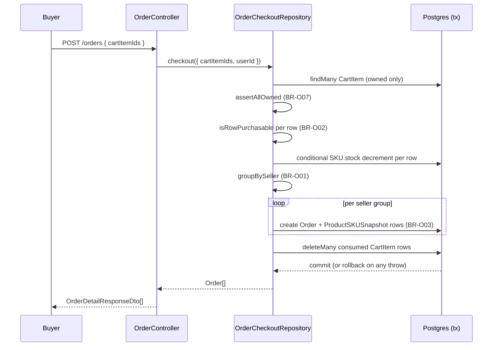
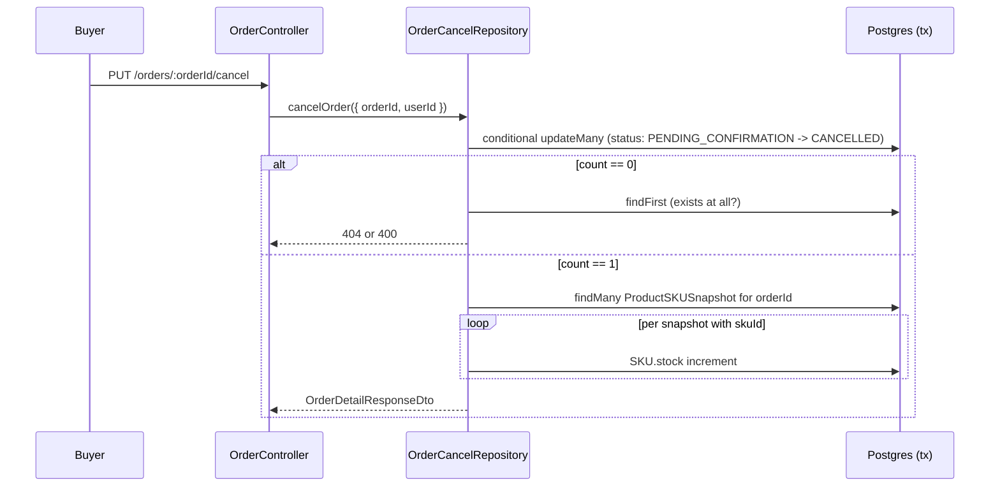
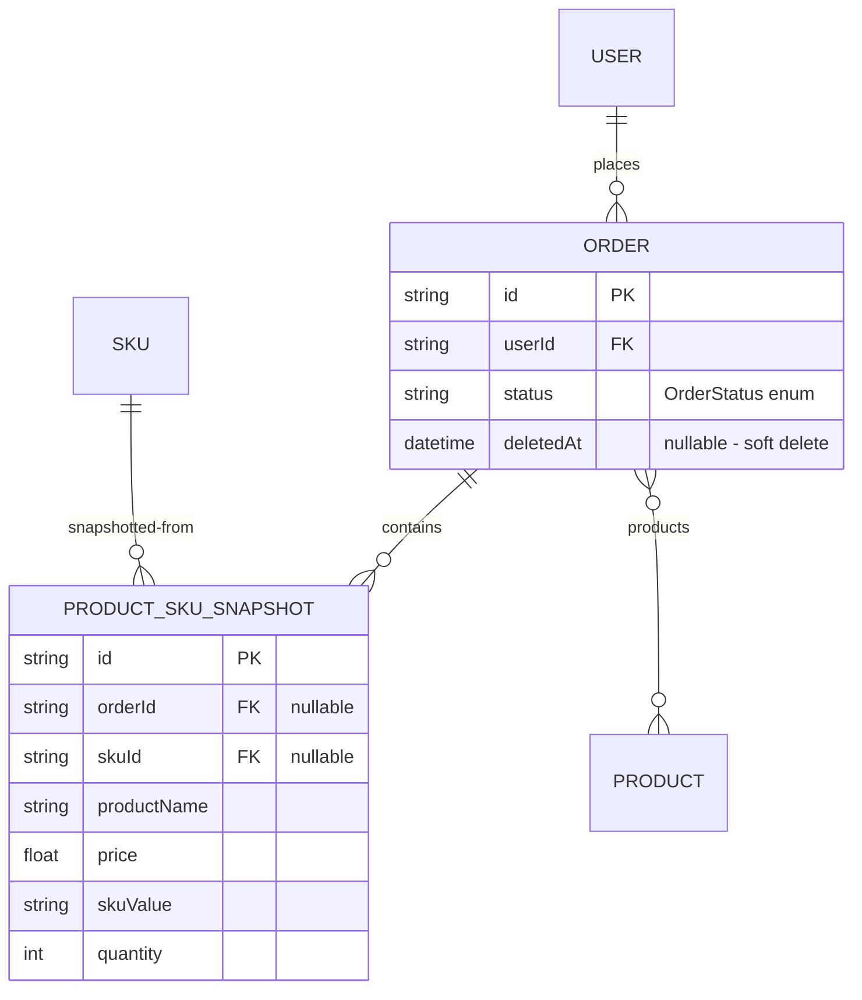

# F012_OrderPlacement — Technical Spec

**Priority**: P0
**Type**: mixed
**Generated**: 2026-09-12

**See also:** [`functional-spec.md`](./functional-spec.md) — plain-language overview, open
decisions, requirements/business rules stated in one-liners, screens, user stories, scenarios,
edge cases, and configuration for a BA/QA audience.

**How to read this file:** § 2 is the index — pick the action you care about and read its block
in § 3 straight through; each block is one complete thread, top to bottom. § 4 is the shared
appendix — jump in only when a § 3 block points you there.

## 1. Technical Overview

Two controllers split buyer and seller/admin concerns over the same `Order` table. `OrderController`
(`src/routes/order/order.controller.ts:31-118`, prefix `orders`) covers the buyer's own list,
detail, checkout, and cancel actions, backed by `OrderService`
(`src/routes/order/order.service.ts`), which fans out to three focused repositories:
`OrderRepository` (reads), `OrderCheckoutRepository` (checkout transaction), and
`OrderCancelRepository` (cancel transaction) — the write paths were kept in separate files per the
phase plan's file-size guidance. `ManageOrderController`
(`src/routes/order/manage-order/manage-order.controller.ts:34-113`, prefix `manage-order/orders`)
covers seller/admin visibility and status progression, backed by `ManageOrderService`
(`src/routes/order/manage-order/manage-order.service.ts`), which computes a `buildActorScope`
`where` predicate (admin = unrestricted, seller = own products only) and delegates the actual
status write to `OrderStatusRepository`.

## 2. Action Index

| # | Action (handler) | Method · Path | Codes | Writes | Detail |
|---|---|---|---|---|---|
| **A1** | `OrderController#getOrders` | `GET` `/orders` | {FR-001, FR-201, BR-O06, US074} | — *(read-only)* | § 3.1 |
| **A2** | `OrderController#getOrderById` | `GET` `/orders/:orderId` | {FR-202, BR-O03, BR-O06, US075} | — *(read-only)* | § 3.1 |
| **A3** | `OrderController#checkout` | `POST` `/orders` | {FR-203, BR-O01, BR-O02, BR-O03, BR-O07, BR-O08, US076} | `Order`, `ProductSKUSnapshot` create; `SKU.stock` decrement; `CartItem` delete | § 3.1 |
| **A4** | `OrderController#cancelOrder` | `PUT` `/orders/:orderId/cancel` | {FR-204, BR-O04, US077} | `Order.status` update; `SKU.stock` increment | § 3.1 |
| **A5** | `ManageOrderController#getManageOrders` | `GET` `/manage-order/orders` | {FR-301, BR-O06, US078} | — *(read-only)* | § 3.2 |
| **A6** | `ManageOrderController#getManageOrderById` | `GET` `/manage-order/orders/:orderId` | {FR-301, BR-O06, US079} | — *(read-only)* | § 3.2 |
| **A7** | `ManageOrderController#updateOrderStatus` | `PUT` `/manage-order/orders/:orderId/status` | {FR-302, BR-O04, BR-O05, US080} | `Order.status` update | § 3.2 |

**Rung set** — every block in § 3 uses this exact order; an absent rung is omitted, never
rendered as `N/A` or `None.`:

> **Who** → **FE** → **Request** → **BE** → **Rule** → **Result** → **State** → **Source**

**Diagram threshold:** A3 (checkout) and A4 (cancel) each run a multi-step interactive transaction
touching 3+ tables — both get a diagram. A1, A2, A5, A6 are read-only single queries; A7 is a
single conditional update — none of these four cross the threshold.

## 3. Actions

### 3.1 Buyer actions (`OrderController`)

#### A1 · List own orders

`GET` `/orders` → `` `OrderController#getOrders` ``
`FR-001` `FR-201` `US074`

**Who** · Any authenticated caller, scoped to their own orders.
**FE** · *none — headless API, no view layer*
**Request** · query params via `OrderPaginationQueryDto` (`src/dtos/order/order.dto.ts:118-133`):
`pageIndex`, `pageSize`, `order`, `orderBy` (`OrderOrderByFields`), optional `status` (`OrderStatus`).
**BE** · `` `OrderService#getOrders` `` (`src/routes/order/order.service.ts:20-49`) always passes
`where: { userId, status }` (BR-O06) to `` `OrderRepository#findManyOrders` ``
(`src/repositories/order/order.repository.ts:18-58`), which additionally forces `deletedAt: null`
(BR-O08) into every `where` regardless of what the caller passed in.
**Result** · read-only — **no DB write**. Returns `{ data: Order[], pagination }` via `PageDto`.
**Source:** `src/routes/order/order.controller.ts:40-45` → `src/routes/order/order.service.ts:20-49`
→ `src/repositories/order/order.repository.ts:18-58`

<!-- No diagram: below threshold — read-only, single query pair. -->

---

#### A2 · Get own order detail

`GET` `/orders/:orderId` → `` `OrderController#getOrderById` ``
`FR-202` `US075`

**Who** · Any authenticated caller, own order only (BR-O06).
**FE** · *none*
**Request** · path param `orderId` (`ParseUUIDPipe`).
**BE** · `` `OrderService#getOrderById` `` (`src/routes/order/order.service.ts:52-69`) calls
`` `OrderRepository#findUniqueOrder` `` with `where: { id: orderId, userId }`
(`src/repositories/order/order.repository.ts:62-77`); a miss is 404, never 403.
**Rule** · **BR-O03** — the response's `items` are `ProductSKUSnapshot` rows (frozen
`productName`/`price`/`images`/`skuValue`/`quantity`), never a live join to `Product`/`SKU`.
**Result** · read-only — **no DB write**. Returns `OrderDetailResponseDto`.
**Source:** `src/routes/order/order.controller.ts:62-69` → `src/routes/order/order.service.ts:52-69`
→ `src/repositories/order/order.repository.ts:62-77` → `src/selectors/order.selector.ts`

<!-- No diagram: below threshold — read-only, single findFirst call. -->

---

#### A3 · Checkout cart into orders

`POST` `/orders` → `` `OrderController#checkout` ``
`FR-203` `US076`

**Who** · Any authenticated caller, checking out only their own cart lines.
**FE** · *none*
**Request** · body via `CreateOrderRequestDto` (`src/dtos/order/order.dto.ts:97-108`):
`cartItemIds` — 1 to 50 UUIDs.
**BE** · `` `OrderService#checkout` `` (`src/routes/order/order.service.ts:71-80`) delegates the
entire flow to `` `OrderCheckoutRepository#checkout` ``
(`src/repositories/order/order-checkout.repository.ts:61-155`), which runs one Prisma interactive
transaction (`{ timeout: 15000 }` — extended from Prisma's 5s default, `:17`):

1. `tx.cartItem.findMany({ where: { id: { in: cartItemIds }, userId } })` — loads only the
   caller's own rows (`:73-76`).
2. `assertAllOwned` (`order-checkout.helper.ts:76-89`) — BR-O07: if fewer rows came back than ids
   were given, the whole checkout is 404 "One or more cart items were not found."
3. `isRowPurchasable` (`order-checkout.helper.ts:95-105`) per row — BR-O02 step 1: SKU not
   deleted, product not deleted, product published (`publishedAt` non-null and `<= now`); any
   failing row throws 400 "SKU {id} is no longer available." (`:80-87`).
4. `tx.sKU.updateMany({ where: { id, stock: { gte: quantity }, deletedAt: null }, data: { stock:
   { decrement: quantity } } })` per row — a conditional decrement; `count !== 1` means someone
   else consumed the stock first, throwing 400 naming the SKU and the current stock (`:89-110`).
5. `groupBySeller` (`order-checkout.helper.ts:39-55`) — BR-O01: groups by `sku.product.createdById`,
   preserving a `null` seller id as its own group rather than colliding it with another key.
6. Per seller group: `tx.order.create({ data: { userId, createdById: userId, status:
   PENDING_CONFIRMATION, products: { connect: [...] }, items: { create: buildSnapshotRows(rows) } }
   })` (`:117-134`) — `buildSnapshotRows` (`order-checkout.helper.ts:61-70`) freezes
   `productName`/`price`/`images`/`skuValue`/`quantity` per BR-O03, and `products.connect`
   populates the implicit `Order.products` m-n relation (post-blueprint decision,
   `clarifications.md`).
7. `tx.cartItem.deleteMany({ where: { id: { in: cartItemIds }, userId } })` (`:136-138`) — the
   consumed cart lines are removed.

**Rule** · **BR-O02 — Atomic creation.** All seven steps above run inside one interactive
transaction; any `throwHttpException` call inside the callback rolls back every write already
issued (Prisma transaction semantics) — a checkout that fails on its last SKU leaves stock, cart,
and orders exactly as they were before the call.
**Result** · **Write:** `SKU.stock` decrement (one or more rows) → `Order` create (one per seller)
→ `ProductSKUSnapshot` create (one per order line) → `CartItem` delete (all consumed lines).
Returns `OrderDetailResponseDto[]` — one entry per created order.
**Source:** `src/routes/order/order.controller.ts:80-90` → `src/routes/order/order.service.ts:71-80`
→ `src/repositories/order/order-checkout.repository.ts:61-155` →
`src/repositories/order/order-checkout.helper.ts:1-105`



---

#### A4 · Cancel own order

`PUT` `/orders/:orderId/cancel` → `` `OrderController#cancelOrder` ``
`FR-204` `US077`

**Who** · The owning buyer only (BR-O04).
**FE** · *none*
**Request** · path param `orderId` (`ParseUUIDPipe`).
**BE** · `` `OrderService#cancelOrder` `` (`src/routes/order/order.service.ts:82-90`) delegates to
`` `OrderCancelRepository#cancelOrder` `` (`src/repositories/order/order-cancel.repository.ts:23-89`),
one interactive transaction:

1. `tx.order.updateMany({ where: { id: orderId, userId, status: PENDING_CONFIRMATION,
   deletedAt: null }, data: { status: CANCELLED, updatedById: userId } })` (`:28-36`) — the
   conditional write is BR-O04's actual enforcement point.
2. `count === 0` → distinguish "doesn't exist / not caller's" (404) from "exists but not
   cancellable" (400 "Only orders pending confirmation can be cancelled.") via a follow-up
   existence check (`:38-55`).
3. `tx.productSKUSnapshot.findMany({ where: { orderId } })` then `tx.sKU.update({ data: { stock:
   { increment: snapshot.quantity } } })` per snapshot with a non-null `skuId` (`:57-71`) — a
   hard-deleted SKU's snapshot is skipped, since there's no row left to restore stock onto.

**Rule** · **BR-O04** — only `PENDING_CONFIRMATION` orders are cancellable, and only by their
owning buyer; the stock restored is read from each snapshot's own frozen `quantity`, not
recomputed.
**Result** · **Write:** `Order.status → CANCELLED`; `SKU.stock` increment per surviving snapshot
line. Returns the updated `OrderDetailResponseDto`.
**Source:** `src/routes/order/order.controller.ts:106-112` →
`src/routes/order/order.service.ts:82-90` →
`src/repositories/order/order-cancel.repository.ts:23-89`



---

### 3.2 Seller/Admin actions (`ManageOrderController`)

#### A5 · List visible orders (seller/admin)

`GET` `/manage-order/orders` → `` `ManageOrderController#getManageOrders` ``
`FR-301` `US078`

**Who** · seller or admin only — `client` is rejected earlier by PERM011 (role gate, no `MANAGE-ORDER`
module) before this handler runs.
**FE** · *none*
**Request** · query params via `ManageOrderPaginationQueryDto` (`src/dtos/order/manage-order.dto.ts:23-49`):
pagination + `status` + optional `createdById` (admin-only filter; ignored for a seller, whose own
id always scopes the query).
**BE** · `` `ManageOrderService#getOrders` `` (`src/routes/order/manage-order/manage-order.service.ts:44-84`)
builds `where` from `buildActorScope` (§ 4.4) plus the optional `createdById` filter, then calls the
same `` `OrderRepository#findManyOrders` `` A1 uses.
**Rule** · **BR-O06** (Bin 2, § 4.4) — visibility scope.
**Result** · read-only — **no DB write**. Returns `PageDto<BaseOrderResponseDto>`.
**Source:** `src/routes/order/manage-order/manage-order.controller.ts:44-52` →
`src/routes/order/manage-order/manage-order.service.ts:44-84` →
`src/repositories/order/order.repository.ts:18-58`

<!-- No diagram: below threshold — read-only, single query pair. -->

---

#### A6 · Get visible order detail (seller/admin)

`GET` `/manage-order/orders/:orderId` → `` `ManageOrderController#getManageOrderById` ``
`FR-301` `US079`

**Who** · seller or admin only.
**FE** · *none*
**Request** · path param `orderId` (`ParseUUIDPipe`).
**BE** · `` `ManageOrderService#getOrderById` `` (`src/routes/order/manage-order/manage-order.service.ts:87-111`)
calls `` `OrderRepository#findUniqueOrder` `` with `where: { id: orderId, ...buildActorScope(...) }`;
a miss (out of scope or nonexistent) is 404.
**Rule** · **BR-O06** (§ 4.4).
**Result** · read-only — **no DB write**. Returns `ManageOrderDetailResponseDto`.
**Source:** `src/routes/order/manage-order/manage-order.controller.ts:64-77` →
`src/routes/order/manage-order/manage-order.service.ts:87-111` →
`src/repositories/order/order.repository.ts:62-77`

<!-- No diagram: below threshold — read-only, single findFirst call. -->

---

#### A7 · Advance order status (seller/admin)

`PUT` `/manage-order/orders/:orderId/status` → `` `ManageOrderController#updateOrderStatus` ``
`FR-302` `US080`

**Who** · seller or admin only.
**FE** · *none*
**Request** · path param `orderId` (`ParseUUIDPipe`); body via `UpdateOrderStatusRequestDto`
(`src/dtos/order/manage-order.dto.ts:13-20`): `status` (`OrderStatus`).
**BE** · `` `ManageOrderService#updateOrderStatus` `` (`src/routes/order/manage-order/manage-order.service.ts:113-153`):

1. **BR-O04 (actor check)** — `nextStatus === CANCELLED` → 400 "Only the buyer may cancel an
   order." (`:125-129`), before any DB read.
2. Loads the order via `buildActorScope` (BR-O06); a miss is 404.
3. **BR-O05** — `canTransition({ from: order.status, to: nextStatus })`
   (`src/constants/order-status.constant.ts:26-34`, a pure lookup against the frozen
   `ORDER_STATUS_TRANSITIONS` map) rejects with 400 naming both statuses if the move is illegal.
4. Delegates the actual write to `` `OrderStatusRepository#updateOrderStatus` ``
   (`src/repositories/order/order-status.repository.ts:24-64`): a conditional `updateMany({ where:
   { id, status: currentStatus, deletedAt: null } })` — `count === 0` means another writer already
   moved the order first, throwing 409 (not a silent no-op).

**Rule** · **BR-O05 — Linear progression**, source-of-truth table:

| From | Legal To | Source |
|---|---|---|
| `PENDING_CONFIRMATION` | `PENDING_PICKUP`, `CANCELLED` (buyer-only, blocked here) | `order-status.constant.ts:13-16` |
| `PENDING_PICKUP` | `PENDING_DELIVERY` | `order-status.constant.ts:17` |
| `PENDING_DELIVERY` | `DELIVERED` | `order-status.constant.ts:18` |
| `DELIVERED` | `RETURNED` | `order-status.constant.ts:19` |
| `RETURNED`, `CANCELLED` | *(terminal — no legal transition out)* | `order-status.constant.ts:20-21` |

**Result** · **Write:** `Order.status` conditional update; 409 on a concurrency conflict instead of
overwriting. Returns `ManageOrderDetailResponseDto`.
**Source:** `src/routes/order/manage-order/manage-order.controller.ts:90-113` →
`src/routes/order/manage-order/manage-order.service.ts:113-153` →
`src/constants/order-status.constant.ts:9-34` →
`src/repositories/order/order-status.repository.ts:24-64`

<!-- No diagram: below threshold — single read + single conditional update, no multi-table write. -->

---

### 3.3 Edge cases

| Action | Scenario | Behavior |
|---|---|---|
| A3 | `cartItemIds` empty, >50 items, or contains a non-UUID | 422 — `class-validator` rejects before the handler runs |
| A3 | a cart item id is another user's or doesn't exist | 404 "One or more cart items were not found." (BR-O07), nothing written |
| A3 | a SKU became unpublished/deleted between add-to-cart and checkout | 400 "SKU {id} is no longer available." |
| A3 | a SKU no longer has enough stock (race with another checkout) | 400 naming the SKU and the current stock; the conditional `updateMany` count check catches this even under concurrency |
| A4 | order not in `PENDING_CONFIRMATION` | 400 "Only orders pending confirmation can be cancelled." |
| A4 | order belongs to another buyer, or doesn't exist | 404 "Order not found." |
| A7 | `nextStatus` is `CANCELLED` | 400, regardless of current status or caller role |
| A7 | illegal transition (e.g. skip a step, go backwards) | 400 naming current and requested status |
| A7 | two seller/admin writes race on the same order | second write's `updateMany` count is 0 → 409 |
| A5 · A6 · A7 | `client` caller | 403 before the handler runs — `MANAGE-ORDER` not in Client's module allowlist (PERM011) |

## 4. Shared Foundation

### 4.1 Components

| Component | Responsibility | Used in | File |
|---|---|---|---|
| `OrderController` | HTTP entry point for buyer order routes | A1–A4 | `src/routes/order/order.controller.ts` |
| `OrderService` | Thin pass-through to the three order repositories | A1–A4 | `src/routes/order/order.service.ts:1-91` |
| `OrderRepository` | Shared read path (`findManyOrders`/`findUniqueOrder`), always forces `deletedAt: null` | A1, A2, A5, A6 | `src/repositories/order/order.repository.ts:1-77` |
| `OrderCheckoutRepository` | The checkout interactive transaction | A3 | `src/repositories/order/order-checkout.repository.ts` |
| `order-checkout.helper.ts` | Pure functions: `groupBySeller`, `buildSnapshotRows`, `assertAllOwned`, `isRowPurchasable` | A3 | `src/repositories/order/order-checkout.helper.ts` |
| `OrderCancelRepository` | The cancel interactive transaction | A4 | `src/repositories/order/order-cancel.repository.ts` |
| `ManageOrderController` | HTTP entry point for seller/admin order routes | A5–A7 | `src/routes/order/manage-order/manage-order.controller.ts` |
| `ManageOrderService` | Computes `buildActorScope`, enforces BR-O04/BR-O05 before delegating writes | A5–A7 | `src/routes/order/manage-order/manage-order.service.ts` |
| `OrderStatusRepository` | The conditional status-write with concurrency-conflict detection | A7 | `src/repositories/order/order-status.repository.ts` |
| `canTransition` | Pure lookup against the frozen legal-transition map | A7 | `src/constants/order-status.constant.ts` |

### 4.2 Data Model



| Entity | Table | Used for | Action |
|---|---|---|---|
| `Order` (MODEL018) | `order` | The entity this feature revolves around; `status` drives the whole lifecycle | A1–A7 |
| `ProductSKUSnapshot` (MODEL017) | `productSKUSnapshot` | Frozen purchase-time line items (BR-O03); read back to restore stock on cancel | A2, A3, A4, A6 |
| `CartItem` (MODEL016, owned by F011) | `cartItem` | Consumed (read then deleted) at checkout | A3 |
| `SKU` (MODEL013) | `sKU` | Stock decremented at checkout, incremented on cancel | A3, A4 |
| `Product` (MODEL009) | `product` | Read for eligibility (A3); `createdById` drives seller visibility (BR-O06) | A3, A5, A6, A7 |

#### Polymorphic Behavior

| Field | DISC-### | Values | Description |
|-------|----------|--------|--------------|
| `Order.status` | DISC-004 | `PENDING_CONFIRMATION, PENDING_PICKUP, PENDING_DELIVERY, DELIVERED, RETURNED, CANCELLED` | Order fulfillment lifecycle state (`entities.md` MODEL018) |

### 4.3 State Management

`Order.status` is the only stateful field this feature drives. Transitions are gated entirely by
`canTransition` (§ 3.2, A7) plus the two actor-specific carve-outs: buyers may only ever move a
`PENDING_CONFIRMATION` order to `CANCELLED` (A4); sellers/admins may never set `CANCELLED` at all
(A7, BR-O04). No other entity in this feature carries a lifecycle enum.

### 4.4 Shared Rules

#### Bin 2 — used by ≥2 named actions

**BR-O06 — Visibility.** Used in: **A1** · **A2** · **A5** · **A6** · **A7**. `OrderService`
(buyer routes) always scopes `where: { userId }`. `ManageOrderService.buildActorScope`
(`src/routes/order/manage-order/manage-order.service.ts:30-42`) returns `{}` for `roleName ===
Role.ADMIN` (unrestricted) or `{ products: { some: { createdById: userId, deletedAt: null } } }`
for anyone else (seller) — a `where` predicate, never a post-fetch check, so a miss is always 404,
never 403. `OrderRepository.findUniqueOrder`/`findManyOrders`
(`src/repositories/order/order.repository.ts`) additionally force `deletedAt: null` on every read
regardless of caller (BR-O08).
**Source:** `src/routes/order/manage-order/manage-order.service.ts:30-42` ·
`src/repositories/order/order.repository.ts:18-51,59-74`

**BR-O04 — Buyer cancellation is exclusive.** Used in: **A4** (positive path — the only route that
performs it) · **A7** (negative path — the only route that explicitly forbids it). Neither route
delegates this check to the other; each independently enforces its half.
**Source:** `src/repositories/order/order-cancel.repository.ts:28-36` ·
`src/routes/order/manage-order/manage-order.service.ts:125-129`

### 4.5 Algorithms & Integrations

**Checkout grouping (BR-O01).** `groupBySeller` (`order-checkout.helper.ts:39-55`) is a linear
array-based partition (not a `Map`) specifically so a `null` `createdById` (an orphaned product,
theoretically possible since `Product.createdById` is nullable per `entities.md`) groups into its
own bucket instead of colliding with another `null`-keyed group under naive `Map` key coercion.

**Status transition table (BR-O05).** `ORDER_STATUS_TRANSITIONS`
(`src/constants/order-status.constant.ts:9-22`) is a frozen (`Object.freeze`, two levels) adjacency
map — the single source of truth `canTransition` reads. Buyer-vs-seller authority is deliberately
NOT encoded in this map (see its own doc comment); actor checks live in the calling services (A4,
A7).

### 4.6 Configuration

```text
CHECKOUT_TRANSACTION_TIMEOUT_MS = 15000   # order-checkout.repository.ts:17 — Prisma's 5s interactive-transaction default is too tight for a multi-line, multi-seller checkout
DEFAULT_PAGE_INDEX = 1                    # OrderService.getOrders / ManageOrderService.getOrders destructuring default
DEFAULT_PAGE_SIZE = 10                    # same
```

**Client behavior:** see
[`behavior-logic.md`](../../generated/behavior-logic.md) (client-side patterns — debounce, optimistic UI, polling, upload, realtime),
[`permissions.md`](../../system/permissions.md) (feature flags / experiments / env / locale gates),
[`screen-flow.md`](../../generated/screen-flow.md) (guards / deep-link state restoration / unsaved-changes protection).

## 5. Verification & Technical Notes

### 5.1 Technical Verification

- **SC-001** *(A3)* A multi-seller checkout produces exactly one order per distinct seller, and
  every consumed `CartItem` row is gone afterward. (covers BR-O01, BR-O02)
- **SC-002** *(A3)* A checkout that fails on any line leaves stock, `Order`, `ProductSKUSnapshot`,
  and `CartItem` completely unchanged. (covers BR-O02)
- **SC-003** *(A4)* Cancelling an order restores exactly the stock its snapshot lines held, never
  more or less. (covers BR-O04)
- **SC-004** *(A2, A7)* A price/name change to a live product never alters an already-created
  order's snapshot data. (covers BR-O03)
- **SC-005** *(A7)* Two concurrent status-advance calls on the same order: exactly one succeeds,
  the other gets 409. (covers BR-O05, concurrency)

#### US076_CheckoutCart *(A3)*

**Independent Test:** Build a cart with lines from two sellers where one SKU has exactly enough
stock and another has one less than requested; checkout; confirm 400, and confirm neither seller's
order nor any stock change was written.

**Acceptance Scenarios:**

1. **Given** a buyer's cart holds lines from two sellers, **When** they check out all lines,
   **Then** exactly two `Order` rows exist afterward, each holding only that seller's snapshot
   lines, and the cart is empty.
2. **Given** one line's SKU no longer has enough stock, **When** the buyer checks out, **Then** the
   whole request is rejected with 400 and zero rows changed across `Order`, `ProductSKUSnapshot`,
   `SKU.stock`, and `CartItem`.

#### US080_UpdateOrderStatus *(A7)*

**Independent Test:** Attempt `PENDING_CONFIRMATION → DELIVERED` directly (skipping two steps);
confirm 400 naming both statuses, and confirm `Order.status` is unchanged.

**Acceptance Scenarios:**

1. **Given** an order is `PENDING_PICKUP`, **When** a seller who owns its products sets it to
   `PENDING_DELIVERY`, **Then** 200 and the new status persists.
2. **Given** an order is `PENDING_CONFIRMATION`, **When** any seller/admin attempts to set
   `CANCELLED`, **Then** 400 "Only the buyer may cancel an order." regardless of ownership.

### 5.2 Assumptions

- *(A3)* `CHECKOUT_TRANSACTION_TIMEOUT_MS = 15000` is assumed sufficient for the checkout's
  seller-count/line-count in production; this pass does not load-test the transaction under a
  large multi-seller cart.
- *(A5, A6, A7)* `buildActorScope`'s seller filter walks the implicit `_OrderToProduct` join table
  on every request; `clarifications.md` (reviewer finding H2) already flags `Product.createdById`
  as unindexed — this spec treats that as a known, deferred performance risk (RISK-01 in
  `functional-spec.md`), not a correctness gap.

### 5.3 Unresolved Questions

None beyond the two risks already recorded in `functional-spec.md` § 11 (unindexed
`Product.createdById`; payment fully deferred) — both are explicit, resolved-as-deferred decisions
in `clarifications.md`, not open questions from this pass.

### 5.4 Source References

| Action | Order | Symbol | Path | Purpose |
|---|---|---|---|---|
| — | 1 | `Order` / `ProductSKUSnapshot` | `prisma/schema.prisma:456-493` | Entities this feature revolves around |
| A1, A2 | 2 | `OrderController` | `src/routes/order/order.controller.ts:1-115` | Buyer HTTP entry point |
| A1, A2 | 3 | `OrderRepository` | `src/repositories/order/order.repository.ts:1-77` | Shared read path, forces `deletedAt: null` |
| A3 | 4 | `OrderCheckoutRepository` | `src/repositories/order/order-checkout.repository.ts:1-156` | Checkout interactive transaction |
| A3 | 5 | `order-checkout.helper.ts` | `src/repositories/order/order-checkout.helper.ts:1-105` | Pure grouping/validation/snapshot-building functions |
| A4 | 6 | `OrderCancelRepository` | `src/repositories/order/order-cancel.repository.ts:1-90` | Cancel interactive transaction |
| A5–A7 | 7 | `ManageOrderController` / `ManageOrderService` | `src/routes/order/manage-order/manage-order.controller.ts:1-113`, `manage-order.service.ts:1-155` | Seller/admin HTTP entry point + actor-scope logic |
| A7 | 8 | `canTransition` | `src/constants/order-status.constant.ts:1-34` | BR-O05's single source of truth |
| A7 | 9 | `OrderStatusRepository` | `src/repositories/order/order-status.repository.ts:1-65` | Conditional status write, 409 on conflict |

#### Data Flow

```text
Buyer:  cartItemIds -> OrderCheckoutRepository (tx: validate -> decrement stock -> create
        Order+ProductSKUSnapshot per seller -> delete CartItem) -> OrderDetailResponseDto[]
Buyer:  orderId -> OrderCancelRepository (tx: conditional status->CANCELLED -> restore stock per
        snapshot) -> OrderDetailResponseDto
Seller: orderId + nextStatus -> ManageOrderService (actor check -> scope check -> canTransition) ->
        OrderStatusRepository (conditional update, 409 on conflict) -> ManageOrderDetailResponseDto
```

### 5.5 Artifact References

| Artifact | File | Codes Used | Reviewed |
|----------|------|------------|----------|
| System Overview | [system-overview.md](../../system/system-overview.md) | — | [x] |
| Feature List | [feature-list.md](../../generated/feature-list.md) | F012 | [x] |
| API Map | [route-list.md](../../generated/route-list.md) | ROUTE075–ROUTE081 | [x] |
| Entities | [entities.md](../../generated/entities.md) | MODEL018, MODEL017, MODEL016, MODEL013, MODEL009 | [x] |
| Screens | N/A — headless API, no screens | — | [x] |
| Behavior Logic | [behavior-logic.md](../../generated/behavior-logic.md) | — | [x] |
| Permissions Matrix | [permissions-matrix.md](../../generated/permissions-matrix.md) | PERM005, PERM011 | [x] |
| User Stories | [user-stories.md](../../generated/user-stories.md) | US074–US080 | [x] |
