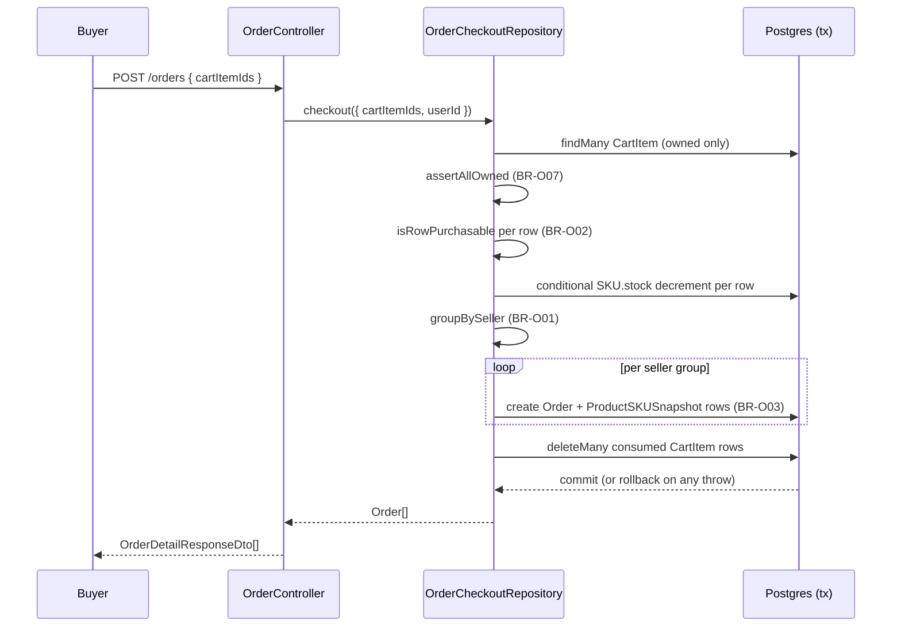
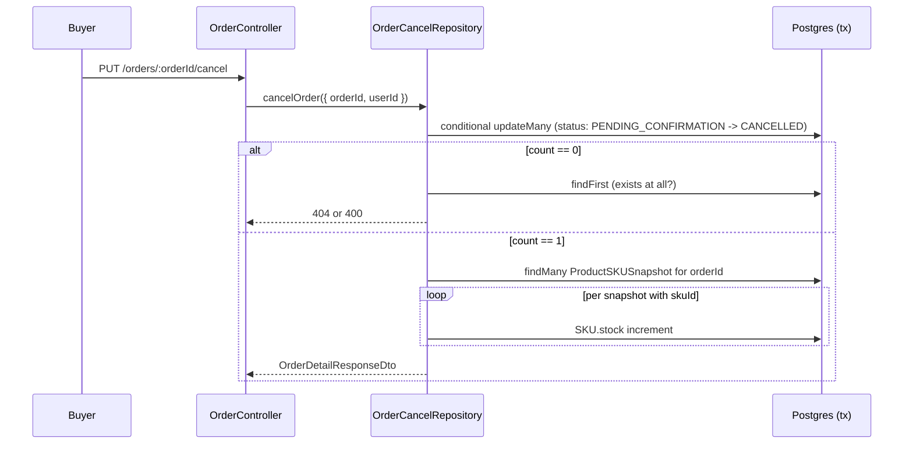
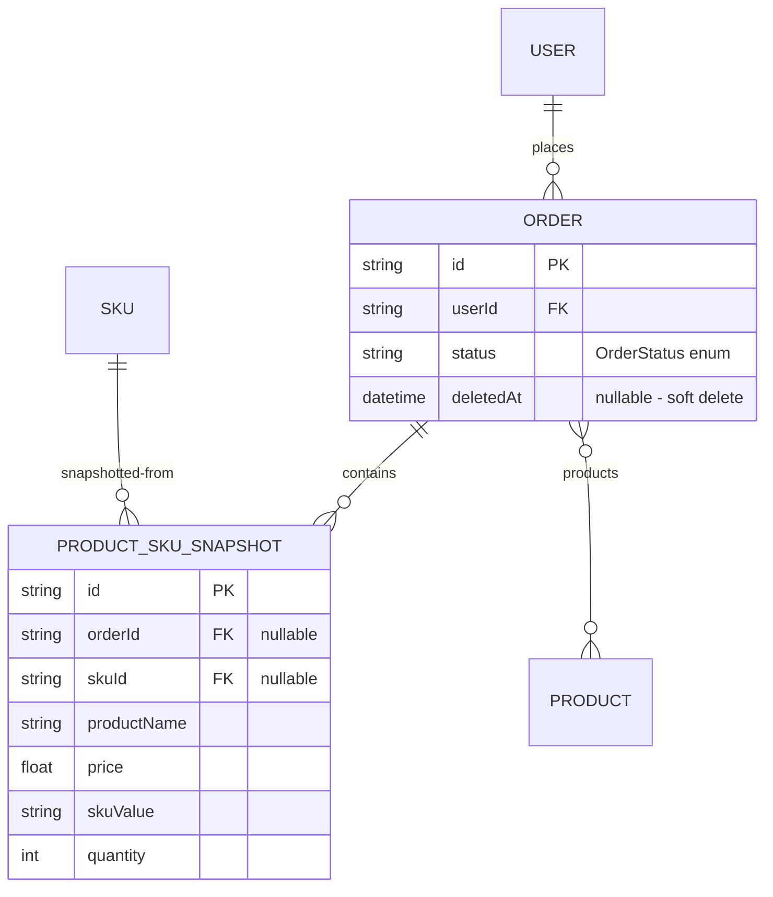

# F012_OrderPlacement — Quy cách kỹ thuật

**Độ ưu tiên**: P0
**Loại**: mixed
**Tạo**: 2026-09-12

**Xem thêm:** [`functional-spec.vi.md`](./functional-spec.vi.md) — tổng quan bằng ngôn ngữ đơn giản, các
quyết định còn mở, yêu cầu/business rule tóm gọn trong một dòng, màn hình, user story, kịch bản,
trường hợp biên, và cấu hình, dành cho BA/QA.

**Cách đọc file này:** § 2 là mục lục — chọn action bạn quan tâm rồi đọc thẳng khối của nó
trong § 3; mỗi khối là một mạch nội dung trọn vẹn, từ đầu đến cuối. § 4 là phụ lục dùng chung —
chỉ nhảy vào đó khi một khối ở § 3 dẫn bạn tới.

## 1. Tổng quan kỹ thuật

Hai controller tách riêng mối quan tâm của buyer và seller/admin trên cùng bảng `Order`. `OrderController`
(`src/routes/order/order.controller.ts:31-118`, prefix `orders`) phụ trách danh sách, chi tiết,
checkout, và hủy đơn của chính buyer, được hỗ trợ bởi `OrderService`
(`src/routes/order/order.service.ts`), service này rẽ nhánh sang ba repository chuyên biệt:
`OrderRepository` (đọc), `OrderCheckoutRepository` (transaction checkout), và
`OrderCancelRepository` (transaction hủy đơn) — các đường ghi được tách ra file riêng theo
hướng dẫn giới hạn kích thước file của phase plan. `ManageOrderController`
(`src/routes/order/manage-order/manage-order.controller.ts:34-113`, prefix `manage-order/orders`)
phụ trách khả năng nhìn thấy đơn hàng và tiến trình trạng thái cho seller/admin, được hỗ trợ bởi
`ManageOrderService` (`src/routes/order/manage-order/manage-order.service.ts`), service này tính
predicate `where` qua `buildActorScope` (admin = không giới hạn, seller = chỉ sản phẩm của mình)
rồi ủy quyền phần ghi trạng thái thực sự cho `OrderStatusRepository`.

## 2. Mục lục Action

| # | Action (handler) | Method · Path | Codes | Writes | Detail |
|---|---|---|---|---|---|
| **A1** | `OrderController#getOrders` | `GET` `/orders` | {FR-001, FR-201, BR-O06, US074} | — *(read-only)* | § 3.1 |
| **A2** | `OrderController#getOrderById` | `GET` `/orders/:orderId` | {FR-202, BR-O03, BR-O06, US075} | — *(read-only)* | § 3.1 |
| **A3** | `OrderController#checkout` | `POST` `/orders` | {FR-203, BR-O01, BR-O02, BR-O03, BR-O07, BR-O08, US076} | `Order`, `ProductSKUSnapshot` create; `SKU.stock` decrement; `CartItem` delete | § 3.1 |
| **A4** | `OrderController#cancelOrder` | `PUT` `/orders/:orderId/cancel` | {FR-204, BR-O04, US077} | `Order.status` update; `SKU.stock` increment | § 3.1 |
| **A5** | `ManageOrderController#getManageOrders` | `GET` `/manage-order/orders` | {FR-301, BR-O06, US078} | — *(read-only)* | § 3.2 |
| **A6** | `ManageOrderController#getManageOrderById` | `GET` `/manage-order/orders/:orderId` | {FR-301, BR-O06, US079} | — *(read-only)* | § 3.2 |
| **A7** | `ManageOrderController#updateOrderStatus` | `PUT` `/manage-order/orders/:orderId/status` | {FR-302, BR-O04, BR-O05, US080} | `Order.status` update | § 3.2 |

**Bộ rung (rung set)** — mọi khối trong § 3 dùng đúng thứ tự này; một rung nào vắng mặt thì bỏ
qua luôn, không bao giờ ghi là `N/A` hay `None.`:

> **Who** → **FE** → **Request** → **BE** → **Rule** → **Result** → **State** → **Source**

**Ngưỡng vẽ sơ đồ:** A3 (checkout) và A4 (cancel) mỗi cái đều chạy một transaction tương tác nhiều
bước, chạm vào 3+ bảng — cả hai đều có sơ đồ. A1, A2, A5, A6 chỉ là truy vấn đọc đơn lẻ; A7 là một
update có điều kiện đơn lẻ — cả bốn cái này đều không vượt ngưỡng.

## 3. Actions

### 3.1 Action của buyer (`OrderController`)

#### A1 · Liệt kê đơn hàng của chính mình

`GET` `/orders` → `` `OrderController#getOrders` ``
`FR-001` `FR-201` `US074`

**Who** · Bất kỳ caller đã xác thực nào, chỉ giới hạn ở đơn hàng của chính họ.
**FE** · *none — headless API, không có view layer*
**Request** · query params qua `OrderPaginationQueryDto` (`src/dtos/order/order.dto.ts:118-133`):
`page`, `pageSize`, `order`, `orderBy` (`OrderOrderByFields`), `status` tùy chọn (`OrderStatus`).
**BE** · `` `OrderService#getOrders` `` (`src/routes/order/order.service.ts:20-49`) luôn truyền
`where: { userId, status }` (BR-O06) cho `` `OrderRepository#findManyOrders` ``
(`src/repositories/order/order.repository.ts:18-58`), hàm này còn ép thêm `deletedAt: null`
(BR-O08) vào mọi `where` bất kể caller truyền gì.
**Result** · read-only — **không ghi DB**. Trả về `{ data: Order[], pagination }` qua `PageDto`.
**Source:** `src/routes/order/order.controller.ts:40-45` → `src/routes/order/order.service.ts:20-49`
→ `src/repositories/order/order.repository.ts:18-58`

<!-- No diagram: below threshold — read-only, single query pair. -->

---

#### A2 · Lấy chi tiết đơn hàng của chính mình

`GET` `/orders/:orderId` → `` `OrderController#getOrderById` ``
`FR-202` `US075`

**Who** · Bất kỳ caller đã xác thực nào, chỉ đơn hàng của chính họ (BR-O06).
**FE** · *none*
**Request** · path param `orderId` (`ParseUUIDPipe`).
**BE** · `` `OrderService#getOrderById` `` (`src/routes/order/order.service.ts:52-69`) gọi
`` `OrderRepository#findUniqueOrder` `` với `where: { id: orderId, userId }`
(`src/repositories/order/order.repository.ts:62-77`); không thấy thì trả 404, không bao giờ 403.
**Rule** · **BR-O03** — `items` trong response là các row `ProductSKUSnapshot` (đã đóng băng
`productName`/`price`/`images`/`skuValue`/`quantity`), chứ không phải join trực tiếp tới `Product`/`SKU`.
**Result** · read-only — **không ghi DB**. Trả về `OrderDetailResponseDto`.
**Source:** `src/routes/order/order.controller.ts:62-69` → `src/routes/order/order.service.ts:52-69`
→ `src/repositories/order/order.repository.ts:62-77` → `src/selectors/order.selector.ts`

<!-- No diagram: below threshold — read-only, single findFirst call. -->

---

#### A3 · Checkout giỏ hàng thành đơn hàng

`POST` `/orders` → `` `OrderController#checkout` ``
`FR-203` `US076`

**Who** · Bất kỳ caller đã xác thực nào, chỉ checkout dòng giỏ hàng của chính họ.
**FE** · *none*
**Request** · body qua `CreateOrderRequestDto` (`src/dtos/order/order.dto.ts:97-108`):
`cartItemIds` — 1 đến 50 UUID.
**BE** · `` `OrderService#checkout` `` (`src/routes/order/order.service.ts:71-80`) ủy quyền
toàn bộ flow cho `` `OrderCheckoutRepository#checkout` ``
(`src/repositories/order/order-checkout.repository.ts:61-155`), hàm này chạy một transaction
tương tác Prisma (`{ timeout: 15000 }` — kéo dài hơn mặc định 5s của Prisma, `:17`):

1. `tx.cartItem.findMany({ where: { id: { in: cartItemIds }, userId } })` — chỉ load các row
   của chính caller (`:73-76`).
2. `assertAllOwned` (`order-checkout.helper.ts:76-89`) — BR-O07: nếu số row trả về ít hơn số id
   truyền vào, toàn bộ checkout trả 404 "One or more cart items were not found."
3. `isRowPurchasable` (`order-checkout.helper.ts:95-105`) cho từng row — BR-O02 bước 1: SKU chưa
   xóa, product chưa xóa, product đã publish (`publishedAt` khác null và `<= now`); row nào
   không đạt sẽ throw 400 "SKU {id} is no longer available." (`:80-87`).
4. `tx.sKU.updateMany({ where: { id, stock: { gte: quantity }, deletedAt: null }, data: { stock:
   { decrement: quantity } } })` cho từng row — một phép decrement có điều kiện; `count !== 1`
   nghĩa là bên khác đã tiêu thụ stock trước, sẽ throw 400 nêu tên SKU và stock hiện tại (`:89-110`).
5. `groupBySeller` (`order-checkout.helper.ts:39-55`) — BR-O01: gom nhóm theo `sku.product.createdById`,
   giữ `null` seller id thành một nhóm riêng thay vì để nó va vào nhóm `null`-key khác.
6. Với từng nhóm seller: `tx.order.create({ data: { userId, createdById: userId, status:
   PENDING_CONFIRMATION, products: { connect: [...] }, items: { create: buildSnapshotRows(rows) } }
   })` (`:117-134`) — `buildSnapshotRows` (`order-checkout.helper.ts:61-70`) đóng băng
   `productName`/`price`/`images`/`skuValue`/`quantity` theo BR-O03, và `products.connect`
   điền vào quan hệ m-n ngầm `Order.products` (quyết định sau blueprint,
   `clarifications.md`).
7. `tx.cartItem.deleteMany({ where: { id: { in: cartItemIds }, userId } })` (`:136-138`) — các
   dòng giỏ hàng đã tiêu thụ bị xóa.

**Rule** · **BR-O02 — Tạo dữ liệu nguyên tử.** Cả bảy bước trên chạy trong một transaction tương
tác duy nhất; bất kỳ lệnh `throwHttpException` nào bên trong callback sẽ rollback mọi thao tác
ghi đã thực hiện (theo ngữ nghĩa transaction của Prisma) — một checkout fail ở SKU cuối cùng để
lại stock, giỏ hàng, và đơn hàng y hệt như trước khi gọi.
**Result** · **Write:** `SKU.stock` decrement (một hoặc nhiều row) → `Order` create (một cho mỗi
seller) → `ProductSKUSnapshot` create (một cho mỗi dòng đơn hàng) → `CartItem` delete (mọi dòng
đã tiêu thụ). Trả về `OrderDetailResponseDto[]` — một entry cho mỗi đơn hàng được tạo.
**Source:** `src/routes/order/order.controller.ts:80-90` → `src/routes/order/order.service.ts:71-80`
→ `src/repositories/order/order-checkout.repository.ts:61-155` →
`src/repositories/order/order-checkout.helper.ts:1-105`



---

#### A4 · Hủy đơn hàng của chính mình

`PUT` `/orders/:orderId/cancel` → `` `OrderController#cancelOrder` ``
`FR-204` `US077`

**Who** · Chỉ buyer sở hữu đơn hàng (BR-O04).
**FE** · *none*
**Request** · path param `orderId` (`ParseUUIDPipe`).
**BE** · `` `OrderService#cancelOrder` `` (`src/routes/order/order.service.ts:82-90`) ủy quyền cho
`` `OrderCancelRepository#cancelOrder` `` (`src/repositories/order/order-cancel.repository.ts:23-89`),
một transaction tương tác:

1. `tx.order.updateMany({ where: { id: orderId, userId, status: PENDING_CONFIRMATION,
   deletedAt: null }, data: { status: CANCELLED, updatedById: userId } })` (`:28-36`) — thao tác
   ghi có điều kiện này chính là điểm enforce thực sự của BR-O04.
2. `count === 0` → phân biệt "không tồn tại / không phải của caller" (404) với "tồn tại nhưng
   không hủy được" (400 "Only orders pending confirmation can be cancelled.") bằng một lượt
   kiểm tra tồn tại tiếp theo (`:38-55`).
3. `tx.productSKUSnapshot.findMany({ where: { orderId } })` rồi `tx.sKU.update({ data: { stock:
   { increment: snapshot.quantity } } })` cho từng snapshot có `skuId` khác null (`:57-71`) —
   snapshot của một SKU đã xóa cứng thì bị bỏ qua, vì không còn row nào để cộng lại stock.

**Rule** · **BR-O04** — chỉ đơn hàng `PENDING_CONFIRMATION` mới hủy được, và chỉ bởi buyer sở
hữu; stock được cộng lại đọc từ `quantity` đã đóng băng của chính snapshot đó, không tính lại.
**Result** · **Write:** `Order.status → CANCELLED`; `SKU.stock` increment cho từng dòng snapshot
còn tồn tại. Trả về `OrderDetailResponseDto` đã cập nhật.
**Source:** `src/routes/order/order.controller.ts:106-112` →
`src/routes/order/order.service.ts:82-90` →
`src/repositories/order/order-cancel.repository.ts:23-89`



---

### 3.2 Action của seller/admin (`ManageOrderController`)

#### A5 · Liệt kê đơn hàng nhìn thấy được (seller/admin)

`GET` `/manage-order/orders` → `` `ManageOrderController#getManageOrders` ``
`FR-301` `US078`

**Who** · Chỉ seller hoặc admin — `client` đã bị chặn từ trước bởi PERM011 (role gate, không có
module `MANAGE-ORDER`) trước khi handler này chạy.
**FE** · *none*
**Request** · query params qua `ManageOrderPaginationQueryDto` (`src/dtos/order/manage-order.dto.ts:23-49`):
phân trang + `status` + `createdById` tùy chọn (bộ lọc chỉ admin mới dùng; bị bỏ qua với seller,
vì id của chính seller luôn giới hạn phạm vi truy vấn).
**BE** · `` `ManageOrderService#getOrders` `` (`src/routes/order/manage-order/manage-order.service.ts:44-84`)
dựng `where` từ `buildActorScope` (§ 4.4) cộng với bộ lọc `createdById` tùy chọn, sau đó gọi
đúng `` `OrderRepository#findManyOrders` `` mà A1 dùng.
**Rule** · **BR-O06** (Bin 2, § 4.4) — phạm vi nhìn thấy.
**Result** · read-only — **không ghi DB**. Trả về `PageDto<BaseOrderResponseDto>`.
**Source:** `src/routes/order/manage-order/manage-order.controller.ts:44-52` →
`src/routes/order/manage-order/manage-order.service.ts:44-84` →
`src/repositories/order/order.repository.ts:18-58`

<!-- No diagram: below threshold — read-only, single query pair. -->

---

#### A6 · Lấy chi tiết đơn hàng nhìn thấy được (seller/admin)

`GET` `/manage-order/orders/:orderId` → `` `ManageOrderController#getManageOrderById` ``
`FR-301` `US079`

**Who** · Chỉ seller hoặc admin.
**FE** · *none*
**Request** · path param `orderId` (`ParseUUIDPipe`).
**BE** · `` `ManageOrderService#getOrderById` `` (`src/routes/order/manage-order/manage-order.service.ts:87-111`)
gọi `` `OrderRepository#findUniqueOrder` `` với `where: { id: orderId, ...buildActorScope(...) }`;
không thấy (ngoài phạm vi hoặc không tồn tại) thì trả 404.
**Rule** · **BR-O06** (§ 4.4).
**Result** · read-only — **không ghi DB**. Trả về `ManageOrderDetailResponseDto`.
**Source:** `src/routes/order/manage-order/manage-order.controller.ts:64-77` →
`src/routes/order/manage-order/manage-order.service.ts:87-111` →
`src/repositories/order/order.repository.ts:62-77`

<!-- No diagram: below threshold — read-only, single findFirst call. -->

---

#### A7 · Chuyển trạng thái đơn hàng (seller/admin)

`PUT` `/manage-order/orders/:orderId/status` → `` `ManageOrderController#updateOrderStatus` ``
`FR-302` `US080`

**Who** · Chỉ seller hoặc admin.
**FE** · *none*
**Request** · path param `orderId` (`ParseUUIDPipe`); body qua `UpdateOrderStatusRequestDto`
(`src/dtos/order/manage-order.dto.ts:13-20`): `status` (`OrderStatus`).
**BE** · `` `ManageOrderService#updateOrderStatus` `` (`src/routes/order/manage-order/manage-order.service.ts:113-153`):

1. **BR-O04 (kiểm tra actor)** — `nextStatus === CANCELLED` → 400 "Only the buyer may cancel an
   order." (`:125-129`), trước khi đọc DB.
2. Load đơn hàng qua `buildActorScope` (BR-O06); không thấy thì trả 404.
3. **BR-O05** — `canTransition({ from: order.status, to: nextStatus })`
   (`src/constants/order-status.constant.ts:26-34`, một lookup thuần túy trên bảng
   `ORDER_STATUS_TRANSITIONS` đã đóng băng) từ chối với 400 nêu tên cả hai status nếu bước
   chuyển đó không hợp lệ.
4. Ủy quyền phần ghi thực sự cho `` `OrderStatusRepository#updateOrderStatus` ``
   (`src/repositories/order/order-status.repository.ts:24-64`): một `updateMany({ where:
   { id, status: currentStatus, deletedAt: null } })` có điều kiện — `count === 0` nghĩa là một
   writer khác đã đổi trạng thái đơn hàng trước, sẽ throw 409 (không phải im lặng no-op).

**Rule** · **BR-O05 — Tiến trình tuyến tính**, bảng nguồn chân lý:

| From | Legal To | Source |
|---|---|---|
| `PENDING_CONFIRMATION` | `PENDING_PICKUP`, `CANCELLED` (chỉ buyer, ở đây bị chặn) | `order-status.constant.ts:13-16` |
| `PENDING_PICKUP` | `PENDING_DELIVERY` | `order-status.constant.ts:17` |
| `PENDING_DELIVERY` | `DELIVERED` | `order-status.constant.ts:18` |
| `DELIVERED` | `RETURNED` | `order-status.constant.ts:19` |
| `RETURNED`, `CANCELLED` | *(terminal — không có bước chuyển hợp lệ nào tiếp theo)* | `order-status.constant.ts:20-21` |

**Result** · **Write:** update có điều kiện lên `Order.status`; trả 409 khi có xung đột đồng thời
thay vì ghi đè. Trả về `ManageOrderDetailResponseDto`.
**Source:** `src/routes/order/manage-order/manage-order.controller.ts:90-113` →
`src/routes/order/manage-order/manage-order.service.ts:113-153` →
`src/constants/order-status.constant.ts:9-34` →
`src/repositories/order/order-status.repository.ts:24-64`

<!-- No diagram: below threshold — single read + single conditional update, no multi-table write. -->

---

### 3.3 Trường hợp biên

| Action | Kịch bản | Hành vi |
|---|---|---|
| A3 | `cartItemIds` rỗng, >50 mục, hoặc chứa giá trị không phải UUID | 422 — `class-validator` từ chối trước khi handler chạy |
| A3 | một cart item id thuộc user khác hoặc không tồn tại | 404 "One or more cart items were not found." (BR-O07), không ghi gì |
| A3 | một SKU bị unpublish/xóa giữa lúc thêm vào giỏ và lúc checkout | 400 "SKU {id} is no longer available." |
| A3 | một SKU không còn đủ stock (đụng race với checkout khác) | 400 nêu tên SKU và stock hiện tại; check `count` của `updateMany` có điều kiện vẫn bắt được điều này kể cả khi có concurrency |
| A4 | đơn hàng không ở trạng thái `PENDING_CONFIRMATION` | 400 "Only orders pending confirmation can be cancelled." |
| A4 | đơn hàng thuộc buyer khác, hoặc không tồn tại | 404 "Order not found." |
| A7 | `nextStatus` là `CANCELLED` | 400, bất kể trạng thái hiện tại hay role của caller |
| A7 | bước chuyển không hợp lệ (ví dụ bỏ qua một bước, hoặc đi lùi) | 400 nêu tên trạng thái hiện tại và trạng thái được yêu cầu |
| A7 | hai lượt ghi seller/admin đụng race trên cùng một đơn hàng | `count` của lượt ghi thứ hai là 0 → 409 |
| A5 · A6 · A7 | caller là `client` | 403 trước khi handler chạy — `MANAGE-ORDER` không nằm trong allowlist module của Client (PERM011) |

## 4. Nền tảng dùng chung

### 4.1 Component

| Component | Trách nhiệm | Dùng trong | File |
|---|---|---|---|
| `OrderController` | HTTP entry point cho các route đơn hàng của buyer | A1–A4 | `src/routes/order/order.controller.ts` |
| `OrderService` | Lớp trung gian mỏng, chuyển tiếp cho ba repository đơn hàng | A1–A4 | `src/routes/order/order.service.ts:1-91` |
| `OrderRepository` | Đường đọc dùng chung (`findManyOrders`/`findUniqueOrder`), luôn ép `deletedAt: null` | A1, A2, A5, A6 | `src/repositories/order/order.repository.ts:1-77` |
| `OrderCheckoutRepository` | Transaction tương tác cho checkout | A3 | `src/repositories/order/order-checkout.repository.ts` |
| `order-checkout.helper.ts` | Các hàm thuần: `groupBySeller`, `buildSnapshotRows`, `assertAllOwned`, `isRowPurchasable` | A3 | `src/repositories/order/order-checkout.helper.ts` |
| `OrderCancelRepository` | Transaction tương tác cho hủy đơn | A4 | `src/repositories/order/order-cancel.repository.ts` |
| `ManageOrderController` | HTTP entry point cho các route đơn hàng của seller/admin | A5–A7 | `src/routes/order/manage-order/manage-order.controller.ts` |
| `ManageOrderService` | Tính `buildActorScope`, enforce BR-O04/BR-O05 trước khi ủy quyền ghi | A5–A7 | `src/routes/order/manage-order/manage-order.service.ts` |
| `OrderStatusRepository` | Thao tác ghi trạng thái có điều kiện, phát hiện xung đột đồng thời | A7 | `src/repositories/order/order-status.repository.ts` |
| `canTransition` | Lookup thuần túy trên bảng chuyển trạng thái hợp lệ đã đóng băng | A7 | `src/constants/order-status.constant.ts` |

### 4.2 Data Model



| Entity | Bảng | Dùng cho | Action |
|---|---|---|---|
| `Order` (MODEL018) | `order` | Entity trung tâm của feature này; `status` chi phối toàn bộ vòng đời | A1–A7 |
| `ProductSKUSnapshot` (MODEL017) | `productSKUSnapshot` | Các dòng đơn hàng đã đóng băng tại thời điểm mua (BR-O03); đọc lại để cộng trả stock khi hủy | A2, A3, A4, A6 |
| `CartItem` (MODEL016, thuộc F011) | `cartItem` | Đọc rồi xóa khi checkout | A3 |
| `SKU` (MODEL013) | `sKU` | Stock bị trừ khi checkout, cộng lại khi hủy | A3, A4 |
| `Product` (MODEL009) | `product` | Đọc để kiểm tra điều kiện mua (A3); `createdById` chi phối phạm vi nhìn thấy của seller (BR-O06) | A3, A5, A6, A7 |

#### Hành vi đa hình

| Trường | DISC-### | Giá trị | Mô tả |
|-------|----------|--------|--------------|
| `Order.status` | DISC-004 | `PENDING_CONFIRMATION, PENDING_PICKUP, PENDING_DELIVERY, DELIVERED, RETURNED, CANCELLED` | Trạng thái vòng đời xử lý đơn hàng (`entities.md` MODEL018) |

### 4.3 Quản lý trạng thái

`Order.status` là trường mang trạng thái duy nhất mà feature này chi phối. Các bước chuyển được
kiểm soát hoàn toàn bởi `canTransition` (§ 3.2, A7) cộng với hai ngoại lệ riêng theo actor: buyer
chỉ được chuyển đơn `PENDING_CONFIRMATION` sang `CANCELLED` (A4); seller/admin thì không bao giờ
được đặt `CANCELLED` (A7, BR-O04). Không entity nào khác trong feature này mang một enum vòng đời.

### 4.4 Rule dùng chung

#### Bin 2 — dùng ở ≥2 action

**BR-O06 — Phạm vi nhìn thấy.** Dùng trong: **A1** · **A2** · **A5** · **A6** · **A7**. `OrderService`
(route của buyer) luôn giới hạn `where: { userId }`. `ManageOrderService.buildActorScope`
(`src/routes/order/manage-order/manage-order.service.ts:30-42`) trả về `{}` khi `roleName ===
Role.ADMIN` (không giới hạn), hoặc `{ products: { some: { createdById: userId, deletedAt: null } } }`
cho các role khác (seller) — đây là một predicate `where`, không phải kiểm tra sau khi fetch, nên
không thấy luôn là 404, không bao giờ là 403. `OrderRepository.findUniqueOrder`/`findManyOrders`
(`src/repositories/order/order.repository.ts`) còn ép thêm `deletedAt: null` trên mọi lượt đọc
bất kể caller là ai (BR-O08).
**Source:** `src/routes/order/manage-order/manage-order.service.ts:30-42` ·
`src/repositories/order/order.repository.ts:18-51,59-74`

**BR-O04 — Hủy đơn là đặc quyền riêng của buyer.** Dùng trong: **A4** (chiều dương — route duy
nhất thực hiện việc này) · **A7** (chiều âm — route duy nhất cấm rõ ràng việc này). Không route
nào ủy quyền check này cho route kia; mỗi route tự enforce nửa phần của mình một cách độc lập.
**Source:** `src/repositories/order/order-cancel.repository.ts:28-36` ·
`src/routes/order/manage-order/manage-order.service.ts:125-129`

### 4.5 Thuật toán & Tích hợp

**Gom nhóm khi checkout (BR-O01).** `groupBySeller` (`order-checkout.helper.ts:39-55`) là một
phép partition tuyến tính dựa trên mảng (không dùng `Map`), cố ý làm vậy để một `createdById` là
`null` (một product mồ côi, về lý thuyết có thể xảy ra vì `Product.createdById` là nullable theo
`entities.md`) được gom vào nhóm riêng của nó, thay vì bị coerce trùng key `null` với một nhóm
`null`-key khác nếu dùng `Map` một cách ngây thơ.

**Bảng chuyển trạng thái (BR-O05).** `ORDER_STATUS_TRANSITIONS`
(`src/constants/order-status.constant.ts:9-22`) là một adjacency map đã đóng băng
(`Object.freeze`, hai cấp) — đây là nguồn chân lý duy nhất mà `canTransition` đọc vào. Quyền hạn
buyer-vs-seller cố ý KHÔNG được mã hóa trong map này (xem doc comment của chính nó); việc kiểm tra
actor nằm ở các service gọi nó (A4, A7).

### 4.6 Cấu hình

```text
CHECKOUT_TRANSACTION_TIMEOUT_MS = 15000   # order-checkout.repository.ts:17 — Prisma's 5s interactive-transaction default is too tight for a multi-line, multi-seller checkout
DEFAULT_PAGE = 1                    # OrderService.getOrders / ManageOrderService.getOrders destructuring default
DEFAULT_PAGE_SIZE = 10                    # same
```

**Hành vi phía client:** xem
[`behavior-logic.vi.md`](../../generated/behavior-logic.vi.md) (pattern phía client — debounce, optimistic UI, polling, upload, realtime),
[`permissions.vi.md`](../../system/permissions.vi.md) (feature flag / experiment / env / locale gate),
[`screen-flow.vi.md`](../../generated/screen-flow.vi.md) (guard / khôi phục trạng thái deep-link / bảo vệ thay đổi chưa lưu).

## 5. Xác minh & Ghi chú kỹ thuật

### 5.1 Xác minh kỹ thuật

- **SC-001** *(A3)* Một checkout nhiều seller tạo ra đúng một đơn hàng cho mỗi seller riêng biệt,
  và mọi row `CartItem` đã tiêu thụ đều biến mất sau đó. (bao phủ BR-O01, BR-O02)
- **SC-002** *(A3)* Một checkout fail ở bất kỳ dòng nào thì để nguyên stock, `Order`,
  `ProductSKUSnapshot`, và `CartItem`, không thay đổi gì. (bao phủ BR-O02)
- **SC-003** *(A4)* Hủy một đơn hàng cộng trả lại đúng số stock mà các dòng snapshot của nó giữ,
  không nhiều hơn hoặc ít hơn. (bao phủ BR-O04)
- **SC-004** *(A2, A7)* Đổi giá/tên trên một product đang sống không bao giờ làm thay đổi dữ liệu
  snapshot của một đơn hàng đã tạo trước đó. (bao phủ BR-O03)
- **SC-005** *(A7)* Hai lệnh gọi chuyển trạng thái đồng thời trên cùng một đơn hàng: đúng một cái
  thành công, cái còn lại nhận 409. (bao phủ BR-O05, concurrency)

#### US076_CheckoutCart *(A3)*

**Independent Test:** Dựng một giỏ hàng với các dòng từ hai seller, trong đó một SKU vừa đủ stock
và một SKU khác thiếu đúng một đơn vị so với yêu cầu; checkout; xác nhận trả 400, và xác nhận
không có đơn hàng của seller nào lẫn thay đổi stock nào được ghi.

**Acceptance Scenarios:**

1. **Given** giỏ hàng của một buyer có các dòng từ hai seller, **When** họ checkout toàn bộ,
   **Then** đúng hai row `Order` tồn tại sau đó, mỗi row chỉ chứa dòng snapshot của seller tương
   ứng, và giỏ hàng trống.
2. **Given** một dòng có SKU không còn đủ stock, **When** buyer checkout, **Then** toàn bộ request
   bị từ chối với 400 và không có row nào thay đổi trên `Order`, `ProductSKUSnapshot`,
   `SKU.stock`, và `CartItem`.

#### US080_UpdateOrderStatus *(A7)*

**Independent Test:** Thử chuyển trực tiếp `PENDING_CONFIRMATION → DELIVERED` (bỏ qua hai bước);
xác nhận trả 400 nêu tên cả hai trạng thái, và xác nhận `Order.status` không đổi.

**Acceptance Scenarios:**

1. **Given** một đơn hàng đang ở `PENDING_PICKUP`, **When** seller sở hữu các product trong đơn
   đó đặt nó thành `PENDING_DELIVERY`, **Then** trả 200 và trạng thái mới được lưu lại.
2. **Given** một đơn hàng đang ở `PENDING_CONFIRMATION`, **When** bất kỳ seller/admin nào cố đặt
   thành `CANCELLED`, **Then** trả 400 "Only the buyer may cancel an order." bất kể ai sở hữu.

### 5.2 Giả định

- *(A3)* `CHECKOUT_TRANSACTION_TIMEOUT_MS = 15000` được giả định là đủ cho số seller/số dòng của
  một checkout trong production; lần rà soát này không load-test transaction với một giỏ hàng lớn,
  nhiều seller.
- *(A5, A6, A7)* Bộ lọc seller trong `buildActorScope` duyệt qua bảng join ngầm
  `_OrderToProduct` ở mỗi request; `clarifications.md` (finding H2 của reviewer) đã ghi nhận
  `Product.createdById` chưa được index — spec này coi đó là một rủi ro hiệu năng đã biết, cố
  tình hoãn lại (RISK-01 trong `functional-spec.md`), không phải một lỗ hổng về tính đúng đắn.

### 5.3 Câu hỏi chưa giải quyết

Không còn gì ngoài hai rủi ro đã ghi trong `functional-spec.md` § 11 (`Product.createdById` chưa
index; payment bị hoãn hoàn toàn) — cả hai đều là quyết định rõ ràng, đã chốt là hoãn lại, nằm
trong `clarifications.md`, không phải câu hỏi mở từ lần rà soát này.

### 5.4 Tham chiếu nguồn

| Action | Order | Symbol | Path | Purpose |
|---|---|---|---|---|
| — | 1 | `Order` / `ProductSKUSnapshot` | `prisma/schema.prisma:456-493` | Entity trung tâm của feature này |
| A1, A2 | 2 | `OrderController` | `src/routes/order/order.controller.ts:1-115` | HTTP entry point của buyer |
| A1, A2 | 3 | `OrderRepository` | `src/repositories/order/order.repository.ts:1-77` | Đường đọc dùng chung, ép `deletedAt: null` |
| A3 | 4 | `OrderCheckoutRepository` | `src/repositories/order/order-checkout.repository.ts:1-156` | Transaction tương tác cho checkout |
| A3 | 5 | `order-checkout.helper.ts` | `src/repositories/order/order-checkout.helper.ts:1-105` | Các hàm thuần cho gom nhóm/validate/dựng snapshot |
| A4 | 6 | `OrderCancelRepository` | `src/repositories/order/order-cancel.repository.ts:1-90` | Transaction tương tác cho hủy đơn |
| A5–A7 | 7 | `ManageOrderController` / `ManageOrderService` | `src/routes/order/manage-order/manage-order.controller.ts:1-113`, `manage-order.service.ts:1-155` | HTTP entry point của seller/admin + logic actor-scope |
| A7 | 8 | `canTransition` | `src/constants/order-status.constant.ts:1-34` | Nguồn chân lý duy nhất của BR-O05 |
| A7 | 9 | `OrderStatusRepository` | `src/repositories/order/order-status.repository.ts:1-65` | Ghi trạng thái có điều kiện, trả 409 khi xung đột |

#### Data Flow

```text
Buyer:  cartItemIds -> OrderCheckoutRepository (tx: validate -> decrement stock -> create
        Order+ProductSKUSnapshot per seller -> delete CartItem) -> OrderDetailResponseDto[]
Buyer:  orderId -> OrderCancelRepository (tx: conditional status->CANCELLED -> restore stock per
        snapshot) -> OrderDetailResponseDto
Seller: orderId + nextStatus -> ManageOrderService (actor check -> scope check -> canTransition) ->
        OrderStatusRepository (conditional update, 409 on conflict) -> ManageOrderDetailResponseDto
```

### 5.5 Tham chiếu Artifact

| Artifact | File | Codes Used | Reviewed |
|----------|------|------------|----------|
| System Overview | [system-overview.md](../../system/system-overview.md) | — | [x] |
| Feature List | [feature-list.vi.md](../../generated/feature-list.vi.md) | F012 | [x] |
| API Map | [route-list.vi.md](../../generated/route-list.vi.md) | ROUTE075–ROUTE081 | [x] |
| Entities | [entities.vi.md](../../generated/entities.vi.md) | MODEL018, MODEL017, MODEL016, MODEL013, MODEL009 | [x] |
| Screens | N/A — headless API, không có màn hình | — | [x] |
| Behavior Logic | [behavior-logic.vi.md](../../generated/behavior-logic.vi.md) | — | [x] |
| Permissions Matrix | [permissions-matrix.vi.md](../../generated/permissions-matrix.vi.md) | PERM005, PERM011 | [x] |
| User Stories | [user-stories.vi.md](../../generated/user-stories.vi.md) | US074–US080 | [x] |
</content>
