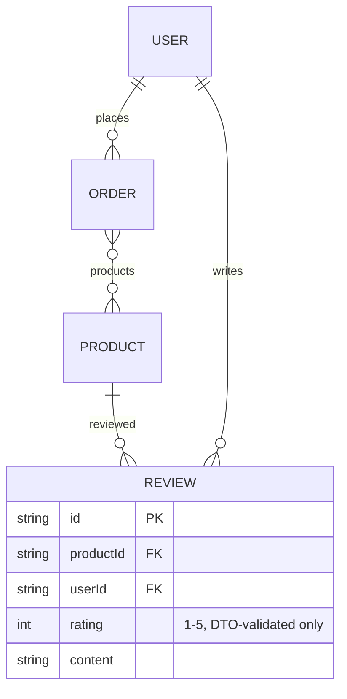

# F013_ProductReviews — Technical Spec

**Priority**: P1
**Type**: ui
**Generated**: 2026-09-12

**See also:** [`functional-spec.md`](./functional-spec.md) — plain-language overview, open
decisions, requirements/business rules stated in one-liners, screens, user stories, scenarios,
edge cases, and configuration for a BA/QA audience.

**How to read this file:** § 2 is the index — pick the action you care about and read its block
in § 3 straight through; each block is one complete thread, top to bottom. § 4 is the shared
appendix — jump in only when a § 3 block points you there.

## 1. Technical Overview

Four endpoints on `ReviewController` (`src/routes/review/review.controller.ts:33-133`, prefix
`reviews`) cover the full lifecycle of a product review. The list endpoint alone is
`@IsPublicApi()` (`review.controller.ts:38-39`) — the other three require a Bearer token.
`ReviewService` (`src/routes/review/review.service.ts`) enforces the purchase-verification
(BR-R01) and sequences its checks to produce the spec's exact status codes (product invisible →
404, not eligible → 403, duplicate → 409 from the DB), delegating persistence to `ReviewRepository`
(`src/repositories/review/review.repository.ts`). `createReviewSelect`/`reviewAuthorSelect`
(`src/selectors/review.selector.ts`, `src/selectors/review-author.selector.ts`) keep the public
author projection intentionally narrow (BR-R05).

## 2. Action Index

| # | Action (handler) | Method · Path | Codes | Writes | Detail |
|---|---|---|---|---|---|
| **A0** | *cross-cutting — belongs to no single action* | — | {BR-R05} | — | § 4.4 |
| **A1** | `ReviewController#getReviews` | `GET` `/reviews` | {FR-001, FR-201, BR-R05, US081} | — *(read-only)* | § 3.1 |
| **A2** | `ReviewController#createReview` | `POST` `/reviews` | {FR-202, BR-R01, BR-R02, BR-R04, US082} | `Review` create | § 3.1 |
| **A3** | `ReviewController#updateReview` | `PUT` `/reviews/:reviewId` | {FR-203, BR-R03, BR-R04, US083} | `Review` update | § 3.1 |
| **A4** | `ReviewController#deleteReview` | `DELETE` `/reviews/:reviewId` | {FR-204, BR-R03, BR-R06, US084} | `Review` delete | § 3.1 |

**Rung set** — every block in § 3 uses this exact order; an absent rung is omitted, never
rendered as `N/A` or `None.`:

> **Who** → **FE** → **Request** → **BE** → **Rule** → **Result** → **State** → **Source**

**Diagram threshold:** none of A1–A4 run a multi-step interactive transaction — all stay below
threshold; no `sequenceDiagram` is included for any of them.

## 3. Actions

### 3.1 CAP-01/CAP-02 — Review Reading and Authoring

#### A1 · List reviews for a product

`GET` `/reviews` → `` `ReviewController#getReviews` ``
`FR-001` `FR-201` `US081`

**Who** · Anyone — no auth token is read at all *(gate A0 — § 4.4)*.
**FE** · *none — headless API, no view layer*
**Request** · query params via `ReviewPaginationQueryDto` (`src/dtos/review/review.dto.ts:135-149`):
required `productId` (UUID), `pageIndex`, `pageSize`, `orderBy` (`ReviewOrderByFields`).
**BE** · `` `ReviewService#getReviews` `` (`src/routes/review/review.service.ts:13-33`) fixes
`orderBy: { createdAt: "desc" }` unconditionally and passes `where: { productId }` to
`` `ReviewRepository#findManyReviews` `` (`src/repositories/review/review.repository.ts:20-50`),
which runs `findMany` + `count` in one `$transaction`.
**Rule** · **BR-R05** (§ 4.4) — the selected author shape is `reviewAuthorSelect` (id, name,
avatar only).
**Result** · read-only — **no DB write**. Returns `{ data: ReviewWithAuthorResponseDto[], pagination }`.
**Source:** `src/routes/review/review.controller.ts:44-51` →
`src/routes/review/review.service.ts:13-33` →
`src/repositories/review/review.repository.ts:20-50` → `src/selectors/review.selector.ts:5-17`

<!-- No diagram: below threshold — read-only, single query pair, synchronous. -->

---

#### A2 · Create a review

`POST` `/reviews` → `` `ReviewController#createReview` ``
`FR-202` `US082`

**Who** · Any authenticated caller with a `DELIVERED` order for the product.
**FE** · *none*
**Request** · body via `CreateReviewRequestDto` (`src/dtos/review/review.dto.ts:88-109`):
`productId` (UUID), `rating` (integer 1–5), `content` (non-empty string).
**BE** · `` `ReviewService#createReview` `` (`src/routes/review/review.service.ts:44-73`) runs three
checks in sequence, deliberately ordered to produce the spec's exact status codes:

1. `` `ReviewRepository#findVisibleProduct` `` (`review.repository.ts:53-67`) — product must exist,
   not be deleted, and be published (`publishedProductWhere()`); a miss is 404 "Product not found."
2. `` `ReviewRepository#findDeliveredOrderForProduct` `` (`review.repository.ts:72-97`) — an
   `Order` with `userId`, `status: DELIVERED`, `deletedAt: null`, and `products: { some: { id:
   productId } }` must exist; a miss is 403 "You can only review a product you have received."
   (BR-R01). This walks the `Order.products` m-n relation F012 populates at checkout, never the
   nullable `ProductSKUSnapshot.skuId`.
3. `` `ReviewRepository#createReview` `` (`review.repository.ts:101-132`) — the actual insert;
   `isUniqueConstraintPrismaError` catches a `@@unique([userId, productId])` violation (BR-R02) and
   remaps it to 409 "You have already reviewed this product."

**Rule** · **BR-R04** — `rating` (1–5, integer) and non-empty `content` are enforced by
`class-validator` on `CreateReviewRequestDto` before the handler runs at all.
**Result** · **Write:** `Review` create. Returns `ReviewWithAuthorResponseDto`.
**Source:** `src/routes/review/review.controller.ts:61-77` →
`src/routes/review/review.service.ts:44-73` →
`src/repositories/review/review.repository.ts:53-67,72-97,101-132`

<!-- No diagram: below threshold — three sequential reads/writes, no interactive transaction. -->

---

#### A3 · Edit own review

`PUT` `/reviews/:reviewId` → `` `ReviewController#updateReview` ``
`FR-203` `US083`

**Who** · The review's own author only (BR-R03).
**FE** · *none*
**Request** · path param `reviewId` (`ParseUUIDPipe`); body via `UpdateReviewRequestDto`
(`src/dtos/review/review.dto.ts:122-124` — a `PartialType(PickType(CreateReviewRequestDto,
["rating","content"]))`): both fields optional, same 1–5/non-empty constraints when present.
**BE** · `` `ReviewService#updateReview` `` (`src/routes/review/review.service.ts:75-93`) delegates
straight to `` `ReviewRepository#updateReview` `` (`where: { id: reviewId, userId }` — BR-R03,
`src/repositories/review/review.repository.ts:135-167`); a miss (including another user's review)
remaps Prisma's not-found error to 404.
**Result** · **Write:** `Review.rating`/`content` update. Returns `ReviewWithAuthorResponseDto`.
**Source:** `src/routes/review/review.controller.ts:89-105` →
`src/routes/review/review.service.ts:75-93` →
`src/repositories/review/review.repository.ts:135-167`

<!-- No diagram: below threshold — single conditional update. -->

---

#### A4 · Delete own review

`DELETE` `/reviews/:reviewId` → `` `ReviewController#deleteReview` ``
`FR-204` `US084`

**Who** · The review's own author only (BR-R03).
**FE** · *none*
**Request** · path param `reviewId` (`ParseUUIDPipe`).
**BE** · `` `ReviewService#deleteReview` `` (`src/routes/review/review.service.ts:95-102`) delegates
straight to `` `ReviewRepository#deleteReview` `` (`where: { id: reviewId, userId }` — BR-R03,
`src/repositories/review/review.repository.ts:170-198`).
**Rule** · **BR-R06** — no soft-delete field exists on `Review`; the Prisma `delete` is always a
hard delete.
**Result** · **Write:** `Review` hard delete. A miss (including another user's review) remaps
Prisma's not-found error to 404 rather than 403.
**Source:** `src/routes/review/review.controller.ts:118-131` →
`src/routes/review/review.service.ts:95-102` →
`src/repositories/review/review.repository.ts:170-198`

<!-- No diagram: below threshold — single conditional delete. -->

---

### 3.2 Edge cases

| Action | Scenario | Behavior |
|---|---|---|
| A2 | `productId` not a UUID, `rating` outside 1–5, or `content` empty | 422 — `class-validator` rejects before the handler runs |
| A2 | product missing, deleted, or unpublished | 404 "Product not found." |
| A2 | caller has no `DELIVERED` order for the product | 403 "You can only review a product you have received." |
| A2 | caller already reviewed the product (race or repeat) | 409 "You have already reviewed this product." — DB unique constraint is the authority even under concurrency |
| A3 · A4 | `reviewId` not a UUID | 422 — `ParseUUIDPipe` rejects before the handler runs |
| A3 · A4 | review belongs to another user, or doesn't exist | 404 — ownership check baked into the `where` clause |
| A1 | unauthenticated call | 200 — bypasses `AccessTokenGuard` entirely via `@IsPublicApi()` |

## 4. Shared Foundation

### 4.1 Components

| Component | Responsibility | Used in | File |
|---|---|---|---|
| `ReviewController` | HTTP entry point for all four review routes | A1–A4 | `src/routes/review/review.controller.ts` |
| `ReviewService` | Sequences BR-R01's checks, enforces the read/write split | A1–A4 | `src/routes/review/review.service.ts` |
| `ReviewRepository` | Runs the Prisma queries/writes, maps not-found/conflict | A1–A4 | `src/repositories/review/review.repository.ts` |
| `publishedProductWhere` | Shared publish/soft-delete visibility predicate (also used by F007, F011) | A2 | `src/constants/product-visibility.constant.ts` |
| `createReviewSelect` / `reviewAuthorSelect` | Shapes the response, keeps the author projection narrow (BR-R05) | A1–A4 | `src/selectors/review.selector.ts`, `src/selectors/review-author.selector.ts` |

### 4.2 Data Model



| Entity | Table | Used for | Action |
|---|---|---|---|
| `Review` (MODEL019) | `review` | The entity this feature owns end-to-end | A1–A4 |
| `Product` (MODEL009) | `product` | Read-only, for review-target visibility (BR-R01 step 1) | A2 |
| `Order` (MODEL018, owned by F012) | `order` | Read-only, for purchase-verification (BR-R01 step 2) | A2 |

#### Polymorphic Behavior

N/A — no discriminator fields on `Review` (`entities.md` MODEL019: "Discriminator Fields: None.").

### 4.3 State Management

None. `Review` carries no lifecycle/status field — it exists or it doesn't (BR-R06: no soft
delete).

### 4.4 Shared Rules

#### Bin 3 — cross-cutting, belongs to no single action

**A0 · {BR-R05} — the public author projection is narrow by construction.**
`reviewAuthorSelect` (`src/selectors/review-author.selector.ts:9-13`) selects only `id`, `name`,
`avatar` — deliberately kept in its own file, separate from a general user selector, "so widening
that selector later can never silently leak PII through a review response" (source comment,
`review-author.selector.ts:4-7`). This shape is used identically whether the caller is
authenticated or not (A1 is public; A2–A4 also echo it back on write).
**Source:** `src/selectors/review-author.selector.ts:1-13` · `src/selectors/review.selector.ts:1-17`

#### Bin 2 — used by ≥2 named actions

**BR-R03 — Author-only writes.** Used in: **A3** · **A4**. Both `ReviewRepository.updateReview`
and `.deleteReview` bake `userId` into the Prisma `where` clause alongside `id` — a review owned by
a different user is indistinguishable from a non-existent one (404, never 403).
**Source:** `src/repositories/review/review.repository.ts:135-167,170-198`

### 4.5 Algorithms & Integrations

**BR-R01 sequencing.** `ReviewService.createReview`'s three-step order (product visibility →
purchase verification → unique-constraint-backed insert) is deliberate, not incidental — the
source comment on the method states it is "sequenced to produce the spec's exact status codes:
product invisible (404) → not eligible (BR-R01, 403) → duplicate (BR-R02, 409 from the DB unique
constraint, remapped by the repository)" (`review.service.ts:39-43`). Reordering these checks would
change which status code a caller sees for an overlapping failure (e.g. an invisible product that's
also never been ordered).

### 4.6 Configuration

```text
DEFAULT_PAGE_INDEX = 1   # ReviewService.getReviews destructuring default (src/routes/review/review.service.ts:14-15)
DEFAULT_PAGE_SIZE = 10   # ReviewService.getReviews destructuring default (src/routes/review/review.service.ts:14-15)
```

**Client behavior:** see
[`behavior-logic.md`](../../generated/behavior-logic.md) (client-side patterns — debounce, optimistic UI, polling, upload, realtime),
[`permissions.md`](../../system/permissions.md) (feature flags / experiments / env / locale gates),
[`screen-flow.md`](../../generated/screen-flow.md) (guards / deep-link state restoration / unsaved-changes protection).

## 5. Verification & Technical Notes

### 5.1 Technical Verification

- **SC-001** *(A1)* Calling `GET /reviews` with no `Bearer` header returns 200, never 401. (covers
  FR-001, BR-R05)
- **SC-002** *(A1)* No review response ever includes the author's email, phone, or account status.
  (covers BR-R05)
- **SC-003** *(A2)* A caller with no `DELIVERED` order for the product always gets 403, never a
  partial write. (covers BR-R01)
- **SC-004** *(A2)* Two near-simultaneous create calls for the same (user, product) never both
  succeed. (covers BR-R02)
- **SC-005** *(A3, A4)* A `reviewId` owned by a different user always yields 404, never 403.
  (covers BR-R03)

#### US082_CreateReview *(A2)*

**Independent Test:** Create a `DELIVERED` order for a product, then attempt to review that same
product twice in a row; confirm the first succeeds (201/200) and the second is 409.

**Acceptance Scenarios:**

1. **Given** a caller has a `DELIVERED`, non-deleted order whose `products` includes the target
   product, **When** they submit a valid review, **Then** the review is created and returned with
   their author projection.
2. **Given** a caller's only order for the product is `PENDING_DELIVERY` (not yet delivered),
   **When** they attempt to create a review, **Then** 403, and no `Review` row is written.

#### US081_ViewProductReviews *(A1)*

**Independent Test:** Call `GET /reviews?productId=...` with no Authorization header; confirm 200
and that every returned author object contains only `id`, `name`, `avatar`.

**Acceptance Scenarios:**

1. **Given** a product has reviews from 3 different users, **When** an anonymous caller lists them,
   **Then** all 3 are returned newest first, each with a narrow author projection.
2. **Given** a product has no reviews, **When** anyone lists them, **Then** 200 with an empty
   `data` array, not an error.

### 5.2 Assumptions

- *(A2)* `findDeliveredOrderForProduct`'s reliance on the `Order.products` m-n relation assumes
  every checkout populates it correctly (F012's post-blueprint decision, `clarifications.md`) — this
  pass does not re-verify F012's checkout write path beyond citing that decision.

### 5.3 Unresolved Questions

None — `clarifications.md` § Review records this domain as fully resolved; the one open item there
(seller replies) is explicitly out of scope for this feature, not an unresolved question about it.

### 5.4 Source References

| Action | Order | Symbol | Path | Purpose |
|---|---|---|---|---|
| — | 1 | `Review` | `prisma/schema.prisma:495-508` | Entity this feature revolves around |
| A1–A4 | 2 | `ReviewController` | `src/routes/review/review.controller.ts:1-133` | HTTP entry point for all four routes |
| A1–A4 | 3 | `ReviewService` | `src/routes/review/review.service.ts:1-114` | Sequences BR-R01's checks, delegates persistence |
| A1–A4 | 4 | `ReviewRepository` | `src/repositories/review/review.repository.ts:1-199` | Runs the Prisma queries/writes, 404/409 mapping |
| A1–A4 | 5 | `reviewAuthorSelect` | `src/selectors/review-author.selector.ts:1-13` | BR-R05's narrow author projection |

#### Data Flow

```text
Query params (productId, pagination) -> ReviewService fixes newest-first order -> ReviewRepository
  runs findMany+count -> ReviewWithAuthorResponseDto[] (A1)

Body (Create|UpdateReviewRequestDto) | path param (reviewId) -> ReviewService sequences
  visibility -> purchase-verification -> unique-constraint-backed write -> ReviewRepository ->
  ReviewWithAuthorResponseDto | message (A2-A4)
```

### 5.5 Artifact References

| Artifact | File | Codes Used | Reviewed |
|----------|------|------------|----------|
| System Overview | [system-overview.md](../../system/system-overview.md) | — | [x] |
| Feature List | [feature-list.md](../../generated/feature-list.md) | F013 | [x] |
| API Map | [route-list.md](../../generated/route-list.md) | ROUTE082, ROUTE083, ROUTE084, ROUTE085 | [x] |
| Entities | [entities.md](../../generated/entities.md) | MODEL019, MODEL009, MODEL018 | [x] |
| Screens | N/A — headless API, no screens | — | [x] |
| Behavior Logic | [behavior-logic.md](../../generated/behavior-logic.md) | — | [x] |
| Permissions Matrix | [permissions-matrix.md](../../generated/permissions-matrix.md) | PERM002, PERM005 | [x] |
| User Stories | [user-stories.md](../../generated/user-stories.md) | US081, US082, US083, US084 | [x] |
