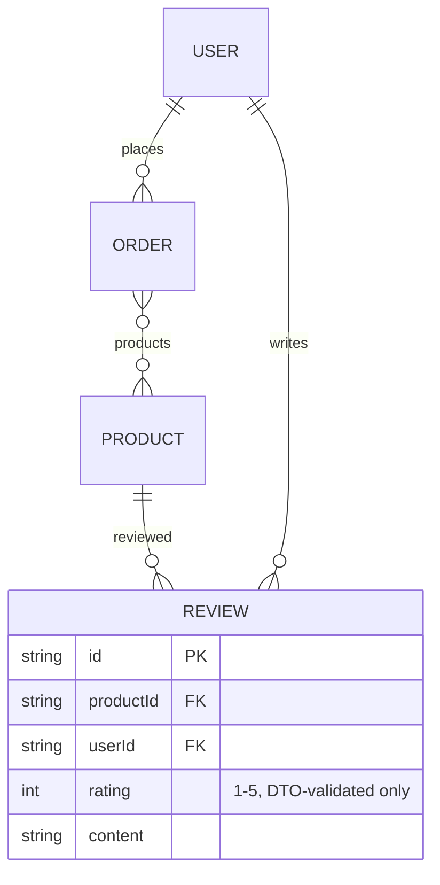

# F013_ProductReviews — Đặc tả Kỹ thuật

**Độ ưu tiên**: P1
**Loại**: ui
**Được tạo**: 2026-09-12

**Xem thêm:** [`functional-spec.vi.md`](./functional-spec.vi.md) — tổng quan bằng ngôn ngữ thường, các quyết định mở,
yêu cầu/quy tắc nghiệp vụ được nêu gọn trong một dòng, màn hình, user story, tình huống,
trường hợp biên, và cấu hình dành cho BA/QA.

**Cách đọc file này:** § 2 là mục lục — chọn hành động bạn quan tâm rồi đọc trọn khối tương ứng ở § 3;
mỗi khối là một mạch nội dung hoàn chỉnh, đọc từ trên xuống dưới. § 4 là phụ lục dùng chung — chỉ nhảy
vào đó khi một khối ở § 3 dẫn bạn tới.

## 1. Tổng quan Kỹ thuật

Bốn endpoint trên `ReviewController` (`src/routes/review/review.controller.ts:33-133`, tiền tố
`reviews`) bao phủ toàn bộ vòng đời của một review sản phẩm. Riêng endpoint list là
`@IsPublicApi()` (`review.controller.ts:38-39`) — ba endpoint còn lại đều cần Bearer token.
`ReviewService` (`src/routes/review/review.service.ts`) thực thi việc xác minh đã mua hàng
(BR-R01) và sắp xếp thứ tự các bước kiểm tra để tạo ra đúng các status code mà spec yêu cầu (sản
phẩm không hiển thị → 404, không đủ điều kiện → 403, trùng lặp → 409 từ DB), rồi giao việc lưu dữ
liệu cho `ReviewRepository` (`src/repositories/review/review.repository.ts`). `createReviewSelect`/`reviewAuthorSelect`
(`src/selectors/review.selector.ts`, `src/selectors/review-author.selector.ts`) giữ cho phần thông tin tác giả trả về công khai luôn
hẹp một cách có chủ đích (BR-R05).

## 2. Chỉ mục Hành động

| # | Hành động (handler) | Method · Path | Codes | Ghi | Chi tiết |
|---|---|---|---|---|---|
| **A0** | *cross-cutting — không thuộc riêng hành động nào* | — | {BR-R05} | — | § 4.4 |
| **A1** | `ReviewController#getReviews` | `GET` `/reviews` | {FR-001, FR-201, BR-R05, US081} | — *(chỉ đọc)* | § 3.1 |
| **A2** | `ReviewController#createReview` | `POST` `/reviews` | {FR-202, BR-R01, BR-R02, BR-R04, US082} | tạo `Review` | § 3.1 |
| **A3** | `ReviewController#updateReview` | `PUT` `/reviews/:reviewId` | {FR-203, BR-R03, BR-R04, US083} | cập nhật `Review` | § 3.1 |
| **A4** | `ReviewController#deleteReview` | `DELETE` `/reviews/:reviewId` | {FR-204, BR-R03, BR-R06, US084} | xóa `Review` | § 3.1 |

**Bộ rung (rung set)** — mọi khối ở § 3 đều dùng đúng thứ tự này; rung nào không có thì bỏ qua luôn,
không bao giờ ghi là `N/A` hay `None.`:

> **Who** → **FE** → **Request** → **BE** → **Rule** → **Result** → **State** → **Source**

**Ngưỡng vẽ sơ đồ:** không có action nào trong A1–A4 chạy một giao dịch tương tác nhiều bước — tất cả
đều dưới ngưỡng; không action nào có kèm `sequenceDiagram`.

## 3. Actions

### 3.1 CAP-01/CAP-02 — Đọc và Viết Review

#### A1 · Liệt kê review của một sản phẩm

`GET` `/reviews` → `` `ReviewController#getReviews` ``
`FR-001` `FR-201` `US081`

**Who** · Bất kỳ ai — không đọc token xác thực nào cả *(gate A0 — § 4.4)*.
**FE** · *không có — headless API, không có tầng view*
**Request** · query params qua `ReviewPaginationQueryDto` (`src/dtos/review/review.dto.ts:135-149`):
bắt buộc `productId` (UUID), `pageIndex`, `pageSize`, `orderBy` (`ReviewOrderByFields`).
**BE** · `` `ReviewService#getReviews` `` (`src/routes/review/review.service.ts:13-33`) luôn cố định
`orderBy: { createdAt: "desc" }` và truyền `where: { productId }` cho
`` `ReviewRepository#findManyReviews` `` (`src/repositories/review/review.repository.ts:20-50`),
hàm này chạy `findMany` + `count` trong cùng một `$transaction`.
**Rule** · **BR-R05** (§ 4.4) — hình dạng author được chọn là `reviewAuthorSelect` (chỉ id, name,
avatar).
**Result** · chỉ đọc — **không ghi DB**. Trả về `{ data: ReviewWithAuthorResponseDto[], pagination }`.
**Source:** `src/routes/review/review.controller.ts:44-51` →
`src/routes/review/review.service.ts:13-33` →
`src/repositories/review/review.repository.ts:20-50` → `src/selectors/review.selector.ts:5-17`

<!-- No diagram: below threshold — read-only, single query pair, synchronous. -->

---

#### A2 · Tạo một review

`POST` `/reviews` → `` `ReviewController#createReview` ``
`FR-202` `US082`

**Who** · Bất kỳ caller nào đã xác thực và có đơn hàng `DELIVERED` cho sản phẩm đó.
**FE** · *không có*
**Request** · body qua `CreateReviewRequestDto` (`src/dtos/review/review.dto.ts:88-109`):
`productId` (UUID), `rating` (số nguyên 1–5), `content` (chuỗi không rỗng).
**BE** · `` `ReviewService#createReview` `` (`src/routes/review/review.service.ts:44-73`) chạy ba
bước kiểm tra theo đúng thứ tự, cố ý sắp xếp để cho ra đúng các status code mà spec yêu cầu:

1. `` `ReviewRepository#findVisibleProduct` `` (`review.repository.ts:53-67`) — sản phẩm phải tồn
   tại, chưa bị xóa, và đã publish (`publishedProductWhere()`); không khớp thì trả 404 "Product not found."
2. `` `ReviewRepository#findDeliveredOrderForProduct` `` (`review.repository.ts:72-97`) — phải tồn
   tại một `Order` có `userId`, `status: DELIVERED`, `deletedAt: null`, và `products: { some: { id:
   productId } }`; không khớp thì trả 403 "You can only review a product you have received."
   (BR-R01). Bước này đi qua quan hệ m-n `Order.products` mà F012 điền vào lúc checkout, không bao
   giờ dùng `ProductSKUSnapshot.skuId` (trường có thể null).
3. `` `ReviewRepository#createReview` `` (`review.repository.ts:101-132`) — lệnh insert thật sự;
   `isUniqueConstraintPrismaError` bắt lỗi vi phạm `@@unique([userId, productId])` (BR-R02) rồi ánh
   xạ lại thành 409 "You have already reviewed this product."

**Rule** · **BR-R04** — `rating` (1–5, số nguyên) và `content` không rỗng được `class-validator`
validate trên `CreateReviewRequestDto` trước cả khi handler chạy.
**Result** · **Write:** tạo `Review`. Trả về `ReviewWithAuthorResponseDto`.
**Source:** `src/routes/review/review.controller.ts:61-77` →
`src/routes/review/review.service.ts:44-73` →
`src/repositories/review/review.repository.ts:53-67,72-97,101-132`

<!-- No diagram: below threshold — three sequential reads/writes, no interactive transaction. -->

---

#### A3 · Sửa review của chính mình

`PUT` `/reviews/:reviewId` → `` `ReviewController#updateReview` ``
`FR-203` `US083`

**Who** · Chỉ tác giả của review đó (BR-R03).
**FE** · *không có*
**Request** · path param `reviewId` (`ParseUUIDPipe`); body qua `UpdateReviewRequestDto`
(`src/dtos/review/review.dto.ts:122-124` — một `PartialType(PickType(CreateReviewRequestDto,
["rating","content"]))`): cả hai field đều tùy chọn, ràng buộc 1–5/không rỗng vẫn giữ nguyên nếu có gửi lên.
**BE** · `` `ReviewService#updateReview` `` (`src/routes/review/review.service.ts:75-93`) giao thẳng
cho `` `ReviewRepository#updateReview` `` (`where: { id: reviewId, userId }` — BR-R03,
`src/repositories/review/review.repository.ts:135-167`); không khớp (kể cả review của người khác)
thì lỗi not-found của Prisma được ánh xạ lại thành 404.
**Result** · **Write:** cập nhật `Review.rating`/`content`. Trả về `ReviewWithAuthorResponseDto`.
**Source:** `src/routes/review/review.controller.ts:89-105` →
`src/routes/review/review.service.ts:75-93` →
`src/repositories/review/review.repository.ts:135-167`

<!-- No diagram: below threshold — single conditional update. -->

---

#### A4 · Xóa review của chính mình

`DELETE` `/reviews/:reviewId` → `` `ReviewController#deleteReview` ``
`FR-204` `US084`

**Who** · Chỉ tác giả của review đó (BR-R03).
**FE** · *không có*
**Request** · path param `reviewId` (`ParseUUIDPipe`).
**BE** · `` `ReviewService#deleteReview` `` (`src/routes/review/review.service.ts:95-102`) giao thẳng
cho `` `ReviewRepository#deleteReview` `` (`where: { id: reviewId, userId }` — BR-R03,
`src/repositories/review/review.repository.ts:170-198`).
**Rule** · **BR-R06** — `Review` không có field soft-delete nào cả; `delete` của Prisma ở đây luôn
là xóa cứng.
**Result** · **Write:** xóa cứng `Review`. Không khớp (kể cả review của người khác) thì lỗi
not-found của Prisma được ánh xạ lại thành 404 chứ không phải 403.
**Source:** `src/routes/review/review.controller.ts:118-131` →
`src/routes/review/review.service.ts:95-102` →
`src/repositories/review/review.repository.ts:170-198`

<!-- No diagram: below threshold — single conditional delete. -->

---

### 3.2 Trường hợp biên

| Action | Scenario | Behavior |
|---|---|---|
| A2 | `productId` không phải UUID, `rating` ngoài khoảng 1–5, hoặc `content` rỗng | 422 — `class-validator` từ chối trước khi handler chạy |
| A2 | sản phẩm không tồn tại, đã xóa, hoặc chưa publish | 404 "Product not found." |
| A2 | caller không có đơn hàng `DELIVERED` cho sản phẩm | 403 "You can only review a product you have received." |
| A2 | caller đã review sản phẩm rồi (race condition hoặc gửi lại) | 409 "You have already reviewed this product." — unique constraint của DB là căn cứ cuối cùng, kể cả khi có đồng thời |
| A3 · A4 | `reviewId` không phải UUID | 422 — `ParseUUIDPipe` từ chối trước khi handler chạy |
| A3 · A4 | review thuộc về người khác, hoặc không tồn tại | 404 — việc kiểm tra quyền sở hữu nằm ngay trong mệnh đề `where` |
| A1 | gọi mà không xác thực | 200 — bỏ qua hoàn toàn `AccessTokenGuard` nhờ `@IsPublicApi()` |

## 4. Shared Foundation

### 4.1 Components

| Component | Responsibility | Used in | File |
|---|---|---|---|
| `ReviewController` | Điểm vào HTTP cho cả bốn route review | A1–A4 | `src/routes/review/review.controller.ts` |
| `ReviewService` | Sắp thứ tự các bước kiểm tra của BR-R01, giữ ranh giới đọc/ghi | A1–A4 | `src/routes/review/review.service.ts` |
| `ReviewRepository` | Chạy các query/write của Prisma, map not-found/conflict | A1–A4 | `src/repositories/review/review.repository.ts` |
| `publishedProductWhere` | Predicate dùng chung để xét publish/soft-delete (F007, F011 cũng dùng) | A2 | `src/constants/product-visibility.constant.ts` |
| `createReviewSelect` / `reviewAuthorSelect` | Định hình response, giữ phần author trả về hẹp (BR-R05) | A1–A4 | `src/selectors/review.selector.ts`, `src/selectors/review-author.selector.ts` |

### 4.2 Data Model



| Entity | Table | Used for | Action |
|---|---|---|---|
| `Review` (MODEL019) | `review` | Entity mà tính năng này sở hữu trọn vẹn | A1–A4 |
| `Product` (MODEL009) | `product` | Chỉ đọc, để xét product có hiển thị làm review-target không (BR-R01 bước 1) | A2 |
| `Order` (MODEL018, do F012 sở hữu) | `order` | Chỉ đọc, để xác minh đã mua hàng (BR-R01 bước 2) | A2 |

#### Polymorphic Behavior

N/A — `Review` không có discriminator field nào (`entities.md` MODEL019: "Discriminator Fields: None.").

### 4.3 State Management

Không có. `Review` không mang field vòng đời/trạng thái nào — nó tồn tại hoặc không tồn tại (BR-R06: không
soft-delete).

### 4.4 Shared Rules

#### Bin 3 — cross-cutting, không thuộc riêng hành động nào

**A0 · {BR-R05} — phần author trả về công khai được thiết kế hẹp ngay từ đầu.**
`reviewAuthorSelect` (`src/selectors/review-author.selector.ts:9-13`) chỉ chọn `id`, `name`,
`avatar` — được tách riêng ra file của nó một cách có chủ đích, khác với selector user chung, "để
sau này có mở rộng selector kia cũng không bao giờ vô tình làm lộ PII qua response review" (comment
trong code, `review-author.selector.ts:4-7`). Hình dạng này giống hệt nhau dù caller đã xác thực
hay chưa (A1 là public; A2–A4 cũng trả lại đúng hình dạng đó khi ghi).
**Source:** `src/selectors/review-author.selector.ts:1-13` · `src/selectors/review.selector.ts:1-17`

#### Bin 2 — dùng bởi ≥2 action có tên

**BR-R03 — Chỉ tác giả mới được ghi.** Dùng trong: **A3** · **A4**. Cả `ReviewRepository.updateReview`
lẫn `.deleteReview` đều gắn `userId` vào mệnh đề `where` của Prisma cùng với `id` — một review thuộc
sở hữu người khác sẽ không thể phân biệt được với một review không tồn tại (404, không bao giờ là 403).
**Source:** `src/repositories/review/review.repository.ts:135-167,170-198`

### 4.5 Algorithms & Integrations

**Thứ tự các bước của BR-R01.** Thứ tự ba bước của `ReviewService.createReview` (product hiển thị →
xác minh đã mua → insert dựa trên unique constraint) là có chủ đích, không phải ngẫu nhiên — comment
trong code trên method này ghi rõ nó được "sắp xếp để cho ra đúng các status code spec yêu cầu:
product không hiển thị (404) → không đủ điều kiện (BR-R01, 403) → trùng lặp (BR-R02, 409 từ unique
constraint của DB, được repository ánh xạ lại)" (`review.service.ts:39-43`). Đổi thứ tự các bước này
sẽ làm thay đổi status code mà caller nhận được khi rơi vào một lỗi chồng lấn (ví dụ một product
không hiển thị mà cũng chưa từng được đặt hàng).

### 4.6 Configuration

```text
DEFAULT_PAGE_INDEX = 1   # ReviewService.getReviews destructuring default (src/routes/review/review.service.ts:14-15)
DEFAULT_PAGE_SIZE = 10   # ReviewService.getReviews destructuring default (src/routes/review/review.service.ts:14-15)
```

**Client behavior:** xem
[`behavior-logic.vi.md`](../../generated/behavior-logic.vi.md) (các pattern phía client — debounce, optimistic UI, polling, upload, realtime),
[`permissions.vi.md`](../../system/permissions.vi.md) (feature flag / experiment / env / locale gate),
[`screen-flow.vi.md`](../../generated/screen-flow.vi.md) (guard / khôi phục trạng thái deep-link / bảo vệ thay đổi chưa lưu).

## 5. Verification & Technical Notes

### 5.1 Technical Verification

- **SC-001** *(A1)* Gọi `GET /reviews` mà không có header `Bearer` vẫn trả về 200, không bao giờ 401.
  (bao phủ FR-001, BR-R05)
- **SC-002** *(A1)* Response review không bao giờ chứa email, số điện thoại, hay trạng thái tài khoản
  của tác giả. (bao phủ BR-R05)
- **SC-003** *(A2)* Caller không có đơn hàng `DELIVERED` cho product luôn nhận 403, không bao giờ bị
  ghi một phần dữ liệu. (bao phủ BR-R01)
- **SC-004** *(A2)* Hai lệnh tạo gần như đồng thời cho cùng một cặp (user, product) không bao giờ cả
  hai cùng thành công. (bao phủ BR-R02)
- **SC-005** *(A3, A4)* `reviewId` thuộc sở hữu người khác luôn trả về 404, không bao giờ 403.
  (bao phủ BR-R03)

#### US082_CreateReview *(A2)*

**Independent Test:** Tạo một đơn hàng `DELIVERED` cho một product, rồi thử review chính product đó
hai lần liên tiếp; xác nhận lần đầu thành công (201/200) và lần thứ hai bị 409.

**Acceptance Scenarios:**

1. **Given** caller có một đơn hàng `DELIVERED`, chưa xóa, mà `products` của nó có chứa product mục
   tiêu, **When** họ gửi một review hợp lệ, **Then** review được tạo và trả về kèm phần author của
   họ.
2. **Given** đơn hàng duy nhất của caller cho product đó đang ở trạng thái `PENDING_DELIVERY` (chưa
   giao), **When** họ thử tạo review, **Then** trả về 403, và không có dòng `Review` nào được ghi.

#### US081_ViewProductReviews *(A1)*

**Independent Test:** Gọi `GET /reviews?productId=...` mà không có header Authorization; xác nhận
trả về 200 và mọi object author trả về chỉ chứa `id`, `name`, `avatar`.

**Acceptance Scenarios:**

1. **Given** một product có review từ 3 user khác nhau, **When** một caller ẩn danh liệt kê chúng,
   **Then** cả 3 được trả về theo thứ tự mới nhất trước, mỗi review kèm phần author đã thu hẹp.
2. **Given** một product chưa có review nào, **When** bất kỳ ai liệt kê chúng, **Then** trả về 200
   với mảng `data` rỗng, không phải lỗi.

### 5.2 Assumptions

- *(A2)* Việc `findDeliveredOrderForProduct` dựa vào quan hệ m-n `Order.products` giả định rằng mọi
  lượt checkout đều điền quan hệ đó đúng cách (quyết định hậu-blueprint của F012, `clarifications.md`)
  — lượt rà soát này không xác minh lại đường ghi checkout của F012 ngoài việc trích dẫn quyết định đó.

### 5.3 Unresolved Questions

Không có — `clarifications.md` § Review ghi nhận domain này đã giải quyết xong hoàn toàn; mục còn mở
duy nhất ở đó (trả lời review của seller) nằm ngoài phạm vi tính năng này một cách rõ ràng, không phải một câu hỏi chưa giải quyết về nó.

### 5.4 Source References

| Action | Order | Symbol | Path | Purpose |
|---|---|---|---|---|
| — | 1 | `Review` | `prisma/schema.prisma:495-508` | Entity trung tâm mà tính năng này xoay quanh |
| A1–A4 | 2 | `ReviewController` | `src/routes/review/review.controller.ts:1-133` | Điểm vào HTTP cho cả bốn route |
| A1–A4 | 3 | `ReviewService` | `src/routes/review/review.service.ts:1-114` | Sắp thứ tự các bước kiểm tra của BR-R01, giao việc lưu dữ liệu |
| A1–A4 | 4 | `ReviewRepository` | `src/repositories/review/review.repository.ts:1-199` | Chạy các query/write của Prisma, map 404/409 |
| A1–A4 | 5 | `reviewAuthorSelect` | `src/selectors/review-author.selector.ts:1-13` | Phần author đã thu hẹp theo BR-R05 |

#### Data Flow

```text
Query params (productId, pagination) -> ReviewService fixes newest-first order -> ReviewRepository
  runs findMany+count -> ReviewWithAuthorResponseDto[] (A1)

Body (Create|UpdateReviewRequestDto) | path param (reviewId) -> ReviewService sequences
  visibility -> purchase-verification -> unique-constraint-backed write -> ReviewRepository ->
  ReviewWithAuthorResponseDto | message (A2-A4)
```

### 5.5 Artifact References

| Artifact | File | Codes Used | Reviewed |
|----------|------|------------|----------|
| System Overview | [system-overview.md](../../system/system-overview.md) | — | [x] |
| Feature List | [feature-list.vi.md](../../generated/feature-list.vi.md) | F013 | [x] |
| API Map | [route-list.vi.md](../../generated/route-list.vi.md) | ROUTE082, ROUTE083, ROUTE084, ROUTE085 | [x] |
| Entities | [entities.vi.md](../../generated/entities.vi.md) | MODEL019, MODEL009, MODEL018 | [x] |
| Screens | N/A — headless API, no screens | — | [x] |
| Behavior Logic | [behavior-logic.vi.md](../../generated/behavior-logic.vi.md) | — | [x] |
| Permissions Matrix | [permissions-matrix.vi.md](../../generated/permissions-matrix.vi.md) | PERM002, PERM005 | [x] |
| User Stories | [user-stories.md](../../generated/user-stories.md) | US081, US082, US083, US084 | [x] |
