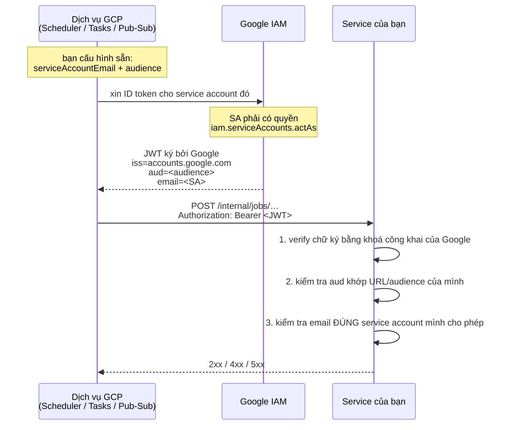
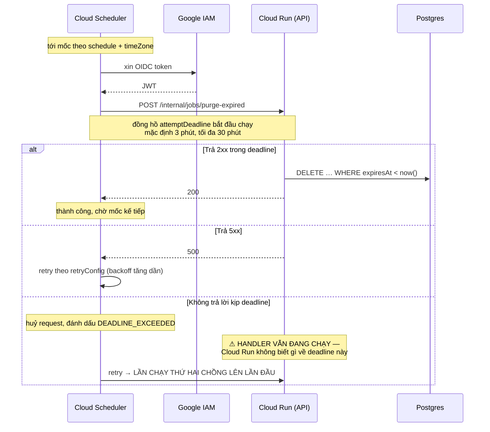
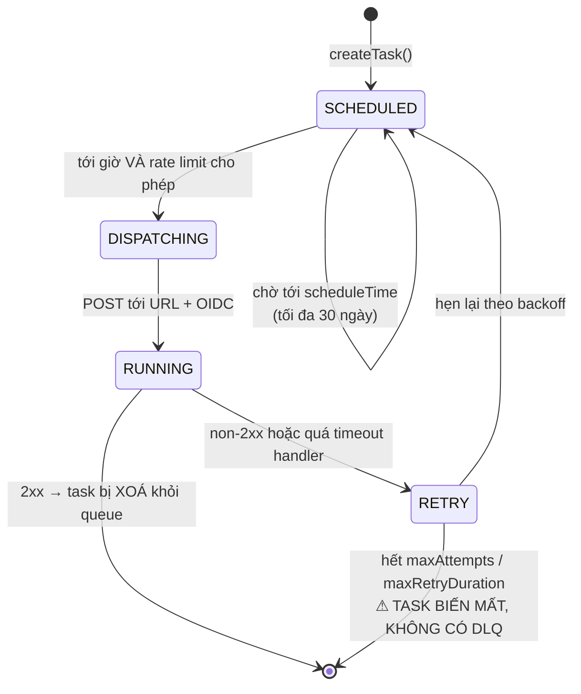
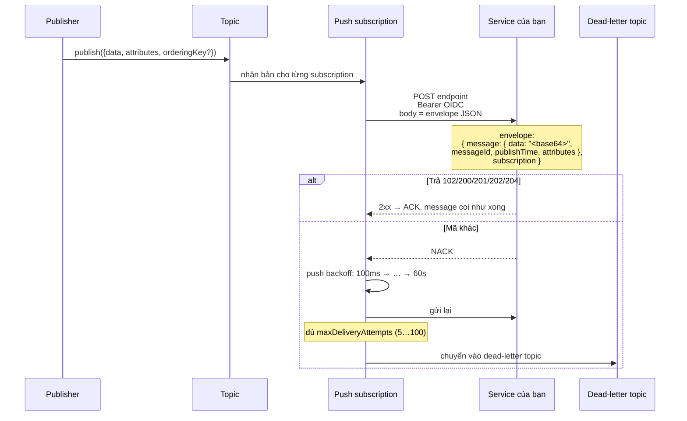

# Dịch vụ queue & scheduler của GCP — cơ chế chi tiết

Tài liệu mổ xẻ **bên trong** các dịch vụ xử lý nền của Google Cloud: chúng giữ gì, giao hàng ra sao, retry theo công thức nào, và hỏng kiểu gì.

> **Quan hệ với tài liệu khác.**
>
> - [queue-job-worker-scheduler-guide.md](queue-job-worker-scheduler-guide.md) — _khái niệm_: job, worker, retry, idempotency, outbox. **Đọc trước.**
> - [queue-scheduler-gcp-vs-bullmq.md](queue-scheduler-gcp-vs-bullmq.md) — _chọn cái nào_: GCP vs BullMQ vs thư viện NestJS.
> - [bullmq-nestjs-schedule-deep-dive.md](bullmq-nestjs-schedule-deep-dive.md) — _cơ chế_ của BullMQ và `@nestjs/schedule`.
> - **Tài liệu này** — _cơ chế_ của phía GCP. Là bản đối xứng của tài liệu trên, cho nửa còn lại của lựa chọn.

> **Về số liệu.** Mọi con số dưới đây đã được đối chiếu với tài liệu chính thức tại thời điểm viết, và mỗi mục đều dẫn link tới trang gốc ở §Nguồn tham khảo. Hạn mức GCP đổi theo thời gian — số ở đây để bạn **thiết kế đúng bậc độ lớn**, còn trước khi chốt cấu hình production thì mở lại trang gốc.
>
> Lưu ý: tài liệu Google Cloud đã chuyển sang tên miền `docs.cloud.google.com`; link `cloud.google.com` cũ vẫn chuyển hướng về đó.

---

# PHẦN A — Nền tảng chung

## A1. Mọi thứ ở đây đều là push

Cloud Scheduler, Cloud Tasks và Pub/Sub (push subscription) đều hoạt động theo một mô hình duy nhất: **hạ tầng GCP gửi một HTTP request vào service của bạn**. Không có worker, không có vòng lặp, không có kết nối thường trực.

```
        ┌──────────────┐   HTTPS POST + OIDC   ┌────────────────────┐
        │  Dịch vụ GCP │ ────────────────────► │  Service của bạn   │
        │  giữ "việc"  │                       │  (controller thường)│
        └──────────────┘ ◄──────────────────── └────────────────────┘
                          mã HTTP = kết quả
```

Ba hệ quả xuyên suốt tài liệu này:

1. **Mã HTTP _là_ giao thức.** Không có `ack()`, không có `job.moveToCompleted()`. `2xx` nghĩa là xong, còn lại nghĩa là thất bại và sẽ được giao lại. Toàn bộ trạng thái nằm ở phía GCP.
2. **Handler của bạn là một endpoint công khai trên Internet.** Đây là bề mặt tấn công mới, và §A2 là phần bắt buộc chứ không phải tuỳ chọn.
3. **Không cần process nào luôn sống.** Đây là lý do duy nhất khiến nhóm dịch vụ này thắng BullMQ trên Cloud Run — xem [queue-scheduler-gcp-vs-bullmq.md §2](queue-scheduler-gcp-vs-bullmq.md).

## A2. OIDC — ai ký, ký cái gì, verify ra sao

Cả ba dịch vụ đều dùng chung một cơ chế xác thực. Hiểu một lần, dùng cho tất cả.



**Bước 3 là bước người ta hay bỏ.** Chữ ký hợp lệ chỉ chứng minh "Google đã ký token này" — mà **bất kỳ ai có tài khoản Google cũng lấy được một token hợp lệ**. Thiếu kiểm tra `email` (hoặc ít nhất là `aud` gắn chặt với URL riêng của bạn) thì endpoint nội bộ mở toang cho cả Internet.

Trong repo này, `google-auth-library` đã có sẵn (đang dùng cho Google OAuth login ở [google.service.ts](../src/routes/auth/google.service.ts)), nên guard chỉ là:

```ts
const ticket = await this.client.verifyIdToken({
  idToken: token,
  audience: this.config.appConfig.cloudRunAudience, // bước 2
});

// bước 3 — KHÔNG được bỏ
return ticket.getPayload()?.email === this.config.appConfig.jobInvokerSa;
```

`verifyIdToken` tự lo bước 1 (tải khoá công khai, kiểm tra chữ ký, hạn, issuer). Đừng tự `jwt.decode` rồi đọc field — decode không kiểm tra gì cả.

## A3. At-least-once ở khắp nơi

Không dịch vụ nào trong tài liệu này cho bạn exactly-once cho handler HTTP. Pub/Sub có chế độ exactly-once nhưng **chỉ cho pull subscription**, và kèm điều kiện — §D5.

Lý do gốc giống hệt phần BullMQ (xem [bullmq-nestjs-schedule-deep-dive.md §B5](bullmq-nestjs-schedule-deep-dive.md)): khi request timeout, bên gửi **không thể phân biệt** "handler chưa chạy" với "handler chạy xong rồi nhưng response mất trên đường về". Chọn không retry thì mất việc; chọn retry thì có lúc chạy hai lần. GCP chọn retry.

**Nên: idempotency là bắt buộc, không phải tối ưu.**

---

# PHẦN B — Cloud Scheduler

## B1. Một job gồm những gì

Cloud Scheduler **không chạy code của bạn** và **không lưu dữ liệu công việc**. Một job chỉ là bản ghi cấu hình:

| Trường            | Nghĩa                                          |
| ----------------- | ---------------------------------------------- |
| `schedule`        | Chuỗi unix-cron 5 trường                       |
| `timeZone`        | Tên vùng theo tz database; mặc định **UTC**    |
| `target`          | HTTP, Pub/Sub, hoặc App Engine HTTP            |
| `attemptDeadline` | Chờ response bao lâu trước khi coi là thất bại |
| `retryConfig`     | Số lần thử lại và backoff                      |

Không có chỗ nào chứa "dữ liệu của lần chạy này". Muốn mỗi lần chạy mang dữ liệu riêng thì đó là việc của Cloud Tasks (§C).

## B2. Flow một lần nổ



## B3. `attemptDeadline` — cái bẫy chạy chồng

Đây là chế độ hỏng đặc trưng của Cloud Scheduler, và nó âm thầm.

`attemptDeadline` mặc định **3 phút** cho HTTP target, đặt được trong khoảng **[15 giây, 30 phút]**. Hết deadline, Scheduler **huỷ request phía nó** và tính là `DEADLINE_EXCEEDED`.

Nhưng **huỷ request không giết được handler**. Cloud Run vẫn đang chạy hàm dọn dẹp của bạn. Rồi Scheduler retry, và bạn có hai lần chạy song song trên cùng dữ liệu.

Ba cách xử lý, nên làm cả ba:

1. **Cron chỉ phát job, không làm job.** Handler trả `2xx` trong vài trăm ms sau khi đẩy việc thật sang Cloud Tasks. Đây là nguyên tắc ở guide cũ §12.4, và trên Cloud Scheduler nó gần như bắt buộc vì trần 30 phút.
2. **Tự khoá.** Handler lấy một lock Redis `SET NX EX` trước khi làm; lần chạy chồng thấy lock thì trả `200` và thoát. Repo đã có `RedisService` cho việc này.
3. **Nâng `attemptDeadline`** cho đúng công việc — nhưng đây là băng dán, không phải lời giải, vì trần vẫn là 30 phút.

Việc nào không gói nổi trong 30 phút thì không thuộc về Cloud Scheduler → dùng Cloud Run Jobs (§E).

## B4. Timezone và DST

Mặc định là **UTC**. Và tài liệu Google khuyến nghị **cứ để UTC**:

> _"For some time zones, daylight saving time can cause jobs to run or not run unexpectedly… UTC is recommended for Cloud Scheduler to avoid the problem completely."_

Lý do: ở vùng có DST, mốc 2h sáng có thể **không tồn tại** (đêm nhảy giờ) hoặc **tồn tại hai lần** (đêm lùi giờ) — job bị bỏ hoặc chạy đúp.

Việt Nam không dùng DST nên `Asia/Ho_Chi_Minh` an toàn. Nhưng nếu job liên quan tới người dùng ở vùng có DST, hãy để lịch chạy UTC rồi xử lý múi giờ trong code.

## B5. Ba loại target

| Target              | Khi nào dùng                                                        |
| ------------------- | ------------------------------------------------------------------- |
| **HTTP**            | Mặc định. Gọi thẳng endpoint của bạn.                               |
| **Pub/Sub**         | Khi cần fan-out nhiều consumer theo lịch, hoặc muốn tách phát/xử lý |
| **App Engine HTTP** | Chỉ khi đang chạy App Engine                                        |

Một mẹo đáng dùng: `Cloud Scheduler → Pub/Sub topic` cho bạn một lớp đệm. Handler chậm hay đang down cũng không làm Scheduler tính là thất bại, vì việc đã nằm an toàn trong topic. Đổi lại là thêm một mắt xích.

## B6. Tóm tắt chế độ hỏng

| Sự cố                     | Cloud Scheduler làm gì               | Bạn phải làm gì             |
| ------------------------- | ------------------------------------ | --------------------------- |
| Handler trả 5xx           | Retry theo `retryConfig`             | Bảo đảm idempotent          |
| Handler chạy quá deadline | Huỷ + retry, **handler cũ vẫn chạy** | Lock, hoặc rút ngắn handler |
| App đang down             | Retry theo cấu hình rồi bỏ cuộc      | Alert; tự chạy bù nếu cần   |
| Job chạy quá 30 phút      | Không thể                            | Chuyển sang Cloud Run Jobs  |
| Cần dữ liệu riêng mỗi lần | Không hỗ trợ                         | Dùng Cloud Tasks            |

---

# PHẦN C — Cloud Tasks

## C1. Queue và task

Cloud Tasks là thứ gần BullMQ nhất trong GCP — nhưng **đảo chiều**: bạn không viết worker, bạn đưa cho nó một URL.

- **Queue** giữ cấu hình chung: rate limit, retry, routing. Tương đương `defaultJobOptions` + `limiter` của BullMQ.
- **Task** là một đơn vị việc: URL, method, headers, body, `scheduleTime`, thông tin OIDC. Tương đương một `job`.

Khác biệt cốt lõi so với Cloud Scheduler: **task mang dữ liệu riêng và có giờ hẹn riêng**. "Hủy đơn `abc` sau 15 phút" chỉ diễn đạt được bằng Cloud Tasks.

## C2. Vòng đời một task



Lưu ý ô cuối: **thành công và thất bại vĩnh viễn dẫn tới cùng một kết cục — task biến mất.** §C6 nói cách bù.

## C3. Rate limiting — mô hình token bucket

Hai tham số, và chúng kiểm soát hai thứ khác nhau:

| Tham số                     | Kiểm soát                          | Tương đương BullMQ           |
| --------------------------- | ---------------------------------- | ---------------------------- |
| `max-dispatches-per-second` | **Tốc độ** nạp token → tốc độ phát | `limiter: { max, duration }` |
| `max-concurrent-dispatches` | **Số task chạy song song**         | `concurrency`                |

Tài liệu mô tả tham số đầu là "token refresh rate": _"In conditions where there is a relatively steady flow of tasks, this is the equivalent of the rate at which tasks are dispatched."_ Vì là bucket nên sau một khoảng rảnh, token tích lại và có thể phát dồn một cụm — đừng thiết kế dựa vào giả định "không bao giờ quá N/s trong mọi cửa sổ 1 giây".

**Đây là tính năng đắt giá nhất của Cloud Tasks.** Resend giới hạn N email/giây? Đặt `max-dispatches-per-second = N`. Không cần viết limiter, không cần Redis đếm. Còn `max-concurrent-dispatches` phải đặt **không vượt quá Prisma connection pool**, đúng như nguyên tắc concurrency ở guide cũ §8.

Trần cứng: **500 task/giây mỗi queue**.

## C4. Retry và backoff — công thức thật

Năm tham số:

| Tham số              | Mặc định (ví dụ trong docs) | Ý nghĩa                                       |
| -------------------- | --------------------------- | --------------------------------------------- |
| `max-attempts`       | `100`                       | Tính **cả lần đầu**; `-1` = vô hạn            |
| `min-backoff`        | `0.100s`                    | Khoảng chờ đầu tiên                           |
| `max-backoff`        | `3600s`                     | Trần khoảng chờ                               |
| `max-doublings`      | `16`                        | Số lần nhân đôi trước khi chuyển tuyến tính   |
| `max-retry-duration` | —                           | Tổng thời gian cho mọi lần thử; `0s` = vô hạn |

Công thức, theo đúng mô tả của tài liệu — _"A task's retry interval starts at MIN_INTERVAL, then doubles MAX_DOUBLINGS times, then increases linearly"_:

```
min-backoff = 10s, max-doublings = 3, max-backoff = 300s

lần 1 → chờ  10s   ┐
lần 2 → chờ  20s   │ giai đoạn nhân đôi (3 lần)
lần 3 → chờ  40s   │
lần 4 → chờ  80s   ┘
lần 5 → chờ 160s   ┐ giai đoạn tuyến tính: cộng thêm 80s
lần 6 → chờ 240s   │ (bằng khoảng chờ cuối của giai đoạn trên)
lần 7 → chờ 300s   ┘ chạm trần max-backoff
```

**Mặc định `max-attempts = 100` rất cao.** Với lỗi nghiệp vụ vĩnh viễn (email sai định dạng), nó nghĩa là 100 lần gọi vô ích. Cloud Tasks **không có `UnrecoverableError`** như BullMQ, nên cách duy nhất để dừng sớm là **handler tự trả `2xx`** cho lỗi không đáng retry, rồi tự ghi lại thất bại đó:

```ts
try {
  await this.emailService.send(...);
} catch (error) {
  if (isPermanentError(error)) {
    // Trả 200 CÓ CHỦ ĐÍCH: retry 99 lần nữa cũng hỏng.
    // Nhưng phải ghi lại, nếu không thất bại này biến mất không dấu vết.
    await this.failedJobRepository.record({ task: "send-otp", error });
    return { status: "dropped" };
  }
  throw error; // lỗi tạm thời → để Cloud Tasks retry
}
```

Trả `2xx` cho một việc thất bại nghe phản trực giác, nhưng trong giao thức của Cloud Tasks, `2xx` nghĩa là **"đừng gọi lại nữa"**, không phải "mọi thứ đều tốt".

## C5. Khử trùng lặp bằng tên task

Đặt tên task tường minh thì trong một khoảng thời gian sau khi task hoàn tất, task trùng tên bị từ chối. Nghe giống `jobId` của BullMQ, nhưng **đắt hơn nhiều**: Google cảnh báo cơ chế này làm giảm throughput đáng kể, vì nó buộc phải tra cứu trên toàn queue.

**Khuyến nghị: đừng dùng.** Làm handler idempotent thì rẻ hơn và đúng hơn — nó xử lý được cả những trùng lặp mà tên task không chặn nổi (retry sau khi đã thành công một phần).

## C6. Không có dead-letter queue — và cách bù

Đây là khác biệt vận hành **lớn nhất** so với BullMQ, và là thứ dễ bị bỏ qua khi thiết kế.

|               | BullMQ                                                 | Cloud Tasks                                |
| ------------- | ------------------------------------------------------ | ------------------------------------------ |
| Job hết retry | Vào set `failed`, **giữ nguyên payload + stack trace** | **Bị xoá, không còn gì**                   |
| Xem lại       | Bull Board                                             | Chỉ còn log Cloud Logging (nếu bạn có ghi) |
| Chạy lại      | `job.retry()` một nút bấm                              | Phải tự tạo lại task từ đầu                |

Không bù thì job hỏng **biến mất im lặng** — mà như guide cũ §10 đã nói, job hỏng âm thầm còn tệ hơn lỗi 500.

Cách bù tối thiểu: một bảng `FailedJob` trong chính Postgres của bạn, ghi ở lần thử cuối. Cloud Tasks gửi kèm header cho biết đây là lần thử thứ mấy:

```ts
@Post("send-otp")
async handle(@Body() dto: SendOtpTaskDto, @Headers() headers: Record<string, string>) {
  // Cloud Tasks đánh số lần thử trong header X-CloudTasks-TaskRetryCount.
  const retryCount = Number(headers["x-cloudtasks-taskretrycount"] ?? 0);

  try {
    await this.emailService.sendOtp(dto);
  } catch (error) {
    // Lần thử cuối: ghi lại TRƯỚC khi task biến mất vĩnh viễn.
    if (retryCount >= MAX_ATTEMPTS - 1) {
      await this.failedJobRepository.record({ task: "send-otp", payload: dto, error });
    }
    throw error;
  }
}
```

Có bảng đó rồi thì alert và chạy lại mới làm được — tức là bạn đang tự dựng lại phần mà BullMQ cho sẵn.

## C7. Hạn mức cần nhớ

| Hạn mức                       | Giá trị                                  | Hệ quả thiết kế                                     |
| ----------------------------- | ---------------------------------------- | --------------------------------------------------- |
| Kích thước task               | **1 MiB**                                | Truyền ID, không truyền object — như mọi queue khác |
| Hẹn giờ xa nhất               | **30 ngày**                              | Nghiệp vụ dài hơn cần task nối task, hoặc Workflows |
| Tốc độ phát mỗi queue         | **500/giây**                             | Vượt thì phải tách nhiều queue                      |
| Thời gian lưu task            | **31 ngày**                              | Task chưa chạy xong trong 31 ngày sẽ bị xoá         |
| Timeout handler (HTTP target) | mặc định **10 phút**, tối đa **30 phút** | Việc dài hơn → Cloud Run Jobs                       |

---

# PHẦN D — Pub/Sub

## D1. Topic và subscription

Đây là dịch vụ hay bị dùng sai nhất, vì nó _trông_ giống queue nhưng giải bài toán khác.

```
                      ┌──────────────────────┐
  publish ──────────► │  Topic: order-events │
                      └──────────┬───────────┘
                                 │ mỗi subscription nhận MỘT BẢN SAO đầy đủ
             ┌───────────────────┼───────────────────┐
             ▼                   ▼                   ▼
      ┌────────────┐      ┌────────────┐      ┌────────────┐
      │ sub: email │      │ sub: stats │      │ sub: seller│
      └─────┬──────┘      └─────┬──────┘      └─────┬──────┘
         push│                pull│                push│
            ▼                    ▼                    ▼
      /events/email        worker riêng         /events/seller
```

Điểm phân biệt duy nhất cần nhớ:

- **Cloud Tasks: một task → một endpoint.** Producer biết chính xác việc gì sẽ chạy.
- **Pub/Sub: một event → N subscription.** Producer không biết ai đang nghe, và thêm người nghe không cần sửa producer.

Chọn Pub/Sub cho bài toán một-tới-một là tự chuốc thêm một mắt xích, thêm một chỗ hỏng, mà không được gì.

## D2. Push flow — chi tiết giao thức



Ba chi tiết giao thức hay bị hiểu sai:

1. **Danh sách mã ACK là cố định: `102`, `200`, `201`, `202`, `204`.** Mọi mã khác — kể cả `301` hay `404` — đều là NACK và gây gửi lại. Endpoint trả `404` vì sai route sẽ khiến Pub/Sub retry mãi cho tới khi chạm dead-letter.
2. **`data` là base64**, phải tự giải mã. Đây là khác biệt trực tiếp so với Cloud Tasks, nơi body là thứ bạn gửi đi nguyên vẹn.
3. **Không sửa được ack deadline cho từng message trong push.** Deadline chính là thời gian trả lời HTTP. Muốn kiểm soát nhịp thì phải dùng pull.

Có một cơ chế thứ hai dễ nhầm: **push backoff** (100ms → 60s) là thứ Pub/Sub tự áp cho toàn subscription khi bị NACK liên tục, **độc lập** với retry policy bạn cấu hình.

## D3. Pull và StreamingPull

Consumer chủ động mở kết nối và kéo message về. Cần một process luôn sống — tức là quay về đúng mô hình pull của BullMQ, và **mất hết lợi thế scale-to-zero trên Cloud Run**.

Chỉ chọn pull khi cần một trong hai thứ mà push không có: **exactly-once** (§D5), hoặc **kiểm soát nhịp tiêu thụ** (flow control) để không bị dồn dập.

## D4. Ack deadline và lease

Message được giao là được "cho mượn" trong `ackDeadline`. Không ack kịp thì Pub/Sub coi như subscriber chết và **giao lại cho người khác**.

Cơ chế này giống hệt `lockDuration` của BullMQ ([bullmq-nestjs-schedule-deep-dive.md §B5](bullmq-nestjs-schedule-deep-dive.md)), kể cả ở hệ quả: xử lý lâu hơn deadline → message chạy hai lần **trong khi lần đầu vẫn đang chạy**. Với pull, client library thường tự gia hạn lease; với push thì không có gì để gia hạn, deadline là thời gian trả lời HTTP.

## D5. Exactly-once — đọc kỹ điều kiện trước khi mừng

Pub/Sub có exactly-once, nhưng ba ràng buộc làm nó hẹp hơn nhiều so với tên gọi:

1. **Chỉ pull subscription.** Tài liệu nói thẳng: _"Only the pull subscription type supports exactly-once delivery… Push and export subscriptions don't support exactly-once delivery."_ Dùng push là không có.
2. **Chỉ trong cùng một region.** _"the exactly-once delivery guarantee only applies when subscribers connect to the service in the same region."_
3. **Không chặn được trùng lặp từ phía publish.** _"A subscription might receive multiple copies of the same message due to publish side duplicates, even with exactly-once delivery enabled."_ Publisher retry vì timeout mạng sẽ tạo message mới với ID khác — Pub/Sub không có cách nào biết chúng là một.

Điều nó thật sự bảo đảm là **phía giao hàng**: sau khi ack thành công thì không giao lại, và không giao lại khi message còn đang outstanding.

**Kết luận thực dụng: vẫn phải idempotent.** Exactly-once của Pub/Sub thu hẹp cửa sổ trùng lặp chứ không đóng nó, và điểm 3 nằm ngoài tầm với của mọi cấu hình.

## D6. Ordering key — và cái giá của nó

Message cùng `orderingKey` được giao theo thứ tự, với điều kiện publish **cùng một region**. Message khác key thì không có bảo đảm gì.

Bốn cái giá, cái cuối là nặng nhất:

- Publish **giảm khả dụng** và **tăng độ trễ** so với không thứ tự.
- Throughput **1 MBps cho mỗi ordering key** — key nóng là nút cổ chai.
- Một key chậm không bị Pub/Sub giới hạn mà bị chính tốc độ xử lý của subscriber giới hạn → dễ dồn ứ cục bộ.
- **Giao lại một message kéo theo giao lại mọi message sau nó của cùng key — kể cả những cái đã ack.** Một message hỏng ở giữa làm cả đuôi chạy lại.

Vì điểm cuối, lời khuyên ở guide cũ §16 vẫn đúng và nên thử trước: **thiết kế thao tác giao hoán** (`stock = stock - 1` thay vì `stock = 9`) rồi bỏ hẳn nhu cầu thứ tự, thay vì mua ordering key.

## D7. Dead-letter topic — và cái bẫy IAM

Khác Cloud Tasks, Pub/Sub **có** dead-letter thật:

- `maxDeliveryAttempts`: mặc định **5**, nhỏ nhất **5**, lớn nhất **100**.
- Là con số **gần đúng**: _"The maximum number of delivery attempts is approximate because Pub/Sub forwards undeliverable messages on a best-effort basis."_ Có thể bị giao nhiều lần hơn cấu hình, nhất là với subscription pull không hoạt động.

**Bẫy:** dead-letter **im lặng không hoạt động** nếu thiếu IAM. Service account của Pub/Sub — `service-<project-number>@gcp-sa-pubsub.iam.gserviceaccount.com` — cần **hai** quyền:

| Quyền                     | Cấp trên           | Để làm gì                     |
| ------------------------- | ------------------ | ----------------------------- |
| `roles/pubsub.publisher`  | dead-letter topic  | Đẩy message hỏng vào          |
| `roles/pubsub.subscriber` | subscription nguồn | Ack message sau khi chuyển đi |

Thiếu một trong hai thì message cứ retry mãi mà không bao giờ tới dead-letter — và bạn chỉ phát hiện khi backlog phình lên.

## D8. Hạn mức cần nhớ

| Hạn mức                     | Giá trị                            |
| --------------------------- | ---------------------------------- |
| Kích thước message (`data`) | **10 MB**                          |
| Publish request             | 10 MB tổng, tối đa 1.000 message   |
| Attribute mỗi message       | 100; key 256 byte, value 1024 byte |
| Giữ message chưa ack        | mặc định **7 ngày**                |
| Giữ message ở topic         | tối đa **31 ngày**                 |
| Throughput mỗi ordering key | **1 MBps**                         |

---

# PHẦN E — Cloud Run Jobs

Khác Cloud Run _service_ (nhận HTTP, luôn sẵn sàng), Cloud Run _job_ **không mở port**: chạy container, làm việc, thoát.

Đây là lời giải cho mọi việc không gói nổi trong một HTTP request:

| Thông số        | Giá trị                                           |
| --------------- | ------------------------------------------------- |
| Số task         | tối đa **10.000**, mặc định chạy song song        |
| Task timeout    | mặc định **10 phút**, tối đa **168 giờ (7 ngày)** |
| Retry mỗi task  | mặc định **3**, nhận số nguyên **0–10**           |
| Biến môi trường | `CLOUD_RUN_TASK_INDEX`, `CLOUD_RUN_TASK_COUNT`    |

Task nào vượt số retry thì bị đánh dấu failed, và **execution cũng bị đánh dấu failed**.

Chia việc bằng hai biến môi trường — GCP không tự chia hộ, _"your code is responsible for determining which task handles which subset of the data"_:

```ts
// src/job.ts — dùng chung Dockerfile với API, chỉ khác CMD
const index = Number(process.env.CLOUD_RUN_TASK_INDEX ?? 0);
const total = Number(process.env.CLOUD_RUN_TASK_COUNT ?? 1);

const app = await NestFactory.createApplicationContext(AppModule);
try {
  // Chia theo phần dư để mỗi task lấy đúng một lát dữ liệu, không chồng nhau.
  await app
    .get(ReportService)
    .generateMonthlyReport({ shard: index, of: total });
} finally {
  await app.close();
}
```

Ở đây dùng `createApplicationContext` (không HTTP server) — **khác** với worker BullMQ trên Cloud Run _service_, vốn buộc phải `listen($PORT)` (xem [bullmq-nestjs-schedule-deep-dive.md §E2](bullmq-nestjs-schedule-deep-dive.md)). Cloud Run Jobs không có yêu cầu đó.

Repo đã quen mô hình này: [initial-scripts/create-permission.ts](../initial-scripts/create-permission.ts) boot app → làm việc → `app.close()`, và stage `migrator` trong [Dockerfile](../Dockerfile) chính là một Cloud Run Job đang chờ được dùng.

---

# PHẦN F — Workflows và Eventarc

Hai dịch vụ dự án **chưa cần**, nêu ở đây để biết khi nào thì cần.

**Workflows** — orchestration có state, định nghĩa bằng YAML. GCP giữ trạng thái giữa các bước, ngủ được rất lâu và chờ callback được. Đúng bài cho saga nhiều bước: "tạo đơn → chờ thanh toán → xác nhận hoặc hủy".

Cái giá: logic nghiệp vụ rời khỏi codebase, sang YAML — không test bằng Jest, không refactor bằng TypeScript, review khó. Với đội nhỏ, cái giá đó thường lớn hơn lợi ích. Một Cloud Task hẹn giờ cộng một cột `status` trong DB làm được cùng việc mà vẫn nằm trong code.

**Eventarc** — định tuyến event hạ tầng (GCS, Firestore, Audit Log) tới Cloud Run. Ví dụ kinh điển: upload file lên GCS tự trigger resize ảnh.

**Không dùng được cho repo này**, vì file đang nằm trên **AWS S3** ([s3.service.ts](../src/shared/services/s3.service.ts)). Lựa chọn thay thế: chuyển sang GCS, dùng S3 Event Notification của AWS, hoặc đơn giản nhất — upload xong thì tự `createTask`, cách này không phụ thuộc nhà cung cấp nào.

---

# PHẦN G — Chọn cái nào

Cây quyết định, đi từ trên xuống:

```
Việc chạy theo LỊCH CỐ ĐỊNH, không cần dữ liệu riêng mỗi lần?
├─ có → Cloud Scheduler
│        └─ chạy quá 30 phút? → Scheduler kích hoạt Cloud Run Job
└─ không
   │
   Mỗi việc có DỮ LIỆU RIÊNG và GIỜ HẸN RIÊNG?
   ├─ có → Cloud Tasks          (hủy đơn sau 15 phút, gửi OTP, webhook)
   └─ không
      │
      Một sự kiện, NHIỀU bên quan tâm độc lập?
      ├─ có → Pub/Sub
      └─ không → xem lại, gần như chắc chắn bạn cần Cloud Tasks
```

Bảng đối chiếu nhanh:

|                       | Cloud Scheduler | Cloud Tasks       | Pub/Sub               |
| --------------------- | --------------- | ----------------- | --------------------- |
| Đơn vị                | Lịch            | Task có dữ liệu   | Message               |
| Dữ liệu riêng mỗi lần | Không           | **Có**            | **Có**                |
| Hẹn giờ riêng         | Không           | **Có** (≤30 ngày) | Không                 |
| Số người nhận         | 1               | 1                 | **N**                 |
| Rate limit đầu ra     | —               | **Có**            | Khó kiểm soát         |
| Dead-letter           | Không           | **Không**         | **Có**                |
| Thứ tự                | —               | Không             | Có (ordering key)     |
| Exactly-once          | Không           | Không             | Chỉ pull, cùng region |
| Payload tối đa        | —               | 1 MiB             | 10 MB                 |

---

# PHẦN H — Áp vào repo

| Việc trong repo                                                                                          | Dịch vụ         | Vì sao                                                    |
| -------------------------------------------------------------------------------------------------------- | --------------- | --------------------------------------------------------- |
| Dọn `VerificationCode` / `RefreshToken` hết hạn                                                          | Cloud Scheduler | Lịch cố định, không dữ liệu riêng                         |
| Hủy đơn quá hạn — [order-checkout.repository.ts](../src/repositories/order/order-checkout.repository.ts) | **Cloud Tasks** | Mỗi đơn một mốc hẹn riêng; cron không diễn đạt được       |
| Gửi OTP — [auth.service.ts](../src/routes/auth/auth.service.ts)                                          | **Cloud Tasks** | Cần retry + rate limit khớp quota Resend                  |
| Webhook thanh toán → `PaymentTransaction`                                                                | Cloud Tasks     | Nhận → ghi raw → enqueue → trả 200 ngay                   |
| Báo cáo doanh thu, re-index                                                                              | Cloud Run Jobs  | Vượt trần 30 phút của Scheduler                           |
| Migration Postgres                                                                                       | Cloud Run Jobs  | Stage `migrator` trong [Dockerfile](../Dockerfile) đã sẵn |
| Hậu xử lý ảnh                                                                                            | Cloud Tasks     | Eventarc không dùng được vì đang ở AWS S3                 |

Ba việc bắt buộc khi dựng, không phụ thuộc chọn dịch vụ nào:

1. **Guard OIDC có kiểm tra `email` service account** (§A2) — thiếu là mở endpoint cho cả Internet.
2. **Bảng `FailedJob`** (§C6) — bù cho việc Cloud Tasks không có DLQ.
3. **Loại route `internal/*` khỏi Swagger public và khỏi `ThrottlerGuard`** — job dồn một lúc sẽ bị rate limiter hiện có chặn nhầm.

---

## Tóm tắt một màn hình

- **Mọi dịch vụ ở đây đều push**: mã HTTP `2xx` _là_ ack. Không process nào phải luôn sống.
- **OIDC phải kiểm tra cả `aud` lẫn `email` service account.** Chữ ký hợp lệ không chứng minh gì — ai cũng lấy được token Google hợp lệ.
- **Cloud Scheduler** = lịch cố định, không dữ liệu. `attemptDeadline` mặc định 3 phút, trần 30 phút — và **hết deadline không giết handler**, nên retry sẽ chạy chồng.
- **Cloud Tasks** = task có dữ liệu + giờ hẹn riêng (≤30 ngày), 1 MiB, 500/s mỗi queue. Rate limit theo queue là tính năng đắt giá nhất. **Không có DLQ** — hết retry là mất trắng, phải tự ghi `FailedJob`.
- **Cloud Tasks không có `UnrecoverableError`**: muốn dừng retry sớm thì handler tự trả `2xx` và tự ghi lại thất bại. Mặc định `max-attempts = 100` rất cao.
- **Pub/Sub** = fan-out. Mã ack cố định (`102/200/201/202/204`), `data` là base64. **Có DLQ** (5–100 lần) nhưng **im lặng hỏng nếu thiếu 2 quyền IAM**.
- **Exactly-once của Pub/Sub chỉ cho pull, cùng region, và không chặn trùng lặp phía publish** → vẫn phải idempotent.
- **Ordering key**: giao lại một message kéo theo giao lại cả đuôi cùng key. Thiết kế thao tác giao hoán rẻ hơn.
- **Cloud Run Jobs**: tối đa 10.000 task, timeout tới 168 giờ — nơi đổ mọi việc không gói nổi trong một HTTP request.

---

## Nguồn tham khảo

Mọi link đã được mở và kiểm tra tại thời điểm viết; tiêu đề ghi đúng như trang gốc.

**Cloud Scheduler**

- [Cron job format and time zone](https://docs.cloud.google.com/scheduler/docs/configuring/cron-job-schedules) — unix-cron, tần suất nhỏ nhất 1 phút, cảnh báo DST (§B1, §B4)
- [Manage cron jobs](https://docs.cloud.google.com/scheduler/docs/creating) — target, attempt deadline, retry (§B2)
- [Use authentication with HTTP targets](https://docs.cloud.google.com/scheduler/docs/http-target-auth) — OIDC/OAuth (§A2)

**Cloud Tasks**

- [Configure queue routing, limits, and retries](https://docs.cloud.google.com/tasks/docs/configuring-queues) — rate limit và công thức backoff (§C3, §C4)
- [Quotas and limits](https://docs.cloud.google.com/tasks/docs/quotas) — 1 MiB, 30 ngày, 500/s, 31 ngày (§C7)
- [Create HTTP target tasks programmatically](https://docs.cloud.google.com/tasks/docs/creating-http-target-tasks) — `oidcToken`, timeout handler 10/30 phút (§C1, §C7)
- [Understand Cloud Tasks](https://docs.cloud.google.com/tasks/docs/dual-overview) — tổng quan

**Pub/Sub**

- [Push subscriptions](https://docs.cloud.google.com/pubsub/docs/push) — envelope, mã ack, push backoff (§D2)
- [Exactly-once delivery](https://docs.cloud.google.com/pubsub/docs/exactly-once-delivery) — giới hạn pull/region/publish-side (§D5)
- [Dead-letter topics](https://docs.cloud.google.com/pubsub/docs/handling-failures) — 5–100 lần, hai quyền IAM (§D7)
- [Order messages](https://docs.cloud.google.com/pubsub/docs/ordering) — 1 MBps mỗi key, giao lại cả đuôi (§D6)
- [Pub/Sub quotas and limits](https://docs.cloud.google.com/pubsub/quotas) — 10 MB, 7/31 ngày (§D8)

**Cloud Run**

- [Create jobs](https://docs.cloud.google.com/run/docs/create-jobs) — 10.000 task, 168 giờ, retry 0–10 (§E)
- [Container runtime contract](https://docs.cloud.google.com/run/docs/container-contract) — ràng buộc `$PORT` và SIGTERM

**Khác**

- [Workflows](https://docs.cloud.google.com/workflows/docs) · [Eventarc](https://docs.cloud.google.com/eventarc/docs) (§F)

**Tài liệu trong repo**

- [queue-job-worker-scheduler-guide.md](queue-job-worker-scheduler-guide.md) — nền tảng
- [queue-scheduler-gcp-vs-bullmq.md](queue-scheduler-gcp-vs-bullmq.md) — so sánh và chọn lựa
- [bullmq-nestjs-schedule-deep-dive.md](bullmq-nestjs-schedule-deep-dive.md) — cơ chế phía BullMQ
