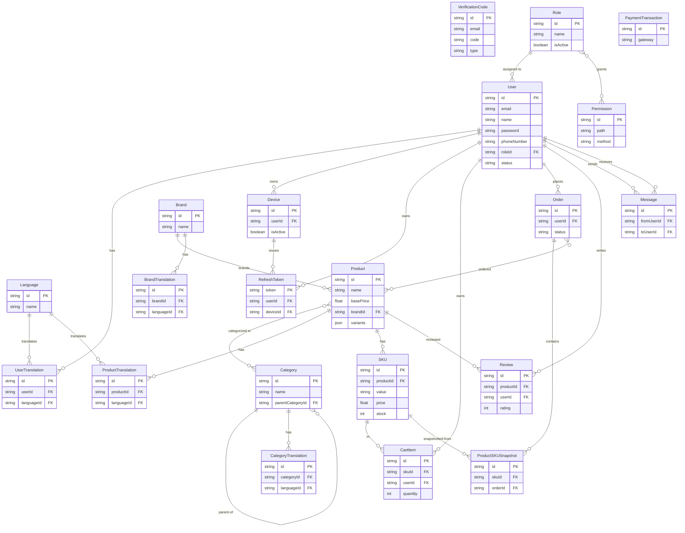

# Data Model

**Project**: ecom (NestJS + Prisma + PostgreSQL headless REST API)
**Generated**: 2026-09-12

## Schema Source

**Authoritative schema**: `prisma/schema.prisma` (563 lines, 21 models, 4 enums). Verified, not `[UNVERIFIED]`: `prisma/schema.development.prisma` is **0 bytes** (`wc -l` = 0) — an empty stub, carries no models. All `pnpm run prisma:*` scripts (`prisma migrate dev`, `prisma migrate deploy`, `prisma generate`) in `package.json:21-27` and `docker-entrypoint.sh:11` (`npx prisma migrate deploy`) invoke the Prisma CLI with no `--schema` override, which defaults to `prisma/schema.prisma`. `prisma:generate:env` (`package.json:25`) loads `.env.${APP_ENV:-development}` for DB connection vars only, not an alternate schema file. No script anywhere passes `schema.development.prisma`. Resolved: schema.development.prisma is dead/placeholder, `prisma/schema.prisma` is the single source of truth.

Datasource: `postgresql` via `env("DATABASE_URL")` (`prisma/schema.prisma:9-12`). Generators: `prisma-client-js`, `prisma-json-types-generator` (drives the `/// [Variants]` typed-JSON comment on `Product.variants`, `prisma/schema.prisma:238-239`).

**Two `Variant`/`VariantOption` models are commented out** (`prisma/schema.prisma:329-369`) — dead code, superseded by `Product.variants: Json` + flat `SKU`. Not modeled as entities below.

## Entity Relationship Diagram

---

## Entities

### MODEL001_Language

**Description**: A locale (e.g. `"en"`, `"vi"`) driving all `*Translation` rows. `id` is a natural-key `VarChar(10)`, not a UUID (`prisma/schema.prisma:15`, note in source: "example: en, vi, fr not UUID").

| Attribute | Type | Constraints | Description |
|-----------|------|-------------|--------------|
| id | String @db.VarChar(10) | PK | Locale code |
| name | String @db.VarChar(500) | NOT NULL | Display name |
| createdById / updatedById / deletedById | String? @db.Uuid | FK → User, nullable | Soft audit trail |
| deletedAt | DateTime? | nullable, indexed | Soft-delete marker |
| createdAt / updatedAt | DateTime | default now() / @updatedAt | Audit timestamps |

**Relationships**: One-to-Many with UserTranslation, ProductTranslation, CategoryTranslation, BrandTranslation (all via `languageId`). Self-referencing audit FKs to User (createdBy/updatedBy/deletedBy).

**Discriminator Fields**: None.

---

### MODEL002_User

**Description**: Account record for admin/client/seller actors (`prisma/schema.prisma:36-119`). Carries a self-referential audit chain (createdBy/updatedBy/deletedBy/createdUsers, etc.) plus 2FA (`totpSecret`) and every FK the platform audits.

| Attribute | Type | Constraints | Description |
|-----------|------|-------------|--------------|
| id | String @db.Uuid | PK, default uuid() | |
| email | String | UNIQUE (partial, `deletedAt IS NULL` — migration `20250525134757`) | |
| name | String @db.VarChar(500) | NOT NULL | |
| password | String @db.VarChar(500) | NOT NULL | Hashed |
| phoneNumber | String @db.VarChar(50) | NOT NULL | |
| avatar | String? @db.VarChar(1000) | nullable | |
| totpSecret | String? @db.VarChar(1000) | UNIQUE (migration `20250305160910`) | 2FA secret |
| status | UserStatus | default ACTIVE | See DISC-001 |
| roleId | String @db.Uuid | FK → Role, NOT NULL | |
| deletedAt | DateTime? | nullable, indexed | Soft-delete |
| createdAt / updatedAt | DateTime | | |

**Relationships**: Many-to-One with Role via `roleId`. One-to-Many with Device, RefreshToken, CartItem, Order, Review, Message (sent/received via `FromUser`/`ToUser` relations). Self-referential One-to-Many audit relations (createdBy/updatedBy/deletedBy → User) and content-audit relations to Permission/Role/Product/Category/SKU/Language/Brand/*Translation/Order (each entity's created/updated/deletedBy FK points back to User).

**Discriminator Fields**:

| Field | DISC-### | Values | Description |
|-------|----------|--------|--------------|
| status | DISC-001 | ACTIVE, INACTIVE, BLOCKED | Account access state — enum `UserStatus` (`prisma/schema.prisma:549-553`); business-level semantics live in `src/constants/user-status.constant.ts` |

---

### MODEL003_UserTranslation

**Description**: Per-language profile fields (address/description) for a User (`prisma/schema.prisma:121-142`).

| Attribute | Type | Constraints | Description |
|-----------|------|-------------|--------------|
| id | String @db.Uuid | PK | |
| userId | String @db.Uuid | FK → User (Cascade) | |
| languageId | String | FK → Language (Cascade) | |
| address | String? @db.VarChar(500) | nullable | |
| description | String? | nullable | |
| createdById/updatedById/deletedById | String? @db.Uuid | FK → User | |
| deletedAt | DateTime? | indexed | |

**Relationships**: Many-to-One with User (`userId`) and Language (`languageId`).

**Discriminator Fields**: None.

---

### MODEL004_VerificationCode

**Description**: One-time codes for register / forgot-password / login-2FA / disable-2FA flows (`prisma/schema.prisma:144-155`).

| Attribute | Type | Constraints | Description |
|-----------|------|-------------|--------------|
| id | String @db.Uuid | PK | |
| email | String @db.VarChar(500) | part of composite unique | |
| code | String @db.VarChar(50) | part of composite unique | |
| type | VerificationCodeType | part of composite unique | See DISC-002 |
| expiresAt | DateTime | indexed | |
| createdAt | DateTime | default now() | |

**Constraints**: `@@unique([email, code, type])` (migration `20250401155551`, superseding the earlier bare `email` unique from `20250305160910`).

**Relationships**: None (standalone lookup table, joined to User only by `email` at the query layer).

**Discriminator Fields**:

| Field | DISC-### | Values | Description |
|-------|----------|--------|--------------|
| type | DISC-002 | REGISTER, FORGOT_PASSWORD, LOGIN, DISABLE_2FA | Purpose of the code — enum `VerificationCodeType` (`prisma/schema.prisma:542-547`); mirrored in `src/constants/verification-code.constant.ts` |

---

### MODEL005_Device

**Description**: A logged-in device/session for a User (`prisma/schema.prisma:157-167`).

| Attribute | Type | Constraints | Description |
|-----------|------|-------------|--------------|
| id | String @db.Uuid | PK | |
| userId | String @db.Uuid | FK → User (Cascade) | |
| userAgent | String | NOT NULL | |
| ip | String | NOT NULL | |
| lastActive | DateTime | @updatedAt | Renamed semantically from a plain `updatedAt` |
| createdAt | DateTime | default now() | |
| isActive | Boolean | default true | See note below |

**Relationships**: Many-to-One with User. One-to-Many with RefreshToken.

**Discriminator Fields**: None. `isActive` is a 2-valued boolean gating login/logout session state, not a DISC per the strict rule (boolean-with-no-branching-values-table = business rule, documented here rather than tagged DISC): source comment "Trạng thái thiết bị (đang login hay đã logout)" (`prisma/schema.prisma:165`) — treat as a business rule in the owning feature spec, not a discriminator.

---

### MODEL006_RefreshToken

**Description**: Issued refresh token bound to a User+Device pair (`prisma/schema.prisma:169-180`).

| Attribute | Type | Constraints | Description |
|-----------|------|-------------|--------------|
| token | String @db.VarChar(1000) | PK (`@unique`, used as identifier) | |
| userId | String @db.Uuid | FK → User (Cascade) | |
| deviceId | String @db.Uuid | FK → Device (Cascade) | |
| expiresAt | DateTime | indexed | |
| createdAt | DateTime | default now() | |
| deletedAt | DateTime? | nullable | Soft-revoke (added migration `20250511100158`) |

**Relationships**: Many-to-One with User, Many-to-One with Device.

**Discriminator Fields**: None.

---

### MODEL007_Permission

**Description**: A route-level permission entry (path + HTTP method + module) assignable to Roles (`prisma/schema.prisma:182-203`).

| Attribute | Type | Constraints | Description |
|-----------|------|-------------|--------------|
| id | String @db.Uuid | PK | |
| name | String @db.VarChar(500) | NOT NULL | |
| description | String | default "" | |
| path | String @db.VarChar(1000) | part of partial unique | Route path |
| module | String @db.VarChar(500) | NOT NULL | Grouping label (added migration `20250506144938`) |
| method | HTTPMethod | part of partial unique | See DISC-003 |
| deletedAt | DateTime? | indexed | |

**Constraints**: `permission_path_method_unique` UNIQUE(`path`,`method`) WHERE `deletedAt IS NULL` (migration `20250413091436_partial_unique_index_permission_path_method`).

**Relationships**: Many-to-Many with Role (`roles`).

**Discriminator Fields**:

| Field | DISC-### | Values | Description |
|-------|----------|--------|--------------|
| method | DISC-003 | GET, POST, PUT, DELETE, PATCH, OPTIONS, HEAD | HTTP verb the permission gates — enum `HTTPMethod` (`prisma/schema.prisma:555-563`); mirrored in `src/constants/http-method.constant.ts` |

---

### MODEL008_Role

**Description**: RBAC role grouping Permissions and Users (`prisma/schema.prisma:205-225`).

| Attribute | Type | Constraints | Description |
|-----------|------|-------------|--------------|
| id | String @db.Uuid | PK | |
| name | String @db.VarChar(500) | UNIQUE (`Role_name_unique`, migration `20250418151212`) | |
| description | String | default "" | |
| isActive | Boolean | default true | Business-rule flag (2-valued, gates role usability at login) — not tagged DISC |
| deletedAt | DateTime? | indexed | |

**Relationships**: Many-to-Many with Permission. One-to-Many with User (assigned role).

**Discriminator Fields**: None. `src/constants/role.constant.ts` defines the seeded role *names* (`admin`, `client`, `seller`) as string constants — these are seed-data values on `Role.name` (a free-text column), not an enum field, so they do not qualify as DISC-### per the code-formats rule (unbounded string column). Document the 3 seeded roles as business context in the relevant feature spec instead.

---

### MODEL009_Product

**Description**: A sellable product; variant configuration lives in a typed-JSON column (legacy `Variant`/`VariantOption` relational models are commented out) (`prisma/schema.prisma:227-257`).

| Attribute | Type | Constraints | Description |
|-----------|------|-------------|--------------|
| id | String @db.Uuid | PK | |
| publishedAt | DateTime? | nullable | Renamed from `publishAt` in migration `20250710152419` |
| name | String @db.VarChar(500) | NOT NULL | |
| basePrice | Float | NOT NULL | |
| virtualPrice | Float | NOT NULL | Display/strike-through price |
| brandId | String @db.Uuid | FK → Brand, indexed | |
| images | String[] | | |
| variants | Json (`/// [Variants]` typed via prisma-json-types-generator) | NOT NULL | Structured variant/option config replacing the commented-out relational Variant model |
| createdById | String? @db.Uuid | FK → User (SetNull), indexed | Seller-scoped list queries filter on this column (F008) |
| deletedAt | DateTime? | indexed | |

**Relationships**: Many-to-One with Brand. Many-to-Many with Category. One-to-Many with SKU, Review, ProductTranslation. Many-to-Many with Order (`products`).

**Discriminator Fields**: None. `publishedAt` (nullable timestamp, not enum) drives published/unpublished visibility — a business rule for the owning feature spec, not a DISC.

---

### MODEL010_ProductTranslation

**Description**: Localized name/description for a Product (`prisma/schema.prisma:259-280`).

| Attribute | Type | Constraints | Description |
|-----------|------|-------------|--------------|
| id | String @db.Uuid | PK | |
| productId | String @db.Uuid | FK → Product (Cascade), part of partial unique | |
| languageId | String | FK → Language (Cascade), part of partial unique | |
| name | String @db.VarChar(500) | NOT NULL | |
| description | String | NOT NULL | |
| deletedAt | DateTime? | indexed | |

**Constraints**: `ProductTranslation_productId_languageId_unique` UNIQUE(`productId`,`languageId`) WHERE `deletedAt IS NULL` (migration `20250625154134`).

**Relationships**: Many-to-One with Product, Many-to-One with Language.

**Discriminator Fields**: None.

---

### MODEL011_Category

**Description**: Hierarchical product category (self-referential parent/children) (`prisma/schema.prisma:282-304`).

| Attribute | Type | Constraints | Description |
|-----------|------|-------------|--------------|
| id | String @db.Uuid | PK | |
| name | String @db.VarChar(500) | NOT NULL | |
| logo | String? | nullable | |
| parentCategoryId | String? @db.Uuid | FK → Category (self, SetNull) | |
| deletedAt | DateTime? | indexed | |

**Relationships**: Many-to-Many with Product. Self-referential One-to-Many (`parentCategory` / `childrenCategories`). One-to-Many with CategoryTranslation.

**Discriminator Fields**: None.

---

### MODEL012_CategoryTranslation

**Description**: Localized name/description for a Category (`prisma/schema.prisma:306-327`).

| Attribute | Type | Constraints | Description |
|-----------|------|-------------|--------------|
| id | String @db.Uuid | PK | |
| categoryId | String @db.Uuid | FK → Category (Cascade), part of partial unique | |
| languageId | String | FK → Language (Cascade), part of partial unique | |
| name | String @db.VarChar(500) | NOT NULL | |
| description | String | NOT NULL | |
| deletedAt | DateTime? | indexed | |

**Constraints**: `CategoryTranslation_languageId_categoryId_unique` UNIQUE(`categoryId`,`languageId`) WHERE `deletedAt IS NULL` (migration `20250622070346`).

**Relationships**: Many-to-One with Category, Many-to-One with Language.

**Discriminator Fields**: None.

---

### MODEL013_SKU

**Description**: A purchasable stock-keeping unit under a Product, replacing the commented-out `VariantOption`-driven SKU model (`prisma/schema.prisma:371-396`).

| Attribute | Type | Constraints | Description |
|-----------|------|-------------|--------------|
| id | String @db.Uuid | PK | |
| order | Int | default 0 | Display ordering |
| value | String @db.VarChar(500) | part of partial unique | Variant-combination label |
| price | Float | NOT NULL | |
| stock | Int | NOT NULL | |
| image | String | NOT NULL | |
| productId | String @db.Uuid | FK → Product (Cascade), part of partial unique | |
| deletedAt | DateTime? | indexed | |

**Constraints**: `SKU_productId_value_unique` UNIQUE(`productId`,`value`) WHERE `deletedAt IS NULL` (migration `20250625154134`).

**Relationships**: Many-to-One with Product. One-to-Many with CartItem, ProductSKUSnapshot.

**Discriminator Fields**: None.

---

### MODEL014_Brand

**Description**: Product brand/manufacturer (`prisma/schema.prisma:398-417`).

| Attribute | Type | Constraints | Description |
|-----------|------|-------------|--------------|
| id | String @db.Uuid | PK | |
| logo | String @db.VarChar(1000) | NOT NULL | |
| name | String @db.VarChar(500) | NOT NULL | |
| deletedAt | DateTime? | indexed | |

**Relationships**: One-to-Many with Product, BrandTranslation.

**Discriminator Fields**: None.

---

### MODEL015_BrandTranslation

**Description**: Localized name/description for a Brand (`prisma/schema.prisma:419-440`).

| Attribute | Type | Constraints | Description |
|-----------|------|-------------|--------------|
| id | String @db.Uuid | PK | |
| brandId | String @db.Uuid | FK → Brand (Cascade), part of partial unique | |
| languageId | String | FK → Language (Cascade), part of partial unique | |
| name | String @db.VarChar(500) | NOT NULL | |
| description | String | NOT NULL | |
| deletedAt | DateTime? | indexed | |

**Constraints**: `BrandTranslation_languageId_brandId_unique` UNIQUE(`languageId`,`brandId`) WHERE `deletedAt IS NULL` (migration `20250608153843`).

**Relationships**: Many-to-One with Brand, Many-to-One with Language.

**Discriminator Fields**: None.

---

### MODEL016_CartItem

**Description**: A line item in a User's shopping cart (`prisma/schema.prisma:442-454`). No soft-delete (hard removal on cart update). As of the F011 Shopping Cart feature (2026-09-12), this model is wired to live endpoints — `CartController`/`CartService`/`CartRepository` (`src/routes/cart/`, `src/repositories/cart/cart.repository.ts`).

| Attribute | Type | Constraints | Description |
|-----------|------|-------------|--------------|
| id | String @db.Uuid | PK | |
| quantity | Int | NOT NULL | Bounded 1..SKU.stock at write time (BR-C03), not by a DB check constraint |
| skuId | String @db.Uuid | FK → SKU | |
| userId | String @db.Uuid | FK → User (Cascade) | |
| createdAt / updatedAt | DateTime | | |

**Constraints**: `@@unique([userId, skuId])` (migration `20260912140523_add_cart_item_user_sku_unique`) — one cart line per (user, SKU) pair; enforces BR-C04 (one line per SKU) at the DB level so a concurrent double-add cannot split the line into two rows.

**Relationships**: Many-to-One with SKU, Many-to-One with User.

**Discriminator Fields**: None.

---

### MODEL017_ProductSKUSnapshot

**Description**: Immutable point-in-time copy of a SKU's product/price/image data captured onto an Order line item, so historical orders survive SKU edits/deletion (`prisma/schema.prisma:456-469`). As of F012 Order Placement & Fulfilment (2026-09-12), one row is created per order line at checkout (`OrderCheckoutRepository.checkout`, `src/repositories/order/order-checkout.repository.ts:122-131`) and read back by `OrderCancelRepository`/`ManageOrderService` to restore stock on cancellation.

| Attribute | Type | Constraints | Description |
|-----------|------|-------------|--------------|
| id | String @db.Uuid | PK | |
| productName | String @db.VarChar(500) | NOT NULL | Copied at order time |
| price | Float | NOT NULL | Copied at order time |
| images | String[] | | Copied at order time |
| skuValue | String @db.VarChar(500) | NOT NULL | Copied at order time |
| quantity | Int | NOT NULL | Added by migration `20260912140558_add_snapshot_quantity` — quantity purchased on this line, one snapshot row per order line (not one row per unit); read by `OrderCancelRepository.cancelOrder` (`src/repositories/order/order-cancel.repository.ts:57-71`) to restore exactly the stock a cancelled order took |
| skuId | String? @db.Uuid | FK → SKU, SetNull | Nullable — survives SKU deletion |
| orderId | String? @db.Uuid | FK → Order, SetNull | Nullable |
| createdAt | DateTime | default now() | |

**Relationships**: Many-to-One with SKU (nullable), Many-to-One with Order (nullable, `items`).

**Discriminator Fields**: None.

---

### MODEL018_Order

**Description**: A placed order with a lifecycle status (`prisma/schema.prisma:471-493`). As of F012 Order Placement & Fulfilment (2026-09-12), wired to live endpoints: buyer checkout/list/detail/cancel on `OrderController` (`src/routes/order/`) and seller/admin status progression on `ManageOrderController` (`src/routes/order/manage-order/`).

| Attribute | Type | Constraints | Description |
|-----------|------|-------------|--------------|
| id | String @db.Uuid | PK | |
| userId | String @db.Uuid | FK → User, indexed (`[userId, deletedAt]`) | The buyer who placed the order |
| status | OrderStatus | indexed (`[deletedAt, status]`) | See DISC-004 |
| deletedAt | DateTime? | indexed | |
| createdAt / updatedAt | DateTime | | |

**Constraints**: `@@index([userId, deletedAt])` (migration `20260912153038_add_order_user_id_index`) — added post-review (reviewer finding H1) to support the buyer's own-order list/detail queries (`OrderRepository.findManyOrders`/`findUniqueOrder`, `src/repositories/order/order.repository.ts:18-34,58-74`), which always filter by `userId` + `deletedAt: null`.

**Relationships**: Many-to-One with User. One-to-Many with ProductSKUSnapshot (`items`). Many-to-Many with Product (`products`) — populated at checkout (`OrderCheckoutRepository.checkout`, `src/repositories/order/order-checkout.repository.ts:127`) so `ManageOrderService.buildActorScope`'s seller visibility (BR-O06) and `ReviewRepository.findDeliveredOrderForProduct`'s purchase-verification check (BR-R01) both have an indexed join instead of walking the nullable `ProductSKUSnapshot.skuId`.

**Discriminator Fields**:

| Field | DISC-### | Values | Description |
|-------|----------|--------|--------------|
| status | DISC-004 | PENDING_CONFIRMATION, PENDING_PICKUP, PENDING_DELIVERY, DELIVERED, RETURNED, CANCELLED | Order fulfillment lifecycle state — enum `OrderStatus` (`prisma/schema.prisma:533-540`) |

---

### MODEL019_Review

**Description**: A User's rating/comment on a Product (`prisma/schema.prisma:495-508`). No soft-delete. As of F013 Product Reviews (2026-09-12), wired to live endpoints — `ReviewController`/`ReviewService`/`ReviewRepository` (`src/routes/review/`, `src/repositories/review/review.repository.ts`). Rating range (1–5) and non-empty content are enforced at the DTO layer (`CreateReviewRequestDto`, `src/dtos/review/review.dto.ts:94-109`), not by a DB `@@check` — the schema's `Int` column still has no enforced range, confirming the earlier `[UNVERIFIED]` flag below.

| Attribute | Type | Constraints | Description |
|-----------|------|-------------|--------------|
| id | String @db.Uuid | PK | |
| content | String | NOT NULL | |
| rating | Int | NOT NULL | Numeric score; DTO-validated 1–5 (`@Min(1)`/`@Max(5)`), no DB-level range constraint |
| productId | String @db.Uuid | FK → Product | |
| userId | String @db.Uuid | FK → User | |
| createdAt / updatedAt | DateTime | | |

**Constraints**: `@@unique([userId, productId])` (migration `20260912140540_add_review_user_product_unique`) — one review per (user, product) pair (BR-R02); a duplicate insert throws Prisma's unique-violation error, remapped by `ReviewRepository.createReview` to HTTP 409 (`src/repositories/review/review.repository.ts:113-125`).

**Relationships**: Many-to-One with Product, Many-to-One with User.

**Discriminator Fields**: None.

---

### MODEL020_PaymentTransaction

**Description**: A raw bank/gateway transaction record (webhook-ingested payment ledger row), standalone — no FK to Order/User in schema (`prisma/schema.prisma:504-519`).

| Attribute | Type | Constraints | Description |
|-----------|------|-------------|--------------|
| id | String @db.Uuid | PK | |
| gateway | String @db.VarChar(100) | NOT NULL | |
| transactionDate | DateTime | default now() | |
| accountNumber | String @db.VarChar(100) | NOT NULL | |
| subAccount | String? @db.VarChar(250) | nullable | |
| amountIn / amountOut / accumulated | Int | default 0 | |
| code | String? @db.VarChar(250) | nullable | |
| transactionContent | String? @db.Text | nullable | |
| referenceNumber | String? @db.VarChar(255) | nullable | |
| body | String? @db.Text | nullable | Raw payload |
| createdAt | DateTime | default now() | |

**Relationships**: None modeled in schema (no FK to Order/User — reconciliation, if any, happens by matching `code`/`referenceNumber` at the application layer; `[UNVERIFIED]` whether any code path performs this join — no repository file for this model exists in `src/repositories/`).

**Discriminator Fields**: None.

---

### MODEL021_Message

**Description**: A direct message between two Users (`prisma/schema.prisma:521-531`).

| Attribute | Type | Constraints | Description |
|-----------|------|-------------|--------------|
| id | String @db.Uuid | PK | |
| fromUserId | String @db.Uuid | FK → User (Cascade), relation `FromUser` | |
| toUserId | String @db.Uuid | FK → User (Cascade), relation `ToUser` | |
| content | String | NOT NULL | |
| readAt | DateTime? | nullable | Read-receipt timestamp |
| createdAt | DateTime | default now() | |

**Relationships**: Many-to-One with User (sender), Many-to-One with User (recipient).

**Discriminator Fields**: None. `readAt` is a nullable timestamp (read/unread), not an enum — business rule, not DISC.

---

## Validation Rules

Validation is enforced primarily at the DTO layer (`class-validator` decorators in `src/dtos/**`), not the DB layer, except where noted (DB constraints listed per-entity above).

### User / Auth (`src/dtos/user/user.dto.ts`, `src/dtos/auth/*.dto.ts`)

| Rule | Field | Constraint | Error Message source |
|------|-------|------------|----------------------|
| Valid email | email | `@IsEmail` | class-validator default / `src/constants/error-message.constant.ts` |
| Password match | password/confirmPassword | `IsPasswordMatch` custom decorator (`src/validations/decorators/is-password-match.decorator.ts`) | custom |
| Unique email | email | DB partial unique (`deletedAt IS NULL`) + Prisma exception filter (`src/shared/filters/prisma-exception.filter.ts`) | i18n message |

### Product (`src/dtos/product/product.dto.ts`, `product.validation.ts`)

| Rule | Field | Constraint | Error Message |
|------|-------|------------|----------------|
| Array bounds | brandIds/categoryIds | `@IsArray`, `@IsUUID("4", {each:true})` | "Each ... must be a valid UUID." |
| Search length | name | `@Length(1,255)` | "Search term must be between 1 and 255 characters." |
| Non-negative price | minPrice/maxPrice | `@Min(0)` | "Minimum price must be a non-negative number." |
| Unique SKU set | skus | `IsUniqueVariant`, `IsValidSKUs` custom decorators (`product.validation.ts`) | custom |
| Unique string array | images/tags-like arrays | `IsUniqueStringArray` (`src/validations/decorators/is-unique-string-array.ts`) | custom |

### Cross-entity validation decorators (`src/validations/decorators/`)

| Rule | Decorator | Purpose |
|------|-----------|---------|
| Exactly-one-of-two present | `is-only-one-exists.ts` | e.g. mutually exclusive optional fields |
| Both-or-neither present | `is-both-or-none-exist.ts` | paired optional fields |

---

## Summary

- **Total Entities**: 21 (`Language, User, UserTranslation, VerificationCode, Device, RefreshToken, Permission, Role, Product, ProductTranslation, Category, CategoryTranslation, SKU, Brand, BrandTranslation, CartItem, ProductSKUSnapshot, Order, Review, PaymentTransaction, Message`) — unchanged; F011/F012/F013 (2026-09-12) exposed `CartItem`, `Order`+`ProductSKUSnapshot`, and `Review` through live endpoints for the first time but added no new Prisma models.
- **Total Enums**: 4 (`OrderStatus, VerificationCodeType, UserStatus, HTTPMethod`)
- **Total Discriminators (DISC-###)**: 4 (`DISC-001` User.status, `DISC-002` VerificationCode.type, `DISC-003` Permission.method, `DISC-004` Order.status)
- **Total Relationships**: 25 (see ERD)
- **New constraints (2026-09-12, F011/F012/F013)**: `CartItem.@@unique([userId, skuId])`, `Review.@@unique([userId, productId])`, `Order.@@index([userId, deletedAt])`, `ProductSKUSnapshot.quantity` (new column) — see MODEL016/MODEL017/MODEL018/MODEL019 above for detail.
- **New indexes (2026-09-12, Product query optimization)**: `Product.@@index([brandId])`, `Product.@@index([createdById])` — added alongside the existing `Product.@@index([deletedAt])`, for the seller-scoped list query in F008 (`ManageProductService.getProducts` filters by `createdById`) and the public/detail brand join in F007. No new columns or models; see MODEL009_Product above.
- **Dead code excluded**: `Variant`, `VariantOption` (commented out, `prisma/schema.prisma:329-369`); `prisma/schema.development.prisma` (0 bytes, unused)
- **Audit pattern**: 15 of 21 models carry `createdById/updatedById/deletedById → User` (SetNull) + `deletedAt` soft-delete + `createdAt/updatedAt`. Exceptions with no soft-delete: `VerificationCode, Device, RefreshToken` (hard/expiry-based, though RefreshToken added a `deletedAt` in migration `20250511100158`), `CartItem, ProductSKUSnapshot, Review, PaymentTransaction, Message`.

## Unresolved

- `[UNVERIFIED]` PaymentTransaction has no FK to Order/User and no repository file — reconciliation logic (if any) was not located in `src/repositories/**` or `src/routes/**`; downstream feature-spec research should grep `src/` for `PaymentTransaction` usage directly (`prisma.paymentTransaction`) to confirm whether it is dead/webhook-only.
- Rating bounds on `Review.rating` (e.g. 1–5) are not enforced in the Prisma schema (`Int`, no `@@check`); not found in this pass's DTO sample — feature-spec researcher for the Review feature should confirm via `src/dtos/**` (no `review.dto.ts` was seen in the scout inventory, suggesting Review may lack a dedicated DTO/route — flag for FS research).
