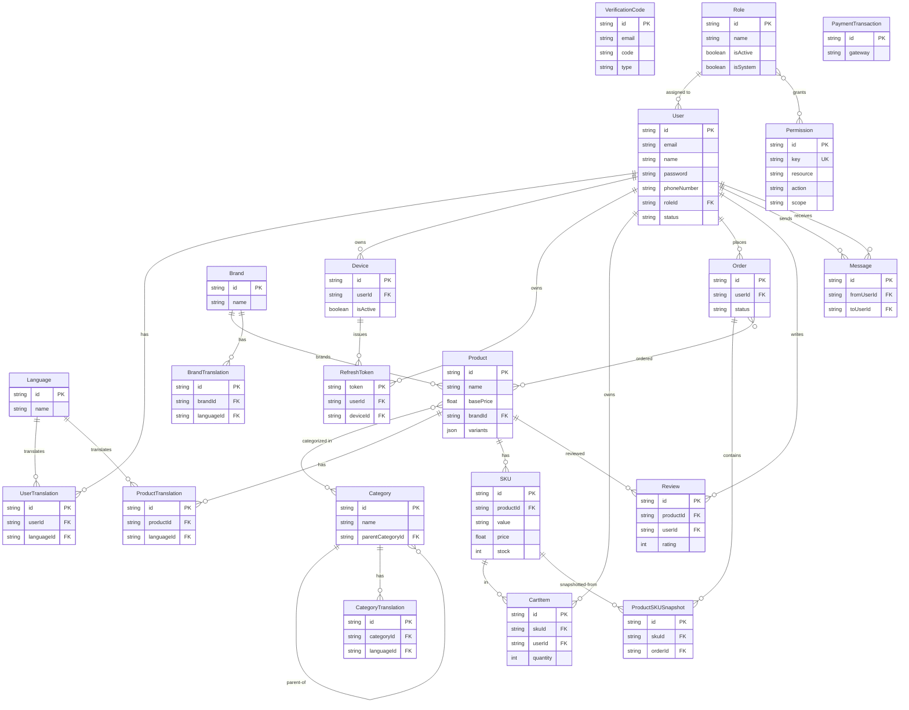

# Data Model

**Dự án**: ecom (NestJS + Prisma + PostgreSQL headless REST API)
**Ngày tạo**: 2026-09-12

## Nguồn Schema

**Schema chuẩn**: `prisma/schema.prisma` (563 dòng, 21 model, 4 enum). Đã xác minh, không phải `[UNVERIFIED]`: `prisma/schema.development.prisma` **0 byte** (`wc -l` = 0) — một file stub rỗng, không chứa model nào. Tất cả script `pnpm run prisma:*` (`prisma migrate dev`, `prisma migrate deploy`, `prisma generate`) trong `package.json:21-27` và `docker-entrypoint.sh:11` (`npx prisma migrate deploy`) gọi Prisma CLI mà không có cờ `--schema`, nên mặc định dùng `prisma/schema.prisma`. `prisma:generate:env` (`package.json:25`) chỉ load `.env.${APP_ENV:-development}` để lấy biến kết nối DB, không phải để đổi schema file. Không có script nào truyền `schema.development.prisma`. Kết luận: schema.development.prisma là file chết/placeholder, `prisma/schema.prisma` mới là nguồn chuẩn duy nhất.

Datasource: `postgresql` qua `env("DATABASE_URL")` (`prisma/schema.prisma:9-12`). Generators: `prisma-client-js`, `prisma-json-types-generator` (sinh ra comment typed-JSON `/// [Variants]` trên `Product.variants`, `prisma/schema.prisma:238-239`).

**Hai model `Variant`/`VariantOption` đã bị comment out** (`prisma/schema.prisma:329-369`) — code chết, đã bị thay thế bởi `Product.variants: Json` + `SKU` phẳng. Không được model hóa thành entity bên dưới.

## Sơ đồ quan hệ thực thể (ERD)

---

## Entities

### MODEL001_Language

**Mô tả**: Một locale (ví dụ `"en"`, `"vi"`) chi phối mọi dòng `*Translation`. `id` là natural-key `VarChar(10)`, không phải UUID (`prisma/schema.prisma:15`, comment trong source: "example: en, vi, fr not UUID").

| Thuộc tính | Kiểu | Ràng buộc | Mô tả |
|-----------|------|-------------|--------------|
| id | String @db.VarChar(10) | PK | Mã locale |
| name | String @db.VarChar(500) | NOT NULL | Tên hiển thị |
| createdById / updatedById / deletedById | String? @db.Uuid | FK → User, nullable | Audit trail mềm |
| deletedAt | DateTime? | nullable, có index | Đánh dấu soft-delete |
| createdAt / updatedAt | DateTime | default now() / @updatedAt | Timestamp audit |

**Quan hệ**: One-to-Many với UserTranslation, ProductTranslation, CategoryTranslation, BrandTranslation (đều qua `languageId`). FK audit tự tham chiếu tới User (createdBy/updatedBy/deletedBy).

**Trường phân loại (Discriminator)**: Không có.

---

### MODEL002_User

**Mô tả**: Bản ghi tài khoản cho các tác nhân admin/client/seller (`prisma/schema.prisma:36-119`). Có chuỗi audit tự tham chiếu (createdBy/updatedBy/deletedBy/createdUsers, v.v.) cộng thêm 2FA (`totpSecret`) và mọi FK mà nền tảng audit.

| Thuộc tính | Kiểu | Ràng buộc | Mô tả |
|-----------|------|-------------|--------------|
| id | String @db.Uuid | PK, default uuid() | |
| email | String | UNIQUE (partial, `deletedAt IS NULL` — migration `20250525134757`) | |
| name | String @db.VarChar(500) | NOT NULL | |
| password | String @db.VarChar(500) | NOT NULL | Đã hash |
| phoneNumber | String @db.VarChar(50) | NOT NULL | |
| avatar | String? @db.VarChar(1000) | nullable | |
| totpSecret | String? @db.VarChar(1000) | UNIQUE (migration `20250305160910`) | Secret 2FA |
| status | UserStatus | default ACTIVE | Xem DISC-001 |
| roleId | String @db.Uuid | FK → Role, NOT NULL | |
| deletedAt | DateTime? | nullable, có index | Soft-delete |
| createdAt / updatedAt | DateTime | | |

**Quan hệ**: Many-to-One với Role qua `roleId`. One-to-Many với Device, RefreshToken, CartItem, Order, Review, Message (gửi/nhận qua quan hệ `FromUser`/`ToUser`). Quan hệ audit tự tham chiếu One-to-Many (createdBy/updatedBy/deletedBy → User) và các quan hệ audit nội dung tới Permission/Role/Product/Category/SKU/Language/Brand/*Translation/Order (FK created/updated/deletedBy của mỗi entity trỏ ngược về User).

**Trường phân loại (Discriminator)**:

| Trường | DISC-### | Giá trị | Mô tả |
|-------|----------|--------|--------------|
| status | DISC-001 | ACTIVE, INACTIVE, BLOCKED | Trạng thái truy cập tài khoản — enum `UserStatus` (`prisma/schema.prisma:549-553`); ngữ nghĩa ở tầng nghiệp vụ nằm trong `src/constants/user-status.constant.ts` |

---

### MODEL003_UserTranslation

**Mô tả**: Các trường profile theo từng ngôn ngữ (address/description) của một User (`prisma/schema.prisma:121-142`).

| Thuộc tính | Kiểu | Ràng buộc | Mô tả |
|-----------|------|-------------|--------------|
| id | String @db.Uuid | PK | |
| userId | String @db.Uuid | FK → User (Cascade) | |
| languageId | String | FK → Language (Cascade) | |
| address | String? @db.VarChar(500) | nullable | |
| description | String? | nullable | |
| createdById/updatedById/deletedById | String? @db.Uuid | FK → User | |
| deletedAt | DateTime? | có index | |

**Quan hệ**: Many-to-One với User (`userId`) và Language (`languageId`).

**Trường phân loại (Discriminator)**: Không có.

---

### MODEL004_VerificationCode

**Mô tả**: Mã dùng một lần cho các luồng đăng ký / quên mật khẩu / login-2FA / tắt-2FA (`prisma/schema.prisma:144-155`).

| Thuộc tính | Kiểu | Ràng buộc | Mô tả |
|-----------|------|-------------|--------------|
| id | String @db.Uuid | PK | |
| email | String @db.VarChar(500) | thuộc unique tổ hợp | |
| code | String @db.VarChar(50) | thuộc unique tổ hợp | |
| type | VerificationCodeType | thuộc unique tổ hợp | Xem DISC-002 |
| expiresAt | DateTime | có index | |
| createdAt | DateTime | default now() | |

**Ràng buộc**: `@@unique([email, code, type])` (migration `20250401155551`, thay thế unique đơn `email` trước đó từ `20250305160910`).

**Quan hệ**: Không có (bảng tra cứu độc lập, chỉ join với User theo `email` ở tầng query).

**Trường phân loại (Discriminator)**:

| Trường | DISC-### | Giá trị | Mô tả |
|-------|----------|--------|--------------|
| type | DISC-002 | REGISTER, FORGOT_PASSWORD, LOGIN, DISABLE_2FA | Mục đích của mã — enum `VerificationCodeType` (`prisma/schema.prisma:542-547`); được phản chiếu trong `src/constants/verification-code.constant.ts` |

---

### MODEL005_Device

**Mô tả**: Một thiết bị/phiên đăng nhập của một User (`prisma/schema.prisma:157-167`).

| Thuộc tính | Kiểu | Ràng buộc | Mô tả |
|-----------|------|-------------|--------------|
| id | String @db.Uuid | PK | |
| userId | String @db.Uuid | FK → User (Cascade) | |
| userAgent | String | NOT NULL | |
| ip | String | NOT NULL | |
| lastActive | DateTime | @updatedAt | Đổi tên theo ngữ nghĩa từ `updatedAt` thuần |
| createdAt | DateTime | default now() | |
| isActive | Boolean | default true | Xem ghi chú bên dưới |

**Quan hệ**: Many-to-One với User. One-to-Many với RefreshToken.

**Trường phân loại (Discriminator)**: Không có. `isActive` là boolean 2 giá trị chỉ trạng thái phiên login/logout, không phải DISC theo quy tắc chặt (boolean không có bảng giá trị phân nhánh = quy tắc nghiệp vụ, ghi ở đây thay vì gắn tag DISC): comment trong source "Trạng thái thiết bị (đang login hay đã logout)" (`prisma/schema.prisma:165`) — coi là quy tắc nghiệp vụ trong feature spec sở hữu, không phải discriminator.

---

### MODEL006_RefreshToken

**Mô tả**: Refresh token đã cấp, gắn với một cặp User+Device (`prisma/schema.prisma:169-180`).

| Thuộc tính | Kiểu | Ràng buộc | Mô tả |
|-----------|------|-------------|--------------|
| token | String @db.VarChar(1000) | PK (`@unique`, dùng làm identifier) | |
| userId | String @db.Uuid | FK → User (Cascade) | |
| deviceId | String @db.Uuid | FK → Device (Cascade) | |
| expiresAt | DateTime | có index | |
| createdAt | DateTime | default now() | |
| deletedAt | DateTime? | nullable | Soft-revoke (thêm ở migration `20250511100158`) |

**Quan hệ**: Many-to-One với User, Many-to-One với Device.

**Trường phân loại (Discriminator)**: Không có.

---

### MODEL007_Permission

**Mô tả**: Một mục quyền có thể gán cho Role, được xác định bởi khóa ngữ nghĩa `resource:action:scope` (ví dụ `product:update:own`). **Đã tái cấu trúc ngày 2026-09-21**: các cột cấp route trước đây `name`/`path`/`method`/`module` đã bị bỏ; khóa quyền được khai báo trên handler bằng `@RequirePermission` và đồng bộ vào bảng này. Xem `docs/authorization-guide.md`.

| Thuộc tính | Kiểu | Ràng buộc | Mô tả |
|-----------|------|-------------|--------------|
| id | String @db.Uuid | PK | |
| key | String @db.VarChar(200) | UNIQUE | `resource:action:scope`, ví dụ `product:update:own` |
| resource | String @db.VarChar(100) | NOT NULL | Khả năng nghiệp vụ, không phải tên bảng |
| action | String @db.VarChar(50) | NOT NULL | create / read / update / delete / cancel / upload / revoke |
| scope | String @db.VarChar(10) | NOT NULL | `own` = chỉ bản ghi của người gọi, `any` = không giới hạn |
| description | String | default "" | |
| deletedAt | DateTime? | có index | Bị gỡ khi không handler nào khai báo khóa này nữa |

**Ràng buộc**: `Permission_key_key` UNIQUE(`key`); index trên (`resource`,`action`) (migration `20260921001535_permission_semantic_keys_and_system_roles`). Unique bộ phận trước đây trên (`path`,`method`) đã bị bỏ cùng các cột đó.

**Quan hệ**: Many-to-Many với Role (`roles`).

**Trường phân loại (Discriminator)**:

| Trường | DISC-### | Giá trị | Mô tả |
|-------|----------|--------|--------------|
| method | DISC-003 | GET, POST, PUT, DELETE, PATCH, OPTIONS, HEAD | HTTP verb mà permission chặn — enum `HTTPMethod` (`prisma/schema.prisma:555-563`); phản chiếu trong `src/constants/http-method.constant.ts` |

---

### MODEL008_Role

**Mô tả**: Vai trò RBAC nhóm các Permission và User (`prisma/schema.prisma:205-225`).

| Thuộc tính | Kiểu | Ràng buộc | Mô tả |
|-----------|------|-------------|--------------|
| id | String @db.Uuid | PK | |
| name | String @db.VarChar(500) | UNIQUE (`Role_name_unique`, migration `20250418151212`) | |
| description | String | default "" | |
| isActive | Boolean | default true | Cờ quy tắc nghiệp vụ (2 giá trị, chặn khả năng dùng role khi login) — không gắn tag DISC |
| deletedAt | DateTime? | có index | |

**Quan hệ**: Many-to-Many với Permission. One-to-Many với User (role được gán).

**Trường phân loại (Discriminator)**: Không có. `src/constants/role.constant.ts` định nghĩa các *tên* role đã seed (`admin`, `client`, `seller`) dưới dạng hằng chuỗi — đây là các giá trị dữ liệu seed trên `Role.name` (một cột free-text), không phải trường enum, nên không đủ điều kiện là DISC-### theo quy tắc code-formats (cột chuỗi không giới hạn). Nên ghi 3 role đã seed như ngữ cảnh nghiệp vụ trong feature spec liên quan thay vì ở đây.

---

### MODEL009_Product

**Mô tả**: Một sản phẩm có thể bán; cấu hình variant nằm trong một cột JSON có kiểu (các model quan hệ cũ `Variant`/`VariantOption` đã bị comment out) (`prisma/schema.prisma:227-257`).

| Thuộc tính | Kiểu | Ràng buộc | Mô tả |
|-----------|------|-------------|--------------|
| id | String @db.Uuid | PK | |
| publishedAt | DateTime? | nullable | Đổi tên từ `publishAt` ở migration `20250710152419` |
| name | String @db.VarChar(500) | NOT NULL | |
| basePrice | Float | NOT NULL | |
| virtualPrice | Float | NOT NULL | Giá hiển thị/giá gạch ngang |
| brandId | String @db.Uuid | FK → Brand, có index | |
| images | String[] | | |
| variants | Json (`/// [Variants]` được typed qua prisma-json-types-generator) | NOT NULL | Cấu hình variant/option có cấu trúc thay thế model Variant quan hệ đã bị comment out |
| createdById | String? @db.Uuid | FK → User (SetNull), có index | Các query danh sách theo phạm vi seller lọc theo cột này (F008) |
| deletedAt | DateTime? | có index | |

**Quan hệ**: Many-to-One với Brand. Many-to-Many với Category. One-to-Many với SKU, Review, ProductTranslation. Many-to-Many với Order (`products`).

**Trường phân loại (Discriminator)**: Không có. `publishedAt` (timestamp nullable, không phải enum) chi phối trạng thái hiển thị published/unpublished — một quy tắc nghiệp vụ cho feature spec sở hữu, không phải DISC.

---

### MODEL010_ProductTranslation

**Mô tả**: Tên/mô tả bản địa hóa cho một Product (`prisma/schema.prisma:259-280`).

| Thuộc tính | Kiểu | Ràng buộc | Mô tả |
|-----------|------|-------------|--------------|
| id | String @db.Uuid | PK | |
| productId | String @db.Uuid | FK → Product (Cascade), thuộc unique bộ phận | |
| languageId | String | FK → Language (Cascade), thuộc unique bộ phận | |
| name | String @db.VarChar(500) | NOT NULL | |
| description | String | NOT NULL | |
| deletedAt | DateTime? | có index | |

**Ràng buộc**: `ProductTranslation_productId_languageId_unique` UNIQUE(`productId`,`languageId`) WHERE `deletedAt IS NULL` (migration `20250625154134`).

**Quan hệ**: Many-to-One với Product, Many-to-One với Language.

**Trường phân loại (Discriminator)**: Không có.

---

### MODEL011_Category

**Mô tả**: Danh mục sản phẩm phân cấp (parent/children tự tham chiếu) (`prisma/schema.prisma:282-304`).

| Thuộc tính | Kiểu | Ràng buộc | Mô tả |
|-----------|------|-------------|--------------|
| id | String @db.Uuid | PK | |
| name | String @db.VarChar(500) | NOT NULL | |
| logo | String? | nullable | |
| parentCategoryId | String? @db.Uuid | FK → Category (self, SetNull) | |
| deletedAt | DateTime? | có index | |

**Quan hệ**: Many-to-Many với Product. One-to-Many tự tham chiếu (`parentCategory` / `childrenCategories`). One-to-Many với CategoryTranslation.

**Trường phân loại (Discriminator)**: Không có.

---

### MODEL012_CategoryTranslation

**Mô tả**: Tên/mô tả bản địa hóa cho một Category (`prisma/schema.prisma:306-327`).

| Thuộc tính | Kiểu | Ràng buộc | Mô tả |
|-----------|------|-------------|--------------|
| id | String @db.Uuid | PK | |
| categoryId | String @db.Uuid | FK → Category (Cascade), thuộc unique bộ phận | |
| languageId | String | FK → Language (Cascade), thuộc unique bộ phận | |
| name | String @db.VarChar(500) | NOT NULL | |
| description | String | NOT NULL | |
| deletedAt | DateTime? | có index | |

**Ràng buộc**: `CategoryTranslation_languageId_categoryId_unique` UNIQUE(`categoryId`,`languageId`) WHERE `deletedAt IS NULL` (migration `20250622070346`).

**Quan hệ**: Many-to-One với Category, Many-to-One với Language.

**Trường phân loại (Discriminator)**: Không có.

---

### MODEL013_SKU

**Mô tả**: Một đơn vị lưu kho có thể mua dưới một Product, thay thế model SKU cũ dựa trên `VariantOption` đã bị comment out (`prisma/schema.prisma:371-396`).

| Thuộc tính | Kiểu | Ràng buộc | Mô tả |
|-----------|------|-------------|--------------|
| id | String @db.Uuid | PK | |
| order | Int | default 0 | Thứ tự hiển thị |
| value | String @db.VarChar(500) | thuộc unique bộ phận | Nhãn tổ hợp variant |
| price | Float | NOT NULL | |
| stock | Int | NOT NULL | |
| image | String | NOT NULL | |
| productId | String @db.Uuid | FK → Product (Cascade), thuộc unique bộ phận | |
| deletedAt | DateTime? | có index | |

**Ràng buộc**: `SKU_productId_value_unique` UNIQUE(`productId`,`value`) WHERE `deletedAt IS NULL` (migration `20250625154134`).

**Quan hệ**: Many-to-One với Product. One-to-Many với CartItem, ProductSKUSnapshot.

**Trường phân loại (Discriminator)**: Không có.

---

### MODEL014_Brand

**Mô tả**: Nhãn hiệu/nhà sản xuất sản phẩm (`prisma/schema.prisma:398-417`).

| Thuộc tính | Kiểu | Ràng buộc | Mô tả |
|-----------|------|-------------|--------------|
| id | String @db.Uuid | PK | |
| logo | String @db.VarChar(1000) | NOT NULL | |
| name | String @db.VarChar(500) | NOT NULL | |
| deletedAt | DateTime? | có index | |

**Quan hệ**: One-to-Many với Product, BrandTranslation.

**Trường phân loại (Discriminator)**: Không có.

---

### MODEL015_BrandTranslation

**Mô tả**: Tên/mô tả bản địa hóa cho một Brand (`prisma/schema.prisma:419-440`).

| Thuộc tính | Kiểu | Ràng buộc | Mô tả |
|-----------|------|-------------|--------------|
| id | String @db.Uuid | PK | |
| brandId | String @db.Uuid | FK → Brand (Cascade), thuộc unique bộ phận | |
| languageId | String | FK → Language (Cascade), thuộc unique bộ phận | |
| name | String @db.VarChar(500) | NOT NULL | |
| description | String | NOT NULL | |
| deletedAt | DateTime? | có index | |

**Ràng buộc**: `BrandTranslation_languageId_brandId_unique` UNIQUE(`languageId`,`brandId`) WHERE `deletedAt IS NULL` (migration `20250608153843`).

**Quan hệ**: Many-to-One với Brand, Many-to-One với Language.

**Trường phân loại (Discriminator)**: Không có.

---

### MODEL016_CartItem

**Mô tả**: Một dòng trong giỏ hàng của User (`prisma/schema.prisma:442-454`). Không soft-delete (xóa cứng khi cập nhật giỏ hàng). Kể từ tính năng F011 Shopping Cart (2026-09-12), model này đã được nối vào các endpoint thực tế — `CartController`/`CartService`/`CartRepository` (`src/routes/cart/`, `src/repositories/cart/cart.repository.ts`).

| Thuộc tính | Kiểu | Ràng buộc | Mô tả |
|-----------|------|-------------|--------------|
| id | String @db.Uuid | PK | |
| quantity | Int | NOT NULL | Giới hạn trong khoảng 1..SKU.stock tại thời điểm ghi (BR-C03), không phải bằng DB check constraint |
| skuId | String @db.Uuid | FK → SKU | |
| userId | String @db.Uuid | FK → User (Cascade) | |
| createdAt / updatedAt | DateTime | | |

**Ràng buộc**: `@@unique([userId, skuId])` (migration `20260912140523_add_cart_item_user_sku_unique`) — mỗi cặp (user, SKU) chỉ có một dòng giỏ hàng; áp dụng BR-C04 (một dòng cho mỗi SKU) ở tầng DB để việc thêm trùng đồng thời không thể tách thành hai dòng.

**Quan hệ**: Many-to-One với SKU, Many-to-One với User.

**Trường phân loại (Discriminator)**: Không có.

---

### MODEL017_ProductSKUSnapshot

**Mô tả**: Bản sao bất biến tại một thời điểm của dữ liệu product/price/image của một SKU, được chụp vào một dòng đơn hàng, để các đơn hàng lịch sử vẫn tồn tại khi SKU bị sửa/xóa (`prisma/schema.prisma:456-469`). Kể từ tính năng F012 Order Placement & Fulfilment (2026-09-12), một dòng được tạo cho mỗi dòng đơn hàng khi checkout (`OrderCheckoutRepository.checkout`, `src/repositories/order/order-checkout.repository.ts:122-131`) và được đọc lại bởi `OrderCancelRepository`/`ManageOrderService` để khôi phục tồn kho khi hủy đơn.

| Thuộc tính | Kiểu | Ràng buộc | Mô tả |
|-----------|------|-------------|--------------|
| id | String @db.Uuid | PK | |
| productName | String @db.VarChar(500) | NOT NULL | Sao chép tại thời điểm đặt hàng |
| price | Float | NOT NULL | Sao chép tại thời điểm đặt hàng |
| images | String[] | | Sao chép tại thời điểm đặt hàng |
| skuValue | String @db.VarChar(500) | NOT NULL | Sao chép tại thời điểm đặt hàng |
| quantity | Int | NOT NULL | Thêm bởi migration `20260912140558_add_snapshot_quantity` — số lượng đã mua trên dòng này, một dòng snapshot cho mỗi dòng đơn hàng (không phải một dòng cho mỗi đơn vị); được `OrderCancelRepository.cancelOrder` đọc (`src/repositories/order/order-cancel.repository.ts:57-71`) để khôi phục đúng số lượng tồn kho mà đơn hàng bị hủy đã lấy |
| skuId | String? @db.Uuid | FK → SKU, SetNull | Nullable — vẫn tồn tại khi SKU bị xóa |
| orderId | String? @db.Uuid | FK → Order, SetNull | Nullable |
| createdAt | DateTime | default now() | |

**Quan hệ**: Many-to-One với SKU (nullable), Many-to-One với Order (nullable, `items`).

**Trường phân loại (Discriminator)**: Không có.

---

### MODEL018_Order

**Mô tả**: Một đơn hàng đã đặt với trạng thái vòng đời (`prisma/schema.prisma:471-493`). Kể từ tính năng F012 Order Placement & Fulfilment (2026-09-12), đã nối vào các endpoint thực tế: checkout/danh sách/chi tiết/hủy của buyer trên `OrderController` (`src/routes/order/`) và tiến trình trạng thái của seller/admin trên `ManageOrderController` (`src/routes/order/manage-order/`).

| Thuộc tính | Kiểu | Ràng buộc | Mô tả |
|-----------|------|-------------|--------------|
| id | String @db.Uuid | PK | |
| userId | String @db.Uuid | FK → User, có index (`[userId, deletedAt]`) | Người mua đã đặt đơn hàng |
| status | OrderStatus | có index (`[deletedAt, status]`) | Xem DISC-004 |
| deletedAt | DateTime? | có index | |
| createdAt / updatedAt | DateTime | | |

**Ràng buộc**: `@@index([userId, deletedAt])` (migration `20260912153038_add_order_user_id_index`) — thêm sau review (phát hiện H1 của reviewer) để hỗ trợ các query danh sách/chi tiết đơn hàng của chính buyer (`OrderRepository.findManyOrders`/`findUniqueOrder`, `src/repositories/order/order.repository.ts:18-34,58-74`), vốn luôn lọc theo `userId` + `deletedAt: null`.

**Quan hệ**: Many-to-One với User. One-to-Many với ProductSKUSnapshot (`items`). Many-to-Many với Product (`products`) — được điền tại checkout (`OrderCheckoutRepository.checkout`, `src/repositories/order/order-checkout.repository.ts:127`) để cả tầm nhìn seller (BR-O06) trong `ManageOrderService.buildActorScope` lẫn kiểm tra xác minh đã mua hàng (BR-R01) trong `ReviewRepository.findDeliveredOrderForProduct` đều có join đã đánh index thay vì phải đi qua `ProductSKUSnapshot.skuId` nullable.

**Trường phân loại (Discriminator)**:

| Trường | DISC-### | Giá trị | Mô tả |
|-------|----------|--------|--------------|
| status | DISC-004 | PENDING_CONFIRMATION, PENDING_PICKUP, PENDING_DELIVERY, DELIVERED, RETURNED, CANCELLED | Trạng thái vòng đời xử lý đơn hàng — enum `OrderStatus` (`prisma/schema.prisma:533-540`) |

---

### MODEL019_Review

**Mô tả**: Đánh giá/bình luận của một User cho một Product (`prisma/schema.prisma:495-508`). Không soft-delete. Kể từ tính năng F013 Product Reviews (2026-09-12), đã nối vào các endpoint thực tế — `ReviewController`/`ReviewService`/`ReviewRepository` (`src/routes/review/`, `src/repositories/review/review.repository.ts`). Khoảng rating (1–5) và nội dung không rỗng được kiểm tra ở tầng DTO (`CreateReviewRequestDto`, `src/dtos/review/review.dto.ts:94-109`), không phải bằng DB `@@check` — cột `Int` trong schema vẫn không có ràng buộc phạm vi, xác nhận lại cờ `[UNVERIFIED]` trước đó bên dưới.

| Thuộc tính | Kiểu | Ràng buộc | Mô tả |
|-----------|------|-------------|--------------|
| id | String @db.Uuid | PK | |
| content | String | NOT NULL | |
| rating | Int | NOT NULL | Điểm số; được DTO validate 1–5 (`@Min(1)`/`@Max(5)`), không có ràng buộc phạm vi ở tầng DB |
| productId | String @db.Uuid | FK → Product | |
| userId | String @db.Uuid | FK → User | |
| createdAt / updatedAt | DateTime | | |

**Ràng buộc**: `@@unique([userId, productId])` (migration `20260912140540_add_review_user_product_unique`) — mỗi cặp (user, product) chỉ có một review (BR-R02); một lần insert trùng sẽ ném lỗi vi phạm unique của Prisma, được `ReviewRepository.createReview` remap thành HTTP 409 (`src/repositories/review/review.repository.ts:113-125`).

**Quan hệ**: Many-to-One với Product, Many-to-One với User.

**Trường phân loại (Discriminator)**: Không có.

---

### MODEL020_PaymentTransaction

**Mô tả**: Một bản ghi giao dịch ngân hàng/cổng thanh toán thô (dòng sổ cái thanh toán được nạp qua webhook), độc lập — không có FK tới Order/User trong schema (`prisma/schema.prisma:504-519`).

| Thuộc tính | Kiểu | Ràng buộc | Mô tả |
|-----------|------|-------------|--------------|
| id | String @db.Uuid | PK | |
| gateway | String @db.VarChar(100) | NOT NULL | |
| transactionDate | DateTime | default now() | |
| accountNumber | String @db.VarChar(100) | NOT NULL | |
| subAccount | String? @db.VarChar(250) | nullable | |
| amountIn / amountOut / accumulated | Int | default 0 | |
| code | String? @db.VarChar(250) | nullable | |
| transactionContent | String? @db.Text | nullable | |
| referenceNumber | String? @db.VarChar(255) | nullable | |
| body | String? @db.Text | nullable | Payload thô |
| createdAt | DateTime | default now() | |

**Quan hệ**: Không có quan hệ nào được model hóa trong schema (không có FK tới Order/User — việc đối soát, nếu có, xảy ra bằng cách khớp `code`/`referenceNumber` ở tầng ứng dụng; `[UNVERIFIED]` liệu có luồng code nào thực hiện join này hay không — không tìm thấy file repository nào cho model này trong `src/repositories/`).

**Trường phân loại (Discriminator)**: Không có.

---

### MODEL021_Message

**Mô tả**: Tin nhắn trực tiếp giữa hai User (`prisma/schema.prisma:521-531`).

| Thuộc tính | Kiểu | Ràng buộc | Mô tả |
|-----------|------|-------------|--------------|
| id | String @db.Uuid | PK | |
| fromUserId | String @db.Uuid | FK → User (Cascade), quan hệ `FromUser` | |
| toUserId | String @db.Uuid | FK → User (Cascade), quan hệ `ToUser` | |
| content | String | NOT NULL | |
| readAt | DateTime? | nullable | Timestamp xác nhận đã đọc |
| createdAt | DateTime | default now() | |

**Quan hệ**: Many-to-One với User (người gửi), Many-to-One với User (người nhận).

**Trường phân loại (Discriminator)**: Không có. `readAt` là timestamp nullable (đã đọc/chưa đọc), không phải enum — quy tắc nghiệp vụ, không phải DISC.

---

## Quy tắc validate

Validate được áp dụng chủ yếu ở tầng DTO (decorator `class-validator` trong `src/dtos/**`), không phải ở tầng DB, trừ những nơi có ghi chú (ràng buộc DB được liệt kê theo từng entity ở trên).

### User / Auth (`src/dtos/user/user.dto.ts`, `src/dtos/auth/*.dto.ts`)

| Quy tắc | Trường | Ràng buộc | Nguồn thông báo lỗi |
|------|-------|------------|----------------------|
| Email hợp lệ | email | `@IsEmail` | mặc định của class-validator / `src/constants/error-message.constant.ts` |
| Password khớp | password/confirmPassword | decorator tùy chỉnh `IsPasswordMatch` (`src/validations/decorators/is-password-match.decorator.ts`) | tùy chỉnh |
| Email duy nhất | email | Unique bộ phận ở DB (`deletedAt IS NULL`) + Prisma exception filter (`src/shared/filters/prisma-exception.filter.ts`) | thông báo i18n |

### Product (`src/dtos/product/product.dto.ts`, `product.validation.ts`)

| Quy tắc | Trường | Ràng buộc | Thông báo lỗi |
|------|-------|------------|----------------|
| Giới hạn mảng | brandIds/categoryIds | `@IsArray`, `@IsUUID("4", {each:true})` | "Each ... must be a valid UUID." |
| Độ dài tìm kiếm | name | `@Length(1,255)` | "Search term must be between 1 and 255 characters." |
| Giá không âm | minPrice/maxPrice | `@Min(0)` | "Minimum price must be a non-negative number." |
| Tập SKU duy nhất | skus | decorator tùy chỉnh `IsUniqueVariant`, `IsValidSKUs` (`product.validation.ts`) | tùy chỉnh |
| Mảng chuỗi duy nhất | images/các mảng kiểu tags | `IsUniqueStringArray` (`src/validations/decorators/is-unique-string-array.ts`) | tùy chỉnh |

### Decorator validate xuyên entity (`src/validations/decorators/`)

| Quy tắc | Decorator | Mục đích |
|------|-----------|---------|
| Chỉ đúng một trong hai tồn tại | `is-only-one-exists.ts` | ví dụ các trường tùy chọn loại trừ lẫn nhau |
| Cả hai hoặc không có cái nào | `is-both-or-none-exist.ts` | các trường tùy chọn đi theo cặp |

---

## Tóm tắt

- **Tổng số Entity**: 21 (`Language, User, UserTranslation, VerificationCode, Device, RefreshToken, Permission, Role, Product, ProductTranslation, Category, CategoryTranslation, SKU, Brand, BrandTranslation, CartItem, ProductSKUSnapshot, Order, Review, PaymentTransaction, Message`) — không đổi; F011/F012/F013 (2026-09-12) lần đầu công khai `CartItem`, `Order`+`ProductSKUSnapshot`, và `Review` qua các endpoint thực tế nhưng không thêm model Prisma mới nào.
- **Tổng số Enum**: 4 (`OrderStatus, VerificationCodeType, UserStatus, HTTPMethod`)
- **Tổng số Discriminator (DISC-###)**: 4 (`DISC-001` User.status, `DISC-002` VerificationCode.type, `DISC-003` Permission.method, `DISC-004` Order.status)
- **Tổng số Quan hệ**: 25 (xem ERD)
- **Ràng buộc mới (2026-09-12, F011/F012/F013)**: `CartItem.@@unique([userId, skuId])`, `Review.@@unique([userId, productId])`, `Order.@@index([userId, deletedAt])`, `ProductSKUSnapshot.quantity` (cột mới) — xem chi tiết ở MODEL016/MODEL017/MODEL018/MODEL019 phía trên.
- **Index mới (2026-09-12, tối ưu query Product)**: `Product.@@index([brandId])`, `Product.@@index([createdById])` — thêm bên cạnh `Product.@@index([deletedAt])` đã có, phục vụ query danh sách theo phạm vi seller trong F008 (`ManageProductService.getProducts` lọc theo `createdById`) và join brand ở trang public/chi tiết trong F007. Không có cột hay model mới nào; xem MODEL009_Product phía trên.
- **Code chết bị loại trừ**: `Variant`, `VariantOption` (đã comment out, `prisma/schema.prisma:329-369`); `prisma/schema.development.prisma` (0 byte, không dùng)
- **Mẫu audit**: 15/21 model có `createdById/updatedById/deletedById → User` (SetNull) + soft-delete `deletedAt` + `createdAt/updatedAt`. Ngoại lệ không soft-delete: `VerificationCode, Device, RefreshToken` (xóa cứng/dựa trên hết hạn, dù RefreshToken có thêm `deletedAt` ở migration `20250511100158`), `CartItem, ProductSKUSnapshot, Review, PaymentTransaction, Message`.

## Chưa giải quyết

- `[UNVERIFIED]` PaymentTransaction không có FK tới Order/User và không có file repository — logic đối soát (nếu có) chưa được tìm thấy trong `src/repositories/**` hay `src/routes/**`; nghiên cứu feature-spec ở bước sau nên grep `src/` để tìm cách dùng `PaymentTransaction` trực tiếp (`prisma.paymentTransaction`) nhằm xác nhận liệu nó có phải code chết/chỉ dùng cho webhook hay không.
- Giới hạn rating trên `Review.rating` (ví dụ 1–5) không được áp dụng trong Prisma schema (`Int`, không có `@@check`); không tìm thấy trong mẫu DTO ở lượt này — người nghiên cứu feature-spec cho tính năng Review nên xác nhận qua `src/dtos/**` (không thấy `review.dto.ts` trong bản kiểm kê scout, cho thấy Review có thể chưa có DTO/route riêng — cần đánh dấu để nghiên cứu FS).
</content>
</invoke>
