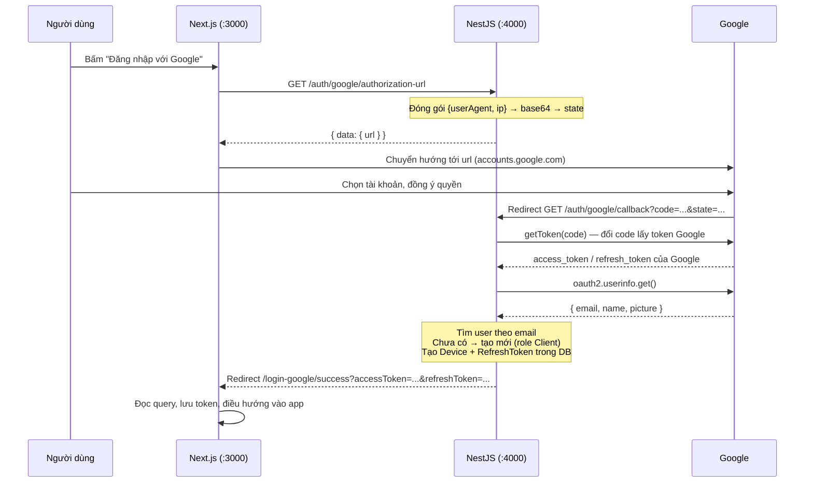
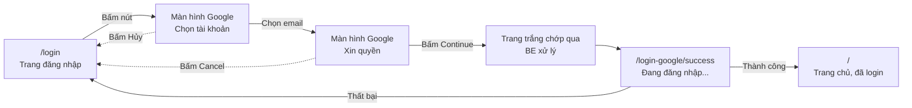

# Flow đăng nhập Google (Next.js ↔ NestJS)

Tài liệu mô tả toàn bộ luồng login bằng Google của hệ thống: FE Next.js gọi gì, BE NestJS xử lý gì, token đi đường nào, và những chỗ cần vá.

Code liên quan phía BE:

- [src/routes/auth/auth.controller.ts](../src/routes/auth/auth.controller.ts) — 2 endpoint `google/authorization-url` và `google/callback`
- [src/routes/auth/google.service.ts](../src/routes/auth/google.service.ts) — toàn bộ logic OAuth
- [src/routes/auth/auth.service.ts](../src/routes/auth/auth.service.ts) — `generateTokens`, `refreshToken`
- [src/shared/services/app-config.service.ts](../src/shared/services/app-config.service.ts) — đọc biến môi trường Google

---

## 1. Tổng quan

Hệ thống dùng **OAuth 2.0 Authorization Code flow** chuẩn, kiểu server-side. Nghĩa là:

- FE **không** cầm `client_secret`, **không** gọi thẳng Google API.
- Google trả `code` về **BE** (không phải FE), BE đổi `code` lấy token của Google, lấy email/tên user.
- BE tự phát **access token + refresh token của hệ thống mình** (JWT nội bộ), rồi redirect ngược về FE kèm token.

Điểm cần nhớ: token mà FE nhận được **không phải** token của Google. Token Google chỉ sống trong BE vài trăm mili-giây để lấy thông tin user, xong là bỏ.

### Sơ đồ luồng



---

## 2. Flow chi tiết theo từng bước

Phần này đi qua đúng những gì người dùng **nhìn thấy** và **bấm**, kèm những gì chạy ngầm ở từng thời điểm.

### 2.1. Bản đồ màn hình



Người dùng đi qua **5 màn hình**, trong đó 2 màn hình là của Google (không phải của bạn, không style được), và 1 màn hình chỉ lóe qua vài trăm mili-giây.

### 2.2. Bảng tóm tắt

| #   | Màn hình thấy gì                 | Người dùng làm gì          | Ai xử lý | URL trên thanh địa chỉ                                |
| --- | -------------------------------- | -------------------------- | -------- | ----------------------------------------------------- |
| 1   | Trang đăng nhập của bạn          | Bấm "Đăng nhập với Google" | FE       | `localhost:3000/login`                                |
| 2   | Nút chuyển trạng thái loading    | Chờ (~100–300ms)           | FE → BE  | `localhost:3000/login`                                |
| 3   | Trang Google "Choose an account" | Chọn tài khoản             | Google   | `accounts.google.com/...`                             |
| 4   | Trang Google xin quyền           | Bấm Continue / Allow       | Google   | `accounts.google.com/...`                             |
| 5   | Trắng, chớp qua rất nhanh        | Không làm gì               | BE       | `localhost:4000/auth/google/callback?...`             |
| 6   | "Đang đăng nhập..."              | Không làm gì               | FE       | `localhost:3000/login-google/success?accessToken=...` |
| 7   | Trang chủ, đã đăng nhập          | Bắt đầu dùng app           | FE       | `localhost:3000/`                                     |

---

### Bước 1 — Người dùng ở trang đăng nhập

**Thấy gì:** trang `/login` của bạn, có nút "Đăng nhập với Google".

**Làm gì:** bấm nút.

**Chạy ngầm:** chưa có gì. Chưa có request nào bay đi.

> Một hiểu nhầm phổ biến: nhiều người tưởng bấm nút là mở popup Google luôn. Ở flow này thì **không** — phải hỏi BE lấy URL trước đã, vì URL đó chứa `client_id`, `scope` và `state` mà chỉ BE mới dựng được.

---

### Bước 2 — FE hỏi BE "cho tôi URL Google"

**Thấy gì:** nút nên chuyển sang trạng thái loading/disable. Bước này thường nhanh (~100–300ms) nhưng mạng chậm thì thấy rõ, và nếu không khóa nút người dùng sẽ bấm liên tục nhiều lần.

**Làm gì:** chờ.

**Chạy ngầm:**

```
GET http://localhost:4000/auth/google/authorization-url
```

BE ([google.service.ts:49](../src/routes/auth/google.service.ts#L49)) làm 3 việc:

1. Đọc `User-Agent` header và IP của request này.
2. Nhét chúng vào `state`: `base64({ userAgent, ip })`.
3. Ghép thành URL Google đầy đủ và trả về.

**Response:**

```json
{
  "data": {
    "url": "https://accounts.google.com/o/oauth2/v2/auth?client_id=...&redirect_uri=http%3A%2F%2Flocalhost%3A4000%2Fauth%2Fgoogle%2Fcallback&scope=...&state=eyJ1c2VyQWdlbnQiOi..."
  },
  "statusCode": 200
}
```

**Vì sao phải đính `userAgent` và `ip` vào `state`:** ở bước 5, Google sẽ gọi vào BE bằng **một request hoàn toàn mới**. Request đó mang User-Agent của trình duyệt người dùng (vì trình duyệt bị redirect, không phải Google gọi server-to-server), nhưng BE không có cách nào nối nó với phiên ở bước 2. `state` chính là sợi dây nối — Google cam kết trả lại nguyên văn chuỗi này.

**Lỗi hay gặp ở bước này:** CORS chặn, hoặc FE đọc nhầm `json.url` thay vì `json.data.url` → `undefined` và redirect ra trang trắng.

---

### Bước 3 — Trình duyệt nhảy sang Google

**Thấy gì:** trang web của bạn biến mất, thanh địa chỉ đổi sang `accounts.google.com`. Google hiện màn hình **"Choose an account"** liệt kê các tài khoản đang đăng nhập trên trình duyệt.

Nếu trình duyệt chưa đăng nhập Google nào, người dùng sẽ thấy form nhập email + mật khẩu (và 2FA nếu bật).

**Làm gì:** chọn tài khoản, hoặc đăng nhập.

**Chạy ngầm:** FE chạy `window.location.href = url`. Từ lúc này cho tới bước 5, **hệ thống của bạn hoàn toàn không tham gia** — mọi thứ do Google kiểm soát.

**Lưu ý kỹ thuật:** phải dùng `window.location.href`, không dùng `router.push()` của Next (chỉ điều hướng trong app được). Cũng không nhét được vào `<iframe>` — Google chặn bằng `X-Frame-Options`.

**Nếu người dùng bấm quay lại hoặc đóng tab ở đây:** không có gì xảy ra cả. Chưa user nào được tạo, chưa token nào được phát. Flow chết sạch, người dùng bắt đầu lại từ đầu.

---

### Bước 4 — Google xin quyền

**Thấy gì:** màn hình dạng _"Ứng dụng ABC muốn truy cập Tài khoản Google của bạn"_, liệt kê đúng 2 quyền ứng với 2 scope đã khai:

- Xem địa chỉ email chính của bạn
- Xem thông tin cá nhân công khai

Kèm 2 nút **Continue / Allow** và **Cancel**.

**Làm gì:** bấm Continue.

**Chi tiết đáng lưu ý:** màn hình này **chỉ hiện lần đầu**. Từ lần thứ hai trở đi, Google nhớ là người dùng đã cấp quyền và bỏ qua luôn — người dùng chọn tài khoản xong là nhảy thẳng sang bước 5. Nên lần đăng nhập đầu tiên luôn dài hơn các lần sau.

Nếu app còn ở chế độ **Testing** trong Google Console, chỗ này sẽ hiện cảnh báo "Google hasn't verified this app" và người dùng phải bấm Advanced → Go to ... (unsafe) mới đi tiếp được. Email không nằm trong Test users thì chặn thẳng với `403 access_denied`.

**Nếu bấm Cancel:** Google redirect về `GOOGLE_REDIRECT_URI` kèm `?error=access_denied` thay vì `code`. Code hiện tại không xử lý riêng trường hợp này — `getToken(undefined)` sẽ ném lỗi, rơi vào `catch`, và người dùng nhận thông báo chung chung "Failed to google login." Nên bắt riêng để hiển thị "Bạn đã hủy đăng nhập" cho đúng.

---

### Bước 5 — Google đá ngược về Backend (màn hình chớp qua)

**Thấy gì:** trang trắng, thanh địa chỉ hiện `localhost:4000/...` trong tích tắc rồi biến mất. Trên mạng chậm hoặc DB chậm, người dùng có thể thấy trang trắng này 1–2 giây.

**Làm gì:** không làm gì. Đừng bấm gì cả — xem cảnh báo F5 bên dưới.

**Chạy ngầm:** Google redirect trình duyệt tới:

```
GET http://localhost:4000/auth/google/callback?code=4/0AY0e-g7...&state=eyJ1c2VyQWdlbnQiOi...
```

Đây là bước nặng nhất của cả flow. BE chạy tuần tự ([google.service.ts:76](../src/routes/auth/google.service.ts#L76)):

| Thứ tự | Việc                                                      | Gọi ra ngoài?   |
| ------ | --------------------------------------------------------- | --------------- |
| 1      | Giải mã `state`, validate bằng zod                        | Không           |
| 2      | Đổi `code` lấy token Google — `getToken(code)`            | Có — gọi Google |
| 3      | Lấy email/tên — `oauth2.userinfo.get()`                   | Có — gọi Google |
| 4      | Tìm user theo email trong DB                              | Không           |
| 5      | Chưa có → tạo user mới, role `Client`                     | Không           |
| 6      | Tạo bản ghi `Device`                                      | Không           |
| 7      | Ký access token + refresh token, lưu refresh token vào DB | Không           |
| 8      | Redirect về FE kèm token trên query                       | Không           |

Hai lần gọi Google ở bước 2–3 chính là lý do màn hình này có độ trễ thấy được.

**Rất quan trọng — đừng F5 ở màn hình này:** `code` của Google chỉ dùng được **đúng một lần** và hết hạn sau vài phút. F5 nghĩa là gửi lại đúng `code` đó, Google trả `invalid_grant`, người dùng bị đá về trang lỗi dù lần đầu đã thành công. Vì màn hình chỉ chớp qua nên hiếm ai kịp F5, nhưng khi debug thì rất dễ dính: copy URL callback dán lại vào trình duyệt là chắc chắn lỗi.

**Phân biệt hai nhánh kết thúc:**

```
Thành công → 302 tới localhost:3000/login-google/success?accessToken=eyJ...&refreshToken=eyJ...
Thất bại   → 302 tới localhost:3000/login-google/success?errorMessage=Failed%20to%20google%20login.
```

Cả hai về **cùng một URL**, chỉ khác query param. Nên trang callback ở FE bắt buộc phải kiểm tra `errorMessage` trước khi đọc token.

---

### Bước 5b — Vì sao token lại đi qua query string?

Đây là chỗ gợn nhất của cả flow, và cũng là chỗ hay bị hiểu sai nhất. Tách riêng ra giải thích.

#### Vì sao BẮT BUỘC phải redirect, không trả JSON được

Mấu chốt: **request này không phải do FE gọi.**

Mọi API khác trong app đều là FE chủ động `fetch()`, nhận JSON, rồi JS xử lý. Nhưng `/auth/google/callback` thì khác hẳn — **Google điều hướng cả trình duyệt** tới đó. Lúc này:

- Không có đoạn JS nào của bạn đang chạy. Trang FE đã bị unload từ bước 3 rồi.
- Không có ai chờ để `.then()` cái response cả.
- Cửa sổ trình duyệt đang trỏ thẳng vào `localhost:4000`.

Nên nếu BE `return { accessToken, refreshToken }` như một API bình thường, người dùng sẽ nhìn thấy **JSON thô hiện trên màn hình**:

```json
{
  "data": { "accessToken": "eyJhbGciOi...", "refreshToken": "eyJhbGciOi..." },
  "statusCode": 200
}
```

Và dừng luôn ở đó — không có gì đưa họ về app được nữa. Cách duy nhất để đưa trình duyệt quay lại FE là trả `302` kèm header `Location`, chính là `res.redirect()`. Đó cũng là lý do controller dùng `@Res()` để cầm response gốc của Express, thay vì trả object như các endpoint còn lại.

#### Vì sao token phải bám vào URL

Khi đã buộc phải redirect thì câu hỏi kế tiếp là: nhét token vào đâu để FE lấy được?

Một redirect `302` chỉ có đúng ba chỗ chứa được dữ liệu:

| Kênh                 | Dùng được? | Vấn đề                                                                         |
| -------------------- | ---------- | ------------------------------------------------------------------------------ |
| Body của response    | Không      | Trình duyệt vứt body của 302 đi, chỉ đọc `Location`                            |
| Header tự định nghĩa | Không      | Trình duyệt không chuyển header sang request tiếp theo, JS cũng không đọc được |
| URL trong `Location` | Được       | Đây là kênh duy nhất còn lại                                                   |

Và URL thì chỉ có hai chỗ để nhét: **query string** (`?token=...`) hoặc **fragment** (`#token=...`). Còn một kênh thứ tư là `Set-Cookie` đính trên chính response 302 — mục sau nói kỹ, vì đây mới là hướng nên đi.

#### Nói thẳng: cách này không tốt

Token nằm trần trên URL kéo theo:

- **Lưu vào history trình duyệt** — máy dùng chung là người sau đọc được.
- **Lọt vào access log** của mọi proxy, load balancer, CDN trên đường đi. Log thường được giữ hàng tháng và ít khi được bảo vệ như dữ liệu nhạy cảm.
- **Rò qua header `Referer`** nếu trang callback nạp bất kỳ tài nguyên bên ngoài nào (font, ảnh, script analytics).
- **Hiện ra màn hình** — ai đứng sau lưng, hoặc đang share screen, đều thấy.

Nghiêm trọng nhất là refresh token: nó sống **1 ngày** và đổi được token mới liên tục. Access token 5 phút thì rò rỉ còn đỡ, refresh token rò là mất tài khoản.

#### Ba cách làm tốt hơn

**Cách 1 — BE set cookie `httpOnly` ngay trên response redirect** (gọn nhất, nên dùng)

`Set-Cookie` đi kèm được với `302`. Trình duyệt lưu cookie trước, rồi mới đi theo `Location`:

```ts
res.cookie("accessToken", accessToken, {
  httpOnly: true,
  secure: true,
  sameSite: "lax",
  domain: ".example.com", // để cả FE và BE cùng đọc được
  maxAge: 5 * 60 * 1000,
});

res.redirect(googleClientRedirectUri); // URL sạch, không token
```

Token không bao giờ xuất hiện trên URL, và bỏ luôn được bước "FE đọc query rồi POST sang route handler".

Điều kiện: FE và BE phải **chung domain gốc**. Ví dụ `app.example.com` và `api.example.com` thì đặt `domain: ".example.com"` là xong.

Một chi tiết hay bị bỏ sót: ở môi trường dev, `localhost:3000` và `localhost:4000` **vẫn dùng chung cookie**, vì cookie phân biệt theo domain chứ **không phân biệt theo port**. Nên cách này chạy được ngay trên máy local mà không cần cấu hình gì thêm.

`sameSite: "lax"` là đủ: redirect từ Google về BE là điều hướng top-level bằng GET, đúng trường hợp mà `lax` vẫn cho gửi cookie.

Chỉ khi FE và BE ở hai domain hoàn toàn khác nhau (ví dụ `myapp.vercel.app` và `api.railway.app`) thì mới bí, khi đó phải dùng `sameSite: "none"` + `secure: true`, và trình duyệt chặn third-party cookie sẽ phá hỏng — lúc đó chuyển sang cách 2.

**Cách 2 — Đổi qua một mã trung gian dùng một lần** (an toàn nhất)

BE không trả token, mà trả một mã ngẫu nhiên ngắn hạn:

```
BE: lưu Redis { key: "a8f3...", value: { accessToken, refreshToken }, ttl: 60s }
    → redirect về FE?code=a8f3...

FE: POST /auth/exchange { code: "a8f3..." }
    → BE trả token trong body, đồng thời xoá key khỏi Redis
```

Cái nằm trên URL chỉ là một mã **sống 60 giây và dùng được một lần**. Có rò vào log thì lúc ai đó đọc được, nó đã chết từ lâu rồi.

Đây chính xác là lý do OAuth chuẩn có bước "authorization code" thay vì quăng thẳng token về — và ở đây ta đang áp dụng lại đúng ý tưởng đó cho chặng BE → FE.

**Cách 3 — Dùng fragment `#` thay cho `?`** (vá tạm, đỡ tốn công)

```
localhost:3000/login-google/success#accessToken=...&refreshToken=...
```

Phần sau dấu `#` **không bao giờ được gửi lên server**. Nên token không vào access log, không lọt qua `Referer`. FE đọc bằng `window.location.hash`.

Nhưng token vẫn nằm trên thanh địa chỉ và vẫn vào history. Đây là cách OAuth implicit flow cũ dùng, và nó đã bị khai tử vì chưa đủ an toàn. Coi như giải pháp tình thế khi chưa kịp làm cách 1 hoặc 2.

#### Vậy code hiện tại có dùng được không

Dùng được và chạy đúng, nhưng thuộc loại "tạm ổn cho dev, cần sửa trước khi lên production".

Việc trang callback gọi `router.replace` rồi đổi token sang cookie `httpOnly` ngay ([mục 5.2](#52-trang-nhận-callback)) bịt được phần _history_ — chỗ dễ bịt nhất. Nhưng **không bịt được access log của proxy**, vì token đã bay qua đường truyền rồi. Muốn triệt để thì phải đổi sang cách 1 hoặc cách 2.

---

### Bước 6 — FE nhận token

**Thấy gì:** trang `/login-google/success` với dòng chữ "Đang đăng nhập...". Nên để một spinner ở đây; trang này thường sống dưới 500ms nhưng vẫn phải có gì đó để người dùng không tưởng là treo.

**Làm gì:** không làm gì.

**Chạy ngầm:** `useEffect` chạy ngay khi component mount ([xem code mục 5.2](#52-trang-nhận-callback)):

1. Đọc `errorMessage` từ query. Có → `router.replace('/login?error=...')`, dừng.
2. Đọc `accessToken` và `refreshToken`. Thiếu một trong hai → về login.
3. `POST /api/auth/session` sang Next route handler để đổi token thành cookie `httpOnly`.
4. `router.replace('/')` — dùng `replace` để URL chứa token **biến mất khỏi lịch sử trình duyệt**.

**Vì sao phải `replace` chứ không `push`:** URL lúc này đang có token nằm trần trên thanh địa chỉ. Nếu `push`, người dùng bấm nút Back là quay lại đúng URL đó, và token nằm luôn trong history — ai mở lại lịch sử trình duyệt cũng đọc được.

**Vì sao phải đẩy token sang route handler:** để đặt được cookie `httpOnly` thì phải đi qua server. Cookie `httpOnly` là thứ JavaScript không đọc được, nên dính XSS cũng không mất token.

---

### Bước 7 — Vào app

**Thấy gì:** trang chủ, đã đăng nhập, có tên và avatar.

**Chạy ngầm:** mọi request từ giờ gửi kèm cookie chứa access token. `middleware.ts` thấy có cookie thì cho đi tiếp.

---

### 2.3. Sau khi login — access token hết hạn

Access token chỉ sống **5 phút** (`ACCESS_TOKEN_EXPIRES_IN=5m`). Nghĩa là chỉ cần người dùng ngồi đọc một trang khoảng 5 phút rồi bấm tiếp là đã rơi vào tình huống này.

| Thời điểm  | Người dùng thấy                              | Chạy ngầm                                                                    |
| ---------- | -------------------------------------------- | ---------------------------------------------------------------------------- |
| Phút 0     | Đăng nhập xong                               | Có access token (5m) + refresh token (1d)                                    |
| Phút 0–5   | Dùng bình thường                             | Mọi request đi kèm access token, BE chấp nhận                                |
| Phút 5+    | Bấm một chức năng, **không thấy gì khác lạ** | Request đầu tiên bị `401` → FE tự gọi refresh → thử lại request → thành công |
| Sau 1 ngày | Bị đá về trang login                         | Refresh token hết hạn, không cứu được nữa                                    |

Người dùng **không được nhìn thấy** việc refresh xảy ra. Nếu họ bị văng ra login sau mỗi 5 phút thì cơ chế refresh ở [mục 5.4](#54-gọi-api-và-tự-refresh-khi-hết-hạn) đang hỏng.

Lưu ý về **rotation**: mỗi refresh token dùng được đúng một lần, dùng xong bị xoá mềm trong DB. Nếu người dùng mở nhiều tab và các tab cùng refresh một lúc, tab chậm chân sẽ cầm token đã bị thu hồi và bị đá ra login. Đó là lý do phải gom refresh về một promise duy nhất.

### 2.4. Lần đăng nhập thứ hai khác gì lần đầu

|                             | Lần đầu          | Các lần sau                                                           |
| --------------------------- | ---------------- | --------------------------------------------------------------------- |
| Màn hình xin quyền (bước 4) | Có               | **Không** — Google nhớ rồi                                            |
| Tạo user trong DB           | Có               | Không — tìm thấy theo email                                           |
| Tạo `Device` mới            | Có               | **Vẫn tạo mới** — xem [mục 7.8](#78-mỗi-lần-login-tạo-một-device-mới) |
| Số màn hình đi qua          | 5                | 4                                                                     |
| Cảm giác                    | Chậm, nhiều bước | Gần như chỉ một cú bấm                                                |

### 2.5. Các nhánh không thành công

| Người dùng làm gì                | Kết quả                           | Người dùng thấy                                                  |
| -------------------------------- | --------------------------------- | ---------------------------------------------------------------- |
| Bấm Cancel ở màn hình Google     | Google trả `?error=access_denied` | "Failed to google login." (nên sửa thành "Bạn đã hủy đăng nhập") |
| Đóng tab giữa chừng              | Không có gì xảy ra                | Không thấy gì, phải làm lại từ đầu                               |
| F5 ở trang callback của BE       | `invalid_grant`                   | Trang lỗi, dù lần đầu đã thành công                              |
| Email không nằm trong Test users | Google chặn                       | `403 access_denied` ngay trên trang Google                       |
| BE sập giữa chừng                | Redirect không xảy ra             | Kẹt ở trang trắng `localhost:4000/...`                           |
| DB sập                           | `catch` bắt được                  | Về FE kèm `errorMessage`                                         |

---

## 3. Cấu hình

### 3.1. Biến môi trường (BE)

Trong [.env.example](../.env.example):

```env
GOOGLE_CLIENT_ID=
GOOGLE_CLIENT_SECRET=
GOOGLE_REDIRECT_URI=http://localhost:4000/auth/google/callback
GOOGLE_REDIRECT_CLIENT_URI=http://localhost:3000/login-google/success
```

| Biến                         | Ý nghĩa                                                                           |
| ---------------------------- | --------------------------------------------------------------------------------- |
| `GOOGLE_CLIENT_ID`           | Client ID lấy từ Google Cloud Console                                             |
| `GOOGLE_CLIENT_SECRET`       | Client secret — **chỉ nằm ở BE**, không bao giờ để lộ ra FE                       |
| `GOOGLE_REDIRECT_URI`        | URL Google gọi ngược lại. Trỏ về **BE**, phải khai báo y hệt trong Google Console |
| `GOOGLE_REDIRECT_CLIENT_URI` | URL BE redirect về **FE** sau khi xong. Không liên quan gì tới Google             |

Hai biến cuối rất hay bị nhầm. `GOOGLE_REDIRECT_URI` là của Google, `GOOGLE_REDIRECT_CLIENT_URI` là của bạn.

Các biến này được map sang camelCase trong [app-config.service.ts](../src/shared/services/app-config.service.ts#L29-L33) và gõ kiểu ở [config.type.ts](../src/types/config.type.ts#L12-L16).

### 3.2. Google Cloud Console

1. Vào **APIs & Services → Credentials → Create Credentials → OAuth client ID**.
2. Application type: **Web application**.
3. **Authorized redirect URIs**: thêm đúng chuỗi trong `GOOGLE_REDIRECT_URI`, ví dụ `http://localhost:4000/auth/google/callback`. Sai một dấu `/` là Google báo `redirect_uri_mismatch`.
4. Ở **OAuth consent screen**, thêm 2 scope:
   - `https://www.googleapis.com/auth/userinfo.email`
   - `https://www.googleapis.com/auth/userinfo.profile`
5. Khi app còn ở chế độ **Testing**, phải thêm email vào **Test users** mới login được.

### 3.3. CORS

BE bật CORS trong [src/main.ts](../src/main.ts#L24). Đảm bảo origin của FE (`http://localhost:3000`) nằm trong danh sách, nếu không bước gọi `authorization-url` sẽ chết ngay từ đầu.

Lưu ý: app **không** có global prefix (`/api`), nên đường dẫn đúng là `/auth/...` chứ không phải `/api/auth/...`.

---

## 4. Phía Backend (NestJS)

### 4.1. Endpoint 1 — Lấy URL đăng nhập

```
GET /auth/google/authorization-url
```

Public (`@IsPublicApi()`), không cần token.

Xử lý tại [auth.controller.ts:171](../src/routes/auth/auth.controller.ts#L171) → gọi `GoogleService.getAuthorizationUrl()`.

Trong [google.service.ts:49](../src/routes/auth/google.service.ts#L49):

```ts
const stateString = Buffer.from(JSON.stringify({ userAgent, ip })).toString(
  "base64",
);

const url = this.oauth2Client.generateAuthUrl({
  access_type: "offline",
  scope: scopes,
  include_granted_scopes: true,
  state: stateString,
});
```

Ý nghĩa từng tham số:

- `access_type: "offline"` — xin refresh token từ Google. Thực ra code hiện tại không dùng refresh token của Google, nên tham số này đang thừa.
- `scope` — chỉ xin email + profile cơ bản.
- `state` — **mẹo quan trọng**: HTTP callback từ Google là một request hoàn toàn mới, BE không biết nó đến từ trình duyệt nào. Nên BE nhét `userAgent` và `ip` vào `state`, Google sẽ trả nguyên vẹn chuỗi đó ở bước callback. Nhờ vậy BE ghi được đúng thông tin Device.

**Response** (đã qua `TransformInterceptor` nên bị bọc thêm một lớp):

```json
{
  "data": { "url": "https://accounts.google.com/o/oauth2/v2/auth?..." },
  "statusCode": 200
}
```

FE phải đọc `res.data.url`, không phải `res.url`. Chỗ này rất hay quên.

### 4.2. Endpoint 2 — Callback

```
GET /auth/google/callback?code=...&state=...
```

Endpoint này **Google gọi, không phải FE gọi**. Trình duyệt người dùng bị Google redirect tới đây.

Logic ở [google.service.ts:76](../src/routes/auth/google.service.ts#L76), chạy tuần tự:

1. **Giải mã và validate `state`** bằng zod:
   ```ts
   const StateSchema = z.object({
     userAgent: z.string().min(1),
     ip: z.string().ip(),
   });
   ```
2. **Đổi `code` lấy token Google**: `this.oauth2Client.getToken(code)`. Code này dùng một lần, hết hạn sau vài phút.
3. **Lấy thông tin user**: `oauth2.userinfo.get()` → `{ email, name, picture }`.
4. **Tìm user theo email** (`deletedAt: null`).
5. **Chưa có thì tạo mới**: gán role `Client`, `phoneNumber` rỗng, password là hằng `DEFAULT_PASSWORD = "changeme"` đã hash — xem cảnh báo ở mục 7.
6. **Tạo Device** với `userAgent`/`ip` lấy từ `state`.
7. **Phát token hệ thống** qua `authService.generateTokens()`.

Sau đó controller [auth.controller.ts:183](../src/routes/auth/auth.controller.ts#L183) redirect về FE:

```ts
// Thành công
res.redirect(`${googleClientRedirectUri}?accessToken=...&refreshToken=...`);

// Thất bại
res.redirect(
  `${googleClientRedirectUri}?errorMessage=Failed%20to%20google%20login.`,
);
```

Cả hai nhánh đều redirect về cùng một URL FE, chỉ khác query param. FE phải xử lý được cả hai.

### 4.3. Token được sinh ra thế nào

`generateTokens()` tại [auth.service.ts:242](../src/routes/auth/auth.service.ts#L242):

| Token          | Payload                                    | Hạn (mặc định)                  | Lưu DB?                  |
| -------------- | ------------------------------------------ | ------------------------------- | ------------------------ |
| `accessToken`  | `userId`, `deviceId`, `roleId`, `roleName` | `ACCESS_TOKEN_EXPIRES_IN` = 5m  | Không                    |
| `refreshToken` | `userId`                                   | `REFRESH_TOKEN_EXPIRES_IN` = 1d | Có — bảng `RefreshToken` |

Refresh token được ghi vào DB kèm `deviceId` và `expiresAt`, nên có thể thu hồi được (logout, khóa thiết bị). Access token thì không — hết hạn là cách duy nhất để nó chết, nên hạn 5 phút là hợp lý.

Quan hệ trong [prisma/schema.prisma](../prisma/schema.prisma#L157-L180): `User` 1—n `Device` 1—n `RefreshToken`. Mỗi lần login Google là **một Device mới** được tạo, kể cả cùng máy cùng trình duyệt — code không tìm device cũ để tái sử dụng.

---

## 5. Phía Frontend (Next.js)

Giả định App Router, FE chạy ở `http://localhost:3000`.

### 5.1. Nút đăng nhập

```tsx
// app/login/page.tsx
"use client";

export default function LoginPage() {
  const handleGoogleLogin = async () => {
    const res = await fetch(
      `${process.env.NEXT_PUBLIC_API_URL}/auth/google/authorization-url`,
    );

    if (!res.ok) {
      // xử lý lỗi hiển thị cho user
      return;
    }

    const json = await res.json();

    // Nhớ lớp bọc của TransformInterceptor
    window.location.href = json.data.url;
  };

  return <button onClick={handleGoogleLogin}>Đăng nhập với Google</button>;
}
```

Dùng `window.location.href` chứ **không** dùng `router.push()` — đây là điều hướng ra ngoài domain, Next router không làm được.

Cũng đừng mở trong `<iframe>`: Google chặn bằng `X-Frame-Options`.

### 5.2. Trang nhận callback

Đường dẫn phải khớp `GOOGLE_REDIRECT_CLIENT_URI`, mặc định là `/login-google/success`.

```tsx
// app/login-google/success/page.tsx
"use client";

import { useRouter, useSearchParams } from "next/navigation";
import { useEffect } from "react";

export default function GoogleSuccessPage() {
  const router = useRouter();
  const searchParams = useSearchParams();

  useEffect(() => {
    const errorMessage = searchParams.get("errorMessage");

    if (errorMessage) {
      router.replace(`/login?error=${encodeURIComponent(errorMessage)}`);
      return;
    }

    const accessToken = searchParams.get("accessToken");
    const refreshToken = searchParams.get("refreshToken");

    if (!accessToken || !refreshToken) {
      router.replace("/login?error=missing_token");
      return;
    }

    // Đẩy token sang route handler để set httpOnly cookie — xem 5.3
    fetch("/api/auth/session", {
      method: "POST",
      headers: { "Content-Type": "application/json" },
      body: JSON.stringify({ accessToken, refreshToken }),
    }).then(() => {
      // replace để URL chứa token biến mất khỏi history
      router.replace("/");
    });
  }, [searchParams, router]);

  return <p>Đang đăng nhập...</p>;
}
```

Hai chi tiết đáng lưu ý:

- Dùng `router.replace` chứ không `router.push`. URL đang chứa token, đẩy vào history là để lại vết trong trình duyệt.
- Component đọc `useSearchParams` cần bọc `<Suspense>` ở layout, nếu không Next sẽ báo lỗi khi build static.

### 5.3. Lưu token ở đâu

| Cách                                        | Chống XSS | Ghi chú                                                            |
| ------------------------------------------- | --------- | ------------------------------------------------------------------ |
| `localStorage`                              | Không     | Dính XSS là mất sạch token. Tiện nhưng đừng dùng cho refresh token |
| Cookie `httpOnly` set từ Next route handler | Có        | Khuyến nghị. JS không đọc được                                     |
| Memory (React state)                        | Có        | An toàn nhất nhưng F5 là mất, phải refresh lại                     |

Route handler đặt cookie:

```ts
// app/api/auth/session/route.ts
import { cookies } from "next/headers";
import { NextResponse } from "next/server";

export async function POST(request: Request) {
  const { accessToken, refreshToken } = await request.json();

  const cookieStore = await cookies();

  const base = {
    httpOnly: true,
    secure: process.env.NODE_ENV === "production",
    sameSite: "lax" as const,
    path: "/",
  };

  cookieStore.set("accessToken", accessToken, { ...base, maxAge: 60 * 5 });
  cookieStore.set("refreshToken", refreshToken, {
    ...base,
    maxAge: 60 * 60 * 24,
  });

  return NextResponse.json({ ok: true });
}
```

Hạn cookie nên khớp hạn token trong `.env` (`ACCESS_TOKEN_EXPIRES_IN`, `REFRESH_TOKEN_EXPIRES_IN`).

### 5.4. Gọi API và tự refresh khi hết hạn

Access token chỉ sống 5 phút, nên phải có cơ chế refresh. BE cung cấp:

```
POST /auth/refresh-token
Body: { "refreshToken": "..." }
```

Trả về cặp token mới, đồng thời **xoá mềm refresh token cũ** trong DB (rotation). Nghĩa là mỗi refresh token dùng được đúng một lần.

Hệ quả cần biết: nếu FE gọi refresh song song từ nhiều tab hay nhiều request cùng lúc, request đến sau sẽ dùng token đã bị thu hồi và bị đá ra login. Cách xử lý là gom về một promise duy nhất:

```ts
// lib/api-client.ts
let refreshingPromise: Promise<string> | null = null;

async function refreshTokens(): Promise<string> {
  if (!refreshingPromise) {
    refreshingPromise = fetch("/api/auth/refresh", { method: "POST" })
      .then((res) => {
        if (!res.ok) throw new Error("refresh_failed");
        return res.json();
      })
      .then((json) => json.accessToken)
      .finally(() => {
        refreshingPromise = null;
      });
  }

  return refreshingPromise;
}

export async function apiFetch(path: string, init: RequestInit = {}) {
  const res = await fetch(`${process.env.NEXT_PUBLIC_API_URL}${path}`, {
    ...init,
    credentials: "include",
  });

  if (res.status !== 401) return res;

  // Access token hết hạn → refresh rồi thử lại đúng một lần
  await refreshTokens();

  return fetch(`${process.env.NEXT_PUBLIC_API_URL}${path}`, {
    ...init,
    credentials: "include",
  });
}
```

### 5.5. Chặn route chưa đăng nhập

```ts
// middleware.ts
import { NextResponse, type NextRequest } from "next/server";

export function middleware(request: NextRequest) {
  const hasSession = request.cookies.has("refreshToken");

  if (!hasSession) {
    return NextResponse.redirect(new URL("/login", request.url));
  }

  return NextResponse.next();
}

export const config = {
  matcher: ["/((?!login|login-google|api|_next|favicon.ico).*)"],
};
```

Middleware chỉ kiểm tra sự tồn tại của cookie, **không** verify chữ ký JWT. Đây chỉ là lớp chặn cho đẹp UX; quyền thật sự do BE quyết định ở mọi request.

Nhớ loại trừ `/login-google` khỏi matcher, không thì trang callback bị đá về login trước khi kịp lưu token.

---

## 6. Tình huống lỗi

| Hiện tượng                                                | Nguyên nhân                                           | Cách xử lý                                                    |
| --------------------------------------------------------- | ----------------------------------------------------- | ------------------------------------------------------------- |
| Google báo `redirect_uri_mismatch`                        | `GOOGLE_REDIRECT_URI` khác chuỗi khai trong Console   | Copy y nguyên, chú ý http/https, port, dấu `/` cuối           |
| Redirect về FE kèm `errorMessage=Failed to google login.` | Bất kỳ exception nào trong `googleCallback`           | Xem log BE — `GoogleService` đã `logger.error` nguyên lỗi gốc |
| `Invalid state data.`                                     | `state` parse/validate hỏng                           | Thường do zod chê `ip`, xem mục 7.3                           |
| `invalid_grant` khi `getToken`                            | `code` đã dùng rồi hoặc hết hạn                       | Không F5 lại trang callback. Mỗi `code` chỉ đổi được một lần  |
| FE nhận `undefined` khi lấy url                           | Quên lớp bọc `data` của interceptor                   | Đọc `json.data.url`                                           |
| `403 access_denied`                                       | App ở chế độ Testing, email chưa nằm trong Test users | Thêm test user hoặc publish app                               |
| Callback chạy xong nhưng FE trắng trang                   | `useSearchParams` chưa bọc `<Suspense>`               | Bọc lại                                                       |

---

## 7. Những chỗ cần vá

Phần này ghi lại các vấn đề **đang tồn tại thật** trong code hiện tại. Không phải lý thuyết.

### 7.1. Password mặc định `"changeme"` — nghiêm trọng

[google.service.ts:16](../src/routes/auth/google.service.ts#L16) và [:124](../src/routes/auth/google.service.ts#L124):

```ts
const DEFAULT_PASSWORD = "changeme";
// ...
password: this.hashingService.hash(DEFAULT_PASSWORD),
```

Mọi user tạo qua Google đều có password giống hệt nhau và ai đọc source cũng biết. Kẻ tấn công chỉ cần đoán email là đăng nhập được qua `POST /auth/login` bình thường, hoàn toàn bỏ qua Google.

Hướng sửa: sinh chuỗi ngẫu nhiên (`randomBytes(32).toString("hex")`), hoặc tốt hơn là thêm cột đánh dấu tài khoản social và chặn luôn đường login bằng mật khẩu với các tài khoản đó.

### 7.2. `state` không được ký — thiếu chống CSRF

`state` chỉ là base64 của JSON, không có chữ ký, không có giá trị ngẫu nhiên dùng một lần. Bất kỳ ai cũng tự tạo được một `state` hợp lệ.

Đúng chuẩn OAuth thì `state` phải là giá trị random, lưu server-side hoặc trong cookie, rồi đối chiếu ở bước callback. Hiện tại `state` chỉ đang được dùng để mang dữ liệu, không làm nhiệm vụ bảo mật nào.

Hướng sửa: ký `state` bằng JWT ngắn hạn (dùng luôn `TokenService` sẵn có), hoặc gắn thêm `nonce` random và lưu đối chiếu.

### 7.3. `z.string().ip()` có thể chê IP từ Express

Express trả IP dạng IPv4-mapped IPv6 khi chạy localhost hoặc sau proxy: `::ffff:127.0.0.1`. Zod `.ip()` có thể không chấp nhận dạng này, khiến `StateSchema.parse` ném lỗi và mọi lần login Google đều thất bại với `Invalid state data.`

Nếu gặp lỗi này ở môi trường dev, đó chính là nguyên nhân. Cách xử lý: nới lỏng validate thành `z.string().min(1)`, hoặc chuẩn hoá IP (bỏ tiền tố `::ffff:`) trước khi đóng vào `state`.

Khi deploy sau reverse proxy (Nginx, ALB), nhớ bật `app.set("trust proxy", true)` để `@Ip()` lấy được IP thật thay vì IP của proxy.

### 7.4. Token đi qua URL query

Token nằm trần trên URL → vào history trình duyệt, vào access log của mọi proxy trên đường đi, rò được qua `Referer`. Nặng nhất là refresh token vì nó sống 1 ngày.

Đã phân tích đầy đủ nguyên nhân và 3 hướng sửa ở [Bước 5b](#bước-5b--vì-sao-token-lại-đi-qua-query-string). Tóm tắt: hướng gọn nhất là BE set cookie `httpOnly` ngay trên response redirect; hướng an toàn nhất là đổi qua mã trung gian dùng một lần.

### 7.5. Không kiểm tra `verified_email`

Code chỉ lấy `data.email` mà không xét `data.verified_email`. Với Google thì email gần như luôn đã xác minh, nhưng đây vẫn là một bước kiểm tra rẻ tiền nên có.

### 7.6. Gộp tài khoản ngầm theo email

User đăng ký bằng email/password trước, sau đó login Google bằng chính email đó → hệ thống tự gộp vào tài khoản cũ mà không hỏi gì. Hành vi này tiện nhưng cần được quyết định có chủ đích, và nên lưu `googleId` để về sau còn phân biệt nguồn đăng nhập.

### 7.7. `oauth2Client` dùng chung giữa các request

`OAuth2Client` được khởi tạo một lần trong constructor của service (singleton), nhưng `googleCallback` lại gọi `setCredentials(tokens)` lên chính nó. Hai người dùng login đồng thời sẽ ghi đè credential của nhau.

Trong thực tế khoảng thời gian giữa `setCredentials` và `userinfo.get()` rất ngắn nên hiếm khi lộ, nhưng đây là race condition thật. Hướng sửa: tạo một `OAuth2Client` mới bên trong mỗi lần gọi `googleCallback`.

### 7.8. Mỗi lần login tạo một Device mới

Không có logic tìm lại device cũ theo `userAgent` + `ip`. Login mười lần trên cùng một máy sẽ sinh mười bản ghi `Device`. Bảng phình dần, và màn hình "thiết bị đang đăng nhập" nếu có sẽ hiển thị sai.

---

## 8. Checklist khi lên production

- [ ] Đổi `GOOGLE_REDIRECT_URI` sang domain thật, cập nhật lại trong Google Console
- [ ] Đổi `GOOGLE_REDIRECT_CLIENT_URI` sang domain FE thật
- [ ] Đặt `ACCESS_TOKEN_SECRET` / `REFRESH_TOKEN_SECRET` bằng chuỗi random đủ dài (giá trị trong `.env.example` là giá trị mẫu, đừng mang lên production)
- [ ] Bật `secure: true` cho cookie, chạy toàn bộ trên HTTPS
- [ ] `app.set("trust proxy", true)` nếu đứng sau proxy
- [ ] Xử lý mục 7.1 trước khi mở cho người dùng thật
- [ ] Publish OAuth consent screen (thoát chế độ Testing)
- [ ] Giới hạn CORS đúng origin FE, không để `*`
