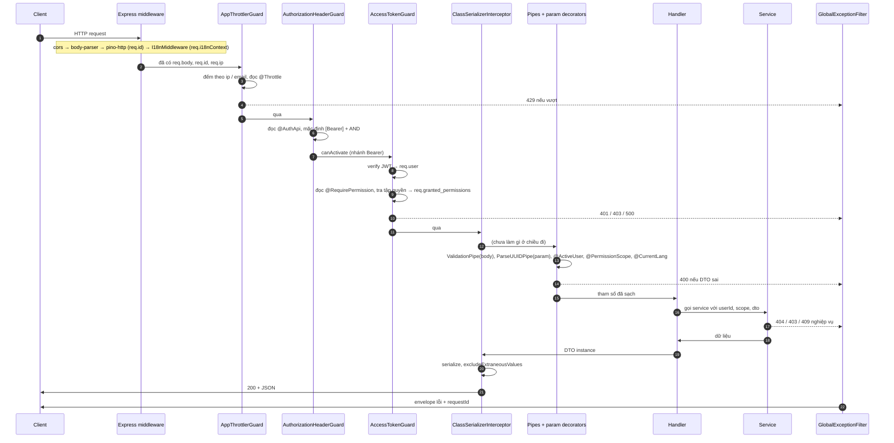

# Chương 5 — Vòng đời một request trong dự án

> Bốn chương trước mỗi chương một tầng. Chương này **xếp mọi tầng lên một đường thẳng**, đúng thứ tự dự án đang
> chạy, ghi rõ từng tầng: file nào, nhìn thấy gì, gắn thêm gì lên `request`, và nếu từ chối thì client nhận mã gì.
> Đọc xong, bất kỳ lỗi HTTP nào bạn cũng chỉ ra được nó sinh ra ở tầng nào.

**Mục lục**

1. [Đường đi đầy đủ](#1-đường-đi-đầy-đủ)
2. [Bảng từng tầng](#2-bảng-từng-tầng)
3. [Đi bộ với một request cụ thể](#3-đi-bộ-với-một-request-cụ-thể)
4. [Bốn đường rẽ: public, lỗi validate, quá tải, hạ tầng hỏng](#4-bốn-đường-rẽ-public-lỗi-validate-quá-tải-hạ-tầng-hỏng)
5. [Đường về: response và lỗi](#5-đường-về-response-và-lỗi)
6. [Muốn thêm X thì đặt ở tầng nào](#6-muốn-thêm-x-thì-đặt-ở-tầng-nào)
7. [Đọc một mã lỗi ngược về tầng sinh ra nó](#7-đọc-một-mã-lỗi-ngược-về-tầng-sinh-ra-nó)
8. [Tự kiểm chứng](#8-tự-kiểm-chứng)

---

## 1. Đường đi đầy đủ



Mọi mũi tên đứt về `F` là một điểm có thể kết thúc sớm. Handler và service chỉ chạy khi **tất cả** các tầng trước
đều cho qua.

---

## 2. Bảng từng tầng

| #   | Tầng                                    | File                                                                                   | Chạy cho                              | Nhìn thấy                                                    | Gắn thêm lên `request`                       | Từ chối bằng                              |
| --- | --------------------------------------- | -------------------------------------------------------------------------------------- | ------------------------------------- | ------------------------------------------------------------ | -------------------------------------------- | ----------------------------------------- |
| 1   | cors                                    | [main.ts:27-32](../../src/main.ts#L27-L32)                                             | mọi request                           | `Origin`                                                     | header CORS                                  | trả lời preflight 204 và **dừng**         |
| 2   | body-parser                             | Nest mặc định                                                                          | mọi request                           | bytes thô                                                    | `req.body` (object)                          | 400 nếu JSON hỏng (Express)               |
| 3   | pino-http                               | [setup-logger.util.ts](../../src/shared/utils/setup-logger.util.ts)                    | mọi request                           | request thô (đã redact khi log)                              | `req.id`, `req.log`; header `X-Request-Id`   | không từ chối                             |
| 4   | I18nMiddleware                          | [i18n.module.ts](../../src/shared/modules/i18n.module.ts)                              | mọi request                           | `Accept-Language`, `x-lang`                                  | `req.i18nContext` + `AsyncLocalStorage`      | không từ chối                             |
| 5   | `AppThrottlerGuard`                     | [app-throttler.guard.ts](../../src/shared/guards/app-throttler.guard.ts)               | mọi request                           | `req.ip`, `req.body.email`, `@Throttle`                      | —                                            | **429** + `Retry-After`                   |
| 6   | `AuthorizationHeaderGuard`              | [authorization-header.guard.ts](../../src/shared/guards/authorization-header.guard.ts) | mọi request                           | `@AuthApi`                                                   | —                                            | 401 chung (nhánh OR)                      |
| 7   | `AccessTokenGuard`                      | [access-token.guard.ts](../../src/shared/guards/access-token.guard.ts)                 | route `Bearer`                        | header `Authorization`, `@RequirePermission`, Redis/Postgres | `req.user`, `req.granted_permissions`        | **401** / **403** / **500**               |
| 8   | `ClassSerializerInterceptor` (chiều đi) | [base.module.ts:56-64](../../src/shared/modules/base.module.ts#L56-L64)                | mọi request                           | —                                                            | —                                            | không                                     |
| 9   | `ValidationPipe`                        | [validation-pipe.config.ts](../../src/shared/utils/validation-pipe.config.ts)          | handler có `@Body`/`@Query` DTO       | `design:paramtypes` → DTO class                              | thay body bằng **instance DTO** đã whitelist | **400** `VALIDATION_FAILED` + `details[]` |
| 10  | Pipe cục bộ (`ParseUUIDPipe`)           | trên tham số                                                                           | route có `@Param(..., ParseUUIDPipe)` | chuỗi param                                                  | —                                            | 400                                       |
| 11  | Param decorator                         | `src/shared/param-decorators/*`                                                        | tham số có decorator                  | `req.user`, `req.granted_permissions`, `I18nContext`         | —                                            | không (fallback an toàn)                  |
| 12  | Handler                                 | `src/routes/**/*.controller.ts`                                                        | —                                     | tham số đã sạch                                              | —                                            | hiếm                                      |
| 13  | Service                                 | `src/routes/**/*.service.ts`                                                           | —                                     | dữ liệu + `scope`                                            | —                                            | 404 / 403 / 409 nghiệp vụ                 |
| 14  | `ClassSerializerInterceptor` (chiều về) | như #8                                                                                 | —                                     | giá trị handler trả về                                       | —                                            | không                                     |
| ∞   | `GlobalExceptionFilter`                 | [global-exception.filter.ts](../../src/shared/filters/global-exception.filter.ts)      | bất kỳ tầng 5-14 ném                  | exception + `req.id`                                         | —                                            | viết envelope lỗi, **duy nhất**           |

Ba điều bảng này làm lộ ra:

- **`req.body` có mặt từ tầng 2 nhưng chỉ "sạch" từ tầng 9.** Tầng 5-7 đọc body thô. Đây là lý do `AppThrottlerGuard`
  phải tự phòng thủ khi lấy `email` làm khoá — kiểm `typeof body === "object"` rồi mới kiểm `typeof email === "string"`
  ([throttler-options.factory.ts:67-85](../../src/shared/utils/throttler-options.factory.ts#L67-L85)).
- **`req.id` có từ tầng 3**, nên mọi lỗi từ tầng 5 trở đi đều mang `requestId` trong envelope — kể cả 429 và 401.
- **Chỉ một chỗ viết lỗi.** Tầng nào ném cũng về cùng filter → cùng hình dạng body. Đây là hợp đồng của
  [error-handling.md](../error-handling.md).

> **Vì sao cors đứng trước body-parser, dù `main.ts` không hề nói thế?** Thứ tự middleware Express là **thứ tự gọi
> `.use()`**, mà hai cái này được gọi ở hai thời điểm khác nhau:
>
> - `app.enableCors(...)` ([main.ts:27](../../src/main.ts#L27)) gọi thẳng `express.use(cors(...))` **ngay lúc đó**.
> - body-parser thì Nest tự gắn bên trong `app.init()`, và `init()` chỉ chạy khi `app.listen()` ([main.ts:47](../../src/main.ts#L47))
>   được gọi — tức **sau** dòng 27.
>
> Gọi trước thì nằm trước. Tự kiểm: dựng một app rỗng, `enableCors()` rồi `init()`, in ra stack của Express —
> kết quả là `corsMiddleware -> jsonParser -> urlencodedParser`:
>
> ```ts
> const app = await NestFactory.create<NestExpressApplication>(TinyModule, {
>   logger: false,
> });
> app.enableCors({ origin: "http://localhost:3000" });
> await app.init();
> const express = app.getHttpAdapter().getInstance() as any;
> console.log(
>   (express.router ?? express._router).stack
>     .map((l: any) => l.name)
>     .join(" -> "),
> );
> ```

---

## 3. Đi bộ với một request cụ thể

`PUT /manage-product/products/3f2c…` — seller Minh sửa sản phẩm của mình, gửi `Authorization: Bearer …` và body
`{ "name": "Áo mới", "price": 199000 }`.

| Bước | Tầng                       | Điều xảy ra                                                                                                                                               |
| ---- | -------------------------- | --------------------------------------------------------------------------------------------------------------------------------------------------------- |
| 1    | cors                       | Không phải preflight → chỉ thêm header, đi tiếp                                                                                                           |
| 2    | body-parser                | `req.body = { name: "Áo mới", price: 199000 }`                                                                                                            |
| 3    | pino-http                  | Không có `X-Request-Id` → sinh `req.id = "9b1e…"`, ghi header response, log dòng "received"                                                               |
| 4    | I18nMiddleware             | Không có `x-lang`, `Accept-Language: vi` → `req.i18nContext.lang = "vi"`                                                                                  |
| 5    | `AppThrottlerGuard`        | Handler không có `@Throttle` → dùng hạn mức toàn cục, khoá theo `req.ip`; còn budget → qua                                                                |
| 6    | `AuthorizationHeaderGuard` | Handler không có `@AuthApi` → `[Bearer]` + `AND` → gọi `AccessTokenGuard`                                                                                 |
| 7a   | `AccessTokenGuard`         | Tách token, verify → payload `{ userId: minh, roleId: seller… }` → `req.user`                                                                             |
| 7b   |                            | `Reflector` đọc `@RequirePermission` = `product:update:own` ([controller:128](../../src/routes/product/manage-product/manage-product.controller.ts#L128)) |
| 7c   |                            | `PermissionResolverService.forRoles([seller])` → Redis hit → `Set { product:update:own, … }` → `req.granted_permissions`                                  |
| 7d   |                            | `satisfies(Set, "product:update:own")` → có đúng key → qua                                                                                                |
| 8    | Interceptor (đi)           | Không làm gì                                                                                                                                              |
| 9    | `ValidationPipe`           | `design:paramtypes` nói tham số `@Body()` là `UpdateProductRequestDto` → validate, whitelist, transform → instance DTO                                    |
| 10   | `ParseUUIDPipe`            | `"3f2c…"` là UUID hợp lệ → giữ                                                                                                                            |
| 11   | Param decorators           | `@ActiveUser("userId")` → `minh`; `@PermissionScope(["product","update"])` → `scopeOf(Set)` → `"own"`                                                     |
| 12   | Handler                    | `manageProductService.updateProduct({ productId, data, userId: minh, scope: "own" })`                                                                     |
| 13   | Service                    | Tìm product → `createdById === minh`? Có → cập nhật ([service:164-190](../../src/routes/product/manage-product/manage-product.service.ts#L164-L190))      |
| 14   | Interceptor (về)           | `new ProductDetailResponseDto(result)` → `excludeExtraneousValues` bỏ field không `@Expose()`                                                             |
| 15   | Response                   | `200`, header `X-Request-Id: 9b1e…`, body JSON; pino log dòng "completed … ms"                                                                            |

Nếu ở bước 13 product thuộc seller khác: service ném 403 → tầng ∞ → envelope `{ statusCode: 403, error, message,
requestId: "9b1e…" }`. Cùng `requestId` với dòng log — tra được từ client về server.

---

## 4. Bốn đường rẽ: public, lỗi validate, quá tải, hạ tầng hỏng

**Route public — `GET /brands`.** Handler có `@IsPublicApi()` ([brand.controller.ts:50](../../src/routes/brand/brand.controller.ts#L50)).
Tầng 6 đọc `[None]` → gọi "guard" `{ canActivate: () => true }` → **tầng 7 không chạy**. Không có `req.user`, không có
`req.granted_permissions`. Nếu handler public nào lỡ dùng `@ActiveUser()` sẽ nhận `undefined` — và boot-check không
bắt được chuyện này (nó chỉ kiểm nhãn, không kiểm tham số). Tầng 1-5 và 8-14 vẫn chạy như thường: public vẫn bị rate
limit, vẫn được validate, vẫn có `requestId`.

**Body sai — `POST /roles` với `{ "name": 123 }`.** Qua hết tầng 1-8 (guard thấy body thô nhưng không quan tâm).
Tầng 9: `class-validator` báo lỗi → `exceptionFactory` tạo `ValidateException`
([validation-pipe.config.ts:20-21](../../src/shared/utils/validation-pipe.config.ts#L20-L21)) → tầng ∞ → 400 với
`error: "VALIDATION_FAILED"` và `details: [{ field: "name", code: "isString", message }]`. **Handler chưa chạy.**
Để ý: request này đã tốn một lần verify JWT và một lần tra quyền trước khi bị từ chối vì body — thứ tự tầng là cố
định, không tối ưu được chuyện này.

**Quá tải — 30 lần `POST /auth/login` trong một phút.** Handler có `@Throttle(AuthThrottle.LOGIN)`
([auth.controller.ts:89](../../src/routes/auth/auth.controller.ts#L89)). Tầng 5 đọc nhãn, đếm theo khoá
(ip + email chuẩn hoá), vượt → `throwThrottlingException` → header `Retry-After` + 429 qua tầng ∞. **Tầng 6 trở đi
không chạy** — đúng mục đích đặt throttler trước auth.

**Postgres sập giữa chừng — bất kỳ route cần token.** Tầng 7c: Redis miss → Postgres ném → `PermissionResolverService`
**không bắt** ([permission-resolver.service.ts:19-21](../../src/shared/services/permission-resolver.service.ts#L19-L21))
→ `AccessTokenGuard` **không bắt** ([access-token.guard.ts:63-71](../../src/shared/guards/access-token.guard.ts#L63-L71))
→ tầng ∞ → **500**, log stack đầy đủ với `requestId`. Không phải 403. Client biết đây là lỗi server; người trực thấy
trong log lỗi.

---

## 5. Đường về: response và lỗi

**Thành công.** Handler trả một **instance DTO** (`new ProductDetailResponseDto(result)`, `new PageDto(...)`).
`ClassSerializerInterceptor` với `excludeExtraneousValues: true` ([base.module.ts:59-61](../../src/shared/modules/base.module.ts#L59-L61))
chỉ giữ field có `@Expose()` — **nhưng chỉ khi giá trị trả về là một instance DTO thật**. Trả một object Prisma
thô thì `excludeExtraneousValues` không có `@Expose()` nào để áp, nên **object đi thẳng ra nguyên vẹn, kèm mọi
field nhạy cảm**. Đó là lý do service phải bọc từng row vào DTO (comment ở
[manage-product.service.ts:111-114](../../src/routes/product/manage-product/manage-product.service.ts#L111-L114)).
Hỏng ở đây là hỏng theo hướng **lộ dữ liệu**, không phải trả về rỗng — xem
[chương 07 §6](07-dto-validation-transformation-serialization.md#6-serialization-chiều-ra) để biết chi tiết và cách chứng minh.

> `src/shared/interceptors/transform.interceptor.ts` tồn tại nhưng **không được đăng ký** ở đâu — chỉ xuất hiện trong
> một dòng comment ở `auth.controller.ts:92`. Response thành công hiện **không** bọc `{ data, statusCode }` bằng
> interceptor này; `PageDto` tự có `data` + `pagination`.

**Lỗi.** Bất kỳ tầng nào từ 5 đến 14 ném → `GlobalExceptionFilter`
([global-exception.filter.ts](../../src/shared/filters/global-exception.filter.ts)) là **người viết duy nhất**:

1. Kiểm `host.getType() === "http"` (dòng 36).
2. Đổi exception thành envelope: `HttpException` → giữ mã; lỗi Prisma → map (P2002 → 409, P2025 → 404…); còn lại → 500.
3. Gắn `requestId` từ `req.id` của pino.
4. Log theo mức (5xx = error kèm stack).
5. Nếu `headersSent` (response đã đi một phần) → **không** viết nữa.

Lỗi từ tầng 1-4 (middleware) đi khác: middleware đăng ký qua module (pino, i18n) được Nest bọc nên vẫn về filter;
`body-parser` và `cors` là Express thuần nên JSON hỏng trả body lỗi của Express, không phải envelope. Hiếm gặp,
nhưng nếu thấy một lỗi 400 **không** có `requestId`, đó là dấu hiệu nó sinh ra ở tầng 2.

---

## 6. Muốn thêm X thì đặt ở tầng nào

| Bạn muốn                                    | Tầng                      | Vì sao                                                              | Mẫu trong dự án                        |
| ------------------------------------------- | ------------------------- | ------------------------------------------------------------------- | -------------------------------------- |
| Log mọi request, kể cả 404                  | Middleware                | phải chạy trước routing                                             | pino-http                              |
| Gắn id truy vết                             | Middleware                | phải có trước khi bất kỳ tầng nào log/ném                           | `genReqId`                             |
| Chặn IP đen                                 | Middleware hoặc guard đầu | không cần biết handler; nếu cần metadata "route nào miễn" thì guard | —                                      |
| Bảo trì toàn hệ thống                       | Middleware                | không phụ thuộc route                                               | ví dụ ở [chương 4](04-middleware.md)   |
| Rate limit theo route                       | Guard                     | cần `@Throttle` trên handler                                        | `AppThrottlerGuard`                    |
| Xác thực, phân quyền                        | Guard                     | cần metadata; phải chạy trước pipe                                  | `AccessTokenGuard`                     |
| Route này public                            | Metadata + guard          | quyết định theo handler                                             | `@IsPublicApi()`                       |
| Validate body                               | Pipe                      | có DTO class từ `design:paramtypes`                                 | `ValidationPipe`                       |
| Đưa `userId` vào handler                    | Param decorator           | đọc `request` sau guard                                             | `@ActiveUser`                          |
| Đo thời gian **handler** (không tính guard) | Interceptor               | bọc đúng handler                                                    | —                                      |
| Cache response theo route                   | Interceptor + metadata    | cần biết handler và sửa được response                               | —                                      |
| Ẩn field khi trả về                         | Interceptor               | chạy chiều về                                                       | `ClassSerializerInterceptor`           |
| Đổi hình dạng lỗi                           | Filter                    | chỗ duy nhất viết lỗi                                               | `GlobalExceptionFilter`                |
| Kiểm quyền **theo bản ghi** (own/any)       | Service                   | cần dữ liệu — guard chưa có                                         | `validateOwnership`, `buildActorScope` |

Nguyên tắc rút gọn: **sớm nhất có thể, nhưng không sớm hơn dữ liệu bạn cần**. Cần metadata → không sớm hơn guard.
Cần body sạch → không sớm hơn pipe. Cần bản ghi trong DB → service.

---

## 7. Đọc một mã lỗi ngược về tầng sinh ra nó

| Client nhận                                    | Có `requestId`? | Sinh ở                                     | Kiểm gì                                                           |
| ---------------------------------------------- | --------------- | ------------------------------------------ | ----------------------------------------------------------------- |
| 400, body **không** phải envelope              | Không           | Tầng 2 body-parser                         | JSON gửi lên có hợp lệ không                                      |
| 400 `VALIDATION_FAILED` có `details[]`         | Có              | Tầng 9 `ValidationPipe`                    | DTO + `whitelist`/`forbidNonWhitelisted`                          |
| 400 không `details`                            | Có              | Tầng 10 pipe cục bộ (`ParseUUIDPipe`)      | param có đúng dạng                                                |
| 401 "Access token is required/invalid/expired" | Có              | Tầng 7 `AccessTokenGuard`                  | header, hạn token                                                 |
| 401 "Authorization failed for all conditions"  | Có              | Tầng 6 nhánh OR                            | route dùng `@AuthApi([...], OR)` — guard con nào fail bị nuốt     |
| 403 "You do not have permission…"              | Có              | Tầng 7 `satisfies()`                       | tập quyền của role vs `@RequirePermission`                        |
| 403 khác (nghiệp vụ)                           | Có              | Tầng 13 service                            | ownership, trạng thái                                             |
| 404                                            | Có              | Tầng 13 service (hoặc route không tồn tại) | `where` có `createdById`/`userId` không                           |
| 409                                            | Có              | Tầng 13 qua Prisma P2002                   | unique constraint                                                 |
| 429 + `Retry-After`                            | Có              | Tầng 5                                     | `@Throttle` của route, khoá ip/email                              |
| 500 "Route has no permission declaration"      | Có              | Tầng 7                                     | route thiếu `@RequirePermission` mà lọt boot-check (module lazy?) |
| 500 khác                                       | Có              | Bất kỳ; xem log theo `requestId`           | hạ tầng (DB/Redis), bug                                           |
| 204 cho `OPTIONS`                              | Không           | Tầng 1 cors                                | bình thường — preflight                                           |

---

## 8. Tự kiểm chứng

**1. Đếm số tầng một request đi qua bằng log.** Bật `LOG_LEVEL=debug`, gọi một route cần token với token sai.
Bạn thấy: dòng "received" của pino (tầng 3), dòng `Access token rejected: …` mức debug của `AccessTokenGuard`
(tầng 7, [dòng 45-47](../../src/shared/guards/access-token.guard.ts#L45-L47)), dòng lỗi 401 của filter kèm cùng
`req.id`. **Không** có dòng nào từ service — nó chưa chạy.

**2. Chứng minh pipe chạy sau guard.** Gọi `POST /roles` với token của **client** và body sai kiểu. Bạn nhận
**403**, không phải 400 — guard (tầng 7) từ chối trước khi pipe (tầng 9) kịp nhìn body. Đổi sang token **admin**,
giữ body sai → giờ mới **400** với `details`.

**3. Chứng minh interceptor lọc field.** Tạm bỏ `@Expose()` khỏi một field trong một `*ResponseDto`, gọi route tương
ứng: field biến mất khỏi JSON dù service vẫn trả nó. Khôi phục.

**4. Chứng minh `requestId` xuyên suốt.** Gửi `-H "X-Request-Id: tra-cuu-01"` kèm một request chắc chắn lỗi (token
rác). Body lỗi có `"requestId": "tra-cuu-01"`, header response có `X-Request-Id: tra-cuu-01`, và `grep tra-cuu-01`
trong log ra đúng ba dòng của request đó.

---

**Đọc tiếp:** [authorization-mechanics-and-code-walkthrough.md](../authorization-mechanics-and-code-walkthrough.md)
đi sâu riêng vào tầng 7 với hai nhân vật seller/admin; [authorization-guide.md](../authorization-guide.md) giải thích
vì sao thiết kế phân quyền như vậy và cách thêm quyền mới.
