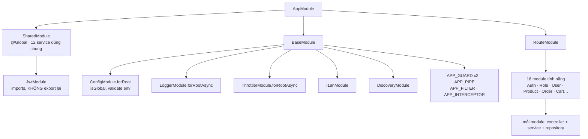

# Chương 6 — Module và Dependency Injection

> Năm chương đầu giải thích **request đi qua đâu**. Chương này giải thích **những object trên đường đi đó từ đâu ra**.
>
> Người mới nhìn `constructor(private readonly roleRepository: RoleRepository)` và câu hỏi đầu tiên luôn là: _ai
> truyền cái đó vào?_ Không có chỗ nào trong code gọi `new RoleService(...)`. Chương này trả lời câu đó, tách bạch
> ba khái niệm hay bị gộp làm một — **IoC**, **DI** và **Service Locator** — rồi đi tiếp tới những thứ ít người
> biết: vì sao cùng một class có thể tồn tại **hai bản** trong cùng một app, và vì sao `@Global()` vừa tiện vừa
> nguy hiểm.

**Mục lục**

1. [Vấn đề: ai tạo object trong constructor](#1-vấn-đề-ai-tạo-object-trong-constructor)
2. [Provider: bốn cách khai một "công thức tạo"](#2-provider-bốn-cách-khai-một-công-thức-tạo)
3. [Module: bốn ô của `@Module`](#3-module-bốn-ô-của-module)
4. [Quy tắc phân giải: Nest tìm provider ở đâu](#4-quy-tắc-phân-giải-nest-tìm-provider-ở-đâu)
5. [`@Global()` và `SharedModule`](#5-global-và-sharedmodule)
6. [Bốn token đặc biệt: `APP_GUARD` và anh em](#6-bốn-token-đặc-biệt-app_guard-và-anh-em)
7. [Module động: `forRoot`, `forRootAsync`, `register`](#7-module-động-forroot-forrootasync-register)
8. [Scope của provider](#8-scope-của-provider)
9. [Phụ thuộc vòng tròn](#9-phụ-thuộc-vòng-tròn)
10. [DI trong test](#10-di-trong-test)
11. [Vòng đời: hook nào chạy lúc nào](#11-vòng-đời-hook-nào-chạy-lúc-nào)
12. [Bản đồ module của dự án](#12-bản-đồ-module-của-dự-án)
13. [Nâng cao và những chỗ dễ vấp](#13-nâng-cao-và-những-chỗ-dễ-vấp)
14. [Tự kiểm chứng](#14-tự-kiểm-chứng)

> **Chương này dài — đừng đọc một mạch.** Bốn đường đi, tuỳ việc bạn đang làm:
>
> - **Chỉ cần hiểu để đọc code người khác (20 phút):** [mục 1](#1-vấn-đề-ai-tạo-object-trong-constructor) → 2 → 3 → 4. Đến đây bạn đã trả lời được câu
>   "object trong constructor từ đâu ra".
> - **Sắp thêm module / provider mới:** thêm [mục 5](#5-global-và-sharedmodule) (`@Global`), 6 (`APP_GUARD`), 7 (module động).
> - **Đang gỡ một lỗi DI:** nhảy thẳng tới [mục 9](#9-phụ-thuộc-vòng-tròn) (vòng tròn), 13 (những chỗ dễ vấp), và [mục 4](#4-quy-tắc-phân-giải-nest-tìm-provider-ở-đâu) để hiểu quy tắc tìm.
> - **Đang viết test:** [mục 10](#10-di-trong-test), rồi [mục 14](#14-tự-kiểm-chứng) để chạy thử ba quy tắc bằng một script.
>
> [Mục 8](#8-scope-của-provider) (scope) và 11 (lifecycle hook) là kiến thức tra cứu — đọc khi gặp, không cần thuộc.

---

## 1. Vấn đề: ai tạo object trong constructor

Đây là `RoleService` trong dự án, rút gọn —
[role.service.ts:15-20](../../src/routes/role/role.service.ts#L15-L20):

```ts
@Injectable()
export class RoleService {
  constructor(
    private readonly roleRepository: RoleRepository,
    private readonly rolePermissionCacheService: RolePermissionCacheService,
  ) {}
}
```

Không có chỗ nào trong toàn bộ `src/` viết `new RoleService(...)`. Vậy khi `RoleController` gọi
`this.roleService.getRoles(...)`, cái `roleService` đó ở đâu ra?

### Nếu không có DI

Tự tay ráp thì trông thế này:

```ts
// ví dụ minh hoạ — KHÔNG có trong repo
const prisma = new PrismaService();
const redis = new RedisService(config);
const cache = new RolePermissionCacheService(redis);
const roleRepo = new RoleRepository(prisma);
const roleService = new RoleService(roleRepo, cache);
const roleController = new RoleController(roleService);
```

Sáu dòng cho **một** controller. Dự án có 17 controller, 25 repository, 12 service dùng chung. Và đây mới là phần
dễ: phần khó là khi `PermissionResolverService` cần cả `PrismaService` lẫn `RolePermissionCacheService`, bạn phải
nhớ **dùng lại** hai object đã tạo chứ không `new` thêm lần nữa — nếu `new` lại, `RedisService` sẽ mở hai kết nối.

### Đảo ngược quyền điều khiển

DI đảo chuyện đó lại: class **khai báo nó cần gì**, không **đi lấy** thứ nó cần. Một "container" giữ sổ sách và ráp
hộ.

```
Không DI:  RoleService tự đi tìm/tạo RoleRepository   →  nó phải biết cách tạo, và biết cả cây phụ thuộc bên dưới
Có DI:     RoleService nói "tôi cần một RoleRepository" →  container tìm, tạo (nếu chưa có), truyền vào
```

Đổi lại ba thứ:

| Lợi                       | Vì sao                                                                                                                                                               |
| ------------------------- | -------------------------------------------------------------------------------------------------------------------------------------------------------------------- |
| **Dùng lại instance**     | Container tạo `PrismaService` **một lần**, mọi repository dùng chung. Một pool kết nối, không phải 25.                                                               |
| **Thay thế được**         | Trong test, khai "khi ai hỏi `RoleRepository`, đưa object giả này" — `RoleService` không biết và không cần biết. Đó là toàn bộ nội dung [mục 10](#10-di-trong-test). |
| **Thứ tự khởi tạo tự lo** | Container tự tính ai phải có trước ai. Bạn không sắp xếp tay.                                                                                                        |

### Gọi đúng tên: IoC, DI, DIP

Ba chữ này hay bị dùng thay nhau, và chúng không phải một thứ.

| Viết tắt | Tên đầy đủ                     | Nó là loại gì                                                                                                                       |
| -------- | ------------------------------ | ----------------------------------------------------------------------------------------------------------------------------------- |
| **IoC**  | Inversion of Control           | Một **nguyên tắc** rộng: framework giữ quyền điều khiển luồng, code của bạn _bị gọi_ chứ không _đi gọi_.                            |
| **DI**   | Dependency Injection           | Một **kỹ thuật** hiện thực IoC, chỉ áp cho đúng một chuyện: phụ thuộc được **truyền vào từ ngoài** thay vì class tự đi lấy.         |
| **DIP**  | Dependency Inversion Principle | Chữ **D** trong SOLID: module cấp cao đừng phụ thuộc trực tiếp vào module cấp thấp — cả hai cùng phụ thuộc vào một **abstraction**. |

Quan hệ giữa chúng: **IoC là cái ô lớn → DI là một cách làm IoC → DIP là lý do người ta _muốn_ DI.** Nhưng chiều
ngược lại không đúng: **dùng DI không tự động có DIP.**

Câu tóm tắt IoC kinh điển là **Hollywood Principle** — _"Don't call us, we'll call you."_ Bạn không gọi framework;
bạn đưa cho nó một class, và nó gọi bạn.

> **Repo này có DI, và cố tình không có DIP.** `RoleService` inject `RoleRepository` — một **class cụ thể**, không
> phải interface. Phụ thuộc vẫn đi từ ngoài vào (DI ✓), nhưng lớp cao vẫn trỏ thẳng vào lớp thấp (DIP ✗). Lý do là
> ràng buộc kỹ thuật ở mục dưới: `design:paramtypes` chỉ ghi được **class**, nên muốn DIP thật thì mọi phụ thuộc
> phải khai token thủ công (`@Inject("ROLE_REPOSITORY")`) — xem [mục 2.5](#25-token-không-phải-class). Dự án chọn
> không trả cái giá đó, và **không mất gì trong test**: container phân giải theo **token**, mà token ở đây chính là
> class, nên `{ provide: RoleRepository, useValue: mockGiả }` vẫn thay thế được bình thường.

### IoC rộng hơn DI: bốn chỗ trong repo là IoC nhưng không phải DI

Nếu chỉ nhớ "IoC = DI" thì sẽ không nhận ra ba chương trước cũng toàn IoC:

| Bạn viết                                                                                      | Ai gọi nó                            | Là gì         |
| --------------------------------------------------------------------------------------------- | ------------------------------------ | ------------- |
| `canActivate()` trong [access-token.guard.ts](../../src/shared/guards/access-token.guard.ts)  | Nest gọi, trước khi vào handler      | IoC, không DI |
| `onModuleInit()` trong [prisma.service.ts](../../src/shared/services/prisma.service.ts#L8)    | Nest gọi, lúc boot                   | IoC, không DI |
| Hàm `useFactory` trong `forRootAsync` ([mục 7](#7-module-động-forroot-forrootasync-register)) | Container gọi khi cần dựng provider  | IoC, không DI |
| `constructor(private readonly roleRepository: RoleRepository)`                                | Container truyền vào lúc dựng object | IoC **và** DI |

Ba dòng đầu không truyền phụ thuộc vào đâu cả — chúng chỉ đảo ngược **quyền gọi**. Đó vẫn là IoC.

`AccessTokenGuard` là ví dụ rõ nhất vì nó nằm trên **cả hai trục cùng lúc**:

```ts
@Injectable()
export class AccessTokenGuard implements CanActivate {
  constructor(
    private readonly tokenService: TokenService,               // ← DI: ai đó đưa phụ thuộc vào
    private readonly permissionResolverService: PermissionResolverService,
    private readonly reflector: Reflector,
  ) {}

  async canActivate(context: ExecutionContext) {               // ← IoC: bạn không gọi hàm này bao giờ
    ...
  }
}
```

Không chỗ nào trong `src/` viết `guard.canActivate(...)`. Nest gọi, vì `base.module.ts` đã khai nó dưới token
`APP_GUARD` ([mục 6](#6-bốn-token-đặc-biệt-app_guard-và-anh-em)).

### Cách thứ ba mà ai cũng vấp: Service Locator

Giữa "tự `new`" và "DI" còn một cách nữa, và nó **trông giống DI đến mức hay bị nhầm là DI**: class vẫn không
`new` gì cả, nhưng nó **tự đi hỏi container**. Ba phiên bản của cùng một `RoleService`:

**1 — Tự quản (không IoC).** Class tự tạo thứ nó cần:

```ts
// ví dụ minh hoạ — KHÔNG có trong repo
@Injectable()
export class RoleService {
  private readonly roleRepository = new RoleRepository(new PrismaService());
  //                                                   ↑ kết nối DB thứ hai, thứ ba, thứ hai mươi lăm
}
```

**2 — Service Locator (có IoC, không có DI).** Class không tạo, nhưng **tự đi lấy**:

```ts
// ví dụ minh hoạ — KHÔNG có trong repo
@Injectable()
export class RoleService {
  constructor(private readonly moduleRef: ModuleRef) {}

  async getRoles(query: PaginationQueryDto) {
    const roleRepository = this.moduleRef.get(RoleRepository, {
      strict: false,
    });
    const cache = this.moduleRef.get(RolePermissionCacheService, {
      strict: false,
    });
    // ...
  }
}
```

**3 — DI (cách repo đang làm).** Class chỉ **khai** thứ nó cần:

```ts
// role.service.ts:15-20 — code thật
@Injectable()
export class RoleService {
  constructor(
    private readonly roleRepository: RoleRepository,
    private readonly rolePermissionCacheService: RolePermissionCacheService,
  ) {}
}
```

Phiên bản 2 và 3 cùng dùng container, cùng được tái sử dụng instance, cùng không `new`. Khác nhau ở **chiều mũi
tên**: DI thì container **đẩy** vào; Service Locator thì class **kéo** ra. Chiều mũi tên đó đổi bốn thứ:

|                                    | 1 · Tự quản                               | 2 · Service Locator                                 | 3 · DI                                          |
| ---------------------------------- | ----------------------------------------- | --------------------------------------------------- | ----------------------------------------------- |
| Nhìn constructor biết class cần gì | Không — nằm rải trong thân class          | **Không** — chỉ thấy đúng một `ModuleRef`           | **Có** — danh sách đầy đủ, đọc 3 giây           |
| Thiếu phụ thuộc thì vỡ lúc nào     | Lúc compile                               | **Lúc chạy**, ngay dòng `.get()`                    | **Lúc boot**, trước khi nhận request đầu tiên   |
| Thay thế trong test                | Không thay được — phải `jest.mock` module | Phải giả lập cả container                           | `{ provide: X, useValue: mock }`                |
| Class có dính vào Nest không       | Không                                     | **Có** — `import { ModuleRef } from "@nestjs/core"` | Không — class là POJO, không import gì của Nest |

Dòng thứ hai là dòng đắt nhất. Thử xoá `RoleRepository` khỏi `providers` của `RoleModule`:

```
Với DI:              app không boot được
                     → Nest can't resolve dependencies of the RoleService (?, RolePermissionCacheService)

Với Service Locator: app boot xanh, healthcheck xanh, deploy xong
                     → request đầu tiên vào GET /roles mới ném lỗi, trên production
```

DI biến một lỗi runtime thành **lỗi lúc boot**. Đó không phải hiệu ứng phụ — đó là cái người ta mua khi chọn DI.

Dòng thứ ba cũng cụ thể không kém. Đây là setup thật của
[permission-resolver.service.spec.ts:12-27](../../src/shared/services/__tests__/permission-resolver.service.spec.ts#L12-L27):

```ts
const prisma = { role: { findUnique: jest.fn() } };
const cache = {
  getRoleKeys: jest.fn().mockResolvedValue(null),
  setRoleKeys: jest.fn(),
};

const moduleRef = await Test.createTestingModule({
  providers: [
    PermissionResolverService,
    { provide: PrismaService, useValue: prisma }, // ← khai "ai hỏi PrismaService thì đưa object này"
    { provide: RolePermissionCacheService, useValue: cache },
  ],
}).compile();
```

Hai object JS thường, không DB, không Redis. Nếu `PermissionResolverService` viết theo kiểu Service Locator, hai
dòng `provide` kia vô dụng — muốn chặn, phải giả lập chính `ModuleRef`, tức là mock cái framework thay vì mock phụ
thuộc. Chi tiết ở [mục 10](#10-di-trong-test).

### Khi Service Locator là đúng: composition root

Không phải cấm tuyệt đối. Có đúng một chỗ hợp lệ để chạm vào container: **composition root**.

> **Composition root là gì:** điểm **duy nhất** trong chương trình nơi cây object được ráp lại **bằng tay** — nơi
> bạn tự tay lấy đồ ra khỏi container thay vì được container đưa cho. Nó nằm ở ngoài cùng: `main.ts`, một script
> chạy một lần, hay phần dựng `TestingModule` của một bài test. Bên trong nó thì chưa có ai để inject vào bạn cả,
> nên "tự đi lấy" là cách duy nhất. Mọi class nghiệp vụ đều nằm **bên trong** cây đó, nên chúng luôn có đường được
> inject và không có cớ gì đi lấy.

Repo dùng nó ở ba nơi, cả ba đều hợp lệ:

| Nơi                                                                                                                   | Gọi gì                                         | Vì sao hợp lệ                                                               |
| --------------------------------------------------------------------------------------------------------------------- | ---------------------------------------------- | --------------------------------------------------------------------------- |
| [main.ts:16-18](../../src/main.ts#L16-L18)                                                                            | `app.get(Logger)` · `app.select(...).get(...)` | Đây **chính là** composition root — không có tầng nào trên nó để inject vào |
| [create-permission.ts:26](../../initial-scripts/create-permission.ts#L26)                                             | `app.get(RolePermissionCacheService)`          | Script một lần, không phải class nghiệp vụ                                  |
| [permission-resolver.service.spec.ts:27](../../src/shared/services/__tests__/permission-resolver.service.spec.ts#L27) | `moduleRef.get(PermissionResolverService)`     | Composition root của test — chỗ lôi object ra để kiểm                       |

Luật thực dụng: **càng xa composition root, càng không được chạm vào container.** Một `ModuleRef` xuất hiện trong
`src/routes/**/*.service.ts` gần như luôn là mùi lỗi — xem thêm ở [mục 13](#13-nâng-cao-và-những-chỗ-dễ-vấp).

### Container biết kiểu bằng cách nào

Đây là chỗ nối thẳng về [chương 1 §5](01-decorators-and-metadata.md#5-hai-cờ-tsconfig-quyết-định-mọi-thứ).
Vì `RoleService` có decorator (`@Injectable()`) và `tsconfig.json` bật `emitDecoratorMetadata`, compiler dán thêm
một mẩu metadata lên class:

```ts
Reflect.getMetadata("design:paramtypes", RoleService);
// → [RoleRepository, RolePermissionCacheService]
```

Container đọc đúng mảng đó. **`@Injectable()` không "làm" gì cả** — nó chỉ là cái cớ để compiler emit mảng kiểu.
Bỏ nó đi, mảng không được dán, và Nest báo:

```
Nest can't resolve dependencies of the RoleService (?, ...)
```

> Vì `design:paramtypes` chỉ ghi được **class**, bạn không thể inject theo interface. Muốn inject một thứ không
> phải class (chuỗi cấu hình, hàm), phải dùng **token tường minh** — xem [mục 2](#2-provider-bốn-cách-khai-một-công-thức-tạo).

---

## 2. Provider: bốn cách khai một "công thức tạo"

**Provider** = một mục trong sổ sách của container: _"khi có ai hỏi token X, hãy đưa ra thứ được tạo theo cách Y"_.

Token thường chính là **class**. Nhưng token có thể là chuỗi hay symbol khi thứ cần inject không phải class.

### 2.1 `useClass` — dạng viết tắt

```ts
providers: [RoleService];
// tương đương:
providers: [{ provide: RoleService, useClass: RoleService }];
```

99% provider trong dự án là dạng này ([role.module.ts:10](../../src/routes/role/role.module.ts#L10)). Container
`new` class đó, tự giải quyết constructor của nó.

Dạng đầy đủ có ích khi token và class khác nhau — đổi cài đặt mà không đổi chỗ gọi:

```ts
// ví dụ minh hoạ
providers: [
  { provide: StorageService, useClass: isProd ? S3Service : LocalDiskService },
];
```

### 2.2 `useValue` — đưa sẵn object

Không tạo gì, dùng luôn giá trị cho sẵn. Đây là cách **test thay thật bằng giả** —
[role-service-test-harness.ts:33-38](../../src/routes/role/__tests__/role-service-test-harness.ts#L33-L38):

```ts
const moduleRef = await Test.createTestingModule({
  providers: [
    RoleService,
    { provide: RoleRepository, useValue: mocks.roleRepository },
    {
      provide: RolePermissionCacheService,
      useValue: mocks.rolePermissionCacheService,
    },
  ],
}).compile();
```

`RoleService` vẫn khai `RoleRepository` trong constructor, không sửa một dòng. Container đưa cho nó object jest mock.

### 2.3 `useFactory` — tính ra rồi mới đưa

Dùng khi việc tạo cần logic, hoặc cần **đợi** một provider khác. `inject: [...]` liệt kê những gì factory cần, và
chúng được truyền vào theo đúng thứ tự —
[base.module.ts:56-64](../../src/shared/modules/base.module.ts#L56-L64):

```ts
const serializerInterceptor: Provider = {
  provide: APP_INTERCEPTOR,
  useFactory: (reflector: Reflector) => {
    return new ClassSerializerInterceptor(reflector, {
      excludeExtraneousValues: true,
    });
  },
  inject: [Reflector],
};
```

`ClassSerializerInterceptor` cần **hai** tham số: một `Reflector` (container có) và một object tuỳ chọn (container
không biết). `useClass` không diễn đạt được chuyện đó; factory thì được.

Factory có thể `async` — container `await` trước khi coi là xong. Đây là cách một provider chờ kết nối mở xong rồi
mới sẵn sàng.

### 2.4 `useExisting` — bí danh

```ts
// ví dụ minh hoạ
providers: [
  AppConfigService,
  { provide: "CONFIG", useExisting: AppConfigService },
];
```

Hai token, **một** instance. Khác `useClass` — `useClass` sẽ tạo instance thứ hai.

### 2.5 Token không phải class

```ts
// ví dụ minh hoạ
providers: [{ provide: "S3_BUCKET", useValue: process.env.S3_BUCKET }];

@Injectable()
export class MediaService {
  constructor(@Inject("S3_BUCKET") private readonly bucket: string) {}
}
```

Vì `string` không mang thông tin ở `design:paramtypes`, bạn **phải** chỉ tay bằng `@Inject(token)`. Dự án không dùng
cách này — nó chọn gói toàn bộ cấu hình vào một class có kiểu là `AppConfigService`
([app-config.service.ts](../../src/shared/services/app-config.service.ts)), rồi inject class đó. Gọn hơn và có
autocomplete; chương 9 của series sẽ nói kỹ.

---

## 3. Module: bốn ô của `@Module`

Module là **đơn vị gom nhóm và ranh giới hiển thị**. Nó có đúng bốn ô:

```ts
@Module({
  imports:     [],  // module khác mà tôi muốn dùng provider ĐÃ EXPORT của họ
  controllers: [],  // controller thuộc module này
  providers:   [],  // thứ container tạo, dùng được BÊN TRONG module này
  exports:     [],  // trong số providers, cái nào cho module khác thấy
})
```

Ví dụ nhỏ nhất trong dự án — [role.module.ts](../../src/routes/role/role.module.ts):

```ts
@Module({
  controllers: [RoleController],
  providers: [RoleRepository, RoleService],
})
export class RoleModule {}
```

Không `imports` (mọi thứ nó cần đã toàn cục — [mục 5](#5-global-và-sharedmodule)), không `exports` (không ai cần `RoleService`).

### Đóng gói là thật

Đây là điểm người mới hay nghĩ sai: **`imports` một module không cho bạn thấy `providers` của module đó** — chỉ
thấy những gì nằm trong `exports`.

```
ModuleA: providers [Stateful]           ← không export
ModuleB: imports [ModuleA], providers [Outsider]   ← Outsider cần Stateful
```

Kết quả (thực nghiệm 3 ở [mục 14](#14-tự-kiểm-chứng), chạy thật):

```
Nest can't resolve dependencies of the Outsider (?). Please make sure that the argument Stateful at index [0]...
```

Không export thì không tồn tại, dưới góc nhìn của module khác. Đây là cơ chế giữ cho ranh giới module có nghĩa.

### Ba cây, một gốc

[app.module.ts](../../src/app.module.ts) gom ba nhánh:

```ts
@Module({
  imports: [SharedModule, BaseModule, RouteModule],
})
export class AppModule {}
```

| Module                                                      | Vai trò                                                                                     |
| ----------------------------------------------------------- | ------------------------------------------------------------------------------------------- |
| [`SharedModule`](../../src/shared/modules/shared.module.ts) | 12 service dùng chung, `@Global()` — Prisma, Redis, token, hashing, email, S3…              |
| [`BaseModule`](../../src/shared/modules/base.module.ts)     | Hạ tầng: guard/pipe/filter/interceptor toàn cục, config, logger, throttler, i18n, discovery |
| [`RouteModule`](../../src/routes/route.module.ts)           | Gom 16 module tính năng, không có gì khác                                                   |

Chia như vậy khiến `AppModule` đọc được trong bốn dòng, và mỗi nhánh có một lý do tồn tại rõ ràng.

---

## 4. Quy tắc phân giải: Nest tìm provider ở đâu

Khi container dựng `RoleService` và thấy nó cần `RoleRepository`, nó tìm theo thứ tự:

1. Trong `providers` của **chính module** đang chứa `RoleService`.
2. Trong `exports` của các module mà module đó **`imports`**.
3. Trong các module **`@Global()`**.
4. Không thấy → ném lỗi lúc boot (không phải lúc chạy).

Điểm mấu chốt nằm ở bước 1, và nó dẫn tới một hệ quả mà **rất nhiều người không biết**:

> **Instance gắn với module, không gắn với class.** Cùng một class khai trong hai module là **hai instance khác
> nhau**.

### Chứng minh

Thực nghiệm 1 ([mục 14](#14-tự-kiểm-chứng)) khai `Stateful` trong cả `AModule` lẫn `BModule`:

```
AService.s.id = 2 | BService.s.id = 3 | giống nhau? false
```

Hai object, hai `id`. Container không "dedupe theo class" — nó dedupe theo **(module, token)**.

### Chuyện này đang xảy ra trong repo

Ba provider đang được khai ở nhiều module cùng lúc:

| Provider               | Khai ở                                      | Số instance |
| ---------------------- | ------------------------------------------- | ----------- |
| `SharedUserRepository` | `AuthModule`, `ProfileModule`, `UserModule` | **3**       |
| `RoleRepository`       | `RoleModule`, `ProfileModule`, `UserModule` | **3**       |
| `SharedRoleRepository` | `AuthModule`, `UserModule`                  | **2**       |

Hai cái đầu **vô hại**: chúng không giữ trạng thái gì, chỉ gọi `prismaService` (mà `PrismaService` là global nên
vẫn dùng chung một kết nối). Ba instance của một class rỗng tốn vài byte.

Cái thứ ba thì đáng nhìn kỹ —
[shared-role.repository.ts:11-15](../../src/repositories/role/shared-role.repository.ts#L11-L15):

```ts
@Injectable()
export class SharedRoleRepository {
  private clientRoleId: RoleId | null = null;   // ← cache
  private adminRoleId: RoleId | null = null;    // ← cache

  constructor(private prismaService: PrismaService) {}
```

Nó **có** trạng thái: cache id của role `client` và `admin`, để khỏi query lại. Nhưng vì được khai ở hai module, có
**hai cache**, mỗi cái tự làm nóng riêng.

Hôm nay đây **không phải bug** — hai cache rồi cũng chứa đúng cùng một giá trị, cái giá chỉ là một query dư lúc
khởi động. Nhưng cơ chế thì đã sẵn ở đó: ngày nào ai đó thêm cache **có invalidate** vào một repository kiểu này,
gọi `invalidate()` sẽ chỉ xoá **một** trong hai, và bug sinh ra sẽ cực khó tìm — vì code trông hoàn toàn đúng.

**Cách sửa đúng** khi muốn đúng một instance: khai provider ở một module, `exports` nó, rồi module khác `imports`.
Hoặc — như dự án làm với 12 service dùng chung — đưa vào `SharedModule` global.

---

## 5. `@Global()` và `SharedModule`

[shared.module.ts:16-35](../../src/shared/modules/shared.module.ts#L16-L35):

```ts
const sharedProviders: Provider[] = [
  AppConfigService,
  PrismaService,
  HashingService,
  TokenService,
  EmailService,
  TwoFactorAuthenticationService,
  S3Service,
  RedisService,
  RolePermissionCacheService,
  PermissionResolverService,
  ThrottlerRedisStorage,
];

@Global()
@Module({
  imports: [JwtModule],
  providers: sharedProviders,
  exports: sharedProviders, // Exporting providers to be used in other modules
})
export class SharedModule {}
```

`@Global()` nghĩa là: những gì module này `exports` **có mặt ở mọi nơi**, không module nào cần `imports` nó nữa.

Thực nghiệm 2 xác nhận cùng một instance được chia sẻ:

```
AService.g.id = 1 | BService.g.id = 1 | giống nhau? true
```

### Vì sao 12 service này xứng đáng global

Ba tiêu chí, cả ba đều đúng với nhóm này:

1. **Gần như module nào cũng cần.** `PrismaService` xuất hiện trong cả 25 repository.
2. **Bắt buộc phải là một instance duy nhất.** `RedisService` giữ một kết nối; `PrismaService` giữ một pool. Nhiều
   instance không chỉ lãng phí — nó làm cạn connection limit của Postgres.
3. **Không thuộc về một tính năng nào.** Hashing, token, email là hạ tầng, không phải nghiệp vụ.

Nếu không global, mỗi module trong 16 module tính năng phải `imports: [SharedModule]` — một dòng lặp 16 lần không
mang thông tin gì.

### Cái giá của global

`@Global()` **giấu phụ thuộc**. Nhìn `role.module.ts` bạn không thể biết `RoleService` cần `RolePermissionCacheService`
— phải mở file service ra mới thấy. Với một module tính năng thì đó là mất mát thật: mất luôn khả năng đọc `@Module`
để hiểu module này dựa vào những gì.

Quy tắc thực dụng:

- **Global:** hạ tầng, dùng khắp nơi, bắt buộc singleton. Ít, và hiếm khi thêm.
- **Không global:** mọi thứ khác. `imports` + `exports` tường minh, dài hơn nhưng đọc là thấy.

Một chi tiết nhỏ mà hay: `SharedModule` `imports: [JwtModule]` nhưng **không** export lại. Vậy `JwtService` chỉ dùng
được **bên trong** `SharedModule` (bởi `TokenService`). Module tính năng không chạm được vào JWT thô — chúng phải đi
qua `TokenService`. Đóng gói làm đúng việc của nó.

---

## 6. Bốn token đặc biệt: `APP_GUARD` và anh em

[Chương 3 §4](03-guards.md#4-ba-cách-đăng-ký-và-vì-sao-dự-án-chọn-app_guard) đã nói vì sao guard toàn cục phải đăng
ký qua `APP_GUARD`. Giờ nhìn cơ chế cho đủ bốn.

Nest định nghĩa bốn token trong `@nestjs/core`:

| Token             | Đăng ký cái gì            | Trong dự án                                     |
| ----------------- | ------------------------- | ----------------------------------------------- |
| `APP_GUARD`       | guard toàn cục            | `AppThrottlerGuard`, `AuthorizationHeaderGuard` |
| `APP_PIPE`        | pipe toàn cục             | `ValidationPipe`                                |
| `APP_FILTER`      | exception filter toàn cục | `GlobalExceptionFilter`                         |
| `APP_INTERCEPTOR` | interceptor toàn cục      | `ClassSerializerInterceptor`                    |

Chúng là **multi-provider**: khai nhiều provider **cùng một token** thì Nest gom tất cả lại chứ không ghi đè.
[base.module.ts:43-54](../../src/shared/modules/base.module.ts#L43-L54) khai `APP_GUARD` hai lần và cả hai đều chạy.

```ts
const guards: Provider[] = [
  AccessTokenGuard, // provider thường — có trong container để được TIÊM
  ApiKeyGuard, // provider thường
  { provide: APP_GUARD, useClass: AppThrottlerGuard },
  { provide: APP_GUARD, useClass: AuthorizationHeaderGuard },
];
```

Ba điều cần rút ra:

1. **Chỉ mục có `provide: APP_GUARD` mới tự chạy.** Hai dòng đầu là provider thường — chúng ở đó để
   `AuthorizationHeaderGuard` inject vào. Nhầm chỗ này là tưởng app có bốn guard toàn cục; thực ra là hai.
2. **Thứ tự khai = thứ tự chạy**, và ở đây nó là quyết định bảo mật ([chương 3 §5](03-guards.md#5-thứ-tự-chạy-và-short-circuit)).
3. **Vì sao không dùng `app.useGlobalGuards(new ...)` trong `main.ts`:** cách đó bạn phải tự `new`, mà
   `AuthorizationHeaderGuard` cần `Reflector` + hai guard con, mỗi guard con lại cần service riêng. `APP_GUARD` để
   container ráp cả cây.

Cùng lý do đó cho `APP_PIPE`: `createValidationPipe` được gọi qua `useFactory`
([base.module.ts:66-69](../../src/shared/modules/base.module.ts#L66-L69)), nên e2e chỉ cần `imports: [AppModule]` là
có **đúng** pipe của production — không có bản sao cấu hình thứ hai để lệch nhau
([create-test-app.ts:23-27](../../test/e2e/support/create-test-app.ts#L23-L27)).

---

## 7. Module động: `forRoot`, `forRootAsync`, `register`

Module thường là một class tĩnh. Nhưng module thư viện cần **nhận cấu hình** — và cấu hình đó thường chỉ biết lúc
chạy. Giải pháp: một static method trả về mô tả module.

Ba quy ước tên:

| Tên                              | Nghĩa                                  | Gọi ở            |
| -------------------------------- | -------------------------------------- | ---------------- |
| `forRoot()` / `forRootAsync()`   | cấu hình **một lần** cho cả app        | module gốc       |
| `register()` / `registerAsync()` | cấu hình **mỗi lần dùng**              | từng module cần  |
| `forFeature()`                   | khai thêm phần cục bộ lên cấu hình gốc | module tính năng |

Dự án dùng ba `forRootAsync` — cả ba đều cần đợi `AppConfigService`.

Đơn giản nhất — [i18n.module.ts:16-32](../../src/shared/modules/i18n.module.ts#L16-L32):

```ts
NestI18nModule.forRootAsync({
  useFactory: (_appConfigService: AppConfigService) => ({
    fallbackLanguage: ALL_LANGUAGES,
    loaderOptions: {
      path: _appConfigService.isDevelopment
        ? path.resolve("src", "i18n")
        : path.resolve("dist", "i18n"),
      watch: true,
    },
  }),
  resolvers: [AcceptLanguageResolver, new HeaderResolver(["x-lang"])],
  inject: [AppConfigService],
});
```

Hai tham số làm việc cùng nhau: `inject` nói _cần gì_, `useFactory` nhận đúng thứ đó theo thứ tự. Đây chính là
`useFactory` của [mục 2.3](#23-usefactory--tính-ra-rồi-mới-đưa), chỉ khác là kết quả trở thành **cấu hình module** thay vì một provider.

Hai chỗ còn lại: `LoggerModule.forRootAsync`
([base.module.ts:86-89](../../src/shared/modules/base.module.ts#L86-L89)) và `ThrottlerModule.forRootAsync`
([base.module.ts:90-100](../../src/shared/modules/base.module.ts#L90-L100)) — cái sau inject **hai** thứ
(`AppConfigService` + `ThrottlerRedisStorage`), cho thấy factory nhận bao nhiêu tham số cũng được.

### Khi nào tự viết module động

Khi bạn tách một phần của dự án thành package dùng lại được, và nó cần cấu hình từ bên ngoài. Hình dạng:

```ts
// ví dụ minh hoạ — dự án chưa có
@Module({})
export class StorageModule {
  static forRootAsync(options: {
    useFactory: (...args: any[]) => StorageOptions | Promise<StorageOptions>;
    inject?: any[];
  }): DynamicModule {
    return {
      module: StorageModule,
      providers: [
        {
          provide: "STORAGE_OPTIONS",
          useFactory: options.useFactory,
          inject: options.inject ?? [],
        },
        StorageService,
      ],
      exports: [StorageService],
    };
  }
}
```

Trong một app đơn như dự án này thì chưa cần: `SharedModule` + `AppConfigService` đã giải quyết cùng vấn đề với ít
máy móc hơn.

---

## 8. Scope của provider

Mặc định, **mọi provider là singleton**: tạo một lần lúc boot, dùng cho mọi request đến khi app tắt. Toàn bộ dự án
chạy như vậy — không có một khai báo `scope` nào.

Nest có ba scope:

| Scope             | Tạo khi nào                       | Chi phí        |
| ----------------- | --------------------------------- | -------------- |
| `Scope.DEFAULT`   | một lần, lúc boot                 | không          |
| `Scope.REQUEST`   | **mỗi request một instance**      | cao — xem dưới |
| `Scope.TRANSIENT` | mỗi chỗ inject một instance riêng | trung bình     |

### Vì sao `Scope.REQUEST` đắt hơn người ta tưởng

Scope **lây lên trên**. Nếu `RoleRepository` thành `REQUEST`, thì `RoleService` (dùng nó) cũng thành `REQUEST`, rồi
`RoleController` cũng vậy. Cả nhánh cây phải được **dựng lại cho từng request**, và Nest phải giữ một context riêng
cho mỗi request. Một provider đổi scope có thể kéo theo nửa app.

Với dự án này còn một lý do nữa: hai guard toàn cục và `AccessTokenGuard` là singleton, và chúng truyền dữ liệu
theo-request qua **object `request`** ([chương 3 §9](03-guards.md#9-truyền-dữ-liệu-từ-guard-xuống-handler)) chứ
không qua trạng thái của provider. Đó là cách đúng: giữ provider **không trạng thái**, để dữ liệu theo-request nằm
trên `request`. Làm đúng thế rồi thì `Scope.REQUEST` gần như không bao giờ cần.

Khi nào thật sự cần: khi bạn muốn inject chính `REQUEST` vào tầng sâu (ví dụ ghi `createdBy` tự động ở tầng ORM) và
không muốn truyền tay qua nhiều lớp. Ngay cả khi đó, `AsyncLocalStorage` — đúng thứ `nestjs-i18n` dùng
([chương 4 §7.4](04-middleware.md#74-phát-hiện-ngôn-ngữ--nestjs-i18n)) — thường là lời giải rẻ hơn.

---

## 9. Phụ thuộc vòng tròn

Hiện repo **không có** vòng tròn nào. Nhưng nó sẽ xuất hiện, và thông điệp lỗi không nói thẳng nguyên nhân.

### Triệu chứng

```
Nest can't resolve dependencies of the AService (?). Please make sure that the argument BService at index [0]
is available in the AModule context.
```

hoặc tệ hơn, một phụ thuộc lặng lẽ thành `undefined` và nổ lúc chạy.

### Nguyên nhân

`a.service.ts` import `b.service.ts`, `b.service.ts` import `a.service.ts`. Lúc module A được nạp, nó cần B; B đang
nạp dở nên `BService` còn `undefined`; mảng `design:paramtypes` của A có một lỗ hổng (`undefined` ở vị trí đó).

### Cách chữa tạm

```ts
// ví dụ minh hoạ
@Injectable()
export class AService {
  constructor(@Inject(forwardRef(() => BService)) private b: BService) {}
}
// và ở cấp module:
@Module({ imports: [forwardRef(() => BModule)] })
```

`forwardRef` bảo Nest "hoãn việc phân giải token này lại". Nó chạy được, nhưng là **băng dán**.

### Cách chữa đúng

Vòng tròn gần như luôn là dấu hiệu ranh giới bị vẽ sai. Ba lối ra, theo thứ tự ưu tiên:

1. **Tách phần chung ra module thứ ba** mà cả hai cùng `imports`. Đây là lý do repo có
   `SharedUserRepository` / `SharedRoleRepository` tách khỏi `UserRepository` / `RoleRepository` — phần nhiều module
   cần được kéo ra riêng, thay vì để `AuthModule` và `UserModule` gọi nhau.
2. **Đảo chiều phụ thuộc:** thay vì A gọi B, để B nghe một sự kiện A phát ra.
3. **Gộp lại** nếu hai thứ thực ra là một trách nhiệm bị chẻ nhầm.

---

## 10. DI trong test

Đây là chỗ DI trả lại toàn bộ công sức. `Test.createTestingModule` dựng một container thật với sổ sách bạn tự viết.

Dự án dùng một **harness** cho mỗi service —
[role-service-test-harness.ts](../../src/routes/role/__tests__/role-service-test-harness.ts):

```ts
// 1. Mock: chỉ khai những method service thật sự gọi
export const createRoleServiceMocks = () => ({
  roleRepository: {
    findManyRoles: jest.fn(),
    findUniqueRole: jest.fn(),
    createRole: jest.fn(),
    updateRole: jest.fn(),
    deleteRole: jest.fn(),
  },
  rolePermissionCacheService: { invalidateRole: jest.fn() },
});

// 2. Dựng service qua container thật, thay phụ thuộc bằng useValue
export const buildRoleService = async (
  mocks: RoleServiceMocks,
): Promise<RoleService> => {
  const moduleRef = await Test.createTestingModule({
    providers: [
      RoleService,
      { provide: RoleRepository, useValue: mocks.roleRepository },
      {
        provide: RolePermissionCacheService,
        useValue: mocks.rolePermissionCacheService,
      },
    ],
  }).compile();

  return moduleRef.get<RoleService>(RoleService);
};
```

Vì sao đi qua container thay vì `new RoleService(mockA, mockB)`? Vì container **kiểm tra hợp đồng**: thêm một
phụ thuộc vào `RoleService` mà quên khai trong harness thì test đỏ ngay với thông điệp rõ ràng. Gọi `new` thẳng thì
TypeScript báo lỗi lúc compile, nhưng bạn mất luôn khả năng dùng `overrideProvider` bên dưới.

### `overrideProvider` — khi module đã cố định

E2E dựng **cả** `AppModule`, nên không thể liệt kê provider. Lúc đó dùng override —
[create-test-app.ts:28-46](../../test/e2e/support/create-test-app.ts#L28-L46):

```ts
const builder = Test.createTestingModule({ imports: [AppModule] });
const moduleFixture = await (
  configure ? configure(builder) : builder
).compile();
```

`configure` cho spec chèn `.overrideProvider(X).useValue(...)` trước khi compile. Comment ở
[dòng 29-37](../../test/e2e/support/create-test-app.ts#L29-L37) nêu đúng lý do cần nó: `ConfigModule.forRoot()` chụp
`process.env` **lúc `base.module.ts` được import lần đầu** — trước mọi `beforeAll`. Gán `process.env` trong test là
vô nghĩa; override provider là lối vào duy nhất.

Ba cách override:

```ts
.overrideProvider(TokenService).useValue(fake)   // đưa object có sẵn
.overrideProvider(TokenService).useClass(FakeTokenService)
.overrideProvider(TokenService).useFactory({ factory: () => fake, inject: [] })
```

Còn `.overrideGuard(X)`, `.overridePipe(X)`, `.overrideInterceptor(X)`, `.overrideFilter(X)` cho các token `APP_*`.

---

## 11. Vòng đời: hook nào chạy lúc nào

[Chương 2 §6](02-reflector-execution-context-and-discovery.md#6-chạy-lúc-nào-lifecycle-hooks) đã dùng
`onApplicationBootstrap`. Đây là danh sách đầy đủ, theo thứ tự.

**Khởi động** (`app.init()`):

| Hook                       | Chạy khi                                | Trong dự án                                                                                                                            |
| -------------------------- | --------------------------------------- | -------------------------------------------------------------------------------------------------------------------------------------- |
| `onModuleInit()`           | module **đó** đã resolve xong phụ thuộc | [`PrismaService`](../../src/shared/services/prisma.service.ts#L8-L16) — `$connect()`, và **ném lại lỗi** nên DB chết là app không boot |
| `onApplicationBootstrap()` | **mọi** module đã init                  | [`PermissionCoverageService`](../../src/shared/services/permission-coverage.service.ts) — quét toàn bộ route                           |

**Tắt** (`app.close()`, hoặc tín hiệu hệ thống nếu bật `enableShutdownHooks()`):

| Hook                                 | Trong dự án                                                                                                                                                              |
| ------------------------------------ | ------------------------------------------------------------------------------------------------------------------------------------------------------------------------ |
| `onModuleDestroy()`                  | [`RedisService`](../../src/shared/services/redis.service.ts) — `client.quit()`; [`PrismaService`](../../src/shared/services/prisma.service.ts#L18-L21) — `$disconnect()` |
| `beforeApplicationShutdown(signal?)` | —                                                                                                                                                                        |
| `onApplicationShutdown(signal?)`     | —                                                                                                                                                                        |

Chọn hook nào, theo một câu hỏi: _"việc này chỉ cần module của tôi sẵn sàng, hay cần cả app?"_ Mở kết nối DB → chỉ
cần module mình → `onModuleInit`. Quét mọi controller → cần cả app → `onApplicationBootstrap`.

> **Lưu ý vận hành:** [`main.ts`](../../src/main.ts) hiện **không** gọi `app.enableShutdownHooks()`. Nghĩa là
> `onModuleDestroy` của `RedisService` và `PrismaService` chạy trong test (nơi `app.close()` được gọi tường minh)
> nhưng **không** chạy khi process nhận `SIGTERM` lúc deploy. Hôm nay hậu quả nhẹ — OS đóng socket hộ — nhưng nếu
> sau này có job nền cần dừng êm, hoặc cần flush gì đó trước khi chết, đây là dòng phải thêm.

---

## 12. Bản đồ module của dự án



Đặc điểm: **cây rất nông**. Không module tính năng nào `imports` module tính năng khác — chúng nói chuyện qua
provider global, không qua nhau. Đổi lại: không bao giờ có vòng tròn, và xoá một module tính năng không làm gãy
module khác.

---

## 13. Nâng cao và những chỗ dễ vấp

**Quên `@Injectable()` mà vẫn chạy.** Nếu class không có phụ thuộc nào, không cần `design:paramtypes`, nên nó chạy.
Thêm tham số constructor đầu tiên vào là vỡ. Luôn để `@Injectable()`.

**Khai cùng class ở hai module.** [Mục 4](#4-quy-tắc-phân-giải-nest-tìm-provider-ở-đâu). Đang xảy ra trong repo với ba provider. Vô hại hôm nay; nhớ cơ chế.

**`@Global()` cho một service nghiệp vụ.** Tiện lúc viết, đau lúc đọc. Giữ global cho hạ tầng.

**Import class chỉ để lấy kiểu, vô tình tạo vòng tròn.** Dùng `import type { X }` — TypeScript xoá hẳn khỏi code
biên dịch, nên không tạo phụ thuộc runtime.

**`exports` một provider mình không `providers`.** Hợp lệ nếu nó đến từ module bạn `imports` — đây là cách "chuyển
tiếp" một provider. Nhưng làm nhiều tầng thì không ai lần ra nguồn nữa.

**`moduleRef.get()` để lấy provider giữa chừng.** `ModuleRef` cho phép lấy provider theo token lúc chạy thay vì
inject qua constructor. Hữu ích cho factory động; nhưng lạm dụng là quay lại **service locator**, và bạn mất luôn
cái lợi "nhìn constructor là biết class này cần gì" — so sánh đầy đủ ba cách ở
[mục 1](#cách-thứ-ba-mà-ai-cũng-vấp-service-locator). Trong repo, container chỉ bị chạm ở **composition root**:
[main.ts:16-18](../../src/main.ts#L16-L18) (`app.get(Logger)`, `app.select(SharedModule).get(...)`),
[create-permission.ts:26](../../initial-scripts/create-permission.ts#L26) trong script seed, và `moduleRef.get(...)`
trong các test harness. Không class nghiệp vụ nào dưới `src/routes/` giữ tham chiếu tới container — giữ nguyên như
vậy.

**Test dựng cả `AppModule` cho một unit test.** Chậm và cần DB. Chỉ liệt kê đúng những gì service cần, như harness
của dự án.

**Lỗi "can't resolve dependencies" đọc thế nào.** Thông điệp có dạng
`can't resolve dependencies of the X (?, Y, Z)` — dấu `?` chỉ đúng vị trí tham số bị thiếu. Ba nguyên nhân, theo
thứ tự hay gặp: (1) quên khai provider trong `providers`; (2) module chứa nó quên `exports`; (3) vòng tròn import.

---

## 14. Tự kiểm chứng

Cả ba thí nghiệm dưới đây **không cần database**, chạy vài giây, và đã được chạy thật khi viết tài liệu này — output
bên dưới là output thật.

**Thí nghiệm gộp: ba quy tắc DI.** Tạo `scratch-di.ts` ở gốc repo:

```ts
import "reflect-metadata";
import { Injectable, Module, Global } from "@nestjs/common";
import { Test } from "@nestjs/testing";

let counter = 0;
@Injectable()
class Stateful {
  readonly id = ++counter;
}
@Injectable()
class GlobalDep {
  readonly id = ++counter;
}

@Global()
@Module({ providers: [GlobalDep], exports: [GlobalDep] })
class GlobalModule {}

@Injectable()
class AService {
  constructor(
    public s: Stateful,
    public g: GlobalDep,
  ) {}
}
@Injectable()
class BService {
  constructor(
    public s: Stateful,
    public g: GlobalDep,
  ) {}
}

// Stateful khai ở CẢ HAI module — đúng như SharedRoleRepository trong repo
@Module({ providers: [Stateful, AService], exports: [AService] })
class AModule {}
@Module({ providers: [Stateful, BService], exports: [BService] })
class BModule {}
@Module({ imports: [GlobalModule, AModule, BModule] })
class RootModule {}

// Module KHÔNG export provider của mình
@Module({ providers: [Stateful] })
class SealedModule {}
@Injectable()
class Outsider {
  constructor(public s: Stateful) {}
}
@Module({ imports: [SealedModule], providers: [Outsider] })
class LeakTestModule {}

(async () => {
  const app = await Test.createTestingModule({
    imports: [RootModule],
  }).compile();
  const a = app.get(AService),
    b = app.get(BService);

  console.log("1. Cùng class khai ở 2 module:");
  console.log(
    "   AService.s.id =",
    a.s.id,
    "| BService.s.id =",
    b.s.id,
    "| giống nhau?",
    a.s === b.s,
  );
  console.log("2. Provider từ @Global module:");
  console.log(
    "   AService.g.id =",
    a.g.id,
    "| BService.g.id =",
    b.g.id,
    "| giống nhau?",
    a.g === b.g,
  );

  console.log("3. Module không export → module khác thấy được không?");
  try {
    await Test.createTestingModule({ imports: [LeakTestModule] }).compile();
    console.log("   compile OK  ← không nên xảy ra");
  } catch (e) {
    console.log(
      "   compile THẤT BẠI:",
      String((e as Error).message)
        .split("\n")[0]
        .slice(0, 110),
    );
  }
  process.exit(0);
})();
```

```bash
npx ts-node --transpile-only scratch-di.ts
```

> **Phải đặt file ở gốc repo**, đừng copy ra `/tmp`. Hai lý do: `ts-node` cần đọc `tsconfig.json` của dự án để có
> `experimentalDecorators` + `emitDecoratorMetadata` (thiếu là decorator không chạy, DI không biết kiểu — xem
> [chương 1 §5](01-decorators-and-metadata.md#5-hai-cờ-tsconfig-quyết-định-mọi-thứ)), và Node cần tìm thấy
> `node_modules` của repo để `import "@nestjs/common"`.

Kết quả:

```
1. Cùng class khai ở 2 module:
   AService.s.id = 2 | BService.s.id = 3 | giống nhau? false
2. Provider từ @Global module:
   AService.g.id = 1 | BService.g.id = 1 | giống nhau? true
3. Module không export → module khác thấy được không?
   compile THẤT BẠI: Nest can't resolve dependencies of the Outsider (?). Please make sure that the argument Stateful at index [0]
```

Ba dòng, ba bài học: **instance gắn với module**, **global chia sẻ một instance**, **không export thì vô hình**.
Nhớ xoá file sau khi xem.

**Thí nghiệm 4: làm vỡ DI có chủ đích.** Tạm xoá `@Injectable()` khỏi
[role.service.ts](../../src/routes/role/role.service.ts), chạy `pnpm types-check` — vẫn xanh (đây là lỗi runtime,
không phải lỗi kiểu). Chạy app → `Nest can't resolve dependencies of the RoleService (?, ...)`. Khôi phục.

**Thí nghiệm 5: đếm instance thật trong app.** Thêm tạm vào constructor của
[shared-role.repository.ts](../../src/repositories/role/shared-role.repository.ts):

```ts
constructor(private prismaService: PrismaService) {
  console.log("SharedRoleRepository được tạo lần thứ", ++(globalThis as any).__n || 1);
}
```

Chạy app: bạn sẽ thấy **hai** dòng — một cho `AuthModule`, một cho `UserModule`, đúng như [mục 4](#4-quy-tắc-phân-giải-nest-tìm-provider-ở-đâu) mô tả. Khôi phục
sau khi xem.

---

**Tiếp theo:** [Chương 7 — DTO: validation, transformation, serialization](07-dto-validation-transformation-serialization.md)
— ba việc khác nhau do hai thư viện làm, và cái bẫy khiến dữ liệu nhạy cảm lọt ra ngoài.
