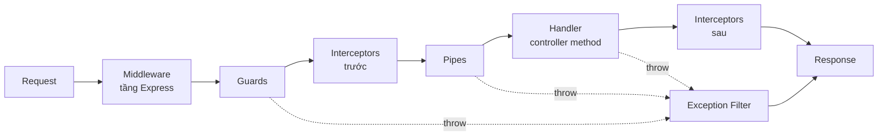

# NestJS căn bản → nâng cao: decorator, metadata, Reflector, guard, middleware

> **Bộ tài liệu này dành cho ai:** người mới vào dự án, hoặc mới dùng NestJS, muốn hiểu **tại sao** viết một dòng
> `@RequirePermission("product:read:own")` lên hàm mà hệ thống lại biết chặn request. Không cần biết trước về
> NestJS; cần biết TypeScript ở mức đọc được class và hàm.
>
> Mỗi chương đi từ khái niệm thuần (không dính dự án) → cách NestJS dùng nó → **đúng chỗ dự án này dùng nó**, có
> đường dẫn file và số dòng.

## Thứ tự đọc

| #   | Chương                                                                                              | Trả lời câu hỏi                                                                                                                     | Bản HTML                                                    |
| --- | --------------------------------------------------------------------------------------------------- | ----------------------------------------------------------------------------------------------------------------------------------- | ----------------------------------------------------------- |
| 0   | [Prototype, `this`, và class](00-prototype-and-this.md)                                             | Nền JavaScript: vì sao class lại có `prototype`, nó khác `__proto__` ra sao, `class` biên dịch ra gì, boxing là gì                  | [html](00-prototype-and-this.html)                          |
| 1   | [Decorator và metadata](01-decorators-and-metadata.md)                                              | Decorator là gì, chạy lúc nào, `SetMetadata` dán gì vào đâu, param decorator khác gì                                                | [html](01-decorators-and-metadata.html)                     |
| 2   | [Reflector, ExecutionContext, Discovery](02-reflector-execution-context-and-discovery.md)           | Ai đọc lại metadata, đọc ở đâu, đọc cả app một lượt bằng cách nào                                                                   | [html](02-reflector-execution-context-and-discovery.html)   |
| 3   | [Guard](03-guards.md)                                                                               | Người gác cửa: hợp đồng, cách đăng ký, thứ tự chạy, guard ghép, khi nào 401 / 403 / 500                                             | [html](03-guards.html)                                      |
| 4   | [Middleware](04-middleware.md)                                                                      | Tầng Express dưới Nest: viết, đăng ký, và **vì sao auth không nằm ở đây**                                                           | [html](04-middleware.html)                                  |
| 5   | [Vòng đời một request trong dự án](05-request-lifecycle-in-this-project.md)                         | Ráp tất cả lại: từng tầng chạm vào request theo thứ tự nào, thấy gì, trả lỗi gì                                                     | [html](05-request-lifecycle-in-this-project.html)           |
| 6   | [Module và Dependency Injection](06-modules-and-dependency-injection.md)                            | Object trong constructor từ đâu ra, IoC vs DI vs Service Locator, provider, `@Global`, `APP_GUARD`, scope, vòng tròn, DI trong test | [html](06-modules-and-dependency-injection.html)            |
| 7   | [DTO: validation, transformation, serialization](07-dto-validation-transformation-serialization.md) | Ba việc hai thư viện, `ValidationPipe`, validator tự viết, và cái bẫy làm lộ dữ liệu ra response                                    | [html](07-dto-validation-transformation-serialization.html) |
| A   | [Phụ lục A — `reflect-metadata` bên trong](appendix-a-reflect-metadata-internals.md)                | Bảng ẩn là `WeakMap` gì, `getMetadata` đi ngược chain thế nào, TypeScript tự dán `design:*` theo quy tắc gì                         | [html](appendix-a-reflect-metadata-internals.html)          |

Trang tổng quan dạng web: [index.html](index.html).

**Chưa vững JavaScript?** Bắt đầu ở [chương 0](00-prototype-and-this.md) — nó là phần nền cho mọi chỗ [chương 1](01-decorators-and-metadata.md) viết `X.prototype`. Ai đã quen
prototype chain thì bỏ qua, vào thẳng chương 1.

**Đọc nhanh (30 phút):** [chương 1](01-decorators-and-metadata.md) → mục "Guard là gì" của [chương 3](03-guards.md) → [chương 5](05-request-lifecycle-in-this-project.md).
**Đọc kỹ (một ngày):** theo thứ tự 0 → 7, làm các thí nghiệm ở cuối mỗi chương. [Phụ lục A](appendix-a-reflect-metadata-internals.md) đọc sau chương 1 nếu muốn
biết bảng metadata thật ra là gì.
**Nếu bạn sắp sửa code ngay hôm nay:** [chương 6](06-modules-and-dependency-injection.md) (DI — gặp ở mọi file) và [chương 7](07-dto-validation-transformation-serialization.md) (DTO — sửa mỗi lần thêm endpoint).

Đọc xong bộ này thì sang [authorization-mechanics-and-code-walkthrough.md](../authorization-mechanics-and-code-walkthrough.md)
và [authorization-guide.md](../authorization-guide.md) sẽ thấy trơn — hai tài liệu đó giả định bạn đã nắm những gì viết ở đây.

---

## Bức tranh lớn trong một hình

Một request HTTP đi qua NestJS theo dây chuyền **cố định**. Ghim hình này vào đầu; năm chương sau chỉ là đi sâu vào
từng ô.



| Tầng        | Biết handler nào sắp chạy? | Đọc được metadata của handler? | Dự án dùng để làm gì                                |
| ----------- | -------------------------- | ------------------------------ | --------------------------------------------------- |
| Middleware  | Không                      | Không                          | CORS, log request + `X-Request-Id`, detect ngôn ngữ |
| Guard       | **Có**                     | **Có**                         | Rate limit, xác thực token, **phân quyền**          |
| Interceptor | Có                         | Có                             | Serialize response (`excludeExtraneousValues`)      |
| Pipe        | Có                         | Có                             | Validate + transform DTO, parse UUID                |
| Handler     | —                          | —                              | Gọi service                                         |
| Filter      | Có (qua `ArgumentsHost`)   | Hạn chế                        | Một envelope lỗi duy nhất cho toàn app              |

Cột "biết handler nào" là ranh giới quan trọng nhất trong cả bộ này. **Middleware chạy trước khi Nest biết
request sẽ rơi vào handler nào**, nên không đọc được `@RequirePermission`. Guard chạy sau khi đã biết. Đó là toàn bộ lý
do phân quyền là guard, không phải middleware — [chương 4](04-middleware.md) giải thích kỹ.

---

## Bốn khái niệm, một cơ chế

Bốn thứ trong tiêu đề thực ra xoay quanh một trục:

```
Decorator  ──dán──▶  Metadata  ◀──đọc──  Reflector  ◀──dùng──  Guard
   (lúc định nghĩa class)                   (lúc có request)
```

- **Decorator** là hàm chạy **một lần**, lúc file được load, dán một mẩu dữ liệu (metadata) lên class hoặc method.
- **Metadata** là mẩu dữ liệu đó, nằm trong một bảng ẩn do thư viện `reflect-metadata` giữ.
- **Reflector** là cái đọc lại bảng ẩn đó, **mỗi request**.
- **Guard** là nơi dùng kết quả đọc được để quyết định cho qua hay chặn.

Middleware đứng ngoài trục này — nó thuộc tầng Express, không thấy metadata.

---

## Khái niệm → chỗ trong dự án

| Khái niệm                                | File trong dự án                                              | Dòng đáng đọc |
| ---------------------------------------- | ------------------------------------------------------------- | ------------- |
| Decorator metadata một dòng              | `src/shared/param-decorators/require-permission.decorator.ts` | 12-13         |
| Decorator metadata có tham số phức       | `src/shared/param-decorators/auth-api.decorator.ts`           | 10-19         |
| Param decorator đọc `request`            | `src/shared/param-decorators/active-user.decorator.ts`        | 7-14          |
| Param decorator gọi util                 | `src/shared/param-decorators/permission-scope.decorator.ts`   | 19-31         |
| Param decorator đọc context thư viện     | `src/shared/param-decorators/current-lang.decorator.ts`       | 4-10          |
| Composite decorator (`applyDecorators`)  | `src/shared/param-decorators/http-decorator.ts`               | 22-117        |
| Reflector trong guard                    | `src/shared/guards/access-token.guard.ts`                     | 77-79         |
| Reflector đọc policy xác thực            | `src/shared/guards/authorization-header.guard.ts`             | 40-47         |
| DiscoveryService quét toàn app           | `src/shared/utils/collect-route-permissions.util.ts`          | 34-87         |
| Lifecycle hook `onApplicationBootstrap`  | `src/shared/services/permission-coverage.service.ts`          | 29-73         |
| Guard đơn                                | `src/shared/guards/api-key.guard.ts`                          | 13-29         |
| Guard ghép (điều phối guard con)         | `src/shared/guards/authorization-header.guard.ts`             | 21-82         |
| Guard kế thừa từ thư viện                | `src/shared/guards/app-throttler.guard.ts`                    | 18-44         |
| Đăng ký guard toàn cục có DI             | `src/shared/modules/base.module.ts`                           | 43-54         |
| Middleware từ thư viện (CORS)            | `src/main.ts`                                                 | 27-32         |
| Middleware từ thư viện (log, request id) | `src/shared/utils/setup-logger.util.ts`                       | 39-48, 64-82  |
| Middleware từ thư viện (ngôn ngữ)        | `src/shared/modules/i18n.module.ts`                           | 16-32         |
| Pipe toàn cục                            | `src/shared/utils/validation-pipe.config.ts`                  | 15-25         |
| Interceptor toàn cục                     | `src/shared/modules/base.module.ts`                           | 56-64         |
| Filter toàn cục                          | `src/shared/filters/global-exception.filter.ts`               | 21-60         |
| Provider `useFactory` + `inject`         | `src/shared/modules/base.module.ts`                           | 56-64         |
| Module `@Global()`                       | `src/shared/modules/shared.module.ts`                         | 16-35         |
| Cùng class ở 2 module → 2 instance       | `src/repositories/role/shared-role.repository.ts`             | 11-15         |
| Cấu hình `ValidationPipe`                | `src/shared/utils/validation-pipe.config.ts`                  | 15-22         |
| Validator liên trường tự viết            | `src/validations/decorators/is-only-one-exists.ts`            | 11-31         |
| Bọc row vào DTO để không lộ field        | `src/routes/product/manage-product/manage-product.service.ts` | 111-114       |

---

## Quy ước trong bộ tài liệu

- Đoạn code có ghi `file:dòng` là **trích từ dự án**, đúng tại thời điểm viết. Đoạn code không ghi nguồn là **ví dụ
  minh hoạ**, không tồn tại trong repo.
- Số phiên bản: NestJS `11.0.1`, TypeScript `5.7.3`, `reflect-metadata` `0.2.2`. Vài chỗ hành vi khác giữa Nest 10 và
  11 (cú pháp wildcard route) được ghi rõ.
- Mỗi chương kết bằng mục **Tự kiểm chứng** — làm thử trước khi tin.
