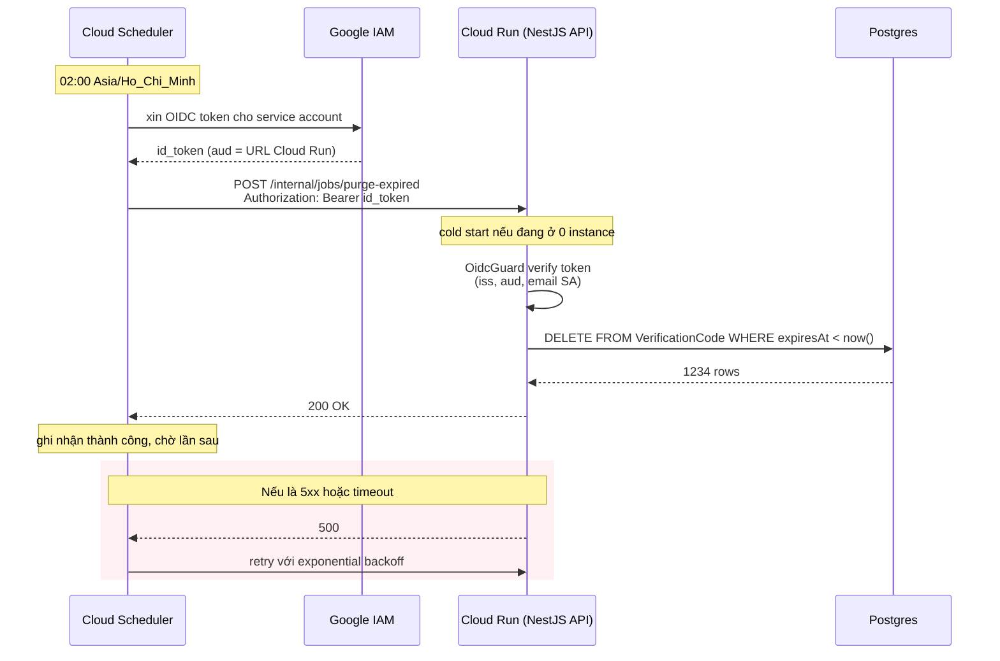
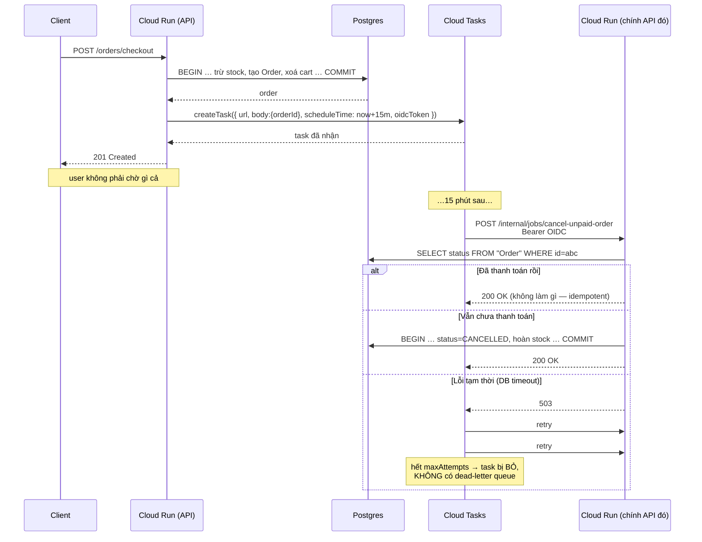
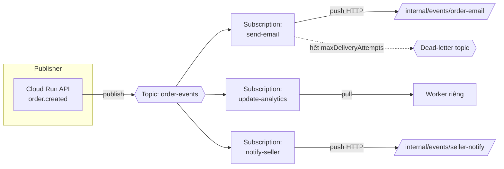
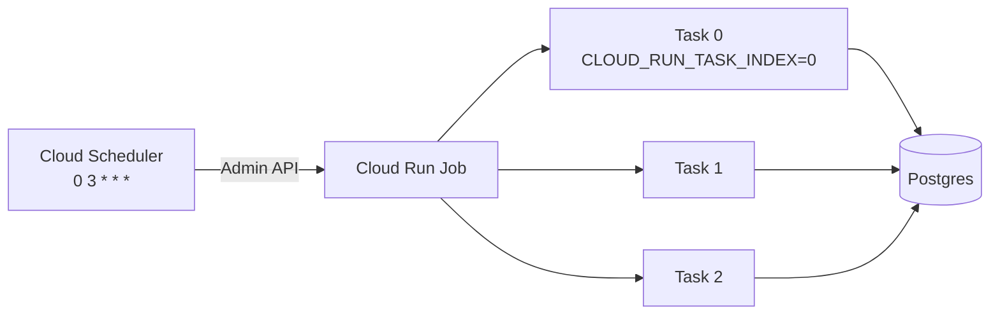
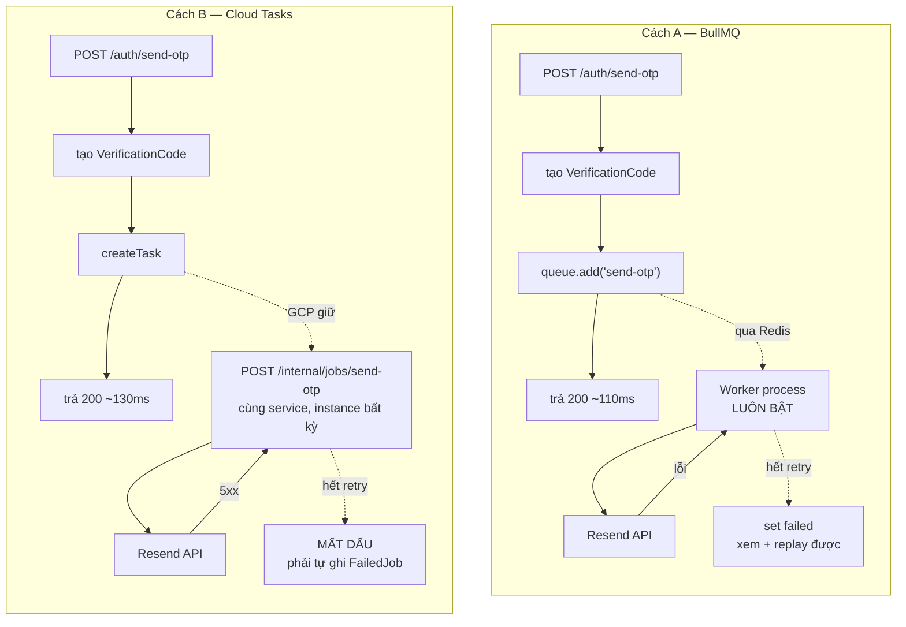
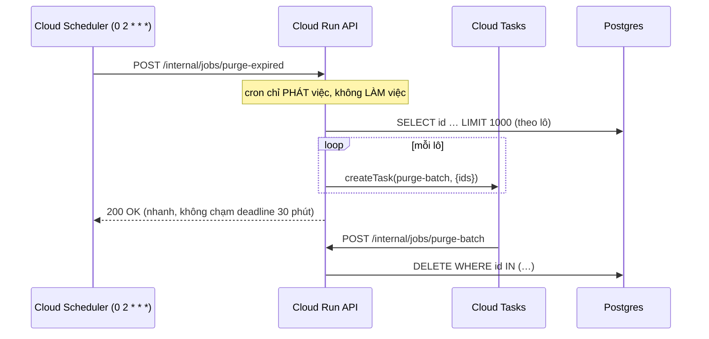

# Message queue & scheduler: GCP managed vs BullMQ vs thư viện NestJS

Tài liệu so sánh ba nhóm lựa chọn để chạy việc nền trong dự án này, kèm flow chi tiết từng cái:

1. **Dịch vụ managed của GCP** — Cloud Scheduler, Cloud Tasks, Pub/Sub, Cloud Run Jobs, Workflows, Eventarc
2. **BullMQ** — queue tự vận hành trên Redis
3. **Thư viện tích hợp sẵn của NestJS** — `@nestjs/schedule`, `@nestjs/bullmq`, `@nestjs/event-emitter`, `@nestjs/microservices`

> **Quan hệ với tài liệu khác.** [queue-job-worker-scheduler-guide.md](queue-job-worker-scheduler-guide.md) dạy _khái niệm_ (job, worker, retry, idempotency, outbox) và đi sâu vào BullMQ — đọc nó trước nếu bạn chưa nắm những từ đó. Tài liệu này không lặp lại khái niệm, nó trả lời câu hỏi kế tiếp: **chọn hạ tầng nào, và mỗi cái chạy ra sao**.
>
> Lưu ý: guide cũ ở §5 kết luận "với dự án này: BullMQ". Kết luận đó đúng trong bối cảnh deploy bằng container tự quản (VM, K8s, docker-compose). Nó **không còn đúng hiển nhiên** nếu deploy lên Cloud Run — mục 2 giải thích vì sao, mục 11 chốt lại khuyến nghị.

> **Về số liệu.** Hạn mức và giá GCP trong tài liệu này ghi theo thời điểm viết. Chúng đổi theo thời gian — luôn đối chiếu lại tài liệu chính thức trước khi thiết kế dựa vào một con số cụ thể.

---

## 1. Trạng thái hiện tại của dự án

Trước khi so sánh, chốt lại thực tế để không bàn trên giả định:

| Thứ                  | Hiện trạng                                                                                            |
| -------------------- | ----------------------------------------------------------------------------------------------------- |
| Queue / job / worker | **Chưa có gì.** Không `bullmq`, không `@nestjs/schedule`, không microservice transport                |
| Redis                | Đã có ([redis.service.ts](../src/shared/services/redis.service.ts)), dùng cho cache RBAC + rate limit |
| Lưu trữ file         | **AWS S3** (`@aws-sdk/client-s3`)                                                                     |
| Email                | **Resend** (`resend`), và đang bị comment out ở [auth.service.ts](../src/routes/auth/auth.service.ts) |
| GCP                  | **Chưa dùng dịch vụ nào**                                                                             |
| CI/CD                | GitHub Actions                                                                                        |

Nghĩa là: mọi dịch vụ GCP nói dưới đây đều là **hạ tầng mới phải thêm**, còn BullMQ thì tái dùng Redis đang có. Đó là một điểm cộng thật của BullMQ, nhưng chưa đủ để quyết — đọc tiếp.

---

## 2. Mô hình gốc: pull vs push

Đây là thứ quyết định mọi so sánh phía sau. Bỏ qua nó thì các bảng so sánh chỉ là danh sách tính năng rời rạc.

### 2.1 Pull — worker tự đi lấy việc

BullMQ, SQS, Kafka, RabbitMQ đều thuộc nhóm này.

```
┌──────────────┐  add job   ┌─────────┐
│  API process │ ─────────► │  Redis  │
└──────────────┘            └─────────┘
                                 ▲
                                 │ vòng lặp: "có việc không?" (blocking)
                                 │
                        ┌────────┴────────┐
                        │ Worker process  │  ← phải LUÔN SỐNG
                        └─────────────────┘
```

Worker là một vòng lặp vô tận. Nó chỉ chạy được việc khi nó đang sống và đang có CPU. **Không có worker sống thì job nằm im trong Redis vĩnh viễn.**

### 2.2 Push — hạ tầng gọi vào API của bạn

Cloud Tasks, Cloud Scheduler, Pub/Sub (push subscription) thuộc nhóm này.

```
┌──────────────┐ create task ┌──────────────┐
│  API process │ ──────────► │ Cloud Tasks  │
└──────────────┘             └──────────────┘
       ▲                             │
       │      HTTP POST đúng giờ     │
       └─────────────────────────────┘
       (chính API đó nhận, không cần process thứ hai)
```

Không có worker. Hạ tầng giữ job, đến giờ thì **gửi một HTTP request** vào endpoint của bạn. Với ứng dụng scale-to-zero, request đó tự đánh thức instance.

### 2.3 Vì sao sự khác biệt này quan trọng trên Cloud Run

Cloud Run mặc định: `min-instances=0` và **CPU chỉ được cấp khi đang xử lý request**. Ghép với hai mô hình trên:

|                  | Pull (BullMQ)                                                     | Push (Cloud Tasks / Scheduler)                |
| ---------------- | ----------------------------------------------------------------- | --------------------------------------------- |
| Không có traffic | Instance bị thu hồi → **không ai nhặt job**                       | Job vẫn được giao, request đánh thức instance |
| Giữa hai request | CPU bị bóp → vòng lặp worker **đứng hình**                        | Không liên quan, vì không có vòng lặp         |
| Muốn chạy được   | `min-instances=1` + `--no-cpu-throttling` → **trả tiền 24/7**     | Trả tiền theo lượt gọi                        |
| Nhiều instance   | Mỗi instance một worker — cần queue lo phân phối (BullMQ lo được) | Mỗi task giao đúng một lần cho một instance   |

Tóm lại: **trên Cloud Run, mô hình push loại bỏ hẳn nhu cầu có một service thứ hai luôn bật.** Trên VM/K8s thì lợi thế này biến mất, và BullMQ lại mạnh hơn hẳn về tính năng.

Kết luận sớm cho bạn đỡ phải đọc hết: **chọn theo nơi deploy, không chọn theo danh sách tính năng.**

---

## 3. Bản đồ dịch vụ GCP

Sáu dịch vụ, mỗi cái một câu:

| Dịch vụ             | Một câu                                                          | Thay thế cho gì trong thế giới tự quản   |
| ------------------- | ---------------------------------------------------------------- | ---------------------------------------- |
| **Cloud Scheduler** | Cron được quản lý, bắn HTTP/Pub/Sub đúng giờ                     | `@nestjs/schedule`, crontab, K8s CronJob |
| **Cloud Tasks**     | Hàng đợi job, **mỗi task hẹn giờ riêng**, gọi HTTP endpoint      | BullMQ (phần job queue + delayed job)    |
| **Pub/Sub**         | Message broker theo topic, fan-out nhiều consumer                | Kafka, RabbitMQ, Redis pub/sub           |
| **Cloud Run Jobs**  | Container chạy tới khi xong rồi thoát                            | K8s Job, script chạy tay                 |
| **Workflows**       | Orchestration có state, `sleep` được tới hàng năm                | BullMQ Flow, saga tự viết                |
| **Eventarc**        | Định tuyến event hạ tầng (GCS, Firestore, Audit Log) → Cloud Run | S3 event notification → Lambda           |

Hai cái đầu là phần bạn cần cho dự án này. Bốn cái sau để biết khi nào **không** cần chúng.

---

## 4. Chi tiết từng dịch vụ GCP

### 4.1 Cloud Scheduler — cron được quản lý

**Là gì:** một bản ghi `{cron expression, timezone, target, retry config}`. Đến giờ, GCP gửi một request. Hết. Nó không chạy code của bạn, không lưu job, không biết kết quả ngoài mã HTTP.

**Flow:**



**Thông số cần biết:**

- Cú pháp unix-cron, **nhỏ nhất 1 phút/lần**. Cần dày hơn thì đây không phải công cụ đúng.
- Bắt buộc đặt timezone. Không đặt thì chạy UTC — "2h sáng" của bạn thành 9h sáng của khách.
- `attemptDeadline`: mặc định 3 phút, tối đa 30 phút cho HTTP target. Job chạy lâu hơn thì Scheduler coi là thất bại và retry, **trong khi job cũ vẫn đang chạy** → chạy chồng. Đây là lý do mục 4.4 tồn tại.
- Giao hàng **at-least-once**: handler phải idempotent.
- Giá: vài job đầu miễn phí mỗi billing account, sau đó tính theo job/tháng — rẻ đến mức không cần cân nhắc.

**Tích hợp NestJS:** không cần thư viện gì. Cloud Scheduler chỉ gửi HTTP, nên phía NestJS chỉ là một controller bình thường + một guard xác thực.

```ts
// src/routes/internal-jobs/internal-jobs.controller.ts
@UseGuards(GoogleOidcGuard)
@ApiExcludeController() // không lộ ra swagger.yaml public
@Controller("internal/jobs")
export class InternalJobsController {
  constructor(private readonly jobsService: InternalJobsService) {}

  @Post("purge-expired")
  @SkipThrottle() // ThrottlerGuard hiện có sẽ chặn nhầm nếu không bỏ qua
  purgeExpired() {
    return this.jobsService.purgeExpired();
  }
}
```

Guard verify token bằng `google-auth-library` — **package đã có sẵn trong dự án**, đang dùng cho Google OAuth login ở [google.service.ts](../src/routes/auth/google.service.ts):

```ts
@Injectable()
export class GoogleOidcGuard implements CanActivate {
  private readonly client = new OAuth2Client();

  async canActivate(context: ExecutionContext): Promise<boolean> {
    const request = context.switchToHttp().getRequest<Request>();
    const token = request.headers.authorization?.replace(/^Bearer /, "");

    if (!token) return false;

    // verifyIdToken kiểm tra chữ ký, issuer và hạn — không tự parse JWT.
    const ticket = await this.client.verifyIdToken({
      idToken: token,
      audience: this.config.appConfig.cloudRunAudience,
    });

    // Chỉ chữ ký hợp lệ là chưa đủ: bất kỳ ai có tài khoản Google đều lấy được
    // token hợp lệ. Phải chốt đúng service account mình cho phép.
    return ticket.getPayload()?.email === this.config.appConfig.jobInvokerSa;
  }
}
```

> **Bẫy bảo mật hay gặp:** chỉ verify chữ ký mà không kiểm tra `email` (hoặc `aud`) là mở toang endpoint cho bất kỳ ai có token Google. Hai điều kiện phải đi cùng nhau.

---

### 4.2 Cloud Tasks — hàng đợi job, hẹn giờ theo từng task

**Là gì:** thứ gần BullMQ nhất trong GCP, nhưng **đảo chiều**. Bạn không có worker; bạn đưa cho Cloud Tasks một URL, nó gọi URL đó thay bạn, có retry và rate limit.

**Khác Cloud Scheduler ở chỗ nào:** Scheduler là _lịch cố định, không dữ liệu_ ("2h sáng mỗi ngày"). Cloud Tasks là _một task một dữ liệu, giờ hẹn riêng từng cái_ ("đơn hàng `abc` này, 15 phút nữa"). Nghiệp vụ kiểu "hủy đơn nếu 15 phút không thanh toán" **chỉ làm được bằng Cloud Tasks**, cron không diễn đạt nổi.

**Flow đầy đủ, gồm cả nhánh lỗi:**



**Thông số cần biết:**

- `scheduleTime` hẹn xa tối đa khoảng **30 ngày**.
- Payload tối đa khoảng **1 MB** — đẩy ID, đừng đẩy cả object. (Nguyên tắc này đúng với mọi queue, xem guide cũ §6.3.)
- `dispatchDeadline` tối đa khoảng 30 phút cho HTTP target.
- Rate limit **theo queue**: `maxDispatchesPerSecond`, `maxConcurrentDispatches`. Đây là tính năng đắt giá — nó bảo vệ bên thứ ba. Ví dụ Resend giới hạn N email/giây, đặt `maxDispatchesPerSecond` khớp với N là xong, không cần code rate limiter.
- Retry cấu hình theo queue: `maxAttempts`, `minBackoff`, `maxBackoff`, `maxDoublings`.
- **Không có dead-letter queue.** Hết số lần retry là task biến mất, không còn dấu vết ngoài log. Đây là khác biệt lớn nhất so với BullMQ (có `failed` set xem và replay được) và so với Pub/Sub (có dead-letter topic). **Muốn không mất dấu thì phải tự ghi bảng `FailedJob` ở lần thử cuối.**
- Khử trùng lặp bằng cách đặt tên task (unique trong khoảng ~1 giờ sau khi hoàn thành), nhưng GCP khuyến cáo cách này làm giảm throughput đáng kể. Thường tốt hơn là để handler idempotent.
- Giao hàng **at-least-once**, **không đảm bảo thứ tự**.
- Giá: một lượng lớn thao tác mỗi tháng miễn phí, sau đó tính theo triệu thao tác — với tải của dự án học tập thì gần như bằng 0.

**Tích hợp NestJS:** thêm `@google-cloud/tasks`, và bọc lại sau một interface của riêng mình. Đừng để `CloudTasksClient` rò rỉ vào service nghiệp vụ:

```ts
// src/shared/services/task-queue.service.ts
export interface EnqueueOptions {
  path: string; // "/internal/jobs/cancel-unpaid-order"
  payload: Record<string, unknown>;
  delaySeconds?: number;
}

@Injectable()
export class CloudTasksQueueService implements TaskQueueService {
  private readonly client = new CloudTasksClient();

  async enqueue({
    path,
    payload,
    delaySeconds = 0,
  }: EnqueueOptions): Promise<void> {
    const { project, location, queue, baseUrl, invokerSa } =
      this.config.appConfig.cloudTasks;

    await this.client.createTask({
      parent: this.client.queuePath(project, location, queue),
      task: {
        httpRequest: {
          httpMethod: "POST",
          url: `${baseUrl}${path}`,
          headers: { "Content-Type": "application/json" },
          body: Buffer.from(JSON.stringify(payload)).toString("base64"),
          oidcToken: { serviceAccountEmail: invokerSa },
        },
        scheduleTime: delaySeconds
          ? { seconds: Math.floor(Date.now() / 1000) + delaySeconds }
          : undefined,
      },
    });
  }
}
```

Nhờ interface này, phía nghiệp vụ không biết gì về GCP và đổi sang BullMQ chỉ là thay provider:

```ts
await this.taskQueue.enqueue({
  path: "/internal/jobs/cancel-unpaid-order",
  payload: { orderId: order.id },
  delaySeconds: 15 * 60,
});
```

> **Bẫy transaction:** `createTask` nằm **ngoài** transaction Postgres. Commit xong rồi mà `createTask` lỗi mạng → đơn hàng tồn tại nhưng không ai hẹn hủy nó, stock kẹt vĩnh viễn. Đây đúng là vấn đề dual-write mà guide cũ §16 mô tả, và lời giải vẫn là **Outbox** — không dịch vụ managed nào cứu được. Xem mục 9.

---

### 4.3 Pub/Sub — broker theo topic, cho fan-out

**Là gì:** publisher gửi message vào **topic**; mỗi **subscription** của topic đó nhận một bản sao độc lập. Đây là công cụ cho "một sự kiện, nhiều bên quan tâm", không phải cho "chạy một việc nền".

**Khác Cloud Tasks ở đâu:** Cloud Tasks là _một task → một endpoint_, bạn biết chính xác ai sẽ chạy. Pub/Sub là _một event → N subscriber_, publisher không biết ai nghe. Chọn sai cái là chuốc phức tạp không cần thiết.



**Push vs pull subscription:**

|                   | Push                          | Pull                                    |
| ----------------- | ----------------------------- | --------------------------------------- |
| Ai chủ động       | Pub/Sub gọi HTTP vào bạn      | Consumer mở kết nối kéo về              |
| Hợp với Cloud Run | **Có** — scale từ 0 được      | Không — cần process luôn sống           |
| Ack               | Trả 2xx = ack, non-2xx = nack | Gọi `ack()` tường minh                  |
| Deadline          | Thời gian trả lời HTTP        | `ackDeadline` 10s mặc định, tối đa 600s |
| Exactly-once      | Không                         | **Có** (bật được trên pull)             |
| Kiểm soát nhịp    | Kém — Pub/Sub có thể dồn dập  | Tốt — tự quyết kéo bao nhiêu            |

**Thông số cần biết:**

- Message tối đa 10 MB, giữ mặc định 7 ngày (chỉnh được tới 31 ngày).
- **Có dead-letter topic** — hơn hẳn Cloud Tasks ở mặt vận hành, nhưng phải cấu hình IAM cho đúng thì nó mới hoạt động.
- Ordering key đảm bảo thứ tự **trong cùng một key và cùng region**, đổi lại throughput giảm.
- Không có "delay 15 phút cho riêng message này" — muốn delay phải tự bịa (publish muộn, hoặc nack có chủ đích). **Cần delay thì dùng Cloud Tasks.**
- Giá theo dung lượng dữ liệu, có hạn mức miễn phí hàng tháng.

**Tích hợp NestJS:** `@nestjs/microservices` **không có transporter Pub/Sub chính thức**. Có package cộng đồng, nhưng với push subscription thì đơn giản nhất là coi nó như một HTTP endpoint thường — giống hệt mục 4.1, chỉ khác là phải tự giải mã message:

```ts
@Post("order-email")
async handle(@Body() body: PubSubPushDto) {
  // Pub/Sub bọc payload trong message.data, base64
  const event = JSON.parse(
    Buffer.from(body.message.data, "base64").toString("utf8"),
  ) as OrderCreatedEvent;

  await this.emailService.sendOrderConfirmation(event);
  // Trả 2xx = ack. Ném lỗi = nack = Pub/Sub sẽ gửi lại.
}
```

**Dự án này có cần Pub/Sub không?** Hiện tại **không**. Chưa có sự kiện nào nhiều hơn một bên quan tâm. Nó chỉ đáng khi xuất hiện nhu cầu kiểu "đơn hàng tạo xong → gửi mail + cập nhật analytics + bắn cho seller + đẩy vào data warehouse", mỗi nhánh deploy và fail độc lập.

---

### 4.4 Cloud Run Jobs — container chạy xong rồi thoát

**Là gì:** khác Cloud Run _service_ (nhận HTTP, luôn sẵn sàng), Cloud Run _job_ không mở port. Nó chạy container, làm việc, thoát.

Giải quyết đúng giới hạn 30 phút của Cloud Scheduler: task timeout mặc định 10 phút và nâng được tới **168 giờ (7 ngày)**, tối đa **10.000 task**, kèm `parallelism` để chia việc chạy song song ([Create jobs](https://docs.cloud.google.com/run/docs/create-jobs)).



Mỗi task nhận biến môi trường `CLOUD_RUN_TASK_INDEX` và `CLOUD_RUN_TASK_COUNT` để tự chia phần việc.

**Dùng khi nào:** báo cáo doanh thu cuối tháng, re-index toàn bộ sản phẩm, backfill dữ liệu sau migration — những việc mà gói trong một HTTP request là sai.

**Tích hợp NestJS:** dùng lại chính codebase, chỉ khác entrypoint. Tạo `src/job.ts` boot app bằng `NestFactory.createApplicationContext()` (không `listen()`, không HTTP server), chạy service rồi `process.exit()`:

```ts
// src/job.ts — dùng cho Cloud Run Jobs, dùng chung Dockerfile với API
async function main() {
  const app = await NestFactory.createApplicationContext(AppModule);
  try {
    await app.get(ReportService).generateMonthlyReport();
  } finally {
    await app.close();
  }
}
```

Đây chính là pattern mà [initial-scripts/create-permission.ts](../initial-scripts/create-permission.ts) đã dùng — boot app, làm việc, `app.close()`. Repo đã quen mô hình này.

---

### 4.5 Workflows — orchestration có state

**Là gì:** định nghĩa một chuỗi bước bằng YAML, GCP giữ state giữa các bước. Ngủ được tới **một năm**, chờ callback được, rẽ nhánh và bắt lỗi được.

Đáng nhắc tới vì nó là lời giải cho saga: "tạo đơn → chờ thanh toán tối đa 24h → nếu có thì xác nhận, không thì hủy và hoàn stock". Với Cloud Tasks bạn phải tự ghép nhiều task và tự giữ trạng thái; với Workflows thì trạng thái là của GCP.

**Đánh đổi:** logic nghiệp vụ bị đẩy ra YAML ngoài codebase — không test bằng Jest được, không refactor bằng TypeScript được, review khó. Với đội nhỏ, cái giá đó thường lớn hơn lợi ích.

**Khuyến nghị cho dự án này:** chưa cần. Chuỗi nghiệp vụ hiện tại đủ ngắn để một Cloud Task hẹn giờ + một cột status trong DB lo trọn.

---

### 4.6 Eventarc — event hạ tầng → Cloud Run

Định tuyến event từ GCS, Firestore, Cloud Audit Logs… tới Cloud Run. Ví dụ kinh điển: file upload lên GCS → tự trigger resize ảnh.

**Với dự án này thì không dùng được**, vì file đang nằm trên **AWS S3** ([s3.service.ts](../src/shared/services/s3.service.ts)). Muốn có mô hình event-driven cho ảnh thì hoặc chuyển sang GCS, hoặc dùng S3 Event Notification của AWS, hoặc đơn giản nhất: sau khi upload xong thì tự `enqueue` một task — cách này không phụ thuộc nhà cung cấp nào.

---

## 5. Phía NestJS: các thư viện tích hợp

### 5.1 `@nestjs/schedule` — cron in-process

```ts
@Injectable()
export class CleanupService {
  @Cron("0 2 * * *", { timeZone: "Asia/Ho_Chi_Minh" })
  async purgeExpired() { … }
}
```

Bên trong chỉ là `setTimeout`/`setInterval` + thư viện `cron`, **chạy trong chính tiến trình API**. Không lưu trữ, không lock, không biết instance khác tồn tại.

Ba điểm chết trên Cloud Run — đã phân tích ở mục 2.3: scale-to-zero thì không ai chạy, CPU throttling làm timer trễ bất định, nhiều instance thì chạy trùng N lần.

**Dùng khi nào:** deploy trên VM/K8s với đúng **một** replica, và việc đó vô hại nếu lỡ trượt (in metric, dọn file tạm local). Ngoài ra thì không.

`SchedulerRegistry` cho phép thêm/xóa cron lúc runtime — hữu ích, nhưng không sửa được ba vấn đề trên.

### 5.2 `@nestjs/bullmq` — wrapper DI quanh BullMQ

Đây là lựa chọn tự quản đầy đủ tính năng nhất trong hệ NestJS. Guide cũ §6 đã hướng dẫn chi tiết; dưới đây chỉ nhắc phần cần cho việc so sánh.

**Flow:**

```mermaid
sequenceDiagram
    participant API as API process (producer)
    participant R as Redis
    participant W as Worker process (consumer)

    API->>R: queue.add("send-otp", {…}, {delay, attempts:3, backoff})
    Note over R: job vào sorted set "delayed"<br/>(hoặc list "waiting" nếu không delay)
    API-->>API: trả response ngay

    loop vòng lặp vô tận — worker phải luôn sống
        W->>R: BZPOPMIN / blocking fetch
        R-->>W: job
        W->>W: chạy processor
        alt thành công
            W->>R: chuyển sang "completed"
        else lỗi
            W->>R: tăng attemptsMade, hẹn lại theo backoff
            Note over R: hết attempts → vào set "failed"<br/>= DLQ có sẵn, xem và replay được
        end
    end

    Note over W,R: worker gia hạn lock định kỳ;<br/>worker chết → job thành "stalled" → job khác nhặt lại
```

**Thứ BullMQ có mà GCP không có:**

- **Dead-letter thật sự** — set `failed` xem được, sửa được, replay được từ Bull Board. Cloud Tasks hết retry là mất trắng.
- **Flow / job phụ thuộc** — cha chỉ chạy khi mọi con xong. Đúng cho "resize 3 kích thước xong mới cập nhật Product".
- **Priority, rate limit theo group, dashboard** — Bull Board cho thấy toàn bộ job đang chờ/đang chạy/đã hỏng, không phải đi mò Cloud Logging.
- **Chạy local giống hệt production** — `docker-compose` đã có Redis. Đây là lợi ích rất thật khi phát triển hằng ngày.
- **Không khóa nhà cung cấp** — chạy ở đâu có Redis là chạy được.

**Thứ phải trả giá:**

- Cần một process luôn sống → trên Cloud Run là một service thứ hai `min-instances=1 --no-cpu-throttling`, cộng Memorystore (hoặc Redis tự dựng).
- **Job nằm trong Redis, mà Redis là in-memory.** Không bật AOF, hoặc failover, là mất job. Guide cũ §5 đã cảnh báo, vẫn đúng.
- Vận hành là việc của bạn: theo dõi, cảnh báo, nâng cấp, sao lưu.

**Lưu ý kỹ thuật:** connection cho BullMQ phải đặt `maxRetriesPerRequest: null`, **không dùng lại** `RedisService` hiện có ([redis.service.ts](../src/shared/services/redis.service.ts)) — service đó cố tình đặt `maxRetriesPerRequest: 2` và `enableOfflineQueue: false` để cache fail nhanh. Dùng chung sẽ làm worker BullMQ đứt kết nối liên tục. Hai mục đích khác nhau thì hai connection khác nhau.

### 5.3 `@nestjs/event-emitter` — **không phải** queue

Hay bị dùng nhầm, nên phải nói rõ:

```ts
this.eventEmitter.emit("order.created", payload); // chạy NGAY, CÙNG process
```

Nó là `EventEmitter2` trong bộ nhớ. **Không persistence, không retry, không vượt qua ranh giới process.** Process chết là mọi handler đang chờ bay sạch. `emitAsync` cũng chỉ là chờ các listener resolve — vẫn trong cùng request.

**Giá trị thật của nó:** tách rời module trong cùng một process (OrderService không cần biết EmailService tồn tại). Đó là lợi ích về _thiết kế code_, không phải về _độ tin cậy_.

**Cách dùng đúng:** emit event → listener `enqueue` một job vào queue thật. Đừng để listener tự gọi Resend hay S3.

### 5.4 `@nestjs/microservices` — transporter

Nest có sẵn transporter cho Redis, RabbitMQ, Kafka, NATS, MQTT, gRPC, TCP. Hai loại pattern:

- `@MessagePattern` — request/response, có chờ kết quả
- `@EventPattern` — fire-and-forget

**Bẫy lớn nhất:** transporter Redis dùng **Redis pub/sub**, mà pub/sub là **fire-and-forget không lưu trữ** — không có subscriber lúc publish thì message biến mất vĩnh viễn. Nó _trông_ giống queue nhưng không có bảo đảm nào của queue. Cần độ bền thì dùng BullMQ (cũng trên Redis) chứ không dùng transporter Redis.

**Không có transporter Pub/Sub của GCP chính thức.** Với push subscription thì cũng không cần — HTTP controller là đủ.

**Dự án này có cần không?** Không. `@nestjs/microservices` dành cho kiến trúc nhiều service gọi nhau; dự án đang là một monolith và nên giữ vậy.

### 5.5 Bảng tra nhanh thư viện

| Thư viện                | Thực chất là gì              | Có bền không    | Dùng cho                            |
| ----------------------- | ---------------------------- | --------------- | ----------------------------------- |
| `@nestjs/schedule`      | `setTimeout` in-process      | Không           | Cron vô hại, 1 replica              |
| `@nestjs/bullmq`        | Queue trên Redis             | Có (nếu AOF)    | Job nền đầy đủ tính năng            |
| `@nestjs/event-emitter` | EventEmitter in-memory       | **Không**       | Tách module, **không** phải job nền |
| `@nestjs/microservices` | RPC/event qua transporter    | Tùy transporter | Nhiều service gọi nhau              |
| `@nestjs/cqrs`          | Command/event bus in-process | Không           | Tổ chức code, không phải hạ tầng    |
| `@google-cloud/tasks`   | SDK gọi REST API             | Có (GCP giữ)    | Job nền trên Cloud Run              |

---

## 6. So sánh trực diện

| Tiêu chí                    | `@nestjs/schedule` | BullMQ                  | Cloud Scheduler | Cloud Tasks         | Pub/Sub            |
| --------------------------- | ------------------ | ----------------------- | --------------- | ------------------- | ------------------ |
| Mô hình                     | In-process         | **Pull**                | **Push**        | **Push**            | Push hoặc pull     |
| Cần worker luôn bật         | Không¹             | **Có**                  | Không           | Không               | Không (push)       |
| Chạy được khi scale-to-zero | **Không**          | **Không**               | Có              | Có                  | Có                 |
| Job sống sót restart        | Không              | Có (Redis)              | Có              | Có                  | Có                 |
| Delay riêng từng job        | Không              | **Có**                  | Không           | **Có** (≤30 ngày)   | Không              |
| Retry + backoff             | Không              | **Có**                  | Có              | **Có**              | Có                 |
| Dead-letter                 | Không              | **Có** (`failed` set)   | Không           | **Không**           | **Có** (DLQ topic) |
| Fan-out nhiều consumer      | Không              | Không                   | Không           | Không               | **Có**             |
| Đảm bảo thứ tự              | —                  | Có (FIFO queue)         | —               | Không               | Có (ordering key)  |
| Rate limit đầu ra           | Không              | Có                      | —               | **Có** (theo queue) | Khó kiểm soát      |
| Dashboard                   | Không              | **Có** (Bull Board)     | Console         | Console             | Console            |
| Chạy local giống prod       | **Có**             | **Có** (docker-compose) | Không¹          | Không¹              | Có (emulator)      |
| Khóa nhà cung cấp           | Không              | Không                   | **Có**          | **Có**              | **Có**             |
| Chi phí ở tải thấp          | 0                  | Redis + worker 24/7     | ~0              | ~0                  | ~0                 |
| Công vận hành               | Không có           | **Cao**                 | Rất thấp        | Thấp                | Trung bình         |

¹ Local có emulator cho Pub/Sub; Cloud Tasks và Scheduler thì không có emulator chính thức — xem mục 10 để biết cách lách.

---

## 7. Flow chi tiết cho ba kịch bản thật của dự án

Phần này đặt hai cách cạnh nhau trên cùng một bài toán có thật trong repo.

### 7.1 Gửi OTP email — [auth.service.ts:439](../src/routes/auth/auth.service.ts#L439)

Hiện trạng: lời gọi Resend đang **bị comment out hoàn toàn**, kể cả `emailService` ở constructor. Tính năng gửi OTP đang không chạy. Bật lại kiểu đồng bộ sẽ chặn request ~800ms và Resend lỗi là API lỗi.



Điểm đáng chú ý: cách B **không cần process thứ hai**, nhưng phải tự lo chỗ chứa job hỏng. `maxDispatchesPerSecond` của Cloud Tasks khớp thẳng với quota của Resend, điều mà BullMQ phải cấu hình limiter riêng.

### 7.2 Hủy đơn quá hạn thanh toán — [order-checkout.repository.ts:63](../src/repositories/order/order-checkout.repository.ts#L63)

Đây là lỗ hổng nghiệp vụ đang tồn tại: checkout trừ stock trong transaction, nhưng **không có gì hoàn stock nếu đơn treo không thanh toán**. Chỉ có `cancelOrder` do user bấm tay ([order-cancel.repository.ts:24](../src/repositories/order/order-cancel.repository.ts#L24)).

Cron **không giải được bài này một cách sạch sẽ**: quét định kỳ "đơn nào quá 15 phút" thì độ trễ bằng chu kỳ cron, và mỗi lần quét là một lần full scan. Cần hẹn giờ riêng cho từng đơn.

|                           | BullMQ                                             | Cloud Tasks                                                    |
| ------------------------- | -------------------------------------------------- | -------------------------------------------------------------- |
| Đẩy job                   | `queue.add(…, { delay: 900_000, jobId: orderId })` | `createTask({ scheduleTime: now+15m })`                        |
| Khử trùng lặp             | `jobId` trùng thì bị bỏ qua — **miễn phí**         | Phải đặt tên task (giảm throughput) hoặc để handler idempotent |
| Hủy job khi đã thanh toán | `job.remove()` — chủ động dọn                      | `deleteTask()`, hoặc để nó chạy rồi no-op                      |
| Đơn treo khi hạ tầng chết | Redis mất dữ liệu → mất lịch hẹn                   | GCP giữ, bền hơn                                               |

Cả hai cách đều **bắt buộc** handler phải kiểm tra `status` trước khi hoàn stock — task chạy hai lần mà hoàn stock hai lần là tạo hàng từ hư không.

### 7.3 Dọn dữ liệu hết hạn — `VerificationCode`, `RefreshToken`, `CartItem`

Đây là cron thuần, không cần dữ liệu riêng từng lần chạy. Cả ba bảng hiện **phình ra vô hạn** vì không có đường dọn nào ([verification-code.repository.ts:31](../src/repositories/verification-code/verification-code.repository.ts#L31) chỉ xóa theo email cụ thể).



Đây là nguyên tắc ở guide cũ §12.4 — **cron là kẻ phát job, không phải kẻ làm việc** — và trên GCP nó còn bắt buộc hơn, vì `attemptDeadline` của Cloud Scheduler chặn ở 30 phút. Việc dọn quá lớn cho một request thì đẩy sang Cloud Run Jobs (mục 4.4).

---

## 8. Thứ không dịch vụ nào cứu được

Chọn hạ tầng nào cũng phải tự giải ba vấn đề sau. Đây là lý do guide cũ dành hẳn §11 và §16 cho chúng.

**At-least-once là mặc định ở mọi lựa chọn.** BullMQ, Cloud Tasks, Cloud Scheduler, Pub/Sub push — tất cả đều có thể giao **nhiều hơn một lần**. Handler không idempotent thì sớm muộn cũng sinh dữ liệu sai. Pub/Sub có exactly-once nhưng chỉ cho pull subscription, tức lại cần worker luôn bật.

**Dual write vẫn là dual write.** `createTask` hay `queue.add` đều nằm ngoài transaction Postgres. Commit xong rồi enqueue lỗi = mất job im lặng. Job liên quan tới tiền thì cần **Outbox**: ghi một dòng `OutboxEvent` trong _cùng_ `$transaction` với dữ liệu nghiệp vụ, rồi một relay đọc outbox đẩy sang queue.

Với [order-checkout.repository.ts:72](../src/repositories/order/order-checkout.repository.ts#L72) — nơi đã có sẵn một interactive transaction — thêm outbox là chèn một `tx.outboxEvent.create()` vào đúng transaction đó. Với OTP email thì enqueue thẳng là đủ: mất một email hiếm khi xảy ra và user bấm gửi lại được.

**Endpoint nội bộ là bề mặt tấn công mới.** Chuyển từ pull sang push nghĩa là mở HTTP endpoint cho những việc trước đây không ai gọi được từ ngoài. Bắt buộc: xác thực OIDC **kèm** kiểm tra service account (mục 4.1), loại khỏi swagger public bằng `@ApiExcludeController()`, và bỏ qua `ThrottlerGuard` hiện có kẻo job bị chặn nhầm khi dồn.

---

## 9. Chi phí và vận hành

Ước lượng thô ở tải nhỏ (vài nghìn job/ngày), để thấy bậc độ lớn chứ không phải để làm dự toán:

| Phương án                     | Hạ tầng phải trả                                  | Bậc chi phí                      |
| ----------------------------- | ------------------------------------------------- | -------------------------------- |
| Cloud Scheduler + Cloud Tasks | Vài job cron + vài nghìn task                     | **Gần như 0**                    |
| BullMQ trên Cloud Run         | Memorystore + Cloud Run service thứ hai chạy 24/7 | **Hàng chục USD/tháng**          |
| BullMQ trên VM/K8s có sẵn     | Redis đã có, worker là một container nữa          | Gần như 0 nếu hạ tầng đã trả rồi |
| Pub/Sub                       | Theo dung lượng, có hạn mức miễn phí              | Gần như 0                        |

Khác biệt lớn nhất **không phải tiền, mà là công vận hành**. BullMQ đòi bạn tự theo dõi Redis, tự cảnh báo khi `failed` tăng, tự lo sao lưu và nâng cấp. Managed service thì GCP lo — đổi lại bạn mất dashboard trực quan và bị khóa vào nhà cung cấp.

---

## 10. Phát triển local

Đây là điểm yếu thật của phương án GCP, đừng bỏ qua khi quyết định.

|                             | Local                                                                                                 |
| --------------------------- | ----------------------------------------------------------------------------------------------------- |
| **BullMQ**                  | Thêm service Redis vào `docker-compose.yml` — **giống hệt production**. Bull Board chạy được ở local. |
| **Pub/Sub**                 | Có emulator chính thức (`gcloud beta emulators pubsub`).                                              |
| **Cloud Tasks / Scheduler** | **Không có emulator chính thức.**                                                                     |

Cách xử lý cho Cloud Tasks: nhờ đã bọc sau interface `TaskQueueService` (mục 4.2), ở local chỉ cần một implementation khác:

```ts
// Dev: gọi thẳng endpoint nội bộ sau delay, không qua GCP.
@Injectable()
export class InMemoryTaskQueueService implements TaskQueueService {
  async enqueue({ path, payload, delaySeconds = 0 }: EnqueueOptions) {
    setTimeout(() => {
      void this.httpService.post(`http://localhost:3000${path}`, payload);
    }, delaySeconds * 1000);
  }
}
```

Chọn provider theo `NODE_ENV` trong module. Thô nhưng đủ để phát triển, và vì handler là HTTP endpoint bình thường nên **e2e test gọi thẳng vào nó được** bằng `supertest` — không cần mock hạ tầng queue nào cả. Đây thực ra là một lợi thế test không nhỏ của mô hình push so với BullMQ.

---

## 11. Khuyến nghị cho dự án này

Câu trả lời phụ thuộc vào **nơi deploy**, và chỉ vào đó:

**Nếu deploy Cloud Run → Cloud Scheduler + Cloud Tasks.**
Không cần service thứ hai luôn bật, không cần Memorystore, không cần distributed lock. Chi phí gần như bằng 0 ở tải hiện tại. Đánh đổi: tự ghi bảng `FailedJob` để bù việc Cloud Tasks không có DLQ, và chấp nhận local phải giả lập.

**Nếu deploy VM / K8s / docker-compose → BullMQ**, đúng như guide cũ §5 kết luận. Redis đã có, tính năng đầy đủ hơn hẳn, chạy local giống production, không khóa nhà cung cấp.

**Không dùng `@nestjs/schedule`** cho bất cứ việc nào có tính nghiệp vụ, ở cả hai kịch bản.

**Chưa cần Pub/Sub, Workflows, Eventarc.** Ba cái này giải bài toán dự án chưa có.

### Lộ trình

Thứ tự này đúng cho cả hai phương án, vì bước 1 tạo ra lớp trừu tượng khiến bước sau đổi hạ tầng chỉ là thay provider:

1. **Dựng `TaskQueueService` interface + `InternalJobsController` + `GoogleOidcGuard`.** Chưa gắn nghiệp vụ nào. Chạy được với implementation in-memory ở local.
2. **Chuyển gửi OTP email sang job.** Rủi ro thấp nhất, và tiện thể bật lại tính năng đang chết ở [auth.service.ts:439](../src/routes/auth/auth.service.ts#L439).
3. **Thêm job hủy đơn quá hạn.** Vá lỗ hổng stock đang có thật. Handler phải idempotent — kiểm tra `status` trước khi hoàn stock.
4. **Thêm cron dọn `VerificationCode` / `RefreshToken` / `CartItem`.** Cron phát job theo lô, không tự dọn.
5. **Khi chạm tới thanh toán**, lúc đó mới dựng Outbox cho nhánh đơn hàng.

Mỗi bước một PR, có test, quan sát vài ngày rồi mới sang bước sau. Đừng làm cả năm bước một lúc.

---

## Tóm tắt một màn hình

- **Pull (BullMQ) cần worker luôn sống; push (Cloud Tasks/Scheduler) thì không.** Trên Cloud Run scale-to-zero, khác biệt này quyết định tất cả.
- **Cloud Scheduler** = cron không dữ liệu. **Cloud Tasks** = job có dữ liệu, hẹn giờ riêng từng cái. **Pub/Sub** = fan-out nhiều consumer. Ba việc khác nhau, đừng thay thế lẫn nhau.
- **Cloud Tasks không có dead-letter queue** — hết retry là mất trắng. BullMQ có `failed` set replay được. Đây là khác biệt vận hành lớn nhất.
- **`@nestjs/event-emitter` không phải queue.** In-memory, mất khi process chết. Dùng nó để tách module, rồi listener đẩy job vào queue thật.
- **`@nestjs/schedule` hỏng trên Cloud Run** theo cả ba cách: scale-to-zero, CPU throttling, multi-instance.
- **At-least-once và dual-write là của bạn**, không dịch vụ nào cứu. Idempotency bắt buộc; job liên quan tiền cần Outbox.
- Bọc sau một interface ngay từ đầu thì đổi hạ tầng về sau chỉ là thay provider.

---

## Đọc thêm

- [queue-job-worker-scheduler-guide.md](queue-job-worker-scheduler-guide.md) — khái niệm nền, BullMQ chi tiết, idempotency, outbox
- [bullmq-nestjs-schedule-deep-dive.md](bullmq-nestjs-schedule-deep-dive.md) — cơ chế bên trong BullMQ và `@nestjs/schedule`, và cách chạy BullMQ trên Cloud Run
- [gcp-queue-scheduler-deep-dive.md](gcp-queue-scheduler-deep-dive.md) — cơ chế chi tiết phía GCP: hạn mức, công thức retry, dead-letter, OIDC
- [redis-caching-guide.md](redis-caching-guide.md) và [redis-role-permission-cache.md](redis-role-permission-cache.md) — Redis đang được dùng thế nào, và vì sao không dùng chung connection với BullMQ
- [race-conditions-analysis.md](race-conditions-analysis.md) — bối cảnh cho phần idempotency của job hoàn stock
- **Google Cloud** (docs đã chuyển sang `docs.cloud.google.com`): [Cloud Tasks](https://docs.cloud.google.com/tasks/docs) · [Cloud Scheduler](https://docs.cloud.google.com/scheduler/docs) · [Pub/Sub](https://docs.cloud.google.com/pubsub/docs) · [Cloud Run Jobs](https://docs.cloud.google.com/run/docs/create-jobs) · [Workflows](https://docs.cloud.google.com/workflows/docs) · [Eventarc](https://docs.cloud.google.com/eventarc/docs)
- Ràng buộc Cloud Run trích ở §2.3: [Container runtime contract](https://docs.cloud.google.com/run/docs/container-contract) · [Billing settings (CPU always allocated)](https://docs.cloud.google.com/run/docs/configuring/billing-settings) · [About instance autoscaling](https://docs.cloud.google.com/run/docs/about-instance-autoscaling)
- [BullMQ docs](https://docs.bullmq.io/) · [@nestjs/bullmq](https://docs.nestjs.com/techniques/queues) · [@nestjs/schedule](https://docs.nestjs.com/techniques/task-scheduling)
