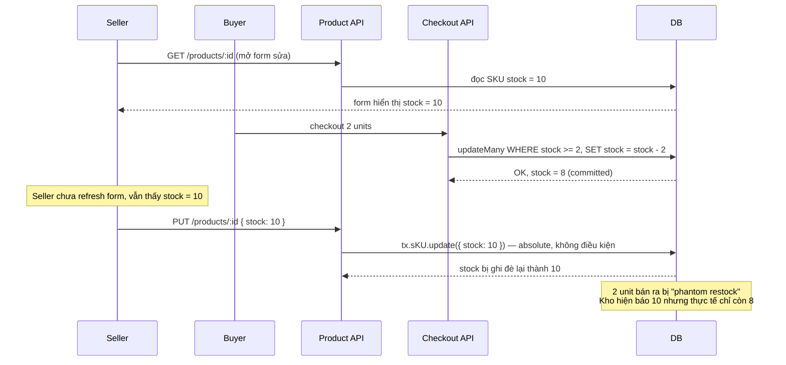
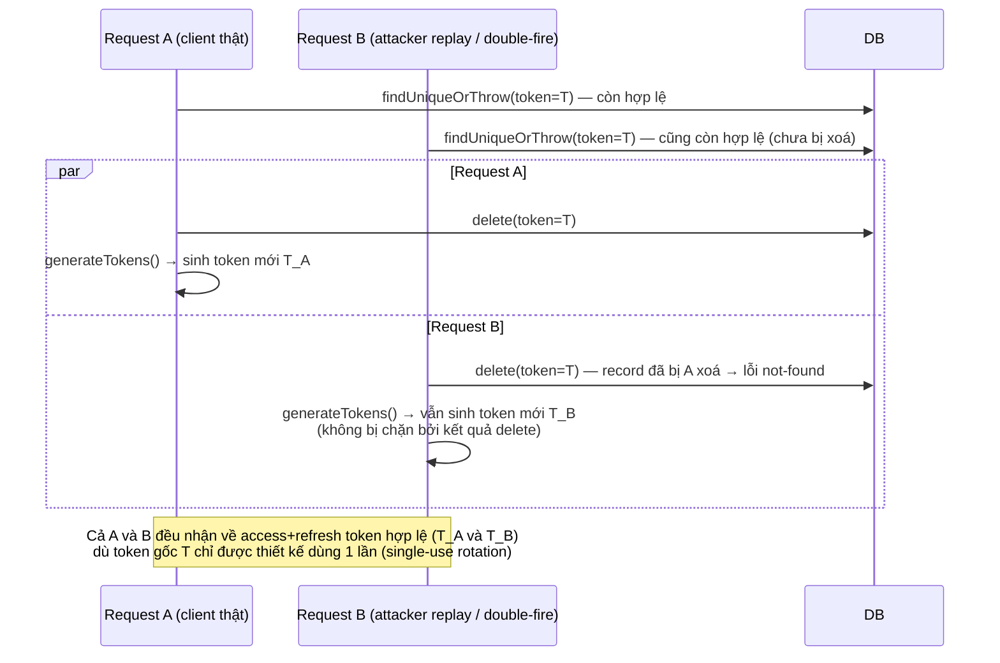
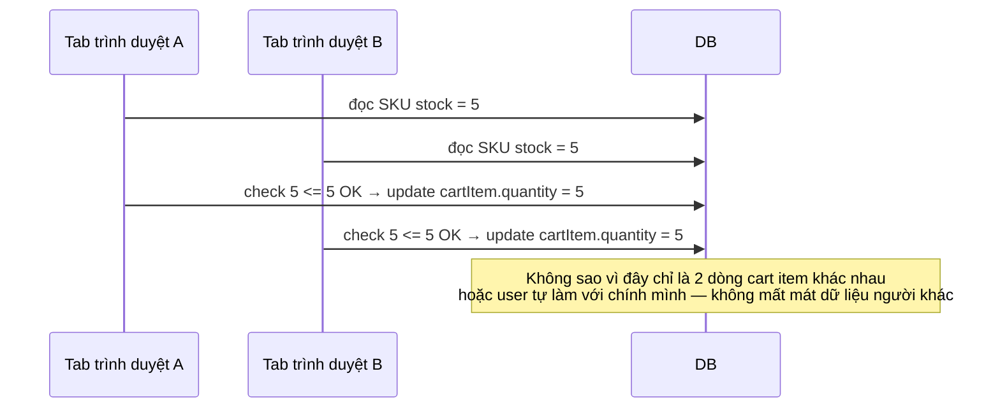

# Race Condition Analysis

> Phạm vi: toàn bộ `src/` (NestJS + Prisma). Mỗi mục đã được đọc trực tiếp source code để xác nhận
> (không suy đoán). Xếp theo mức độ nghiêm trọng giảm dần. Ngày phân tích: 2026-09-12.

## Tóm tắt

| #   | Vị trí                       | Loại race                  | Mức độ             | Có transaction/constraint chặn không           |
| --- | ---------------------------- | -------------------------- | ------------------ | ---------------------------------------------- |
| 1   | Seller sửa SKU stock         | Lost update                | **HIGH**           | Không — ghi đè tuyệt đối                       |
| 2   | Refresh token rotation       | TOCTOU (check-then-delete) | **HIGH**           | Không — 3 lệnh ghi độc lập trong `Promise.all` |
| 3   | Cart update quantity         | TOCTOU (soft check)        | Thấp               | Một phần — checkout re-validate atomically     |
| 4   | `SharedRoleRepository` cache | Singleton cache            | Không đáng kể      | N/A — giá trị bất biến                         |
| 5   | Permission seed script       | Check-then-create          | Thấp (deploy-time) | Không — bảng `Permission` thiếu unique index   |

---

## 1. [HIGH] Seller sửa sản phẩm ghi đè `stock`, đè lên phép trừ kho của checkout

**File:** `src/repositories/product/product.repository.ts:360-379` (trong `$transaction` bắt đầu ở dòng 282)

```ts
if (skusToUpdate.length > 0) {
  const updatePromises = skusToUpdate.map(
    ({ id, value, image, price, stock }) =>
      tx.sKU.update({
        where: { id },
        data: {
          value,
          image,
          price,
          stock,
          updatedById: userId,
          order: skuOrder[value],
        },
      }),
  );
  await Promise.all(updatePromises);
}
```

So sánh với checkout — nơi làm đúng — tại `src/repositories/order/order-checkout.repository.ts` (~dòng 90-97):
dùng `updateMany({ where: { stock: { gte: quantity } }, data: { stock: { decrement: quantity } } })`,
tức là **conditional update** dựa trên giá trị hiện tại trong DB, không phải giá trị đã đọc trước đó.

Ngược lại, đoạn sửa sản phẩm ở trên là **absolute update**: ghi thẳng `stock` bằng con số form đã đọc lúc mở
trang sửa, không có điều kiện `stock: { equals: previousStock }`, không có version column.

### Flow xảy ra lỗi



### Hậu quả

Kho lệch dữ liệu âm thầm, không có lỗi nào được raise ở cả hai phía. Lệch này cộng dồn theo mỗi lần sửa
sản phẩm trong lúc đang có giao dịch, dẫn tới oversell về sau (hệ thống tưởng còn hàng nhưng thực tế không).

### Đề xuất hướng khắc phục

- Thêm optimistic concurrency: client gửi kèm `stock` đã đọc lúc load form, server update có điều kiện
  `where: { id, stock: previousStock }`, nếu `count === 0` thì trả lỗi conflict yêu cầu reload.
- Hoặc tách trường `stock` ra khỏi API "sửa thông tin sản phẩm" — chỉ cho sửa qua một API riêng
  dùng increment/decrement tương tự checkout, không cho set giá trị tuyệt đối từ form chung.

---

## 2. [HIGH] Refresh token rotation: check-then-delete không atomic, có thể mint 2 token từ 1 token gốc

**File:** `src/routes/auth/auth.service.ts:284-354`, `src/repositories/refresh-token/refresh-token.repository.ts:57-72`

```ts
const refreshTokenInDb = await this.refreshTokenRepository.findUniqueOrThrow({
  where: { token: oldRefreshToken, deletedAt: null }, ...
});

const $deleteOldRefreshToken = this.refreshTokenRepository.delete({ where: { token: oldRefreshToken } });
const $updateDevice = this.deviceRepository.updateDevice({ ... });
const $generateTokens = this.generateTokens({ ... }); // sinh refresh token mới

const [_, __, tokens] = await Promise.all([$deleteOldRefreshToken, $updateDevice, $generateTokens]);
```

`findUniqueOrThrow` (đọc) và `delete` (xoá) là hai round-trip DB riêng biệt, không nằm trong transaction,
và quan trọng hơn: **`generateTokens` không chờ `delete` thành công rồi mới chạy** — cả ba chạy song song
trong `Promise.all`.

### Flow xảy ra lỗi



### Hậu quả

Vi phạm bất biến cốt lõi của refresh token rotation: một token cũ bị dùng lại (do lộ/replay) đáng lẽ phải
làm lộ ra hành vi bất thường (delete thất bại → từ chối cấp token mới), nhưng ở đây cả hai bên vẫn nhận
được token mới hợp lệ. Cơ chế phát hiện refresh-token-reuse gần như vô hiệu trong cửa sổ race này.

Ngoài ra, `delete()` trong `refresh-token.repository.ts:57-72` không bắt riêng lỗi
`isRecordNotFoundPrismaError` (khác với `createRefreshToken` đã xử lý case này), nên bên "thua" race
nhận một lỗi 500 không rõ nghĩa thay vì lỗi rõ ràng — nhưng vì `generateTokens` không phụ thuộc kết quả đó,
tokens vẫn được trả về trước khi lỗi delete kịp ảnh hưởng response.

### Đề xuất hướng khắc phục

- Gộp đọc + xoá thành một thao tác atomic: `deleteMany({ where: { token, deletedAt: null } })`, kiểm tra
  `count === 1` — nếu `count === 0` nghĩa là token đã bị dùng/xoá trước đó → từ chối, không sinh token mới,
  và cân nhắc revoke toàn bộ session của user (dấu hiệu token bị đánh cắp).
- Chỉ gọi `generateTokens()` **sau khi** xác nhận xoá thành công, không chạy song song trong `Promise.all`.

---

## 3. [Thấp] Cart update quantity — kiểm tra tồn kho kiểu TOCTOU, nhưng checkout đã chặn ở lớp dưới

**File:** `src/routes/cart/cart.service.ts:79-113` (`updateCartItemQuantity`)

```ts
const cartItem = await this.cartRepository.findUniqueCartItem({ cartItemId, userId });
if (quantity > cartItem.sku.stock) { throwHttpException(...); }
return this.cartRepository.updateCartItem({ cartItemId, userId, quantity }); // không re-check
```

### Flow



### Vì sao mức độ thấp

Đây chỉ là ràng buộc UX mềm ("đừng để user set số lượng vượt tồn kho hiển thị"), **không phải** chốt chặn
chống oversell thật sự. Chốt chặn thật nằm ở `OrderCheckoutRepository.checkout()` — dùng
`updateMany({ where: { stock: { gte } } })` atomic, re-validate tồn kho tại thời điểm đặt hàng bất kể cart
đang lưu số lượng gì. Vì vậy race này chỉ có thể gây hiển thị sai (cart cho phép số lượng cao hơn tồn kho
thực), không thể dẫn tới bán vượt kho.

`addCartItem` (khác `updateCartItemQuantity`) đã race-safe nhờ unique constraint
`@@unique([userId, skuId])` (`schema.prisma:455`) kết hợp retry-as-increment khi gặp lỗi P2002, xem
`src/repositories/cart/cart-upsert.util.ts:29-65`.

### Đề xuất (không bắt buộc)

Nếu muốn siết chặt hơn, đổi check sang conditional update tương tự checkout:
`updateMany({ where: { id, sku: { stock: { gte: quantity } } } })`.

---

## 4. [Không đáng kể] `SharedRoleRepository` — cache singleton trong process

**File:** `src/repositories/role/shared-role.repository.ts:12-13, 25-47, 57-79`

```ts
private clientRoleId: RoleId | null = null;
async getClientRoleId(): Promise<RoleId> {
  if (this.clientRoleId) return this.clientRoleId;
  const clientRole = await this.prismaService.role.findFirstOrThrow(...);
  this.clientRoleId = clientRole.id;
  return this.clientRoleId;
}
```

Provider này là default-scope (singleton) trong NestJS nên field `clientRoleId` dùng chung giữa mọi
request đồng thời trong cùng process — hình dạng giống hệt ví dụ "cache `getToken()` bị ghi đè" trong
`CLAUDE.md`. Tuy nhiên đã kiểm tra và xác nhận **không gây hại thực tế**: hai request cùng miss cache sẽ
cùng đọc DB và cùng ghi lại **đúng một giá trị UUID bất biến** (role "Client" không đổi ID theo thời gian) —
không có trạng thái "torn", không có giá trị sai, chỉ là đọc DB dư một lần. Khác biệt căn bản với race #2
(refresh token) là ở đó giá trị cache là _có thể thay đổi_ (token mới mỗi lần) nên race mới gây hậu quả.

**Không cần sửa** trừ khi sau này role ID trở thành giá trị có thể đổi (ví dụ role bị xoá và tạo lại với ID khác).

---

## 5. [Thấp — deploy-time] Script seed permission: check-then-create không có unique index bảo vệ

**File:** `initial-scripts/create-permission.ts:52-117`; `prisma/schema.prisma:182-202` (`model Permission`)

```ts
const permissionsInDb = await prisma.permission.findMany({ where: { deletedAt: null } });
const permissionsToAdd = availableRoutes.filter(item => !formattedPermissionsInDb.includes(...));
if (permissionsToAdd.length > 0) {
  await prisma.permission.createMany({ data: permissionsToAdd, skipDuplicates: true });
}
```

`skipDuplicates: true` chỉ có tác dụng khi có **unique index** trên các cột liên quan — nhưng
`model Permission` trong `schema.prisma` không có `@@unique` trên `(path, method)` (hay tương đương), nên
đây là lớp bảo vệ hình thức, không thực sự chặn được gì.

### Flow xảy ra lỗi

Hai lần chạy script đồng thời (hoặc vô tình trigger lại trong CI/CD) đều đọc thấy permission "chưa tồn tại"
tại cùng thời điểm → cả hai đều insert → permission bị trùng lặp với UUID khác nhau.

### Đề xuất

Thêm `@@unique([path, method])` (hoặc constraint tương ứng với business rule thật) vào `model Permission`,
để `skipDuplicates: true` phát huy đúng tác dụng.

---

## Đã kiểm tra và loại trừ (không phải race)

- **Checkout** (`order-checkout.repository.ts`): đúng — `$transaction` interactive, `updateMany` điều kiện
  `stock: { gte }`, re-check quyền sở hữu/khả năng mua trước khi ghi.
- **Order cancel** (`order-cancel.repository.ts`): đúng — `updateMany` điều kiện `status: PENDING_CONFIRMATION`
  trong transaction trước khi hoàn kho.
- **Order status transition** (`order-status.repository.ts`): đúng — optimistic concurrency qua
  `updateMany({ where: { status: currentStatus } })`, `count === 0` → 409, nên race giữa webhook thanh toán
  và cập nhật thủ công fail an toàn thay vì áp dụng hai lần.
- **Tạo review**: có `@@unique([userId, productId])` (`schema.prisma:509`) chặn review trùng ở tầng DB,
  check-then-create trong `review.repository.ts:101-132` là an toàn (DB trả 409 khi trùng).
- **Thêm cart item**: `@@unique([userId, skuId])` (`schema.prisma:455`) + retry-as-increment khi P2002 —
  race-safe.
- **Rating trung bình sản phẩm / bộ đếm coupon-voucher**: không tồn tại trong codebase — `Review.rating`
  là cột Int trên từng dòng, không có denormalized field `Product.avgRating`/`reviewCount`; không tìm thấy
  module coupon/voucher/discount nào dưới `src/`. Hai mục này N/A, không phải race.

## Câu hỏi còn để ngỏ

- Chưa trace liệu các endpoint bulk trong `manage-order` có gọi độc quyền qua
  `order-status.repository.ts` hay có một đường ghi status thứ hai không qua optimistic-concurrency guard —
  cần grep thêm `manage-order.service.ts` nếu bề mặt này quan trọng.
- Các phát hiện trên là static-analysis (đọc code + transaction/constraint), chưa load-test để tái hiện
  thực nghiệm.
