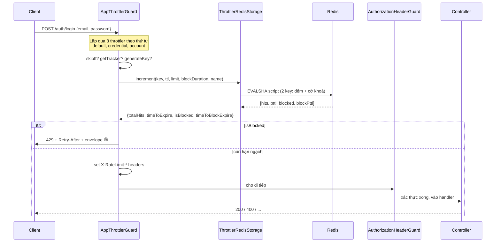
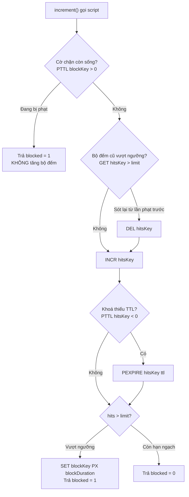

# Rate limiting — thiết kế, luồng chạy và vận hành

> **Tài liệu này dành cho ai:** developer trong dự án, kể cả người chưa từng làm rate limit.
>
> **Đọc cùng với:**
>
> - [redis-caching-guide.md](redis-caching-guide.md) — Redis căn bản và các pattern. Tài liệu bạn
>   đang đọc giả định bạn đã biết TTL và `INCR` là gì; nếu chưa, đọc phần 1–3 bên đó trước.
> - [error-handling.md](error-handling.md) — hợp đồng lỗi chung. Response 429 đi theo đúng hợp đồng
>   đó, không có ngoại lệ.
> - `plans/260919-1632-auth-hardening-international-standards/review-findings.md` — biên bản review
>   toàn bộ flow auth. Rate limit là lời giải cho finding **F06** trong đó.

**Cách đọc nhanh:**

| Bạn đang cần                   | Đọc              |
| ------------------------------ | ---------------- |
| Hiểu vì sao có thứ này         | Phần 1           |
| Nắm thiết kế tổng thể          | Phần 2 → 3       |
| Chỉnh giới hạn cho một route   | Phần 4 → 5 → 15  |
| Debug "vì sao user này bị 429" | Phần 6 → 12 → 13 |
| Review code phần này           | Phần 7 → 8 → 9   |
| Chạy test                      | Phần 14          |

---

## Mục lục

1. [Vì sao dự án cần rate limit](#1-vì-sao-dự-án-cần-rate-limit)
2. [Tổng quan thiết kế](#2-tổng-quan-thiết-kế)
3. [Luồng chạy của một request](#3-luồng-chạy-của-một-request)
4. [Ba throttler, ba câu hỏi khác nhau](#4-ba-throttler-ba-câu-hỏi-khác-nhau)
5. [Chính sách theo từng route](#5-chính-sách-theo-từng-route)
6. [Khoá Redis được sinh ra như thế nào](#6-khoá-redis-được-sinh-ra-như-thế-nào)
7. [Script Lua — đọc từng nhánh](#7-script-lua--đọc-từng-nhánh)
8. [Hai cơ chế an toàn: fail-open và deadline](#8-hai-cơ-chế-an-toàn-fail-open-và-deadline)
9. [Chuẩn hoá email để chống lách](#9-chuẩn-hoá-email-để-chống-lách)
10. [Thứ tự guard và hệ quả của nó](#10-thứ-tự-guard-và-hệ-quả-của-nó)
11. [Cấu hình](#11-cấu-hình)
12. [Response khi bị chặn](#12-response-khi-bị-chặn)
13. [Vận hành và debug](#13-vận-hành-và-debug)
14. [Test](#14-test)
15. [Thêm rate limit cho route mới](#15-thêm-rate-limit-cho-route-mới)
16. [Khoảng trống đã biết](#16-khoảng-trống-đã-biết)
17. [Cheat sheet](#17-cheat-sheet)

---

## 1. Vì sao dự án cần rate limit

Trước thay đổi này, **không có endpoint nào trong hệ thống bị giới hạn số lần gọi**. Không login,
không OTP, không forgot-password. Đó là finding F06 mức High trong biên bản review auth.

### Con số cụ thể

Mã OTP của dự án là sáu chữ số, tức **một triệu khả năng**. Nghe thì nhiều. Nhưng:

- Không giới hạn số request, kẻ tấn công bắn được cỡ **100 request mỗi giây** vào một API không
  phòng thủ. Mã sống 5 phút, tức **30.000 lần đoán** trong vòng đời một mã.
- Tệ hơn: ràng buộc `@@unique([email, code, type])` trong `prisma/schema.prisma` cho phép **nhiều mã
  cùng sống** cho một email. Bấm gửi lại OTP 100 lần là có 100 mã hợp lệ cùng lúc.
- Khi đó mỗi lần đoán không cần trúng một mã cụ thể, mà trúng **bất kỳ mã nào** trong 100 mã.
  Kỳ vọng số lần trúng trong 5 phút: `30.000 × 100 / 1.000.000 = 3`. Tức là gần như chắc chắn vào
  được.

| Điều kiện                                        | Khả năng đoán trúng                |
| ------------------------------------------------ | ---------------------------------- |
| Không giới hạn, 100 mã cùng sống                 | Gần như chắc chắn trong 5 phút     |
| Có rate limit, 20 lần đoán mỗi giờ mỗi tài khoản | Cỡ một phần năm mươi nghìn mỗi giờ |

Cùng một thuật toán sinh mã, cùng độ dài mã. Khác biệt nằm trọn ở chỗ **giới hạn số lần thử**.

### Ba kiểu tấn công cần chặn

| Kiểu                      | Mô tả                                                       | Tầng chặn nó |
| ------------------------- | ----------------------------------------------------------- | ------------ |
| Flood / DoS nhẹ           | Một nguồn bắn thật nhiều request vào bất kỳ endpoint nào    | `default`    |
| Brute-force một tài khoản | Một nguồn dội mật khẩu hoặc mã vào một tài khoản            | `credential` |
| Brute-force phân tán      | Nhiều IP cùng dội vào một tài khoản, mỗi IP chỉ vài request | `account`    |

Tầng thứ ba là tầng quan trọng nhất và cũng hay bị quên. Chặn theo IP không có tác dụng gì với kẻ
tấn công có botnet hoặc proxy xoay vòng.

---

## 2. Tổng quan thiết kế

Dùng `@nestjs/throttler` 6.7.0, nhưng **thay tầng lưu trữ mặc định** bằng Redis, và **thay guard**
để response đi theo hợp đồng lỗi của dự án.

### Các file liên quan

| File                                                     | Vai trò                                                               |
| -------------------------------------------------------- | --------------------------------------------------------------------- |
| `src/constants/throttle.constant.ts`                     | **Chính sách.** Toàn bộ con số giới hạn nằm ở đây, không chỗ nào khác |
| `src/shared/utils/throttler-options.factory.ts`          | Dựng cấu hình ba throttler: tracker, skipIf, chuẩn hoá email          |
| `src/shared/services/throttler-redis-storage.service.ts` | Đếm trong Redis bằng script Lua, fail-open, deadline                  |
| `src/shared/guards/app-throttler.guard.ts`               | Đổi response 429 sang envelope chung, sửa header `Retry-After`        |
| `src/shared/modules/base.module.ts`                      | Đăng ký `ThrottlerModule` và thứ tự guard                             |
| `src/shared/modules/shared.module.ts`                    | Đăng ký `ThrottlerRedisStorage` làm provider global                   |
| `src/routes/auth/auth.controller.ts`                     | Gắn `@Throttle(...)` cho từng route                                   |
| `src/main.ts`                                            | `trust proxy` — quyết định `req.ip` đọc từ đâu                        |

### Vì sao đếm trong Redis chứ không đếm trong bộ nhớ

Mặc định `@nestjs/throttler` đếm trong một `Map` của tiến trình. Chạy một instance thì ổn. Chạy bốn
instance sau load balancer thì **giới hạn thật bị nhân bốn**: 5 lần mỗi phút thành 20. Đó là lý do
duy nhất và đủ để phải viết tầng lưu trữ riêng.

### Vì sao giới hạn nằm trong code, không nằm trong env

`throttle.constant.ts` là source of truth. Env chỉ có **công tắc bật/tắt** và **số hop proxy**.

Lý do: đây là chính sách bảo mật. Một chính sách mà biến môi trường nới được là một chính sách sẽ bị
nới nhầm, và không ai thấy trong code review. Để trong code thì mọi thay đổi đều đi qua PR.

---

## 3. Luồng chạy của một request



### Từng bước, chi tiết

1. **Request tới.** Express đã parse body xong trước khi guard chạy, nên `req.body.email` đọc được.
   Đây là điều kiện bắt buộc để tracker theo email hoạt động.

2. **`AppThrottlerGuard.canActivate` chạy.** Guard lặp qua ba throttler. Thứ tự do thư viện sắp xếp
   theo `ttl` tăng dần lúc `onModuleInit`: `default` (60s), `credential` (60s), `account` (1 giờ).

3. **Với mỗi throttler, guard hỏi bốn câu:**

   - `@SkipThrottle` có gắn trên route không?
   - `skipIf(context)` trả về `true` không? Với `credential` và `account`, hàm này trả `true` khi
     request không có email trong body.
   - `@Throttle(...)` trên route có override `limit` / `ttl` / `blockDuration` không?
   - `getTracker(req)` trả về chuỗi nhận dạng nào?

4. **Sinh khoá.** `generateKey(context, tracker, name)` băm SHA-256. Chi tiết ở phần 6.

5. **Gọi storage.** `ThrottlerRedisStorage.increment(...)` chạy script Lua trên Redis, có deadline
   150 ms bọc ngoài.

6. **Quyết định.**

   - `isBlocked = true` → guard set `Retry-After` rồi ném lỗi. Request dừng tại đây, **chưa hề chạm
     vào database hay bcrypt**.
   - Ngược lại → set các header `X-RateLimit-*` rồi cho đi tiếp.

7. **Guard tiếp theo** (`AuthorizationHeaderGuard`) mới bắt đầu xác thực token.

Điểm quan trọng: một request bị chặn **không tốn một lần verify JWT nào, không tốn một query nào**.
Đó là lý do rate limit phải đứng trước, xem phần 10.

---

## 4. Ba throttler, ba câu hỏi khác nhau

Cả ba chạy trên **mọi** request. Throttler nào chặn trước thì request dừng ở đó.

| Throttler    | Trả lời câu hỏi                          | Khoá theo  | Mặc định     | Áp dụng cho                     |
| ------------ | ---------------------------------------- | ---------- | ------------ | ------------------------------- |
| `default`    | Nguồn này có đang flood không?           | IP         | 120 / 1 phút | Mọi route                       |
| `credential` | Nguồn này có đang dội vào một tài khoản? | IP + email | 10 / 1 phút  | Chỉ request có email trong body |
| `account`    | Có **ai đó** đang dội vào tài khoản này? | email      | 30 / 1 giờ   | Chỉ request có email trong body |

### `default`

Chống flood chung. Con số 120 mỗi phút rộng rãi có chủ ý: nó là lưới an toàn, không phải biện pháp
chống brute-force. Duyệt web bình thường không bao giờ chạm tới.

### `credential`

Khoá theo cặp **IP + email**. Đây là tầng chặt nhất vì một nguồn duy nhất không có lý do chính đáng
nào để gọi login 10 lần trong một phút cho cùng một tài khoản.

Vì có IP trong khoá nên nó **không thể bị lợi dụng để khoá tài khoản người khác**: kẻ tấn công chỉ
tự khoá IP của chính mình đối với tài khoản đó.

### `account`

Khoá **chỉ theo email**, bỏ qua IP hoàn toàn. Đây là tầng duy nhất sống sót trước kẻ tấn công xoay
IP, và cũng là tầng khiến con số ở phần 1 trở nên vô hại.

Đánh đổi: về lý thuyết ai đó có thể cố tình đốt hạn ngạch của một email để làm phiền chủ tài khoản.
Vì vậy giới hạn của tầng này được để **rộng hơn** `credential` một cách có chủ ý (20 lần mỗi giờ cho
login, so với 5 lần mỗi phút). Đủ chặt để chặn brute-force, đủ rộng để không biến thành công cụ
quấy rối.

### Vì sao `credential` và `account` bỏ qua request không có email

`skipIf` của hai throttler này trả về `true` khi `req.body.email` không phải chuỗi. Lợi ích:

- Không tốn hai lệnh Redis thừa cho những route không liên quan (`GET /products` chẳng hạn).
- Tập route còn lại — login, register, otp, forgot-password — đúng bằng tập mà tấn công đoán mật
  khẩu hoặc đoán mã **bắt buộc** phải đi qua.

> **Bẫy đã gặp:** `skipIf` khai báo ở cấp throttler sẽ **thay thế** `skipIf` chung chứ không cộng
> dồn. Nên mỗi throttler phải tự kiểm tra cờ `THROTTLE_ENABLED` trong `skipIf` của chính nó. Nếu chỉ
> đặt ở cấp chung, đúng hai throttler quan trọng nhất sẽ phớt lờ cờ tắt.

---

## 5. Chính sách theo từng route

Định nghĩa trong `AuthThrottle` của `src/constants/throttle.constant.ts`, gắn vào route bằng
`@Throttle(AuthThrottle.X)`.

| Nhóm           | Route                                                           | `credential` | `account`  | `default`  |
| -------------- | --------------------------------------------------------------- | ------------ | ---------- | ---------- |
| `LOGIN`        | `POST /auth/login`                                              | 5 / 1 phút   | 20 / 1 giờ | 120 / phút |
| `REQUEST_CODE` | `POST /auth/otp`                                                | 3 / 1 phút   | 10 / 1 giờ | 120 / phút |
| `GUESS_CODE`   | `POST /auth/register`, `POST /auth/forgot-password`             | 5 / 1 phút   | 20 / 1 giờ | 120 / phút |
| `SESSION`      | `POST /auth/refresh-token`, `POST /auth/logout`, 2 route Google | bỏ qua       | bỏ qua     | 30 / phút  |
| `TWO_FACTOR`   | `POST /auth/2fa/enable`, `POST /auth/2fa/disable`               | bỏ qua       | bỏ qua     | 5 / phút   |

Thời gian khoá khi vượt ngưỡng:

| Nhóm           | `credential` | `account` | `default` |
| -------------- | ------------ | --------- | --------- |
| `LOGIN`        | 5 phút       | 15 phút   | 1 phút    |
| `REQUEST_CODE` | 5 phút       | 15 phút   | 1 phút    |
| `GUESS_CODE`   | 5 phút       | 15 phút   | 1 phút    |
| `SESSION`      | —            | —         | 1 phút    |
| `TWO_FACTOR`   | —            | —         | 15 phút   |

### Vì sao `REQUEST_CODE` chặt hơn hẳn

`POST /auth/otp` bị siết tới 3 lần mỗi phút vì hai lý do, không phải một:

1. **Chặn brute-force gián tiếp.** Giới hạn số mã cùng sống, tức triệt luôn phép nhân xác suất ở
   phần 1.
2. **Mỗi lần gọi là một email được gửi đi.** Endpoint không giới hạn là một khẩu đại bác mail chĩa
   vào hộp thư của người khác — địa chỉ mà người gọi chưa hề chứng minh là của mình.

### Vì sao `GUESS_CODE` đủ để đóng F06

Tính lại con số ở phần 1 với chính sách hiện tại:

- `credential` 5 lần mỗi phút, khoá 5 phút → từ **một nguồn**, tối đa khoảng 5 lần đoán trong trọn
  vòng đời 5 phút của một mã.
- `account` 20 lần mỗi giờ → kẻ tấn công **xoay bao nhiêu IP cũng vậy**, một tài khoản chỉ nhận 20
  lần đoán mỗi giờ.
- Ngay cả khi có nhiều mã cùng sống, `REQUEST_CODE` đã chặn số mã đó ở mức 10 mỗi giờ.

Kỳ vọng thời gian để trúng: cỡ hàng nghìn năm. So với "gần như chắc chắn trong 5 phút" trước đây.

---

## 6. Khoá Redis được sinh ra như thế nào

Đây là phần hay gây bối rối lúc debug, nên ghi thật rõ.

### Ba bước

```
1. getTracker(req)          -> chuỗi nhận dạng người gọi
2. generateKey(ctx, tracker, name) -> sha256 hex
3. ThrottlerRedisStorage    -> thêm prefix và hash tag
```

**Bước 1 — tracker.** Tuỳ throttler:

| Throttler    | Tracker                      | Ví dụ                             |
| ------------ | ---------------------------- | --------------------------------- |
| `default`    | `normalizeIp(req.ip)`        | `203.0.113.7`                     |
| `credential` | `<ip>\|<email đã chuẩn hoá>` | `203.0.113.7\|victim@example.com` |
| `account`    | `<email đã chuẩn hoá>`       | `victim@example.com`              |

**Bước 2 — băm.** Hàm mặc định của thư viện:

```
sha256(`${TênClass}-${tênHandler}-${tênThrottler}-${tracker}`)
```

Ví dụ với login:

```
sha256("AuthController-login-credential-203.0.113.7|victim@example.com")
= 5df555e1d1155b9aee0d3f412a7352200a3193793560f5fc028427ede8ab8905
```

> **Hệ quả quan trọng:** tên class và tên handler nằm trong khoá, nên **mỗi route có bộ đếm riêng**.
> Hạn ngạch `credential` của `login` hoàn toàn tách biệt với hạn ngạch `credential` của `register`.
> Đốt hết 5 lần ở login không ảnh hưởng gì tới register.

**Bước 3 — khoá Redis cuối cùng.** `ThrottlerRedisStorage` thêm prefix và hash tag:

```
throttle:credential:{5df555e1...8905}            <- bộ đếm
throttle:credential:{5df555e1...8905}:blocked    <- cờ khoá
```

Cặp ngoặc nhọn là **hash tag của Redis Cluster**. Redis chỉ băm phần trong ngoặc để chọn slot, nên
hai khoá này luôn rơi vào cùng một slot và script Lua chạm được cả hai. Trên Redis standalone nó vô
hại và không tốn gì; thêm sẵn để sau này chuyển sang cluster không phải sửa.

### Tự tính khoá để debug

```bash
printf '%s' "AuthController-login-credential-203.0.113.7|victim@example.com" | shasum -a 256
```

Lấy chuỗi hex trả về rồi ghép: `throttle:credential:{<hex>}`.

---

## 7. Script Lua — đọc từng nhánh

Toàn bộ logic đếm nằm trong một script Lua chạy nguyên khối trên Redis. Redis chạy script
**atomic** — không có lệnh nào của client khác chen vào giữa chừng — nên hai request đồng thời trên
cùng một khoá không thể race nhau.

### Vì sao cần hai khoá

- **Khoá đếm** hết hạn theo cửa sổ đếm (`ttl`).
- **Khoá cờ chặn** hết hạn theo thời gian phạt (`blockDuration`).

Tách ra để **hình phạt sống lâu hơn cửa sổ đếm**. Sai 5 lần trong 1 phút thì bị khoá 5 phút, không
phải 60 giây. Nếu chỉ có một khoá thì thời gian phạt luôn bằng cửa sổ đếm, và kẻ tấn công cứ mỗi
phút lại có 5 lần thử mới.

### Ba nhánh của script



**Nhánh 1 — đang bị khoá.**

```lua
local blockPttl = redis.call('PTTL', blockKey)
if blockPttl > 0 then
  ...
  return {blockedHits, blockedTtl, 1, blockPttl}
end
```

Cờ chặn còn sống thì trả về ngay `blocked = 1` kèm thời gian còn lại. **Không tăng bộ đếm** — người
đang bị phạt gõ thêm bao nhiêu lần cũng không kéo dài hình phạt.

**Nhánh 2 — dọn bộ đếm cũ.**

```lua
local current = tonumber(redis.call('GET', hitsKey)) or 0
if current > limit then
  redis.call('DEL', hitsKey)
end
```

Tình huống: hình phạt vừa hết, nhưng bộ đếm vẫn còn giá trị vượt ngưỡng vì cửa sổ đếm của nó dài
hơn. Không xoá thì request kế tiếp tăng lên thành `limit + 2` và **bị khoá lại ngay lập tức** —
người dùng vĩnh viễn không thoát ra được. Xoá đi để họ thật sự có cơ hội thứ hai.

**Nhánh 3 — đếm bình thường.**

```lua
local hits = redis.call('INCR', hitsKey)
local pttl = redis.call('PTTL', hitsKey)
if pttl < 0 then
  redis.call('PEXPIRE', hitsKey, ttl)
  pttl = ttl
end

if hits > limit then
  redis.call('SET', blockKey, '1', 'PX', blockDuration)
  return {hits, pttl, 1, blockDuration}
end

return {hits, pttl, 0, 0}
```

`PTTL` trả `-1` khi khoá không có TTL và `-2` khi khoá không tồn tại. Cả hai đều `< 0`, nên nhánh
`pttl < 0` vừa xử lý lần `INCR` đầu tiên vừa vá trường hợp khoá lỡ mất TTL. Đây là cách phòng thủ
trước một khoá "bất tử" do sự cố nào đó.

`hits > limit`, không phải `>=`: `limit = 5` nghĩa là **cho phép 5 request**, request thứ 6 mới bị
chặn.

### Đơn vị thời gian

| Nơi                                    | Đơn vị    |
| -------------------------------------- | --------- |
| `ttl`, `blockDuration` trong constant  | mili giây |
| Tham số truyền vào Lua                 | mili giây |
| Giá trị Lua trả về                     | mili giây |
| `ThrottlerStorageRecord` trả cho guard | **giây**  |
| Header `Retry-After`                   | giây      |

`ThrottlerRedisStorage` làm việc quy đổi bằng `Math.ceil`. Dùng `ceil` chứ không `floor` để 1 mili
giây còn lại không bị báo thành `Retry-After: 0`, tức "thử lại ngay đi".

### EVALSHA và NOSCRIPT

Script được nạp một lần bằng `SCRIPT LOAD`, sau đó mỗi request chỉ gửi mã băm qua `EVALSHA`. Nếu
Redis restart hoặc cache script bị xoá, nó trả lỗi `NOSCRIPT`; storage bắt đúng lỗi này, gửi lại
toàn văn script bằng `EVAL`, và xoá mã băm đã lưu để lần sau nạp lại. Không làm vậy thì mỗi request
phải đẩy cả script qua dây.

---

## 8. Hai cơ chế an toàn: fail-open và deadline

Rate limiter nằm trên đường đi của **mọi** request. Nên bản thân nó không được phép trở thành điểm
chết của hệ thống. Có hai lớp bảo vệ.

### 8.1 Fail-open — Redis lỗi thì cho request đi qua

```ts
catch (error) {
  this.logger.warn(
    `Rate limit not enforced, Redis unavailable: ${(error as Error).message}`,
  );

  return { totalHits: 0, timeToExpire: toSeconds(ttl), isBlocked: false, timeToBlockExpire: 0 };
}
```

Lý do: tấn công brute-force là mối nguy **chậm và có giới hạn**; API sập là mối nguy **tức thì và
không giới hạn**. Một rate limiter làm sập API khi kho đếm của nó chớp là đổi một rủi ro nhỏ lấy một
rủi ro lớn.

Cảnh báo được ghi ở mức `warn` chứ không im lặng, vì "limit không được thực thi" là trạng thái phải
nhìn thấy được. **Đây là log cần đưa vào alert.**

> **Lưu ý khi debug:** lúc fail-open, `totalHits = 0`, nên header `X-RateLimit-Remaining` sẽ hiển thị
> đúng bằng `limit`. Thấy `Remaining` luôn bằng `limit` mà không giảm là dấu hiệu Redis đang có vấn
> đề, không phải limit đang hoạt động tốt.

### 8.2 Deadline 150 ms — Redis chậm thì bỏ qua

Đây là vấn đề tinh tế hơn và được phát hiện trong code review.

`RedisService` dùng chung cấu hình `commandTimeout: 1000`. Con số đó hợp lý khi Redis chỉ phục vụ
cache role-permission cho **một phần** request. Nhưng rate limiter chạy trên **mọi** request, nên
một Redis còn sống mà phản hồi chậm sẽ cộng tới **một giây vào từng response của toàn hệ thống**.

`enableOfflineQueue: false` chỉ cứu được trường hợp socket đứt hẳn, không cứu được trường hợp Redis
sống nhưng nghẽn — mà đó đúng là trường hợp hay xảy ra hơn.

Giải pháp: bọc lời gọi bằng một deadline riêng 150 ms.

```ts
private async withDeadline<T>(operation: Promise<T>): Promise<T> {
  let timer: NodeJS.Timeout | undefined;

  void operation.catch(() => undefined);

  try {
    return await Promise.race([operation, /* timeout 150ms */]);
  } finally {
    clearTimeout(timer);
  }
}
```

Ba chi tiết đáng chú ý:

1. **150 ms** vì một lệnh `INCR` cục bộ trả lời trong chưa tới 1 ms. Quá ngưỡng này nghĩa là Redis
   không khoẻ, và vài giây không thực thi limit rẻ hơn nhiều so với một sự cố độ trễ toàn API.
2. **`void operation.catch(() => undefined)`** gắn một handler cho promise gốc. Nếu không có dòng
   này, khi deadline thắng cuộc đua rồi lệnh Redis mới reject sau đó, Node sẽ báo
   `unhandledRejection`. Có một test riêng canh đúng chuyện này.
3. **Bỏ mặc lệnh đang chạy.** Lệnh `INCR` kia hoặc đã vào Redis hoặc không; request sau sẽ đọc lại
   sự thật. Không cần và không thể huỷ nó.

Quá deadline thì lỗi ném ra rơi vào `catch` fail-open ở mục 8.1.

---

## 9. Chuẩn hoá email để chống lách

Phát hiện trong code review. Nếu khoá throttle lấy nguyên chuỗi email người gọi gửi lên thì:

`victim@gmail.com`, `victim+1@gmail.com`, `vic.tim@gmail.com` — **ba chuỗi khác nhau, cùng một hộp
thư**. Mỗi chuỗi được cấp một hạn ngạch riêng, nên trần 10 lần xin OTP mỗi giờ không còn chặn được
gì: kẻ tấn công sinh vô số biến thể và dội mail vào hộp thư nạn nhân.

`emailSubjectOf` xử lý theo thứ tự:

| Bước                    | Ví dụ vào                   | Ví dụ ra             |
| ----------------------- | --------------------------- | -------------------- |
| `trim` + `toLowerCase`  | `"  ViCtIm@Example.COM "`   | `victim@example.com` |
| Bỏ phần sau dấu `+`     | `victim+signup@example.com` | `victim@example.com` |
| Bỏ dấu chấm (chỉ Gmail) | `v.i.c.t.i.m@gmail.com`     | `victim@gmail.com`   |
| Cắt còn 320 ký tự       | chuỗi 5000 ký tự            | 320 ký tự            |

### Bốn ràng buộc đã cân nhắc

- **Chỉ dùng cho khoá throttle.** Không bao giờ dùng để tra cứu, tạo, hay so sánh tài khoản. Nên
  gộp nhầm hai địa chỉ chỉ khiến hạn ngạch chặt hơn, **không bao giờ khiến ai đăng nhập vào nhầm tài
  khoản**. Đây là lý do việc gộp hơi "tham" là chấp nhận được.
- **Bỏ dấu chấm chỉ áp cho `gmail.com` và `googlemail.com`.** Nhiều nhà cung cấp coi dấu chấm là có
  nghĩa; gộp bừa sẽ trộn hai hộp thư thật sự khác nhau.
- **`+tag` bỏ cho mọi domain.** Hướng sai lệch ở đây là "chặt hơn mức cần", tức hướng an toàn.
- **Địa chỉ chỉ toàn tag** như `+tag@example.com` giữ nguyên, vì không có hộp thư gốc để gộp về.

### Phạm vi thật của lỗ hổng này

Cần nói chính xác để khỏi hiểu nhầm mức độ: lỗ hổng cho phép **dội mail vào hộp thư người khác**,
**không** cho phép đoán mã của một tài khoản có thật. Lý do: mã xác thực được lưu theo đúng chuỗi
email trong bảng `VerificationCode`, nên đoán mã của `victim+1@gmail.com` không mở được tài khoản
`victim@gmail.com`. Tương tự, login tra user theo email chính xác nên biến thể không khớp user nào.

---

## 10. Thứ tự guard và hệ quả của nó

Trong `base.module.ts`, `APP_GUARD` được đăng ký theo thứ tự:

```
1. AppThrottlerGuard          <- rate limit
2. AuthorizationHeaderGuard   <- xác thực + phân quyền
```

NestJS chạy global guard **theo đúng thứ tự khai báo provider**.

### Vì sao rate limit phải đứng trước

- Đứng sau thì nó **không bao giờ nhìn thấy** đợt flood request không xác thực — thứ mà nó sinh ra
  để chặn. Guard xác thực đã trả 401 trước đó rồi.
- Mỗi request bị từ chối vẫn phải trả giá verify JWT trước khi bị chặn.

### Cái giá phải trả

Lúc throttler chạy, `req.user` **chưa tồn tại**. Nghĩa là không thể khoá throttle theo user id.

Hệ quả cụ thể: `POST /auth/2fa/disable` nhận một mã sáu chữ số, tức cũng là một bề mặt đoán mã như
nhóm `GUESS_CODE`, nhưng tài khoản của nó nằm trong bearer token chứ không nằm trong body. Không có
email để khoá, nên nó chỉ được bảo vệ bởi tầng theo IP. Bù lại, giới hạn của nhóm `TWO_FACTOR` được
siết xuống 5 lần mỗi phút với 15 phút phạt — chặt hơn hẳn `SESSION`.

Khoảng trống còn lại ghi ở phần 16.

### Những gì không đi qua guard

Swagger UI được `SwaggerModule.setup` gắn thẳng vào instance Express, **không đi qua pipeline guard
của Nest**, nên không bị rate limit. Đây là hành vi sẵn có, không phải thay đổi lần này. Swagger chỉ
bật khi `NODE_ENV=development`.

---

## 11. Cấu hình

Chỉ có hai biến môi trường. Cả hai đều **bắt buộc** — thiếu là app không boot, không có giá trị mặc
định ngầm.

### `THROTTLE_ENABLED`

```
THROTTLE_ENABLED=true
```

Kiểu chuỗi, chỉ nhận `"true"` hoặc `"false"` (`@IsIn(["true", "false"])`). Không nhận `1`, `0`,
`yes`, hay chuỗi rỗng — để không ai vô tình tắt limit bằng một giá trị trông có vẻ đúng.

Khi đặt `false`, factory ghi cảnh báo lúc boot:

```
[Throttler] THROTTLE_ENABLED is false — no rate limiting is in effect. Expected only in tests.
```

Lý do có công tắc này: bộ e2e bắn hàng trăm request từ `127.0.0.1` và sẽ đụng giới hạn IP trong khi
đang test một thứ hoàn toàn khác. `.env.test.example` đặt `false`; riêng
`test/e2e/auth/auth-rate-limit.e2e-spec.ts` bật lại `true` cho app của chính nó.

> Vì biến này bắt buộc và không có default, **không có đường nào để production vô tình chạy với rate
> limit tắt**. Thiếu biến là app chết lúc khởi động, không phải âm thầm bỏ qua.

### `TRUST_PROXY_HOPS`

```
TRUST_PROXY_HOPS=0
```

Số nguyên 0–10. Truyền vào `app.set("trust proxy", n)` trong `main.ts`. Nó quyết định Express tin
phần tử nào của header `X-Forwarded-For`, và do đó quyết định `req.ip` — tức **địa chỉ mà rate
limiter đếm**.

| Giá trị | Ý nghĩa                                                       |
| ------- | ------------------------------------------------------------- |
| `0`     | Không tin header. Dùng địa chỉ socket. Mặc định, an toàn nhất |
| `1`     | Có đúng một reverse proxy phía trước (nginx, ALB...)          |
| `n`     | Có n tầng proxy                                               |

**Đặt cao hơn số proxy thật là một lỗ hổng.** Khi đó client tự bịa được `X-Forwarded-For`, mỗi
request khai một IP khác nhau, và mọi giới hạn theo IP trở nên vô dụng. Tầng `account` vẫn còn tác
dụng, nhưng `default` và `credential` thì không.

Đếm đúng số hop: đếm số proxy **do mình kiểm soát** nằm giữa Internet và app.

---

## 12. Response khi bị chặn

### Body

Đi theo đúng envelope chung của dự án, xem [error-handling.md](error-handling.md):

```json
{
  "statusCode": 429,
  "error": "TOO_MANY_REQUESTS",
  "message": "Too many requests. Please try again later.",
  "details": [],
  "requestId": "3f1b2c8e-0e4a-4a1e-9f0c-2b7d0a1c5e64"
}
```

`error` được suy ra từ HTTP status qua `errorCodeFromStatus`, nên không cần thêm hằng số mới.

**Message cố tình không tiết lộ gì**: không nói tầng nào bị chạm, không nói còn bao nhiêu lượt. Trả
những thứ đó ra là tặng kẻ tấn công một cái máy đo để tinh chỉnh nhịp tấn công. Có test riêng khẳng
định message không chứa email và không chứa tên throttler.

### Header

| Header                                              | Khi nào có       | Ý nghĩa                                |
| --------------------------------------------------- | ---------------- | -------------------------------------- |
| `Retry-After`                                       | Khi bị chặn      | Số **giây** phải chờ                   |
| `Retry-After-credential`                            | Khi tầng đó chặn | Do thư viện sinh, xem ghi chú bên dưới |
| `X-RateLimit-Limit`                                 | Khi chưa bị chặn | Hạn ngạch của tầng `default`           |
| `X-RateLimit-Remaining`                             | Khi chưa bị chặn | Còn lại bao nhiêu                      |
| `X-RateLimit-Reset`                                 | Khi chưa bị chặn | Bao nhiêu giây nữa cửa sổ reset        |
| `X-RateLimit-*-credential`, `X-RateLimit-*-account` | Khi chưa bị chặn | Tương tự, cho tầng có tên              |

> **Vì sao phải override `Retry-After`:** thư viện gắn tên throttler vào sau tên header, nên khi tầng
> `credential` chặn thì header thành `Retry-After-credential` — không thư viện client nào đọc cái
> tên đó. `AppThrottlerGuard` phát thêm một `Retry-After` đúng chuẩn, bất kể tầng nào chặn.

### Phía client nên làm gì

- Đọc `Retry-After` và chờ đúng chừng đó rồi mới thử lại. **Không retry ngay**, vì mỗi lần thử lại
  trong thời gian bị phạt không kéo dài hình phạt nhưng cũng không rút ngắn nó.
- Với màn hình login, hiển thị thời gian chờ cho người dùng thay vì báo lỗi chung chung.

---

## 13. Vận hành và debug

### Xem các khoá đang tồn tại

```bash
# An toàn trên production: SCAN không chặn Redis như KEYS
redis-cli --scan --pattern 'throttle:*'

# Đếm xem có bao nhiêu
redis-cli --scan --pattern 'throttle:*' | wc -l

# Chỉ xem những ai đang bị khoá
redis-cli --scan --pattern 'throttle:*:blocked'
```

> Đừng dùng `KEYS 'throttle:*'` trên production. Nó chặn Redis cho tới khi quét xong toàn bộ
> keyspace. Trong test thì vô hại.

### Xem một khoá cụ thể

```bash
redis-cli GET  'throttle:credential:{5df555e1...}'          # đã đếm bao nhiêu lần
redis-cli PTTL 'throttle:credential:{5df555e1...}'          # còn bao nhiêu ms trong cửa sổ
redis-cli PTTL 'throttle:credential:{5df555e1...}:blocked'  # còn bị phạt bao nhiêu ms
```

`PTTL` trả `-2` nghĩa là khoá không tồn tại, `-1` nghĩa là tồn tại nhưng không có TTL.

### Gỡ khoá cho một người dùng

Khoá đã băm SHA-256 nên không đảo ngược được. Hai cách:

**Cách 1 — tự tính lại khoá** (khi biết chính xác IP và email):

```bash
HASH=$(printf '%s' "AuthController-login-credential-203.0.113.7|victim@example.com" | shasum -a 256 | cut -d' ' -f1)
redis-cli DEL "throttle:credential:{$HASH}" "throttle:credential:{$HASH}:blocked"
```

Nhớ dùng email **đã chuẩn hoá** theo phần 9, không phải chuỗi thô người dùng gõ.

**Cách 2 — xoá cờ chặn của tầng `account`** (khi không biết IP):

```bash
HASH=$(printf '%s' "AuthController-login-account-victim@example.com" | shasum -a 256 | cut -d' ' -f1)
redis-cli DEL "throttle:account:{$HASH}" "throttle:account:{$HASH}:blocked"
```

**Phương án cuối — xoá sạch toàn bộ** (chỉ dùng khi xử lý sự cố, sẽ gỡ khoá cho mọi kẻ tấn công đang
bị chặn):

```bash
redis-cli --scan --pattern 'throttle:*' | xargs -r redis-cli DEL
```

### Các dấu hiệu khi debug

| Triệu chứng                                | Nguyên nhân khả dĩ                                                   |
| ------------------------------------------ | -------------------------------------------------------------------- |
| Không có khoá `throttle:*` nào trong Redis | `THROTTLE_ENABLED=false`, kiểm tra log cảnh báo lúc boot             |
| `X-RateLimit-Remaining` luôn bằng `limit`  | Đang fail-open, Redis lỗi. Tìm log `Rate limit not enforced`         |
| Mọi user sau một NAT cùng bị 429           | Tầng `default` theo IP bị chạm. Cân nhắc `TRUST_PROXY_HOPS`          |
| Bị 429 dù mới gọi vài lần                  | Đang trong thời gian phạt của lần vượt trước. Xem `PTTL ...:blocked` |
| Limit không có tác dụng dù đã bật          | `TRUST_PROXY_HOPS` cao hơn số proxy thật, IP bị giả mạo được         |
| Chỉ một instance chặn, instance khác không | Các instance trỏ vào Redis DB khác nhau, kiểm tra `REDIS_URL`        |

### Log cần đưa vào cảnh báo

```
[ThrottlerRedisStorage] Rate limit not enforced, Redis unavailable: ...
[Throttler] THROTTLE_ENABLED is false — no rate limiting is in effect.
```

Dòng đầu nghĩa là hệ thống đang không được bảo vệ. Dòng thứ hai trên môi trường production nghĩa là
ai đó cấu hình sai.

Còn 429 thì đã có `GlobalExceptionFilter` ghi ở mức `warn` kèm method, URL và `requestId`. Một chuỗi
dài 429 trên `/auth/login` là tín hiệu đang có người dò mật khẩu.

---

## 14. Test

### Unit test — chạy được ngay, không cần Redis

| File                                                            | Kiểm tra gì                                                           |
| --------------------------------------------------------------- | --------------------------------------------------------------------- |
| `src/shared/utils/__tests__/throttler-options-factory.spec.ts`  | Chuẩn hoá email, tracker của từng tầng, `skipIf`, cờ tắt              |
| `src/shared/services/__tests__/throttler-redis-storage.spec.ts` | Quy đổi ms sang giây, hash tag, EVALSHA/NOSCRIPT, fail-open, deadline |
| `src/shared/guards/__tests__/app-throttler.guard.spec.ts`       | Envelope 429, `Retry-After`, không rò rỉ thông tin                    |

```bash
pnpm test                                          # toàn bộ
npx jest throttler                                 # chỉ phần rate limit
```

### E2E — cần Redis thật

`test/e2e/auth/auth-rate-limit.e2e-spec.ts` chạy trên Redis thật với đúng chính sách production. Nó
tự bật `THROTTLE_ENABLED=true` trước khi boot app của mình và khôi phục lại giá trị cũ trong
`afterAll` — phần khôi phục nằm trong `finally` vì jest chạy `--runInBand`, tất cả spec dùng chung
một process, một cờ rò rỉ sẽ gây 429 bất ngờ cho các spec khác.

Các kịch bản:

1. Login lần thứ 6 vào cùng một tài khoản bị chặn.
2. Response bị chặn đúng envelope chung.
3. Có header `Retry-After` với giá trị dương.
4. Hình phạt sống lâu hơn cửa sổ đếm (`Retry-After` lớn hơn 60).
5. Tài khoản khác từ cùng IP **không** bị vạ lây.
6. Xin OTP bị chặn ở lần thứ 4.
7. Request không có email (`refresh-token`) không bị tầng theo tài khoản đụng tới.

```bash
docker compose up -d redis db
pnpm test:e2e
```

> **Trạng thái hiện tại:** file e2e này **chưa từng được chạy**. Máy phát triển lúc viết không có
> Redis và không có Docker daemon. Bù lại, script Lua đã được kiểm chứng logic qua một trình thông
> dịch Lua trong JS với bản giả lập Redis, bảy kịch bản đều đúng — nhưng đó là kiểm chứng cú pháp và
> luồng điều khiển, **không phải** ngữ nghĩa Redis thật. **Việc cần làm: chạy `pnpm test:e2e` với
> Redis thật rồi cập nhật ghi chú này.**

### Vì sao không mock Redis trong unit test

Storage được test với ioredis client giả để kiểm tra phần TypeScript: quy đổi đơn vị, dựng khoá, xử
lý lỗi, deadline. Bản thân **logic Lua** thì không mock được một cách trung thực — nó là ngữ nghĩa
của Redis. Đó là việc của e2e.

---

## 15. Thêm rate limit cho route mới

### Route có email trong body

Không cần làm gì thêm: `credential` và `account` tự động áp dụng với giới hạn mặc định. Muốn chặt
hơn thì thêm một nhóm vào `AuthThrottle`:

```ts
// src/constants/throttle.constant.ts
MY_ROUTE: {
  [ThrottlerName.CREDENTIAL]: { limit: 5, ttl: MINUTE, blockDuration: 5 * MINUTE },
  [ThrottlerName.ACCOUNT]:    { limit: 20, ttl: HOUR,  blockDuration: 15 * MINUTE },
},
```

```ts
// controller
@Throttle(AuthThrottle.MY_ROUTE)
@Post("my-route")
```

### Route không có email

Chỉ tầng `default` áp dụng. Override nó:

```ts
MY_ROUTE: {
  [ThrottlerName.DEFAULT]: { limit: 10, ttl: MINUTE, blockDuration: 5 * MINUTE },
},
```

### Route cần bỏ qua hoàn toàn

```ts
import { SkipThrottle } from "@nestjs/throttler";

@SkipThrottle()
@Get("health")
```

Dùng rất tiết kiệm. Health check là ví dụ hợp lý; một endpoint nghiệp vụ thì gần như không bao giờ.

### Checklist

- [ ] Con số đặt trong `throttle.constant.ts`, **không** rải trong controller
- [ ] Có comment giải thích **vì sao** chọn con số đó, không chỉ nói nó là bao nhiêu
- [ ] Nghĩ xem người dùng thật có thể chạm ngưỡng này không. Login 5 lần mỗi phút thì không; 2 lần
      mỗi phút thì có
- [ ] Nhớ rằng **request thành công cũng tiêu hạn ngạch**, không chỉ request lỗi
- [ ] Nếu route nhận mã đoán được, nó thuộc nhóm `GUESS_CODE` chứ không phải `SESSION`
- [ ] Thêm case vào e2e nếu chính sách khác hẳn các nhóm sẵn có

---

## 16. Khoảng trống đã biết

Ghi ra để người sau không tưởng nhầm là đã kín.

| #   | Khoảng trống                                                                    | Mức        | Hướng xử lý                                                                  |
| --- | ------------------------------------------------------------------------------- | ---------- | ---------------------------------------------------------------------------- |
| 1   | `2fa/disable` chỉ khoá theo IP, kẻ có token hợp lệ và xoay IP vẫn dò được mã    | Trung bình | Cần danh tính lúc throttle. Xem phase-02 và phase-04 của plan auth hardening |
| 2   | Không phân biệt request thành công và thất bại — login đúng cũng tiêu hạn ngạch | Thấp       | Đánh đổi có chủ ý: đơn giản hơn và chặt hơn                                  |
| 3   | Fail-open nghĩa là Redis chết thì không còn giới hạn nào                        | Chấp nhận  | Đã ghi log cảnh báo. Cần alert ở tầng vận hành                               |
| 4   | Swagger UI không đi qua guard nên không bị giới hạn                             | Thấp       | Chỉ bật ở `development`                                                      |
| 5   | Chưa có giới hạn theo dải mạng, một /24 có thể dùng 254 IP                      | Thấp       | Tầng `account` đã chặn phần nguy hiểm nhất                                   |
| 6   | E2E chưa từng chạy với Redis thật                                               | Cần làm    | Chạy `pnpm test:e2e` khi có Redis                                            |

### Quan hệ với các finding khác trong plan auth hardening

Rate limit đóng **F06**. Nó **giảm nhẹ** nhưng không đóng các finding sau, vì gốc rễ nằm chỗ khác:

- **F15** — nhiều mã OTP cùng sống, mã lưu dạng thô, không đếm số lần sai. Cần sửa schema, thuộc
  phase 05.
- **F07** — login xác minh 2FA trước mật khẩu và làm lộ email có tồn tại hay không. Thuộc phase 03.
- **F14** — TOTP dùng lại được trong cùng một window. Thuộc phase 05.
- **F30** — tắt 2FA không cần yếu tố thứ hai nào. **Critical.** Rate limit không giúp gì ở đây, vì
  kẻ tấn công không cần đoán: chỉ cần gửi body rỗng. Đọc `review-findings.md` mục F30.

---

## 17. Cheat sheet

```
Chính sách             src/constants/throttle.constant.ts
Cấu hình throttler     src/shared/utils/throttler-options.factory.ts
Đếm trong Redis        src/shared/services/throttler-redis-storage.service.ts
Guard                  src/shared/guards/app-throttler.guard.ts
Gắn vào route          @Throttle(AuthThrottle.X) trong controller
```

```
Ba tầng
  default      IP              120 / 1 phút
  credential   IP + email       10 / 1 phút    (chỉ request có email)
  account      email            30 / 1 giờ     (chỉ request có email)

Route chặt nhất
  POST /auth/otp        3 / phút mỗi IP+email,  10 / giờ mỗi tài khoản
  POST /auth/login      5 / phút mỗi IP+email,  20 / giờ mỗi tài khoản
  POST /auth/2fa/*      5 / phút mỗi IP

Khoá Redis
  throttle:<tầng>:{sha256(Class-handler-tầng-tracker)}
  throttle:<tầng>:{...}:blocked

Đơn vị
  constant và Lua  -> mili giây
  trả về guard     -> giây
```

```bash
# Xem ai đang bị khoá
redis-cli --scan --pattern 'throttle:*:blocked'

# Tính khoá của một người dùng
printf '%s' "AuthController-login-credential-<ip>|<email>" | shasum -a 256

# Tắt limit khi chạy test cục bộ
THROTTLE_ENABLED=false

# Chạy test
npx jest throttler      # unit
pnpm test:e2e           # e2e, cần Redis
```
