# Redis — từ căn bản tới vận hành trong dự án này

> **Tài liệu này dành cho ai:** developer trong dự án, kể cả người chưa từng dùng Redis.
>
> **Đọc cùng với:** [redis-role-permission-cache.md](redis-role-permission-cache.md) — biên bản
> triển khai của cache hiện có (số liệu đo thật, test coverage, risk đã accept khi review).
> Tài liệu bạn đang đọc giải thích **Redis là gì và các pattern**; tài liệu kia ghi lại **quyết định
> đã chốt** cho một cache cụ thể.

**Cách đọc nhanh:**

| Bạn là                    | Đọc                        |
| ------------------------- | -------------------------- |
| Chưa biết Redis           | Phần 1 → 4, rồi 7          |
| Biết Redis, cần nắm dự án | Phần 7 → 8                 |
| Sắp thêm một cache mới    | Phần 5 → 6 → 9 (checklist) |
| Đang debug sự cố Redis    | Phần 8 → 6.7               |

---

## Mục lục

1. [Redis là gì](#1-redis-là-gì)
2. [Các kiểu dữ liệu](#2-các-kiểu-dữ-liệu)
3. [TTL — thứ làm Redis thành cache](#3-ttl--thứ-làm-redis-thành-cache)
4. [Persistence và eviction](#4-persistence-và-eviction)
5. [Các pattern kinh điển](#5-các-pattern-kinh-điển)
6. [Nâng cao — phần hay bị làm sai](#6-nâng-cao--phần-hay-bị-làm-sai)
7. [Redis trong dự án này](#7-redis-trong-dự-án-này)
8. [Vận hành và debug](#8-vận-hành-và-debug)
9. [Checklist khi thêm một cache mới](#9-checklist-khi-thêm-một-cache-mới)
10. [Cheat sheet](#10-cheat-sheet)

---

## 1. Redis là gì

Redis là một **HashMap khổng lồ sống trong RAM**, chạy như một service riêng, nhiều process cùng nối
vào được.

|               | Postgres                  | Redis                     |
| ------------- | ------------------------- | ------------------------- |
| Dữ liệu nằm ở | Ổ cứng                    | RAM                       |
| Độ trễ 1 lệnh | 1–50 ms                   | 0.1–1 ms                  |
| Truy vấn      | SQL, JOIN, WHERE phức tạp | Lấy theo **key**          |
| Mất điện      | Còn nguyên                | Có thể mất (tuỳ cấu hình) |
| Vai trò       | Nơi lưu **sự thật**       | Bản sao tạm để đi nhanh   |

Nguyên tắc số một: **Redis không phải nơi chứa sự thật.** Sự thật nằm ở Postgres. Redis giữ bản sao
để đỡ phải hỏi Postgres nhiều lần. Mọi quyết định thiết kế bên dưới đều xuất phát từ câu này.

### 1.1 Single-thread — và vì sao điều đó lại tốt

Redis xử lý lệnh trên **một thread duy nhất**. Nghe có vẻ là điểm yếu, nhưng:

- Mọi thứ trong RAM nên một lệnh chỉ tốn vài chục micro giây → một core vẫn kham được ~100k ops/s.
- **Không bao giờ có race condition giữa hai lệnh.** Lệnh này chạy xong mới tới lệnh kia. Đây là lý do
  `INCR`, `SET NX`, và script Lua có tính atomic miễn phí.

Mặt trái: **một lệnh chậm khoá cả server.** `KEYS *` trên 10 triệu key làm mọi client khác đứng hình
vài giây. Ghi nhớ điều này, nó chi phối toàn bộ mục [6.1](#61-keys-là-cấm-kỵ-scan-mới-đúng).

### 1.2 Thử ngay

Dự án có sẵn Redis trong `docker-compose.yml`:

```bash
docker compose up -d redis
docker compose exec redis redis-cli
```

```redis
SET ten "Thang"
GET ten            # → "Thang"
EXISTS ten         # → 1
DEL ten
EXISTS ten         # → 0
```

---

## 2. Các kiểu dữ liệu

Value trong Redis không chỉ là string. Có 5 kiểu chính, chọn đúng kiểu thì lệnh ngắn và nhanh hơn
nhiều so với việc tự encode JSON rồi parse.

### 2.1 String — dùng nhiều nhất (~90% trường hợp)

```redis
SET user:1 '{"id":1,"name":"Thang"}'
GET user:1
SET counter 0
INCR counter          # → 1, atomic
INCRBY counter 10     # → 11
APPEND log "dong moi"
STRLEN user:1
```

`INCR` atomic là điểm mấu chốt: 1000 request cùng tăng một lúc vẫn ra đúng 1000, không mất phát nào.
Nếu bạn làm `GET` rồi `+1` rồi `SET` ở phía app thì sẽ mất — đó là lost update kinh điển.

Các flag của `SET` cần thuộc:

```redis
SET k v EX 300      # TTL 300 giây
SET k v PX 500      # TTL 500 mili giây
SET k v NX          # chỉ set NẾU key CHƯA tồn tại  → nền tảng của lock
SET k v XX          # chỉ set NẾU key ĐÃ tồn tại
SET k v KEEPTTL     # giữ nguyên TTL cũ
GETSET k v2         # set giá trị mới, trả về giá trị cũ (atomic)
```

### 2.2 Hash — object nhiều field

```redis
HSET user:1 name "Thang" age 28 role "admin"
HGET user:1 name          # → "Thang"
HMGET user:1 name role    # lấy nhiều field một lần
HGETALL user:1
HINCRBY user:1 age 1
HDEL user:1 age
HLEN user:1
```

Chọn Hash thay vì String-JSON khi bạn cần **sửa một field mà không ghi đè cả object**, hoặc object có
nhiều field nhưng mỗi lần chỉ đọc vài field. Ngược lại, nếu luôn đọc/ghi trọn gói thì String-JSON đơn
giản hơn — dự án này chọn String-JSON vì guard luôn dùng nguyên cả object role.

### 2.3 List — hàng đợi

```redis
LPUSH job:queue "gui-email-1"      # đẩy vào đầu
RPUSH job:queue "gui-email-2"      # đẩy vào cuối
RPOP  job:queue                    # lấy ra từ cuối → LPUSH + RPOP = FIFO
BRPOP job:queue 0                  # chặn chờ vô hạn tới khi có việc
LRANGE job:queue 0 -1              # xem toàn bộ (debug)
LLEN  job:queue
LTRIM recent:views 0 99            # chỉ giữ 100 phần tử mới nhất
```

`BRPOP` là cách làm worker không phải polling. `LTRIM` là cách giữ list khỏi phình vô hạn.

### 2.4 Set — tập hợp không trùng

```redis
SADD online:users 1 2 3
SADD online:users 2          # → 0, đã có rồi
SISMEMBER online:users 2     # → 1
SCARD online:users           # → 3
SMEMBERS online:users
SREM online:users 1
SINTER role:1:perms role:2:perms    # giao — quyền chung của 2 role
SDIFF  role:1:perms role:2:perms    # hiệu — quyền chỉ role 1 có
```

### 2.5 Sorted Set — set có điểm, tự sắp xếp

```redis
ZADD bxh 100 "thang" 250 "an" 180 "binh"
ZREVRANGE bxh 0 9 WITHSCORES     # top 10
ZRANK bxh "thang"                # hạng (từ thấp lên)
ZINCRBY bxh 50 "thang"
ZRANGEBYSCORE bxh 100 200        # lọc theo khoảng điểm
ZREMRANGEBYSCORE bxh 0 99        # xoá theo khoảng điểm
```

Dùng cho leaderboard, **sliding-window rate limit** (score = timestamp), priority queue, lịch job
(score = thời điểm chạy).

### 2.6 Chọn kiểu nào

| Cần                               | Kiểu                           |
| --------------------------------- | ------------------------------ |
| Cache một object/kết quả trọn gói | String (JSON)                  |
| Đếm, rate limit đơn giản          | String + `INCR`                |
| Object cần sửa lẻ từng field      | Hash                           |
| Hàng đợi công việc                | List (hoặc Stream nếu cần ack) |
| Kiểm tra "có thuộc tập không"     | Set                            |
| Xếp hạng, cửa sổ thời gian        | Sorted Set                     |

---

## 3. TTL — thứ làm Redis thành cache

```redis
SET session:abc "user-1" EX 300
TTL session:abc        # → 287 (giây còn lại)
PTTL session:abc       # → 287431 (mili giây)
EXPIRE session:abc 600 # đặt lại TTL
PERSIST session:abc    # bỏ TTL, key sống mãi
TTL khong:co:key       # → -2 (key không tồn tại)
TTL key:khong:ttl      # → -1 (tồn tại nhưng không hết hạn)
```

### 3.1 Vì sao TTL là bắt buộc với cache

Cache **luôn luôn có nguy cơ lệch** với DB. Bạn không thể bắt hết mọi đường ghi (một migration chạy
tay, một script seed, một service khác cùng ghi DB). TTL là cái van an toàn cuối: dù quên invalidate
ở đâu đó, sau N giây key tự chết và lần đọc sau lấy lại dữ liệu mới.

Công thức chọn TTL: _chấp nhận dữ liệu cũ tối đa bao lâu?_ → đó là TTL.

| Loại dữ liệu                    | TTL gợi ý                                             |
| ------------------------------- | ----------------------------------------------------- |
| Cấu hình, danh mục gần như tĩnh | 1–24 giờ                                              |
| Quyền hạn, vai trò              | 5–15 phút ← **dự án dùng 300s**                       |
| Tồn kho, giá                    | 10–60 giây                                            |
| Số dư, dữ liệu tiền bạc         | **đừng cache**, hoặc cache rất ngắn + invalidate chặt |

### 3.2 Redis xoá key hết hạn như thế nào

Hai cơ chế chạy song song:

- **Lazy** — key hết hạn chỉ thực sự bị xoá khi có ai đó chạm vào nó.
- **Active** — Redis lấy mẫu ngẫu nhiên 20 key có TTL mỗi 100ms, xoá cái nào hết hạn; nếu hơn 25% trong
  mẫu đã hết hạn thì lặp lại ngay.

Hệ quả thực tế: **key đã hết hạn vẫn chiếm RAM một lúc** sau thời điểm hết hạn. `DBSIZE` có thể lớn
hơn số key còn "sống". Đừng hoảng khi thấy con số đó.

---

## 4. Persistence và eviction

### 4.1 Redis có mất dữ liệu không

| Cơ chế       | Cách làm                             | Đánh đổi                                           |
| ------------ | ------------------------------------ | -------------------------------------------------- |
| **RDB**      | Chụp snapshot toàn bộ RAM mỗi N phút | Nhanh, file nhỏ; sập thì mất phần từ snapshot cuối |
| **AOF**      | Ghi log từng lệnh ghi                | An toàn hơn; file to, khởi động chậm               |
| **Cả hai**   | Mặc định khuyến nghị cho production  | Tốn I/O hơn                                        |
| **Không gì** | `save ""`                            | Nhanh nhất; mất sạch khi restart                   |

**Với cache thì không cần quan tâm.** Mất cache = lần đọc sau vào DB, thế thôi. Chỉ quan tâm khi Redis
giữ dữ liệu không có nguồn khác để phục hồi (session-only, queue job).

Dự án mount volume `redis_data:/data` nên có persistence — nhưng đó là mặc định của image, không phải
yêu cầu thiết kế. Xoá volume đi cache vẫn tự dựng lại theo traffic.

### 4.2 Khi RAM đầy — eviction policy

```redis
CONFIG GET maxmemory
CONFIG GET maxmemory-policy
```

| Policy           | Hành vi                                | Dùng khi                                   |
| ---------------- | -------------------------------------- | ------------------------------------------ |
| `noeviction`     | Lệnh ghi báo lỗi OOM                   | **Mặc định — SAI cho cache**               |
| `allkeys-lru`    | Xoá key ít được dùng gần đây nhất      | **Đúng cho cache thuần**                   |
| `allkeys-lfu`    | Xoá key ít được dùng thường xuyên nhất | Cache có key "hot" rõ rệt                  |
| `volatile-lru`   | Như trên nhưng chỉ trong đám có TTL    | Instance vừa làm cache vừa giữ dữ liệu bền |
| `volatile-ttl`   | Ưu tiên xoá key sắp hết hạn            | Ít dùng                                    |
| `allkeys-random` | Xoá ngẫu nhiên                         | Khi mọi key ngang nhau                     |

Nếu sau này dự án đặt `maxmemory`, **nhớ đặt luôn `allkeys-lru`** — không thì instance đầy RAM sẽ làm
`set()` ném lỗi, và nhờ fail-open nó chỉ âm thầm log chứ không ai biết cache đã ngừng hoạt động.

---

## 5. Các pattern kinh điển

Mỗi pattern dưới đây gồm: **vấn đề → cách làm → code → cạm bẫy**. Code viết theo style NestJS của dự án
để copy vào dùng được ngay.

### 5.1 Cache-aside (lazy loading) — pattern dự án đang dùng

**Vấn đề.** Một query đắt bị lặp lại rất nhiều lần với cùng tham số.

**Cách làm.**

```
đọc(key):
  1. hỏi Redis
  2. có   → trả về luôn                          (HIT)
  3. không→ hỏi Postgres                          (MISS)
          → ghi kết quả vào Redis kèm TTL
          → trả về

ghi(entity):
  1. ghi Postgres
  2. XOÁ key liên quan (không phải cập nhật)
```

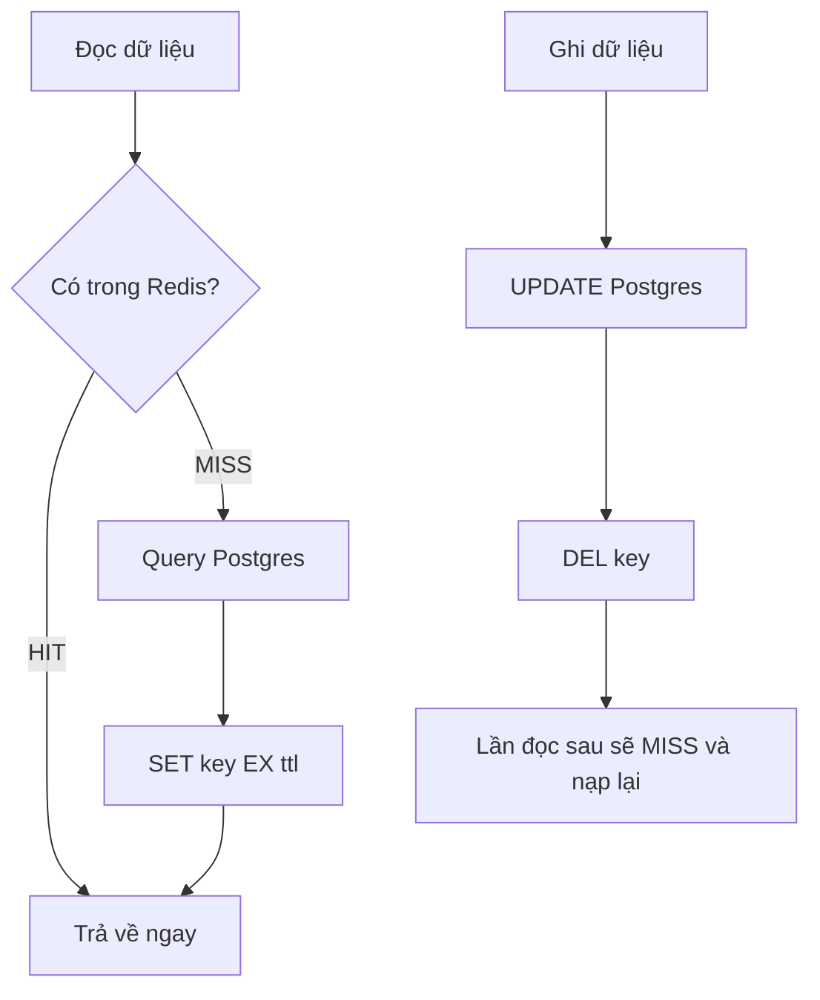

```ts
async getProduct(id: string): Promise<Product> {
  const key = `product:${id}`;

  const cached = await this.redis.get(key);
  if (cached) return JSON.parse(cached) as Product;

  const product = await this.prisma.product.findUniqueOrThrow({ where: { id } });
  await this.redis.set(key, JSON.stringify(product), "EX", 300);

  return product;
}

async updateProduct(id: string, data: UpdateProductDto): Promise<Product> {
  const product = await this.prisma.product.update({ where: { id }, data });
  await this.redis.del(`product:${id}`);   // XOÁ, không phải SET giá trị mới
  return product;
}
```

**Vì sao xoá chứ không cập nhật?** Nếu bạn `SET` giá trị mới ngay sau khi update, hai request update
đồng thời có thể ghi cache theo thứ tự ngược với thứ tự ghi DB → cache giữ giá trị của request cũ hơn,
vĩnh viễn sai tới hết TTL. `DEL` không có vấn đề đó: lần đọc kế tiếp luôn lấy trạng thái DB mới nhất.

**Cạm bẫy.**

| Cạm bẫy                              | Hậu quả                                      | Chữa                                         |
| ------------------------------------ | -------------------------------------------- | -------------------------------------------- |
| Quên invalidate ở một đường ghi      | Dữ liệu cũ tới hết TTL                       | TTL ngắn + gom mọi đường ghi vào một service |
| `SET` giá trị mới thay vì `DEL`      | Cache lệch vĩnh viễn khi ghi đồng thời       | Luôn `DEL`                                   |
| Cache cả kết quả lỗi                 | Lỗi tạm thành lỗi dai dẳng                   | Chỉ cache khi query thành công               |
| Invalidate **trước** khi ghi DB xong | Có cửa sổ để request khác nạp lại giá trị cũ | Invalidate **sau** khi DB commit             |

### 5.2 Write-through và write-behind

| Pattern           | Cách làm                                        | Khi nào                                       |
| ----------------- | ----------------------------------------------- | --------------------------------------------- |
| **Cache-aside**   | Đọc mới nạp cache                               | Mặc định. Dùng ở dự án này                    |
| **Write-through** | Ghi DB **và** ghi cache cùng lúc, đồng bộ       | Dữ liệu vừa ghi là chắc chắn sẽ đọc lại ngay  |
| **Write-behind**  | Ghi cache trước, đẩy xuống DB sau (async)       | Ghi cực nhiều, chấp nhận mất vài giây dữ liệu |
| **Read-through**  | Cache tự biết cách nạp từ DB, app chỉ gọi cache | Có thư viện cache layer riêng                 |

Write-behind nhanh nhất nhưng Redis chết là **mất dữ liệu thật**. Không dùng cho gì liên quan tiền bạc
hoặc quyền hạn.

### 5.3 Ba chiến lược invalidate

**(a) Chỉ dựa TTL.** Đơn giản nhất, không cần code invalidate. Đổi lại dữ liệu cũ tới hết TTL. Dùng khi
dữ liệu đổi hiếm và cũ một chút không sao.

**(b) Xoá tường minh (dự án đang dùng).** Mọi đường ghi gọi `DEL`. Chính xác, nhưng phải đảm bảo **không
sót đường ghi nào**.

**(c) Versioned key / generation counter.** Thay vì đi tìm và xoá key, đổi tiền tố:

```ts
// Thay vì SCAN + DEL hàng nghìn key, tăng một số đếm:
const gen = await this.redis.incr(`gen:role:${roleId}`); // → 7
const key = `role-permission:v${gen}:${roleId}:${method}:${path}`;
```

Key cũ (`v6:...`) lập tức trở nên vô dụng và tự chết theo TTL. Invalidate từ O(N) lệnh xuống **1 lệnh**.
Đánh đổi: key cũ vẫn chiếm RAM tới khi hết hạn, và mỗi lần đọc tốn thêm một `GET` để lấy generation
(có thể cache generation trong RAM app vài giây).

Đây chính là hướng nâng cấp nếu `invalidateAll()` của dự án trở thành nút thắt — xem
[7.8(b)](#78-rủi-ro-đã-biết-và-đã-chấp-nhận).

### 5.4 Chống cache stampede (thundering herd)

**Vấn đề.** Một key hot hết hạn đúng lúc 1000 request đang đổ vào → cả 1000 cùng MISS → cùng đấm vào
Postgres một lúc → DB gục. Tệ hơn: DB chậm → request timeout → retry → càng nhiều request hơn.

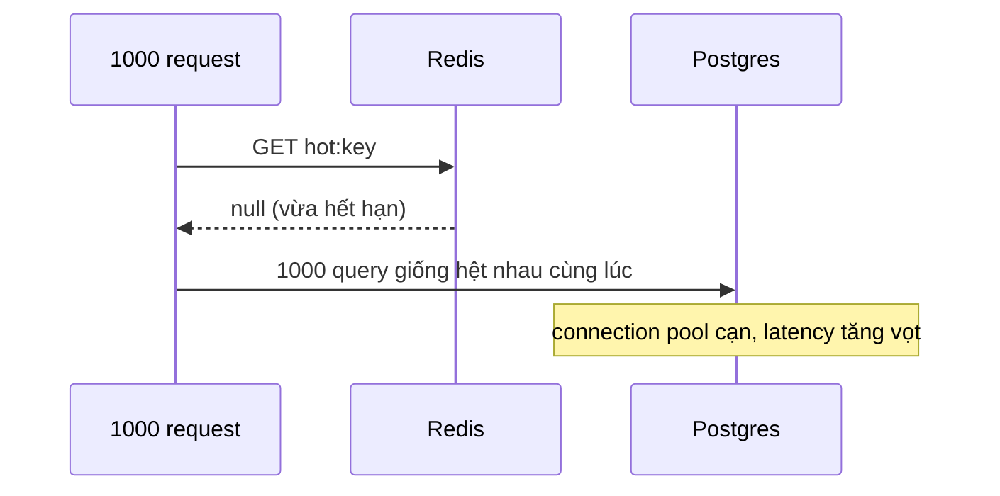

**Cách chữa 1 — jitter TTL.** Rẻ nhất, chặn được kịch bản nhiều key cùng hết hạn một lúc:

```ts
const ttl = 300 + Math.floor(Math.random() * 60); // 300–360s
await this.redis.set(key, value, "EX", ttl);
```

**Cách chữa 2 — single-flight bằng lock.** Chỉ một request được đi lấy DB, số còn lại chờ rồi đọc lại
cache:

```ts
async getWithSingleFlight<T>(key: string, loader: () => Promise<T>): Promise<T> {
  const cached = await this.redis.get(key);
  if (cached) return JSON.parse(cached) as T;

  const lockKey = `lock:${key}`;
  const token = randomUUID();
  const acquired = await this.redis.set(lockKey, token, "NX", "EX", 10);

  if (!acquired) {
    // Người khác đang nạp — chờ một nhịp rồi đọc lại
    await sleep(50);
    const retry = await this.redis.get(key);
    if (retry) return JSON.parse(retry) as T;
    return loader();          // hết kiên nhẫn thì tự đi lấy, thà chậm còn hơn treo
  }

  try {
    const value = await loader();
    await this.redis.set(key, JSON.stringify(value), "EX", 300);
    return value;
  } finally {
    await this.releaseLock(lockKey, token);   // xem 5.5
  }
}
```

**Cách chữa 3 — probabilistic early refresh.** Khi TTL còn ít, một tỉ lệ nhỏ request chủ động làm mới
cache **trước khi** nó hết hạn, nên không bao giờ có khoảnh khắc key trống.

### 5.5 Distributed lock

**Vấn đề.** Nhiều instance app cùng chạy, cần đảm bảo chỉ một instance thực hiện một việc (gửi mail,
chạy job, trừ tồn kho).

```ts
// LẤY lock
const token = randomUUID();
const ok = await redis.set(`lock:order:${id}`, token, "NX", "EX", 10);
if (!ok) throw new Error("Đang có tiến trình khác xử lý");
```

- `NX` → chỉ set nếu chưa ai giữ. Đây là phần atomic, dựa trên single-thread của Redis.
- `EX 10` → **bắt buộc**. Process chết giữa chừng thì lock tự nhả sau 10s, không kẹt vĩnh viễn.
- `token` ngẫu nhiên → để nhả đúng lock của mình.

**NHẢ lock phải dùng Lua**, không được `DEL` thẳng:

```ts
const RELEASE = `
  if redis.call("GET", KEYS[1]) == ARGV[1] then
    return redis.call("DEL", KEYS[1])
  else
    return 0
  end
`;
await redis.eval(RELEASE, 1, lockKey, token);
```

**Vì sao?** Nếu bạn `GET` thấy token của mình rồi mới `DEL`, giữa hai lệnh đó lock có thể đã hết hạn và
người khác đã lấy được — bạn sẽ xoá nhầm lock của họ. Lua chạy atomic nên không có khe hở đó.

**Giới hạn phải biết.** Lock kiểu này **không an toàn tuyệt đối**: nếu process giữ lock bị treo (GC
pause, network partition) quá `EX`, lock hết hạn, người khác vào, rồi process cũ tỉnh lại và vẫn tưởng
mình đang giữ lock → hai process cùng chạy. Muốn chặt hơn phải dùng **fencing token** (một số tăng dần
gửi kèm mọi thao tác, hệ thống đích từ chối token cũ hơn). Với việc không quá quan trọng thì lock đơn
giản là đủ; với tiền bạc thì dùng ràng buộc ở tầng DB (transaction, unique constraint) thay vì tin lock.

### 5.6 Rate limiting

**(a) Fixed window — đơn giản nhất.**

```ts
const key = `rate:${ip}:${Math.floor(Date.now() / 60000)}`; // mốc phút
const count = await redis.incr(key);
if (count === 1) await redis.expire(key, 60);
if (count > 100) throw new TooManyRequestsException();
```

Nhược điểm: ở ranh giới cửa sổ, user có thể bắn 100 request cuối phút 1 và 100 request đầu phút 2 →
200 request trong một giây.

**(b) Sliding window bằng Sorted Set — chính xác.**

```ts
const now = Date.now();
const key = `rate:${ip}`;
const windowMs = 60_000;

const pipe = redis.pipeline();
pipe.zremrangebyscore(key, 0, now - windowMs); // dọn request cũ
pipe.zadd(key, now, `${now}-${randomUUID()}`); // ghi request này
pipe.zcard(key); // đếm trong cửa sổ
pipe.expire(key, 60);
const results = await pipe.exec();

const count = results[2][1] as number;
if (count > 100) throw new TooManyRequestsException();
```

Tốn RAM hơn (mỗi request một phần tử) nhưng đúng tuyệt đối.

**(c) Token bucket bằng Lua — cho phép burst có kiểm soát.** Gộp đọc-tính-ghi vào một script atomic;
xem [6.3](#63-pipeline-transaction-và-lua) về lý do phải dùng Lua.

### 5.7 Idempotency key

**Vấn đề.** Client bấm "Thanh toán" hai lần, hoặc mạng lỗi rồi retry → tạo hai đơn hàng.

```ts
async createOrder(idempotencyKey: string, dto: CreateOrderDto) {
  const key = `idem:order:${idempotencyKey}`;

  // Giành quyền xử lý; ai giành được mới thực sự tạo đơn
  const first = await this.redis.set(key, "processing", "NX", "EX", 86400);

  if (!first) {
    const stored = await this.redis.get(key);
    if (stored === "processing") throw new ConflictException("Đang xử lý");
    return JSON.parse(stored) as Order;          // trả lại kết quả lần trước
  }

  const order = await this.orderService.create(dto);
  await this.redis.set(key, JSON.stringify(order), "EX", 86400);
  return order;
}
```

### 5.8 Hàng đợi công việc

**List — đơn giản, fire-and-forget.**

```ts
await redis.lpush("queue:email", JSON.stringify(job)); // producer

const [, raw] = await redis.brpop("queue:email", 0); // consumer, chặn chờ
await sendEmail(JSON.parse(raw));
```

Rủi ro: worker lấy job ra rồi chết → job biến mất. Dùng `BRPOPLPUSH` sang một list "đang xử lý" để có
thể khôi phục.

**Stream — có ack, có consumer group, đúng chuẩn message queue.**

```redis
XADD  orders * orderId 123 status created
XGROUP CREATE orders workers 0
XREADGROUP GROUP workers worker-1 COUNT 10 BLOCK 5000 STREAMS orders >
XACK  orders workers 1700000000000-0
XPENDING orders workers          # xem job đã giao nhưng chưa ack
```

Job chưa `XACK` vẫn nằm trong pending list và có thể giao lại cho worker khác — đây là thứ List không
có. Nếu dự án cần queue nghiêm túc, dùng Stream (hoặc BullMQ, vốn xây trên Redis).

### 5.9 Pub/Sub — và vai trò trong cache nhiều instance

```redis
SUBSCRIBE cache:invalidate         # terminal 1
PUBLISH   cache:invalidate "role:123"   # terminal 2
```

Pub/Sub là **fire-and-forget**: subscriber đang offline thì mất tin, không có lịch sử. Đừng dùng cho
việc quan trọng.

Nhưng nó rất hợp cho một việc: **đồng bộ cache trong RAM giữa nhiều instance.** Nếu app cache thứ gì đó
trong bộ nhớ process (như `SharedRoleRepository` ở [7.7](#77-một-cache-thứ-hai--trong-ram-process)), mỗi
instance giữ một bản riêng và không ai biết bản của mình đã cũ. Pub/Sub cho phép instance nào sửa dữ
liệu thì bắn một tin, các instance khác nghe được và tự xoá bản nhớ của mình.

### 5.10 Bảng tra nhanh

| Cần làm                    | Pattern                | Lệnh chính                               |
| -------------------------- | ---------------------- | ---------------------------------------- |
| Giảm tải query lặp lại     | Cache-aside            | `GET` / `SET EX` / `DEL`                 |
| Chặn DB gục khi cache lạnh | Single-flight + jitter | `SET NX EX`                              |
| Chỉ một instance được chạy | Distributed lock       | `SET NX EX` + Lua release                |
| Giới hạn tần suất          | Rate limit             | `INCR`+`EXPIRE` hoặc `ZADD`+`ZCARD`      |
| Chặn thao tác trùng        | Idempotency key        | `SET NX EX`                              |
| Chạy việc nền              | Queue                  | `LPUSH`/`BRPOP` hoặc `XADD`/`XREADGROUP` |
| Báo các instance khác      | Pub/Sub                | `PUBLISH`/`SUBSCRIBE`                    |
| Xếp hạng                   | Leaderboard            | `ZADD`/`ZREVRANGE`                       |

---

## 6. Nâng cao — phần hay bị làm sai

### 6.1 `KEYS` là cấm kỵ, `SCAN` mới đúng

```redis
KEYS role-permission:*                       # ❌ O(N), BLOCK toàn server
SCAN 0 MATCH role-permission:* COUNT 100     # ✅ quét từng mẻ
```

Redis single-thread (mục [1.1](#11-single-thread--và-vì-sao-điều-đó-lại-tốt)). `KEYS` trên 10 triệu key
khoá server vài giây — mọi request khác đứng hình, kể cả healthcheck. Đây là một trong những cách phổ
biến nhất để tự làm sập production.

`SCAN` trả về `[cursor, keys[]]`, lặp tới khi cursor về `"0"`:

```ts
let cursor = "0";
do {
  const [next, keys] = await redis.scan(cursor, "MATCH", pattern, "COUNT", 100);
  cursor = next;
  if (keys.length) await redis.del(...keys);
} while (cursor !== "0");
```

**Đảm bảo của SCAN — đọc kỹ chỗ này:**

| Đảm bảo                                                   | Nghĩa là                                        |
| --------------------------------------------------------- | ----------------------------------------------- |
| ✅ Key tồn tại **suốt** quá trình scan sẽ được trả về     | Không sót key ổn định                           |
| ⚠️ Key trả về **có thể trùng**                            | Phải chịu được xử lý hai lần                    |
| ⚠️ Key thêm/xoá **giữa chừng** có thể được trả hoặc không | Không phải ảnh chụp nhất quán                   |
| ⚠️ `COUNT` là **gợi ý**, không phải cam kết               | Mỗi mẻ có thể trả 0 key mà cursor vẫn chưa về 0 |

Với việc xoá cache, các cảnh báo này đều vô hại: xoá trùng không sao, và key mới tạo giữa chừng thì
TTL sẽ lo.

### 6.2 Big key và hot key

**Big key** — một key chứa quá nhiều dữ liệu (list 1 triệu phần tử, hash 500k field). Vì single-thread,
một lệnh `DEL` hay `HGETALL` trên nó khoá server hàng trăm ms.

```redis
--bigkeys                    # redis-cli --bigkeys, quét tìm key lớn
MEMORY USAGE mykey           # đo một key cụ thể
UNLINK mykey                 # xoá bất đồng bộ thay cho DEL
```

**Hot key** — một key bị đọc quá nhiều so với phần còn lại, làm nghẽn một node trong cluster. Chữa bằng
cách cache thêm ở RAM app vài giây, hoặc chia key thành N bản (`key:shard:0..N`).

### 6.3 Pipeline, transaction và Lua

Ba thứ hay bị nhầm lẫn:

|                | Gộp round-trip | Atomic | Dùng được kết quả lệnh trước |
| -------------- | -------------- | ------ | ---------------------------- |
| **Pipeline**   | ✅             | ❌     | ❌                           |
| **MULTI/EXEC** | ✅             | ✅     | ❌                           |
| **Lua (EVAL)** | ✅             | ✅     | ✅                           |

**Pipeline** — gửi 100 lệnh trong một lần đi mạng thay vì 100 lần round-trip. Nhanh gấp hàng chục lần,
nhưng lệnh khác vẫn xen vào giữa được:

```ts
const pipe = redis.pipeline();
keys.forEach((k) => pipe.get(k));
const results = await pipe.exec(); // [[null, "v1"], [null, "v2"], ...]
```

**MULTI/EXEC** — các lệnh chạy liên tiếp không ai chen ngang, nhưng **không phải transaction như SQL**:
không rollback được, và không đọc được kết quả lệnh trước để quyết định lệnh sau.

**Lua** — cách duy nhất để làm "đọc rồi quyết định rồi ghi" một cách atomic:

```ts
// Chỉ set nếu giá trị mới lớn hơn giá trị hiện tại
const script = `
  local cur = redis.call("GET", KEYS[1])
  if cur == false or tonumber(ARGV[1]) > tonumber(cur) then
    redis.call("SET", KEYS[1], ARGV[1])
    return 1
  end
  return 0
`;
await redis.eval(script, 1, "max:score", "250");
```

Script Lua phải **chạy nhanh** — nó khoá server suốt thời gian chạy. Không vòng lặp lớn, không gọi
ngoài.

### 6.4 Fail-open hay fail-closed

Redis chết thì app nên làm gì?

| Chiến lược      | Hành vi                         | Đúng cho                       |
| --------------- | ------------------------------- | ------------------------------ |
| **Fail-open**   | Coi như cache miss, đi thẳng DB | **Cache** — dự án dùng cái này |
| **Fail-closed** | Trả lỗi cho client              | Rate limit, lock, idempotency  |

Lý do phân đôi: cache hỏng chỉ làm app **chậm**; rate limit hỏng làm app **mất an toàn**. Nếu bỏ qua
rate limit khi Redis chết thì kẻ tấn công chỉ cần làm Redis chết là qua được mọi giới hạn.

**Fail-open phải đi kèm fail-FAST.** Chỉ `try/catch` là chưa đủ — xem [7.2](#72-tầng-kết-nối--redisservicets),
đây là chỗ dự án từng đo được 15 giây treo mỗi request.

### 6.5 Nhân bản và mở rộng

| Mô hình         | Cách hoạt động                               | Khi nào cần                                   |
| --------------- | -------------------------------------------- | --------------------------------------------- |
| **Standalone**  | Một node                                     | Dev, và production nhỏ ← **dự án đang ở đây** |
| **Replication** | 1 master ghi, N replica đọc                  | Đọc nhiều, cần backup nóng                    |
| **Sentinel**    | Giám sát + tự bầu master mới khi master chết | Cần HA mà chưa cần scale ghi                  |
| **Cluster**     | Chia key vào 16384 slot trên nhiều node      | Dữ liệu vượt RAM một máy                      |

Lưu ý khi lên Cluster: lệnh động tới **nhiều key** chỉ chạy được nếu các key nằm cùng slot. Muốn ép
cùng slot thì dùng hash tag: `role-permission:{roleId}:GET:/users` — phần trong `{}` quyết định slot.
`SCAN` cũng phải chạy trên **từng node**, không còn quét được toàn cluster bằng một vòng lặp.

### 6.6 Bảo mật

- **Đừng để Redis mở ra internet.** Mặc định không có mật khẩu. Bind vào network nội bộ (như
  `ecom-network` trong compose của dự án), không publish port ra ngoài ở production.
- Đặt `requirepass` hoặc dùng ACL (`ACL SETUSER`) cho production.
- Disable lệnh nguy hiểm: `FLUSHALL`, `CONFIG`, `KEYS` qua `rename-command`.
- **Không cache dữ liệu nhạy cảm** (mật khẩu, token còn hiệu lực, số thẻ) nếu không mã hoá.

### 6.7 Quan sát và chẩn đoán

```redis
INFO memory              # used_memory_human, maxmemory, mảnh vụn bộ nhớ
INFO stats               # keyspace_hits / keyspace_misses → tính hit rate
INFO clients             # số kết nối, có bị rò không
INFO replication
DBSIZE                   # tổng số key
SLOWLOG GET 10           # 10 lệnh chậm nhất gần đây
CLIENT LIST              # ai đang nối vào
LATENCY DOCTOR           # Redis tự chẩn đoán độ trễ
MONITOR                  # xem MỌI lệnh realtime — chỉ dùng lúc debug, rất nặng
```

**Hit rate** là chỉ số quan trọng nhất của một cache:

```
hit rate = keyspace_hits / (keyspace_hits + keyspace_misses)
```

Dưới 80% thì phải hỏi: TTL quá ngắn? Invalidate quá thô? Key có quá phân mảnh (cardinality cao) không?

---

## 7. Redis trong dự án này

Trong dự án này Redis làm **đúng một việc**: cache kết quả tra role/permission của auth guard — query
duy nhất chạy trên **mọi** request có token.

### 7.1 Toàn cảnh các thành phần

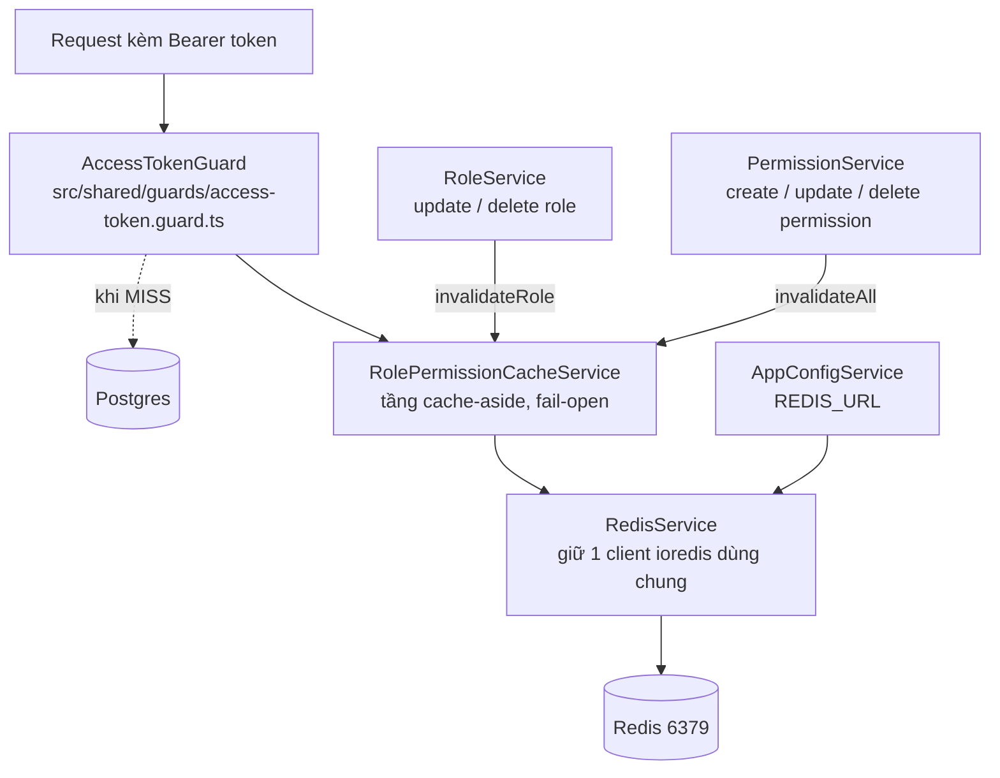

| Thành phần       | File                                                                             | Trách nhiệm                                                    |
| ---------------- | -------------------------------------------------------------------------------- | -------------------------------------------------------------- |
| Kết nối          | `src/shared/services/redis.service.ts`                                           | Một client ioredis, cấu hình fail-fast, đóng sạch khi shutdown |
| Tầng cache       | `src/shared/services/role-permission-cache.service.ts`                           | `get`/`set`/`invalidateRole`/`invalidateAll`, bọc fail-open    |
| Đọc              | `src/shared/guards/access-token.guard.ts`                                        | Cache-aside quanh query role/permission                        |
| Ghi (invalidate) | `src/routes/role/role.service.ts`, `src/routes/permission/permission.service.ts` | Xoá cache sau khi ghi DB thành công                            |
| Cấu hình         | `src/types/config.type.ts`, `app-config.service.ts`, `.env.example`              | `REDIS_URL`                                                    |
| Hạ tầng          | `docker-compose.yml`                                                             | `redis:7-alpine` + healthcheck, `app` chờ redis healthy        |

### 7.2 Tầng kết nối — `redis.service.ts`

Một client `ioredis` duy nhất cho cả app (provider của NestJS mặc định là singleton). Phần đáng học là
cấu hình:

```ts
new Redis(redisUrl, {
  maxRetriesPerRequest: 2,
  enableOfflineQueue: false, // ← dòng quan trọng nhất
  connectTimeout: 3000,
  commandTimeout: 1000,
  retryStrategy: (times) => Math.min(times * 200, 5000),
});
```

**`enableOfflineQueue: false`.** Mặc định ioredis **xếp hàng** lệnh khi mất kết nối và chờ nối lại.
Với cache đó là thảm hoạ: Redis chết → mọi request auth treo chờ cache, trong khi lẽ ra chỉ cần fail
ngay rồi hỏi Postgres. Số đo thật của dự án (chi tiết trong
[redis-role-permission-cache.md](redis-role-permission-cache.md#fail-open-phải-đi-kèm-fail-fast-cấu-hình-ioredis)):

| Lần gọi `get()` khi Redis chết | Mặc định ioredis | Sau khi cấu hình |
| ------------------------------ | ---------------- | ---------------- |
| #1                             | 312 ms           | 4 ms             |
| #3                             | 10.119 ms        | 0 ms             |
| #5                             | 15.320 ms        | 0 ms             |

15 giây mỗi request không phải là "degradation", đó là sập cả API.

**`commandTimeout: 1000`** chặn kiểu hỏng thứ hai: socket vẫn mở nhưng Redis treo (đang chạy lệnh chậm,
hoặc quá tải). 1 giây là rất rộng rãi so với `GET` nội bộ dưới 5ms.

**`retryStrategy`** có trần 5s, nên client vẫn tự nối lại trong nền và cache tự hoạt động trở lại —
không cần restart app (đo thật: ~503 ms sau khi Redis bật lại).

**Vòng đời kết nối:**

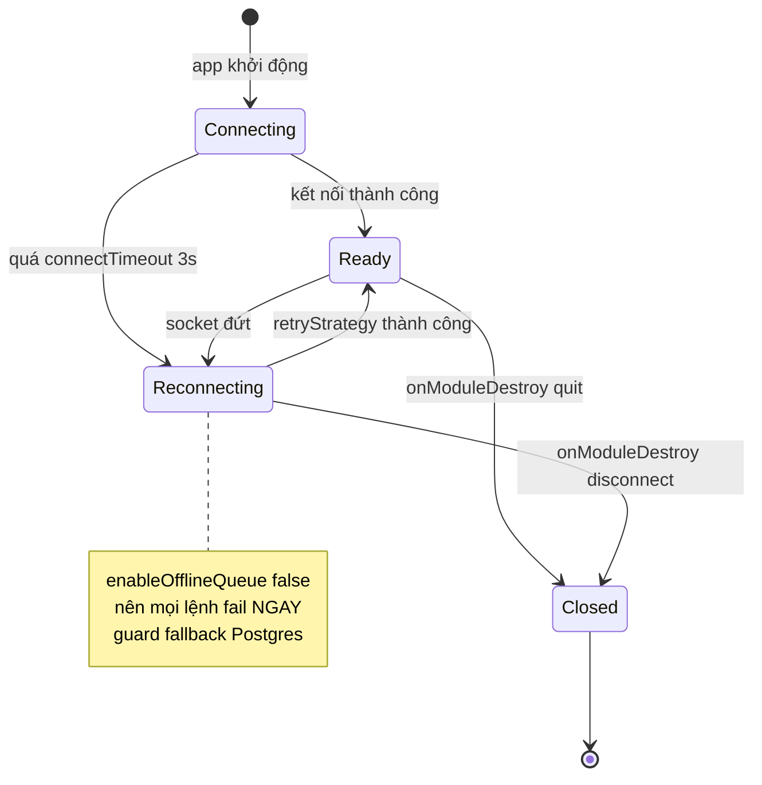

`onModuleDestroy` gọi `quit()`, và nếu `quit()` ném lỗi (connection đã chết, offline queue đã tắt) thì
`disconnect()` cưỡng bức — để shutdown không bao giờ fail vì Redis.

### 7.3 Tầng cache — `role-permission-cache.service.ts`

**Cấu trúc key:**

```
role-permission:{roleId}:{method}:{path}

ví dụ: role-permission:11111111-2222-3333-4444-555555555555:GET:/products/:id
       └──── namespace ────┘└─ role ─┘└method┘└── route ──┘
```

Cache theo **bộ ba (role, method, route)** chứ không phải cache cả role. Vì guard chỉ cần trả lời "role
này có quyền vào đúng route này không" — query DB cũng chỉ lấy `permissions where { path, method }`.

| Thuộc tính | Giá trị                | Lý do                                               |
| ---------- | ---------------------- | --------------------------------------------------- |
| TTL        | 300 giây               | Lưới an toàn thứ hai sau invalidate tường minh      |
| Định dạng  | `JSON.stringify(role)` | Guard dùng nguyên cả object, không cần sửa lẻ field |
| Quét xoá   | `SCAN` `COUNT 100`     | Không bao giờ dùng `KEYS` (mục 6.1)                 |
| Khi lỗi    | Fail-open              | Cache hỏng chỉ làm chậm, không được làm sai quyền   |

Bốn method, cả bốn đều bọc `try/catch`:

| Method                   | Khi Redis lỗi     | Hệ quả                            |
| ------------------------ | ----------------- | --------------------------------- |
| `get()`                  | trả `null`        | Guard hiểu là MISS → đọc Postgres |
| `set()`                  | nuốt lỗi, chỉ log | Request hiện tại vẫn thành công   |
| `invalidateRole(roleId)` | nuốt lỗi, chỉ log | Cache cũ sống tới hết TTL         |
| `invalidateAll()`        | nuốt lỗi, chỉ log | Cache cũ sống tới hết TTL         |

**Hệ quả quan trọng:** không có kịch bản nào Redis lỗi làm **bypass** hay **chặn nhầm** permission,
vì quyết định "có quyền hay không" luôn dựa trên dữ liệu Postgres khi cache không đáng tin.

### 7.4 Luồng đọc

**Toàn cảnh `canActivate`:**

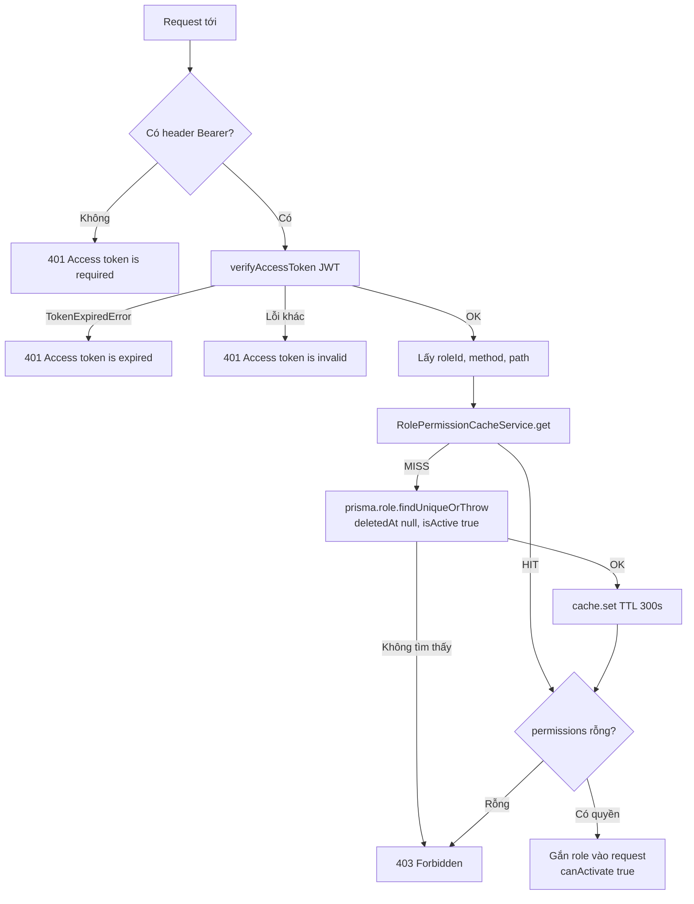

**Cache HIT — không chạm DB:**

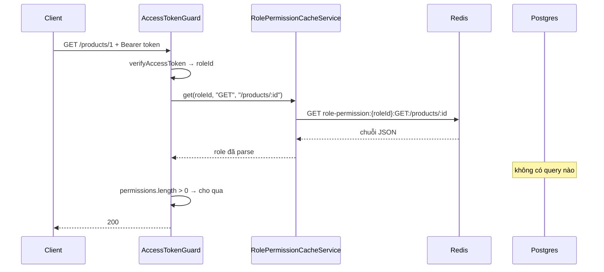

**Cache MISS — đọc DB rồi nạp lại cache:**

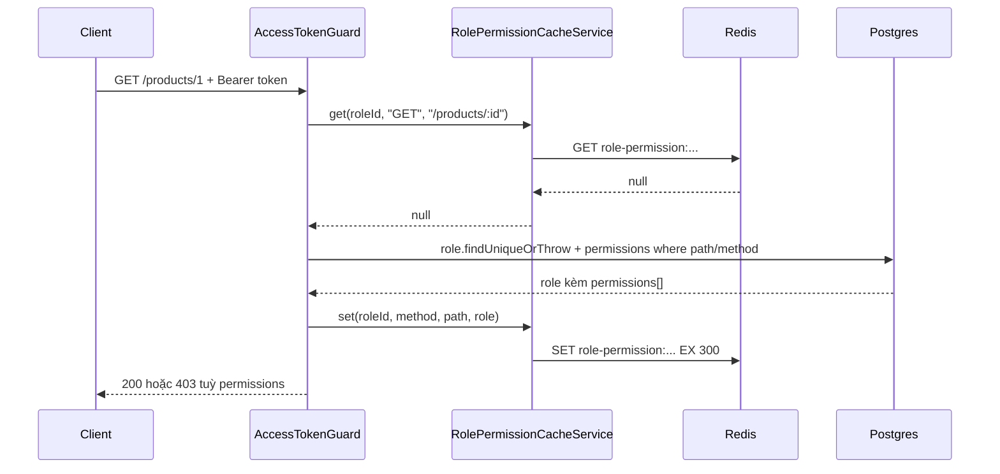

**Một chi tiết thiết kế đáng chú ý.** Hình dạng `select` được định nghĩa **một lần** trong
`buildRoleRoutePermissionSelect(path, method)`, và kiểu TypeScript của giá trị cache được **suy ra từ
chính hàm đó**:

```ts
type RoleWithRoutePermissions = Prisma.RoleGetPayload<{
  select: ReturnType<typeof buildRoleRoutePermissionSelect>;
}>;
```

Nghĩa là nếu ai đó sửa query mà quên sửa kiểu cache, TypeScript báo lỗi ngay. Cache và DB không thể
lệch shape — một lỗi rất khó phát hiện lúc runtime đã bị chặn ở compile time.

**Một khác biệt phải nhớ khi đọc giá trị cache:** sau round-trip JSON, các field `Date` (`createdAt`,
`updatedAt`) trở thành **chuỗi ISO**, khác với object Prisma trả về lúc MISS. Hiện chỉ có decorator
`ActiveUserRole` đọc từ `request[REQUEST_ROLE_PERMISSIONS_KEY]` và chỉ dùng `role.id` / `role.name`
(đều là string) nên vô hại. **Nếu sau này có consumer đọc field Date từ đây thì phải xử lý lại.**

### 7.5 Luồng invalidate

| Nơi gọi                                    | Hành động      | Xoá gì               | Vì sao                   |
| ------------------------------------------ | -------------- | -------------------- | ------------------------ |
| `role.service.ts` `updateRole`             | Sửa role       | `invalidateRole(id)` | Chỉ role đó bị ảnh hưởng |
| `role.service.ts` `deleteRole`             | Xoá role       | `invalidateRole(id)` | Chỉ role đó bị ảnh hưởng |
| `permission.service.ts` `createPermission` | Tạo permission | `invalidateAll()`    | Có thể gắn nhiều role    |
| `permission.service.ts` `updatePermission` | Sửa permission | `invalidateAll()`    | Có thể gắn nhiều role    |
| `permission.service.ts` `deletePermission` | Xoá permission | `invalidateAll()`    | Có thể gắn nhiều role    |

**Sửa role — invalidate có mục tiêu:**

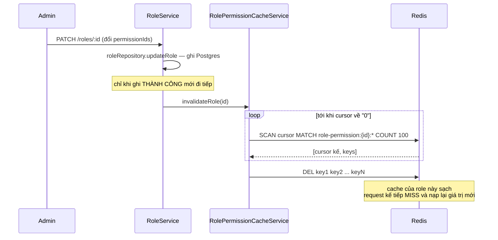

**Sửa permission — flush cả namespace:**

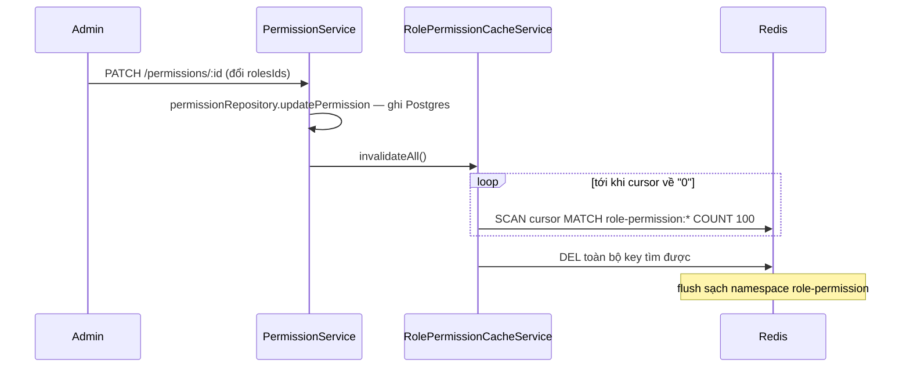

**Vì sao `invalidateAll()` chứ không xoá có mục tiêu?** Endpoint update permission nhận `rolesIds` mới
rồi `set` lại quan hệ. Nghĩa là các role bị **gỡ khỏi** permission (không còn trong `rolesIds` mới)
cũng cần invalidate — nhưng response của `updatePermission` không trả về danh sách role **cũ** để tính
diff. Vì thao tác permission là hành động admin hiếm khi xảy ra, đánh đổi hit-rate lấy sự đơn giản và
đúng-trong-mọi-trường-hợp là hợp lý.

**Không invalidate khi thao tác thất bại.** Lời gọi invalidate luôn nằm **sau** `await` ghi DB — nếu
ghi ném lỗi thì exception propagate trước khi chạm tới dòng invalidate. Hành vi này được khoá lại bằng
test `does not invalidate the cache when the update is refused`.

### 7.6 Khi Redis chết — luồng suy giảm

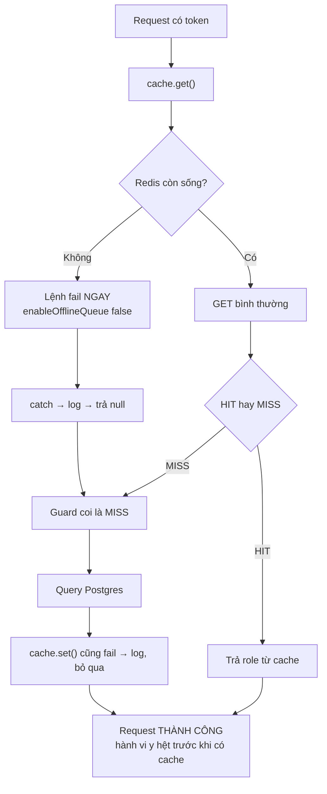

Tóm lại: Redis chết → mọi request quay về hành vi cũ (query Postgres mỗi lần). Chậm hơn, nhưng đúng và
vẫn phục vụ được. Khi Redis sống lại, cache tự hoạt động trở lại mà không cần restart app.

### 7.7 Một cache thứ hai — trong RAM process

`src/repositories/role/shared-role.repository.ts` cũng cache, nhưng **trong bộ nhớ của process**, không
qua Redis:

```ts
private clientRoleId: RoleId | null = null;
private adminRoleId: RoleId | null = null;
```

Lý do hợp lý: id của role CLIENT/ADMIN gần như không bao giờ đổi. Nhưng cần biết rõ giới hạn:

| Đặc điểm          | Hệ quả                                                   |
| ----------------- | -------------------------------------------------------- |
| Không có TTL      | Giá trị sai sẽ sống tới khi restart                      |
| Không có API xoá  | Xoá rồi tạo lại role ADMIN thì **phải restart app**      |
| Riêng mỗi process | Chạy nhiều instance thì mỗi instance giữ một bản độc lập |

Nếu sau này role được phép đổi id (hiếm, nhưng ví dụ khi reseed), đây là chỗ cần chuyển sang Redis
hoặc thêm cơ chế invalidate qua Pub/Sub ([5.9](#59-pubsub--và-vai-trò-trong-cache-nhiều-instance)).

### 7.8 Rủi ro đã biết và đã chấp nhận

**(a) Read-after-invalidate race.** Được ghi thẳng trong docstring của `fetchRolePermission`:

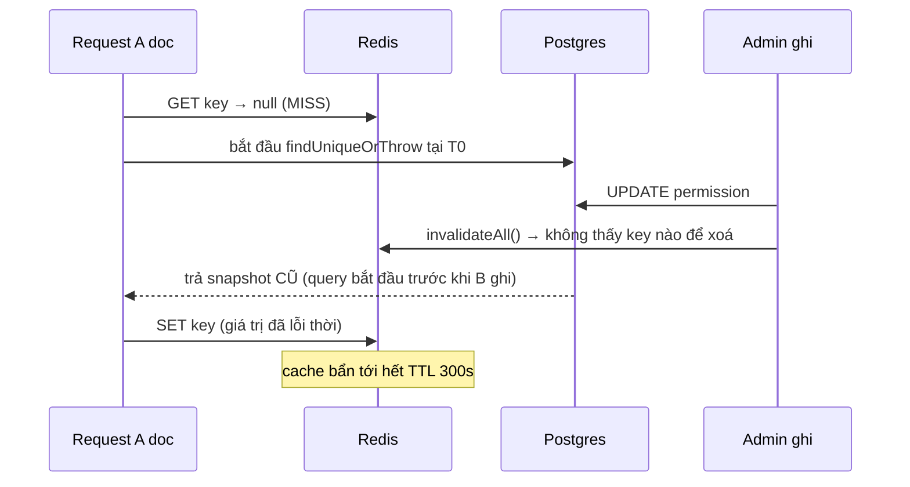

Đây là race kinh điển của **mọi** cache-aside, không riêng cache này. Nhóm chọn **chấp nhận**: TTL 300s
giới hạn thiệt hại và mọi đường ghi đều đã invalidate chủ động. Muốn đóng hẳn thì gắn version-stamp
(vd. `updatedAt` của role) vào giá trị cache và từ chối entry cũ hơn lần invalidate gần nhất — xem
pattern [5.3(c)](#53-ba-chiến-lược-invalidate).

**(b) `invalidateAll()` là công cụ thô.** Mọi thay đổi permission flush sạch cache của mọi role. Chấp
nhận được vì thao tác này hiếm. Nếu tương lai permission bị sửa thường xuyên, đây là chỗ đau đầu tiên —
chuyển sang versioned key ([5.3(c)](#53-ba-chiến-lược-invalidate)) là đường nâng cấp.

**(c) Thundering herd nhẹ.** Nhiều request cùng một `(roleId, method, path)` chưa từng cache (cold
cache hoặc vừa invalidate) sẽ cùng MISS và cùng query Postgres — chưa có single-flight. Chấp nhận được
vì TTL 300s giới hạn tần suất. Nếu cần chữa, xem [5.4](#54-chống-cache-stampede-thundering-herd).

**(d) Chưa có endpoint toggle `Role.isActive`.** `updateRole` hiện chỉ nhận `name`/`description`/
`permissionIds`, nên kịch bản "role bị vô hiệu hoá nhưng cache vẫn báo active" chưa xảy ra được. **Nếu
sau này thêm tính năng đó, bắt buộc phải gọi `invalidateRole` cùng lúc** — cache không có cách nào tự
phát hiện role đổi trạng thái ngoài TTL.

### 7.9 Test coverage

| File test                                                                       | Khoá lại hành vi gì                                                                              |
| ------------------------------------------------------------------------------- | ------------------------------------------------------------------------------------------------ |
| `services/__tests__/role-permission-cache-service.spec.ts`                      | get hit/miss/lỗi-fail-open; set thành công/nuốt lỗi; invalidate dùng SCAN phân trang đúng cursor |
| `guards/__tests__/access-token.guard.spec.ts`                                   | Cache hit bỏ qua DB; miss nạp lại cache; cached role rỗng permissions vẫn 403                    |
| `routes/role/__tests__/role-service-{update,delete}.spec.ts`                    | Gọi `invalidateRole` sau khi thành công; **không** gọi khi bị forbidden                          |
| `routes/permission/__tests__/permission-service-{create,update,delete}.spec.ts` | Gọi `invalidateAll` sau khi thành công; không gọi khi thất bại                                   |
| `services/__tests__/redis-service.spec.ts`                                      | Cấu hình fail-fast (`enableOfflineQueue: false`, timeouts, retry có trần), quit khi shutdown     |
| `services/__tests__/app-config-service.spec.ts`                                 | Load `REDIS_URL` từ env đúng                                                                     |

Unit test dùng mock ioredis, nên đã có thêm một vòng kiểm chứng với container `redis:7-alpine` thật —
kết quả chi tiết trong [redis-role-permission-cache.md](redis-role-permission-cache.md#kiểm-chứng-thực-tế-với-redis-thật).

---

## 8. Vận hành và debug

### 8.1 Cấu hình

```bash
# .env
REDIS_URL="redis://localhost:6379"
```

`docker-compose.yml` đã có service `redis:7-alpine` kèm healthcheck (`redis-cli ping`), và service `app`
khai báo `depends_on: redis: condition: service_healthy`. Không cần migration hay seed — cache tự
populate theo traffic thật.

### 8.2 Debug cache của dự án

```bash
docker compose exec redis redis-cli
```

```redis
# Xem toàn bộ key của cache này (chỉ dùng ở dev — dùng SCAN ở production)
SCAN 0 MATCH role-permission:* COUNT 100

# Soi một entry cụ thể
GET role-permission:{roleId}:GET:/products/:id
TTL role-permission:{roleId}:GET:/products/:id

# Đo hiệu quả cache
INFO stats | grep keyspace          # hits / misses
DBSIZE

# Xoá cache của một role (mô phỏng invalidateRole)
--scan --pattern 'role-permission:{roleId}:*'    # redis-cli --scan

# Xoá sạch cache của dự án khi cần thử lại từ đầu (chỉ ở dev)
FLUSHDB
```

### 8.3 Bảng chẩn đoán sự cố

| Triệu chứng                        | Nguyên nhân khả dĩ                                                      | Kiểm tra                                                            |
| ---------------------------------- | ----------------------------------------------------------------------- | ------------------------------------------------------------------- |
| Đổi quyền rồi mà user vẫn vào được | Thiếu invalidate ở đường ghi mới thêm                                   | `TTL` của key; grep xem service có gọi invalidate không             |
| Mọi request auth chậm              | Redis chết → luôn MISS → luôn query DB                                  | Log `Redis connection error`; `redis-cli ping`                      |
| Request auth **treo** vài giây     | `enableOfflineQueue` bị bật lại                                         | Kiểm tra `redis.service.ts`; test `redis-service.spec.ts` phải FAIL |
| Hit rate thấp                      | TTL quá ngắn, hoặc `invalidateAll()` chạy quá thường xuyên              | `INFO stats`; đếm tần suất mutation permission                      |
| Redis ngốn RAM                     | Key không có TTL, hoặc `maxmemory-policy` = `noeviction`                | `INFO memory`; `redis-cli --bigkeys`                                |
| 403 sai sau khi sửa permission     | Read-after-invalidate race ([7.8a](#78-rủi-ro-đã-biết-và-đã-chấp-nhận)) | Đợi hết TTL hoặc invalidate thủ công để xác nhận                    |

---

## 9. Checklist khi thêm một cache mới

Trước khi thêm bất kỳ cache Redis nào vào dự án này:

- [ ] **Query này có thực sự đắt và lặp lại không?** Đo trước bằng `SLOWLOG` hoặc log Prisma. Đừng cache
      theo cảm tính.
- [ ] **Key có namespace riêng chưa?** Tiền tố rõ ràng (`role-permission:`, `product:`) để invalidate
      theo pattern được và không đụng nhau.
- [ ] **TTL là bao nhiêu, và vì sao?** Trả lời câu "chấp nhận dữ liệu cũ tối đa bao lâu".
- [ ] **Đã liệt kê **mọi** đường ghi vào dữ liệu gốc chưa?** Mỗi đường phải `DEL` (không phải `SET`)
      và phải nằm **sau** khi DB ghi thành công.
- [ ] **Fail-open hay fail-closed?** Cache → fail-open; rate limit/lock → fail-closed ([6.4](#64-fail-open-hay-fail-closed)).
- [ ] **Dùng `SCAN`, không bao giờ `KEYS`.**
- [ ] **Giá trị có field `Date` không?** JSON round-trip biến nó thành string — kiểm tra consumer.
- [ ] **Type của giá trị cache có suy ra từ cùng nguồn với query không?** Học cách làm ở
      `buildRoleRoutePermissionSelect` ([7.4](#74-luồng-đọc)).
- [ ] **Có test cho: hit, miss, Redis lỗi, invalidate sau khi ghi thành công, KHÔNG invalidate khi ghi
      thất bại?**
- [ ] **Có cập nhật tài liệu này không?**

---

## 10. Cheat sheet

```redis
# String
SET k v [EX s] [NX|XX] [KEEPTTL]    GET k    DEL k    EXISTS k
INCR k    INCRBY k n    APPEND k v

# TTL
TTL k    PTTL k    EXPIRE k s    PERSIST k
# TTL trả -1 = không hết hạn, -2 = key không tồn tại

# Hash
HSET k f v    HGET k f    HMGET k f1 f2    HGETALL k    HDEL k f    HINCRBY k f n

# List
LPUSH k v    RPUSH k v    LPOP k    RPOP k    BRPOP k timeout
LRANGE k 0 -1    LLEN k    LTRIM k 0 99

# Set
SADD k m    SREM k m    SISMEMBER k m    SMEMBERS k    SCARD k
SINTER k1 k2    SUNION k1 k2    SDIFF k1 k2

# Sorted Set
ZADD k score m    ZREVRANGE k 0 9 WITHSCORES    ZRANK k m
ZINCRBY k n m    ZRANGEBYSCORE k min max    ZREMRANGEBYSCORE k min max

# Duyệt key
SCAN cursor MATCH pattern COUNT n     # ✅
KEYS pattern                          # ❌ không bao giờ ở production

# Atomic
MULTI ... EXEC          # chạy liên tiếp, không đọc được kết quả giữa chừng
EVAL script numkeys k1 arg1     # atomic thật sự, đọc-quyết-định-ghi

# Chẩn đoán
INFO memory|stats|clients    DBSIZE    SLOWLOG GET 10
CLIENT LIST    MEMORY USAGE k    LATENCY DOCTOR    MONITOR
redis-cli --bigkeys    redis-cli --scan --pattern 'p:*'

# Dọn dẹp
UNLINK k        # xoá async, an toàn cho key lớn
FLUSHDB         # xoá sạch DB hiện tại — CHỈ ở dev
```

---

## Xem thêm

- [redis-role-permission-cache.md](redis-role-permission-cache.md) — biên bản triển khai cache hiện có:
  số liệu đo thật, test coverage đầy đủ, risk đã review và accept.
- [race-conditions-analysis.md](race-conditions-analysis.md) — phân tích race condition toàn hệ thống.
- [error-handling.md](error-handling.md) — cách lỗi (kể cả lỗi Redis) trở thành response.
