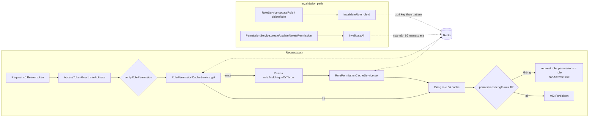
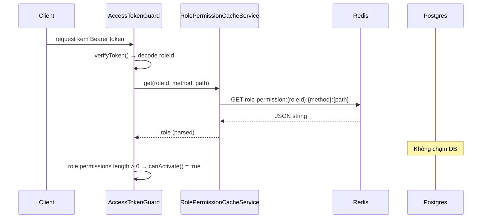
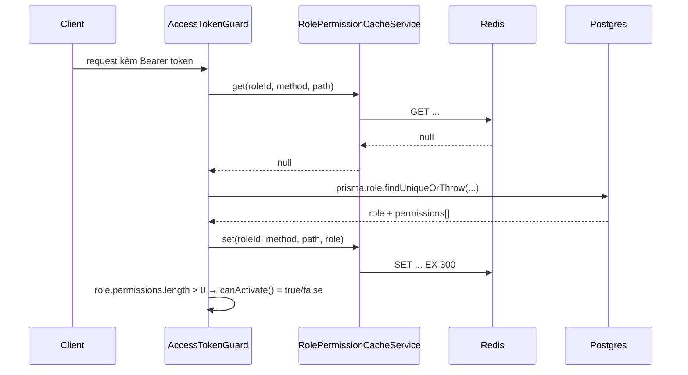
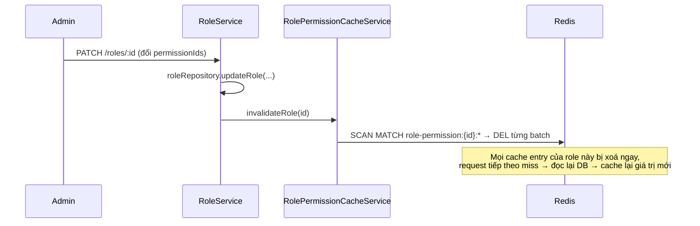
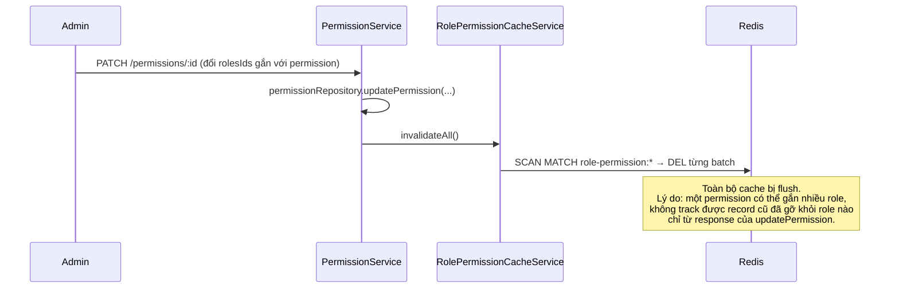

# Redis cache cho role/permission check trong Auth Guard

> Vị trí triển khai (ưu tiên 1 trong phân tích tối ưu Redis): `src/shared/guards/access-token.guard.ts`.
> Mục tiêu: mọi request có auth trước đây đều query Postgres (`role.findUniqueOrThrow` join permissions)
> để check quyền trên route hiện tại — đây là query lặp lại nhiều nhất trong toàn app vì nó chạy trên
> **mọi** request, không phải một endpoint cụ thể.

## Vấn đề trước khi có cache

`AccessTokenGuard.verifyRolePermission()` (trước đây) chạy DB query này trên mỗi request:

```ts
const role = await this.prismaService.role.findUniqueOrThrow({
  where: { deletedAt: null, id: decodedAccessToken.roleId, isActive: true },
  select: {
    ...roleWithPermissionsSelect,
    permissions: { where: { deletedAt: null, path, method } },
  },
});
```

Dữ liệu này gần như tĩnh (permission của 1 role hiếm khi đổi — chỉ đổi khi admin sửa role/permission),
nhưng lại bị đọc lại từ DB ở tần suất QPS toàn hệ thống.

## Kiến trúc



## Các file đã thêm/sửa

| File                                                                | Vai trò                                                                             |
| ------------------------------------------------------------------- | ----------------------------------------------------------------------------------- |
| `src/shared/services/redis.service.ts`                              | Wrapper mỏng quanh `ioredis` client, `onModuleDestroy` gọi `client.quit()`.         |
| `src/shared/services/role-permission-cache.service.ts`              | Logic cache: `get`/`set`/`invalidateRole`/`invalidateAll`. Fail-open khi Redis lỗi. |
| `src/shared/guards/access-token.guard.ts`                           | Guard đọc cache trước, miss thì fallback Postgres rồi ghi lại cache.                |
| `src/routes/role/role.service.ts`                                   | `updateRole`/`deleteRole` gọi `invalidateRole(id)` sau khi ghi DB thành công.       |
| `src/routes/permission/permission.service.ts`                       | `createPermission`/`updatePermission`/`deletePermission` gọi `invalidateAll()`.     |
| `src/types/config.type.ts`, `app-config.service.ts`, `.env.example` | Thêm `REDIS_URL`.                                                                   |
| `docker-compose.yml`                                                | Thêm service `redis:7-alpine`, `app` phụ thuộc `redis` healthy.                     |

## Cache key & TTL

- Key: `role-permission:{roleId}:{method}:{path}` — ví dụ `role-permission:11111111-...:GET:/users`.
- TTL: 300 giây (`CACHE_TTL_SECONDS` trong `role-permission-cache.service.ts`). Đây là chặn trên cho độ
  trễ khi permission thay đổi nhưng cơ chế invalidate (bên dưới) không kịp bắt (không nên xảy ra trong
  luồng bình thường, TTL chỉ là lưới an toàn thứ hai).
- Giá trị lưu: nguyên object `role` mà Prisma trả về (`id, name, description, isActive, permissions[]`),
  y hệt những gì guard gán vào `request[REQUEST_ROLE_PERMISSIONS_KEY]` — nên cache hit trả thẳng object
  này ra dùng luôn, không cần transform.

## Luồng đọc (cache hit / miss)

### Cache hit



### Cache miss



## Luồng invalidate

### Sửa/xoá role (chỉ ảnh hưởng role đó)



### Sửa/xoá/tạo permission (có thể ảnh hưởng nhiều role cùng lúc)



**Vì sao `invalidateAll()` thay vì targeted invalidation theo từng role bị ảnh hưởng:** endpoint update
permission nhận `rolesIds` mới rồi `set` lại quan hệ (`roles: { set: rolesIds.map(...) } }`), nghĩa là các
role đã bị **gỡ** khỏi permission (không còn trong `rolesIds` mới) cũng cần invalidate, nhưng response
của `updatePermission` không trả về danh sách role cũ để tính diff. Vì permission mutation là hành động
admin hiếm khi xảy ra, đánh đổi lấy sự đơn giản và đúng-trong-mọi-trường-hợp bằng cách flush toàn bộ cache
là chấp nhận được.

**Không invalidate khi thao tác thất bại**: cả `invalidateRole`/`invalidateAll` chỉ được gọi **sau** khi
`await roleRepository.updateRole(...)` / `permissionRepository.*(...)` resolve thành công — nếu ném lỗi,
exception propagate trước khi chạm dòng invalidate. Test `does not invalidate the cache when the update
is refused` khoá lại hành vi này.

## Chiến lược an toàn khi Redis lỗi (fail-open + fail-fast)

`RolePermissionCacheService.get`/`set`/`invalidateRole`/`invalidateAll` đều bọc try/catch, log lỗi rồi:

- `get()` trả `null` (coi như cache miss) → guard fallback đọc DB bình thường.
- `set()`/invalidate không throw, chỉ log — request hiện tại vẫn thành công.

**Hệ quả**: Redis down hoàn toàn → guard luôn miss cache → mọi request quay lại hành vi y hệt trước khi
có cache (query Postgres mỗi lần). Không có kịch bản nào Redis lỗi làm bypass permission check hoặc chặn
nhầm — vì việc quyết định "có quyền hay không" luôn dựa trên dữ liệu Postgres khi cache không đáng tin.

### Fail-open phải đi kèm fail-FAST (cấu hình ioredis)

Chỉ try/catch là **chưa đủ**. Với option mặc định của ioredis (`enableOfflineQueue: true`), khi Redis
chết thì lệnh không fail ngay mà bị **xếp hàng chờ** kết nối quay lại — đo thực tế trên máy dev:

| Lần gọi `get()` khi Redis chết | Mặc định ioredis | Sau khi cấu hình |
| ------------------------------ | ---------------- | ---------------- |
| #1                             | 312 ms           | 4 ms             |
| #2                             | 1.768 ms         | 0 ms             |
| #3                             | 10.119 ms        | 0 ms             |
| #4                             | 15.440 ms        | 0 ms             |
| #5                             | 15.320 ms        | 0 ms             |

Tức là Redis chết sẽ làm **mọi request có auth treo tới 15 giây** rồi mới fallback sang Postgres — đó
không phải degradation mà là sập cả API. Vì vậy `RedisService` cấu hình:

```ts
enableOfflineQueue: false,  // lệnh fail ngay khi socket chết, không xếp hàng
connectTimeout: 3000,
commandTimeout: 1000,       // chặn cả case Redis còn sống nhưng treo
maxRetriesPerRequest: 2,
retryStrategy: (times) => Math.min(times * 200, 5000), // vẫn tự reconnect nền
```

Đánh đổi duy nhất của `enableOfflineQueue: false`: vài lệnh phát ra **trước khi kết nối kịp thiết lập**
(cửa sổ boot, <1s) sẽ fail → guard fallback DB. Vô hại, và tự hết ngay khi client `ready`.

Hành vi này được khoá lại bằng `src/shared/services/__tests__/redis-service.spec.ts` (đã kiểm chứng là
test FAIL đúng khi revert `enableOfflineQueue` về `true`).

## Kiểm chứng thực tế với Redis thật

Unit test dùng mock ioredis nên không chứng minh được API thật. Đã chạy verification riêng với container
`redis:7-alpine` thật, kết quả toàn bộ PASS:

| Hạng mục                                                     | Kết quả                                               |
| ------------------------------------------------------------ | ----------------------------------------------------- |
| `set()` ghi key thật + TTL                                   | key tồn tại, TTL 300s                                 |
| `get()` round-trip qua JSON                                  | object nguyên vẹn, `permissions.length` dùng được     |
| `invalidateRole()` với **251 key** (ép SCAN phân trang thật) | xoá sạch role A, role B nguyên vẹn                    |
| `invalidateAll()`                                            | sạch namespace `role-permission:*`, key khác còn      |
| Redis chết giữa chừng                                        | fail-open 0–1 ms, trả `null`                          |
| Redis bật lại                                                | cache tự hoạt động lại sau ~503 ms, không restart app |

**Lưu ý từ round-trip JSON**: các field `Date` trong permission (`createdAt`/`updatedAt`) trở thành chuỗi
ISO sau khi qua cache, khác với object Prisma trả về trực tiếp lúc cache miss. Đã kiểm tra toàn bộ consumer
của `request[REQUEST_ROLE_PERMISSIONS_KEY]` (chỉ `ActiveUserRole` decorator, dùng ở `manage-order`,
`manage-product`, `user` controller) — tất cả chỉ đọc `role.name` và `role.id` (string), nên khác biệt này
không ảnh hưởng. Nếu sau này có consumer đọc field Date từ đây thì phải xử lý lại.

## Test coverage

- `src/shared/services/__tests__/role-permission-cache-service.spec.ts`: get hit/miss/lỗi-fail-open, set
  thành công/lỗi nuốt lỗi, invalidateRole/invalidateAll dùng SCAN phân trang đúng cursor.
- `src/shared/guards/__tests__/access-token.guard.spec.ts`: cache hit bỏ qua DB, cache miss populate lại
  cache, cached role rỗng permissions vẫn 403 đúng như trước.
- `src/routes/role/__tests__/role-service-update.spec.ts`, `role-service-delete.spec.ts`: gọi
  `invalidateRole` sau khi update/delete thành công, không gọi khi bị forbidden.
- `src/routes/permission/__tests__/permission-service-{create,update,delete}.spec.ts`: gọi
  `invalidateAll` sau khi thao tác thành công, không gọi khi thất bại.
- `src/shared/services/__tests__/redis-service.spec.ts`: khoá lại cấu hình kết nối fail-fast
  (`enableOfflineQueue: false`, `connectTimeout`, `commandTimeout`, retry backoff có trần), quit client
  khi shutdown.
- `src/shared/services/__tests__/app-config-service.spec.ts`: load `REDIS_URL` từ env đúng.

## Vận hành

- Thêm `REDIS_URL` vào `.env` (mặc định dev: `redis://localhost:6379`, xem `.env.example`).
- `docker-compose.yml` đã có service `redis:7-alpine` với healthcheck; service `app` chờ `redis` healthy
  trước khi start.
- Không cần migration hay seed gì thêm — cache tự populate theo traffic thật.

## Rủi ro còn lại / đã biết

(Đã qua review bởi agent `reviewer` — score 8/10, không có critical finding, SEALED. Các mục dưới đây là
risk được review xác nhận và quyết định **accept** thay vì fix, vì chi phí sửa lớn hơn lợi ích ở quy mô
hiện tại.)

- **Read-after-invalidate race (accepted trade-off, đã ghi chú trong code)**: request A miss cache, bắt
  đầu đọc Postgres tại T0. Giữa T0 và lúc A gọi `set()`, admin sửa permission → write DB xong →
  `invalidateAll()`/`invalidateRole()` chạy và không tìm thấy key nào để xoá (vì A chưa kịp ghi). Sau đó
  `findUniqueOrThrow` của A (đã bắt đầu từ trước) resolve với **snapshot cũ** rồi `set()` — ghi đè lại giá
  trị stale (có thể là kết quả "forbidden" sai) vào Redis, tồn tại tới hết TTL 300s. Đây là race kinh điển
  của cache-aside pattern, không riêng gì cache này. Đã document trực tiếp trong docstring của
  `AccessTokenGuard.fetchRolePermission` (`access-token.guard.ts`). Nếu sau này cần đóng hẳn race này: gắn
  version-stamp (vd. `updatedAt` của role/permission) vào giá trị cache, `get()` từ chối entry cũ hơn
  version invalidate gần nhất — chưa cần thiết ở quy mô hiện tại.
- **`invalidateAll()` là công cụ "thô"**: mọi thao tác tạo/sửa/xoá permission đều flush toàn bộ cache thay
  vì chỉ các role bị ảnh hưởng, vì `updatePermission` không trả về danh sách role cũ để tính diff với
  `rolesIds` mới. Đánh đổi hit-rate lấy sự đơn giản và đúng-trong-mọi-trường-hợp — chấp nhận được vì thao
  tác permission là hành động admin hiếm khi xảy ra.
- **Type `RoleWithRoutePermissions` được suy ra từ cùng một hàm `buildRoleRoutePermissionSelect(path,
method)`** dùng chung cho cả type lẫn query thật (`access-token.guard.ts`) — tránh được rủi ro type
  "mirror" tách rời khỏi select thật mà review ban đầu chỉ ra.
- **Chưa có endpoint toggle `Role.isActive`** trong codebase hiện tại (`updateRole` chỉ nhận
  `name/description/permissionIds`), nên kịch bản "role bị vô hiệu hoá nhưng cache vẫn báo active" chưa
  reachable. Nếu sau này thêm tính năng đó, **phải** gọi `invalidateRole` cùng lúc, nếu không cache sẽ
  không có cách nào tự phát hiện role đã đổi trạng thái ngoài TTL.
- **`SCAN` thay vì `KEYS`**: dùng cursor-based scan theo batch 100 key/lần để tránh block Redis ở quy mô
  lớn, đúng khuyến nghị production thay vì lệnh `KEYS` (blocking, O(N)).
- **Thundering herd nhẹ**: nhiều request đầu tiên cùng một `(roleId, method, path)` chưa từng cache (cold
  cache hoặc vừa invalidate) sẽ cùng miss và cùng query Postgres — không có single-flight/lock. Chấp nhận
  được vì TTL 300s giới hạn tần suất xảy ra.
