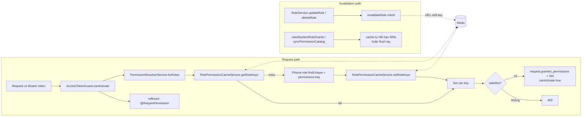
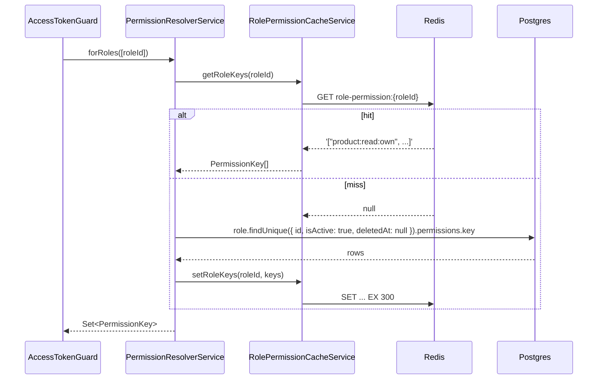
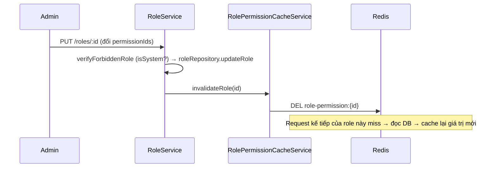

# Redis cache cho tập quyền của role trong Auth Guard

> **Chưa quen Redis?** Đọc [redis-caching-guide.md](redis-caching-guide.md) trước — tài liệu đó dạy
> Redis từ căn bản, các pattern cache kinh điển, và vẽ lại toàn bộ luồng Redis của dự án. Trang này là
> **biên bản triển khai**: quyết định đã chốt, test coverage, risk đã review rồi accept.
>
> **Cách phân quyền hoạt động** (từ vựng `resource:action:scope`, luật bao hàm, phạm vi dữ liệu) nằm ở
> [authorization-guide.md](authorization-guide.md). Trang này chỉ nói về tầng cache bên dưới nó.

> **Lịch sử.** Bản đầu (2026-09-14) cache theo bộ ba `(roleId, method, path)` vì permission lúc đó định
> danh bằng route. Refactor RBAC ngày 2026-09-21 đổi permission sang key ngữ nghĩa và đổi luôn cách
> cache: **một key mỗi role**, giá trị là toàn bộ tập quyền. Phần cấu hình ioredis fail-fast và số đo độ
> trễ khi Redis chết vẫn nguyên giá trị và được giữ lại bên dưới.

## Vấn đề

`AccessTokenGuard` cần biết caller được làm gì trên **mọi** request có auth. Không cache thì mỗi request
là một query Postgres `role.findUnique` join permissions — query lặp lại nhiều nhất toàn app, và dữ liệu
gần như tĩnh: tập quyền của một role chỉ đổi khi admin sửa role hoặc khi seed lại.

## Kiến trúc



## Các file liên quan

| File                                                   | Vai trò                                                                         |
| ------------------------------------------------------ | ------------------------------------------------------------------------------- |
| `src/shared/services/redis.service.ts`                 | Wrapper mỏng quanh `ioredis`, cấu hình fail-fast, `quit()` khi shutdown.        |
| `src/shared/services/role-permission-cache.service.ts` | `getRoleKeys` / `setRoleKeys` / `invalidateRole` / `invalidateAll`. Fail-open.  |
| `src/shared/services/permission-resolver.service.ts`   | Đọc cache trước, miss thì Postgres rồi ghi lại. Trả `Set<PermissionKey>`.       |
| `src/shared/guards/access-token.guard.ts`              | Gọi resolver, áp luật bao hàm, gắn Set vào request.                             |
| `src/routes/role/role.service.ts`                      | `updateRole` / `deleteRole` gọi `invalidateRole(id)` sau khi ghi DB thành công. |

`PermissionService` **không còn** gọi `invalidateAll()`: API `/permissions` chỉ còn đọc, nên không có
đường ghi nào từ phía permission nữa.

## Cache key & TTL

```
role-permission:{roleId}
ví dụ: role-permission:11111111-2222-3333-4444-555555555555
```

- **Một key mỗi role.** Giá trị là mảng JSON các chuỗi `resource:action:scope`.
- TTL 300 giây (`CACHE_TTL_SECONDS`). Là lưới an toàn thứ hai cho trường hợp invalidate không kịp; luồng
  bình thường invalidate chủ động.
- **Kết quả rỗng cũng được cache.** Role không tồn tại, đã xoá mềm, hoặc `isActive = false` → cache `[]`.
  Bị chặn bởi TTL và bởi `invalidateRole` khi role được sửa.

### Vì sao một key mỗi role, không phải theo route như trước

|                       | Theo `(role, method, path)`                      | Theo `role`               |
| --------------------- | ------------------------------------------------ | ------------------------- |
| Số key                | role × route, cỡ 210                             | bằng số role, cỡ 3        |
| Cache miss sau deploy | mỗi role gặp mỗi route lần đầu, cỡ 210 lần       | mỗi role một lần          |
| Invalidate một role   | SCAN pattern rồi DEL nhiều key                   | DEL một key               |
| Giá trị               | object role kèm permission đã lọc, có field Date | mảng chuỗi, không có Date |

Điểm cuối đáng nói: bản cũ phải ghi chú rằng `createdAt`/`updatedAt` thành chuỗi ISO sau round-trip
JSON và consumer phải cẩn thận. Giá trị mới là mảng chuỗi thuần nên không còn vấn đề đó.

## Luồng đọc



`forRoles` nhận **mảng** roleId và trả hợp của các Set. Hôm nay mỗi user có đúng một role; ngày chuyển
sang nhiều role, tầng cache không cần đổi.

## Luồng invalidate

### Sửa/xoá role qua API



Không còn `SCAN`: một role một key, `DEL` thẳng.

### Seed / sync danh mục

`pnpm seed:initial-scripts:create-permission` ghi lại grant cho ba role hệ thống bằng `set`. Script này
**không** đụng Redis; cache của ba role đó hết hạn theo TTL 300 giây. Sau deploy có đổi matrix, nếu cần
hiệu lực ngay:

```bash
redis-cli --scan --pattern 'role-permission:*' | xargs -r redis-cli DEL
```

`invalidateAll()` vẫn tồn tại trong service cho trường hợp này và cho tương lai, nhưng hiện không có
đường code nào gọi nó trong request path.

**Không invalidate khi thao tác thất bại**: `invalidateRole` chỉ chạy **sau** khi
`roleRepository.updateRole(...)` resolve. Test `does not invalidate the cache when the update is
refused` khoá lại hành vi này.

## Chiến lược an toàn khi Redis lỗi (fail-open + fail-fast)

Cả bốn method của `RolePermissionCacheService` bọc try/catch, log lỗi rồi:

- `getRoleKeys()` trả `null` → resolver đọc DB bình thường.
- `setRoleKeys()` / invalidate không throw, chỉ log.

**Hệ quả**: Redis down hoàn toàn → luôn miss → mọi request quay về query Postgres mỗi lần, y hệt khi
chưa có cache. Không có kịch bản nào Redis lỗi làm **bypass** permission check: quyết định luôn dựa trên
Postgres khi cache không đáng tin.

Lưu ý phân biệt với lỗi **Postgres**: `PermissionResolverService` cố tình **không** bắt lỗi DB. Postgres
chết là 500, không phải 403. Bản guard cũ bọc mọi thứ vào một catch rồi trả "forbidden", che mất sự cố
hạ tầng — đó là finding F21 và đã sửa.

### Fail-open phải đi kèm fail-FAST (cấu hình ioredis)

Chỉ try/catch là **chưa đủ**. Với option mặc định của ioredis (`enableOfflineQueue: true`), khi Redis
chết thì lệnh không fail ngay mà bị **xếp hàng chờ** kết nối quay lại — đo thực tế trên máy dev:

| Lần gọi khi Redis chết | Mặc định ioredis | Sau khi cấu hình |
| ---------------------- | ---------------- | ---------------- |
| #1                     | 312 ms           | 4 ms             |
| #2                     | 1.768 ms         | 0 ms             |
| #3                     | 10.119 ms        | 0 ms             |
| #4                     | 15.440 ms        | 0 ms             |
| #5                     | 15.320 ms        | 0 ms             |

Tức là Redis chết sẽ làm **mọi request có auth treo tới 15 giây** rồi mới fallback sang Postgres — đó
không phải degradation mà là sập cả API. Vì vậy `RedisService` cấu hình:

```ts
enableOfflineQueue: false,  // lệnh fail ngay khi socket chết, không xếp hàng
connectTimeout: 3000,
commandTimeout: 1000,       // chặn cả case Redis còn sống nhưng treo
maxRetriesPerRequest: 2,
retryStrategy: (times) => Math.min(times * 200, 5000), // vẫn tự reconnect nền
```

Đánh đổi duy nhất của `enableOfflineQueue: false`: vài lệnh phát ra **trước khi kết nối kịp thiết lập**
(cửa sổ boot, <1s) sẽ fail → fallback DB. Vô hại, tự hết khi client `ready`.

Hành vi này được khoá lại bằng `src/shared/services/__tests__/redis-service.spec.ts`.

> Cùng client Redis này còn phục vụ rate limiter, chạy trên **mọi** request kể cả không auth. Vì
> `commandTimeout: 1000` là quá dài cho đường đi nóng đó, tầng rate limit tự bọc thêm deadline 150 ms —
> xem [rate-limiting-guide.md](rate-limiting-guide.md) §8.2.

## Kiểm chứng thực tế với Redis thật

Bản keying **cũ** đã được chạy với container `redis:7-alpine` thật (set/get round-trip, `invalidateRole`
với 251 key ép SCAN phân trang, Redis chết rồi bật lại). Bản keying **mới** chưa được chạy lại với Redis
thật lúc viết tài liệu này — máy dev không có Docker. Unit test mock ioredis đã cover toàn bộ nhánh, và
tập lệnh dùng (`GET`, `SET EX`, `DEL`, `SCAN`) là tập con của bản cũ, nhưng vẫn nên chạy `pnpm test:e2e`
với Redis thật trước khi coi là xong.

## Test coverage

- `src/shared/services/__tests__/role-permission-cache-service.spec.ts`: hit/miss/fail-open, set và nuốt
  lỗi ghi, `invalidateRole` DEL một key không SCAN, `invalidateAll` SCAN phân trang đúng cursor.
- `src/shared/services/__tests__/permission-resolver.service.spec.ts`: hit bỏ qua DB, miss populate
  cache, filter `isActive`/`deletedAt`, role thiếu → Set rỗng và cache rỗng, key hỏng bị loại, hợp nhiều
  role, lỗi DB propagate.
- `src/shared/guards/__tests__/access-token.guard.spec.ts`: luật bao hàm, 403 khi Set rỗng, 500 khi route
  thiếu decorator, lỗi resolver propagate, gắn Set vào request.
- `src/routes/role/__tests__/role-service-update.spec.ts`, `role-service-delete.spec.ts`: gọi
  `invalidateRole` sau khi thành công, không gọi khi role là `isSystem`.
- `src/shared/services/__tests__/redis-service.spec.ts`: khoá cấu hình fail-fast.

## Vận hành

- `REDIS_URL` trong `.env` (dev: `redis://localhost:6379`; e2e dùng logical DB 1).
- `docker-compose.yml` có service `redis:7-alpine` với healthcheck; `app` chờ `redis` healthy.
- Sau khi đổi `RolePermissionMatrix` và seed lại, cache ba role hệ thống hết hạn trong 5 phút, hoặc
  flush tay như ở trên.

## Rủi ro còn lại / đã biết

- **Read-after-invalidate race (accepted)**: request A miss cache, bắt đầu đọc Postgres tại T0. Giữa T0 và
  lúc A gọi `setRoleKeys`, admin sửa role → `invalidateRole` chạy và không thấy key nào để xoá. Sau đó A
  ghi snapshot cũ vào Redis, sống tới hết TTL 300s. Race kinh điển của cache-aside. Nếu cần đóng: gắn
  `updatedAt` của role vào giá trị cache và từ chối entry cũ hơn lần invalidate gần nhất. Chưa cần ở quy
  mô hiện tại.
- **Cache kết quả rỗng**: role vừa tạo qua API rồi gán permission ngay sau đó, nếu có request chen giữa
  sẽ cache `[]` tới khi `updateRole` gọi `invalidateRole`. Đúng hành vi vì `updateRole` luôn invalidate.
- **`Role.isActive` đổi qua đường nào?** Hiện `updateRole` không nhận `isActive`. Nếu sau này thêm, **phải**
  giữ lời gọi `invalidateRole`; không có nó, role bị vô hiệu hoá vẫn được cache là active tới 5 phút.
- **Thundering herd nhẹ**: cold cache hoặc vừa invalidate, nhiều request cùng role cùng miss và cùng
  query Postgres. Không có single-flight. Với cỡ 3 role và TTL 300s, chấp nhận.
