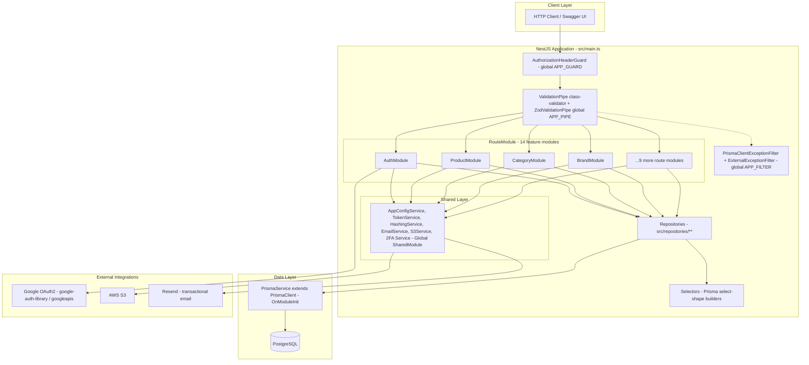
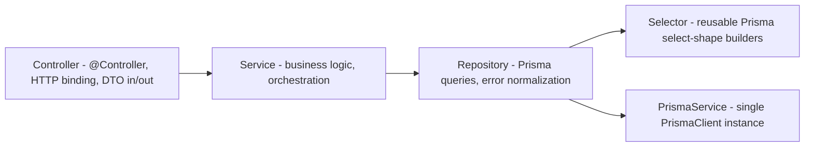
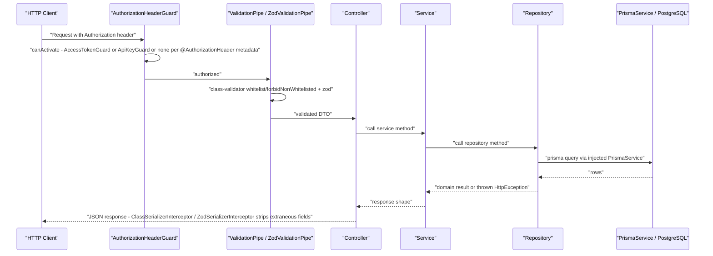
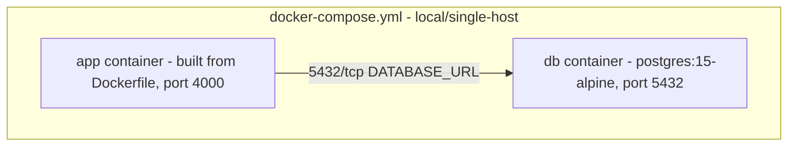
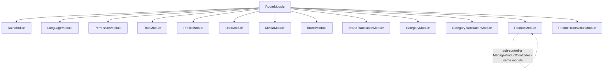

# Architecture

Headless NestJS REST API (no frontend/screens — confirmed by scout-report.md: zero `.tsx`/`.vue`/`.hbs`/`.html` files, 14 `@Controller()` classes under `src/routes/**`).

## System Architecture

**Source:** `src/app.module.ts:8` (imports `SharedModule, BaseModule, RouteModule`); `src/routes/route.module.ts:18-32` (13 imported feature modules; the 14th controller-bearing dir, `manage-product`, is registered as `ManageProductController` inside `ProductModule` rather than as a separate top-level import — see Notes); `src/shared/modules/base.module.ts:36-43,65-73` (global guard/filter/pipe/interceptor providers); `src/shared/modules/shared.module.ts:12-27` (`@Global()` shared services); `src/repositories/product/product.repository.ts:29` (`PrismaService` injected); `src/shared/services/prisma.service.ts:5` (`PrismaClient` subclass); `src/routes/auth/google.service.ts` (Google integration, per scout BL inventory); `src/shared/services/s3.service.ts` (S3 integration); `src/shared/services/email.service.ts` (Resend integration).

All 13 feature modules are wired in `route.module.ts:18-32` (`AuthModule, LanguageModule, PermissionModule, RoleModule, ProfileModule, UserModule, MediaModule, BrandModule, BrandTranslationModule, CategoryModule, CategoryTranslationModule, ProductModule, ProductTranslationModule`). This reconciles with scout-report's 14-controller count: `ManageProductController` is registered inside `ProductModule` (`src/routes/product/product.module.ts:12`), not as a 14th top-level import.

## Tech Stack

| Layer | Technology | Version | Source |
|-------|------------|---------|--------|
| Runtime | Node.js | 20 (production image `node:20-alpine`) | `Dockerfile:42` |
| Framework | NestJS (`@nestjs/common`, `@nestjs/core`, `@nestjs/platform-express`) | 11.0.1 | `package.json:41,43,45` |
| Language | TypeScript | 5.7.3 | `package.json:111` |
| ORM | Prisma (`@prisma/client`, `prisma`) | 6.4.1 | `package.json:47,103` |
| Database | PostgreSQL | 15 (docker-compose `postgres:15-alpine`); driver via `datasource db { provider = "postgresql" }` | `docker-compose.yml:6`; `prisma/schema.prisma:9-11` |
| Auth | `@nestjs/jwt` (JWT access/refresh) + Google OAuth2 (`google-auth-library` 9.15.1, `googleapis` 146.0.0) | 11.0.0 / 9.15.1 / 146.0.0 | `package.json:44,52,53` |
| Validation | `class-validator` 0.14.1 + `nestjs-zod` 4.3.1 (dual validation stack, zod path marked `/** Testing with zod */`) | 0.14.1 / 4.3.1 | `package.json:50,59`; `src/shared/modules/base.module.ts:55-58,70` |
| Logging | `nestjs-pino` 4.3.1 | 4.3.1 | `package.json:58`; `src/main.ts:19` |
| i18n | `nestjs-i18n` 10.5.1 | 10.5.1 | `package.json:57`; `src/shared/modules/i18n.module.ts` |
| Object storage | AWS S3 (`@aws-sdk/client-s3` 3.821.0) | 3.821.0 | `package.json:38-40` |
| Email | Resend SDK | 4.1.2 | `package.json:64`; `src/shared/services/email.service.ts` |
| API docs | `@nestjs/swagger` 11.1.1, generated `swagger.yaml` + `schema.ts` (openapi-typescript) | 11.1.1 | `package.json:46`; `package.json:10-11` |
| Package manager | pnpm | 10.6.5 (pinned via `packageManager` field + Dockerfile `corepack prepare`) | `package.json:131`; `Dockerfile:4` |
| Test runner | Jest + ts-jest | 29.7.0 / 29.2.5 | `package.json:99,107` |
| Cache | _none found_ | N/A | no Redis/cache dependency in `package.json` |
| Queue | _none found_ | N/A | scout BL inventory: `queue-worker: (none found)` |

## Layering

**Pattern confirmed for `product` feature** (representative of all 14 route modules): `ProductController` (`src/routes/product/product.controller.ts:26-40`) injects only `ProductService`; `ProductService` (`src/routes/product/product.service.ts:14-15`) injects only `ProductRepository`; `ProductRepository` (`src/repositories/product/product.repository.ts:29-30`) injects `PrismaService` and calls `createProductSelect` from `src/selectors/product.selector.ts`. Controllers never import `PrismaService` or a repository directly — strict 3-tier separation per module, wired at the module boundary (`src/routes/product/product.module.ts:13`: `providers: [ProductService, ManageProductService, ProductRepository]`).

Two module-scoping conventions observed:
- **Feature-local repository** (e.g. `ProductRepository` in `product.module.ts:13`) — instantiated per owning module, not exported.
- **Shared/cross-cutting repository** (e.g. `SharedUserRepository`, `SharedRoleRepository` in `src/routes/auth/auth.module.ts:17,20`) — repositories reused by more than one feature module (`auth` needs user/role data owned by `user`/`role` modules) are re-declared as local providers in each consuming module rather than exported from a shared module; no central repository-registry module exists. **[UNVERIFIED]** whether this is deliberate or organic duplication — no `SharedRepositoryModule` found in the tree.

## Data Flow

**Source:** `src/shared/guards/authorization-header.guard.ts:39-78` (global `APP_GUARD`, dispatches to `AccessTokenGuard`/`ApiKeyGuard`/no-op per `@AuthorizationHeader` reflector metadata, AND/OR combine modes); `src/shared/guards/access-token.guard.ts:101-122` (JWT verify + per-route permission check against `role.permissions` where `path`+`method` match, `src/shared/guards/access-token.guard.ts:56-90`); `src/shared/modules/base.module.ts:45-58,60-63` (`ClassSerializerInterceptor` + `ZodSerializerInterceptor` registered as `APP_INTERCEPTOR`); error path via `src/shared/filters/prisma-exception.filter.ts:61-67` (`@Catch` on 5 Prisma exception classes, maps Prisma error codes P1008/P2000-P2025 to HTTP status) and `src/shared/filters/external-exception.filter.ts:18-19` (`@Catch(HttpException)`, also handles `ZodValidationException`/`ZodSerializationException`).

**Dead-code note:** `src/main.ts:7,46,48-51` shows `TransformInterceptor` and both exception filters commented out at the bootstrap level with the inline comment `"not working with pipe ?"` — the actually-active global registration is exclusively through `base.module.ts`'s `APP_FILTER`/`APP_GUARD`/`APP_INTERCEPTOR` DI tokens (`src/shared/modules/base.module.ts:25-34,36-43,45-53,55-63`), not through `main.ts`. `TransformInterceptor` (`src/shared/interceptors/transform.interceptor.ts`) is defined but never registered anywhere — dead code.

## Cross-Cutting Concerns

| Concern | Mechanism | Source |
|---|---|---|
| Global validation pipe | `ValidationPipe` (whitelist, forbidNonWhitelisted, transform, custom `exceptionFactory` → `ValidateException`) registered in `NestFactory.create` bootstrap, plus a second `ZodValidationPipe` as `APP_PIPE` | `src/main.ts:31-44`; `src/shared/modules/base.module.ts:55-58,70` |
| Global auth guard | `AuthorizationHeaderGuard` as `APP_GUARD` | `src/shared/modules/base.module.ts:39-42` |
| Global exception filters | `PrismaClientExceptionFilter`, `ExternalExceptionFilter` as `APP_FILTER` | `src/shared/modules/base.module.ts:26-33` |
| Response serialization | `ClassSerializerInterceptor` (excludeExtraneousValues) + `ZodSerializerInterceptor`, both `APP_INTERCEPTOR` | `src/shared/modules/base.module.ts:45-53,60-63` |
| CORS | Hardcoded single origin `http://localhost:3000`, methods `GET,HEAD,PUT,PATCH,POST,DELETE` | `src/main.ts:24-29` — **[UNVERIFIED]** whether this is intentionally non-configurable or a dev-only leftover; no env var drives it |
| i18n | `nestjs-i18n`, resolvers: `AcceptLanguageResolver` + custom `x-lang` header, message files in `src/i18n/{en,vn}/message.json` | `src/shared/modules/i18n.module.ts:14-33` |
| Env validation | `ConfigModule.forRoot({ validate: validateEnv, envFilePath: [".env.${NODE_ENV}", ".env"] })`, global | `src/shared/modules/base.module.ts:76-80`; `src/validations/env.validation.ts` |
| Structured logging | `nestjs-pino`, factory-configured via `AppConfigService` (`LOG_LEVEL`, `LOG_PRETTY`) | `src/shared/modules/base.module.ts:81-84`; `src/main.ts:19` |
| Swagger docs | Mounted at `/api` only when `configService.isDevelopment` | `src/main.ts:53-60` |

## Deployment View

> Derived from repository infrastructure-as-code — not verified against production.

| Node / Edge | Description | Source |
|-------------|--------------|--------|
| APPC | Application container, 3-stage Dockerfile build (`base` → `builder` → `production`), entrypoint runs `prisma migrate deploy` then `node dist/main.js` | `Dockerfile:1-55`; `docker-entrypoint.sh:9-23` |
| DBC | PostgreSQL 15 container, persisted via named volume `postgres_data` | `docker-compose.yml:5-17` |
| APPC → DBC | Compose network `ecom-network` (bridge driver); app connects via `DATABASE_URL` env (from `.env.local`, not committed) | `docker-compose.yml:16-17,25-26,37-38` |

**Degradation — CI/CD:** `.github/workflows/ci.yml` runs only `lint` and `build` jobs on push/PR to `develop`/`master` (`.github/workflows/ci.yml:22-56`); there is **no deploy/CD job, no Kubernetes manifest, no Terraform, no PaaS config file** anywhere in the tree (confirmed: only `ci.yml` under `.github/workflows/`, no other `*.yml`/`*.yaml` besides `docker-compose.yml` and the generated `swagger.yaml`). Production hosting topology beyond the single docker-compose file is **N/A — no infrastructure-as-code found in repository** for it; do not infer a hosting provider, orchestrator, or reverse proxy. **WARN:** this compose file (`POSTGRES_PASSWORD: postgres` hardcoded, ports directly published) reads as a local/dev convenience file, not a production manifest — treat any production deployment claim beyond it as unverified.

## Module Graph (route feature modules)

**Source:** `src/routes/route.module.ts:18-32` (13 imports enumerated — `AuthModule, LanguageModule, PermissionModule, RoleModule, ProfileModule, UserModule, MediaModule, BrandModule, BrandTranslationModule, CategoryModule, CategoryTranslationModule, ProductModule, ProductTranslationModule`); `src/routes/product/product.module.ts:12` (`ManageProductController` registered inside `ProductModule`, not a separate top-level module — reconciles scout-report's 14-controller count against 13 top-level route-module imports).

## Notes

- **Two Prisma schema files** exist (`prisma/schema.prisma`, `prisma/schema.development.prisma`); the datasource/env-selection mechanism between them was not traced in this pass — carried forward as `[UNVERIFIED]` from scout-report.md.
- **No cache layer, no message queue, no scheduled jobs, no webhooks** — confirmed absent via scout-report's Background Logic Source Inventory grep (`@Cron|@Interval|... ` returned no `queue-worker`/`scheduled-job`/`webhook` rows) and no Redis/BullMQ/RabbitMQ dependency in `package.json`.
- **Dual validation/serialization stacks** (`class-validator` + `nestjs-zod`) are both wired globally simultaneously (`base.module.ts:55-63,70`); the zod path is explicitly commented `/** Testing with zod */` in source — read as an in-progress migration, not a settled architecture decision.

**Status:** DONE
**Summary:** architecture.md written with Mermaid system/layering/data-flow/deployment/module-graph diagrams, tech-stack table, and cross-cutting-concerns table, every claim cited to `file:line`; deployment view honestly scoped to the local docker-compose file with an explicit N/A+WARN for missing CD/K8s/Terraform.
**Concerns/Blockers:** Two open `[UNVERIFIED]` items carried from scout-report (dual Prisma schema selection mechanism; intent behind hardcoded single-origin CORS) — neither blocks this artifact but downstream feature-spec/data-model waves should resolve the schema question if it affects model accuracy.
