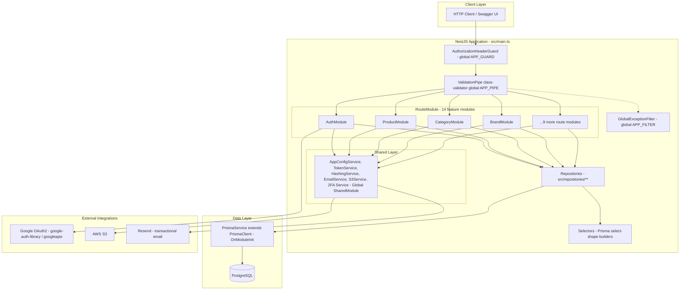
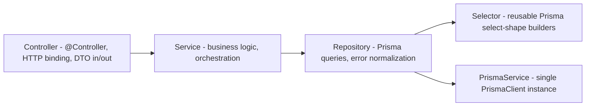
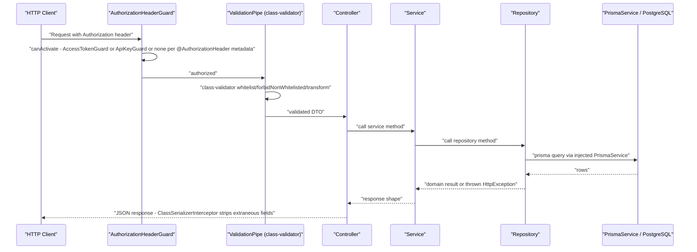
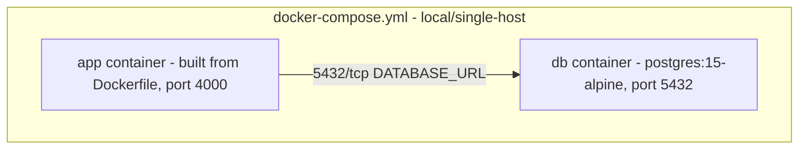
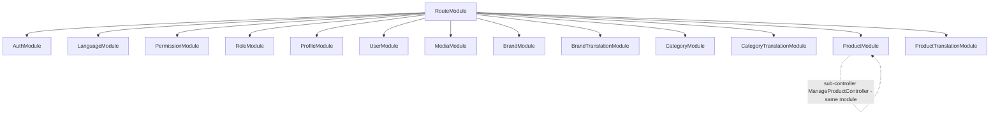

# Kiến trúc

REST API NestJS headless (không có frontend/màn hình — scout-report.md xác nhận: không có file `.tsx`/`.vue`/`.hbs`/`.html`, 14 class `@Controller()` nằm dưới `src/routes/**`).

## Kiến trúc hệ thống

**Nguồn:** `src/app.module.ts:8` (import `SharedModule, BaseModule, RouteModule`); `src/routes/route.module.ts:18-32` (13 module tính năng được import; thư mục controller thứ 14, `manage-product`, được đăng ký thành `ManageProductController` bên trong `ProductModule` chứ không phải import riêng ở cấp top-level — xem phần Ghi chú); `src/shared/modules/base.module.ts:36-43,65-73` (các provider guard/filter/pipe/interceptor toàn cục); `src/shared/modules/shared.module.ts:12-27` (các service dùng chung `@Global()`); `src/repositories/product/product.repository.ts:29` (`PrismaService` được inject); `src/shared/services/prisma.service.ts:5` (subclass của `PrismaClient`); `src/routes/auth/google.service.ts` (tích hợp Google, theo bảng kiểm kê BL của scout); `src/shared/services/s3.service.ts` (tích hợp S3); `src/shared/services/email.service.ts` (tích hợp Resend).

Cả 13 module tính năng được nối vào `route.module.ts:18-32` (`AuthModule, LanguageModule, PermissionModule, RoleModule, ProfileModule, UserModule, MediaModule, BrandModule, BrandTranslationModule, CategoryModule, CategoryTranslationModule, ProductModule, ProductTranslationModule`). Con số này khớp với 14 controller trong scout-report: `ManageProductController` được đăng ký bên trong `ProductModule` (`src/routes/product/product.module.ts:12`), không phải import top-level thứ 14.

## Tech Stack

| Tầng | Công nghệ | Phiên bản | Nguồn |
|-------|------------|---------|--------|
| Runtime | Node.js | 24.14.1 (ghim trong `.nvmrc`; image production `node:24.14.1-alpine`) | `Dockerfile:81` |
| Framework | NestJS (`@nestjs/common`, `@nestjs/core`, `@nestjs/platform-express`) | 11.0.1 | `package.json:41,43,45` |
| Ngôn ngữ | TypeScript | 5.7.3 | `package.json:111` |
| ORM | Prisma (`@prisma/client`, `prisma`) | 6.4.1 | `package.json:47,103` |
| Database | PostgreSQL | 15 (docker-compose `postgres:15-alpine`); driver qua `datasource db { provider = "postgresql" }` | `docker-compose.yml:6`; `prisma/schema.prisma:9-11` |
| Auth | `@nestjs/jwt` (JWT access/refresh) + Google OAuth2 (`google-auth-library` 9.15.1, `googleapis` 146.0.0) | 11.0.0 / 9.15.1 / 146.0.0 | `package.json:44,52,53` |
| Validation | `class-validator` 0.14.1 (hệ thống validation HTTP duy nhất; `nestjs-zod` đã bị gỡ khỏi pipeline và khỏi `package.json` — xem Ghi chú) | 0.14.1 | `package.json:50`; `src/shared/modules/base.module.ts:52-55`; `src/shared/utils/validation-pipe.config.ts` |
| Logging | `nestjs-pino` 4.3.1 | 4.3.1 | `package.json:58`; `src/main.ts:19` |
| i18n | `nestjs-i18n` 10.5.1 | 10.5.1 | `package.json:57`; `src/shared/modules/i18n.module.ts` |
| Lưu trữ object | AWS S3 (`@aws-sdk/client-s3` 3.821.0) | 3.821.0 | `package.json:38-40` |
| Email | Resend SDK | 4.1.2 | `package.json:64`; `src/shared/services/email.service.ts` |
| API docs | `@nestjs/swagger` 11.1.1, sinh ra `swagger.yaml` + `schema.ts` (openapi-typescript) | 11.1.1 | `package.json:46`; `package.json:10-11` |
| Package manager | pnpm | 10.6.5 (ghim qua field `packageManager` + `corepack prepare` trong Dockerfile) | `package.json:131`; `Dockerfile:4` |
| Test runner | Jest + ts-jest | 29.7.0 / 29.2.5 | `package.json:99,107` |
| Cache | _không có_ | N/A | không có dependency Redis/cache nào trong `package.json` |
| Queue | _không có_ | N/A | bảng kiểm kê BL của scout: `queue-worker: (none found)` |

## Phân tầng

**Mẫu này đã được xác nhận với feature `product`** (đại diện cho tất cả 14 route module): `ProductController` (`src/routes/product/product.controller.ts:26-40`) chỉ inject `ProductService`; `ProductService` (`src/routes/product/product.service.ts:14-15`) chỉ inject `ProductRepository`; `ProductRepository` (`src/repositories/product/product.repository.ts:29-30`) inject `PrismaService` và gọi `createProductSelect` từ `src/selectors/product.selector.ts`. Controller không bao giờ import trực tiếp `PrismaService` hay một repository — phân tách 3 tầng nghiêm ngặt theo từng module, được nối tại module boundary (`src/routes/product/product.module.ts:13`: `providers: [ProductService, ManageProductService, ProductRepository]`).

Quan sát được hai kiểu scoping module:
- **Repository cục bộ theo feature** (ví dụ `ProductRepository` trong `product.module.ts:13`) — khởi tạo riêng cho module sở hữu nó, không export ra ngoài.
- **Repository dùng chung/cross-cutting** (ví dụ `SharedUserRepository`, `SharedRoleRepository` trong `src/routes/auth/auth.module.ts:17,20`) — các repository được nhiều feature module dùng chung (`auth` cần dữ liệu user/role thuộc về module `user`/`role`) được khai báo lại làm provider cục bộ ở từng module tiêu thụ, thay vì export từ một module dùng chung; không tồn tại module đăng ký repository trung tâm nào. **[UNVERIFIED]** đây là chủ ý hay chỉ là trùng lặp phát sinh tự nhiên — không tìm thấy `SharedRepositoryModule` nào trong cây thư mục.

## Data Flow

**Nguồn:** `src/shared/guards/authorization-header.guard.ts:39-78` (`APP_GUARD` toàn cục, điều hướng tới `AccessTokenGuard`/`ApiKeyGuard`/no-op tùy theo metadata reflector `@AuthorizationHeader`, có chế độ kết hợp AND/OR); `src/shared/guards/access-token.guard.ts:101-122` (verify JWT + kiểm tra quyền theo từng route dựa vào `role.permissions` khi `path`+`method` khớp, `src/shared/guards/access-token.guard.ts:56-90`); `src/shared/modules/base.module.ts:42-50` (`ClassSerializerInterceptor` được đăng ký làm `APP_INTERCEPTOR`); đường lỗi đi qua `GlobalExceptionFilter` duy nhất (`@Catch()`, không tham số) tại `src/shared/filters/global-exception.filter.ts`, điều hướng tới `mapHttpException` (`src/shared/filters/http-exception.mapper.ts`) và `mapPrismaError` (`src/shared/filters/prisma-error.mapper.ts`, map mã lỗi Prisma P1008/P2000-P2025 sang HTTP status) — xem `docs/error-handling.md` để biết đầy đủ contract.

**Ghi chú về `main.ts`:** `src/main.ts` không còn cấu hình pipe, filter hay interceptor nào ở tầng bootstrap nữa — việc đăng ký đó giờ nằm trọn trong `BaseModule` thông qua các DI token `APP_PIPE`/`APP_FILTER`/`APP_GUARD`/`APP_INTERCEPTOR` (`src/shared/modules/base.module.ts`). Nhờ vậy e2e harness (`test/e2e/support/create-test-app.ts`) chỉ cần import `AppModule` là có đúng contract lỗi của production.

**Ghi chú dead code:** `TransformInterceptor` (`src/shared/interceptors/transform.interceptor.ts`) vẫn được định nghĩa nhưng không được đăng ký ở đâu cả — vẫn là dead code, không liên quan tới refactor xử lý lỗi ở trên.

## Cross-Cutting Concerns

| Concern | Cơ chế | Nguồn |
|---|---|---|
| Validation pipe toàn cục | `ValidationPipe` (whitelist, forbidNonWhitelisted, transform, `exceptionFactory` tùy chỉnh → `ValidateException`), hệ thống validation HTTP duy nhất, đăng ký làm `APP_PIPE` qua `createValidationPipe` | `src/shared/utils/validation-pipe.config.ts`; `src/shared/modules/base.module.ts:52-55` |
| Auth guard toàn cục | `AuthorizationHeaderGuard` làm `APP_GUARD` | `src/shared/modules/base.module.ts:36-39` |
| Exception filter toàn cục | Một `GlobalExceptionFilter` duy nhất (`@Catch()`, không tham số) làm `APP_FILTER`, điều hướng tới `mapHttpException`/`mapPrismaError` — xem `docs/error-handling.md` | `src/shared/modules/base.module.ts:26-31`; `src/shared/filters/global-exception.filter.ts` |
| Serialize response | `ClassSerializerInterceptor` (excludeExtraneousValues) làm `APP_INTERCEPTOR` | `src/shared/modules/base.module.ts:42-50` |
| CORS | Hardcode một origin duy nhất `http://localhost:3000`, method `GET,HEAD,PUT,PATCH,POST,DELETE` | `src/main.ts:20-25` — **[UNVERIFIED]** không rõ đây là chủ ý cố định không cho cấu hình hay chỉ là leftover từ giai đoạn dev; không có env var nào điều khiển nó |
| i18n | `nestjs-i18n`, resolver: `AcceptLanguageResolver` + header `x-lang` tùy chỉnh, file message tại `src/i18n/{en,vn}/message.json` | `src/shared/modules/i18n.module.ts:14-33` |
| Validation env | `ConfigModule.forRoot({ validate: validateEnv, envFilePath: [".env.${NODE_ENV}", ".env"] })`, toàn cục | `src/shared/modules/base.module.ts:65-69`; `src/validations/env.validation.ts` |
| Logging có cấu trúc | `nestjs-pino`, cấu hình qua factory dùng `AppConfigService` (`LOG_LEVEL`, `LOG_PRETTY`) | `src/shared/modules/base.module.ts:70-73`; `src/main.ts:15` |
| Swagger docs | Chỉ mount tại `/api` khi `configService.isDevelopment` | `src/main.ts:53-60` |

## Góc nhìn triển khai

> Suy ra từ infrastructure-as-code trong repo — chưa được xác minh với môi trường production thực tế.

| Node / Edge | Mô tả | Nguồn |
|-------------|--------------|--------|
| APPC | Container ứng dụng, Dockerfile build 5 stage (`base` → `builder` → `migrator` / `pruner` → `production`); entrypoint validate `DATABASE_URL` rồi exec `node dist/main.js` — nó **không** chạy migration, migration chạy từ stage `migrator` riêng | `Dockerfile:5,48,74`; `docker-entrypoint.sh` |
| DBC | Container PostgreSQL 15, lưu trữ qua named volume `postgres_data` | `docker-compose.yml:5-17` |
| APPC → DBC | Compose network `ecom-network` (bridge driver); app kết nối qua env `DATABASE_URL` (lấy từ `.env.local`, không commit) | `docker-compose.yml:16-17,25-26,37-38` |

**Điểm còn thiếu — CI/CD:** `.github/workflows/ci.yml` chỉ chạy job `lint` và `build` khi push/PR vào `develop`/`master` (`.github/workflows/ci.yml:22-56`); **không có job deploy/CD, không có manifest Kubernetes, không có Terraform, không có file config PaaS nào** trong toàn bộ repo (đã xác nhận: chỉ có `ci.yml` dưới `.github/workflows/`, không còn file `*.yml`/`*.yaml` nào khác ngoài `docker-compose.yml` và `swagger.yaml` được sinh ra). Topology hosting production ngoài file docker-compose đơn lẻ này là **N/A — không tìm thấy infrastructure-as-code nào trong repo** cho phần đó; đừng suy đoán nhà cung cấp hosting, orchestrator hay reverse proxy nào. **WARN:** file compose này (`POSTGRES_PASSWORD: postgres` hardcode, port publish trực tiếp) đọc giống một file tiện lợi cho local/dev, không phải manifest production — coi mọi khẳng định về triển khai production vượt ngoài file này là chưa được xác minh.

## Sơ đồ module (route feature module)

**Nguồn:** `src/routes/route.module.ts:18-32` (liệt kê 13 import — `AuthModule, LanguageModule, PermissionModule, RoleModule, ProfileModule, UserModule, MediaModule, BrandModule, BrandTranslationModule, CategoryModule, CategoryTranslationModule, ProductModule, ProductTranslationModule`); `src/routes/product/product.module.ts:12` (`ManageProductController` được đăng ký bên trong `ProductModule`, không phải một module top-level riêng — khớp con số 14 controller của scout-report với 13 import route-module ở cấp top-level).

## Ghi chú

- **Tồn tại hai file Prisma schema** (`prisma/schema.prisma`, `prisma/schema.development.prisma`); cơ chế chọn datasource/env giữa hai file này chưa được truy vết trong lần rà soát này — vẫn giữ nguyên trạng thái `[UNVERIFIED]` từ scout-report.md.
- **Không có cache layer, không có message queue, không có scheduled job, không có webhook** — đã xác nhận không tồn tại qua grep trong Background Logic Source Inventory của scout-report (`@Cron|@Interval|... ` không trả về dòng `queue-worker`/`scheduled-job`/`webhook` nào) và không có dependency Redis/BullMQ/RabbitMQ nào trong `package.json`.
- **Chỉ một validation stack.** `nestjs-zod` đã bị gỡ khỏi pipeline HTTP và khỏi `package.json`; `ValidationPipe` của `class-validator` (`src/shared/utils/validation-pipe.config.ts`) giờ là hệ thống validation duy nhất được nối tại `APP_PIPE` (`base.module.ts:52-55`). `zod` độc lập vẫn được dùng bên trong `GoogleService` để parse blob `state` của OAuth (`src/routes/auth/google.service.ts`) — đó không phải validation HTTP nên không bị ảnh hưởng. Xem `docs/error-handling.md` để biết contract lỗi kết quả.

**Trạng thái:** DONE
**Tóm tắt:** architecture.md được viết kèm sơ đồ Mermaid cho hệ thống/phân tầng/data-flow/deployment/module-graph, bảng tech-stack và bảng cross-cutting-concerns, mọi khẳng định đều trích dẫn `file:line`; góc nhìn deployment giới hạn trung thực trong file docker-compose local, có N/A+WARN rõ ràng cho phần CD/K8s/Terraform còn thiếu.
**Mối quan tâm/Blocker:** Còn hai mục `[UNVERIFIED]` chuyển tiếp từ scout-report (cơ chế chọn Prisma schema kép; chủ ý đằng sau việc hardcode CORS single-origin) — cả hai không chặn artifact này nhưng các đợt feature-spec/data-model tiếp theo nên làm rõ câu hỏi về schema nếu nó ảnh hưởng tới độ chính xác của model.
