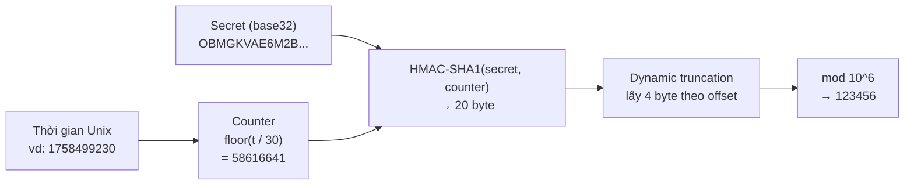
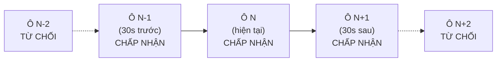
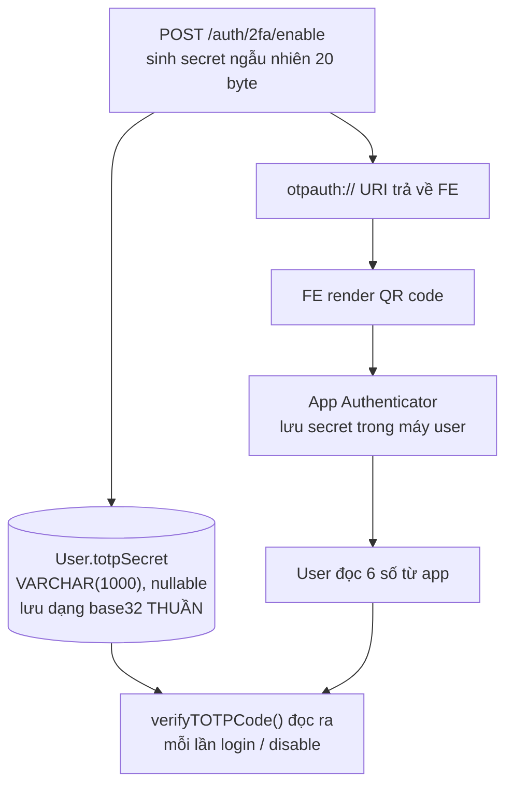
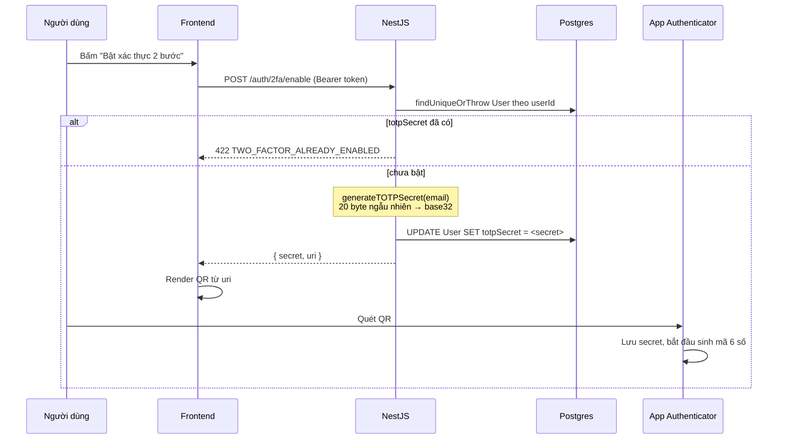
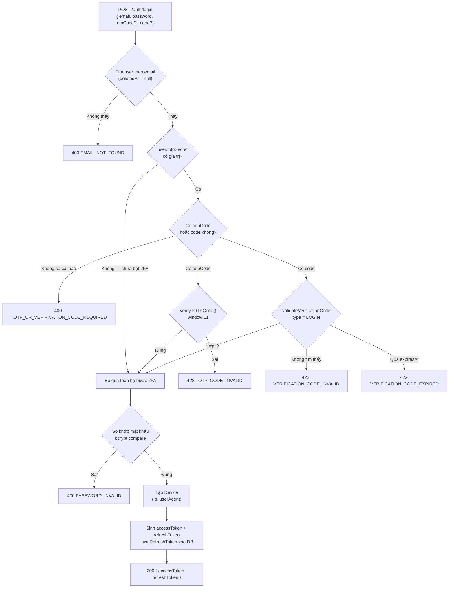
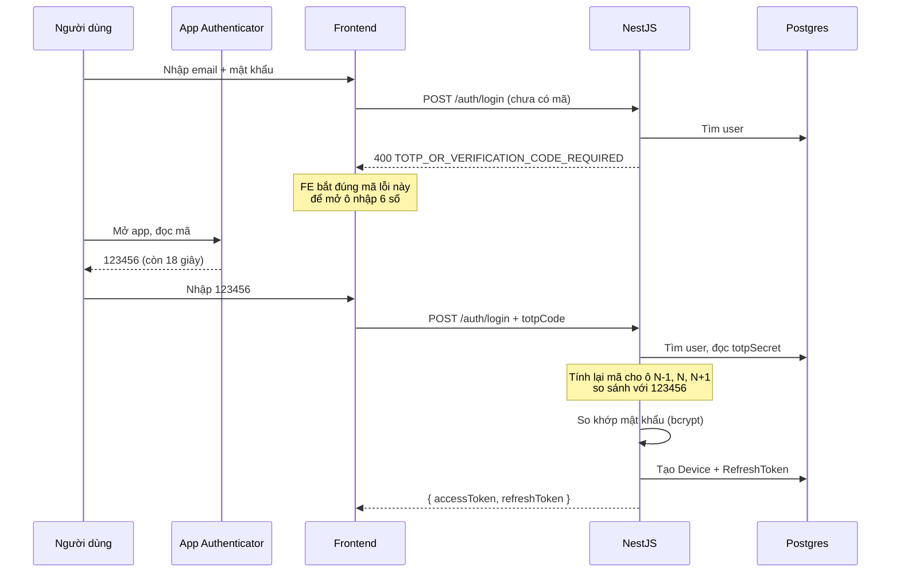
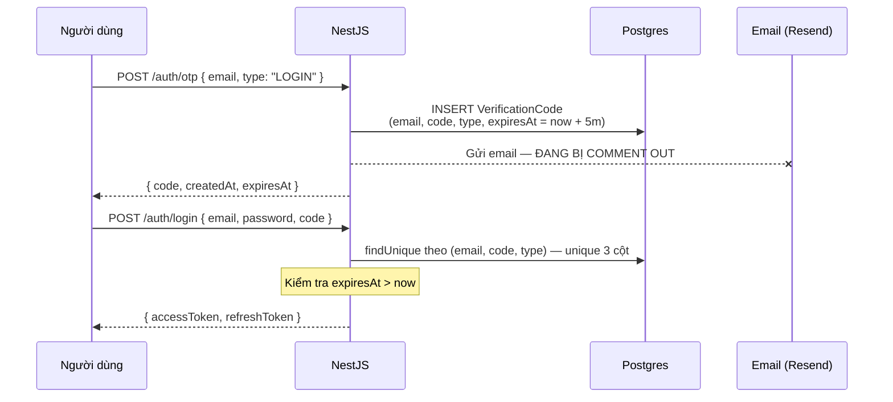
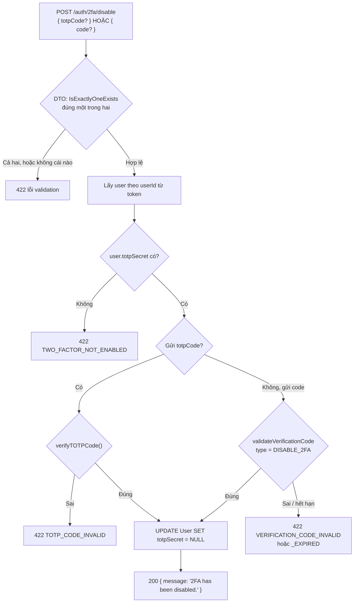
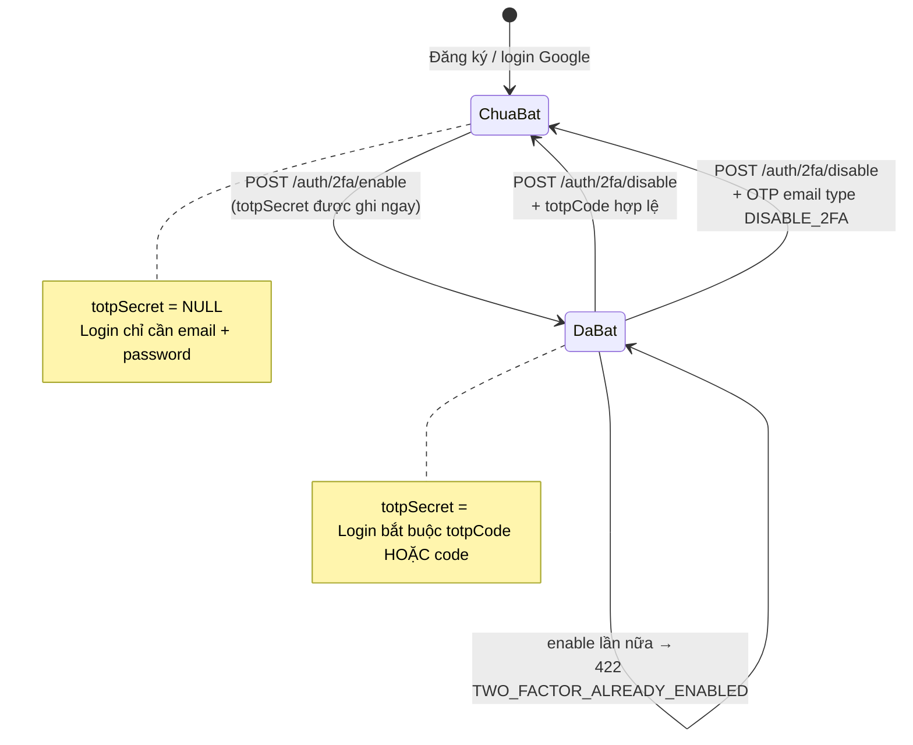

# Cơ chế TOTP / Xác thực hai bước (2FA)

Tài liệu mô tả toàn bộ cơ chế 2FA bằng TOTP của hệ thống: thuật toán sinh mã chạy thế nào, secret sống ở đâu, ba luồng bật — đăng nhập — tắt đi qua những bước gì, và những chỗ hiện tại còn hở.

Code liên quan:

- [src/shared/services/2fa.service.ts](../src/shared/services/2fa.service.ts) — toàn bộ phần TOTP: sinh secret, sinh URI, verify mã
- [src/routes/auth/auth.service.ts](../src/routes/auth/auth.service.ts) — `login`, `setupTwoFactorAuthentication`, `disableTwoFactorAuthentication`, `sendOTP`, `validateVerificationCode`
- [src/routes/auth/auth.controller.ts](../src/routes/auth/auth.controller.ts) — `POST /auth/login`, `POST /auth/otp`, `POST /auth/2fa/enable`, `POST /auth/2fa/disable`
- [src/dtos/auth/2fa.dto.ts](../src/dtos/auth/2fa.dto.ts), [src/dtos/auth/login.dto.ts](../src/dtos/auth/login.dto.ts) — DTO và ràng buộc "chỉ được gửi một trong hai mã"
- [src/constants/throttle.constant.ts](../src/constants/throttle.constant.ts) — rate limit cho các endpoint 2FA
- [prisma/schema.prisma](../prisma/schema.prisma) — `User.totpSecret`, model `VerificationCode`

---

## 1. Ý tưởng cốt lõi: mật khẩu thứ hai không ai truyền đi

Mật khẩu có một điểm yếu cố hữu: nó phải đi qua đường truyền mỗi lần đăng nhập, nên ai chặn được đường truyền hoặc lừa được người dùng gõ vào trang giả là lấy được luôn.

TOTP giải quyết chuyện đó bằng cách **không truyền bí mật**. Server và app Authenticator cùng giữ một chuỗi bí mật (`secret`), rồi mỗi bên tự tính ra mã 6 số từ secret đó **cộng với thời gian hiện tại**. Cái đi qua mạng chỉ là 6 số, và 6 số đó chết sau vài chục giây.

Ba tính chất làm nên toàn bộ giá trị của nó:

| Tính chất            | Nghĩa là                                                             |
| -------------------- | -------------------------------------------------------------------- |
| Không cần mạng       | App Authenticator tính mã offline, không gọi server nào cả           |
| Hết hạn nhanh        | Mã đổi mỗi 30 giây, chụp màn hình gửi cho người khác gần như vô dụng |
| Không suy ngược được | Từ mã 6 số không tính ngược ra secret (HMAC một chiều)               |

Chuẩn liên quan: **RFC 6238 (TOTP)**, dựng trên **RFC 4226 (HOTP)**.

---

## 2. Thuật toán: từ secret ra 6 con số

### 2.1. Ba bước tính



Diễn giải từng bước:

1. **Chia thời gian thành ô 30 giây.** Lấy timestamp Unix chia cho `period` (30) rồi làm tròn xuống. Cả server và app đều ra cùng một số nếu đồng hồ hai bên khớp nhau.
2. **Ký counter bằng secret.** `HMAC-SHA1(secret, counter)` ra 20 byte. Vì HMAC là một chiều, biết output không suy ra được secret.
3. **Rút gọn thành 6 số.** Lấy 4 bit cuối của byte cuối làm offset, đọc 4 byte từ vị trí đó, bỏ bit dấu, rồi `mod 1.000.000`.

Điểm cần nhớ: **mã không được lưu ở đâu cả**. Server không "sinh mã rồi chờ", nó **tính lại** mã tại thời điểm nhận request và so sánh. Đó là lý do TOTP không cần bảng lưu mã như OTP qua email.

### 2.2. Tham số cấu hình của dự án

Nằm gọn trong `createTOTP()` của [2fa.service.ts](../src/shared/services/2fa.service.ts):

| Tham số     | Giá trị                              | Ghi chú                                                               |
| ----------- | ------------------------------------ | --------------------------------------------------------------------- |
| `issuer`    | `E-commerce`                         | Tên hiện trong app Authenticator                                      |
| `label`     | email của user                       | Dòng phụ trong app, để phân biệt nhiều tài khoản                      |
| `algorithm` | `SHA1`                               | Mặc định của RFC 6238; Google Authenticator chỉ chắc chắn hỗ trợ SHA1 |
| `digits`    | `6`                                  | 1.000.000 tổ hợp                                                      |
| `period`    | `30` giây                            | Chu kỳ đổi mã                                                         |
| `secret`    | 20 byte ngẫu nhiên → 32 ký tự base32 | Mặc định của thư viện `otpauth`                                       |

Thư viện dùng: [`otpauth`](https://github.com/hectorm/otpauth).

> SHA1 ở đây **không phải** lỗ hổng. Điểm yếu của SHA1 là va chạm (collision), còn TOTP dùng nó trong HMAC — HMAC-SHA1 tới nay chưa bị phá. Đổi sang SHA256 sẽ làm một số app Authenticator cũ không quét được QR.

### 2.3. Cửa sổ thời gian và `window: 1`

Đồng hồ điện thoại và đồng hồ server không bao giờ khớp tuyệt đối. Nếu chỉ chấp nhận đúng ô 30 giây hiện tại thì user lệch 2 giây là fail.

Nên `verifyTOTPCode` gọi `totp.validate({ token, window: 1 })` — chấp nhận thêm **1 ô trước và 1 ô sau**:



Hệ quả thực tế:

- Một mã sống **tối đa ~90 giây** (tệ nhất), tối thiểu ~60 giây.
- `validate()` trả về `delta` (lệch bao nhiêu ô) hoặc `null` nếu sai. Service chỉ quan tâm `delta !== null`, không dùng giá trị lệch để làm gì thêm.
- Đổi lại, số mã hợp lệ tại một thời điểm là 3 thay vì 1 — không gian đoán tăng gấp ba. Với 1.000.000 tổ hợp thì tỉ lệ đoán trúng một phát là 3/1.000.000, vẫn không đáng kể; phần chặn thật nằm ở rate limit (mục 7).

---

## 3. Secret sống ở đâu



Hai điều quan trọng về cột `User.totpSecret`:

- **`null` nghĩa là chưa bật 2FA.** Toàn hệ thống kiểm tra trạng thái 2FA bằng đúng điều kiện `user.totpSecret` có giá trị hay không — không có cột boolean riêng, không có bảng riêng.
- **Secret lưu dạng thuần (plaintext).** Ai đọc được bảng `User` là sinh được mã TOTP của mọi user đã bật 2FA. Xem mục 8.

### 3.1. Cấu trúc URI gửi cho FE

```
otpauth://totp/E-commerce:user%40example.com?issuer=E-commerce&secret=OBMGKVAE6M2B6MLMRGG6WKRARYJA6NJY&algorithm=SHA1&digits=6&period=30
```

Chuỗi này chính là nội dung mã QR. FE chỉ cần đưa nguyên văn vào một thư viện QR — không tự ghép tay, vì sai một tham số là app sinh mã lệch mà không báo lỗi gì.

---

## 4. Flow 1 — Bật 2FA

`POST /auth/2fa/enable` · cần access token · quyền `profile:update:own`



Các bước trong `setupTwoFactorAuthentication()`:

1. Lấy user theo `userId` lấy từ access token (`@ActiveUser("userId")`), bỏ qua bản ghi đã `deletedAt`.
2. Nếu `totpSecret` đã có → ném `TWO_FACTOR_ALREADY_ENABLED` (422). Không cho bật đè, vì bật đè đồng nghĩa với vô hiệu hóa app Authenticator đang dùng.
3. Sinh secret mới + URI.
4. **Ghi secret xuống DB ngay.**
5. Trả `{ secret, uri }` cho FE.

> **Điểm cần nắm, và cũng là rủi ro:** không có bước xác nhận. Ngay khi endpoint trả về, tài khoản đã ở trạng thái bật 2FA — kể cả khi user chưa kịp quét QR. Nếu user đóng tab ngay lúc đó, lần đăng nhập sau sẽ bị chặn bởi một secret không ai cầm. Xem mục 8.

`secret` trả về song song với `uri` để FE hiển thị dạng chữ cho người không quét QR được (nhập tay vào app).

---

## 5. Flow 2 — Đăng nhập khi đã bật 2FA

`POST /auth/login`

### 5.1. Hai đường hợp lệ

Body login nhận **một trong hai** mã:

| Trường     | Là gì                               | Lấy ở đâu                  |
| ---------- | ----------------------------------- | -------------------------- |
| `totpCode` | Mã 6 số từ app Authenticator        | User đọc trong app         |
| `code`     | Mã 6 số gửi qua email, type `LOGIN` | Gọi `POST /auth/otp` trước |

`code` gắn decorator `@IsOnlyOneExists("totpCode")` — gửi **cả hai** thì request bị chặn ngay ở tầng validation. Không gửi cái nào thì qua được validation nhưng service sẽ ném `TOTP_OR_VERIFICATION_CODE_REQUIRED`.

### 5.2. Sơ đồ quyết định



### 5.3. Trình tự thời gian, đường TOTP



Lưu ý về **thứ tự kiểm tra**: code hiện tại verify TOTP **trước** khi verify mật khẩu. Hệ quả nằm ở mục 8.

### 5.4. Đường dự phòng qua email

Khi user mất điện thoại, `POST /auth/otp` với `type: "LOGIN"` sinh một `VerificationCode` trong DB, hạn `OTP_EXPIRES_IN` (mặc định `5m`). Mã này đi vào trường `code` của login.



Khác biệt cần nhớ giữa hai loại mã:

|                | TOTP (`totpCode`)          | OTP email (`code`)                                        |
| -------------- | -------------------------- | --------------------------------------------------------- |
| Nguồn          | Tính từ secret + thời gian | Sinh ngẫu nhiên, lưu DB                                   |
| Lưu ở DB       | Không                      | Có, bảng `VerificationCode`                               |
| Hạn            | ~60–90 giây                | 5 phút (`OTP_EXPIRES_IN`)                                 |
| Dùng lại được? | Có, trong cửa sổ           | **Có, tới khi hết hạn** — login không xóa mã sau khi dùng |
| Đòi hỏi        | Giữ được điện thoại        | Đọc được hộp mail                                         |

---

## 6. Flow 3 — Tắt 2FA

`POST /auth/2fa/disable` · cần access token · quyền `profile:update:own`



Điểm khác biệt về DTO so với login: ở đây là `@IsExactlyOneExists("totpCode")` — **bắt buộc đúng một**. Login dùng `@IsOnlyOneExists` (không cấm rỗng, để service tự ném mã lỗi nghiệp vụ `TOTP_OR_VERIFICATION_CODE_REQUIRED` cho FE dễ bắt).

Muốn đổi sang điện thoại mới: tắt rồi bật lại. Không có endpoint "rotate secret".

---

## 7. Rate limit trên các endpoint 2FA

Mã 6 số nghĩa là 1.000.000 tổ hợp — con số đó tự nó không bảo vệ được gì. Cái bảo vệ thật là **số lần đoán lọt tới endpoint trong một giờ**. Chi tiết trong [throttle.constant.ts](../src/constants/throttle.constant.ts) và [rate-limiting-guide.md](rate-limiting-guide.md).

| Endpoint                 | Policy         | Giới hạn                                            |
| ------------------------ | -------------- | --------------------------------------------------- |
| `POST /auth/login`       | `LOGIN`        | 5 lần/phút theo (IP + email), 20 lần/giờ theo email |
| `POST /auth/otp`         | `REQUEST_CODE` | 3 lần/phút theo (IP + email), 10 lần/giờ theo email |
| `POST /auth/2fa/enable`  | `TWO_FACTOR`   | 5 lần/phút theo IP                                  |
| `POST /auth/2fa/disable` | `TWO_FACTOR`   | 5 lần/phút theo IP                                  |

20 lần đoán một giờ với 1 triệu tổ hợp (và 3 mã hợp lệ cùng lúc do `window: 1`) thì thời gian vét cạn tính bằng thiên niên kỷ — đủ.

**Khoảng hở đã biết:** `/auth/2fa/disable` nhận mã 6 số nhưng danh tính lại nằm trong Bearer token, mà guard throttle chạy _trước_ guard đọc token. Không có email trong body để làm key, nên chỉ còn giới hạn theo IP. Kẻ tấn công đã cầm access token hợp lệ và đổi IP liên tục thì bị chặn theo từng IP chứ không theo tài khoản. Đây là lý do `TWO_FACTOR` được siết chặt hơn hẳn `SESSION`. Comment trong `throttle.constant.ts` ghi rõ điều này và trỏ tới `plans/260919-1632-auth-hardening-international-standards`.

---

## 8. Những chỗ còn hở

Liệt kê thẳng, kèm tác động thật, không tô hồng.

### 8.1. `POST /auth/otp` trả thẳng mã trong response — 2FA bị vô hiệu hóa hoàn toàn

Đoạn gửi email trong `sendOTP()` đang bị comment out, trong khi `SendOTPResponseDto` `@Expose()` trường `code`, và `TransformInterceptor` gói nguyên DTO vào `{ data }`. Kết quả: bất kỳ ai gọi

```
POST /auth/otp { "email": "victim@example.com", "type": "LOGIN" }
```

đều nhận lại mã ngay trong body, rồi dùng nó ở `POST /auth/login` cùng với mật khẩu. Endpoint cũng không kiểm tra user có tồn tại hay không với `type` là `LOGIN`/`DISABLE_2FA` (chỉ `REGISTER` và `FORGOT_PASSWORD` mới kiểm tra).

**Tác động:** lớp 2FA không còn tác dụng với kẻ đã biết mật khẩu. Cần cắm email thật (xem `resend-api-key-setup.vi.md`) và bỏ `code` khỏi response trước khi lên production.

### 8.2. Bật 2FA không có bước xác nhận

`setupTwoFactorAuthentication()` ghi secret xuống DB trước khi biết user có quét QR thành công hay chưa. User đóng tab giữa chừng là tự khóa mình khỏi tài khoản — lối thoát duy nhất là OTP email hoặc DBA sửa tay.

Cách chuẩn: trả `{ secret, uri }` nhưng để secret ở trạng thái _pending_, chỉ kích hoạt sau khi user gửi lại một mã TOTP hợp lệ.

### 8.3. Secret lưu plaintext

`User.totpSecret` là `VARCHAR(1000)` chứa base32 thuần. Rò rỉ bản dump DB đồng nghĩa với rò rỉ toàn bộ yếu tố thứ hai. Cách xử lý thông thường là mã hóa đối xứng bằng khóa nằm ngoài DB (KMS / biến môi trường).

### 8.4. Không có replay protection cho TOTP

Một mã TOTP dùng được nhiều lần trong cửa sổ ~90 giây. Kẻ nghe lén được mã (proxy, phishing realtime) có thể dùng lại nó trong khoảng đó. RFC 6238 khuyến nghị lưu lại counter đã dùng gần nhất của mỗi user và từ chối mã của counter ≤ giá trị đó.

### 8.5. OTP email không bị xóa sau khi dùng

`login` và `disableTwoFactorAuthentication` gọi `validateVerificationCode()` nhưng không xóa bản ghi sau đó — khác với `register` và `forgotPassword`, hai hàm này có xóa. Mã `LOGIN` vì thế dùng lại được suốt 5 phút. Bảng `VerificationCode` cũng không có job dọn bản ghi hết hạn (chỉ có index trên `expiresAt`).

### 8.6. TOTP verify trước password

Trong `login()`, khối 2FA chạy trước `hashingService.compare()`. Hai hệ quả:

- Mã lỗi khác nhau giữa "email không tồn tại" và "cần mã 2FA" cho phép dò xem email nào tồn tại và email nào đã bật 2FA, mà chưa cần biết mật khẩu.
- Kẻ tấn công đốt ngân sách đoán TOTP mà không cần có mật khẩu đúng.

Đổi thứ tự (mật khẩu trước, 2FA sau) làm cả hai vấn đề nhẹ đi đáng kể.

### 8.7. Không có mã khôi phục (backup codes)

Chuẩn phổ biến là phát 8–10 mã dùng một lần lúc bật 2FA. Hệ thống hiện thay thế bằng OTP email — nghĩa là độ an toàn của 2FA thực chất bằng độ an toàn của hộp mail user.

---

## 9. Bảng mã lỗi

Toàn bộ định nghĩa nằm trong [src/constants/error-codes/auth.error-code.ts](../src/constants/error-codes/auth.error-code.ts). FE nên bắt theo `code`, không bắt theo `message`.

| `code`                               | HTTP | Khi nào                                   | FE nên làm gì                             |
| ------------------------------------ | ---- | ----------------------------------------- | ----------------------------------------- |
| `TOTP_OR_VERIFICATION_CODE_REQUIRED` | 400  | User có 2FA nhưng login không kèm mã      | Mở màn hình nhập 6 số                     |
| `TOTP_CODE_INVALID`                  | 422  | Mã TOTP sai hoặc ngoài cửa sổ ±30s        | Báo sai mã, gợi ý kiểm tra giờ điện thoại |
| `VERIFICATION_CODE_INVALID`          | 422  | Không có bản ghi khớp (email, code, type) | Báo sai mã                                |
| `VERIFICATION_CODE_EXPIRED`          | 422  | Quá `expiresAt`                           | Mời gửi lại mã                            |
| `TWO_FACTOR_ALREADY_ENABLED`         | 422  | Gọi `enable` khi đã bật                   | Ẩn nút bật                                |
| `TWO_FACTOR_NOT_ENABLED`             | 422  | Gọi `disable` khi chưa bật                | Ẩn nút tắt                                |
| `EMAIL_NOT_FOUND`                    | 400  | Không có user với email đó                | Báo lỗi ở ô email                         |
| `PASSWORD_INVALID`                   | 400  | Sai mật khẩu                              | Báo lỗi ở ô mật khẩu                      |

---

## 10. Vòng đời trạng thái 2FA của một tài khoản



---

## 11. Kiểm thử

| Loại                | Đường dẫn                                                                                                                     | Nội dung                                          |
| ------------------- | ----------------------------------------------------------------------------------------------------------------------------- | ------------------------------------------------- |
| Unit — service TOTP | [src/shared/services/\_\_tests\_\_/2fa-service.spec.ts](../src/shared/services/__tests__/2fa-service.spec.ts)                 | Sinh secret, dựng URI, verify mã đúng/sai/cửa sổ  |
| Unit — auth service | [src/routes/auth/\_\_tests\_\_/auth-service-two-factor.spec.ts](../src/routes/auth/__tests__/auth-service-two-factor.spec.ts) | `setup`/`disable`, các nhánh ném lỗi              |
| Unit — login        | [src/routes/auth/\_\_tests\_\_/auth-service-login.spec.ts](../src/routes/auth/__tests__/auth-service-login.spec.ts)           | Nhánh 2FA trong `login()`                         |
| E2E                 | [test/e2e/auth/auth-two-factor.e2e-spec.ts](../test/e2e/auth/auth-two-factor.e2e-spec.ts)                                     | enable → login bằng TOTP → disable, qua HTTP thật |

E2E tự sinh mã bằng chính thư viện `otpauth` với đúng bộ tham số của service (issuer `E-commerce`, SHA1, 6 số, 30 giây) thay vì gọi service — để test bắt được cả trường hợp ai đó lỡ đổi tham số. Chạy E2E cần Docker (Postgres cổng 5433 + Redis), xem [e2e-testing.vi.md](e2e-testing.vi.md).

---

## 12. Tóm tắt nhanh

- 2FA của hệ thống là **TOTP chuẩn RFC 6238**: HMAC-SHA1, 6 số, chu kỳ 30 giây, chấp nhận lệch ±1 ô.
- Trạng thái bật/tắt = `User.totpSecret` có `null` hay không. Không có cột nào khác.
- Ba endpoint: `2fa/enable` (sinh secret), `login` (kiểm mã), `2fa/disable` (xóa secret).
- Mỗi chỗ cần mã đều nhận **một trong hai**: TOTP từ app, hoặc OTP email — ràng buộc ngay ở tầng DTO.
- Rate limit là lớp chặn brute-force thật sự, không phải độ dài mã.
- Trước khi lên production, ưu tiên xử lý theo thứ tự: **8.1** (rò mã OTP qua response) → **8.2** (thiếu bước xác nhận khi bật) → **8.3** (secret plaintext).
